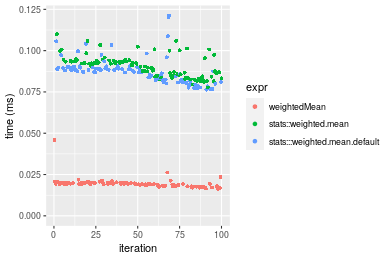

[matrixStats]: Benchmark report

---------------------------------------


# weightedMean() benchmarks

This report benchmark the performance of weightedMean() against alternative methods.

## Alternative methods

* stats::weighted.mean()
* stats:::weighted.mean.default()


## Data type "integer"
### Data
```r
> rvector <- function(n, mode = c("logical", "double", "integer"), range = c(-100, +100), na_prob = 0) {
+     mode <- match.arg(mode)
+     if (mode == "logical") {
+         x <- sample(c(FALSE, TRUE), size = n, replace = TRUE)
+     }     else {
+         x <- runif(n, min = range[1], max = range[2])
+     }
+     storage.mode(x) <- mode
+     if (na_prob > 0) 
+         x[sample(n, size = na_prob * n)] <- NA
+     x
+ }
> rvectors <- function(scale = 10, seed = 1, ...) {
+     set.seed(seed)
+     data <- list()
+     data[[1]] <- rvector(n = scale * 100, ...)
+     data[[2]] <- rvector(n = scale * 1000, ...)
+     data[[3]] <- rvector(n = scale * 10000, ...)
+     data[[4]] <- rvector(n = scale * 1e+05, ...)
+     data[[5]] <- rvector(n = scale * 1e+06, ...)
+     names(data) <- sprintf("n = %d", sapply(data, FUN = length))
+     data
+ }
> data <- rvectors(mode = mode)
> data <- data[1:4]
```

## Results

### n = 1000 vector

```r
> x <- data[["n = 1000"]]
> w <- runif(length(x))
> gc()
           used  (Mb) gc trigger  (Mb) max used  (Mb)
Ncells  5364173 286.5    7916910 422.9  7916910 422.9
Vcells 14781498 112.8   39038428 297.9 94934136 724.3
> stats <- microbenchmark(weightedMean = weightedMean(x, w = w, na.rm = FALSE), `stats::weighted.mean` = weighted.mean(x, 
+     w = w, na.rm = FALSE), `stats:::weighted.mean.default` = weighted.mean.default(x, w = w, na.rm = FALSE), 
+     unit = "ms")
```

_Table: Benchmarking of weightedMean(), stats::weighted.mean() and stats:::weighted.mean.default() on integer+n = 1000 data. The top panel shows times in milliseconds and the bottom panel shows relative times._


|   |expr                          |      min|        lq|      mean|    median|        uq|      max|
|:--|:-----------------------------|--------:|---------:|---------:|---------:|---------:|--------:|
|1  |weightedMean                  | 0.003274| 0.0036255| 0.0040263| 0.0039425| 0.0041750| 0.014959|
|3  |stats:::weighted.mean.default | 0.013181| 0.0138400| 0.0143914| 0.0142245| 0.0146580| 0.017979|
|2  |stats::weighted.mean          | 0.015994| 0.0166495| 0.0178758| 0.0170365| 0.0176105| 0.056818|


|   |expr                          |      min|       lq|     mean|   median|       uq|      max|
|:--|:-----------------------------|--------:|--------:|--------:|--------:|--------:|--------:|
|1  |weightedMean                  | 1.000000| 1.000000| 1.000000| 1.000000| 1.000000| 1.000000|
|3  |stats:::weighted.mean.default | 4.025962| 3.817404| 3.574391| 3.607990| 3.510898| 1.201885|
|2  |stats::weighted.mean          | 4.885156| 4.592332| 4.439814| 4.321243| 4.218084| 3.798249|

_Figure: Benchmarking of weightedMean(), stats::weighted.mean() and stats:::weighted.mean.default() on integer+n = 1000 data.  Outliers are displayed as crosses.  Times are in milliseconds._


### n = 10000 vector

```r
> x <- data[["n = 10000"]]
> w <- runif(length(x))
> gc()
           used  (Mb) gc trigger  (Mb) max used  (Mb)
Ncells  5361948 286.4    7916910 422.9  7916910 422.9
Vcells 10905146  83.2   39038428 297.9 94934136 724.3
> stats <- microbenchmark(weightedMean = weightedMean(x, w = w, na.rm = FALSE), `stats::weighted.mean` = weighted.mean(x, 
+     w = w, na.rm = FALSE), `stats:::weighted.mean.default` = weighted.mean.default(x, w = w, na.rm = FALSE), 
+     unit = "ms")
```

_Table: Benchmarking of weightedMean(), stats::weighted.mean() and stats:::weighted.mean.default() on integer+n = 10000 data. The top panel shows times in milliseconds and the bottom panel shows relative times._


|   |expr                          |      min|        lq|      mean|    median|        uq|      max|
|:--|:-----------------------------|--------:|---------:|---------:|---------:|---------:|--------:|
|1  |weightedMean                  | 0.016096| 0.0179555| 0.0191847| 0.0190670| 0.0197740| 0.038700|
|3  |stats:::weighted.mean.default | 0.082614| 0.0898050| 0.0975589| 0.1001015| 0.1031745| 0.123594|
|2  |stats::weighted.mean          | 0.085836| 0.0925640| 0.1008329| 0.1024425| 0.1054555| 0.132351|


|   |expr                          |      min|       lq|     mean|   median|       uq|      max|
|:--|:-----------------------------|--------:|--------:|--------:|--------:|--------:|--------:|
|1  |weightedMean                  | 1.000000| 1.000000| 1.000000| 1.000000| 1.000000| 1.000000|
|3  |stats:::weighted.mean.default | 5.132580| 5.001532| 5.085243| 5.249987| 5.217685| 3.193643|
|2  |stats::weighted.mean          | 5.332753| 5.155189| 5.255901| 5.372764| 5.333038| 3.419923|

_Figure: Benchmarking of weightedMean(), stats::weighted.mean() and stats:::weighted.mean.default() on integer+n = 10000 data.  Outliers are displayed as crosses.  Times are in milliseconds._


### n = 100000 vector

```r
> x <- data[["n = 100000"]]
> w <- runif(length(x))
> gc()
           used  (Mb) gc trigger  (Mb) max used  (Mb)
Ncells  5362020 286.4    7916910 422.9  7916910 422.9
Vcells 10995706  83.9   39038428 297.9 94934136 724.3
> stats <- microbenchmark(weightedMean = weightedMean(x, w = w, na.rm = FALSE), `stats::weighted.mean` = weighted.mean(x, 
+     w = w, na.rm = FALSE), `stats:::weighted.mean.default` = weighted.mean.default(x, w = w, na.rm = FALSE), 
+     unit = "ms")
```

_Table: Benchmarking of weightedMean(), stats::weighted.mean() and stats:::weighted.mean.default() on integer+n = 100000 data. The top panel shows times in milliseconds and the bottom panel shows relative times._


|   |expr                          |      min|        lq|      mean|    median|        uq|       max|
|:--|:-----------------------------|--------:|---------:|---------:|---------:|---------:|---------:|
|1  |weightedMean                  | 0.114370| 0.1327835| 0.1441276| 0.1381935| 0.1535385|  0.218476|
|2  |stats::weighted.mean          | 0.729577| 0.7686755| 0.9965166| 0.8337565| 1.0613950|  1.684599|
|3  |stats:::weighted.mean.default | 0.705196| 0.7826270| 1.2020826| 0.8345250| 0.9889665| 12.022602|


|   |expr                          |      min|       lq|     mean|   median|       uq|       max|
|:--|:-----------------------------|--------:|--------:|--------:|--------:|--------:|---------:|
|1  |weightedMean                  | 1.000000| 1.000000| 1.000000| 1.000000| 1.000000|  1.000000|
|2  |stats::weighted.mean          | 6.379094| 5.788938| 6.914127| 6.033254| 6.912892|  7.710682|
|3  |stats:::weighted.mean.default | 6.165918| 5.894008| 8.340404| 6.038815| 6.441163| 55.029395|

_Figure: Benchmarking of weightedMean(), stats::weighted.mean() and stats:::weighted.mean.default() on integer+n = 100000 data.  Outliers are displayed as crosses.  Times are in milliseconds._


### n = 1000000 vector

```r
> x <- data[["n = 1000000"]]
> w <- runif(length(x))
> gc()
           used  (Mb) gc trigger  (Mb) max used  (Mb)
Ncells  5362092 286.4    7916910 422.9  7916910 422.9
Vcells 11895755  90.8   39038428 297.9 94934136 724.3
> stats <- microbenchmark(weightedMean = weightedMean(x, w = w, na.rm = FALSE), `stats::weighted.mean` = weighted.mean(x, 
+     w = w, na.rm = FALSE), `stats:::weighted.mean.default` = weighted.mean.default(x, w = w, na.rm = FALSE), 
+     unit = "ms")
```

_Table: Benchmarking of weightedMean(), stats::weighted.mean() and stats:::weighted.mean.default() on integer+n = 1000000 data. The top panel shows times in milliseconds and the bottom panel shows relative times._


|   |expr                          |      min|       lq|      mean|    median|        uq|        max|
|:--|:-----------------------------|--------:|--------:|---------:|---------:|---------:|----------:|
|1  |weightedMean                  | 1.406970| 1.603526|  1.722735|  1.670384|  1.825589|   3.217925|
|3  |stats:::weighted.mean.default | 8.335154| 8.778807| 15.285335|  9.616243| 10.902740| 413.538342|
|2  |stats::weighted.mean          | 8.467202| 9.058531| 12.420607| 10.031783| 16.389574|  32.838298|


|   |expr                          |      min|       lq|     mean|   median|       uq|       max|
|:--|:-----------------------------|--------:|--------:|--------:|--------:|--------:|---------:|
|1  |weightedMean                  | 1.000000| 1.000000| 1.000000| 1.000000| 1.000000|   1.00000|
|3  |stats:::weighted.mean.default | 5.924187| 5.474690| 8.872715| 5.756904| 5.972175| 128.51087|
|2  |stats::weighted.mean          | 6.018040| 5.649133| 7.209820| 6.005673| 8.977688|  10.20481|

_Figure: Benchmarking of weightedMean(), stats::weighted.mean() and stats:::weighted.mean.default() on integer+n = 1000000 data.  Outliers are displayed as crosses.  Times are in milliseconds._


## Data type "double"
### Data
```r
> rvector <- function(n, mode = c("logical", "double", "integer"), range = c(-100, +100), na_prob = 0) {
+     mode <- match.arg(mode)
+     if (mode == "logical") {
+         x <- sample(c(FALSE, TRUE), size = n, replace = TRUE)
+     }     else {
+         x <- runif(n, min = range[1], max = range[2])
+     }
+     storage.mode(x) <- mode
+     if (na_prob > 0) 
+         x[sample(n, size = na_prob * n)] <- NA
+     x
+ }
> rvectors <- function(scale = 10, seed = 1, ...) {
+     set.seed(seed)
+     data <- list()
+     data[[1]] <- rvector(n = scale * 100, ...)
+     data[[2]] <- rvector(n = scale * 1000, ...)
+     data[[3]] <- rvector(n = scale * 10000, ...)
+     data[[4]] <- rvector(n = scale * 1e+05, ...)
+     data[[5]] <- rvector(n = scale * 1e+06, ...)
+     names(data) <- sprintf("n = %d", sapply(data, FUN = length))
+     data
+ }
> data <- rvectors(mode = mode)
> data <- data[1:4]
```

## Results

### n = 1000 vector

```r
> x <- data[["n = 1000"]]
> w <- runif(length(x))
> gc()
           used  (Mb) gc trigger  (Mb) max used  (Mb)
Ncells  5362164 286.4    7916910 422.9  7916910 422.9
Vcells 11452790  87.4   39038428 297.9 94934136 724.3
> stats <- microbenchmark(weightedMean = weightedMean(x, w = w, na.rm = FALSE), `stats::weighted.mean` = weighted.mean(x, 
+     w = w, na.rm = FALSE), `stats:::weighted.mean.default` = weighted.mean.default(x, w = w, na.rm = FALSE), 
+     unit = "ms")
```

_Table: Benchmarking of weightedMean(), stats::weighted.mean() and stats:::weighted.mean.default() on double+n = 1000 data. The top panel shows times in milliseconds and the bottom panel shows relative times._


|   |expr                          |      min|        lq|      mean|    median|        uq|      max|
|:--|:-----------------------------|--------:|---------:|---------:|---------:|---------:|--------:|
|1  |weightedMean                  | 0.003280| 0.0035030| 0.0039449| 0.0038605| 0.0041225| 0.014271|
|3  |stats:::weighted.mean.default | 0.011650| 0.0121230| 0.0125530| 0.0123735| 0.0127780| 0.015866|
|2  |stats::weighted.mean          | 0.014216| 0.0148785| 0.0162031| 0.0153355| 0.0157695| 0.069540|


|   |expr                          |      min|       lq|     mean|   median|       uq|      max|
|:--|:-----------------------------|--------:|--------:|--------:|--------:|--------:|--------:|
|1  |weightedMean                  | 1.000000| 1.000000| 1.000000| 1.000000| 1.000000| 1.000000|
|3  |stats:::weighted.mean.default | 3.551829| 3.460748| 3.182062| 3.205155| 3.099575| 1.111765|
|2  |stats::weighted.mean          | 4.334146| 4.247359| 4.107338| 3.972413| 3.825227| 4.872819|

_Figure: Benchmarking of weightedMean(), stats::weighted.mean() and stats:::weighted.mean.default() on double+n = 1000 data.  Outliers are displayed as crosses.  Times are in milliseconds._


### n = 10000 vector

```r
> x <- data[["n = 10000"]]
> w <- runif(length(x))
> gc()
           used  (Mb) gc trigger  (Mb) max used  (Mb)
Ncells  5362236 286.4    7916910 422.9  7916910 422.9
Vcells 11461837  87.5   39038428 297.9 94934136 724.3
> stats <- microbenchmark(weightedMean = weightedMean(x, w = w, na.rm = FALSE), `stats::weighted.mean` = weighted.mean(x, 
+     w = w, na.rm = FALSE), `stats:::weighted.mean.default` = weighted.mean.default(x, w = w, na.rm = FALSE), 
+     unit = "ms")
```

_Table: Benchmarking of weightedMean(), stats::weighted.mean() and stats:::weighted.mean.default() on double+n = 10000 data. The top panel shows times in milliseconds and the bottom panel shows relative times._


|   |expr                          |      min|        lq|      mean|    median|        uq|      max|
|:--|:-----------------------------|--------:|---------:|---------:|---------:|---------:|--------:|
|1  |weightedMean                  | 0.016451| 0.0183110| 0.0194631| 0.0193665| 0.0198590| 0.045951|
|3  |stats:::weighted.mean.default | 0.076367| 0.0817225| 0.0874114| 0.0874640| 0.0897700| 0.121269|
|2  |stats::weighted.mean          | 0.077437| 0.0846850| 0.0903972| 0.0912690| 0.0938265| 0.109977|


|   |expr                          |      min|       lq|     mean|   median|       uq|      max|
|:--|:-----------------------------|--------:|--------:|--------:|--------:|--------:|--------:|
|1  |weightedMean                  | 1.000000| 1.000000| 1.000000| 1.000000| 1.000000| 1.000000|
|3  |stats:::weighted.mean.default | 4.642089| 4.463028| 4.491125| 4.516252| 4.520369| 2.639094|
|2  |stats::weighted.mean          | 4.707130| 4.624816| 4.644533| 4.712726| 4.724634| 2.393354|

_Figure: Benchmarking of weightedMean(), stats::weighted.mean() and stats:::weighted.mean.default() on double+n = 10000 data.  Outliers are displayed as crosses.  Times are in milliseconds._



### n = 100000 vector

```r
> x <- data[["n = 100000"]]
> w <- runif(length(x))
> gc()
           used  (Mb) gc trigger  (Mb) max used  (Mb)
Ncells  5362308 286.4    7916910 422.9  7916910 422.9
Vcells 11552257  88.2   39038428 297.9 94934136 724.3
> stats <- microbenchmark(weightedMean = weightedMean(x, w = w, na.rm = FALSE), `stats::weighted.mean` = weighted.mean(x, 
+     w = w, na.rm = FALSE), `stats:::weighted.mean.default` = weighted.mean.default(x, w = w, na.rm = FALSE), 
+     unit = "ms")
```

_Table: Benchmarking of weightedMean(), stats::weighted.mean() and stats:::weighted.mean.default() on double+n = 100000 data. The top panel shows times in milliseconds and the bottom panel shows relative times._


|   |expr                          |      min|        lq|      mean|   median|       uq|      max|
|:--|:-----------------------------|--------:|---------:|---------:|--------:|--------:|--------:|
|1  |weightedMean                  | 0.115135| 0.1317750| 0.1427569| 0.138079| 0.147869| 0.249905|
|3  |stats:::weighted.mean.default | 0.608082| 0.6768860| 0.9011484| 0.704362| 0.780388| 8.066233|
|2  |stats::weighted.mean          | 0.596462| 0.6850695| 0.8050036| 0.719753| 0.799573| 1.533540|


|   |expr                          |      min|       lq|     mean|   median|       uq|       max|
|:--|:-----------------------------|--------:|--------:|--------:|--------:|--------:|---------:|
|1  |weightedMean                  | 1.000000| 1.000000| 1.000000| 1.000000| 1.000000|  1.000000|
|3  |stats:::weighted.mean.default | 5.281470| 5.136680| 6.312470| 5.101152| 5.277563| 32.277197|
|2  |stats::weighted.mean          | 5.180545| 5.198782| 5.638984| 5.212617| 5.407306|  6.136492|

_Figure: Benchmarking of weightedMean(), stats::weighted.mean() and stats:::weighted.mean.default() on double+n = 100000 data.  Outliers are displayed as crosses.  Times are in milliseconds._


### n = 1000000 vector

```r
> x <- data[["n = 1000000"]]
> w <- runif(length(x))
> gc()
           used  (Mb) gc trigger  (Mb) max used  (Mb)
Ncells  5362380 286.4    7916910 422.9  7916910 422.9
Vcells 12452692  95.1   39038428 297.9 94934136 724.3
> stats <- microbenchmark(weightedMean = weightedMean(x, w = w, na.rm = FALSE), `stats::weighted.mean` = weighted.mean(x, 
+     w = w, na.rm = FALSE), `stats:::weighted.mean.default` = weighted.mean.default(x, w = w, na.rm = FALSE), 
+     unit = "ms")
```

_Table: Benchmarking of weightedMean(), stats::weighted.mean() and stats:::weighted.mean.default() on double+n = 1000000 data. The top panel shows times in milliseconds and the bottom panel shows relative times._


|   |expr                          |      min|       lq|      mean|   median|        uq|        max|
|:--|:-----------------------------|--------:|--------:|---------:|--------:|---------:|----------:|
|1  |weightedMean                  | 1.565088| 1.716951|  1.815459| 1.782803|  1.900802|   2.440462|
|2  |stats::weighted.mean          | 8.077002| 8.489081| 15.000146| 9.015730| 15.796859| 417.681015|
|3  |stats:::weighted.mean.default | 8.077910| 8.561706| 10.497486| 9.104963| 10.068560|  20.628094|


|   |expr                          |      min|       lq|     mean|   median|       uq|        max|
|:--|:-----------------------------|--------:|--------:|--------:|--------:|--------:|----------:|
|1  |weightedMean                  | 1.000000| 1.000000| 1.000000| 1.000000| 1.000000|   1.000000|
|2  |stats::weighted.mean          | 5.160734| 4.944275| 8.262454| 5.057052| 8.310628| 171.148338|
|3  |stats:::weighted.mean.default | 5.161314| 4.986574| 5.782277| 5.107104| 5.297006|   8.452536|

_Figure: Benchmarking of weightedMean(), stats::weighted.mean() and stats:::weighted.mean.default() on double+n = 1000000 data.  Outliers are displayed as crosses.  Times are in milliseconds._


## Appendix

### Session information
```r
R version 4.1.1 Patched (2021-08-10 r80727)
Platform: x86_64-pc-linux-gnu (64-bit)
Running under: Ubuntu 18.04.5 LTS

Matrix products: default
BLAS:   /home/hb/software/R-devel/R-4-1-branch/lib/R/lib/libRblas.so
LAPACK: /home/hb/software/R-devel/R-4-1-branch/lib/R/lib/libRlapack.so

locale:
 [1] LC_CTYPE=en_US.UTF-8       LC_NUMERIC=C              
 [3] LC_TIME=en_US.UTF-8        LC_COLLATE=en_US.UTF-8    
 [5] LC_MONETARY=en_US.UTF-8    LC_MESSAGES=en_US.UTF-8   
 [7] LC_PAPER=en_US.UTF-8       LC_NAME=C                 
 [9] LC_ADDRESS=C               LC_TELEPHONE=C            
[11] LC_MEASUREMENT=en_US.UTF-8 LC_IDENTIFICATION=C       

attached base packages:
[1] stats     graphics  grDevices utils     datasets  methods   base     

other attached packages:
[1] microbenchmark_1.4-7   matrixStats_0.60.0     ggplot2_3.3.5         
[4] knitr_1.33             R.devices_2.17.0       R.utils_2.10.1        
[7] R.oo_1.24.0            R.methodsS3_1.8.1-9001 history_0.0.1-9000    

loaded via a namespace (and not attached):
 [1] Biobase_2.52.0          httr_1.4.2              splines_4.1.1          
 [4] bit64_4.0.5             network_1.17.1          assertthat_0.2.1       
 [7] highr_0.9               stats4_4.1.1            blob_1.2.2             
[10] GenomeInfoDbData_1.2.6  robustbase_0.93-8       pillar_1.6.2           
[13] RSQLite_2.2.8           lattice_0.20-44         glue_1.4.2             
[16] digest_0.6.27           XVector_0.32.0          colorspace_2.0-2       
[19] Matrix_1.3-4            XML_3.99-0.7            pkgconfig_2.0.3        
[22] zlibbioc_1.38.0         genefilter_1.74.0       purrr_0.3.4            
[25] ergm_4.1.2              xtable_1.8-4            scales_1.1.1           
[28] tibble_3.1.4            annotate_1.70.0         KEGGREST_1.32.0        
[31] farver_2.1.0            generics_0.1.0          IRanges_2.26.0         
[34] ellipsis_0.3.2          cachem_1.0.6            withr_2.4.2            
[37] BiocGenerics_0.38.0     mime_0.11               survival_3.2-13        
[40] magrittr_2.0.1          crayon_1.4.1            statnet.common_4.5.0   
[43] memoise_2.0.0           laeken_0.5.1            fansi_0.5.0            
[46] R.cache_0.15.0          MASS_7.3-54             R.rsp_0.44.0           
[49] progressr_0.8.0         tools_4.1.1             lifecycle_1.0.0        
[52] S4Vectors_0.30.0        trust_0.1-8             munsell_0.5.0          
[55] tabby_0.0.1-9001        AnnotationDbi_1.54.1    Biostrings_2.60.2      
[58] compiler_4.1.1          GenomeInfoDb_1.28.1     rlang_0.4.11           
[61] grid_4.1.1              RCurl_1.98-1.4          cwhmisc_6.6            
[64] rstudioapi_0.13         rappdirs_0.3.3          startup_0.15.0-9000    
[67] labeling_0.4.2          bitops_1.0-7            base64enc_0.1-3        
[70] boot_1.3-28             gtable_0.3.0            DBI_1.1.1              
[73] markdown_1.1            R6_2.5.1                lpSolveAPI_5.5.2.0-17.7
[76] rle_0.9.2               dplyr_1.0.7             fastmap_1.1.0          
[79] bit_4.0.4               utf8_1.2.2              parallel_4.1.1         
[82] Rcpp_1.0.7              vctrs_0.3.8             png_0.1-7              
[85] DEoptimR_1.0-9          tidyselect_1.1.1        xfun_0.25              
[88] coda_0.19-4            
```
Total processing time was 18.03 secs.


### Reproducibility
To reproduce this report, do:
```r
html <- matrixStats:::benchmark('weightedMean')
```

[RSP]: https://cran.r-project.org/package=R.rsp
[matrixStats]: https://cran.r-project.org/package=matrixStats

[StackOverflow:colMins?]: https://stackoverflow.com/questions/13676878 "Stack Overflow: fastest way to get Min from every column in a matrix?"
[StackOverflow:colSds?]: https://stackoverflow.com/questions/17549762 "Stack Overflow: Is there such 'colsd' in R?"
[StackOverflow:rowProds?]: https://stackoverflow.com/questions/20198801/ "Stack Overflow: Row product of matrix and column sum of matrix"

---------------------------------------
Copyright Henrik Bengtsson. Last updated on 2021-08-25 22:52:44 (+0200 UTC). Powered by [RSP].

<script>
 var link = document.createElement('link');
 link.rel = 'icon';
 link.href = "data:image/png;base64,iVBORw0KGgoAAAANSUhEUgAAACAAAAAgCAMAAABEpIrGAAAA21BMVEUAAAAAAP8AAP8AAP8AAP8AAP8AAP8AAP8AAP8AAP8AAP8AAP8AAP8AAP8AAP8AAP8AAP8AAP8AAP8AAP8AAP8AAP8AAP8AAP8AAP8AAP8AAP8AAP8AAP8AAP8AAP8AAP8AAP8AAP8AAP8AAP8AAP8AAP8AAP8AAP8AAP8AAP8BAf4CAv0DA/wdHeIeHuEfH+AgIN8hId4lJdomJtknJ9g+PsE/P8BAQL9yco10dIt1dYp3d4h4eIeVlWqWlmmXl2iYmGeZmWabm2Tn5xjo6Bfp6Rb39wj4+Af//wA2M9hbAAAASXRSTlMAAQIJCgsMJSYnKD4/QGRlZmhpamtsbautrrCxuru8y8zN5ebn6Pn6+///////////////////////////////////////////LsUNcQAAAS9JREFUOI29k21XgkAQhVcFytdSMqMETU26UVqGmpaiFbL//xc1cAhhwVNf6n5i5z67M2dmYOyfJZUqlVLhkKucG7cgmUZTybDz6g0iDeq51PUr37Ds2cy2/C9NeES5puDjxuUk1xnToZsg8pfA3avHQ3lLIi7iWRrkv/OYtkScxBIMgDee0ALoyxHQBJ68JLCjOtQIMIANF7QG9G9fNnHvisCHBVMKgSJgiz7nE+AoBKrAPA3MgepvgR9TSCasrCKH0eB1wBGBFdCO+nAGjMVGPcQb5bd6mQRegN6+1axOs9nGfYcCtfi4NQosdtH7dB+txFIpXQqN1p9B/asRHToyS0jRgpV7nk4nwcq1BJ+x3Gl/v7S9Wmpp/aGquum7w3ZDyrADFYrl8vHBH+ev9AUASW1dmU4h4wAAAABJRU5ErkJggg=="
 document.getElementsByTagName('head')[0].appendChild(link);
</script>


