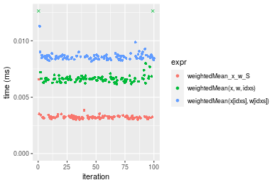
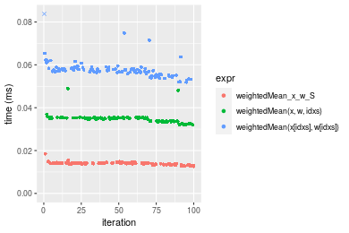
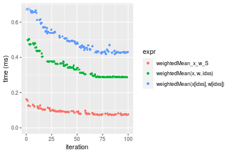
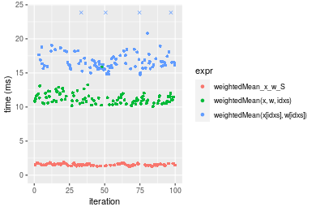
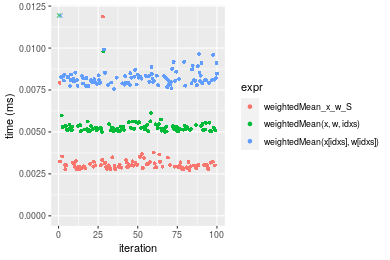
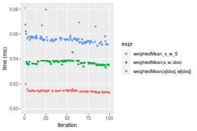
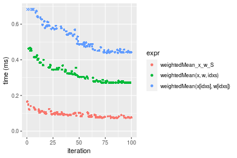
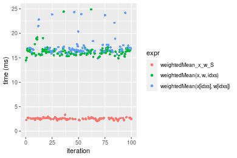

[matrixStats]: Benchmark report

---------------------------------------


# weightedMean() benchmarks on subsetted computation

This report benchmark the performance of weightedMean() on subsetted computation.


## Data type "integer"
### Data
```r
> rvector <- function(n, mode = c("logical", "double", "integer"), range = c(-100, +100), na_prob = 0) {
+     mode <- match.arg(mode)
+     if (mode == "logical") {
+         x <- sample(c(FALSE, TRUE), size = n, replace = TRUE)
+     }     else {
+         x <- runif(n, min = range[1], max = range[2])
+     }
+     storage.mode(x) <- mode
+     if (na_prob > 0) 
+         x[sample(n, size = na_prob * n)] <- NA
+     x
+ }
> rvectors <- function(scale = 10, seed = 1, ...) {
+     set.seed(seed)
+     data <- list()
+     data[[1]] <- rvector(n = scale * 100, ...)
+     data[[2]] <- rvector(n = scale * 1000, ...)
+     data[[3]] <- rvector(n = scale * 10000, ...)
+     data[[4]] <- rvector(n = scale * 1e+05, ...)
+     data[[5]] <- rvector(n = scale * 1e+06, ...)
+     names(data) <- sprintf("n = %d", sapply(data, FUN = length))
+     data
+ }
> data <- rvectors(mode = mode)
> data <- data[1:4]
```

## Results

### n = 1000 vector


```r
> x <- data[["n = 1000"]]
> idxs <- sample.int(length(x), size = length(x) * 0.7)
> x_S <- x[idxs]
> w <- runif(length(x))
> w_S <- w[idxs]
> gc()
           used  (Mb) gc trigger  (Mb) max used  (Mb)
Ncells  5364362 286.5    7916910 422.9  7916910 422.9
Vcells 12034510  91.9   39038428 297.9 94934136 724.3
> stats <- microbenchmark(weightedMean_x_w_S = weightedMean(x_S, w = w_S, na.rm = FALSE), `weightedMean(x, w, idxs)` = weightedMean(x, 
+     w = w, idxs = idxs, na.rm = FALSE), `weightedMean(x[idxs], w[idxs])` = weightedMean(x[idxs], 
+     w = w[idxs], na.rm = FALSE), unit = "ms")
```

_Table: Benchmarking of weightedMean_x_w_S(), weightedMean(x, w, idxs)() and weightedMean(x[idxs], w[idxs])() on integer+n = 1000 data. The top panel shows times in milliseconds and the bottom panel shows relative times._


|   |expr                           |      min|        lq|      mean|    median|        uq|      max|
|:--|:------------------------------|--------:|---------:|---------:|---------:|---------:|--------:|
|1  |weightedMean_x_w_S             | 0.002821| 0.0029570| 0.0031039| 0.0030480| 0.0031595| 0.007110|
|2  |weightedMean(x, w, idxs)       | 0.005202| 0.0053205| 0.0066958| 0.0054110| 0.0055410| 0.129686|
|3  |weightedMean(x[idxs], w[idxs]) | 0.008130| 0.0084415| 0.0086508| 0.0085765| 0.0087490| 0.013860|


|   |expr                           |      min|       lq|     mean|   median|       uq|       max|
|:--|:------------------------------|--------:|--------:|--------:|--------:|--------:|---------:|
|1  |weightedMean_x_w_S             | 1.000000| 1.000000| 1.000000| 1.000000| 1.000000|  1.000000|
|2  |weightedMean(x, w, idxs)       | 1.844027| 1.799290| 2.157201| 1.775262| 1.753758| 18.239944|
|3  |weightedMean(x[idxs], w[idxs]) | 2.881957| 2.854751| 2.787031| 2.813812| 2.769109|  1.949367|

_Figure: Benchmarking of weightedMean_x_w_S(), weightedMean(x, w, idxs)() and weightedMean(x[idxs], w[idxs])() on integer+n = 1000 data.  Outliers are displayed as crosses.  Times are in milliseconds._



### n = 10000 vector


```r
> x <- data[["n = 10000"]]
> idxs <- sample.int(length(x), size = length(x) * 0.7)
> x_S <- x[idxs]
> w <- runif(length(x))
> w_S <- w[idxs]
> gc()
           used  (Mb) gc trigger  (Mb) max used  (Mb)
Ncells  5361363 286.4    7916910 422.9  7916910 422.9
Vcells 10918644  83.4   39038428 297.9 94934136 724.3
> stats <- microbenchmark(weightedMean_x_w_S = weightedMean(x_S, w = w_S, na.rm = FALSE), `weightedMean(x, w, idxs)` = weightedMean(x, 
+     w = w, idxs = idxs, na.rm = FALSE), `weightedMean(x[idxs], w[idxs])` = weightedMean(x[idxs], 
+     w = w[idxs], na.rm = FALSE), unit = "ms")
```

_Table: Benchmarking of weightedMean_x_w_S(), weightedMean(x, w, idxs)() and weightedMean(x[idxs], w[idxs])() on integer+n = 10000 data. The top panel shows times in milliseconds and the bottom panel shows relative times._


|   |expr                           |      min|        lq|      mean|    median|        uq|      max|
|:--|:------------------------------|--------:|---------:|---------:|---------:|---------:|--------:|
|1  |weightedMean_x_w_S             | 0.012654| 0.0135785| 0.0139364| 0.0140310| 0.0142200| 0.018458|
|2  |weightedMean(x, w, idxs)       | 0.031982| 0.0338120| 0.0348139| 0.0349095| 0.0352880| 0.048945|
|3  |weightedMean(x[idxs], w[idxs]) | 0.051941| 0.0558815| 0.0579876| 0.0573350| 0.0582205| 0.111312|


|   |expr                           |      min|       lq|     mean|   median|       uq|      max|
|:--|:------------------------------|--------:|--------:|--------:|--------:|--------:|--------:|
|1  |weightedMean_x_w_S             | 1.000000| 1.000000| 1.000000| 1.000000| 1.000000| 1.000000|
|2  |weightedMean(x, w, idxs)       | 2.527422| 2.490113| 2.498053| 2.488027| 2.481575| 2.651696|
|3  |weightedMean(x[idxs], w[idxs]) | 4.104710| 4.115440| 4.160875| 4.086309| 4.094269| 6.030556|

_Figure: Benchmarking of weightedMean_x_w_S(), weightedMean(x, w, idxs)() and weightedMean(x[idxs], w[idxs])() on integer+n = 10000 data.  Outliers are displayed as crosses.  Times are in milliseconds._



### n = 100000 vector


```r
> x <- data[["n = 100000"]]
> idxs <- sample.int(length(x), size = length(x) * 0.7)
> x_S <- x[idxs]
> w <- runif(length(x))
> w_S <- w[idxs]
> gc()
           used  (Mb) gc trigger  (Mb) max used  (Mb)
Ncells  5361435 286.4    7916910 422.9  7916910 422.9
Vcells 11135204  85.0   39038428 297.9 94934136 724.3
> stats <- microbenchmark(weightedMean_x_w_S = weightedMean(x_S, w = w_S, na.rm = FALSE), `weightedMean(x, w, idxs)` = weightedMean(x, 
+     w = w, idxs = idxs, na.rm = FALSE), `weightedMean(x[idxs], w[idxs])` = weightedMean(x[idxs], 
+     w = w[idxs], na.rm = FALSE), unit = "ms")
```

_Table: Benchmarking of weightedMean_x_w_S(), weightedMean(x, w, idxs)() and weightedMean(x[idxs], w[idxs])() on integer+n = 100000 data. The top panel shows times in milliseconds and the bottom panel shows relative times._


|   |expr                           |      min|        lq|      mean|    median|        uq|      max|
|:--|:------------------------------|--------:|---------:|---------:|---------:|---------:|--------:|
|1  |weightedMean_x_w_S             | 0.073923| 0.0765635| 0.0912346| 0.0899155| 0.0970435| 0.161012|
|2  |weightedMean(x, w, idxs)       | 0.287454| 0.2879120| 0.3420530| 0.3307135| 0.3759950| 0.502973|
|3  |weightedMean(x[idxs], w[idxs]) | 0.418547| 0.4328960| 0.5059765| 0.4798890| 0.5474805| 0.950473|


|   |expr                           |      min|       lq|     mean|   median|       uq|      max|
|:--|:------------------------------|--------:|--------:|--------:|--------:|--------:|--------:|
|1  |weightedMean_x_w_S             | 1.000000| 1.000000| 1.000000| 1.000000| 1.000000| 1.000000|
|2  |weightedMean(x, w, idxs)       | 3.888560| 3.760434| 3.749157| 3.678048| 3.874500| 3.123823|
|3  |weightedMean(x[idxs], w[idxs]) | 5.661932| 5.654078| 5.545881| 5.337111| 5.641599| 5.903119|

_Figure: Benchmarking of weightedMean_x_w_S(), weightedMean(x, w, idxs)() and weightedMean(x[idxs], w[idxs])() on integer+n = 100000 data.  Outliers are displayed as crosses.  Times are in milliseconds._



### n = 1000000 vector


```r
> x <- data[["n = 1000000"]]
> idxs <- sample.int(length(x), size = length(x) * 0.7)
> x_S <- x[idxs]
> w <- runif(length(x))
> w_S <- w[idxs]
> gc()
           used  (Mb) gc trigger  (Mb) max used  (Mb)
Ncells  5361507 286.4    7916910 422.9  7916910 422.9
Vcells 13295253 101.5   39038428 297.9 94934136 724.3
> stats <- microbenchmark(weightedMean_x_w_S = weightedMean(x_S, w = w_S, na.rm = FALSE), `weightedMean(x, w, idxs)` = weightedMean(x, 
+     w = w, idxs = idxs, na.rm = FALSE), `weightedMean(x[idxs], w[idxs])` = weightedMean(x[idxs], 
+     w = w[idxs], na.rm = FALSE), unit = "ms")
```

_Table: Benchmarking of weightedMean_x_w_S(), weightedMean(x, w, idxs)() and weightedMean(x[idxs], w[idxs])() on integer+n = 1000000 data. The top panel shows times in milliseconds and the bottom panel shows relative times._


|   |expr                           |       min|        lq|      mean|    median|        uq|      max|
|:--|:------------------------------|---------:|---------:|---------:|---------:|---------:|--------:|
|1  |weightedMean_x_w_S             |  1.286749|  1.427382|  1.535879|  1.527029|  1.654472|  1.88446|
|2  |weightedMean(x, w, idxs)       | 10.074159| 10.625079| 11.300622| 11.087812| 11.680366| 15.90543|
|3  |weightedMean(x[idxs], w[idxs]) | 14.757923| 15.847532| 17.258122| 16.399470| 17.400435| 37.19970|


|   |expr                           |       min|       lq|      mean|    median|        uq|       max|
|:--|:------------------------------|---------:|--------:|---------:|---------:|---------:|---------:|
|1  |weightedMean_x_w_S             |  1.000000|  1.00000|  1.000000|  1.000000|  1.000000|  1.000000|
|2  |weightedMean(x, w, idxs)       |  7.829156|  7.44375|  7.357755|  7.261036|  7.059876|  8.440312|
|3  |weightedMean(x[idxs], w[idxs]) | 11.469154| 11.10251| 11.236641| 10.739462| 10.517213| 19.740245|

_Figure: Benchmarking of weightedMean_x_w_S(), weightedMean(x, w, idxs)() and weightedMean(x[idxs], w[idxs])() on integer+n = 1000000 data.  Outliers are displayed as crosses.  Times are in milliseconds._




## Data type "double"
### Data
```r
> rvector <- function(n, mode = c("logical", "double", "integer"), range = c(-100, +100), na_prob = 0) {
+     mode <- match.arg(mode)
+     if (mode == "logical") {
+         x <- sample(c(FALSE, TRUE), size = n, replace = TRUE)
+     }     else {
+         x <- runif(n, min = range[1], max = range[2])
+     }
+     storage.mode(x) <- mode
+     if (na_prob > 0) 
+         x[sample(n, size = na_prob * n)] <- NA
+     x
+ }
> rvectors <- function(scale = 10, seed = 1, ...) {
+     set.seed(seed)
+     data <- list()
+     data[[1]] <- rvector(n = scale * 100, ...)
+     data[[2]] <- rvector(n = scale * 1000, ...)
+     data[[3]] <- rvector(n = scale * 10000, ...)
+     data[[4]] <- rvector(n = scale * 1e+05, ...)
+     data[[5]] <- rvector(n = scale * 1e+06, ...)
+     names(data) <- sprintf("n = %d", sapply(data, FUN = length))
+     data
+ }
> data <- rvectors(mode = mode)
> data <- data[1:4]
```

## Results

### n = 1000 vector


```r
> x <- data[["n = 1000"]]
> idxs <- sample.int(length(x), size = length(x) * 0.7)
> x_S <- x[idxs]
> w <- runif(length(x))
> w_S <- w[idxs]
> gc()
           used  (Mb) gc trigger  (Mb) max used  (Mb)
Ncells  5361588 286.4    7916910 422.9  7916910 422.9
Vcells 11454142  87.4   39038428 297.9 94934136 724.3
> stats <- microbenchmark(weightedMean_x_w_S = weightedMean(x_S, w = w_S, na.rm = FALSE), `weightedMean(x, w, idxs)` = weightedMean(x, 
+     w = w, idxs = idxs, na.rm = FALSE), `weightedMean(x[idxs], w[idxs])` = weightedMean(x[idxs], 
+     w = w[idxs], na.rm = FALSE), unit = "ms")
```

_Table: Benchmarking of weightedMean_x_w_S(), weightedMean(x, w, idxs)() and weightedMean(x[idxs], w[idxs])() on double+n = 1000 data. The top panel shows times in milliseconds and the bottom panel shows relative times._


|   |expr                           |      min|        lq|      mean|    median|        uq|      max|
|:--|:------------------------------|--------:|---------:|---------:|---------:|---------:|--------:|
|1  |weightedMean_x_w_S             | 0.002738| 0.0028760| 0.0031660| 0.0029950| 0.0031620| 0.011875|
|2  |weightedMean(x, w, idxs)       | 0.005010| 0.0051085| 0.0056244| 0.0052010| 0.0053665| 0.037112|
|3  |weightedMean(x[idxs], w[idxs]) | 0.007567| 0.0079210| 0.0082990| 0.0081335| 0.0083645| 0.015526|


|   |expr                           |      min|       lq|     mean|   median|       uq|      max|
|:--|:------------------------------|--------:|--------:|--------:|--------:|--------:|--------:|
|1  |weightedMean_x_w_S             | 1.000000| 1.000000| 1.000000| 1.000000| 1.000000| 1.000000|
|2  |weightedMean(x, w, idxs)       | 1.829803| 1.776252| 1.776524| 1.736561| 1.697185| 3.125221|
|3  |weightedMean(x[idxs], w[idxs]) | 2.763696| 2.754173| 2.621312| 2.715693| 2.645319| 1.307453|

_Figure: Benchmarking of weightedMean_x_w_S(), weightedMean(x, w, idxs)() and weightedMean(x[idxs], w[idxs])() on double+n = 1000 data.  Outliers are displayed as crosses.  Times are in milliseconds._



### n = 10000 vector


```r
> x <- data[["n = 10000"]]
> idxs <- sample.int(length(x), size = length(x) * 0.7)
> x_S <- x[idxs]
> w <- runif(length(x))
> w_S <- w[idxs]
> gc()
           used  (Mb) gc trigger  (Mb) max used  (Mb)
Ncells  5361651 286.4    7916910 422.9  7916910 422.9
Vcells 11479244  87.6   39038428 297.9 94934136 724.3
> stats <- microbenchmark(weightedMean_x_w_S = weightedMean(x_S, w = w_S, na.rm = FALSE), `weightedMean(x, w, idxs)` = weightedMean(x, 
+     w = w, idxs = idxs, na.rm = FALSE), `weightedMean(x[idxs], w[idxs])` = weightedMean(x[idxs], 
+     w = w[idxs], na.rm = FALSE), unit = "ms")
```

_Table: Benchmarking of weightedMean_x_w_S(), weightedMean(x, w, idxs)() and weightedMean(x[idxs], w[idxs])() on double+n = 10000 data. The top panel shows times in milliseconds and the bottom panel shows relative times._


|   |expr                           |      min|        lq|      mean|   median|        uq|      max|
|:--|:------------------------------|--------:|---------:|---------:|--------:|---------:|--------:|
|1  |weightedMean_x_w_S             | 0.012747| 0.0136515| 0.0141336| 0.014172| 0.0144765| 0.019885|
|2  |weightedMean(x, w, idxs)       | 0.033253| 0.0359785| 0.0370993| 0.037671| 0.0381220| 0.045359|
|3  |weightedMean(x[idxs], w[idxs]) | 0.050475| 0.0540690| 0.0565772| 0.055710| 0.0570075| 0.105376|


|   |expr                           |      min|       lq|     mean|   median|       uq|      max|
|:--|:------------------------------|--------:|--------:|--------:|--------:|--------:|--------:|
|1  |weightedMean_x_w_S             | 1.000000| 1.000000| 1.000000| 1.000000| 1.000000| 1.000000|
|2  |weightedMean(x, w, idxs)       | 2.608692| 2.635498| 2.624899| 2.658129| 2.633371| 2.281066|
|3  |weightedMean(x[idxs], w[idxs]) | 3.959755| 3.960664| 4.003024| 3.930991| 3.937934| 5.299271|

_Figure: Benchmarking of weightedMean_x_w_S(), weightedMean(x, w, idxs)() and weightedMean(x[idxs], w[idxs])() on double+n = 10000 data.  Outliers are displayed as crosses.  Times are in milliseconds._



### n = 100000 vector


```r
> x <- data[["n = 100000"]]
> idxs <- sample.int(length(x), size = length(x) * 0.7)
> x_S <- x[idxs]
> w <- runif(length(x))
> w_S <- w[idxs]
> gc()
           used  (Mb) gc trigger  (Mb) max used  (Mb)
Ncells  5361723 286.4    7916910 422.9  7916910 422.9
Vcells 11726792  89.5   39038428 297.9 94934136 724.3
> stats <- microbenchmark(weightedMean_x_w_S = weightedMean(x_S, w = w_S, na.rm = FALSE), `weightedMean(x, w, idxs)` = weightedMean(x, 
+     w = w, idxs = idxs, na.rm = FALSE), `weightedMean(x[idxs], w[idxs])` = weightedMean(x[idxs], 
+     w = w[idxs], na.rm = FALSE), unit = "ms")
```

_Table: Benchmarking of weightedMean_x_w_S(), weightedMean(x, w, idxs)() and weightedMean(x[idxs], w[idxs])() on double+n = 100000 data. The top panel shows times in milliseconds and the bottom panel shows relative times._


|   |expr                           |      min|        lq|      mean|    median|        uq|      max|
|:--|:------------------------------|--------:|---------:|---------:|---------:|---------:|--------:|
|1  |weightedMean_x_w_S             | 0.074574| 0.0777810| 0.0933247| 0.0911825| 0.1018505| 0.166096|
|2  |weightedMean(x, w, idxs)       | 0.271479| 0.2733125| 0.3220694| 0.3048190| 0.3491850| 0.466553|
|3  |weightedMean(x[idxs], w[idxs]) | 0.439524| 0.4530610| 0.5358237| 0.4976995| 0.5902920| 1.086346|


|   |expr                           |      min|       lq|     mean|   median|       uq|      max|
|:--|:------------------------------|--------:|--------:|--------:|--------:|--------:|--------:|
|1  |weightedMean_x_w_S             | 1.000000| 1.000000| 1.000000| 1.000000| 1.000000| 1.000000|
|2  |weightedMean(x, w, idxs)       | 3.640398| 3.513872| 3.451062| 3.342955| 3.428407| 2.808936|
|3  |weightedMean(x[idxs], w[idxs]) | 5.893797| 5.824829| 5.741498| 5.458279| 5.795671| 6.540471|

_Figure: Benchmarking of weightedMean_x_w_S(), weightedMean(x, w, idxs)() and weightedMean(x[idxs], w[idxs])() on double+n = 100000 data.  Outliers are displayed as crosses.  Times are in milliseconds._



### n = 1000000 vector


```r
> x <- data[["n = 1000000"]]
> idxs <- sample.int(length(x), size = length(x) * 0.7)
> x_S <- x[idxs]
> w <- runif(length(x))
> w_S <- w[idxs]
> gc()
           used  (Mb) gc trigger  (Mb) max used  (Mb)
Ncells  5361795 286.4    7916910 422.9  7916910 422.9
Vcells 14202252 108.4   39038428 297.9 94934136 724.3
> stats <- microbenchmark(weightedMean_x_w_S = weightedMean(x_S, w = w_S, na.rm = FALSE), `weightedMean(x, w, idxs)` = weightedMean(x, 
+     w = w, idxs = idxs, na.rm = FALSE), `weightedMean(x[idxs], w[idxs])` = weightedMean(x[idxs], 
+     w = w[idxs], na.rm = FALSE), unit = "ms")
```

_Table: Benchmarking of weightedMean_x_w_S(), weightedMean(x, w, idxs)() and weightedMean(x[idxs], w[idxs])() on double+n = 1000000 data. The top panel shows times in milliseconds and the bottom panel shows relative times._


|   |expr                           |       min|       lq|      mean|    median|        uq|       max|
|:--|:------------------------------|---------:|--------:|---------:|---------:|---------:|---------:|
|1  |weightedMean_x_w_S             |  1.511921|  1.84086|  1.912257|  1.941781|  1.981162|  2.531397|
|2  |weightedMean(x, w, idxs)       | 13.814567| 14.64531| 15.219553| 15.139641| 15.541518| 19.309926|
|3  |weightedMean(x[idxs], w[idxs]) | 15.237176| 16.49040| 18.206407| 16.900016| 17.856372| 26.186519|


|   |expr                           |       min|       lq|     mean|   median|       uq|      max|
|:--|:------------------------------|---------:|--------:|--------:|--------:|--------:|--------:|
|1  |weightedMean_x_w_S             |  1.000000| 1.000000| 1.000000| 1.000000| 1.000000|  1.00000|
|2  |weightedMean(x, w, idxs)       |  9.137096| 7.955688| 7.958947| 7.796781| 7.844646|  7.62817|
|3  |weightedMean(x[idxs], w[idxs]) | 10.078024| 8.957985| 9.520899| 8.703359| 9.013078| 10.34469|

_Figure: Benchmarking of weightedMean_x_w_S(), weightedMean(x, w, idxs)() and weightedMean(x[idxs], w[idxs])() on double+n = 1000000 data.  Outliers are displayed as crosses.  Times are in milliseconds._




## Appendix

### Session information
```r
R version 4.1.1 Patched (2021-08-10 r80727)
Platform: x86_64-pc-linux-gnu (64-bit)
Running under: Ubuntu 18.04.5 LTS

Matrix products: default
BLAS:   /home/hb/software/R-devel/R-4-1-branch/lib/R/lib/libRblas.so
LAPACK: /home/hb/software/R-devel/R-4-1-branch/lib/R/lib/libRlapack.so

locale:
 [1] LC_CTYPE=en_US.UTF-8       LC_NUMERIC=C              
 [3] LC_TIME=en_US.UTF-8        LC_COLLATE=en_US.UTF-8    
 [5] LC_MONETARY=en_US.UTF-8    LC_MESSAGES=en_US.UTF-8   
 [7] LC_PAPER=en_US.UTF-8       LC_NAME=C                 
 [9] LC_ADDRESS=C               LC_TELEPHONE=C            
[11] LC_MEASUREMENT=en_US.UTF-8 LC_IDENTIFICATION=C       

attached base packages:
[1] stats     graphics  grDevices utils     datasets  methods   base     

other attached packages:
[1] microbenchmark_1.4-7   matrixStats_0.60.0     ggplot2_3.3.5         
[4] knitr_1.33             R.devices_2.17.0       R.utils_2.10.1        
[7] R.oo_1.24.0            R.methodsS3_1.8.1-9001 history_0.0.1-9000    

loaded via a namespace (and not attached):
 [1] Biobase_2.52.0          httr_1.4.2              splines_4.1.1          
 [4] bit64_4.0.5             network_1.17.1          assertthat_0.2.1       
 [7] highr_0.9               stats4_4.1.1            blob_1.2.2             
[10] GenomeInfoDbData_1.2.6  robustbase_0.93-8       pillar_1.6.2           
[13] RSQLite_2.2.8           lattice_0.20-44         glue_1.4.2             
[16] digest_0.6.27           XVector_0.32.0          colorspace_2.0-2       
[19] Matrix_1.3-4            XML_3.99-0.7            pkgconfig_2.0.3        
[22] zlibbioc_1.38.0         genefilter_1.74.0       purrr_0.3.4            
[25] ergm_4.1.2              xtable_1.8-4            scales_1.1.1           
[28] tibble_3.1.4            annotate_1.70.0         KEGGREST_1.32.0        
[31] farver_2.1.0            generics_0.1.0          IRanges_2.26.0         
[34] ellipsis_0.3.2          cachem_1.0.6            withr_2.4.2            
[37] BiocGenerics_0.38.0     mime_0.11               survival_3.2-13        
[40] magrittr_2.0.1          crayon_1.4.1            statnet.common_4.5.0   
[43] memoise_2.0.0           laeken_0.5.1            fansi_0.5.0            
[46] R.cache_0.15.0          MASS_7.3-54             R.rsp_0.44.0           
[49] progressr_0.8.0         tools_4.1.1             lifecycle_1.0.0        
[52] S4Vectors_0.30.0        trust_0.1-8             munsell_0.5.0          
[55] tabby_0.0.1-9001        AnnotationDbi_1.54.1    Biostrings_2.60.2      
[58] compiler_4.1.1          GenomeInfoDb_1.28.1     rlang_0.4.11           
[61] grid_4.1.1              RCurl_1.98-1.4          cwhmisc_6.6            
[64] rstudioapi_0.13         rappdirs_0.3.3          startup_0.15.0-9000    
[67] labeling_0.4.2          bitops_1.0-7            base64enc_0.1-3        
[70] boot_1.3-28             gtable_0.3.0            DBI_1.1.1              
[73] markdown_1.1            R6_2.5.1                lpSolveAPI_5.5.2.0-17.7
[76] rle_0.9.2               dplyr_1.0.7             fastmap_1.1.0          
[79] bit_4.0.4               utf8_1.2.2              parallel_4.1.1         
[82] Rcpp_1.0.7              vctrs_0.3.8             png_0.1-7              
[85] DEoptimR_1.0-9          tidyselect_1.1.1        xfun_0.25              
[88] coda_0.19-4            
```
Total processing time was 15.39 secs.


### Reproducibility
To reproduce this report, do:
```r
html <- matrixStats:::benchmark('weightedMean_subset')
```

[RSP]: https://cran.r-project.org/package=R.rsp
[matrixStats]: https://cran.r-project.org/package=matrixStats

[StackOverflow:colMins?]: https://stackoverflow.com/questions/13676878 "Stack Overflow: fastest way to get Min from every column in a matrix?"
[StackOverflow:colSds?]: https://stackoverflow.com/questions/17549762 "Stack Overflow: Is there such 'colsd' in R?"
[StackOverflow:rowProds?]: https://stackoverflow.com/questions/20198801/ "Stack Overflow: Row product of matrix and column sum of matrix"

---------------------------------------
Copyright Dongcan Jiang. Last updated on 2021-08-25 22:52:24 (+0200 UTC). Powered by [RSP].

<script>
 var link = document.createElement('link');
 link.rel = 'icon';
 link.href = "data:image/png;base64,iVBORw0KGgoAAAANSUhEUgAAACAAAAAgCAMAAABEpIrGAAAA21BMVEUAAAAAAP8AAP8AAP8AAP8AAP8AAP8AAP8AAP8AAP8AAP8AAP8AAP8AAP8AAP8AAP8AAP8AAP8AAP8AAP8AAP8AAP8AAP8AAP8AAP8AAP8AAP8AAP8AAP8AAP8AAP8AAP8AAP8AAP8AAP8AAP8AAP8AAP8AAP8AAP8AAP8AAP8BAf4CAv0DA/wdHeIeHuEfH+AgIN8hId4lJdomJtknJ9g+PsE/P8BAQL9yco10dIt1dYp3d4h4eIeVlWqWlmmXl2iYmGeZmWabm2Tn5xjo6Bfp6Rb39wj4+Af//wA2M9hbAAAASXRSTlMAAQIJCgsMJSYnKD4/QGRlZmhpamtsbautrrCxuru8y8zN5ebn6Pn6+///////////////////////////////////////////LsUNcQAAAS9JREFUOI29k21XgkAQhVcFytdSMqMETU26UVqGmpaiFbL//xc1cAhhwVNf6n5i5z67M2dmYOyfJZUqlVLhkKucG7cgmUZTybDz6g0iDeq51PUr37Ds2cy2/C9NeES5puDjxuUk1xnToZsg8pfA3avHQ3lLIi7iWRrkv/OYtkScxBIMgDee0ALoyxHQBJ68JLCjOtQIMIANF7QG9G9fNnHvisCHBVMKgSJgiz7nE+AoBKrAPA3MgepvgR9TSCasrCKH0eB1wBGBFdCO+nAGjMVGPcQb5bd6mQRegN6+1axOs9nGfYcCtfi4NQosdtH7dB+txFIpXQqN1p9B/asRHToyS0jRgpV7nk4nwcq1BJ+x3Gl/v7S9Wmpp/aGquum7w3ZDyrADFYrl8vHBH+ev9AUASW1dmU4h4wAAAABJRU5ErkJggg=="
 document.getElementsByTagName('head')[0].appendChild(link);
</script>


