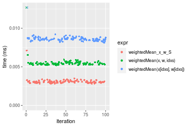
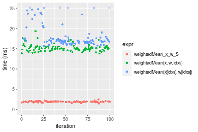

[matrixStats]: Benchmark report

---------------------------------------


# weightedMean() benchmarks on subsetted computation

This report benchmark the performance of weightedMean() on subsetted computation.


## Data type "integer"
### Data
```r
> rvector <- function(n, mode = c("logical", "double", "integer"), range = c(-100, +100), na_prob = 0) {
+     mode <- match.arg(mode)
+     if (mode == "logical") {
+         x <- sample(c(FALSE, TRUE), size = n, replace = TRUE)
+     }     else {
+         x <- runif(n, min = range[1], max = range[2])
+     }
+     storage.mode(x) <- mode
+     if (na_prob > 0) 
+         x[sample(n, size = na_prob * n)] <- NA
+     x
+ }
> rvectors <- function(scale = 10, seed = 1, ...) {
+     set.seed(seed)
+     data <- list()
+     data[[1]] <- rvector(n = scale * 100, ...)
+     data[[2]] <- rvector(n = scale * 1000, ...)
+     data[[3]] <- rvector(n = scale * 10000, ...)
+     data[[4]] <- rvector(n = scale * 1e+05, ...)
+     data[[5]] <- rvector(n = scale * 1e+06, ...)
+     names(data) <- sprintf("n = %d", sapply(data, FUN = length))
+     data
+ }
> data <- rvectors(mode = mode)
> data <- data[1:4]
```

## Results

### n = 1000 vector


```r
> x <- data[["n = 1000"]]
> idxs <- sample.int(length(x), size = length(x) * 0.7)
> x_S <- x[idxs]
> w <- runif(length(x))
> w_S <- w[idxs]
> gc()
           used  (Mb) gc trigger  (Mb) max used  (Mb)
Ncells  5297702 283.0   10014072 534.9 10014072 534.9
Vcells 11559610  88.2   36267018 276.7 90959857 694.0
> stats <- microbenchmark(weightedMean_x_w_S = weightedMean(x_S, w = w_S, na.rm = FALSE), `weightedMean(x, w, idxs)` = weightedMean(x, 
+     w = w, idxs = idxs, na.rm = FALSE), `weightedMean(x[idxs], w[idxs])` = weightedMean(x[idxs], 
+     w = w[idxs], na.rm = FALSE), unit = "ms")
```

_Table: Benchmarking of weightedMean_x_w_S(), weightedMean(x, w, idxs)() and weightedMean(x[idxs], w[idxs])() on integer+n = 1000 data. The top panel shows times in milliseconds and the bottom panel shows relative times._


|   |expr                           |      min|        lq|      mean|    median|       uq|      max|
|:--|:------------------------------|--------:|---------:|---------:|---------:|--------:|--------:|
|1  |weightedMean_x_w_S             | 0.003030| 0.0031275| 0.0032509| 0.0032060| 0.003281| 0.006580|
|2  |weightedMean(x, w, idxs)       | 0.006169| 0.0064330| 0.0077900| 0.0066195| 0.006726| 0.109390|
|3  |weightedMean(x[idxs], w[idxs]) | 0.008178| 0.0084105| 0.0085985| 0.0085505| 0.008666| 0.011293|


|   |expr                           |      min|       lq|     mean|   median|       uq|       max|
|:--|:------------------------------|--------:|--------:|--------:|--------:|--------:|---------:|
|1  |weightedMean_x_w_S             | 1.000000| 1.000000| 1.000000| 1.000000| 1.000000|  1.000000|
|2  |weightedMean(x, w, idxs)       | 2.035974| 2.056914| 2.396230| 2.064722| 2.049985| 16.624620|
|3  |weightedMean(x[idxs], w[idxs]) | 2.699010| 2.689209| 2.644918| 2.667031| 2.641268|  1.716261|

_Figure: Benchmarking of weightedMean_x_w_S(), weightedMean(x, w, idxs)() and weightedMean(x[idxs], w[idxs])() on integer+n = 1000 data.  Outliers are displayed as crosses.  Times are in milliseconds._



### n = 10000 vector


```r
> x <- data[["n = 10000"]]
> idxs <- sample.int(length(x), size = length(x) * 0.7)
> x_S <- x[idxs]
> w <- runif(length(x))
> w_S <- w[idxs]
> gc()
           used  (Mb) gc trigger  (Mb) max used  (Mb)
Ncells  5294874 282.8   10014072 534.9 10014072 534.9
Vcells 10444382  79.7   36267018 276.7 90959857 694.0
> stats <- microbenchmark(weightedMean_x_w_S = weightedMean(x_S, w = w_S, na.rm = FALSE), `weightedMean(x, w, idxs)` = weightedMean(x, 
+     w = w, idxs = idxs, na.rm = FALSE), `weightedMean(x[idxs], w[idxs])` = weightedMean(x[idxs], 
+     w = w[idxs], na.rm = FALSE), unit = "ms")
```

_Table: Benchmarking of weightedMean_x_w_S(), weightedMean(x, w, idxs)() and weightedMean(x[idxs], w[idxs])() on integer+n = 10000 data. The top panel shows times in milliseconds and the bottom panel shows relative times._


|   |expr                           |      min|        lq|      mean|    median|        uq|      max|
|:--|:------------------------------|--------:|---------:|---------:|---------:|---------:|--------:|
|1  |weightedMean_x_w_S             | 0.014735| 0.0154050| 0.0171551| 0.0161145| 0.0172820| 0.046257|
|2  |weightedMean(x, w, idxs)       | 0.040105| 0.0415205| 0.0445116| 0.0450020| 0.0470255| 0.065054|
|3  |weightedMean(x[idxs], w[idxs]) | 0.052640| 0.0557830| 0.0616424| 0.0603270| 0.0625240| 0.131930|


|   |expr                           |      min|       lq|     mean|   median|       uq|      max|
|:--|:------------------------------|--------:|--------:|--------:|--------:|--------:|--------:|
|1  |weightedMean_x_w_S             | 1.000000| 1.000000| 1.000000| 1.000000| 1.000000| 1.000000|
|2  |weightedMean(x, w, idxs)       | 2.721751| 2.695261| 2.594656| 2.792640| 2.721068| 1.406360|
|3  |weightedMean(x[idxs], w[idxs]) | 3.572447| 3.621097| 3.593239| 3.743647| 3.617868| 2.852109|

_Figure: Benchmarking of weightedMean_x_w_S(), weightedMean(x, w, idxs)() and weightedMean(x[idxs], w[idxs])() on integer+n = 10000 data.  Outliers are displayed as crosses.  Times are in milliseconds._


### n = 100000 vector


```r
> x <- data[["n = 100000"]]
> idxs <- sample.int(length(x), size = length(x) * 0.7)
> x_S <- x[idxs]
> w <- runif(length(x))
> w_S <- w[idxs]
> gc()
           used  (Mb) gc trigger  (Mb) max used  (Mb)
Ncells  5294946 282.8   10014072 534.9 10014072 534.9
Vcells 10660942  81.4   36267018 276.7 90959857 694.0
> stats <- microbenchmark(weightedMean_x_w_S = weightedMean(x_S, w = w_S, na.rm = FALSE), `weightedMean(x, w, idxs)` = weightedMean(x, 
+     w = w, idxs = idxs, na.rm = FALSE), `weightedMean(x[idxs], w[idxs])` = weightedMean(x[idxs], 
+     w = w[idxs], na.rm = FALSE), unit = "ms")
```

_Table: Benchmarking of weightedMean_x_w_S(), weightedMean(x, w, idxs)() and weightedMean(x[idxs], w[idxs])() on integer+n = 100000 data. The top panel shows times in milliseconds and the bottom panel shows relative times._


|   |expr                           |      min|        lq|      mean|    median|        uq|      max|
|:--|:------------------------------|--------:|---------:|---------:|---------:|---------:|--------:|
|1  |weightedMean_x_w_S             | 0.092368| 0.1005510| 0.1183063| 0.1162105| 0.1300545| 0.184715|
|2  |weightedMean(x, w, idxs)       | 0.511054| 0.5179025| 0.5896254| 0.5522175| 0.6237455| 1.794931|
|3  |weightedMean(x[idxs], w[idxs]) | 0.612900| 0.6671605| 0.7309493| 0.7088990| 0.7869495| 0.957931|


|   |expr                           |      min|       lq|     mean|   median|       uq|      max|
|:--|:------------------------------|--------:|--------:|--------:|--------:|--------:|--------:|
|1  |weightedMean_x_w_S             | 1.000000| 1.000000| 1.000000| 1.000000| 1.000000| 1.000000|
|2  |weightedMean(x, w, idxs)       | 5.532804| 5.150645| 4.983888| 4.751873| 4.796032| 9.717300|
|3  |weightedMean(x[idxs], w[idxs]) | 6.635415| 6.635046| 6.178448| 6.100129| 6.050921| 5.185995|

_Figure: Benchmarking of weightedMean_x_w_S(), weightedMean(x, w, idxs)() and weightedMean(x[idxs], w[idxs])() on integer+n = 100000 data.  Outliers are displayed as crosses.  Times are in milliseconds._


### n = 1000000 vector


```r
> x <- data[["n = 1000000"]]
> idxs <- sample.int(length(x), size = length(x) * 0.7)
> x_S <- x[idxs]
> w <- runif(length(x))
> w_S <- w[idxs]
> gc()
           used  (Mb) gc trigger  (Mb) max used  (Mb)
Ncells  5295018 282.8   10014072 534.9 10014072 534.9
Vcells 12820991  97.9   36267018 276.7 90959857 694.0
> stats <- microbenchmark(weightedMean_x_w_S = weightedMean(x_S, w = w_S, na.rm = FALSE), `weightedMean(x, w, idxs)` = weightedMean(x, 
+     w = w, idxs = idxs, na.rm = FALSE), `weightedMean(x[idxs], w[idxs])` = weightedMean(x[idxs], 
+     w = w[idxs], na.rm = FALSE), unit = "ms")
```

_Table: Benchmarking of weightedMean_x_w_S(), weightedMean(x, w, idxs)() and weightedMean(x[idxs], w[idxs])() on integer+n = 1000000 data. The top panel shows times in milliseconds and the bottom panel shows relative times._


|   |expr                           |       min|        lq|      mean|    median|       uq|       max|
|:--|:------------------------------|---------:|---------:|---------:|---------:|--------:|---------:|
|1  |weightedMean_x_w_S             |  1.529211|  1.735359|  1.789644|  1.751481|  1.87536|  2.800696|
|2  |weightedMean(x, w, idxs)       | 11.744704| 12.112270| 12.773326| 12.326488| 12.74504| 21.774329|
|3  |weightedMean(x[idxs], w[idxs]) | 11.672384| 12.198294| 13.172871| 12.503631| 12.90630| 21.877783|


|   |expr                           |      min|       lq|     mean|   median|       uq|      max|
|:--|:------------------------------|--------:|--------:|--------:|--------:|--------:|--------:|
|1  |weightedMean_x_w_S             | 1.000000| 1.000000| 1.000000| 1.000000| 1.000000| 1.000000|
|2  |weightedMean(x, w, idxs)       | 7.680238| 6.979689| 7.137358| 7.037751| 6.796053| 7.774614|
|3  |weightedMean(x[idxs], w[idxs]) | 7.632945| 7.029261| 7.360611| 7.138890| 6.882036| 7.811552|

_Figure: Benchmarking of weightedMean_x_w_S(), weightedMean(x, w, idxs)() and weightedMean(x[idxs], w[idxs])() on integer+n = 1000000 data.  Outliers are displayed as crosses.  Times are in milliseconds._


## Data type "double"
### Data
```r
> rvector <- function(n, mode = c("logical", "double", "integer"), range = c(-100, +100), na_prob = 0) {
+     mode <- match.arg(mode)
+     if (mode == "logical") {
+         x <- sample(c(FALSE, TRUE), size = n, replace = TRUE)
+     }     else {
+         x <- runif(n, min = range[1], max = range[2])
+     }
+     storage.mode(x) <- mode
+     if (na_prob > 0) 
+         x[sample(n, size = na_prob * n)] <- NA
+     x
+ }
> rvectors <- function(scale = 10, seed = 1, ...) {
+     set.seed(seed)
+     data <- list()
+     data[[1]] <- rvector(n = scale * 100, ...)
+     data[[2]] <- rvector(n = scale * 1000, ...)
+     data[[3]] <- rvector(n = scale * 10000, ...)
+     data[[4]] <- rvector(n = scale * 1e+05, ...)
+     data[[5]] <- rvector(n = scale * 1e+06, ...)
+     names(data) <- sprintf("n = %d", sapply(data, FUN = length))
+     data
+ }
> data <- rvectors(mode = mode)
> data <- data[1:4]
```

## Results

### n = 1000 vector


```r
> x <- data[["n = 1000"]]
> idxs <- sample.int(length(x), size = length(x) * 0.7)
> x_S <- x[idxs]
> w <- runif(length(x))
> w_S <- w[idxs]
> gc()
           used  (Mb) gc trigger  (Mb) max used  (Mb)
Ncells  5295093 282.8   10014072 534.9 10014072 534.9
Vcells 10979865  83.8   36267018 276.7 90959857 694.0
> stats <- microbenchmark(weightedMean_x_w_S = weightedMean(x_S, w = w_S, na.rm = FALSE), `weightedMean(x, w, idxs)` = weightedMean(x, 
+     w = w, idxs = idxs, na.rm = FALSE), `weightedMean(x[idxs], w[idxs])` = weightedMean(x[idxs], 
+     w = w[idxs], na.rm = FALSE), unit = "ms")
```

_Table: Benchmarking of weightedMean_x_w_S(), weightedMean(x, w, idxs)() and weightedMean(x[idxs], w[idxs])() on double+n = 1000 data. The top panel shows times in milliseconds and the bottom panel shows relative times._


|   |expr                           |      min|        lq|      mean|    median|        uq|      max|
|:--|:------------------------------|--------:|---------:|---------:|---------:|---------:|--------:|
|1  |weightedMean_x_w_S             | 0.003453| 0.0035845| 0.0038786| 0.0036895| 0.0038585| 0.012532|
|2  |weightedMean(x, w, idxs)       | 0.006469| 0.0066445| 0.0071693| 0.0067965| 0.0069415| 0.037072|
|3  |weightedMean(x[idxs], w[idxs]) | 0.008162| 0.0084705| 0.0087943| 0.0087070| 0.0089310| 0.012556|


|   |expr                           |      min|       lq|     mean|   median|       uq|      max|
|:--|:------------------------------|--------:|--------:|--------:|--------:|--------:|--------:|
|1  |weightedMean_x_w_S             | 1.000000| 1.000000| 1.000000| 1.000000| 1.000000| 1.000000|
|2  |weightedMean(x, w, idxs)       | 1.873443| 1.853676| 1.848445| 1.842119| 1.799015| 2.958187|
|3  |weightedMean(x[idxs], w[idxs]) | 2.363742| 2.363091| 2.267412| 2.359940| 2.314630| 1.001915|

_Figure: Benchmarking of weightedMean_x_w_S(), weightedMean(x, w, idxs)() and weightedMean(x[idxs], w[idxs])() on double+n = 1000 data.  Outliers are displayed as crosses.  Times are in milliseconds._


### n = 10000 vector


```r
> x <- data[["n = 10000"]]
> idxs <- sample.int(length(x), size = length(x) * 0.7)
> x_S <- x[idxs]
> w <- runif(length(x))
> w_S <- w[idxs]
> gc()
           used  (Mb) gc trigger  (Mb) max used  (Mb)
Ncells  5295162 282.8   10014072 534.9 10014072 534.9
Vcells 11004977  84.0   36267018 276.7 90959857 694.0
> stats <- microbenchmark(weightedMean_x_w_S = weightedMean(x_S, w = w_S, na.rm = FALSE), `weightedMean(x, w, idxs)` = weightedMean(x, 
+     w = w, idxs = idxs, na.rm = FALSE), `weightedMean(x[idxs], w[idxs])` = weightedMean(x[idxs], 
+     w = w[idxs], na.rm = FALSE), unit = "ms")
```

_Table: Benchmarking of weightedMean_x_w_S(), weightedMean(x, w, idxs)() and weightedMean(x[idxs], w[idxs])() on double+n = 10000 data. The top panel shows times in milliseconds and the bottom panel shows relative times._


|   |expr                           |      min|        lq|      mean|    median|        uq|      max|
|:--|:------------------------------|--------:|---------:|---------:|---------:|---------:|--------:|
|1  |weightedMean_x_w_S             | 0.017715| 0.0184150| 0.0199885| 0.0194535| 0.0205305| 0.026299|
|2  |weightedMean(x, w, idxs)       | 0.041036| 0.0424405| 0.0456035| 0.0446780| 0.0471940| 0.068627|
|3  |weightedMean(x[idxs], w[idxs]) | 0.054844| 0.0579820| 0.0633196| 0.0614620| 0.0666520| 0.124900|


|   |expr                           |      min|       lq|     mean|   median|       uq|      max|
|:--|:------------------------------|--------:|--------:|--------:|--------:|--------:|--------:|
|1  |weightedMean_x_w_S             | 1.000000| 1.000000| 1.000000| 1.000000| 1.000000| 1.000000|
|2  |weightedMean(x, w, idxs)       | 2.316455| 2.304670| 2.281484| 2.296656| 2.298726| 2.609491|
|3  |weightedMean(x[idxs], w[idxs]) | 3.095907| 3.148629| 3.167802| 3.159432| 3.246487| 4.749230|

_Figure: Benchmarking of weightedMean_x_w_S(), weightedMean(x, w, idxs)() and weightedMean(x[idxs], w[idxs])() on double+n = 10000 data.  Outliers are displayed as crosses.  Times are in milliseconds._


### n = 100000 vector


```r
> x <- data[["n = 100000"]]
> idxs <- sample.int(length(x), size = length(x) * 0.7)
> x_S <- x[idxs]
> w <- runif(length(x))
> w_S <- w[idxs]
> gc()
           used  (Mb) gc trigger  (Mb) max used  (Mb)
Ncells  5295234 282.8   10014072 534.9 10014072 534.9
Vcells 11252525  85.9   36267018 276.7 90959857 694.0
> stats <- microbenchmark(weightedMean_x_w_S = weightedMean(x_S, w = w_S, na.rm = FALSE), `weightedMean(x, w, idxs)` = weightedMean(x, 
+     w = w, idxs = idxs, na.rm = FALSE), `weightedMean(x[idxs], w[idxs])` = weightedMean(x[idxs], 
+     w = w[idxs], na.rm = FALSE), unit = "ms")
```

_Table: Benchmarking of weightedMean_x_w_S(), weightedMean(x, w, idxs)() and weightedMean(x[idxs], w[idxs])() on double+n = 100000 data. The top panel shows times in milliseconds and the bottom panel shows relative times._


|   |expr                           |      min|        lq|      mean|    median|        uq|      max|
|:--|:------------------------------|--------:|---------:|---------:|---------:|---------:|--------:|
|1  |weightedMean_x_w_S             | 0.115561| 0.1251500| 0.1412913| 0.1359490| 0.1521305| 0.230375|
|2  |weightedMean(x, w, idxs)       | 0.357995| 0.4129085| 0.4741754| 0.5023760| 0.5128295| 0.618555|
|3  |weightedMean(x[idxs], w[idxs]) | 0.483327| 0.5543125| 0.6715647| 0.6678935| 0.7813360| 1.122051|


|   |expr                           |      min|       lq|     mean|   median|       uq|      max|
|:--|:------------------------------|--------:|--------:|--------:|--------:|--------:|--------:|
|1  |weightedMean_x_w_S             | 1.000000| 1.000000| 1.000000| 1.000000| 1.000000| 1.000000|
|2  |weightedMean(x, w, idxs)       | 3.097888| 3.299309| 3.356013| 3.695327| 3.370984| 2.684992|
|3  |weightedMean(x[idxs], w[idxs]) | 4.182440| 4.429185| 4.753051| 4.912824| 5.135959| 4.870541|

_Figure: Benchmarking of weightedMean_x_w_S(), weightedMean(x, w, idxs)() and weightedMean(x[idxs], w[idxs])() on double+n = 100000 data.  Outliers are displayed as crosses.  Times are in milliseconds._


### n = 1000000 vector


```r
> x <- data[["n = 1000000"]]
> idxs <- sample.int(length(x), size = length(x) * 0.7)
> x_S <- x[idxs]
> w <- runif(length(x))
> w_S <- w[idxs]
> gc()
           used  (Mb) gc trigger  (Mb) max used  (Mb)
Ncells  5295306 282.8   10014072 534.9 10014072 534.9
Vcells 13727986 104.8   36267018 276.7 90959857 694.0
> stats <- microbenchmark(weightedMean_x_w_S = weightedMean(x_S, w = w_S, na.rm = FALSE), `weightedMean(x, w, idxs)` = weightedMean(x, 
+     w = w, idxs = idxs, na.rm = FALSE), `weightedMean(x[idxs], w[idxs])` = weightedMean(x[idxs], 
+     w = w[idxs], na.rm = FALSE), unit = "ms")
```

_Table: Benchmarking of weightedMean_x_w_S(), weightedMean(x, w, idxs)() and weightedMean(x[idxs], w[idxs])() on double+n = 1000000 data. The top panel shows times in milliseconds and the bottom panel shows relative times._


|   |expr                           |       min|        lq|      mean|    median|        uq|      max|
|:--|:------------------------------|---------:|---------:|---------:|---------:|---------:|--------:|
|1  |weightedMean_x_w_S             |  2.095751|  2.414204|  2.527729|  2.545466|  2.667769|  3.35187|
|2  |weightedMean(x, w, idxs)       | 14.508155| 15.779084| 16.415901| 16.223833| 16.656965| 24.89542|
|3  |weightedMean(x[idxs], w[idxs]) | 14.918587| 16.212011| 17.186511| 16.576955| 17.131798| 24.35490|


|   |expr                           |      min|       lq|     mean|   median|       uq|      max|
|:--|:------------------------------|--------:|--------:|--------:|--------:|--------:|--------:|
|1  |weightedMean_x_w_S             | 1.000000| 1.000000| 1.000000| 1.000000| 1.000000| 1.000000|
|2  |weightedMean(x, w, idxs)       | 6.922652| 6.535938| 6.494329| 6.373620| 6.243781| 7.427324|
|3  |weightedMean(x[idxs], w[idxs]) | 7.118492| 6.715263| 6.799192| 6.512346| 6.421770| 7.266063|

_Figure: Benchmarking of weightedMean_x_w_S(), weightedMean(x, w, idxs)() and weightedMean(x[idxs], w[idxs])() on double+n = 1000000 data.  Outliers are displayed as crosses.  Times are in milliseconds._




## Appendix

### Session information
```r
R version 4.1.1 Patched (2021-08-10 r80727)
Platform: x86_64-pc-linux-gnu (64-bit)
Running under: Ubuntu 18.04.5 LTS

Matrix products: default
BLAS:   /home/hb/software/R-devel/R-4-1-branch/lib/R/lib/libRblas.so
LAPACK: /home/hb/software/R-devel/R-4-1-branch/lib/R/lib/libRlapack.so

locale:
 [1] LC_CTYPE=en_US.UTF-8       LC_NUMERIC=C              
 [3] LC_TIME=en_US.UTF-8        LC_COLLATE=en_US.UTF-8    
 [5] LC_MONETARY=en_US.UTF-8    LC_MESSAGES=en_US.UTF-8   
 [7] LC_PAPER=en_US.UTF-8       LC_NAME=C                 
 [9] LC_ADDRESS=C               LC_TELEPHONE=C            
[11] LC_MEASUREMENT=en_US.UTF-8 LC_IDENTIFICATION=C       

attached base packages:
[1] stats     graphics  grDevices utils     datasets  methods   base     

other attached packages:
[1] microbenchmark_1.4-7   matrixStats_0.60.1     ggplot2_3.3.5         
[4] knitr_1.33             R.devices_2.17.0       R.utils_2.10.1        
[7] R.oo_1.24.0            R.methodsS3_1.8.1-9001 history_0.0.1-9000    

loaded via a namespace (and not attached):
 [1] Biobase_2.52.0          httr_1.4.2              splines_4.1.1          
 [4] bit64_4.0.5             network_1.17.1          assertthat_0.2.1       
 [7] highr_0.9               stats4_4.1.1            blob_1.2.2             
[10] GenomeInfoDbData_1.2.6  robustbase_0.93-8       pillar_1.6.2           
[13] RSQLite_2.2.8           lattice_0.20-44         glue_1.4.2             
[16] digest_0.6.27           XVector_0.32.0          colorspace_2.0-2       
[19] Matrix_1.3-4            XML_3.99-0.7            pkgconfig_2.0.3        
[22] zlibbioc_1.38.0         genefilter_1.74.0       purrr_0.3.4            
[25] ergm_4.1.2              xtable_1.8-4            scales_1.1.1           
[28] tibble_3.1.4            annotate_1.70.0         KEGGREST_1.32.0        
[31] farver_2.1.0            generics_0.1.0          IRanges_2.26.0         
[34] ellipsis_0.3.2          cachem_1.0.6            withr_2.4.2            
[37] BiocGenerics_0.38.0     mime_0.11               survival_3.2-13        
[40] magrittr_2.0.1          crayon_1.4.1            statnet.common_4.5.0   
[43] memoise_2.0.0           laeken_0.5.1            fansi_0.5.0            
[46] R.cache_0.15.0          MASS_7.3-54             R.rsp_0.44.0           
[49] progressr_0.8.0         tools_4.1.1             lifecycle_1.0.0        
[52] S4Vectors_0.30.0        trust_0.1-8             munsell_0.5.0          
[55] tabby_0.0.1-9001        AnnotationDbi_1.54.1    Biostrings_2.60.2      
[58] compiler_4.1.1          GenomeInfoDb_1.28.1     rlang_0.4.11           
[61] grid_4.1.1              RCurl_1.98-1.4          cwhmisc_6.6            
[64] rappdirs_0.3.3          startup_0.15.0          labeling_0.4.2         
[67] bitops_1.0-7            base64enc_0.1-3         boot_1.3-28            
[70] gtable_0.3.0            DBI_1.1.1               markdown_1.1           
[73] R6_2.5.1                lpSolveAPI_5.5.2.0-17.7 rle_0.9.2              
[76] dplyr_1.0.7             fastmap_1.1.0           bit_4.0.4              
[79] utf8_1.2.2              parallel_4.1.1          Rcpp_1.0.7             
[82] vctrs_0.3.8             png_0.1-7               DEoptimR_1.0-9         
[85] tidyselect_1.1.1        xfun_0.25               coda_0.19-4            
```
Total processing time was 14.76 secs.


### Reproducibility
To reproduce this report, do:
```r
html <- matrixStats:::benchmark('weightedMean_subset')
```

[RSP]: https://cran.r-project.org/package=R.rsp
[matrixStats]: https://cran.r-project.org/package=matrixStats

[StackOverflow:colMins?]: https://stackoverflow.com/questions/13676878 "Stack Overflow: fastest way to get Min from every column in a matrix?"
[StackOverflow:colSds?]: https://stackoverflow.com/questions/17549762 "Stack Overflow: Is there such 'colsd' in R?"
[StackOverflow:rowProds?]: https://stackoverflow.com/questions/20198801/ "Stack Overflow: Row product of matrix and column sum of matrix"

---------------------------------------
Copyright Dongcan Jiang. Last updated on 2021-08-25 18:38:56 (+0200 UTC). Powered by [RSP].

<script>
 var link = document.createElement('link');
 link.rel = 'icon';
 link.href = "data:image/png;base64,iVBORw0KGgoAAAANSUhEUgAAACAAAAAgCAMAAABEpIrGAAAA21BMVEUAAAAAAP8AAP8AAP8AAP8AAP8AAP8AAP8AAP8AAP8AAP8AAP8AAP8AAP8AAP8AAP8AAP8AAP8AAP8AAP8AAP8AAP8AAP8AAP8AAP8AAP8AAP8AAP8AAP8AAP8AAP8AAP8AAP8AAP8AAP8AAP8AAP8AAP8AAP8AAP8AAP8AAP8BAf4CAv0DA/wdHeIeHuEfH+AgIN8hId4lJdomJtknJ9g+PsE/P8BAQL9yco10dIt1dYp3d4h4eIeVlWqWlmmXl2iYmGeZmWabm2Tn5xjo6Bfp6Rb39wj4+Af//wA2M9hbAAAASXRSTlMAAQIJCgsMJSYnKD4/QGRlZmhpamtsbautrrCxuru8y8zN5ebn6Pn6+///////////////////////////////////////////LsUNcQAAAS9JREFUOI29k21XgkAQhVcFytdSMqMETU26UVqGmpaiFbL//xc1cAhhwVNf6n5i5z67M2dmYOyfJZUqlVLhkKucG7cgmUZTybDz6g0iDeq51PUr37Ds2cy2/C9NeES5puDjxuUk1xnToZsg8pfA3avHQ3lLIi7iWRrkv/OYtkScxBIMgDee0ALoyxHQBJ68JLCjOtQIMIANF7QG9G9fNnHvisCHBVMKgSJgiz7nE+AoBKrAPA3MgepvgR9TSCasrCKH0eB1wBGBFdCO+nAGjMVGPcQb5bd6mQRegN6+1axOs9nGfYcCtfi4NQosdtH7dB+txFIpXQqN1p9B/asRHToyS0jRgpV7nk4nwcq1BJ+x3Gl/v7S9Wmpp/aGquum7w3ZDyrADFYrl8vHBH+ev9AUASW1dmU4h4wAAAABJRU5ErkJggg=="
 document.getElementsByTagName('head')[0].appendChild(link);
</script>


