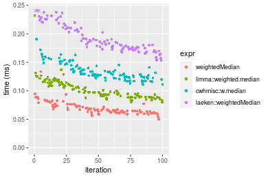

[matrixStats]: Benchmark report

---------------------------------------


# weightedMedian() benchmarks

This report benchmark the performance of weightedMedian() against alternative methods.

## Alternative methods

* apply() + limma::weighted.median()
* apply() + cwhmisc::w.median()
* apply() + laeken::weightedMedian()


## Data
```r
> rvector <- function(n, mode = c("logical", "double", "integer"), range = c(-100, +100), na_prob = 0) {
+     mode <- match.arg(mode)
+     if (mode == "logical") {
+         x <- sample(c(FALSE, TRUE), size = n, replace = TRUE)
+     }     else {
+         x <- runif(n, min = range[1], max = range[2])
+     }
+     storage.mode(x) <- mode
+     if (na_prob > 0) 
+         x[sample(n, size = na_prob * n)] <- NA
+     x
+ }
> rvectors <- function(scale = 10, seed = 1, ...) {
+     set.seed(seed)
+     data <- list()
+     data[[1]] <- rvector(n = scale * 100, ...)
+     data[[2]] <- rvector(n = scale * 1000, ...)
+     data[[3]] <- rvector(n = scale * 10000, ...)
+     data[[4]] <- rvector(n = scale * 1e+05, ...)
+     data[[5]] <- rvector(n = scale * 1e+06, ...)
+     names(data) <- sprintf("n = %d", sapply(data, FUN = length))
+     data
+ }
> data <- rvectors(mode = "double")
> data <- data[1:3]
```

## Results

### n = 1000 vector

```r
> x <- data[["n = 1000"]]
> w <- runif(length(x))
> gc()
           used  (Mb) gc trigger  (Mb) max used  (Mb)
Ncells  5344631 285.5   10014072 534.9 10014072 534.9
Vcells 10467382  79.9   36267018 276.7 90959857 694.0
> stats <- microbenchmark(weightedMedian = weightedMedian(x, w = w, ties = "mean", na.rm = FALSE), 
+     `limma::weighted.median` = limma_weighted.median(x, w = w, na.rm = FALSE), `cwhmisc::w.median` = cwhmisc_w.median(x, 
+         w = w), `laeken::weightedMedian` = laeken_weightedMedian(x, w = w), unit = "ms")
```

_Table: Benchmarking of weightedMedian(), limma::weighted.median(), cwhmisc::w.median() and laeken::weightedMedian() on n = 1000 data. The top panel shows times in milliseconds and the bottom panel shows relative times._


|   |expr                   |      min|       lq|      mean|    median|        uq|      max|
|:--|:----------------------|--------:|--------:|---------:|---------:|---------:|--------:|
|1  |weightedMedian         | 0.046528| 0.059060| 0.0653842| 0.0631335| 0.0686205| 0.094215|
|2  |limma::weighted.median | 0.072997| 0.083762| 0.0946703| 0.0912255| 0.1020090| 0.199328|
|3  |cwhmisc::w.median      | 0.101823| 0.115505| 0.1250125| 0.1228685| 0.1328525| 0.175337|
|4  |laeken::weightedMedian | 0.141138| 0.161051| 0.1846482| 0.1757525| 0.1965480| 0.635889|


|   |expr                   |      min|       lq|     mean|   median|       uq|      max|
|:--|:----------------------|--------:|--------:|--------:|--------:|--------:|--------:|
|1  |weightedMedian         | 1.000000| 1.000000| 1.000000| 1.000000| 1.000000| 1.000000|
|2  |limma::weighted.median | 1.568883| 1.418253| 1.447907| 1.444962| 1.486567| 2.115672|
|3  |cwhmisc::w.median      | 2.188424| 1.955723| 1.911967| 1.946170| 1.936047| 1.861031|
|4  |laeken::weightedMedian | 3.033399| 2.726905| 2.824048| 2.783823| 2.864275| 6.749339|

_Figure: Benchmarking of weightedMedian(), limma::weighted.median(), cwhmisc::w.median() and laeken::weightedMedian() on n = 1000 data.  Outliers are displayed as crosses.  Times are in milliseconds._



### n = 10000 vector

```r
> x <- data[["n = 10000"]]
> w <- runif(length(x))
> gc()
           used  (Mb) gc trigger  (Mb) max used  (Mb)
Ncells  5342941 285.4   10014072 534.9 10014072 534.9
Vcells 10067885  76.9   36267018 276.7 90959857 694.0
> stats <- microbenchmark(weightedMedian = weightedMedian(x, w = w, ties = "mean", na.rm = FALSE), 
+     `limma::weighted.median` = limma_weighted.median(x, w = w, na.rm = FALSE), `cwhmisc::w.median` = cwhmisc_w.median(x, 
+         w = w), `laeken::weightedMedian` = laeken_weightedMedian(x, w = w), unit = "ms")
```

_Table: Benchmarking of weightedMedian(), limma::weighted.median(), cwhmisc::w.median() and laeken::weightedMedian() on n = 10000 data. The top panel shows times in milliseconds and the bottom panel shows relative times._


|   |expr                   |      min|        lq|      mean|    median|        uq|      max|
|:--|:----------------------|--------:|---------:|---------:|---------:|---------:|--------:|
|2  |limma::weighted.median | 0.546808| 0.6228335| 0.6753045| 0.7046610| 0.7227405| 0.993827|
|1  |weightedMedian         | 0.578907| 0.6216750| 0.6837908| 0.7109250| 0.7241070| 0.930415|
|4  |laeken::weightedMedian | 0.657689| 0.7481300| 0.8290817| 0.8509185| 0.8872535| 1.645588|
|3  |cwhmisc::w.median      | 0.692205| 0.7393025| 0.8949892| 0.9357440| 1.0132460| 1.156300|


|   |expr                   |      min|       lq|     mean|   median|       uq|       max|
|:--|:----------------------|--------:|--------:|--------:|--------:|--------:|---------:|
|2  |limma::weighted.median | 1.000000| 1.000000| 1.000000| 1.000000| 1.000000| 1.0000000|
|1  |weightedMedian         | 1.058703| 0.998140| 1.012567| 1.008889| 1.001891| 0.9361941|
|4  |laeken::weightedMedian | 1.202779| 1.201172| 1.227715| 1.207557| 1.227624| 1.6558093|
|3  |cwhmisc::w.median      | 1.265901| 1.186999| 1.325312| 1.327935| 1.401950| 1.1634822|

_Figure: Benchmarking of weightedMedian(), limma::weighted.median(), cwhmisc::w.median() and laeken::weightedMedian() on n = 10000 data.  Outliers are displayed as crosses.  Times are in milliseconds._


### n = 100000 vector

```r
> x <- data[["n = 100000"]]
> w <- runif(length(x))
> gc()
           used  (Mb) gc trigger  (Mb) max used  (Mb)
Ncells  5343022 285.4   10014072 534.9 10014072 534.9
Vcells 10158451  77.6   36267018 276.7 90959857 694.0
> stats <- microbenchmark(weightedMedian = weightedMedian(x, w = w, ties = "mean", na.rm = FALSE), 
+     `limma::weighted.median` = limma_weighted.median(x, w = w, na.rm = FALSE), `cwhmisc::w.median` = cwhmisc_w.median(x, 
+         w = w), `laeken::weightedMedian` = laeken_weightedMedian(x, w = w), unit = "ms")
```

_Table: Benchmarking of weightedMedian(), limma::weighted.median(), cwhmisc::w.median() and laeken::weightedMedian() on n = 100000 data. The top panel shows times in milliseconds and the bottom panel shows relative times._


|   |expr                   |      min|       lq|     mean|   median|       uq|       max|
|:--|:----------------------|--------:|--------:|--------:|--------:|--------:|---------:|
|2  |limma::weighted.median | 4.704568| 5.079650| 5.351610| 5.167309| 5.363720| 11.632737|
|4  |laeken::weightedMedian | 5.182775| 5.715058| 6.227201| 5.804159| 6.017271| 11.908562|
|3  |cwhmisc::w.median      | 6.175976| 6.709828| 7.156718| 6.821414| 6.987333| 13.198826|
|1  |weightedMedian         | 6.965942| 7.505676| 7.641207| 7.624041| 7.740389|  8.427649|


|   |expr                   |      min|       lq|     mean|   median|       uq|       max|
|:--|:----------------------|--------:|--------:|--------:|--------:|--------:|---------:|
|2  |limma::weighted.median | 1.000000| 1.000000| 1.000000| 1.000000| 1.000000| 1.0000000|
|4  |laeken::weightedMedian | 1.101647| 1.125089| 1.163613| 1.123246| 1.121847| 1.0237111|
|3  |cwhmisc::w.median      | 1.312762| 1.320923| 1.337302| 1.320109| 1.302703| 1.1346277|
|1  |weightedMedian         | 1.480676| 1.477597| 1.427833| 1.475437| 1.443101| 0.7244769|

_Figure: Benchmarking of weightedMedian(), limma::weighted.median(), cwhmisc::w.median() and laeken::weightedMedian() on n = 100000 data.  Outliers are displayed as crosses.  Times are in milliseconds._


## Appendix

### Session information
```r
R version 4.1.1 Patched (2021-08-10 r80727)
Platform: x86_64-pc-linux-gnu (64-bit)
Running under: Ubuntu 18.04.5 LTS

Matrix products: default
BLAS:   /home/hb/software/R-devel/R-4-1-branch/lib/R/lib/libRblas.so
LAPACK: /home/hb/software/R-devel/R-4-1-branch/lib/R/lib/libRlapack.so

locale:
 [1] LC_CTYPE=en_US.UTF-8       LC_NUMERIC=C              
 [3] LC_TIME=en_US.UTF-8        LC_COLLATE=en_US.UTF-8    
 [5] LC_MONETARY=en_US.UTF-8    LC_MESSAGES=en_US.UTF-8   
 [7] LC_PAPER=en_US.UTF-8       LC_NAME=C                 
 [9] LC_ADDRESS=C               LC_TELEPHONE=C            
[11] LC_MEASUREMENT=en_US.UTF-8 LC_IDENTIFICATION=C       

attached base packages:
[1] stats     graphics  grDevices utils     datasets  methods   base     

other attached packages:
[1] microbenchmark_1.4-7   matrixStats_0.60.1     ggplot2_3.3.5         
[4] knitr_1.33             R.devices_2.17.0       R.utils_2.10.1        
[7] R.oo_1.24.0            R.methodsS3_1.8.1-9001 history_0.0.1-9000    

loaded via a namespace (and not attached):
 [1] Biobase_2.52.0          httr_1.4.2              splines_4.1.1          
 [4] bit64_4.0.5             network_1.17.1          assertthat_0.2.1       
 [7] highr_0.9               stats4_4.1.1            blob_1.2.2             
[10] GenomeInfoDbData_1.2.6  robustbase_0.93-8       pillar_1.6.2           
[13] RSQLite_2.2.8           lattice_0.20-44         limma_3.48.3           
[16] glue_1.4.2              digest_0.6.27           XVector_0.32.0         
[19] colorspace_2.0-2        Matrix_1.3-4            XML_3.99-0.7           
[22] pkgconfig_2.0.3         zlibbioc_1.38.0         genefilter_1.74.0      
[25] purrr_0.3.4             ergm_4.1.2              xtable_1.8-4           
[28] scales_1.1.1            tibble_3.1.4            annotate_1.70.0        
[31] KEGGREST_1.32.0         farver_2.1.0            generics_0.1.0         
[34] IRanges_2.26.0          ellipsis_0.3.2          cachem_1.0.6           
[37] withr_2.4.2             BiocGenerics_0.38.0     mime_0.11              
[40] survival_3.2-13         magrittr_2.0.1          crayon_1.4.1           
[43] statnet.common_4.5.0    memoise_2.0.0           laeken_0.5.1           
[46] fansi_0.5.0             R.cache_0.15.0          MASS_7.3-54            
[49] R.rsp_0.44.0            progressr_0.8.0         tools_4.1.1            
[52] lifecycle_1.0.0         S4Vectors_0.30.0        trust_0.1-8            
[55] munsell_0.5.0           tabby_0.0.1-9001        AnnotationDbi_1.54.1   
[58] Biostrings_2.60.2       compiler_4.1.1          GenomeInfoDb_1.28.1    
[61] rlang_0.4.11            grid_4.1.1              RCurl_1.98-1.4         
[64] cwhmisc_6.6             rappdirs_0.3.3          startup_0.15.0         
[67] labeling_0.4.2          bitops_1.0-7            base64enc_0.1-3        
[70] boot_1.3-28             gtable_0.3.0            DBI_1.1.1              
[73] markdown_1.1            R6_2.5.1                lpSolveAPI_5.5.2.0-17.7
[76] rle_0.9.2               dplyr_1.0.7             fastmap_1.1.0          
[79] bit_4.0.4               utf8_1.2.2              parallel_4.1.1         
[82] Rcpp_1.0.7              vctrs_0.3.8             png_0.1-7              
[85] DEoptimR_1.0-9          tidyselect_1.1.1        xfun_0.25              
[88] coda_0.19-4            
```
Total processing time was 7.36 secs.


### Reproducibility
To reproduce this report, do:
```r
html <- matrixStats:::benchmark('weightedMedian')
```

[RSP]: https://cran.r-project.org/package=R.rsp
[matrixStats]: https://cran.r-project.org/package=matrixStats

[StackOverflow:colMins?]: https://stackoverflow.com/questions/13676878 "Stack Overflow: fastest way to get Min from every column in a matrix?"
[StackOverflow:colSds?]: https://stackoverflow.com/questions/17549762 "Stack Overflow: Is there such 'colsd' in R?"
[StackOverflow:rowProds?]: https://stackoverflow.com/questions/20198801/ "Stack Overflow: Row product of matrix and column sum of matrix"

---------------------------------------
Copyright Henrik Bengtsson. Last updated on 2021-08-25 18:39:27 (+0200 UTC). Powered by [RSP].

<script>
 var link = document.createElement('link');
 link.rel = 'icon';
 link.href = "data:image/png;base64,iVBORw0KGgoAAAANSUhEUgAAACAAAAAgCAMAAABEpIrGAAAA21BMVEUAAAAAAP8AAP8AAP8AAP8AAP8AAP8AAP8AAP8AAP8AAP8AAP8AAP8AAP8AAP8AAP8AAP8AAP8AAP8AAP8AAP8AAP8AAP8AAP8AAP8AAP8AAP8AAP8AAP8AAP8AAP8AAP8AAP8AAP8AAP8AAP8AAP8AAP8AAP8AAP8AAP8AAP8BAf4CAv0DA/wdHeIeHuEfH+AgIN8hId4lJdomJtknJ9g+PsE/P8BAQL9yco10dIt1dYp3d4h4eIeVlWqWlmmXl2iYmGeZmWabm2Tn5xjo6Bfp6Rb39wj4+Af//wA2M9hbAAAASXRSTlMAAQIJCgsMJSYnKD4/QGRlZmhpamtsbautrrCxuru8y8zN5ebn6Pn6+///////////////////////////////////////////LsUNcQAAAS9JREFUOI29k21XgkAQhVcFytdSMqMETU26UVqGmpaiFbL//xc1cAhhwVNf6n5i5z67M2dmYOyfJZUqlVLhkKucG7cgmUZTybDz6g0iDeq51PUr37Ds2cy2/C9NeES5puDjxuUk1xnToZsg8pfA3avHQ3lLIi7iWRrkv/OYtkScxBIMgDee0ALoyxHQBJ68JLCjOtQIMIANF7QG9G9fNnHvisCHBVMKgSJgiz7nE+AoBKrAPA3MgepvgR9TSCasrCKH0eB1wBGBFdCO+nAGjMVGPcQb5bd6mQRegN6+1axOs9nGfYcCtfi4NQosdtH7dB+txFIpXQqN1p9B/asRHToyS0jRgpV7nk4nwcq1BJ+x3Gl/v7S9Wmpp/aGquum7w3ZDyrADFYrl8vHBH+ev9AUASW1dmU4h4wAAAABJRU5ErkJggg=="
 document.getElementsByTagName('head')[0].appendChild(link);
</script>


