[matrixStats]: Benchmark report

---------------------------------------


# x_OP_y() benchmarks

This report benchmark the performance of x_OP_y() against alternative methods.

## Alternative methods

* x_OP_y_R()

as below

```r
> x_OP_y_R <- function(x, y, OP, na.rm = FALSE) {
+     if (na.rm) {
+         xnok <- is.na(x)
+         ynok <- is.na(y)
+         anok <- xnok & ynok
+         unit <- switch(OP, `+` = 0, `-` = NA_real_, `*` = 1, `/` = NA_real_, stop("Unknown 'OP' operator: ", 
+             OP))
+         x[xnok] <- unit
+         y[ynok] <- unit
+     }
+     ans <- switch(OP, `+` = x + y, `-` = x - y, `*` = x * y, `/` = x/y, stop("Unknown 'OP' operator: ", 
+         OP))
+     if (na.rm) {
+         ans[anok] <- NA_real_
+     }
+     ans
+ }
```


## Data type "integer"
### Data
```r
> rmatrix <- function(nrow, ncol, mode = c("logical", "double", "integer", "index"), range = c(-100, 
+     +100), na_prob = 0) {
+     mode <- match.arg(mode)
+     n <- nrow * ncol
+     if (mode == "logical") {
+         x <- sample(c(FALSE, TRUE), size = n, replace = TRUE)
+     }     else if (mode == "index") {
+         x <- seq_len(n)
+         mode <- "integer"
+     }     else {
+         x <- runif(n, min = range[1], max = range[2])
+     }
+     storage.mode(x) <- mode
+     if (na_prob > 0) 
+         x[sample(n, size = na_prob * n)] <- NA
+     dim(x) <- c(nrow, ncol)
+     x
+ }
> rmatrices <- function(scale = 10, seed = 1, ...) {
+     set.seed(seed)
+     data <- list()
+     data[[1]] <- rmatrix(nrow = scale * 1, ncol = scale * 1, ...)
+     data[[2]] <- rmatrix(nrow = scale * 10, ncol = scale * 10, ...)
+     data[[3]] <- rmatrix(nrow = scale * 100, ncol = scale * 1, ...)
+     data[[4]] <- t(data[[3]])
+     data[[5]] <- rmatrix(nrow = scale * 10, ncol = scale * 100, ...)
+     data[[6]] <- t(data[[5]])
+     names(data) <- sapply(data, FUN = function(x) paste(dim(x), collapse = "x"))
+     data
+ }
> data <- rmatrices(mode = mode)
```

### Results

### 10x10 vector

#### All elements
```r
> x <- data[["10x10"]]
> y <- x[, 1L]
```

```r
> OP
[1] "+"
> stats <- microbenchmark(x_OP_y = x_OP_y(x, y, OP = OP, na.rm = FALSE), x_OP_y_R = x_OP_y_R(x, y, 
+     OP = OP, na.rm = FALSE), unit = "ms")
> gc()
           used  (Mb) gc trigger  (Mb) max used  (Mb)
Ncells  5416661 289.3    7916910 422.9  7916910 422.9
Vcells 10852572  82.8   39038428 297.9 94934136 724.3
```

_Table: Benchmarking of x_OP_y() and x_OP_y_R() on integer+10x10+add data. The top panel shows times in milliseconds and the bottom panel shows relative times._


|   |expr     |      min|       lq|      mean|    median|        uq|       max|
|:--|:--------|--------:|--------:|---------:|---------:|---------:|---------:|
|2  |x_OP_y_R | 0.001745| 0.001982| 0.1183098| 0.0021305| 0.0022645| 11.599051|
|1  |x_OP_y   | 0.004163| 0.004512| 0.0048525| 0.0046405| 0.0047880|  0.020428|


|   |expr     |      min|       lq|      mean|   median|       uq|       max|
|:--|:--------|--------:|--------:|---------:|--------:|--------:|---------:|
|2  |x_OP_y_R | 1.000000| 1.000000| 1.0000000| 1.000000| 1.000000| 1.0000000|
|1  |x_OP_y   | 2.385673| 2.276488| 0.0410153| 2.178127| 2.114374| 0.0017612|

_Figure: Benchmarking of x_OP_y() and x_OP_y_R() on integer+10x10+add data.  Outliers are displayed as crosses.  Times are in milliseconds._


```r
> OP
[1] "-"
> stats <- microbenchmark(x_OP_y = x_OP_y(x, y, OP = OP, na.rm = FALSE), x_OP_y_R = x_OP_y_R(x, y, 
+     OP = OP, na.rm = FALSE), unit = "ms")
> gc()
           used  (Mb) gc trigger  (Mb) max used  (Mb)
Ncells  5414272 289.2    7916910 422.9  7916910 422.9
Vcells 10543711  80.5   39038428 297.9 94934136 724.3
```

_Table: Benchmarking of x_OP_y() and x_OP_y_R() on integer+10x10+sub data. The top panel shows times in milliseconds and the bottom panel shows relative times._


|   |expr     |      min|        lq|      mean|   median|        uq|      max|
|:--|:--------|--------:|---------:|---------:|--------:|---------:|--------:|
|2  |x_OP_y_R | 0.001894| 0.0021235| 0.0024287| 0.002221| 0.0023725| 0.014630|
|1  |x_OP_y   | 0.004264| 0.0045435| 0.0049544| 0.004725| 0.0048815| 0.023081|


|   |expr     |     min|       lq|     mean|  median|       uq|      max|
|:--|:--------|-------:|--------:|--------:|-------:|--------:|--------:|
|2  |x_OP_y_R | 1.00000| 1.000000| 1.000000| 1.00000| 1.000000| 1.000000|
|1  |x_OP_y   | 2.25132| 2.139628| 2.039918| 2.12742| 2.057534| 1.577649|

_Figure: Benchmarking of x_OP_y() and x_OP_y_R() on integer+10x10+sub data.  Outliers are displayed as crosses.  Times are in milliseconds._


```r
> OP
[1] "*"
> stats <- microbenchmark(x_OP_y = x_OP_y(x, y, OP = OP, na.rm = FALSE), x_OP_y_R = x_OP_y_R(x, y, 
+     OP = OP, na.rm = FALSE), unit = "ms")
> gc()
           used  (Mb) gc trigger  (Mb) max used  (Mb)
Ncells  5414335 289.2    7916910 422.9  7916910 422.9
Vcells 10544265  80.5   39038428 297.9 94934136 724.3
```

_Table: Benchmarking of x_OP_y() and x_OP_y_R() on integer+10x10+mul data. The top panel shows times in milliseconds and the bottom panel shows relative times._


|   |expr     |      min|        lq|      mean|    median|       uq|      max|
|:--|:--------|--------:|---------:|---------:|---------:|--------:|--------:|
|2  |x_OP_y_R | 0.003216| 0.0037275| 0.0043916| 0.0039460| 0.004395| 0.028018|
|1  |x_OP_y   | 0.006908| 0.0079355| 0.0087393| 0.0083035| 0.008720| 0.036743|


|   |expr     |     min|       lq|    mean|   median|       uq|      max|
|:--|:--------|-------:|--------:|-------:|--------:|--------:|--------:|
|2  |x_OP_y_R | 1.00000| 1.000000| 1.00000| 1.000000| 1.000000| 1.000000|
|1  |x_OP_y   | 2.14801| 2.128907| 1.98999| 2.104283| 1.984073| 1.311407|

_Figure: Benchmarking of x_OP_y() and x_OP_y_R() on integer+10x10+mul data.  Outliers are displayed as crosses.  Times are in milliseconds._


```r
> OP
[1] "/"
> stats <- microbenchmark(x_OP_y = x_OP_y(x, y, OP = OP, na.rm = FALSE), x_OP_y_R = x_OP_y_R(x, y, 
+     OP = OP, na.rm = FALSE), unit = "ms")
> gc()
           used  (Mb) gc trigger  (Mb) max used  (Mb)
Ncells  5414398 289.2    7916910 422.9  7916910 422.9
Vcells 10544307  80.5   39038428 297.9 94934136 724.3
```

_Table: Benchmarking of x_OP_y() and x_OP_y_R() on integer+10x10+div data. The top panel shows times in milliseconds and the bottom panel shows relative times._


|   |expr     |      min|        lq|      mean|   median|        uq|      max|
|:--|:--------|--------:|---------:|---------:|--------:|---------:|--------:|
|2  |x_OP_y_R | 0.001823| 0.0020715| 0.0023296| 0.002185| 0.0023045| 0.012960|
|1  |x_OP_y   | 0.004233| 0.0044860| 0.0048927| 0.004663| 0.0048520| 0.021008|


|   |expr     |      min|      lq|     mean|   median|       uq|      max|
|:--|:--------|--------:|-------:|--------:|--------:|--------:|--------:|
|2  |x_OP_y_R | 1.000000| 1.00000| 1.000000| 1.000000| 1.000000| 1.000000|
|1  |x_OP_y   | 2.321997| 2.16558| 2.100246| 2.134096| 2.105446| 1.620988|

_Figure: Benchmarking of x_OP_y() and x_OP_y_R() on integer+10x10+div data.  Outliers are displayed as crosses.  Times are in milliseconds._


### 100x100 vector

#### All elements
```r
> x <- data[["100x100"]]
> y <- x[, 1L]
```

```r
> OP
[1] "+"
> stats <- microbenchmark(x_OP_y = x_OP_y(x, y, OP = OP, na.rm = FALSE), x_OP_y_R = x_OP_y_R(x, y, 
+     OP = OP, na.rm = FALSE), unit = "ms")
> gc()
           used  (Mb) gc trigger  (Mb) max used  (Mb)
Ncells  5414461 289.2    7916910 422.9  7916910 422.9
Vcells 10544391  80.5   39038428 297.9 94934136 724.3
```

_Table: Benchmarking of x_OP_y() and x_OP_y_R() on integer+100x100+add data. The top panel shows times in milliseconds and the bottom panel shows relative times._


|   |expr     |      min|        lq|      mean|   median|        uq|      max|
|:--|:--------|--------:|---------:|---------:|--------:|---------:|--------:|
|2  |x_OP_y_R | 0.034646| 0.0350260| 0.0354890| 0.035195| 0.0354515| 0.043266|
|1  |x_OP_y   | 0.043786| 0.0441645| 0.0452476| 0.044425| 0.0449440| 0.077183|


|   |expr     |      min|       lq|     mean|   median|      uq|      max|
|:--|:--------|--------:|--------:|--------:|--------:|-------:|--------:|
|2  |x_OP_y_R | 1.000000| 1.000000| 1.000000| 1.000000| 1.00000| 1.000000|
|1  |x_OP_y   | 1.263811| 1.260906| 1.274974| 1.262253| 1.26776| 1.783918|

_Figure: Benchmarking of x_OP_y() and x_OP_y_R() on integer+100x100+add data.  Outliers are displayed as crosses.  Times are in milliseconds._


```r
> OP
[1] "-"
> stats <- microbenchmark(x_OP_y = x_OP_y(x, y, OP = OP, na.rm = FALSE), x_OP_y_R = x_OP_y_R(x, y, 
+     OP = OP, na.rm = FALSE), unit = "ms")
> gc()
           used  (Mb) gc trigger  (Mb) max used  (Mb)
Ncells  5414524 289.2    7916910 422.9  7916910 422.9
Vcells 10544649  80.5   39038428 297.9 94934136 724.3
```

_Table: Benchmarking of x_OP_y() and x_OP_y_R() on integer+100x100+sub data. The top panel shows times in milliseconds and the bottom panel shows relative times._


|   |expr     |      min|        lq|      mean|    median|        uq|      max|
|:--|:--------|--------:|---------:|---------:|---------:|---------:|--------:|
|2  |x_OP_y_R | 0.033759| 0.0341715| 0.0349730| 0.0344345| 0.0346845| 0.053023|
|1  |x_OP_y   | 0.038221| 0.0387550| 0.0405948| 0.0391650| 0.0396120| 0.062740|


|   |expr     |      min|       lq|     mean|   median|       uq|     max|
|:--|:--------|--------:|--------:|--------:|--------:|--------:|-------:|
|2  |x_OP_y_R | 1.000000| 1.000000| 1.000000| 1.000000| 1.000000| 1.00000|
|1  |x_OP_y   | 1.132172| 1.134132| 1.160748| 1.137377| 1.142066| 1.18326|

_Figure: Benchmarking of x_OP_y() and x_OP_y_R() on integer+100x100+sub data.  Outliers are displayed as crosses.  Times are in milliseconds._


```r
> OP
[1] "*"
> stats <- microbenchmark(x_OP_y = x_OP_y(x, y, OP = OP, na.rm = FALSE), x_OP_y_R = x_OP_y_R(x, y, 
+     OP = OP, na.rm = FALSE), unit = "ms")
> gc()
           used  (Mb) gc trigger  (Mb) max used  (Mb)
Ncells  5414587 289.2    7916910 422.9  7916910 422.9
Vcells 10544938  80.5   39038428 297.9 94934136 724.3
```

_Table: Benchmarking of x_OP_y() and x_OP_y_R() on integer+100x100+mul data. The top panel shows times in milliseconds and the bottom panel shows relative times._


|   |expr     |      min|       lq|      mean|   median|        uq|      max|
|:--|:--------|--------:|--------:|---------:|--------:|---------:|--------:|
|1  |x_OP_y   | 0.041876| 0.044042| 0.0451193| 0.044389| 0.0446395| 0.077881|
|2  |x_OP_y_R | 0.050367| 0.052719| 0.0534964| 0.053060| 0.0533685| 0.068363|


|   |expr     |      min|       lq|     mean|   median|       uq|       max|
|:--|:--------|--------:|--------:|--------:|--------:|--------:|---------:|
|1  |x_OP_y   | 1.000000| 1.000000| 1.000000| 1.000000| 1.000000| 1.0000000|
|2  |x_OP_y_R | 1.202765| 1.197016| 1.185666| 1.195341| 1.195544| 0.8777879|

_Figure: Benchmarking of x_OP_y() and x_OP_y_R() on integer+100x100+mul data.  Outliers are displayed as crosses.  Times are in milliseconds._


```r
> OP
[1] "/"
> stats <- microbenchmark(x_OP_y = x_OP_y(x, y, OP = OP, na.rm = FALSE), x_OP_y_R = x_OP_y_R(x, y, 
+     OP = OP, na.rm = FALSE), unit = "ms")
> gc()
           used  (Mb) gc trigger  (Mb) max used  (Mb)
Ncells  5414650 289.2    7916910 422.9  7916910 422.9
Vcells 10544980  80.5   39038428 297.9 94934136 724.3
```

_Table: Benchmarking of x_OP_y() and x_OP_y_R() on integer+100x100+div data. The top panel shows times in milliseconds and the bottom panel shows relative times._


|   |expr     |      min|        lq|      mean|   median|        uq|      max|
|:--|:--------|--------:|---------:|---------:|--------:|---------:|--------:|
|2  |x_OP_y_R | 0.022659| 0.0234705| 0.0254748| 0.024179| 0.0246615| 0.053463|
|1  |x_OP_y   | 0.030212| 0.0309920| 0.0331072| 0.031794| 0.0326425| 0.063958|


|   |expr     |      min|       lq|     mean|   median|       uq|      max|
|:--|:--------|--------:|--------:|--------:|--------:|--------:|--------:|
|2  |x_OP_y_R | 1.000000| 1.000000| 1.000000| 1.000000| 1.000000| 1.000000|
|1  |x_OP_y   | 1.333333| 1.320466| 1.299605| 1.314943| 1.323622| 1.196304|

_Figure: Benchmarking of x_OP_y() and x_OP_y_R() on integer+100x100+div data.  Outliers are displayed as crosses.  Times are in milliseconds._


### 1000x10 vector

#### All elements
```r
> x <- data[["1000x10"]]
> y <- x[, 1L]
```

```r
> OP
[1] "+"
> stats <- microbenchmark(x_OP_y = x_OP_y(x, y, OP = OP, na.rm = FALSE), x_OP_y_R = x_OP_y_R(x, y, 
+     OP = OP, na.rm = FALSE), unit = "ms")
> gc()
           used  (Mb) gc trigger  (Mb) max used  (Mb)
Ncells  5414713 289.2    7916910 422.9  7916910 422.9
Vcells 10545772  80.5   39038428 297.9 94934136 724.3
```

_Table: Benchmarking of x_OP_y() and x_OP_y_R() on integer+1000x10+add data. The top panel shows times in milliseconds and the bottom panel shows relative times._


|   |expr     |      min|       lq|     mean|    median|        uq|      max|
|:--|:--------|--------:|--------:|--------:|---------:|---------:|--------:|
|2  |x_OP_y_R | 0.033730| 0.034406| 0.036349| 0.0359005| 0.0365170| 0.067853|
|1  |x_OP_y   | 0.041315| 0.043006| 0.043675| 0.0433825| 0.0437765| 0.061877|


|   |expr     |      min|       lq|     mean|   median|       uq|       max|
|:--|:--------|--------:|--------:|--------:|--------:|--------:|---------:|
|2  |x_OP_y_R | 1.000000| 1.000000| 1.000000| 1.000000| 1.000000| 1.0000000|
|1  |x_OP_y   | 1.224874| 1.249956| 1.201545| 1.208409| 1.198798| 0.9119273|

_Figure: Benchmarking of x_OP_y() and x_OP_y_R() on integer+1000x10+add data.  Outliers are displayed as crosses.  Times are in milliseconds._


```r
> OP
[1] "-"
> stats <- microbenchmark(x_OP_y = x_OP_y(x, y, OP = OP, na.rm = FALSE), x_OP_y_R = x_OP_y_R(x, y, 
+     OP = OP, na.rm = FALSE), unit = "ms")
> gc()
           used  (Mb) gc trigger  (Mb) max used  (Mb)
Ncells  5414776 289.2    7916910 422.9  7916910 422.9
Vcells 10545814  80.5   39038428 297.9 94934136 724.3
```

_Table: Benchmarking of x_OP_y() and x_OP_y_R() on integer+1000x10+sub data. The top panel shows times in milliseconds and the bottom panel shows relative times._


|   |expr     |      min|        lq|      mean|    median|        uq|      max|
|:--|:--------|--------:|---------:|---------:|---------:|---------:|--------:|
|1  |x_OP_y   | 0.037287| 0.0379045| 0.0387342| 0.0381430| 0.0384760| 0.055843|
|2  |x_OP_y_R | 0.038794| 0.0392505| 0.0402957| 0.0395215| 0.0400815| 0.071242|


|   |expr     |      min|      lq|     mean|  median|       uq|      max|
|:--|:--------|--------:|-------:|--------:|-------:|--------:|--------:|
|1  |x_OP_y   | 1.000000| 1.00000| 1.000000| 1.00000| 1.000000| 1.000000|
|2  |x_OP_y_R | 1.040416| 1.03551| 1.040315| 1.03614| 1.041727| 1.275755|

_Figure: Benchmarking of x_OP_y() and x_OP_y_R() on integer+1000x10+sub data.  Outliers are displayed as crosses.  Times are in milliseconds._


```r
> OP
[1] "*"
> stats <- microbenchmark(x_OP_y = x_OP_y(x, y, OP = OP, na.rm = FALSE), x_OP_y_R = x_OP_y_R(x, y, 
+     OP = OP, na.rm = FALSE), unit = "ms")
> gc()
           used  (Mb) gc trigger  (Mb) max used  (Mb)
Ncells  5414839 289.2    7916910 422.9  7916910 422.9
Vcells 10546241  80.5   39038428 297.9 94934136 724.3
```

_Table: Benchmarking of x_OP_y() and x_OP_y_R() on integer+1000x10+mul data. The top panel shows times in milliseconds and the bottom panel shows relative times._


|   |expr     |      min|        lq|      mean|    median|       uq|      max|
|:--|:--------|--------:|---------:|---------:|---------:|--------:|--------:|
|1  |x_OP_y   | 0.041016| 0.0428595| 0.0437888| 0.0433315| 0.043798| 0.067717|
|2  |x_OP_y_R | 0.050557| 0.0527605| 0.0540048| 0.0530630| 0.053369| 0.096236|


|   |expr     |      min|       lq|   mean|   median|       uq|     max|
|:--|:--------|--------:|--------:|------:|--------:|--------:|-------:|
|1  |x_OP_y   | 1.000000| 1.000000| 1.0000| 1.000000| 1.000000| 1.00000|
|2  |x_OP_y_R | 1.232617| 1.231011| 1.2333| 1.224583| 1.218526| 1.42115|

_Figure: Benchmarking of x_OP_y() and x_OP_y_R() on integer+1000x10+mul data.  Outliers are displayed as crosses.  Times are in milliseconds._

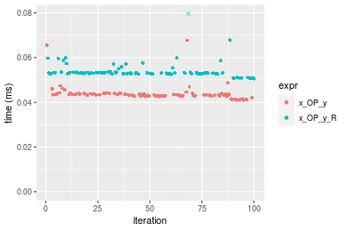

```r
> OP
[1] "/"
> stats <- microbenchmark(x_OP_y = x_OP_y(x, y, OP = OP, na.rm = FALSE), x_OP_y_R = x_OP_y_R(x, y, 
+     OP = OP, na.rm = FALSE), unit = "ms")
> gc()
           used  (Mb) gc trigger  (Mb) max used  (Mb)
Ncells  5414902 289.2    7916910 422.9  7916910 422.9
Vcells 10546283  80.5   39038428 297.9 94934136 724.3
```

_Table: Benchmarking of x_OP_y() and x_OP_y_R() on integer+1000x10+div data. The top panel shows times in milliseconds and the bottom panel shows relative times._


|   |expr     |      min|        lq|      mean|    median|        uq|      max|
|:--|:--------|--------:|---------:|---------:|---------:|---------:|--------:|
|2  |x_OP_y_R | 0.023405| 0.0239570| 0.0250790| 0.0242255| 0.0246195| 0.055720|
|1  |x_OP_y   | 0.030221| 0.0307675| 0.0315555| 0.0310515| 0.0314290| 0.049751|


|   |expr     |     min|      lq|     mean|   median|      uq|       max|
|:--|:--------|-------:|-------:|--------:|--------:|-------:|---------:|
|2  |x_OP_y_R | 1.00000| 1.00000| 1.000000| 1.000000| 1.00000| 1.0000000|
|1  |x_OP_y   | 1.29122| 1.28428| 1.258245| 1.281769| 1.27659| 0.8928751|

_Figure: Benchmarking of x_OP_y() and x_OP_y_R() on integer+1000x10+div data.  Outliers are displayed as crosses.  Times are in milliseconds._

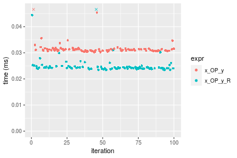


### 10x1000 vector

#### All elements
```r
> x <- data[["10x1000"]]
> y <- x[, 1L]
```

```r
> OP
[1] "+"
> stats <- microbenchmark(x_OP_y = x_OP_y(x, y, OP = OP, na.rm = FALSE), x_OP_y_R = x_OP_y_R(x, y, 
+     OP = OP, na.rm = FALSE), unit = "ms")
> gc()
           used  (Mb) gc trigger  (Mb) max used  (Mb)
Ncells  5414965 289.2    7916910 422.9  7916910 422.9
Vcells 10546278  80.5   39038428 297.9 94934136 724.3
```

_Table: Benchmarking of x_OP_y() and x_OP_y_R() on integer+10x1000+add data. The top panel shows times in milliseconds and the bottom panel shows relative times._


|   |expr     |      min|        lq|      mean|    median|        uq|      max|
|:--|:--------|--------:|---------:|---------:|---------:|---------:|--------:|
|2  |x_OP_y_R | 0.034933| 0.0351745| 0.0367221| 0.0354380| 0.0371110| 0.070618|
|1  |x_OP_y   | 0.043174| 0.0436910| 0.0454902| 0.0440975| 0.0458815| 0.074519|


|   |expr     |      min|       lq|    mean|   median|       uq|      max|
|:--|:--------|--------:|--------:|-------:|--------:|--------:|--------:|
|2  |x_OP_y_R | 1.000000| 1.000000| 1.00000| 1.000000| 1.000000| 1.000000|
|1  |x_OP_y   | 1.235909| 1.242121| 1.23877| 1.244356| 1.236331| 1.055241|

_Figure: Benchmarking of x_OP_y() and x_OP_y_R() on integer+10x1000+add data.  Outliers are displayed as crosses.  Times are in milliseconds._


```r
> OP
[1] "-"
> stats <- microbenchmark(x_OP_y = x_OP_y(x, y, OP = OP, na.rm = FALSE), x_OP_y_R = x_OP_y_R(x, y, 
+     OP = OP, na.rm = FALSE), unit = "ms")
> gc()
           used  (Mb) gc trigger  (Mb) max used  (Mb)
Ncells  5415028 289.2    7916910 422.9  7916910 422.9
Vcells 10546320  80.5   39038428 297.9 94934136 724.3
```

_Table: Benchmarking of x_OP_y() and x_OP_y_R() on integer+10x1000+sub data. The top panel shows times in milliseconds and the bottom panel shows relative times._


|   |expr     |      min|        lq|      mean|    median|       uq|      max|
|:--|:--------|--------:|---------:|---------:|---------:|--------:|--------:|
|2  |x_OP_y_R | 0.033951| 0.0344830| 0.0370768| 0.0359955| 0.036847| 0.071624|
|1  |x_OP_y   | 0.037570| 0.0383995| 0.0414510| 0.0398795| 0.041676| 0.097974|


|   |expr     |      min|       lq|     mean|   median|       uq|      max|
|:--|:--------|--------:|--------:|--------:|--------:|--------:|--------:|
|2  |x_OP_y_R | 1.000000| 1.000000| 1.000000| 1.000000| 1.000000| 1.000000|
|1  |x_OP_y   | 1.106595| 1.113578| 1.117976| 1.107902| 1.131055| 1.367893|

_Figure: Benchmarking of x_OP_y() and x_OP_y_R() on integer+10x1000+sub data.  Outliers are displayed as crosses.  Times are in milliseconds._


```r
> OP
[1] "*"
> stats <- microbenchmark(x_OP_y = x_OP_y(x, y, OP = OP, na.rm = FALSE), x_OP_y_R = x_OP_y_R(x, y, 
+     OP = OP, na.rm = FALSE), unit = "ms")
> gc()
           used  (Mb) gc trigger  (Mb) max used  (Mb)
Ncells  5415091 289.2    7916910 422.9  7916910 422.9
Vcells 10546362  80.5   39038428 297.9 94934136 724.3
```

_Table: Benchmarking of x_OP_y() and x_OP_y_R() on integer+10x1000+mul data. The top panel shows times in milliseconds and the bottom panel shows relative times._


|   |expr     |      min|        lq|      mean|  median|        uq|      max|
|:--|:--------|--------:|---------:|---------:|-------:|---------:|--------:|
|1  |x_OP_y   | 0.034669| 0.0364845| 0.0387897| 0.03765| 0.0391755| 0.070359|
|2  |x_OP_y_R | 0.042301| 0.0440145| 0.0465300| 0.04560| 0.0473990| 0.063301|


|   |expr     |      min|       lq|     mean|   median|       uq|       max|
|:--|:--------|--------:|--------:|--------:|--------:|--------:|---------:|
|1  |x_OP_y   | 1.000000| 1.000000| 1.000000| 1.000000| 1.000000| 1.0000000|
|2  |x_OP_y_R | 1.220139| 1.206389| 1.199544| 1.211155| 1.209914| 0.8996859|

_Figure: Benchmarking of x_OP_y() and x_OP_y_R() on integer+10x1000+mul data.  Outliers are displayed as crosses.  Times are in milliseconds._


```r
> OP
[1] "/"
> stats <- microbenchmark(x_OP_y = x_OP_y(x, y, OP = OP, na.rm = FALSE), x_OP_y_R = x_OP_y_R(x, y, 
+     OP = OP, na.rm = FALSE), unit = "ms")
> gc()
           used  (Mb) gc trigger  (Mb) max used  (Mb)
Ncells  5415154 289.3    7916910 422.9  7916910 422.9
Vcells 10546963  80.5   39038428 297.9 94934136 724.3
```

_Table: Benchmarking of x_OP_y() and x_OP_y_R() on integer+10x1000+div data. The top panel shows times in milliseconds and the bottom panel shows relative times._


|   |expr     |      min|       lq|      mean|    median|        uq|      max|
|:--|:--------|--------:|--------:|---------:|---------:|---------:|--------:|
|2  |x_OP_y_R | 0.019543| 0.020177| 0.0210901| 0.0208365| 0.0211265| 0.034680|
|1  |x_OP_y   | 0.026204| 0.026877| 0.0285741| 0.0274720| 0.0283100| 0.060968|


|   |expr     |      min|       lq|     mean|   median|       uq|      max|
|:--|:--------|--------:|--------:|--------:|--------:|--------:|--------:|
|2  |x_OP_y_R | 1.000000| 1.000000| 1.000000| 1.000000| 1.000000| 1.000000|
|1  |x_OP_y   | 1.340838| 1.332061| 1.354858| 1.318456| 1.340023| 1.758016|

_Figure: Benchmarking of x_OP_y() and x_OP_y_R() on integer+10x1000+div data.  Outliers are displayed as crosses.  Times are in milliseconds._

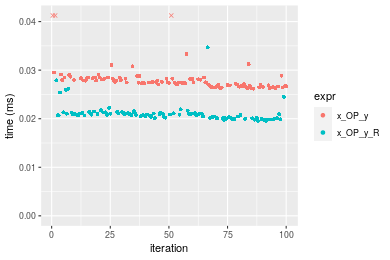


### 100x1000 vector

#### All elements
```r
> x <- data[["100x1000"]]
> y <- x[, 1L]
```

```r
> OP
[1] "+"
> stats <- microbenchmark(x_OP_y = x_OP_y(x, y, OP = OP, na.rm = FALSE), x_OP_y_R = x_OP_y_R(x, y, 
+     OP = OP, na.rm = FALSE), unit = "ms")
> gc()
           used  (Mb) gc trigger  (Mb) max used  (Mb)
Ncells  5415217 289.3    7916910 422.9  7916910 422.9
Vcells 10547047  80.5   39038428 297.9 94934136 724.3
```

_Table: Benchmarking of x_OP_y() and x_OP_y_R() on integer+100x1000+add data. The top panel shows times in milliseconds and the bottom panel shows relative times._


|   |expr     |      min|       lq|      mean|   median|        uq|      max|
|:--|:--------|--------:|--------:|---------:|--------:|---------:|--------:|
|2  |x_OP_y_R | 0.206595| 0.222928| 0.2581896| 0.252993| 0.2810800| 0.395533|
|1  |x_OP_y   | 0.256061| 0.287432| 0.3177830| 0.308237| 0.3420815| 0.414349|


|   |expr     |      min|       lq|     mean|   median|       uq|      max|
|:--|:--------|--------:|--------:|--------:|--------:|--------:|--------:|
|2  |x_OP_y_R | 1.000000| 1.000000| 1.000000| 1.000000| 1.000000| 1.000000|
|1  |x_OP_y   | 1.239435| 1.289349| 1.230813| 1.218362| 1.217025| 1.047571|

_Figure: Benchmarking of x_OP_y() and x_OP_y_R() on integer+100x1000+add data.  Outliers are displayed as crosses.  Times are in milliseconds._

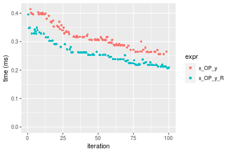

```r
> OP
[1] "-"
> stats <- microbenchmark(x_OP_y = x_OP_y(x, y, OP = OP, na.rm = FALSE), x_OP_y_R = x_OP_y_R(x, y, 
+     OP = OP, na.rm = FALSE), unit = "ms")
> gc()
           used  (Mb) gc trigger  (Mb) max used  (Mb)
Ncells  5415280 289.3    7916910 422.9  7916910 422.9
Vcells 10547089  80.5   39038428 297.9 94934136 724.3
```

_Table: Benchmarking of x_OP_y() and x_OP_y_R() on integer+100x1000+sub data. The top panel shows times in milliseconds and the bottom panel shows relative times._


|   |expr     |      min|       lq|      mean|   median|       uq|      max|
|:--|:--------|--------:|--------:|---------:|--------:|--------:|--------:|
|2  |x_OP_y_R | 0.207133| 0.226874| 0.2563974| 0.253889| 0.269979| 0.399060|
|1  |x_OP_y   | 0.214268| 0.236916| 0.2648584| 0.263563| 0.280436| 0.379632|


|   |expr     |      min|       lq|     mean|   median|       uq|       max|
|:--|:--------|--------:|--------:|--------:|--------:|--------:|---------:|
|2  |x_OP_y_R | 1.000000| 1.000000| 1.000000| 1.000000| 1.000000| 1.0000000|
|1  |x_OP_y   | 1.034447| 1.044263| 1.032999| 1.038103| 1.038733| 0.9513156|

_Figure: Benchmarking of x_OP_y() and x_OP_y_R() on integer+100x1000+sub data.  Outliers are displayed as crosses.  Times are in milliseconds._

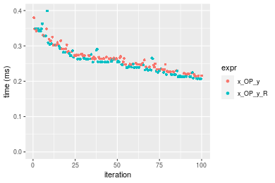

```r
> OP
[1] "*"
> stats <- microbenchmark(x_OP_y = x_OP_y(x, y, OP = OP, na.rm = FALSE), x_OP_y_R = x_OP_y_R(x, y, 
+     OP = OP, na.rm = FALSE), unit = "ms")
> gc()
           used  (Mb) gc trigger  (Mb) max used  (Mb)
Ncells  5415343 289.3    7916910 422.9  7916910 422.9
Vcells 10547766  80.5   39038428 297.9 94934136 724.3
```

_Table: Benchmarking of x_OP_y() and x_OP_y_R() on integer+100x1000+mul data. The top panel shows times in milliseconds and the bottom panel shows relative times._


|   |expr     |      min|        lq|      mean|    median|        uq|      max|
|:--|:--------|--------:|---------:|---------:|---------:|---------:|--------:|
|1  |x_OP_y   | 0.263325| 0.2876820| 0.3101268| 0.3162695| 0.3285000| 0.384502|
|2  |x_OP_y_R | 0.336725| 0.3789075| 0.4059591| 0.4085335| 0.4303695| 0.493282|


|   |expr     |      min|       lq|    mean|   median|       uq|      max|
|:--|:--------|--------:|--------:|-------:|--------:|--------:|--------:|
|1  |x_OP_y   | 1.000000| 1.000000| 1.00000| 1.000000| 1.000000| 1.000000|
|2  |x_OP_y_R | 1.278743| 1.317105| 1.30901| 1.291726| 1.310105| 1.282911|

_Figure: Benchmarking of x_OP_y() and x_OP_y_R() on integer+100x1000+mul data.  Outliers are displayed as crosses.  Times are in milliseconds._


```r
> OP
[1] "/"
> stats <- microbenchmark(x_OP_y = x_OP_y(x, y, OP = OP, na.rm = FALSE), x_OP_y_R = x_OP_y_R(x, y, 
+     OP = OP, na.rm = FALSE), unit = "ms")
> gc()
           used  (Mb) gc trigger  (Mb) max used  (Mb)
Ncells  5415406 289.3    7916910 422.9  7916910 422.9
Vcells 10547808  80.5   39038428 297.9 94934136 724.3
```

_Table: Benchmarking of x_OP_y() and x_OP_y_R() on integer+100x1000+div data. The top panel shows times in milliseconds and the bottom panel shows relative times._


|   |expr     |      min|        lq|      mean|   median|        uq|      max|
|:--|:--------|--------:|---------:|---------:|--------:|---------:|--------:|
|2  |x_OP_y_R | 0.173549| 0.1982010| 0.3415812| 0.405323| 0.4422375| 0.520576|
|1  |x_OP_y   | 0.215580| 0.2433185| 0.3719319| 0.424221| 0.4789150| 0.528031|


|   |expr     |      min|       lq|     mean|   median|       uq|      max|
|:--|:--------|--------:|--------:|--------:|--------:|--------:|--------:|
|2  |x_OP_y_R | 1.000000| 1.000000| 1.000000| 1.000000| 1.000000| 1.000000|
|1  |x_OP_y   | 1.242185| 1.227635| 1.088853| 1.046625| 1.082936| 1.014321|

_Figure: Benchmarking of x_OP_y() and x_OP_y_R() on integer+100x1000+div data.  Outliers are displayed as crosses.  Times are in milliseconds._


### 1000x100 vector

#### All elements
```r
> x <- data[["1000x100"]]
> y <- x[, 1L]
```

```r
> OP
[1] "+"
> stats <- microbenchmark(x_OP_y = x_OP_y(x, y, OP = OP, na.rm = FALSE), x_OP_y_R = x_OP_y_R(x, y, 
+     OP = OP, na.rm = FALSE), unit = "ms")
> gc()
           used  (Mb) gc trigger  (Mb) max used  (Mb)
Ncells  5415469 289.3    7916910 422.9  7916910 422.9
Vcells 10548300  80.5   39038428 297.9 94934136 724.3
```

_Table: Benchmarking of x_OP_y() and x_OP_y_R() on integer+1000x100+add data. The top panel shows times in milliseconds and the bottom panel shows relative times._


|   |expr     |      min|        lq|      mean|    median|        uq|      max|
|:--|:--------|--------:|---------:|---------:|---------:|---------:|--------:|
|2  |x_OP_y_R | 0.218424| 0.2357295| 0.2557380| 0.2600620| 0.2721125| 0.312178|
|1  |x_OP_y   | 0.248858| 0.2639385| 0.2916061| 0.2966775| 0.3095995| 0.371030|


|   |expr     |      min|       lq|     mean|   median|       uq|      max|
|:--|:--------|--------:|--------:|--------:|--------:|--------:|--------:|
|2  |x_OP_y_R | 1.000000| 1.000000| 1.000000| 1.000000| 1.000000| 1.000000|
|1  |x_OP_y   | 1.139334| 1.119667| 1.140253| 1.140795| 1.137763| 1.188521|

_Figure: Benchmarking of x_OP_y() and x_OP_y_R() on integer+1000x100+add data.  Outliers are displayed as crosses.  Times are in milliseconds._


```r
> OP
[1] "-"
> stats <- microbenchmark(x_OP_y = x_OP_y(x, y, OP = OP, na.rm = FALSE), x_OP_y_R = x_OP_y_R(x, y, 
+     OP = OP, na.rm = FALSE), unit = "ms")
> gc()
           used  (Mb) gc trigger  (Mb) max used  (Mb)
Ncells  5415532 289.3    7916910 422.9  7916910 422.9
Vcells 10548342  80.5   39038428 297.9 94934136 724.3
```

_Table: Benchmarking of x_OP_y() and x_OP_y_R() on integer+1000x100+sub data. The top panel shows times in milliseconds and the bottom panel shows relative times._


|   |expr     |      min|       lq|      mean|    median|       uq|      max|
|:--|:--------|--------:|--------:|---------:|---------:|--------:|--------:|
|1  |x_OP_y   | 0.204926| 0.240084| 0.2728040| 0.2592890| 0.312930| 0.392250|
|2  |x_OP_y_R | 0.234384| 0.271386| 0.3122882| 0.3026965| 0.339439| 0.498607|


|   |expr     |      min|       lq|     mean|  median|       uq|      max|
|:--|:--------|--------:|--------:|--------:|-------:|--------:|--------:|
|1  |x_OP_y   | 1.000000| 1.000000| 1.000000| 1.00000| 1.000000| 1.000000|
|2  |x_OP_y_R | 1.143749| 1.130379| 1.144734| 1.16741| 1.084712| 1.271146|

_Figure: Benchmarking of x_OP_y() and x_OP_y_R() on integer+1000x100+sub data.  Outliers are displayed as crosses.  Times are in milliseconds._


```r
> OP
[1] "*"
> stats <- microbenchmark(x_OP_y = x_OP_y(x, y, OP = OP, na.rm = FALSE), x_OP_y_R = x_OP_y_R(x, y, 
+     OP = OP, na.rm = FALSE), unit = "ms")
> gc()
           used  (Mb) gc trigger  (Mb) max used  (Mb)
Ncells  5415595 289.3    7916910 422.9  7916910 422.9
Vcells 10549168  80.5   39038428 297.9 94934136 724.3
```

_Table: Benchmarking of x_OP_y() and x_OP_y_R() on integer+1000x100+mul data. The top panel shows times in milliseconds and the bottom panel shows relative times._


|   |expr     |      min|       lq|      mean|    median|        uq|      max|
|:--|:--------|--------:|--------:|---------:|---------:|---------:|--------:|
|1  |x_OP_y   | 0.243579| 0.272916| 0.3246984| 0.3000865| 0.3279790| 0.733109|
|2  |x_OP_y_R | 0.318497| 0.356502| 0.4213620| 0.4039185| 0.4390145| 0.974944|


|   |expr     |      min|      lq|     mean|   median|       uq|      max|
|:--|:--------|--------:|-------:|--------:|--------:|--------:|--------:|
|1  |x_OP_y   | 1.000000| 1.00000| 1.000000| 1.000000| 1.000000| 1.000000|
|2  |x_OP_y_R | 1.307572| 1.30627| 1.297703| 1.346007| 1.338545| 1.329876|

_Figure: Benchmarking of x_OP_y() and x_OP_y_R() on integer+1000x100+mul data.  Outliers are displayed as crosses.  Times are in milliseconds._


```r
> OP
[1] "/"
> stats <- microbenchmark(x_OP_y = x_OP_y(x, y, OP = OP, na.rm = FALSE), x_OP_y_R = x_OP_y_R(x, y, 
+     OP = OP, na.rm = FALSE), unit = "ms")
> gc()
           used  (Mb) gc trigger  (Mb) max used  (Mb)
Ncells  5415658 289.3    7916910 422.9  7916910 422.9
Vcells 10549210  80.5   39038428 297.9 94934136 724.3
```

_Table: Benchmarking of x_OP_y() and x_OP_y_R() on integer+1000x100+div data. The top panel shows times in milliseconds and the bottom panel shows relative times._


|   |expr     |      min|       lq|      mean|   median|        uq|      max|
|:--|:--------|--------:|--------:|---------:|--------:|---------:|--------:|
|2  |x_OP_y_R | 0.179733| 0.216987| 0.3375957| 0.392457| 0.4359585| 0.500883|
|1  |x_OP_y   | 0.214625| 0.250102| 0.3697244| 0.418205| 0.4710770| 0.520053|


|   |expr     |      min|       lq|     mean|   median|       uq|      max|
|:--|:--------|--------:|--------:|--------:|--------:|--------:|--------:|
|2  |x_OP_y_R | 1.000000| 1.000000| 1.000000| 1.000000| 1.000000| 1.000000|
|1  |x_OP_y   | 1.194132| 1.152613| 1.095169| 1.065607| 1.080555| 1.038272|

_Figure: Benchmarking of x_OP_y() and x_OP_y_R() on integer+1000x100+div data.  Outliers are displayed as crosses.  Times are in milliseconds._

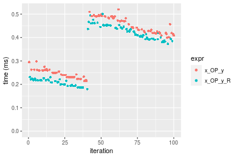


## Data type "double"
### Data
```r
> rmatrix <- function(nrow, ncol, mode = c("logical", "double", "integer", "index"), range = c(-100, 
+     +100), na_prob = 0) {
+     mode <- match.arg(mode)
+     n <- nrow * ncol
+     if (mode == "logical") {
+         x <- sample(c(FALSE, TRUE), size = n, replace = TRUE)
+     }     else if (mode == "index") {
+         x <- seq_len(n)
+         mode <- "integer"
+     }     else {
+         x <- runif(n, min = range[1], max = range[2])
+     }
+     storage.mode(x) <- mode
+     if (na_prob > 0) 
+         x[sample(n, size = na_prob * n)] <- NA
+     dim(x) <- c(nrow, ncol)
+     x
+ }
> rmatrices <- function(scale = 10, seed = 1, ...) {
+     set.seed(seed)
+     data <- list()
+     data[[1]] <- rmatrix(nrow = scale * 1, ncol = scale * 1, ...)
+     data[[2]] <- rmatrix(nrow = scale * 10, ncol = scale * 10, ...)
+     data[[3]] <- rmatrix(nrow = scale * 100, ncol = scale * 1, ...)
+     data[[4]] <- t(data[[3]])
+     data[[5]] <- rmatrix(nrow = scale * 10, ncol = scale * 100, ...)
+     data[[6]] <- t(data[[5]])
+     names(data) <- sapply(data, FUN = function(x) paste(dim(x), collapse = "x"))
+     data
+ }
> data <- rmatrices(mode = mode)
```

### Results

### 10x10 vector

#### All elements
```r
> x <- data[["10x10"]]
> y <- x[, 1L]
```

```r
> OP
[1] "+"
> stats <- microbenchmark(x_OP_y = x_OP_y(x, y, OP = OP, na.rm = FALSE), x_OP_y_R = x_OP_y_R(x, y, 
+     OP = OP, na.rm = FALSE), unit = "ms")
> gc()
           used  (Mb) gc trigger  (Mb) max used  (Mb)
Ncells  5415721 289.3    7916910 422.9  7916910 422.9
Vcells 10663818  81.4   39038428 297.9 94934136 724.3
```

_Table: Benchmarking of x_OP_y() and x_OP_y_R() on double+10x10+add data. The top panel shows times in milliseconds and the bottom panel shows relative times._


|   |expr     |      min|        lq|      mean|    median|        uq|      max|
|:--|:--------|--------:|---------:|---------:|---------:|---------:|--------:|
|2  |x_OP_y_R | 0.001636| 0.0018535| 0.0021567| 0.0019715| 0.0021135| 0.015436|
|1  |x_OP_y   | 0.004026| 0.0043050| 0.0046818| 0.0044380| 0.0046495| 0.021790|


|   |expr     |     min|       lq|     mean|   median|       uq|      max|
|:--|:--------|-------:|--------:|--------:|--------:|--------:|--------:|
|2  |x_OP_y_R | 1.00000| 1.000000| 1.000000| 1.000000| 1.000000| 1.000000|
|1  |x_OP_y   | 2.46088| 2.322633| 2.170772| 2.251078| 2.199905| 1.411635|

_Figure: Benchmarking of x_OP_y() and x_OP_y_R() on double+10x10+add data.  Outliers are displayed as crosses.  Times are in milliseconds._

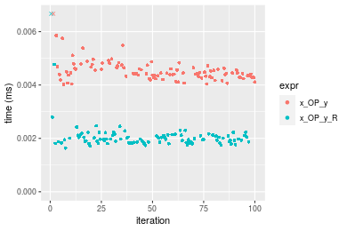

```r
> OP
[1] "-"
> stats <- microbenchmark(x_OP_y = x_OP_y(x, y, OP = OP, na.rm = FALSE), x_OP_y_R = x_OP_y_R(x, y, 
+     OP = OP, na.rm = FALSE), unit = "ms")
> gc()
           used  (Mb) gc trigger  (Mb) max used  (Mb)
Ncells  5415784 289.3    7916910 422.9  7916910 422.9
Vcells 10664780  81.4   39038428 297.9 94934136 724.3
```

_Table: Benchmarking of x_OP_y() and x_OP_y_R() on double+10x10+sub data. The top panel shows times in milliseconds and the bottom panel shows relative times._


|   |expr     |      min|        lq|      mean|   median|       uq|      max|
|:--|:--------|--------:|---------:|---------:|--------:|--------:|--------:|
|2  |x_OP_y_R | 0.001827| 0.0020375| 0.0023971| 0.002163| 0.002267| 0.022385|
|1  |x_OP_y   | 0.004158| 0.0044960| 0.0049764| 0.004698| 0.004911| 0.026761|


|   |expr     |      min|       lq|     mean|   median|       uq|      max|
|:--|:--------|--------:|--------:|--------:|--------:|--------:|--------:|
|2  |x_OP_y_R | 1.000000| 1.000000| 1.000000| 1.000000| 1.000000| 1.000000|
|1  |x_OP_y   | 2.275862| 2.206626| 2.075986| 2.171983| 2.166299| 1.195488|

_Figure: Benchmarking of x_OP_y() and x_OP_y_R() on double+10x10+sub data.  Outliers are displayed as crosses.  Times are in milliseconds._


```r
> OP
[1] "*"
> stats <- microbenchmark(x_OP_y = x_OP_y(x, y, OP = OP, na.rm = FALSE), x_OP_y_R = x_OP_y_R(x, y, 
+     OP = OP, na.rm = FALSE), unit = "ms")
> gc()
           used  (Mb) gc trigger  (Mb) max used  (Mb)
Ncells  5415847 289.3    7916910 422.9  7916910 422.9
Vcells 10664822  81.4   39038428 297.9 94934136 724.3
```

_Table: Benchmarking of x_OP_y() and x_OP_y_R() on double+10x10+mul data. The top panel shows times in milliseconds and the bottom panel shows relative times._


|   |expr     |      min|        lq|      mean|    median|       uq|      max|
|:--|:--------|--------:|---------:|---------:|---------:|--------:|--------:|
|2  |x_OP_y_R | 0.001600| 0.0019155| 0.0021650| 0.0020500| 0.002230| 0.008718|
|1  |x_OP_y   | 0.004074| 0.0043510| 0.0048329| 0.0045505| 0.004805| 0.028044|


|   |expr     |     min|      lq|     mean|   median|       uq|      max|
|:--|:--------|-------:|-------:|--------:|--------:|--------:|--------:|
|2  |x_OP_y_R | 1.00000| 1.00000| 1.000000| 1.000000| 1.000000| 1.000000|
|1  |x_OP_y   | 2.54625| 2.27147| 2.232264| 2.219756| 2.154708| 3.216793|

_Figure: Benchmarking of x_OP_y() and x_OP_y_R() on double+10x10+mul data.  Outliers are displayed as crosses.  Times are in milliseconds._

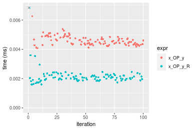

```r
> OP
[1] "/"
> stats <- microbenchmark(x_OP_y = x_OP_y(x, y, OP = OP, na.rm = FALSE), x_OP_y_R = x_OP_y_R(x, y, 
+     OP = OP, na.rm = FALSE), unit = "ms")
> gc()
           used  (Mb) gc trigger  (Mb) max used  (Mb)
Ncells  5415910 289.3    7916910 422.9  7916910 422.9
Vcells 10664864  81.4   39038428 297.9 94934136 724.3
```

_Table: Benchmarking of x_OP_y() and x_OP_y_R() on double+10x10+div data. The top panel shows times in milliseconds and the bottom panel shows relative times._


|   |expr     |      min|        lq|      mean|   median|       uq|      max|
|:--|:--------|--------:|---------:|---------:|--------:|--------:|--------:|
|2  |x_OP_y_R | 0.001672| 0.0020015| 0.0024178| 0.002125| 0.002333| 0.019550|
|1  |x_OP_y   | 0.004130| 0.0043345| 0.0049909| 0.004536| 0.004753| 0.024665|


|   |expr     |      min|       lq|     mean|   median|       uq|      max|
|:--|:--------|--------:|--------:|--------:|--------:|--------:|--------:|
|2  |x_OP_y_R | 1.000000| 1.000000| 1.000000| 1.000000| 1.000000| 1.000000|
|1  |x_OP_y   | 2.470096| 2.165626| 2.064233| 2.134588| 2.037291| 1.261637|

_Figure: Benchmarking of x_OP_y() and x_OP_y_R() on double+10x10+div data.  Outliers are displayed as crosses.  Times are in milliseconds._

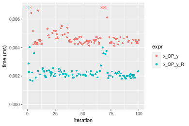


### 100x100 vector

#### All elements
```r
> x <- data[["100x100"]]
> y <- x[, 1L]
```

```r
> OP
[1] "+"
> stats <- microbenchmark(x_OP_y = x_OP_y(x, y, OP = OP, na.rm = FALSE), x_OP_y_R = x_OP_y_R(x, y, 
+     OP = OP, na.rm = FALSE), unit = "ms")
> gc()
           used  (Mb) gc trigger  (Mb) max used  (Mb)
Ncells  5415973 289.3    7916910 422.9  7916910 422.9
Vcells 10664990  81.4   39038428 297.9 94934136 724.3
```

_Table: Benchmarking of x_OP_y() and x_OP_y_R() on double+100x100+add data. The top panel shows times in milliseconds and the bottom panel shows relative times._


|   |expr     |      min|        lq|      mean|    median|        uq|      max|
|:--|:--------|--------:|---------:|---------:|---------:|---------:|--------:|
|2  |x_OP_y_R | 0.015937| 0.0169795| 0.0179701| 0.0173535| 0.0177465| 0.050092|
|1  |x_OP_y   | 0.017434| 0.0187035| 0.0198595| 0.0191415| 0.0197625| 0.051765|


|   |expr     |      min|       lq|     mean|   median|     uq|      max|
|:--|:--------|--------:|--------:|--------:|--------:|------:|--------:|
|2  |x_OP_y_R | 1.000000| 1.000000| 1.000000| 1.000000| 1.0000| 1.000000|
|1  |x_OP_y   | 1.093932| 1.101534| 1.105138| 1.103034| 1.1136| 1.033399|

_Figure: Benchmarking of x_OP_y() and x_OP_y_R() on double+100x100+add data.  Outliers are displayed as crosses.  Times are in milliseconds._


```r
> OP
[1] "-"
> stats <- microbenchmark(x_OP_y = x_OP_y(x, y, OP = OP, na.rm = FALSE), x_OP_y_R = x_OP_y_R(x, y, 
+     OP = OP, na.rm = FALSE), unit = "ms")
> gc()
           used  (Mb) gc trigger  (Mb) max used  (Mb)
Ncells  5416036 289.3    7916910 422.9  7916910 422.9
Vcells 10665032  81.4   39038428 297.9 94934136 724.3
```

_Table: Benchmarking of x_OP_y() and x_OP_y_R() on double+100x100+sub data. The top panel shows times in milliseconds and the bottom panel shows relative times._


|   |expr     |      min|        lq|      mean|    median|        uq|     max|
|:--|:--------|--------:|---------:|---------:|---------:|---------:|-------:|
|1  |x_OP_y   | 0.018938| 0.0194895| 0.0206191| 0.0197555| 0.0202410| 0.05393|
|2  |x_OP_y_R | 0.019021| 0.0195865| 0.0204662| 0.0198735| 0.0201755| 0.05138|


|   |expr     |      min|       lq|      mean|   median|       uq|       max|
|:--|:--------|--------:|--------:|---------:|--------:|--------:|---------:|
|1  |x_OP_y   | 1.000000| 1.000000| 1.0000000| 1.000000| 1.000000| 1.0000000|
|2  |x_OP_y_R | 1.004383| 1.004977| 0.9925855| 1.005973| 0.996764| 0.9527165|

_Figure: Benchmarking of x_OP_y() and x_OP_y_R() on double+100x100+sub data.  Outliers are displayed as crosses.  Times are in milliseconds._


```r
> OP
[1] "*"
> stats <- microbenchmark(x_OP_y = x_OP_y(x, y, OP = OP, na.rm = FALSE), x_OP_y_R = x_OP_y_R(x, y, 
+     OP = OP, na.rm = FALSE), unit = "ms")
> gc()
           used  (Mb) gc trigger  (Mb) max used  (Mb)
Ncells  5416099 289.3    7916910 422.9  7916910 422.9
Vcells 10665074  81.4   39038428 297.9 94934136 724.3
```

_Table: Benchmarking of x_OP_y() and x_OP_y_R() on double+100x100+mul data. The top panel shows times in milliseconds and the bottom panel shows relative times._


|   |expr     |      min|        lq|      mean|    median|        uq|      max|
|:--|:--------|--------:|---------:|---------:|---------:|---------:|--------:|
|2  |x_OP_y_R | 0.016980| 0.0177195| 0.0188028| 0.0180590| 0.0184470| 0.037352|
|1  |x_OP_y   | 0.018799| 0.0195505| 0.0212312| 0.0199105| 0.0203675| 0.051589|


|   |expr     |      min|       lq|     mean|   median|       uq|      max|
|:--|:--------|--------:|--------:|--------:|--------:|--------:|--------:|
|2  |x_OP_y_R | 1.000000| 1.000000| 1.000000| 1.000000| 1.000000| 1.000000|
|1  |x_OP_y   | 1.107126| 1.103333| 1.129153| 1.102525| 1.104109| 1.381158|

_Figure: Benchmarking of x_OP_y() and x_OP_y_R() on double+100x100+mul data.  Outliers are displayed as crosses.  Times are in milliseconds._


```r
> OP
[1] "/"
> stats <- microbenchmark(x_OP_y = x_OP_y(x, y, OP = OP, na.rm = FALSE), x_OP_y_R = x_OP_y_R(x, y, 
+     OP = OP, na.rm = FALSE), unit = "ms")
> gc()
           used  (Mb) gc trigger  (Mb) max used  (Mb)
Ncells  5416162 289.3    7916910 422.9  7916910 422.9
Vcells 10666221  81.4   39038428 297.9 94934136 724.3
```

_Table: Benchmarking of x_OP_y() and x_OP_y_R() on double+100x100+div data. The top panel shows times in milliseconds and the bottom panel shows relative times._


|   |expr     |      min|        lq|      mean|    median|       uq|      max|
|:--|:--------|--------:|---------:|---------:|---------:|--------:|--------:|
|2  |x_OP_y_R | 0.019233| 0.0197785| 0.0207181| 0.0199875| 0.020269| 0.052269|
|1  |x_OP_y   | 0.021696| 0.0223820| 0.0230580| 0.0227015| 0.023075| 0.040945|


|   |expr     |      min|       lq|     mean|   median|       uq|       max|
|:--|:--------|--------:|--------:|--------:|--------:|--------:|---------:|
|2  |x_OP_y_R | 1.000000| 1.000000| 1.000000| 1.000000| 1.000000| 1.0000000|
|1  |x_OP_y   | 1.128061| 1.131633| 1.112938| 1.135785| 1.138438| 0.7833515|

_Figure: Benchmarking of x_OP_y() and x_OP_y_R() on double+100x100+div data.  Outliers are displayed as crosses.  Times are in milliseconds._


### 1000x10 vector

#### All elements
```r
> x <- data[["1000x10"]]
> y <- x[, 1L]
```

```r
> OP
[1] "+"
> stats <- microbenchmark(x_OP_y = x_OP_y(x, y, OP = OP, na.rm = FALSE), x_OP_y_R = x_OP_y_R(x, y, 
+     OP = OP, na.rm = FALSE), unit = "ms")
> gc()
           used  (Mb) gc trigger  (Mb) max used  (Mb)
Ncells  5416225 289.3    7916910 422.9  7916910 422.9
Vcells 10667163  81.4   39038428 297.9 94934136 724.3
```

_Table: Benchmarking of x_OP_y() and x_OP_y_R() on double+1000x10+add data. The top panel shows times in milliseconds and the bottom panel shows relative times._


|   |expr     |      min|       lq|      mean|   median|        uq|      max|
|:--|:--------|--------:|--------:|---------:|--------:|---------:|--------:|
|2  |x_OP_y_R | 0.015873| 0.016901| 0.0185272| 0.017479| 0.0183390| 0.048790|
|1  |x_OP_y   | 0.017227| 0.018503| 0.0193969| 0.019042| 0.0196345| 0.037878|


|   |expr     |      min|       lq|     mean|   median|       uq|       max|
|:--|:--------|--------:|--------:|--------:|--------:|--------:|---------:|
|2  |x_OP_y_R | 1.000000| 1.000000| 1.000000| 1.000000| 1.000000| 1.0000000|
|1  |x_OP_y   | 1.085302| 1.094787| 1.046944| 1.089422| 1.070642| 0.7763476|

_Figure: Benchmarking of x_OP_y() and x_OP_y_R() on double+1000x10+add data.  Outliers are displayed as crosses.  Times are in milliseconds._


```r
> OP
[1] "-"
> stats <- microbenchmark(x_OP_y = x_OP_y(x, y, OP = OP, na.rm = FALSE), x_OP_y_R = x_OP_y_R(x, y, 
+     OP = OP, na.rm = FALSE), unit = "ms")
> gc()
           used  (Mb) gc trigger  (Mb) max used  (Mb)
Ncells  5416288 289.3    7916910 422.9  7916910 422.9
Vcells 10667205  81.4   39038428 297.9 94934136 724.3
```

_Table: Benchmarking of x_OP_y() and x_OP_y_R() on double+1000x10+sub data. The top panel shows times in milliseconds and the bottom panel shows relative times._


|   |expr     |      min|       lq|      mean|    median|        uq|      max|
|:--|:--------|--------:|--------:|---------:|---------:|---------:|--------:|
|1  |x_OP_y   | 0.017902| 0.018679| 0.0196484| 0.0191175| 0.0200615| 0.036702|
|2  |x_OP_y_R | 0.018442| 0.018923| 0.0203766| 0.0193960| 0.0202425| 0.050510|


|   |expr     |      min|       lq|     mean|   median|       uq|      max|
|:--|:--------|--------:|--------:|--------:|--------:|--------:|--------:|
|1  |x_OP_y   | 1.000000| 1.000000| 1.000000| 1.000000| 1.000000| 1.000000|
|2  |x_OP_y_R | 1.030164| 1.013063| 1.037062| 1.014568| 1.009022| 1.376219|

_Figure: Benchmarking of x_OP_y() and x_OP_y_R() on double+1000x10+sub data.  Outliers are displayed as crosses.  Times are in milliseconds._


```r
> OP
[1] "*"
> stats <- microbenchmark(x_OP_y = x_OP_y(x, y, OP = OP, na.rm = FALSE), x_OP_y_R = x_OP_y_R(x, y, 
+     OP = OP, na.rm = FALSE), unit = "ms")
> gc()
           used  (Mb) gc trigger  (Mb) max used  (Mb)
Ncells  5416351 289.3    7916910 422.9  7916910 422.9
Vcells 10667247  81.4   39038428 297.9 94934136 724.3
```

_Table: Benchmarking of x_OP_y() and x_OP_y_R() on double+1000x10+mul data. The top panel shows times in milliseconds and the bottom panel shows relative times._


|   |expr     |      min|        lq|      mean|    median|       uq|      max|
|:--|:--------|--------:|---------:|---------:|---------:|--------:|--------:|
|2  |x_OP_y_R | 0.016905| 0.0175890| 0.0180825| 0.0179005| 0.018162| 0.025523|
|1  |x_OP_y   | 0.018776| 0.0193595| 0.0208565| 0.0197540| 0.020330| 0.069348|


|   |expr     |      min|       lq|     mean|   median|      uq|      max|
|:--|:--------|--------:|--------:|--------:|--------:|-------:|--------:|
|2  |x_OP_y_R | 1.000000| 1.000000| 1.000000| 1.000000| 1.00000| 1.000000|
|1  |x_OP_y   | 1.110677| 1.100659| 1.153409| 1.103545| 1.11937| 2.717079|

_Figure: Benchmarking of x_OP_y() and x_OP_y_R() on double+1000x10+mul data.  Outliers are displayed as crosses.  Times are in milliseconds._


```r
> OP
[1] "/"
> stats <- microbenchmark(x_OP_y = x_OP_y(x, y, OP = OP, na.rm = FALSE), x_OP_y_R = x_OP_y_R(x, y, 
+     OP = OP, na.rm = FALSE), unit = "ms")
> gc()
           used  (Mb) gc trigger  (Mb) max used  (Mb)
Ncells  5416414 289.3    7916910 422.9  7916910 422.9
Vcells 10667289  81.4   39038428 297.9 94934136 724.3
```

_Table: Benchmarking of x_OP_y() and x_OP_y_R() on double+1000x10+div data. The top panel shows times in milliseconds and the bottom panel shows relative times._


|   |expr     |      min|        lq|      mean|    median|        uq|      max|
|:--|:--------|--------:|---------:|---------:|---------:|---------:|--------:|
|2  |x_OP_y_R | 0.019284| 0.0197845| 0.0203245| 0.0199935| 0.0203230| 0.037019|
|1  |x_OP_y   | 0.021935| 0.0224130| 0.0235238| 0.0228125| 0.0231405| 0.055052|


|   |expr     |      min|       lq|     mean|   median|       uq|      max|
|:--|:--------|--------:|--------:|--------:|--------:|--------:|--------:|
|2  |x_OP_y_R | 1.000000| 1.000000| 1.000000| 1.000000| 1.000000| 1.000000|
|1  |x_OP_y   | 1.137471| 1.132856| 1.157411| 1.140996| 1.138636| 1.487128|

_Figure: Benchmarking of x_OP_y() and x_OP_y_R() on double+1000x10+div data.  Outliers are displayed as crosses.  Times are in milliseconds._

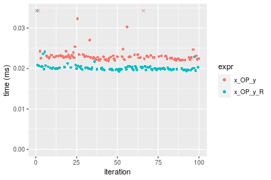


### 10x1000 vector

#### All elements
```r
> x <- data[["10x1000"]]
> y <- x[, 1L]
```

```r
> OP
[1] "+"
> stats <- microbenchmark(x_OP_y = x_OP_y(x, y, OP = OP, na.rm = FALSE), x_OP_y_R = x_OP_y_R(x, y, 
+     OP = OP, na.rm = FALSE), unit = "ms")
> gc()
           used  (Mb) gc trigger  (Mb) max used  (Mb)
Ncells  5416477 289.3    7916910 422.9  7916910 422.9
Vcells 10666347  81.4   39038428 297.9 94934136 724.3
```

_Table: Benchmarking of x_OP_y() and x_OP_y_R() on double+10x1000+add data. The top panel shows times in milliseconds and the bottom panel shows relative times._


|   |expr     |      min|        lq|      mean|   median|        uq|      max|
|:--|:--------|--------:|---------:|---------:|--------:|---------:|--------:|
|2  |x_OP_y_R | 0.016938| 0.0177040| 0.0182197| 0.017965| 0.0183240| 0.025058|
|1  |x_OP_y   | 0.018568| 0.0191845| 0.0202301| 0.019488| 0.0199165| 0.051692|


|   |expr     |      min|       lq|     mean|   median|       uq|      max|
|:--|:--------|--------:|--------:|--------:|--------:|--------:|--------:|
|2  |x_OP_y_R | 1.000000| 1.000000| 1.000000| 1.000000| 1.000000| 1.000000|
|1  |x_OP_y   | 1.096233| 1.083625| 1.110345| 1.084776| 1.086908| 2.062894|

_Figure: Benchmarking of x_OP_y() and x_OP_y_R() on double+10x1000+add data.  Outliers are displayed as crosses.  Times are in milliseconds._

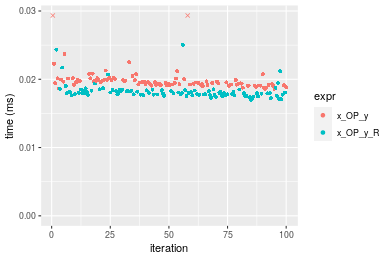

```r
> OP
[1] "-"
> stats <- microbenchmark(x_OP_y = x_OP_y(x, y, OP = OP, na.rm = FALSE), x_OP_y_R = x_OP_y_R(x, y, 
+     OP = OP, na.rm = FALSE), unit = "ms")
> gc()
           used  (Mb) gc trigger  (Mb) max used  (Mb)
Ncells  5416540 289.3    7916910 422.9  7916910 422.9
Vcells 10667717  81.4   39038428 297.9 94934136 724.3
```

_Table: Benchmarking of x_OP_y() and x_OP_y_R() on double+10x1000+sub data. The top panel shows times in milliseconds and the bottom panel shows relative times._


|   |expr     |      min|        lq|      mean|    median|        uq|      max|
|:--|:--------|--------:|---------:|---------:|---------:|---------:|--------:|
|1  |x_OP_y   | 0.017948| 0.0191505| 0.0202394| 0.0195675| 0.0199100| 0.049754|
|2  |x_OP_y_R | 0.018297| 0.0190745| 0.0200302| 0.0198000| 0.0202385| 0.033064|


|   |expr     |      min|        lq|      mean|   median|       uq|       max|
|:--|:--------|--------:|---------:|---------:|--------:|--------:|---------:|
|1  |x_OP_y   | 1.000000| 1.0000000| 1.0000000| 1.000000| 1.000000| 1.0000000|
|2  |x_OP_y_R | 1.019445| 0.9960314| 0.9896627| 1.011882| 1.016499| 0.6645496|

_Figure: Benchmarking of x_OP_y() and x_OP_y_R() on double+10x1000+sub data.  Outliers are displayed as crosses.  Times are in milliseconds._

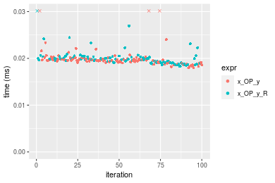

```r
> OP
[1] "*"
> stats <- microbenchmark(x_OP_y = x_OP_y(x, y, OP = OP, na.rm = FALSE), x_OP_y_R = x_OP_y_R(x, y, 
+     OP = OP, na.rm = FALSE), unit = "ms")
> gc()
           used  (Mb) gc trigger  (Mb) max used  (Mb)
Ncells  5416603 289.3    7916910 422.9  7916910 422.9
Vcells 10667759  81.4   39038428 297.9 94934136 724.3
```

_Table: Benchmarking of x_OP_y() and x_OP_y_R() on double+10x1000+mul data. The top panel shows times in milliseconds and the bottom panel shows relative times._


|   |expr     |      min|        lq|      mean|    median|        uq|      max|
|:--|:--------|--------:|---------:|---------:|---------:|---------:|--------:|
|2  |x_OP_y_R | 0.015709| 0.0169650| 0.0178209| 0.0172535| 0.0176375| 0.048522|
|1  |x_OP_y   | 0.017060| 0.0184585| 0.0196658| 0.0189410| 0.0195765| 0.049231|


|   |expr     |      min|       lq|     mean|   median|       uq|      max|
|:--|:--------|--------:|--------:|--------:|--------:|--------:|--------:|
|2  |x_OP_y_R | 1.000000| 1.000000| 1.000000| 1.000000| 1.000000| 1.000000|
|1  |x_OP_y   | 1.086002| 1.088034| 1.103527| 1.097806| 1.109936| 1.014612|

_Figure: Benchmarking of x_OP_y() and x_OP_y_R() on double+10x1000+mul data.  Outliers are displayed as crosses.  Times are in milliseconds._

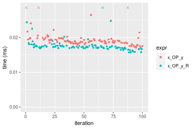

```r
> OP
[1] "/"
> stats <- microbenchmark(x_OP_y = x_OP_y(x, y, OP = OP, na.rm = FALSE), x_OP_y_R = x_OP_y_R(x, y, 
+     OP = OP, na.rm = FALSE), unit = "ms")
> gc()
           used  (Mb) gc trigger  (Mb) max used  (Mb)
Ncells  5416666 289.3    7916910 422.9  7916910 422.9
Vcells 10667801  81.4   39038428 297.9 94934136 724.3
```

_Table: Benchmarking of x_OP_y() and x_OP_y_R() on double+10x1000+div data. The top panel shows times in milliseconds and the bottom panel shows relative times._


|   |expr     |      min|        lq|      mean|    median|        uq|      max|
|:--|:--------|--------:|---------:|---------:|---------:|---------:|--------:|
|2  |x_OP_y_R | 0.018263| 0.0193205| 0.0200639| 0.0198605| 0.0203415| 0.029922|
|1  |x_OP_y   | 0.021068| 0.0219500| 0.0234009| 0.0224820| 0.0229995| 0.054567|


|   |expr     |      min|       lq|     mean|   median|       uq|      max|
|:--|:--------|--------:|--------:|--------:|--------:|--------:|--------:|
|2  |x_OP_y_R | 1.000000| 1.000000| 1.000000| 1.000000| 1.000000| 1.000000|
|1  |x_OP_y   | 1.153589| 1.136099| 1.166319| 1.131996| 1.130669| 1.823641|

_Figure: Benchmarking of x_OP_y() and x_OP_y_R() on double+10x1000+div data.  Outliers are displayed as crosses.  Times are in milliseconds._


### 100x1000 vector

#### All elements
```r
> x <- data[["100x1000"]]
> y <- x[, 1L]
```

```r
> OP
[1] "+"
> stats <- microbenchmark(x_OP_y = x_OP_y(x, y, OP = OP, na.rm = FALSE), x_OP_y_R = x_OP_y_R(x, y, 
+     OP = OP, na.rm = FALSE), unit = "ms")
> gc()
           used  (Mb) gc trigger  (Mb) max used  (Mb)
Ncells  5416729 289.3    7916910 422.9  7916910 422.9
Vcells 10667927  81.4   39038428 297.9 94934136 724.3
```

_Table: Benchmarking of x_OP_y() and x_OP_y_R() on double+100x1000+add data. The top panel shows times in milliseconds and the bottom panel shows relative times._


|   |expr     |      min|        lq|      mean|    median|        uq|      max|
|:--|:--------|--------:|---------:|---------:|---------:|---------:|--------:|
|1  |x_OP_y   | 0.126234| 0.1426845| 0.2809578| 0.3434185| 0.3911035| 0.445408|
|2  |x_OP_y_R | 0.134252| 0.1541160| 0.2975768| 0.3517350| 0.3876935| 0.452414|


|   |expr     |      min|       lq|     mean|   median|        uq|      max|
|:--|:--------|--------:|--------:|--------:|--------:|---------:|--------:|
|1  |x_OP_y   | 1.000000| 1.000000| 1.000000| 1.000000| 1.0000000| 1.000000|
|2  |x_OP_y_R | 1.063517| 1.080117| 1.059151| 1.024217| 0.9912811| 1.015729|

_Figure: Benchmarking of x_OP_y() and x_OP_y_R() on double+100x1000+add data.  Outliers are displayed as crosses.  Times are in milliseconds._

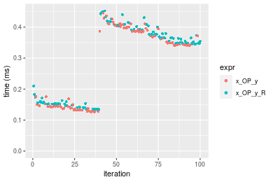

```r
> OP
[1] "-"
> stats <- microbenchmark(x_OP_y = x_OP_y(x, y, OP = OP, na.rm = FALSE), x_OP_y_R = x_OP_y_R(x, y, 
+     OP = OP, na.rm = FALSE), unit = "ms")
> gc()
           used  (Mb) gc trigger  (Mb) max used  (Mb)
Ncells  5416792 289.3    7916910 422.9  7916910 422.9
Vcells 10667969  81.4   39038428 297.9 94934136 724.3
```

_Table: Benchmarking of x_OP_y() and x_OP_y_R() on double+100x1000+sub data. The top panel shows times in milliseconds and the bottom panel shows relative times._


|   |expr     |      min|        lq|      mean|   median|        uq|      max|
|:--|:--------|--------:|---------:|---------:|--------:|---------:|--------:|
|1  |x_OP_y   | 0.119238| 0.1326565| 0.2733983| 0.341503| 0.3836775| 0.413903|
|2  |x_OP_y_R | 0.147918| 0.1673165| 0.3080147| 0.361057| 0.4063995| 0.448076|


|   |expr     |      min|       lq|     mean|   median|       uq|      max|
|:--|:--------|--------:|--------:|--------:|--------:|--------:|--------:|
|1  |x_OP_y   | 1.000000| 1.000000| 1.000000| 1.000000| 1.000000| 1.000000|
|2  |x_OP_y_R | 1.240527| 1.261276| 1.126615| 1.057259| 1.059222| 1.082563|

_Figure: Benchmarking of x_OP_y() and x_OP_y_R() on double+100x1000+sub data.  Outliers are displayed as crosses.  Times are in milliseconds._


```r
> OP
[1] "*"
> stats <- microbenchmark(x_OP_y = x_OP_y(x, y, OP = OP, na.rm = FALSE), x_OP_y_R = x_OP_y_R(x, y, 
+     OP = OP, na.rm = FALSE), unit = "ms")
> gc()
           used  (Mb) gc trigger  (Mb) max used  (Mb)
Ncells  5416855 289.3    7916910 422.9  7916910 422.9
Vcells 10668011  81.4   39038428 297.9 94934136 724.3
```

_Table: Benchmarking of x_OP_y() and x_OP_y_R() on double+100x1000+mul data. The top panel shows times in milliseconds and the bottom panel shows relative times._


|   |expr     |      min|        lq|      mean|   median|        uq|      max|
|:--|:--------|--------:|---------:|---------:|--------:|---------:|--------:|
|1  |x_OP_y   | 0.122301| 0.1324765| 0.2802148| 0.344373| 0.3888135| 0.552690|
|2  |x_OP_y_R | 0.129927| 0.1464740| 0.2970998| 0.354247| 0.4025355| 0.521488|


|   |expr     |      min|      lq|     mean|   median|       uq|       max|
|:--|:--------|--------:|-------:|--------:|--------:|--------:|---------:|
|1  |x_OP_y   | 1.000000| 1.00000| 1.000000| 1.000000| 1.000000| 1.0000000|
|2  |x_OP_y_R | 1.062354| 1.10566| 1.060257| 1.028672| 1.035292| 0.9435452|

_Figure: Benchmarking of x_OP_y() and x_OP_y_R() on double+100x1000+mul data.  Outliers are displayed as crosses.  Times are in milliseconds._


```r
> OP
[1] "/"
> stats <- microbenchmark(x_OP_y = x_OP_y(x, y, OP = OP, na.rm = FALSE), x_OP_y_R = x_OP_y_R(x, y, 
+     OP = OP, na.rm = FALSE), unit = "ms")
> gc()
           used  (Mb) gc trigger  (Mb) max used  (Mb)
Ncells  5416918 289.3    7916910 422.9  7916910 422.9
Vcells 10668053  81.4   39038428 297.9 94934136 724.3
```

_Table: Benchmarking of x_OP_y() and x_OP_y_R() on double+100x1000+div data. The top panel shows times in milliseconds and the bottom panel shows relative times._


|   |expr     |      min|        lq|      mean|    median|        uq|      max|
|:--|:--------|--------:|---------:|---------:|---------:|---------:|--------:|
|1  |x_OP_y   | 0.144130| 0.1598995| 0.2913056| 0.3468255| 0.4011815| 0.441631|
|2  |x_OP_y_R | 0.142693| 0.1662600| 0.3057355| 0.3545605| 0.4060015| 0.455083|


|   |expr     |       min|       lq|     mean|   median|       uq|     max|
|:--|:--------|---------:|--------:|--------:|--------:|--------:|-------:|
|1  |x_OP_y   | 1.0000000| 1.000000| 1.000000| 1.000000| 1.000000| 1.00000|
|2  |x_OP_y_R | 0.9900298| 1.039778| 1.049535| 1.022302| 1.012015| 1.03046|

_Figure: Benchmarking of x_OP_y() and x_OP_y_R() on double+100x1000+div data.  Outliers are displayed as crosses.  Times are in milliseconds._

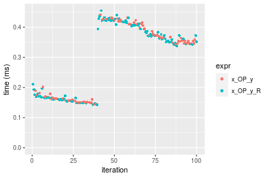


### 1000x100 vector

#### All elements
```r
> x <- data[["1000x100"]]
> y <- x[, 1L]
```

```r
> OP
[1] "+"
> stats <- microbenchmark(x_OP_y = x_OP_y(x, y, OP = OP, na.rm = FALSE), x_OP_y_R = x_OP_y_R(x, y, 
+     OP = OP, na.rm = FALSE), unit = "ms")
> gc()
           used  (Mb) gc trigger  (Mb) max used  (Mb)
Ncells  5416981 289.3    7916910 422.9  7916910 422.9
Vcells 10668995  81.4   39038428 297.9 94934136 724.3
```

_Table: Benchmarking of x_OP_y() and x_OP_y_R() on double+1000x100+add data. The top panel shows times in milliseconds and the bottom panel shows relative times._


|   |expr     |      min|        lq|      mean|    median|       uq|      max|
|:--|:--------|--------:|---------:|---------:|---------:|--------:|--------:|
|1  |x_OP_y   | 0.130862| 0.1433530| 0.2965059| 0.3681460| 0.395757| 0.487060|
|2  |x_OP_y_R | 0.139765| 0.1530895| 0.3111418| 0.3809985| 0.406488| 0.480899|


|   |expr     |      min|      lq|     mean|   median|       uq|       max|
|:--|:--------|--------:|-------:|--------:|--------:|--------:|---------:|
|1  |x_OP_y   | 1.000000| 1.00000| 1.000000| 1.000000| 1.000000| 1.0000000|
|2  |x_OP_y_R | 1.068034| 1.06792| 1.049362| 1.034911| 1.027115| 0.9873506|

_Figure: Benchmarking of x_OP_y() and x_OP_y_R() on double+1000x100+add data.  Outliers are displayed as crosses.  Times are in milliseconds._

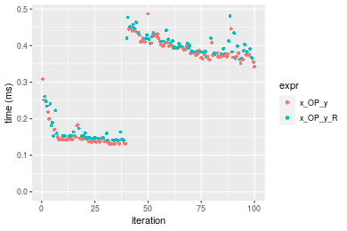

```r
> OP
[1] "-"
> stats <- microbenchmark(x_OP_y = x_OP_y(x, y, OP = OP, na.rm = FALSE), x_OP_y_R = x_OP_y_R(x, y, 
+     OP = OP, na.rm = FALSE), unit = "ms")
> gc()
           used  (Mb) gc trigger  (Mb) max used  (Mb)
Ncells  5417044 289.4    7916910 422.9  7916910 422.9
Vcells 10670627  81.5   39038428 297.9 94934136 724.3
```

_Table: Benchmarking of x_OP_y() and x_OP_y_R() on double+1000x100+sub data. The top panel shows times in milliseconds and the bottom panel shows relative times._


|   |expr     |      min|        lq|      mean|    median|        uq|      max|
|:--|:--------|--------:|---------:|---------:|---------:|---------:|--------:|
|1  |x_OP_y   | 0.126619| 0.1427050| 0.2913081| 0.3531805| 0.3961785| 0.441303|
|2  |x_OP_y_R | 0.152317| 0.1669595| 0.3057430| 0.3648710| 0.4167585| 0.453241|


|   |expr     |      min|       lq|     mean|   median|       uq|      max|
|:--|:--------|--------:|--------:|--------:|--------:|--------:|--------:|
|1  |x_OP_y   | 1.000000| 1.000000| 1.000000| 1.000000| 1.000000| 1.000000|
|2  |x_OP_y_R | 1.202955| 1.169963| 1.049552| 1.033101| 1.051946| 1.027052|

_Figure: Benchmarking of x_OP_y() and x_OP_y_R() on double+1000x100+sub data.  Outliers are displayed as crosses.  Times are in milliseconds._


```r
> OP
[1] "*"
> stats <- microbenchmark(x_OP_y = x_OP_y(x, y, OP = OP, na.rm = FALSE), x_OP_y_R = x_OP_y_R(x, y, 
+     OP = OP, na.rm = FALSE), unit = "ms")
> gc()
           used  (Mb) gc trigger  (Mb) max used  (Mb)
Ncells  5417107 289.4    7916910 422.9  7916910 422.9
Vcells 10670669  81.5   39038428 297.9 94934136 724.3
```

_Table: Benchmarking of x_OP_y() and x_OP_y_R() on double+1000x100+mul data. The top panel shows times in milliseconds and the bottom panel shows relative times._


|   |expr     |      min|       lq|      mean|   median|        uq|      max|
|:--|:--------|--------:|--------:|---------:|--------:|---------:|--------:|
|1  |x_OP_y   | 0.130735| 0.142609| 0.2874260| 0.350753| 0.3958225| 0.447575|
|2  |x_OP_y_R | 0.139397| 0.152527| 0.2977497| 0.357040| 0.4032735| 0.449363|


|   |expr     |      min|       lq|     mean|   median|       uq|      max|
|:--|:--------|--------:|--------:|--------:|--------:|--------:|--------:|
|1  |x_OP_y   | 1.000000| 1.000000| 1.000000| 1.000000| 1.000000| 1.000000|
|2  |x_OP_y_R | 1.066256| 1.069547| 1.035918| 1.017924| 1.018824| 1.003995|

_Figure: Benchmarking of x_OP_y() and x_OP_y_R() on double+1000x100+mul data.  Outliers are displayed as crosses.  Times are in milliseconds._

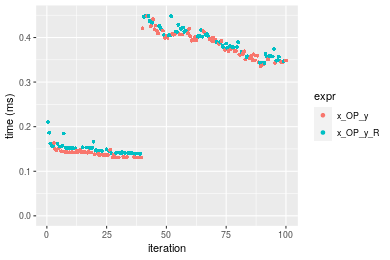

```r
> OP
[1] "/"
> stats <- microbenchmark(x_OP_y = x_OP_y(x, y, OP = OP, na.rm = FALSE), x_OP_y_R = x_OP_y_R(x, y, 
+     OP = OP, na.rm = FALSE), unit = "ms")
> gc()
           used  (Mb) gc trigger  (Mb) max used  (Mb)
Ncells  5417170 289.4    7916910 422.9  7916910 422.9
Vcells 10670711  81.5   39038428 297.9 94934136 724.3
```

_Table: Benchmarking of x_OP_y() and x_OP_y_R() on double+1000x100+div data. The top panel shows times in milliseconds and the bottom panel shows relative times._


|   |expr     |      min|        lq|      mean|    median|        uq|      max|
|:--|:--------|--------:|---------:|---------:|---------:|---------:|--------:|
|2  |x_OP_y_R | 0.152285| 0.1729235| 0.3116299| 0.3647405| 0.4177895| 0.470703|
|1  |x_OP_y   | 0.155192| 0.1752165| 0.3124604| 0.3659615| 0.4216820| 0.461336|


|   |expr     |      min|      lq|     mean|   median|       uq|    max|
|:--|:--------|--------:|-------:|--------:|--------:|--------:|------:|
|2  |x_OP_y_R | 1.000000| 1.00000| 1.000000| 1.000000| 1.000000| 1.0000|
|1  |x_OP_y   | 1.019089| 1.01326| 1.002665| 1.003348| 1.009317| 0.9801|

_Figure: Benchmarking of x_OP_y() and x_OP_y_R() on double+1000x100+div data.  Outliers are displayed as crosses.  Times are in milliseconds._


## Appendix

### Session information
```r
R version 4.1.1 Patched (2021-08-10 r80727)
Platform: x86_64-pc-linux-gnu (64-bit)
Running under: Ubuntu 18.04.5 LTS

Matrix products: default
BLAS:   /home/hb/software/R-devel/R-4-1-branch/lib/R/lib/libRblas.so
LAPACK: /home/hb/software/R-devel/R-4-1-branch/lib/R/lib/libRlapack.so

locale:
 [1] LC_CTYPE=en_US.UTF-8       LC_NUMERIC=C              
 [3] LC_TIME=en_US.UTF-8        LC_COLLATE=en_US.UTF-8    
 [5] LC_MONETARY=en_US.UTF-8    LC_MESSAGES=en_US.UTF-8   
 [7] LC_PAPER=en_US.UTF-8       LC_NAME=C                 
 [9] LC_ADDRESS=C               LC_TELEPHONE=C            
[11] LC_MEASUREMENT=en_US.UTF-8 LC_IDENTIFICATION=C       

attached base packages:
[1] stats     graphics  grDevices utils     datasets  methods   base     

other attached packages:
[1] microbenchmark_1.4-7   matrixStats_0.60.0     ggplot2_3.3.5         
[4] knitr_1.33             R.devices_2.17.0       R.utils_2.10.1        
[7] R.oo_1.24.0            R.methodsS3_1.8.1-9001 history_0.0.1-9000    

loaded via a namespace (and not attached):
 [1] Biobase_2.52.0          httr_1.4.2              splines_4.1.1          
 [4] bit64_4.0.5             network_1.17.1          assertthat_0.2.1       
 [7] highr_0.9               stats4_4.1.1            blob_1.2.2             
[10] GenomeInfoDbData_1.2.6  robustbase_0.93-8       pillar_1.6.2           
[13] RSQLite_2.2.8           lattice_0.20-44         limma_3.48.3           
[16] glue_1.4.2              digest_0.6.27           XVector_0.32.0         
[19] colorspace_2.0-2        Matrix_1.3-4            XML_3.99-0.7           
[22] pkgconfig_2.0.3         zlibbioc_1.38.0         genefilter_1.74.0      
[25] purrr_0.3.4             ergm_4.1.2              xtable_1.8-4           
[28] scales_1.1.1            tibble_3.1.4            annotate_1.70.0        
[31] KEGGREST_1.32.0         farver_2.1.0            generics_0.1.0         
[34] IRanges_2.26.0          ellipsis_0.3.2          cachem_1.0.6           
[37] withr_2.4.2             BiocGenerics_0.38.0     mime_0.11              
[40] survival_3.2-13         magrittr_2.0.1          crayon_1.4.1           
[43] statnet.common_4.5.0    memoise_2.0.0           laeken_0.5.1           
[46] fansi_0.5.0             R.cache_0.15.0          MASS_7.3-54            
[49] R.rsp_0.44.0            progressr_0.8.0         tools_4.1.1            
[52] lifecycle_1.0.0         S4Vectors_0.30.0        trust_0.1-8            
[55] munsell_0.5.0           tabby_0.0.1-9001        AnnotationDbi_1.54.1   
[58] Biostrings_2.60.2       compiler_4.1.1          GenomeInfoDb_1.28.1    
[61] rlang_0.4.11            grid_4.1.1              RCurl_1.98-1.4         
[64] cwhmisc_6.6             rstudioapi_0.13         rappdirs_0.3.3         
[67] startup_0.15.0-9000     labeling_0.4.2          bitops_1.0-7           
[70] base64enc_0.1-3         boot_1.3-28             gtable_0.3.0           
[73] DBI_1.1.1               markdown_1.1            R6_2.5.1               
[76] lpSolveAPI_5.5.2.0-17.7 rle_0.9.2               dplyr_1.0.7            
[79] fastmap_1.1.0           bit_4.0.4               utf8_1.2.2             
[82] parallel_4.1.1          Rcpp_1.0.7              vctrs_0.3.8            
[85] png_0.1-7               DEoptimR_1.0-9          tidyselect_1.1.1       
[88] xfun_0.25               coda_0.19-4            
```
Total processing time was 1.18 mins.


### Reproducibility
To reproduce this report, do:
```r
html <- matrixStats:::benchmark('x_OP_y')
```

[RSP]: https://cran.r-project.org/package=R.rsp
[matrixStats]: https://cran.r-project.org/package=matrixStats

[StackOverflow:colMins?]: https://stackoverflow.com/questions/13676878 "Stack Overflow: fastest way to get Min from every column in a matrix?"
[StackOverflow:colSds?]: https://stackoverflow.com/questions/17549762 "Stack Overflow: Is there such 'colsd' in R?"
[StackOverflow:rowProds?]: https://stackoverflow.com/questions/20198801/ "Stack Overflow: Row product of matrix and column sum of matrix"

---------------------------------------
Copyright Henrik Bengtsson. Last updated on 2021-08-25 22:55:01 (+0200 UTC). Powered by [RSP].

<script>
 var link = document.createElement('link');
 link.rel = 'icon';
 link.href = "data:image/png;base64,iVBORw0KGgoAAAANSUhEUgAAACAAAAAgCAMAAABEpIrGAAAA21BMVEUAAAAAAP8AAP8AAP8AAP8AAP8AAP8AAP8AAP8AAP8AAP8AAP8AAP8AAP8AAP8AAP8AAP8AAP8AAP8AAP8AAP8AAP8AAP8AAP8AAP8AAP8AAP8AAP8AAP8AAP8AAP8AAP8AAP8AAP8AAP8AAP8AAP8AAP8AAP8AAP8AAP8AAP8BAf4CAv0DA/wdHeIeHuEfH+AgIN8hId4lJdomJtknJ9g+PsE/P8BAQL9yco10dIt1dYp3d4h4eIeVlWqWlmmXl2iYmGeZmWabm2Tn5xjo6Bfp6Rb39wj4+Af//wA2M9hbAAAASXRSTlMAAQIJCgsMJSYnKD4/QGRlZmhpamtsbautrrCxuru8y8zN5ebn6Pn6+///////////////////////////////////////////LsUNcQAAAS9JREFUOI29k21XgkAQhVcFytdSMqMETU26UVqGmpaiFbL//xc1cAhhwVNf6n5i5z67M2dmYOyfJZUqlVLhkKucG7cgmUZTybDz6g0iDeq51PUr37Ds2cy2/C9NeES5puDjxuUk1xnToZsg8pfA3avHQ3lLIi7iWRrkv/OYtkScxBIMgDee0ALoyxHQBJ68JLCjOtQIMIANF7QG9G9fNnHvisCHBVMKgSJgiz7nE+AoBKrAPA3MgepvgR9TSCasrCKH0eB1wBGBFdCO+nAGjMVGPcQb5bd6mQRegN6+1axOs9nGfYcCtfi4NQosdtH7dB+txFIpXQqN1p9B/asRHToyS0jRgpV7nk4nwcq1BJ+x3Gl/v7S9Wmpp/aGquum7w3ZDyrADFYrl8vHBH+ev9AUASW1dmU4h4wAAAABJRU5ErkJggg=="
 document.getElementsByTagName('head')[0].appendChild(link);
</script>


