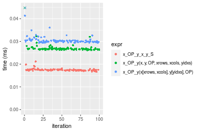
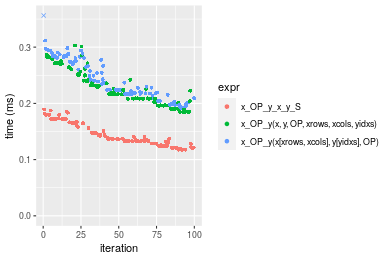
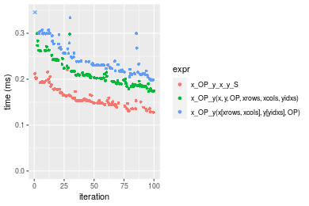
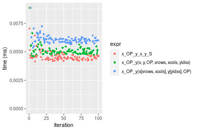
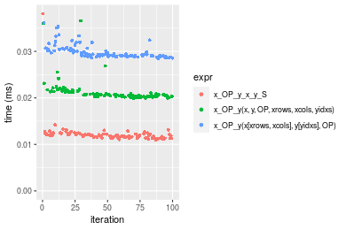
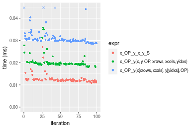
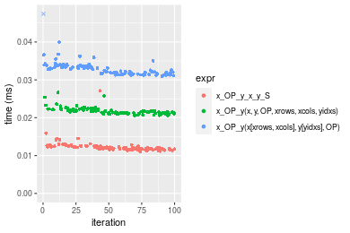
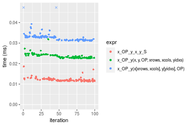
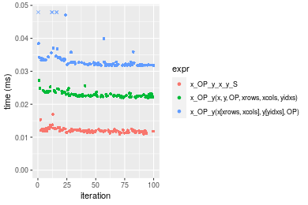
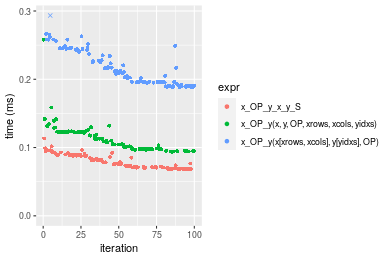

[matrixStats]: Benchmark report

---------------------------------------


# x_OP_y() benchmarks on subsetted computation

This report benchmark the performance of x_OP_y() on subsetted computation.


## Data type "integer"
### Data
```r
> rmatrix <- function(nrow, ncol, mode = c("logical", "double", "integer", "index"), range = c(-100, 
+     +100), na_prob = 0) {
+     mode <- match.arg(mode)
+     n <- nrow * ncol
+     if (mode == "logical") {
+         x <- sample(c(FALSE, TRUE), size = n, replace = TRUE)
+     }     else if (mode == "index") {
+         x <- seq_len(n)
+         mode <- "integer"
+     }     else {
+         x <- runif(n, min = range[1], max = range[2])
+     }
+     storage.mode(x) <- mode
+     if (na_prob > 0) 
+         x[sample(n, size = na_prob * n)] <- NA
+     dim(x) <- c(nrow, ncol)
+     x
+ }
> rmatrices <- function(scale = 10, seed = 1, ...) {
+     set.seed(seed)
+     data <- list()
+     data[[1]] <- rmatrix(nrow = scale * 1, ncol = scale * 1, ...)
+     data[[2]] <- rmatrix(nrow = scale * 10, ncol = scale * 10, ...)
+     data[[3]] <- rmatrix(nrow = scale * 100, ncol = scale * 1, ...)
+     data[[4]] <- t(data[[3]])
+     data[[5]] <- rmatrix(nrow = scale * 10, ncol = scale * 100, ...)
+     data[[6]] <- t(data[[5]])
+     names(data) <- sapply(data, FUN = function(x) paste(dim(x), collapse = "x"))
+     data
+ }
> data <- rmatrices(mode = mode)
```

### Results

### 10x10 vector


```r
> x <- data[["10x10"]]
> y <- x[, 1L]
> xrows <- sample.int(nrow(x), size = nrow(x) * 0.7)
> xcols <- sample.int(ncol(x), size = ncol(x) * 0.7)
> x_S <- x[xrows, xcols]
> yidxs <- xrows
> y_S <- y[yidxs]
```

```r
> OP
[1] "+"
> stats <- microbenchmark(x_OP_y_x_y_S = x_OP_y(x_S, y_S, OP = OP, na.rm = FALSE), `x_OP_y(x, y, OP, xrows, xcols, yidxs)` = x_OP_y(x, 
+     y, OP = OP, xrows = xrows, xcols = xcols, yidxs = yidxs, na.rm = FALSE), `x_OP_y(x[xrows, xcols], y[yidxs], OP)` = x_OP_y(x[xrows, 
+     xcols], y[yidxs], OP = OP, na.rm = FALSE), unit = "ms")
```

_Table: Benchmarking of x_OP_y_x_y_S(), x_OP_y(x, y, OP, xrows, xcols, yidxs)() and x_OP_y(x[xrows, xcols], y[yidxs], OP)() on integer+10x10+add data. The top panel shows times in milliseconds and the bottom panel shows relative times._


|   |expr                                  |      min|        lq|      mean|    median|        uq|      max|
|:--|:-------------------------------------|--------:|---------:|---------:|---------:|---------:|--------:|
|1  |x_OP_y_x_y_S                          | 0.004327| 0.0045265| 0.0061975| 0.0046320| 0.0047625| 0.156566|
|2  |x_OP_y(x, y, OP, xrows, xcols, yidxs) | 0.004806| 0.0052015| 0.0054026| 0.0053205| 0.0054585| 0.008297|
|3  |x_OP_y(x[xrows, xcols], y[yidxs], OP) | 0.005633| 0.0061475| 0.0064010| 0.0062305| 0.0064005| 0.013888|


|   |expr                                  |      min|       lq|      mean|   median|       uq|       max|
|:--|:-------------------------------------|--------:|--------:|---------:|--------:|--------:|---------:|
|1  |x_OP_y_x_y_S                          | 1.000000| 1.000000| 1.0000000| 1.000000| 1.000000| 1.0000000|
|2  |x_OP_y(x, y, OP, xrows, xcols, yidxs) | 1.110700| 1.149122| 0.8717463| 1.148640| 1.146142| 0.0529936|
|3  |x_OP_y(x[xrows, xcols], y[yidxs], OP) | 1.301826| 1.358113| 1.0328392| 1.345099| 1.343937| 0.0887038|

_Figure: Benchmarking of x_OP_y_x_y_S(), x_OP_y(x, y, OP, xrows, xcols, yidxs)() and x_OP_y(x[xrows, xcols], y[yidxs], OP)() on integer+10x10+add data.  Outliers are displayed as crosses.  Times are in milliseconds._


```r
> OP
[1] "-"
> stats <- microbenchmark(x_OP_y_x_y_S = x_OP_y(x_S, y_S, OP = OP, na.rm = FALSE), `x_OP_y(x, y, OP, xrows, xcols, yidxs)` = x_OP_y(x, 
+     y, OP = OP, xrows = xrows, xcols = xcols, yidxs = yidxs, na.rm = FALSE), `x_OP_y(x[xrows, xcols], y[yidxs], OP)` = x_OP_y(x[xrows, 
+     xcols], y[yidxs], OP = OP, na.rm = FALSE), unit = "ms")
```

_Table: Benchmarking of x_OP_y_x_y_S(), x_OP_y(x, y, OP, xrows, xcols, yidxs)() and x_OP_y(x[xrows, xcols], y[yidxs], OP)() on integer+10x10+sub data. The top panel shows times in milliseconds and the bottom panel shows relative times._


|   |expr                                  |      min|        lq|      mean|    median|        uq|      max|
|:--|:-------------------------------------|--------:|---------:|---------:|---------:|---------:|--------:|
|1  |x_OP_y_x_y_S                          | 0.003830| 0.0041745| 0.0043695| 0.0043230| 0.0044680| 0.006814|
|2  |x_OP_y(x, y, OP, xrows, xcols, yidxs) | 0.004455| 0.0048245| 0.0052652| 0.0049305| 0.0050750| 0.030785|
|3  |x_OP_y(x[xrows, xcols], y[yidxs], OP) | 0.005058| 0.0056940| 0.0059632| 0.0058590| 0.0059995| 0.014267|


|   |expr                                  |      min|       lq|     mean|   median|       uq|      max|
|:--|:-------------------------------------|--------:|--------:|--------:|--------:|--------:|--------:|
|1  |x_OP_y_x_y_S                          | 1.000000| 1.000000| 1.000000| 1.000000| 1.000000| 1.000000|
|2  |x_OP_y(x, y, OP, xrows, xcols, yidxs) | 1.163185| 1.155707| 1.204973| 1.140527| 1.135855| 4.517904|
|3  |x_OP_y(x[xrows, xcols], y[yidxs], OP) | 1.320627| 1.363996| 1.364725| 1.355309| 1.342771| 2.093777|

_Figure: Benchmarking of x_OP_y_x_y_S(), x_OP_y(x, y, OP, xrows, xcols, yidxs)() and x_OP_y(x[xrows, xcols], y[yidxs], OP)() on integer+10x10+sub data.  Outliers are displayed as crosses.  Times are in milliseconds._


```r
> OP
[1] "*"
> stats <- microbenchmark(x_OP_y_x_y_S = x_OP_y(x_S, y_S, OP = OP, na.rm = FALSE), `x_OP_y(x, y, OP, xrows, xcols, yidxs)` = x_OP_y(x, 
+     y, OP = OP, xrows = xrows, xcols = xcols, yidxs = yidxs, na.rm = FALSE), `x_OP_y(x[xrows, xcols], y[yidxs], OP)` = x_OP_y(x[xrows, 
+     xcols], y[yidxs], OP = OP, na.rm = FALSE), unit = "ms")
```

_Table: Benchmarking of x_OP_y_x_y_S(), x_OP_y(x, y, OP, xrows, xcols, yidxs)() and x_OP_y(x[xrows, xcols], y[yidxs], OP)() on integer+10x10+mul data. The top panel shows times in milliseconds and the bottom panel shows relative times._


|   |expr                                  |      min|        lq|      mean|   median|        uq|      max|
|:--|:-------------------------------------|--------:|---------:|---------:|--------:|---------:|--------:|
|1  |x_OP_y_x_y_S                          | 0.004123| 0.0044670| 0.0046326| 0.004603| 0.0047345| 0.005948|
|2  |x_OP_y(x, y, OP, xrows, xcols, yidxs) | 0.004820| 0.0051295| 0.0054072| 0.005254| 0.0054555| 0.011783|
|3  |x_OP_y(x[xrows, xcols], y[yidxs], OP) | 0.005594| 0.0060805| 0.0067126| 0.006225| 0.0063795| 0.034492|


|   |expr                                  |      min|       lq|     mean|   median|       uq|      max|
|:--|:-------------------------------------|--------:|--------:|--------:|--------:|--------:|--------:|
|1  |x_OP_y_x_y_S                          | 1.000000| 1.000000| 1.000000| 1.000000| 1.000000| 1.000000|
|2  |x_OP_y(x, y, OP, xrows, xcols, yidxs) | 1.169052| 1.148310| 1.167198| 1.141430| 1.152286| 1.981002|
|3  |x_OP_y(x[xrows, xcols], y[yidxs], OP) | 1.356779| 1.361204| 1.448991| 1.352379| 1.347450| 5.798924|

_Figure: Benchmarking of x_OP_y_x_y_S(), x_OP_y(x, y, OP, xrows, xcols, yidxs)() and x_OP_y(x[xrows, xcols], y[yidxs], OP)() on integer+10x10+mul data.  Outliers are displayed as crosses.  Times are in milliseconds._


```r
> OP
[1] "/"
> stats <- microbenchmark(x_OP_y_x_y_S = x_OP_y(x_S, y_S, OP = OP, na.rm = FALSE), `x_OP_y(x, y, OP, xrows, xcols, yidxs)` = x_OP_y(x, 
+     y, OP = OP, xrows = xrows, xcols = xcols, yidxs = yidxs, na.rm = FALSE), `x_OP_y(x[xrows, xcols], y[yidxs], OP)` = x_OP_y(x[xrows, 
+     xcols], y[yidxs], OP = OP, na.rm = FALSE), unit = "ms")
```

_Table: Benchmarking of x_OP_y_x_y_S(), x_OP_y(x, y, OP, xrows, xcols, yidxs)() and x_OP_y(x[xrows, xcols], y[yidxs], OP)() on integer+10x10+div data. The top panel shows times in milliseconds and the bottom panel shows relative times._


|   |expr                                  |      min|        lq|      mean|    median|        uq|      max|
|:--|:-------------------------------------|--------:|---------:|---------:|---------:|---------:|--------:|
|1  |x_OP_y_x_y_S                          | 0.004188| 0.0044875| 0.0049398| 0.0046025| 0.0047815| 0.029386|
|2  |x_OP_y(x, y, OP, xrows, xcols, yidxs) | 0.004718| 0.0050195| 0.0052550| 0.0051925| 0.0053730| 0.010828|
|3  |x_OP_y(x[xrows, xcols], y[yidxs], OP) | 0.005548| 0.0059840| 0.0064310| 0.0060885| 0.0063710| 0.021535|


|   |expr                                  |      min|       lq|     mean|   median|       uq|       max|
|:--|:-------------------------------------|--------:|--------:|--------:|--------:|--------:|---------:|
|1  |x_OP_y_x_y_S                          | 1.000000| 1.000000| 1.000000| 1.000000| 1.000000| 1.0000000|
|2  |x_OP_y(x, y, OP, xrows, xcols, yidxs) | 1.126552| 1.118551| 1.063808| 1.128191| 1.123706| 0.3684748|
|3  |x_OP_y(x[xrows, xcols], y[yidxs], OP) | 1.324737| 1.333482| 1.301868| 1.322868| 1.332427| 0.7328320|

_Figure: Benchmarking of x_OP_y_x_y_S(), x_OP_y(x, y, OP, xrows, xcols, yidxs)() and x_OP_y(x[xrows, xcols], y[yidxs], OP)() on integer+10x10+div data.  Outliers are displayed as crosses.  Times are in milliseconds._


### 100x100 vector


```r
> x <- data[["100x100"]]
> y <- x[, 1L]
> xrows <- sample.int(nrow(x), size = nrow(x) * 0.7)
> xcols <- sample.int(ncol(x), size = ncol(x) * 0.7)
> x_S <- x[xrows, xcols]
> yidxs <- xrows
> y_S <- y[yidxs]
```

```r
> OP
[1] "+"
> stats <- microbenchmark(x_OP_y_x_y_S = x_OP_y(x_S, y_S, OP = OP, na.rm = FALSE), `x_OP_y(x, y, OP, xrows, xcols, yidxs)` = x_OP_y(x, 
+     y, OP = OP, xrows = xrows, xcols = xcols, yidxs = yidxs, na.rm = FALSE), `x_OP_y(x[xrows, xcols], y[yidxs], OP)` = x_OP_y(x[xrows, 
+     xcols], y[yidxs], OP = OP, na.rm = FALSE), unit = "ms")
```

_Table: Benchmarking of x_OP_y_x_y_S(), x_OP_y(x, y, OP, xrows, xcols, yidxs)() and x_OP_y(x[xrows, xcols], y[yidxs], OP)() on integer+100x100+add data. The top panel shows times in milliseconds and the bottom panel shows relative times._


|   |expr                                  |      min|       lq|      mean|   median|        uq|      max|
|:--|:-------------------------------------|--------:|--------:|---------:|--------:|---------:|--------:|
|1  |x_OP_y_x_y_S                          | 0.029693| 0.031028| 0.0326648| 0.031922| 0.0336840| 0.071218|
|2  |x_OP_y(x, y, OP, xrows, xcols, yidxs) | 0.033365| 0.034708| 0.0365452| 0.035715| 0.0376665| 0.056537|
|3  |x_OP_y(x[xrows, xcols], y[yidxs], OP) | 0.040531| 0.042522| 0.0448810| 0.044454| 0.0459060| 0.059445|


|   |expr                                  |      min|       lq|     mean|   median|       uq|       max|
|:--|:-------------------------------------|--------:|--------:|--------:|--------:|--------:|---------:|
|1  |x_OP_y_x_y_S                          | 1.000000| 1.000000| 1.000000| 1.000000| 1.000000| 1.0000000|
|2  |x_OP_y(x, y, OP, xrows, xcols, yidxs) | 1.123665| 1.118603| 1.118796| 1.118821| 1.118231| 0.7938583|
|3  |x_OP_y(x[xrows, xcols], y[yidxs], OP) | 1.365002| 1.370440| 1.373986| 1.392582| 1.362843| 0.8346907|

_Figure: Benchmarking of x_OP_y_x_y_S(), x_OP_y(x, y, OP, xrows, xcols, yidxs)() and x_OP_y(x[xrows, xcols], y[yidxs], OP)() on integer+100x100+add data.  Outliers are displayed as crosses.  Times are in milliseconds._


```r
> OP
[1] "-"
> stats <- microbenchmark(x_OP_y_x_y_S = x_OP_y(x_S, y_S, OP = OP, na.rm = FALSE), `x_OP_y(x, y, OP, xrows, xcols, yidxs)` = x_OP_y(x, 
+     y, OP = OP, xrows = xrows, xcols = xcols, yidxs = yidxs, na.rm = FALSE), `x_OP_y(x[xrows, xcols], y[yidxs], OP)` = x_OP_y(x[xrows, 
+     xcols], y[yidxs], OP = OP, na.rm = FALSE), unit = "ms")
```

_Table: Benchmarking of x_OP_y_x_y_S(), x_OP_y(x, y, OP, xrows, xcols, yidxs)() and x_OP_y(x[xrows, xcols], y[yidxs], OP)() on integer+100x100+sub data. The top panel shows times in milliseconds and the bottom panel shows relative times._


|   |expr                                  |      min|        lq|      mean|    median|       uq|      max|
|:--|:-------------------------------------|--------:|---------:|---------:|---------:|--------:|--------:|
|1  |x_OP_y_x_y_S                          | 0.027139| 0.0285760| 0.0300448| 0.0294995| 0.030628| 0.049804|
|2  |x_OP_y(x, y, OP, xrows, xcols, yidxs) | 0.029827| 0.0310055| 0.0324345| 0.0316595| 0.032673| 0.046995|
|3  |x_OP_y(x[xrows, xcols], y[yidxs], OP) | 0.037593| 0.0395785| 0.0423182| 0.0407730| 0.042340| 0.090065|


|   |expr                                  |      min|       lq|     mean|   median|       uq|       max|
|:--|:-------------------------------------|--------:|--------:|--------:|--------:|--------:|---------:|
|1  |x_OP_y_x_y_S                          | 1.000000| 1.000000| 1.000000| 1.000000| 1.000000| 1.0000000|
|2  |x_OP_y(x, y, OP, xrows, xcols, yidxs) | 1.099046| 1.085019| 1.079540| 1.073222| 1.066769| 0.9435989|
|3  |x_OP_y(x[xrows, xcols], y[yidxs], OP) | 1.385202| 1.385026| 1.408504| 1.382159| 1.382395| 1.8083889|

_Figure: Benchmarking of x_OP_y_x_y_S(), x_OP_y(x, y, OP, xrows, xcols, yidxs)() and x_OP_y(x[xrows, xcols], y[yidxs], OP)() on integer+100x100+sub data.  Outliers are displayed as crosses.  Times are in milliseconds._


```r
> OP
[1] "*"
> stats <- microbenchmark(x_OP_y_x_y_S = x_OP_y(x_S, y_S, OP = OP, na.rm = FALSE), `x_OP_y(x, y, OP, xrows, xcols, yidxs)` = x_OP_y(x, 
+     y, OP = OP, xrows = xrows, xcols = xcols, yidxs = yidxs, na.rm = FALSE), `x_OP_y(x[xrows, xcols], y[yidxs], OP)` = x_OP_y(x[xrows, 
+     xcols], y[yidxs], OP = OP, na.rm = FALSE), unit = "ms")
```

_Table: Benchmarking of x_OP_y_x_y_S(), x_OP_y(x, y, OP, xrows, xcols, yidxs)() and x_OP_y(x[xrows, xcols], y[yidxs], OP)() on integer+100x100+mul data. The top panel shows times in milliseconds and the bottom panel shows relative times._


|   |expr                                  |      min|        lq|      mean|    median|        uq|      max|
|:--|:-------------------------------------|--------:|---------:|---------:|---------:|---------:|--------:|
|1  |x_OP_y_x_y_S                          | 0.028306| 0.0297465| 0.0315506| 0.0307890| 0.0319995| 0.071565|
|2  |x_OP_y(x, y, OP, xrows, xcols, yidxs) | 0.029940| 0.0316600| 0.0332615| 0.0327715| 0.0340810| 0.049904|
|3  |x_OP_y(x[xrows, xcols], y[yidxs], OP) | 0.039101| 0.0407695| 0.0431768| 0.0424095| 0.0442080| 0.061966|


|   |expr                                  |      min|       lq|     mean|   median|       uq|       max|
|:--|:-------------------------------------|--------:|--------:|--------:|--------:|--------:|---------:|
|1  |x_OP_y_x_y_S                          | 1.000000| 1.000000| 1.000000| 1.000000| 1.000000| 1.0000000|
|2  |x_OP_y(x, y, OP, xrows, xcols, yidxs) | 1.057726| 1.064327| 1.054227| 1.064390| 1.065048| 0.6973241|
|3  |x_OP_y(x[xrows, xcols], y[yidxs], OP) | 1.381368| 1.370565| 1.368492| 1.377424| 1.381522| 0.8658702|

_Figure: Benchmarking of x_OP_y_x_y_S(), x_OP_y(x, y, OP, xrows, xcols, yidxs)() and x_OP_y(x[xrows, xcols], y[yidxs], OP)() on integer+100x100+mul data.  Outliers are displayed as crosses.  Times are in milliseconds._


```r
> OP
[1] "/"
> stats <- microbenchmark(x_OP_y_x_y_S = x_OP_y(x_S, y_S, OP = OP, na.rm = FALSE), `x_OP_y(x, y, OP, xrows, xcols, yidxs)` = x_OP_y(x, 
+     y, OP = OP, xrows = xrows, xcols = xcols, yidxs = yidxs, na.rm = FALSE), `x_OP_y(x[xrows, xcols], y[yidxs], OP)` = x_OP_y(x[xrows, 
+     xcols], y[yidxs], OP = OP, na.rm = FALSE), unit = "ms")
```

_Table: Benchmarking of x_OP_y_x_y_S(), x_OP_y(x, y, OP, xrows, xcols, yidxs)() and x_OP_y(x[xrows, xcols], y[yidxs], OP)() on integer+100x100+div data. The top panel shows times in milliseconds and the bottom panel shows relative times._


|   |expr                                  |      min|       lq|      mean|   median|        uq|      max|
|:--|:-------------------------------------|--------:|--------:|---------:|--------:|---------:|--------:|
|2  |x_OP_y(x, y, OP, xrows, xcols, yidxs) | 0.025868| 0.027543| 0.0287375| 0.028224| 0.0291380| 0.064858|
|1  |x_OP_y_x_y_S                          | 0.027911| 0.029458| 0.0309831| 0.030611| 0.0318535| 0.045851|
|3  |x_OP_y(x[xrows, xcols], y[yidxs], OP) | 0.039332| 0.041776| 0.0438767| 0.042973| 0.0444370| 0.066198|


|   |expr                                  |      min|       lq|     mean|   median|       uq|       max|
|:--|:-------------------------------------|--------:|--------:|--------:|--------:|--------:|---------:|
|2  |x_OP_y(x, y, OP, xrows, xcols, yidxs) | 1.000000| 1.000000| 1.000000| 1.000000| 1.000000| 1.0000000|
|1  |x_OP_y_x_y_S                          | 1.078978| 1.069528| 1.078144| 1.084573| 1.093195| 0.7069444|
|3  |x_OP_y(x[xrows, xcols], y[yidxs], OP) | 1.520489| 1.516756| 1.526811| 1.522569| 1.525053| 1.0206605|

_Figure: Benchmarking of x_OP_y_x_y_S(), x_OP_y(x, y, OP, xrows, xcols, yidxs)() and x_OP_y(x[xrows, xcols], y[yidxs], OP)() on integer+100x100+div data.  Outliers are displayed as crosses.  Times are in milliseconds._




### 1000x10 vector


```r
> x <- data[["1000x10"]]
> y <- x[, 1L]
> xrows <- sample.int(nrow(x), size = nrow(x) * 0.7)
> xcols <- sample.int(ncol(x), size = ncol(x) * 0.7)
> x_S <- x[xrows, xcols]
> yidxs <- xrows
> y_S <- y[yidxs]
```

```r
> OP
[1] "+"
> stats <- microbenchmark(x_OP_y_x_y_S = x_OP_y(x_S, y_S, OP = OP, na.rm = FALSE), `x_OP_y(x, y, OP, xrows, xcols, yidxs)` = x_OP_y(x, 
+     y, OP = OP, xrows = xrows, xcols = xcols, yidxs = yidxs, na.rm = FALSE), `x_OP_y(x[xrows, xcols], y[yidxs], OP)` = x_OP_y(x[xrows, 
+     xcols], y[yidxs], OP = OP, na.rm = FALSE), unit = "ms")
```

_Table: Benchmarking of x_OP_y_x_y_S(), x_OP_y(x, y, OP, xrows, xcols, yidxs)() and x_OP_y(x[xrows, xcols], y[yidxs], OP)() on integer+1000x10+add data. The top panel shows times in milliseconds and the bottom panel shows relative times._


|   |expr                                  |      min|        lq|      mean|    median|        uq|      max|
|:--|:-------------------------------------|--------:|---------:|---------:|---------:|---------:|--------:|
|1  |x_OP_y_x_y_S                          | 0.029082| 0.0302565| 0.0319465| 0.0315905| 0.0328275| 0.048236|
|2  |x_OP_y(x, y, OP, xrows, xcols, yidxs) | 0.036195| 0.0373680| 0.0392128| 0.0388125| 0.0404835| 0.054740|
|3  |x_OP_y(x[xrows, xcols], y[yidxs], OP) | 0.042085| 0.0439045| 0.0464041| 0.0456190| 0.0476095| 0.094771|


|   |expr                                  |      min|       lq|     mean|   median|       uq|      max|
|:--|:-------------------------------------|--------:|--------:|--------:|--------:|--------:|--------:|
|1  |x_OP_y_x_y_S                          | 1.000000| 1.000000| 1.000000| 1.000000| 1.000000| 1.000000|
|2  |x_OP_y(x, y, OP, xrows, xcols, yidxs) | 1.244584| 1.235040| 1.227452| 1.228613| 1.233219| 1.134837|
|3  |x_OP_y(x[xrows, xcols], y[yidxs], OP) | 1.447115| 1.451077| 1.452554| 1.444073| 1.450293| 1.964736|

_Figure: Benchmarking of x_OP_y_x_y_S(), x_OP_y(x, y, OP, xrows, xcols, yidxs)() and x_OP_y(x[xrows, xcols], y[yidxs], OP)() on integer+1000x10+add data.  Outliers are displayed as crosses.  Times are in milliseconds._


```r
> OP
[1] "-"
> stats <- microbenchmark(x_OP_y_x_y_S = x_OP_y(x_S, y_S, OP = OP, na.rm = FALSE), `x_OP_y(x, y, OP, xrows, xcols, yidxs)` = x_OP_y(x, 
+     y, OP = OP, xrows = xrows, xcols = xcols, yidxs = yidxs, na.rm = FALSE), `x_OP_y(x[xrows, xcols], y[yidxs], OP)` = x_OP_y(x[xrows, 
+     xcols], y[yidxs], OP = OP, na.rm = FALSE), unit = "ms")
```

_Table: Benchmarking of x_OP_y_x_y_S(), x_OP_y(x, y, OP, xrows, xcols, yidxs)() and x_OP_y(x[xrows, xcols], y[yidxs], OP)() on integer+1000x10+sub data. The top panel shows times in milliseconds and the bottom panel shows relative times._


|   |expr                                  |      min|        lq|      mean|    median|       uq|      max|
|:--|:-------------------------------------|--------:|---------:|---------:|---------:|--------:|--------:|
|1  |x_OP_y_x_y_S                          | 0.027677| 0.0289620| 0.0302984| 0.0299650| 0.031239| 0.043399|
|2  |x_OP_y(x, y, OP, xrows, xcols, yidxs) | 0.032792| 0.0346175| 0.0363259| 0.0356885| 0.037058| 0.054576|
|3  |x_OP_y(x[xrows, xcols], y[yidxs], OP) | 0.040334| 0.0426985| 0.0454400| 0.0443705| 0.046156| 0.092204|


|   |expr                                  |      min|       lq|     mean|   median|       uq|      max|
|:--|:-------------------------------------|--------:|--------:|--------:|--------:|--------:|--------:|
|1  |x_OP_y_x_y_S                          | 1.000000| 1.000000| 1.000000| 1.000000| 1.000000| 1.000000|
|2  |x_OP_y(x, y, OP, xrows, xcols, yidxs) | 1.184810| 1.195273| 1.198940| 1.191006| 1.186274| 1.257540|
|3  |x_OP_y(x[xrows, xcols], y[yidxs], OP) | 1.457311| 1.474294| 1.499748| 1.480744| 1.477512| 2.124565|

_Figure: Benchmarking of x_OP_y_x_y_S(), x_OP_y(x, y, OP, xrows, xcols, yidxs)() and x_OP_y(x[xrows, xcols], y[yidxs], OP)() on integer+1000x10+sub data.  Outliers are displayed as crosses.  Times are in milliseconds._


```r
> OP
[1] "*"
> stats <- microbenchmark(x_OP_y_x_y_S = x_OP_y(x_S, y_S, OP = OP, na.rm = FALSE), `x_OP_y(x, y, OP, xrows, xcols, yidxs)` = x_OP_y(x, 
+     y, OP = OP, xrows = xrows, xcols = xcols, yidxs = yidxs, na.rm = FALSE), `x_OP_y(x[xrows, xcols], y[yidxs], OP)` = x_OP_y(x[xrows, 
+     xcols], y[yidxs], OP = OP, na.rm = FALSE), unit = "ms")
```

_Table: Benchmarking of x_OP_y_x_y_S(), x_OP_y(x, y, OP, xrows, xcols, yidxs)() and x_OP_y(x[xrows, xcols], y[yidxs], OP)() on integer+1000x10+mul data. The top panel shows times in milliseconds and the bottom panel shows relative times._


|   |expr                                  |      min|        lq|      mean|   median|        uq|      max|
|:--|:-------------------------------------|--------:|---------:|---------:|--------:|---------:|--------:|
|1  |x_OP_y_x_y_S                          | 0.027278| 0.0284895| 0.0297120| 0.029297| 0.0307585| 0.037658|
|2  |x_OP_y(x, y, OP, xrows, xcols, yidxs) | 0.032814| 0.0340820| 0.0361794| 0.035320| 0.0369625| 0.057126|
|3  |x_OP_y(x[xrows, xcols], y[yidxs], OP) | 0.040754| 0.0428685| 0.0457292| 0.045565| 0.0463090| 0.092912|


|   |expr                                  |      min|       lq|     mean|   median|       uq|      max|
|:--|:-------------------------------------|--------:|--------:|--------:|--------:|--------:|--------:|
|1  |x_OP_y_x_y_S                          | 1.000000| 1.000000| 1.000000| 1.000000| 1.000000| 1.000000|
|2  |x_OP_y(x, y, OP, xrows, xcols, yidxs) | 1.202947| 1.196300| 1.217670| 1.205584| 1.201700| 1.516968|
|3  |x_OP_y(x[xrows, xcols], y[yidxs], OP) | 1.494025| 1.504712| 1.539085| 1.555279| 1.505568| 2.467258|

_Figure: Benchmarking of x_OP_y_x_y_S(), x_OP_y(x, y, OP, xrows, xcols, yidxs)() and x_OP_y(x[xrows, xcols], y[yidxs], OP)() on integer+1000x10+mul data.  Outliers are displayed as crosses.  Times are in milliseconds._


```r
> OP
[1] "/"
> stats <- microbenchmark(x_OP_y_x_y_S = x_OP_y(x_S, y_S, OP = OP, na.rm = FALSE), `x_OP_y(x, y, OP, xrows, xcols, yidxs)` = x_OP_y(x, 
+     y, OP = OP, xrows = xrows, xcols = xcols, yidxs = yidxs, na.rm = FALSE), `x_OP_y(x[xrows, xcols], y[yidxs], OP)` = x_OP_y(x[xrows, 
+     xcols], y[yidxs], OP = OP, na.rm = FALSE), unit = "ms")
```

_Table: Benchmarking of x_OP_y_x_y_S(), x_OP_y(x, y, OP, xrows, xcols, yidxs)() and x_OP_y(x[xrows, xcols], y[yidxs], OP)() on integer+1000x10+div data. The top panel shows times in milliseconds and the bottom panel shows relative times._


|   |expr                                  |      min|        lq|      mean|   median|        uq|      max|
|:--|:-------------------------------------|--------:|---------:|---------:|--------:|---------:|--------:|
|1  |x_OP_y_x_y_S                          | 0.028321| 0.0289380| 0.0303621| 0.030018| 0.0314295| 0.034795|
|2  |x_OP_y(x, y, OP, xrows, xcols, yidxs) | 0.029806| 0.0310365| 0.0328146| 0.031917| 0.0332625| 0.068956|
|3  |x_OP_y(x[xrows, xcols], y[yidxs], OP) | 0.042285| 0.0428880| 0.0463922| 0.045840| 0.0480400| 0.067778|


|   |expr                                  |      min|       lq|     mean|   median|       uq|      max|
|:--|:-------------------------------------|--------:|--------:|--------:|--------:|--------:|--------:|
|1  |x_OP_y_x_y_S                          | 1.000000| 1.000000| 1.000000| 1.000000| 1.000000| 1.000000|
|2  |x_OP_y(x, y, OP, xrows, xcols, yidxs) | 1.052435| 1.072517| 1.080775| 1.063262| 1.058321| 1.981779|
|3  |x_OP_y(x[xrows, xcols], y[yidxs], OP) | 1.493062| 1.482065| 1.527964| 1.527084| 1.528500| 1.947924|

_Figure: Benchmarking of x_OP_y_x_y_S(), x_OP_y(x, y, OP, xrows, xcols, yidxs)() and x_OP_y(x[xrows, xcols], y[yidxs], OP)() on integer+1000x10+div data.  Outliers are displayed as crosses.  Times are in milliseconds._


### 10x1000 vector


```r
> x <- data[["10x1000"]]
> y <- x[, 1L]
> xrows <- sample.int(nrow(x), size = nrow(x) * 0.7)
> xcols <- sample.int(ncol(x), size = ncol(x) * 0.7)
> x_S <- x[xrows, xcols]
> yidxs <- xrows
> y_S <- y[yidxs]
```

```r
> OP
[1] "+"
> stats <- microbenchmark(x_OP_y_x_y_S = x_OP_y(x_S, y_S, OP = OP, na.rm = FALSE), `x_OP_y(x, y, OP, xrows, xcols, yidxs)` = x_OP_y(x, 
+     y, OP = OP, xrows = xrows, xcols = xcols, yidxs = yidxs, na.rm = FALSE), `x_OP_y(x[xrows, xcols], y[yidxs], OP)` = x_OP_y(x[xrows, 
+     xcols], y[yidxs], OP = OP, na.rm = FALSE), unit = "ms")
```

_Table: Benchmarking of x_OP_y_x_y_S(), x_OP_y(x, y, OP, xrows, xcols, yidxs)() and x_OP_y(x[xrows, xcols], y[yidxs], OP)() on integer+10x1000+add data. The top panel shows times in milliseconds and the bottom panel shows relative times._


|   |expr                                  |      min|        lq|      mean|    median|        uq|      max|
|:--|:-------------------------------------|--------:|---------:|---------:|---------:|---------:|--------:|
|1  |x_OP_y_x_y_S                          | 0.030014| 0.0313515| 0.0332654| 0.0326920| 0.0345740| 0.046886|
|2  |x_OP_y(x, y, OP, xrows, xcols, yidxs) | 0.034896| 0.0363880| 0.0381992| 0.0379060| 0.0395720| 0.051469|
|3  |x_OP_y(x[xrows, xcols], y[yidxs], OP) | 0.042677| 0.0444445| 0.0473774| 0.0460675| 0.0481465| 0.099390|


|   |expr                                  |      min|       lq|     mean|   median|       uq|      max|
|:--|:-------------------------------------|--------:|--------:|--------:|--------:|--------:|--------:|
|1  |x_OP_y_x_y_S                          | 1.000000| 1.000000| 1.000000| 1.000000| 1.000000| 1.000000|
|2  |x_OP_y(x, y, OP, xrows, xcols, yidxs) | 1.162657| 1.160646| 1.148313| 1.159489| 1.144559| 1.097748|
|3  |x_OP_y(x[xrows, xcols], y[yidxs], OP) | 1.421903| 1.417620| 1.424222| 1.409137| 1.392564| 2.119823|

_Figure: Benchmarking of x_OP_y_x_y_S(), x_OP_y(x, y, OP, xrows, xcols, yidxs)() and x_OP_y(x[xrows, xcols], y[yidxs], OP)() on integer+10x1000+add data.  Outliers are displayed as crosses.  Times are in milliseconds._


```r
> OP
[1] "-"
> stats <- microbenchmark(x_OP_y_x_y_S = x_OP_y(x_S, y_S, OP = OP, na.rm = FALSE), `x_OP_y(x, y, OP, xrows, xcols, yidxs)` = x_OP_y(x, 
+     y, OP = OP, xrows = xrows, xcols = xcols, yidxs = yidxs, na.rm = FALSE), `x_OP_y(x[xrows, xcols], y[yidxs], OP)` = x_OP_y(x[xrows, 
+     xcols], y[yidxs], OP = OP, na.rm = FALSE), unit = "ms")
```

_Table: Benchmarking of x_OP_y_x_y_S(), x_OP_y(x, y, OP, xrows, xcols, yidxs)() and x_OP_y(x[xrows, xcols], y[yidxs], OP)() on integer+10x1000+sub data. The top panel shows times in milliseconds and the bottom panel shows relative times._


|   |expr                                  |      min|        lq|      mean|   median|       uq|      max|
|:--|:-------------------------------------|--------:|---------:|---------:|--------:|--------:|--------:|
|1  |x_OP_y_x_y_S                          | 0.027565| 0.0288130| 0.0304628| 0.029912| 0.030936| 0.074476|
|2  |x_OP_y(x, y, OP, xrows, xcols, yidxs) | 0.030807| 0.0323620| 0.0342563| 0.033700| 0.035087| 0.054989|
|3  |x_OP_y(x[xrows, xcols], y[yidxs], OP) | 0.039552| 0.0405045| 0.0430812| 0.042804| 0.044604| 0.060901|


|   |expr                                  |      min|       lq|     mean|   median|       uq|       max|
|:--|:-------------------------------------|--------:|--------:|--------:|--------:|--------:|---------:|
|1  |x_OP_y_x_y_S                          | 1.000000| 1.000000| 1.000000| 1.000000| 1.000000| 1.0000000|
|2  |x_OP_y(x, y, OP, xrows, xcols, yidxs) | 1.117613| 1.123174| 1.124529| 1.126638| 1.134180| 0.7383452|
|3  |x_OP_y(x[xrows, xcols], y[yidxs], OP) | 1.434863| 1.405772| 1.414222| 1.430998| 1.441815| 0.8177265|

_Figure: Benchmarking of x_OP_y_x_y_S(), x_OP_y(x, y, OP, xrows, xcols, yidxs)() and x_OP_y(x[xrows, xcols], y[yidxs], OP)() on integer+10x1000+sub data.  Outliers are displayed as crosses.  Times are in milliseconds._


```r
> OP
[1] "*"
> stats <- microbenchmark(x_OP_y_x_y_S = x_OP_y(x_S, y_S, OP = OP, na.rm = FALSE), `x_OP_y(x, y, OP, xrows, xcols, yidxs)` = x_OP_y(x, 
+     y, OP = OP, xrows = xrows, xcols = xcols, yidxs = yidxs, na.rm = FALSE), `x_OP_y(x[xrows, xcols], y[yidxs], OP)` = x_OP_y(x[xrows, 
+     xcols], y[yidxs], OP = OP, na.rm = FALSE), unit = "ms")
```

_Table: Benchmarking of x_OP_y_x_y_S(), x_OP_y(x, y, OP, xrows, xcols, yidxs)() and x_OP_y(x[xrows, xcols], y[yidxs], OP)() on integer+10x1000+mul data. The top panel shows times in milliseconds and the bottom panel shows relative times._


|   |expr                                  |      min|        lq|      mean|    median|        uq|      max|
|:--|:-------------------------------------|--------:|---------:|---------:|---------:|---------:|--------:|
|1  |x_OP_y_x_y_S                          | 0.029395| 0.0306455| 0.0328800| 0.0321140| 0.0335020| 0.073010|
|2  |x_OP_y(x, y, OP, xrows, xcols, yidxs) | 0.032457| 0.0340730| 0.0363850| 0.0354245| 0.0370830| 0.052125|
|3  |x_OP_y(x[xrows, xcols], y[yidxs], OP) | 0.041898| 0.0440160| 0.0459979| 0.0455950| 0.0473775| 0.069920|


|   |expr                                  |      min|       lq|     mean|   median|       uq|       max|
|:--|:-------------------------------------|--------:|--------:|--------:|--------:|--------:|---------:|
|1  |x_OP_y_x_y_S                          | 1.000000| 1.000000| 1.000000| 1.000000| 1.000000| 1.0000000|
|2  |x_OP_y(x, y, OP, xrows, xcols, yidxs) | 1.104167| 1.111843| 1.106599| 1.103086| 1.106889| 0.7139433|
|3  |x_OP_y(x[xrows, xcols], y[yidxs], OP) | 1.425344| 1.436296| 1.398962| 1.419786| 1.414169| 0.9576770|

_Figure: Benchmarking of x_OP_y_x_y_S(), x_OP_y(x, y, OP, xrows, xcols, yidxs)() and x_OP_y(x[xrows, xcols], y[yidxs], OP)() on integer+10x1000+mul data.  Outliers are displayed as crosses.  Times are in milliseconds._


```r
> OP
[1] "/"
> stats <- microbenchmark(x_OP_y_x_y_S = x_OP_y(x_S, y_S, OP = OP, na.rm = FALSE), `x_OP_y(x, y, OP, xrows, xcols, yidxs)` = x_OP_y(x, 
+     y, OP = OP, xrows = xrows, xcols = xcols, yidxs = yidxs, na.rm = FALSE), `x_OP_y(x[xrows, xcols], y[yidxs], OP)` = x_OP_y(x[xrows, 
+     xcols], y[yidxs], OP = OP, na.rm = FALSE), unit = "ms")
```

_Table: Benchmarking of x_OP_y_x_y_S(), x_OP_y(x, y, OP, xrows, xcols, yidxs)() and x_OP_y(x[xrows, xcols], y[yidxs], OP)() on integer+10x1000+div data. The top panel shows times in milliseconds and the bottom panel shows relative times._


|   |expr                                  |      min|        lq|      mean|    median|        uq|      max|
|:--|:-------------------------------------|--------:|---------:|---------:|---------:|---------:|--------:|
|2  |x_OP_y(x, y, OP, xrows, xcols, yidxs) | 0.028071| 0.0297915| 0.0311523| 0.0310005| 0.0320385| 0.039446|
|1  |x_OP_y_x_y_S                          | 0.028624| 0.0300570| 0.0316980| 0.0312220| 0.0324145| 0.048990|
|3  |x_OP_y(x[xrows, xcols], y[yidxs], OP) | 0.041330| 0.0432645| 0.0464660| 0.0454630| 0.0474715| 0.101987|


|   |expr                                  |      min|       lq|     mean|   median|       uq|      max|
|:--|:-------------------------------------|--------:|--------:|--------:|--------:|--------:|--------:|
|2  |x_OP_y(x, y, OP, xrows, xcols, yidxs) | 1.000000| 1.000000| 1.000000| 1.000000| 1.000000| 1.000000|
|1  |x_OP_y_x_y_S                          | 1.019700| 1.008912| 1.017516| 1.007145| 1.011736| 1.241951|
|3  |x_OP_y(x[xrows, xcols], y[yidxs], OP) | 1.472338| 1.452243| 1.491573| 1.466525| 1.481702| 2.585484|

_Figure: Benchmarking of x_OP_y_x_y_S(), x_OP_y(x, y, OP, xrows, xcols, yidxs)() and x_OP_y(x[xrows, xcols], y[yidxs], OP)() on integer+10x1000+div data.  Outliers are displayed as crosses.  Times are in milliseconds._


### 100x1000 vector


```r
> x <- data[["100x1000"]]
> y <- x[, 1L]
> xrows <- sample.int(nrow(x), size = nrow(x) * 0.7)
> xcols <- sample.int(ncol(x), size = ncol(x) * 0.7)
> x_S <- x[xrows, xcols]
> yidxs <- xrows
> y_S <- y[yidxs]
```

```r
> OP
[1] "+"
> stats <- microbenchmark(x_OP_y_x_y_S = x_OP_y(x_S, y_S, OP = OP, na.rm = FALSE), `x_OP_y(x, y, OP, xrows, xcols, yidxs)` = x_OP_y(x, 
+     y, OP = OP, xrows = xrows, xcols = xcols, yidxs = yidxs, na.rm = FALSE), `x_OP_y(x[xrows, xcols], y[yidxs], OP)` = x_OP_y(x[xrows, 
+     xcols], y[yidxs], OP = OP, na.rm = FALSE), unit = "ms")
```

_Table: Benchmarking of x_OP_y_x_y_S(), x_OP_y(x, y, OP, xrows, xcols, yidxs)() and x_OP_y(x[xrows, xcols], y[yidxs], OP)() on integer+100x1000+add data. The top panel shows times in milliseconds and the bottom panel shows relative times._


|   |expr                                  |      min|        lq|      mean|    median|        uq|      max|
|:--|:-------------------------------------|--------:|---------:|---------:|---------:|---------:|--------:|
|1  |x_OP_y_x_y_S                          | 0.214598| 0.2426885| 0.2519028| 0.2460905| 0.2594260| 0.312564|
|2  |x_OP_y(x, y, OP, xrows, xcols, yidxs) | 0.232751| 0.2599870| 0.2689343| 0.2633255| 0.2796495| 0.346140|
|3  |x_OP_y(x[xrows, xcols], y[yidxs], OP) | 0.300033| 0.3621020| 0.3697017| 0.3720605| 0.3838575| 0.510039|


|   |expr                                  |      min|       lq|     mean|   median|       uq|      max|
|:--|:-------------------------------------|--------:|--------:|--------:|--------:|--------:|--------:|
|1  |x_OP_y_x_y_S                          | 1.000000| 1.000000| 1.000000| 1.000000| 1.000000| 1.000000|
|2  |x_OP_y(x, y, OP, xrows, xcols, yidxs) | 1.084591| 1.071279| 1.067611| 1.070035| 1.077955| 1.107421|
|3  |x_OP_y(x[xrows, xcols], y[yidxs], OP) | 1.398116| 1.492044| 1.467636| 1.511885| 1.479642| 1.631791|

_Figure: Benchmarking of x_OP_y_x_y_S(), x_OP_y(x, y, OP, xrows, xcols, yidxs)() and x_OP_y(x[xrows, xcols], y[yidxs], OP)() on integer+100x1000+add data.  Outliers are displayed as crosses.  Times are in milliseconds._


```r
> OP
[1] "-"
> stats <- microbenchmark(x_OP_y_x_y_S = x_OP_y(x_S, y_S, OP = OP, na.rm = FALSE), `x_OP_y(x, y, OP, xrows, xcols, yidxs)` = x_OP_y(x, 
+     y, OP = OP, xrows = xrows, xcols = xcols, yidxs = yidxs, na.rm = FALSE), `x_OP_y(x[xrows, xcols], y[yidxs], OP)` = x_OP_y(x[xrows, 
+     xcols], y[yidxs], OP = OP, na.rm = FALSE), unit = "ms")
```

_Table: Benchmarking of x_OP_y_x_y_S(), x_OP_y(x, y, OP, xrows, xcols, yidxs)() and x_OP_y(x[xrows, xcols], y[yidxs], OP)() on integer+100x1000+sub data. The top panel shows times in milliseconds and the bottom panel shows relative times._


|   |expr                                  |      min|       lq|      mean|    median|        uq|      max|
|:--|:-------------------------------------|--------:|--------:|---------:|---------:|---------:|--------:|
|1  |x_OP_y_x_y_S                          | 0.173991| 0.175156| 0.2056994| 0.1986815| 0.2269330| 0.323675|
|2  |x_OP_y(x, y, OP, xrows, xcols, yidxs) | 0.178861| 0.181724| 0.2089400| 0.2055685| 0.2268985| 0.305536|
|3  |x_OP_y(x[xrows, xcols], y[yidxs], OP) | 0.241420| 0.248449| 0.2894495| 0.2784885| 0.3155975| 0.491337|


|   |expr                                  |      min|       lq|     mean|   median|       uq|       max|
|:--|:-------------------------------------|--------:|--------:|--------:|--------:|--------:|---------:|
|1  |x_OP_y_x_y_S                          | 1.000000| 1.000000| 1.000000| 1.000000| 1.000000| 1.0000000|
|2  |x_OP_y(x, y, OP, xrows, xcols, yidxs) | 1.027990| 1.037498| 1.015754| 1.034663| 0.999848| 0.9439592|
|3  |x_OP_y(x[xrows, xcols], y[yidxs], OP) | 1.387543| 1.418444| 1.407148| 1.401683| 1.390708| 1.5179949|

_Figure: Benchmarking of x_OP_y_x_y_S(), x_OP_y(x, y, OP, xrows, xcols, yidxs)() and x_OP_y(x[xrows, xcols], y[yidxs], OP)() on integer+100x1000+sub data.  Outliers are displayed as crosses.  Times are in milliseconds._



```r
> OP
[1] "*"
> stats <- microbenchmark(x_OP_y_x_y_S = x_OP_y(x_S, y_S, OP = OP, na.rm = FALSE), `x_OP_y(x, y, OP, xrows, xcols, yidxs)` = x_OP_y(x, 
+     y, OP = OP, xrows = xrows, xcols = xcols, yidxs = yidxs, na.rm = FALSE), `x_OP_y(x[xrows, xcols], y[yidxs], OP)` = x_OP_y(x[xrows, 
+     xcols], y[yidxs], OP = OP, na.rm = FALSE), unit = "ms")
```

_Table: Benchmarking of x_OP_y_x_y_S(), x_OP_y(x, y, OP, xrows, xcols, yidxs)() and x_OP_y(x[xrows, xcols], y[yidxs], OP)() on integer+100x1000+mul data. The top panel shows times in milliseconds and the bottom panel shows relative times._


|   |expr                                  |      min|        lq|      mean|    median|       uq|      max|
|:--|:-------------------------------------|--------:|---------:|---------:|---------:|--------:|--------:|
|1  |x_OP_y_x_y_S                          | 0.175815| 0.1763635| 0.2045982| 0.1873555| 0.221925| 0.380860|
|2  |x_OP_y(x, y, OP, xrows, xcols, yidxs) | 0.179650| 0.1805875| 0.2136872| 0.2054305| 0.235392| 0.371657|
|3  |x_OP_y(x[xrows, xcols], y[yidxs], OP) | 0.243238| 0.2449425| 0.2840805| 0.2714745| 0.306754| 0.402683|


|   |expr                                  |      min|      lq|     mean|   median|       uq|       max|
|:--|:-------------------------------------|--------:|-------:|--------:|--------:|--------:|---------:|
|1  |x_OP_y_x_y_S                          | 1.000000| 1.00000| 1.000000| 1.000000| 1.000000| 1.0000000|
|2  |x_OP_y(x, y, OP, xrows, xcols, yidxs) | 1.021813| 1.02395| 1.044423| 1.096474| 1.060683| 0.9758363|
|3  |x_OP_y(x[xrows, xcols], y[yidxs], OP) | 1.383488| 1.38885| 1.388480| 1.448981| 1.382242| 1.0572993|

_Figure: Benchmarking of x_OP_y_x_y_S(), x_OP_y(x, y, OP, xrows, xcols, yidxs)() and x_OP_y(x[xrows, xcols], y[yidxs], OP)() on integer+100x1000+mul data.  Outliers are displayed as crosses.  Times are in milliseconds._


```r
> OP
[1] "/"
> stats <- microbenchmark(x_OP_y_x_y_S = x_OP_y(x_S, y_S, OP = OP, na.rm = FALSE), `x_OP_y(x, y, OP, xrows, xcols, yidxs)` = x_OP_y(x, 
+     y, OP = OP, xrows = xrows, xcols = xcols, yidxs = yidxs, na.rm = FALSE), `x_OP_y(x[xrows, xcols], y[yidxs], OP)` = x_OP_y(x[xrows, 
+     xcols], y[yidxs], OP = OP, na.rm = FALSE), unit = "ms")
```

_Table: Benchmarking of x_OP_y_x_y_S(), x_OP_y(x, y, OP, xrows, xcols, yidxs)() and x_OP_y(x[xrows, xcols], y[yidxs], OP)() on integer+100x1000+div data. The top panel shows times in milliseconds and the bottom panel shows relative times._


|   |expr                                  |      min|        lq|      mean|    median|        uq|      max|
|:--|:-------------------------------------|--------:|---------:|---------:|---------:|---------:|--------:|
|2  |x_OP_y(x, y, OP, xrows, xcols, yidxs) | 0.159662| 0.1861965| 0.2243410| 0.2138415| 0.2669805| 0.339847|
|1  |x_OP_y_x_y_S                          | 0.187455| 0.2179010| 0.2555342| 0.2605120| 0.2907990| 0.330795|
|3  |x_OP_y(x[xrows, xcols], y[yidxs], OP) | 0.260711| 0.3028410| 0.3597482| 0.3797390| 0.4153500| 0.446905|


|   |expr                                  |      min|       lq|     mean|   median|       uq|       max|
|:--|:-------------------------------------|--------:|--------:|--------:|--------:|--------:|---------:|
|2  |x_OP_y(x, y, OP, xrows, xcols, yidxs) | 1.000000| 1.000000| 1.000000| 1.000000| 1.000000| 1.0000000|
|1  |x_OP_y_x_y_S                          | 1.174074| 1.170274| 1.139044| 1.218248| 1.089214| 0.9733645|
|3  |x_OP_y(x[xrows, xcols], y[yidxs], OP) | 1.632893| 1.626459| 1.603578| 1.775797| 1.555732| 1.3150182|

_Figure: Benchmarking of x_OP_y_x_y_S(), x_OP_y(x, y, OP, xrows, xcols, yidxs)() and x_OP_y(x[xrows, xcols], y[yidxs], OP)() on integer+100x1000+div data.  Outliers are displayed as crosses.  Times are in milliseconds._


### 1000x100 vector


```r
> x <- data[["1000x100"]]
> y <- x[, 1L]
> xrows <- sample.int(nrow(x), size = nrow(x) * 0.7)
> xcols <- sample.int(ncol(x), size = ncol(x) * 0.7)
> x_S <- x[xrows, xcols]
> yidxs <- xrows
> y_S <- y[yidxs]
```

```r
> OP
[1] "+"
> stats <- microbenchmark(x_OP_y_x_y_S = x_OP_y(x_S, y_S, OP = OP, na.rm = FALSE), `x_OP_y(x, y, OP, xrows, xcols, yidxs)` = x_OP_y(x, 
+     y, OP = OP, xrows = xrows, xcols = xcols, yidxs = yidxs, na.rm = FALSE), `x_OP_y(x[xrows, xcols], y[yidxs], OP)` = x_OP_y(x[xrows, 
+     xcols], y[yidxs], OP = OP, na.rm = FALSE), unit = "ms")
```

_Table: Benchmarking of x_OP_y_x_y_S(), x_OP_y(x, y, OP, xrows, xcols, yidxs)() and x_OP_y(x[xrows, xcols], y[yidxs], OP)() on integer+1000x100+add data. The top panel shows times in milliseconds and the bottom panel shows relative times._


|   |expr                                  |      min|        lq|      mean|    median|        uq|      max|
|:--|:-------------------------------------|--------:|---------:|---------:|---------:|---------:|--------:|
|1  |x_OP_y_x_y_S                          | 0.180900| 0.1856565| 0.2112915| 0.1963560| 0.2296370| 0.303139|
|2  |x_OP_y(x, y, OP, xrows, xcols, yidxs) | 0.198087| 0.2011120| 0.2304221| 0.2188705| 0.2498350| 0.345741|
|3  |x_OP_y(x[xrows, xcols], y[yidxs], OP) | 0.246111| 0.2520365| 0.2888559| 0.2734045| 0.3107455| 0.483348|


|   |expr                                  |      min|       lq|     mean|   median|       uq|      max|
|:--|:-------------------------------------|--------:|--------:|--------:|--------:|--------:|--------:|
|1  |x_OP_y_x_y_S                          | 1.000000| 1.000000| 1.000000| 1.000000| 1.000000| 1.000000|
|2  |x_OP_y(x, y, OP, xrows, xcols, yidxs) | 1.095008| 1.083248| 1.090541| 1.114662| 1.087956| 1.140536|
|3  |x_OP_y(x[xrows, xcols], y[yidxs], OP) | 1.360481| 1.357542| 1.367097| 1.392392| 1.353203| 1.594477|

_Figure: Benchmarking of x_OP_y_x_y_S(), x_OP_y(x, y, OP, xrows, xcols, yidxs)() and x_OP_y(x[xrows, xcols], y[yidxs], OP)() on integer+1000x100+add data.  Outliers are displayed as crosses.  Times are in milliseconds._


```r
> OP
[1] "-"
> stats <- microbenchmark(x_OP_y_x_y_S = x_OP_y(x_S, y_S, OP = OP, na.rm = FALSE), `x_OP_y(x, y, OP, xrows, xcols, yidxs)` = x_OP_y(x, 
+     y, OP = OP, xrows = xrows, xcols = xcols, yidxs = yidxs, na.rm = FALSE), `x_OP_y(x[xrows, xcols], y[yidxs], OP)` = x_OP_y(x[xrows, 
+     xcols], y[yidxs], OP = OP, na.rm = FALSE), unit = "ms")
```

_Table: Benchmarking of x_OP_y_x_y_S(), x_OP_y(x, y, OP, xrows, xcols, yidxs)() and x_OP_y(x[xrows, xcols], y[yidxs], OP)() on integer+1000x100+sub data. The top panel shows times in milliseconds and the bottom panel shows relative times._


|   |expr                                  |      min|        lq|      mean|    median|        uq|      max|
|:--|:-------------------------------------|--------:|---------:|---------:|---------:|---------:|--------:|
|1  |x_OP_y_x_y_S                          | 0.168348| 0.1691925| 0.1982962| 0.1908640| 0.2127785| 0.326891|
|2  |x_OP_y(x, y, OP, xrows, xcols, yidxs) | 0.174662| 0.1761175| 0.2050990| 0.1952005| 0.2266260| 0.367171|
|3  |x_OP_y(x[xrows, xcols], y[yidxs], OP) | 0.233969| 0.2352860| 0.2737767| 0.2565695| 0.3034040| 0.424990|


|   |expr                                  |      min|       lq|     mean|   median|       uq|      max|
|:--|:-------------------------------------|--------:|--------:|--------:|--------:|--------:|--------:|
|1  |x_OP_y_x_y_S                          | 1.000000| 1.000000| 1.000000| 1.000000| 1.000000| 1.000000|
|2  |x_OP_y(x, y, OP, xrows, xcols, yidxs) | 1.037506| 1.040930| 1.034306| 1.022720| 1.065079| 1.123222|
|3  |x_OP_y(x[xrows, xcols], y[yidxs], OP) | 1.389794| 1.390641| 1.380645| 1.344253| 1.425915| 1.300097|

_Figure: Benchmarking of x_OP_y_x_y_S(), x_OP_y(x, y, OP, xrows, xcols, yidxs)() and x_OP_y(x[xrows, xcols], y[yidxs], OP)() on integer+1000x100+sub data.  Outliers are displayed as crosses.  Times are in milliseconds._


```r
> OP
[1] "*"
> stats <- microbenchmark(x_OP_y_x_y_S = x_OP_y(x_S, y_S, OP = OP, na.rm = FALSE), `x_OP_y(x, y, OP, xrows, xcols, yidxs)` = x_OP_y(x, 
+     y, OP = OP, xrows = xrows, xcols = xcols, yidxs = yidxs, na.rm = FALSE), `x_OP_y(x[xrows, xcols], y[yidxs], OP)` = x_OP_y(x[xrows, 
+     xcols], y[yidxs], OP = OP, na.rm = FALSE), unit = "ms")
```

_Table: Benchmarking of x_OP_y_x_y_S(), x_OP_y(x, y, OP, xrows, xcols, yidxs)() and x_OP_y(x[xrows, xcols], y[yidxs], OP)() on integer+1000x100+mul data. The top panel shows times in milliseconds and the bottom panel shows relative times._


|   |expr                                  |      min|        lq|      mean|   median|        uq|      max|
|:--|:-------------------------------------|--------:|---------:|---------:|--------:|---------:|--------:|
|2  |x_OP_y(x, y, OP, xrows, xcols, yidxs) | 0.174227| 0.1757805| 0.2006545| 0.190219| 0.2174785| 0.287365|
|1  |x_OP_y_x_y_S                          | 0.170451| 0.1791645| 0.2054200| 0.201755| 0.2220275| 0.294447|
|3  |x_OP_y(x[xrows, xcols], y[yidxs], OP) | 0.235679| 0.2369595| 0.2772444| 0.255734| 0.3023055| 0.469103|


|   |expr                                  |       min|       lq|    mean|   median|       uq|      max|
|:--|:-------------------------------------|---------:|--------:|-------:|--------:|--------:|--------:|
|2  |x_OP_y(x, y, OP, xrows, xcols, yidxs) | 1.0000000| 1.000000| 1.00000| 1.000000| 1.000000| 1.000000|
|1  |x_OP_y_x_y_S                          | 0.9783271| 1.019251| 1.02375| 1.060646| 1.020917| 1.024645|
|3  |x_OP_y(x[xrows, xcols], y[yidxs], OP) | 1.3527123| 1.348042| 1.38170| 1.344419| 1.390048| 1.632429|

_Figure: Benchmarking of x_OP_y_x_y_S(), x_OP_y(x, y, OP, xrows, xcols, yidxs)() and x_OP_y(x[xrows, xcols], y[yidxs], OP)() on integer+1000x100+mul data.  Outliers are displayed as crosses.  Times are in milliseconds._



```r
> OP
[1] "/"
> stats <- microbenchmark(x_OP_y_x_y_S = x_OP_y(x_S, y_S, OP = OP, na.rm = FALSE), `x_OP_y(x, y, OP, xrows, xcols, yidxs)` = x_OP_y(x, 
+     y, OP = OP, xrows = xrows, xcols = xcols, yidxs = yidxs, na.rm = FALSE), `x_OP_y(x[xrows, xcols], y[yidxs], OP)` = x_OP_y(x[xrows, 
+     xcols], y[yidxs], OP = OP, na.rm = FALSE), unit = "ms")
```

_Table: Benchmarking of x_OP_y_x_y_S(), x_OP_y(x, y, OP, xrows, xcols, yidxs)() and x_OP_y(x[xrows, xcols], y[yidxs], OP)() on integer+1000x100+div data. The top panel shows times in milliseconds and the bottom panel shows relative times._


|   |expr                                  |      min|        lq|      mean|    median|        uq|      max|
|:--|:-------------------------------------|--------:|---------:|---------:|---------:|---------:|--------:|
|2  |x_OP_y(x, y, OP, xrows, xcols, yidxs) | 0.148081| 0.1513600| 0.1822250| 0.1763725| 0.1931375| 0.402441|
|1  |x_OP_y_x_y_S                          | 0.168113| 0.1817620| 0.2058715| 0.2051880| 0.2193800| 0.360262|
|3  |x_OP_y(x[xrows, xcols], y[yidxs], OP) | 0.234327| 0.2369495| 0.2837613| 0.2694680| 0.3128785| 0.462925|


|   |expr                                  |      min|       lq|     mean|   median|       uq|       max|
|:--|:-------------------------------------|--------:|--------:|--------:|--------:|--------:|---------:|
|2  |x_OP_y(x, y, OP, xrows, xcols, yidxs) | 1.000000| 1.000000| 1.000000| 1.000000| 1.000000| 1.0000000|
|1  |x_OP_y_x_y_S                          | 1.135277| 1.200859| 1.129766| 1.163379| 1.135875| 0.8951921|
|3  |x_OP_y(x[xrows, xcols], y[yidxs], OP) | 1.582424| 1.565470| 1.557203| 1.527835| 1.619978| 1.1502928|

_Figure: Benchmarking of x_OP_y_x_y_S(), x_OP_y(x, y, OP, xrows, xcols, yidxs)() and x_OP_y(x[xrows, xcols], y[yidxs], OP)() on integer+1000x100+div data.  Outliers are displayed as crosses.  Times are in milliseconds._


## Data type "double"
### Data
```r
> rmatrix <- function(nrow, ncol, mode = c("logical", "double", "integer", "index"), range = c(-100, 
+     +100), na_prob = 0) {
+     mode <- match.arg(mode)
+     n <- nrow * ncol
+     if (mode == "logical") {
+         x <- sample(c(FALSE, TRUE), size = n, replace = TRUE)
+     }     else if (mode == "index") {
+         x <- seq_len(n)
+         mode <- "integer"
+     }     else {
+         x <- runif(n, min = range[1], max = range[2])
+     }
+     storage.mode(x) <- mode
+     if (na_prob > 0) 
+         x[sample(n, size = na_prob * n)] <- NA
+     dim(x) <- c(nrow, ncol)
+     x
+ }
> rmatrices <- function(scale = 10, seed = 1, ...) {
+     set.seed(seed)
+     data <- list()
+     data[[1]] <- rmatrix(nrow = scale * 1, ncol = scale * 1, ...)
+     data[[2]] <- rmatrix(nrow = scale * 10, ncol = scale * 10, ...)
+     data[[3]] <- rmatrix(nrow = scale * 100, ncol = scale * 1, ...)
+     data[[4]] <- t(data[[3]])
+     data[[5]] <- rmatrix(nrow = scale * 10, ncol = scale * 100, ...)
+     data[[6]] <- t(data[[5]])
+     names(data) <- sapply(data, FUN = function(x) paste(dim(x), collapse = "x"))
+     data
+ }
> data <- rmatrices(mode = mode)
```

### Results

### 10x10 vector


```r
> x <- data[["10x10"]]
> y <- x[, 1L]
> xrows <- sample.int(nrow(x), size = nrow(x) * 0.7)
> xcols <- sample.int(ncol(x), size = ncol(x) * 0.7)
> x_S <- x[xrows, xcols]
> yidxs <- xrows
> y_S <- y[yidxs]
```

```r
> OP
[1] "+"
> stats <- microbenchmark(x_OP_y_x_y_S = x_OP_y(x_S, y_S, OP = OP, na.rm = FALSE), `x_OP_y(x, y, OP, xrows, xcols, yidxs)` = x_OP_y(x, 
+     y, OP = OP, xrows = xrows, xcols = xcols, yidxs = yidxs, na.rm = FALSE), `x_OP_y(x[xrows, xcols], y[yidxs], OP)` = x_OP_y(x[xrows, 
+     xcols], y[yidxs], OP = OP, na.rm = FALSE), unit = "ms")
```

_Table: Benchmarking of x_OP_y_x_y_S(), x_OP_y(x, y, OP, xrows, xcols, yidxs)() and x_OP_y(x[xrows, xcols], y[yidxs], OP)() on double+10x10+add data. The top panel shows times in milliseconds and the bottom panel shows relative times._


|   |expr                                  |      min|       lq|      mean|    median|        uq|      max|
|:--|:-------------------------------------|--------:|--------:|---------:|---------:|---------:|--------:|
|1  |x_OP_y_x_y_S                          | 0.003969| 0.004237| 0.0046306| 0.0043605| 0.0045135| 0.025759|
|2  |x_OP_y(x, y, OP, xrows, xcols, yidxs) | 0.004520| 0.004784| 0.0051155| 0.0049110| 0.0050455| 0.019279|
|3  |x_OP_y(x[xrows, xcols], y[yidxs], OP) | 0.005271| 0.005800| 0.0060319| 0.0059590| 0.0061305| 0.012193|


|   |expr                                  |      min|       lq|     mean|   median|       uq|       max|
|:--|:-------------------------------------|--------:|--------:|--------:|--------:|--------:|---------:|
|1  |x_OP_y_x_y_S                          | 1.000000| 1.000000| 1.000000| 1.000000| 1.000000| 1.0000000|
|2  |x_OP_y(x, y, OP, xrows, xcols, yidxs) | 1.138826| 1.129101| 1.104720| 1.126247| 1.117869| 0.7484374|
|3  |x_OP_y(x[xrows, xcols], y[yidxs], OP) | 1.328042| 1.368893| 1.302631| 1.366586| 1.358259| 0.4733491|

_Figure: Benchmarking of x_OP_y_x_y_S(), x_OP_y(x, y, OP, xrows, xcols, yidxs)() and x_OP_y(x[xrows, xcols], y[yidxs], OP)() on double+10x10+add data.  Outliers are displayed as crosses.  Times are in milliseconds._


```r
> OP
[1] "-"
> stats <- microbenchmark(x_OP_y_x_y_S = x_OP_y(x_S, y_S, OP = OP, na.rm = FALSE), `x_OP_y(x, y, OP, xrows, xcols, yidxs)` = x_OP_y(x, 
+     y, OP = OP, xrows = xrows, xcols = xcols, yidxs = yidxs, na.rm = FALSE), `x_OP_y(x[xrows, xcols], y[yidxs], OP)` = x_OP_y(x[xrows, 
+     xcols], y[yidxs], OP = OP, na.rm = FALSE), unit = "ms")
```

_Table: Benchmarking of x_OP_y_x_y_S(), x_OP_y(x, y, OP, xrows, xcols, yidxs)() and x_OP_y(x[xrows, xcols], y[yidxs], OP)() on double+10x10+sub data. The top panel shows times in milliseconds and the bottom panel shows relative times._


|   |expr                                  |      min|        lq|      mean|    median|        uq|      max|
|:--|:-------------------------------------|--------:|---------:|---------:|---------:|---------:|--------:|
|1  |x_OP_y_x_y_S                          | 0.004126| 0.0044525| 0.0046331| 0.0045685| 0.0047275| 0.007700|
|2  |x_OP_y(x, y, OP, xrows, xcols, yidxs) | 0.004800| 0.0050525| 0.0054711| 0.0051565| 0.0053435| 0.028633|
|3  |x_OP_y(x[xrows, xcols], y[yidxs], OP) | 0.005532| 0.0061560| 0.0063302| 0.0062570| 0.0064580| 0.008668|


|   |expr                                  |      min|       lq|     mean|   median|       uq|      max|
|:--|:-------------------------------------|--------:|--------:|--------:|--------:|--------:|--------:|
|1  |x_OP_y_x_y_S                          | 1.000000| 1.000000| 1.000000| 1.000000| 1.000000| 1.000000|
|2  |x_OP_y(x, y, OP, xrows, xcols, yidxs) | 1.163354| 1.134756| 1.180866| 1.128707| 1.130301| 3.718571|
|3  |x_OP_y(x[xrows, xcols], y[yidxs], OP) | 1.340766| 1.382594| 1.366293| 1.369596| 1.366050| 1.125714|

_Figure: Benchmarking of x_OP_y_x_y_S(), x_OP_y(x, y, OP, xrows, xcols, yidxs)() and x_OP_y(x[xrows, xcols], y[yidxs], OP)() on double+10x10+sub data.  Outliers are displayed as crosses.  Times are in milliseconds._


```r
> OP
[1] "*"
> stats <- microbenchmark(x_OP_y_x_y_S = x_OP_y(x_S, y_S, OP = OP, na.rm = FALSE), `x_OP_y(x, y, OP, xrows, xcols, yidxs)` = x_OP_y(x, 
+     y, OP = OP, xrows = xrows, xcols = xcols, yidxs = yidxs, na.rm = FALSE), `x_OP_y(x[xrows, xcols], y[yidxs], OP)` = x_OP_y(x[xrows, 
+     xcols], y[yidxs], OP = OP, na.rm = FALSE), unit = "ms")
```

_Table: Benchmarking of x_OP_y_x_y_S(), x_OP_y(x, y, OP, xrows, xcols, yidxs)() and x_OP_y(x[xrows, xcols], y[yidxs], OP)() on double+10x10+mul data. The top panel shows times in milliseconds and the bottom panel shows relative times._


|   |expr                                  |      min|       lq|      mean|    median|       uq|      max|
|:--|:-------------------------------------|--------:|--------:|---------:|---------:|--------:|--------:|
|1  |x_OP_y_x_y_S                          | 0.004123| 0.004365| 0.0046848| 0.0045075| 0.004670| 0.019193|
|2  |x_OP_y(x, y, OP, xrows, xcols, yidxs) | 0.004431| 0.004927| 0.0051239| 0.0050365| 0.005207| 0.010143|
|3  |x_OP_y(x[xrows, xcols], y[yidxs], OP) | 0.005404| 0.006058| 0.0065428| 0.0061555| 0.006333| 0.038655|


|   |expr                                  |      min|       lq|     mean|   median|       uq|       max|
|:--|:-------------------------------------|--------:|--------:|--------:|--------:|--------:|---------:|
|1  |x_OP_y_x_y_S                          | 1.000000| 1.000000| 1.000000| 1.000000| 1.000000| 1.0000000|
|2  |x_OP_y(x, y, OP, xrows, xcols, yidxs) | 1.074703| 1.128751| 1.093722| 1.117360| 1.114989| 0.5284739|
|3  |x_OP_y(x[xrows, xcols], y[yidxs], OP) | 1.310696| 1.387858| 1.396597| 1.365613| 1.356103| 2.0140155|

_Figure: Benchmarking of x_OP_y_x_y_S(), x_OP_y(x, y, OP, xrows, xcols, yidxs)() and x_OP_y(x[xrows, xcols], y[yidxs], OP)() on double+10x10+mul data.  Outliers are displayed as crosses.  Times are in milliseconds._


```r
> OP
[1] "/"
> stats <- microbenchmark(x_OP_y_x_y_S = x_OP_y(x_S, y_S, OP = OP, na.rm = FALSE), `x_OP_y(x, y, OP, xrows, xcols, yidxs)` = x_OP_y(x, 
+     y, OP = OP, xrows = xrows, xcols = xcols, yidxs = yidxs, na.rm = FALSE), `x_OP_y(x[xrows, xcols], y[yidxs], OP)` = x_OP_y(x[xrows, 
+     xcols], y[yidxs], OP = OP, na.rm = FALSE), unit = "ms")
```

_Table: Benchmarking of x_OP_y_x_y_S(), x_OP_y(x, y, OP, xrows, xcols, yidxs)() and x_OP_y(x[xrows, xcols], y[yidxs], OP)() on double+10x10+div data. The top panel shows times in milliseconds and the bottom panel shows relative times._


|   |expr                                  |      min|       lq|      mean|    median|        uq|      max|
|:--|:-------------------------------------|--------:|--------:|---------:|---------:|---------:|--------:|
|1  |x_OP_y_x_y_S                          | 0.004092| 0.004382| 0.0048230| 0.0045015| 0.0046480| 0.029479|
|2  |x_OP_y(x, y, OP, xrows, xcols, yidxs) | 0.004618| 0.004907| 0.0051512| 0.0050485| 0.0052535| 0.011176|
|3  |x_OP_y(x[xrows, xcols], y[yidxs], OP) | 0.005356| 0.005956| 0.0063213| 0.0061455| 0.0063080| 0.020876|


|   |expr                                  |      min|       lq|     mean|   median|       uq|       max|
|:--|:-------------------------------------|--------:|--------:|--------:|--------:|--------:|---------:|
|1  |x_OP_y_x_y_S                          | 1.000000| 1.000000| 1.000000| 1.000000| 1.000000| 1.0000000|
|2  |x_OP_y(x, y, OP, xrows, xcols, yidxs) | 1.128543| 1.119808| 1.068062| 1.121515| 1.130271| 0.3791173|
|3  |x_OP_y(x[xrows, xcols], y[yidxs], OP) | 1.308895| 1.359197| 1.310676| 1.365212| 1.357143| 0.7081651|

_Figure: Benchmarking of x_OP_y_x_y_S(), x_OP_y(x, y, OP, xrows, xcols, yidxs)() and x_OP_y(x[xrows, xcols], y[yidxs], OP)() on double+10x10+div data.  Outliers are displayed as crosses.  Times are in milliseconds._




### 100x100 vector


```r
> x <- data[["100x100"]]
> y <- x[, 1L]
> xrows <- sample.int(nrow(x), size = nrow(x) * 0.7)
> xcols <- sample.int(ncol(x), size = ncol(x) * 0.7)
> x_S <- x[xrows, xcols]
> yidxs <- xrows
> y_S <- y[yidxs]
```

```r
> OP
[1] "+"
> stats <- microbenchmark(x_OP_y_x_y_S = x_OP_y(x_S, y_S, OP = OP, na.rm = FALSE), `x_OP_y(x, y, OP, xrows, xcols, yidxs)` = x_OP_y(x, 
+     y, OP = OP, xrows = xrows, xcols = xcols, yidxs = yidxs, na.rm = FALSE), `x_OP_y(x[xrows, xcols], y[yidxs], OP)` = x_OP_y(x[xrows, 
+     xcols], y[yidxs], OP = OP, na.rm = FALSE), unit = "ms")
```

_Table: Benchmarking of x_OP_y_x_y_S(), x_OP_y(x, y, OP, xrows, xcols, yidxs)() and x_OP_y(x[xrows, xcols], y[yidxs], OP)() on double+100x100+add data. The top panel shows times in milliseconds and the bottom panel shows relative times._


|   |expr                                  |      min|        lq|      mean|    median|        uq|      max|
|:--|:-------------------------------------|--------:|---------:|---------:|---------:|---------:|--------:|
|1  |x_OP_y_x_y_S                          | 0.018371| 0.0191445| 0.0203967| 0.0196075| 0.0205315| 0.049834|
|2  |x_OP_y(x, y, OP, xrows, xcols, yidxs) | 0.019228| 0.0205625| 0.0215208| 0.0209345| 0.0217260| 0.039395|
|3  |x_OP_y(x[xrows, xcols], y[yidxs], OP) | 0.034238| 0.0358440| 0.0370764| 0.0370125| 0.0376470| 0.053062|


|   |expr                                  |      min|       lq|     mean|   median|       uq|       max|
|:--|:-------------------------------------|--------:|--------:|--------:|--------:|--------:|---------:|
|1  |x_OP_y_x_y_S                          | 1.000000| 1.000000| 1.000000| 1.000000| 1.000000| 1.0000000|
|2  |x_OP_y(x, y, OP, xrows, xcols, yidxs) | 1.046650| 1.074068| 1.055112| 1.067678| 1.058179| 0.7905245|
|3  |x_OP_y(x[xrows, xcols], y[yidxs], OP) | 1.863698| 1.872287| 1.817764| 1.887671| 1.833622| 1.0647751|

_Figure: Benchmarking of x_OP_y_x_y_S(), x_OP_y(x, y, OP, xrows, xcols, yidxs)() and x_OP_y(x[xrows, xcols], y[yidxs], OP)() on double+100x100+add data.  Outliers are displayed as crosses.  Times are in milliseconds._



```r
> OP
[1] "-"
> stats <- microbenchmark(x_OP_y_x_y_S = x_OP_y(x_S, y_S, OP = OP, na.rm = FALSE), `x_OP_y(x, y, OP, xrows, xcols, yidxs)` = x_OP_y(x, 
+     y, OP = OP, xrows = xrows, xcols = xcols, yidxs = yidxs, na.rm = FALSE), `x_OP_y(x[xrows, xcols], y[yidxs], OP)` = x_OP_y(x[xrows, 
+     xcols], y[yidxs], OP = OP, na.rm = FALSE), unit = "ms")
```

_Table: Benchmarking of x_OP_y_x_y_S(), x_OP_y(x, y, OP, xrows, xcols, yidxs)() and x_OP_y(x[xrows, xcols], y[yidxs], OP)() on double+100x100+sub data. The top panel shows times in milliseconds and the bottom panel shows relative times._


|   |expr                                  |      min|        lq|      mean|    median|        uq|      max|
|:--|:-------------------------------------|--------:|---------:|---------:|---------:|---------:|--------:|
|2  |x_OP_y(x, y, OP, xrows, xcols, yidxs) | 0.020238| 0.0209020| 0.0216211| 0.0213640| 0.0220735| 0.027969|
|1  |x_OP_y_x_y_S                          | 0.020678| 0.0212225| 0.0223743| 0.0218415| 0.0228940| 0.038158|
|3  |x_OP_y(x[xrows, xcols], y[yidxs], OP) | 0.037182| 0.0378285| 0.0395481| 0.0390815| 0.0405450| 0.083224|


|   |expr                                  |      min|       lq|     mean|   median|       uq|      max|
|:--|:-------------------------------------|--------:|--------:|--------:|--------:|--------:|--------:|
|2  |x_OP_y(x, y, OP, xrows, xcols, yidxs) | 1.000000| 1.000000| 1.000000| 1.000000| 1.000000| 1.000000|
|1  |x_OP_y_x_y_S                          | 1.021741| 1.015334| 1.034837| 1.022351| 1.037171| 1.364296|
|3  |x_OP_y(x[xrows, xcols], y[yidxs], OP) | 1.837237| 1.809803| 1.829146| 1.829316| 1.836818| 2.975580|

_Figure: Benchmarking of x_OP_y_x_y_S(), x_OP_y(x, y, OP, xrows, xcols, yidxs)() and x_OP_y(x[xrows, xcols], y[yidxs], OP)() on double+100x100+sub data.  Outliers are displayed as crosses.  Times are in milliseconds._



```r
> OP
[1] "*"
> stats <- microbenchmark(x_OP_y_x_y_S = x_OP_y(x_S, y_S, OP = OP, na.rm = FALSE), `x_OP_y(x, y, OP, xrows, xcols, yidxs)` = x_OP_y(x, 
+     y, OP = OP, xrows = xrows, xcols = xcols, yidxs = yidxs, na.rm = FALSE), `x_OP_y(x[xrows, xcols], y[yidxs], OP)` = x_OP_y(x[xrows, 
+     xcols], y[yidxs], OP = OP, na.rm = FALSE), unit = "ms")
```

_Table: Benchmarking of x_OP_y_x_y_S(), x_OP_y(x, y, OP, xrows, xcols, yidxs)() and x_OP_y(x[xrows, xcols], y[yidxs], OP)() on double+100x100+mul data. The top panel shows times in milliseconds and the bottom panel shows relative times._


|   |expr                                  |      min|        lq|      mean|    median|        uq|      max|
|:--|:-------------------------------------|--------:|---------:|---------:|---------:|---------:|--------:|
|1  |x_OP_y_x_y_S                          | 0.016741| 0.0178105| 0.0189562| 0.0183175| 0.0193060| 0.049117|
|2  |x_OP_y(x, y, OP, xrows, xcols, yidxs) | 0.017056| 0.0185025| 0.0193426| 0.0190445| 0.0194120| 0.036764|
|3  |x_OP_y(x[xrows, xcols], y[yidxs], OP) | 0.032666| 0.0342440| 0.0361556| 0.0355455| 0.0370235| 0.050015|


|   |expr                                  |      min|       lq|     mean|   median|       uq|       max|
|:--|:-------------------------------------|--------:|--------:|--------:|--------:|--------:|---------:|
|1  |x_OP_y_x_y_S                          | 1.000000| 1.000000| 1.000000| 1.000000| 1.000000| 1.0000000|
|2  |x_OP_y(x, y, OP, xrows, xcols, yidxs) | 1.018816| 1.038854| 1.020388| 1.039689| 1.005491| 0.7484985|
|3  |x_OP_y(x[xrows, xcols], y[yidxs], OP) | 1.951257| 1.922686| 1.907329| 1.940521| 1.917720| 1.0182829|

_Figure: Benchmarking of x_OP_y_x_y_S(), x_OP_y(x, y, OP, xrows, xcols, yidxs)() and x_OP_y(x[xrows, xcols], y[yidxs], OP)() on double+100x100+mul data.  Outliers are displayed as crosses.  Times are in milliseconds._


```r
> OP
[1] "/"
> stats <- microbenchmark(x_OP_y_x_y_S = x_OP_y(x_S, y_S, OP = OP, na.rm = FALSE), `x_OP_y(x, y, OP, xrows, xcols, yidxs)` = x_OP_y(x, 
+     y, OP = OP, xrows = xrows, xcols = xcols, yidxs = yidxs, na.rm = FALSE), `x_OP_y(x[xrows, xcols], y[yidxs], OP)` = x_OP_y(x[xrows, 
+     xcols], y[yidxs], OP = OP, na.rm = FALSE), unit = "ms")
```

_Table: Benchmarking of x_OP_y_x_y_S(), x_OP_y(x, y, OP, xrows, xcols, yidxs)() and x_OP_y(x[xrows, xcols], y[yidxs], OP)() on double+100x100+div data. The top panel shows times in milliseconds and the bottom panel shows relative times._


|   |expr                                  |      min|        lq|      mean|    median|        uq|      max|
|:--|:-------------------------------------|--------:|---------:|---------:|---------:|---------:|--------:|
|1  |x_OP_y_x_y_S                          | 0.018626| 0.0196790| 0.0205261| 0.0202085| 0.0208645| 0.033939|
|2  |x_OP_y(x, y, OP, xrows, xcols, yidxs) | 0.020070| 0.0210625| 0.0221884| 0.0216060| 0.0219405| 0.058958|
|3  |x_OP_y(x[xrows, xcols], y[yidxs], OP) | 0.033409| 0.0351330| 0.0364471| 0.0361775| 0.0365720| 0.053293|


|   |expr                                  |      min|       lq|     mean|   median|       uq|      max|
|:--|:-------------------------------------|--------:|--------:|--------:|--------:|--------:|--------:|
|1  |x_OP_y_x_y_S                          | 1.000000| 1.000000| 1.000000| 1.000000| 1.000000| 1.000000|
|2  |x_OP_y(x, y, OP, xrows, xcols, yidxs) | 1.077526| 1.070303| 1.080984| 1.069154| 1.051571| 1.737175|
|3  |x_OP_y(x[xrows, xcols], y[yidxs], OP) | 1.793675| 1.785304| 1.775646| 1.790212| 1.752834| 1.570258|

_Figure: Benchmarking of x_OP_y_x_y_S(), x_OP_y(x, y, OP, xrows, xcols, yidxs)() and x_OP_y(x[xrows, xcols], y[yidxs], OP)() on double+100x100+div data.  Outliers are displayed as crosses.  Times are in milliseconds._


### 1000x10 vector


```r
> x <- data[["1000x10"]]
> y <- x[, 1L]
> xrows <- sample.int(nrow(x), size = nrow(x) * 0.7)
> xcols <- sample.int(ncol(x), size = ncol(x) * 0.7)
> x_S <- x[xrows, xcols]
> yidxs <- xrows
> y_S <- y[yidxs]
```

```r
> OP
[1] "+"
> stats <- microbenchmark(x_OP_y_x_y_S = x_OP_y(x_S, y_S, OP = OP, na.rm = FALSE), `x_OP_y(x, y, OP, xrows, xcols, yidxs)` = x_OP_y(x, 
+     y, OP = OP, xrows = xrows, xcols = xcols, yidxs = yidxs, na.rm = FALSE), `x_OP_y(x[xrows, xcols], y[yidxs], OP)` = x_OP_y(x[xrows, 
+     xcols], y[yidxs], OP = OP, na.rm = FALSE), unit = "ms")
```

_Table: Benchmarking of x_OP_y_x_y_S(), x_OP_y(x, y, OP, xrows, xcols, yidxs)() and x_OP_y(x[xrows, xcols], y[yidxs], OP)() on double+1000x10+add data. The top panel shows times in milliseconds and the bottom panel shows relative times._


|   |expr                                  |      min|       lq|      mean|    median|        uq|      max|
|:--|:-------------------------------------|--------:|--------:|---------:|---------:|---------:|--------:|
|1  |x_OP_y_x_y_S                          | 0.017688| 0.018490| 0.0192751| 0.0188765| 0.0195185| 0.032329|
|2  |x_OP_y(x, y, OP, xrows, xcols, yidxs) | 0.023024| 0.024238| 0.0250177| 0.0246370| 0.0253080| 0.040424|
|3  |x_OP_y(x[xrows, xcols], y[yidxs], OP) | 0.035957| 0.037326| 0.0392628| 0.0384560| 0.0394765| 0.084543|


|   |expr                                  |      min|       lq|     mean|   median|       uq|      max|
|:--|:-------------------------------------|--------:|--------:|--------:|--------:|--------:|--------:|
|1  |x_OP_y_x_y_S                          | 1.000000| 1.000000| 1.000000| 1.000000| 1.000000| 1.000000|
|2  |x_OP_y(x, y, OP, xrows, xcols, yidxs) | 1.301673| 1.310871| 1.297927| 1.305168| 1.296616| 1.250394|
|3  |x_OP_y(x[xrows, xcols], y[yidxs], OP) | 2.032847| 2.018713| 2.036970| 2.037242| 2.022517| 2.615082|

_Figure: Benchmarking of x_OP_y_x_y_S(), x_OP_y(x, y, OP, xrows, xcols, yidxs)() and x_OP_y(x[xrows, xcols], y[yidxs], OP)() on double+1000x10+add data.  Outliers are displayed as crosses.  Times are in milliseconds._


```r
> OP
[1] "-"
> stats <- microbenchmark(x_OP_y_x_y_S = x_OP_y(x_S, y_S, OP = OP, na.rm = FALSE), `x_OP_y(x, y, OP, xrows, xcols, yidxs)` = x_OP_y(x, 
+     y, OP = OP, xrows = xrows, xcols = xcols, yidxs = yidxs, na.rm = FALSE), `x_OP_y(x[xrows, xcols], y[yidxs], OP)` = x_OP_y(x[xrows, 
+     xcols], y[yidxs], OP = OP, na.rm = FALSE), unit = "ms")
```

_Table: Benchmarking of x_OP_y_x_y_S(), x_OP_y(x, y, OP, xrows, xcols, yidxs)() and x_OP_y(x[xrows, xcols], y[yidxs], OP)() on double+1000x10+sub data. The top panel shows times in milliseconds and the bottom panel shows relative times._


|   |expr                                  |      min|        lq|      mean|    median|        uq|      max|
|:--|:-------------------------------------|--------:|---------:|---------:|---------:|---------:|--------:|
|1  |x_OP_y_x_y_S                          | 0.019264| 0.0197965| 0.0205443| 0.0202680| 0.0208340| 0.034966|
|2  |x_OP_y(x, y, OP, xrows, xcols, yidxs) | 0.023053| 0.0237000| 0.0245846| 0.0242455| 0.0250535| 0.039454|
|3  |x_OP_y(x[xrows, xcols], y[yidxs], OP) | 0.037416| 0.0379780| 0.0399441| 0.0391635| 0.0406390| 0.082886|


|   |expr                                  |      min|       lq|     mean|   median|      uq|      max|
|:--|:-------------------------------------|--------:|--------:|--------:|--------:|-------:|--------:|
|1  |x_OP_y_x_y_S                          | 1.000000| 1.000000| 1.000000| 1.000000| 1.00000| 1.000000|
|2  |x_OP_y(x, y, OP, xrows, xcols, yidxs) | 1.196688| 1.197181| 1.196664| 1.196245| 1.20253| 1.128353|
|3  |x_OP_y(x[xrows, xcols], y[yidxs], OP) | 1.942276| 1.918420| 1.944293| 1.932282| 1.95061| 2.370474|

_Figure: Benchmarking of x_OP_y_x_y_S(), x_OP_y(x, y, OP, xrows, xcols, yidxs)() and x_OP_y(x[xrows, xcols], y[yidxs], OP)() on double+1000x10+sub data.  Outliers are displayed as crosses.  Times are in milliseconds._



```r
> OP
[1] "*"
> stats <- microbenchmark(x_OP_y_x_y_S = x_OP_y(x_S, y_S, OP = OP, na.rm = FALSE), `x_OP_y(x, y, OP, xrows, xcols, yidxs)` = x_OP_y(x, 
+     y, OP = OP, xrows = xrows, xcols = xcols, yidxs = yidxs, na.rm = FALSE), `x_OP_y(x[xrows, xcols], y[yidxs], OP)` = x_OP_y(x[xrows, 
+     xcols], y[yidxs], OP = OP, na.rm = FALSE), unit = "ms")
```

_Table: Benchmarking of x_OP_y_x_y_S(), x_OP_y(x, y, OP, xrows, xcols, yidxs)() and x_OP_y(x[xrows, xcols], y[yidxs], OP)() on double+1000x10+mul data. The top panel shows times in milliseconds and the bottom panel shows relative times._


|   |expr                                  |      min|        lq|      mean|    median|       uq|      max|
|:--|:-------------------------------------|--------:|---------:|---------:|---------:|--------:|--------:|
|1  |x_OP_y_x_y_S                          | 0.015627| 0.0167310| 0.0177066| 0.0173740| 0.018304| 0.024330|
|2  |x_OP_y(x, y, OP, xrows, xcols, yidxs) | 0.020790| 0.0221455| 0.0232202| 0.0229855| 0.023817| 0.038110|
|3  |x_OP_y(x[xrows, xcols], y[yidxs], OP) | 0.033789| 0.0364830| 0.0380967| 0.0372080| 0.038656| 0.078804|


|   |expr                                  |      min|       lq|     mean|   median|       uq|      max|
|:--|:-------------------------------------|--------:|--------:|--------:|--------:|--------:|--------:|
|1  |x_OP_y_x_y_S                          | 1.000000| 1.000000| 1.000000| 1.000000| 1.000000| 1.000000|
|2  |x_OP_y(x, y, OP, xrows, xcols, yidxs) | 1.330390| 1.323621| 1.311393| 1.322983| 1.301191| 1.566379|
|3  |x_OP_y(x[xrows, xcols], y[yidxs], OP) | 2.162219| 2.180563| 2.151562| 2.141591| 2.111888| 3.238964|

_Figure: Benchmarking of x_OP_y_x_y_S(), x_OP_y(x, y, OP, xrows, xcols, yidxs)() and x_OP_y(x[xrows, xcols], y[yidxs], OP)() on double+1000x10+mul data.  Outliers are displayed as crosses.  Times are in milliseconds._



```r
> OP
[1] "/"
> stats <- microbenchmark(x_OP_y_x_y_S = x_OP_y(x_S, y_S, OP = OP, na.rm = FALSE), `x_OP_y(x, y, OP, xrows, xcols, yidxs)` = x_OP_y(x, 
+     y, OP = OP, xrows = xrows, xcols = xcols, yidxs = yidxs, na.rm = FALSE), `x_OP_y(x[xrows, xcols], y[yidxs], OP)` = x_OP_y(x[xrows, 
+     xcols], y[yidxs], OP = OP, na.rm = FALSE), unit = "ms")
```

_Table: Benchmarking of x_OP_y_x_y_S(), x_OP_y(x, y, OP, xrows, xcols, yidxs)() and x_OP_y(x[xrows, xcols], y[yidxs], OP)() on double+1000x10+div data. The top panel shows times in milliseconds and the bottom panel shows relative times._


|   |expr                                  |      min|        lq|      mean|    median|        uq|      max|
|:--|:-------------------------------------|--------:|---------:|---------:|---------:|---------:|--------:|
|1  |x_OP_y_x_y_S                          | 0.019333| 0.0203730| 0.0213616| 0.0209000| 0.0216550| 0.038318|
|2  |x_OP_y(x, y, OP, xrows, xcols, yidxs) | 0.024919| 0.0262535| 0.0272834| 0.0267805| 0.0273640| 0.069044|
|3  |x_OP_y(x[xrows, xcols], y[yidxs], OP) | 0.037619| 0.0393285| 0.0404593| 0.0404115| 0.0409235| 0.056994|


|   |expr                                  |      min|       lq|     mean|   median|       uq|      max|
|:--|:-------------------------------------|--------:|--------:|--------:|--------:|--------:|--------:|
|1  |x_OP_y_x_y_S                          | 1.000000| 1.000000| 1.000000| 1.000000| 1.000000| 1.000000|
|2  |x_OP_y(x, y, OP, xrows, xcols, yidxs) | 1.288936| 1.288642| 1.277214| 1.281364| 1.263634| 1.801869|
|3  |x_OP_y(x[xrows, xcols], y[yidxs], OP) | 1.945844| 1.930423| 1.894016| 1.933565| 1.889795| 1.487395|

_Figure: Benchmarking of x_OP_y_x_y_S(), x_OP_y(x, y, OP, xrows, xcols, yidxs)() and x_OP_y(x[xrows, xcols], y[yidxs], OP)() on double+1000x10+div data.  Outliers are displayed as crosses.  Times are in milliseconds._


### 10x1000 vector


```r
> x <- data[["10x1000"]]
> y <- x[, 1L]
> xrows <- sample.int(nrow(x), size = nrow(x) * 0.7)
> xcols <- sample.int(ncol(x), size = ncol(x) * 0.7)
> x_S <- x[xrows, xcols]
> yidxs <- xrows
> y_S <- y[yidxs]
```

```r
> OP
[1] "+"
> stats <- microbenchmark(x_OP_y_x_y_S = x_OP_y(x_S, y_S, OP = OP, na.rm = FALSE), `x_OP_y(x, y, OP, xrows, xcols, yidxs)` = x_OP_y(x, 
+     y, OP = OP, xrows = xrows, xcols = xcols, yidxs = yidxs, na.rm = FALSE), `x_OP_y(x[xrows, xcols], y[yidxs], OP)` = x_OP_y(x[xrows, 
+     xcols], y[yidxs], OP = OP, na.rm = FALSE), unit = "ms")
```

_Table: Benchmarking of x_OP_y_x_y_S(), x_OP_y(x, y, OP, xrows, xcols, yidxs)() and x_OP_y(x[xrows, xcols], y[yidxs], OP)() on double+10x1000+add data. The top panel shows times in milliseconds and the bottom panel shows relative times._


|   |expr                                  |      min|        lq|      mean|    median|       uq|      max|
|:--|:-------------------------------------|--------:|---------:|---------:|---------:|--------:|--------:|
|1  |x_OP_y_x_y_S                          | 0.019264| 0.0201555| 0.0212220| 0.0206875| 0.021490| 0.036313|
|2  |x_OP_y(x, y, OP, xrows, xcols, yidxs) | 0.022167| 0.0229460| 0.0238183| 0.0237165| 0.024532| 0.029836|
|3  |x_OP_y(x[xrows, xcols], y[yidxs], OP) | 0.037649| 0.0393845| 0.0412372| 0.0398685| 0.041539| 0.085884|


|   |expr                                  |      min|       lq|     mean|   median|       uq|       max|
|:--|:-------------------------------------|--------:|--------:|--------:|--------:|--------:|---------:|
|1  |x_OP_y_x_y_S                          | 1.000000| 1.000000| 1.000000| 1.000000| 1.000000| 1.0000000|
|2  |x_OP_y(x, y, OP, xrows, xcols, yidxs) | 1.150696| 1.138449| 1.122340| 1.146417| 1.141554| 0.8216341|
|3  |x_OP_y(x[xrows, xcols], y[yidxs], OP) | 1.954371| 1.954032| 1.943138| 1.927178| 1.932946| 2.3651034|

_Figure: Benchmarking of x_OP_y_x_y_S(), x_OP_y(x, y, OP, xrows, xcols, yidxs)() and x_OP_y(x[xrows, xcols], y[yidxs], OP)() on double+10x1000+add data.  Outliers are displayed as crosses.  Times are in milliseconds._



```r
> OP
[1] "-"
> stats <- microbenchmark(x_OP_y_x_y_S = x_OP_y(x_S, y_S, OP = OP, na.rm = FALSE), `x_OP_y(x, y, OP, xrows, xcols, yidxs)` = x_OP_y(x, 
+     y, OP = OP, xrows = xrows, xcols = xcols, yidxs = yidxs, na.rm = FALSE), `x_OP_y(x[xrows, xcols], y[yidxs], OP)` = x_OP_y(x[xrows, 
+     xcols], y[yidxs], OP = OP, na.rm = FALSE), unit = "ms")
```

_Table: Benchmarking of x_OP_y_x_y_S(), x_OP_y(x, y, OP, xrows, xcols, yidxs)() and x_OP_y(x[xrows, xcols], y[yidxs], OP)() on double+10x1000+sub data. The top panel shows times in milliseconds and the bottom panel shows relative times._


|   |expr                                  |      min|        lq|      mean|    median|        uq|      max|
|:--|:-------------------------------------|--------:|---------:|---------:|---------:|---------:|--------:|
|1  |x_OP_y_x_y_S                          | 0.020649| 0.0217760| 0.0229628| 0.0223590| 0.0232050| 0.053566|
|2  |x_OP_y(x, y, OP, xrows, xcols, yidxs) | 0.022462| 0.0233015| 0.0247554| 0.0243445| 0.0253355| 0.044609|
|3  |x_OP_y(x[xrows, xcols], y[yidxs], OP) | 0.039374| 0.0409910| 0.0424005| 0.0414410| 0.0431070| 0.057724|


|   |expr                                  |      min|       lq|     mean|   median|       uq|       max|
|:--|:-------------------------------------|--------:|--------:|--------:|--------:|--------:|---------:|
|1  |x_OP_y_x_y_S                          | 1.000000| 1.000000| 1.000000| 1.000000| 1.000000| 1.0000000|
|2  |x_OP_y(x, y, OP, xrows, xcols, yidxs) | 1.087801| 1.070054| 1.078065| 1.088801| 1.091812| 0.8327857|
|3  |x_OP_y(x[xrows, xcols], y[yidxs], OP) | 1.906824| 1.882394| 1.846483| 1.853437| 1.857660| 1.0776239|

_Figure: Benchmarking of x_OP_y_x_y_S(), x_OP_y(x, y, OP, xrows, xcols, yidxs)() and x_OP_y(x[xrows, xcols], y[yidxs], OP)() on double+10x1000+sub data.  Outliers are displayed as crosses.  Times are in milliseconds._


```r
> OP
[1] "*"
> stats <- microbenchmark(x_OP_y_x_y_S = x_OP_y(x_S, y_S, OP = OP, na.rm = FALSE), `x_OP_y(x, y, OP, xrows, xcols, yidxs)` = x_OP_y(x, 
+     y, OP = OP, xrows = xrows, xcols = xcols, yidxs = yidxs, na.rm = FALSE), `x_OP_y(x[xrows, xcols], y[yidxs], OP)` = x_OP_y(x[xrows, 
+     xcols], y[yidxs], OP = OP, na.rm = FALSE), unit = "ms")
```

_Table: Benchmarking of x_OP_y_x_y_S(), x_OP_y(x, y, OP, xrows, xcols, yidxs)() and x_OP_y(x[xrows, xcols], y[yidxs], OP)() on double+10x1000+mul data. The top panel shows times in milliseconds and the bottom panel shows relative times._


|   |expr                                  |      min|        lq|      mean|    median|        uq|      max|
|:--|:-------------------------------------|--------:|---------:|---------:|---------:|---------:|--------:|
|1  |x_OP_y_x_y_S                          | 0.018539| 0.0195790| 0.0205644| 0.0200220| 0.0206420| 0.048261|
|2  |x_OP_y(x, y, OP, xrows, xcols, yidxs) | 0.019350| 0.0204365| 0.0209398| 0.0208620| 0.0213965| 0.027226|
|3  |x_OP_y(x[xrows, xcols], y[yidxs], OP) | 0.037220| 0.0388760| 0.0400629| 0.0391545| 0.0404725| 0.061317|


|   |expr                                  |      min|       lq|     mean|   median|       uq|       max|
|:--|:-------------------------------------|--------:|--------:|--------:|--------:|--------:|---------:|
|1  |x_OP_y_x_y_S                          | 1.000000| 1.000000| 1.000000| 1.000000| 1.000000| 1.0000000|
|2  |x_OP_y(x, y, OP, xrows, xcols, yidxs) | 1.043746| 1.043797| 1.018251| 1.041954| 1.036552| 0.5641408|
|3  |x_OP_y(x[xrows, xcols], y[yidxs], OP) | 2.007659| 1.985597| 1.948163| 1.955574| 1.960687| 1.2705290|

_Figure: Benchmarking of x_OP_y_x_y_S(), x_OP_y(x, y, OP, xrows, xcols, yidxs)() and x_OP_y(x[xrows, xcols], y[yidxs], OP)() on double+10x1000+mul data.  Outliers are displayed as crosses.  Times are in milliseconds._


```r
> OP
[1] "/"
> stats <- microbenchmark(x_OP_y_x_y_S = x_OP_y(x_S, y_S, OP = OP, na.rm = FALSE), `x_OP_y(x, y, OP, xrows, xcols, yidxs)` = x_OP_y(x, 
+     y, OP = OP, xrows = xrows, xcols = xcols, yidxs = yidxs, na.rm = FALSE), `x_OP_y(x[xrows, xcols], y[yidxs], OP)` = x_OP_y(x[xrows, 
+     xcols], y[yidxs], OP = OP, na.rm = FALSE), unit = "ms")
```

_Table: Benchmarking of x_OP_y_x_y_S(), x_OP_y(x, y, OP, xrows, xcols, yidxs)() and x_OP_y(x[xrows, xcols], y[yidxs], OP)() on double+10x1000+div data. The top panel shows times in milliseconds and the bottom panel shows relative times._


|   |expr                                  |      min|        lq|      mean|    median|        uq|      max|
|:--|:-------------------------------------|--------:|---------:|---------:|---------:|---------:|--------:|
|1  |x_OP_y_x_y_S                          | 0.020541| 0.0213700| 0.0222431| 0.0217495| 0.0225980| 0.037453|
|2  |x_OP_y(x, y, OP, xrows, xcols, yidxs) | 0.023359| 0.0244500| 0.0253582| 0.0251055| 0.0259805| 0.033514|
|3  |x_OP_y(x[xrows, xcols], y[yidxs], OP) | 0.039273| 0.0398615| 0.0424617| 0.0411980| 0.0428390| 0.087607|


|   |expr                                  |      min|       lq|     mean|   median|       uq|       max|
|:--|:-------------------------------------|--------:|--------:|--------:|--------:|--------:|---------:|
|1  |x_OP_y_x_y_S                          | 1.000000| 1.000000| 1.000000| 1.000000| 1.000000| 1.0000000|
|2  |x_OP_y(x, y, OP, xrows, xcols, yidxs) | 1.137189| 1.144127| 1.140051| 1.154302| 1.149681| 0.8948282|
|3  |x_OP_y(x[xrows, xcols], y[yidxs], OP) | 1.911932| 1.865302| 1.908987| 1.894205| 1.895699| 2.3391184|

_Figure: Benchmarking of x_OP_y_x_y_S(), x_OP_y(x, y, OP, xrows, xcols, yidxs)() and x_OP_y(x[xrows, xcols], y[yidxs], OP)() on double+10x1000+div data.  Outliers are displayed as crosses.  Times are in milliseconds._


### 100x1000 vector


```r
> x <- data[["100x1000"]]
> y <- x[, 1L]
> xrows <- sample.int(nrow(x), size = nrow(x) * 0.7)
> xcols <- sample.int(ncol(x), size = ncol(x) * 0.7)
> x_S <- x[xrows, xcols]
> yidxs <- xrows
> y_S <- y[yidxs]
```

```r
> OP
[1] "+"
> stats <- microbenchmark(x_OP_y_x_y_S = x_OP_y(x_S, y_S, OP = OP, na.rm = FALSE), `x_OP_y(x, y, OP, xrows, xcols, yidxs)` = x_OP_y(x, 
+     y, OP = OP, xrows = xrows, xcols = xcols, yidxs = yidxs, na.rm = FALSE), `x_OP_y(x[xrows, xcols], y[yidxs], OP)` = x_OP_y(x[xrows, 
+     xcols], y[yidxs], OP = OP, na.rm = FALSE), unit = "ms")
```

_Table: Benchmarking of x_OP_y_x_y_S(), x_OP_y(x, y, OP, xrows, xcols, yidxs)() and x_OP_y(x[xrows, xcols], y[yidxs], OP)() on double+100x1000+add data. The top panel shows times in milliseconds and the bottom panel shows relative times._


|   |expr                                  |      min|        lq|      mean|    median|        uq|      max|
|:--|:-------------------------------------|--------:|---------:|---------:|---------:|---------:|--------:|
|2  |x_OP_y(x, y, OP, xrows, xcols, yidxs) | 0.108568| 0.1195780| 0.1423574| 0.1273890| 0.1480270| 0.248136|
|1  |x_OP_y_x_y_S                          | 0.109990| 0.1204090| 0.1485122| 0.1323345| 0.1553710| 0.256189|
|3  |x_OP_y(x[xrows, xcols], y[yidxs], OP) | 0.217179| 0.2348815| 0.2953098| 0.2539705| 0.3206985| 0.477763|


|   |expr                                  |      min|       lq|     mean|   median|       uq|      max|
|:--|:-------------------------------------|--------:|--------:|--------:|--------:|--------:|--------:|
|2  |x_OP_y(x, y, OP, xrows, xcols, yidxs) | 1.000000| 1.000000| 1.000000| 1.000000| 1.000000| 1.000000|
|1  |x_OP_y_x_y_S                          | 1.013098| 1.006949| 1.043235| 1.038822| 1.049613| 1.032454|
|3  |x_OP_y(x[xrows, xcols], y[yidxs], OP) | 2.000396| 1.964254| 2.074425| 1.993661| 2.166486| 1.925408|

_Figure: Benchmarking of x_OP_y_x_y_S(), x_OP_y(x, y, OP, xrows, xcols, yidxs)() and x_OP_y(x[xrows, xcols], y[yidxs], OP)() on double+100x1000+add data.  Outliers are displayed as crosses.  Times are in milliseconds._


```r
> OP
[1] "-"
> stats <- microbenchmark(x_OP_y_x_y_S = x_OP_y(x_S, y_S, OP = OP, na.rm = FALSE), `x_OP_y(x, y, OP, xrows, xcols, yidxs)` = x_OP_y(x, 
+     y, OP = OP, xrows = xrows, xcols = xcols, yidxs = yidxs, na.rm = FALSE), `x_OP_y(x[xrows, xcols], y[yidxs], OP)` = x_OP_y(x[xrows, 
+     xcols], y[yidxs], OP = OP, na.rm = FALSE), unit = "ms")
```

_Table: Benchmarking of x_OP_y_x_y_S(), x_OP_y(x, y, OP, xrows, xcols, yidxs)() and x_OP_y(x[xrows, xcols], y[yidxs], OP)() on double+100x1000+sub data. The top panel shows times in milliseconds and the bottom panel shows relative times._


|   |expr                                  |      min|        lq|      mean|    median|        uq|      max|
|:--|:-------------------------------------|--------:|---------:|---------:|---------:|---------:|--------:|
|2  |x_OP_y(x, y, OP, xrows, xcols, yidxs) | 0.100124| 0.1092315| 0.1214231| 0.1215665| 0.1278235| 0.166797|
|1  |x_OP_y_x_y_S                          | 0.112906| 0.1196120| 0.1368883| 0.1315045| 0.1481250| 0.203815|
|3  |x_OP_y(x[xrows, xcols], y[yidxs], OP) | 0.212486| 0.2359530| 0.2637264| 0.2595705| 0.2875680| 0.478580|


|   |expr                                  |      min|       lq|     mean|   median|       uq|      max|
|:--|:-------------------------------------|--------:|--------:|--------:|--------:|--------:|--------:|
|2  |x_OP_y(x, y, OP, xrows, xcols, yidxs) | 1.000000| 1.000000| 1.000000| 1.000000| 1.000000| 1.000000|
|1  |x_OP_y_x_y_S                          | 1.127662| 1.095032| 1.127366| 1.081749| 1.158824| 1.221934|
|3  |x_OP_y(x[xrows, xcols], y[yidxs], OP) | 2.122228| 2.160119| 2.171962| 2.135214| 2.249727| 2.869236|

_Figure: Benchmarking of x_OP_y_x_y_S(), x_OP_y(x, y, OP, xrows, xcols, yidxs)() and x_OP_y(x[xrows, xcols], y[yidxs], OP)() on double+100x1000+sub data.  Outliers are displayed as crosses.  Times are in milliseconds._


```r
> OP
[1] "*"
> stats <- microbenchmark(x_OP_y_x_y_S = x_OP_y(x_S, y_S, OP = OP, na.rm = FALSE), `x_OP_y(x, y, OP, xrows, xcols, yidxs)` = x_OP_y(x, 
+     y, OP = OP, xrows = xrows, xcols = xcols, yidxs = yidxs, na.rm = FALSE), `x_OP_y(x[xrows, xcols], y[yidxs], OP)` = x_OP_y(x[xrows, 
+     xcols], y[yidxs], OP = OP, na.rm = FALSE), unit = "ms")
```

_Table: Benchmarking of x_OP_y_x_y_S(), x_OP_y(x, y, OP, xrows, xcols, yidxs)() and x_OP_y(x[xrows, xcols], y[yidxs], OP)() on double+100x1000+mul data. The top panel shows times in milliseconds and the bottom panel shows relative times._


|   |expr                                  |      min|        lq|      mean|    median|        uq|      max|
|:--|:-------------------------------------|--------:|---------:|---------:|---------:|---------:|--------:|
|2  |x_OP_y(x, y, OP, xrows, xcols, yidxs) | 0.090511| 0.0992635| 0.1127607| 0.1087275| 0.1205890| 0.264777|
|1  |x_OP_y_x_y_S                          | 0.090586| 0.0990345| 0.1128537| 0.1093405| 0.1202835| 0.184019|
|3  |x_OP_y(x[xrows, xcols], y[yidxs], OP) | 0.194920| 0.2152860| 0.2371365| 0.2366185| 0.2486630| 0.326548|


|   |expr                                  |      min|       lq|     mean|   median|        uq|       max|
|:--|:-------------------------------------|--------:|--------:|--------:|--------:|---------:|---------:|
|2  |x_OP_y(x, y, OP, xrows, xcols, yidxs) | 1.000000| 1.000000| 1.000000| 1.000000| 1.0000000| 1.0000000|
|1  |x_OP_y_x_y_S                          | 1.000829| 0.997693| 1.000825| 1.005638| 0.9974666| 0.6949962|
|3  |x_OP_y(x[xrows, xcols], y[yidxs], OP) | 2.153550| 2.168833| 2.103007| 2.176253| 2.0620703| 1.2332944|

_Figure: Benchmarking of x_OP_y_x_y_S(), x_OP_y(x, y, OP, xrows, xcols, yidxs)() and x_OP_y(x[xrows, xcols], y[yidxs], OP)() on double+100x1000+mul data.  Outliers are displayed as crosses.  Times are in milliseconds._


```r
> OP
[1] "/"
> stats <- microbenchmark(x_OP_y_x_y_S = x_OP_y(x_S, y_S, OP = OP, na.rm = FALSE), `x_OP_y(x, y, OP, xrows, xcols, yidxs)` = x_OP_y(x, 
+     y, OP = OP, xrows = xrows, xcols = xcols, yidxs = yidxs, na.rm = FALSE), `x_OP_y(x[xrows, xcols], y[yidxs], OP)` = x_OP_y(x[xrows, 
+     xcols], y[yidxs], OP = OP, na.rm = FALSE), unit = "ms")
```

_Table: Benchmarking of x_OP_y_x_y_S(), x_OP_y(x, y, OP, xrows, xcols, yidxs)() and x_OP_y(x[xrows, xcols], y[yidxs], OP)() on double+100x1000+div data. The top panel shows times in milliseconds and the bottom panel shows relative times._


|   |expr                                  |      min|        lq|      mean|    median|        uq|      max|
|:--|:-------------------------------------|--------:|---------:|---------:|---------:|---------:|--------:|
|1  |x_OP_y_x_y_S                          | 0.110149| 0.1200365| 0.1403379| 0.1351955| 0.1497060| 0.252851|
|2  |x_OP_y(x, y, OP, xrows, xcols, yidxs) | 0.108937| 0.1255135| 0.1442721| 0.1377620| 0.1573765| 0.312804|
|3  |x_OP_y(x[xrows, xcols], y[yidxs], OP) | 0.207819| 0.2246380| 0.2547713| 0.2449410| 0.2704060| 0.409688|


|   |expr                                  |       min|       lq|     mean|   median|       uq|      max|
|:--|:-------------------------------------|---------:|--------:|--------:|--------:|--------:|--------:|
|1  |x_OP_y_x_y_S                          | 1.0000000| 1.000000| 1.000000| 1.000000| 1.000000| 1.000000|
|2  |x_OP_y(x, y, OP, xrows, xcols, yidxs) | 0.9889967| 1.045628| 1.028034| 1.018984| 1.051237| 1.237108|
|3  |x_OP_y(x[xrows, xcols], y[yidxs], OP) | 1.8867080| 1.871414| 1.815414| 1.811754| 1.806247| 1.620274|

_Figure: Benchmarking of x_OP_y_x_y_S(), x_OP_y(x, y, OP, xrows, xcols, yidxs)() and x_OP_y(x[xrows, xcols], y[yidxs], OP)() on double+100x1000+div data.  Outliers are displayed as crosses.  Times are in milliseconds._




### 1000x100 vector


```r
> x <- data[["1000x100"]]
> y <- x[, 1L]
> xrows <- sample.int(nrow(x), size = nrow(x) * 0.7)
> xcols <- sample.int(ncol(x), size = ncol(x) * 0.7)
> x_S <- x[xrows, xcols]
> yidxs <- xrows
> y_S <- y[yidxs]
```

```r
> OP
[1] "+"
> stats <- microbenchmark(x_OP_y_x_y_S = x_OP_y(x_S, y_S, OP = OP, na.rm = FALSE), `x_OP_y(x, y, OP, xrows, xcols, yidxs)` = x_OP_y(x, 
+     y, OP = OP, xrows = xrows, xcols = xcols, yidxs = yidxs, na.rm = FALSE), `x_OP_y(x[xrows, xcols], y[yidxs], OP)` = x_OP_y(x[xrows, 
+     xcols], y[yidxs], OP = OP, na.rm = FALSE), unit = "ms")
```

_Table: Benchmarking of x_OP_y_x_y_S(), x_OP_y(x, y, OP, xrows, xcols, yidxs)() and x_OP_y(x[xrows, xcols], y[yidxs], OP)() on double+1000x100+add data. The top panel shows times in milliseconds and the bottom panel shows relative times._


|   |expr                                  |      min|        lq|      mean|    median|       uq|      max|
|:--|:-------------------------------------|--------:|---------:|---------:|---------:|--------:|--------:|
|1  |x_OP_y_x_y_S                          | 0.098008| 0.1071690| 0.1197570| 0.1169150| 0.125656| 0.176984|
|2  |x_OP_y(x, y, OP, xrows, xcols, yidxs) | 0.104193| 0.1137365| 0.1247156| 0.1237035| 0.131326| 0.182537|
|3  |x_OP_y(x[xrows, xcols], y[yidxs], OP) | 0.200450| 0.2131575| 0.2422796| 0.2374125| 0.254816| 0.445397|


|   |expr                                  |      min|       lq|     mean|   median|       uq|      max|
|:--|:-------------------------------------|--------:|--------:|--------:|--------:|--------:|--------:|
|1  |x_OP_y_x_y_S                          | 1.000000| 1.000000| 1.000000| 1.000000| 1.000000| 1.000000|
|2  |x_OP_y(x, y, OP, xrows, xcols, yidxs) | 1.063107| 1.061282| 1.041406| 1.058064| 1.045123| 1.031376|
|3  |x_OP_y(x[xrows, xcols], y[yidxs], OP) | 2.045241| 1.988985| 2.023094| 2.030642| 2.027886| 2.516595|

_Figure: Benchmarking of x_OP_y_x_y_S(), x_OP_y(x, y, OP, xrows, xcols, yidxs)() and x_OP_y(x[xrows, xcols], y[yidxs], OP)() on double+1000x100+add data.  Outliers are displayed as crosses.  Times are in milliseconds._


```r
> OP
[1] "-"
> stats <- microbenchmark(x_OP_y_x_y_S = x_OP_y(x_S, y_S, OP = OP, na.rm = FALSE), `x_OP_y(x, y, OP, xrows, xcols, yidxs)` = x_OP_y(x, 
+     y, OP = OP, xrows = xrows, xcols = xcols, yidxs = yidxs, na.rm = FALSE), `x_OP_y(x[xrows, xcols], y[yidxs], OP)` = x_OP_y(x[xrows, 
+     xcols], y[yidxs], OP = OP, na.rm = FALSE), unit = "ms")
```

_Table: Benchmarking of x_OP_y_x_y_S(), x_OP_y(x, y, OP, xrows, xcols, yidxs)() and x_OP_y(x[xrows, xcols], y[yidxs], OP)() on double+1000x100+sub data. The top panel shows times in milliseconds and the bottom panel shows relative times._


|   |expr                                  |      min|        lq|      mean|    median|        uq|      max|
|:--|:-------------------------------------|--------:|---------:|---------:|---------:|---------:|--------:|
|2  |x_OP_y(x, y, OP, xrows, xcols, yidxs) | 0.101499| 0.1136790| 0.1246632| 0.1207355| 0.1317655| 0.272445|
|1  |x_OP_y_x_y_S                          | 0.107854| 0.1182210| 0.1332742| 0.1294415| 0.1381375| 0.212344|
|3  |x_OP_y(x[xrows, xcols], y[yidxs], OP) | 0.207393| 0.2261615| 0.2515991| 0.2526265| 0.2672275| 0.390770|


|   |expr                                  |      min|       lq|     mean|   median|       uq|       max|
|:--|:-------------------------------------|--------:|--------:|--------:|--------:|--------:|---------:|
|2  |x_OP_y(x, y, OP, xrows, xcols, yidxs) | 1.000000| 1.000000| 1.000000| 1.000000| 1.000000| 1.0000000|
|1  |x_OP_y_x_y_S                          | 1.062612| 1.039955| 1.069074| 1.072108| 1.048359| 0.7794013|
|3  |x_OP_y(x[xrows, xcols], y[yidxs], OP) | 2.043301| 1.989475| 2.018231| 2.092396| 2.028054| 1.4343078|

_Figure: Benchmarking of x_OP_y_x_y_S(), x_OP_y(x, y, OP, xrows, xcols, yidxs)() and x_OP_y(x[xrows, xcols], y[yidxs], OP)() on double+1000x100+sub data.  Outliers are displayed as crosses.  Times are in milliseconds._


```r
> OP
[1] "*"
> stats <- microbenchmark(x_OP_y_x_y_S = x_OP_y(x_S, y_S, OP = OP, na.rm = FALSE), `x_OP_y(x, y, OP, xrows, xcols, yidxs)` = x_OP_y(x, 
+     y, OP = OP, xrows = xrows, xcols = xcols, yidxs = yidxs, na.rm = FALSE), `x_OP_y(x[xrows, xcols], y[yidxs], OP)` = x_OP_y(x[xrows, 
+     xcols], y[yidxs], OP = OP, na.rm = FALSE), unit = "ms")
```

_Table: Benchmarking of x_OP_y_x_y_S(), x_OP_y(x, y, OP, xrows, xcols, yidxs)() and x_OP_y(x[xrows, xcols], y[yidxs], OP)() on double+1000x100+mul data. The top panel shows times in milliseconds and the bottom panel shows relative times._


|   |expr                                  |      min|        lq|      mean|   median|       uq|      max|
|:--|:-------------------------------------|--------:|---------:|---------:|--------:|--------:|--------:|
|2  |x_OP_y(x, y, OP, xrows, xcols, yidxs) | 0.086947| 0.0918835| 0.1026136| 0.101695| 0.109852| 0.142365|
|1  |x_OP_y_x_y_S                          | 0.083574| 0.0986155| 0.1080834| 0.104541| 0.117037| 0.172876|
|3  |x_OP_y(x[xrows, xcols], y[yidxs], OP) | 0.182417| 0.1991200| 0.2225217| 0.217786| 0.238849| 0.413539|


|   |expr                                  |       min|       lq|     mean|   median|       uq|      max|
|:--|:-------------------------------------|---------:|--------:|--------:|--------:|--------:|--------:|
|2  |x_OP_y(x, y, OP, xrows, xcols, yidxs) | 1.0000000| 1.000000| 1.000000| 1.000000| 1.000000| 1.000000|
|1  |x_OP_y_x_y_S                          | 0.9612063| 1.073267| 1.053304| 1.027986| 1.065406| 1.214315|
|3  |x_OP_y(x[xrows, xcols], y[yidxs], OP) | 2.0980252| 2.167092| 2.168539| 2.141561| 2.174280| 2.904780|

_Figure: Benchmarking of x_OP_y_x_y_S(), x_OP_y(x, y, OP, xrows, xcols, yidxs)() and x_OP_y(x[xrows, xcols], y[yidxs], OP)() on double+1000x100+mul data.  Outliers are displayed as crosses.  Times are in milliseconds._


```r
> OP
[1] "/"
> stats <- microbenchmark(x_OP_y_x_y_S = x_OP_y(x_S, y_S, OP = OP, na.rm = FALSE), `x_OP_y(x, y, OP, xrows, xcols, yidxs)` = x_OP_y(x, 
+     y, OP = OP, xrows = xrows, xcols = xcols, yidxs = yidxs, na.rm = FALSE), `x_OP_y(x[xrows, xcols], y[yidxs], OP)` = x_OP_y(x[xrows, 
+     xcols], y[yidxs], OP = OP, na.rm = FALSE), unit = "ms")
```

_Table: Benchmarking of x_OP_y_x_y_S(), x_OP_y(x, y, OP, xrows, xcols, yidxs)() and x_OP_y(x[xrows, xcols], y[yidxs], OP)() on double+1000x100+div data. The top panel shows times in milliseconds and the bottom panel shows relative times._


|   |expr                                  |      min|        lq|      mean|    median|        uq|      max|
|:--|:-------------------------------------|--------:|---------:|---------:|---------:|---------:|--------:|
|1  |x_OP_y_x_y_S                          | 0.111216| 0.1257990| 0.1407932| 0.1328595| 0.1484175| 0.281090|
|2  |x_OP_y(x, y, OP, xrows, xcols, yidxs) | 0.116835| 0.1238945| 0.1414373| 0.1394020| 0.1453485| 0.269527|
|3  |x_OP_y(x[xrows, xcols], y[yidxs], OP) | 0.213121| 0.2325985| 0.2660384| 0.2539145| 0.2835375| 0.468734|


|   |expr                                  |      min|        lq|     mean|   median|        uq|       max|
|:--|:-------------------------------------|--------:|---------:|--------:|--------:|---------:|---------:|
|1  |x_OP_y_x_y_S                          | 1.000000| 1.0000000| 1.000000| 1.000000| 1.0000000| 1.0000000|
|2  |x_OP_y(x, y, OP, xrows, xcols, yidxs) | 1.050523| 0.9848608| 1.004575| 1.049244| 0.9793218| 0.9588637|
|3  |x_OP_y(x[xrows, xcols], y[yidxs], OP) | 1.916280| 1.8489694| 1.889568| 1.911150| 1.9104048| 1.6675584|

_Figure: Benchmarking of x_OP_y_x_y_S(), x_OP_y(x, y, OP, xrows, xcols, yidxs)() and x_OP_y(x[xrows, xcols], y[yidxs], OP)() on double+1000x100+div data.  Outliers are displayed as crosses.  Times are in milliseconds._


## Appendix

### Session information
```r
R version 4.1.1 Patched (2021-08-10 r80727)
Platform: x86_64-pc-linux-gnu (64-bit)
Running under: Ubuntu 18.04.5 LTS

Matrix products: default
BLAS:   /home/hb/software/R-devel/R-4-1-branch/lib/R/lib/libRblas.so
LAPACK: /home/hb/software/R-devel/R-4-1-branch/lib/R/lib/libRlapack.so

locale:
 [1] LC_CTYPE=en_US.UTF-8       LC_NUMERIC=C              
 [3] LC_TIME=en_US.UTF-8        LC_COLLATE=en_US.UTF-8    
 [5] LC_MONETARY=en_US.UTF-8    LC_MESSAGES=en_US.UTF-8   
 [7] LC_PAPER=en_US.UTF-8       LC_NAME=C                 
 [9] LC_ADDRESS=C               LC_TELEPHONE=C            
[11] LC_MEASUREMENT=en_US.UTF-8 LC_IDENTIFICATION=C       

attached base packages:
[1] stats     graphics  grDevices utils     datasets  methods   base     

other attached packages:
[1] microbenchmark_1.4-7   matrixStats_0.60.1     ggplot2_3.3.5         
[4] knitr_1.33             R.devices_2.17.0       R.utils_2.10.1        
[7] R.oo_1.24.0            R.methodsS3_1.8.1-9001 history_0.0.1-9000    

loaded via a namespace (and not attached):
 [1] Biobase_2.52.0          httr_1.4.2              splines_4.1.1          
 [4] bit64_4.0.5             network_1.17.1          assertthat_0.2.1       
 [7] highr_0.9               stats4_4.1.1            blob_1.2.2             
[10] GenomeInfoDbData_1.2.6  robustbase_0.93-8       pillar_1.6.2           
[13] RSQLite_2.2.8           lattice_0.20-44         limma_3.48.3           
[16] glue_1.4.2              digest_0.6.27           XVector_0.32.0         
[19] colorspace_2.0-2        Matrix_1.3-4            XML_3.99-0.7           
[22] pkgconfig_2.0.3         zlibbioc_1.38.0         genefilter_1.74.0      
[25] purrr_0.3.4             ergm_4.1.2              xtable_1.8-4           
[28] scales_1.1.1            tibble_3.1.4            annotate_1.70.0        
[31] KEGGREST_1.32.0         farver_2.1.0            generics_0.1.0         
[34] IRanges_2.26.0          ellipsis_0.3.2          cachem_1.0.6           
[37] withr_2.4.2             BiocGenerics_0.38.0     mime_0.11              
[40] survival_3.2-13         magrittr_2.0.1          crayon_1.4.1           
[43] statnet.common_4.5.0    memoise_2.0.0           laeken_0.5.1           
[46] fansi_0.5.0             R.cache_0.15.0          MASS_7.3-54            
[49] R.rsp_0.44.0            progressr_0.8.0         tools_4.1.1            
[52] lifecycle_1.0.0         S4Vectors_0.30.0        trust_0.1-8            
[55] munsell_0.5.0           tabby_0.0.1-9001        AnnotationDbi_1.54.1   
[58] Biostrings_2.60.2       compiler_4.1.1          GenomeInfoDb_1.28.1    
[61] rlang_0.4.11            grid_4.1.1              RCurl_1.98-1.4         
[64] cwhmisc_6.6             rappdirs_0.3.3          startup_0.15.0         
[67] labeling_0.4.2          bitops_1.0-7            base64enc_0.1-3        
[70] boot_1.3-28             gtable_0.3.0            DBI_1.1.1              
[73] markdown_1.1            R6_2.5.1                lpSolveAPI_5.5.2.0-17.7
[76] rle_0.9.2               dplyr_1.0.7             fastmap_1.1.0          
[79] bit_4.0.4               utf8_1.2.2              parallel_4.1.1         
[82] Rcpp_1.0.7              vctrs_0.3.8             png_0.1-7              
[85] DEoptimR_1.0-9          tidyselect_1.1.1        xfun_0.25              
[88] coda_0.19-4            
```
Total processing time was 44.89 secs.


### Reproducibility
To reproduce this report, do:
```r
html <- matrixStats:::benchmark('x_OP_y_subset')
```

[RSP]: https://cran.r-project.org/package=R.rsp
[matrixStats]: https://cran.r-project.org/package=matrixStats

[StackOverflow:colMins?]: https://stackoverflow.com/questions/13676878 "Stack Overflow: fastest way to get Min from every column in a matrix?"
[StackOverflow:colSds?]: https://stackoverflow.com/questions/17549762 "Stack Overflow: Is there such 'colsd' in R?"
[StackOverflow:rowProds?]: https://stackoverflow.com/questions/20198801/ "Stack Overflow: Row product of matrix and column sum of matrix"

---------------------------------------
Copyright Dongcan Jiang. Last updated on 2021-08-25 18:40:13 (+0200 UTC). Powered by [RSP].

<script>
 var link = document.createElement('link');
 link.rel = 'icon';
 link.href = "data:image/png;base64,iVBORw0KGgoAAAANSUhEUgAAACAAAAAgCAMAAABEpIrGAAAA21BMVEUAAAAAAP8AAP8AAP8AAP8AAP8AAP8AAP8AAP8AAP8AAP8AAP8AAP8AAP8AAP8AAP8AAP8AAP8AAP8AAP8AAP8AAP8AAP8AAP8AAP8AAP8AAP8AAP8AAP8AAP8AAP8AAP8AAP8AAP8AAP8AAP8AAP8AAP8AAP8AAP8AAP8AAP8BAf4CAv0DA/wdHeIeHuEfH+AgIN8hId4lJdomJtknJ9g+PsE/P8BAQL9yco10dIt1dYp3d4h4eIeVlWqWlmmXl2iYmGeZmWabm2Tn5xjo6Bfp6Rb39wj4+Af//wA2M9hbAAAASXRSTlMAAQIJCgsMJSYnKD4/QGRlZmhpamtsbautrrCxuru8y8zN5ebn6Pn6+///////////////////////////////////////////LsUNcQAAAS9JREFUOI29k21XgkAQhVcFytdSMqMETU26UVqGmpaiFbL//xc1cAhhwVNf6n5i5z67M2dmYOyfJZUqlVLhkKucG7cgmUZTybDz6g0iDeq51PUr37Ds2cy2/C9NeES5puDjxuUk1xnToZsg8pfA3avHQ3lLIi7iWRrkv/OYtkScxBIMgDee0ALoyxHQBJ68JLCjOtQIMIANF7QG9G9fNnHvisCHBVMKgSJgiz7nE+AoBKrAPA3MgepvgR9TSCasrCKH0eB1wBGBFdCO+nAGjMVGPcQb5bd6mQRegN6+1axOs9nGfYcCtfi4NQosdtH7dB+txFIpXQqN1p9B/asRHToyS0jRgpV7nk4nwcq1BJ+x3Gl/v7S9Wmpp/aGquum7w3ZDyrADFYrl8vHBH+ev9AUASW1dmU4h4wAAAABJRU5ErkJggg=="
 document.getElementsByTagName('head')[0].appendChild(link);
</script>


