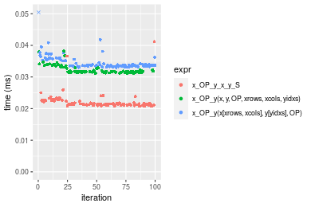
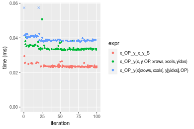
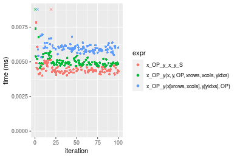

[matrixStats]: Benchmark report

---------------------------------------


# x_OP_y() benchmarks on subsetted computation

This report benchmark the performance of x_OP_y() on subsetted computation.


## Data type "integer"
### Data
```r
> rmatrix <- function(nrow, ncol, mode = c("logical", "double", "integer", "index"), range = c(-100, 
+     +100), na_prob = 0) {
+     mode <- match.arg(mode)
+     n <- nrow * ncol
+     if (mode == "logical") {
+         x <- sample(c(FALSE, TRUE), size = n, replace = TRUE)
+     }     else if (mode == "index") {
+         x <- seq_len(n)
+         mode <- "integer"
+     }     else {
+         x <- runif(n, min = range[1], max = range[2])
+     }
+     storage.mode(x) <- mode
+     if (na_prob > 0) 
+         x[sample(n, size = na_prob * n)] <- NA
+     dim(x) <- c(nrow, ncol)
+     x
+ }
> rmatrices <- function(scale = 10, seed = 1, ...) {
+     set.seed(seed)
+     data <- list()
+     data[[1]] <- rmatrix(nrow = scale * 1, ncol = scale * 1, ...)
+     data[[2]] <- rmatrix(nrow = scale * 10, ncol = scale * 10, ...)
+     data[[3]] <- rmatrix(nrow = scale * 100, ncol = scale * 1, ...)
+     data[[4]] <- t(data[[3]])
+     data[[5]] <- rmatrix(nrow = scale * 10, ncol = scale * 100, ...)
+     data[[6]] <- t(data[[5]])
+     names(data) <- sapply(data, FUN = function(x) paste(dim(x), collapse = "x"))
+     data
+ }
> data <- rmatrices(mode = mode)
```

### Results

### 10x10 vector


```r
> x <- data[["10x10"]]
> y <- x[, 1L]
> xrows <- sample.int(nrow(x), size = nrow(x) * 0.7)
> xcols <- sample.int(ncol(x), size = ncol(x) * 0.7)
> x_S <- x[xrows, xcols]
> yidxs <- xrows
> y_S <- y[yidxs]
```

```r
> OP
[1] "+"
> stats <- microbenchmark(x_OP_y_x_y_S = x_OP_y(x_S, y_S, OP = OP, na.rm = FALSE), `x_OP_y(x, y, OP, xrows, xcols, yidxs)` = x_OP_y(x, 
+     y, OP = OP, xrows = xrows, xcols = xcols, yidxs = yidxs, na.rm = FALSE), `x_OP_y(x[xrows, xcols], y[yidxs], OP)` = x_OP_y(x[xrows, 
+     xcols], y[yidxs], OP = OP, na.rm = FALSE), unit = "ms")
```

_Table: Benchmarking of x_OP_y_x_y_S(), x_OP_y(x, y, OP, xrows, xcols, yidxs)() and x_OP_y(x[xrows, xcols], y[yidxs], OP)() on integer+10x10+add data. The top panel shows times in milliseconds and the bottom panel shows relative times._


|   |expr                                  |      min|        lq|      mean|    median|        uq|      max|
|:--|:-------------------------------------|--------:|---------:|---------:|---------:|---------:|--------:|
|1  |x_OP_y_x_y_S                          | 0.004126| 0.0043750| 0.0060019| 0.0044855| 0.0046655| 0.150233|
|2  |x_OP_y(x, y, OP, xrows, xcols, yidxs) | 0.004689| 0.0049475| 0.0051747| 0.0050740| 0.0052420| 0.008523|
|3  |x_OP_y(x[xrows, xcols], y[yidxs], OP) | 0.005411| 0.0058570| 0.0061015| 0.0060040| 0.0061890| 0.011890|


|   |expr                                  |      min|       lq|      mean|   median|       uq|       max|
|:--|:-------------------------------------|--------:|--------:|---------:|--------:|--------:|---------:|
|1  |x_OP_y_x_y_S                          | 1.000000| 1.000000| 1.0000000| 1.000000| 1.000000| 1.0000000|
|2  |x_OP_y(x, y, OP, xrows, xcols, yidxs) | 1.136452| 1.130857| 0.8621811| 1.131201| 1.123567| 0.0567319|
|3  |x_OP_y(x[xrows, xcols], y[yidxs], OP) | 1.311440| 1.338743| 1.0166082| 1.338535| 1.326546| 0.0791437|

_Figure: Benchmarking of x_OP_y_x_y_S(), x_OP_y(x, y, OP, xrows, xcols, yidxs)() and x_OP_y(x[xrows, xcols], y[yidxs], OP)() on integer+10x10+add data.  Outliers are displayed as crosses.  Times are in milliseconds._


```r
> OP
[1] "-"
> stats <- microbenchmark(x_OP_y_x_y_S = x_OP_y(x_S, y_S, OP = OP, na.rm = FALSE), `x_OP_y(x, y, OP, xrows, xcols, yidxs)` = x_OP_y(x, 
+     y, OP = OP, xrows = xrows, xcols = xcols, yidxs = yidxs, na.rm = FALSE), `x_OP_y(x[xrows, xcols], y[yidxs], OP)` = x_OP_y(x[xrows, 
+     xcols], y[yidxs], OP = OP, na.rm = FALSE), unit = "ms")
```

_Table: Benchmarking of x_OP_y_x_y_S(), x_OP_y(x, y, OP, xrows, xcols, yidxs)() and x_OP_y(x[xrows, xcols], y[yidxs], OP)() on integer+10x10+sub data. The top panel shows times in milliseconds and the bottom panel shows relative times._


|   |expr                                  |      min|       lq|      mean|    median|        uq|      max|
|:--|:-------------------------------------|--------:|--------:|---------:|---------:|---------:|--------:|
|1  |x_OP_y_x_y_S                          | 0.004078| 0.004568| 0.0054825| 0.0047260| 0.0051505| 0.039265|
|2  |x_OP_y(x, y, OP, xrows, xcols, yidxs) | 0.004974| 0.005275| 0.0065113| 0.0054715| 0.0058160| 0.073737|
|3  |x_OP_y(x[xrows, xcols], y[yidxs], OP) | 0.005869| 0.006179| 0.0068555| 0.0063100| 0.0066770| 0.022122|


|   |expr                                  |      min|       lq|     mean|   median|       uq|       max|
|:--|:-------------------------------------|--------:|--------:|--------:|--------:|--------:|---------:|
|1  |x_OP_y_x_y_S                          | 1.000000| 1.000000| 1.000000| 1.000000| 1.000000| 1.0000000|
|2  |x_OP_y(x, y, OP, xrows, xcols, yidxs) | 1.219715| 1.154772| 1.187645| 1.157744| 1.129211| 1.8779320|
|3  |x_OP_y(x[xrows, xcols], y[yidxs], OP) | 1.439186| 1.352671| 1.250417| 1.335167| 1.296379| 0.5634025|

_Figure: Benchmarking of x_OP_y_x_y_S(), x_OP_y(x, y, OP, xrows, xcols, yidxs)() and x_OP_y(x[xrows, xcols], y[yidxs], OP)() on integer+10x10+sub data.  Outliers are displayed as crosses.  Times are in milliseconds._


```r
> OP
[1] "*"
> stats <- microbenchmark(x_OP_y_x_y_S = x_OP_y(x_S, y_S, OP = OP, na.rm = FALSE), `x_OP_y(x, y, OP, xrows, xcols, yidxs)` = x_OP_y(x, 
+     y, OP = OP, xrows = xrows, xcols = xcols, yidxs = yidxs, na.rm = FALSE), `x_OP_y(x[xrows, xcols], y[yidxs], OP)` = x_OP_y(x[xrows, 
+     xcols], y[yidxs], OP = OP, na.rm = FALSE), unit = "ms")
```

_Table: Benchmarking of x_OP_y_x_y_S(), x_OP_y(x, y, OP, xrows, xcols, yidxs)() and x_OP_y(x[xrows, xcols], y[yidxs], OP)() on integer+10x10+mul data. The top panel shows times in milliseconds and the bottom panel shows relative times._


|   |expr                                  |      min|       lq|      mean|    median|        uq|      max|
|:--|:-------------------------------------|--------:|--------:|---------:|---------:|---------:|--------:|
|1  |x_OP_y_x_y_S                          | 0.004023| 0.004318| 0.0044804| 0.0044345| 0.0045890| 0.005817|
|2  |x_OP_y(x, y, OP, xrows, xcols, yidxs) | 0.004710| 0.004990| 0.0052282| 0.0051495| 0.0053275| 0.009631|
|3  |x_OP_y(x[xrows, xcols], y[yidxs], OP) | 0.005367| 0.005856| 0.0062994| 0.0059930| 0.0062070| 0.029772|


|   |expr                                  |      min|       lq|     mean|   median|       uq|      max|
|:--|:-------------------------------------|--------:|--------:|--------:|--------:|--------:|--------:|
|1  |x_OP_y_x_y_S                          | 1.000000| 1.000000| 1.000000| 1.000000| 1.000000| 1.000000|
|2  |x_OP_y(x, y, OP, xrows, xcols, yidxs) | 1.170768| 1.155628| 1.166903| 1.161236| 1.160928| 1.655664|
|3  |x_OP_y(x[xrows, xcols], y[yidxs], OP) | 1.334079| 1.356183| 1.406006| 1.351449| 1.352582| 5.118102|

_Figure: Benchmarking of x_OP_y_x_y_S(), x_OP_y(x, y, OP, xrows, xcols, yidxs)() and x_OP_y(x[xrows, xcols], y[yidxs], OP)() on integer+10x10+mul data.  Outliers are displayed as crosses.  Times are in milliseconds._


```r
> OP
[1] "/"
> stats <- microbenchmark(x_OP_y_x_y_S = x_OP_y(x_S, y_S, OP = OP, na.rm = FALSE), `x_OP_y(x, y, OP, xrows, xcols, yidxs)` = x_OP_y(x, 
+     y, OP = OP, xrows = xrows, xcols = xcols, yidxs = yidxs, na.rm = FALSE), `x_OP_y(x[xrows, xcols], y[yidxs], OP)` = x_OP_y(x[xrows, 
+     xcols], y[yidxs], OP = OP, na.rm = FALSE), unit = "ms")
```

_Table: Benchmarking of x_OP_y_x_y_S(), x_OP_y(x, y, OP, xrows, xcols, yidxs)() and x_OP_y(x[xrows, xcols], y[yidxs], OP)() on integer+10x10+div data. The top panel shows times in milliseconds and the bottom panel shows relative times._


|   |expr                                  |      min|        lq|      mean|    median|        uq|      max|
|:--|:-------------------------------------|--------:|---------:|---------:|---------:|---------:|--------:|
|1  |x_OP_y_x_y_S                          | 0.004027| 0.0042930| 0.0052990| 0.0044830| 0.0047475| 0.035518|
|2  |x_OP_y(x, y, OP, xrows, xcols, yidxs) | 0.004764| 0.0049545| 0.0056419| 0.0050945| 0.0054015| 0.011826|
|3  |x_OP_y(x[xrows, xcols], y[yidxs], OP) | 0.005427| 0.0058150| 0.0069937| 0.0059830| 0.0063290| 0.013828|


|   |expr                                  |      min|       lq|     mean|   median|       uq|       max|
|:--|:-------------------------------------|--------:|--------:|--------:|--------:|--------:|---------:|
|1  |x_OP_y_x_y_S                          | 1.000000| 1.000000| 1.000000| 1.000000| 1.000000| 1.0000000|
|2  |x_OP_y(x, y, OP, xrows, xcols, yidxs) | 1.183015| 1.154088| 1.064709| 1.136404| 1.137757| 0.3329579|
|3  |x_OP_y(x[xrows, xcols], y[yidxs], OP) | 1.347653| 1.354531| 1.319824| 1.334597| 1.333123| 0.3893237|

_Figure: Benchmarking of x_OP_y_x_y_S(), x_OP_y(x, y, OP, xrows, xcols, yidxs)() and x_OP_y(x[xrows, xcols], y[yidxs], OP)() on integer+10x10+div data.  Outliers are displayed as crosses.  Times are in milliseconds._


### 100x100 vector


```r
> x <- data[["100x100"]]
> y <- x[, 1L]
> xrows <- sample.int(nrow(x), size = nrow(x) * 0.7)
> xcols <- sample.int(ncol(x), size = ncol(x) * 0.7)
> x_S <- x[xrows, xcols]
> yidxs <- xrows
> y_S <- y[yidxs]
```

```r
> OP
[1] "+"
> stats <- microbenchmark(x_OP_y_x_y_S = x_OP_y(x_S, y_S, OP = OP, na.rm = FALSE), `x_OP_y(x, y, OP, xrows, xcols, yidxs)` = x_OP_y(x, 
+     y, OP = OP, xrows = xrows, xcols = xcols, yidxs = yidxs, na.rm = FALSE), `x_OP_y(x[xrows, xcols], y[yidxs], OP)` = x_OP_y(x[xrows, 
+     xcols], y[yidxs], OP = OP, na.rm = FALSE), unit = "ms")
```

_Table: Benchmarking of x_OP_y_x_y_S(), x_OP_y(x, y, OP, xrows, xcols, yidxs)() and x_OP_y(x[xrows, xcols], y[yidxs], OP)() on integer+100x100+add data. The top panel shows times in milliseconds and the bottom panel shows relative times._


|   |expr                                  |      min|        lq|      mean|    median|        uq|      max|
|:--|:-------------------------------------|--------:|---------:|---------:|---------:|---------:|--------:|
|1  |x_OP_y_x_y_S                          | 0.023444| 0.0240095| 0.0246985| 0.0242475| 0.0245015| 0.048481|
|2  |x_OP_y(x, y, OP, xrows, xcols, yidxs) | 0.031113| 0.0315155| 0.0320571| 0.0317660| 0.0321060| 0.044328|
|3  |x_OP_y(x[xrows, xcols], y[yidxs], OP) | 0.035808| 0.0362570| 0.0370761| 0.0364325| 0.0370215| 0.053483|


|   |expr                                  |      min|       lq|     mean|   median|       uq|       max|
|:--|:-------------------------------------|--------:|--------:|--------:|--------:|--------:|---------:|
|1  |x_OP_y_x_y_S                          | 1.000000| 1.000000| 1.000000| 1.000000| 1.000000| 1.0000000|
|2  |x_OP_y(x, y, OP, xrows, xcols, yidxs) | 1.327120| 1.312626| 1.297935| 1.310073| 1.310369| 0.9143376|
|3  |x_OP_y(x[xrows, xcols], y[yidxs], OP) | 1.527384| 1.510111| 1.501145| 1.502526| 1.510989| 1.1031744|

_Figure: Benchmarking of x_OP_y_x_y_S(), x_OP_y(x, y, OP, xrows, xcols, yidxs)() and x_OP_y(x[xrows, xcols], y[yidxs], OP)() on integer+100x100+add data.  Outliers are displayed as crosses.  Times are in milliseconds._


```r
> OP
[1] "-"
> stats <- microbenchmark(x_OP_y_x_y_S = x_OP_y(x_S, y_S, OP = OP, na.rm = FALSE), `x_OP_y(x, y, OP, xrows, xcols, yidxs)` = x_OP_y(x, 
+     y, OP = OP, xrows = xrows, xcols = xcols, yidxs = yidxs, na.rm = FALSE), `x_OP_y(x[xrows, xcols], y[yidxs], OP)` = x_OP_y(x[xrows, 
+     xcols], y[yidxs], OP = OP, na.rm = FALSE), unit = "ms")
```

_Table: Benchmarking of x_OP_y_x_y_S(), x_OP_y(x, y, OP, xrows, xcols, yidxs)() and x_OP_y(x[xrows, xcols], y[yidxs], OP)() on integer+100x100+sub data. The top panel shows times in milliseconds and the bottom panel shows relative times._


|   |expr                                  |      min|        lq|      mean|    median|        uq|      max|
|:--|:-------------------------------------|--------:|---------:|---------:|---------:|---------:|--------:|
|1  |x_OP_y_x_y_S                          | 0.020707| 0.0211775| 0.0221214| 0.0214600| 0.0223385| 0.041162|
|2  |x_OP_y(x, y, OP, xrows, xcols, yidxs) | 0.031087| 0.0314875| 0.0322514| 0.0316795| 0.0328265| 0.038178|
|3  |x_OP_y(x[xrows, xcols], y[yidxs], OP) | 0.032991| 0.0334365| 0.0347989| 0.0337055| 0.0353445| 0.068193|


|   |expr                                  |      min|       lq|     mean|   median|       uq|      max|
|:--|:-------------------------------------|--------:|--------:|--------:|--------:|--------:|--------:|
|1  |x_OP_y_x_y_S                          | 1.000000| 1.000000| 1.000000| 1.000000| 1.000000| 1.000000|
|2  |x_OP_y(x, y, OP, xrows, xcols, yidxs) | 1.501280| 1.486837| 1.457930| 1.476212| 1.469503| 0.927506|
|3  |x_OP_y(x[xrows, xcols], y[yidxs], OP) | 1.593229| 1.578869| 1.573086| 1.570620| 1.582224| 1.656698|

_Figure: Benchmarking of x_OP_y_x_y_S(), x_OP_y(x, y, OP, xrows, xcols, yidxs)() and x_OP_y(x[xrows, xcols], y[yidxs], OP)() on integer+100x100+sub data.  Outliers are displayed as crosses.  Times are in milliseconds._



```r
> OP
[1] "*"
> stats <- microbenchmark(x_OP_y_x_y_S = x_OP_y(x_S, y_S, OP = OP, na.rm = FALSE), `x_OP_y(x, y, OP, xrows, xcols, yidxs)` = x_OP_y(x, 
+     y, OP = OP, xrows = xrows, xcols = xcols, yidxs = yidxs, na.rm = FALSE), `x_OP_y(x[xrows, xcols], y[yidxs], OP)` = x_OP_y(x[xrows, 
+     xcols], y[yidxs], OP = OP, na.rm = FALSE), unit = "ms")
```

_Table: Benchmarking of x_OP_y_x_y_S(), x_OP_y(x, y, OP, xrows, xcols, yidxs)() and x_OP_y(x[xrows, xcols], y[yidxs], OP)() on integer+100x100+mul data. The top panel shows times in milliseconds and the bottom panel shows relative times._


|   |expr                                  |      min|        lq|      mean|    median|        uq|      max|
|:--|:-------------------------------------|--------:|---------:|---------:|---------:|---------:|--------:|
|1  |x_OP_y_x_y_S                          | 0.023666| 0.0240145| 0.0249872| 0.0243165| 0.0252400| 0.050692|
|2  |x_OP_y(x, y, OP, xrows, xcols, yidxs) | 0.030890| 0.0315815| 0.0326195| 0.0318745| 0.0333015| 0.048478|
|3  |x_OP_y(x[xrows, xcols], y[yidxs], OP) | 0.035945| 0.0362635| 0.0374714| 0.0366035| 0.0383640| 0.052564|


|   |expr                                  |      min|       lq|     mean|   median|       uq|       max|
|:--|:-------------------------------------|--------:|--------:|--------:|--------:|--------:|---------:|
|1  |x_OP_y_x_y_S                          | 1.000000| 1.000000| 1.000000| 1.000000| 1.000000| 1.0000000|
|2  |x_OP_y(x, y, OP, xrows, xcols, yidxs) | 1.305248| 1.315101| 1.305450| 1.310818| 1.319394| 0.9563245|
|3  |x_OP_y(x[xrows, xcols], y[yidxs], OP) | 1.518846| 1.510067| 1.499625| 1.505295| 1.519968| 1.0369289|

_Figure: Benchmarking of x_OP_y_x_y_S(), x_OP_y(x, y, OP, xrows, xcols, yidxs)() and x_OP_y(x[xrows, xcols], y[yidxs], OP)() on integer+100x100+mul data.  Outliers are displayed as crosses.  Times are in milliseconds._


```r
> OP
[1] "/"
> stats <- microbenchmark(x_OP_y_x_y_S = x_OP_y(x_S, y_S, OP = OP, na.rm = FALSE), `x_OP_y(x, y, OP, xrows, xcols, yidxs)` = x_OP_y(x, 
+     y, OP = OP, xrows = xrows, xcols = xcols, yidxs = yidxs, na.rm = FALSE), `x_OP_y(x[xrows, xcols], y[yidxs], OP)` = x_OP_y(x[xrows, 
+     xcols], y[yidxs], OP = OP, na.rm = FALSE), unit = "ms")
```

_Table: Benchmarking of x_OP_y_x_y_S(), x_OP_y(x, y, OP, xrows, xcols, yidxs)() and x_OP_y(x[xrows, xcols], y[yidxs], OP)() on integer+100x100+div data. The top panel shows times in milliseconds and the bottom panel shows relative times._


|   |expr                                  |      min|        lq|      mean|    median|        uq|      max|
|:--|:-------------------------------------|--------:|---------:|---------:|---------:|---------:|--------:|
|1  |x_OP_y_x_y_S                          | 0.016605| 0.0172130| 0.0175279| 0.0173795| 0.0176275| 0.021188|
|2  |x_OP_y(x, y, OP, xrows, xcols, yidxs) | 0.026172| 0.0264785| 0.0272389| 0.0266840| 0.0268830| 0.062399|
|3  |x_OP_y(x[xrows, xcols], y[yidxs], OP) | 0.029360| 0.0297965| 0.0306435| 0.0300845| 0.0304605| 0.046999|


|   |expr                                  |      min|       lq|     mean|   median|      uq|      max|
|:--|:-------------------------------------|--------:|--------:|--------:|--------:|-------:|--------:|
|1  |x_OP_y_x_y_S                          | 1.000000| 1.000000| 1.000000| 1.000000| 1.00000| 1.000000|
|2  |x_OP_y(x, y, OP, xrows, xcols, yidxs) | 1.576152| 1.538285| 1.554029| 1.535372| 1.52506| 2.945016|
|3  |x_OP_y(x[xrows, xcols], y[yidxs], OP) | 1.768142| 1.731046| 1.748269| 1.731034| 1.72801| 2.218189|

_Figure: Benchmarking of x_OP_y_x_y_S(), x_OP_y(x, y, OP, xrows, xcols, yidxs)() and x_OP_y(x[xrows, xcols], y[yidxs], OP)() on integer+100x100+div data.  Outliers are displayed as crosses.  Times are in milliseconds._


### 1000x10 vector


```r
> x <- data[["1000x10"]]
> y <- x[, 1L]
> xrows <- sample.int(nrow(x), size = nrow(x) * 0.7)
> xcols <- sample.int(ncol(x), size = ncol(x) * 0.7)
> x_S <- x[xrows, xcols]
> yidxs <- xrows
> y_S <- y[yidxs]
```

```r
> OP
[1] "+"
> stats <- microbenchmark(x_OP_y_x_y_S = x_OP_y(x_S, y_S, OP = OP, na.rm = FALSE), `x_OP_y(x, y, OP, xrows, xcols, yidxs)` = x_OP_y(x, 
+     y, OP = OP, xrows = xrows, xcols = xcols, yidxs = yidxs, na.rm = FALSE), `x_OP_y(x[xrows, xcols], y[yidxs], OP)` = x_OP_y(x[xrows, 
+     xcols], y[yidxs], OP = OP, na.rm = FALSE), unit = "ms")
```

_Table: Benchmarking of x_OP_y_x_y_S(), x_OP_y(x, y, OP, xrows, xcols, yidxs)() and x_OP_y(x[xrows, xcols], y[yidxs], OP)() on integer+1000x10+add data. The top panel shows times in milliseconds and the bottom panel shows relative times._


|   |expr                                  |      min|        lq|      mean|   median|        uq|      max|
|:--|:-------------------------------------|--------:|---------:|---------:|--------:|---------:|--------:|
|1  |x_OP_y_x_y_S                          | 0.022752| 0.0232090| 0.0238811| 0.023463| 0.0244060| 0.029087|
|2  |x_OP_y(x, y, OP, xrows, xcols, yidxs) | 0.032672| 0.0332005| 0.0340622| 0.033522| 0.0344280| 0.039967|
|3  |x_OP_y(x[xrows, xcols], y[yidxs], OP) | 0.037727| 0.0381675| 0.0396741| 0.038402| 0.0403405| 0.075408|


|   |expr                                  |      min|       lq|     mean|   median|       uq|      max|
|:--|:-------------------------------------|--------:|--------:|--------:|--------:|--------:|--------:|
|1  |x_OP_y_x_y_S                          | 1.000000| 1.000000| 1.000000| 1.000000| 1.000000| 1.000000|
|2  |x_OP_y(x, y, OP, xrows, xcols, yidxs) | 1.436006| 1.430501| 1.426323| 1.428718| 1.410637| 1.374050|
|3  |x_OP_y(x[xrows, xcols], y[yidxs], OP) | 1.658184| 1.644513| 1.661315| 1.636705| 1.652893| 2.592498|

_Figure: Benchmarking of x_OP_y_x_y_S(), x_OP_y(x, y, OP, xrows, xcols, yidxs)() and x_OP_y(x[xrows, xcols], y[yidxs], OP)() on integer+1000x10+add data.  Outliers are displayed as crosses.  Times are in milliseconds._


```r
> OP
[1] "-"
> stats <- microbenchmark(x_OP_y_x_y_S = x_OP_y(x_S, y_S, OP = OP, na.rm = FALSE), `x_OP_y(x, y, OP, xrows, xcols, yidxs)` = x_OP_y(x, 
+     y, OP = OP, xrows = xrows, xcols = xcols, yidxs = yidxs, na.rm = FALSE), `x_OP_y(x[xrows, xcols], y[yidxs], OP)` = x_OP_y(x[xrows, 
+     xcols], y[yidxs], OP = OP, na.rm = FALSE), unit = "ms")
```

_Table: Benchmarking of x_OP_y_x_y_S(), x_OP_y(x, y, OP, xrows, xcols, yidxs)() and x_OP_y(x[xrows, xcols], y[yidxs], OP)() on integer+1000x10+sub data. The top panel shows times in milliseconds and the bottom panel shows relative times._


|   |expr                                  |      min|        lq|      mean|    median|        uq|      max|
|:--|:-------------------------------------|--------:|---------:|---------:|---------:|---------:|--------:|
|1  |x_OP_y_x_y_S                          | 0.020254| 0.0207145| 0.0215302| 0.0209520| 0.0221340| 0.027000|
|2  |x_OP_y(x, y, OP, xrows, xcols, yidxs) | 0.032752| 0.0332490| 0.0341090| 0.0335470| 0.0349140| 0.039605|
|3  |x_OP_y(x[xrows, xcols], y[yidxs], OP) | 0.035254| 0.0356480| 0.0376336| 0.0359135| 0.0379795| 0.078998|


|   |expr                                  |      min|       lq|     mean|   median|       uq|      max|
|:--|:-------------------------------------|--------:|--------:|--------:|--------:|--------:|--------:|
|1  |x_OP_y_x_y_S                          | 1.000000| 1.000000| 1.000000| 1.000000| 1.000000| 1.000000|
|2  |x_OP_y(x, y, OP, xrows, xcols, yidxs) | 1.617063| 1.605107| 1.584242| 1.601136| 1.577392| 1.466852|
|3  |x_OP_y(x[xrows, xcols], y[yidxs], OP) | 1.740595| 1.720920| 1.747949| 1.714085| 1.715890| 2.925852|

_Figure: Benchmarking of x_OP_y_x_y_S(), x_OP_y(x, y, OP, xrows, xcols, yidxs)() and x_OP_y(x[xrows, xcols], y[yidxs], OP)() on integer+1000x10+sub data.  Outliers are displayed as crosses.  Times are in milliseconds._


```r
> OP
[1] "*"
> stats <- microbenchmark(x_OP_y_x_y_S = x_OP_y(x_S, y_S, OP = OP, na.rm = FALSE), `x_OP_y(x, y, OP, xrows, xcols, yidxs)` = x_OP_y(x, 
+     y, OP = OP, xrows = xrows, xcols = xcols, yidxs = yidxs, na.rm = FALSE), `x_OP_y(x[xrows, xcols], y[yidxs], OP)` = x_OP_y(x[xrows, 
+     xcols], y[yidxs], OP = OP, na.rm = FALSE), unit = "ms")
```

_Table: Benchmarking of x_OP_y_x_y_S(), x_OP_y(x, y, OP, xrows, xcols, yidxs)() and x_OP_y(x[xrows, xcols], y[yidxs], OP)() on integer+1000x10+mul data. The top panel shows times in milliseconds and the bottom panel shows relative times._


|   |expr                                  |      min|        lq|      mean|    median|        uq|      max|
|:--|:-------------------------------------|--------:|---------:|---------:|---------:|---------:|--------:|
|1  |x_OP_y_x_y_S                          | 0.022895| 0.0232350| 0.0237620| 0.0234680| 0.0237410| 0.029507|
|2  |x_OP_y(x, y, OP, xrows, xcols, yidxs) | 0.032794| 0.0332920| 0.0342528| 0.0335290| 0.0349830| 0.050653|
|3  |x_OP_y(x[xrows, xcols], y[yidxs], OP) | 0.037737| 0.0382435| 0.0397470| 0.0385695| 0.0404155| 0.078579|


|   |expr                                  |      min|       lq|     mean|   median|       uq|      max|
|:--|:-------------------------------------|--------:|--------:|--------:|--------:|--------:|--------:|
|1  |x_OP_y_x_y_S                          | 1.000000| 1.000000| 1.000000| 1.000000| 1.000000| 1.000000|
|2  |x_OP_y(x, y, OP, xrows, xcols, yidxs) | 1.432365| 1.432838| 1.441496| 1.428711| 1.473527| 1.716643|
|3  |x_OP_y(x[xrows, xcols], y[yidxs], OP) | 1.648264| 1.645944| 1.672712| 1.643493| 1.702350| 2.663063|

_Figure: Benchmarking of x_OP_y_x_y_S(), x_OP_y(x, y, OP, xrows, xcols, yidxs)() and x_OP_y(x[xrows, xcols], y[yidxs], OP)() on integer+1000x10+mul data.  Outliers are displayed as crosses.  Times are in milliseconds._



```r
> OP
[1] "/"
> stats <- microbenchmark(x_OP_y_x_y_S = x_OP_y(x_S, y_S, OP = OP, na.rm = FALSE), `x_OP_y(x, y, OP, xrows, xcols, yidxs)` = x_OP_y(x, 
+     y, OP = OP, xrows = xrows, xcols = xcols, yidxs = yidxs, na.rm = FALSE), `x_OP_y(x[xrows, xcols], y[yidxs], OP)` = x_OP_y(x[xrows, 
+     xcols], y[yidxs], OP = OP, na.rm = FALSE), unit = "ms")
```

_Table: Benchmarking of x_OP_y_x_y_S(), x_OP_y(x, y, OP, xrows, xcols, yidxs)() and x_OP_y(x[xrows, xcols], y[yidxs], OP)() on integer+1000x10+div data. The top panel shows times in milliseconds and the bottom panel shows relative times._


|   |expr                                  |      min|        lq|      mean|    median|       uq|      max|
|:--|:-------------------------------------|--------:|---------:|---------:|---------:|--------:|--------:|
|1  |x_OP_y_x_y_S                          | 0.016879| 0.0173770| 0.0187214| 0.0175540| 0.017942| 0.040207|
|2  |x_OP_y(x, y, OP, xrows, xcols, yidxs) | 0.028668| 0.0291150| 0.0310811| 0.0293150| 0.029582| 0.064715|
|3  |x_OP_y(x[xrows, xcols], y[yidxs], OP) | 0.032403| 0.0328755| 0.0359407| 0.0330655| 0.034108| 0.072881|


|   |expr                                  |      min|       lq|     mean|   median|       uq|      max|
|:--|:-------------------------------------|--------:|--------:|--------:|--------:|--------:|--------:|
|1  |x_OP_y_x_y_S                          | 1.000000| 1.000000| 1.000000| 1.000000| 1.000000| 1.000000|
|2  |x_OP_y(x, y, OP, xrows, xcols, yidxs) | 1.698442| 1.675491| 1.660192| 1.669990| 1.648757| 1.609546|
|3  |x_OP_y(x[xrows, xcols], y[yidxs], OP) | 1.919723| 1.891897| 1.919769| 1.883645| 1.901014| 1.812645|

_Figure: Benchmarking of x_OP_y_x_y_S(), x_OP_y(x, y, OP, xrows, xcols, yidxs)() and x_OP_y(x[xrows, xcols], y[yidxs], OP)() on integer+1000x10+div data.  Outliers are displayed as crosses.  Times are in milliseconds._


### 10x1000 vector


```r
> x <- data[["10x1000"]]
> y <- x[, 1L]
> xrows <- sample.int(nrow(x), size = nrow(x) * 0.7)
> xcols <- sample.int(ncol(x), size = ncol(x) * 0.7)
> x_S <- x[xrows, xcols]
> yidxs <- xrows
> y_S <- y[yidxs]
```

```r
> OP
[1] "+"
> stats <- microbenchmark(x_OP_y_x_y_S = x_OP_y(x_S, y_S, OP = OP, na.rm = FALSE), `x_OP_y(x, y, OP, xrows, xcols, yidxs)` = x_OP_y(x, 
+     y, OP = OP, xrows = xrows, xcols = xcols, yidxs = yidxs, na.rm = FALSE), `x_OP_y(x[xrows, xcols], y[yidxs], OP)` = x_OP_y(x[xrows, 
+     xcols], y[yidxs], OP = OP, na.rm = FALSE), unit = "ms")
```

_Table: Benchmarking of x_OP_y_x_y_S(), x_OP_y(x, y, OP, xrows, xcols, yidxs)() and x_OP_y(x[xrows, xcols], y[yidxs], OP)() on integer+10x1000+add data. The top panel shows times in milliseconds and the bottom panel shows relative times._


|   |expr                                  |      min|        lq|      mean|    median|        uq|      max|
|:--|:-------------------------------------|--------:|---------:|---------:|---------:|---------:|--------:|
|1  |x_OP_y_x_y_S                          | 0.023237| 0.0239235| 0.0245660| 0.0242155| 0.0247495| 0.030548|
|2  |x_OP_y(x, y, OP, xrows, xcols, yidxs) | 0.032647| 0.0331905| 0.0343081| 0.0334975| 0.0343275| 0.050281|
|3  |x_OP_y(x[xrows, xcols], y[yidxs], OP) | 0.037625| 0.0381235| 0.0397804| 0.0384225| 0.0400085| 0.079630|


|   |expr                                  |      min|       lq|     mean|   median|       uq|      max|
|:--|:-------------------------------------|--------:|--------:|--------:|--------:|--------:|--------:|
|1  |x_OP_y_x_y_S                          | 1.000000| 1.000000| 1.000000| 1.000000| 1.000000| 1.000000|
|2  |x_OP_y(x, y, OP, xrows, xcols, yidxs) | 1.404958| 1.387360| 1.396567| 1.383308| 1.386998| 1.645967|
|3  |x_OP_y(x[xrows, xcols], y[yidxs], OP) | 1.619185| 1.593559| 1.619326| 1.586690| 1.616538| 2.606717|

_Figure: Benchmarking of x_OP_y_x_y_S(), x_OP_y(x, y, OP, xrows, xcols, yidxs)() and x_OP_y(x[xrows, xcols], y[yidxs], OP)() on integer+10x1000+add data.  Outliers are displayed as crosses.  Times are in milliseconds._


```r
> OP
[1] "-"
> stats <- microbenchmark(x_OP_y_x_y_S = x_OP_y(x_S, y_S, OP = OP, na.rm = FALSE), `x_OP_y(x, y, OP, xrows, xcols, yidxs)` = x_OP_y(x, 
+     y, OP = OP, xrows = xrows, xcols = xcols, yidxs = yidxs, na.rm = FALSE), `x_OP_y(x[xrows, xcols], y[yidxs], OP)` = x_OP_y(x[xrows, 
+     xcols], y[yidxs], OP = OP, na.rm = FALSE), unit = "ms")
```

_Table: Benchmarking of x_OP_y_x_y_S(), x_OP_y(x, y, OP, xrows, xcols, yidxs)() and x_OP_y(x[xrows, xcols], y[yidxs], OP)() on integer+10x1000+sub data. The top panel shows times in milliseconds and the bottom panel shows relative times._


|   |expr                                  |      min|        lq|      mean|    median|        uq|      max|
|:--|:-------------------------------------|--------:|---------:|---------:|---------:|---------:|--------:|
|1  |x_OP_y_x_y_S                          | 0.020254| 0.0208155| 0.0221271| 0.0210175| 0.0214505| 0.066816|
|2  |x_OP_y(x, y, OP, xrows, xcols, yidxs) | 0.032489| 0.0332015| 0.0341302| 0.0335080| 0.0346720| 0.052668|
|3  |x_OP_y(x[xrows, xcols], y[yidxs], OP) | 0.034731| 0.0351395| 0.0358955| 0.0354075| 0.0359785| 0.041454|


|   |expr                                  |      min|       lq|     mean|   median|       uq|       max|
|:--|:-------------------------------------|--------:|--------:|--------:|--------:|--------:|---------:|
|1  |x_OP_y_x_y_S                          | 1.000000| 1.000000| 1.000000| 1.000000| 1.000000| 1.0000000|
|2  |x_OP_y(x, y, OP, xrows, xcols, yidxs) | 1.604078| 1.595037| 1.542458| 1.594291| 1.616373| 0.7882543|
|3  |x_OP_y(x[xrows, xcols], y[yidxs], OP) | 1.714772| 1.688141| 1.622239| 1.684667| 1.677280| 0.6204203|

_Figure: Benchmarking of x_OP_y_x_y_S(), x_OP_y(x, y, OP, xrows, xcols, yidxs)() and x_OP_y(x[xrows, xcols], y[yidxs], OP)() on integer+10x1000+sub data.  Outliers are displayed as crosses.  Times are in milliseconds._


```r
> OP
[1] "*"
> stats <- microbenchmark(x_OP_y_x_y_S = x_OP_y(x_S, y_S, OP = OP, na.rm = FALSE), `x_OP_y(x, y, OP, xrows, xcols, yidxs)` = x_OP_y(x, 
+     y, OP = OP, xrows = xrows, xcols = xcols, yidxs = yidxs, na.rm = FALSE), `x_OP_y(x[xrows, xcols], y[yidxs], OP)` = x_OP_y(x[xrows, 
+     xcols], y[yidxs], OP = OP, na.rm = FALSE), unit = "ms")
```

_Table: Benchmarking of x_OP_y_x_y_S(), x_OP_y(x, y, OP, xrows, xcols, yidxs)() and x_OP_y(x[xrows, xcols], y[yidxs], OP)() on integer+10x1000+mul data. The top panel shows times in milliseconds and the bottom panel shows relative times._


|   |expr                                  |      min|        lq|      mean|    median|        uq|      max|
|:--|:-------------------------------------|--------:|---------:|---------:|---------:|---------:|--------:|
|1  |x_OP_y_x_y_S                          | 0.020719| 0.0214755| 0.0237694| 0.0222345| 0.0239565| 0.055658|
|2  |x_OP_y(x, y, OP, xrows, xcols, yidxs) | 0.028949| 0.0301640| 0.0319103| 0.0311455| 0.0330055| 0.047355|
|3  |x_OP_y(x[xrows, xcols], y[yidxs], OP) | 0.033734| 0.0344565| 0.0366302| 0.0356365| 0.0378930| 0.055127|


|   |expr                                  |      min|       lq|     mean|   median|       uq|       max|
|:--|:-------------------------------------|--------:|--------:|--------:|--------:|--------:|---------:|
|1  |x_OP_y_x_y_S                          | 1.000000| 1.000000| 1.000000| 1.000000| 1.000000| 1.0000000|
|2  |x_OP_y(x, y, OP, xrows, xcols, yidxs) | 1.397220| 1.404577| 1.342498| 1.400774| 1.377726| 0.8508211|
|3  |x_OP_y(x[xrows, xcols], y[yidxs], OP) | 1.628167| 1.604456| 1.541068| 1.602757| 1.581742| 0.9904596|

_Figure: Benchmarking of x_OP_y_x_y_S(), x_OP_y(x, y, OP, xrows, xcols, yidxs)() and x_OP_y(x[xrows, xcols], y[yidxs], OP)() on integer+10x1000+mul data.  Outliers are displayed as crosses.  Times are in milliseconds._


```r
> OP
[1] "/"
> stats <- microbenchmark(x_OP_y_x_y_S = x_OP_y(x_S, y_S, OP = OP, na.rm = FALSE), `x_OP_y(x, y, OP, xrows, xcols, yidxs)` = x_OP_y(x, 
+     y, OP = OP, xrows = xrows, xcols = xcols, yidxs = yidxs, na.rm = FALSE), `x_OP_y(x[xrows, xcols], y[yidxs], OP)` = x_OP_y(x[xrows, 
+     xcols], y[yidxs], OP = OP, na.rm = FALSE), unit = "ms")
```

_Table: Benchmarking of x_OP_y_x_y_S(), x_OP_y(x, y, OP, xrows, xcols, yidxs)() and x_OP_y(x[xrows, xcols], y[yidxs], OP)() on integer+10x1000+div data. The top panel shows times in milliseconds and the bottom panel shows relative times._


|   |expr                                  |      min|        lq|      mean|    median|        uq|      max|
|:--|:-------------------------------------|--------:|---------:|---------:|---------:|---------:|--------:|
|1  |x_OP_y_x_y_S                          | 0.017600| 0.0180920| 0.0189505| 0.0184445| 0.0191975| 0.024900|
|2  |x_OP_y(x, y, OP, xrows, xcols, yidxs) | 0.028167| 0.0286755| 0.0298966| 0.0291500| 0.0303085| 0.044259|
|3  |x_OP_y(x[xrows, xcols], y[yidxs], OP) | 0.032549| 0.0330820| 0.0360233| 0.0339645| 0.0354165| 0.079638|


|   |expr                                  |      min|       lq|     mean|   median|       uq|      max|
|:--|:-------------------------------------|--------:|--------:|--------:|--------:|--------:|--------:|
|1  |x_OP_y_x_y_S                          | 1.000000| 1.000000| 1.000000| 1.000000| 1.000000| 1.000000|
|2  |x_OP_y(x, y, OP, xrows, xcols, yidxs) | 1.600398| 1.584982| 1.577617| 1.580417| 1.578773| 1.777470|
|3  |x_OP_y(x[xrows, xcols], y[yidxs], OP) | 1.849375| 1.828543| 1.900917| 1.841443| 1.844850| 3.198313|

_Figure: Benchmarking of x_OP_y_x_y_S(), x_OP_y(x, y, OP, xrows, xcols, yidxs)() and x_OP_y(x[xrows, xcols], y[yidxs], OP)() on integer+10x1000+div data.  Outliers are displayed as crosses.  Times are in milliseconds._


### 100x1000 vector


```r
> x <- data[["100x1000"]]
> y <- x[, 1L]
> xrows <- sample.int(nrow(x), size = nrow(x) * 0.7)
> xcols <- sample.int(ncol(x), size = ncol(x) * 0.7)
> x_S <- x[xrows, xcols]
> yidxs <- xrows
> y_S <- y[yidxs]
```

```r
> OP
[1] "+"
> stats <- microbenchmark(x_OP_y_x_y_S = x_OP_y(x_S, y_S, OP = OP, na.rm = FALSE), `x_OP_y(x, y, OP, xrows, xcols, yidxs)` = x_OP_y(x, 
+     y, OP = OP, xrows = xrows, xcols = xcols, yidxs = yidxs, na.rm = FALSE), `x_OP_y(x[xrows, xcols], y[yidxs], OP)` = x_OP_y(x[xrows, 
+     xcols], y[yidxs], OP = OP, na.rm = FALSE), unit = "ms")
```

_Table: Benchmarking of x_OP_y_x_y_S(), x_OP_y(x, y, OP, xrows, xcols, yidxs)() and x_OP_y(x[xrows, xcols], y[yidxs], OP)() on integer+100x1000+add data. The top panel shows times in milliseconds and the bottom panel shows relative times._


|   |expr                                  |      min|       lq|      mean|    median|        uq|      max|
|:--|:-------------------------------------|--------:|--------:|---------:|---------:|---------:|--------:|
|1  |x_OP_y_x_y_S                          | 0.129126| 0.145434| 0.1623397| 0.1557460| 0.1772155| 0.224476|
|2  |x_OP_y(x, y, OP, xrows, xcols, yidxs) | 0.174505| 0.201165| 0.2186318| 0.2150450| 0.2299000| 0.307454|
|3  |x_OP_y(x[xrows, xcols], y[yidxs], OP) | 0.200467| 0.223690| 0.2539445| 0.2444265| 0.2744855| 0.426161|


|   |expr                                  |      min|       lq|     mean|   median|       uq|      max|
|:--|:-------------------------------------|--------:|--------:|--------:|--------:|--------:|--------:|
|1  |x_OP_y_x_y_S                          | 1.000000| 1.000000| 1.000000| 1.000000| 1.000000| 1.000000|
|2  |x_OP_y(x, y, OP, xrows, xcols, yidxs) | 1.351432| 1.383205| 1.346755| 1.380742| 1.297291| 1.369652|
|3  |x_OP_y(x[xrows, xcols], y[yidxs], OP) | 1.552491| 1.538086| 1.564278| 1.569392| 1.548880| 1.898470|

_Figure: Benchmarking of x_OP_y_x_y_S(), x_OP_y(x, y, OP, xrows, xcols, yidxs)() and x_OP_y(x[xrows, xcols], y[yidxs], OP)() on integer+100x1000+add data.  Outliers are displayed as crosses.  Times are in milliseconds._


```r
> OP
[1] "-"
> stats <- microbenchmark(x_OP_y_x_y_S = x_OP_y(x_S, y_S, OP = OP, na.rm = FALSE), `x_OP_y(x, y, OP, xrows, xcols, yidxs)` = x_OP_y(x, 
+     y, OP = OP, xrows = xrows, xcols = xcols, yidxs = yidxs, na.rm = FALSE), `x_OP_y(x[xrows, xcols], y[yidxs], OP)` = x_OP_y(x[xrows, 
+     xcols], y[yidxs], OP = OP, na.rm = FALSE), unit = "ms")
```

_Table: Benchmarking of x_OP_y_x_y_S(), x_OP_y(x, y, OP, xrows, xcols, yidxs)() and x_OP_y(x[xrows, xcols], y[yidxs], OP)() on integer+100x1000+sub data. The top panel shows times in milliseconds and the bottom panel shows relative times._


|   |expr                                  |      min|        lq|      mean|    median|        uq|      max|
|:--|:-------------------------------------|--------:|---------:|---------:|---------:|---------:|--------:|
|1  |x_OP_y_x_y_S                          | 0.117229| 0.1249880| 0.1428005| 0.1369880| 0.1631180| 0.189287|
|2  |x_OP_y(x, y, OP, xrows, xcols, yidxs) | 0.184766| 0.2024055| 0.2263585| 0.2163345| 0.2501095| 0.302907|
|3  |x_OP_y(x[xrows, xcols], y[yidxs], OP) | 0.192244| 0.2169615| 0.2421038| 0.2277575| 0.2751875| 0.394571|


|   |expr                                  |      min|       lq|     mean|   median|       uq|      max|
|:--|:-------------------------------------|--------:|--------:|--------:|--------:|--------:|--------:|
|1  |x_OP_y_x_y_S                          | 1.000000| 1.000000| 1.000000| 1.000000| 1.000000| 1.000000|
|2  |x_OP_y(x, y, OP, xrows, xcols, yidxs) | 1.576112| 1.619400| 1.585138| 1.579222| 1.533304| 1.600253|
|3  |x_OP_y(x[xrows, xcols], y[yidxs], OP) | 1.639901| 1.735859| 1.695399| 1.662609| 1.687046| 2.084512|

_Figure: Benchmarking of x_OP_y_x_y_S(), x_OP_y(x, y, OP, xrows, xcols, yidxs)() and x_OP_y(x[xrows, xcols], y[yidxs], OP)() on integer+100x1000+sub data.  Outliers are displayed as crosses.  Times are in milliseconds._


```r
> OP
[1] "*"
> stats <- microbenchmark(x_OP_y_x_y_S = x_OP_y(x_S, y_S, OP = OP, na.rm = FALSE), `x_OP_y(x, y, OP, xrows, xcols, yidxs)` = x_OP_y(x, 
+     y, OP = OP, xrows = xrows, xcols = xcols, yidxs = yidxs, na.rm = FALSE), `x_OP_y(x[xrows, xcols], y[yidxs], OP)` = x_OP_y(x[xrows, 
+     xcols], y[yidxs], OP = OP, na.rm = FALSE), unit = "ms")
```

_Table: Benchmarking of x_OP_y_x_y_S(), x_OP_y(x, y, OP, xrows, xcols, yidxs)() and x_OP_y(x[xrows, xcols], y[yidxs], OP)() on integer+100x1000+mul data. The top panel shows times in milliseconds and the bottom panel shows relative times._


|   |expr                                  |      min|        lq|      mean|    median|        uq|      max|
|:--|:-------------------------------------|--------:|---------:|---------:|---------:|---------:|--------:|
|1  |x_OP_y_x_y_S                          | 0.122550| 0.1365335| 0.1587696| 0.1540485| 0.1683540| 0.344538|
|2  |x_OP_y(x, y, OP, xrows, xcols, yidxs) | 0.165662| 0.1879040| 0.2191768| 0.2084625| 0.2499565| 0.388146|
|3  |x_OP_y(x[xrows, xcols], y[yidxs], OP) | 0.190418| 0.2178485| 0.2501351| 0.2461650| 0.2663545| 0.407773|


|   |expr                                  |      min|       lq|    mean|   median|       uq|      max|
|:--|:-------------------------------------|--------:|--------:|-------:|--------:|--------:|--------:|
|1  |x_OP_y_x_y_S                          | 1.000000| 1.000000| 1.00000| 1.000000| 1.000000| 1.000000|
|2  |x_OP_y(x, y, OP, xrows, xcols, yidxs) | 1.351791| 1.376248| 1.38047| 1.353226| 1.484708| 1.126570|
|3  |x_OP_y(x[xrows, xcols], y[yidxs], OP) | 1.553798| 1.595568| 1.57546| 1.597971| 1.582110| 1.183536|

_Figure: Benchmarking of x_OP_y_x_y_S(), x_OP_y(x, y, OP, xrows, xcols, yidxs)() and x_OP_y(x[xrows, xcols], y[yidxs], OP)() on integer+100x1000+mul data.  Outliers are displayed as crosses.  Times are in milliseconds._


```r
> OP
[1] "/"
> stats <- microbenchmark(x_OP_y_x_y_S = x_OP_y(x_S, y_S, OP = OP, na.rm = FALSE), `x_OP_y(x, y, OP, xrows, xcols, yidxs)` = x_OP_y(x, 
+     y, OP = OP, xrows = xrows, xcols = xcols, yidxs = yidxs, na.rm = FALSE), `x_OP_y(x[xrows, xcols], y[yidxs], OP)` = x_OP_y(x[xrows, 
+     xcols], y[yidxs], OP = OP, na.rm = FALSE), unit = "ms")
```

_Table: Benchmarking of x_OP_y_x_y_S(), x_OP_y(x, y, OP, xrows, xcols, yidxs)() and x_OP_y(x[xrows, xcols], y[yidxs], OP)() on integer+100x1000+div data. The top panel shows times in milliseconds and the bottom panel shows relative times._


|   |expr                                  |      min|        lq|      mean|    median|        uq|      max|
|:--|:-------------------------------------|--------:|---------:|---------:|---------:|---------:|--------:|
|1  |x_OP_y_x_y_S                          | 0.087277| 0.0973845| 0.1156346| 0.1037500| 0.1129455| 0.268237|
|2  |x_OP_y(x, y, OP, xrows, xcols, yidxs) | 0.147527| 0.1625230| 0.1872013| 0.1731985| 0.1922865| 0.456080|
|3  |x_OP_y(x[xrows, xcols], y[yidxs], OP) | 0.163898| 0.1810995| 0.2025351| 0.1892255| 0.2078955| 0.377228|


|   |expr                                  |      min|       lq|     mean|   median|       uq|      max|
|:--|:-------------------------------------|--------:|--------:|--------:|--------:|--------:|--------:|
|1  |x_OP_y_x_y_S                          | 1.000000| 1.000000| 1.000000| 1.000000| 1.000000| 1.000000|
|2  |x_OP_y(x, y, OP, xrows, xcols, yidxs) | 1.690331| 1.668880| 1.618903| 1.669383| 1.702471| 1.700287|
|3  |x_OP_y(x[xrows, xcols], y[yidxs], OP) | 1.877906| 1.859634| 1.751508| 1.823860| 1.840671| 1.406324|

_Figure: Benchmarking of x_OP_y_x_y_S(), x_OP_y(x, y, OP, xrows, xcols, yidxs)() and x_OP_y(x[xrows, xcols], y[yidxs], OP)() on integer+100x1000+div data.  Outliers are displayed as crosses.  Times are in milliseconds._


### 1000x100 vector


```r
> x <- data[["1000x100"]]
> y <- x[, 1L]
> xrows <- sample.int(nrow(x), size = nrow(x) * 0.7)
> xcols <- sample.int(ncol(x), size = ncol(x) * 0.7)
> x_S <- x[xrows, xcols]
> yidxs <- xrows
> y_S <- y[yidxs]
```

```r
> OP
[1] "+"
> stats <- microbenchmark(x_OP_y_x_y_S = x_OP_y(x_S, y_S, OP = OP, na.rm = FALSE), `x_OP_y(x, y, OP, xrows, xcols, yidxs)` = x_OP_y(x, 
+     y, OP = OP, xrows = xrows, xcols = xcols, yidxs = yidxs, na.rm = FALSE), `x_OP_y(x[xrows, xcols], y[yidxs], OP)` = x_OP_y(x[xrows, 
+     xcols], y[yidxs], OP = OP, na.rm = FALSE), unit = "ms")
```

_Table: Benchmarking of x_OP_y_x_y_S(), x_OP_y(x, y, OP, xrows, xcols, yidxs)() and x_OP_y(x[xrows, xcols], y[yidxs], OP)() on integer+1000x100+add data. The top panel shows times in milliseconds and the bottom panel shows relative times._


|   |expr                                  |      min|        lq|      mean|    median|        uq|      max|
|:--|:-------------------------------------|--------:|---------:|---------:|---------:|---------:|--------:|
|1  |x_OP_y_x_y_S                          | 0.120604| 0.1327595| 0.1521894| 0.1480815| 0.1594145| 0.258066|
|2  |x_OP_y(x, y, OP, xrows, xcols, yidxs) | 0.160871| 0.1790440| 0.2071493| 0.2019120| 0.2207380| 0.346446|
|3  |x_OP_y(x[xrows, xcols], y[yidxs], OP) | 0.183030| 0.2035455| 0.2329213| 0.2259345| 0.2481010| 0.386030|


|   |expr                                  |      min|       lq|     mean|   median|       uq|      max|
|:--|:-------------------------------------|--------:|--------:|--------:|--------:|--------:|--------:|
|1  |x_OP_y_x_y_S                          | 1.000000| 1.000000| 1.000000| 1.000000| 1.000000| 1.000000|
|2  |x_OP_y(x, y, OP, xrows, xcols, yidxs) | 1.333878| 1.348634| 1.361129| 1.363519| 1.384680| 1.342470|
|3  |x_OP_y(x[xrows, xcols], y[yidxs], OP) | 1.517611| 1.533190| 1.530470| 1.525744| 1.556326| 1.495858|

_Figure: Benchmarking of x_OP_y_x_y_S(), x_OP_y(x, y, OP, xrows, xcols, yidxs)() and x_OP_y(x[xrows, xcols], y[yidxs], OP)() on integer+1000x100+add data.  Outliers are displayed as crosses.  Times are in milliseconds._


```r
> OP
[1] "-"
> stats <- microbenchmark(x_OP_y_x_y_S = x_OP_y(x_S, y_S, OP = OP, na.rm = FALSE), `x_OP_y(x, y, OP, xrows, xcols, yidxs)` = x_OP_y(x, 
+     y, OP = OP, xrows = xrows, xcols = xcols, yidxs = yidxs, na.rm = FALSE), `x_OP_y(x[xrows, xcols], y[yidxs], OP)` = x_OP_y(x[xrows, 
+     xcols], y[yidxs], OP = OP, na.rm = FALSE), unit = "ms")
```

_Table: Benchmarking of x_OP_y_x_y_S(), x_OP_y(x, y, OP, xrows, xcols, yidxs)() and x_OP_y(x[xrows, xcols], y[yidxs], OP)() on integer+1000x100+sub data. The top panel shows times in milliseconds and the bottom panel shows relative times._


|   |expr                                  |      min|        lq|      mean|    median|        uq|      max|
|:--|:-------------------------------------|--------:|---------:|---------:|---------:|---------:|--------:|
|1  |x_OP_y_x_y_S                          | 0.107355| 0.1138780| 0.1326736| 0.1306685| 0.1428555| 0.224089|
|2  |x_OP_y(x, y, OP, xrows, xcols, yidxs) | 0.168996| 0.1845580| 0.2091406| 0.2023935| 0.2304765| 0.352488|
|3  |x_OP_y(x[xrows, xcols], y[yidxs], OP) | 0.176319| 0.1896305| 0.2160171| 0.2109385| 0.2268080| 0.303434|


|   |expr                                  |      min|       lq|     mean|   median|       uq|      max|
|:--|:-------------------------------------|--------:|--------:|--------:|--------:|--------:|--------:|
|1  |x_OP_y_x_y_S                          | 1.000000| 1.000000| 1.000000| 1.000000| 1.000000| 1.000000|
|2  |x_OP_y(x, y, OP, xrows, xcols, yidxs) | 1.574179| 1.620664| 1.576355| 1.548908| 1.613354| 1.572982|
|3  |x_OP_y(x[xrows, xcols], y[yidxs], OP) | 1.642392| 1.665207| 1.628185| 1.614303| 1.587674| 1.354078|

_Figure: Benchmarking of x_OP_y_x_y_S(), x_OP_y(x, y, OP, xrows, xcols, yidxs)() and x_OP_y(x[xrows, xcols], y[yidxs], OP)() on integer+1000x100+sub data.  Outliers are displayed as crosses.  Times are in milliseconds._


```r
> OP
[1] "*"
> stats <- microbenchmark(x_OP_y_x_y_S = x_OP_y(x_S, y_S, OP = OP, na.rm = FALSE), `x_OP_y(x, y, OP, xrows, xcols, yidxs)` = x_OP_y(x, 
+     y, OP = OP, xrows = xrows, xcols = xcols, yidxs = yidxs, na.rm = FALSE), `x_OP_y(x[xrows, xcols], y[yidxs], OP)` = x_OP_y(x[xrows, 
+     xcols], y[yidxs], OP = OP, na.rm = FALSE), unit = "ms")
```

_Table: Benchmarking of x_OP_y_x_y_S(), x_OP_y(x, y, OP, xrows, xcols, yidxs)() and x_OP_y(x[xrows, xcols], y[yidxs], OP)() on integer+1000x100+mul data. The top panel shows times in milliseconds and the bottom panel shows relative times._


|   |expr                                  |      min|        lq|      mean|    median|        uq|      max|
|:--|:-------------------------------------|--------:|---------:|---------:|---------:|---------:|--------:|
|1  |x_OP_y_x_y_S                          | 0.128065| 0.1475090| 0.1613751| 0.1535800| 0.1771225| 0.220726|
|2  |x_OP_y(x, y, OP, xrows, xcols, yidxs) | 0.173772| 0.1893765| 0.2101063| 0.2023525| 0.2172820| 0.299435|
|3  |x_OP_y(x[xrows, xcols], y[yidxs], OP) | 0.197852| 0.2165645| 0.2451639| 0.2309380| 0.2678890| 0.407414|


|   |expr                                  |      min|       lq|     mean|   median|       uq|      max|
|:--|:-------------------------------------|--------:|--------:|--------:|--------:|--------:|--------:|
|1  |x_OP_y_x_y_S                          | 1.000000| 1.000000| 1.000000| 1.000000| 1.000000| 1.000000|
|2  |x_OP_y(x, y, OP, xrows, xcols, yidxs) | 1.356905| 1.283830| 1.301974| 1.317571| 1.226733| 1.356591|
|3  |x_OP_y(x[xrows, xcols], y[yidxs], OP) | 1.544934| 1.468144| 1.519218| 1.503698| 1.512450| 1.845791|

_Figure: Benchmarking of x_OP_y_x_y_S(), x_OP_y(x, y, OP, xrows, xcols, yidxs)() and x_OP_y(x[xrows, xcols], y[yidxs], OP)() on integer+1000x100+mul data.  Outliers are displayed as crosses.  Times are in milliseconds._


```r
> OP
[1] "/"
> stats <- microbenchmark(x_OP_y_x_y_S = x_OP_y(x_S, y_S, OP = OP, na.rm = FALSE), `x_OP_y(x, y, OP, xrows, xcols, yidxs)` = x_OP_y(x, 
+     y, OP = OP, xrows = xrows, xcols = xcols, yidxs = yidxs, na.rm = FALSE), `x_OP_y(x[xrows, xcols], y[yidxs], OP)` = x_OP_y(x[xrows, 
+     xcols], y[yidxs], OP = OP, na.rm = FALSE), unit = "ms")
```

_Table: Benchmarking of x_OP_y_x_y_S(), x_OP_y(x, y, OP, xrows, xcols, yidxs)() and x_OP_y(x[xrows, xcols], y[yidxs], OP)() on integer+1000x100+div data. The top panel shows times in milliseconds and the bottom panel shows relative times._


|   |expr                                  |      min|        lq|      mean|    median|        uq|      max|
|:--|:-------------------------------------|--------:|---------:|---------:|---------:|---------:|--------:|
|1  |x_OP_y_x_y_S                          | 0.089230| 0.1008090| 0.1118742| 0.1075285| 0.1252975| 0.147406|
|2  |x_OP_y(x, y, OP, xrows, xcols, yidxs) | 0.148351| 0.1671590| 0.1835342| 0.1741055| 0.1997620| 0.271228|
|3  |x_OP_y(x[xrows, xcols], y[yidxs], OP) | 0.162216| 0.1807885| 0.2022645| 0.1899520| 0.2340245| 0.325987|


|   |expr                                  |      min|       lq|     mean|   median|       uq|      max|
|:--|:-------------------------------------|--------:|--------:|--------:|--------:|--------:|--------:|
|1  |x_OP_y_x_y_S                          | 1.000000| 1.000000| 1.000000| 1.000000| 1.000000| 1.000000|
|2  |x_OP_y(x, y, OP, xrows, xcols, yidxs) | 1.662569| 1.658175| 1.640542| 1.619157| 1.594302| 1.840007|
|3  |x_OP_y(x[xrows, xcols], y[yidxs], OP) | 1.817954| 1.793377| 1.807964| 1.766527| 1.867751| 2.211491|

_Figure: Benchmarking of x_OP_y_x_y_S(), x_OP_y(x, y, OP, xrows, xcols, yidxs)() and x_OP_y(x[xrows, xcols], y[yidxs], OP)() on integer+1000x100+div data.  Outliers are displayed as crosses.  Times are in milliseconds._


## Data type "double"
### Data
```r
> rmatrix <- function(nrow, ncol, mode = c("logical", "double", "integer", "index"), range = c(-100, 
+     +100), na_prob = 0) {
+     mode <- match.arg(mode)
+     n <- nrow * ncol
+     if (mode == "logical") {
+         x <- sample(c(FALSE, TRUE), size = n, replace = TRUE)
+     }     else if (mode == "index") {
+         x <- seq_len(n)
+         mode <- "integer"
+     }     else {
+         x <- runif(n, min = range[1], max = range[2])
+     }
+     storage.mode(x) <- mode
+     if (na_prob > 0) 
+         x[sample(n, size = na_prob * n)] <- NA
+     dim(x) <- c(nrow, ncol)
+     x
+ }
> rmatrices <- function(scale = 10, seed = 1, ...) {
+     set.seed(seed)
+     data <- list()
+     data[[1]] <- rmatrix(nrow = scale * 1, ncol = scale * 1, ...)
+     data[[2]] <- rmatrix(nrow = scale * 10, ncol = scale * 10, ...)
+     data[[3]] <- rmatrix(nrow = scale * 100, ncol = scale * 1, ...)
+     data[[4]] <- t(data[[3]])
+     data[[5]] <- rmatrix(nrow = scale * 10, ncol = scale * 100, ...)
+     data[[6]] <- t(data[[5]])
+     names(data) <- sapply(data, FUN = function(x) paste(dim(x), collapse = "x"))
+     data
+ }
> data <- rmatrices(mode = mode)
```

### Results

### 10x10 vector


```r
> x <- data[["10x10"]]
> y <- x[, 1L]
> xrows <- sample.int(nrow(x), size = nrow(x) * 0.7)
> xcols <- sample.int(ncol(x), size = ncol(x) * 0.7)
> x_S <- x[xrows, xcols]
> yidxs <- xrows
> y_S <- y[yidxs]
```

```r
> OP
[1] "+"
> stats <- microbenchmark(x_OP_y_x_y_S = x_OP_y(x_S, y_S, OP = OP, na.rm = FALSE), `x_OP_y(x, y, OP, xrows, xcols, yidxs)` = x_OP_y(x, 
+     y, OP = OP, xrows = xrows, xcols = xcols, yidxs = yidxs, na.rm = FALSE), `x_OP_y(x[xrows, xcols], y[yidxs], OP)` = x_OP_y(x[xrows, 
+     xcols], y[yidxs], OP = OP, na.rm = FALSE), unit = "ms")
```

_Table: Benchmarking of x_OP_y_x_y_S(), x_OP_y(x, y, OP, xrows, xcols, yidxs)() and x_OP_y(x[xrows, xcols], y[yidxs], OP)() on double+10x10+add data. The top panel shows times in milliseconds and the bottom panel shows relative times._


|   |expr                                  |      min|        lq|      mean|    median|        uq|      max|
|:--|:-------------------------------------|--------:|---------:|---------:|---------:|---------:|--------:|
|1  |x_OP_y_x_y_S                          | 0.004117| 0.0044020| 0.0048895| 0.0045035| 0.0046825| 0.032578|
|2  |x_OP_y(x, y, OP, xrows, xcols, yidxs) | 0.004567| 0.0049815| 0.0053548| 0.0051010| 0.0052890| 0.015121|
|3  |x_OP_y(x[xrows, xcols], y[yidxs], OP) | 0.005762| 0.0060310| 0.0064532| 0.0061615| 0.0063510| 0.014464|


|   |expr                                  |      min|       lq|     mean|   median|       uq|       max|
|:--|:-------------------------------------|--------:|--------:|--------:|--------:|--------:|---------:|
|1  |x_OP_y_x_y_S                          | 1.000000| 1.000000| 1.000000| 1.000000| 1.000000| 1.0000000|
|2  |x_OP_y(x, y, OP, xrows, xcols, yidxs) | 1.109303| 1.131645| 1.095176| 1.132675| 1.129525| 0.4641476|
|3  |x_OP_y(x[xrows, xcols], y[yidxs], OP) | 1.399563| 1.370059| 1.319817| 1.368158| 1.356327| 0.4439806|

_Figure: Benchmarking of x_OP_y_x_y_S(), x_OP_y(x, y, OP, xrows, xcols, yidxs)() and x_OP_y(x[xrows, xcols], y[yidxs], OP)() on double+10x10+add data.  Outliers are displayed as crosses.  Times are in milliseconds._


```r
> OP
[1] "-"
> stats <- microbenchmark(x_OP_y_x_y_S = x_OP_y(x_S, y_S, OP = OP, na.rm = FALSE), `x_OP_y(x, y, OP, xrows, xcols, yidxs)` = x_OP_y(x, 
+     y, OP = OP, xrows = xrows, xcols = xcols, yidxs = yidxs, na.rm = FALSE), `x_OP_y(x[xrows, xcols], y[yidxs], OP)` = x_OP_y(x[xrows, 
+     xcols], y[yidxs], OP = OP, na.rm = FALSE), unit = "ms")
```

_Table: Benchmarking of x_OP_y_x_y_S(), x_OP_y(x, y, OP, xrows, xcols, yidxs)() and x_OP_y(x[xrows, xcols], y[yidxs], OP)() on double+10x10+sub data. The top panel shows times in milliseconds and the bottom panel shows relative times._


|   |expr                                  |      min|        lq|      mean|    median|       uq|      max|
|:--|:-------------------------------------|--------:|---------:|---------:|---------:|--------:|--------:|
|1  |x_OP_y_x_y_S                          | 0.004014| 0.0042730| 0.0045204| 0.0043740| 0.004574| 0.008945|
|2  |x_OP_y(x, y, OP, xrows, xcols, yidxs) | 0.004556| 0.0048115| 0.0054009| 0.0049145| 0.005123| 0.043405|
|3  |x_OP_y(x[xrows, xcols], y[yidxs], OP) | 0.005338| 0.0058055| 0.0060106| 0.0059460| 0.006110| 0.008909|


|   |expr                                  |      min|       lq|     mean|   median|       uq|       max|
|:--|:-------------------------------------|--------:|--------:|--------:|--------:|--------:|---------:|
|1  |x_OP_y_x_y_S                          | 1.000000| 1.000000| 1.000000| 1.000000| 1.000000| 1.0000000|
|2  |x_OP_y(x, y, OP, xrows, xcols, yidxs) | 1.135027| 1.126024| 1.194780| 1.123571| 1.120026| 4.8524315|
|3  |x_OP_y(x[xrows, xcols], y[yidxs], OP) | 1.329846| 1.358647| 1.329654| 1.359396| 1.335811| 0.9959754|

_Figure: Benchmarking of x_OP_y_x_y_S(), x_OP_y(x, y, OP, xrows, xcols, yidxs)() and x_OP_y(x[xrows, xcols], y[yidxs], OP)() on double+10x10+sub data.  Outliers are displayed as crosses.  Times are in milliseconds._



```r
> OP
[1] "*"
> stats <- microbenchmark(x_OP_y_x_y_S = x_OP_y(x_S, y_S, OP = OP, na.rm = FALSE), `x_OP_y(x, y, OP, xrows, xcols, yidxs)` = x_OP_y(x, 
+     y, OP = OP, xrows = xrows, xcols = xcols, yidxs = yidxs, na.rm = FALSE), `x_OP_y(x[xrows, xcols], y[yidxs], OP)` = x_OP_y(x[xrows, 
+     xcols], y[yidxs], OP = OP, na.rm = FALSE), unit = "ms")
```

_Table: Benchmarking of x_OP_y_x_y_S(), x_OP_y(x, y, OP, xrows, xcols, yidxs)() and x_OP_y(x[xrows, xcols], y[yidxs], OP)() on double+10x10+mul data. The top panel shows times in milliseconds and the bottom panel shows relative times._


|   |expr                                  |      min|        lq|      mean|    median|        uq|      max|
|:--|:-------------------------------------|--------:|---------:|---------:|---------:|---------:|--------:|
|1  |x_OP_y_x_y_S                          | 0.004105| 0.0043635| 0.0045512| 0.0044835| 0.0046385| 0.005934|
|2  |x_OP_y(x, y, OP, xrows, xcols, yidxs) | 0.004659| 0.0049240| 0.0051769| 0.0050880| 0.0053230| 0.009706|
|3  |x_OP_y(x[xrows, xcols], y[yidxs], OP) | 0.005487| 0.0058735| 0.0066254| 0.0061130| 0.0062960| 0.032996|


|   |expr                                  |      min|       lq|     mean|   median|       uq|      max|
|:--|:-------------------------------------|--------:|--------:|--------:|--------:|--------:|--------:|
|1  |x_OP_y_x_y_S                          | 1.000000| 1.000000| 1.000000| 1.000000| 1.000000| 1.000000|
|2  |x_OP_y(x, y, OP, xrows, xcols, yidxs) | 1.134957| 1.128452| 1.137489| 1.134828| 1.147569| 1.635659|
|3  |x_OP_y(x[xrows, xcols], y[yidxs], OP) | 1.336663| 1.346053| 1.455750| 1.363444| 1.357335| 5.560499|

_Figure: Benchmarking of x_OP_y_x_y_S(), x_OP_y(x, y, OP, xrows, xcols, yidxs)() and x_OP_y(x[xrows, xcols], y[yidxs], OP)() on double+10x10+mul data.  Outliers are displayed as crosses.  Times are in milliseconds._


```r
> OP
[1] "/"
> stats <- microbenchmark(x_OP_y_x_y_S = x_OP_y(x_S, y_S, OP = OP, na.rm = FALSE), `x_OP_y(x, y, OP, xrows, xcols, yidxs)` = x_OP_y(x, 
+     y, OP = OP, xrows = xrows, xcols = xcols, yidxs = yidxs, na.rm = FALSE), `x_OP_y(x[xrows, xcols], y[yidxs], OP)` = x_OP_y(x[xrows, 
+     xcols], y[yidxs], OP = OP, na.rm = FALSE), unit = "ms")
```

_Table: Benchmarking of x_OP_y_x_y_S(), x_OP_y(x, y, OP, xrows, xcols, yidxs)() and x_OP_y(x[xrows, xcols], y[yidxs], OP)() on double+10x10+div data. The top panel shows times in milliseconds and the bottom panel shows relative times._


|   |expr                                  |      min|        lq|      mean|   median|        uq|      max|
|:--|:-------------------------------------|--------:|---------:|---------:|--------:|---------:|--------:|
|1  |x_OP_y_x_y_S                          | 0.004158| 0.0043435| 0.0048292| 0.004468| 0.0046785| 0.030534|
|2  |x_OP_y(x, y, OP, xrows, xcols, yidxs) | 0.004583| 0.0048630| 0.0051324| 0.005010| 0.0052050| 0.011506|
|3  |x_OP_y(x[xrows, xcols], y[yidxs], OP) | 0.005360| 0.0058785| 0.0061111| 0.006034| 0.0061625| 0.010902|


|   |expr                                  |      min|       lq|     mean|   median|       uq|       max|
|:--|:-------------------------------------|--------:|--------:|--------:|--------:|--------:|---------:|
|1  |x_OP_y_x_y_S                          | 1.000000| 1.000000| 1.000000| 1.000000| 1.000000| 1.0000000|
|2  |x_OP_y(x, y, OP, xrows, xcols, yidxs) | 1.102213| 1.119604| 1.062785| 1.121307| 1.112536| 0.3768258|
|3  |x_OP_y(x[xrows, xcols], y[yidxs], OP) | 1.289081| 1.353402| 1.265447| 1.350492| 1.317196| 0.3570446|

_Figure: Benchmarking of x_OP_y_x_y_S(), x_OP_y(x, y, OP, xrows, xcols, yidxs)() and x_OP_y(x[xrows, xcols], y[yidxs], OP)() on double+10x10+div data.  Outliers are displayed as crosses.  Times are in milliseconds._


### 100x100 vector


```r
> x <- data[["100x100"]]
> y <- x[, 1L]
> xrows <- sample.int(nrow(x), size = nrow(x) * 0.7)
> xcols <- sample.int(ncol(x), size = ncol(x) * 0.7)
> x_S <- x[xrows, xcols]
> yidxs <- xrows
> y_S <- y[yidxs]
```

```r
> OP
[1] "+"
> stats <- microbenchmark(x_OP_y_x_y_S = x_OP_y(x_S, y_S, OP = OP, na.rm = FALSE), `x_OP_y(x, y, OP, xrows, xcols, yidxs)` = x_OP_y(x, 
+     y, OP = OP, xrows = xrows, xcols = xcols, yidxs = yidxs, na.rm = FALSE), `x_OP_y(x[xrows, xcols], y[yidxs], OP)` = x_OP_y(x[xrows, 
+     xcols], y[yidxs], OP = OP, na.rm = FALSE), unit = "ms")
```

_Table: Benchmarking of x_OP_y_x_y_S(), x_OP_y(x, y, OP, xrows, xcols, yidxs)() and x_OP_y(x[xrows, xcols], y[yidxs], OP)() on double+100x100+add data. The top panel shows times in milliseconds and the bottom panel shows relative times._


|   |expr                                  |      min|        lq|      mean|    median|        uq|      max|
|:--|:-------------------------------------|--------:|---------:|---------:|---------:|---------:|--------:|
|1  |x_OP_y_x_y_S                          | 0.010966| 0.0115445| 0.0121946| 0.0118755| 0.0122495| 0.038089|
|2  |x_OP_y(x, y, OP, xrows, xcols, yidxs) | 0.019930| 0.0203155| 0.0212359| 0.0206060| 0.0213400| 0.036575|
|3  |x_OP_y(x[xrows, xcols], y[yidxs], OP) | 0.028503| 0.0290225| 0.0299021| 0.0292510| 0.0302410| 0.036145|


|   |expr                                  |      min|       lq|     mean|   median|       uq|       max|
|:--|:-------------------------------------|--------:|--------:|--------:|--------:|--------:|---------:|
|1  |x_OP_y_x_y_S                          | 1.000000| 1.000000| 1.000000| 1.000000| 1.000000| 1.0000000|
|2  |x_OP_y(x, y, OP, xrows, xcols, yidxs) | 1.817436| 1.759756| 1.741417| 1.735169| 1.742112| 0.9602510|
|3  |x_OP_y(x[xrows, xcols], y[yidxs], OP) | 2.599216| 2.513968| 2.452071| 2.463138| 2.468754| 0.9489616|

_Figure: Benchmarking of x_OP_y_x_y_S(), x_OP_y(x, y, OP, xrows, xcols, yidxs)() and x_OP_y(x[xrows, xcols], y[yidxs], OP)() on double+100x100+add data.  Outliers are displayed as crosses.  Times are in milliseconds._


```r
> OP
[1] "-"
> stats <- microbenchmark(x_OP_y_x_y_S = x_OP_y(x_S, y_S, OP = OP, na.rm = FALSE), `x_OP_y(x, y, OP, xrows, xcols, yidxs)` = x_OP_y(x, 
+     y, OP = OP, xrows = xrows, xcols = xcols, yidxs = yidxs, na.rm = FALSE), `x_OP_y(x[xrows, xcols], y[yidxs], OP)` = x_OP_y(x[xrows, 
+     xcols], y[yidxs], OP = OP, na.rm = FALSE), unit = "ms")
```

_Table: Benchmarking of x_OP_y_x_y_S(), x_OP_y(x, y, OP, xrows, xcols, yidxs)() and x_OP_y(x[xrows, xcols], y[yidxs], OP)() on double+100x100+sub data. The top panel shows times in milliseconds and the bottom panel shows relative times._


|   |expr                                  |      min|        lq|      mean|    median|       uq|      max|
|:--|:-------------------------------------|--------:|---------:|---------:|---------:|--------:|--------:|
|1  |x_OP_y_x_y_S                          | 0.010975| 0.0118495| 0.0125865| 0.0121540| 0.012469| 0.026985|
|2  |x_OP_y(x, y, OP, xrows, xcols, yidxs) | 0.018073| 0.0192630| 0.0204049| 0.0195145| 0.019939| 0.035861|
|3  |x_OP_y(x[xrows, xcols], y[yidxs], OP) | 0.028458| 0.0297960| 0.0318925| 0.0301060| 0.030822| 0.108843|


|   |expr                                  |      min|       lq|     mean|   median|       uq|      max|
|:--|:-------------------------------------|--------:|--------:|--------:|--------:|--------:|--------:|
|1  |x_OP_y_x_y_S                          | 1.000000| 1.000000| 1.000000| 1.000000| 1.000000| 1.000000|
|2  |x_OP_y(x, y, OP, xrows, xcols, yidxs) | 1.646743| 1.625638| 1.621170| 1.605603| 1.599086| 1.328923|
|3  |x_OP_y(x[xrows, xcols], y[yidxs], OP) | 2.592984| 2.514537| 2.533865| 2.477045| 2.471890| 4.033463|

_Figure: Benchmarking of x_OP_y_x_y_S(), x_OP_y(x, y, OP, xrows, xcols, yidxs)() and x_OP_y(x[xrows, xcols], y[yidxs], OP)() on double+100x100+sub data.  Outliers are displayed as crosses.  Times are in milliseconds._


```r
> OP
[1] "*"
> stats <- microbenchmark(x_OP_y_x_y_S = x_OP_y(x_S, y_S, OP = OP, na.rm = FALSE), `x_OP_y(x, y, OP, xrows, xcols, yidxs)` = x_OP_y(x, 
+     y, OP = OP, xrows = xrows, xcols = xcols, yidxs = yidxs, na.rm = FALSE), `x_OP_y(x[xrows, xcols], y[yidxs], OP)` = x_OP_y(x[xrows, 
+     xcols], y[yidxs], OP = OP, na.rm = FALSE), unit = "ms")
```

_Table: Benchmarking of x_OP_y_x_y_S(), x_OP_y(x, y, OP, xrows, xcols, yidxs)() and x_OP_y(x[xrows, xcols], y[yidxs], OP)() on double+100x100+mul data. The top panel shows times in milliseconds and the bottom panel shows relative times._


|   |expr                                  |      min|        lq|      mean|    median|        uq|      max|
|:--|:-------------------------------------|--------:|---------:|---------:|---------:|---------:|--------:|
|1  |x_OP_y_x_y_S                          | 0.011007| 0.0115485| 0.0122927| 0.0118310| 0.0121520| 0.042284|
|2  |x_OP_y(x, y, OP, xrows, xcols, yidxs) | 0.020579| 0.0211495| 0.0217612| 0.0213415| 0.0216935| 0.037354|
|3  |x_OP_y(x[xrows, xcols], y[yidxs], OP) | 0.028287| 0.0289405| 0.0298139| 0.0292290| 0.0297435| 0.045548|


|   |expr                                  |      min|       lq|     mean|   median|       uq|       max|
|:--|:-------------------------------------|--------:|--------:|--------:|--------:|--------:|---------:|
|1  |x_OP_y_x_y_S                          | 1.000000| 1.000000| 1.000000| 1.000000| 1.000000| 1.0000000|
|2  |x_OP_y(x, y, OP, xrows, xcols, yidxs) | 1.869628| 1.831363| 1.770258| 1.803863| 1.785179| 0.8834074|
|3  |x_OP_y(x[xrows, xcols], y[yidxs], OP) | 2.569910| 2.505996| 2.425342| 2.470543| 2.447622| 1.0771923|

_Figure: Benchmarking of x_OP_y_x_y_S(), x_OP_y(x, y, OP, xrows, xcols, yidxs)() and x_OP_y(x[xrows, xcols], y[yidxs], OP)() on double+100x100+mul data.  Outliers are displayed as crosses.  Times are in milliseconds._


```r
> OP
[1] "/"
> stats <- microbenchmark(x_OP_y_x_y_S = x_OP_y(x_S, y_S, OP = OP, na.rm = FALSE), `x_OP_y(x, y, OP, xrows, xcols, yidxs)` = x_OP_y(x, 
+     y, OP = OP, xrows = xrows, xcols = xcols, yidxs = yidxs, na.rm = FALSE), `x_OP_y(x[xrows, xcols], y[yidxs], OP)` = x_OP_y(x[xrows, 
+     xcols], y[yidxs], OP = OP, na.rm = FALSE), unit = "ms")
```

_Table: Benchmarking of x_OP_y_x_y_S(), x_OP_y(x, y, OP, xrows, xcols, yidxs)() and x_OP_y(x[xrows, xcols], y[yidxs], OP)() on double+100x100+div data. The top panel shows times in milliseconds and the bottom panel shows relative times._


|   |expr                                  |      min|        lq|      mean|    median|       uq|      max|
|:--|:-------------------------------------|--------:|---------:|---------:|---------:|--------:|--------:|
|1  |x_OP_y_x_y_S                          | 0.012631| 0.0131360| 0.0137054| 0.0134700| 0.013889| 0.018492|
|2  |x_OP_y(x, y, OP, xrows, xcols, yidxs) | 0.015309| 0.0159700| 0.0170936| 0.0164645| 0.017057| 0.050154|
|3  |x_OP_y(x[xrows, xcols], y[yidxs], OP) | 0.030089| 0.0305275| 0.0316096| 0.0309655| 0.032210| 0.037894|


|   |expr                                  |      min|       lq|     mean|   median|       uq|      max|
|:--|:-------------------------------------|--------:|--------:|--------:|--------:|--------:|--------:|
|1  |x_OP_y_x_y_S                          | 1.000000| 1.000000| 1.000000| 1.000000| 1.000000| 1.000000|
|2  |x_OP_y(x, y, OP, xrows, xcols, yidxs) | 1.212018| 1.215743| 1.247217| 1.222309| 1.228094| 2.712200|
|3  |x_OP_y(x[xrows, xcols], y[yidxs], OP) | 2.382155| 2.323957| 2.306361| 2.298849| 2.319101| 2.049211|

_Figure: Benchmarking of x_OP_y_x_y_S(), x_OP_y(x, y, OP, xrows, xcols, yidxs)() and x_OP_y(x[xrows, xcols], y[yidxs], OP)() on double+100x100+div data.  Outliers are displayed as crosses.  Times are in milliseconds._


### 1000x10 vector


```r
> x <- data[["1000x10"]]
> y <- x[, 1L]
> xrows <- sample.int(nrow(x), size = nrow(x) * 0.7)
> xcols <- sample.int(ncol(x), size = ncol(x) * 0.7)
> x_S <- x[xrows, xcols]
> yidxs <- xrows
> y_S <- y[yidxs]
```

```r
> OP
[1] "+"
> stats <- microbenchmark(x_OP_y_x_y_S = x_OP_y(x_S, y_S, OP = OP, na.rm = FALSE), `x_OP_y(x, y, OP, xrows, xcols, yidxs)` = x_OP_y(x, 
+     y, OP = OP, xrows = xrows, xcols = xcols, yidxs = yidxs, na.rm = FALSE), `x_OP_y(x[xrows, xcols], y[yidxs], OP)` = x_OP_y(x[xrows, 
+     xcols], y[yidxs], OP = OP, na.rm = FALSE), unit = "ms")
```

_Table: Benchmarking of x_OP_y_x_y_S(), x_OP_y(x, y, OP, xrows, xcols, yidxs)() and x_OP_y(x[xrows, xcols], y[yidxs], OP)() on double+1000x10+add data. The top panel shows times in milliseconds and the bottom panel shows relative times._


|   |expr                                  |      min|       lq|      mean|    median|       uq|      max|
|:--|:-------------------------------------|--------:|--------:|---------:|---------:|--------:|--------:|
|1  |x_OP_y_x_y_S                          | 0.010913| 0.011579| 0.0128022| 0.0119460| 0.012509| 0.042454|
|2  |x_OP_y(x, y, OP, xrows, xcols, yidxs) | 0.022468| 0.022977| 0.0240274| 0.0232025| 0.024120| 0.044847|
|3  |x_OP_y(x[xrows, xcols], y[yidxs], OP) | 0.030992| 0.031591| 0.0341731| 0.0322705| 0.033170| 0.071380|


|   |expr                                  |      min|       lq|     mean|   median|       uq|      max|
|:--|:-------------------------------------|--------:|--------:|--------:|--------:|--------:|--------:|
|1  |x_OP_y_x_y_S                          | 1.000000| 1.000000| 1.000000| 1.000000| 1.000000| 1.000000|
|2  |x_OP_y(x, y, OP, xrows, xcols, yidxs) | 2.058829| 1.984368| 1.876818| 1.942282| 1.928212| 1.056367|
|3  |x_OP_y(x[xrows, xcols], y[yidxs], OP) | 2.839916| 2.728301| 2.669310| 2.701364| 2.651691| 1.681349|

_Figure: Benchmarking of x_OP_y_x_y_S(), x_OP_y(x, y, OP, xrows, xcols, yidxs)() and x_OP_y(x[xrows, xcols], y[yidxs], OP)() on double+1000x10+add data.  Outliers are displayed as crosses.  Times are in milliseconds._


```r
> OP
[1] "-"
> stats <- microbenchmark(x_OP_y_x_y_S = x_OP_y(x_S, y_S, OP = OP, na.rm = FALSE), `x_OP_y(x, y, OP, xrows, xcols, yidxs)` = x_OP_y(x, 
+     y, OP = OP, xrows = xrows, xcols = xcols, yidxs = yidxs, na.rm = FALSE), `x_OP_y(x[xrows, xcols], y[yidxs], OP)` = x_OP_y(x[xrows, 
+     xcols], y[yidxs], OP = OP, na.rm = FALSE), unit = "ms")
```

_Table: Benchmarking of x_OP_y_x_y_S(), x_OP_y(x, y, OP, xrows, xcols, yidxs)() and x_OP_y(x[xrows, xcols], y[yidxs], OP)() on double+1000x10+sub data. The top panel shows times in milliseconds and the bottom panel shows relative times._


|   |expr                                  |      min|        lq|      mean|    median|        uq|      max|
|:--|:-------------------------------------|--------:|---------:|---------:|---------:|---------:|--------:|
|1  |x_OP_y_x_y_S                          | 0.011070| 0.0117110| 0.0123339| 0.0120875| 0.0124800| 0.027094|
|2  |x_OP_y(x, y, OP, xrows, xcols, yidxs) | 0.020557| 0.0211955| 0.0217935| 0.0216220| 0.0221995| 0.026667|
|3  |x_OP_y(x[xrows, xcols], y[yidxs], OP) | 0.030974| 0.0316270| 0.0331714| 0.0325835| 0.0335670| 0.072395|


|   |expr                                  |      min|       lq|     mean|   median|       uq|       max|
|:--|:-------------------------------------|--------:|--------:|--------:|--------:|--------:|---------:|
|1  |x_OP_y_x_y_S                          | 1.000000| 1.000000| 1.000000| 1.000000| 1.000000| 1.0000000|
|2  |x_OP_y(x, y, OP, xrows, xcols, yidxs) | 1.857001| 1.809880| 1.766962| 1.788790| 1.778806| 0.9842401|
|3  |x_OP_y(x[xrows, xcols], y[yidxs], OP) | 2.798013| 2.700623| 2.689454| 2.695636| 2.689663| 2.6719938|

_Figure: Benchmarking of x_OP_y_x_y_S(), x_OP_y(x, y, OP, xrows, xcols, yidxs)() and x_OP_y(x[xrows, xcols], y[yidxs], OP)() on double+1000x10+sub data.  Outliers are displayed as crosses.  Times are in milliseconds._


```r
> OP
[1] "*"
> stats <- microbenchmark(x_OP_y_x_y_S = x_OP_y(x_S, y_S, OP = OP, na.rm = FALSE), `x_OP_y(x, y, OP, xrows, xcols, yidxs)` = x_OP_y(x, 
+     y, OP = OP, xrows = xrows, xcols = xcols, yidxs = yidxs, na.rm = FALSE), `x_OP_y(x[xrows, xcols], y[yidxs], OP)` = x_OP_y(x[xrows, 
+     xcols], y[yidxs], OP = OP, na.rm = FALSE), unit = "ms")
```

_Table: Benchmarking of x_OP_y_x_y_S(), x_OP_y(x, y, OP, xrows, xcols, yidxs)() and x_OP_y(x[xrows, xcols], y[yidxs], OP)() on double+1000x10+mul data. The top panel shows times in milliseconds and the bottom panel shows relative times._


|   |expr                                  |      min|        lq|      mean|    median|       uq|      max|
|:--|:-------------------------------------|--------:|---------:|---------:|---------:|--------:|--------:|
|1  |x_OP_y_x_y_S                          | 0.011257| 0.0116755| 0.0121951| 0.0118530| 0.012433| 0.018590|
|2  |x_OP_y(x, y, OP, xrows, xcols, yidxs) | 0.022535| 0.0228365| 0.0238168| 0.0234295| 0.024361| 0.031938|
|3  |x_OP_y(x[xrows, xcols], y[yidxs], OP) | 0.030955| 0.0315490| 0.0333036| 0.0328195| 0.033313| 0.070362|


|   |expr                                  |      min|       lq|     mean|   median|       uq|      max|
|:--|:-------------------------------------|--------:|--------:|--------:|--------:|--------:|--------:|
|1  |x_OP_y_x_y_S                          | 1.000000| 1.000000| 1.000000| 1.000000| 1.000000| 1.000000|
|2  |x_OP_y(x, y, OP, xrows, xcols, yidxs) | 2.001866| 1.955933| 1.952988| 1.976673| 1.959382| 1.718020|
|3  |x_OP_y(x[xrows, xcols], y[yidxs], OP) | 2.749845| 2.702154| 2.730911| 2.768877| 2.679402| 3.784938|

_Figure: Benchmarking of x_OP_y_x_y_S(), x_OP_y(x, y, OP, xrows, xcols, yidxs)() and x_OP_y(x[xrows, xcols], y[yidxs], OP)() on double+1000x10+mul data.  Outliers are displayed as crosses.  Times are in milliseconds._


```r
> OP
[1] "/"
> stats <- microbenchmark(x_OP_y_x_y_S = x_OP_y(x_S, y_S, OP = OP, na.rm = FALSE), `x_OP_y(x, y, OP, xrows, xcols, yidxs)` = x_OP_y(x, 
+     y, OP = OP, xrows = xrows, xcols = xcols, yidxs = yidxs, na.rm = FALSE), `x_OP_y(x[xrows, xcols], y[yidxs], OP)` = x_OP_y(x[xrows, 
+     xcols], y[yidxs], OP = OP, na.rm = FALSE), unit = "ms")
```

_Table: Benchmarking of x_OP_y_x_y_S(), x_OP_y(x, y, OP, xrows, xcols, yidxs)() and x_OP_y(x[xrows, xcols], y[yidxs], OP)() on double+1000x10+div data. The top panel shows times in milliseconds and the bottom panel shows relative times._


|   |expr                                  |      min|        lq|      mean|    median|        uq|      max|
|:--|:-------------------------------------|--------:|---------:|---------:|---------:|---------:|--------:|
|1  |x_OP_y_x_y_S                          | 0.012573| 0.0131415| 0.0138816| 0.0133320| 0.0136505| 0.039601|
|2  |x_OP_y(x, y, OP, xrows, xcols, yidxs) | 0.018018| 0.0186735| 0.0196317| 0.0190540| 0.0193985| 0.052687|
|3  |x_OP_y(x[xrows, xcols], y[yidxs], OP) | 0.032484| 0.0328995| 0.0334378| 0.0331485| 0.0336730| 0.039234|


|   |expr                                  |      min|       lq|     mean|   median|       uq|       max|
|:--|:-------------------------------------|--------:|--------:|--------:|--------:|--------:|---------:|
|1  |x_OP_y_x_y_S                          | 1.000000| 1.000000| 1.000000| 1.000000| 1.000000| 1.0000000|
|2  |x_OP_y(x, y, OP, xrows, xcols, yidxs) | 1.433071| 1.420956| 1.414232| 1.429193| 1.421083| 1.3304462|
|3  |x_OP_y(x[xrows, xcols], y[yidxs], OP) | 2.583632| 2.503481| 2.408797| 2.486386| 2.466796| 0.9907326|

_Figure: Benchmarking of x_OP_y_x_y_S(), x_OP_y(x, y, OP, xrows, xcols, yidxs)() and x_OP_y(x[xrows, xcols], y[yidxs], OP)() on double+1000x10+div data.  Outliers are displayed as crosses.  Times are in milliseconds._


### 10x1000 vector


```r
> x <- data[["10x1000"]]
> y <- x[, 1L]
> xrows <- sample.int(nrow(x), size = nrow(x) * 0.7)
> xcols <- sample.int(ncol(x), size = ncol(x) * 0.7)
> x_S <- x[xrows, xcols]
> yidxs <- xrows
> y_S <- y[yidxs]
```

```r
> OP
[1] "+"
> stats <- microbenchmark(x_OP_y_x_y_S = x_OP_y(x_S, y_S, OP = OP, na.rm = FALSE), `x_OP_y(x, y, OP, xrows, xcols, yidxs)` = x_OP_y(x, 
+     y, OP = OP, xrows = xrows, xcols = xcols, yidxs = yidxs, na.rm = FALSE), `x_OP_y(x[xrows, xcols], y[yidxs], OP)` = x_OP_y(x[xrows, 
+     xcols], y[yidxs], OP = OP, na.rm = FALSE), unit = "ms")
```

_Table: Benchmarking of x_OP_y_x_y_S(), x_OP_y(x, y, OP, xrows, xcols, yidxs)() and x_OP_y(x[xrows, xcols], y[yidxs], OP)() on double+10x1000+add data. The top panel shows times in milliseconds and the bottom panel shows relative times._


|   |expr                                  |      min|        lq|      mean|    median|        uq|      max|
|:--|:-------------------------------------|--------:|---------:|---------:|---------:|---------:|--------:|
|1  |x_OP_y_x_y_S                          | 0.010907| 0.0116200| 0.0120543| 0.0118960| 0.0122495| 0.016913|
|2  |x_OP_y(x, y, OP, xrows, xcols, yidxs) | 0.021959| 0.0224110| 0.0229363| 0.0226145| 0.0231595| 0.027249|
|3  |x_OP_y(x[xrows, xcols], y[yidxs], OP) | 0.031635| 0.0319495| 0.0345411| 0.0321820| 0.0334520| 0.095095|


|   |expr                                  |      min|       lq|     mean|   median|       uq|      max|
|:--|:-------------------------------------|--------:|--------:|--------:|--------:|--------:|--------:|
|1  |x_OP_y_x_y_S                          | 1.000000| 1.000000| 1.000000| 1.000000| 1.000000| 1.000000|
|2  |x_OP_y(x, y, OP, xrows, xcols, yidxs) | 2.013294| 1.928657| 1.902756| 1.901017| 1.890649| 1.611128|
|3  |x_OP_y(x[xrows, xcols], y[yidxs], OP) | 2.900431| 2.749527| 2.865472| 2.705279| 2.730887| 5.622598|

_Figure: Benchmarking of x_OP_y_x_y_S(), x_OP_y(x, y, OP, xrows, xcols, yidxs)() and x_OP_y(x[xrows, xcols], y[yidxs], OP)() on double+10x1000+add data.  Outliers are displayed as crosses.  Times are in milliseconds._


```r
> OP
[1] "-"
> stats <- microbenchmark(x_OP_y_x_y_S = x_OP_y(x_S, y_S, OP = OP, na.rm = FALSE), `x_OP_y(x, y, OP, xrows, xcols, yidxs)` = x_OP_y(x, 
+     y, OP = OP, xrows = xrows, xcols = xcols, yidxs = yidxs, na.rm = FALSE), `x_OP_y(x[xrows, xcols], y[yidxs], OP)` = x_OP_y(x[xrows, 
+     xcols], y[yidxs], OP = OP, na.rm = FALSE), unit = "ms")
```

_Table: Benchmarking of x_OP_y_x_y_S(), x_OP_y(x, y, OP, xrows, xcols, yidxs)() and x_OP_y(x[xrows, xcols], y[yidxs], OP)() on double+10x1000+sub data. The top panel shows times in milliseconds and the bottom panel shows relative times._


|   |expr                                  |      min|        lq|      mean|   median|       uq|      max|
|:--|:-------------------------------------|--------:|---------:|---------:|--------:|--------:|--------:|
|1  |x_OP_y_x_y_S                          | 0.010874| 0.0116985| 0.0129855| 0.012187| 0.012713| 0.055745|
|2  |x_OP_y(x, y, OP, xrows, xcols, yidxs) | 0.020564| 0.0212935| 0.0226076| 0.022143| 0.022783| 0.040455|
|3  |x_OP_y(x[xrows, xcols], y[yidxs], OP) | 0.031474| 0.0319280| 0.0334021| 0.032456| 0.034013| 0.043388|


|   |expr                                  |      min|       lq|     mean|   median|       uq|       max|
|:--|:-------------------------------------|--------:|--------:|--------:|--------:|--------:|---------:|
|1  |x_OP_y_x_y_S                          | 1.000000| 1.000000| 1.000000| 1.000000| 1.000000| 1.0000000|
|2  |x_OP_y(x, y, OP, xrows, xcols, yidxs) | 1.891116| 1.820191| 1.740996| 1.816936| 1.792103| 0.7257153|
|3  |x_OP_y(x[xrows, xcols], y[yidxs], OP) | 2.894427| 2.729239| 2.572273| 2.663166| 2.675450| 0.7783299|

_Figure: Benchmarking of x_OP_y_x_y_S(), x_OP_y(x, y, OP, xrows, xcols, yidxs)() and x_OP_y(x[xrows, xcols], y[yidxs], OP)() on double+10x1000+sub data.  Outliers are displayed as crosses.  Times are in milliseconds._


```r
> OP
[1] "*"
> stats <- microbenchmark(x_OP_y_x_y_S = x_OP_y(x_S, y_S, OP = OP, na.rm = FALSE), `x_OP_y(x, y, OP, xrows, xcols, yidxs)` = x_OP_y(x, 
+     y, OP = OP, xrows = xrows, xcols = xcols, yidxs = yidxs, na.rm = FALSE), `x_OP_y(x[xrows, xcols], y[yidxs], OP)` = x_OP_y(x[xrows, 
+     xcols], y[yidxs], OP = OP, na.rm = FALSE), unit = "ms")
```

_Table: Benchmarking of x_OP_y_x_y_S(), x_OP_y(x, y, OP, xrows, xcols, yidxs)() and x_OP_y(x[xrows, xcols], y[yidxs], OP)() on double+10x1000+mul data. The top panel shows times in milliseconds and the bottom panel shows relative times._


|   |expr                                  |      min|        lq|      mean|    median|        uq|      max|
|:--|:-------------------------------------|--------:|---------:|---------:|---------:|---------:|--------:|
|1  |x_OP_y_x_y_S                          | 0.010960| 0.0117200| 0.0125178| 0.0120970| 0.0125875| 0.040274|
|2  |x_OP_y(x, y, OP, xrows, xcols, yidxs) | 0.022119| 0.0228125| 0.0237193| 0.0232670| 0.0240790| 0.038324|
|3  |x_OP_y(x[xrows, xcols], y[yidxs], OP) | 0.031653| 0.0322400| 0.0337555| 0.0326095| 0.0339560| 0.061728|


|   |expr                                  |      min|       lq|     mean|   median|       uq|       max|
|:--|:-------------------------------------|--------:|--------:|--------:|--------:|--------:|---------:|
|1  |x_OP_y_x_y_S                          | 1.000000| 1.000000| 1.000000| 1.000000| 1.000000| 1.0000000|
|2  |x_OP_y(x, y, OP, xrows, xcols, yidxs) | 2.018157| 1.946459| 1.894846| 1.923369| 1.912929| 0.9515817|
|3  |x_OP_y(x[xrows, xcols], y[yidxs], OP) | 2.888047| 2.750853| 2.696601| 2.695668| 2.697597| 1.5327010|

_Figure: Benchmarking of x_OP_y_x_y_S(), x_OP_y(x, y, OP, xrows, xcols, yidxs)() and x_OP_y(x[xrows, xcols], y[yidxs], OP)() on double+10x1000+mul data.  Outliers are displayed as crosses.  Times are in milliseconds._


```r
> OP
[1] "/"
> stats <- microbenchmark(x_OP_y_x_y_S = x_OP_y(x_S, y_S, OP = OP, na.rm = FALSE), `x_OP_y(x, y, OP, xrows, xcols, yidxs)` = x_OP_y(x, 
+     y, OP = OP, xrows = xrows, xcols = xcols, yidxs = yidxs, na.rm = FALSE), `x_OP_y(x[xrows, xcols], y[yidxs], OP)` = x_OP_y(x[xrows, 
+     xcols], y[yidxs], OP = OP, na.rm = FALSE), unit = "ms")
```

_Table: Benchmarking of x_OP_y_x_y_S(), x_OP_y(x, y, OP, xrows, xcols, yidxs)() and x_OP_y(x[xrows, xcols], y[yidxs], OP)() on double+10x1000+div data. The top panel shows times in milliseconds and the bottom panel shows relative times._


|   |expr                                  |      min|        lq|      mean|   median|        uq|      max|
|:--|:-------------------------------------|--------:|---------:|---------:|--------:|---------:|--------:|
|1  |x_OP_y_x_y_S                          | 0.013097| 0.0136580| 0.0142580| 0.013939| 0.0143065| 0.026048|
|2  |x_OP_y(x, y, OP, xrows, xcols, yidxs) | 0.019334| 0.0200435| 0.0208960| 0.020516| 0.0208875| 0.052337|
|3  |x_OP_y(x[xrows, xcols], y[yidxs], OP) | 0.034490| 0.0350255| 0.0361646| 0.035313| 0.0357010| 0.072794|


|   |expr                                  |      min|       lq|     mean|   median|       uq|      max|
|:--|:-------------------------------------|--------:|--------:|--------:|--------:|--------:|--------:|
|1  |x_OP_y_x_y_S                          | 1.000000| 1.000000| 1.000000| 1.000000| 1.000000| 1.000000|
|2  |x_OP_y(x, y, OP, xrows, xcols, yidxs) | 1.476216| 1.467528| 1.465566| 1.471842| 1.460001| 2.009252|
|3  |x_OP_y(x[xrows, xcols], y[yidxs], OP) | 2.633427| 2.564468| 2.536443| 2.533396| 2.495439| 2.794610|

_Figure: Benchmarking of x_OP_y_x_y_S(), x_OP_y(x, y, OP, xrows, xcols, yidxs)() and x_OP_y(x[xrows, xcols], y[yidxs], OP)() on double+10x1000+div data.  Outliers are displayed as crosses.  Times are in milliseconds._


### 100x1000 vector


```r
> x <- data[["100x1000"]]
> y <- x[, 1L]
> xrows <- sample.int(nrow(x), size = nrow(x) * 0.7)
> xcols <- sample.int(ncol(x), size = ncol(x) * 0.7)
> x_S <- x[xrows, xcols]
> yidxs <- xrows
> y_S <- y[yidxs]
```

```r
> OP
[1] "+"
> stats <- microbenchmark(x_OP_y_x_y_S = x_OP_y(x_S, y_S, OP = OP, na.rm = FALSE), `x_OP_y(x, y, OP, xrows, xcols, yidxs)` = x_OP_y(x, 
+     y, OP = OP, xrows = xrows, xcols = xcols, yidxs = yidxs, na.rm = FALSE), `x_OP_y(x[xrows, xcols], y[yidxs], OP)` = x_OP_y(x[xrows, 
+     xcols], y[yidxs], OP = OP, na.rm = FALSE), unit = "ms")
```

_Table: Benchmarking of x_OP_y_x_y_S(), x_OP_y(x, y, OP, xrows, xcols, yidxs)() and x_OP_y(x[xrows, xcols], y[yidxs], OP)() on double+100x1000+add data. The top panel shows times in milliseconds and the bottom panel shows relative times._


|   |expr                                  |      min|        lq|      mean|    median|        uq|      max|
|:--|:-------------------------------------|--------:|---------:|---------:|---------:|---------:|--------:|
|1  |x_OP_y_x_y_S                          | 0.056473| 0.0600895| 0.1025607| 0.0676575| 0.1892350| 0.241864|
|2  |x_OP_y(x, y, OP, xrows, xcols, yidxs) | 0.118717| 0.1233465| 0.1644007| 0.1328120| 0.1557785| 0.370247|
|3  |x_OP_y(x[xrows, xcols], y[yidxs], OP) | 0.176631| 0.1845910| 0.2791689| 0.2115015| 0.4500480| 0.651747|


|   |expr                                  |      min|       lq|     mean|   median|        uq|      max|
|:--|:-------------------------------------|--------:|--------:|--------:|--------:|---------:|--------:|
|1  |x_OP_y_x_y_S                          | 1.000000| 1.000000| 1.000000| 1.000000| 1.0000000| 1.000000|
|2  |x_OP_y(x, y, OP, xrows, xcols, yidxs) | 2.102190| 2.052713| 1.602960| 1.963005| 0.8232013| 1.530807|
|3  |x_OP_y(x[xrows, xcols], y[yidxs], OP) | 3.127707| 3.071934| 2.721988| 3.126061| 2.3782493| 2.694684|

_Figure: Benchmarking of x_OP_y_x_y_S(), x_OP_y(x, y, OP, xrows, xcols, yidxs)() and x_OP_y(x[xrows, xcols], y[yidxs], OP)() on double+100x1000+add data.  Outliers are displayed as crosses.  Times are in milliseconds._


```r
> OP
[1] "-"
> stats <- microbenchmark(x_OP_y_x_y_S = x_OP_y(x_S, y_S, OP = OP, na.rm = FALSE), `x_OP_y(x, y, OP, xrows, xcols, yidxs)` = x_OP_y(x, 
+     y, OP = OP, xrows = xrows, xcols = xcols, yidxs = yidxs, na.rm = FALSE), `x_OP_y(x[xrows, xcols], y[yidxs], OP)` = x_OP_y(x[xrows, 
+     xcols], y[yidxs], OP = OP, na.rm = FALSE), unit = "ms")
```

_Table: Benchmarking of x_OP_y_x_y_S(), x_OP_y(x, y, OP, xrows, xcols, yidxs)() and x_OP_y(x[xrows, xcols], y[yidxs], OP)() on double+100x1000+sub data. The top panel shows times in milliseconds and the bottom panel shows relative times._


|   |expr                                  |      min|        lq|      mean|    median|        uq|      max|
|:--|:-------------------------------------|--------:|---------:|---------:|---------:|---------:|--------:|
|1  |x_OP_y_x_y_S                          | 0.055203| 0.0581440| 0.0657654| 0.0622770| 0.0719805| 0.128674|
|2  |x_OP_y(x, y, OP, xrows, xcols, yidxs) | 0.104425| 0.1092505| 0.1227363| 0.1191995| 0.1322750| 0.172032|
|3  |x_OP_y(x[xrows, xcols], y[yidxs], OP) | 0.176822| 0.1865470| 0.2086018| 0.2040505| 0.2281355| 0.369138|


|   |expr                                  |      min|       lq|     mean|   median|       uq|      max|
|:--|:-------------------------------------|--------:|--------:|--------:|--------:|--------:|--------:|
|1  |x_OP_y_x_y_S                          | 1.000000| 1.000000| 1.000000| 1.000000| 1.000000| 1.000000|
|2  |x_OP_y(x, y, OP, xrows, xcols, yidxs) | 1.891654| 1.878964| 1.866274| 1.914021| 1.837651| 1.336960|
|3  |x_OP_y(x[xrows, xcols], y[yidxs], OP) | 3.203123| 3.208362| 3.171906| 3.276499| 3.169407| 2.868785|

_Figure: Benchmarking of x_OP_y_x_y_S(), x_OP_y(x, y, OP, xrows, xcols, yidxs)() and x_OP_y(x[xrows, xcols], y[yidxs], OP)() on double+100x1000+sub data.  Outliers are displayed as crosses.  Times are in milliseconds._


```r
> OP
[1] "*"
> stats <- microbenchmark(x_OP_y_x_y_S = x_OP_y(x_S, y_S, OP = OP, na.rm = FALSE), `x_OP_y(x, y, OP, xrows, xcols, yidxs)` = x_OP_y(x, 
+     y, OP = OP, xrows = xrows, xcols = xcols, yidxs = yidxs, na.rm = FALSE), `x_OP_y(x[xrows, xcols], y[yidxs], OP)` = x_OP_y(x[xrows, 
+     xcols], y[yidxs], OP = OP, na.rm = FALSE), unit = "ms")
```

_Table: Benchmarking of x_OP_y_x_y_S(), x_OP_y(x, y, OP, xrows, xcols, yidxs)() and x_OP_y(x[xrows, xcols], y[yidxs], OP)() on double+100x1000+mul data. The top panel shows times in milliseconds and the bottom panel shows relative times._


|   |expr                                  |      min|        lq|      mean|    median|        uq|      max|
|:--|:-------------------------------------|--------:|---------:|---------:|---------:|---------:|--------:|
|1  |x_OP_y_x_y_S                          | 0.056008| 0.0583700| 0.0677104| 0.0645360| 0.0732285| 0.124893|
|2  |x_OP_y(x, y, OP, xrows, xcols, yidxs) | 0.124125| 0.1293685| 0.1482757| 0.1449955| 0.1616070| 0.261661|
|3  |x_OP_y(x[xrows, xcols], y[yidxs], OP) | 0.177125| 0.1879810| 0.2134462| 0.2121690| 0.2292580| 0.316786|


|   |expr                                  |      min|       lq|     mean|   median|       uq|      max|
|:--|:-------------------------------------|--------:|--------:|--------:|--------:|--------:|--------:|
|1  |x_OP_y_x_y_S                          | 1.000000| 1.000000| 1.000000| 1.000000| 1.000000| 1.000000|
|2  |x_OP_y(x, y, OP, xrows, xcols, yidxs) | 2.216201| 2.216353| 2.189851| 2.246738| 2.206887| 2.095081|
|3  |x_OP_y(x[xrows, xcols], y[yidxs], OP) | 3.162495| 3.220507| 3.152340| 3.287607| 3.130721| 2.536459|

_Figure: Benchmarking of x_OP_y_x_y_S(), x_OP_y(x, y, OP, xrows, xcols, yidxs)() and x_OP_y(x[xrows, xcols], y[yidxs], OP)() on double+100x1000+mul data.  Outliers are displayed as crosses.  Times are in milliseconds._


```r
> OP
[1] "/"
> stats <- microbenchmark(x_OP_y_x_y_S = x_OP_y(x_S, y_S, OP = OP, na.rm = FALSE), `x_OP_y(x, y, OP, xrows, xcols, yidxs)` = x_OP_y(x, 
+     y, OP = OP, xrows = xrows, xcols = xcols, yidxs = yidxs, na.rm = FALSE), `x_OP_y(x[xrows, xcols], y[yidxs], OP)` = x_OP_y(x[xrows, 
+     xcols], y[yidxs], OP = OP, na.rm = FALSE), unit = "ms")
```

_Table: Benchmarking of x_OP_y_x_y_S(), x_OP_y(x, y, OP, xrows, xcols, yidxs)() and x_OP_y(x[xrows, xcols], y[yidxs], OP)() on double+100x1000+div data. The top panel shows times in milliseconds and the bottom panel shows relative times._


|   |expr                                  |      min|       lq|      mean|    median|       uq|      max|
|:--|:-------------------------------------|--------:|--------:|---------:|---------:|--------:|--------:|
|1  |x_OP_y_x_y_S                          | 0.068304| 0.070684| 0.0791743| 0.0759585| 0.088376| 0.113329|
|2  |x_OP_y(x, y, OP, xrows, xcols, yidxs) | 0.094012| 0.097499| 0.1123378| 0.1084820| 0.123048| 0.258036|
|3  |x_OP_y(x[xrows, xcols], y[yidxs], OP) | 0.188164| 0.195570| 0.2163035| 0.2092970| 0.241508| 0.315300|


|   |expr                                  |      min|       lq|     mean|   median|       uq|      max|
|:--|:-------------------------------------|--------:|--------:|--------:|--------:|--------:|--------:|
|1  |x_OP_y_x_y_S                          | 1.000000| 1.000000| 1.000000| 1.000000| 1.000000| 1.000000|
|2  |x_OP_y(x, y, OP, xrows, xcols, yidxs) | 1.376376| 1.379365| 1.418866| 1.428175| 1.392324| 2.276875|
|3  |x_OP_y(x[xrows, xcols], y[yidxs], OP) | 2.754802| 2.766821| 2.731990| 2.755412| 2.732733| 2.782165|

_Figure: Benchmarking of x_OP_y_x_y_S(), x_OP_y(x, y, OP, xrows, xcols, yidxs)() and x_OP_y(x[xrows, xcols], y[yidxs], OP)() on double+100x1000+div data.  Outliers are displayed as crosses.  Times are in milliseconds._


### 1000x100 vector


```r
> x <- data[["1000x100"]]
> y <- x[, 1L]
> xrows <- sample.int(nrow(x), size = nrow(x) * 0.7)
> xcols <- sample.int(ncol(x), size = ncol(x) * 0.7)
> x_S <- x[xrows, xcols]
> yidxs <- xrows
> y_S <- y[yidxs]
```

```r
> OP
[1] "+"
> stats <- microbenchmark(x_OP_y_x_y_S = x_OP_y(x_S, y_S, OP = OP, na.rm = FALSE), `x_OP_y(x, y, OP, xrows, xcols, yidxs)` = x_OP_y(x, 
+     y, OP = OP, xrows = xrows, xcols = xcols, yidxs = yidxs, na.rm = FALSE), `x_OP_y(x[xrows, xcols], y[yidxs], OP)` = x_OP_y(x[xrows, 
+     xcols], y[yidxs], OP = OP, na.rm = FALSE), unit = "ms")
```

_Table: Benchmarking of x_OP_y_x_y_S(), x_OP_y(x, y, OP, xrows, xcols, yidxs)() and x_OP_y(x[xrows, xcols], y[yidxs], OP)() on double+1000x100+add data. The top panel shows times in milliseconds and the bottom panel shows relative times._


|   |expr                                  |      min|        lq|      mean|    median|        uq|      max|
|:--|:-------------------------------------|--------:|---------:|---------:|---------:|---------:|--------:|
|1  |x_OP_y_x_y_S                          | 0.054132| 0.0574220| 0.0665703| 0.0602450| 0.0710540| 0.167341|
|2  |x_OP_y(x, y, OP, xrows, xcols, yidxs) | 0.115262| 0.1197645| 0.1376343| 0.1242860| 0.1424685| 0.252069|
|3  |x_OP_y(x[xrows, xcols], y[yidxs], OP) | 0.171625| 0.1781245| 0.2092158| 0.1849855| 0.2169400| 0.392022|


|   |expr                                  |      min|       lq|     mean|   median|       uq|      max|
|:--|:-------------------------------------|--------:|--------:|--------:|--------:|--------:|--------:|
|1  |x_OP_y_x_y_S                          | 1.000000| 1.000000| 1.000000| 1.000000| 1.000000| 1.000000|
|2  |x_OP_y(x, y, OP, xrows, xcols, yidxs) | 2.129277| 2.085690| 2.067504| 2.063009| 2.005074| 1.506319|
|3  |x_OP_y(x[xrows, xcols], y[yidxs], OP) | 3.170491| 3.102025| 3.142779| 3.070554| 3.053171| 2.342654|

_Figure: Benchmarking of x_OP_y_x_y_S(), x_OP_y(x, y, OP, xrows, xcols, yidxs)() and x_OP_y(x[xrows, xcols], y[yidxs], OP)() on double+1000x100+add data.  Outliers are displayed as crosses.  Times are in milliseconds._


```r
> OP
[1] "-"
> stats <- microbenchmark(x_OP_y_x_y_S = x_OP_y(x_S, y_S, OP = OP, na.rm = FALSE), `x_OP_y(x, y, OP, xrows, xcols, yidxs)` = x_OP_y(x, 
+     y, OP = OP, xrows = xrows, xcols = xcols, yidxs = yidxs, na.rm = FALSE), `x_OP_y(x[xrows, xcols], y[yidxs], OP)` = x_OP_y(x[xrows, 
+     xcols], y[yidxs], OP = OP, na.rm = FALSE), unit = "ms")
```

_Table: Benchmarking of x_OP_y_x_y_S(), x_OP_y(x, y, OP, xrows, xcols, yidxs)() and x_OP_y(x[xrows, xcols], y[yidxs], OP)() on double+1000x100+sub data. The top panel shows times in milliseconds and the bottom panel shows relative times._


|   |expr                                  |      min|        lq|      mean|    median|        uq|      max|
|:--|:-------------------------------------|--------:|---------:|---------:|---------:|---------:|--------:|
|1  |x_OP_y_x_y_S                          | 0.052994| 0.0573660| 0.0637077| 0.0605715| 0.0687355| 0.113115|
|2  |x_OP_y(x, y, OP, xrows, xcols, yidxs) | 0.099036| 0.1055705| 0.1195192| 0.1134550| 0.1310980| 0.245193|
|3  |x_OP_y(x[xrows, xcols], y[yidxs], OP) | 0.167543| 0.1784280| 0.1986300| 0.1902075| 0.2120115| 0.298828|


|   |expr                                  |      min|       lq|     mean|   median|       uq|      max|
|:--|:-------------------------------------|--------:|--------:|--------:|--------:|--------:|--------:|
|1  |x_OP_y_x_y_S                          | 1.000000| 1.000000| 1.000000| 1.000000| 1.000000| 1.000000|
|2  |x_OP_y(x, y, OP, xrows, xcols, yidxs) | 1.868815| 1.840297| 1.876055| 1.873076| 1.907282| 2.167644|
|3  |x_OP_y(x[xrows, xcols], y[yidxs], OP) | 3.161547| 3.110344| 3.117832| 3.140214| 3.084454| 2.641807|

_Figure: Benchmarking of x_OP_y_x_y_S(), x_OP_y(x, y, OP, xrows, xcols, yidxs)() and x_OP_y(x[xrows, xcols], y[yidxs], OP)() on double+1000x100+sub data.  Outliers are displayed as crosses.  Times are in milliseconds._


```r
> OP
[1] "*"
> stats <- microbenchmark(x_OP_y_x_y_S = x_OP_y(x_S, y_S, OP = OP, na.rm = FALSE), `x_OP_y(x, y, OP, xrows, xcols, yidxs)` = x_OP_y(x, 
+     y, OP = OP, xrows = xrows, xcols = xcols, yidxs = yidxs, na.rm = FALSE), `x_OP_y(x[xrows, xcols], y[yidxs], OP)` = x_OP_y(x[xrows, 
+     xcols], y[yidxs], OP = OP, na.rm = FALSE), unit = "ms")
```

_Table: Benchmarking of x_OP_y_x_y_S(), x_OP_y(x, y, OP, xrows, xcols, yidxs)() and x_OP_y(x[xrows, xcols], y[yidxs], OP)() on double+1000x100+mul data. The top panel shows times in milliseconds and the bottom panel shows relative times._


|   |expr                                  |      min|       lq|      mean|    median|        uq|      max|
|:--|:-------------------------------------|--------:|--------:|---------:|---------:|---------:|--------:|
|1  |x_OP_y_x_y_S                          | 0.055286| 0.058758| 0.0652120| 0.0634820| 0.0718830| 0.097903|
|2  |x_OP_y(x, y, OP, xrows, xcols, yidxs) | 0.115694| 0.119929| 0.1322296| 0.1268385| 0.1426455| 0.168063|
|3  |x_OP_y(x[xrows, xcols], y[yidxs], OP) | 0.171338| 0.177544| 0.2001334| 0.1894635| 0.2186630| 0.360192|


|   |expr                                  |      min|       lq|     mean|   median|       uq|      max|
|:--|:-------------------------------------|--------:|--------:|--------:|--------:|--------:|--------:|
|1  |x_OP_y_x_y_S                          | 1.000000| 1.000000| 1.000000| 1.000000| 1.000000| 1.000000|
|2  |x_OP_y(x, y, OP, xrows, xcols, yidxs) | 2.092646| 2.041067| 2.027688| 1.998023| 1.984412| 1.716628|
|3  |x_OP_y(x[xrows, xcols], y[yidxs], OP) | 3.099121| 3.021614| 3.068966| 2.984523| 3.041929| 3.679070|

_Figure: Benchmarking of x_OP_y_x_y_S(), x_OP_y(x, y, OP, xrows, xcols, yidxs)() and x_OP_y(x[xrows, xcols], y[yidxs], OP)() on double+1000x100+mul data.  Outliers are displayed as crosses.  Times are in milliseconds._


```r
> OP
[1] "/"
> stats <- microbenchmark(x_OP_y_x_y_S = x_OP_y(x_S, y_S, OP = OP, na.rm = FALSE), `x_OP_y(x, y, OP, xrows, xcols, yidxs)` = x_OP_y(x, 
+     y, OP = OP, xrows = xrows, xcols = xcols, yidxs = yidxs, na.rm = FALSE), `x_OP_y(x[xrows, xcols], y[yidxs], OP)` = x_OP_y(x[xrows, 
+     xcols], y[yidxs], OP = OP, na.rm = FALSE), unit = "ms")
```

_Table: Benchmarking of x_OP_y_x_y_S(), x_OP_y(x, y, OP, xrows, xcols, yidxs)() and x_OP_y(x[xrows, xcols], y[yidxs], OP)() on double+1000x100+div data. The top panel shows times in milliseconds and the bottom panel shows relative times._


|   |expr                                  |      min|        lq|      mean|    median|        uq|      max|
|:--|:-------------------------------------|--------:|---------:|---------:|---------:|---------:|--------:|
|1  |x_OP_y_x_y_S                          | 0.068097| 0.0711525| 0.0803506| 0.0788600| 0.0886030| 0.110095|
|2  |x_OP_y(x, y, OP, xrows, xcols, yidxs) | 0.089441| 0.0932645| 0.1055002| 0.1035815| 0.1171120| 0.194089|
|3  |x_OP_y(x[xrows, xcols], y[yidxs], OP) | 0.187759| 0.1950735| 0.2183420| 0.2092075| 0.2432055| 0.388538|


|   |expr                                  |      min|       lq|     mean|   median|       uq|      max|
|:--|:-------------------------------------|--------:|--------:|--------:|--------:|--------:|--------:|
|1  |x_OP_y_x_y_S                          | 1.000000| 1.000000| 1.000000| 1.000000| 1.000000| 1.000000|
|2  |x_OP_y(x, y, OP, xrows, xcols, yidxs) | 1.313435| 1.310769| 1.312997| 1.313486| 1.321761| 1.762923|
|3  |x_OP_y(x[xrows, xcols], y[yidxs], OP) | 2.757229| 2.741625| 2.717365| 2.652897| 2.744890| 3.529116|

_Figure: Benchmarking of x_OP_y_x_y_S(), x_OP_y(x, y, OP, xrows, xcols, yidxs)() and x_OP_y(x[xrows, xcols], y[yidxs], OP)() on double+1000x100+div data.  Outliers are displayed as crosses.  Times are in milliseconds._


## Appendix

### Session information
```r
R version 4.1.1 Patched (2021-08-10 r80727)
Platform: x86_64-pc-linux-gnu (64-bit)
Running under: Ubuntu 18.04.5 LTS

Matrix products: default
BLAS:   /home/hb/software/R-devel/R-4-1-branch/lib/R/lib/libRblas.so
LAPACK: /home/hb/software/R-devel/R-4-1-branch/lib/R/lib/libRlapack.so

locale:
 [1] LC_CTYPE=en_US.UTF-8       LC_NUMERIC=C              
 [3] LC_TIME=en_US.UTF-8        LC_COLLATE=en_US.UTF-8    
 [5] LC_MONETARY=en_US.UTF-8    LC_MESSAGES=en_US.UTF-8   
 [7] LC_PAPER=en_US.UTF-8       LC_NAME=C                 
 [9] LC_ADDRESS=C               LC_TELEPHONE=C            
[11] LC_MEASUREMENT=en_US.UTF-8 LC_IDENTIFICATION=C       

attached base packages:
[1] stats     graphics  grDevices utils     datasets  methods   base     

other attached packages:
[1] microbenchmark_1.4-7   matrixStats_0.60.0     ggplot2_3.3.5         
[4] knitr_1.33             R.devices_2.17.0       R.utils_2.10.1        
[7] R.oo_1.24.0            R.methodsS3_1.8.1-9001 history_0.0.1-9000    

loaded via a namespace (and not attached):
 [1] Biobase_2.52.0          httr_1.4.2              splines_4.1.1          
 [4] bit64_4.0.5             network_1.17.1          assertthat_0.2.1       
 [7] highr_0.9               stats4_4.1.1            blob_1.2.2             
[10] GenomeInfoDbData_1.2.6  robustbase_0.93-8       pillar_1.6.2           
[13] RSQLite_2.2.8           lattice_0.20-44         limma_3.48.3           
[16] glue_1.4.2              digest_0.6.27           XVector_0.32.0         
[19] colorspace_2.0-2        Matrix_1.3-4            XML_3.99-0.7           
[22] pkgconfig_2.0.3         zlibbioc_1.38.0         genefilter_1.74.0      
[25] purrr_0.3.4             ergm_4.1.2              xtable_1.8-4           
[28] scales_1.1.1            tibble_3.1.4            annotate_1.70.0        
[31] KEGGREST_1.32.0         farver_2.1.0            generics_0.1.0         
[34] IRanges_2.26.0          ellipsis_0.3.2          cachem_1.0.6           
[37] withr_2.4.2             BiocGenerics_0.38.0     mime_0.11              
[40] survival_3.2-13         magrittr_2.0.1          crayon_1.4.1           
[43] statnet.common_4.5.0    memoise_2.0.0           laeken_0.5.1           
[46] fansi_0.5.0             R.cache_0.15.0          MASS_7.3-54            
[49] R.rsp_0.44.0            progressr_0.8.0         tools_4.1.1            
[52] lifecycle_1.0.0         S4Vectors_0.30.0        trust_0.1-8            
[55] munsell_0.5.0           tabby_0.0.1-9001        AnnotationDbi_1.54.1   
[58] Biostrings_2.60.2       compiler_4.1.1          GenomeInfoDb_1.28.1    
[61] rlang_0.4.11            grid_4.1.1              RCurl_1.98-1.4         
[64] cwhmisc_6.6             rstudioapi_0.13         rappdirs_0.3.3         
[67] startup_0.15.0-9000     labeling_0.4.2          bitops_1.0-7           
[70] base64enc_0.1-3         boot_1.3-28             gtable_0.3.0           
[73] DBI_1.1.1               markdown_1.1            R6_2.5.1               
[76] lpSolveAPI_5.5.2.0-17.7 rle_0.9.2               dplyr_1.0.7            
[79] fastmap_1.1.0           bit_4.0.4               utf8_1.2.2             
[82] parallel_4.1.1          Rcpp_1.0.7              vctrs_0.3.8            
[85] png_0.1-7               DEoptimR_1.0-9          tidyselect_1.1.1       
[88] xfun_0.25               coda_0.19-4            
```
Total processing time was 48.75 secs.


### Reproducibility
To reproduce this report, do:
```r
html <- matrixStats:::benchmark('x_OP_y_subset')
```

[RSP]: https://cran.r-project.org/package=R.rsp
[matrixStats]: https://cran.r-project.org/package=matrixStats

[StackOverflow:colMins?]: https://stackoverflow.com/questions/13676878 "Stack Overflow: fastest way to get Min from every column in a matrix?"
[StackOverflow:colSds?]: https://stackoverflow.com/questions/17549762 "Stack Overflow: Is there such 'colsd' in R?"
[StackOverflow:rowProds?]: https://stackoverflow.com/questions/20198801/ "Stack Overflow: Row product of matrix and column sum of matrix"

---------------------------------------
Copyright Dongcan Jiang. Last updated on 2021-08-25 22:53:48 (+0200 UTC). Powered by [RSP].

<script>
 var link = document.createElement('link');
 link.rel = 'icon';
 link.href = "data:image/png;base64,iVBORw0KGgoAAAANSUhEUgAAACAAAAAgCAMAAABEpIrGAAAA21BMVEUAAAAAAP8AAP8AAP8AAP8AAP8AAP8AAP8AAP8AAP8AAP8AAP8AAP8AAP8AAP8AAP8AAP8AAP8AAP8AAP8AAP8AAP8AAP8AAP8AAP8AAP8AAP8AAP8AAP8AAP8AAP8AAP8AAP8AAP8AAP8AAP8AAP8AAP8AAP8AAP8AAP8AAP8BAf4CAv0DA/wdHeIeHuEfH+AgIN8hId4lJdomJtknJ9g+PsE/P8BAQL9yco10dIt1dYp3d4h4eIeVlWqWlmmXl2iYmGeZmWabm2Tn5xjo6Bfp6Rb39wj4+Af//wA2M9hbAAAASXRSTlMAAQIJCgsMJSYnKD4/QGRlZmhpamtsbautrrCxuru8y8zN5ebn6Pn6+///////////////////////////////////////////LsUNcQAAAS9JREFUOI29k21XgkAQhVcFytdSMqMETU26UVqGmpaiFbL//xc1cAhhwVNf6n5i5z67M2dmYOyfJZUqlVLhkKucG7cgmUZTybDz6g0iDeq51PUr37Ds2cy2/C9NeES5puDjxuUk1xnToZsg8pfA3avHQ3lLIi7iWRrkv/OYtkScxBIMgDee0ALoyxHQBJ68JLCjOtQIMIANF7QG9G9fNnHvisCHBVMKgSJgiz7nE+AoBKrAPA3MgepvgR9TSCasrCKH0eB1wBGBFdCO+nAGjMVGPcQb5bd6mQRegN6+1axOs9nGfYcCtfi4NQosdtH7dB+txFIpXQqN1p9B/asRHToyS0jRgpV7nk4nwcq1BJ+x3Gl/v7S9Wmpp/aGquum7w3ZDyrADFYrl8vHBH+ev9AUASW1dmU4h4wAAAABJRU5ErkJggg=="
 document.getElementsByTagName('head')[0].appendChild(link);
</script>


