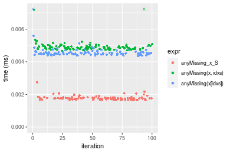
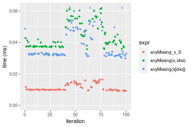
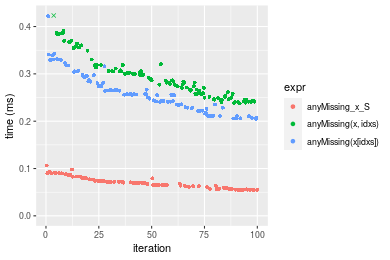
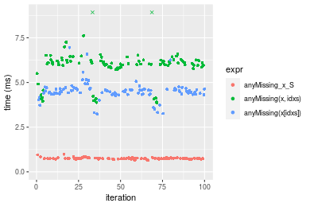
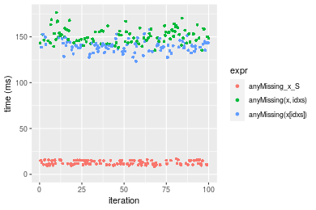
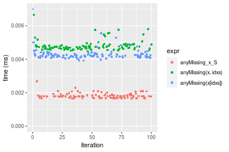
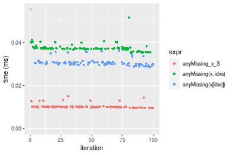
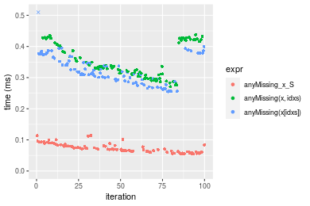
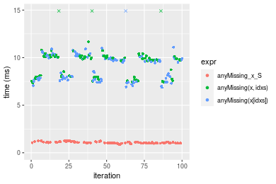
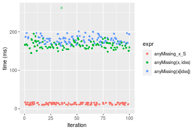

[matrixStats]: Benchmark report

---------------------------------------


# anyMissing() benchmarks on subsetted computation

This report benchmark the performance of anyMissing() on subsetted computation.


## Data type "integer"

### Data
```r
> rvector <- function(n, mode = c("logical", "double", "integer"), range = c(-100, +100), na_prob = 0) {
+     mode <- match.arg(mode)
+     if (mode == "logical") {
+         x <- sample(c(FALSE, TRUE), size = n, replace = TRUE)
+     }     else {
+         x <- runif(n, min = range[1], max = range[2])
+     }
+     storage.mode(x) <- mode
+     if (na_prob > 0) 
+         x[sample(n, size = na_prob * n)] <- NA
+     x
+ }
> rvectors <- function(scale = 10, seed = 1, ...) {
+     set.seed(seed)
+     data <- list()
+     data[[1]] <- rvector(n = scale * 100, ...)
+     data[[2]] <- rvector(n = scale * 1000, ...)
+     data[[3]] <- rvector(n = scale * 10000, ...)
+     data[[4]] <- rvector(n = scale * 1e+05, ...)
+     data[[5]] <- rvector(n = scale * 1e+06, ...)
+     names(data) <- sprintf("n = %d", sapply(data, FUN = length))
+     data
+ }
> data <- rvectors(mode = mode)
```

### Results

### n = 1000 vector

```r
> x <- data[["n = 1000"]]
> idxs <- sample.int(length(x), size = length(x) * 0.7)
> x_S <- x[idxs]
> gc()
           used  (Mb) gc trigger  (Mb) max used  (Mb)
Ncells  5151279 275.2    8529671 455.6  8529671 455.6
Vcells 25677157 196.0   64769951 494.2 60562128 462.1
> stats <- microbenchmark(anyMissing_x_S = anyMissing(x_S), `anyMissing(x, idxs)` = anyMissing(x, idxs = idxs), 
+     `anyMissing(x[idxs])` = anyMissing(x[idxs]), unit = "ms")
```

_Table: Benchmarking of anyMissing_x_S(), anyMissing(x, idxs)() and anyMissing(x[idxs])() on integer+n = 1000 data. The top panel shows times in milliseconds and the bottom panel shows relative times._


|   |expr                |      min|        lq|      mean|    median|        uq|      max|
|:--|:-------------------|--------:|---------:|---------:|---------:|---------:|--------:|
|1  |anyMissing_x_S      | 0.001645| 0.0016850| 0.0017744| 0.0017540| 0.0017945| 0.002745|
|3  |anyMissing(x[idxs]) | 0.004362| 0.0044615| 0.0058445| 0.0045185| 0.0046150| 0.132779|
|2  |anyMissing(x, idxs) | 0.004668| 0.0047940| 0.0049665| 0.0048725| 0.0049760| 0.009968|


|   |expr                |      min|       lq|     mean|   median|       uq|      max|
|:--|:-------------------|--------:|--------:|--------:|--------:|--------:|--------:|
|1  |anyMissing_x_S      | 1.000000| 1.000000| 1.000000| 1.000000| 1.000000|  1.00000|
|3  |anyMissing(x[idxs]) | 2.651672| 2.647775| 3.293864| 2.576112| 2.571747| 48.37122|
|2  |anyMissing(x, idxs) | 2.837690| 2.845104| 2.799037| 2.777936| 2.772917|  3.63133|

_Figure: Benchmarking of anyMissing_x_S(), anyMissing(x, idxs)() and anyMissing(x[idxs])() on integer+n = 1000 data.  Outliers are displayed as crosses.  Times are in milliseconds._



### n = 10000 vector

```r
> x <- data[["n = 10000"]]
> idxs <- sample.int(length(x), size = length(x) * 0.7)
> x_S <- x[idxs]
> gc()
           used  (Mb) gc trigger  (Mb) max used  (Mb)
Ncells  5140768 274.6    8529671 455.6  8529671 455.6
Vcells 14517815 110.8   51815961 395.4 60562128 462.1
> stats <- microbenchmark(anyMissing_x_S = anyMissing(x_S), `anyMissing(x, idxs)` = anyMissing(x, idxs = idxs), 
+     `anyMissing(x[idxs])` = anyMissing(x[idxs]), unit = "ms")
```

_Table: Benchmarking of anyMissing_x_S(), anyMissing(x, idxs)() and anyMissing(x[idxs])() on integer+n = 10000 data. The top panel shows times in milliseconds and the bottom panel shows relative times._


|   |expr                |      min|        lq|      mean|    median|        uq|      max|
|:--|:-------------------|--------:|---------:|---------:|---------:|---------:|--------:|
|1  |anyMissing_x_S      | 0.009050| 0.0098585| 0.0114122| 0.0100365| 0.0135600| 0.016474|
|3  |anyMissing(x[idxs]) | 0.029842| 0.0320590| 0.0385811| 0.0327690| 0.0473635| 0.075336|
|2  |anyMissing(x, idxs) | 0.035678| 0.0373965| 0.0439836| 0.0401065| 0.0508850| 0.062054|


|   |expr                |      min|       lq|     mean|   median|       uq|      max|
|:--|:-------------------|--------:|--------:|--------:|--------:|--------:|--------:|
|1  |anyMissing_x_S      | 1.000000| 1.000000| 1.000000| 1.000000| 1.000000| 1.000000|
|3  |anyMissing(x[idxs]) | 3.297459| 3.251915| 3.380692| 3.264983| 3.492884| 4.573024|
|2  |anyMissing(x, idxs) | 3.942320| 3.793326| 3.854090| 3.996064| 3.752581| 3.766784|

_Figure: Benchmarking of anyMissing_x_S(), anyMissing(x, idxs)() and anyMissing(x[idxs])() on integer+n = 10000 data.  Outliers are displayed as crosses.  Times are in milliseconds._



### n = 100000 vector

```r
> x <- data[["n = 100000"]]
> idxs <- sample.int(length(x), size = length(x) * 0.7)
> x_S <- x[idxs]
> gc()
           used  (Mb) gc trigger  (Mb) max used  (Mb)
Ncells  5140840 274.6    8529671 455.6  8529671 455.6
Vcells 14581375 111.3   51815961 395.4 60562128 462.1
> stats <- microbenchmark(anyMissing_x_S = anyMissing(x_S), `anyMissing(x, idxs)` = anyMissing(x, idxs = idxs), 
+     `anyMissing(x[idxs])` = anyMissing(x[idxs]), unit = "ms")
```

_Table: Benchmarking of anyMissing_x_S(), anyMissing(x, idxs)() and anyMissing(x[idxs])() on integer+n = 100000 data. The top panel shows times in milliseconds and the bottom panel shows relative times._


|   |expr                |      min|        lq|      mean|   median|        uq|      max|
|:--|:-------------------|--------:|---------:|---------:|--------:|---------:|--------:|
|1  |anyMissing_x_S      | 0.055034| 0.0586245| 0.0695209| 0.069160| 0.0768080| 0.106304|
|3  |anyMissing(x[idxs]) | 0.205272| 0.2285690| 0.2612897| 0.256588| 0.2854245| 0.421763|
|2  |anyMissing(x, idxs) | 0.237792| 0.2566085| 0.2900522| 0.281582| 0.3060665| 0.424174|


|   |expr                |      min|       lq|     mean|   median|       uq|      max|
|:--|:-------------------|--------:|--------:|--------:|--------:|--------:|--------:|
|1  |anyMissing_x_S      | 1.000000| 1.000000| 1.000000| 1.000000| 1.000000| 1.000000|
|3  |anyMissing(x[idxs]) | 3.729912| 3.898865| 3.758432| 3.710064| 3.716078| 3.967518|
|2  |anyMissing(x, idxs) | 4.320820| 4.377155| 4.172156| 4.071458| 3.984826| 3.990198|

_Figure: Benchmarking of anyMissing_x_S(), anyMissing(x, idxs)() and anyMissing(x[idxs])() on integer+n = 100000 data.  Outliers are displayed as crosses.  Times are in milliseconds._



### n = 1000000 vector

```r
> x <- data[["n = 1000000"]]
> idxs <- sample.int(length(x), size = length(x) * 0.7)
> x_S <- x[idxs]
> gc()
           used  (Mb) gc trigger  (Mb) max used  (Mb)
Ncells  5140912 274.6    8529671 455.6  8529671 455.6
Vcells 15211424 116.1   51815961 395.4 60562128 462.1
> stats <- microbenchmark(anyMissing_x_S = anyMissing(x_S), `anyMissing(x, idxs)` = anyMissing(x, idxs = idxs), 
+     `anyMissing(x[idxs])` = anyMissing(x[idxs]), unit = "ms")
```

_Table: Benchmarking of anyMissing_x_S(), anyMissing(x, idxs)() and anyMissing(x[idxs])() on integer+n = 1000000 data. The top panel shows times in milliseconds and the bottom panel shows relative times._


|   |expr                |      min|       lq|      mean|   median|       uq|       max|
|:--|:-------------------|--------:|--------:|---------:|--------:|--------:|---------:|
|1  |anyMissing_x_S      | 0.656676| 0.729587| 0.7490933| 0.741139| 0.763536|  0.982561|
|3  |anyMissing(x[idxs]) | 3.233937| 4.354772| 4.5173914| 4.507199| 4.636216|  6.954612|
|2  |anyMissing(x, idxs) | 3.850509| 5.864651| 6.0772101| 6.057391| 6.251347| 17.330158|


|   |expr                |      min|       lq|     mean|   median|       uq|       max|
|:--|:-------------------|--------:|--------:|--------:|--------:|--------:|---------:|
|1  |anyMissing_x_S      | 1.000000| 1.000000| 1.000000| 1.000000| 1.000000|  1.000000|
|3  |anyMissing(x[idxs]) | 4.924707| 5.968818| 6.030479| 6.081450| 6.072034|  7.078046|
|2  |anyMissing(x, idxs) | 5.863636| 8.038317| 8.112755| 8.173083| 8.187364| 17.637743|

_Figure: Benchmarking of anyMissing_x_S(), anyMissing(x, idxs)() and anyMissing(x[idxs])() on integer+n = 1000000 data.  Outliers are displayed as crosses.  Times are in milliseconds._



### n = 10000000 vector

```r
> x <- data[["n = 10000000"]]
> idxs <- sample.int(length(x), size = length(x) * 0.7)
> x_S <- x[idxs]
> gc()
           used  (Mb) gc trigger  (Mb) max used  (Mb)
Ncells  5140984 274.6    8529671 455.6  8529671 455.6
Vcells 21511677 164.2   51815961 395.4 60562128 462.1
> stats <- microbenchmark(anyMissing_x_S = anyMissing(x_S), `anyMissing(x, idxs)` = anyMissing(x, idxs = idxs), 
+     `anyMissing(x[idxs])` = anyMissing(x[idxs]), unit = "ms")
```

_Table: Benchmarking of anyMissing_x_S(), anyMissing(x, idxs)() and anyMissing(x[idxs])() on integer+n = 10000000 data. The top panel shows times in milliseconds and the bottom panel shows relative times._


|   |expr                |        min|        lq|      mean|    median|        uq|       max|
|:--|:-------------------|----------:|---------:|---------:|---------:|---------:|---------:|
|1  |anyMissing_x_S      |   8.608837|  10.56064|  12.66146|  11.79244|  15.07779|  17.01961|
|3  |anyMissing(x[idxs]) | 123.287634| 135.30060| 139.57775| 139.81796| 142.53043| 158.02745|
|2  |anyMissing(x, idxs) | 135.227423| 145.17896| 151.47525| 150.28209| 156.62428| 176.52571|


|   |expr                |      min|       lq|     mean|   median|        uq|       max|
|:--|:-------------------|--------:|--------:|--------:|--------:|---------:|---------:|
|1  |anyMissing_x_S      |  1.00000|  1.00000|  1.00000|  1.00000|  1.000000|  1.000000|
|3  |anyMissing(x[idxs]) | 14.32106| 12.81178| 11.02383| 11.85658|  9.453004|  9.285023|
|2  |anyMissing(x, idxs) | 15.70798| 13.74718| 11.96349| 12.74393| 10.387747| 10.371903|

_Figure: Benchmarking of anyMissing_x_S(), anyMissing(x, idxs)() and anyMissing(x[idxs])() on integer+n = 10000000 data.  Outliers are displayed as crosses.  Times are in milliseconds._




## Data type "double"

### Data
```r
> rvector <- function(n, mode = c("logical", "double", "integer"), range = c(-100, +100), na_prob = 0) {
+     mode <- match.arg(mode)
+     if (mode == "logical") {
+         x <- sample(c(FALSE, TRUE), size = n, replace = TRUE)
+     }     else {
+         x <- runif(n, min = range[1], max = range[2])
+     }
+     storage.mode(x) <- mode
+     if (na_prob > 0) 
+         x[sample(n, size = na_prob * n)] <- NA
+     x
+ }
> rvectors <- function(scale = 10, seed = 1, ...) {
+     set.seed(seed)
+     data <- list()
+     data[[1]] <- rvector(n = scale * 100, ...)
+     data[[2]] <- rvector(n = scale * 1000, ...)
+     data[[3]] <- rvector(n = scale * 10000, ...)
+     data[[4]] <- rvector(n = scale * 1e+05, ...)
+     data[[5]] <- rvector(n = scale * 1e+06, ...)
+     names(data) <- sprintf("n = %d", sapply(data, FUN = length))
+     data
+ }
> data <- rvectors(mode = mode)
```

### Results

### n = 1000 vector

```r
> x <- data[["n = 1000"]]
> idxs <- sample.int(length(x), size = length(x) * 0.7)
> x_S <- x[idxs]
> gc()
           used  (Mb) gc trigger  (Mb) max used  (Mb)
Ncells  5141065 274.6    8529671 455.6  8529671 455.6
Vcells 20068542 153.2   51815961 395.4 60562128 462.1
> stats <- microbenchmark(anyMissing_x_S = anyMissing(x_S), `anyMissing(x, idxs)` = anyMissing(x, idxs = idxs), 
+     `anyMissing(x[idxs])` = anyMissing(x[idxs]), unit = "ms")
```

_Table: Benchmarking of anyMissing_x_S(), anyMissing(x, idxs)() and anyMissing(x[idxs])() on double+n = 1000 data. The top panel shows times in milliseconds and the bottom panel shows relative times._


|   |expr                |      min|        lq|      mean|    median|        uq|      max|
|:--|:-------------------|--------:|---------:|---------:|---------:|---------:|--------:|
|1  |anyMissing_x_S      | 0.001654| 0.0016870| 0.0018159| 0.0017885| 0.0018505| 0.002675|
|3  |anyMissing(x[idxs]) | 0.003922| 0.0041425| 0.0044248| 0.0042240| 0.0043280| 0.019221|
|2  |anyMissing(x, idxs) | 0.004482| 0.0046305| 0.0048128| 0.0047295| 0.0048290| 0.006648|


|   |expr                |      min|       lq|     mean|   median|       uq|      max|
|:--|:-------------------|--------:|--------:|--------:|--------:|--------:|--------:|
|1  |anyMissing_x_S      | 1.000000| 1.000000| 1.000000| 1.000000| 1.000000| 1.000000|
|3  |anyMissing(x[idxs]) | 2.371221| 2.455542| 2.436641| 2.361756| 2.338827| 7.185421|
|2  |anyMissing(x, idxs) | 2.709794| 2.744813| 2.650345| 2.644395| 2.609565| 2.485234|

_Figure: Benchmarking of anyMissing_x_S(), anyMissing(x, idxs)() and anyMissing(x[idxs])() on double+n = 1000 data.  Outliers are displayed as crosses.  Times are in milliseconds._



### n = 10000 vector

```r
> x <- data[["n = 10000"]]
> idxs <- sample.int(length(x), size = length(x) * 0.7)
> x_S <- x[idxs]
> gc()
           used  (Mb) gc trigger  (Mb) max used  (Mb)
Ncells  5141128 274.6    8529671 455.6  8529671 455.6
Vcells 20078332 153.2   51815961 395.4 60562128 462.1
> stats <- microbenchmark(anyMissing_x_S = anyMissing(x_S), `anyMissing(x, idxs)` = anyMissing(x, idxs = idxs), 
+     `anyMissing(x[idxs])` = anyMissing(x[idxs]), unit = "ms")
```

_Table: Benchmarking of anyMissing_x_S(), anyMissing(x, idxs)() and anyMissing(x[idxs])() on double+n = 10000 data. The top panel shows times in milliseconds and the bottom panel shows relative times._


|   |expr                |      min|        lq|      mean|   median|        uq|      max|
|:--|:-------------------|--------:|---------:|---------:|--------:|---------:|--------:|
|1  |anyMissing_x_S      | 0.009484| 0.0099275| 0.0103565| 0.010092| 0.0102445| 0.015067|
|3  |anyMissing(x[idxs]) | 0.028564| 0.0298665| 0.0309744| 0.030411| 0.0309435| 0.056522|
|2  |anyMissing(x, idxs) | 0.035223| 0.0369805| 0.0374642| 0.037193| 0.0374100| 0.051636|


|   |expr                |      min|       lq|     mean|   median|       uq|      max|
|:--|:-------------------|--------:|--------:|--------:|--------:|--------:|--------:|
|1  |anyMissing_x_S      | 1.000000| 1.000000| 1.000000| 1.000000| 1.000000| 1.000000|
|3  |anyMissing(x[idxs]) | 3.011809| 3.008461| 2.990818| 3.013377| 3.020499| 3.751377|
|2  |anyMissing(x, idxs) | 3.713939| 3.725057| 3.617465| 3.685394| 3.651716| 3.427092|

_Figure: Benchmarking of anyMissing_x_S(), anyMissing(x, idxs)() and anyMissing(x[idxs])() on double+n = 10000 data.  Outliers are displayed as crosses.  Times are in milliseconds._



### n = 100000 vector

```r
> x <- data[["n = 100000"]]
> idxs <- sample.int(length(x), size = length(x) * 0.7)
> x_S <- x[idxs]
> gc()
           used  (Mb) gc trigger  (Mb) max used  (Mb)
Ncells  5141200 274.6    8529671 455.6  8529671 455.6
Vcells 20173246 154.0   51815961 395.4 60562128 462.1
> stats <- microbenchmark(anyMissing_x_S = anyMissing(x_S), `anyMissing(x, idxs)` = anyMissing(x, idxs = idxs), 
+     `anyMissing(x[idxs])` = anyMissing(x[idxs]), unit = "ms")
```

_Table: Benchmarking of anyMissing_x_S(), anyMissing(x, idxs)() and anyMissing(x[idxs])() on double+n = 100000 data. The top panel shows times in milliseconds and the bottom panel shows relative times._


|   |expr                |      min|        lq|      mean|   median|        uq|      max|
|:--|:-------------------|--------:|---------:|---------:|--------:|---------:|--------:|
|1  |anyMissing_x_S      | 0.055014| 0.0620335| 0.0726542| 0.069601| 0.0804640| 0.113970|
|3  |anyMissing(x[idxs]) | 0.254718| 0.2897140| 0.3243564| 0.315644| 0.3652550| 0.551803|
|2  |anyMissing(x, idxs) | 0.271002| 0.3082915| 0.3498256| 0.333323| 0.4115245| 0.437846|


|   |expr                |      min|       lq|     mean|   median|       uq|      max|
|:--|:-------------------|--------:|--------:|--------:|--------:|--------:|--------:|
|1  |anyMissing_x_S      | 1.000000| 1.000000| 1.000000| 1.000000| 1.000000| 1.000000|
|3  |anyMissing(x[idxs]) | 4.630058| 4.670283| 4.464386| 4.535050| 4.539359| 4.841651|
|2  |anyMissing(x, idxs) | 4.926055| 4.969758| 4.814940| 4.789055| 5.114393| 3.841765|

_Figure: Benchmarking of anyMissing_x_S(), anyMissing(x, idxs)() and anyMissing(x[idxs])() on double+n = 100000 data.  Outliers are displayed as crosses.  Times are in milliseconds._



### n = 1000000 vector

```r
> x <- data[["n = 1000000"]]
> idxs <- sample.int(length(x), size = length(x) * 0.7)
> x_S <- x[idxs]
> gc()
           used  (Mb) gc trigger  (Mb) max used  (Mb)
Ncells  5141272 274.6    8529671 455.6  8529671 455.6
Vcells 21118295 161.2   51815961 395.4 60562128 462.1
> stats <- microbenchmark(anyMissing_x_S = anyMissing(x_S), `anyMissing(x, idxs)` = anyMissing(x, idxs = idxs), 
+     `anyMissing(x[idxs])` = anyMissing(x[idxs]), unit = "ms")
```

_Table: Benchmarking of anyMissing_x_S(), anyMissing(x, idxs)() and anyMissing(x[idxs])() on double+n = 1000000 data. The top panel shows times in milliseconds and the bottom panel shows relative times._


|   |expr                |      min|       lq|     mean|   median|        uq|       max|
|:--|:-------------------|--------:|--------:|--------:|--------:|---------:|---------:|
|1  |anyMissing_x_S      | 0.884450| 1.006420| 1.070587| 1.050933|  1.127081|  1.285333|
|3  |anyMissing(x[idxs]) | 6.866668| 7.698575| 9.099393| 9.636115| 10.166210| 18.387087|
|2  |anyMissing(x, idxs) | 7.327605| 8.010414| 9.606912| 9.881673| 10.148229| 19.164685|


|   |expr                |      min|       lq|     mean|   median|       uq|      max|
|:--|:-------------------|--------:|--------:|--------:|--------:|--------:|--------:|
|1  |anyMissing_x_S      | 1.000000| 1.000000| 1.000000| 1.000000| 1.000000|  1.00000|
|3  |anyMissing(x[idxs]) | 7.763772| 7.649470| 8.499442| 9.169105| 9.019946| 14.30531|
|2  |anyMissing(x, idxs) | 8.284928| 7.959319| 8.973499| 9.402763| 9.003993| 14.91029|

_Figure: Benchmarking of anyMissing_x_S(), anyMissing(x, idxs)() and anyMissing(x[idxs])() on double+n = 1000000 data.  Outliers are displayed as crosses.  Times are in milliseconds._



### n = 10000000 vector

```r
> x <- data[["n = 10000000"]]
> idxs <- sample.int(length(x), size = length(x) * 0.7)
> x_S <- x[idxs]
> gc()
           used  (Mb) gc trigger  (Mb) max used  (Mb)
Ncells  5141344 274.6    8529671 455.6  8529671 455.6
Vcells 30568777 233.3   51815961 395.4 60562128 462.1
> stats <- microbenchmark(anyMissing_x_S = anyMissing(x_S), `anyMissing(x, idxs)` = anyMissing(x, idxs = idxs), 
+     `anyMissing(x[idxs])` = anyMissing(x[idxs]), unit = "ms")
```

_Table: Benchmarking of anyMissing_x_S(), anyMissing(x, idxs)() and anyMissing(x[idxs])() on double+n = 10000000 data. The top panel shows times in milliseconds and the bottom panel shows relative times._


|   |expr                |        min|        lq|      mean|    median|        uq|      max|
|:--|:-------------------|----------:|---------:|---------:|---------:|---------:|--------:|
|1  |anyMissing_x_S      |   9.109918|  10.87158|  13.01311|  12.27992|  15.45226|  17.1029|
|2  |anyMissing(x, idxs) | 144.642119| 158.67185| 169.23774| 165.86743| 172.07069| 491.1547|
|3  |anyMissing(x[idxs]) | 163.183915| 171.95101| 179.12347| 177.47141| 185.43935| 200.9944|


|   |expr                |      min|       lq|     mean|   median|       uq|      max|
|:--|:-------------------|--------:|--------:|--------:|--------:|--------:|--------:|
|1  |anyMissing_x_S      |  1.00000|  1.00000|  1.00000|  1.00000|  1.00000|  1.00000|
|2  |anyMissing(x, idxs) | 15.87743| 14.59510| 13.00517| 13.50721| 11.13564| 28.71763|
|3  |anyMissing(x[idxs]) | 17.91278| 15.81655| 13.76485| 14.45216| 12.00079| 11.75207|

_Figure: Benchmarking of anyMissing_x_S(), anyMissing(x, idxs)() and anyMissing(x[idxs])() on double+n = 10000000 data.  Outliers are displayed as crosses.  Times are in milliseconds._




## Appendix

### Session information
```r
R version 4.1.1 Patched (2021-08-10 r80727)
Platform: x86_64-pc-linux-gnu (64-bit)
Running under: Ubuntu 18.04.5 LTS

Matrix products: default
BLAS:   /home/hb/software/R-devel/R-4-1-branch/lib/R/lib/libRblas.so
LAPACK: /home/hb/software/R-devel/R-4-1-branch/lib/R/lib/libRlapack.so

locale:
 [1] LC_CTYPE=en_US.UTF-8       LC_NUMERIC=C              
 [3] LC_TIME=en_US.UTF-8        LC_COLLATE=en_US.UTF-8    
 [5] LC_MONETARY=en_US.UTF-8    LC_MESSAGES=en_US.UTF-8   
 [7] LC_PAPER=en_US.UTF-8       LC_NAME=C                 
 [9] LC_ADDRESS=C               LC_TELEPHONE=C            
[11] LC_MEASUREMENT=en_US.UTF-8 LC_IDENTIFICATION=C       

attached base packages:
[1] stats     graphics  grDevices utils     datasets  methods   base     

other attached packages:
[1] microbenchmark_1.4-7   matrixStats_0.60.1     ggplot2_3.3.5         
[4] knitr_1.33             R.devices_2.17.0       R.utils_2.10.1        
[7] R.oo_1.24.0            R.methodsS3_1.8.1-9001 history_0.0.1-9000    

loaded via a namespace (and not attached):
 [1] Biobase_2.52.0          httr_1.4.2              splines_4.1.1          
 [4] bit64_4.0.5             network_1.17.1          assertthat_0.2.1       
 [7] highr_0.9               stats4_4.1.1            blob_1.2.2             
[10] GenomeInfoDbData_1.2.6  robustbase_0.93-8       pillar_1.6.2           
[13] RSQLite_2.2.8           lattice_0.20-44         glue_1.4.2             
[16] digest_0.6.27           XVector_0.32.0          colorspace_2.0-2       
[19] Matrix_1.3-4            XML_3.99-0.7            pkgconfig_2.0.3        
[22] zlibbioc_1.38.0         genefilter_1.74.0       purrr_0.3.4            
[25] ergm_4.1.2              xtable_1.8-4            scales_1.1.1           
[28] tibble_3.1.4            annotate_1.70.0         KEGGREST_1.32.0        
[31] farver_2.1.0            generics_0.1.0          IRanges_2.26.0         
[34] ellipsis_0.3.2          cachem_1.0.6            withr_2.4.2            
[37] BiocGenerics_0.38.0     mime_0.11               survival_3.2-13        
[40] magrittr_2.0.1          crayon_1.4.1            statnet.common_4.5.0   
[43] memoise_2.0.0           laeken_0.5.1            fansi_0.5.0            
[46] R.cache_0.15.0          MASS_7.3-54             R.rsp_0.44.0           
[49] progressr_0.8.0         tools_4.1.1             lifecycle_1.0.0        
[52] S4Vectors_0.30.0        trust_0.1-8             munsell_0.5.0          
[55] tabby_0.0.1-9001        AnnotationDbi_1.54.1    Biostrings_2.60.2      
[58] compiler_4.1.1          GenomeInfoDb_1.28.1     rlang_0.4.11           
[61] grid_4.1.1              RCurl_1.98-1.4          cwhmisc_6.6            
[64] rappdirs_0.3.3          startup_0.15.0          labeling_0.4.2         
[67] bitops_1.0-7            base64enc_0.1-3         boot_1.3-28            
[70] gtable_0.3.0            DBI_1.1.1               markdown_1.1           
[73] R6_2.5.1                lpSolveAPI_5.5.2.0-17.7 rle_0.9.2              
[76] dplyr_1.0.7             fastmap_1.1.0           bit_4.0.4              
[79] utf8_1.2.2              parallel_4.1.1          Rcpp_1.0.7             
[82] vctrs_0.3.8             png_0.1-7               DEoptimR_1.0-9         
[85] tidyselect_1.1.1        xfun_0.25               coda_0.19-4            
```
Total processing time was 1.36 mins.


### Reproducibility
To reproduce this report, do:
```r
html <- matrixStats:::benchmark('anyMissing_subset')
```

[RSP]: https://cran.r-project.org/package=R.rsp
[matrixStats]: https://cran.r-project.org/package=matrixStats

[StackOverflow:colMins?]: https://stackoverflow.com/questions/13676878 "Stack Overflow: fastest way to get Min from every column in a matrix?"
[StackOverflow:colSds?]: https://stackoverflow.com/questions/17549762 "Stack Overflow: Is there such 'colsd' in R?"
[StackOverflow:rowProds?]: https://stackoverflow.com/questions/20198801/ "Stack Overflow: Row product of matrix and column sum of matrix"

---------------------------------------
Copyright Dongcan Jiang. Last updated on 2021-08-25 18:48:23 (+0200 UTC). Powered by [RSP].

<script>
 var link = document.createElement('link');
 link.rel = 'icon';
 link.href = "data:image/png;base64,iVBORw0KGgoAAAANSUhEUgAAACAAAAAgCAMAAABEpIrGAAAA21BMVEUAAAAAAP8AAP8AAP8AAP8AAP8AAP8AAP8AAP8AAP8AAP8AAP8AAP8AAP8AAP8AAP8AAP8AAP8AAP8AAP8AAP8AAP8AAP8AAP8AAP8AAP8AAP8AAP8AAP8AAP8AAP8AAP8AAP8AAP8AAP8AAP8AAP8AAP8AAP8AAP8AAP8AAP8BAf4CAv0DA/wdHeIeHuEfH+AgIN8hId4lJdomJtknJ9g+PsE/P8BAQL9yco10dIt1dYp3d4h4eIeVlWqWlmmXl2iYmGeZmWabm2Tn5xjo6Bfp6Rb39wj4+Af//wA2M9hbAAAASXRSTlMAAQIJCgsMJSYnKD4/QGRlZmhpamtsbautrrCxuru8y8zN5ebn6Pn6+///////////////////////////////////////////LsUNcQAAAS9JREFUOI29k21XgkAQhVcFytdSMqMETU26UVqGmpaiFbL//xc1cAhhwVNf6n5i5z67M2dmYOyfJZUqlVLhkKucG7cgmUZTybDz6g0iDeq51PUr37Ds2cy2/C9NeES5puDjxuUk1xnToZsg8pfA3avHQ3lLIi7iWRrkv/OYtkScxBIMgDee0ALoyxHQBJ68JLCjOtQIMIANF7QG9G9fNnHvisCHBVMKgSJgiz7nE+AoBKrAPA3MgepvgR9TSCasrCKH0eB1wBGBFdCO+nAGjMVGPcQb5bd6mQRegN6+1axOs9nGfYcCtfi4NQosdtH7dB+txFIpXQqN1p9B/asRHToyS0jRgpV7nk4nwcq1BJ+x3Gl/v7S9Wmpp/aGquum7w3ZDyrADFYrl8vHBH+ev9AUASW1dmU4h4wAAAABJRU5ErkJggg=="
 document.getElementsByTagName('head')[0].appendChild(link);
</script>


