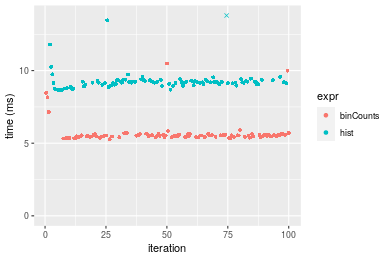
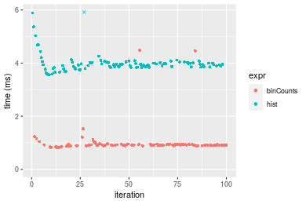
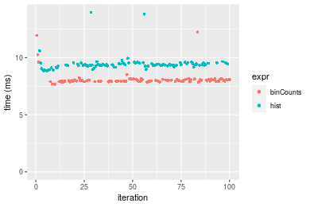
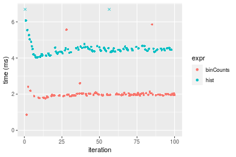

[matrixStats]: Benchmark report

---------------------------------------


# binCounts() benchmarks

This report benchmark the performance of binCounts() against alternative methods.

## Alternative methods

* hist()

as below

```r
> hist <- graphics::hist
> binCounts_hist <- function(x, bx, right = FALSE, ...) {
+     hist(x, breaks = bx, right = right, include.lowest = TRUE, plot = FALSE)$counts
+ }
```


## Data type "integer"

### Non-sorted simulated data
```r
> set.seed(48879)
> nx <- 1e+05
> xmax <- 0.01 * nx
> x <- runif(nx, min = 0, max = xmax)
> storage.mode(x) <- mode
> str(x)
 int [1:100000] 722 285 591 3 349 509 216 91 150 383 ...
> nb <- 10000
> bx <- seq(from = 0, to = xmax, length.out = nb + 1L)
> bx <- c(-1, bx, xmax + 1)
```

### Results


```r
> gc()
          used  (Mb) gc trigger  (Mb) max used  (Mb)
Ncells 5155198 275.4    8529671 455.6  8529671 455.6
Vcells 9211896  70.3   31876688 243.2 60562128 462.1
> stats <- microbenchmark(binCounts = binCounts(x, bx = bx), hist = binCounts_hist(x, bx = bx), unit = "ms")
```

_Table: Benchmarking of binCounts() and hist() on integer+unsorted data. The top panel shows times in milliseconds and the bottom panel shows relative times._


|   |expr      |      min|       lq|     mean|   median|       uq|      max|
|:--|:---------|--------:|--------:|--------:|--------:|--------:|--------:|
|1  |binCounts | 5.276135| 5.447036| 5.681157| 5.527692| 5.584828| 10.48935|
|2  |hist      | 8.660166| 9.045004| 9.282497| 9.189431| 9.292248| 14.29526|


|   |expr      |      min|       lq|    mean|   median|       uq|      max|
|:--|:---------|--------:|--------:|-------:|--------:|--------:|--------:|
|1  |binCounts | 1.000000| 1.000000| 1.00000| 1.000000| 1.000000| 1.000000|
|2  |hist      | 1.641385| 1.660537| 1.63391| 1.662436| 1.663838| 1.362835|

_Figure: Benchmarking of binCounts() and hist() on integer+unsorted data.  Outliers are displayed as crosses.  Times are in milliseconds._




### Sorted simulated data
```r
> x <- sort(x)
```
```r
> gc()
          used  (Mb) gc trigger  (Mb) max used  (Mb)
Ncells 5147269 274.9    8529671 455.6  8529671 455.6
Vcells 9044607  69.1   31876688 243.2 60562128 462.1
> stats <- microbenchmark(binCounts = binCounts(x, bx = bx), hist = binCounts_hist(x, bx = bx), unit = "ms")
```

_Table: Benchmarking of binCounts() and hist() on integer+sorted data. The top panel shows times in milliseconds and the bottom panel shows relative times._


|   |expr      |      min|       lq|     mean|   median|       uq|      max|
|:--|:---------|--------:|--------:|--------:|--------:|--------:|--------:|
|1  |binCounts | 0.823968| 0.894856| 1.002124| 0.914815| 0.939684| 4.477050|
|2  |hist      | 3.557796| 3.852170| 4.018653| 3.939868| 4.017599| 7.929352|


|   |expr      |      min|       lq|     mean|   median|       uq|      max|
|:--|:---------|--------:|--------:|--------:|--------:|--------:|--------:|
|1  |binCounts | 1.000000| 1.000000| 1.000000| 1.000000| 1.000000| 1.000000|
|2  |hist      | 4.317881| 4.304793| 4.010135| 4.306737| 4.275478| 1.771111|

_Figure: Benchmarking of binCounts() and hist() on integer+sorted data.  Outliers are displayed as crosses.  Times are in milliseconds._




## Data type "double"

### Non-sorted simulated data
```r
> set.seed(48879)
> nx <- 1e+05
> xmax <- 0.01 * nx
> x <- runif(nx, min = 0, max = xmax)
> storage.mode(x) <- mode
> str(x)
 num [1:100000] 722.11 285.54 591.33 3.42 349.14 ...
> nb <- 10000
> bx <- seq(from = 0, to = xmax, length.out = nb + 1L)
> bx <- c(-1, bx, xmax + 1)
```

### Results


```r
> gc()
          used  (Mb) gc trigger  (Mb) max used  (Mb)
Ncells 5147332 274.9    8529671 455.6  8529671 455.6
Vcells 9094649  69.4   31876688 243.2 60562128 462.1
> stats <- microbenchmark(binCounts = binCounts(x, bx = bx), hist = binCounts_hist(x, bx = bx), unit = "ms")
```

_Table: Benchmarking of binCounts() and hist() on double+unsorted data. The top panel shows times in milliseconds and the bottom panel shows relative times._


|   |expr      |      min|       lq|     mean|   median|       uq|      max|
|:--|:---------|--------:|--------:|--------:|--------:|--------:|--------:|
|1  |binCounts | 7.680763| 7.920285| 8.112347| 7.980994| 8.074557| 12.22602|
|2  |hist      | 8.857246| 9.269596| 9.442469| 9.356303| 9.499113| 13.96545|


|   |expr      |      min|       lq|     mean|   median|       uq|      max|
|:--|:---------|--------:|--------:|--------:|--------:|--------:|--------:|
|1  |binCounts | 1.000000| 1.000000| 1.000000| 1.000000| 1.000000| 1.000000|
|2  |hist      | 1.153173| 1.170362| 1.163963| 1.172323| 1.176425| 1.142273|

_Figure: Benchmarking of binCounts() and hist() on double+unsorted data.  Outliers are displayed as crosses.  Times are in milliseconds._




### Sorted simulated data
```r
> x <- sort(x)
```
```r
> gc()
          used  (Mb) gc trigger  (Mb) max used  (Mb)
Ncells 5147398 275.0    8529671 455.6  8529671 455.6
Vcells 9095205  69.4   31876688 243.2 60562128 462.1
> stats <- microbenchmark(binCounts = binCounts(x, bx = bx), hist = binCounts_hist(x, bx = bx), unit = "ms")
```

_Table: Benchmarking of binCounts() and hist() on double+sorted data. The top panel shows times in milliseconds and the bottom panel shows relative times._


|   |expr      |      min|       lq|     mean|   median|       uq|      max|
|:--|:---------|--------:|--------:|--------:|--------:|--------:|--------:|
|1  |binCounts | 0.856121| 1.929415| 2.041784| 1.970614| 2.020281| 5.858440|
|2  |hist      | 4.018542| 4.349835| 4.521869| 4.449154| 4.551450| 8.011872|


|   |expr      |      min|       lq|     mean|  median|      uq|      max|
|:--|:---------|--------:|--------:|--------:|-------:|-------:|--------:|
|1  |binCounts | 1.000000| 1.000000| 1.000000| 1.00000| 1.00000| 1.000000|
|2  |hist      | 4.693895| 2.254483| 2.214665| 2.25775| 2.25288| 1.367578|

_Figure: Benchmarking of binCounts() and hist() on double+sorted data.  Outliers are displayed as crosses.  Times are in milliseconds._




## Appendix

### Session information
```r
R version 4.1.1 Patched (2021-08-10 r80727)
Platform: x86_64-pc-linux-gnu (64-bit)
Running under: Ubuntu 18.04.5 LTS

Matrix products: default
BLAS:   /home/hb/software/R-devel/R-4-1-branch/lib/R/lib/libRblas.so
LAPACK: /home/hb/software/R-devel/R-4-1-branch/lib/R/lib/libRlapack.so

locale:
 [1] LC_CTYPE=en_US.UTF-8       LC_NUMERIC=C              
 [3] LC_TIME=en_US.UTF-8        LC_COLLATE=en_US.UTF-8    
 [5] LC_MONETARY=en_US.UTF-8    LC_MESSAGES=en_US.UTF-8   
 [7] LC_PAPER=en_US.UTF-8       LC_NAME=C                 
 [9] LC_ADDRESS=C               LC_TELEPHONE=C            
[11] LC_MEASUREMENT=en_US.UTF-8 LC_IDENTIFICATION=C       

attached base packages:
[1] stats     graphics  grDevices utils     datasets  methods   base     

other attached packages:
[1] microbenchmark_1.4-7   matrixStats_0.60.1     ggplot2_3.3.5         
[4] knitr_1.33             R.devices_2.17.0       R.utils_2.10.1        
[7] R.oo_1.24.0            R.methodsS3_1.8.1-9001 history_0.0.1-9000    

loaded via a namespace (and not attached):
 [1] Biobase_2.52.0          httr_1.4.2              splines_4.1.1          
 [4] bit64_4.0.5             network_1.17.1          assertthat_0.2.1       
 [7] highr_0.9               stats4_4.1.1            blob_1.2.2             
[10] GenomeInfoDbData_1.2.6  robustbase_0.93-8       pillar_1.6.2           
[13] RSQLite_2.2.8           lattice_0.20-44         glue_1.4.2             
[16] digest_0.6.27           XVector_0.32.0          colorspace_2.0-2       
[19] Matrix_1.3-4            XML_3.99-0.7            pkgconfig_2.0.3        
[22] zlibbioc_1.38.0         genefilter_1.74.0       purrr_0.3.4            
[25] ergm_4.1.2              xtable_1.8-4            scales_1.1.1           
[28] tibble_3.1.4            annotate_1.70.0         KEGGREST_1.32.0        
[31] farver_2.1.0            generics_0.1.0          IRanges_2.26.0         
[34] ellipsis_0.3.2          cachem_1.0.6            withr_2.4.2            
[37] BiocGenerics_0.38.0     mime_0.11               survival_3.2-13        
[40] magrittr_2.0.1          crayon_1.4.1            statnet.common_4.5.0   
[43] memoise_2.0.0           laeken_0.5.1            fansi_0.5.0            
[46] R.cache_0.15.0          MASS_7.3-54             R.rsp_0.44.0           
[49] progressr_0.8.0         tools_4.1.1             lifecycle_1.0.0        
[52] S4Vectors_0.30.0        trust_0.1-8             munsell_0.5.0          
[55] tabby_0.0.1-9001        AnnotationDbi_1.54.1    Biostrings_2.60.2      
[58] compiler_4.1.1          GenomeInfoDb_1.28.1     rlang_0.4.11           
[61] grid_4.1.1              RCurl_1.98-1.4          cwhmisc_6.6            
[64] rappdirs_0.3.3          startup_0.15.0          labeling_0.4.2         
[67] bitops_1.0-7            base64enc_0.1-3         boot_1.3-28            
[70] gtable_0.3.0            DBI_1.1.1               markdown_1.1           
[73] R6_2.5.1                lpSolveAPI_5.5.2.0-17.7 rle_0.9.2              
[76] dplyr_1.0.7             fastmap_1.1.0           bit_4.0.4              
[79] utf8_1.2.2              parallel_4.1.1          Rcpp_1.0.7             
[82] vctrs_0.3.8             png_0.1-7               DEoptimR_1.0-9         
[85] tidyselect_1.1.1        xfun_0.25               coda_0.19-4            
```
Total processing time was 7.8 secs.


### Reproducibility
To reproduce this report, do:
```r
html <- matrixStats:::benchmark('binCounts')
```

[RSP]: https://cran.r-project.org/package=R.rsp
[matrixStats]: https://cran.r-project.org/package=matrixStats

[StackOverflow:colMins?]: https://stackoverflow.com/questions/13676878 "Stack Overflow: fastest way to get Min from every column in a matrix?"
[StackOverflow:colSds?]: https://stackoverflow.com/questions/17549762 "Stack Overflow: Is there such 'colsd' in R?"
[StackOverflow:rowProds?]: https://stackoverflow.com/questions/20198801/ "Stack Overflow: Row product of matrix and column sum of matrix"

---------------------------------------
Copyright Henrik Bengtsson. Last updated on 2021-08-25 18:49:00 (+0200 UTC). Powered by [RSP].

<script>
 var link = document.createElement('link');
 link.rel = 'icon';
 link.href = "data:image/png;base64,iVBORw0KGgoAAAANSUhEUgAAACAAAAAgCAMAAABEpIrGAAAA21BMVEUAAAAAAP8AAP8AAP8AAP8AAP8AAP8AAP8AAP8AAP8AAP8AAP8AAP8AAP8AAP8AAP8AAP8AAP8AAP8AAP8AAP8AAP8AAP8AAP8AAP8AAP8AAP8AAP8AAP8AAP8AAP8AAP8AAP8AAP8AAP8AAP8AAP8AAP8AAP8AAP8AAP8AAP8BAf4CAv0DA/wdHeIeHuEfH+AgIN8hId4lJdomJtknJ9g+PsE/P8BAQL9yco10dIt1dYp3d4h4eIeVlWqWlmmXl2iYmGeZmWabm2Tn5xjo6Bfp6Rb39wj4+Af//wA2M9hbAAAASXRSTlMAAQIJCgsMJSYnKD4/QGRlZmhpamtsbautrrCxuru8y8zN5ebn6Pn6+///////////////////////////////////////////LsUNcQAAAS9JREFUOI29k21XgkAQhVcFytdSMqMETU26UVqGmpaiFbL//xc1cAhhwVNf6n5i5z67M2dmYOyfJZUqlVLhkKucG7cgmUZTybDz6g0iDeq51PUr37Ds2cy2/C9NeES5puDjxuUk1xnToZsg8pfA3avHQ3lLIi7iWRrkv/OYtkScxBIMgDee0ALoyxHQBJ68JLCjOtQIMIANF7QG9G9fNnHvisCHBVMKgSJgiz7nE+AoBKrAPA3MgepvgR9TSCasrCKH0eB1wBGBFdCO+nAGjMVGPcQb5bd6mQRegN6+1axOs9nGfYcCtfi4NQosdtH7dB+txFIpXQqN1p9B/asRHToyS0jRgpV7nk4nwcq1BJ+x3Gl/v7S9Wmpp/aGquum7w3ZDyrADFYrl8vHBH+ev9AUASW1dmU4h4wAAAABJRU5ErkJggg=="
 document.getElementsByTagName('head')[0].appendChild(link);
</script>


