[matrixStats]: Benchmark report

---------------------------------------


# colAnyMissings() and rowAnyMissings() benchmarks  on subsetted computation

This report benchmark the performance of colAnyMissings() and rowAnyMissings() on subsetted computation.


## Data type "integer"

### Data
```r
> rmatrix <- function(nrow, ncol, mode = c("logical", "double", "integer", "index"), range = c(-100, 
+     +100), na_prob = 0) {
+     mode <- match.arg(mode)
+     n <- nrow * ncol
+     if (mode == "logical") {
+         x <- sample(c(FALSE, TRUE), size = n, replace = TRUE)
+     }     else if (mode == "index") {
+         x <- seq_len(n)
+         mode <- "integer"
+     }     else {
+         x <- runif(n, min = range[1], max = range[2])
+     }
+     storage.mode(x) <- mode
+     if (na_prob > 0) 
+         x[sample(n, size = na_prob * n)] <- NA
+     dim(x) <- c(nrow, ncol)
+     x
+ }
> rmatrices <- function(scale = 10, seed = 1, ...) {
+     set.seed(seed)
+     data <- list()
+     data[[1]] <- rmatrix(nrow = scale * 1, ncol = scale * 1, ...)
+     data[[2]] <- rmatrix(nrow = scale * 10, ncol = scale * 10, ...)
+     data[[3]] <- rmatrix(nrow = scale * 100, ncol = scale * 1, ...)
+     data[[4]] <- t(data[[3]])
+     data[[5]] <- rmatrix(nrow = scale * 10, ncol = scale * 100, ...)
+     data[[6]] <- t(data[[5]])
+     names(data) <- sapply(data, FUN = function(x) paste(dim(x), collapse = "x"))
+     data
+ }
> data <- rmatrices(mode = mode)
```

## Results

### 10x10 matrix


```r
> X <- data[["10x10"]]
> rows <- sample.int(nrow(X), size = nrow(X) * 0.7)
> cols <- sample.int(ncol(X), size = ncol(X) * 0.7)
> X_S <- X[rows, cols]
> gc()
          used  (Mb) gc trigger  (Mb) max used  (Mb)
Ncells 5168238 276.1    8529671 455.6  8529671 455.6
Vcells 9405490  71.8   31876688 243.2 60562128 462.1
> colStats <- microbenchmark(colAnyMissings_X_S = colAnyMissings(X_S), `colAnyMissings(X, rows, cols)` = colAnyMissings(X, 
+     rows = rows, cols = cols), `colAnyMissings(X[rows, cols])` = colAnyMissings(X[rows, cols]), unit = "ms")
> X <- t(X)
> X_S <- t(X_S)
> gc()
          used  (Mb) gc trigger  (Mb) max used  (Mb)
Ncells 5160373 275.6    8529671 455.6  8529671 455.6
Vcells 9379366  71.6   31876688 243.2 60562128 462.1
> rowStats <- microbenchmark(rowAnyMissings_X_S = rowAnyMissings(X_S), `rowAnyMissings(X, cols, rows)` = rowAnyMissings(X, 
+     rows = cols, cols = rows), `rowAnyMissings(X[cols, rows])` = rowAnyMissings(X[cols, rows]), unit = "ms")
```

_Table: Benchmarking of colAnyMissings_X_S(), colAnyMissings(X, rows, cols)() and colAnyMissings(X[rows, cols])() on integer+10x10 data. The top panel shows times in milliseconds and the bottom panel shows relative times._


|   |expr                          |      min|        lq|      mean|    median|        uq|      max|
|:--|:-----------------------------|--------:|---------:|---------:|---------:|---------:|--------:|
|1  |colAnyMissings_X_S            | 0.004764| 0.0048960| 0.0081695| 0.0049975| 0.0051465| 0.300122|
|2  |colAnyMissings(X, rows, cols) | 0.005137| 0.0052965| 0.0056056| 0.0053910| 0.0055315| 0.020641|
|3  |colAnyMissings(X[rows, cols]) | 0.005829| 0.0061720| 0.0064292| 0.0062995| 0.0064405| 0.011839|


|   |expr                          |      min|       lq|      mean|   median|       uq|       max|
|:--|:-----------------------------|--------:|--------:|---------:|--------:|--------:|---------:|
|1  |colAnyMissings_X_S            | 1.000000| 1.000000| 1.0000000| 1.000000| 1.000000| 1.0000000|
|2  |colAnyMissings(X, rows, cols) | 1.078296| 1.081802| 0.6861648| 1.078739| 1.074808| 0.0687754|
|3  |colAnyMissings(X[rows, cols]) | 1.223552| 1.260621| 0.7869713| 1.260530| 1.251433| 0.0394473|

_Table: Benchmarking of rowAnyMissings_X_S(), rowAnyMissings(X, cols, rows)() and rowAnyMissings(X[cols, rows])() on integer+10x10 data (transposed). The top panel shows times in milliseconds and the bottom panel shows relative times._


|   |expr                          |      min|        lq|      mean|    median|        uq|      max|
|:--|:-----------------------------|--------:|---------:|---------:|---------:|---------:|--------:|
|1  |rowAnyMissings_X_S            | 0.004935| 0.0050450| 0.0051830| 0.0051470| 0.0052395| 0.007354|
|2  |rowAnyMissings(X, cols, rows) | 0.005243| 0.0054750| 0.0085878| 0.0055525| 0.0057245| 0.299638|
|3  |rowAnyMissings(X[cols, rows]) | 0.005927| 0.0062455| 0.0064763| 0.0064115| 0.0065780| 0.009756|


|   |expr                          |      min|       lq|     mean|   median|       uq|       max|
|:--|:-----------------------------|--------:|--------:|--------:|--------:|--------:|---------:|
|1  |rowAnyMissings_X_S            | 1.000000| 1.000000| 1.000000| 1.000000| 1.000000|  1.000000|
|2  |rowAnyMissings(X, cols, rows) | 1.062411| 1.085233| 1.656895| 1.078784| 1.092566| 40.744901|
|3  |rowAnyMissings(X[cols, rows]) | 1.201013| 1.237958| 1.249517| 1.245677| 1.255463|  1.326625|

_Figure: Benchmarking of colAnyMissings_X_S(), colAnyMissings(X, rows, cols)() and colAnyMissings(X[rows, cols])() on integer+10x10 data  as well as rowAnyMissings_X_S(), rowAnyMissings(X, cols, rows)() and rowAnyMissings(X[cols, rows])() on the same data transposed.  Outliers are displayed as crosses.  Times are in milliseconds._


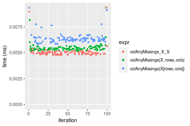

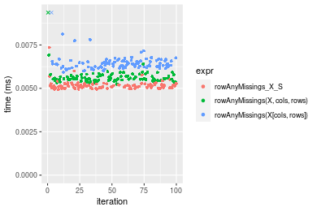
_Table: Benchmarking of colAnyMissings_X_S() and rowAnyMissings_X_S() on integer+10x10 data (original and transposed).  The top panel shows times in milliseconds and the bottom panel shows relative times._


|   |expr               |   min|    lq|    mean| median|     uq|     max|
|:--|:------------------|-----:|-----:|-------:|------:|------:|-------:|
|1  |colAnyMissings_X_S | 4.764| 4.896| 8.16951| 4.9975| 5.1465| 300.122|
|2  |rowAnyMissings_X_S | 4.935| 5.045| 5.18305| 5.1470| 5.2395|   7.354|


|   |expr               |      min|       lq|      mean|   median|       uq|       max|
|:--|:------------------|--------:|--------:|---------:|--------:|--------:|---------:|
|1  |colAnyMissings_X_S | 1.000000| 1.000000| 1.0000000| 1.000000| 1.000000| 1.0000000|
|2  |rowAnyMissings_X_S | 1.035894| 1.030433| 0.6344383| 1.029915| 1.018071| 0.0245034|

_Figure: Benchmarking of colAnyMissings_X_S() and rowAnyMissings_X_S() on integer+10x10 data (original and transposed).  Outliers are displayed as crosses. Times are in milliseconds._


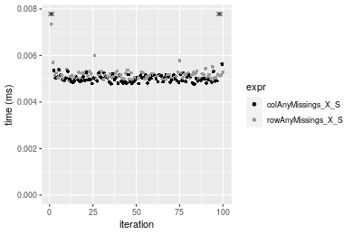

### 100x100 matrix


```r
> X <- data[["100x100"]]
> rows <- sample.int(nrow(X), size = nrow(X) * 0.7)
> cols <- sample.int(ncol(X), size = ncol(X) * 0.7)
> X_S <- X[rows, cols]
> gc()
          used  (Mb) gc trigger  (Mb) max used  (Mb)
Ncells 5159500 275.6    8529671 455.6  8529671 455.6
Vcells 9214159  70.3   31876688 243.2 60562128 462.1
> colStats <- microbenchmark(colAnyMissings_X_S = colAnyMissings(X_S), `colAnyMissings(X, rows, cols)` = colAnyMissings(X, 
+     rows = rows, cols = cols), `colAnyMissings(X[rows, cols])` = colAnyMissings(X[rows, cols]), unit = "ms")
> X <- t(X)
> X_S <- t(X_S)
> gc()
          used  (Mb) gc trigger  (Mb) max used  (Mb)
Ncells 5159476 275.6    8529671 455.6  8529671 455.6
Vcells 9219212  70.4   31876688 243.2 60562128 462.1
> rowStats <- microbenchmark(rowAnyMissings_X_S = rowAnyMissings(X_S), `rowAnyMissings(X, cols, rows)` = rowAnyMissings(X, 
+     rows = cols, cols = rows), `rowAnyMissings(X[cols, rows])` = rowAnyMissings(X[cols, rows]), unit = "ms")
```

_Table: Benchmarking of colAnyMissings_X_S(), colAnyMissings(X, rows, cols)() and colAnyMissings(X[rows, cols])() on integer+100x100 data. The top panel shows times in milliseconds and the bottom panel shows relative times._


|   |expr                          |      min|        lq|      mean|    median|        uq|      max|
|:--|:-----------------------------|--------:|---------:|---------:|---------:|---------:|--------:|
|1  |colAnyMissings_X_S            | 0.013782| 0.0141225| 0.0144279| 0.0143485| 0.0145980| 0.020174|
|2  |colAnyMissings(X, rows, cols) | 0.017009| 0.0176770| 0.0180100| 0.0179010| 0.0181995| 0.022137|
|3  |colAnyMissings(X[rows, cols]) | 0.025211| 0.0257895| 0.0271811| 0.0260085| 0.0263985| 0.062706|


|   |expr                          |      min|       lq|     mean|   median|       uq|      max|
|:--|:-----------------------------|--------:|--------:|--------:|--------:|--------:|--------:|
|1  |colAnyMissings_X_S            | 1.000000| 1.000000| 1.000000| 1.000000| 1.000000| 1.000000|
|2  |colAnyMissings(X, rows, cols) | 1.234146| 1.251691| 1.248279| 1.247587| 1.246712| 1.097303|
|3  |colAnyMissings(X[rows, cols]) | 1.829270| 1.826129| 1.883927| 1.812628| 1.808364| 3.108258|

_Table: Benchmarking of rowAnyMissings_X_S(), rowAnyMissings(X, cols, rows)() and rowAnyMissings(X[cols, rows])() on integer+100x100 data (transposed). The top panel shows times in milliseconds and the bottom panel shows relative times._


|   |expr                          |      min|        lq|      mean|    median|        uq|      max|
|:--|:-----------------------------|--------:|---------:|---------:|---------:|---------:|--------:|
|2  |rowAnyMissings(X, cols, rows) | 0.013759| 0.0147005| 0.0160306| 0.0149900| 0.0155905| 0.052725|
|1  |rowAnyMissings_X_S            | 0.013815| 0.0150885| 0.0160177| 0.0153965| 0.0159835| 0.035255|
|3  |rowAnyMissings(X[cols, rows]) | 0.024877| 0.0264115| 0.0274820| 0.0268960| 0.0280825| 0.042618|


|   |expr                          |      min|       lq|     mean|   median|       uq|       max|
|:--|:-----------------------------|--------:|--------:|--------:|--------:|--------:|---------:|
|2  |rowAnyMissings(X, cols, rows) | 1.000000| 1.000000| 1.000000| 1.000000| 1.000000| 1.0000000|
|1  |rowAnyMissings_X_S            | 1.004070| 1.026394| 0.999194| 1.027118| 1.025208| 0.6686581|
|3  |rowAnyMissings(X[cols, rows]) | 1.808053| 1.796640| 1.714341| 1.794263| 1.801257| 0.8083073|

_Figure: Benchmarking of colAnyMissings_X_S(), colAnyMissings(X, rows, cols)() and colAnyMissings(X[rows, cols])() on integer+100x100 data  as well as rowAnyMissings_X_S(), rowAnyMissings(X, cols, rows)() and rowAnyMissings(X[cols, rows])() on the same data transposed.  Outliers are displayed as crosses.  Times are in milliseconds._


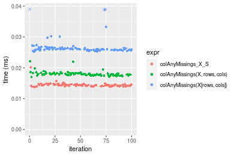

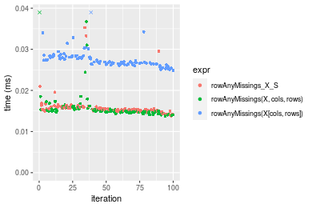
_Table: Benchmarking of colAnyMissings_X_S() and rowAnyMissings_X_S() on integer+100x100 data (original and transposed).  The top panel shows times in milliseconds and the bottom panel shows relative times._


|   |expr               |    min|      lq|     mean|  median|      uq|    max|
|:--|:------------------|------:|-------:|--------:|-------:|-------:|------:|
|1  |colAnyMissings_X_S | 13.782| 14.1225| 14.42787| 14.3485| 14.5980| 20.174|
|2  |rowAnyMissings_X_S | 13.815| 15.0885| 16.01771| 15.3965| 15.9835| 35.255|


|   |expr               |      min|       lq|     mean|   median|      uq|      max|
|:--|:------------------|--------:|--------:|--------:|--------:|-------:|--------:|
|1  |colAnyMissings_X_S | 1.000000| 1.000000| 1.000000| 1.000000| 1.00000| 1.000000|
|2  |rowAnyMissings_X_S | 1.002394| 1.068402| 1.110192| 1.073039| 1.09491| 1.747546|

_Figure: Benchmarking of colAnyMissings_X_S() and rowAnyMissings_X_S() on integer+100x100 data (original and transposed).  Outliers are displayed as crosses. Times are in milliseconds._


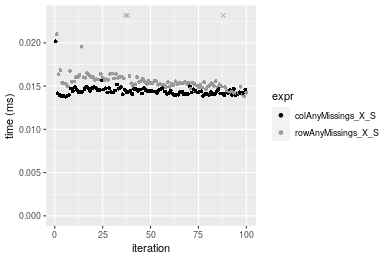

### 1000x10 matrix


```r
> X <- data[["1000x10"]]
> rows <- sample.int(nrow(X), size = nrow(X) * 0.7)
> cols <- sample.int(ncol(X), size = ncol(X) * 0.7)
> X_S <- X[rows, cols]
> gc()
          used  (Mb) gc trigger  (Mb) max used  (Mb)
Ncells 5160242 275.6    8529671 455.6  8529671 455.6
Vcells 9218209  70.4   31876688 243.2 60562128 462.1
> colStats <- microbenchmark(colAnyMissings_X_S = colAnyMissings(X_S), `colAnyMissings(X, rows, cols)` = colAnyMissings(X, 
+     rows = rows, cols = cols), `colAnyMissings(X[rows, cols])` = colAnyMissings(X[rows, cols]), unit = "ms")
> X <- t(X)
> X_S <- t(X_S)
> gc()
          used  (Mb) gc trigger  (Mb) max used  (Mb)
Ncells 5160218 275.6    8529671 455.6  8529671 455.6
Vcells 9223262  70.4   31876688 243.2 60562128 462.1
> rowStats <- microbenchmark(rowAnyMissings_X_S = rowAnyMissings(X_S), `rowAnyMissings(X, cols, rows)` = rowAnyMissings(X, 
+     rows = cols, cols = rows), `rowAnyMissings(X[cols, rows])` = rowAnyMissings(X[cols, rows]), unit = "ms")
```

_Table: Benchmarking of colAnyMissings_X_S(), colAnyMissings(X, rows, cols)() and colAnyMissings(X[rows, cols])() on integer+1000x10 data. The top panel shows times in milliseconds and the bottom panel shows relative times._


|   |expr                          |      min|        lq|      mean|    median|        uq|      max|
|:--|:-----------------------------|--------:|---------:|---------:|---------:|---------:|--------:|
|1  |colAnyMissings_X_S            | 0.012746| 0.0133290| 0.0137894| 0.0135525| 0.0136995| 0.027639|
|2  |colAnyMissings(X, rows, cols) | 0.017872| 0.0187040| 0.0191630| 0.0189465| 0.0192710| 0.026558|
|3  |colAnyMissings(X[rows, cols]) | 0.024450| 0.0255475| 0.0264699| 0.0259050| 0.0261865| 0.062811|


|   |expr                          |      min|       lq|     mean|   median|       uq|       max|
|:--|:-----------------------------|--------:|--------:|--------:|--------:|--------:|---------:|
|1  |colAnyMissings_X_S            | 1.000000| 1.000000| 1.000000| 1.000000| 1.000000| 1.0000000|
|2  |colAnyMissings(X, rows, cols) | 1.402165| 1.403256| 1.389694| 1.398008| 1.406694| 0.9608886|
|3  |colAnyMissings(X[rows, cols]) | 1.918249| 1.916685| 1.919589| 1.911455| 1.911493| 2.2725497|

_Table: Benchmarking of rowAnyMissings_X_S(), rowAnyMissings(X, cols, rows)() and rowAnyMissings(X[cols, rows])() on integer+1000x10 data (transposed). The top panel shows times in milliseconds and the bottom panel shows relative times._


|   |expr                          |      min|        lq|      mean|    median|        uq|      max|
|:--|:-----------------------------|--------:|---------:|---------:|---------:|---------:|--------:|
|1  |rowAnyMissings_X_S            | 0.015884| 0.0166435| 0.0170975| 0.0168815| 0.0171135| 0.029345|
|2  |rowAnyMissings(X, cols, rows) | 0.016958| 0.0177320| 0.0184489| 0.0181270| 0.0186145| 0.024209|
|3  |rowAnyMissings(X[cols, rows]) | 0.029481| 0.0307810| 0.0316317| 0.0312070| 0.0314415| 0.070962|


|   |expr                          |      min|       lq|     mean|   median|       uq|       max|
|:--|:-----------------------------|--------:|--------:|--------:|--------:|--------:|---------:|
|1  |rowAnyMissings_X_S            | 1.000000| 1.000000| 1.000000| 1.000000| 1.000000| 1.0000000|
|2  |rowAnyMissings(X, cols, rows) | 1.067615| 1.065401| 1.079041| 1.073779| 1.087708| 0.8249787|
|3  |rowAnyMissings(X[cols, rows]) | 1.856019| 1.849431| 1.850078| 1.848592| 1.837234| 2.4181973|

_Figure: Benchmarking of colAnyMissings_X_S(), colAnyMissings(X, rows, cols)() and colAnyMissings(X[rows, cols])() on integer+1000x10 data  as well as rowAnyMissings_X_S(), rowAnyMissings(X, cols, rows)() and rowAnyMissings(X[cols, rows])() on the same data transposed.  Outliers are displayed as crosses.  Times are in milliseconds._


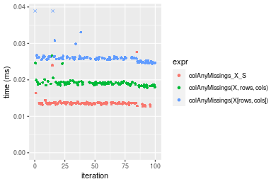

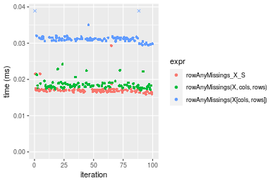
_Table: Benchmarking of colAnyMissings_X_S() and rowAnyMissings_X_S() on integer+1000x10 data (original and transposed).  The top panel shows times in milliseconds and the bottom panel shows relative times._


|   |expr               |    min|      lq|     mean|  median|      uq|    max|
|:--|:------------------|------:|-------:|--------:|-------:|-------:|------:|
|1  |colAnyMissings_X_S | 12.746| 13.3290| 13.78937| 13.5525| 13.6995| 27.639|
|2  |rowAnyMissings_X_S | 15.884| 16.6435| 17.09748| 16.8815| 17.1135| 29.345|


|   |expr               |      min|       lq|     mean|   median|       uq|      max|
|:--|:------------------|--------:|--------:|--------:|--------:|--------:|--------:|
|1  |colAnyMissings_X_S | 1.000000| 1.000000| 1.000000| 1.000000| 1.000000| 1.000000|
|2  |rowAnyMissings_X_S | 1.246195| 1.248668| 1.239903| 1.245637| 1.249206| 1.061724|

_Figure: Benchmarking of colAnyMissings_X_S() and rowAnyMissings_X_S() on integer+1000x10 data (original and transposed).  Outliers are displayed as crosses. Times are in milliseconds._


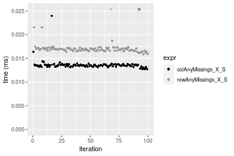

### 10x1000 matrix


```r
> X <- data[["10x1000"]]
> rows <- sample.int(nrow(X), size = nrow(X) * 0.7)
> cols <- sample.int(ncol(X), size = ncol(X) * 0.7)
> X_S <- X[rows, cols]
> gc()
          used  (Mb) gc trigger  (Mb) max used  (Mb)
Ncells 5160447 275.6    8529671 455.6  8529671 455.6
Vcells 9219140  70.4   31876688 243.2 60562128 462.1
> colStats <- microbenchmark(colAnyMissings_X_S = colAnyMissings(X_S), `colAnyMissings(X, rows, cols)` = colAnyMissings(X, 
+     rows = rows, cols = cols), `colAnyMissings(X[rows, cols])` = colAnyMissings(X[rows, cols]), unit = "ms")
> X <- t(X)
> X_S <- t(X_S)
> gc()
          used  (Mb) gc trigger  (Mb) max used  (Mb)
Ncells 5160423 275.6    8529671 455.6  8529671 455.6
Vcells 9224193  70.4   31876688 243.2 60562128 462.1
> rowStats <- microbenchmark(rowAnyMissings_X_S = rowAnyMissings(X_S), `rowAnyMissings(X, cols, rows)` = rowAnyMissings(X, 
+     rows = cols, cols = rows), `rowAnyMissings(X[cols, rows])` = rowAnyMissings(X[cols, rows]), unit = "ms")
```

_Table: Benchmarking of colAnyMissings_X_S(), colAnyMissings(X, rows, cols)() and colAnyMissings(X[rows, cols])() on integer+10x1000 data. The top panel shows times in milliseconds and the bottom panel shows relative times._


|   |expr                          |      min|        lq|      mean|    median|        uq|      max|
|:--|:-----------------------------|--------:|---------:|---------:|---------:|---------:|--------:|
|1  |colAnyMissings_X_S            | 0.015783| 0.0167735| 0.0174614| 0.0169845| 0.0173080| 0.047039|
|2  |colAnyMissings(X, rows, cols) | 0.021038| 0.0226015| 0.0229454| 0.0228350| 0.0230775| 0.034074|
|3  |colAnyMissings(X[rows, cols]) | 0.029427| 0.0308190| 0.0315096| 0.0310815| 0.0316075| 0.046379|


|   |expr                          |      min|       lq|     mean|   median|       uq|       max|
|:--|:-----------------------------|--------:|--------:|--------:|--------:|--------:|---------:|
|1  |colAnyMissings_X_S            | 1.000000| 1.000000| 1.000000| 1.000000| 1.000000| 1.0000000|
|2  |colAnyMissings(X, rows, cols) | 1.332953| 1.347453| 1.314064| 1.344461| 1.333343| 0.7243776|
|3  |colAnyMissings(X[rows, cols]) | 1.864474| 1.837363| 1.804527| 1.829992| 1.826179| 0.9859691|

_Table: Benchmarking of rowAnyMissings_X_S(), rowAnyMissings(X, cols, rows)() and rowAnyMissings(X[cols, rows])() on integer+10x1000 data (transposed). The top panel shows times in milliseconds and the bottom panel shows relative times._


|   |expr                          |      min|        lq|      mean|    median|        uq|      max|
|:--|:-----------------------------|--------:|---------:|---------:|---------:|---------:|--------:|
|1  |rowAnyMissings_X_S            | 0.016019| 0.0163735| 0.0167852| 0.0165925| 0.0168880| 0.022359|
|2  |rowAnyMissings(X, cols, rows) | 0.018313| 0.0188270| 0.0195425| 0.0191855| 0.0194705| 0.054754|
|3  |rowAnyMissings(X[cols, rows]) | 0.028022| 0.0284220| 0.0287956| 0.0286640| 0.0290390| 0.034448|


|   |expr                          |      min|       lq|     mean|   median|       uq|      max|
|:--|:-----------------------------|--------:|--------:|--------:|--------:|--------:|--------:|
|1  |rowAnyMissings_X_S            | 1.000000| 1.000000| 1.000000| 1.000000| 1.000000| 1.000000|
|2  |rowAnyMissings(X, cols, rows) | 1.143205| 1.149846| 1.164274| 1.156275| 1.152919| 2.448857|
|3  |rowAnyMissings(X[cols, rows]) | 1.749298| 1.735854| 1.715537| 1.727528| 1.719505| 1.540677|

_Figure: Benchmarking of colAnyMissings_X_S(), colAnyMissings(X, rows, cols)() and colAnyMissings(X[rows, cols])() on integer+10x1000 data  as well as rowAnyMissings_X_S(), rowAnyMissings(X, cols, rows)() and rowAnyMissings(X[cols, rows])() on the same data transposed.  Outliers are displayed as crosses.  Times are in milliseconds._


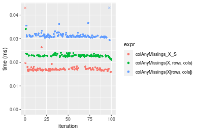

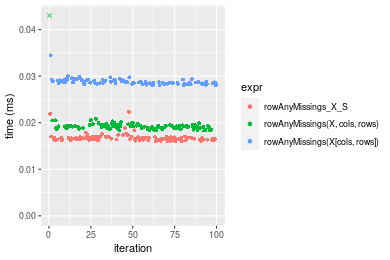
_Table: Benchmarking of colAnyMissings_X_S() and rowAnyMissings_X_S() on integer+10x1000 data (original and transposed).  The top panel shows times in milliseconds and the bottom panel shows relative times._


|   |expr               |    min|      lq|     mean|  median|     uq|    max|
|:--|:------------------|------:|-------:|--------:|-------:|------:|------:|
|2  |rowAnyMissings_X_S | 16.019| 16.3735| 16.78516| 16.5925| 16.888| 22.359|
|1  |colAnyMissings_X_S | 15.783| 16.7735| 17.46142| 16.9845| 17.308| 47.039|


|   |expr               |       min|      lq|     mean|   median|      uq|      max|
|:--|:------------------|---------:|-------:|--------:|--------:|-------:|--------:|
|2  |rowAnyMissings_X_S | 1.0000000| 1.00000| 1.000000| 1.000000| 1.00000| 1.000000|
|1  |colAnyMissings_X_S | 0.9852675| 1.02443| 1.040289| 1.023625| 1.02487| 2.103806|

_Figure: Benchmarking of colAnyMissings_X_S() and rowAnyMissings_X_S() on integer+10x1000 data (original and transposed).  Outliers are displayed as crosses. Times are in milliseconds._


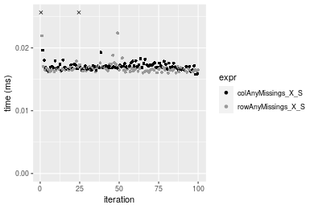

### 100x1000 matrix


```r
> X <- data[["100x1000"]]
> rows <- sample.int(nrow(X), size = nrow(X) * 0.7)
> cols <- sample.int(ncol(X), size = ncol(X) * 0.7)
> X_S <- X[rows, cols]
> gc()
          used  (Mb) gc trigger  (Mb) max used  (Mb)
Ncells 5160658 275.7    8529671 455.6  8529671 455.6
Vcells 9241833  70.6   31876688 243.2 60562128 462.1
> colStats <- microbenchmark(colAnyMissings_X_S = colAnyMissings(X_S), `colAnyMissings(X, rows, cols)` = colAnyMissings(X, 
+     rows = rows, cols = cols), `colAnyMissings(X[rows, cols])` = colAnyMissings(X[rows, cols]), unit = "ms")
> X <- t(X)
> X_S <- t(X_S)
> gc()
          used  (Mb) gc trigger  (Mb) max used  (Mb)
Ncells 5160634 275.7    8529671 455.6  8529671 455.6
Vcells 9291886  70.9   31876688 243.2 60562128 462.1
> rowStats <- microbenchmark(rowAnyMissings_X_S = rowAnyMissings(X_S), `rowAnyMissings(X, cols, rows)` = rowAnyMissings(X, 
+     rows = cols, cols = rows), `rowAnyMissings(X[cols, rows])` = rowAnyMissings(X[cols, rows]), unit = "ms")
```

_Table: Benchmarking of colAnyMissings_X_S(), colAnyMissings(X, rows, cols)() and colAnyMissings(X[rows, cols])() on integer+100x1000 data. The top panel shows times in milliseconds and the bottom panel shows relative times._


|   |expr                          |      min|        lq|      mean|    median|       uq|      max|
|:--|:-----------------------------|--------:|---------:|---------:|---------:|--------:|--------:|
|1  |colAnyMissings_X_S            | 0.068732| 0.0718555| 0.0796662| 0.0765295| 0.085540| 0.123166|
|2  |colAnyMissings(X, rows, cols) | 0.087344| 0.0909465| 0.1007715| 0.0969410| 0.109387| 0.171444|
|3  |colAnyMissings(X[rows, cols]) | 0.149315| 0.1598135| 0.1732749| 0.1712850| 0.186491| 0.212085|


|   |expr                          |      min|       lq|     mean|   median|       uq|      max|
|:--|:-----------------------------|--------:|--------:|--------:|--------:|--------:|--------:|
|1  |colAnyMissings_X_S            | 1.000000| 1.000000| 1.000000| 1.000000| 1.000000| 1.000000|
|2  |colAnyMissings(X, rows, cols) | 1.270791| 1.265686| 1.264922| 1.266714| 1.278782| 1.391975|
|3  |colAnyMissings(X[rows, cols]) | 2.172423| 2.224096| 2.175013| 2.238157| 2.180161| 1.721944|

_Table: Benchmarking of rowAnyMissings_X_S(), rowAnyMissings(X, cols, rows)() and rowAnyMissings(X[cols, rows])() on integer+100x1000 data (transposed). The top panel shows times in milliseconds and the bottom panel shows relative times._


|   |expr                          |      min|        lq|      mean|    median|        uq|      max|
|:--|:-----------------------------|--------:|---------:|---------:|---------:|---------:|--------:|
|2  |rowAnyMissings(X, cols, rows) | 0.069810| 0.0726365| 0.0796728| 0.0748425| 0.0847790| 0.142066|
|1  |rowAnyMissings_X_S            | 0.069450| 0.0741070| 0.0810793| 0.0801935| 0.0865870| 0.124561|
|3  |rowAnyMissings(X[cols, rows]) | 0.146539| 0.1560045| 0.1687410| 0.1629055| 0.1811055| 0.201860|


|   |expr                          |       min|       lq|     mean|   median|       uq|       max|
|:--|:-----------------------------|---------:|--------:|--------:|--------:|--------:|---------:|
|2  |rowAnyMissings(X, cols, rows) | 1.0000000| 1.000000| 1.000000| 1.000000| 1.000000| 1.0000000|
|1  |rowAnyMissings_X_S            | 0.9948431| 1.020245| 1.017654| 1.071497| 1.021326| 0.8767826|
|3  |rowAnyMissings(X[cols, rows]) | 2.0991119| 2.147743| 2.117924| 2.176644| 2.136207| 1.4208889|

_Figure: Benchmarking of colAnyMissings_X_S(), colAnyMissings(X, rows, cols)() and colAnyMissings(X[rows, cols])() on integer+100x1000 data  as well as rowAnyMissings_X_S(), rowAnyMissings(X, cols, rows)() and rowAnyMissings(X[cols, rows])() on the same data transposed.  Outliers are displayed as crosses.  Times are in milliseconds._


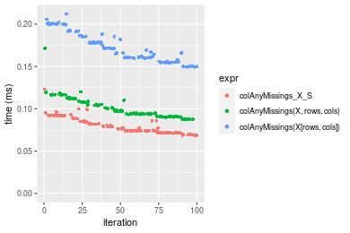

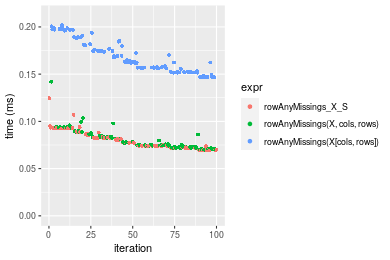
_Table: Benchmarking of colAnyMissings_X_S() and rowAnyMissings_X_S() on integer+100x1000 data (original and transposed).  The top panel shows times in milliseconds and the bottom panel shows relative times._


|   |expr               |    min|      lq|     mean|  median|     uq|     max|
|:--|:------------------|------:|-------:|--------:|-------:|------:|-------:|
|1  |colAnyMissings_X_S | 68.732| 71.8555| 79.66615| 76.5295| 85.540| 123.166|
|2  |rowAnyMissings_X_S | 69.450| 74.1070| 81.07934| 80.1935| 86.587| 124.561|


|   |expr               |      min|       lq|     mean|   median|      uq|      max|
|:--|:------------------|--------:|--------:|--------:|--------:|-------:|--------:|
|1  |colAnyMissings_X_S | 1.000000| 1.000000| 1.000000| 1.000000| 1.00000| 1.000000|
|2  |rowAnyMissings_X_S | 1.010446| 1.031334| 1.017739| 1.047877| 1.01224| 1.011326|

_Figure: Benchmarking of colAnyMissings_X_S() and rowAnyMissings_X_S() on integer+100x1000 data (original and transposed).  Outliers are displayed as crosses. Times are in milliseconds._


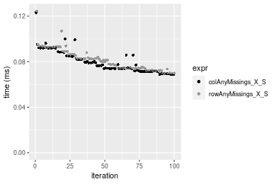

### 1000x100 matrix


```r
> X <- data[["1000x100"]]
> rows <- sample.int(nrow(X), size = nrow(X) * 0.7)
> cols <- sample.int(ncol(X), size = ncol(X) * 0.7)
> X_S <- X[rows, cols]
> gc()
          used  (Mb) gc trigger  (Mb) max used  (Mb)
Ncells 5160868 275.7    8529671 455.6  8529671 455.6
Vcells 9242640  70.6   31876688 243.2 60562128 462.1
> colStats <- microbenchmark(colAnyMissings_X_S = colAnyMissings(X_S), `colAnyMissings(X, rows, cols)` = colAnyMissings(X, 
+     rows = rows, cols = cols), `colAnyMissings(X[rows, cols])` = colAnyMissings(X[rows, cols]), unit = "ms")
> X <- t(X)
> X_S <- t(X_S)
> gc()
          used  (Mb) gc trigger  (Mb) max used  (Mb)
Ncells 5160844 275.7    8529671 455.6  8529671 455.6
Vcells 9292693  70.9   31876688 243.2 60562128 462.1
> rowStats <- microbenchmark(rowAnyMissings_X_S = rowAnyMissings(X_S), `rowAnyMissings(X, cols, rows)` = rowAnyMissings(X, 
+     rows = cols, cols = rows), `rowAnyMissings(X[cols, rows])` = rowAnyMissings(X[cols, rows]), unit = "ms")
```

_Table: Benchmarking of colAnyMissings_X_S(), colAnyMissings(X, rows, cols)() and colAnyMissings(X[rows, cols])() on integer+1000x100 data. The top panel shows times in milliseconds and the bottom panel shows relative times._


|   |expr                          |      min|        lq|      mean|    median|        uq|      max|
|:--|:-----------------------------|--------:|---------:|---------:|---------:|---------:|--------:|
|1  |colAnyMissings_X_S            | 0.067708| 0.0701475| 0.0768881| 0.0726405| 0.0807180| 0.121301|
|2  |colAnyMissings(X, rows, cols) | 0.086963| 0.0897345| 0.1004927| 0.0991790| 0.1074625| 0.149402|
|3  |colAnyMissings(X[rows, cols]) | 0.145024| 0.1504565| 0.1688668| 0.1608425| 0.1866255| 0.258294|


|   |expr                          |      min|       lq|     mean|   median|       uq|      max|
|:--|:-----------------------------|--------:|--------:|--------:|--------:|--------:|--------:|
|1  |colAnyMissings_X_S            | 1.000000| 1.000000| 1.000000| 1.000000| 1.000000| 1.000000|
|2  |colAnyMissings(X, rows, cols) | 1.284383| 1.279226| 1.307000| 1.365340| 1.331333| 1.231663|
|3  |colAnyMissings(X[rows, cols]) | 2.141904| 2.144859| 2.196267| 2.214226| 2.312068| 2.129364|

_Table: Benchmarking of rowAnyMissings_X_S(), rowAnyMissings(X, cols, rows)() and rowAnyMissings(X[cols, rows])() on integer+1000x100 data (transposed). The top panel shows times in milliseconds and the bottom panel shows relative times._


|   |expr                          |      min|        lq|      mean|    median|        uq|      max|
|:--|:-----------------------------|--------:|---------:|---------:|---------:|---------:|--------:|
|2  |rowAnyMissings(X, cols, rows) | 0.064863| 0.0716550| 0.0772394| 0.0743695| 0.0788165| 0.176123|
|1  |rowAnyMissings_X_S            | 0.069201| 0.0755755| 0.0802294| 0.0787945| 0.0835245| 0.108392|
|3  |rowAnyMissings(X[cols, rows]) | 0.143929| 0.1572250| 0.1682894| 0.1633200| 0.1739550| 0.227019|


|   |expr                          |      min|       lq|     mean|   median|       uq|       max|
|:--|:-----------------------------|--------:|--------:|--------:|--------:|--------:|---------:|
|2  |rowAnyMissings(X, cols, rows) | 1.000000| 1.000000| 1.000000| 1.000000| 1.000000| 1.0000000|
|1  |rowAnyMissings_X_S            | 1.066879| 1.054714| 1.038710| 1.059500| 1.059734| 0.6154335|
|3  |rowAnyMissings(X[cols, rows]) | 2.218969| 2.194194| 2.178801| 2.196062| 2.207089| 1.2889799|

_Figure: Benchmarking of colAnyMissings_X_S(), colAnyMissings(X, rows, cols)() and colAnyMissings(X[rows, cols])() on integer+1000x100 data  as well as rowAnyMissings_X_S(), rowAnyMissings(X, cols, rows)() and rowAnyMissings(X[cols, rows])() on the same data transposed.  Outliers are displayed as crosses.  Times are in milliseconds._


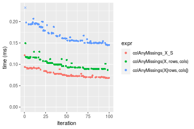

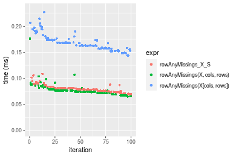
_Table: Benchmarking of colAnyMissings_X_S() and rowAnyMissings_X_S() on integer+1000x100 data (original and transposed).  The top panel shows times in milliseconds and the bottom panel shows relative times._


|   |expr               |    min|      lq|     mean|  median|      uq|     max|
|:--|:------------------|------:|-------:|--------:|-------:|-------:|-------:|
|1  |colAnyMissings_X_S | 67.708| 70.1475| 76.88810| 72.6405| 80.7180| 121.301|
|2  |rowAnyMissings_X_S | 69.201| 75.5755| 80.22942| 78.7945| 83.5245| 108.392|


|   |expr               |      min|      lq|     mean|   median|       uq|       max|
|:--|:------------------|--------:|-------:|--------:|--------:|--------:|---------:|
|1  |colAnyMissings_X_S | 1.000000| 1.00000| 1.000000| 1.000000| 1.000000| 1.0000000|
|2  |rowAnyMissings_X_S | 1.022051| 1.07738| 1.043457| 1.084719| 1.034769| 0.8935788|

_Figure: Benchmarking of colAnyMissings_X_S() and rowAnyMissings_X_S() on integer+1000x100 data (original and transposed).  Outliers are displayed as crosses. Times are in milliseconds._


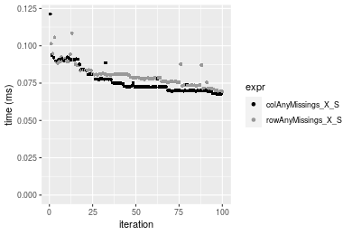


## Data type "double"

### Data
```r
> rmatrix <- function(nrow, ncol, mode = c("logical", "double", "integer", "index"), range = c(-100, 
+     +100), na_prob = 0) {
+     mode <- match.arg(mode)
+     n <- nrow * ncol
+     if (mode == "logical") {
+         x <- sample(c(FALSE, TRUE), size = n, replace = TRUE)
+     }     else if (mode == "index") {
+         x <- seq_len(n)
+         mode <- "integer"
+     }     else {
+         x <- runif(n, min = range[1], max = range[2])
+     }
+     storage.mode(x) <- mode
+     if (na_prob > 0) 
+         x[sample(n, size = na_prob * n)] <- NA
+     dim(x) <- c(nrow, ncol)
+     x
+ }
> rmatrices <- function(scale = 10, seed = 1, ...) {
+     set.seed(seed)
+     data <- list()
+     data[[1]] <- rmatrix(nrow = scale * 1, ncol = scale * 1, ...)
+     data[[2]] <- rmatrix(nrow = scale * 10, ncol = scale * 10, ...)
+     data[[3]] <- rmatrix(nrow = scale * 100, ncol = scale * 1, ...)
+     data[[4]] <- t(data[[3]])
+     data[[5]] <- rmatrix(nrow = scale * 10, ncol = scale * 100, ...)
+     data[[6]] <- t(data[[5]])
+     names(data) <- sapply(data, FUN = function(x) paste(dim(x), collapse = "x"))
+     data
+ }
> data <- rmatrices(mode = mode)
```

## Results

### 10x10 matrix


```r
> X <- data[["10x10"]]
> rows <- sample.int(nrow(X), size = nrow(X) * 0.7)
> cols <- sample.int(ncol(X), size = ncol(X) * 0.7)
> X_S <- X[rows, cols]
> gc()
          used  (Mb) gc trigger  (Mb) max used  (Mb)
Ncells 5161086 275.7    8529671 455.6  8529671 455.6
Vcells 9333779  71.3   31876688 243.2 60562128 462.1
> colStats <- microbenchmark(colAnyMissings_X_S = colAnyMissings(X_S), `colAnyMissings(X, rows, cols)` = colAnyMissings(X, 
+     rows = rows, cols = cols), `colAnyMissings(X[rows, cols])` = colAnyMissings(X[rows, cols]), unit = "ms")
> X <- t(X)
> X_S <- t(X_S)
> gc()
          used  (Mb) gc trigger  (Mb) max used  (Mb)
Ncells 5161053 275.7    8529671 455.6  8529671 455.6
Vcells 9333917  71.3   31876688 243.2 60562128 462.1
> rowStats <- microbenchmark(rowAnyMissings_X_S = rowAnyMissings(X_S), `rowAnyMissings(X, cols, rows)` = rowAnyMissings(X, 
+     rows = cols, cols = rows), `rowAnyMissings(X[cols, rows])` = rowAnyMissings(X[cols, rows]), unit = "ms")
```

_Table: Benchmarking of colAnyMissings_X_S(), colAnyMissings(X, rows, cols)() and colAnyMissings(X[rows, cols])() on double+10x10 data. The top panel shows times in milliseconds and the bottom panel shows relative times._


|   |expr                          |      min|        lq|      mean|    median|        uq|      max|
|:--|:-----------------------------|--------:|---------:|---------:|---------:|---------:|--------:|
|1  |colAnyMissings_X_S            | 0.004763| 0.0049160| 0.0053280| 0.0050130| 0.0050915| 0.031773|
|2  |colAnyMissings(X, rows, cols) | 0.005136| 0.0053475| 0.0054884| 0.0054315| 0.0055435| 0.008306|
|3  |colAnyMissings(X[rows, cols]) | 0.005850| 0.0062080| 0.0063675| 0.0062870| 0.0064075| 0.011304|


|   |expr                          |      min|       lq|     mean|   median|       uq|       max|
|:--|:-----------------------------|--------:|--------:|--------:|--------:|--------:|---------:|
|1  |colAnyMissings_X_S            | 1.000000| 1.000000| 1.000000| 1.000000| 1.000000| 1.0000000|
|2  |colAnyMissings(X, rows, cols) | 1.078312| 1.087775| 1.030103| 1.083483| 1.088775| 0.2614169|
|3  |colAnyMissings(X[rows, cols]) | 1.228217| 1.262815| 1.195118| 1.254139| 1.258470| 0.3557738|

_Table: Benchmarking of rowAnyMissings_X_S(), rowAnyMissings(X, cols, rows)() and rowAnyMissings(X[cols, rows])() on double+10x10 data (transposed). The top panel shows times in milliseconds and the bottom panel shows relative times._


|   |expr                          |      min|       lq|      mean|    median|        uq|      max|
|:--|:-----------------------------|--------:|--------:|---------:|---------:|---------:|--------:|
|1  |rowAnyMissings_X_S            | 0.004928| 0.005112| 0.0052579| 0.0052035| 0.0053700| 0.007703|
|2  |rowAnyMissings(X, cols, rows) | 0.005289| 0.005462| 0.0059575| 0.0055770| 0.0056985| 0.034002|
|3  |rowAnyMissings(X[cols, rows]) | 0.006113| 0.006315| 0.0065227| 0.0064595| 0.0065995| 0.009716|


|   |expr                          |      min|       lq|     mean|   median|       uq|      max|
|:--|:-----------------------------|--------:|--------:|--------:|--------:|--------:|--------:|
|1  |rowAnyMissings_X_S            | 1.000000| 1.000000| 1.000000| 1.000000| 1.000000| 1.000000|
|2  |rowAnyMissings(X, cols, rows) | 1.073255| 1.068466| 1.133066| 1.071779| 1.061173| 4.414124|
|3  |rowAnyMissings(X[cols, rows]) | 1.240463| 1.235329| 1.240547| 1.241376| 1.228957| 1.261327|

_Figure: Benchmarking of colAnyMissings_X_S(), colAnyMissings(X, rows, cols)() and colAnyMissings(X[rows, cols])() on double+10x10 data  as well as rowAnyMissings_X_S(), rowAnyMissings(X, cols, rows)() and rowAnyMissings(X[cols, rows])() on the same data transposed.  Outliers are displayed as crosses.  Times are in milliseconds._


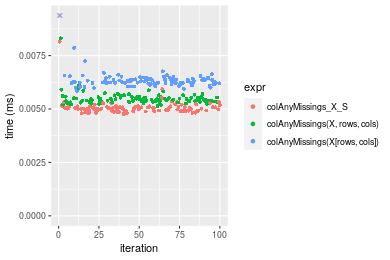

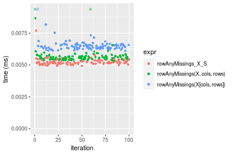
_Table: Benchmarking of colAnyMissings_X_S() and rowAnyMissings_X_S() on double+10x10 data (original and transposed).  The top panel shows times in milliseconds and the bottom panel shows relative times._


|   |expr               |   min|    lq|    mean| median|     uq|    max|
|:--|:------------------|-----:|-----:|-------:|------:|------:|------:|
|1  |colAnyMissings_X_S | 4.763| 4.916| 5.32797| 5.0130| 5.0915| 31.773|
|2  |rowAnyMissings_X_S | 4.928| 5.112| 5.25790| 5.2035| 5.3700|  7.703|


|   |expr               |      min|      lq|      mean|   median|       uq|       max|
|:--|:------------------|--------:|-------:|---------:|--------:|--------:|---------:|
|1  |colAnyMissings_X_S | 1.000000| 1.00000| 1.0000000| 1.000000| 1.000000| 1.0000000|
|2  |rowAnyMissings_X_S | 1.034642| 1.03987| 0.9868486| 1.038001| 1.054699| 0.2424385|

_Figure: Benchmarking of colAnyMissings_X_S() and rowAnyMissings_X_S() on double+10x10 data (original and transposed).  Outliers are displayed as crosses. Times are in milliseconds._


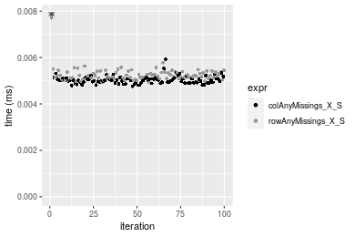

### 100x100 matrix


```r
> X <- data[["100x100"]]
> rows <- sample.int(nrow(X), size = nrow(X) * 0.7)
> cols <- sample.int(ncol(X), size = ncol(X) * 0.7)
> X_S <- X[rows, cols]
> gc()
          used  (Mb) gc trigger  (Mb) max used  (Mb)
Ncells 5161285 275.7    8529671 455.6  8529671 455.6
Vcells 9339765  71.3   31876688 243.2 60562128 462.1
> colStats <- microbenchmark(colAnyMissings_X_S = colAnyMissings(X_S), `colAnyMissings(X, rows, cols)` = colAnyMissings(X, 
+     rows = rows, cols = cols), `colAnyMissings(X[rows, cols])` = colAnyMissings(X[rows, cols]), unit = "ms")
> X <- t(X)
> X_S <- t(X_S)
> gc()
          used  (Mb) gc trigger  (Mb) max used  (Mb)
Ncells 5161261 275.7    8529671 455.6  8529671 455.6
Vcells 9349818  71.4   31876688 243.2 60562128 462.1
> rowStats <- microbenchmark(rowAnyMissings_X_S = rowAnyMissings(X_S), `rowAnyMissings(X, cols, rows)` = rowAnyMissings(X, 
+     rows = cols, cols = rows), `rowAnyMissings(X[cols, rows])` = rowAnyMissings(X[cols, rows]), unit = "ms")
```

_Table: Benchmarking of colAnyMissings_X_S(), colAnyMissings(X, rows, cols)() and colAnyMissings(X[rows, cols])() on double+100x100 data. The top panel shows times in milliseconds and the bottom panel shows relative times._


|   |expr                          |      min|        lq|      mean|    median|        uq|      max|
|:--|:-----------------------------|--------:|---------:|---------:|---------:|---------:|--------:|
|1  |colAnyMissings_X_S            | 0.014080| 0.0147540| 0.0153998| 0.0151635| 0.0155990| 0.030410|
|2  |colAnyMissings(X, rows, cols) | 0.014756| 0.0155700| 0.0162705| 0.0161000| 0.0166425| 0.022333|
|3  |colAnyMissings(X[rows, cols]) | 0.029500| 0.0308305| 0.0319412| 0.0313230| 0.0323670| 0.069307|


|   |expr                          |      min|       lq|     mean|   median|       uq|       max|
|:--|:-----------------------------|--------:|--------:|--------:|--------:|--------:|---------:|
|1  |colAnyMissings_X_S            | 1.000000| 1.000000| 1.000000| 1.000000| 1.000000| 1.0000000|
|2  |colAnyMissings(X, rows, cols) | 1.048011| 1.055307| 1.056539| 1.061760| 1.066895| 0.7343966|
|3  |colAnyMissings(X[rows, cols]) | 2.095171| 2.089637| 2.074134| 2.065684| 2.074941| 2.2790858|

_Table: Benchmarking of rowAnyMissings_X_S(), rowAnyMissings(X, cols, rows)() and rowAnyMissings(X[cols, rows])() on double+100x100 data (transposed). The top panel shows times in milliseconds and the bottom panel shows relative times._


|   |expr                          |      min|        lq|      mean|    median|        uq|      max|
|:--|:-----------------------------|--------:|---------:|---------:|---------:|---------:|--------:|
|1  |rowAnyMissings_X_S            | 0.017863| 0.0185890| 0.0194330| 0.0193800| 0.0200885| 0.025795|
|2  |rowAnyMissings(X, cols, rows) | 0.018339| 0.0191705| 0.0204793| 0.0199875| 0.0206215| 0.056908|
|3  |rowAnyMissings(X[cols, rows]) | 0.033330| 0.0341825| 0.0358083| 0.0354035| 0.0369535| 0.049152|


|   |expr                          |      min|       lq|     mean|   median|       uq|      max|
|:--|:-----------------------------|--------:|--------:|--------:|--------:|--------:|--------:|
|1  |rowAnyMissings_X_S            | 1.000000| 1.000000| 1.000000| 1.000000| 1.000000| 1.000000|
|2  |rowAnyMissings(X, cols, rows) | 1.026647| 1.031282| 1.053840| 1.031347| 1.026533| 2.206164|
|3  |rowAnyMissings(X[cols, rows]) | 1.865868| 1.838856| 1.842654| 1.826806| 1.839535| 1.905486|

_Figure: Benchmarking of colAnyMissings_X_S(), colAnyMissings(X, rows, cols)() and colAnyMissings(X[rows, cols])() on double+100x100 data  as well as rowAnyMissings_X_S(), rowAnyMissings(X, cols, rows)() and rowAnyMissings(X[cols, rows])() on the same data transposed.  Outliers are displayed as crosses.  Times are in milliseconds._


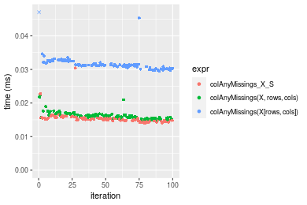

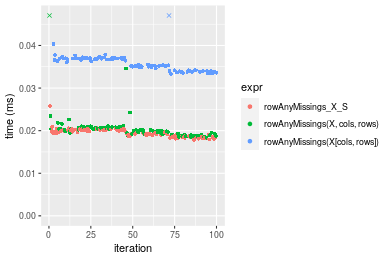
_Table: Benchmarking of colAnyMissings_X_S() and rowAnyMissings_X_S() on double+100x100 data (original and transposed).  The top panel shows times in milliseconds and the bottom panel shows relative times._


|   |expr               |    min|     lq|     mean|  median|      uq|    max|
|:--|:------------------|------:|------:|--------:|-------:|-------:|------:|
|1  |colAnyMissings_X_S | 14.080| 14.754| 15.39977| 15.1635| 15.5990| 30.410|
|2  |rowAnyMissings_X_S | 17.863| 18.589| 19.43298| 19.3800| 20.0885| 25.795|


|   |expr               |      min|       lq|     mean|   median|       uq|       max|
|:--|:------------------|--------:|--------:|--------:|--------:|--------:|---------:|
|1  |colAnyMissings_X_S | 1.000000| 1.000000| 1.000000| 1.000000| 1.000000| 1.0000000|
|2  |rowAnyMissings_X_S | 1.268679| 1.259929| 1.261901| 1.278069| 1.287807| 0.8482407|

_Figure: Benchmarking of colAnyMissings_X_S() and rowAnyMissings_X_S() on double+100x100 data (original and transposed).  Outliers are displayed as crosses. Times are in milliseconds._


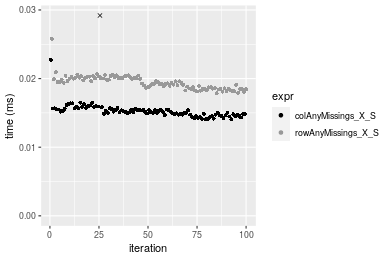

### 1000x10 matrix


```r
> X <- data[["1000x10"]]
> rows <- sample.int(nrow(X), size = nrow(X) * 0.7)
> cols <- sample.int(ncol(X), size = ncol(X) * 0.7)
> X_S <- X[rows, cols]
> gc()
          used  (Mb) gc trigger  (Mb) max used  (Mb)
Ncells 5161484 275.7    8529671 455.6  8529671 455.6
Vcells 9341215  71.3   31876688 243.2 60562128 462.1
> colStats <- microbenchmark(colAnyMissings_X_S = colAnyMissings(X_S), `colAnyMissings(X, rows, cols)` = colAnyMissings(X, 
+     rows = rows, cols = cols), `colAnyMissings(X[rows, cols])` = colAnyMissings(X[rows, cols]), unit = "ms")
> X <- t(X)
> X_S <- t(X_S)
> gc()
          used  (Mb) gc trigger  (Mb) max used  (Mb)
Ncells 5161460 275.7    8529671 455.6  8529671 455.6
Vcells 9351268  71.4   31876688 243.2 60562128 462.1
> rowStats <- microbenchmark(rowAnyMissings_X_S = rowAnyMissings(X_S), `rowAnyMissings(X, cols, rows)` = rowAnyMissings(X, 
+     rows = cols, cols = rows), `rowAnyMissings(X[cols, rows])` = rowAnyMissings(X[cols, rows]), unit = "ms")
```

_Table: Benchmarking of colAnyMissings_X_S(), colAnyMissings(X, rows, cols)() and colAnyMissings(X[rows, cols])() on double+1000x10 data. The top panel shows times in milliseconds and the bottom panel shows relative times._


|   |expr                          |      min|        lq|      mean|    median|        uq|      max|
|:--|:-----------------------------|--------:|---------:|---------:|---------:|---------:|--------:|
|1  |colAnyMissings_X_S            | 0.012883| 0.0134635| 0.0138016| 0.0136990| 0.0138585| 0.025085|
|2  |colAnyMissings(X, rows, cols) | 0.016309| 0.0170090| 0.0175423| 0.0172810| 0.0176415| 0.031930|
|3  |colAnyMissings(X[rows, cols]) | 0.029507| 0.0306820| 0.0313238| 0.0310105| 0.0312045| 0.068240|


|   |expr                          |      min|       lq|     mean|   median|       uq|      max|
|:--|:-----------------------------|--------:|--------:|--------:|--------:|--------:|--------:|
|1  |colAnyMissings_X_S            | 1.000000| 1.000000| 1.000000| 1.000000| 1.000000| 1.000000|
|2  |colAnyMissings(X, rows, cols) | 1.265932| 1.263342| 1.271037| 1.261479| 1.272973| 1.272872|
|3  |colAnyMissings(X[rows, cols]) | 2.290383| 2.278902| 2.269578| 2.263705| 2.251651| 2.720351|

_Table: Benchmarking of rowAnyMissings_X_S(), rowAnyMissings(X, cols, rows)() and rowAnyMissings(X[cols, rows])() on double+1000x10 data (transposed). The top panel shows times in milliseconds and the bottom panel shows relative times._


|   |expr                          |      min|        lq|      mean|    median|        uq|      max|
|:--|:-----------------------------|--------:|---------:|---------:|---------:|---------:|--------:|
|1  |rowAnyMissings_X_S            | 0.017414| 0.0189950| 0.0195016| 0.0193190| 0.0196165| 0.034245|
|2  |rowAnyMissings(X, cols, rows) | 0.019997| 0.0210155| 0.0215119| 0.0217030| 0.0219970| 0.024958|
|3  |rowAnyMissings(X[cols, rows]) | 0.036654| 0.0385975| 0.0399305| 0.0398395| 0.0400455| 0.081435|


|   |expr                          |      min|       lq|     mean|   median|       uq|       max|
|:--|:-----------------------------|--------:|--------:|--------:|--------:|--------:|---------:|
|1  |rowAnyMissings_X_S            | 1.000000| 1.000000| 1.000000| 1.000000| 1.000000| 1.0000000|
|2  |rowAnyMissings(X, cols, rows) | 1.148329| 1.106370| 1.103087| 1.123402| 1.121352| 0.7288071|
|3  |rowAnyMissings(X[cols, rows]) | 2.104858| 2.031982| 2.047554| 2.062193| 2.041419| 2.3780114|

_Figure: Benchmarking of colAnyMissings_X_S(), colAnyMissings(X, rows, cols)() and colAnyMissings(X[rows, cols])() on double+1000x10 data  as well as rowAnyMissings_X_S(), rowAnyMissings(X, cols, rows)() and rowAnyMissings(X[cols, rows])() on the same data transposed.  Outliers are displayed as crosses.  Times are in milliseconds._


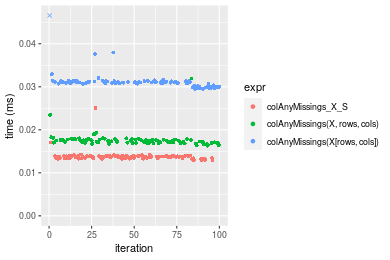

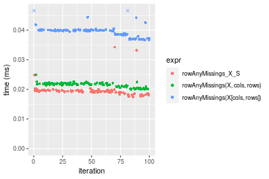
_Table: Benchmarking of colAnyMissings_X_S() and rowAnyMissings_X_S() on double+1000x10 data (original and transposed).  The top panel shows times in milliseconds and the bottom panel shows relative times._


|   |expr               |    min|      lq|     mean| median|      uq|    max|
|:--|:------------------|------:|-------:|--------:|------:|-------:|------:|
|1  |colAnyMissings_X_S | 12.883| 13.4635| 13.80159| 13.699| 13.8585| 25.085|
|2  |rowAnyMissings_X_S | 17.414| 18.9950| 19.50156| 19.319| 19.6165| 34.245|


|   |expr               |      min|       lq|     mean|   median|       uq|      max|
|:--|:------------------|--------:|--------:|--------:|--------:|--------:|--------:|
|1  |colAnyMissings_X_S | 1.000000| 1.000000| 1.000000| 1.000000| 1.000000| 1.000000|
|2  |rowAnyMissings_X_S | 1.351704| 1.410852| 1.412994| 1.410249| 1.415485| 1.365158|

_Figure: Benchmarking of colAnyMissings_X_S() and rowAnyMissings_X_S() on double+1000x10 data (original and transposed).  Outliers are displayed as crosses. Times are in milliseconds._


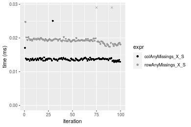

### 10x1000 matrix


```r
> X <- data[["10x1000"]]
> rows <- sample.int(nrow(X), size = nrow(X) * 0.7)
> cols <- sample.int(ncol(X), size = ncol(X) * 0.7)
> X_S <- X[rows, cols]
> gc()
          used  (Mb) gc trigger  (Mb) max used  (Mb)
Ncells 5161689 275.7    8529671 455.6  8529671 455.6
Vcells 9341351  71.3   31876688 243.2 60562128 462.1
> colStats <- microbenchmark(colAnyMissings_X_S = colAnyMissings(X_S), `colAnyMissings(X, rows, cols)` = colAnyMissings(X, 
+     rows = rows, cols = cols), `colAnyMissings(X[rows, cols])` = colAnyMissings(X[rows, cols]), unit = "ms")
> X <- t(X)
> X_S <- t(X_S)
> gc()
          used  (Mb) gc trigger  (Mb) max used  (Mb)
Ncells 5161665 275.7    8529671 455.6  8529671 455.6
Vcells 9351404  71.4   31876688 243.2 60562128 462.1
> rowStats <- microbenchmark(rowAnyMissings_X_S = rowAnyMissings(X_S), `rowAnyMissings(X, cols, rows)` = rowAnyMissings(X, 
+     rows = cols, cols = rows), `rowAnyMissings(X[cols, rows])` = rowAnyMissings(X[cols, rows]), unit = "ms")
```

_Table: Benchmarking of colAnyMissings_X_S(), colAnyMissings(X, rows, cols)() and colAnyMissings(X[rows, cols])() on double+10x1000 data. The top panel shows times in milliseconds and the bottom panel shows relative times._


|   |expr                          |      min|        lq|      mean|    median|        uq|      max|
|:--|:-----------------------------|--------:|---------:|---------:|---------:|---------:|--------:|
|1  |colAnyMissings_X_S            | 0.016341| 0.0178340| 0.0186672| 0.0184625| 0.0188980| 0.046513|
|2  |colAnyMissings(X, rows, cols) | 0.019917| 0.0210530| 0.0221198| 0.0220160| 0.0224810| 0.039709|
|3  |colAnyMissings(X[rows, cols]) | 0.035556| 0.0374405| 0.0385000| 0.0387920| 0.0391845| 0.053957|


|   |expr                          |      min|       lq|     mean|   median|       uq|       max|
|:--|:-----------------------------|--------:|--------:|--------:|--------:|--------:|---------:|
|1  |colAnyMissings_X_S            | 1.000000| 1.000000| 1.000000| 1.000000| 1.000000| 1.0000000|
|2  |colAnyMissings(X, rows, cols) | 1.218836| 1.180498| 1.184957| 1.192471| 1.189597| 0.8537183|
|3  |colAnyMissings(X[rows, cols]) | 2.175877| 2.099389| 2.062445| 2.101124| 2.073473| 1.1600413|

_Table: Benchmarking of rowAnyMissings_X_S(), rowAnyMissings(X, cols, rows)() and rowAnyMissings(X[cols, rows])() on double+10x1000 data (transposed). The top panel shows times in milliseconds and the bottom panel shows relative times._


|   |expr                          |      min|        lq|      mean|   median|       uq|      max|
|:--|:-----------------------------|--------:|---------:|---------:|--------:|--------:|--------:|
|1  |rowAnyMissings_X_S            | 0.019145| 0.0198565| 0.0206390| 0.020370| 0.021120| 0.028078|
|2  |rowAnyMissings(X, cols, rows) | 0.021345| 0.0226535| 0.0239933| 0.023574| 0.024279| 0.061634|
|3  |rowAnyMissings(X[cols, rows]) | 0.034874| 0.0363200| 0.0374831| 0.037167| 0.038499| 0.050534|


|   |expr                          |      min|       lq|     mean|   median|       uq|      max|
|:--|:-----------------------------|--------:|--------:|--------:|--------:|--------:|--------:|
|1  |rowAnyMissings_X_S            | 1.000000| 1.000000| 1.000000| 1.000000| 1.000000| 1.000000|
|2  |rowAnyMissings(X, cols, rows) | 1.114912| 1.140861| 1.162522| 1.157290| 1.149574| 2.195099|
|3  |rowAnyMissings(X[cols, rows]) | 1.821572| 1.829124| 1.816129| 1.824595| 1.822869| 1.799772|

_Figure: Benchmarking of colAnyMissings_X_S(), colAnyMissings(X, rows, cols)() and colAnyMissings(X[rows, cols])() on double+10x1000 data  as well as rowAnyMissings_X_S(), rowAnyMissings(X, cols, rows)() and rowAnyMissings(X[cols, rows])() on the same data transposed.  Outliers are displayed as crosses.  Times are in milliseconds._


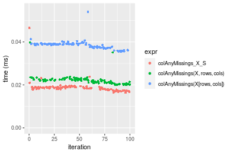

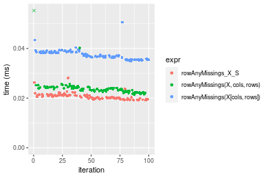
_Table: Benchmarking of colAnyMissings_X_S() and rowAnyMissings_X_S() on double+10x1000 data (original and transposed).  The top panel shows times in milliseconds and the bottom panel shows relative times._


|   |expr               |    min|      lq|     mean|  median|     uq|    max|
|:--|:------------------|------:|-------:|--------:|-------:|------:|------:|
|1  |colAnyMissings_X_S | 16.341| 17.8340| 18.66715| 18.4625| 18.898| 46.513|
|2  |rowAnyMissings_X_S | 19.145| 19.8565| 20.63900| 20.3700| 21.120| 28.078|


|   |expr               |      min|       lq|     mean|   median|       uq|       max|
|:--|:------------------|--------:|--------:|--------:|--------:|--------:|---------:|
|1  |colAnyMissings_X_S | 1.000000| 1.000000| 1.000000| 1.000000| 1.000000| 1.0000000|
|2  |rowAnyMissings_X_S | 1.171593| 1.113407| 1.105632| 1.103317| 1.117579| 0.6036592|

_Figure: Benchmarking of colAnyMissings_X_S() and rowAnyMissings_X_S() on double+10x1000 data (original and transposed).  Outliers are displayed as crosses. Times are in milliseconds._


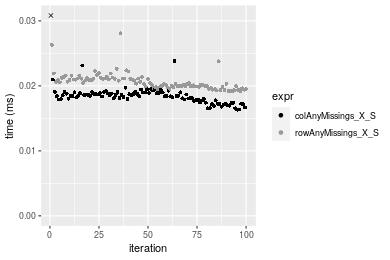

### 100x1000 matrix


```r
> X <- data[["100x1000"]]
> rows <- sample.int(nrow(X), size = nrow(X) * 0.7)
> cols <- sample.int(ncol(X), size = ncol(X) * 0.7)
> X_S <- X[rows, cols]
> gc()
          used  (Mb) gc trigger  (Mb) max used  (Mb)
Ncells 5161900 275.7    8529671 455.6  8529671 455.6
Vcells 9386864  71.7   31876688 243.2 60562128 462.1
> colStats <- microbenchmark(colAnyMissings_X_S = colAnyMissings(X_S), `colAnyMissings(X, rows, cols)` = colAnyMissings(X, 
+     rows = rows, cols = cols), `colAnyMissings(X[rows, cols])` = colAnyMissings(X[rows, cols]), unit = "ms")
> X <- t(X)
> X_S <- t(X_S)
> gc()
          used  (Mb) gc trigger  (Mb) max used  (Mb)
Ncells 5161876 275.7    8529671 455.6  8529671 455.6
Vcells 9486917  72.4   31876688 243.2 60562128 462.1
> rowStats <- microbenchmark(rowAnyMissings_X_S = rowAnyMissings(X_S), `rowAnyMissings(X, cols, rows)` = rowAnyMissings(X, 
+     rows = cols, cols = rows), `rowAnyMissings(X[cols, rows])` = rowAnyMissings(X[cols, rows]), unit = "ms")
```

_Table: Benchmarking of colAnyMissings_X_S(), colAnyMissings(X, rows, cols)() and colAnyMissings(X[rows, cols])() on double+100x1000 data. The top panel shows times in milliseconds and the bottom panel shows relative times._


|   |expr                          |      min|       lq|      mean|    median|        uq|      max|
|:--|:-----------------------------|--------:|--------:|---------:|---------:|---------:|--------:|
|1  |colAnyMissings_X_S            | 0.073336| 0.078950| 0.0860482| 0.0819950| 0.0909950| 0.136407|
|2  |colAnyMissings(X, rows, cols) | 0.081648| 0.087093| 0.0957248| 0.0904085| 0.1028235| 0.204545|
|3  |colAnyMissings(X[rows, cols]) | 0.187117| 0.199815| 0.2178751| 0.2079400| 0.2298140| 0.263287|


|   |expr                          |      min|       lq|     mean|   median|       uq|      max|
|:--|:-----------------------------|--------:|--------:|--------:|--------:|--------:|--------:|
|1  |colAnyMissings_X_S            | 1.000000| 1.000000| 1.000000| 1.000000| 1.000000| 1.000000|
|2  |colAnyMissings(X, rows, cols) | 1.113341| 1.103141| 1.112455| 1.102610| 1.129991| 1.499520|
|3  |colAnyMissings(X[rows, cols]) | 2.551503| 2.530906| 2.532011| 2.536008| 2.525567| 1.930157|

_Table: Benchmarking of rowAnyMissings_X_S(), rowAnyMissings(X, cols, rows)() and rowAnyMissings(X[cols, rows])() on double+100x1000 data (transposed). The top panel shows times in milliseconds and the bottom panel shows relative times._


|   |expr                          |      min|       lq|      mean|    median|        uq|      max|
|:--|:-----------------------------|--------:|--------:|---------:|---------:|---------:|--------:|
|1  |rowAnyMissings_X_S            | 0.089237| 0.100313| 0.1108312| 0.1079435| 0.1195555| 0.166717|
|2  |rowAnyMissings(X, cols, rows) | 0.094051| 0.102488| 0.1126039| 0.1088550| 0.1209705| 0.226227|
|3  |rowAnyMissings(X[cols, rows]) | 0.190255| 0.210242| 0.2330036| 0.2287820| 0.2520205| 0.318517|


|   |expr                          |      min|       lq|     mean|   median|       uq|      max|
|:--|:-----------------------------|--------:|--------:|--------:|--------:|--------:|--------:|
|1  |rowAnyMissings_X_S            | 1.000000| 1.000000| 1.000000| 1.000000| 1.000000| 1.000000|
|2  |rowAnyMissings(X, cols, rows) | 1.053946| 1.021682| 1.015994| 1.008444| 1.011836| 1.356952|
|3  |rowAnyMissings(X[cols, rows]) | 2.132019| 2.095860| 2.102328| 2.119461| 2.107979| 1.910525|

_Figure: Benchmarking of colAnyMissings_X_S(), colAnyMissings(X, rows, cols)() and colAnyMissings(X[rows, cols])() on double+100x1000 data  as well as rowAnyMissings_X_S(), rowAnyMissings(X, cols, rows)() and rowAnyMissings(X[cols, rows])() on the same data transposed.  Outliers are displayed as crosses.  Times are in milliseconds._


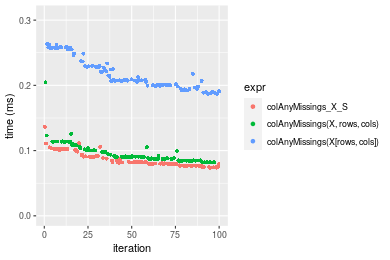

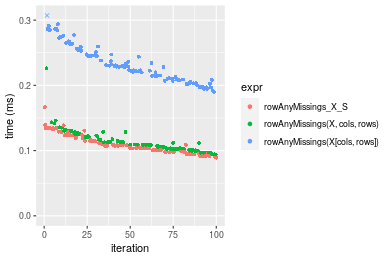
_Table: Benchmarking of colAnyMissings_X_S() and rowAnyMissings_X_S() on double+100x1000 data (original and transposed).  The top panel shows times in milliseconds and the bottom panel shows relative times._


|   |expr               |    min|      lq|      mean|   median|       uq|     max|
|:--|:------------------|------:|-------:|---------:|--------:|--------:|-------:|
|1  |colAnyMissings_X_S | 73.336|  78.950|  86.04824|  81.9950|  90.9950| 136.407|
|2  |rowAnyMissings_X_S | 89.237| 100.313| 110.83122| 107.9435| 119.5555| 166.717|


|   |expr               |      min|       lq|     mean|   median|       uq|      max|
|:--|:------------------|--------:|--------:|--------:|--------:|--------:|--------:|
|1  |colAnyMissings_X_S | 1.000000| 1.000000| 1.000000| 1.000000| 1.000000| 1.000000|
|2  |rowAnyMissings_X_S | 1.216824| 1.270589| 1.288013| 1.316464| 1.313869| 1.222203|

_Figure: Benchmarking of colAnyMissings_X_S() and rowAnyMissings_X_S() on double+100x1000 data (original and transposed).  Outliers are displayed as crosses. Times are in milliseconds._


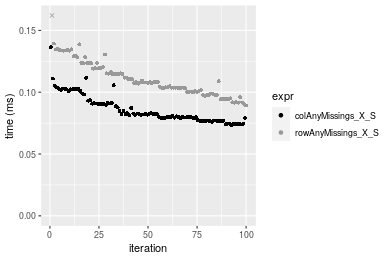

### 1000x100 matrix


```r
> X <- data[["1000x100"]]
> rows <- sample.int(nrow(X), size = nrow(X) * 0.7)
> cols <- sample.int(ncol(X), size = ncol(X) * 0.7)
> X_S <- X[rows, cols]
> gc()
          used  (Mb) gc trigger  (Mb) max used  (Mb)
Ncells 5162110 275.7    8529671 455.6  8529671 455.6
Vcells 9387005  71.7   31876688 243.2 60562128 462.1
> colStats <- microbenchmark(colAnyMissings_X_S = colAnyMissings(X_S), `colAnyMissings(X, rows, cols)` = colAnyMissings(X, 
+     rows = rows, cols = cols), `colAnyMissings(X[rows, cols])` = colAnyMissings(X[rows, cols]), unit = "ms")
> X <- t(X)
> X_S <- t(X_S)
> gc()
          used  (Mb) gc trigger  (Mb) max used  (Mb)
Ncells 5162086 275.7    8529671 455.6  8529671 455.6
Vcells 9487058  72.4   31876688 243.2 60562128 462.1
> rowStats <- microbenchmark(rowAnyMissings_X_S = rowAnyMissings(X_S), `rowAnyMissings(X, cols, rows)` = rowAnyMissings(X, 
+     rows = cols, cols = rows), `rowAnyMissings(X[cols, rows])` = rowAnyMissings(X[cols, rows]), unit = "ms")
```

_Table: Benchmarking of colAnyMissings_X_S(), colAnyMissings(X, rows, cols)() and colAnyMissings(X[rows, cols])() on double+1000x100 data. The top panel shows times in milliseconds and the bottom panel shows relative times._


|   |expr                          |      min|       lq|      mean|   median|        uq|      max|
|:--|:-----------------------------|--------:|--------:|---------:|--------:|---------:|--------:|
|1  |colAnyMissings_X_S            | 0.068125| 0.070902| 0.0776889| 0.073456| 0.0829200| 0.127949|
|2  |colAnyMissings(X, rows, cols) | 0.077436| 0.081009| 0.0905127| 0.087444| 0.0965605| 0.139821|
|3  |colAnyMissings(X[rows, cols]) | 0.181127| 0.190029| 0.2118699| 0.203866| 0.2336380| 0.340141|


|   |expr                          |      min|       lq|     mean|   median|       uq|      max|
|:--|:-----------------------------|--------:|--------:|--------:|--------:|--------:|--------:|
|1  |colAnyMissings_X_S            | 1.000000| 1.000000| 1.000000| 1.000000| 1.000000| 1.000000|
|2  |colAnyMissings(X, rows, cols) | 1.136675| 1.142549| 1.165067| 1.190427| 1.164502| 1.092787|
|3  |colAnyMissings(X[rows, cols]) | 2.658745| 2.680164| 2.727158| 2.775349| 2.817632| 2.658411|

_Table: Benchmarking of rowAnyMissings_X_S(), rowAnyMissings(X, cols, rows)() and rowAnyMissings(X[cols, rows])() on double+1000x100 data (transposed). The top panel shows times in milliseconds and the bottom panel shows relative times._


|   |expr                          |      min|        lq|      mean|    median|        uq|      max|
|:--|:-----------------------------|--------:|---------:|---------:|---------:|---------:|--------:|
|1  |rowAnyMissings_X_S            | 0.093433| 0.1024075| 0.1131587| 0.1093515| 0.1197825| 0.209474|
|2  |rowAnyMissings(X, cols, rows) | 0.093000| 0.1052835| 0.1163487| 0.1120100| 0.1245360| 0.277027|
|3  |rowAnyMissings(X[cols, rows]) | 0.195649| 0.2170510| 0.2428237| 0.2353920| 0.2577630| 0.407847|


|   |expr                          |       min|       lq|     mean|   median|       uq|      max|
|:--|:-----------------------------|---------:|--------:|--------:|--------:|--------:|--------:|
|1  |rowAnyMissings_X_S            | 1.0000000| 1.000000| 1.000000| 1.000000| 1.000000| 1.000000|
|2  |rowAnyMissings(X, cols, rows) | 0.9953657| 1.028084| 1.028190| 1.024312| 1.039684| 1.322489|
|3  |rowAnyMissings(X[cols, rows]) | 2.0940032| 2.119483| 2.145868| 2.152618| 2.151925| 1.947005|

_Figure: Benchmarking of colAnyMissings_X_S(), colAnyMissings(X, rows, cols)() and colAnyMissings(X[rows, cols])() on double+1000x100 data  as well as rowAnyMissings_X_S(), rowAnyMissings(X, cols, rows)() and rowAnyMissings(X[cols, rows])() on the same data transposed.  Outliers are displayed as crosses.  Times are in milliseconds._


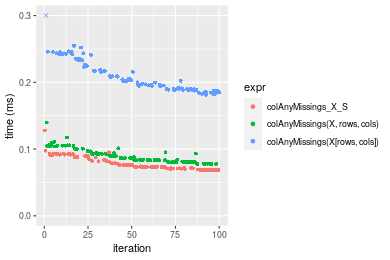

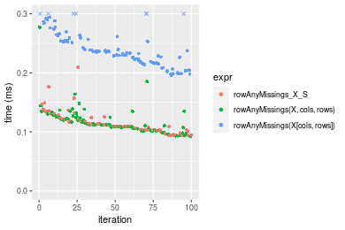
_Table: Benchmarking of colAnyMissings_X_S() and rowAnyMissings_X_S() on double+1000x100 data (original and transposed).  The top panel shows times in milliseconds and the bottom panel shows relative times._


|   |expr               |    min|       lq|      mean|   median|       uq|     max|
|:--|:------------------|------:|--------:|---------:|--------:|--------:|-------:|
|1  |colAnyMissings_X_S | 68.125|  70.9020|  77.68889|  73.4560|  82.9200| 127.949|
|2  |rowAnyMissings_X_S | 93.433| 102.4075| 113.15871| 109.3515| 119.7825| 209.474|


|   |expr               |      min|       lq|     mean|   median|       uq|      max|
|:--|:------------------|--------:|--------:|--------:|--------:|--------:|--------:|
|1  |colAnyMissings_X_S | 1.000000| 1.000000| 1.000000| 1.000000| 1.000000| 1.000000|
|2  |rowAnyMissings_X_S | 1.371494| 1.444353| 1.456562| 1.488667| 1.444555| 1.637168|

_Figure: Benchmarking of colAnyMissings_X_S() and rowAnyMissings_X_S() on double+1000x100 data (original and transposed).  Outliers are displayed as crosses. Times are in milliseconds._


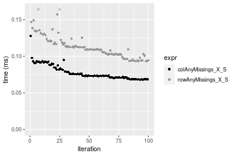


## Appendix

### Session information
```r
R version 4.1.1 Patched (2021-08-10 r80727)
Platform: x86_64-pc-linux-gnu (64-bit)
Running under: Ubuntu 18.04.5 LTS

Matrix products: default
BLAS:   /home/hb/software/R-devel/R-4-1-branch/lib/R/lib/libRblas.so
LAPACK: /home/hb/software/R-devel/R-4-1-branch/lib/R/lib/libRlapack.so

locale:
 [1] LC_CTYPE=en_US.UTF-8       LC_NUMERIC=C              
 [3] LC_TIME=en_US.UTF-8        LC_COLLATE=en_US.UTF-8    
 [5] LC_MONETARY=en_US.UTF-8    LC_MESSAGES=en_US.UTF-8   
 [7] LC_PAPER=en_US.UTF-8       LC_NAME=C                 
 [9] LC_ADDRESS=C               LC_TELEPHONE=C            
[11] LC_MEASUREMENT=en_US.UTF-8 LC_IDENTIFICATION=C       

attached base packages:
[1] stats     graphics  grDevices utils     datasets  methods   base     

other attached packages:
[1] microbenchmark_1.4-7   matrixStats_0.60.1     ggplot2_3.3.5         
[4] knitr_1.33             R.devices_2.17.0       R.utils_2.10.1        
[7] R.oo_1.24.0            R.methodsS3_1.8.1-9001 history_0.0.1-9000    

loaded via a namespace (and not attached):
 [1] Biobase_2.52.0          httr_1.4.2              splines_4.1.1          
 [4] bit64_4.0.5             network_1.17.1          assertthat_0.2.1       
 [7] highr_0.9               stats4_4.1.1            blob_1.2.2             
[10] GenomeInfoDbData_1.2.6  robustbase_0.93-8       pillar_1.6.2           
[13] RSQLite_2.2.8           lattice_0.20-44         glue_1.4.2             
[16] digest_0.6.27           XVector_0.32.0          colorspace_2.0-2       
[19] Matrix_1.3-4            XML_3.99-0.7            pkgconfig_2.0.3        
[22] zlibbioc_1.38.0         genefilter_1.74.0       purrr_0.3.4            
[25] ergm_4.1.2              xtable_1.8-4            scales_1.1.1           
[28] tibble_3.1.4            annotate_1.70.0         KEGGREST_1.32.0        
[31] farver_2.1.0            generics_0.1.0          IRanges_2.26.0         
[34] ellipsis_0.3.2          cachem_1.0.6            withr_2.4.2            
[37] BiocGenerics_0.38.0     mime_0.11               survival_3.2-13        
[40] magrittr_2.0.1          crayon_1.4.1            statnet.common_4.5.0   
[43] memoise_2.0.0           laeken_0.5.1            fansi_0.5.0            
[46] R.cache_0.15.0          MASS_7.3-54             R.rsp_0.44.0           
[49] progressr_0.8.0         tools_4.1.1             lifecycle_1.0.0        
[52] S4Vectors_0.30.0        trust_0.1-8             munsell_0.5.0          
[55] tabby_0.0.1-9001        AnnotationDbi_1.54.1    Biostrings_2.60.2      
[58] compiler_4.1.1          GenomeInfoDb_1.28.1     rlang_0.4.11           
[61] grid_4.1.1              RCurl_1.98-1.4          cwhmisc_6.6            
[64] rappdirs_0.3.3          startup_0.15.0          labeling_0.4.2         
[67] bitops_1.0-7            base64enc_0.1-3         boot_1.3-28            
[70] gtable_0.3.0            DBI_1.1.1               markdown_1.1           
[73] R6_2.5.1                lpSolveAPI_5.5.2.0-17.7 rle_0.9.2              
[76] dplyr_1.0.7             fastmap_1.1.0           bit_4.0.4              
[79] utf8_1.2.2              parallel_4.1.1          Rcpp_1.0.7             
[82] vctrs_0.3.8             png_0.1-7               DEoptimR_1.0-9         
[85] tidyselect_1.1.1        xfun_0.25               coda_0.19-4            
```
Total processing time was 22.17 secs.


### Reproducibility
To reproduce this report, do:
```r
html <- matrixStats:::benchmark('colRowAnyMissings_subset')
```

[RSP]: https://cran.r-project.org/package=R.rsp
[matrixStats]: https://cran.r-project.org/package=matrixStats

[StackOverflow:colMins?]: https://stackoverflow.com/questions/13676878 "Stack Overflow: fastest way to get Min from every column in a matrix?"
[StackOverflow:colSds?]: https://stackoverflow.com/questions/17549762 "Stack Overflow: Is there such 'colsd' in R?"
[StackOverflow:rowProds?]: https://stackoverflow.com/questions/20198801/ "Stack Overflow: Row product of matrix and column sum of matrix"

---------------------------------------
Copyright Dongcan Jiang. Last updated on 2021-08-25 18:50:12 (+0200 UTC). Powered by [RSP].

<script>
 var link = document.createElement('link');
 link.rel = 'icon';
 link.href = "data:image/png;base64,iVBORw0KGgoAAAANSUhEUgAAACAAAAAgCAMAAABEpIrGAAAA21BMVEUAAAAAAP8AAP8AAP8AAP8AAP8AAP8AAP8AAP8AAP8AAP8AAP8AAP8AAP8AAP8AAP8AAP8AAP8AAP8AAP8AAP8AAP8AAP8AAP8AAP8AAP8AAP8AAP8AAP8AAP8AAP8AAP8AAP8AAP8AAP8AAP8AAP8AAP8AAP8AAP8AAP8AAP8BAf4CAv0DA/wdHeIeHuEfH+AgIN8hId4lJdomJtknJ9g+PsE/P8BAQL9yco10dIt1dYp3d4h4eIeVlWqWlmmXl2iYmGeZmWabm2Tn5xjo6Bfp6Rb39wj4+Af//wA2M9hbAAAASXRSTlMAAQIJCgsMJSYnKD4/QGRlZmhpamtsbautrrCxuru8y8zN5ebn6Pn6+///////////////////////////////////////////LsUNcQAAAS9JREFUOI29k21XgkAQhVcFytdSMqMETU26UVqGmpaiFbL//xc1cAhhwVNf6n5i5z67M2dmYOyfJZUqlVLhkKucG7cgmUZTybDz6g0iDeq51PUr37Ds2cy2/C9NeES5puDjxuUk1xnToZsg8pfA3avHQ3lLIi7iWRrkv/OYtkScxBIMgDee0ALoyxHQBJ68JLCjOtQIMIANF7QG9G9fNnHvisCHBVMKgSJgiz7nE+AoBKrAPA3MgepvgR9TSCasrCKH0eB1wBGBFdCO+nAGjMVGPcQb5bd6mQRegN6+1axOs9nGfYcCtfi4NQosdtH7dB+txFIpXQqN1p9B/asRHToyS0jRgpV7nk4nwcq1BJ+x3Gl/v7S9Wmpp/aGquum7w3ZDyrADFYrl8vHBH+ev9AUASW1dmU4h4wAAAABJRU5ErkJggg=="
 document.getElementsByTagName('head')[0].appendChild(link);
</script>


