[matrixStats]: Benchmark report

---------------------------------------


# colAnys() and rowAnys() benchmarks

This report benchmark the performance of colAnys() and rowAnys() against alternative methods.

## Alternative methods

* apply() + any()
* colSums() > 0 or rowSums() > 0


## Data
```r
> rmatrix <- function(nrow, ncol, mode = c("logical", "double", "integer", "index"), range = c(-100, 
+     +100), na_prob = 0) {
+     mode <- match.arg(mode)
+     n <- nrow * ncol
+     if (mode == "logical") {
+         x <- sample(c(FALSE, TRUE), size = n, replace = TRUE)
+     }     else if (mode == "index") {
+         x <- seq_len(n)
+         mode <- "integer"
+     }     else {
+         x <- runif(n, min = range[1], max = range[2])
+     }
+     storage.mode(x) <- mode
+     if (na_prob > 0) 
+         x[sample(n, size = na_prob * n)] <- NA
+     dim(x) <- c(nrow, ncol)
+     x
+ }
> rmatrices <- function(scale = 10, seed = 1, ...) {
+     set.seed(seed)
+     data <- list()
+     data[[1]] <- rmatrix(nrow = scale * 1, ncol = scale * 1, ...)
+     data[[2]] <- rmatrix(nrow = scale * 10, ncol = scale * 10, ...)
+     data[[3]] <- rmatrix(nrow = scale * 100, ncol = scale * 1, ...)
+     data[[4]] <- t(data[[3]])
+     data[[5]] <- rmatrix(nrow = scale * 10, ncol = scale * 100, ...)
+     data[[6]] <- t(data[[5]])
+     names(data) <- sapply(data, FUN = function(x) paste(dim(x), collapse = "x"))
+     data
+ }
> data <- rmatrices(mode = "logical")
```

## Results

### 10x10 matrix


```r
> X <- data[["10x10"]]
> gc()
          used  (Mb) gc trigger  (Mb) max used  (Mb)
Ncells 5179746 276.7    8529671 455.6  8529671 455.6
Vcells 9512341  72.6   31876688 243.2 60562128 462.1
> colStats <- microbenchmark(colAnys = colAnys(X), `apply+any` = apply(X, MARGIN = 2L, FUN = any), 
+     `colSums > 0` = (colSums(X) > 0L), unit = "ms")
> X <- t(X)
> gc()
          used  (Mb) gc trigger  (Mb) max used  (Mb)
Ncells 5171145 276.2    8529671 455.6  8529671 455.6
Vcells 9484279  72.4   31876688 243.2 60562128 462.1
> rowStats <- microbenchmark(rowAnys = rowAnys(X), `apply+any` = apply(X, MARGIN = 1L, FUN = any), 
+     `rowSums > 0` = (rowSums(X) > 0L), unit = "ms")
```

_Table: Benchmarking of colAnys(), apply+any() and colSums > 0() on 10x10 data. The top panel shows times in milliseconds and the bottom panel shows relative times._


|   |expr        |      min|        lq|      mean|    median|        uq|      max|
|:--|:-----------|--------:|---------:|---------:|---------:|---------:|--------:|
|1  |colAnys     | 0.003369| 0.0037380| 0.0045488| 0.0046250| 0.0048980| 0.019739|
|3  |colSums > 0 | 0.006011| 0.0063950| 0.0076344| 0.0072150| 0.0077430| 0.036104|
|2  |apply+any   | 0.033466| 0.0343405| 0.0360280| 0.0350695| 0.0358385| 0.081195|


|   |expr        |      min|       lq|     mean|   median|       uq|      max|
|:--|:-----------|--------:|--------:|--------:|--------:|--------:|--------:|
|1  |colAnys     | 1.000000| 1.000000| 1.000000| 1.000000| 1.000000| 1.000000|
|3  |colSums > 0 | 1.784209| 1.710808| 1.678334| 1.560000| 1.580849| 1.829069|
|2  |apply+any   | 9.933511| 9.186865| 7.920285| 7.582595| 7.316966| 4.113430|

_Table: Benchmarking of rowAnys(), apply+any() and rowSums > 0() on 10x10 data (transposed). The top panel shows times in milliseconds and the bottom panel shows relative times._


|   |expr        |      min|        lq|      mean|    median|        uq|      max|
|:--|:-----------|--------:|---------:|---------:|---------:|---------:|--------:|
|1  |rowAnys     | 0.003514| 0.0038390| 0.0047763| 0.0049670| 0.0052155| 0.018834|
|3  |rowSums > 0 | 0.006739| 0.0070855| 0.0079660| 0.0076285| 0.0082740| 0.029251|
|2  |apply+any   | 0.033386| 0.0343190| 0.0356151| 0.0348535| 0.0355940| 0.081946|


|   |expr        |      min|       lq|     mean|   median|       uq|      max|
|:--|:-----------|--------:|--------:|--------:|--------:|--------:|--------:|
|1  |rowAnys     | 1.000000| 1.000000| 1.000000| 1.000000| 1.000000| 1.000000|
|3  |rowSums > 0 | 1.917758| 1.845663| 1.667837| 1.535837| 1.586425| 1.553095|
|2  |apply+any   | 9.500854| 8.939568| 7.456670| 7.017012| 6.824657| 4.350961|

_Figure: Benchmarking of colAnys(), apply+any() and colSums > 0() on 10x10 data  as well as rowAnys(), apply+any() and rowSums > 0() on the same data transposed.  Outliers are displayed as crosses.  Times are in milliseconds._


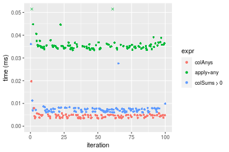

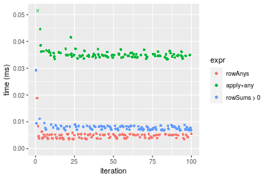
_Table: Benchmarking of colAnys() and rowAnys() on 10x10 data (original and transposed).  The top panel shows times in milliseconds and the bottom panel shows relative times._


|   |expr    |   min|    lq|    mean| median|     uq|    max|
|:--|:-------|-----:|-----:|-------:|------:|------:|------:|
|1  |colAnys | 3.369| 3.738| 4.54882|  4.625| 4.8980| 19.739|
|2  |rowAnys | 3.514| 3.839| 4.77627|  4.967| 5.2155| 18.834|


|   |expr    |      min|      lq|     mean|   median|       uq|       max|
|:--|:-------|--------:|-------:|--------:|--------:|--------:|---------:|
|1  |colAnys | 1.000000| 1.00000| 1.000000| 1.000000| 1.000000| 1.0000000|
|2  |rowAnys | 1.043039| 1.02702| 1.050002| 1.073946| 1.064822| 0.9541517|

_Figure: Benchmarking of colAnys() and rowAnys() on 10x10 data (original and transposed).  Outliers are displayed as crosses. Times are in milliseconds._


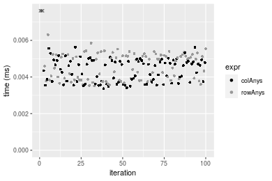

### 100x100 matrix


```r
> X <- data[["100x100"]]
> gc()
          used  (Mb) gc trigger  (Mb) max used  (Mb)
Ncells 5169723 276.1    8529671 455.6  8529671 455.6
Vcells 9290506  70.9   31876688 243.2 60562128 462.1
> colStats <- microbenchmark(colAnys = colAnys(X), `apply+any` = apply(X, MARGIN = 2L, FUN = any), 
+     `colSums > 0` = (colSums(X) > 0L), unit = "ms")
> X <- t(X)
> gc()
          used  (Mb) gc trigger  (Mb) max used  (Mb)
Ncells 5169699 276.1    8529671 455.6  8529671 455.6
Vcells 9295519  71.0   31876688 243.2 60562128 462.1
> rowStats <- microbenchmark(rowAnys = rowAnys(X), `apply+any` = apply(X, MARGIN = 1L, FUN = any), 
+     `rowSums > 0` = (rowSums(X) > 0L), unit = "ms")
```

_Table: Benchmarking of colAnys(), apply+any() and colSums > 0() on 100x100 data. The top panel shows times in milliseconds and the bottom panel shows relative times._


|   |expr        |      min|        lq|      mean|    median|        uq|      max|
|:--|:-----------|--------:|---------:|---------:|---------:|---------:|--------:|
|1  |colAnys     | 0.003781| 0.0046570| 0.0058371| 0.0055565| 0.0061375| 0.027023|
|3  |colSums > 0 | 0.015332| 0.0170265| 0.0188621| 0.0180650| 0.0200460| 0.041649|
|2  |apply+any   | 0.198164| 0.2068690| 0.2289510| 0.2231090| 0.2528385| 0.328815|


|   |expr        |       min|        lq|      mean|    median|        uq|       max|
|:--|:-----------|---------:|---------:|---------:|---------:|---------:|---------:|
|1  |colAnys     |  1.000000|  1.000000|  1.000000|  1.000000|  1.000000|  1.000000|
|3  |colSums > 0 |  4.055012|  3.656109|  3.231403|  3.251147|  3.266151|  1.541243|
|2  |apply+any   | 52.410473| 44.421087| 39.223278| 40.152794| 41.195682| 12.167968|

_Table: Benchmarking of rowAnys(), apply+any() and rowSums > 0() on 100x100 data (transposed). The top panel shows times in milliseconds and the bottom panel shows relative times._


|   |expr        |      min|       lq|      mean|    median|        uq|      max|
|:--|:-----------|--------:|--------:|---------:|---------:|---------:|--------:|
|1  |rowAnys     | 0.010892| 0.012502| 0.0140718| 0.0134200| 0.0150110| 0.032720|
|3  |rowSums > 0 | 0.044789| 0.047577| 0.0527260| 0.0512480| 0.0580985| 0.082739|
|2  |apply+any   | 0.188202| 0.196207| 0.2221017| 0.2157725| 0.2457590| 0.327130|


|   |expr        |       min|        lq|      mean|    median|        uq|      max|
|:--|:-----------|---------:|---------:|---------:|---------:|---------:|--------:|
|1  |rowAnys     |  1.000000|  1.000000|  1.000000|  1.000000|  1.000000| 1.000000|
|3  |rowSums > 0 |  4.112101|  3.805551|  3.746918|  3.818778|  3.870395| 2.528698|
|2  |apply+any   | 17.278920| 15.694049| 15.783439| 16.078428| 16.371927| 9.997861|

_Figure: Benchmarking of colAnys(), apply+any() and colSums > 0() on 100x100 data  as well as rowAnys(), apply+any() and rowSums > 0() on the same data transposed.  Outliers are displayed as crosses.  Times are in milliseconds._


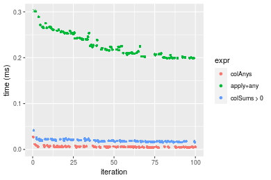

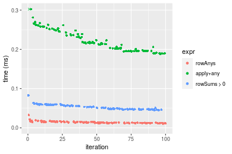
_Table: Benchmarking of colAnys() and rowAnys() on 100x100 data (original and transposed).  The top panel shows times in milliseconds and the bottom panel shows relative times._


|   |expr    |    min|     lq|     mean|  median|      uq|    max|
|:--|:-------|------:|------:|--------:|-------:|-------:|------:|
|1  |colAnys |  3.781|  4.657|  5.83712|  5.5565|  6.1375| 27.023|
|2  |rowAnys | 10.892| 12.502| 14.07182| 13.4200| 15.0110| 32.720|


|   |expr    |      min|       lq|     mean|   median|       uq|     max|
|:--|:-------|--------:|--------:|--------:|--------:|--------:|-------:|
|1  |colAnys | 1.000000| 1.000000| 1.000000| 1.000000| 1.000000| 1.00000|
|2  |rowAnys | 2.880719| 2.684561| 2.410747| 2.415189| 2.445784| 1.21082|

_Figure: Benchmarking of colAnys() and rowAnys() on 100x100 data (original and transposed).  Outliers are displayed as crosses. Times are in milliseconds._


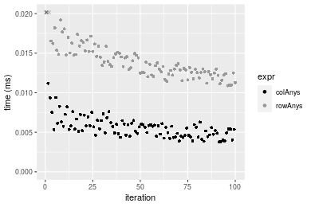

### 1000x10 matrix


```r
> X <- data[["1000x10"]]
> gc()
          used  (Mb) gc trigger  (Mb) max used  (Mb)
Ncells 5170455 276.2    8529671 455.6  8529671 455.6
Vcells 9294000  71.0   31876688 243.2 60562128 462.1
> colStats <- microbenchmark(colAnys = colAnys(X), `apply+any` = apply(X, MARGIN = 2L, FUN = any), 
+     `colSums > 0` = (colSums(X) > 0L), unit = "ms")
> X <- t(X)
> gc()
          used  (Mb) gc trigger  (Mb) max used  (Mb)
Ncells 5170449 276.2    8529671 455.6  8529671 455.6
Vcells 9299043  71.0   31876688 243.2 60562128 462.1
> rowStats <- microbenchmark(rowAnys = rowAnys(X), `apply+any` = apply(X, MARGIN = 1L, FUN = any), 
+     `rowSums > 0` = (rowSums(X) > 0L), unit = "ms")
```

_Table: Benchmarking of colAnys(), apply+any() and colSums > 0() on 1000x10 data. The top panel shows times in milliseconds and the bottom panel shows relative times._


|   |expr        |      min|        lq|      mean|    median|        uq|      max|
|:--|:-----------|--------:|---------:|---------:|---------:|---------:|--------:|
|1  |colAnys     | 0.003171| 0.0038475| 0.0048026| 0.0045420| 0.0050840| 0.018961|
|3  |colSums > 0 | 0.017068| 0.0187995| 0.0199878| 0.0196230| 0.0207900| 0.035880|
|2  |apply+any   | 0.110909| 0.1163095| 0.1237920| 0.1261835| 0.1293025| 0.192247|


|   |expr        |       min|       lq|      mean|    median|       uq|       max|
|:--|:-----------|---------:|--------:|---------:|---------:|--------:|---------:|
|1  |colAnys     |  1.000000|  1.00000|  1.000000|  1.000000|  1.00000|  1.000000|
|3  |colSums > 0 |  5.382529|  4.88616|  4.161841|  4.320343|  4.08930|  1.892305|
|2  |apply+any   | 34.976033| 30.22989| 25.775869| 27.781484| 25.43322| 10.139075|

_Table: Benchmarking of rowAnys(), apply+any() and rowSums > 0() on 1000x10 data (transposed). The top panel shows times in milliseconds and the bottom panel shows relative times._


|   |expr        |      min|        lq|      mean|    median|        uq|      max|
|:--|:-----------|--------:|---------:|---------:|---------:|---------:|--------:|
|1  |rowAnys     | 0.011827| 0.0140215| 0.0160236| 0.0152930| 0.0170775| 0.030842|
|2  |apply+any   | 0.097301| 0.1010985| 0.1194628| 0.1143040| 0.1299365| 0.195430|
|3  |rowSums > 0 | 0.167845| 0.1742380| 0.1923458| 0.1928465| 0.2093100| 0.230652|


|   |expr        |       min|        lq|      mean|    median|        uq|      max|
|:--|:-----------|---------:|---------:|---------:|---------:|---------:|--------:|
|1  |rowAnys     |  1.000000|  1.000000|  1.000000|  1.000000|  1.000000| 1.000000|
|2  |apply+any   |  8.227023|  7.210248|  7.455427|  7.474269|  7.608637| 6.336489|
|3  |rowSums > 0 | 14.191680| 12.426488| 12.003899| 12.610116| 12.256478| 7.478503|

_Figure: Benchmarking of colAnys(), apply+any() and colSums > 0() on 1000x10 data  as well as rowAnys(), apply+any() and rowSums > 0() on the same data transposed.  Outliers are displayed as crosses.  Times are in milliseconds._


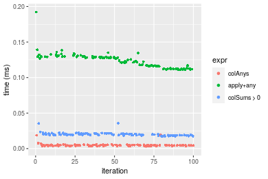

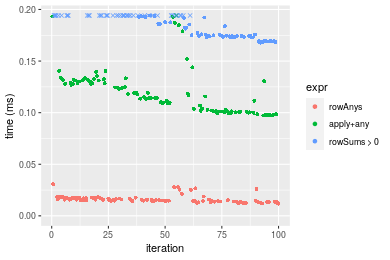
_Table: Benchmarking of colAnys() and rowAnys() on 1000x10 data (original and transposed).  The top panel shows times in milliseconds and the bottom panel shows relative times._


|   |expr    |    min|      lq|     mean| median|      uq|    max|
|:--|:-------|------:|-------:|--------:|------:|-------:|------:|
|1  |colAnys |  3.171|  3.8475|  4.80263|  4.542|  5.0840| 18.961|
|2  |rowAnys | 11.827| 14.0215| 16.02361| 15.293| 17.0775| 30.842|


|   |expr    |      min|       lq|     mean|   median|       uq|      max|
|:--|:-------|--------:|--------:|--------:|--------:|--------:|--------:|
|1  |colAnys | 1.000000| 1.000000| 1.000000| 1.000000| 1.000000| 1.000000|
|2  |rowAnys | 3.729738| 3.644315| 3.336424| 3.367019| 3.359068| 1.626602|

_Figure: Benchmarking of colAnys() and rowAnys() on 1000x10 data (original and transposed).  Outliers are displayed as crosses. Times are in milliseconds._


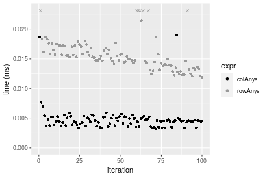

### 10x1000 matrix


```r
> X <- data[["10x1000"]]
> gc()
          used  (Mb) gc trigger  (Mb) max used  (Mb)
Ncells 5170687 276.2    8529671 455.6  8529671 455.6
Vcells 9294767  71.0   31876688 243.2 60562128 462.1
> colStats <- microbenchmark(colAnys = colAnys(X), `apply+any` = apply(X, MARGIN = 2L, FUN = any), 
+     `colSums > 0` = (colSums(X) > 0L), unit = "ms")
> X <- t(X)
> gc()
          used  (Mb) gc trigger  (Mb) max used  (Mb)
Ncells 5170663 276.2    8529671 455.6  8529671 455.6
Vcells 9299780  71.0   31876688 243.2 60562128 462.1
> rowStats <- microbenchmark(rowAnys = rowAnys(X), `apply+any` = apply(X, MARGIN = 1L, FUN = any), 
+     `rowSums > 0` = (rowSums(X) > 0L), unit = "ms")
```

_Table: Benchmarking of colAnys(), apply+any() and colSums > 0() on 10x1000 data. The top panel shows times in milliseconds and the bottom panel shows relative times._


|   |expr        |      min|        lq|      mean|    median|        uq|      max|
|:--|:-----------|--------:|---------:|---------:|---------:|---------:|--------:|
|3  |colSums > 0 | 0.013500| 0.0148425| 0.0169421| 0.0157770| 0.0177990| 0.038084|
|1  |colAnys     | 0.015037| 0.0169750| 0.0196664| 0.0184330| 0.0205435| 0.043810|
|2  |apply+any   | 0.863858| 0.9135615| 1.0252330| 0.9707885| 1.0985930| 1.429867|


|   |expr        |       min|        lq|     mean|    median|        uq|       max|
|:--|:-----------|---------:|---------:|--------:|---------:|---------:|---------:|
|3  |colSums > 0 |  1.000000|  1.000000|  1.00000|  1.000000|  1.000000|  1.000000|
|1  |colAnys     |  1.113852|  1.143675|  1.16080|  1.168346|  1.154194|  1.150352|
|2  |apply+any   | 63.989481| 61.550379| 60.51389| 61.531882| 61.722175| 37.545085|

_Table: Benchmarking of rowAnys(), apply+any() and rowSums > 0() on 10x1000 data (transposed). The top panel shows times in milliseconds and the bottom panel shows relative times._


|   |expr        |      min|        lq|      mean|   median|       uq|      max|
|:--|:-----------|--------:|---------:|---------:|--------:|--------:|--------:|
|1  |rowAnys     | 0.025629| 0.0292995| 0.0344592| 0.031665| 0.038367| 0.073215|
|3  |rowSums > 0 | 0.028577| 0.0308205| 0.0357424| 0.032762| 0.038074| 0.067021|
|2  |apply+any   | 0.870325| 0.9096820| 1.0249298| 0.947311| 1.108584| 1.530552|


|   |expr        |       min|        lq|      mean|    median|         uq|        max|
|:--|:-----------|---------:|---------:|---------:|---------:|----------:|----------:|
|1  |rowAnys     |  1.000000|  1.000000|  1.000000|  1.000000|  1.0000000|  1.0000000|
|3  |rowSums > 0 |  1.115026|  1.051912|  1.037236|  1.034644|  0.9923632|  0.9153998|
|2  |apply+any   | 33.958602| 31.047697| 29.743259| 29.916659| 28.8942060| 20.9048965|

_Figure: Benchmarking of colAnys(), apply+any() and colSums > 0() on 10x1000 data  as well as rowAnys(), apply+any() and rowSums > 0() on the same data transposed.  Outliers are displayed as crosses.  Times are in milliseconds._


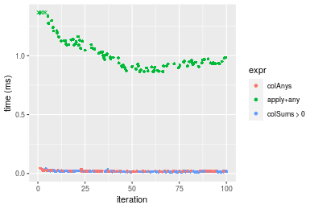

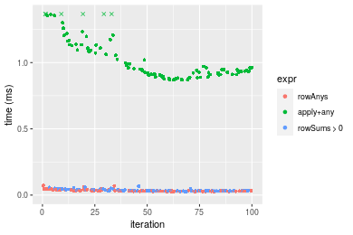
_Table: Benchmarking of colAnys() and rowAnys() on 10x1000 data (original and transposed).  The top panel shows times in milliseconds and the bottom panel shows relative times._


|   |expr    |    min|      lq|     mean| median|      uq|    max|
|:--|:-------|------:|-------:|--------:|------:|-------:|------:|
|1  |colAnys | 15.037| 16.9750| 19.66641| 18.433| 20.5435| 43.810|
|2  |rowAnys | 25.629| 29.2995| 34.45923| 31.665| 38.3670| 73.215|


|   |expr    |      min|       lq|     mean|   median|       uq|      max|
|:--|:-------|--------:|--------:|--------:|--------:|--------:|--------:|
|1  |colAnys | 1.000000| 1.000000| 1.000000| 1.000000| 1.000000| 1.000000|
|2  |rowAnys | 1.704396| 1.726038| 1.752187| 1.717843| 1.867598| 1.671194|

_Figure: Benchmarking of colAnys() and rowAnys() on 10x1000 data (original and transposed).  Outliers are displayed as crosses. Times are in milliseconds._


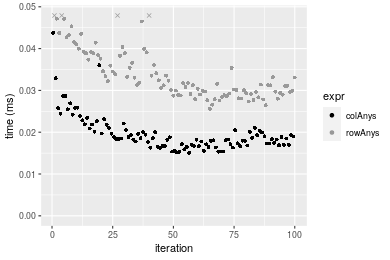

### 100x1000 matrix


```r
> X <- data[["100x1000"]]
> gc()
          used  (Mb) gc trigger  (Mb) max used  (Mb)
Ncells 5170877 276.2    8529671 455.6  8529671 455.6
Vcells 9295254  71.0   31876688 243.2 60562128 462.1
> colStats <- microbenchmark(colAnys = colAnys(X), `apply+any` = apply(X, MARGIN = 2L, FUN = any), 
+     `colSums > 0` = (colSums(X) > 0L), unit = "ms")
> X <- t(X)
> gc()
          used  (Mb) gc trigger  (Mb) max used  (Mb)
Ncells 5170865 276.2    8529671 455.6  8529671 455.6
Vcells 9345287  71.3   31876688 243.2 60562128 462.1
> rowStats <- microbenchmark(rowAnys = rowAnys(X), `apply+any` = apply(X, MARGIN = 1L, FUN = any), 
+     `rowSums > 0` = (rowSums(X) > 0L), unit = "ms")
```

_Table: Benchmarking of colAnys(), apply+any() and colSums > 0() on 100x1000 data. The top panel shows times in milliseconds and the bottom panel shows relative times._


|   |expr        |      min|        lq|      mean|    median|       uq|      max|
|:--|:-----------|--------:|---------:|---------:|---------:|--------:|--------:|
|1  |colAnys     | 0.016351| 0.0184375| 0.0205998| 0.0196440| 0.021219| 0.044673|
|3  |colSums > 0 | 0.081160| 0.0879225| 0.0936510| 0.0907155| 0.094624| 0.143238|
|2  |apply+any   | 1.371886| 1.4840435| 1.5837545| 1.5252055| 1.567319| 2.514333|


|   |expr        |       min|        lq|      mean|    median|       uq|       max|
|:--|:-----------|---------:|---------:|---------:|---------:|--------:|---------:|
|1  |colAnys     |  1.000000|  1.000000|  1.000000|  1.000000|  1.00000|  1.000000|
|3  |colSums > 0 |  4.963611|  4.768678|  4.546215|  4.617975|  4.45940|  3.206366|
|2  |apply+any   | 83.902269| 80.490495| 76.882146| 77.642308| 73.86394| 56.283057|

_Table: Benchmarking of rowAnys(), apply+any() and rowSums > 0() on 100x1000 data (transposed). The top panel shows times in milliseconds and the bottom panel shows relative times._


|   |expr        |      min|        lq|      mean|   median|       uq|      max|
|:--|:-----------|--------:|---------:|---------:|--------:|--------:|--------:|
|1  |rowAnys     | 0.072548| 0.0807825| 0.0865152| 0.082799| 0.087472| 0.152590|
|3  |rowSums > 0 | 0.230758| 0.2500765| 0.2709630| 0.253867| 0.277809| 0.395284|
|2  |apply+any   | 1.374199| 1.4937530| 1.5805760| 1.531343| 1.588420| 2.482158|


|   |expr        |       min|        lq|     mean|    median|        uq|       max|
|:--|:-----------|---------:|---------:|--------:|---------:|---------:|---------:|
|1  |rowAnys     |  1.000000|  1.000000|  1.00000|  1.000000|  1.000000|  1.000000|
|3  |rowSums > 0 |  3.180763|  3.095677|  3.13197|  3.066064|  3.175976|  2.590497|
|2  |apply+any   | 18.941928| 18.491047| 18.26934| 18.494704| 18.159177| 16.266846|

_Figure: Benchmarking of colAnys(), apply+any() and colSums > 0() on 100x1000 data  as well as rowAnys(), apply+any() and rowSums > 0() on the same data transposed.  Outliers are displayed as crosses.  Times are in milliseconds._


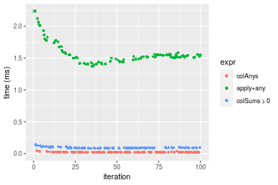

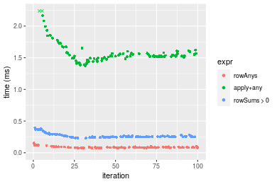
_Table: Benchmarking of colAnys() and rowAnys() on 100x1000 data (original and transposed).  The top panel shows times in milliseconds and the bottom panel shows relative times._


|   |expr    |    min|      lq|     mean| median|     uq|     max|
|:--|:-------|------:|-------:|--------:|------:|------:|-------:|
|1  |colAnys | 16.351| 18.4375| 20.59977| 19.644| 21.219|  44.673|
|2  |rowAnys | 72.548| 80.7825| 86.51521| 82.799| 87.472| 152.590|


|   |expr    |      min|       lq|     mean|   median|       uq|     max|
|:--|:-------|--------:|--------:|--------:|--------:|--------:|-------:|
|1  |colAnys | 1.000000| 1.000000| 1.000000| 1.000000| 1.000000| 1.00000|
|2  |rowAnys | 4.436915| 4.381424| 4.199814| 4.214977| 4.122343| 3.41571|

_Figure: Benchmarking of colAnys() and rowAnys() on 100x1000 data (original and transposed).  Outliers are displayed as crosses. Times are in milliseconds._


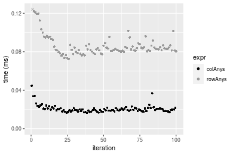

### 1000x100 matrix


```r
> X <- data[["1000x100"]]
> gc()
          used  (Mb) gc trigger  (Mb) max used  (Mb)
Ncells 5171083 276.2    8529671 455.6  8529671 455.6
Vcells 9295919  71.0   31876688 243.2 60562128 462.1
> colStats <- microbenchmark(colAnys = colAnys(X), `apply+any` = apply(X, MARGIN = 2L, FUN = any), 
+     `colSums > 0` = (colSums(X) > 0L), unit = "ms")
> X <- t(X)
> gc()
          used  (Mb) gc trigger  (Mb) max used  (Mb)
Ncells 5171071 276.2    8529671 455.6  8529671 455.6
Vcells 9345952  71.4   31876688 243.2 60562128 462.1
> rowStats <- microbenchmark(rowAnys = rowAnys(X), `apply+any` = apply(X, MARGIN = 1L, FUN = any), 
+     `rowSums > 0` = (rowSums(X) > 0L), unit = "ms")
```

_Table: Benchmarking of colAnys(), apply+any() and colSums > 0() on 1000x100 data. The top panel shows times in milliseconds and the bottom panel shows relative times._


|   |expr        |      min|        lq|      mean|    median|        uq|      max|
|:--|:-----------|--------:|---------:|---------:|---------:|---------:|--------:|
|1  |colAnys     | 0.003413| 0.0045435| 0.0060280| 0.0054805| 0.0067385| 0.030601|
|3  |colSums > 0 | 0.082798| 0.0877285| 0.1015405| 0.0931570| 0.1120050| 0.165285|
|2  |apply+any   | 0.634206| 0.6663190| 0.7640796| 0.7152840| 0.8382390| 1.114133|


|   |expr        |      min|        lq|      mean|   median|        uq|       max|
|:--|:-----------|--------:|---------:|---------:|--------:|---------:|---------:|
|1  |colAnys     |   1.0000|   1.00000|   1.00000|   1.0000|   1.00000|  1.000000|
|3  |colSums > 0 |  24.2596|  19.30857|  16.84487|  16.9979|  16.62165|  5.401294|
|2  |apply+any   | 185.8207| 146.65324| 126.75549| 130.5144| 124.39549| 36.408385|

_Table: Benchmarking of rowAnys(), apply+any() and rowSums > 0() on 1000x100 data (transposed). The top panel shows times in milliseconds and the bottom panel shows relative times._


|   |expr        |      min|        lq|      mean|    median|        uq|      max|
|:--|:-----------|--------:|---------:|---------:|---------:|---------:|--------:|
|1  |rowAnys     | 0.060689| 0.0652140| 0.0730753| 0.0679255| 0.0793035| 0.116305|
|3  |rowSums > 0 | 0.324218| 0.3425475| 0.3810645| 0.3611855| 0.4070895| 0.537751|
|2  |apply+any   | 0.641484| 0.6636305| 0.7398351| 0.6933770| 0.7514955| 1.161896|


|   |expr        |       min|        lq|     mean|    median|       uq|      max|
|:--|:-----------|---------:|---------:|--------:|---------:|--------:|--------:|
|1  |rowAnys     |  1.000000|  1.000000|  1.00000|  1.000000| 1.000000| 1.000000|
|3  |rowSums > 0 |  5.342286|  5.252668|  5.21468|  5.317377| 5.133311| 4.623627|
|2  |apply+any   | 10.570021| 10.176197| 10.12428| 10.207904| 9.476196| 9.990078|

_Figure: Benchmarking of colAnys(), apply+any() and colSums > 0() on 1000x100 data  as well as rowAnys(), apply+any() and rowSums > 0() on the same data transposed.  Outliers are displayed as crosses.  Times are in milliseconds._


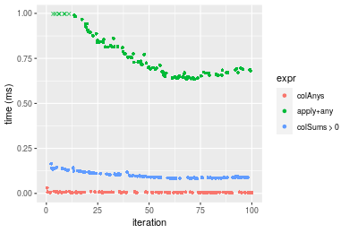

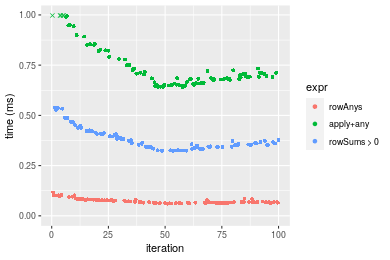
_Table: Benchmarking of colAnys() and rowAnys() on 1000x100 data (original and transposed).  The top panel shows times in milliseconds and the bottom panel shows relative times._


|   |expr    |    min|      lq|     mean|  median|      uq|     max|
|:--|:-------|------:|-------:|--------:|-------:|-------:|-------:|
|1  |colAnys |  3.413|  4.5435|  6.02798|  5.4805|  6.7385|  30.601|
|2  |rowAnys | 60.689| 65.2140| 73.07533| 67.9255| 79.3035| 116.305|


|   |expr    |      min|       lq|     mean|   median|       uq|      max|
|:--|:-------|--------:|--------:|--------:|--------:|--------:|--------:|
|1  |colAnys |  1.00000|  1.00000|  1.00000|  1.00000|  1.00000| 1.000000|
|2  |rowAnys | 17.78172| 14.35325| 12.12269| 12.39403| 11.76872| 3.800693|

_Figure: Benchmarking of colAnys() and rowAnys() on 1000x100 data (original and transposed).  Outliers are displayed as crosses. Times are in milliseconds._


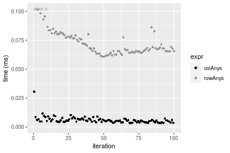


## Appendix

### Session information
```r
R version 4.1.1 Patched (2021-08-10 r80727)
Platform: x86_64-pc-linux-gnu (64-bit)
Running under: Ubuntu 18.04.5 LTS

Matrix products: default
BLAS:   /home/hb/software/R-devel/R-4-1-branch/lib/R/lib/libRblas.so
LAPACK: /home/hb/software/R-devel/R-4-1-branch/lib/R/lib/libRlapack.so

locale:
 [1] LC_CTYPE=en_US.UTF-8       LC_NUMERIC=C              
 [3] LC_TIME=en_US.UTF-8        LC_COLLATE=en_US.UTF-8    
 [5] LC_MONETARY=en_US.UTF-8    LC_MESSAGES=en_US.UTF-8   
 [7] LC_PAPER=en_US.UTF-8       LC_NAME=C                 
 [9] LC_ADDRESS=C               LC_TELEPHONE=C            
[11] LC_MEASUREMENT=en_US.UTF-8 LC_IDENTIFICATION=C       

attached base packages:
[1] stats     graphics  grDevices utils     datasets  methods   base     

other attached packages:
[1] microbenchmark_1.4-7   matrixStats_0.60.1     ggplot2_3.3.5         
[4] knitr_1.33             R.devices_2.17.0       R.utils_2.10.1        
[7] R.oo_1.24.0            R.methodsS3_1.8.1-9001 history_0.0.1-9000    

loaded via a namespace (and not attached):
 [1] Biobase_2.52.0          httr_1.4.2              splines_4.1.1          
 [4] bit64_4.0.5             network_1.17.1          assertthat_0.2.1       
 [7] highr_0.9               stats4_4.1.1            blob_1.2.2             
[10] GenomeInfoDbData_1.2.6  robustbase_0.93-8       pillar_1.6.2           
[13] RSQLite_2.2.8           lattice_0.20-44         glue_1.4.2             
[16] digest_0.6.27           XVector_0.32.0          colorspace_2.0-2       
[19] Matrix_1.3-4            XML_3.99-0.7            pkgconfig_2.0.3        
[22] zlibbioc_1.38.0         genefilter_1.74.0       purrr_0.3.4            
[25] ergm_4.1.2              xtable_1.8-4            scales_1.1.1           
[28] tibble_3.1.4            annotate_1.70.0         KEGGREST_1.32.0        
[31] farver_2.1.0            generics_0.1.0          IRanges_2.26.0         
[34] ellipsis_0.3.2          cachem_1.0.6            withr_2.4.2            
[37] BiocGenerics_0.38.0     mime_0.11               survival_3.2-13        
[40] magrittr_2.0.1          crayon_1.4.1            statnet.common_4.5.0   
[43] memoise_2.0.0           laeken_0.5.1            fansi_0.5.0            
[46] R.cache_0.15.0          MASS_7.3-54             R.rsp_0.44.0           
[49] progressr_0.8.0         tools_4.1.1             lifecycle_1.0.0        
[52] S4Vectors_0.30.0        trust_0.1-8             munsell_0.5.0          
[55] tabby_0.0.1-9001        AnnotationDbi_1.54.1    Biostrings_2.60.2      
[58] compiler_4.1.1          GenomeInfoDb_1.28.1     rlang_0.4.11           
[61] grid_4.1.1              RCurl_1.98-1.4          cwhmisc_6.6            
[64] rappdirs_0.3.3          startup_0.15.0          labeling_0.4.2         
[67] bitops_1.0-7            base64enc_0.1-3         boot_1.3-28            
[70] gtable_0.3.0            DBI_1.1.1               markdown_1.1           
[73] R6_2.5.1                lpSolveAPI_5.5.2.0-17.7 rle_0.9.2              
[76] dplyr_1.0.7             fastmap_1.1.0           bit_4.0.4              
[79] utf8_1.2.2              parallel_4.1.1          Rcpp_1.0.7             
[82] vctrs_0.3.8             png_0.1-7               DEoptimR_1.0-9         
[85] tidyselect_1.1.1        xfun_0.25               coda_0.19-4            
```
Total processing time was 11.92 secs.


### Reproducibility
To reproduce this report, do:
```r
html <- matrixStats:::benchmark('colAnys')
```

[RSP]: https://cran.r-project.org/package=R.rsp
[matrixStats]: https://cran.r-project.org/package=matrixStats

[StackOverflow:colMins?]: https://stackoverflow.com/questions/13676878 "Stack Overflow: fastest way to get Min from every column in a matrix?"
[StackOverflow:colSds?]: https://stackoverflow.com/questions/17549762 "Stack Overflow: Is there such 'colsd' in R?"
[StackOverflow:rowProds?]: https://stackoverflow.com/questions/20198801/ "Stack Overflow: Row product of matrix and column sum of matrix"

---------------------------------------
Copyright Henrik Bengtsson. Last updated on 2021-08-25 18:51:03 (+0200 UTC). Powered by [RSP].

<script>
 var link = document.createElement('link');
 link.rel = 'icon';
 link.href = "data:image/png;base64,iVBORw0KGgoAAAANSUhEUgAAACAAAAAgCAMAAABEpIrGAAAA21BMVEUAAAAAAP8AAP8AAP8AAP8AAP8AAP8AAP8AAP8AAP8AAP8AAP8AAP8AAP8AAP8AAP8AAP8AAP8AAP8AAP8AAP8AAP8AAP8AAP8AAP8AAP8AAP8AAP8AAP8AAP8AAP8AAP8AAP8AAP8AAP8AAP8AAP8AAP8AAP8AAP8AAP8AAP8BAf4CAv0DA/wdHeIeHuEfH+AgIN8hId4lJdomJtknJ9g+PsE/P8BAQL9yco10dIt1dYp3d4h4eIeVlWqWlmmXl2iYmGeZmWabm2Tn5xjo6Bfp6Rb39wj4+Af//wA2M9hbAAAASXRSTlMAAQIJCgsMJSYnKD4/QGRlZmhpamtsbautrrCxuru8y8zN5ebn6Pn6+///////////////////////////////////////////LsUNcQAAAS9JREFUOI29k21XgkAQhVcFytdSMqMETU26UVqGmpaiFbL//xc1cAhhwVNf6n5i5z67M2dmYOyfJZUqlVLhkKucG7cgmUZTybDz6g0iDeq51PUr37Ds2cy2/C9NeES5puDjxuUk1xnToZsg8pfA3avHQ3lLIi7iWRrkv/OYtkScxBIMgDee0ALoyxHQBJ68JLCjOtQIMIANF7QG9G9fNnHvisCHBVMKgSJgiz7nE+AoBKrAPA3MgepvgR9TSCasrCKH0eB1wBGBFdCO+nAGjMVGPcQb5bd6mQRegN6+1axOs9nGfYcCtfi4NQosdtH7dB+txFIpXQqN1p9B/asRHToyS0jRgpV7nk4nwcq1BJ+x3Gl/v7S9Wmpp/aGquum7w3ZDyrADFYrl8vHBH+ev9AUASW1dmU4h4wAAAABJRU5ErkJggg=="
 document.getElementsByTagName('head')[0].appendChild(link);
</script>


