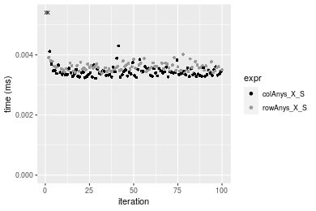

[matrixStats]: Benchmark report

---------------------------------------


# colAnys() and rowAnys() benchmarks  on subsetted computation

This report benchmark the performance of colAnys() and rowAnys() on subsetted computation.


## Data
```r
> rmatrix <- function(nrow, ncol, mode = c("logical", "double", "integer", "index"), range = c(-100, 
+     +100), na_prob = 0) {
+     mode <- match.arg(mode)
+     n <- nrow * ncol
+     if (mode == "logical") {
+         x <- sample(c(FALSE, TRUE), size = n, replace = TRUE)
+     }     else if (mode == "index") {
+         x <- seq_len(n)
+         mode <- "integer"
+     }     else {
+         x <- runif(n, min = range[1], max = range[2])
+     }
+     storage.mode(x) <- mode
+     if (na_prob > 0) 
+         x[sample(n, size = na_prob * n)] <- NA
+     dim(x) <- c(nrow, ncol)
+     x
+ }
> rmatrices <- function(scale = 10, seed = 1, ...) {
+     set.seed(seed)
+     data <- list()
+     data[[1]] <- rmatrix(nrow = scale * 1, ncol = scale * 1, ...)
+     data[[2]] <- rmatrix(nrow = scale * 10, ncol = scale * 10, ...)
+     data[[3]] <- rmatrix(nrow = scale * 100, ncol = scale * 1, ...)
+     data[[4]] <- t(data[[3]])
+     data[[5]] <- rmatrix(nrow = scale * 10, ncol = scale * 100, ...)
+     data[[6]] <- t(data[[5]])
+     names(data) <- sapply(data, FUN = function(x) paste(dim(x), collapse = "x"))
+     data
+ }
> data <- rmatrices(mode = "logical")
```

## Results

### 10x10 matrix


```r
> X <- data[["10x10"]]
> rows <- sample.int(nrow(X), size = nrow(X) * 0.7)
> cols <- sample.int(ncol(X), size = ncol(X) * 0.7)
> X_S <- X[rows, cols]
> gc()
          used  (Mb) gc trigger  (Mb) max used  (Mb)
Ncells 5177100 276.5    8529671 455.6  8529671 455.6
Vcells 9627476  73.5   31876688 243.2 60562128 462.1
> colStats <- microbenchmark(colAnys_X_S = colAnys(X_S), `colAnys(X, rows, cols)` = colAnys(X, rows = rows, 
+     cols = cols), `colAnys(X[rows, cols])` = colAnys(X[rows, cols]), unit = "ms")
> X <- t(X)
> X_S <- t(X_S)
> gc()
          used  (Mb) gc trigger  (Mb) max used  (Mb)
Ncells 5168708 276.1    8529671 455.6  8529671 455.6
Vcells 9600142  73.3   31876688 243.2 60562128 462.1
> rowStats <- microbenchmark(rowAnys_X_S = rowAnys(X_S), `rowAnys(X, cols, rows)` = rowAnys(X, rows = cols, 
+     cols = rows), `rowAnys(X[cols, rows])` = rowAnys(X[cols, rows]), unit = "ms")
```

_Table: Benchmarking of colAnys_X_S(), colAnys(X, rows, cols)() and colAnys(X[rows, cols])() on 10x10 data. The top panel shows times in milliseconds and the bottom panel shows relative times._


|   |expr                   |      min|        lq|      mean|    median|        uq|      max|
|:--|:----------------------|--------:|---------:|---------:|---------:|---------:|--------:|
|1  |colAnys_X_S            | 0.003219| 0.0033310| 0.0036600| 0.0034045| 0.0035155| 0.023172|
|2  |colAnys(X, rows, cols) | 0.003705| 0.0037865| 0.0039046| 0.0038480| 0.0039570| 0.006410|
|3  |colAnys(X[rows, cols]) | 0.004173| 0.0044695| 0.0046776| 0.0045865| 0.0047065| 0.009391|


|   |expr                   |      min|       lq|     mean|   median|       uq|       max|
|:--|:----------------------|--------:|--------:|--------:|--------:|--------:|---------:|
|1  |colAnys_X_S            | 1.000000| 1.000000| 1.000000| 1.000000| 1.000000| 1.0000000|
|2  |colAnys(X, rows, cols) | 1.150979| 1.136746| 1.066827| 1.130269| 1.125587| 0.2766270|
|3  |colAnys(X[rows, cols]) | 1.296365| 1.341789| 1.278008| 1.347187| 1.338785| 0.4052736|

_Table: Benchmarking of rowAnys_X_S(), rowAnys(X, cols, rows)() and rowAnys(X[cols, rows])() on 10x10 data (transposed). The top panel shows times in milliseconds and the bottom panel shows relative times._


|   |expr                   |      min|        lq|      mean|    median|       uq|      max|
|:--|:----------------------|--------:|---------:|---------:|---------:|--------:|--------:|
|1  |rowAnys_X_S            | 0.003381| 0.0034840| 0.0036096| 0.0035695| 0.003663| 0.005945|
|2  |rowAnys(X, cols, rows) | 0.003786| 0.0038835| 0.0042319| 0.0039635| 0.004079| 0.026583|
|3  |rowAnys(X[cols, rows]) | 0.004370| 0.0046275| 0.0048266| 0.0047425| 0.004898| 0.007305|


|   |expr                   |      min|       lq|     mean|   median|       uq|      max|
|:--|:----------------------|--------:|--------:|--------:|--------:|--------:|--------:|
|1  |rowAnys_X_S            | 1.000000| 1.000000| 1.000000| 1.000000| 1.000000| 1.000000|
|2  |rowAnys(X, cols, rows) | 1.119787| 1.114667| 1.172418| 1.110380| 1.113568| 4.471489|
|3  |rowAnys(X[cols, rows]) | 1.292517| 1.328215| 1.337178| 1.328618| 1.337155| 1.228764|

_Figure: Benchmarking of colAnys_X_S(), colAnys(X, rows, cols)() and colAnys(X[rows, cols])() on 10x10 data  as well as rowAnys_X_S(), rowAnys(X, cols, rows)() and rowAnys(X[cols, rows])() on the same data transposed.  Outliers are displayed as crosses.  Times are in milliseconds._


_Table: Benchmarking of colAnys_X_S() and rowAnys_X_S() on 10x10 data (original and transposed).  The top panel shows times in milliseconds and the bottom panel shows relative times._


|   |expr        |   min|    lq|    mean| median|     uq|    max|
|:--|:-----------|-----:|-----:|-------:|------:|------:|------:|
|1  |colAnys_X_S | 3.219| 3.331| 3.66004| 3.4045| 3.5155| 23.172|
|2  |rowAnys_X_S | 3.381| 3.484| 3.60955| 3.5695| 3.6630|  5.945|


|   |expr        |      min|       lq|      mean|   median|       uq|       max|
|:--|:-----------|--------:|--------:|---------:|--------:|--------:|---------:|
|1  |colAnys_X_S | 1.000000| 1.000000| 1.0000000| 1.000000| 1.000000| 1.0000000|
|2  |rowAnys_X_S | 1.050326| 1.045932| 0.9862051| 1.048465| 1.041957| 0.2565596|

_Figure: Benchmarking of colAnys_X_S() and rowAnys_X_S() on 10x10 data (original and transposed).  Outliers are displayed as crosses. Times are in milliseconds._




### 100x100 matrix


```r
> X <- data[["100x100"]]
> rows <- sample.int(nrow(X), size = nrow(X) * 0.7)
> cols <- sample.int(ncol(X), size = ncol(X) * 0.7)
> X_S <- X[rows, cols]
> gc()
          used  (Mb) gc trigger  (Mb) max used  (Mb)
Ncells 5167229 276.0    8529671 455.6  8529671 455.6
Vcells 9268270  70.8   31876688 243.2 60562128 462.1
> colStats <- microbenchmark(colAnys_X_S = colAnys(X_S), `colAnys(X, rows, cols)` = colAnys(X, rows = rows, 
+     cols = cols), `colAnys(X[rows, cols])` = colAnys(X[rows, cols]), unit = "ms")
> X <- t(X)
> X_S <- t(X_S)
> gc()
          used  (Mb) gc trigger  (Mb) max used  (Mb)
Ncells 5167205 276.0    8529671 455.6  8529671 455.6
Vcells 9273323  70.8   31876688 243.2 60562128 462.1
> rowStats <- microbenchmark(rowAnys_X_S = rowAnys(X_S), `rowAnys(X, cols, rows)` = rowAnys(X, rows = cols, 
+     cols = rows), `rowAnys(X[cols, rows])` = rowAnys(X[cols, rows]), unit = "ms")
```

_Table: Benchmarking of colAnys_X_S(), colAnys(X, rows, cols)() and colAnys(X[rows, cols])() on 100x100 data. The top panel shows times in milliseconds and the bottom panel shows relative times._


|   |expr                   |      min|        lq|      mean|    median|        uq|      max|
|:--|:----------------------|--------:|---------:|---------:|---------:|---------:|--------:|
|1  |colAnys_X_S            | 0.004428| 0.0047970| 0.0050255| 0.0049555| 0.0051425| 0.011703|
|2  |colAnys(X, rows, cols) | 0.005662| 0.0059565| 0.0062993| 0.0062065| 0.0064455| 0.011864|
|3  |colAnys(X[rows, cols]) | 0.020373| 0.0211020| 0.0218015| 0.0212835| 0.0216425| 0.052099|


|   |expr                   |      min|       lq|     mean|   median|       uq|      max|
|:--|:----------------------|--------:|--------:|--------:|--------:|--------:|--------:|
|1  |colAnys_X_S            | 1.000000| 1.000000| 1.000000| 1.000000| 1.000000| 1.000000|
|2  |colAnys(X, rows, cols) | 1.278681| 1.241714| 1.253455| 1.252447| 1.253379| 1.013757|
|3  |colAnys(X[rows, cols]) | 4.600949| 4.398999| 4.338137| 4.294925| 4.208556| 4.451765|

_Table: Benchmarking of rowAnys_X_S(), rowAnys(X, cols, rows)() and rowAnys(X[cols, rows])() on 100x100 data (transposed). The top panel shows times in milliseconds and the bottom panel shows relative times._


|   |expr                   |      min|        lq|      mean|    median|       uq|      max|
|:--|:----------------------|--------:|---------:|---------:|---------:|--------:|--------:|
|1  |rowAnys_X_S            | 0.008511| 0.0090205| 0.0092478| 0.0091770| 0.009338| 0.014797|
|2  |rowAnys(X, cols, rows) | 0.010165| 0.0108165| 0.0114624| 0.0111000| 0.011370| 0.036588|
|3  |rowAnys(X[cols, rows]) | 0.025095| 0.0255255| 0.0259974| 0.0257245| 0.025930| 0.040408|


|   |expr                   |      min|       lq|     mean|   median|       uq|      max|
|:--|:----------------------|--------:|--------:|--------:|--------:|--------:|--------:|
|1  |rowAnys_X_S            | 1.000000| 1.000000| 1.000000| 1.000000| 1.000000| 1.000000|
|2  |rowAnys(X, cols, rows) | 1.194337| 1.199102| 1.239463| 1.209546| 1.217605| 2.472663|
|3  |rowAnys(X[cols, rows]) | 2.948537| 2.829721| 2.811184| 2.803149| 2.776826| 2.730824|

_Figure: Benchmarking of colAnys_X_S(), colAnys(X, rows, cols)() and colAnys(X[rows, cols])() on 100x100 data  as well as rowAnys_X_S(), rowAnys(X, cols, rows)() and rowAnys(X[cols, rows])() on the same data transposed.  Outliers are displayed as crosses.  Times are in milliseconds._


_Table: Benchmarking of colAnys_X_S() and rowAnys_X_S() on 100x100 data (original and transposed).  The top panel shows times in milliseconds and the bottom panel shows relative times._


|   |expr        |   min|     lq|    mean| median|     uq|    max|
|:--|:-----------|-----:|------:|-------:|------:|------:|------:|
|1  |colAnys_X_S | 4.428| 4.7970| 5.02554| 4.9555| 5.1425| 11.703|
|2  |rowAnys_X_S | 8.511| 9.0205| 9.24785| 9.1770| 9.3380| 14.797|


|   |expr        |      min|       lq|    mean|   median|       uq|      max|
|:--|:-----------|--------:|--------:|-------:|--------:|--------:|--------:|
|1  |colAnys_X_S | 1.000000| 1.000000| 1.00000| 1.000000| 1.000000| 1.000000|
|2  |rowAnys_X_S | 1.922087| 1.880446| 1.84017| 1.851882| 1.815848| 1.264377|

_Figure: Benchmarking of colAnys_X_S() and rowAnys_X_S() on 100x100 data (original and transposed).  Outliers are displayed as crosses. Times are in milliseconds._


### 1000x10 matrix


```r
> X <- data[["1000x10"]]
> rows <- sample.int(nrow(X), size = nrow(X) * 0.7)
> cols <- sample.int(ncol(X), size = ncol(X) * 0.7)
> X_S <- X[rows, cols]
> gc()
          used  (Mb) gc trigger  (Mb) max used  (Mb)
Ncells 5167970 276.0    8529671 455.6  8529671 455.6
Vcells 9272324  70.8   31876688 243.2 60562128 462.1
> colStats <- microbenchmark(colAnys_X_S = colAnys(X_S), `colAnys(X, rows, cols)` = colAnys(X, rows = rows, 
+     cols = cols), `colAnys(X[rows, cols])` = colAnys(X[rows, cols]), unit = "ms")
> X <- t(X)
> X_S <- t(X_S)
> gc()
          used  (Mb) gc trigger  (Mb) max used  (Mb)
Ncells 5167946 276.0    8529671 455.6  8529671 455.6
Vcells 9277377  70.8   31876688 243.2 60562128 462.1
> rowStats <- microbenchmark(rowAnys_X_S = rowAnys(X_S), `rowAnys(X, cols, rows)` = rowAnys(X, rows = cols, 
+     cols = rows), `rowAnys(X[cols, rows])` = rowAnys(X[cols, rows]), unit = "ms")
```

_Table: Benchmarking of colAnys_X_S(), colAnys(X, rows, cols)() and colAnys(X[rows, cols])() on 1000x10 data. The top panel shows times in milliseconds and the bottom panel shows relative times._


|   |expr                   |      min|        lq|      mean|    median|        uq|      max|
|:--|:----------------------|--------:|---------:|---------:|---------:|---------:|--------:|
|1  |colAnys_X_S            | 0.003319| 0.0034875| 0.0036520| 0.0035650| 0.0036920| 0.008389|
|2  |colAnys(X, rows, cols) | 0.006436| 0.0068705| 0.0074484| 0.0071120| 0.0074770| 0.014991|
|3  |colAnys(X[rows, cols]) | 0.020304| 0.0206600| 0.0213218| 0.0207905| 0.0210155| 0.053564|


|   |expr                   |      min|       lq|     mean|   median|       uq|      max|
|:--|:----------------------|--------:|--------:|--------:|--------:|--------:|--------:|
|1  |colAnys_X_S            | 1.000000| 1.000000| 1.000000| 1.000000| 1.000000| 1.000000|
|2  |colAnys(X, rows, cols) | 1.939138| 1.970036| 2.039515| 1.994951| 2.025190| 1.786983|
|3  |colAnys(X[rows, cols]) | 6.117505| 5.924014| 5.838331| 5.831837| 5.692172| 6.385028|

_Table: Benchmarking of rowAnys_X_S(), rowAnys(X, cols, rows)() and rowAnys(X[cols, rows])() on 1000x10 data (transposed). The top panel shows times in milliseconds and the bottom panel shows relative times._


|   |expr                   |      min|       lq|      mean|   median|        uq|      max|
|:--|:----------------------|--------:|--------:|---------:|--------:|---------:|--------:|
|1  |rowAnys_X_S            | 0.009145| 0.009619| 0.0100038| 0.009948| 0.0101905| 0.015216|
|2  |rowAnys(X, cols, rows) | 0.012208| 0.012966| 0.0135462| 0.013311| 0.0137915| 0.021230|
|3  |rowAnys(X[cols, rows]) | 0.026203| 0.027358| 0.0287920| 0.027814| 0.0288275| 0.092350|


|   |expr                   |      min|       lq|     mean|   median|       uq|      max|
|:--|:----------------------|--------:|--------:|--------:|--------:|--------:|--------:|
|1  |rowAnys_X_S            | 1.000000| 1.000000| 1.000000| 1.000000| 1.000000| 1.000000|
|2  |rowAnys(X, cols, rows) | 1.334937| 1.347957| 1.354115| 1.338058| 1.353368| 1.395242|
|3  |rowAnys(X[cols, rows]) | 2.865282| 2.844163| 2.878118| 2.795939| 2.828860| 6.069269|

_Figure: Benchmarking of colAnys_X_S(), colAnys(X, rows, cols)() and colAnys(X[rows, cols])() on 1000x10 data  as well as rowAnys_X_S(), rowAnys(X, cols, rows)() and rowAnys(X[cols, rows])() on the same data transposed.  Outliers are displayed as crosses.  Times are in milliseconds._


_Table: Benchmarking of colAnys_X_S() and rowAnys_X_S() on 1000x10 data (original and transposed).  The top panel shows times in milliseconds and the bottom panel shows relative times._


|   |expr        |   min|     lq|     mean| median|      uq|    max|
|:--|:-----------|-----:|------:|--------:|------:|-------:|------:|
|1  |colAnys_X_S | 3.319| 3.4875|  3.65203|  3.565|  3.6920|  8.389|
|2  |rowAnys_X_S | 9.145| 9.6190| 10.00376|  9.948| 10.1905| 15.216|


|   |expr        |      min|       lq|     mean|   median|       uq|      max|
|:--|:-----------|--------:|--------:|--------:|--------:|--------:|--------:|
|1  |colAnys_X_S | 1.000000| 1.000000| 1.000000| 1.000000| 1.000000| 1.000000|
|2  |rowAnys_X_S | 2.755348| 2.758136| 2.739233| 2.790463| 2.760157| 1.813804|

_Figure: Benchmarking of colAnys_X_S() and rowAnys_X_S() on 1000x10 data (original and transposed).  Outliers are displayed as crosses. Times are in milliseconds._


### 10x1000 matrix


```r
> X <- data[["10x1000"]]
> rows <- sample.int(nrow(X), size = nrow(X) * 0.7)
> cols <- sample.int(ncol(X), size = ncol(X) * 0.7)
> X_S <- X[rows, cols]
> gc()
          used  (Mb) gc trigger  (Mb) max used  (Mb)
Ncells 5168175 276.1    8529671 455.6  8529671 455.6
Vcells 9273124  70.8   31876688 243.2 60562128 462.1
> colStats <- microbenchmark(colAnys_X_S = colAnys(X_S), `colAnys(X, rows, cols)` = colAnys(X, rows = rows, 
+     cols = cols), `colAnys(X[rows, cols])` = colAnys(X[rows, cols]), unit = "ms")
> X <- t(X)
> X_S <- t(X_S)
> gc()
          used  (Mb) gc trigger  (Mb) max used  (Mb)
Ncells 5168151 276.1    8529671 455.6  8529671 455.6
Vcells 9278177  70.8   31876688 243.2 60562128 462.1
> rowStats <- microbenchmark(rowAnys_X_S = rowAnys(X_S), `rowAnys(X, cols, rows)` = rowAnys(X, rows = cols, 
+     cols = rows), `rowAnys(X[cols, rows])` = rowAnys(X[cols, rows]), unit = "ms")
```

_Table: Benchmarking of colAnys_X_S(), colAnys(X, rows, cols)() and colAnys(X[rows, cols])() on 10x1000 data. The top panel shows times in milliseconds and the bottom panel shows relative times._


|   |expr                   |      min|        lq|      mean|    median|        uq|      max|
|:--|:----------------------|--------:|---------:|---------:|---------:|---------:|--------:|
|1  |colAnys_X_S            | 0.016067| 0.0168255| 0.0185005| 0.0173310| 0.0180270| 0.047947|
|2  |colAnys(X, rows, cols) | 0.016226| 0.0195075| 0.0230198| 0.0210520| 0.0231620| 0.038127|
|3  |colAnys(X[rows, cols]) | 0.034174| 0.0352295| 0.0399646| 0.0359865| 0.0373125| 0.064604|


|   |expr                   |      min|       lq|     mean|   median|       uq|       max|
|:--|:----------------------|--------:|--------:|--------:|--------:|--------:|---------:|
|1  |colAnys_X_S            | 1.000000| 1.000000| 1.000000| 1.000000| 1.000000| 1.0000000|
|2  |colAnys(X, rows, cols) | 1.009896| 1.159401| 1.244275| 1.214702| 1.284850| 0.7951905|
|3  |colAnys(X[rows, cols]) | 2.126968| 2.093816| 2.160184| 2.076424| 2.069812| 1.3474044|

_Table: Benchmarking of rowAnys_X_S(), rowAnys(X, cols, rows)() and rowAnys(X[cols, rows])() on 10x1000 data (transposed). The top panel shows times in milliseconds and the bottom panel shows relative times._


|   |expr                   |      min|        lq|      mean|    median|       uq|      max|
|:--|:----------------------|--------:|---------:|---------:|---------:|--------:|--------:|
|1  |rowAnys_X_S            | 0.023456| 0.0255020| 0.0269853| 0.0267640| 0.028216| 0.039947|
|2  |rowAnys(X, cols, rows) | 0.022930| 0.0310540| 0.0339282| 0.0330200| 0.034288| 0.100766|
|3  |rowAnys(X[cols, rows]) | 0.039365| 0.0425765| 0.0448292| 0.0441295| 0.045917| 0.066982|


|   |expr                   |      min|       lq|     mean|   median|       uq|      max|
|:--|:----------------------|--------:|--------:|--------:|--------:|--------:|--------:|
|1  |rowAnys_X_S            | 1.000000| 1.000000| 1.000000| 1.000000| 1.000000| 1.000000|
|2  |rowAnys(X, cols, rows) | 0.977575| 1.217708| 1.257284| 1.233747| 1.215197| 2.522492|
|3  |rowAnys(X[cols, rows]) | 1.678249| 1.669536| 1.661248| 1.648838| 1.627339| 1.676772|

_Figure: Benchmarking of colAnys_X_S(), colAnys(X, rows, cols)() and colAnys(X[rows, cols])() on 10x1000 data  as well as rowAnys_X_S(), rowAnys(X, cols, rows)() and rowAnys(X[cols, rows])() on the same data transposed.  Outliers are displayed as crosses.  Times are in milliseconds._


_Table: Benchmarking of colAnys_X_S() and rowAnys_X_S() on 10x1000 data (original and transposed).  The top panel shows times in milliseconds and the bottom panel shows relative times._


|   |expr        |    min|      lq|     mean| median|     uq|    max|
|:--|:-----------|------:|-------:|--------:|------:|------:|------:|
|1  |colAnys_X_S | 16.067| 16.8255| 18.50054| 17.331| 18.027| 47.947|
|2  |rowAnys_X_S | 23.456| 25.5020| 26.98528| 26.764| 28.216| 39.947|


|   |expr        |      min|       lq|     mean|   median|       uq|       max|
|:--|:-----------|--------:|--------:|--------:|--------:|--------:|---------:|
|1  |colAnys_X_S | 1.000000| 1.000000| 1.000000| 1.000000| 1.000000| 1.0000000|
|2  |rowAnys_X_S | 1.459887| 1.515676| 1.458621| 1.544285| 1.565208| 0.8331491|

_Figure: Benchmarking of colAnys_X_S() and rowAnys_X_S() on 10x1000 data (original and transposed).  Outliers are displayed as crosses. Times are in milliseconds._


### 100x1000 matrix


```r
> X <- data[["100x1000"]]
> rows <- sample.int(nrow(X), size = nrow(X) * 0.7)
> cols <- sample.int(ncol(X), size = ncol(X) * 0.7)
> X_S <- X[rows, cols]
> gc()
          used  (Mb) gc trigger  (Mb) max used  (Mb)
Ncells 5168386 276.1    8529671 455.6  8529671 455.6
Vcells 9295783  71.0   31876688 243.2 60562128 462.1
> colStats <- microbenchmark(colAnys_X_S = colAnys(X_S), `colAnys(X, rows, cols)` = colAnys(X, rows = rows, 
+     cols = cols), `colAnys(X[rows, cols])` = colAnys(X[rows, cols]), unit = "ms")
> X <- t(X)
> X_S <- t(X_S)
> gc()
          used  (Mb) gc trigger  (Mb) max used  (Mb)
Ncells 5168362 276.1    8529671 455.6  8529671 455.6
Vcells 9345836  71.4   31876688 243.2 60562128 462.1
> rowStats <- microbenchmark(rowAnys_X_S = rowAnys(X_S), `rowAnys(X, cols, rows)` = rowAnys(X, rows = cols, 
+     cols = rows), `rowAnys(X[cols, rows])` = rowAnys(X[cols, rows]), unit = "ms")
```

_Table: Benchmarking of colAnys_X_S(), colAnys(X, rows, cols)() and colAnys(X[rows, cols])() on 100x1000 data. The top panel shows times in milliseconds and the bottom panel shows relative times._


|   |expr                   |      min|       lq|      mean|    median|        uq|      max|
|:--|:----------------------|--------:|--------:|---------:|---------:|---------:|--------:|
|1  |colAnys_X_S            | 0.014802| 0.016241| 0.0177867| 0.0171440| 0.0178130| 0.062863|
|2  |colAnys(X, rows, cols) | 0.017272| 0.021048| 0.0224166| 0.0220205| 0.0232735| 0.053511|
|3  |colAnys(X[rows, cols]) | 0.130239| 0.137066| 0.1459472| 0.1433940| 0.1508165| 0.191160|


|   |expr                   |      min|       lq|     mean|   median|       uq|      max|
|:--|:----------------------|--------:|--------:|--------:|--------:|--------:|--------:|
|1  |colAnys_X_S            | 1.000000| 1.000000| 1.000000| 1.000000| 1.000000| 1.000000|
|2  |colAnys(X, rows, cols) | 1.166869| 1.295979| 1.260298| 1.284444| 1.306546| 0.851232|
|3  |colAnys(X[rows, cols]) | 8.798743| 8.439505| 8.205406| 8.364092| 8.466654| 3.040898|

_Table: Benchmarking of rowAnys_X_S(), rowAnys(X, cols, rows)() and rowAnys(X[cols, rows])() on 100x1000 data (transposed). The top panel shows times in milliseconds and the bottom panel shows relative times._


|   |expr                   |      min|        lq|      mean|    median|        uq|      max|
|:--|:----------------------|--------:|---------:|---------:|---------:|---------:|--------:|
|1  |rowAnys_X_S            | 0.050192| 0.0537165| 0.0584704| 0.0572910| 0.0621585| 0.093070|
|2  |rowAnys(X, cols, rows) | 0.052976| 0.0560360| 0.0610338| 0.0584985| 0.0645260| 0.087732|
|3  |rowAnys(X[cols, rows]) | 0.160618| 0.1710855| 0.1862103| 0.1789950| 0.1988935| 0.267386|


|   |expr                   |      min|       lq|     mean|   median|       uq|       max|
|:--|:----------------------|--------:|--------:|--------:|--------:|--------:|---------:|
|1  |rowAnys_X_S            | 1.000000| 1.000000| 1.000000| 1.000000| 1.000000| 1.0000000|
|2  |rowAnys(X, cols, rows) | 1.055467| 1.043180| 1.043842| 1.021077| 1.038088| 0.9426453|
|3  |rowAnys(X[cols, rows]) | 3.200072| 3.184971| 3.184696| 3.124313| 3.199780| 2.8729558|

_Figure: Benchmarking of colAnys_X_S(), colAnys(X, rows, cols)() and colAnys(X[rows, cols])() on 100x1000 data  as well as rowAnys_X_S(), rowAnys(X, cols, rows)() and rowAnys(X[cols, rows])() on the same data transposed.  Outliers are displayed as crosses.  Times are in milliseconds._


_Table: Benchmarking of colAnys_X_S() and rowAnys_X_S() on 100x1000 data (original and transposed).  The top panel shows times in milliseconds and the bottom panel shows relative times._


|   |expr        |    min|      lq|     mean| median|      uq|    max|
|:--|:-----------|------:|-------:|--------:|------:|-------:|------:|
|1  |colAnys_X_S | 14.802| 16.2410| 17.78671| 17.144| 17.8130| 62.863|
|2  |rowAnys_X_S | 50.192| 53.7165| 58.47037| 57.291| 62.1585| 93.070|


|   |expr        |      min|       lq|     mean|   median|       uq|      max|
|:--|:-----------|--------:|--------:|--------:|--------:|--------:|--------:|
|1  |colAnys_X_S | 1.000000| 1.000000| 1.000000| 1.000000| 1.000000| 1.000000|
|2  |rowAnys_X_S | 3.390893| 3.307463| 3.287307| 3.341752| 3.489502| 1.480521|

_Figure: Benchmarking of colAnys_X_S() and rowAnys_X_S() on 100x1000 data (original and transposed).  Outliers are displayed as crosses. Times are in milliseconds._


### 1000x100 matrix


```r
> X <- data[["1000x100"]]
> rows <- sample.int(nrow(X), size = nrow(X) * 0.7)
> cols <- sample.int(ncol(X), size = ncol(X) * 0.7)
> X_S <- X[rows, cols]
> gc()
          used  (Mb) gc trigger  (Mb) max used  (Mb)
Ncells 5168596 276.1    8529671 455.6  8529671 455.6
Vcells 9296443  71.0   31876688 243.2 60562128 462.1
> colStats <- microbenchmark(colAnys_X_S = colAnys(X_S), `colAnys(X, rows, cols)` = colAnys(X, rows = rows, 
+     cols = cols), `colAnys(X[rows, cols])` = colAnys(X[rows, cols]), unit = "ms")
> X <- t(X)
> X_S <- t(X_S)
> gc()
          used  (Mb) gc trigger  (Mb) max used  (Mb)
Ncells 5168572 276.1    8529671 455.6  8529671 455.6
Vcells 9346496  71.4   31876688 243.2 60562128 462.1
> rowStats <- microbenchmark(rowAnys_X_S = rowAnys(X_S), `rowAnys(X, cols, rows)` = rowAnys(X, rows = cols, 
+     cols = rows), `rowAnys(X[cols, rows])` = rowAnys(X[cols, rows]), unit = "ms")
```

_Table: Benchmarking of colAnys_X_S(), colAnys(X, rows, cols)() and colAnys(X[rows, cols])() on 1000x100 data. The top panel shows times in milliseconds and the bottom panel shows relative times._


|   |expr                   |      min|       lq|      mean|    median|       uq|      max|
|:--|:----------------------|--------:|--------:|---------:|---------:|--------:|--------:|
|1  |colAnys_X_S            | 0.003695| 0.004417| 0.0052580| 0.0047455| 0.005138| 0.034422|
|2  |colAnys(X, rows, cols) | 0.007045| 0.007841| 0.0085871| 0.0082510| 0.009057| 0.021070|
|3  |colAnys(X[rows, cols]) | 0.126519| 0.136779| 0.1463808| 0.1469260| 0.153856| 0.204313|


|   |expr                   |       min|        lq|      mean|   median|        uq|       max|
|:--|:----------------------|---------:|---------:|---------:|--------:|---------:|---------:|
|1  |colAnys_X_S            |  1.000000|  1.000000|  1.000000|  1.00000|  1.000000| 1.0000000|
|2  |colAnys(X, rows, cols) |  1.906631|  1.775187|  1.633162|  1.73870|  1.762748| 0.6121085|
|3  |colAnys(X[rows, cols]) | 34.240595| 30.966493| 27.839850| 30.96112| 29.944726| 5.9355354|

_Table: Benchmarking of rowAnys_X_S(), rowAnys(X, cols, rows)() and rowAnys(X[cols, rows])() on 1000x100 data (transposed). The top panel shows times in milliseconds and the bottom panel shows relative times._


|   |expr                   |      min|        lq|      mean|   median|        uq|      max|
|:--|:----------------------|--------:|---------:|---------:|--------:|---------:|--------:|
|1  |rowAnys_X_S            | 0.037217| 0.0386990| 0.0421941| 0.041443| 0.0436280| 0.061977|
|2  |rowAnys(X, cols, rows) | 0.043439| 0.0459090| 0.0499184| 0.048884| 0.0513085| 0.085342|
|3  |rowAnys(X[cols, rows]) | 0.152316| 0.1581785| 0.1705069| 0.164383| 0.1809795| 0.261740|


|   |expr                   |      min|       lq|     mean|   median|       uq|      max|
|:--|:----------------------|--------:|--------:|--------:|--------:|--------:|--------:|
|1  |rowAnys_X_S            | 1.000000| 1.000000| 1.000000| 1.000000| 1.000000| 1.000000|
|2  |rowAnys(X, cols, rows) | 1.167182| 1.186310| 1.183067| 1.179548| 1.176045| 1.376995|
|3  |rowAnys(X[cols, rows]) | 4.092646| 4.087405| 4.041015| 3.966484| 4.148242| 4.223180|

_Figure: Benchmarking of colAnys_X_S(), colAnys(X, rows, cols)() and colAnys(X[rows, cols])() on 1000x100 data  as well as rowAnys_X_S(), rowAnys(X, cols, rows)() and rowAnys(X[cols, rows])() on the same data transposed.  Outliers are displayed as crosses.  Times are in milliseconds._


_Table: Benchmarking of colAnys_X_S() and rowAnys_X_S() on 1000x100 data (original and transposed).  The top panel shows times in milliseconds and the bottom panel shows relative times._


|   |expr        |    min|     lq|     mean|  median|     uq|    max|
|:--|:-----------|------:|------:|--------:|-------:|------:|------:|
|1  |colAnys_X_S |  3.695|  4.417|  5.25796|  4.7455|  5.138| 34.422|
|2  |rowAnys_X_S | 37.217| 38.699| 42.19407| 41.4430| 43.628| 61.977|


|   |expr        |      min|       lq|     mean|   median|       uq|      max|
|:--|:-----------|--------:|--------:|--------:|--------:|--------:|--------:|
|1  |colAnys_X_S |  1.00000| 1.000000| 1.000000| 1.000000| 1.000000| 1.000000|
|2  |rowAnys_X_S | 10.07226| 8.761377| 8.024799| 8.733116| 8.491242| 1.800506|

_Figure: Benchmarking of colAnys_X_S() and rowAnys_X_S() on 1000x100 data (original and transposed).  Outliers are displayed as crosses. Times are in milliseconds._


## Appendix

### Session information
```r
R version 4.1.1 Patched (2021-08-10 r80727)
Platform: x86_64-pc-linux-gnu (64-bit)
Running under: Ubuntu 18.04.5 LTS

Matrix products: default
BLAS:   /home/hb/software/R-devel/R-4-1-branch/lib/R/lib/libRblas.so
LAPACK: /home/hb/software/R-devel/R-4-1-branch/lib/R/lib/libRlapack.so

locale:
 [1] LC_CTYPE=en_US.UTF-8       LC_NUMERIC=C              
 [3] LC_TIME=en_US.UTF-8        LC_COLLATE=en_US.UTF-8    
 [5] LC_MONETARY=en_US.UTF-8    LC_MESSAGES=en_US.UTF-8   
 [7] LC_PAPER=en_US.UTF-8       LC_NAME=C                 
 [9] LC_ADDRESS=C               LC_TELEPHONE=C            
[11] LC_MEASUREMENT=en_US.UTF-8 LC_IDENTIFICATION=C       

attached base packages:
[1] stats     graphics  grDevices utils     datasets  methods   base     

other attached packages:
[1] microbenchmark_1.4-7   matrixStats_0.60.1     ggplot2_3.3.5         
[4] knitr_1.33             R.devices_2.17.0       R.utils_2.10.1        
[7] R.oo_1.24.0            R.methodsS3_1.8.1-9001 history_0.0.1-9000    

loaded via a namespace (and not attached):
 [1] Biobase_2.52.0          httr_1.4.2              splines_4.1.1          
 [4] bit64_4.0.5             network_1.17.1          assertthat_0.2.1       
 [7] highr_0.9               stats4_4.1.1            blob_1.2.2             
[10] GenomeInfoDbData_1.2.6  robustbase_0.93-8       pillar_1.6.2           
[13] RSQLite_2.2.8           lattice_0.20-44         glue_1.4.2             
[16] digest_0.6.27           XVector_0.32.0          colorspace_2.0-2       
[19] Matrix_1.3-4            XML_3.99-0.7            pkgconfig_2.0.3        
[22] zlibbioc_1.38.0         genefilter_1.74.0       purrr_0.3.4            
[25] ergm_4.1.2              xtable_1.8-4            scales_1.1.1           
[28] tibble_3.1.4            annotate_1.70.0         KEGGREST_1.32.0        
[31] farver_2.1.0            generics_0.1.0          IRanges_2.26.0         
[34] ellipsis_0.3.2          cachem_1.0.6            withr_2.4.2            
[37] BiocGenerics_0.38.0     mime_0.11               survival_3.2-13        
[40] magrittr_2.0.1          crayon_1.4.1            statnet.common_4.5.0   
[43] memoise_2.0.0           laeken_0.5.1            fansi_0.5.0            
[46] R.cache_0.15.0          MASS_7.3-54             R.rsp_0.44.0           
[49] progressr_0.8.0         tools_4.1.1             lifecycle_1.0.0        
[52] S4Vectors_0.30.0        trust_0.1-8             munsell_0.5.0          
[55] tabby_0.0.1-9001        AnnotationDbi_1.54.1    Biostrings_2.60.2      
[58] compiler_4.1.1          GenomeInfoDb_1.28.1     rlang_0.4.11           
[61] grid_4.1.1              RCurl_1.98-1.4          cwhmisc_6.6            
[64] rappdirs_0.3.3          startup_0.15.0          labeling_0.4.2         
[67] bitops_1.0-7            base64enc_0.1-3         boot_1.3-28            
[70] gtable_0.3.0            DBI_1.1.1               markdown_1.1           
[73] R6_2.5.1                lpSolveAPI_5.5.2.0-17.7 rle_0.9.2              
[76] dplyr_1.0.7             fastmap_1.1.0           bit_4.0.4              
[79] utf8_1.2.2              parallel_4.1.1          Rcpp_1.0.7             
[82] vctrs_0.3.8             png_0.1-7               DEoptimR_1.0-9         
[85] tidyselect_1.1.1        xfun_0.25               coda_0.19-4            
```
Total processing time was 11.11 secs.


### Reproducibility
To reproduce this report, do:
```r
html <- matrixStats:::benchmark('colRowAnys_subset')
```

[RSP]: https://cran.r-project.org/package=R.rsp
[matrixStats]: https://cran.r-project.org/package=matrixStats

[StackOverflow:colMins?]: https://stackoverflow.com/questions/13676878 "Stack Overflow: fastest way to get Min from every column in a matrix?"
[StackOverflow:colSds?]: https://stackoverflow.com/questions/17549762 "Stack Overflow: Is there such 'colsd' in R?"
[StackOverflow:rowProds?]: https://stackoverflow.com/questions/20198801/ "Stack Overflow: Row product of matrix and column sum of matrix"

---------------------------------------
Copyright Dongcan Jiang. Last updated on 2021-08-25 18:50:50 (+0200 UTC). Powered by [RSP].

<script>
 var link = document.createElement('link');
 link.rel = 'icon';
 link.href = "data:image/png;base64,iVBORw0KGgoAAAANSUhEUgAAACAAAAAgCAMAAABEpIrGAAAA21BMVEUAAAAAAP8AAP8AAP8AAP8AAP8AAP8AAP8AAP8AAP8AAP8AAP8AAP8AAP8AAP8AAP8AAP8AAP8AAP8AAP8AAP8AAP8AAP8AAP8AAP8AAP8AAP8AAP8AAP8AAP8AAP8AAP8AAP8AAP8AAP8AAP8AAP8AAP8AAP8AAP8AAP8AAP8BAf4CAv0DA/wdHeIeHuEfH+AgIN8hId4lJdomJtknJ9g+PsE/P8BAQL9yco10dIt1dYp3d4h4eIeVlWqWlmmXl2iYmGeZmWabm2Tn5xjo6Bfp6Rb39wj4+Af//wA2M9hbAAAASXRSTlMAAQIJCgsMJSYnKD4/QGRlZmhpamtsbautrrCxuru8y8zN5ebn6Pn6+///////////////////////////////////////////LsUNcQAAAS9JREFUOI29k21XgkAQhVcFytdSMqMETU26UVqGmpaiFbL//xc1cAhhwVNf6n5i5z67M2dmYOyfJZUqlVLhkKucG7cgmUZTybDz6g0iDeq51PUr37Ds2cy2/C9NeES5puDjxuUk1xnToZsg8pfA3avHQ3lLIi7iWRrkv/OYtkScxBIMgDee0ALoyxHQBJ68JLCjOtQIMIANF7QG9G9fNnHvisCHBVMKgSJgiz7nE+AoBKrAPA3MgepvgR9TSCasrCKH0eB1wBGBFdCO+nAGjMVGPcQb5bd6mQRegN6+1axOs9nGfYcCtfi4NQosdtH7dB+txFIpXQqN1p9B/asRHToyS0jRgpV7nk4nwcq1BJ+x3Gl/v7S9Wmpp/aGquum7w3ZDyrADFYrl8vHBH+ev9AUASW1dmU4h4wAAAABJRU5ErkJggg=="
 document.getElementsByTagName('head')[0].appendChild(link);
</script>


