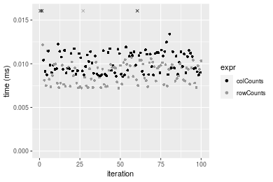

[matrixStats]: Benchmark report

---------------------------------------


# colCounts() and rowCounts() benchmarks

This report benchmark the performance of colCounts() and rowCounts() against alternative methods.

## Alternative methods

* colSums() and rowSums()
* apply() + sum()


## Data type "logical"

### Data
```r
> rmatrix <- function(nrow, ncol, mode = c("logical", "double", "integer", "index"), range = c(-100, 
+     +100), na_prob = 0) {
+     mode <- match.arg(mode)
+     n <- nrow * ncol
+     if (mode == "logical") {
+         x <- sample(c(FALSE, TRUE), size = n, replace = TRUE)
+     }     else if (mode == "index") {
+         x <- seq_len(n)
+         mode <- "integer"
+     }     else {
+         x <- runif(n, min = range[1], max = range[2])
+     }
+     storage.mode(x) <- mode
+     if (na_prob > 0) 
+         x[sample(n, size = na_prob * n)] <- NA
+     dim(x) <- c(nrow, ncol)
+     x
+ }
> rmatrices <- function(scale = 10, seed = 1, ...) {
+     set.seed(seed)
+     data <- list()
+     data[[1]] <- rmatrix(nrow = scale * 1, ncol = scale * 1, ...)
+     data[[2]] <- rmatrix(nrow = scale * 10, ncol = scale * 10, ...)
+     data[[3]] <- rmatrix(nrow = scale * 100, ncol = scale * 1, ...)
+     data[[4]] <- t(data[[3]])
+     data[[5]] <- rmatrix(nrow = scale * 10, ncol = scale * 100, ...)
+     data[[6]] <- t(data[[5]])
+     names(data) <- sapply(data, FUN = function(x) paste(dim(x), collapse = "x"))
+     data
+ }
> data <- rmatrices(mode = mode)
```

### Results

#### 10x10 matrix


```r
> X <- data[["10x10"]]
> value <- 42
```


```r
> colStats <- microbenchmark(colCounts = colCounts(X, value = value, na.rm = FALSE), colSums = colSums(X == 
+     value, na.rm = FALSE), `apply+sum` = apply(X, MARGIN = 2L, FUN = function(x) sum(x == value, 
+     na.rm = FALSE)), unit = "ms")
```

```r
> X <- t(X)
```


```r
> rowStats <- microbenchmark(rowCounts = rowCounts(X, value = value, na.rm = FALSE), rowSums = rowSums(X == 
+     value, na.rm = FALSE), `apply+sum` = apply(X, MARGIN = 1L, FUN = function(x) sum(x == value, 
+     na.rm = FALSE)), unit = "ms")
```

_Table: Benchmarking of colCounts(), colSums() and apply+sum() on logical+10x10 data. The top panel shows times in milliseconds and the bottom panel shows relative times._


|   |expr      |      min|        lq|      mean|    median|        uq|      max|
|:--|:---------|--------:|---------:|---------:|---------:|---------:|--------:|
|2  |colSums   | 0.006501| 0.0073220| 0.0083084| 0.0081615| 0.0088265| 0.027202|
|1  |colCounts | 0.008136| 0.0089050| 0.0104627| 0.0097525| 0.0110085| 0.048968|
|3  |apply+sum | 0.040800| 0.0431555| 0.0452735| 0.0439785| 0.0452470| 0.115865|


|   |expr      |      min|       lq|     mean|   median|       uq|      max|
|:--|:---------|--------:|--------:|--------:|--------:|--------:|--------:|
|2  |colSums   | 1.000000| 1.000000| 1.000000| 1.000000| 1.000000| 1.000000|
|1  |colCounts | 1.251500| 1.216198| 1.259291| 1.194940| 1.247210| 1.800162|
|3  |apply+sum | 6.275957| 5.893950| 5.449132| 5.388532| 5.126267| 4.259430|

_Table: Benchmarking of rowCounts(), rowSums() and apply+sum() on logical+10x10 data (transposed). The top panel shows times in milliseconds and the bottom panel shows relative times._


|   |expr      |      min|        lq|      mean|    median|       uq|      max|
|:--|:---------|--------:|---------:|---------:|---------:|--------:|--------:|
|2  |rowSums   | 0.007394| 0.0080365| 0.0088441| 0.0087190| 0.009276| 0.019050|
|1  |rowCounts | 0.007041| 0.0076265| 0.0090828| 0.0092620| 0.009751| 0.034029|
|3  |apply+sum | 0.041004| 0.0426325| 0.0455665| 0.0433915| 0.044400| 0.112803|


|   |expr      |       min|        lq|     mean|   median|       uq|      max|
|:--|:---------|---------:|---------:|--------:|--------:|--------:|--------:|
|2  |rowSums   | 1.0000000| 1.0000000| 1.000000| 1.000000| 1.000000| 1.000000|
|1  |rowCounts | 0.9522586| 0.9489828| 1.026994| 1.062278| 1.051207| 1.786299|
|3  |apply+sum | 5.5455775| 5.3048591| 5.152195| 4.976660| 4.786546| 5.921417|

_Figure: Benchmarking of colCounts(), colSums() and apply+sum() on logical+10x10 data  as well as rowCounts(), rowSums() and apply+sum() on the same data transposed.  Outliers are displayed as crosses.  Times are in milliseconds._


_Table: Benchmarking of colCounts() and rowCounts() on logical+10x10 data (original and transposed).  The top panel shows times in milliseconds and the bottom panel shows relative times._


|   |expr      |   min|     lq|     mean| median|      uq|    max|
|:--|:---------|-----:|------:|--------:|------:|-------:|------:|
|2  |rowCounts | 7.041| 7.6265|  9.08284| 9.2620|  9.7510| 34.029|
|1  |colCounts | 8.136| 8.9050| 10.46268| 9.7525| 11.0085| 48.968|


|   |expr      |      min|       lq|     mean|   median|       uq|      max|
|:--|:---------|--------:|--------:|--------:|--------:|--------:|--------:|
|2  |rowCounts | 1.000000| 1.000000| 1.000000| 1.000000| 1.000000| 1.000000|
|1  |colCounts | 1.155518| 1.167639| 1.151917| 1.052958| 1.128961| 1.439008|

_Figure: Benchmarking of colCounts() and rowCounts() on logical+10x10 data (original and transposed).  Outliers are displayed as crosses. Times are in milliseconds._


#### 100x100 matrix


```r
> X <- data[["100x100"]]
> value <- 42
```


```r
> colStats <- microbenchmark(colCounts = colCounts(X, value = value, na.rm = FALSE), colSums = colSums(X == 
+     value, na.rm = FALSE), `apply+sum` = apply(X, MARGIN = 2L, FUN = function(x) sum(x == value, 
+     na.rm = FALSE)), unit = "ms")
```

```r
> X <- t(X)
```


```r
> rowStats <- microbenchmark(rowCounts = rowCounts(X, value = value, na.rm = FALSE), rowSums = rowSums(X == 
+     value, na.rm = FALSE), `apply+sum` = apply(X, MARGIN = 1L, FUN = function(x) sum(x == value, 
+     na.rm = FALSE)), unit = "ms")
```

_Table: Benchmarking of colCounts(), colSums() and apply+sum() on logical+100x100 data. The top panel shows times in milliseconds and the bottom panel shows relative times._


|   |expr      |      min|        lq|      mean|    median|        uq|      max|
|:--|:---------|--------:|---------:|---------:|---------:|---------:|--------:|
|2  |colSums   | 0.036407| 0.0398030| 0.0440769| 0.0424175| 0.0465420| 0.070074|
|1  |colCounts | 0.076051| 0.0824960| 0.0916281| 0.0872825| 0.1008040| 0.160833|
|3  |apply+sum | 0.269949| 0.2900645| 0.3206545| 0.3039580| 0.3385325| 0.490250|


|   |expr      |      min|       lq|     mean|   median|       uq|      max|
|:--|:---------|--------:|--------:|--------:|--------:|--------:|--------:|
|2  |colSums   | 1.000000| 1.000000| 1.000000| 1.000000| 1.000000| 1.000000|
|1  |colCounts | 2.088912| 2.072608| 2.078826| 2.057700| 2.165872| 2.295188|
|3  |apply+sum | 7.414755| 7.287503| 7.274895| 7.165863| 7.273699| 6.996175|

_Table: Benchmarking of rowCounts(), rowSums() and apply+sum() on logical+100x100 data (transposed). The top panel shows times in milliseconds and the bottom panel shows relative times._


|   |expr      |      min|        lq|      mean|    median|        uq|      max|
|:--|:---------|--------:|---------:|---------:|---------:|---------:|--------:|
|2  |rowSums   | 0.062661| 0.0684775| 0.0761178| 0.0720920| 0.0824805| 0.115206|
|1  |rowCounts | 0.070389| 0.0795345| 0.0875144| 0.0834775| 0.0965375| 0.132294|
|3  |apply+sum | 0.262021| 0.2856800| 0.3240388| 0.3087325| 0.3536190| 0.539589|


|   |expr      |      min|       lq|     mean|   median|       uq|      max|
|:--|:---------|--------:|--------:|--------:|--------:|--------:|--------:|
|2  |rowSums   | 1.000000| 1.000000| 1.000000| 1.000000| 1.000000| 1.000000|
|1  |rowCounts | 1.123330| 1.161469| 1.149722| 1.157930| 1.170428| 1.148326|
|3  |apply+sum | 4.181564| 4.171881| 4.257068| 4.282479| 4.287304| 4.683688|

_Figure: Benchmarking of colCounts(), colSums() and apply+sum() on logical+100x100 data  as well as rowCounts(), rowSums() and apply+sum() on the same data transposed.  Outliers are displayed as crosses.  Times are in milliseconds._


_Table: Benchmarking of colCounts() and rowCounts() on logical+100x100 data (original and transposed).  The top panel shows times in milliseconds and the bottom panel shows relative times._


|   |expr      |    min|      lq|     mean|  median|       uq|     max|
|:--|:---------|------:|-------:|--------:|-------:|--------:|-------:|
|2  |rowCounts | 70.389| 79.5345| 87.51437| 83.4775|  96.5375| 132.294|
|1  |colCounts | 76.051| 82.4960| 91.62811| 87.2825| 100.8040| 160.833|


|   |expr      |      min|       lq|     mean|   median|       uq|      max|
|:--|:---------|--------:|--------:|--------:|--------:|--------:|--------:|
|2  |rowCounts | 1.000000| 1.000000| 1.000000| 1.000000| 1.000000| 1.000000|
|1  |colCounts | 1.080439| 1.037235| 1.047006| 1.045581| 1.044195| 1.215724|

_Figure: Benchmarking of colCounts() and rowCounts() on logical+100x100 data (original and transposed).  Outliers are displayed as crosses. Times are in milliseconds._


#### 1000x10 matrix


```r
> X <- data[["1000x10"]]
> value <- 42
```


```r
> colStats <- microbenchmark(colCounts = colCounts(X, value = value, na.rm = FALSE), colSums = colSums(X == 
+     value, na.rm = FALSE), `apply+sum` = apply(X, MARGIN = 2L, FUN = function(x) sum(x == value, 
+     na.rm = FALSE)), unit = "ms")
```

```r
> X <- t(X)
```


```r
> rowStats <- microbenchmark(rowCounts = rowCounts(X, value = value, na.rm = FALSE), rowSums = rowSums(X == 
+     value, na.rm = FALSE), `apply+sum` = apply(X, MARGIN = 1L, FUN = function(x) sum(x == value, 
+     na.rm = FALSE)), unit = "ms")
```

_Table: Benchmarking of colCounts(), colSums() and apply+sum() on logical+1000x10 data. The top panel shows times in milliseconds and the bottom panel shows relative times._


|   |expr      |      min|        lq|      mean|    median|        uq|      max|
|:--|:---------|--------:|---------:|---------:|---------:|---------:|--------:|
|2  |colSums   | 0.039955| 0.0415010| 0.0463280| 0.0447725| 0.0496180| 0.113803|
|1  |colCounts | 0.081870| 0.0857645| 0.0964906| 0.0953415| 0.1049435| 0.151107|
|3  |apply+sum | 0.141418| 0.1455040| 0.1668182| 0.1626485| 0.1817585| 0.278370|


|   |expr      |      min|       lq|     mean|   median|       uq|      max|
|:--|:---------|--------:|--------:|--------:|--------:|--------:|--------:|
|2  |colSums   | 1.000000| 1.000000| 1.000000| 1.000000| 1.000000| 1.000000|
|1  |colCounts | 2.049055| 2.066565| 2.082772| 2.129466| 2.115029| 1.327794|
|3  |apply+sum | 3.539432| 3.506036| 3.600811| 3.632777| 3.663156| 2.446069|

_Table: Benchmarking of rowCounts(), rowSums() and apply+sum() on logical+1000x10 data (transposed). The top panel shows times in milliseconds and the bottom panel shows relative times._


|   |expr      |      min|        lq|      mean|   median|        uq|      max|
|:--|:---------|--------:|---------:|---------:|--------:|---------:|--------:|
|1  |rowCounts | 0.070871| 0.0861760| 0.0941584| 0.091879| 0.1038375| 0.141825|
|3  |apply+sum | 0.122591| 0.1336110| 0.1493851| 0.144210| 0.1591510| 0.244967|
|2  |rowSums   | 0.170026| 0.1906035| 0.2066102| 0.199714| 0.2238580| 0.280389|


|   |expr      |      min|       lq|     mean|   median|       uq|      max|
|:--|:---------|--------:|--------:|--------:|--------:|--------:|--------:|
|1  |rowCounts | 1.000000| 1.000000| 1.000000| 1.000000| 1.000000| 1.000000|
|3  |apply+sum | 1.729777| 1.550443| 1.586530| 1.569564| 1.532693| 1.727248|
|2  |rowSums   | 2.399091| 2.211793| 2.194284| 2.173663| 2.155849| 1.977007|

_Figure: Benchmarking of colCounts(), colSums() and apply+sum() on logical+1000x10 data  as well as rowCounts(), rowSums() and apply+sum() on the same data transposed.  Outliers are displayed as crosses.  Times are in milliseconds._


_Table: Benchmarking of colCounts() and rowCounts() on logical+1000x10 data (original and transposed).  The top panel shows times in milliseconds and the bottom panel shows relative times._


|   |expr      |    min|      lq|     mean|  median|       uq|     max|
|:--|:---------|------:|-------:|--------:|-------:|--------:|-------:|
|2  |rowCounts | 70.871| 86.1760| 94.15836| 91.8790| 103.8375| 141.825|
|1  |colCounts | 81.870| 85.7645| 96.49059| 95.3415| 104.9435| 151.107|


|   |expr      |      min|        lq|     mean|   median|       uq|      max|
|:--|:---------|--------:|---------:|--------:|--------:|--------:|--------:|
|2  |rowCounts | 1.000000| 1.0000000| 1.000000| 1.000000| 1.000000| 1.000000|
|1  |colCounts | 1.155198| 0.9952249| 1.024769| 1.037685| 1.010651| 1.065447|

_Figure: Benchmarking of colCounts() and rowCounts() on logical+1000x10 data (original and transposed).  Outliers are displayed as crosses. Times are in milliseconds._


#### 10x1000 matrix


```r
> X <- data[["10x1000"]]
> value <- 42
```


```r
> colStats <- microbenchmark(colCounts = colCounts(X, value = value, na.rm = FALSE), colSums = colSums(X == 
+     value, na.rm = FALSE), `apply+sum` = apply(X, MARGIN = 2L, FUN = function(x) sum(x == value, 
+     na.rm = FALSE)), unit = "ms")
```

```r
> X <- t(X)
```


```r
> rowStats <- microbenchmark(rowCounts = rowCounts(X, value = value, na.rm = FALSE), rowSums = rowSums(X == 
+     value, na.rm = FALSE), `apply+sum` = apply(X, MARGIN = 1L, FUN = function(x) sum(x == value, 
+     na.rm = FALSE)), unit = "ms")
```

_Table: Benchmarking of colCounts(), colSums() and apply+sum() on logical+10x1000 data. The top panel shows times in milliseconds and the bottom panel shows relative times._


|   |expr      |      min|       lq|      mean|   median|       uq|      max|
|:--|:---------|--------:|--------:|---------:|--------:|--------:|--------:|
|2  |colSums   | 0.030777| 0.033685| 0.0380735| 0.036006| 0.039692| 0.086183|
|1  |colCounts | 0.072744| 0.078724| 0.0877118| 0.083235| 0.088893| 0.153550|
|3  |apply+sum | 1.352990| 1.447261| 1.5418828| 1.506645| 1.608526| 2.154248|


|   |expr      |       min|        lq|      mean|    median|       uq|       max|
|:--|:---------|---------:|---------:|---------:|---------:|--------:|---------:|
|2  |colSums   |  1.000000|  1.000000|  1.000000|  1.000000|  1.00000|  1.000000|
|1  |colCounts |  2.363583|  2.337064|  2.303748|  2.311698|  2.23957|  1.781674|
|3  |apply+sum | 43.961075| 42.964554| 40.497512| 41.844276| 40.52521| 24.996206|

_Table: Benchmarking of rowCounts(), rowSums() and apply+sum() on logical+10x1000 data (transposed). The top panel shows times in milliseconds and the bottom panel shows relative times._


|   |expr      |      min|        lq|      mean|    median|        uq|      max|
|:--|:---------|--------:|---------:|---------:|---------:|---------:|--------:|
|2  |rowSums   | 0.045650| 0.0505585| 0.0563910| 0.0534225| 0.0594085| 0.100107|
|1  |rowCounts | 0.062051| 0.0702600| 0.0813624| 0.0757050| 0.0881570| 0.141772|
|3  |apply+sum | 1.344391| 1.4742460| 1.5905001| 1.5300320| 1.6568185| 2.176518|


|   |expr      |       min|        lq|      mean|    median|        uq|       max|
|:--|:---------|---------:|---------:|---------:|---------:|---------:|---------:|
|2  |rowSums   |  1.000000|  1.000000|  1.000000|  1.000000|  1.000000|  1.000000|
|1  |rowCounts |  1.359277|  1.389677|  1.442827|  1.417099|  1.483912|  1.416205|
|3  |apply+sum | 29.449967| 29.159212| 28.204862| 28.640217| 27.888577| 21.741916|

_Figure: Benchmarking of colCounts(), colSums() and apply+sum() on logical+10x1000 data  as well as rowCounts(), rowSums() and apply+sum() on the same data transposed.  Outliers are displayed as crosses.  Times are in milliseconds._


_Table: Benchmarking of colCounts() and rowCounts() on logical+10x1000 data (original and transposed).  The top panel shows times in milliseconds and the bottom panel shows relative times._


|   |expr      |    min|     lq|     mean| median|     uq|     max|
|:--|:---------|------:|------:|--------:|------:|------:|-------:|
|2  |rowCounts | 62.051| 70.260| 81.36245| 75.705| 88.157| 141.772|
|1  |colCounts | 72.744| 78.724| 87.71178| 83.235| 88.893| 153.550|


|   |expr      |      min|       lq|     mean|   median|       uq|      max|
|:--|:---------|--------:|--------:|--------:|--------:|--------:|--------:|
|2  |rowCounts | 1.000000| 1.000000| 1.000000| 1.000000| 1.000000| 1.000000|
|1  |colCounts | 1.172326| 1.120467| 1.078038| 1.099465| 1.008349| 1.083077|

_Figure: Benchmarking of colCounts() and rowCounts() on logical+10x1000 data (original and transposed).  Outliers are displayed as crosses. Times are in milliseconds._


#### 100x1000 matrix


```r
> X <- data[["100x1000"]]
> value <- 42
```


```r
> colStats <- microbenchmark(colCounts = colCounts(X, value = value, na.rm = FALSE), colSums = colSums(X == 
+     value, na.rm = FALSE), `apply+sum` = apply(X, MARGIN = 2L, FUN = function(x) sum(x == value, 
+     na.rm = FALSE)), unit = "ms")
```

```r
> X <- t(X)
```


```r
> rowStats <- microbenchmark(rowCounts = rowCounts(X, value = value, na.rm = FALSE), rowSums = rowSums(X == 
+     value, na.rm = FALSE), `apply+sum` = apply(X, MARGIN = 1L, FUN = function(x) sum(x == value, 
+     na.rm = FALSE)), unit = "ms")
```

_Table: Benchmarking of colCounts(), colSums() and apply+sum() on logical+100x1000 data. The top panel shows times in milliseconds and the bottom panel shows relative times._


|   |expr      |      min|        lq|      mean|    median|        uq|       max|
|:--|:---------|--------:|---------:|---------:|---------:|---------:|---------:|
|2  |colSums   | 0.261205| 0.2856225| 0.4783527| 0.2945520| 0.3105435| 17.695614|
|1  |colCounts | 0.600921| 0.6491945| 0.6698462| 0.6678425| 0.6782875|  0.925825|
|3  |apply+sum | 2.150766| 2.3229135| 2.4447240| 2.4007440| 2.4493115|  3.797806|


|   |expr      |      min|       lq|     mean|   median|       uq|       max|
|:--|:---------|--------:|--------:|--------:|--------:|--------:|---------:|
|2  |colSums   | 1.000000| 1.000000| 1.000000| 1.000000| 1.000000| 1.0000000|
|1  |colCounts | 2.300572| 2.272911| 1.400319| 2.267316| 2.184195| 0.0523195|
|3  |apply+sum | 8.234015| 8.132810| 5.110714| 8.150493| 7.887177| 0.2146185|

_Table: Benchmarking of rowCounts(), rowSums() and apply+sum() on logical+100x1000 data (transposed). The top panel shows times in milliseconds and the bottom panel shows relative times._


|   |expr      |      min|       lq|      mean|    median|        uq|       max|
|:--|:---------|--------:|--------:|---------:|---------:|---------:|---------:|
|2  |rowSums   | 0.405189| 0.438964| 0.4550076| 0.4535765| 0.4643900|  0.556336|
|1  |rowCounts | 0.572433| 0.628539| 0.6556373| 0.6439620| 0.6534015|  0.984505|
|3  |apply+sum | 2.151278| 2.330856| 2.6260043| 2.3835415| 2.4454930| 19.961024|


|   |expr      |      min|       lq|     mean|   median|       uq|       max|
|:--|:---------|--------:|--------:|--------:|--------:|--------:|---------:|
|2  |rowSums   | 1.000000| 1.000000| 1.000000| 1.000000| 1.000000|  1.000000|
|1  |rowCounts | 1.412756| 1.431869| 1.440937| 1.419743| 1.407010|  1.769623|
|3  |apply+sum | 5.309320| 5.309902| 5.771342| 5.254993| 5.266033| 35.879440|

_Figure: Benchmarking of colCounts(), colSums() and apply+sum() on logical+100x1000 data  as well as rowCounts(), rowSums() and apply+sum() on the same data transposed.  Outliers are displayed as crosses.  Times are in milliseconds._


_Table: Benchmarking of colCounts() and rowCounts() on logical+100x1000 data (original and transposed).  The top panel shows times in milliseconds and the bottom panel shows relative times._


|   |expr      |     min|       lq|     mean|   median|       uq|     max|
|:--|:---------|-------:|--------:|--------:|--------:|--------:|-------:|
|2  |rowCounts | 572.433| 628.5390| 655.6373| 643.9620| 653.4015| 984.505|
|1  |colCounts | 600.921| 649.1945| 669.8462| 667.8425| 678.2875| 925.825|


|   |expr      |      min|       lq|     mean|   median|       uq|       max|
|:--|:---------|--------:|--------:|--------:|--------:|--------:|---------:|
|2  |rowCounts | 1.000000| 1.000000| 1.000000| 1.000000| 1.000000| 1.0000000|
|1  |colCounts | 1.049767| 1.032863| 1.021672| 1.037084| 1.038087| 0.9403964|

_Figure: Benchmarking of colCounts() and rowCounts() on logical+100x1000 data (original and transposed).  Outliers are displayed as crosses. Times are in milliseconds._


#### 1000x100 matrix


```r
> X <- data[["1000x100"]]
> value <- 42
```


```r
> colStats <- microbenchmark(colCounts = colCounts(X, value = value, na.rm = FALSE), colSums = colSums(X == 
+     value, na.rm = FALSE), `apply+sum` = apply(X, MARGIN = 2L, FUN = function(x) sum(x == value, 
+     na.rm = FALSE)), unit = "ms")
```

```r
> X <- t(X)
```


```r
> rowStats <- microbenchmark(rowCounts = rowCounts(X, value = value, na.rm = FALSE), rowSums = rowSums(X == 
+     value, na.rm = FALSE), `apply+sum` = apply(X, MARGIN = 1L, FUN = function(x) sum(x == value, 
+     na.rm = FALSE)), unit = "ms")
```

_Table: Benchmarking of colCounts(), colSums() and apply+sum() on logical+1000x100 data. The top panel shows times in milliseconds and the bottom panel shows relative times._


|   |expr      |      min|        lq|      mean|    median|        uq|      max|
|:--|:---------|--------:|---------:|---------:|---------:|---------:|--------:|
|2  |colSums   | 0.264316| 0.2752995| 0.2935237| 0.2865115| 0.2981235| 0.401451|
|1  |colCounts | 0.592004| 0.6237240| 0.6820136| 0.6446900| 0.7149680| 1.010604|
|3  |apply+sum | 0.932985| 0.9867185| 1.1448083| 1.0285045| 1.1287550| 8.547166|


|   |expr      |      min|       lq|     mean|   median|       uq|       max|
|:--|:---------|--------:|--------:|--------:|--------:|--------:|---------:|
|2  |colSums   | 1.000000| 1.000000| 1.000000| 1.000000| 1.000000|  1.000000|
|1  |colCounts | 2.239759| 2.265620| 2.323538| 2.250137| 2.398228|  2.517378|
|3  |apply+sum | 3.529809| 3.584164| 3.900224| 3.589749| 3.786199| 21.290683|

_Table: Benchmarking of rowCounts(), rowSums() and apply+sum() on logical+1000x100 data (transposed). The top panel shows times in milliseconds and the bottom panel shows relative times._


|   |expr      |      min|        lq|      mean|    median|        uq|      max|
|:--|:---------|--------:|---------:|---------:|---------:|---------:|--------:|
|2  |rowSums   | 0.505743| 0.5476215| 0.5771170| 0.5536975| 0.5746035| 0.922504|
|1  |rowCounts | 0.578038| 0.6270185| 0.6690668| 0.6403885| 0.6807910| 1.010234|
|3  |apply+sum | 0.940992| 1.0089565| 1.1637090| 1.0268850| 1.1337085| 8.836396|


|   |expr      |      min|       lq|     mean|   median|       uq|      max|
|:--|:---------|--------:|--------:|--------:|--------:|--------:|--------:|
|2  |rowSums   | 1.000000| 1.000000| 1.000000| 1.000000| 1.000000| 1.000000|
|1  |rowCounts | 1.142948| 1.144985| 1.159326| 1.156567| 1.184801| 1.095100|
|3  |apply+sum | 1.860613| 1.842434| 2.016418| 1.854596| 1.973027| 9.578708|

_Figure: Benchmarking of colCounts(), colSums() and apply+sum() on logical+1000x100 data  as well as rowCounts(), rowSums() and apply+sum() on the same data transposed.  Outliers are displayed as crosses.  Times are in milliseconds._


_Table: Benchmarking of colCounts() and rowCounts() on logical+1000x100 data (original and transposed).  The top panel shows times in milliseconds and the bottom panel shows relative times._


|   |expr      |     min|       lq|     mean|   median|      uq|      max|
|:--|:---------|-------:|--------:|--------:|--------:|-------:|--------:|
|2  |rowCounts | 578.038| 627.0185| 669.0668| 640.3885| 680.791| 1010.234|
|1  |colCounts | 592.004| 623.7240| 682.0136| 644.6900| 714.968| 1010.604|


|   |expr      |      min|        lq|     mean|   median|       uq|      max|
|:--|:---------|--------:|---------:|--------:|--------:|--------:|--------:|
|2  |rowCounts | 1.000000| 1.0000000| 1.000000| 1.000000| 1.000000| 1.000000|
|1  |colCounts | 1.024161| 0.9947458| 1.019351| 1.006717| 1.050202| 1.000366|

_Figure: Benchmarking of colCounts() and rowCounts() on logical+1000x100 data (original and transposed).  Outliers are displayed as crosses. Times are in milliseconds._


## Data type "integer"

### Data
```r
> rmatrix <- function(nrow, ncol, mode = c("logical", "double", "integer", "index"), range = c(-100, 
+     +100), na_prob = 0) {
+     mode <- match.arg(mode)
+     n <- nrow * ncol
+     if (mode == "logical") {
+         x <- sample(c(FALSE, TRUE), size = n, replace = TRUE)
+     }     else if (mode == "index") {
+         x <- seq_len(n)
+         mode <- "integer"
+     }     else {
+         x <- runif(n, min = range[1], max = range[2])
+     }
+     storage.mode(x) <- mode
+     if (na_prob > 0) 
+         x[sample(n, size = na_prob * n)] <- NA
+     dim(x) <- c(nrow, ncol)
+     x
+ }
> rmatrices <- function(scale = 10, seed = 1, ...) {
+     set.seed(seed)
+     data <- list()
+     data[[1]] <- rmatrix(nrow = scale * 1, ncol = scale * 1, ...)
+     data[[2]] <- rmatrix(nrow = scale * 10, ncol = scale * 10, ...)
+     data[[3]] <- rmatrix(nrow = scale * 100, ncol = scale * 1, ...)
+     data[[4]] <- t(data[[3]])
+     data[[5]] <- rmatrix(nrow = scale * 10, ncol = scale * 100, ...)
+     data[[6]] <- t(data[[5]])
+     names(data) <- sapply(data, FUN = function(x) paste(dim(x), collapse = "x"))
+     data
+ }
> data <- rmatrices(mode = mode)
```

### Results

#### 10x10 matrix


```r
> X <- data[["10x10"]]
> value <- 42
```


```r
> colStats <- microbenchmark(colCounts = colCounts(X, value = value, na.rm = FALSE), colSums = colSums(X == 
+     value, na.rm = FALSE), `apply+sum` = apply(X, MARGIN = 2L, FUN = function(x) sum(x == value, 
+     na.rm = FALSE)), unit = "ms")
```

```r
> X <- t(X)
```


```r
> rowStats <- microbenchmark(rowCounts = rowCounts(X, value = value, na.rm = FALSE), rowSums = rowSums(X == 
+     value, na.rm = FALSE), `apply+sum` = apply(X, MARGIN = 1L, FUN = function(x) sum(x == value, 
+     na.rm = FALSE)), unit = "ms")
```

_Table: Benchmarking of colCounts(), colSums() and apply+sum() on integer+10x10 data. The top panel shows times in milliseconds and the bottom panel shows relative times._


|   |expr      |      min|       lq|      mean|    median|        uq|      max|
|:--|:---------|--------:|--------:|---------:|---------:|---------:|--------:|
|2  |colSums   | 0.006626| 0.007294| 0.0085629| 0.0082660| 0.0089155| 0.021699|
|1  |colCounts | 0.008518| 0.008998| 0.0105554| 0.0099655| 0.0112540| 0.038060|
|3  |apply+sum | 0.041677| 0.043320| 0.0453861| 0.0442305| 0.0452055| 0.117208|


|   |expr      |      min|       lq|     mean|   median|       uq|      max|
|:--|:---------|--------:|--------:|--------:|--------:|--------:|--------:|
|2  |colSums   | 1.000000| 1.000000| 1.000000| 1.000000| 1.000000| 1.000000|
|1  |colCounts | 1.285542| 1.233617| 1.232699| 1.205601| 1.262296| 1.753998|
|3  |apply+sum | 6.289918| 5.939128| 5.300329| 5.350895| 5.070439| 5.401539|

_Table: Benchmarking of rowCounts(), rowSums() and apply+sum() on integer+10x10 data (transposed). The top panel shows times in milliseconds and the bottom panel shows relative times._


|   |expr      |      min|        lq|      mean|    median|        uq|      max|
|:--|:---------|--------:|---------:|---------:|---------:|---------:|--------:|
|2  |rowSums   | 0.007367| 0.0082515| 0.0090520| 0.0089205| 0.0095640| 0.020015|
|1  |rowCounts | 0.007200| 0.0077835| 0.0093122| 0.0093590| 0.0098685| 0.034042|
|3  |apply+sum | 0.041930| 0.0432210| 0.0460938| 0.0442305| 0.0465350| 0.120707|


|   |expr      |       min|       lq|     mean|   median|       uq|      max|
|:--|:---------|---------:|--------:|--------:|--------:|--------:|--------:|
|2  |rowSums   | 1.0000000| 1.000000| 1.000000| 1.000000| 1.000000| 1.000000|
|1  |rowCounts | 0.9773313| 0.943283| 1.028749| 1.049156| 1.031838| 1.700824|
|3  |apply+sum | 5.6915977| 5.237957| 5.092116| 4.958298| 4.865642| 6.030827|

_Figure: Benchmarking of colCounts(), colSums() and apply+sum() on integer+10x10 data  as well as rowCounts(), rowSums() and apply+sum() on the same data transposed.  Outliers are displayed as crosses.  Times are in milliseconds._


_Table: Benchmarking of colCounts() and rowCounts() on integer+10x10 data (original and transposed).  The top panel shows times in milliseconds and the bottom panel shows relative times._


|   |expr      |   min|     lq|     mean| median|      uq|    max|
|:--|:---------|-----:|------:|--------:|------:|-------:|------:|
|2  |rowCounts | 7.200| 7.7835|  9.31224| 9.3590|  9.8685| 34.042|
|1  |colCounts | 8.518| 8.9980| 10.55545| 9.9655| 11.2540| 38.060|


|   |expr      |      min|       lq|     mean|   median|       uq|      max|
|:--|:---------|--------:|--------:|--------:|--------:|--------:|--------:|
|2  |rowCounts | 1.000000| 1.000000| 1.000000| 1.000000| 1.000000| 1.000000|
|1  |colCounts | 1.183056| 1.156035| 1.133503| 1.064804| 1.140396| 1.118031|

_Figure: Benchmarking of colCounts() and rowCounts() on integer+10x10 data (original and transposed).  Outliers are displayed as crosses. Times are in milliseconds._




#### 100x100 matrix


```r
> X <- data[["100x100"]]
> value <- 42
```


```r
> colStats <- microbenchmark(colCounts = colCounts(X, value = value, na.rm = FALSE), colSums = colSums(X == 
+     value, na.rm = FALSE), `apply+sum` = apply(X, MARGIN = 2L, FUN = function(x) sum(x == value, 
+     na.rm = FALSE)), unit = "ms")
```

```r
> X <- t(X)
```


```r
> rowStats <- microbenchmark(rowCounts = rowCounts(X, value = value, na.rm = FALSE), rowSums = rowSums(X == 
+     value, na.rm = FALSE), `apply+sum` = apply(X, MARGIN = 1L, FUN = function(x) sum(x == value, 
+     na.rm = FALSE)), unit = "ms")
```

_Table: Benchmarking of colCounts(), colSums() and apply+sum() on integer+100x100 data. The top panel shows times in milliseconds and the bottom panel shows relative times._


|   |expr      |      min|        lq|      mean|    median|        uq|      max|
|:--|:---------|--------:|---------:|---------:|---------:|---------:|--------:|
|2  |colSums   | 0.037768| 0.0405210| 0.0458021| 0.0444525| 0.0496990| 0.093093|
|1  |colCounts | 0.042724| 0.0475290| 0.0533364| 0.0509165| 0.0578555| 0.109744|
|3  |apply+sum | 0.264001| 0.2859985| 0.3263118| 0.3046985| 0.3565860| 0.593220|


|   |expr      |      min|       lq|     mean|   median|       uq|      max|
|:--|:---------|--------:|--------:|--------:|--------:|--------:|--------:|
|2  |colSums   | 1.000000| 1.000000| 1.000000| 1.000000| 1.000000| 1.000000|
|1  |colCounts | 1.131222| 1.172947| 1.164496| 1.145414| 1.164118| 1.178864|
|3  |apply+sum | 6.990071| 7.058032| 7.124382| 6.854474| 7.174913| 6.372337|

_Table: Benchmarking of rowCounts(), rowSums() and apply+sum() on integer+100x100 data (transposed). The top panel shows times in milliseconds and the bottom panel shows relative times._


|   |expr      |      min|        lq|      mean|    median|        uq|      max|
|:--|:---------|--------:|---------:|---------:|---------:|---------:|--------:|
|1  |rowCounts | 0.031985| 0.0356685| 0.0399702| 0.0377125| 0.0435030| 0.070805|
|2  |rowSums   | 0.064445| 0.0692020| 0.0764049| 0.0726110| 0.0820465| 0.119230|
|3  |apply+sum | 0.258466| 0.2754525| 0.3094303| 0.2902240| 0.3294460| 0.483973|


|   |expr      |      min|       lq|     mean|   median|       uq|      max|
|:--|:---------|--------:|--------:|--------:|--------:|--------:|--------:|
|1  |rowCounts | 1.000000| 1.000000| 1.000000| 1.000000| 1.000000| 1.000000|
|2  |rowSums   | 2.014851| 1.940143| 1.911548| 1.925383| 1.885996| 1.683921|
|3  |apply+sum | 8.080850| 7.722570| 7.741530| 7.695698| 7.572949| 6.835294|

_Figure: Benchmarking of colCounts(), colSums() and apply+sum() on integer+100x100 data  as well as rowCounts(), rowSums() and apply+sum() on the same data transposed.  Outliers are displayed as crosses.  Times are in milliseconds._


_Table: Benchmarking of colCounts() and rowCounts() on integer+100x100 data (original and transposed).  The top panel shows times in milliseconds and the bottom panel shows relative times._


|   |expr      |    min|      lq|     mean|  median|      uq|     max|
|:--|:---------|------:|-------:|--------:|-------:|-------:|-------:|
|2  |rowCounts | 31.985| 35.6685| 39.97017| 37.7125| 43.5030|  70.805|
|1  |colCounts | 42.724| 47.5290| 53.33639| 50.9165| 57.8555| 109.744|


|   |expr      |      min|      lq|     mean|   median|      uq|      max|
|:--|:---------|--------:|-------:|--------:|--------:|-------:|--------:|
|2  |rowCounts | 1.000000| 1.00000| 1.000000| 1.000000| 1.00000| 1.000000|
|1  |colCounts | 1.335751| 1.33252| 1.334405| 1.350123| 1.32992| 1.549947|

_Figure: Benchmarking of colCounts() and rowCounts() on integer+100x100 data (original and transposed).  Outliers are displayed as crosses. Times are in milliseconds._


#### 1000x10 matrix


```r
> X <- data[["1000x10"]]
> value <- 42
```


```r
> colStats <- microbenchmark(colCounts = colCounts(X, value = value, na.rm = FALSE), colSums = colSums(X == 
+     value, na.rm = FALSE), `apply+sum` = apply(X, MARGIN = 2L, FUN = function(x) sum(x == value, 
+     na.rm = FALSE)), unit = "ms")
```

```r
> X <- t(X)
```


```r
> rowStats <- microbenchmark(rowCounts = rowCounts(X, value = value, na.rm = FALSE), rowSums = rowSums(X == 
+     value, na.rm = FALSE), `apply+sum` = apply(X, MARGIN = 1L, FUN = function(x) sum(x == value, 
+     na.rm = FALSE)), unit = "ms")
```

_Table: Benchmarking of colCounts(), colSums() and apply+sum() on integer+1000x10 data. The top panel shows times in milliseconds and the bottom panel shows relative times._


|   |expr      |      min|       lq|      mean|    median|        uq|      max|
|:--|:---------|--------:|--------:|---------:|---------:|---------:|--------:|
|2  |colSums   | 0.039845| 0.041388| 0.0454423| 0.0444495| 0.0479125| 0.083981|
|1  |colCounts | 0.044569| 0.046770| 0.0520864| 0.0513160| 0.0557325| 0.082555|
|3  |apply+sum | 0.130870| 0.135431| 0.1509504| 0.1474645| 0.1664075| 0.224711|


|   |expr      |      min|       lq|     mean|   median|       uq|      max|
|:--|:---------|--------:|--------:|--------:|--------:|--------:|--------:|
|2  |colSums   | 1.000000| 1.000000| 1.000000| 1.000000| 1.000000| 1.000000|
|1  |colCounts | 1.118559| 1.130038| 1.146211| 1.154479| 1.163214| 0.983020|
|3  |apply+sum | 3.284477| 3.272229| 3.321806| 3.317574| 3.473154| 2.675736|

_Table: Benchmarking of rowCounts(), rowSums() and apply+sum() on integer+1000x10 data (transposed). The top panel shows times in milliseconds and the bottom panel shows relative times._


|   |expr      |      min|        lq|      mean|    median|        uq|      max|
|:--|:---------|--------:|---------:|---------:|---------:|---------:|--------:|
|1  |rowCounts | 0.033575| 0.0375830| 0.0418534| 0.0412785| 0.0456020| 0.073876|
|3  |apply+sum | 0.120425| 0.1293015| 0.1431415| 0.1362375| 0.1510665| 0.224308|
|2  |rowSums   | 0.180225| 0.1928710| 0.2117158| 0.2003005| 0.2311610| 0.274867|


|   |expr      |      min|       lq|     mean|   median|       uq|      max|
|:--|:---------|--------:|--------:|--------:|--------:|--------:|--------:|
|1  |rowCounts | 1.000000| 1.000000| 1.000000| 1.000000| 1.000000| 1.000000|
|3  |apply+sum | 3.586746| 3.440425| 3.420066| 3.300447| 3.312717| 3.036277|
|2  |rowSums   | 5.367833| 5.131868| 5.058504| 4.852417| 5.069098| 3.720654|

_Figure: Benchmarking of colCounts(), colSums() and apply+sum() on integer+1000x10 data  as well as rowCounts(), rowSums() and apply+sum() on the same data transposed.  Outliers are displayed as crosses.  Times are in milliseconds._


_Table: Benchmarking of colCounts() and rowCounts() on integer+1000x10 data (original and transposed).  The top panel shows times in milliseconds and the bottom panel shows relative times._


|   |expr      |    min|     lq|     mean|  median|      uq|    max|
|:--|:---------|------:|------:|--------:|-------:|-------:|------:|
|2  |rowCounts | 33.575| 37.583| 41.85343| 41.2785| 45.6020| 73.876|
|1  |colCounts | 44.569| 46.770| 52.08644| 51.3160| 55.7325| 82.555|


|   |expr      |      min|       lq|     mean|   median|      uq|      max|
|:--|:---------|--------:|--------:|--------:|--------:|-------:|--------:|
|2  |rowCounts | 1.000000| 1.000000| 1.000000| 1.000000| 1.00000| 1.000000|
|1  |colCounts | 1.327446| 1.244446| 1.244496| 1.243165| 1.22215| 1.117481|

_Figure: Benchmarking of colCounts() and rowCounts() on integer+1000x10 data (original and transposed).  Outliers are displayed as crosses. Times are in milliseconds._


#### 10x1000 matrix


```r
> X <- data[["10x1000"]]
> value <- 42
```


```r
> colStats <- microbenchmark(colCounts = colCounts(X, value = value, na.rm = FALSE), colSums = colSums(X == 
+     value, na.rm = FALSE), `apply+sum` = apply(X, MARGIN = 2L, FUN = function(x) sum(x == value, 
+     na.rm = FALSE)), unit = "ms")
```

```r
> X <- t(X)
```


```r
> rowStats <- microbenchmark(rowCounts = rowCounts(X, value = value, na.rm = FALSE), rowSums = rowSums(X == 
+     value, na.rm = FALSE), `apply+sum` = apply(X, MARGIN = 1L, FUN = function(x) sum(x == value, 
+     na.rm = FALSE)), unit = "ms")
```

_Table: Benchmarking of colCounts(), colSums() and apply+sum() on integer+10x1000 data. The top panel shows times in milliseconds and the bottom panel shows relative times._


|   |expr      |      min|       lq|      mean|    median|        uq|      max|
|:--|:---------|--------:|--------:|---------:|---------:|---------:|--------:|
|2  |colSums   | 0.030778| 0.034657| 0.0405747| 0.0369215| 0.0429595| 0.084831|
|1  |colCounts | 0.038625| 0.043015| 0.0496964| 0.0468140| 0.0522395| 0.095721|
|3  |apply+sum | 1.310625| 1.412213| 1.5375623| 1.4823900| 1.5930885| 2.639316|


|   |expr      |       min|        lq|      mean|    median|        uq|       max|
|:--|:---------|---------:|---------:|---------:|---------:|---------:|---------:|
|2  |colSums   |  1.000000|  1.000000|  1.000000|  1.000000|  1.000000|  1.000000|
|1  |colCounts |  1.254955|  1.241163|  1.224811|  1.267933|  1.216017|  1.128373|
|3  |apply+sum | 42.583176| 40.748276| 37.894589| 40.149777| 37.083497| 31.112636|

_Table: Benchmarking of rowCounts(), rowSums() and apply+sum() on integer+10x1000 data (transposed). The top panel shows times in milliseconds and the bottom panel shows relative times._


|   |expr      |      min|        lq|      mean|    median|        uq|      max|
|:--|:---------|--------:|---------:|---------:|---------:|---------:|--------:|
|1  |rowCounts | 0.027429| 0.0308805| 0.0356957| 0.0335800| 0.0377655| 0.088183|
|2  |rowSums   | 0.045477| 0.0498400| 0.0552398| 0.0522535| 0.0581305| 0.094048|
|3  |apply+sum | 1.300316| 1.4117940| 1.5084055| 1.4651420| 1.5634850| 2.087419|


|   |expr      |      min|        lq|      mean|   median|        uq|       max|
|:--|:---------|--------:|---------:|---------:|--------:|---------:|---------:|
|1  |rowCounts |  1.00000|  1.000000|  1.000000|  1.00000|  1.000000|  1.000000|
|2  |rowSums   |  1.65799|  1.613964|  1.547518|  1.55609|  1.539249|  1.066509|
|3  |apply+sum | 47.40661| 45.717977| 42.257298| 43.63139| 41.399823| 23.671445|

_Figure: Benchmarking of colCounts(), colSums() and apply+sum() on integer+10x1000 data  as well as rowCounts(), rowSums() and apply+sum() on the same data transposed.  Outliers are displayed as crosses.  Times are in milliseconds._


_Table: Benchmarking of colCounts() and rowCounts() on integer+10x1000 data (original and transposed).  The top panel shows times in milliseconds and the bottom panel shows relative times._


|   |expr      |    min|      lq|     mean| median|      uq|    max|
|:--|:---------|------:|-------:|--------:|------:|-------:|------:|
|2  |rowCounts | 27.429| 30.8805| 35.69574| 33.580| 37.7655| 88.183|
|1  |colCounts | 38.625| 43.0150| 49.69637| 46.814| 52.2395| 95.721|


|   |expr      |      min|      lq|     mean|   median|      uq|      max|
|:--|:---------|--------:|-------:|--------:|--------:|-------:|--------:|
|2  |rowCounts | 1.000000| 1.00000| 1.000000| 1.000000| 1.00000| 1.000000|
|1  |colCounts | 1.408181| 1.39295| 1.392221| 1.394104| 1.38326| 1.085481|

_Figure: Benchmarking of colCounts() and rowCounts() on integer+10x1000 data (original and transposed).  Outliers are displayed as crosses. Times are in milliseconds._


#### 100x1000 matrix


```r
> X <- data[["100x1000"]]
> value <- 42
```


```r
> colStats <- microbenchmark(colCounts = colCounts(X, value = value, na.rm = FALSE), colSums = colSums(X == 
+     value, na.rm = FALSE), `apply+sum` = apply(X, MARGIN = 2L, FUN = function(x) sum(x == value, 
+     na.rm = FALSE)), unit = "ms")
```

```r
> X <- t(X)
```


```r
> rowStats <- microbenchmark(rowCounts = rowCounts(X, value = value, na.rm = FALSE), rowSums = rowSums(X == 
+     value, na.rm = FALSE), `apply+sum` = apply(X, MARGIN = 1L, FUN = function(x) sum(x == value, 
+     na.rm = FALSE)), unit = "ms")
```

_Table: Benchmarking of colCounts(), colSums() and apply+sum() on integer+100x1000 data. The top panel shows times in milliseconds and the bottom panel shows relative times._


|   |expr      |      min|        lq|      mean|    median|       uq|       max|
|:--|:---------|--------:|---------:|---------:|---------:|--------:|---------:|
|2  |colSums   | 0.264572| 0.2920820| 0.4882184| 0.3013125| 0.312993| 17.844516|
|1  |colCounts | 0.307298| 0.3376245| 0.3505225| 0.3475470| 0.355038|  0.528144|
|3  |apply+sum | 2.056618| 2.2697440| 2.3934044| 2.3261405| 2.393671|  3.689791|


|   |expr      |      min|       lq|      mean|   median|       uq|       max|
|:--|:---------|--------:|--------:|---------:|--------:|--------:|---------:|
|2  |colSums   | 1.000000| 1.000000| 1.0000000| 1.000000| 1.000000| 1.0000000|
|1  |colCounts | 1.161491| 1.155924| 0.7179624| 1.153444| 1.134332| 0.0295970|
|3  |apply+sum | 7.773377| 7.770914| 4.9023232| 7.720027| 7.647684| 0.2067745|

_Table: Benchmarking of rowCounts(), rowSums() and apply+sum() on integer+100x1000 data (transposed). The top panel shows times in milliseconds and the bottom panel shows relative times._


|   |expr      |      min|       lq|      mean|    median|        uq|       max|
|:--|:---------|--------:|--------:|---------:|---------:|---------:|---------:|
|1  |rowCounts | 0.227010| 0.249994| 0.2627078| 0.2573680| 0.2647860|  0.414471|
|2  |rowSums   | 0.406690| 0.449248| 0.4665504| 0.4651525| 0.4743145|  0.603410|
|3  |apply+sum | 2.053905| 2.266421| 2.5475558| 2.3270635| 2.3745725| 20.193188|


|   |expr      |      min|       lq|     mean|   median|       uq|       max|
|:--|:---------|--------:|--------:|--------:|--------:|--------:|---------:|
|1  |rowCounts | 1.000000| 1.000000| 1.000000| 1.000000| 1.000000|  1.000000|
|2  |rowSums   | 1.791507| 1.797035| 1.775929| 1.807344| 1.791313|  1.455856|
|3  |apply+sum | 9.047641| 9.065904| 9.697297| 9.041775| 8.967893| 48.720388|

_Figure: Benchmarking of colCounts(), colSums() and apply+sum() on integer+100x1000 data  as well as rowCounts(), rowSums() and apply+sum() on the same data transposed.  Outliers are displayed as crosses.  Times are in milliseconds._


_Table: Benchmarking of colCounts() and rowCounts() on integer+100x1000 data (original and transposed).  The top panel shows times in milliseconds and the bottom panel shows relative times._


|   |expr      |     min|       lq|     mean|  median|      uq|     max|
|:--|:---------|-------:|--------:|--------:|-------:|-------:|-------:|
|2  |rowCounts | 227.010| 249.9940| 262.7078| 257.368| 264.786| 414.471|
|1  |colCounts | 307.298| 337.6245| 350.5225| 347.547| 355.038| 528.144|


|   |expr      |      min|      lq|     mean|   median|       uq|     max|
|:--|:---------|--------:|-------:|--------:|--------:|--------:|-------:|
|2  |rowCounts | 1.000000| 1.00000| 1.000000| 1.000000| 1.000000| 1.00000|
|1  |colCounts | 1.353676| 1.35053| 1.334267| 1.350389| 1.340849| 1.27426|

_Figure: Benchmarking of colCounts() and rowCounts() on integer+100x1000 data (original and transposed).  Outliers are displayed as crosses. Times are in milliseconds._


#### 1000x100 matrix


```r
> X <- data[["1000x100"]]
> value <- 42
```


```r
> colStats <- microbenchmark(colCounts = colCounts(X, value = value, na.rm = FALSE), colSums = colSums(X == 
+     value, na.rm = FALSE), `apply+sum` = apply(X, MARGIN = 2L, FUN = function(x) sum(x == value, 
+     na.rm = FALSE)), unit = "ms")
```

```r
> X <- t(X)
```


```r
> rowStats <- microbenchmark(rowCounts = rowCounts(X, value = value, na.rm = FALSE), rowSums = rowSums(X == 
+     value, na.rm = FALSE), `apply+sum` = apply(X, MARGIN = 1L, FUN = function(x) sum(x == value, 
+     na.rm = FALSE)), unit = "ms")
```

_Table: Benchmarking of colCounts(), colSums() and apply+sum() on integer+1000x100 data. The top panel shows times in milliseconds and the bottom panel shows relative times._


|   |expr      |      min|        lq|      mean|    median|        uq|      max|
|:--|:---------|--------:|---------:|---------:|---------:|---------:|--------:|
|2  |colSums   | 0.264082| 0.2834590| 0.3026913| 0.2948455| 0.3111115| 0.445120|
|1  |colCounts | 0.294222| 0.3198440| 0.3525906| 0.3305465| 0.3760595| 0.527161|
|3  |apply+sum | 0.865563| 0.9335955| 1.0999853| 0.9697700| 1.1156315| 8.721477|


|   |expr      |      min|       lq|     mean|   median|       uq|       max|
|:--|:---------|--------:|--------:|--------:|--------:|--------:|---------:|
|2  |colSums   | 1.000000| 1.000000| 1.000000| 1.000000| 1.000000|  1.000000|
|1  |colCounts | 1.114131| 1.128361| 1.164852| 1.121084| 1.208761|  1.184312|
|3  |apply+sum | 3.277630| 3.293582| 3.634017| 3.289079| 3.585954| 19.593541|

_Table: Benchmarking of rowCounts(), rowSums() and apply+sum() on integer+1000x100 data (transposed). The top panel shows times in milliseconds and the bottom panel shows relative times._


|   |expr      |      min|        lq|      mean|    median|       uq|      max|
|:--|:---------|--------:|---------:|---------:|---------:|--------:|--------:|
|1  |rowCounts | 0.230868| 0.2524785| 0.2713328| 0.2598240| 0.289090| 0.404084|
|2  |rowSums   | 0.507178| 0.5500880| 0.5884659| 0.5672945| 0.600566| 0.858183|
|3  |apply+sum | 0.868879| 0.9416785| 1.1061136| 0.9848270| 1.086796| 8.908098|


|   |expr      |      min|       lq|     mean|   median|       uq|       max|
|:--|:---------|--------:|--------:|--------:|--------:|--------:|---------:|
|1  |rowCounts | 1.000000| 1.000000| 1.000000| 1.000000| 1.000000|  1.000000|
|2  |rowSums   | 2.196831| 2.178752| 2.168797| 2.183380| 2.077436|  2.123774|
|3  |apply+sum | 3.763532| 3.729737| 4.076594| 3.790362| 3.759369| 22.045164|

_Figure: Benchmarking of colCounts(), colSums() and apply+sum() on integer+1000x100 data  as well as rowCounts(), rowSums() and apply+sum() on the same data transposed.  Outliers are displayed as crosses.  Times are in milliseconds._


_Table: Benchmarking of colCounts() and rowCounts() on integer+1000x100 data (original and transposed).  The top panel shows times in milliseconds and the bottom panel shows relative times._


|   |expr      |     min|       lq|     mean|   median|       uq|     max|
|:--|:---------|-------:|--------:|--------:|--------:|--------:|-------:|
|2  |rowCounts | 230.868| 252.4785| 271.3328| 259.8240| 289.0900| 404.084|
|1  |colCounts | 294.222| 319.8440| 352.5906| 330.5465| 376.0595| 527.161|


|   |expr      |      min|       lq|     mean|   median|       uq|      max|
|:--|:---------|--------:|--------:|--------:|--------:|--------:|--------:|
|2  |rowCounts | 1.000000| 1.000000| 1.000000| 1.000000| 1.000000| 1.000000|
|1  |colCounts | 1.274417| 1.266817| 1.299476| 1.272194| 1.300839| 1.304583|

_Figure: Benchmarking of colCounts() and rowCounts() on integer+1000x100 data (original and transposed).  Outliers are displayed as crosses. Times are in milliseconds._


## Data type "double"

### Data
```r
> rmatrix <- function(nrow, ncol, mode = c("logical", "double", "integer", "index"), range = c(-100, 
+     +100), na_prob = 0) {
+     mode <- match.arg(mode)
+     n <- nrow * ncol
+     if (mode == "logical") {
+         x <- sample(c(FALSE, TRUE), size = n, replace = TRUE)
+     }     else if (mode == "index") {
+         x <- seq_len(n)
+         mode <- "integer"
+     }     else {
+         x <- runif(n, min = range[1], max = range[2])
+     }
+     storage.mode(x) <- mode
+     if (na_prob > 0) 
+         x[sample(n, size = na_prob * n)] <- NA
+     dim(x) <- c(nrow, ncol)
+     x
+ }
> rmatrices <- function(scale = 10, seed = 1, ...) {
+     set.seed(seed)
+     data <- list()
+     data[[1]] <- rmatrix(nrow = scale * 1, ncol = scale * 1, ...)
+     data[[2]] <- rmatrix(nrow = scale * 10, ncol = scale * 10, ...)
+     data[[3]] <- rmatrix(nrow = scale * 100, ncol = scale * 1, ...)
+     data[[4]] <- t(data[[3]])
+     data[[5]] <- rmatrix(nrow = scale * 10, ncol = scale * 100, ...)
+     data[[6]] <- t(data[[5]])
+     names(data) <- sapply(data, FUN = function(x) paste(dim(x), collapse = "x"))
+     data
+ }
> data <- rmatrices(mode = mode)
```

### Results

#### 10x10 matrix


```r
> X <- data[["10x10"]]
> value <- 42
```


```r
> colStats <- microbenchmark(colCounts = colCounts(X, value = value, na.rm = FALSE), colSums = colSums(X == 
+     value, na.rm = FALSE), `apply+sum` = apply(X, MARGIN = 2L, FUN = function(x) sum(x == value, 
+     na.rm = FALSE)), unit = "ms")
```

```r
> X <- t(X)
```


```r
> rowStats <- microbenchmark(rowCounts = rowCounts(X, value = value, na.rm = FALSE), rowSums = rowSums(X == 
+     value, na.rm = FALSE), `apply+sum` = apply(X, MARGIN = 1L, FUN = function(x) sum(x == value, 
+     na.rm = FALSE)), unit = "ms")
```

_Table: Benchmarking of colCounts(), colSums() and apply+sum() on double+10x10 data. The top panel shows times in milliseconds and the bottom panel shows relative times._


|   |expr      |      min|        lq|      mean|    median|        uq|      max|
|:--|:---------|--------:|---------:|---------:|---------:|---------:|--------:|
|2  |colSums   | 0.006344| 0.0071695| 0.0081452| 0.0081490| 0.0087110| 0.019743|
|1  |colCounts | 0.007943| 0.0087810| 0.0101203| 0.0095020| 0.0108475| 0.039544|
|3  |apply+sum | 0.041412| 0.0426590| 0.0445136| 0.0436835| 0.0447230| 0.109605|


|   |expr      |      min|       lq|     mean|   median|       uq|      max|
|:--|:---------|--------:|--------:|--------:|--------:|--------:|--------:|
|2  |colSums   | 1.000000| 1.000000| 1.000000| 1.000000| 1.000000| 1.000000|
|1  |colCounts | 1.252049| 1.224772| 1.242481| 1.166033| 1.245265| 2.002938|
|3  |apply+sum | 6.527743| 5.950066| 5.464980| 5.360596| 5.134083| 5.551588|

_Table: Benchmarking of rowCounts(), rowSums() and apply+sum() on double+10x10 data (transposed). The top panel shows times in milliseconds and the bottom panel shows relative times._


|   |expr      |      min|       lq|      mean|   median|        uq|      max|
|:--|:---------|--------:|--------:|---------:|--------:|---------:|--------:|
|2  |rowSums   | 0.007392| 0.007844| 0.0087515| 0.008557| 0.0092035| 0.020365|
|1  |rowCounts | 0.006947| 0.007600| 0.0089012| 0.009197| 0.0096325| 0.032405|
|3  |apply+sum | 0.041534| 0.042505| 0.0441844| 0.043150| 0.0438720| 0.109962|


|   |expr      |       min|        lq|     mean|   median|       uq|      max|
|:--|:---------|---------:|---------:|--------:|--------:|--------:|--------:|
|2  |rowSums   | 1.0000000| 1.0000000| 1.000000| 1.000000| 1.000000| 1.000000|
|1  |rowCounts | 0.9397998| 0.9688934| 1.017106| 1.074793| 1.046613| 1.591210|
|3  |apply+sum | 5.6187771| 5.4187914| 5.048778| 5.042655| 4.766882| 5.399558|

_Figure: Benchmarking of colCounts(), colSums() and apply+sum() on double+10x10 data  as well as rowCounts(), rowSums() and apply+sum() on the same data transposed.  Outliers are displayed as crosses.  Times are in milliseconds._


_Table: Benchmarking of colCounts() and rowCounts() on double+10x10 data (original and transposed).  The top panel shows times in milliseconds and the bottom panel shows relative times._


|   |expr      |   min|    lq|     mean| median|      uq|    max|
|:--|:---------|-----:|-----:|--------:|------:|-------:|------:|
|2  |rowCounts | 6.947| 7.600|  8.90121|  9.197|  9.6325| 32.405|
|1  |colCounts | 7.943| 8.781| 10.12032|  9.502| 10.8475| 39.544|


|   |expr      |      min|       lq|    mean|   median|       uq|      max|
|:--|:---------|--------:|--------:|-------:|--------:|--------:|--------:|
|2  |rowCounts | 1.000000| 1.000000| 1.00000| 1.000000| 1.000000| 1.000000|
|1  |colCounts | 1.143371| 1.155395| 1.13696| 1.033163| 1.126135| 1.220306|

_Figure: Benchmarking of colCounts() and rowCounts() on double+10x10 data (original and transposed).  Outliers are displayed as crosses. Times are in milliseconds._


#### 100x100 matrix


```r
> X <- data[["100x100"]]
> value <- 42
```


```r
> colStats <- microbenchmark(colCounts = colCounts(X, value = value, na.rm = FALSE), colSums = colSums(X == 
+     value, na.rm = FALSE), `apply+sum` = apply(X, MARGIN = 2L, FUN = function(x) sum(x == value, 
+     na.rm = FALSE)), unit = "ms")
```

```r
> X <- t(X)
```


```r
> rowStats <- microbenchmark(rowCounts = rowCounts(X, value = value, na.rm = FALSE), rowSums = rowSums(X == 
+     value, na.rm = FALSE), `apply+sum` = apply(X, MARGIN = 1L, FUN = function(x) sum(x == value, 
+     na.rm = FALSE)), unit = "ms")
```

_Table: Benchmarking of colCounts(), colSums() and apply+sum() on double+100x100 data. The top panel shows times in milliseconds and the bottom panel shows relative times._


|   |expr      |      min|        lq|      mean|    median|        uq|      max|
|:--|:---------|--------:|---------:|---------:|---------:|---------:|--------:|
|1  |colCounts | 0.029451| 0.0327940| 0.0364990| 0.0345375| 0.0390410| 0.084870|
|2  |colSums   | 0.034015| 0.0366715| 0.0405585| 0.0387515| 0.0427565| 0.062180|
|3  |apply+sum | 0.259060| 0.2786255| 0.3076613| 0.2882320| 0.3260625| 0.462047|


|   |expr      |      min|       lq|     mean|   median|       uq|       max|
|:--|:---------|--------:|--------:|--------:|--------:|--------:|---------:|
|1  |colCounts | 1.000000| 1.000000| 1.000000| 1.000000| 1.000000| 1.0000000|
|2  |colSums   | 1.154969| 1.118238| 1.111224| 1.122012| 1.095169| 0.7326499|
|3  |apply+sum | 8.796306| 8.496234| 8.429312| 8.345480| 8.351797| 5.4441734|

_Table: Benchmarking of rowCounts(), rowSums() and apply+sum() on double+100x100 data (transposed). The top panel shows times in milliseconds and the bottom panel shows relative times._


|   |expr      |      min|        lq|      mean|    median|        uq|      max|
|:--|:---------|--------:|---------:|---------:|---------:|---------:|--------:|
|1  |rowCounts | 0.034162| 0.0376705| 0.0413610| 0.0395395| 0.0449590| 0.074276|
|2  |rowSums   | 0.061404| 0.0658195| 0.0718368| 0.0688490| 0.0761715| 0.098664|
|3  |apply+sum | 0.258734| 0.2785950| 0.3077394| 0.2928375| 0.3306725| 0.501462|


|   |expr      |      min|       lq|     mean|   median|       uq|      max|
|:--|:---------|--------:|--------:|--------:|--------:|--------:|--------:|
|1  |rowCounts | 1.000000| 1.000000| 1.000000| 1.000000| 1.000000| 1.000000|
|2  |rowSums   | 1.797436| 1.747243| 1.736824| 1.741271| 1.694244| 1.328343|
|3  |apply+sum | 7.573737| 7.395575| 7.440327| 7.406201| 7.354979| 6.751333|

_Figure: Benchmarking of colCounts(), colSums() and apply+sum() on double+100x100 data  as well as rowCounts(), rowSums() and apply+sum() on the same data transposed.  Outliers are displayed as crosses.  Times are in milliseconds._


_Table: Benchmarking of colCounts() and rowCounts() on double+100x100 data (original and transposed).  The top panel shows times in milliseconds and the bottom panel shows relative times._


|   |expr      |    min|      lq|     mean|  median|     uq|    max|
|:--|:---------|------:|-------:|--------:|-------:|------:|------:|
|1  |colCounts | 29.451| 32.7940| 36.49898| 34.5375| 39.041| 84.870|
|2  |rowCounts | 34.162| 37.6705| 41.36100| 39.5395| 44.959| 74.276|


|   |expr      |      min|       lq|    mean|   median|       uq|       max|
|:--|:---------|--------:|--------:|-------:|--------:|--------:|---------:|
|1  |colCounts | 1.000000| 1.000000| 1.00000| 1.000000| 1.000000| 1.0000000|
|2  |rowCounts | 1.159961| 1.148701| 1.13321| 1.144828| 1.151584| 0.8751738|

_Figure: Benchmarking of colCounts() and rowCounts() on double+100x100 data (original and transposed).  Outliers are displayed as crosses. Times are in milliseconds._


#### 1000x10 matrix


```r
> X <- data[["1000x10"]]
> value <- 42
```


```r
> colStats <- microbenchmark(colCounts = colCounts(X, value = value, na.rm = FALSE), colSums = colSums(X == 
+     value, na.rm = FALSE), `apply+sum` = apply(X, MARGIN = 2L, FUN = function(x) sum(x == value, 
+     na.rm = FALSE)), unit = "ms")
```

```r
> X <- t(X)
```


```r
> rowStats <- microbenchmark(rowCounts = rowCounts(X, value = value, na.rm = FALSE), rowSums = rowSums(X == 
+     value, na.rm = FALSE), `apply+sum` = apply(X, MARGIN = 1L, FUN = function(x) sum(x == value, 
+     na.rm = FALSE)), unit = "ms")
```

_Table: Benchmarking of colCounts(), colSums() and apply+sum() on double+1000x10 data. The top panel shows times in milliseconds and the bottom panel shows relative times._


|   |expr      |      min|        lq|      mean|    median|        uq|      max|
|:--|:---------|--------:|---------:|---------:|---------:|---------:|--------:|
|1  |colCounts | 0.032257| 0.0350105| 0.0383101| 0.0381240| 0.0405645| 0.069719|
|2  |colSums   | 0.036943| 0.0411305| 0.0443320| 0.0426715| 0.0471730| 0.080673|
|3  |apply+sum | 0.134531| 0.1494320| 0.1595826| 0.1582715| 0.1703885| 0.255708|


|   |expr      |      min|       lq|     mean|   median|       uq|      max|
|:--|:---------|--------:|--------:|--------:|--------:|--------:|--------:|
|1  |colCounts | 1.000000| 1.000000| 1.000000| 1.000000| 1.000000| 1.000000|
|2  |colSums   | 1.145271| 1.174805| 1.157189| 1.119282| 1.162913| 1.157116|
|3  |apply+sum | 4.170599| 4.268205| 4.165552| 4.151492| 4.200434| 3.667695|

_Table: Benchmarking of rowCounts(), rowSums() and apply+sum() on double+1000x10 data (transposed). The top panel shows times in milliseconds and the bottom panel shows relative times._


|   |expr      |      min|        lq|      mean|    median|        uq|      max|
|:--|:---------|--------:|---------:|---------:|---------:|---------:|--------:|
|1  |rowCounts | 0.035295| 0.0384135| 0.0423436| 0.0417395| 0.0461890| 0.073065|
|3  |apply+sum | 0.126264| 0.1350770| 0.1465840| 0.1405220| 0.1551805| 0.228310|
|2  |rowSums   | 0.183670| 0.1957190| 0.2099086| 0.1985195| 0.2278255| 0.277979|


|   |expr      |      min|       lq|     mean|   median|       uq|      max|
|:--|:---------|--------:|--------:|--------:|--------:|--------:|--------:|
|1  |rowCounts | 1.000000| 1.000000| 1.000000| 1.000000| 1.000000| 1.000000|
|3  |apply+sum | 3.577391| 3.516394| 3.461779| 3.366643| 3.359685| 3.124752|
|2  |rowSums   | 5.203853| 5.095058| 4.957275| 4.756154| 4.932462| 3.804544|

_Figure: Benchmarking of colCounts(), colSums() and apply+sum() on double+1000x10 data  as well as rowCounts(), rowSums() and apply+sum() on the same data transposed.  Outliers are displayed as crosses.  Times are in milliseconds._


_Table: Benchmarking of colCounts() and rowCounts() on double+1000x10 data (original and transposed).  The top panel shows times in milliseconds and the bottom panel shows relative times._


|   |expr      |    min|      lq|     mean|  median|      uq|    max|
|:--|:---------|------:|-------:|--------:|-------:|-------:|------:|
|1  |colCounts | 32.257| 35.0105| 38.31008| 38.1240| 40.5645| 69.719|
|2  |rowCounts | 35.295| 38.4135| 42.34355| 41.7395| 46.1890| 73.065|


|   |expr      |      min|       lq|     mean|   median|       uq|      max|
|:--|:---------|--------:|--------:|--------:|--------:|--------:|--------:|
|1  |colCounts | 1.000000| 1.000000| 1.000000| 1.000000| 1.000000| 1.000000|
|2  |rowCounts | 1.094181| 1.097199| 1.105285| 1.094835| 1.138656| 1.047993|

_Figure: Benchmarking of colCounts() and rowCounts() on double+1000x10 data (original and transposed).  Outliers are displayed as crosses. Times are in milliseconds._


#### 10x1000 matrix


```r
> X <- data[["10x1000"]]
> value <- 42
```


```r
> colStats <- microbenchmark(colCounts = colCounts(X, value = value, na.rm = FALSE), colSums = colSums(X == 
+     value, na.rm = FALSE), `apply+sum` = apply(X, MARGIN = 2L, FUN = function(x) sum(x == value, 
+     na.rm = FALSE)), unit = "ms")
```

```r
> X <- t(X)
```


```r
> rowStats <- microbenchmark(rowCounts = rowCounts(X, value = value, na.rm = FALSE), rowSums = rowSums(X == 
+     value, na.rm = FALSE), `apply+sum` = apply(X, MARGIN = 1L, FUN = function(x) sum(x == value, 
+     na.rm = FALSE)), unit = "ms")
```

_Table: Benchmarking of colCounts(), colSums() and apply+sum() on double+10x1000 data. The top panel shows times in milliseconds and the bottom panel shows relative times._


|   |expr      |      min|        lq|      mean|    median|       uq|      max|
|:--|:---------|--------:|---------:|---------:|---------:|--------:|--------:|
|1  |colCounts | 0.026414| 0.0304460| 0.0347676| 0.0328335| 0.036252| 0.079650|
|2  |colSums   | 0.028785| 0.0321795| 0.0374942| 0.0349530| 0.039920| 0.081596|
|3  |apply+sum | 1.331657| 1.4318335| 1.5451198| 1.4898125| 1.598719| 2.168075|


|   |expr      |       min|        lq|      mean|    median|        uq|       max|
|:--|:---------|---------:|---------:|---------:|---------:|---------:|---------:|
|1  |colCounts |  1.000000|  1.000000|  1.000000|  1.000000|  1.000000|  1.000000|
|2  |colSums   |  1.089763|  1.056937|  1.078424|  1.064553|  1.101181|  1.024432|
|3  |apply+sum | 50.414818| 47.028624| 44.441371| 45.374770| 44.100160| 27.220025|

_Table: Benchmarking of rowCounts(), rowSums() and apply+sum() on double+10x1000 data (transposed). The top panel shows times in milliseconds and the bottom panel shows relative times._


|   |expr      |      min|        lq|      mean|   median|       uq|      max|
|:--|:---------|--------:|---------:|---------:|--------:|--------:|--------:|
|1  |rowCounts | 0.029032| 0.0331615| 0.0380870| 0.035666| 0.039444| 0.091821|
|2  |rowSums   | 0.043969| 0.0476690| 0.0522297| 0.049749| 0.054849| 0.090145|
|3  |apply+sum | 1.329039| 1.4252550| 1.5246144| 1.494509| 1.580462| 2.077634|


|   |expr      |       min|       lq|      mean|    median|        uq|        max|
|:--|:---------|---------:|--------:|---------:|---------:|---------:|----------:|
|1  |rowCounts |  1.000000|  1.00000|  1.000000|  1.000000|  1.000000|  1.0000000|
|2  |rowSums   |  1.514501|  1.43748|  1.371327|  1.394858|  1.390554|  0.9817471|
|3  |apply+sum | 45.778417| 42.97921| 40.029795| 41.902919| 40.068502| 22.6270025|

_Figure: Benchmarking of colCounts(), colSums() and apply+sum() on double+10x1000 data  as well as rowCounts(), rowSums() and apply+sum() on the same data transposed.  Outliers are displayed as crosses.  Times are in milliseconds._


_Table: Benchmarking of colCounts() and rowCounts() on double+10x1000 data (original and transposed).  The top panel shows times in milliseconds and the bottom panel shows relative times._


|   |expr      |    min|      lq|     mean|  median|     uq|    max|
|:--|:---------|------:|-------:|--------:|-------:|------:|------:|
|1  |colCounts | 26.414| 30.4460| 34.76760| 32.8335| 36.252| 79.650|
|2  |rowCounts | 29.032| 33.1615| 38.08699| 35.6660| 39.444| 91.821|


|   |expr      |      min|       lq|     mean|   median|      uq|      max|
|:--|:---------|--------:|--------:|--------:|--------:|-------:|--------:|
|1  |colCounts | 1.000000| 1.000000| 1.000000| 1.000000| 1.00000| 1.000000|
|2  |rowCounts | 1.099114| 1.089191| 1.095474| 1.086269| 1.08805| 1.152806|

_Figure: Benchmarking of colCounts() and rowCounts() on double+10x1000 data (original and transposed).  Outliers are displayed as crosses. Times are in milliseconds._


#### 100x1000 matrix


```r
> X <- data[["100x1000"]]
> value <- 42
```


```r
> colStats <- microbenchmark(colCounts = colCounts(X, value = value, na.rm = FALSE), colSums = colSums(X == 
+     value, na.rm = FALSE), `apply+sum` = apply(X, MARGIN = 2L, FUN = function(x) sum(x == value, 
+     na.rm = FALSE)), unit = "ms")
```

```r
> X <- t(X)
```


```r
> rowStats <- microbenchmark(rowCounts = rowCounts(X, value = value, na.rm = FALSE), rowSums = rowSums(X == 
+     value, na.rm = FALSE), `apply+sum` = apply(X, MARGIN = 1L, FUN = function(x) sum(x == value, 
+     na.rm = FALSE)), unit = "ms")
```

_Table: Benchmarking of colCounts(), colSums() and apply+sum() on double+100x1000 data. The top panel shows times in milliseconds and the bottom panel shows relative times._


|   |expr      |      min|        lq|      mean|    median|        uq|       max|
|:--|:---------|--------:|---------:|---------:|---------:|---------:|---------:|
|1  |colCounts | 0.204109| 0.2176435| 0.2348922| 0.2308800| 0.2431070|  0.351074|
|2  |colSums   | 0.236322| 0.2598745| 0.2830678| 0.2720045| 0.2954255|  0.446940|
|3  |apply+sum | 2.061638| 2.2621880| 2.5896254| 2.3428130| 2.5183635| 18.981519|


|   |expr      |       min|        lq|      mean|    median|        uq|       max|
|:--|:---------|---------:|---------:|---------:|---------:|---------:|---------:|
|1  |colCounts |  1.000000|  1.000000|  1.000000|  1.000000|  1.000000|  1.000000|
|2  |colSums   |  1.157822|  1.194038|  1.205097|  1.178121|  1.215208|  1.273065|
|3  |apply+sum | 10.100672| 10.394007| 11.024739| 10.147319| 10.359074| 54.067003|

_Table: Benchmarking of rowCounts(), rowSums() and apply+sum() on double+100x1000 data (transposed). The top panel shows times in milliseconds and the bottom panel shows relative times._


|   |expr      |      min|        lq|      mean|   median|        uq|       max|
|:--|:---------|--------:|---------:|---------:|--------:|---------:|---------:|
|1  |rowCounts | 0.244753| 0.2655530| 0.2798852| 0.271549| 0.2849060|  0.444187|
|2  |rowSums   | 0.379399| 0.4117765| 0.4325325| 0.425415| 0.4430005|  0.586766|
|3  |apply+sum | 2.050156| 2.2776410| 2.5832776| 2.336193| 2.4756675| 18.869115|


|   |expr      |      min|       lq|     mean|   median|       uq|       max|
|:--|:---------|--------:|--------:|--------:|--------:|--------:|---------:|
|1  |rowCounts | 1.000000| 1.000000| 1.000000| 1.000000| 1.000000|  1.000000|
|2  |rowSums   | 1.550130| 1.550638| 1.545392| 1.566623| 1.554901|  1.320989|
|3  |apply+sum | 8.376428| 8.576973| 9.229775| 8.603208| 8.689419| 42.480115|

_Figure: Benchmarking of colCounts(), colSums() and apply+sum() on double+100x1000 data  as well as rowCounts(), rowSums() and apply+sum() on the same data transposed.  Outliers are displayed as crosses.  Times are in milliseconds._


_Table: Benchmarking of colCounts() and rowCounts() on double+100x1000 data (original and transposed).  The top panel shows times in milliseconds and the bottom panel shows relative times._


|   |expr      |     min|       lq|     mean|  median|      uq|     max|
|:--|:---------|-------:|--------:|--------:|-------:|-------:|-------:|
|1  |colCounts | 204.109| 217.6435| 234.8922| 230.880| 243.107| 351.074|
|2  |rowCounts | 244.753| 265.5530| 279.8852| 271.549| 284.906| 444.187|


|   |expr      |      min|       lq|     mean|   median|       uq|      max|
|:--|:---------|--------:|--------:|--------:|--------:|--------:|--------:|
|1  |colCounts | 1.000000| 1.000000| 1.000000| 1.000000| 1.000000| 1.000000|
|2  |rowCounts | 1.199129| 1.220128| 1.191547| 1.176148| 1.171937| 1.265223|

_Figure: Benchmarking of colCounts() and rowCounts() on double+100x1000 data (original and transposed).  Outliers are displayed as crosses. Times are in milliseconds._


#### 1000x100 matrix


```r
> X <- data[["1000x100"]]
> value <- 42
```


```r
> colStats <- microbenchmark(colCounts = colCounts(X, value = value, na.rm = FALSE), colSums = colSums(X == 
+     value, na.rm = FALSE), `apply+sum` = apply(X, MARGIN = 2L, FUN = function(x) sum(x == value, 
+     na.rm = FALSE)), unit = "ms")
```

```r
> X <- t(X)
```


```r
> rowStats <- microbenchmark(rowCounts = rowCounts(X, value = value, na.rm = FALSE), rowSums = rowSums(X == 
+     value, na.rm = FALSE), `apply+sum` = apply(X, MARGIN = 1L, FUN = function(x) sum(x == value, 
+     na.rm = FALSE)), unit = "ms")
```

_Table: Benchmarking of colCounts(), colSums() and apply+sum() on double+1000x100 data. The top panel shows times in milliseconds and the bottom panel shows relative times._


|   |expr      |      min|        lq|      mean|    median|        uq|      max|
|:--|:---------|--------:|---------:|---------:|---------:|---------:|--------:|
|1  |colCounts | 0.188446| 0.2039120| 0.2266170| 0.2138475| 0.2439680| 0.363926|
|2  |colSums   | 0.239284| 0.2524595| 0.2764089| 0.2650605| 0.2946225| 0.394276|
|3  |apply+sum | 0.869810| 0.9181520| 1.0874815| 0.9709860| 1.0909525| 7.299217|


|   |expr      |      min|       lq|     mean|   median|       uq|       max|
|:--|:---------|--------:|--------:|--------:|--------:|--------:|---------:|
|1  |colCounts | 1.000000| 1.000000| 1.000000| 1.000000| 1.000000|  1.000000|
|2  |colSums   | 1.269775| 1.238081| 1.219718| 1.239484| 1.207628|  1.083396|
|3  |apply+sum | 4.615699| 4.502687| 4.798764| 4.540553| 4.471703| 20.056871|

_Table: Benchmarking of rowCounts(), rowSums() and apply+sum() on double+1000x100 data (transposed). The top panel shows times in milliseconds and the bottom panel shows relative times._


|   |expr      |      min|        lq|      mean|    median|       uq|      max|
|:--|:---------|--------:|---------:|---------:|---------:|--------:|--------:|
|1  |rowCounts | 0.245975| 0.2657100| 0.2879802| 0.2738550| 0.294662| 0.552648|
|2  |rowSums   | 0.478853| 0.5219055| 0.6137815| 0.5359280| 0.568132| 6.887381|
|3  |apply+sum | 0.895298| 0.9454045| 1.0431311| 0.9930245| 1.098558| 2.157093|


|   |expr      |      min|       lq|     mean|   median|       uq|       max|
|:--|:---------|--------:|--------:|--------:|--------:|--------:|---------:|
|1  |rowCounts | 1.000000| 1.000000| 1.000000| 1.000000| 1.000000|  1.000000|
|2  |rowSums   | 1.946755| 1.964192| 2.131332| 1.956977| 1.928080| 12.462510|
|3  |apply+sum | 3.639793| 3.558031| 3.622232| 3.626096| 3.728199|  3.903195|

_Figure: Benchmarking of colCounts(), colSums() and apply+sum() on double+1000x100 data  as well as rowCounts(), rowSums() and apply+sum() on the same data transposed.  Outliers are displayed as crosses.  Times are in milliseconds._


_Table: Benchmarking of colCounts() and rowCounts() on double+1000x100 data (original and transposed).  The top panel shows times in milliseconds and the bottom panel shows relative times._


|   |expr      |     min|      lq|     mean|   median|      uq|     max|
|:--|:---------|-------:|-------:|--------:|--------:|-------:|-------:|
|1  |colCounts | 188.446| 203.912| 226.6170| 213.8475| 243.968| 363.926|
|2  |rowCounts | 245.975| 265.710| 287.9802| 273.8550| 294.662| 552.648|


|   |expr      |      min|       lq|     mean|   median|      uq|      max|
|:--|:---------|--------:|--------:|--------:|--------:|-------:|--------:|
|1  |colCounts | 1.000000| 1.000000| 1.000000| 1.000000| 1.00000| 1.000000|
|2  |rowCounts | 1.305281| 1.303062| 1.270779| 1.280609| 1.20779| 1.518573|

_Figure: Benchmarking of colCounts() and rowCounts() on double+1000x100 data (original and transposed).  Outliers are displayed as crosses. Times are in milliseconds._


## Appendix

### Session information
```r
R version 4.1.1 Patched (2021-08-10 r80727)
Platform: x86_64-pc-linux-gnu (64-bit)
Running under: Ubuntu 18.04.5 LTS

Matrix products: default
BLAS:   /home/hb/software/R-devel/R-4-1-branch/lib/R/lib/libRblas.so
LAPACK: /home/hb/software/R-devel/R-4-1-branch/lib/R/lib/libRlapack.so

locale:
 [1] LC_CTYPE=en_US.UTF-8       LC_NUMERIC=C              
 [3] LC_TIME=en_US.UTF-8        LC_COLLATE=en_US.UTF-8    
 [5] LC_MONETARY=en_US.UTF-8    LC_MESSAGES=en_US.UTF-8   
 [7] LC_PAPER=en_US.UTF-8       LC_NAME=C                 
 [9] LC_ADDRESS=C               LC_TELEPHONE=C            
[11] LC_MEASUREMENT=en_US.UTF-8 LC_IDENTIFICATION=C       

attached base packages:
[1] stats     graphics  grDevices utils     datasets  methods   base     

other attached packages:
[1] microbenchmark_1.4-7   matrixStats_0.60.1     ggplot2_3.3.5         
[4] knitr_1.33             R.devices_2.17.0       R.utils_2.10.1        
[7] R.oo_1.24.0            R.methodsS3_1.8.1-9001 history_0.0.1-9000    

loaded via a namespace (and not attached):
 [1] Biobase_2.52.0          httr_1.4.2              splines_4.1.1          
 [4] bit64_4.0.5             network_1.17.1          assertthat_0.2.1       
 [7] highr_0.9               stats4_4.1.1            blob_1.2.2             
[10] GenomeInfoDbData_1.2.6  robustbase_0.93-8       pillar_1.6.2           
[13] RSQLite_2.2.8           lattice_0.20-44         glue_1.4.2             
[16] digest_0.6.27           XVector_0.32.0          colorspace_2.0-2       
[19] Matrix_1.3-4            XML_3.99-0.7            pkgconfig_2.0.3        
[22] zlibbioc_1.38.0         genefilter_1.74.0       purrr_0.3.4            
[25] ergm_4.1.2              xtable_1.8-4            scales_1.1.1           
[28] tibble_3.1.4            annotate_1.70.0         KEGGREST_1.32.0        
[31] farver_2.1.0            generics_0.1.0          IRanges_2.26.0         
[34] ellipsis_0.3.2          cachem_1.0.6            withr_2.4.2            
[37] BiocGenerics_0.38.0     mime_0.11               survival_3.2-13        
[40] magrittr_2.0.1          crayon_1.4.1            statnet.common_4.5.0   
[43] memoise_2.0.0           laeken_0.5.1            fansi_0.5.0            
[46] R.cache_0.15.0          MASS_7.3-54             R.rsp_0.44.0           
[49] progressr_0.8.0         tools_4.1.1             lifecycle_1.0.0        
[52] S4Vectors_0.30.0        trust_0.1-8             munsell_0.5.0          
[55] tabby_0.0.1-9001        AnnotationDbi_1.54.1    Biostrings_2.60.2      
[58] compiler_4.1.1          GenomeInfoDb_1.28.1     rlang_0.4.11           
[61] grid_4.1.1              RCurl_1.98-1.4          cwhmisc_6.6            
[64] rappdirs_0.3.3          startup_0.15.0          labeling_0.4.2         
[67] bitops_1.0-7            base64enc_0.1-3         boot_1.3-28            
[70] gtable_0.3.0            DBI_1.1.1               markdown_1.1           
[73] R6_2.5.1                lpSolveAPI_5.5.2.0-17.7 rle_0.9.2              
[76] dplyr_1.0.7             fastmap_1.1.0           bit_4.0.4              
[79] utf8_1.2.2              parallel_4.1.1          Rcpp_1.0.7             
[82] vctrs_0.3.8             png_0.1-7               DEoptimR_1.0-9         
[85] tidyselect_1.1.1        xfun_0.25               coda_0.19-4            
```
Total processing time was 38.2 secs.


### Reproducibility
To reproduce this report, do:
```r
html <- matrixStats:::benchmark('colCounts')
```

[RSP]: https://cran.r-project.org/package=R.rsp
[matrixStats]: https://cran.r-project.org/package=matrixStats

[StackOverflow:colMins?]: https://stackoverflow.com/questions/13676878 "Stack Overflow: fastest way to get Min from every column in a matrix?"
[StackOverflow:colSds?]: https://stackoverflow.com/questions/17549762 "Stack Overflow: Is there such 'colsd' in R?"
[StackOverflow:rowProds?]: https://stackoverflow.com/questions/20198801/ "Stack Overflow: Row product of matrix and column sum of matrix"

---------------------------------------
Copyright Henrik Bengtsson. Last updated on 2021-08-25 18:52:18 (+0200 UTC). Powered by [RSP].

<script>
 var link = document.createElement('link');
 link.rel = 'icon';
 link.href = "data:image/png;base64,iVBORw0KGgoAAAANSUhEUgAAACAAAAAgCAMAAABEpIrGAAAA21BMVEUAAAAAAP8AAP8AAP8AAP8AAP8AAP8AAP8AAP8AAP8AAP8AAP8AAP8AAP8AAP8AAP8AAP8AAP8AAP8AAP8AAP8AAP8AAP8AAP8AAP8AAP8AAP8AAP8AAP8AAP8AAP8AAP8AAP8AAP8AAP8AAP8AAP8AAP8AAP8AAP8AAP8AAP8BAf4CAv0DA/wdHeIeHuEfH+AgIN8hId4lJdomJtknJ9g+PsE/P8BAQL9yco10dIt1dYp3d4h4eIeVlWqWlmmXl2iYmGeZmWabm2Tn5xjo6Bfp6Rb39wj4+Af//wA2M9hbAAAASXRSTlMAAQIJCgsMJSYnKD4/QGRlZmhpamtsbautrrCxuru8y8zN5ebn6Pn6+///////////////////////////////////////////LsUNcQAAAS9JREFUOI29k21XgkAQhVcFytdSMqMETU26UVqGmpaiFbL//xc1cAhhwVNf6n5i5z67M2dmYOyfJZUqlVLhkKucG7cgmUZTybDz6g0iDeq51PUr37Ds2cy2/C9NeES5puDjxuUk1xnToZsg8pfA3avHQ3lLIi7iWRrkv/OYtkScxBIMgDee0ALoyxHQBJ68JLCjOtQIMIANF7QG9G9fNnHvisCHBVMKgSJgiz7nE+AoBKrAPA3MgepvgR9TSCasrCKH0eB1wBGBFdCO+nAGjMVGPcQb5bd6mQRegN6+1axOs9nGfYcCtfi4NQosdtH7dB+txFIpXQqN1p9B/asRHToyS0jRgpV7nk4nwcq1BJ+x3Gl/v7S9Wmpp/aGquum7w3ZDyrADFYrl8vHBH+ev9AUASW1dmU4h4wAAAABJRU5ErkJggg=="
 document.getElementsByTagName('head')[0].appendChild(link);
</script>


