[matrixStats]: Benchmark report

---------------------------------------


# colCummins() and rowCummins() benchmarks

This report benchmark the performance of colCummins() and rowCummins() against alternative methods.

## Alternative methods

* apply() + cummin()


## Data type "integer"

### Data
```r
> rmatrix <- function(nrow, ncol, mode = c("logical", "double", "integer", "index"), range = c(-100, 
+     +100), na_prob = 0) {
+     mode <- match.arg(mode)
+     n <- nrow * ncol
+     if (mode == "logical") {
+         x <- sample(c(FALSE, TRUE), size = n, replace = TRUE)
+     }     else if (mode == "index") {
+         x <- seq_len(n)
+         mode <- "integer"
+     }     else {
+         x <- runif(n, min = range[1], max = range[2])
+     }
+     storage.mode(x) <- mode
+     if (na_prob > 0) 
+         x[sample(n, size = na_prob * n)] <- NA
+     dim(x) <- c(nrow, ncol)
+     x
+ }
> rmatrices <- function(scale = 10, seed = 1, ...) {
+     set.seed(seed)
+     data <- list()
+     data[[1]] <- rmatrix(nrow = scale * 1, ncol = scale * 1, ...)
+     data[[2]] <- rmatrix(nrow = scale * 10, ncol = scale * 10, ...)
+     data[[3]] <- rmatrix(nrow = scale * 100, ncol = scale * 1, ...)
+     data[[4]] <- t(data[[3]])
+     data[[5]] <- rmatrix(nrow = scale * 10, ncol = scale * 100, ...)
+     data[[6]] <- t(data[[5]])
+     names(data) <- sapply(data, FUN = function(x) paste(dim(x), collapse = "x"))
+     data
+ }
> data <- rmatrices(mode = mode)
```

### Results

#### 10x10 integer matrix

```r
> X <- data[["10x10"]]
> gc()
          used  (Mb) gc trigger  (Mb) max used  (Mb)
Ncells 5198154 277.7    8529671 455.6  8529671 455.6
Vcells 9816353  74.9   31876688 243.2 60562128 462.1
> colStats <- microbenchmark(colCummins = colCummins(X), `apply+cummin` = apply(X, MARGIN = 2L, FUN = cummin), 
+     unit = "ms")
> X <- t(X)
> gc()
          used  (Mb) gc trigger  (Mb) max used  (Mb)
Ncells 5189148 277.2    8529671 455.6  8529671 455.6
Vcells 9786783  74.7   31876688 243.2 60562128 462.1
> rowStats <- microbenchmark(rowCummins = rowCummins(X), `apply+cummin` = apply(X, MARGIN = 1L, FUN = cummin), 
+     unit = "ms")
```

_Table: Benchmarking of colCummins() and apply+cummin() on integer+10x10 data. The top panel shows times in milliseconds and the bottom panel shows relative times._


|   |expr         |      min|        lq|      mean|    median|        uq|      max|
|:--|:------------|--------:|---------:|---------:|---------:|---------:|--------:|
|1  |colCummins   | 0.001886| 0.0021910| 0.0027902| 0.0024685| 0.0030985| 0.012003|
|2  |apply+cummin | 0.044299| 0.0450565| 0.0465846| 0.0455360| 0.0459505| 0.124705|


|   |expr         |      min|       lq|     mean|   median|       uq|      max|
|:--|:------------|--------:|--------:|--------:|--------:|--------:|--------:|
|1  |colCummins   |  1.00000|  1.00000|  1.00000|  1.00000|  1.00000|  1.00000|
|2  |apply+cummin | 23.48834| 20.56435| 16.69593| 18.44683| 14.82992| 10.38949|

_Table: Benchmarking of rowCummins() and apply+cummin() on integer+10x10 data (transposed). The top panel shows times in milliseconds and the bottom panel shows relative times._


|   |expr         |      min|        lq|      mean|    median|       uq|      max|
|:--|:------------|--------:|---------:|---------:|---------:|--------:|--------:|
|1  |rowCummins   | 0.002059| 0.0024045| 0.0030497| 0.0031610| 0.003344| 0.011764|
|2  |apply+cummin | 0.044494| 0.0454810| 0.0470173| 0.0459775| 0.046496| 0.126300|


|   |expr         |      min|       lq|     mean|   median|       uq|      max|
|:--|:------------|--------:|--------:|--------:|--------:|--------:|--------:|
|1  |rowCummins   |  1.00000|  1.00000|  1.00000|  1.00000|  1.00000|  1.00000|
|2  |apply+cummin | 21.60952| 18.91495| 15.41704| 14.54524| 13.90431| 10.73614|

_Figure: Benchmarking of colCummins() and apply+cummin() on integer+10x10 data  as well as rowCummins() and apply+cummin() on the same data transposed.  Outliers are displayed as crosses.  Times are in milliseconds._


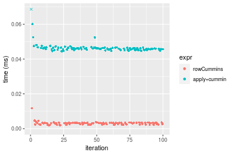
_Table: Benchmarking of colCummins() and rowCummins() on integer+10x10 data (original and transposed).  The top panel shows times in milliseconds and the bottom panel shows relative times._


|   |expr       |   min|     lq|    mean| median|     uq|    max|
|:--|:----------|-----:|------:|-------:|------:|------:|------:|
|1  |colCummins | 1.886| 2.1910| 2.79018| 2.4685| 3.0985| 12.003|
|2  |rowCummins | 2.059| 2.4045| 3.04970| 3.1610| 3.3440| 11.764|


|   |expr       |      min|       lq|     mean|   median|       uq|       max|
|:--|:----------|--------:|--------:|--------:|--------:|--------:|---------:|
|1  |colCummins | 1.000000| 1.000000| 1.000000| 1.000000| 1.000000| 1.0000000|
|2  |rowCummins | 1.091729| 1.097444| 1.093012| 1.280535| 1.079232| 0.9800883|

_Figure: Benchmarking of colCummins() and rowCummins() on integer+10x10 data (original and transposed).  Outliers are displayed as crosses. Times are in milliseconds._


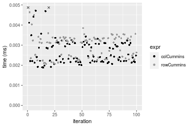

#### 100x100 integer matrix

```r
> X <- data[["100x100"]]
> gc()
          used  (Mb) gc trigger  (Mb) max used  (Mb)
Ncells 5187728 277.1    8529671 455.6  8529671 455.6
Vcells 9403305  71.8   31876688 243.2 60562128 462.1
> colStats <- microbenchmark(colCummins = colCummins(X), `apply+cummin` = apply(X, MARGIN = 2L, FUN = cummin), 
+     unit = "ms")
> X <- t(X)
> gc()
          used  (Mb) gc trigger  (Mb) max used  (Mb)
Ncells 5187704 277.1    8529671 455.6  8529671 455.6
Vcells 9408318  71.8   31876688 243.2 60562128 462.1
> rowStats <- microbenchmark(rowCummins = rowCummins(X), `apply+cummin` = apply(X, MARGIN = 1L, FUN = cummin), 
+     unit = "ms")
```

_Table: Benchmarking of colCummins() and apply+cummin() on integer+100x100 data. The top panel shows times in milliseconds and the bottom panel shows relative times._


|   |expr         |      min|        lq|      mean|   median|       uq|      max|
|:--|:------------|--------:|---------:|---------:|--------:|--------:|--------:|
|1  |colCummins   | 0.024733| 0.0256655| 0.0287101| 0.027601| 0.030879| 0.049008|
|2  |apply+cummin | 0.242463| 0.2534060| 0.2830028| 0.270452| 0.304802| 0.434979|


|   |expr         |      min|      lq|     mean|  median|       uq|      max|
|:--|:------------|--------:|-------:|--------:|-------:|--------:|--------:|
|1  |colCummins   | 1.000000| 1.00000| 1.000000| 1.00000| 1.000000| 1.000000|
|2  |apply+cummin | 9.803218| 9.87341| 9.857254| 9.79863| 9.870851| 8.875673|

_Table: Benchmarking of rowCummins() and apply+cummin() on integer+100x100 data (transposed). The top panel shows times in milliseconds and the bottom panel shows relative times._


|   |expr         |      min|        lq|      mean|    median|        uq|      max|
|:--|:------------|--------:|---------:|---------:|---------:|---------:|--------:|
|1  |rowCummins   | 0.032356| 0.0346660| 0.0378749| 0.0366845| 0.0405270| 0.053534|
|2  |apply+cummin | 0.236244| 0.2457645| 0.2763660| 0.2697430| 0.2988075| 0.453301|


|   |expr         |      min|       lq|     mean|   median|       uq|      max|
|:--|:------------|--------:|--------:|--------:|--------:|--------:|--------:|
|1  |rowCummins   | 1.000000| 1.000000| 1.000000| 1.000000| 1.000000| 1.000000|
|2  |apply+cummin | 7.301397| 7.089497| 7.296813| 7.353051| 7.373048| 8.467535|

_Figure: Benchmarking of colCummins() and apply+cummin() on integer+100x100 data  as well as rowCummins() and apply+cummin() on the same data transposed.  Outliers are displayed as crosses.  Times are in milliseconds._


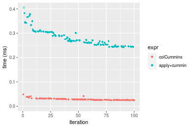

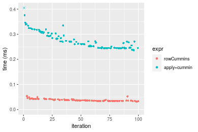
_Table: Benchmarking of colCummins() and rowCummins() on integer+100x100 data (original and transposed).  The top panel shows times in milliseconds and the bottom panel shows relative times._


|   |expr       |    min|      lq|     mean|  median|     uq|    max|
|:--|:----------|------:|-------:|--------:|-------:|------:|------:|
|1  |colCummins | 24.733| 25.6655| 28.71010| 27.6010| 30.879| 49.008|
|2  |rowCummins | 32.356| 34.6660| 37.87489| 36.6845| 40.527| 53.534|


|   |expr       |      min|       lq|     mean| median|       uq|      max|
|:--|:----------|--------:|--------:|--------:|------:|--------:|--------:|
|1  |colCummins | 1.000000| 1.000000| 1.000000| 1.0000| 1.000000| 1.000000|
|2  |rowCummins | 1.308212| 1.350685| 1.319218| 1.3291| 1.312445| 1.092352|

_Figure: Benchmarking of colCummins() and rowCummins() on integer+100x100 data (original and transposed).  Outliers are displayed as crosses. Times are in milliseconds._


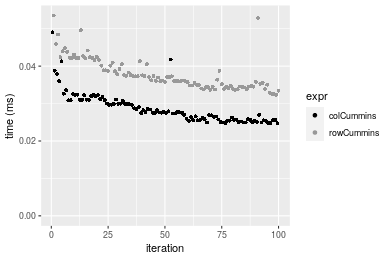

#### 1000x10 integer matrix

```r
> X <- data[["1000x10"]]
> gc()
          used  (Mb) gc trigger  (Mb) max used  (Mb)
Ncells 5188460 277.1    8529671 455.6  8529671 455.6
Vcells 9406815  71.8   31876688 243.2 60562128 462.1
> colStats <- microbenchmark(colCummins = colCummins(X), `apply+cummin` = apply(X, MARGIN = 2L, FUN = cummin), 
+     unit = "ms")
> X <- t(X)
> gc()
          used  (Mb) gc trigger  (Mb) max used  (Mb)
Ncells 5188436 277.1    8529671 455.6  8529671 455.6
Vcells 9411828  71.9   31876688 243.2 60562128 462.1
> rowStats <- microbenchmark(rowCummins = rowCummins(X), `apply+cummin` = apply(X, MARGIN = 1L, FUN = cummin), 
+     unit = "ms")
```

_Table: Benchmarking of colCummins() and apply+cummin() on integer+1000x10 data. The top panel shows times in milliseconds and the bottom panel shows relative times._


|   |expr         |      min|        lq|      mean|   median|       uq|      max|
|:--|:------------|--------:|---------:|---------:|--------:|--------:|--------:|
|1  |colCummins   | 0.025385| 0.0273175| 0.0294291| 0.029176| 0.030712| 0.051438|
|2  |apply+cummin | 0.151176| 0.1623765| 0.1747166| 0.174761| 0.186009| 0.271083|


|   |expr         |      min|       lq|    mean|   median|       uq|      max|
|:--|:------------|--------:|--------:|-------:|--------:|--------:|--------:|
|1  |colCummins   | 1.000000| 1.000000| 1.00000| 1.000000| 1.000000| 1.000000|
|2  |apply+cummin | 5.955328| 5.944047| 5.93686| 5.989889| 6.056558| 5.270092|

_Table: Benchmarking of rowCummins() and apply+cummin() on integer+1000x10 data (transposed). The top panel shows times in milliseconds and the bottom panel shows relative times._


|   |expr         |      min|       lq|      mean|    median|        uq|      max|
|:--|:------------|--------:|--------:|---------:|---------:|---------:|--------:|
|1  |rowCummins   | 0.036634| 0.040133| 0.0427804| 0.0425475| 0.0447395| 0.076496|
|2  |apply+cummin | 0.149369| 0.165891| 0.1775126| 0.1793380| 0.1865220| 0.287679|


|   |expr         |      min|       lq|    mean|   median|       uq|      max|
|:--|:------------|--------:|--------:|-------:|--------:|--------:|--------:|
|1  |rowCummins   | 1.000000| 1.000000| 1.00000| 1.000000| 1.000000| 1.000000|
|2  |apply+cummin | 4.077332| 4.133531| 4.14939| 4.215007| 4.169068| 3.760706|

_Figure: Benchmarking of colCummins() and apply+cummin() on integer+1000x10 data  as well as rowCummins() and apply+cummin() on the same data transposed.  Outliers are displayed as crosses.  Times are in milliseconds._


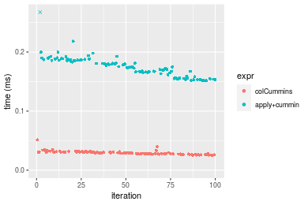

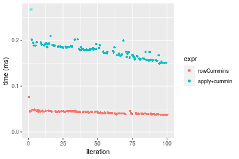
_Table: Benchmarking of colCummins() and rowCummins() on integer+1000x10 data (original and transposed).  The top panel shows times in milliseconds and the bottom panel shows relative times._


|   |expr       |    min|      lq|     mean|  median|      uq|    max|
|:--|:----------|------:|-------:|--------:|-------:|-------:|------:|
|1  |colCummins | 25.385| 27.3175| 29.42912| 29.1760| 30.7120| 51.438|
|2  |rowCummins | 36.634| 40.1330| 42.78042| 42.5475| 44.7395| 76.496|


|   |expr       |      min|       lq|     mean|   median|       uq|     max|
|:--|:----------|--------:|--------:|--------:|--------:|--------:|-------:|
|1  |colCummins | 1.000000| 1.000000| 1.000000| 1.000000| 1.000000| 1.00000|
|2  |rowCummins | 1.443136| 1.469132| 1.453677| 1.458305| 1.456743| 1.48715|

_Figure: Benchmarking of colCummins() and rowCummins() on integer+1000x10 data (original and transposed).  Outliers are displayed as crosses. Times are in milliseconds._


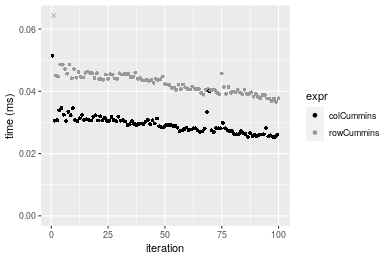

#### 10x1000 integer matrix

```r
> X <- data[["10x1000"]]
> gc()
          used  (Mb) gc trigger  (Mb) max used  (Mb)
Ncells 5188648 277.2    8529671 455.6  8529671 455.6
Vcells 9407502  71.8   31876688 243.2 60562128 462.1
> colStats <- microbenchmark(colCummins = colCummins(X), `apply+cummin` = apply(X, MARGIN = 2L, FUN = cummin), 
+     unit = "ms")
> X <- t(X)
> gc()
          used  (Mb) gc trigger  (Mb) max used  (Mb)
Ncells 5188624 277.2    8529671 455.6  8529671 455.6
Vcells 9412515  71.9   31876688 243.2 60562128 462.1
> rowStats <- microbenchmark(rowCummins = rowCummins(X), `apply+cummin` = apply(X, MARGIN = 1L, FUN = cummin), 
+     unit = "ms")
```

_Table: Benchmarking of colCummins() and apply+cummin() on integer+10x1000 data. The top panel shows times in milliseconds and the bottom panel shows relative times._


|   |expr         |      min|        lq|      mean|   median|        uq|      max|
|:--|:------------|--------:|---------:|---------:|--------:|---------:|--------:|
|1  |colCummins   | 0.018638| 0.0201440| 0.0227576| 0.021014| 0.0241855| 0.040666|
|2  |apply+cummin | 0.889760| 0.9123055| 1.0213205| 0.972172| 1.1060745| 1.469159|


|   |expr         |      min|       lq|     mean|   median|       uq|      max|
|:--|:------------|--------:|--------:|--------:|--------:|--------:|--------:|
|1  |colCummins   |  1.00000|  1.00000|  1.00000|  1.00000|  1.00000|  1.00000|
|2  |apply+cummin | 47.73903| 45.28919| 44.87824| 46.26306| 45.73296| 36.12745|

_Table: Benchmarking of rowCummins() and apply+cummin() on integer+10x1000 data (transposed). The top panel shows times in milliseconds and the bottom panel shows relative times._


|   |expr         |      min|        lq|      mean|   median|       uq|      max|
|:--|:------------|--------:|---------:|---------:|--------:|--------:|--------:|
|1  |rowCummins   | 0.023915| 0.0253565| 0.0287733| 0.027086| 0.029738| 0.050699|
|2  |apply+cummin | 0.874432| 0.9180855| 1.0328556| 0.978348| 1.124165| 1.477055|


|   |expr         |      min|       lq|     mean|   median|       uq|      max|
|:--|:------------|--------:|--------:|--------:|--------:|--------:|--------:|
|1  |rowCummins   |  1.00000|  1.00000|  1.00000|  1.00000|  1.00000|  1.00000|
|2  |apply+cummin | 36.56416| 36.20711| 35.89628| 36.12006| 37.80231| 29.13381|

_Figure: Benchmarking of colCummins() and apply+cummin() on integer+10x1000 data  as well as rowCummins() and apply+cummin() on the same data transposed.  Outliers are displayed as crosses.  Times are in milliseconds._


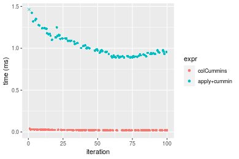

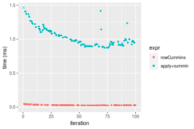
_Table: Benchmarking of colCummins() and rowCummins() on integer+10x1000 data (original and transposed).  The top panel shows times in milliseconds and the bottom panel shows relative times._


|   |expr       |    min|      lq|     mean| median|      uq|    max|
|:--|:----------|------:|-------:|--------:|------:|-------:|------:|
|1  |colCummins | 18.638| 20.1440| 22.75759| 21.014| 24.1855| 40.666|
|2  |rowCummins | 23.915| 25.3565| 28.77333| 27.086| 29.7380| 50.699|


|   |expr       |      min|       lq|    mean|  median|      uq|      max|
|:--|:----------|--------:|--------:|-------:|-------:|-------:|--------:|
|1  |colCummins | 1.000000| 1.000000| 1.00000| 1.00000| 1.00000| 1.000000|
|2  |rowCummins | 1.283131| 1.258762| 1.26434| 1.28895| 1.22958| 1.246717|

_Figure: Benchmarking of colCummins() and rowCummins() on integer+10x1000 data (original and transposed).  Outliers are displayed as crosses. Times are in milliseconds._


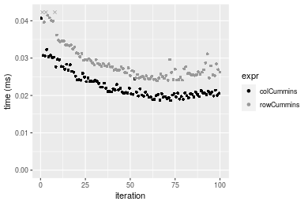

#### 100x1000 integer matrix

```r
> X <- data[["100x1000"]]
> gc()
          used  (Mb) gc trigger  (Mb) max used  (Mb)
Ncells 5188810 277.2    8529671 455.6  8529671 455.6
Vcells 9407948  71.8   31876688 243.2 60562128 462.1
> colStats <- microbenchmark(colCummins = colCummins(X), `apply+cummin` = apply(X, MARGIN = 2L, FUN = cummin), 
+     unit = "ms")
> X <- t(X)
> gc()
          used  (Mb) gc trigger  (Mb) max used  (Mb)
Ncells 5188804 277.2    8529671 455.6  8529671 455.6
Vcells 9457991  72.2   31876688 243.2 60562128 462.1
> rowStats <- microbenchmark(rowCummins = rowCummins(X), `apply+cummin` = apply(X, MARGIN = 1L, FUN = cummin), 
+     unit = "ms")
```

_Table: Benchmarking of colCummins() and apply+cummin() on integer+100x1000 data. The top panel shows times in milliseconds and the bottom panel shows relative times._


|   |expr         |      min|       lq|      mean|   median|       uq|       max|
|:--|:------------|--------:|--------:|---------:|--------:|--------:|---------:|
|1  |colCummins   | 0.178364| 0.192117| 0.2073618| 0.200255| 0.220669|  0.307334|
|2  |apply+cummin | 1.649031| 1.759540| 2.0480233| 1.835325| 1.955503| 15.951853|


|   |expr         |      min|       lq|     mean|  median|       uq|      max|
|:--|:------------|--------:|--------:|--------:|-------:|--------:|--------:|
|1  |colCummins   | 1.000000| 1.000000| 1.000000| 1.00000| 1.000000|  1.00000|
|2  |apply+cummin | 9.245313| 9.158687| 9.876572| 9.16494| 8.861702| 51.90396|

_Table: Benchmarking of rowCummins() and apply+cummin() on integer+100x1000 data (transposed). The top panel shows times in milliseconds and the bottom panel shows relative times._


|   |expr         |      min|        lq|      mean|   median|       uq|       max|
|:--|:------------|--------:|---------:|---------:|--------:|--------:|---------:|
|1  |rowCummins   | 0.233481| 0.2464885| 0.2627796| 0.254444| 0.269249|  0.403114|
|2  |apply+cummin | 1.682163| 1.7761245| 2.0652739| 1.834779| 1.987249| 16.439867|


|   |expr         |     min|       lq|     mean|   median|       uq|      max|
|:--|:------------|-------:|--------:|--------:|--------:|--------:|--------:|
|1  |rowCummins   | 1.00000| 1.000000| 1.000000| 1.000000| 1.000000|  1.00000|
|2  |apply+cummin | 7.20471| 7.205709| 7.859339| 7.210933| 7.380711| 40.78218|

_Figure: Benchmarking of colCummins() and apply+cummin() on integer+100x1000 data  as well as rowCummins() and apply+cummin() on the same data transposed.  Outliers are displayed as crosses.  Times are in milliseconds._


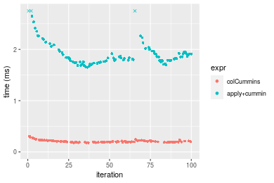

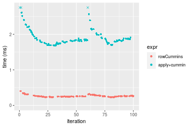
_Table: Benchmarking of colCummins() and rowCummins() on integer+100x1000 data (original and transposed).  The top panel shows times in milliseconds and the bottom panel shows relative times._


|   |expr       |     min|       lq|     mean|  median|      uq|     max|
|:--|:----------|-------:|--------:|--------:|-------:|-------:|-------:|
|1  |colCummins | 178.364| 192.1170| 207.3618| 200.255| 220.669| 307.334|
|2  |rowCummins | 233.481| 246.4885| 262.7796| 254.444| 269.249| 403.114|


|   |expr       |      min|       lq|     mean| median|       uq|      max|
|:--|:----------|--------:|--------:|--------:|------:|--------:|--------:|
|1  |colCummins | 1.000000| 1.000000| 1.000000| 1.0000| 1.000000| 1.000000|
|2  |rowCummins | 1.309014| 1.283012| 1.267252| 1.2706| 1.220149| 1.311648|

_Figure: Benchmarking of colCummins() and rowCummins() on integer+100x1000 data (original and transposed).  Outliers are displayed as crosses. Times are in milliseconds._


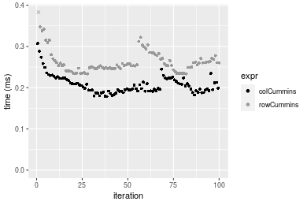

#### 1000x100 integer matrix

```r
> X <- data[["1000x100"]]
> gc()
          used  (Mb) gc trigger  (Mb) max used  (Mb)
Ncells 5189027 277.2    8529671 455.6  8529671 455.6
Vcells 9408553  71.8   31876688 243.2 60562128 462.1
> colStats <- microbenchmark(colCummins = colCummins(X), `apply+cummin` = apply(X, MARGIN = 2L, FUN = cummin), 
+     unit = "ms")
> X <- t(X)
> gc()
          used  (Mb) gc trigger  (Mb) max used  (Mb)
Ncells 5189003 277.2    8529671 455.6  8529671 455.6
Vcells 9458566  72.2   31876688 243.2 60562128 462.1
> rowStats <- microbenchmark(rowCummins = rowCummins(X), `apply+cummin` = apply(X, MARGIN = 1L, FUN = cummin), 
+     unit = "ms")
```

_Table: Benchmarking of colCummins() and apply+cummin() on integer+1000x100 data. The top panel shows times in milliseconds and the bottom panel shows relative times._


|   |expr         |      min|        lq|      mean|   median|        uq|      max|
|:--|:------------|--------:|---------:|---------:|--------:|---------:|--------:|
|1  |colCummins   | 0.174509| 0.1822660| 0.2074065| 0.197533| 0.2223985| 0.333364|
|2  |apply+cummin | 0.905970| 0.9472705| 1.1705592| 1.079732| 1.2157880| 7.502145|


|   |expr         |      min|       lq|     mean|   median|      uq|      max|
|:--|:------------|--------:|--------:|--------:|--------:|-------:|--------:|
|1  |colCummins   | 1.000000| 1.000000| 1.000000| 1.000000| 1.00000|  1.00000|
|2  |apply+cummin | 5.191537| 5.197187| 5.643793| 5.466084| 5.46671| 22.50436|

_Table: Benchmarking of rowCummins() and apply+cummin() on integer+1000x100 data (transposed). The top panel shows times in milliseconds and the bottom panel shows relative times._


|   |expr         |      min|        lq|      mean|   median|       uq|      max|
|:--|:------------|--------:|---------:|---------:|--------:|--------:|--------:|
|1  |rowCummins   | 0.244375| 0.2579560| 0.2846074| 0.272723| 0.308065| 0.409614|
|2  |apply+cummin | 0.917421| 0.9672895| 1.1625622| 1.049845| 1.191480| 7.619652|


|   |expr         |      min|       lq|     mean|   median|       uq|      max|
|:--|:------------|--------:|--------:|--------:|--------:|--------:|--------:|
|1  |rowCummins   | 1.000000| 1.000000| 1.000000| 1.000000| 1.000000|  1.00000|
|2  |apply+cummin | 3.754152| 3.749824| 4.084793| 3.849492| 3.867627| 18.60203|

_Figure: Benchmarking of colCummins() and apply+cummin() on integer+1000x100 data  as well as rowCummins() and apply+cummin() on the same data transposed.  Outliers are displayed as crosses.  Times are in milliseconds._


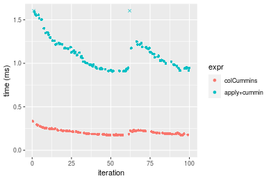

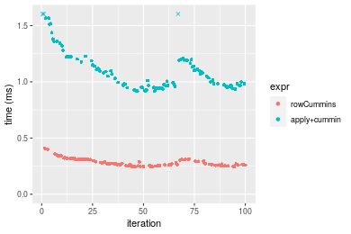
_Table: Benchmarking of colCummins() and rowCummins() on integer+1000x100 data (original and transposed).  The top panel shows times in milliseconds and the bottom panel shows relative times._


|   |expr       |     min|      lq|     mean|  median|       uq|     max|
|:--|:----------|-------:|-------:|--------:|-------:|--------:|-------:|
|1  |colCummins | 174.509| 182.266| 207.4065| 197.533| 222.3985| 333.364|
|2  |rowCummins | 244.375| 257.956| 284.6074| 272.723| 308.0650| 409.614|


|   |expr       |      min|       lq|     mean|   median|       uq|      max|
|:--|:----------|--------:|--------:|--------:|--------:|--------:|--------:|
|1  |colCummins | 1.000000| 1.000000| 1.000000| 1.000000| 1.000000| 1.000000|
|2  |rowCummins | 1.400358| 1.415272| 1.372221| 1.380645| 1.385194| 1.228729|

_Figure: Benchmarking of colCummins() and rowCummins() on integer+1000x100 data (original and transposed).  Outliers are displayed as crosses. Times are in milliseconds._


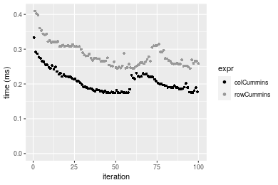


## Data type "double"

### Data
```r
> rmatrix <- function(nrow, ncol, mode = c("logical", "double", "integer", "index"), range = c(-100, 
+     +100), na_prob = 0) {
+     mode <- match.arg(mode)
+     n <- nrow * ncol
+     if (mode == "logical") {
+         x <- sample(c(FALSE, TRUE), size = n, replace = TRUE)
+     }     else if (mode == "index") {
+         x <- seq_len(n)
+         mode <- "integer"
+     }     else {
+         x <- runif(n, min = range[1], max = range[2])
+     }
+     storage.mode(x) <- mode
+     if (na_prob > 0) 
+         x[sample(n, size = na_prob * n)] <- NA
+     dim(x) <- c(nrow, ncol)
+     x
+ }
> rmatrices <- function(scale = 10, seed = 1, ...) {
+     set.seed(seed)
+     data <- list()
+     data[[1]] <- rmatrix(nrow = scale * 1, ncol = scale * 1, ...)
+     data[[2]] <- rmatrix(nrow = scale * 10, ncol = scale * 10, ...)
+     data[[3]] <- rmatrix(nrow = scale * 100, ncol = scale * 1, ...)
+     data[[4]] <- t(data[[3]])
+     data[[5]] <- rmatrix(nrow = scale * 10, ncol = scale * 100, ...)
+     data[[6]] <- t(data[[5]])
+     names(data) <- sapply(data, FUN = function(x) paste(dim(x), collapse = "x"))
+     data
+ }
> data <- rmatrices(mode = mode)
```

### Results

#### 10x10 double matrix

```r
> X <- data[["10x10"]]
> gc()
          used  (Mb) gc trigger  (Mb) max used  (Mb)
Ncells 5189227 277.2    8529671 455.6  8529671 455.6
Vcells 9524276  72.7   31876688 243.2 60562128 462.1
> colStats <- microbenchmark(colCummins = colCummins(X), `apply+cummin` = apply(X, MARGIN = 2L, FUN = cummin), 
+     unit = "ms")
> X <- t(X)
> gc()
          used  (Mb) gc trigger  (Mb) max used  (Mb)
Ncells 5189194 277.2    8529671 455.6  8529671 455.6
Vcells 9524374  72.7   31876688 243.2 60562128 462.1
> rowStats <- microbenchmark(rowCummins = rowCummins(X), `apply+cummin` = apply(X, MARGIN = 1L, FUN = cummin), 
+     unit = "ms")
```

_Table: Benchmarking of colCummins() and apply+cummin() on double+10x10 data. The top panel shows times in milliseconds and the bottom panel shows relative times._


|   |expr         |      min|        lq|      mean|    median|       uq|      max|
|:--|:------------|--------:|---------:|---------:|---------:|--------:|--------:|
|1  |colCummins   | 0.002177| 0.0024525| 0.0030570| 0.0027830| 0.003423| 0.011925|
|2  |apply+cummin | 0.044764| 0.0453260| 0.0471603| 0.0459335| 0.046323| 0.121587|


|   |expr         |      min|       lq|   mean|   median|       uq|      max|
|:--|:------------|--------:|--------:|------:|--------:|--------:|--------:|
|1  |colCummins   |  1.00000|  1.00000|  1.000|  1.00000|  1.00000|  1.00000|
|2  |apply+cummin | 20.56224| 18.48155| 15.427| 16.50503| 13.53287| 10.19597|

_Table: Benchmarking of rowCummins() and apply+cummin() on double+10x10 data (transposed). The top panel shows times in milliseconds and the bottom panel shows relative times._


|   |expr         |      min|       lq|      mean|    median|        uq|      max|
|:--|:------------|--------:|--------:|---------:|---------:|---------:|--------:|
|1  |rowCummins   | 0.001983| 0.002371| 0.0030468| 0.0031530| 0.0033100| 0.014055|
|2  |apply+cummin | 0.042842| 0.045173| 0.0466742| 0.0457285| 0.0461585| 0.119895|


|   |expr         |      min|      lq|     mean|   median|       uq|      max|
|:--|:------------|--------:|-------:|--------:|--------:|--------:|--------:|
|1  |rowCummins   |  1.00000|  1.0000|  1.00000|  1.00000|  1.00000| 1.000000|
|2  |apply+cummin | 21.60464| 19.0523| 15.31934| 14.50317| 13.94517| 8.530416|

_Figure: Benchmarking of colCummins() and apply+cummin() on double+10x10 data  as well as rowCummins() and apply+cummin() on the same data transposed.  Outliers are displayed as crosses.  Times are in milliseconds._


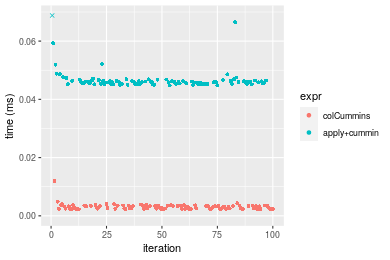

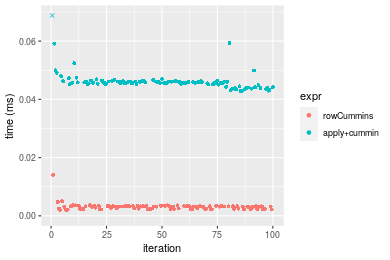
_Table: Benchmarking of colCummins() and rowCummins() on double+10x10 data (original and transposed).  The top panel shows times in milliseconds and the bottom panel shows relative times._


|   |expr       |   min|     lq|    mean| median|    uq|    max|
|:--|:----------|-----:|------:|-------:|------:|-----:|------:|
|1  |colCummins | 2.177| 2.4525| 3.05700|  2.783| 3.423| 11.925|
|2  |rowCummins | 1.983| 2.3710| 3.04675|  3.153| 3.310| 14.055|


|   |expr       |       min|        lq|     mean|  median|       uq|      max|
|:--|:----------|---------:|---------:|--------:|-------:|--------:|--------:|
|1  |colCummins | 1.0000000| 1.0000000| 1.000000| 1.00000| 1.000000| 1.000000|
|2  |rowCummins | 0.9108865| 0.9667686| 0.996647| 1.13295| 0.966988| 1.178616|

_Figure: Benchmarking of colCummins() and rowCummins() on double+10x10 data (original and transposed).  Outliers are displayed as crosses. Times are in milliseconds._


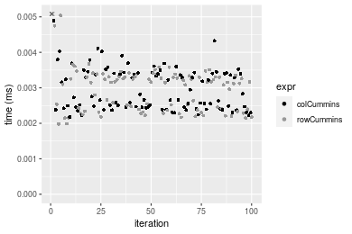

#### 100x100 double matrix

```r
> X <- data[["100x100"]]
> gc()
          used  (Mb) gc trigger  (Mb) max used  (Mb)
Ncells 5189402 277.2    8529671 455.6  8529671 455.6
Vcells 9525083  72.7   31876688 243.2 60562128 462.1
> colStats <- microbenchmark(colCummins = colCummins(X), `apply+cummin` = apply(X, MARGIN = 2L, FUN = cummin), 
+     unit = "ms")
> X <- t(X)
> gc()
          used  (Mb) gc trigger  (Mb) max used  (Mb)
Ncells 5189378 277.2    8529671 455.6  8529671 455.6
Vcells 9535096  72.8   31876688 243.2 60562128 462.1
> rowStats <- microbenchmark(rowCummins = rowCummins(X), `apply+cummin` = apply(X, MARGIN = 1L, FUN = cummin), 
+     unit = "ms")
```

_Table: Benchmarking of colCummins() and apply+cummin() on double+100x100 data. The top panel shows times in milliseconds and the bottom panel shows relative times._


|   |expr         |      min|        lq|      mean|    median|       uq|      max|
|:--|:------------|--------:|---------:|---------:|---------:|--------:|--------:|
|1  |colCummins   | 0.050157| 0.0518250| 0.0578719| 0.0557995| 0.062964| 0.096468|
|2  |apply+cummin | 0.231659| 0.2453715| 0.2752217| 0.2680900| 0.300108| 0.461173|


|   |expr         |      min|       lq|     mean|   median|       uq|     max|
|:--|:------------|--------:|--------:|--------:|--------:|--------:|-------:|
|1  |colCummins   | 1.000000| 1.000000| 1.000000| 1.000000| 1.000000| 1.00000|
|2  |apply+cummin | 4.618677| 4.734616| 4.755709| 4.804523| 4.766343| 4.78058|

_Table: Benchmarking of rowCummins() and apply+cummin() on double+100x100 data (transposed). The top panel shows times in milliseconds and the bottom panel shows relative times._


|   |expr         |      min|        lq|      mean|   median|        uq|      max|
|:--|:------------|--------:|---------:|---------:|--------:|---------:|--------:|
|1  |rowCummins   | 0.029088| 0.0312755| 0.0348647| 0.033629| 0.0375210| 0.053455|
|2  |apply+cummin | 0.230281| 0.2432255| 0.2759684| 0.271336| 0.2923345| 0.442749|


|   |expr         |      min|      lq|     mean|   median|       uq|      max|
|:--|:------------|--------:|-------:|--------:|--------:|--------:|--------:|
|1  |rowCummins   | 1.000000| 1.00000| 1.000000| 1.000000| 1.000000| 1.000000|
|2  |apply+cummin | 7.916701| 7.77687| 7.915408| 8.068512| 7.791224| 8.282649|

_Figure: Benchmarking of colCummins() and apply+cummin() on double+100x100 data  as well as rowCummins() and apply+cummin() on the same data transposed.  Outliers are displayed as crosses.  Times are in milliseconds._


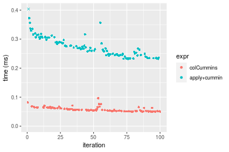

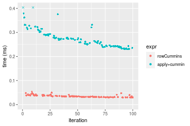
_Table: Benchmarking of colCummins() and rowCummins() on double+100x100 data (original and transposed).  The top panel shows times in milliseconds and the bottom panel shows relative times._


|   |expr       |    min|      lq|     mean|  median|     uq|    max|
|:--|:----------|------:|-------:|--------:|-------:|------:|------:|
|2  |rowCummins | 29.088| 31.2755| 34.86471| 33.6290| 37.521| 53.455|
|1  |colCummins | 50.157| 51.8250| 57.87185| 55.7995| 62.964| 96.468|


|   |expr       |      min|       lq|     mean|   median|     uq|      max|
|:--|:----------|--------:|--------:|--------:|--------:|------:|--------:|
|2  |rowCummins | 1.000000| 1.000000| 1.000000| 1.000000| 1.0000| 1.000000|
|1  |colCummins | 1.724319| 1.657048| 1.659898| 1.659267| 1.6781| 1.804658|

_Figure: Benchmarking of colCummins() and rowCummins() on double+100x100 data (original and transposed).  Outliers are displayed as crosses. Times are in milliseconds._


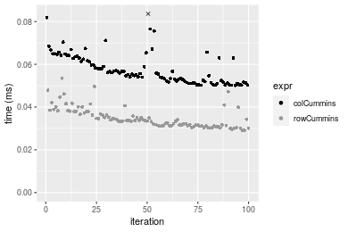

#### 1000x10 double matrix

```r
> X <- data[["1000x10"]]
> gc()
          used  (Mb) gc trigger  (Mb) max used  (Mb)
Ncells 5189594 277.2    8529671 455.6  8529671 455.6
Vcells 9525983  72.7   31876688 243.2 60562128 462.1
> colStats <- microbenchmark(colCummins = colCummins(X), `apply+cummin` = apply(X, MARGIN = 2L, FUN = cummin), 
+     unit = "ms")
> X <- t(X)
> gc()
          used  (Mb) gc trigger  (Mb) max used  (Mb)
Ncells 5189570 277.2    8529671 455.6  8529671 455.6
Vcells 9535996  72.8   31876688 243.2 60562128 462.1
> rowStats <- microbenchmark(rowCummins = rowCummins(X), `apply+cummin` = apply(X, MARGIN = 1L, FUN = cummin), 
+     unit = "ms")
```

_Table: Benchmarking of colCummins() and apply+cummin() on double+1000x10 data. The top panel shows times in milliseconds and the bottom panel shows relative times._


|   |expr         |      min|        lq|      mean|    median|        uq|      max|
|:--|:------------|--------:|---------:|---------:|---------:|---------:|--------:|
|1  |colCummins   | 0.046003| 0.0486265| 0.0526381| 0.0519725| 0.0558435| 0.075975|
|2  |apply+cummin | 0.145842| 0.1526555| 0.1697425| 0.1703740| 0.1826430| 0.268411|


|   |expr         |      min|       lq|     mean|   median|       uq|      max|
|:--|:------------|--------:|--------:|--------:|--------:|--------:|--------:|
|1  |colCummins   | 1.000000| 1.000000| 1.000000| 1.000000| 1.000000| 1.000000|
|2  |apply+cummin | 3.170272| 3.139348| 3.224706| 3.278157| 3.270622| 3.532886|

_Table: Benchmarking of rowCummins() and apply+cummin() on double+1000x10 data (transposed). The top panel shows times in milliseconds and the bottom panel shows relative times._


|   |expr         |      min|       lq|      mean|    median|        uq|      max|
|:--|:------------|--------:|--------:|---------:|---------:|---------:|--------:|
|1  |rowCummins   | 0.031482| 0.034577| 0.0369696| 0.0364095| 0.0396045| 0.057190|
|2  |apply+cummin | 0.145639| 0.157844| 0.1731680| 0.1706120| 0.1871330| 0.267424|


|   |expr         |      min|    lq|     mean|  median|       uq|      max|
|:--|:------------|--------:|-----:|--------:|-------:|--------:|--------:|
|1  |rowCummins   | 1.000000| 1.000| 1.000000| 1.00000| 1.000000| 1.000000|
|2  |apply+cummin | 4.626104| 4.565| 4.684065| 4.68592| 4.725044| 4.676062|

_Figure: Benchmarking of colCummins() and apply+cummin() on double+1000x10 data  as well as rowCummins() and apply+cummin() on the same data transposed.  Outliers are displayed as crosses.  Times are in milliseconds._


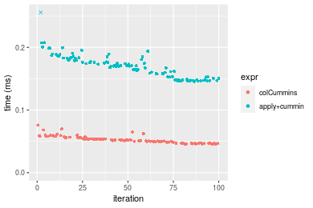

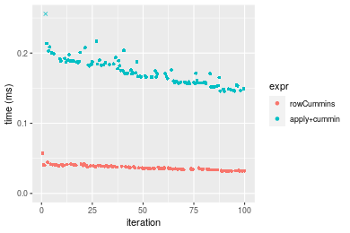
_Table: Benchmarking of colCummins() and rowCummins() on double+1000x10 data (original and transposed).  The top panel shows times in milliseconds and the bottom panel shows relative times._


|   |expr       |    min|      lq|     mean|  median|      uq|    max|
|:--|:----------|------:|-------:|--------:|-------:|-------:|------:|
|2  |rowCummins | 31.482| 34.5770| 36.96960| 36.4095| 39.6045| 57.190|
|1  |colCummins | 46.003| 48.6265| 52.63814| 51.9725| 55.8435| 75.975|


|   |expr       |      min|       lq|     mean|   median|       uq|      max|
|:--|:----------|--------:|--------:|--------:|--------:|--------:|--------:|
|2  |rowCummins | 1.000000| 1.000000| 1.000000| 1.000000| 1.000000| 1.000000|
|1  |colCummins | 1.461248| 1.406325| 1.423822| 1.427443| 1.410029| 1.328466|

_Figure: Benchmarking of colCummins() and rowCummins() on double+1000x10 data (original and transposed).  Outliers are displayed as crosses. Times are in milliseconds._


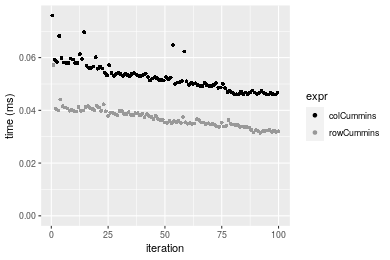

#### 10x1000 double matrix

```r
> X <- data[["10x1000"]]
> gc()
          used  (Mb) gc trigger  (Mb) max used  (Mb)
Ncells 5189782 277.2    8529671 455.6  8529671 455.6
Vcells 9526108  72.7   31876688 243.2 60562128 462.1
> colStats <- microbenchmark(colCummins = colCummins(X), `apply+cummin` = apply(X, MARGIN = 2L, FUN = cummin), 
+     unit = "ms")
> X <- t(X)
> gc()
          used  (Mb) gc trigger  (Mb) max used  (Mb)
Ncells 5189758 277.2    8529671 455.6  8529671 455.6
Vcells 9536121  72.8   31876688 243.2 60562128 462.1
> rowStats <- microbenchmark(rowCummins = rowCummins(X), `apply+cummin` = apply(X, MARGIN = 1L, FUN = cummin), 
+     unit = "ms")
```

_Table: Benchmarking of colCummins() and apply+cummin() on double+10x1000 data. The top panel shows times in milliseconds and the bottom panel shows relative times._


|   |expr         |      min|        lq|      mean|   median|        uq|      max|
|:--|:------------|--------:|---------:|---------:|--------:|---------:|--------:|
|1  |colCummins   | 0.055189| 0.0589240| 0.0666508| 0.062529| 0.0730375| 0.101868|
|2  |apply+cummin | 0.873355| 0.9106935| 0.9989185| 0.954950| 1.0559315| 1.420541|


|   |expr         |     min|       lq|     mean|   median|       uq|      max|
|:--|:------------|-------:|--------:|--------:|--------:|--------:|--------:|
|1  |colCummins   |  1.0000|  1.00000|  1.00000|  1.00000|  1.00000|  1.00000|
|2  |apply+cummin | 15.8248| 15.45539| 14.98735| 15.27211| 14.45739| 13.94492|

_Table: Benchmarking of rowCummins() and apply+cummin() on double+10x1000 data (transposed). The top panel shows times in milliseconds and the bottom panel shows relative times._


|   |expr         |      min|        lq|     mean|    median|       uq|      max|
|:--|:------------|--------:|---------:|--------:|---------:|--------:|--------:|
|1  |rowCummins   | 0.021802| 0.0232630| 0.026568| 0.0251415| 0.027942| 0.046176|
|2  |apply+cummin | 0.865968| 0.9134995| 1.005937| 0.9485950| 1.078388| 1.386644|


|   |expr         |      min|       lq|     mean|   median|      uq|      max|
|:--|:------------|--------:|--------:|--------:|--------:|-------:|--------:|
|1  |rowCummins   |  1.00000|  1.00000|  1.00000|  1.00000|  1.0000|  1.00000|
|2  |apply+cummin | 39.71966| 39.26834| 37.86274| 37.73025| 38.5938| 30.02954|

_Figure: Benchmarking of colCummins() and apply+cummin() on double+10x1000 data  as well as rowCummins() and apply+cummin() on the same data transposed.  Outliers are displayed as crosses.  Times are in milliseconds._


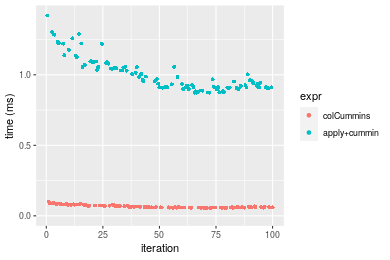

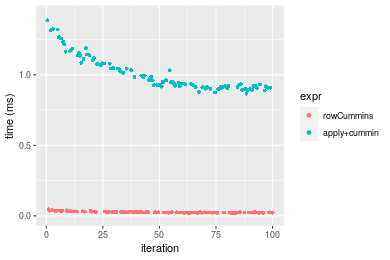
_Table: Benchmarking of colCummins() and rowCummins() on double+10x1000 data (original and transposed).  The top panel shows times in milliseconds and the bottom panel shows relative times._


|   |expr       |    min|     lq|     mean|  median|      uq|     max|
|:--|:----------|------:|------:|--------:|-------:|-------:|-------:|
|2  |rowCummins | 21.802| 23.263| 26.56798| 25.1415| 27.9420|  46.176|
|1  |colCummins | 55.189| 58.924| 66.65079| 62.5290| 73.0375| 101.868|


|   |expr       |      min|       lq|     mean|   median|       uq|      max|
|:--|:----------|--------:|--------:|--------:|--------:|--------:|--------:|
|2  |rowCummins | 1.000000| 1.000000| 1.000000| 1.000000| 1.000000| 1.000000|
|1  |colCummins | 2.531373| 2.532949| 2.508689| 2.487083| 2.613897| 2.206081|

_Figure: Benchmarking of colCummins() and rowCummins() on double+10x1000 data (original and transposed).  Outliers are displayed as crosses. Times are in milliseconds._


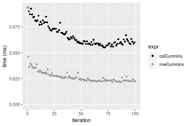

#### 100x1000 double matrix

```r
> X <- data[["100x1000"]]
> gc()
          used  (Mb) gc trigger  (Mb) max used  (Mb)
Ncells 5189944 277.2    8529671 455.6  8529671 455.6
Vcells 9527123  72.7   31876688 243.2 60562128 462.1
> colStats <- microbenchmark(colCummins = colCummins(X), `apply+cummin` = apply(X, MARGIN = 2L, FUN = cummin), 
+     unit = "ms")
> X <- t(X)
> gc()
          used  (Mb) gc trigger  (Mb) max used  (Mb)
Ncells 5189938 277.2    8529671 455.6  8529671 455.6
Vcells 9627166  73.5   31876688 243.2 60562128 462.1
> rowStats <- microbenchmark(rowCummins = rowCummins(X), `apply+cummin` = apply(X, MARGIN = 1L, FUN = cummin), 
+     unit = "ms")
```

_Table: Benchmarking of colCummins() and apply+cummin() on double+100x1000 data. The top panel shows times in milliseconds and the bottom panel shows relative times._


|   |expr         |      min|       lq|      mean|    median|       uq|       max|
|:--|:------------|--------:|--------:|---------:|---------:|--------:|---------:|
|1  |colCummins   | 0.378802| 0.400746| 0.4555599| 0.4352395| 0.489271|  0.734539|
|2  |apply+cummin | 1.618510| 1.707243| 2.2195884| 1.8661605| 2.163435| 13.735953|


|   |expr         |      min|       lq|     mean|   median|       uq|     max|
|:--|:------------|--------:|--------:|--------:|--------:|--------:|-------:|
|1  |colCummins   | 1.000000| 1.000000| 1.000000| 1.000000| 1.000000|  1.0000|
|2  |apply+cummin | 4.272707| 4.260163| 4.872221| 4.287663| 4.421751| 18.7001|

_Table: Benchmarking of rowCummins() and apply+cummin() on double+100x1000 data (transposed). The top panel shows times in milliseconds and the bottom panel shows relative times._


|   |expr         |      min|       lq|      mean|   median|       uq|       max|
|:--|:------------|--------:|--------:|---------:|--------:|--------:|---------:|
|1  |rowCummins   | 0.208746| 0.228693| 0.2543664| 0.247418| 0.274127|  0.376529|
|2  |apply+cummin | 1.628291| 1.734182| 2.2365019| 1.950220| 2.163453| 14.515753|


|   |expr         |      min|       lq|     mean|   median|       uq|      max|
|:--|:------------|--------:|--------:|--------:|--------:|--------:|--------:|
|1  |rowCummins   | 1.000000| 1.000000| 1.000000| 1.000000| 1.000000|  1.00000|
|2  |apply+cummin | 7.800346| 7.583011| 8.792443| 7.882288| 7.892154| 38.55149|

_Figure: Benchmarking of colCummins() and apply+cummin() on double+100x1000 data  as well as rowCummins() and apply+cummin() on the same data transposed.  Outliers are displayed as crosses.  Times are in milliseconds._


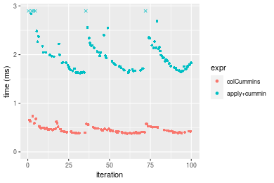

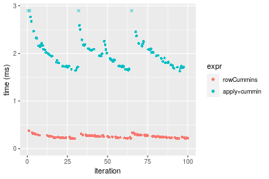
_Table: Benchmarking of colCummins() and rowCummins() on double+100x1000 data (original and transposed).  The top panel shows times in milliseconds and the bottom panel shows relative times._


|   |expr       |     min|      lq|     mean|   median|      uq|     max|
|:--|:----------|-------:|-------:|--------:|--------:|-------:|-------:|
|2  |rowCummins | 208.746| 228.693| 254.3664| 247.4180| 274.127| 376.529|
|1  |colCummins | 378.802| 400.746| 455.5599| 435.2395| 489.271| 734.539|


|   |expr       |      min|       lq|     mean|   median|       uq|      max|
|:--|:----------|--------:|--------:|--------:|--------:|--------:|--------:|
|2  |rowCummins | 1.000000| 1.000000| 1.000000| 1.000000| 1.000000| 1.000000|
|1  |colCummins | 1.814655| 1.752332| 1.790959| 1.759126| 1.784833| 1.950816|

_Figure: Benchmarking of colCummins() and rowCummins() on double+100x1000 data (original and transposed).  Outliers are displayed as crosses. Times are in milliseconds._


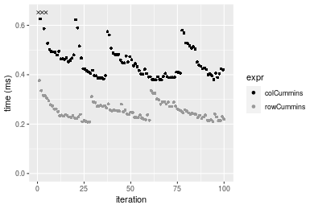

#### 1000x100 double matrix

```r
> X <- data[["1000x100"]]
> gc()
          used  (Mb) gc trigger  (Mb) max used  (Mb)
Ncells 5190161 277.2    8529671 455.6  8529671 455.6
Vcells 9527289  72.7   31876688 243.2 60562128 462.1
> colStats <- microbenchmark(colCummins = colCummins(X), `apply+cummin` = apply(X, MARGIN = 2L, FUN = cummin), 
+     unit = "ms")
> X <- t(X)
> gc()
          used  (Mb) gc trigger  (Mb) max used  (Mb)
Ncells 5190137 277.2    8529671 455.6  8529671 455.6
Vcells 9627302  73.5   31876688 243.2 60562128 462.1
> rowStats <- microbenchmark(rowCummins = rowCummins(X), `apply+cummin` = apply(X, MARGIN = 1L, FUN = cummin), 
+     unit = "ms")
```

_Table: Benchmarking of colCummins() and apply+cummin() on double+1000x100 data. The top panel shows times in milliseconds and the bottom panel shows relative times._


|   |expr         |      min|        lq|      mean|   median|       uq|      max|
|:--|:------------|--------:|---------:|---------:|--------:|--------:|--------:|
|1  |colCummins   | 0.343187| 0.3731635| 0.4179793| 0.413587| 0.446502| 0.612018|
|2  |apply+cummin | 0.963508| 1.0524870| 1.2740686| 1.161658| 1.225065| 6.679734|


|   |expr         |      min|       lq|     mean|  median|       uq|      max|
|:--|:------------|--------:|--------:|--------:|-------:|--------:|--------:|
|1  |colCummins   | 1.000000| 1.000000| 1.000000| 1.00000| 1.000000|  1.00000|
|2  |apply+cummin | 2.807531| 2.820445| 3.048162| 2.80874| 2.743693| 10.91428|

_Table: Benchmarking of rowCummins() and apply+cummin() on double+1000x100 data (transposed). The top panel shows times in milliseconds and the bottom panel shows relative times._


|   |expr         |      min|        lq|      mean|    median|        uq|      max|
|:--|:------------|--------:|---------:|---------:|---------:|---------:|--------:|
|1  |rowCummins   | 0.231058| 0.2501835| 0.3278522| 0.2745775| 0.2860575| 5.789883|
|2  |apply+cummin | 1.011842| 1.0951635| 1.2619326| 1.2010615| 1.2805095| 6.525997|


|   |expr         |      min|       lq|    mean|   median|       uq|      max|
|:--|:------------|--------:|--------:|-------:|--------:|--------:|--------:|
|1  |rowCummins   | 1.000000| 1.000000| 1.00000| 1.000000| 1.000000| 1.000000|
|2  |apply+cummin | 4.379169| 4.377441| 3.84909| 4.374217| 4.476406| 1.127138|

_Figure: Benchmarking of colCummins() and apply+cummin() on double+1000x100 data  as well as rowCummins() and apply+cummin() on the same data transposed.  Outliers are displayed as crosses.  Times are in milliseconds._


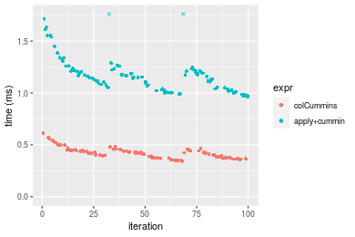

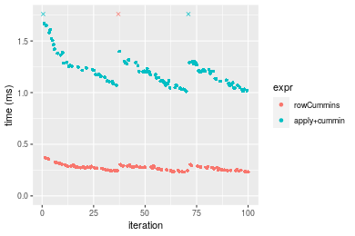
_Table: Benchmarking of colCummins() and rowCummins() on double+1000x100 data (original and transposed).  The top panel shows times in milliseconds and the bottom panel shows relative times._


|   |expr       |     min|       lq|     mean|   median|       uq|      max|
|:--|:----------|-------:|--------:|--------:|--------:|--------:|--------:|
|2  |rowCummins | 231.058| 250.1835| 327.8522| 274.5775| 286.0575| 5789.883|
|1  |colCummins | 343.187| 373.1635| 417.9793| 413.5870| 446.5020|  612.018|


|   |expr       |      min|       lq|     mean|   median|       uq|       max|
|:--|:----------|--------:|--------:|--------:|--------:|--------:|---------:|
|2  |rowCummins | 1.000000| 1.000000| 1.000000| 1.000000| 1.000000| 1.0000000|
|1  |colCummins | 1.485285| 1.491559| 1.274902| 1.506267| 1.560882| 0.1057047|

_Figure: Benchmarking of colCummins() and rowCummins() on double+1000x100 data (original and transposed).  Outliers are displayed as crosses. Times are in milliseconds._


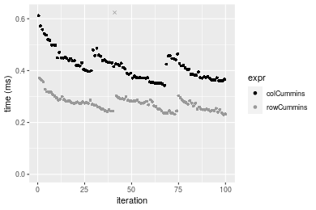


## Appendix

### Session information
```r
R version 4.1.1 Patched (2021-08-10 r80727)
Platform: x86_64-pc-linux-gnu (64-bit)
Running under: Ubuntu 18.04.5 LTS

Matrix products: default
BLAS:   /home/hb/software/R-devel/R-4-1-branch/lib/R/lib/libRblas.so
LAPACK: /home/hb/software/R-devel/R-4-1-branch/lib/R/lib/libRlapack.so

locale:
 [1] LC_CTYPE=en_US.UTF-8       LC_NUMERIC=C              
 [3] LC_TIME=en_US.UTF-8        LC_COLLATE=en_US.UTF-8    
 [5] LC_MONETARY=en_US.UTF-8    LC_MESSAGES=en_US.UTF-8   
 [7] LC_PAPER=en_US.UTF-8       LC_NAME=C                 
 [9] LC_ADDRESS=C               LC_TELEPHONE=C            
[11] LC_MEASUREMENT=en_US.UTF-8 LC_IDENTIFICATION=C       

attached base packages:
[1] stats     graphics  grDevices utils     datasets  methods   base     

other attached packages:
[1] microbenchmark_1.4-7   matrixStats_0.60.1     ggplot2_3.3.5         
[4] knitr_1.33             R.devices_2.17.0       R.utils_2.10.1        
[7] R.oo_1.24.0            R.methodsS3_1.8.1-9001 history_0.0.1-9000    

loaded via a namespace (and not attached):
 [1] Biobase_2.52.0          httr_1.4.2              splines_4.1.1          
 [4] bit64_4.0.5             network_1.17.1          assertthat_0.2.1       
 [7] highr_0.9               stats4_4.1.1            blob_1.2.2             
[10] GenomeInfoDbData_1.2.6  robustbase_0.93-8       pillar_1.6.2           
[13] RSQLite_2.2.8           lattice_0.20-44         glue_1.4.2             
[16] digest_0.6.27           XVector_0.32.0          colorspace_2.0-2       
[19] Matrix_1.3-4            XML_3.99-0.7            pkgconfig_2.0.3        
[22] zlibbioc_1.38.0         genefilter_1.74.0       purrr_0.3.4            
[25] ergm_4.1.2              xtable_1.8-4            scales_1.1.1           
[28] tibble_3.1.4            annotate_1.70.0         KEGGREST_1.32.0        
[31] farver_2.1.0            generics_0.1.0          IRanges_2.26.0         
[34] ellipsis_0.3.2          cachem_1.0.6            withr_2.4.2            
[37] BiocGenerics_0.38.0     mime_0.11               survival_3.2-13        
[40] magrittr_2.0.1          crayon_1.4.1            statnet.common_4.5.0   
[43] memoise_2.0.0           laeken_0.5.1            fansi_0.5.0            
[46] R.cache_0.15.0          MASS_7.3-54             R.rsp_0.44.0           
[49] progressr_0.8.0         tools_4.1.1             lifecycle_1.0.0        
[52] S4Vectors_0.30.0        trust_0.1-8             munsell_0.5.0          
[55] tabby_0.0.1-9001        AnnotationDbi_1.54.1    Biostrings_2.60.2      
[58] compiler_4.1.1          GenomeInfoDb_1.28.1     rlang_0.4.11           
[61] grid_4.1.1              RCurl_1.98-1.4          cwhmisc_6.6            
[64] rappdirs_0.3.3          startup_0.15.0          labeling_0.4.2         
[67] bitops_1.0-7            base64enc_0.1-3         boot_1.3-28            
[70] gtable_0.3.0            DBI_1.1.1               markdown_1.1           
[73] R6_2.5.1                lpSolveAPI_5.5.2.0-17.7 rle_0.9.2              
[76] dplyr_1.0.7             fastmap_1.1.0           bit_4.0.4              
[79] utf8_1.2.2              parallel_4.1.1          Rcpp_1.0.7             
[82] vctrs_0.3.8             png_0.1-7               DEoptimR_1.0-9         
[85] tidyselect_1.1.1        xfun_0.25               coda_0.19-4            
```
Total processing time was 24.17 secs.


### Reproducibility
To reproduce this report, do:
```r
html <- matrixStats:::benchmark('colCummins')
```

[RSP]: https://cran.r-project.org/package=R.rsp
[matrixStats]: https://cran.r-project.org/package=matrixStats

[StackOverflow:colMins?]: https://stackoverflow.com/questions/13676878 "Stack Overflow: fastest way to get Min from every column in a matrix?"
[StackOverflow:colSds?]: https://stackoverflow.com/questions/17549762 "Stack Overflow: Is there such 'colsd' in R?"
[StackOverflow:rowProds?]: https://stackoverflow.com/questions/20198801/ "Stack Overflow: Row product of matrix and column sum of matrix"

---------------------------------------
Copyright Henrik Bengtsson. Last updated on 2021-08-25 18:53:07 (+0200 UTC). Powered by [RSP].

<script>
 var link = document.createElement('link');
 link.rel = 'icon';
 link.href = "data:image/png;base64,iVBORw0KGgoAAAANSUhEUgAAACAAAAAgCAMAAABEpIrGAAAA21BMVEUAAAAAAP8AAP8AAP8AAP8AAP8AAP8AAP8AAP8AAP8AAP8AAP8AAP8AAP8AAP8AAP8AAP8AAP8AAP8AAP8AAP8AAP8AAP8AAP8AAP8AAP8AAP8AAP8AAP8AAP8AAP8AAP8AAP8AAP8AAP8AAP8AAP8AAP8AAP8AAP8AAP8AAP8BAf4CAv0DA/wdHeIeHuEfH+AgIN8hId4lJdomJtknJ9g+PsE/P8BAQL9yco10dIt1dYp3d4h4eIeVlWqWlmmXl2iYmGeZmWabm2Tn5xjo6Bfp6Rb39wj4+Af//wA2M9hbAAAASXRSTlMAAQIJCgsMJSYnKD4/QGRlZmhpamtsbautrrCxuru8y8zN5ebn6Pn6+///////////////////////////////////////////LsUNcQAAAS9JREFUOI29k21XgkAQhVcFytdSMqMETU26UVqGmpaiFbL//xc1cAhhwVNf6n5i5z67M2dmYOyfJZUqlVLhkKucG7cgmUZTybDz6g0iDeq51PUr37Ds2cy2/C9NeES5puDjxuUk1xnToZsg8pfA3avHQ3lLIi7iWRrkv/OYtkScxBIMgDee0ALoyxHQBJ68JLCjOtQIMIANF7QG9G9fNnHvisCHBVMKgSJgiz7nE+AoBKrAPA3MgepvgR9TSCasrCKH0eB1wBGBFdCO+nAGjMVGPcQb5bd6mQRegN6+1axOs9nGfYcCtfi4NQosdtH7dB+txFIpXQqN1p9B/asRHToyS0jRgpV7nk4nwcq1BJ+x3Gl/v7S9Wmpp/aGquum7w3ZDyrADFYrl8vHBH+ev9AUASW1dmU4h4wAAAABJRU5ErkJggg=="
 document.getElementsByTagName('head')[0].appendChild(link);
</script>


