[matrixStats]: Benchmark report

---------------------------------------


# colCumprods() and rowCumprods() benchmarks

This report benchmark the performance of colCumprods() and rowCumprods() against alternative methods.

## Alternative methods

* apply() + cumprod()


## Data type "integer"

### Data
```r
> rmatrix <- function(nrow, ncol, mode = c("logical", "double", "integer", "index"), range = c(-100, 
+     +100), na_prob = 0) {
+     mode <- match.arg(mode)
+     n <- nrow * ncol
+     if (mode == "logical") {
+         x <- sample(c(FALSE, TRUE), size = n, replace = TRUE)
+     }     else if (mode == "index") {
+         x <- seq_len(n)
+         mode <- "integer"
+     }     else {
+         x <- runif(n, min = range[1], max = range[2])
+     }
+     storage.mode(x) <- mode
+     if (na_prob > 0) 
+         x[sample(n, size = na_prob * n)] <- NA
+     dim(x) <- c(nrow, ncol)
+     x
+ }
> rmatrices <- function(scale = 10, seed = 1, ...) {
+     set.seed(seed)
+     data <- list()
+     data[[1]] <- rmatrix(nrow = scale * 1, ncol = scale * 1, ...)
+     data[[2]] <- rmatrix(nrow = scale * 10, ncol = scale * 10, ...)
+     data[[3]] <- rmatrix(nrow = scale * 100, ncol = scale * 1, ...)
+     data[[4]] <- t(data[[3]])
+     data[[5]] <- rmatrix(nrow = scale * 10, ncol = scale * 100, ...)
+     data[[6]] <- t(data[[5]])
+     names(data) <- sapply(data, FUN = function(x) paste(dim(x), collapse = "x"))
+     data
+ }
> data <- rmatrices(mode = mode, range = c(-1, 1))
```

### Results

#### 10x10 integer matrix

```r
> X <- data[["10x10"]]
> gc()
          used  (Mb) gc trigger  (Mb) max used  (Mb)
Ncells 5205811 278.1    8529671 455.6  8529671 455.6
Vcells 9870675  75.4   31876688 243.2 60562128 462.1
> colStats <- microbenchmark(colCumprods = colCumprods(X), `apply+cumprod` = apply(X, MARGIN = 2L, 
+     FUN = cumprod), unit = "ms")
> X <- t(X)
> gc()
          used  (Mb) gc trigger  (Mb) max used  (Mb)
Ncells 5196805 277.6    8529671 455.6  8529671 455.6
Vcells 9841105  75.1   31876688 243.2 60562128 462.1
> rowStats <- microbenchmark(rowCumprods = rowCumprods(X), `apply+cumprod` = apply(X, MARGIN = 1L, 
+     FUN = cumprod), unit = "ms")
```

_Table: Benchmarking of colCumprods() and apply+cumprod() on integer+10x10 data. The top panel shows times in milliseconds and the bottom panel shows relative times._


|   |expr          |      min|        lq|      mean|    median|        uq|      max|
|:--|:-------------|--------:|---------:|---------:|---------:|---------:|--------:|
|1  |colCumprods   | 0.001949| 0.0022965| 0.0030256| 0.0026615| 0.0033695| 0.012399|
|2  |apply+cumprod | 0.044139| 0.0460580| 0.0479272| 0.0466245| 0.0472950| 0.132437|


|   |expr          |    min|       lq|     mean|   median|       uq|      max|
|:--|:-------------|------:|--------:|--------:|--------:|--------:|--------:|
|1  |colCumprods   |  1.000|  1.00000|  1.00000|  1.00000|  1.00000|  1.00000|
|2  |apply+cumprod | 22.647| 20.05574| 15.84036| 17.51813| 14.03621| 10.68126|

_Table: Benchmarking of rowCumprods() and apply+cumprod() on integer+10x10 data (transposed). The top panel shows times in milliseconds and the bottom panel shows relative times._


|   |expr          |      min|        lq|      mean|    median|        uq|      max|
|:--|:-------------|--------:|---------:|---------:|---------:|---------:|--------:|
|1  |rowCumprods   | 0.002060| 0.0024415| 0.0031550| 0.0031155| 0.0033620| 0.013542|
|2  |apply+cumprod | 0.044074| 0.0461700| 0.0489976| 0.0469145| 0.0476405| 0.131468|


|   |expr          |      min|       lq|     mean|   median|       uq|      max|
|:--|:-------------|--------:|--------:|--------:|--------:|--------:|--------:|
|1  |rowCumprods   |  1.00000|  1.00000|  1.00000|  1.00000|  1.00000| 1.000000|
|2  |apply+cumprod | 21.39515| 18.91051| 15.53028| 15.05842| 14.17029| 9.708167|

_Figure: Benchmarking of colCumprods() and apply+cumprod() on integer+10x10 data  as well as rowCumprods() and apply+cumprod() on the same data transposed.  Outliers are displayed as crosses.  Times are in milliseconds._


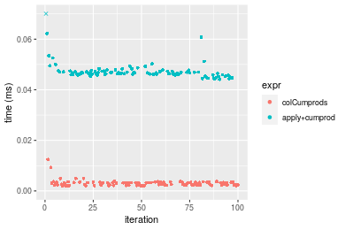

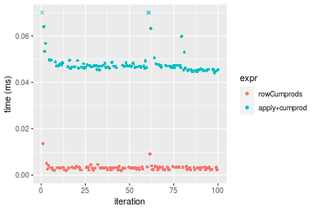
_Table: Benchmarking of colCumprods() and rowCumprods() on integer+10x10 data (original and transposed).  The top panel shows times in milliseconds and the bottom panel shows relative times._


|   |expr        |   min|     lq|    mean| median|     uq|    max|
|:--|:-----------|-----:|------:|-------:|------:|------:|------:|
|1  |colCumprods | 1.949| 2.2965| 3.02564| 2.6615| 3.3695| 12.399|
|2  |rowCumprods | 2.060| 2.4415| 3.15497| 3.1155| 3.3620| 13.542|


|   |expr        |      min|      lq|     mean|   median|        uq|      max|
|:--|:-----------|--------:|-------:|--------:|--------:|---------:|--------:|
|1  |colCumprods | 1.000000| 1.00000| 1.000000| 1.000000| 1.0000000| 1.000000|
|2  |rowCumprods | 1.056952| 1.06314| 1.042745| 1.170581| 0.9977742| 1.092185|

_Figure: Benchmarking of colCumprods() and rowCumprods() on integer+10x10 data (original and transposed).  Outliers are displayed as crosses. Times are in milliseconds._


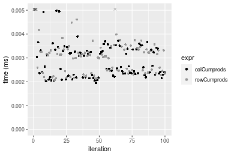

#### 100x100 integer matrix

```r
> X <- data[["100x100"]]
> gc()
          used  (Mb) gc trigger  (Mb) max used  (Mb)
Ncells 5195385 277.5    8529671 455.6  8529671 455.6
Vcells 9457537  72.2   31876688 243.2 60562128 462.1
> colStats <- microbenchmark(colCumprods = colCumprods(X), `apply+cumprod` = apply(X, MARGIN = 2L, 
+     FUN = cumprod), unit = "ms")
> X <- t(X)
> gc()
          used  (Mb) gc trigger  (Mb) max used  (Mb)
Ncells 5195361 277.5    8529671 455.6  8529671 455.6
Vcells 9462550  72.2   31876688 243.2 60562128 462.1
> rowStats <- microbenchmark(rowCumprods = rowCumprods(X), `apply+cumprod` = apply(X, MARGIN = 1L, 
+     FUN = cumprod), unit = "ms")
```

_Table: Benchmarking of colCumprods() and apply+cumprod() on integer+100x100 data. The top panel shows times in milliseconds and the bottom panel shows relative times._


|   |expr          |      min|        lq|      mean|    median|        uq|      max|
|:--|:-------------|--------:|---------:|---------:|---------:|---------:|--------:|
|1  |colCumprods   | 0.034171| 0.0365015| 0.0395443| 0.0378660| 0.0407970| 0.063975|
|2  |apply+cumprod | 0.249824| 0.2666890| 0.2909338| 0.2794035| 0.3068755| 0.479452|


|   |expr          |      min|       lq|     mean|   median|       uq|      max|
|:--|:-------------|--------:|--------:|--------:|--------:|--------:|--------:|
|1  |colCumprods   | 1.000000| 1.000000| 1.000000| 1.000000| 1.000000| 1.000000|
|2  |apply+cumprod | 7.310995| 7.306248| 7.357162| 7.378743| 7.522011| 7.494365|

_Table: Benchmarking of rowCumprods() and apply+cumprod() on integer+100x100 data (transposed). The top panel shows times in milliseconds and the bottom panel shows relative times._


|   |expr          |      min|        lq|      mean|    median|        uq|      max|
|:--|:-------------|--------:|---------:|---------:|---------:|---------:|--------:|
|1  |rowCumprods   | 0.034235| 0.0368590| 0.0398965| 0.0381275| 0.0416085| 0.058114|
|2  |apply+cumprod | 0.247888| 0.2661715| 0.2912208| 0.2784865| 0.3015130| 0.502095|


|   |expr          |      min|       lq|     mean|   median|       uq|      max|
|:--|:-------------|--------:|--------:|--------:|--------:|--------:|--------:|
|1  |rowCumprods   | 1.000000| 1.000000| 1.000000| 1.000000| 1.000000| 1.000000|
|2  |apply+cumprod | 7.240777| 7.221343| 7.299401| 7.304085| 7.246428| 8.639829|

_Figure: Benchmarking of colCumprods() and apply+cumprod() on integer+100x100 data  as well as rowCumprods() and apply+cumprod() on the same data transposed.  Outliers are displayed as crosses.  Times are in milliseconds._


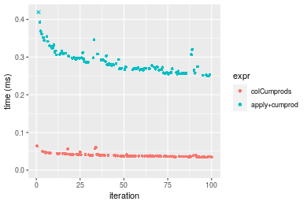


_Table: Benchmarking of colCumprods() and rowCumprods() on integer+100x100 data (original and transposed).  The top panel shows times in milliseconds and the bottom panel shows relative times._


|   |expr        |    min|      lq|     mean|  median|      uq|    max|
|:--|:-----------|------:|-------:|--------:|-------:|-------:|------:|
|1  |colCumprods | 34.171| 36.5015| 39.54429| 37.8660| 40.7970| 63.975|
|2  |rowCumprods | 34.235| 36.8590| 39.89653| 38.1275| 41.6085| 58.114|


|   |expr        |      min|       lq|     mean|   median|       uq|       max|
|:--|:-----------|--------:|--------:|--------:|--------:|--------:|---------:|
|1  |colCumprods | 1.000000| 1.000000| 1.000000| 1.000000| 1.000000| 1.0000000|
|2  |rowCumprods | 1.001873| 1.009794| 1.008908| 1.006906| 1.019891| 0.9083861|

_Figure: Benchmarking of colCumprods() and rowCumprods() on integer+100x100 data (original and transposed).  Outliers are displayed as crosses. Times are in milliseconds._


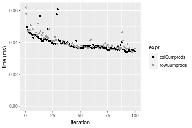

#### 1000x10 integer matrix

```r
> X <- data[["1000x10"]]
> gc()
          used  (Mb) gc trigger  (Mb) max used  (Mb)
Ncells 5196117 277.6    8529671 455.6  8529671 455.6
Vcells 9461044  72.2   31876688 243.2 60562128 462.1
> colStats <- microbenchmark(colCumprods = colCumprods(X), `apply+cumprod` = apply(X, MARGIN = 2L, 
+     FUN = cumprod), unit = "ms")
> X <- t(X)
> gc()
          used  (Mb) gc trigger  (Mb) max used  (Mb)
Ncells 5196093 277.6    8529671 455.6  8529671 455.6
Vcells 9466057  72.3   31876688 243.2 60562128 462.1
> rowStats <- microbenchmark(rowCumprods = rowCumprods(X), `apply+cumprod` = apply(X, MARGIN = 1L, 
+     FUN = cumprod), unit = "ms")
```

_Table: Benchmarking of colCumprods() and apply+cumprod() on integer+1000x10 data. The top panel shows times in milliseconds and the bottom panel shows relative times._


|   |expr          |      min|        lq|      mean|    median|        uq|      max|
|:--|:-------------|--------:|---------:|---------:|---------:|---------:|--------:|
|1  |colCumprods   | 0.035570| 0.0381615| 0.0411372| 0.0406135| 0.0436800| 0.059271|
|2  |apply+cumprod | 0.162312| 0.1748130| 0.1899283| 0.1890485| 0.2021335| 0.290299|


|   |expr          |      min|       lq|     mean|   median|       uq|      max|
|:--|:-------------|--------:|--------:|--------:|--------:|--------:|--------:|
|1  |colCumprods   | 1.000000| 1.000000| 1.000000| 1.000000| 1.000000| 1.000000|
|2  |apply+cumprod | 4.563171| 4.580873| 4.616951| 4.654819| 4.627598| 4.897825|

_Table: Benchmarking of rowCumprods() and apply+cumprod() on integer+1000x10 data (transposed). The top panel shows times in milliseconds and the bottom panel shows relative times._


|   |expr          |      min|        lq|      mean|    median|        uq|      max|
|:--|:-------------|--------:|---------:|---------:|---------:|---------:|--------:|
|1  |rowCumprods   | 0.038940| 0.0401195| 0.0435610| 0.0418435| 0.0462225| 0.074072|
|2  |apply+cumprod | 0.162627| 0.1649235| 0.1834179| 0.1796835| 0.1962705| 0.306611|


|   |expr          |      min|       lq|     mean|  median|       uq|      max|
|:--|:-------------|--------:|--------:|--------:|-------:|--------:|--------:|
|1  |rowCumprods   | 1.000000| 1.000000| 1.000000| 1.00000| 1.000000| 1.000000|
|2  |apply+cumprod | 4.176348| 4.110806| 4.210599| 4.29418| 4.246211| 4.139364|

_Figure: Benchmarking of colCumprods() and apply+cumprod() on integer+1000x10 data  as well as rowCumprods() and apply+cumprod() on the same data transposed.  Outliers are displayed as crosses.  Times are in milliseconds._


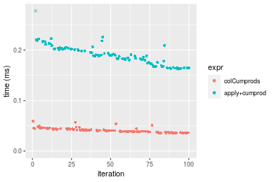

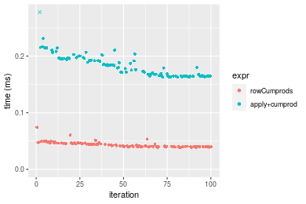
_Table: Benchmarking of colCumprods() and rowCumprods() on integer+1000x10 data (original and transposed).  The top panel shows times in milliseconds and the bottom panel shows relative times._


|   |expr        |   min|      lq|     mean|  median|      uq|    max|
|:--|:-----------|-----:|-------:|--------:|-------:|-------:|------:|
|1  |colCumprods | 35.57| 38.1615| 41.13716| 40.6135| 43.6800| 59.271|
|2  |rowCumprods | 38.94| 40.1195| 43.56100| 41.8435| 46.2225| 74.072|


|   |expr        |      min|       lq|     mean|   median|       uq|      max|
|:--|:-----------|--------:|--------:|--------:|--------:|--------:|--------:|
|1  |colCumprods | 1.000000| 1.000000| 1.000000| 1.000000| 1.000000| 1.000000|
|2  |rowCumprods | 1.094743| 1.051308| 1.058921| 1.030285| 1.058207| 1.249717|

_Figure: Benchmarking of colCumprods() and rowCumprods() on integer+1000x10 data (original and transposed).  Outliers are displayed as crosses. Times are in milliseconds._


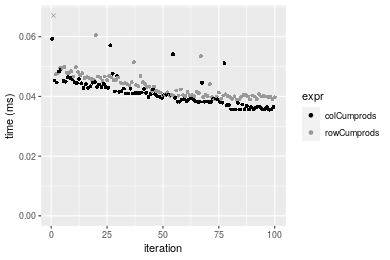

#### 10x1000 integer matrix

```r
> X <- data[["10x1000"]]
> gc()
          used  (Mb) gc trigger  (Mb) max used  (Mb)
Ncells 5196305 277.6    8529671 455.6  8529671 455.6
Vcells 9461731  72.2   31876688 243.2 60562128 462.1
> colStats <- microbenchmark(colCumprods = colCumprods(X), `apply+cumprod` = apply(X, MARGIN = 2L, 
+     FUN = cumprod), unit = "ms")
> X <- t(X)
> gc()
          used  (Mb) gc trigger  (Mb) max used  (Mb)
Ncells 5196281 277.6    8529671 455.6  8529671 455.6
Vcells 9466744  72.3   31876688 243.2 60562128 462.1
> rowStats <- microbenchmark(rowCumprods = rowCumprods(X), `apply+cumprod` = apply(X, MARGIN = 1L, 
+     FUN = cumprod), unit = "ms")
```

_Table: Benchmarking of colCumprods() and apply+cumprod() on integer+10x1000 data. The top panel shows times in milliseconds and the bottom panel shows relative times._


|   |expr          |      min|        lq|      mean|    median|       uq|      max|
|:--|:-------------|--------:|---------:|---------:|---------:|--------:|--------:|
|1  |colCumprods   | 0.029683| 0.0310620| 0.0365562| 0.0335665| 0.040015| 0.059939|
|2  |apply+cumprod | 0.950867| 0.9810315| 1.0957693| 1.0387115| 1.193547| 1.534638|


|   |expr          |      min|       lq|     mean|   median|       uq|      max|
|:--|:-------------|--------:|--------:|--------:|--------:|--------:|--------:|
|1  |colCumprods   |  1.00000|  1.00000|  1.00000|  1.00000|  1.00000|  1.00000|
|2  |apply+cumprod | 32.03406| 31.58301| 29.97493| 30.94489| 29.82748| 25.60333|

_Table: Benchmarking of rowCumprods() and apply+cumprod() on integer+10x1000 data (transposed). The top panel shows times in milliseconds and the bottom panel shows relative times._


|   |expr          |      min|        lq|      mean|    median|       uq|      max|
|:--|:-------------|--------:|---------:|---------:|---------:|--------:|--------:|
|1  |rowCumprods   | 0.026171| 0.0279540| 0.0321708| 0.0302045| 0.033187| 0.060131|
|2  |apply+cumprod | 0.957065| 0.9888725| 1.0968540| 1.0296575| 1.174174| 1.894367|


|   |expr          |      min|       lq|     mean|   median|       uq|    max|
|:--|:-------------|--------:|--------:|--------:|--------:|--------:|------:|
|1  |rowCumprods   |  1.00000|  1.00000|  1.00000|  1.00000|  1.00000|  1.000|
|2  |apply+cumprod | 36.56968| 35.37499| 34.09465| 34.08954| 35.38056| 31.504|

_Figure: Benchmarking of colCumprods() and apply+cumprod() on integer+10x1000 data  as well as rowCumprods() and apply+cumprod() on the same data transposed.  Outliers are displayed as crosses.  Times are in milliseconds._


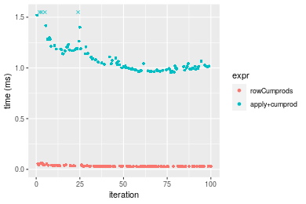
_Table: Benchmarking of colCumprods() and rowCumprods() on integer+10x1000 data (original and transposed).  The top panel shows times in milliseconds and the bottom panel shows relative times._


|   |expr        |    min|     lq|     mean|  median|     uq|    max|
|:--|:-----------|------:|------:|--------:|-------:|------:|------:|
|2  |rowCumprods | 26.171| 27.954| 32.17085| 30.2045| 33.187| 60.131|
|1  |colCumprods | 29.683| 31.062| 36.55619| 33.5665| 40.015| 59.939|


|   |expr        |      min|       lq|     mean|   median|       uq|      max|
|:--|:-----------|--------:|--------:|--------:|--------:|--------:|--------:|
|2  |rowCumprods | 1.000000| 1.000000| 1.000000| 1.000000| 1.000000| 1.000000|
|1  |colCumprods | 1.134194| 1.111183| 1.136314| 1.111308| 1.205743| 0.996807|

_Figure: Benchmarking of colCumprods() and rowCumprods() on integer+10x1000 data (original and transposed).  Outliers are displayed as crosses. Times are in milliseconds._


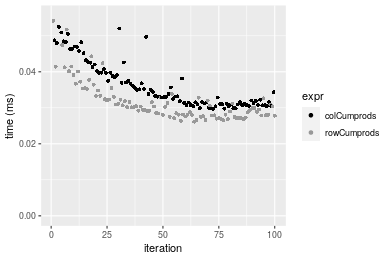

#### 100x1000 integer matrix

```r
> X <- data[["100x1000"]]
> gc()
          used  (Mb) gc trigger  (Mb) max used  (Mb)
Ncells 5196467 277.6    8529671 455.6  8529671 455.6
Vcells 9462190  72.2   31876688 243.2 60562128 462.1
> colStats <- microbenchmark(colCumprods = colCumprods(X), `apply+cumprod` = apply(X, MARGIN = 2L, 
+     FUN = cumprod), unit = "ms")
> X <- t(X)
> gc()
          used  (Mb) gc trigger  (Mb) max used  (Mb)
Ncells 5196461 277.6    8529671 455.6  8529671 455.6
Vcells 9512233  72.6   31876688 243.2 60562128 462.1
> rowStats <- microbenchmark(rowCumprods = rowCumprods(X), `apply+cumprod` = apply(X, MARGIN = 1L, 
+     FUN = cumprod), unit = "ms")
```

_Table: Benchmarking of colCumprods() and apply+cumprod() on integer+100x1000 data. The top panel shows times in milliseconds and the bottom panel shows relative times._


|   |expr          |      min|       lq|      mean|   median|       uq|       max|
|:--|:-------------|--------:|--------:|---------:|--------:|--------:|---------:|
|1  |colCumprods   | 0.267970| 0.283156| 0.3159124| 0.305977| 0.340631|  0.455423|
|2  |apply+cumprod | 1.841431| 1.923039| 2.4845013| 2.059309| 2.420221| 16.867736|


|   |expr          |     min|       lq|     mean|   median|       uq|      max|
|:--|:-------------|-------:|--------:|--------:|--------:|--------:|--------:|
|1  |colCumprods   | 1.00000| 1.000000| 1.000000| 1.000000| 1.000000|  1.00000|
|2  |apply+cumprod | 6.87178| 6.791445| 7.864527| 6.730272| 7.105109| 37.03751|

_Table: Benchmarking of rowCumprods() and apply+cumprod() on integer+100x1000 data (transposed). The top panel shows times in milliseconds and the bottom panel shows relative times._


|   |expr          |      min|        lq|      mean|   median|       uq|       max|
|:--|:-------------|--------:|---------:|---------:|--------:|--------:|---------:|
|1  |rowCumprods   | 0.259049| 0.2735335| 0.3083633| 0.289524| 0.338052|  0.458297|
|2  |apply+cumprod | 1.849302| 1.9293140| 2.5010254| 2.092738| 2.394850| 17.265979|


|   |expr          |      min|       lq|     mean|   median|       uq|      max|
|:--|:-------------|--------:|--------:|--------:|--------:|--------:|--------:|
|1  |rowCumprods   | 1.000000| 1.000000| 1.000000| 1.000000| 1.000000|  1.00000|
|2  |apply+cumprod | 7.138812| 7.053301| 8.110646| 7.228202| 7.084265| 37.67421|

_Figure: Benchmarking of colCumprods() and apply+cumprod() on integer+100x1000 data  as well as rowCumprods() and apply+cumprod() on the same data transposed.  Outliers are displayed as crosses.  Times are in milliseconds._


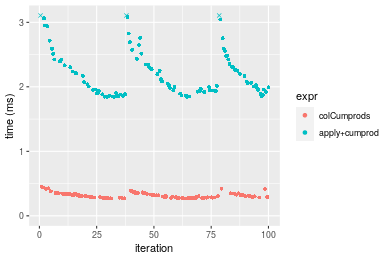

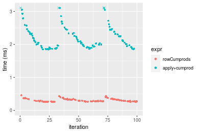
_Table: Benchmarking of colCumprods() and rowCumprods() on integer+100x1000 data (original and transposed).  The top panel shows times in milliseconds and the bottom panel shows relative times._


|   |expr        |     min|       lq|     mean|  median|      uq|     max|
|:--|:-----------|-------:|--------:|--------:|-------:|-------:|-------:|
|2  |rowCumprods | 259.049| 273.5335| 308.3633| 289.524| 338.052| 458.297|
|1  |colCumprods | 267.970| 283.1560| 315.9124| 305.977| 340.631| 455.423|


|   |expr        |      min|       lq|     mean|   median|       uq|      max|
|:--|:-----------|--------:|--------:|--------:|--------:|--------:|--------:|
|2  |rowCumprods | 1.000000| 1.000000| 1.000000| 1.000000| 1.000000| 1.000000|
|1  |colCumprods | 1.034437| 1.035179| 1.024481| 1.056828| 1.007629| 0.993729|

_Figure: Benchmarking of colCumprods() and rowCumprods() on integer+100x1000 data (original and transposed).  Outliers are displayed as crosses. Times are in milliseconds._


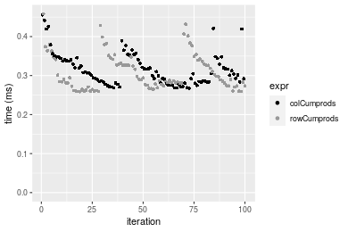

#### 1000x100 integer matrix

```r
> X <- data[["1000x100"]]
> gc()
          used  (Mb) gc trigger  (Mb) max used  (Mb)
Ncells 5196684 277.6    8529671 455.6  8529671 455.6
Vcells 9462788  72.2   31876688 243.2 60562128 462.1
> colStats <- microbenchmark(colCumprods = colCumprods(X), `apply+cumprod` = apply(X, MARGIN = 2L, 
+     FUN = cumprod), unit = "ms")
> X <- t(X)
> gc()
          used  (Mb) gc trigger  (Mb) max used  (Mb)
Ncells 5196660 277.6    8529671 455.6  8529671 455.6
Vcells 9512801  72.6   31876688 243.2 60562128 462.1
> rowStats <- microbenchmark(rowCumprods = rowCumprods(X), `apply+cumprod` = apply(X, MARGIN = 1L, 
+     FUN = cumprod), unit = "ms")
```

_Table: Benchmarking of colCumprods() and apply+cumprod() on integer+1000x100 data. The top panel shows times in milliseconds and the bottom panel shows relative times._


|   |expr          |      min|       lq|      mean|   median|       uq|      max|
|:--|:-------------|--------:|--------:|---------:|--------:|--------:|--------:|
|1  |colCumprods   | 0.260132| 0.282246| 0.3090793| 0.303985| 0.331859| 0.445887|
|2  |apply+cumprod | 1.043017| 1.146822| 1.4105415| 1.275292| 1.381757| 7.273948|


|   |expr          |      min|     lq|     mean|   median|       uq|      max|
|:--|:-------------|--------:|------:|--------:|--------:|--------:|--------:|
|1  |colCumprods   | 1.000000| 1.0000| 1.000000| 1.000000| 1.000000|  1.00000|
|2  |apply+cumprod | 4.009568| 4.0632| 4.563689| 4.195248| 4.163689| 16.31343|

_Table: Benchmarking of rowCumprods() and apply+cumprod() on integer+1000x100 data (transposed). The top panel shows times in milliseconds and the bottom panel shows relative times._


|   |expr          |      min|        lq|      mean|    median|       uq|      max|
|:--|:-------------|--------:|---------:|---------:|---------:|--------:|--------:|
|1  |rowCumprods   | 0.268310| 0.3105955| 0.3315711| 0.3313445| 0.350803| 0.452780|
|2  |apply+cumprod | 1.052907| 1.2035340| 1.4515562| 1.3271340| 1.423838| 7.597945|


|   |expr          |      min|       lq|     mean| median|       uq|      max|
|:--|:-------------|--------:|--------:|--------:|------:|--------:|--------:|
|1  |rowCumprods   | 1.000000| 1.000000| 1.000000| 1.0000| 1.000000|  1.00000|
|2  |apply+cumprod | 3.924218| 3.874924| 4.377813| 4.0053| 4.058795| 16.78066|

_Figure: Benchmarking of colCumprods() and apply+cumprod() on integer+1000x100 data  as well as rowCumprods() and apply+cumprod() on the same data transposed.  Outliers are displayed as crosses.  Times are in milliseconds._


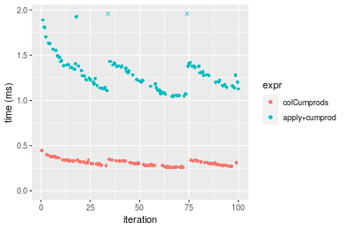

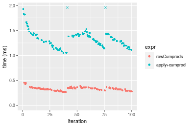
_Table: Benchmarking of colCumprods() and rowCumprods() on integer+1000x100 data (original and transposed).  The top panel shows times in milliseconds and the bottom panel shows relative times._


|   |expr        |     min|       lq|     mean|   median|      uq|     max|
|:--|:-----------|-------:|--------:|--------:|--------:|-------:|-------:|
|1  |colCumprods | 260.132| 282.2460| 309.0793| 303.9850| 331.859| 445.887|
|2  |rowCumprods | 268.310| 310.5955| 331.5711| 331.3445| 350.803| 452.780|


|   |expr        |      min|       lq|    mean|   median|       uq|      max|
|:--|:-----------|--------:|--------:|-------:|--------:|--------:|--------:|
|1  |colCumprods | 1.000000| 1.000000| 1.00000| 1.000000| 1.000000| 1.000000|
|2  |rowCumprods | 1.031438| 1.100442| 1.07277| 1.090003| 1.057084| 1.015459|

_Figure: Benchmarking of colCumprods() and rowCumprods() on integer+1000x100 data (original and transposed).  Outliers are displayed as crosses. Times are in milliseconds._


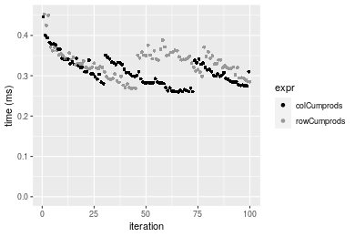


## Data type "double"

### Data
```r
> rmatrix <- function(nrow, ncol, mode = c("logical", "double", "integer", "index"), range = c(-100, 
+     +100), na_prob = 0) {
+     mode <- match.arg(mode)
+     n <- nrow * ncol
+     if (mode == "logical") {
+         x <- sample(c(FALSE, TRUE), size = n, replace = TRUE)
+     }     else if (mode == "index") {
+         x <- seq_len(n)
+         mode <- "integer"
+     }     else {
+         x <- runif(n, min = range[1], max = range[2])
+     }
+     storage.mode(x) <- mode
+     if (na_prob > 0) 
+         x[sample(n, size = na_prob * n)] <- NA
+     dim(x) <- c(nrow, ncol)
+     x
+ }
> rmatrices <- function(scale = 10, seed = 1, ...) {
+     set.seed(seed)
+     data <- list()
+     data[[1]] <- rmatrix(nrow = scale * 1, ncol = scale * 1, ...)
+     data[[2]] <- rmatrix(nrow = scale * 10, ncol = scale * 10, ...)
+     data[[3]] <- rmatrix(nrow = scale * 100, ncol = scale * 1, ...)
+     data[[4]] <- t(data[[3]])
+     data[[5]] <- rmatrix(nrow = scale * 10, ncol = scale * 100, ...)
+     data[[6]] <- t(data[[5]])
+     names(data) <- sapply(data, FUN = function(x) paste(dim(x), collapse = "x"))
+     data
+ }
> data <- rmatrices(mode = mode, range = c(-1, 1))
```

### Results

#### 10x10 double matrix

```r
> X <- data[["10x10"]]
> gc()
          used  (Mb) gc trigger  (Mb) max used  (Mb)
Ncells 5196884 277.6    8529671 455.6  8529671 455.6
Vcells 9579162  73.1   31876688 243.2 60562128 462.1
> colStats <- microbenchmark(colCumprods = colCumprods(X), `apply+cumprod` = apply(X, MARGIN = 2L, 
+     FUN = cumprod), unit = "ms")
> X <- t(X)
> gc()
          used  (Mb) gc trigger  (Mb) max used  (Mb)
Ncells 5196851 277.6    8529671 455.6  8529671 455.6
Vcells 9579260  73.1   31876688 243.2 60562128 462.1
> rowStats <- microbenchmark(rowCumprods = rowCumprods(X), `apply+cumprod` = apply(X, MARGIN = 1L, 
+     FUN = cumprod), unit = "ms")
```

_Table: Benchmarking of colCumprods() and apply+cumprod() on double+10x10 data. The top panel shows times in milliseconds and the bottom panel shows relative times._


|   |expr          |      min|        lq|      mean|    median|        uq|      max|
|:--|:-------------|--------:|---------:|---------:|---------:|---------:|--------:|
|1  |colCumprods   | 0.001968| 0.0021225| 0.0027960| 0.0024555| 0.0032630| 0.012197|
|2  |apply+cumprod | 0.044528| 0.0451800| 0.0467777| 0.0455225| 0.0459955| 0.125619|


|   |expr          |      min|       lq|     mean|   median|       uq|      max|
|:--|:-------------|--------:|--------:|--------:|--------:|--------:|--------:|
|1  |colCumprods   |  1.00000|  1.00000|  1.00000|  1.00000|  1.00000|  1.00000|
|2  |apply+cumprod | 22.62602| 21.28622| 16.73051| 18.53899| 14.09608| 10.29917|

_Table: Benchmarking of rowCumprods() and apply+cumprod() on double+10x10 data (transposed). The top panel shows times in milliseconds and the bottom panel shows relative times._


|   |expr          |      min|        lq|      mean|   median|        uq|      max|
|:--|:-------------|--------:|---------:|---------:|--------:|---------:|--------:|
|1  |rowCumprods   | 0.001921| 0.0023785| 0.0032358| 0.003202| 0.0033980| 0.017820|
|2  |apply+cumprod | 0.042933| 0.0451680| 0.0466741| 0.045943| 0.0464395| 0.119135|


|   |expr          |     min|       lq|     mean|   median|       uq|      max|
|:--|:-------------|-------:|--------:|--------:|--------:|--------:|--------:|
|1  |rowCumprods   |  1.0000|  1.00000|  1.00000|  1.00000|  1.00000| 1.000000|
|2  |apply+cumprod | 22.3493| 18.99012| 14.42436| 14.34822| 13.66672| 6.685466|

_Figure: Benchmarking of colCumprods() and apply+cumprod() on double+10x10 data  as well as rowCumprods() and apply+cumprod() on the same data transposed.  Outliers are displayed as crosses.  Times are in milliseconds._


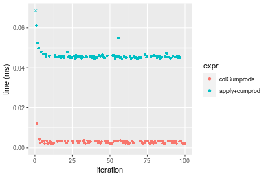

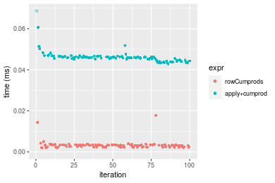
_Table: Benchmarking of colCumprods() and rowCumprods() on double+10x10 data (original and transposed).  The top panel shows times in milliseconds and the bottom panel shows relative times._


|   |expr        |   min|     lq|    mean| median|    uq|    max|
|:--|:-----------|-----:|------:|-------:|------:|-----:|------:|
|1  |colCumprods | 1.968| 2.1225| 2.79595| 2.4555| 3.263| 12.197|
|2  |rowCumprods | 1.921| 2.3785| 3.23578| 3.2020| 3.398| 17.820|


|   |expr        |       min|       lq|    mean|   median|       uq|      max|
|:--|:-----------|---------:|--------:|-------:|--------:|--------:|--------:|
|1  |colCumprods | 1.0000000| 1.000000| 1.00000| 1.000000| 1.000000| 1.000000|
|2  |rowCumprods | 0.9761179| 1.120613| 1.15731| 1.304011| 1.041373| 1.461015|

_Figure: Benchmarking of colCumprods() and rowCumprods() on double+10x10 data (original and transposed).  Outliers are displayed as crosses. Times are in milliseconds._


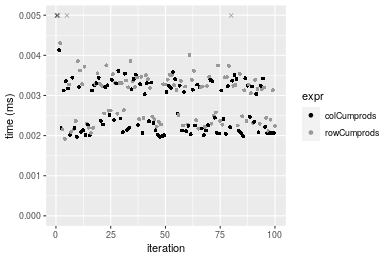

#### 100x100 double matrix

```r
> X <- data[["100x100"]]
> gc()
          used  (Mb) gc trigger  (Mb) max used  (Mb)
Ncells 5197059 277.6    8529671 455.6  8529671 455.6
Vcells 9579269  73.1   31876688 243.2 60562128 462.1
> colStats <- microbenchmark(colCumprods = colCumprods(X), `apply+cumprod` = apply(X, MARGIN = 2L, 
+     FUN = cumprod), unit = "ms")
> X <- t(X)
> gc()
          used  (Mb) gc trigger  (Mb) max used  (Mb)
Ncells 5197035 277.6    8529671 455.6  8529671 455.6
Vcells 9589282  73.2   31876688 243.2 60562128 462.1
> rowStats <- microbenchmark(rowCumprods = rowCumprods(X), `apply+cumprod` = apply(X, MARGIN = 1L, 
+     FUN = cumprod), unit = "ms")
```

_Table: Benchmarking of colCumprods() and apply+cumprod() on double+100x100 data. The top panel shows times in milliseconds and the bottom panel shows relative times._


|   |expr          |      min|        lq|      mean|    median|        uq|      max|
|:--|:-------------|--------:|---------:|---------:|---------:|---------:|--------:|
|1  |colCumprods   | 0.018862| 0.0201150| 0.0219743| 0.0212320| 0.0234195| 0.039722|
|2  |apply+cumprod | 0.235690| 0.2489555| 0.2757524| 0.2725015| 0.2913320| 0.432350|


|   |expr          |      min|       lq|     mean|   median|       uq|     max|
|:--|:-------------|--------:|--------:|--------:|--------:|--------:|-------:|
|1  |colCumprods   |  1.00000|  1.00000|  1.00000|  1.00000|  1.00000|  1.0000|
|2  |apply+cumprod | 12.49549| 12.37661| 12.54888| 12.83447| 12.43972| 10.8844|

_Table: Benchmarking of rowCumprods() and apply+cumprod() on double+100x100 data (transposed). The top panel shows times in milliseconds and the bottom panel shows relative times._


|   |expr          |      min|        lq|      mean|    median|        uq|      max|
|:--|:-------------|--------:|---------:|---------:|---------:|---------:|--------:|
|1  |rowCumprods   | 0.025778| 0.0276110| 0.0301306| 0.0293440| 0.0321305| 0.044823|
|2  |apply+cumprod | 0.230967| 0.2484535| 0.2757140| 0.2706595| 0.2942805| 0.446062|


|   |expr          |     min|       lq|     mean|   median|       uq|      max|
|:--|:-------------|-------:|--------:|--------:|--------:|--------:|--------:|
|1  |rowCumprods   | 1.00000| 1.000000| 1.000000| 1.000000| 1.000000| 1.000000|
|2  |apply+cumprod | 8.95985| 8.998352| 9.150628| 9.223674| 9.158914| 9.951632|

_Figure: Benchmarking of colCumprods() and apply+cumprod() on double+100x100 data  as well as rowCumprods() and apply+cumprod() on the same data transposed.  Outliers are displayed as crosses.  Times are in milliseconds._


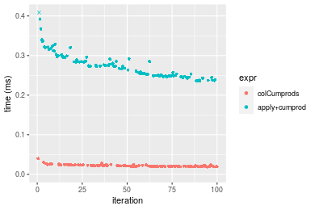

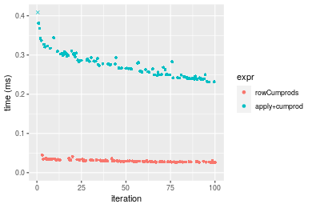
_Table: Benchmarking of colCumprods() and rowCumprods() on double+100x100 data (original and transposed).  The top panel shows times in milliseconds and the bottom panel shows relative times._


|   |expr        |    min|     lq|     mean| median|      uq|    max|
|:--|:-----------|------:|------:|--------:|------:|-------:|------:|
|1  |colCumprods | 18.862| 20.115| 21.97426| 21.232| 23.4195| 39.722|
|2  |rowCumprods | 25.778| 27.611| 30.13061| 29.344| 32.1305| 44.823|


|   |expr        |      min|       lq|     mean|   median|       uq|      max|
|:--|:-----------|--------:|--------:|--------:|--------:|--------:|--------:|
|1  |colCumprods | 1.000000| 1.000000| 1.000000| 1.000000| 1.000000| 1.000000|
|2  |rowCumprods | 1.366663| 1.372657| 1.371177| 1.382065| 1.371955| 1.128418|

_Figure: Benchmarking of colCumprods() and rowCumprods() on double+100x100 data (original and transposed).  Outliers are displayed as crosses. Times are in milliseconds._


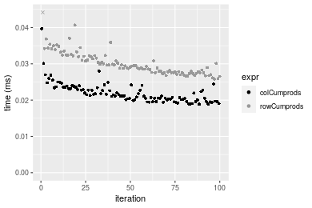

#### 1000x10 double matrix

```r
> X <- data[["1000x10"]]
> gc()
          used  (Mb) gc trigger  (Mb) max used  (Mb)
Ncells 5197251 277.6    8529671 455.6  8529671 455.6
Vcells 9580157  73.1   31876688 243.2 60562128 462.1
> colStats <- microbenchmark(colCumprods = colCumprods(X), `apply+cumprod` = apply(X, MARGIN = 2L, 
+     FUN = cumprod), unit = "ms")
> X <- t(X)
> gc()
          used  (Mb) gc trigger  (Mb) max used  (Mb)
Ncells 5197227 277.6    8529671 455.6  8529671 455.6
Vcells 9590170  73.2   31876688 243.2 60562128 462.1
> rowStats <- microbenchmark(rowCumprods = rowCumprods(X), `apply+cumprod` = apply(X, MARGIN = 1L, 
+     FUN = cumprod), unit = "ms")
```

_Table: Benchmarking of colCumprods() and apply+cumprod() on double+1000x10 data. The top panel shows times in milliseconds and the bottom panel shows relative times._


|   |expr          |      min|        lq|      mean|   median|        uq|      max|
|:--|:-------------|--------:|---------:|---------:|--------:|---------:|--------:|
|1  |colCumprods   | 0.028609| 0.0327970| 0.0367245| 0.035979| 0.0386805| 0.063028|
|2  |apply+cumprod | 0.395913| 0.4377725| 0.4955622| 0.485877| 0.5336655| 0.697110|


|   |expr          |      min|       lq|     mean|   median|       uq|      max|
|:--|:-------------|--------:|--------:|--------:|--------:|--------:|--------:|
|1  |colCumprods   |  1.00000|  1.00000|  1.00000|  1.00000|  1.00000|  1.00000|
|2  |apply+cumprod | 13.83876| 13.34794| 13.49405| 13.50446| 13.79676| 11.06032|

_Table: Benchmarking of rowCumprods() and apply+cumprod() on double+1000x10 data (transposed). The top panel shows times in milliseconds and the bottom panel shows relative times._


|   |expr          |      min|        lq|      mean|    median|        uq|      max|
|:--|:-------------|--------:|---------:|---------:|---------:|---------:|--------:|
|1  |rowCumprods   | 0.036700| 0.0420755| 0.0466227| 0.0456225| 0.0510135| 0.075046|
|2  |apply+cumprod | 0.392675| 0.4344265| 0.4875954| 0.4846930| 0.5209075| 0.699991|


|   |expr          |      min|       lq|     mean|   median|       uq|      max|
|:--|:-------------|--------:|--------:|--------:|--------:|--------:|--------:|
|1  |rowCumprods   |  1.00000|  1.00000|  1.00000|  1.00000|  1.00000| 1.000000|
|2  |apply+cumprod | 10.69959| 10.32493| 10.45833| 10.62399| 10.21117| 9.327492|

_Figure: Benchmarking of colCumprods() and apply+cumprod() on double+1000x10 data  as well as rowCumprods() and apply+cumprod() on the same data transposed.  Outliers are displayed as crosses.  Times are in milliseconds._


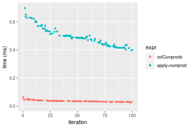


_Table: Benchmarking of colCumprods() and rowCumprods() on double+1000x10 data (original and transposed).  The top panel shows times in milliseconds and the bottom panel shows relative times._


|   |expr        |    min|      lq|     mean|  median|      uq|    max|
|:--|:-----------|------:|-------:|--------:|-------:|-------:|------:|
|1  |colCumprods | 28.609| 32.7970| 36.72451| 35.9790| 38.6805| 63.028|
|2  |rowCumprods | 36.700| 42.0755| 46.62270| 45.6225| 51.0135| 75.046|


|   |expr        |      min|       lq|     mean|   median|       uq|      max|
|:--|:-----------|--------:|--------:|--------:|--------:|--------:|--------:|
|1  |colCumprods | 1.000000| 1.000000| 1.000000| 1.000000| 1.000000| 1.000000|
|2  |rowCumprods | 1.282813| 1.282907| 1.269525| 1.268031| 1.318843| 1.190677|

_Figure: Benchmarking of colCumprods() and rowCumprods() on double+1000x10 data (original and transposed).  Outliers are displayed as crosses. Times are in milliseconds._


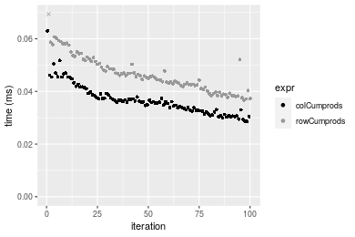

#### 10x1000 double matrix

```r
> X <- data[["10x1000"]]
> gc()
          used  (Mb) gc trigger  (Mb) max used  (Mb)
Ncells 5197439 277.6    8529671 455.6  8529671 455.6
Vcells 9581190  73.1   31876688 243.2 60562128 462.1
> colStats <- microbenchmark(colCumprods = colCumprods(X), `apply+cumprod` = apply(X, MARGIN = 2L, 
+     FUN = cumprod), unit = "ms")
> X <- t(X)
> gc()
          used  (Mb) gc trigger  (Mb) max used  (Mb)
Ncells 5197415 277.6    8529671 455.6  8529671 455.6
Vcells 9591203  73.2   31876688 243.2 60562128 462.1
> rowStats <- microbenchmark(rowCumprods = rowCumprods(X), `apply+cumprod` = apply(X, MARGIN = 1L, 
+     FUN = cumprod), unit = "ms")
```

_Table: Benchmarking of colCumprods() and apply+cumprod() on double+10x1000 data. The top panel shows times in milliseconds and the bottom panel shows relative times._


|   |expr          |      min|        lq|      mean|    median|        uq|      max|
|:--|:-------------|--------:|---------:|---------:|---------:|---------:|--------:|
|1  |colCumprods   | 0.016459| 0.0179895| 0.0213786| 0.0197340| 0.0235935| 0.038987|
|2  |apply+cumprod | 0.905260| 0.9371045| 1.0463409| 0.9965325| 1.1357045| 1.489800|


|   |expr          |      min|       lq|     mean|   median|       uq|      max|
|:--|:-------------|--------:|--------:|--------:|--------:|--------:|--------:|
|1  |colCumprods   |  1.00000|  1.00000|  1.00000|  1.00000|  1.00000|  1.00000|
|2  |apply+cumprod | 55.00091| 52.09175| 48.94342| 50.49825| 48.13633| 38.21274|

_Table: Benchmarking of rowCumprods() and apply+cumprod() on double+10x1000 data (transposed). The top panel shows times in milliseconds and the bottom panel shows relative times._


|   |expr          |      min|       lq|      mean|   median|        uq|      max|
|:--|:-------------|--------:|--------:|---------:|--------:|---------:|--------:|
|1  |rowCumprods   | 0.019238| 0.020747| 0.0241043| 0.022805| 0.0271085| 0.042509|
|2  |apply+cumprod | 0.873590| 0.936432| 1.0400717| 1.011245| 1.1205125| 1.473388|


|   |expr          |      min|       lq|     mean|   median|       uq|      max|
|:--|:-------------|--------:|--------:|--------:|--------:|--------:|--------:|
|1  |rowCumprods   |  1.00000|  1.00000|  1.00000|  1.00000|  1.00000|  1.00000|
|2  |apply+cumprod | 45.40961| 45.13578| 43.14886| 44.34313| 41.33436| 34.66061|

_Figure: Benchmarking of colCumprods() and apply+cumprod() on double+10x1000 data  as well as rowCumprods() and apply+cumprod() on the same data transposed.  Outliers are displayed as crosses.  Times are in milliseconds._


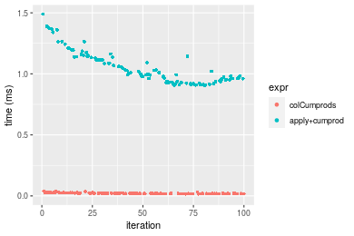


_Table: Benchmarking of colCumprods() and rowCumprods() on double+10x1000 data (original and transposed).  The top panel shows times in milliseconds and the bottom panel shows relative times._


|   |expr        |    min|      lq|     mean| median|      uq|    max|
|:--|:-----------|------:|-------:|--------:|------:|-------:|------:|
|1  |colCumprods | 16.459| 17.9895| 21.37858| 19.734| 23.5935| 38.987|
|2  |rowCumprods | 19.238| 20.7470| 24.10427| 22.805| 27.1085| 42.509|


|   |expr        |      min|       lq|     mean|  median|       uq|      max|
|:--|:-----------|--------:|--------:|--------:|-------:|--------:|--------:|
|1  |colCumprods | 1.000000| 1.000000| 1.000000| 1.00000| 1.000000| 1.000000|
|2  |rowCumprods | 1.168844| 1.153284| 1.127496| 1.15562| 1.148982| 1.090338|

_Figure: Benchmarking of colCumprods() and rowCumprods() on double+10x1000 data (original and transposed).  Outliers are displayed as crosses. Times are in milliseconds._


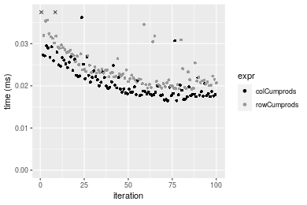

#### 100x1000 double matrix

```r
> X <- data[["100x1000"]]
> gc()
          used  (Mb) gc trigger  (Mb) max used  (Mb)
Ncells 5197601 277.6    8529671 455.6  8529671 455.6
Vcells 9581277  73.1   31876688 243.2 60562128 462.1
> colStats <- microbenchmark(colCumprods = colCumprods(X), `apply+cumprod` = apply(X, MARGIN = 2L, 
+     FUN = cumprod), unit = "ms")
> X <- t(X)
> gc()
          used  (Mb) gc trigger  (Mb) max used  (Mb)
Ncells 5197595 277.6    8529671 455.6  8529671 455.6
Vcells 9681320  73.9   31876688 243.2 60562128 462.1
> rowStats <- microbenchmark(rowCumprods = rowCumprods(X), `apply+cumprod` = apply(X, MARGIN = 1L, 
+     FUN = cumprod), unit = "ms")
```

_Table: Benchmarking of colCumprods() and apply+cumprod() on double+100x1000 data. The top panel shows times in milliseconds and the bottom panel shows relative times._


|   |expr          |      min|        lq|      mean|   median|        uq|       max|
|:--|:-------------|--------:|---------:|---------:|--------:|---------:|---------:|
|1  |colCumprods   | 0.135504| 0.1553185| 0.1715657| 0.168157| 0.1834145|  0.256995|
|2  |apply+cumprod | 1.654691| 1.7620635| 2.2401876| 1.952727| 2.1626990| 14.064804|


|   |expr          |      min|       lq|     mean|   median|       uq|      max|
|:--|:-------------|--------:|--------:|--------:|--------:|--------:|--------:|
|1  |colCumprods   |  1.00000|  1.00000|  1.00000|  1.00000|  1.00000|  1.00000|
|2  |apply+cumprod | 12.21138| 11.34484| 13.05732| 11.61252| 11.79132| 54.72793|

_Table: Benchmarking of rowCumprods() and apply+cumprod() on double+100x1000 data (transposed). The top panel shows times in milliseconds and the bottom panel shows relative times._


|   |expr          |      min|        lq|      mean|    median|        uq|       max|
|:--|:-------------|--------:|---------:|---------:|---------:|---------:|---------:|
|1  |rowCumprods   | 0.183357| 0.2040805| 0.2365675| 0.2285705| 0.2510835|  0.543653|
|2  |apply+cumprod | 1.678561| 1.8237780| 2.3575583| 2.0346840| 2.2589225| 14.962240|


|   |expr          |      min|       lq|    mean|   median|       uq|      max|
|:--|:-------------|--------:|--------:|-------:|--------:|--------:|--------:|
|1  |rowCumprods   | 1.000000| 1.000000| 1.00000| 1.000000| 1.000000|  1.00000|
|2  |apply+cumprod | 9.154606| 8.936562| 9.96569| 8.901779| 8.996698| 27.52167|

_Figure: Benchmarking of colCumprods() and apply+cumprod() on double+100x1000 data  as well as rowCumprods() and apply+cumprod() on the same data transposed.  Outliers are displayed as crosses.  Times are in milliseconds._


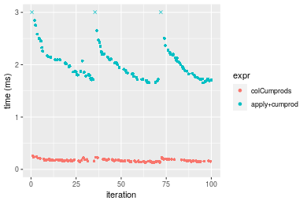

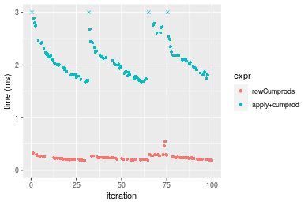
_Table: Benchmarking of colCumprods() and rowCumprods() on double+100x1000 data (original and transposed).  The top panel shows times in milliseconds and the bottom panel shows relative times._


|   |expr        |     min|       lq|     mean|   median|       uq|     max|
|:--|:-----------|-------:|--------:|--------:|--------:|--------:|-------:|
|1  |colCumprods | 135.504| 155.3185| 171.5657| 168.1570| 183.4145| 256.995|
|2  |rowCumprods | 183.357| 204.0805| 236.5675| 228.5705| 251.0835| 543.653|


|   |expr        |      min|       lq|     mean|   median|      uq|      max|
|:--|:-----------|--------:|--------:|--------:|--------:|-------:|--------:|
|1  |colCumprods | 1.000000| 1.000000| 1.000000| 1.000000| 1.00000| 1.000000|
|2  |rowCumprods | 1.353148| 1.313948| 1.378874| 1.359268| 1.36894| 2.115423|

_Figure: Benchmarking of colCumprods() and rowCumprods() on double+100x1000 data (original and transposed).  Outliers are displayed as crosses. Times are in milliseconds._


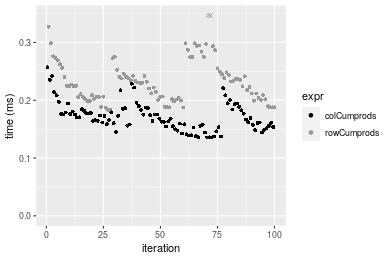

#### 1000x100 double matrix

```r
> X <- data[["1000x100"]]
> gc()
          used  (Mb) gc trigger  (Mb) max used  (Mb)
Ncells 5197800 277.6    8529671 455.6  8529671 455.6
Vcells 9582511  73.2   31876688 243.2 60562128 462.1
> colStats <- microbenchmark(colCumprods = colCumprods(X), `apply+cumprod` = apply(X, MARGIN = 2L, 
+     FUN = cumprod), unit = "ms")
> X <- t(X)
> gc()
          used  (Mb) gc trigger  (Mb) max used  (Mb)
Ncells 5197794 277.6    8529671 455.6  8529671 455.6
Vcells 9682554  73.9   31876688 243.2 60562128 462.1
> rowStats <- microbenchmark(rowCumprods = rowCumprods(X), `apply+cumprod` = apply(X, MARGIN = 1L, 
+     FUN = cumprod), unit = "ms")
```

_Table: Benchmarking of colCumprods() and apply+cumprod() on double+1000x100 data. The top panel shows times in milliseconds and the bottom panel shows relative times._


|   |expr          |      min|       lq|      mean|    median|        uq|      max|
|:--|:-------------|--------:|--------:|---------:|---------:|---------:|--------:|
|1  |colCumprods   | 0.269808| 0.272780| 0.2922876| 0.2808795| 0.2958015| 0.475241|
|2  |apply+cumprod | 3.581382| 3.600439| 3.9115260| 3.6187035| 3.7918445| 9.503469|


|   |expr          |      min|       lq|     mean|   median|       uq|      max|
|:--|:-------------|--------:|--------:|--------:|--------:|--------:|--------:|
|1  |colCumprods   |  1.00000|  1.00000|  1.00000|  1.00000|  1.00000|  1.00000|
|2  |apply+cumprod | 13.27382| 13.19906| 13.38246| 12.88347| 12.81888| 19.99716|

_Table: Benchmarking of rowCumprods() and apply+cumprod() on double+1000x100 data (transposed). The top panel shows times in milliseconds and the bottom panel shows relative times._


|   |expr          |      min|      lq|      mean|    median|       uq|      max|
|:--|:-------------|--------:|-------:|---------:|---------:|--------:|--------:|
|1  |rowCumprods   | 0.333468| 0.33711| 0.4114935| 0.3428665| 0.350023| 6.193611|
|2  |apply+cumprod | 3.598688| 3.62139| 3.8873814| 3.6361255| 3.819939| 9.682939|


|   |expr          |     min|       lq|     mean|   median|       uq|      max|
|:--|:-------------|-------:|--------:|--------:|--------:|--------:|--------:|
|1  |rowCumprods   |  1.0000|  1.00000| 1.000000|  1.00000|  1.00000| 1.000000|
|2  |apply+cumprod | 10.7917| 10.74246| 9.447005| 10.60508| 10.91339| 1.563375|

_Figure: Benchmarking of colCumprods() and apply+cumprod() on double+1000x100 data  as well as rowCumprods() and apply+cumprod() on the same data transposed.  Outliers are displayed as crosses.  Times are in milliseconds._


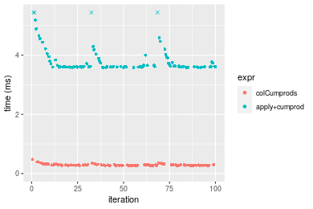

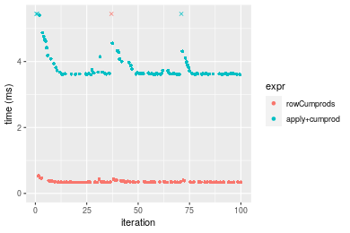
_Table: Benchmarking of colCumprods() and rowCumprods() on double+1000x100 data (original and transposed).  The top panel shows times in milliseconds and the bottom panel shows relative times._


|   |expr        |     min|     lq|     mean|   median|       uq|      max|
|:--|:-----------|-------:|------:|--------:|--------:|--------:|--------:|
|1  |colCumprods | 269.808| 272.78| 292.2876| 280.8795| 295.8015|  475.241|
|2  |rowCumprods | 333.468| 337.11| 411.4935| 342.8665| 350.0230| 6193.611|


|   |expr        |      min|       lq|     mean|   median|       uq|      max|
|:--|:-----------|--------:|--------:|--------:|--------:|--------:|--------:|
|1  |colCumprods | 1.000000| 1.000000| 1.000000| 1.000000| 1.000000|  1.00000|
|2  |rowCumprods | 1.235946| 1.235831| 1.407838| 1.220689| 1.183304| 13.03257|

_Figure: Benchmarking of colCumprods() and rowCumprods() on double+1000x100 data (original and transposed).  Outliers are displayed as crosses. Times are in milliseconds._


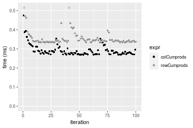


## Appendix

### Session information
```r
R version 4.1.1 Patched (2021-08-10 r80727)
Platform: x86_64-pc-linux-gnu (64-bit)
Running under: Ubuntu 18.04.5 LTS

Matrix products: default
BLAS:   /home/hb/software/R-devel/R-4-1-branch/lib/R/lib/libRblas.so
LAPACK: /home/hb/software/R-devel/R-4-1-branch/lib/R/lib/libRlapack.so

locale:
 [1] LC_CTYPE=en_US.UTF-8       LC_NUMERIC=C              
 [3] LC_TIME=en_US.UTF-8        LC_COLLATE=en_US.UTF-8    
 [5] LC_MONETARY=en_US.UTF-8    LC_MESSAGES=en_US.UTF-8   
 [7] LC_PAPER=en_US.UTF-8       LC_NAME=C                 
 [9] LC_ADDRESS=C               LC_TELEPHONE=C            
[11] LC_MEASUREMENT=en_US.UTF-8 LC_IDENTIFICATION=C       

attached base packages:
[1] stats     graphics  grDevices utils     datasets  methods   base     

other attached packages:
[1] microbenchmark_1.4-7   matrixStats_0.60.1     ggplot2_3.3.5         
[4] knitr_1.33             R.devices_2.17.0       R.utils_2.10.1        
[7] R.oo_1.24.0            R.methodsS3_1.8.1-9001 history_0.0.1-9000    

loaded via a namespace (and not attached):
 [1] Biobase_2.52.0          httr_1.4.2              splines_4.1.1          
 [4] bit64_4.0.5             network_1.17.1          assertthat_0.2.1       
 [7] highr_0.9               stats4_4.1.1            blob_1.2.2             
[10] GenomeInfoDbData_1.2.6  robustbase_0.93-8       pillar_1.6.2           
[13] RSQLite_2.2.8           lattice_0.20-44         glue_1.4.2             
[16] digest_0.6.27           XVector_0.32.0          colorspace_2.0-2       
[19] Matrix_1.3-4            XML_3.99-0.7            pkgconfig_2.0.3        
[22] zlibbioc_1.38.0         genefilter_1.74.0       purrr_0.3.4            
[25] ergm_4.1.2              xtable_1.8-4            scales_1.1.1           
[28] tibble_3.1.4            annotate_1.70.0         KEGGREST_1.32.0        
[31] farver_2.1.0            generics_0.1.0          IRanges_2.26.0         
[34] ellipsis_0.3.2          cachem_1.0.6            withr_2.4.2            
[37] BiocGenerics_0.38.0     mime_0.11               survival_3.2-13        
[40] magrittr_2.0.1          crayon_1.4.1            statnet.common_4.5.0   
[43] memoise_2.0.0           laeken_0.5.1            fansi_0.5.0            
[46] R.cache_0.15.0          MASS_7.3-54             R.rsp_0.44.0           
[49] progressr_0.8.0         tools_4.1.1             lifecycle_1.0.0        
[52] S4Vectors_0.30.0        trust_0.1-8             munsell_0.5.0          
[55] tabby_0.0.1-9001        AnnotationDbi_1.54.1    Biostrings_2.60.2      
[58] compiler_4.1.1          GenomeInfoDb_1.28.1     rlang_0.4.11           
[61] grid_4.1.1              RCurl_1.98-1.4          cwhmisc_6.6            
[64] rappdirs_0.3.3          startup_0.15.0          labeling_0.4.2         
[67] bitops_1.0-7            base64enc_0.1-3         boot_1.3-28            
[70] gtable_0.3.0            DBI_1.1.1               markdown_1.1           
[73] R6_2.5.1                lpSolveAPI_5.5.2.0-17.7 rle_0.9.2              
[76] dplyr_1.0.7             fastmap_1.1.0           bit_4.0.4              
[79] utf8_1.2.2              parallel_4.1.1          Rcpp_1.0.7             
[82] vctrs_0.3.8             png_0.1-7               DEoptimR_1.0-9         
[85] tidyselect_1.1.1        xfun_0.25               coda_0.19-4            
```
Total processing time was 24.8 secs.


### Reproducibility
To reproduce this report, do:
```r
html <- matrixStats:::benchmark('colCumprods')
```

[RSP]: https://cran.r-project.org/package=R.rsp
[matrixStats]: https://cran.r-project.org/package=matrixStats

[StackOverflow:colMins?]: https://stackoverflow.com/questions/13676878 "Stack Overflow: fastest way to get Min from every column in a matrix?"
[StackOverflow:colSds?]: https://stackoverflow.com/questions/17549762 "Stack Overflow: Is there such 'colsd' in R?"
[StackOverflow:rowProds?]: https://stackoverflow.com/questions/20198801/ "Stack Overflow: Row product of matrix and column sum of matrix"

---------------------------------------
Copyright Henrik Bengtsson. Last updated on 2021-08-25 18:53:57 (+0200 UTC). Powered by [RSP].

<script>
 var link = document.createElement('link');
 link.rel = 'icon';
 link.href = "data:image/png;base64,iVBORw0KGgoAAAANSUhEUgAAACAAAAAgCAMAAABEpIrGAAAA21BMVEUAAAAAAP8AAP8AAP8AAP8AAP8AAP8AAP8AAP8AAP8AAP8AAP8AAP8AAP8AAP8AAP8AAP8AAP8AAP8AAP8AAP8AAP8AAP8AAP8AAP8AAP8AAP8AAP8AAP8AAP8AAP8AAP8AAP8AAP8AAP8AAP8AAP8AAP8AAP8AAP8AAP8AAP8BAf4CAv0DA/wdHeIeHuEfH+AgIN8hId4lJdomJtknJ9g+PsE/P8BAQL9yco10dIt1dYp3d4h4eIeVlWqWlmmXl2iYmGeZmWabm2Tn5xjo6Bfp6Rb39wj4+Af//wA2M9hbAAAASXRSTlMAAQIJCgsMJSYnKD4/QGRlZmhpamtsbautrrCxuru8y8zN5ebn6Pn6+///////////////////////////////////////////LsUNcQAAAS9JREFUOI29k21XgkAQhVcFytdSMqMETU26UVqGmpaiFbL//xc1cAhhwVNf6n5i5z67M2dmYOyfJZUqlVLhkKucG7cgmUZTybDz6g0iDeq51PUr37Ds2cy2/C9NeES5puDjxuUk1xnToZsg8pfA3avHQ3lLIi7iWRrkv/OYtkScxBIMgDee0ALoyxHQBJ68JLCjOtQIMIANF7QG9G9fNnHvisCHBVMKgSJgiz7nE+AoBKrAPA3MgepvgR9TSCasrCKH0eB1wBGBFdCO+nAGjMVGPcQb5bd6mQRegN6+1axOs9nGfYcCtfi4NQosdtH7dB+txFIpXQqN1p9B/asRHToyS0jRgpV7nk4nwcq1BJ+x3Gl/v7S9Wmpp/aGquum7w3ZDyrADFYrl8vHBH+ev9AUASW1dmU4h4wAAAABJRU5ErkJggg=="
 document.getElementsByTagName('head')[0].appendChild(link);
</script>


