[matrixStats]: Benchmark report

---------------------------------------


# colCumsums() and rowCumsums() benchmarks on subsetted computation

This report benchmark the performance of colCumsums() and rowCumsums() on subsetted computation.


## Data type "integer"

### Data
```r
> rmatrix <- function(nrow, ncol, mode = c("logical", "double", "integer", "index"), range = c(-100, 
+     +100), na_prob = 0) {
+     mode <- match.arg(mode)
+     n <- nrow * ncol
+     if (mode == "logical") {
+         x <- sample(c(FALSE, TRUE), size = n, replace = TRUE)
+     }     else if (mode == "index") {
+         x <- seq_len(n)
+         mode <- "integer"
+     }     else {
+         x <- runif(n, min = range[1], max = range[2])
+     }
+     storage.mode(x) <- mode
+     if (na_prob > 0) 
+         x[sample(n, size = na_prob * n)] <- NA
+     dim(x) <- c(nrow, ncol)
+     x
+ }
> rmatrices <- function(scale = 10, seed = 1, ...) {
+     set.seed(seed)
+     data <- list()
+     data[[1]] <- rmatrix(nrow = scale * 1, ncol = scale * 1, ...)
+     data[[2]] <- rmatrix(nrow = scale * 10, ncol = scale * 10, ...)
+     data[[3]] <- rmatrix(nrow = scale * 100, ncol = scale * 1, ...)
+     data[[4]] <- t(data[[3]])
+     data[[5]] <- rmatrix(nrow = scale * 10, ncol = scale * 100, ...)
+     data[[6]] <- t(data[[5]])
+     names(data) <- sapply(data, FUN = function(x) paste(dim(x), collapse = "x"))
+     data
+ }
> data <- rmatrices(mode = mode)
```

### Results

#### 10x10 integer matrix

```r
> X <- data[["10x10"]]
> rows <- sample.int(nrow(X), size = nrow(X) * 0.7)
> cols <- sample.int(ncol(X), size = ncol(X) * 0.7)
> X_S <- X[rows, cols]
> gc()
          used  (Mb) gc trigger  (Mb) max used  (Mb)
Ncells 5209099 278.2    8529671 455.6  8529671 455.6
Vcells 9847099  75.2   31876688 243.2 60562128 462.1
> colStats <- microbenchmark(colCumsums_X_S = colCumsums(X_S), `colCumsums(X, rows, cols)` = colCumsums(X, 
+     rows = rows, cols = cols), `colCummins(X[rows, cols])` = colCumsums(X[rows, cols]), unit = "ms")
> X <- t(X)
> X_S <- t(X_S)
> gc()
          used  (Mb) gc trigger  (Mb) max used  (Mb)
Ncells 5200736 277.8    8529671 455.6  8529671 455.6
Vcells 9819819  75.0   31876688 243.2 60562128 462.1
> rowStats <- microbenchmark(rowCumsums_X_S = rowCumsums(X_S), `rowCumsums(X, cols, rows)` = rowCumsums(X, 
+     rows = cols, cols = rows), `rowCumsums(X[cols, rows])` = rowCumsums(X[cols, rows]), unit = "ms")
```

_Table: Benchmarking of colCumsums_X_S(), colCumsums(X, rows, cols)() and colCummins(X[rows, cols])() on integer+10x10 data. The top panel shows times in milliseconds and the bottom panel shows relative times._


|   |expr                      |      min|        lq|      mean|   median|        uq|      max|
|:--|:-------------------------|--------:|---------:|---------:|--------:|---------:|--------:|
|1  |colCumsums_X_S            | 0.001865| 0.0020275| 0.0029429| 0.002125| 0.0022135| 0.082745|
|2  |colCumsums(X, rows, cols) | 0.002084| 0.0023590| 0.0025204| 0.002461| 0.0025720| 0.004499|
|3  |colCummins(X[rows, cols]) | 0.002808| 0.0030800| 0.0032182| 0.003175| 0.0032855| 0.006142|


|   |expr                      |      min|       lq|      mean|   median|       uq|       max|
|:--|:-------------------------|--------:|--------:|---------:|--------:|--------:|---------:|
|1  |colCumsums_X_S            | 1.000000| 1.000000| 1.0000000| 1.000000| 1.000000| 1.0000000|
|2  |colCumsums(X, rows, cols) | 1.117426| 1.163502| 0.8564259| 1.158118| 1.161961| 0.0543719|
|3  |colCummins(X[rows, cols]) | 1.505630| 1.519112| 1.0935187| 1.494118| 1.484301| 0.0742281|

_Table: Benchmarking of rowCumsums_X_S(), rowCumsums(X, cols, rows)() and rowCumsums(X[cols, rows])() on integer+10x10 data (transposed). The top panel shows times in milliseconds and the bottom panel shows relative times._


|   |expr                      |      min|        lq|      mean|    median|       uq|      max|
|:--|:-------------------------|--------:|---------:|---------:|---------:|--------:|--------:|
|1  |rowCumsums_X_S            | 0.001814| 0.0021055| 0.0022262| 0.0021670| 0.002280| 0.004165|
|2  |rowCumsums(X, cols, rows) | 0.002228| 0.0024165| 0.0033511| 0.0024905| 0.002631| 0.083943|
|3  |rowCumsums(X[cols, rows]) | 0.002707| 0.0031445| 0.0032717| 0.0032620| 0.003332| 0.005236|


|   |expr                      |      min|       lq|     mean|   median|       uq|       max|
|:--|:-------------------------|--------:|--------:|--------:|--------:|--------:|---------:|
|1  |rowCumsums_X_S            | 1.000000| 1.000000| 1.000000| 1.000000| 1.000000|  1.000000|
|2  |rowCumsums(X, cols, rows) | 1.228225| 1.147708| 1.505307| 1.149285| 1.153947| 20.154382|
|3  |rowCumsums(X[cols, rows]) | 1.492282| 1.493470| 1.469637| 1.505307| 1.461404|  1.257143|

_Figure: Benchmarking of colCumsums_X_S(), colCumsums(X, rows, cols)() and colCummins(X[rows, cols])() on integer+10x10 data  as well as rowCumsums_X_S(), rowCumsums(X, cols, rows)() and rowCumsums(X[cols, rows])() on the same data transposed.  Outliers are displayed as crosses.  Times are in milliseconds._


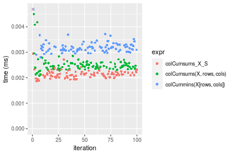

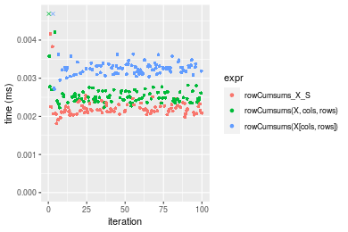
_Table: Benchmarking of colCumsums_X_S() and rowCumsums_X_S() on integer+10x10 data (original and transposed).  The top panel shows times in milliseconds and the bottom panel shows relative times._


|   |expr           |   min|     lq|    mean| median|     uq|    max|
|:--|:--------------|-----:|------:|-------:|------:|------:|------:|
|1  |colCumsums_X_S | 1.865| 2.0275| 2.94294|  2.125| 2.2135| 82.745|
|2  |rowCumsums_X_S | 1.814| 2.1055| 2.22619|  2.167| 2.2800|  4.165|


|   |expr           |       min|       lq|     mean|   median|       uq|       max|
|:--|:--------------|---------:|--------:|--------:|--------:|--------:|---------:|
|1  |colCumsums_X_S | 1.0000000| 1.000000| 1.000000| 1.000000| 1.000000| 1.0000000|
|2  |rowCumsums_X_S | 0.9726542| 1.038471| 0.756451| 1.019765| 1.030043| 0.0503354|

_Figure: Benchmarking of colCumsums_X_S() and rowCumsums_X_S() on integer+10x10 data (original and transposed).  Outliers are displayed as crosses. Times are in milliseconds._


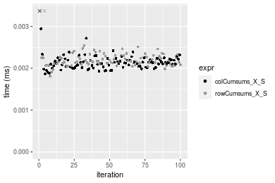

#### 100x100 integer matrix

```r
> X <- data[["100x100"]]
> rows <- sample.int(nrow(X), size = nrow(X) * 0.7)
> cols <- sample.int(ncol(X), size = ncol(X) * 0.7)
> X_S <- X[rows, cols]
> gc()
          used  (Mb) gc trigger  (Mb) max used  (Mb)
Ncells 5199344 277.7    8529671 455.6  8529671 455.6
Vcells 9488596  72.4   31876688 243.2 60562128 462.1
> colStats <- microbenchmark(colCumsums_X_S = colCumsums(X_S), `colCumsums(X, rows, cols)` = colCumsums(X, 
+     rows = rows, cols = cols), `colCummins(X[rows, cols])` = colCumsums(X[rows, cols]), unit = "ms")
> X <- t(X)
> X_S <- t(X_S)
> gc()
          used  (Mb) gc trigger  (Mb) max used  (Mb)
Ncells 5199320 277.7    8529671 455.6  8529671 455.6
Vcells 9493649  72.5   31876688 243.2 60562128 462.1
> rowStats <- microbenchmark(rowCumsums_X_S = rowCumsums(X_S), `rowCumsums(X, cols, rows)` = rowCumsums(X, 
+     rows = cols, cols = rows), `rowCumsums(X[cols, rows])` = rowCumsums(X[cols, rows]), unit = "ms")
```

_Table: Benchmarking of colCumsums_X_S(), colCumsums(X, rows, cols)() and colCummins(X[rows, cols])() on integer+100x100 data. The top panel shows times in milliseconds and the bottom panel shows relative times._


|   |expr                      |      min|        lq|      mean|    median|        uq|      max|
|:--|:-------------------------|--------:|---------:|---------:|---------:|---------:|--------:|
|2  |colCumsums(X, rows, cols) | 0.019051| 0.0201260| 0.0206943| 0.0207345| 0.0210590| 0.025470|
|1  |colCumsums_X_S            | 0.020088| 0.0210365| 0.0217494| 0.0218750| 0.0220415| 0.035294|
|3  |colCummins(X[rows, cols]) | 0.030387| 0.0317610| 0.0330226| 0.0329485| 0.0334765| 0.062142|


|   |expr                      |      min|       lq|     mean|   median|       uq|      max|
|:--|:-------------------------|--------:|--------:|--------:|--------:|--------:|--------:|
|2  |colCumsums(X, rows, cols) | 1.000000| 1.000000| 1.000000| 1.000000| 1.000000| 1.000000|
|1  |colCumsums_X_S            | 1.054433| 1.045240| 1.050981| 1.055005| 1.046655| 1.385709|
|3  |colCummins(X[rows, cols]) | 1.595034| 1.578108| 1.595733| 1.589066| 1.589653| 2.439811|

_Table: Benchmarking of rowCumsums_X_S(), rowCumsums(X, cols, rows)() and rowCumsums(X[cols, rows])() on integer+100x100 data (transposed). The top panel shows times in milliseconds and the bottom panel shows relative times._


|   |expr                      |      min|       lq|      mean|    median|        uq|      max|
|:--|:-------------------------|--------:|--------:|---------:|---------:|---------:|--------:|
|2  |rowCumsums(X, cols, rows) | 0.020352| 0.021432| 0.0223430| 0.0220085| 0.0223570| 0.049823|
|1  |rowCumsums_X_S            | 0.021351| 0.022402| 0.0234976| 0.0232995| 0.0240555| 0.037651|
|3  |rowCumsums(X[cols, rows]) | 0.031482| 0.032849| 0.0340993| 0.0341365| 0.0344790| 0.049689|


|   |expr                      |      min|       lq|     mean|   median|       uq|       max|
|:--|:-------------------------|--------:|--------:|--------:|--------:|--------:|---------:|
|2  |rowCumsums(X, cols, rows) | 1.000000| 1.000000| 1.000000| 1.000000| 1.000000| 1.0000000|
|1  |rowCumsums_X_S            | 1.049086| 1.045259| 1.051674| 1.058659| 1.075972| 0.7556952|
|3  |rowCumsums(X[cols, rows]) | 1.546875| 1.532708| 1.526172| 1.551060| 1.542202| 0.9973105|

_Figure: Benchmarking of colCumsums_X_S(), colCumsums(X, rows, cols)() and colCummins(X[rows, cols])() on integer+100x100 data  as well as rowCumsums_X_S(), rowCumsums(X, cols, rows)() and rowCumsums(X[cols, rows])() on the same data transposed.  Outliers are displayed as crosses.  Times are in milliseconds._


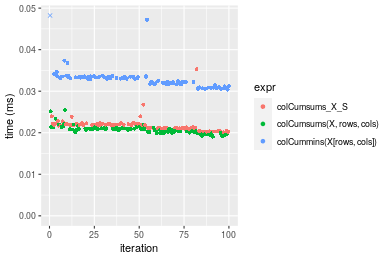

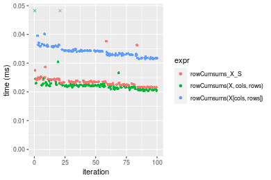
_Table: Benchmarking of colCumsums_X_S() and rowCumsums_X_S() on integer+100x100 data (original and transposed).  The top panel shows times in milliseconds and the bottom panel shows relative times._


|   |expr           |    min|      lq|     mean|  median|      uq|    max|
|:--|:--------------|------:|-------:|--------:|-------:|-------:|------:|
|1  |colCumsums_X_S | 20.088| 21.0365| 21.74935| 21.8750| 22.0415| 35.294|
|2  |rowCumsums_X_S | 21.351| 22.4020| 23.49760| 23.2995| 24.0555| 37.651|


|   |expr           |      min|       lq|     mean|  median|       uq|      max|
|:--|:--------------|--------:|--------:|--------:|-------:|--------:|--------:|
|1  |colCumsums_X_S | 1.000000| 1.000000| 1.000000| 1.00000| 1.000000| 1.000000|
|2  |rowCumsums_X_S | 1.062873| 1.064911| 1.080382| 1.06512| 1.091373| 1.066782|

_Figure: Benchmarking of colCumsums_X_S() and rowCumsums_X_S() on integer+100x100 data (original and transposed).  Outliers are displayed as crosses. Times are in milliseconds._


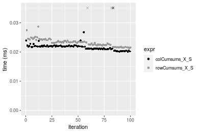

#### 1000x10 integer matrix

```r
> X <- data[["1000x10"]]
> rows <- sample.int(nrow(X), size = nrow(X) * 0.7)
> cols <- sample.int(ncol(X), size = ncol(X) * 0.7)
> X_S <- X[rows, cols]
> gc()
          used  (Mb) gc trigger  (Mb) max used  (Mb)
Ncells 5200086 277.8    8529671 455.6  8529671 455.6
Vcells 9492647  72.5   31876688 243.2 60562128 462.1
> colStats <- microbenchmark(colCumsums_X_S = colCumsums(X_S), `colCumsums(X, rows, cols)` = colCumsums(X, 
+     rows = rows, cols = cols), `colCummins(X[rows, cols])` = colCumsums(X[rows, cols]), unit = "ms")
> X <- t(X)
> X_S <- t(X_S)
> gc()
          used  (Mb) gc trigger  (Mb) max used  (Mb)
Ncells 5200062 277.8    8529671 455.6  8529671 455.6
Vcells 9497700  72.5   31876688 243.2 60562128 462.1
> rowStats <- microbenchmark(rowCumsums_X_S = rowCumsums(X_S), `rowCumsums(X, cols, rows)` = rowCumsums(X, 
+     rows = cols, cols = rows), `rowCumsums(X[cols, rows])` = rowCumsums(X[cols, rows]), unit = "ms")
```

_Table: Benchmarking of colCumsums_X_S(), colCumsums(X, rows, cols)() and colCummins(X[rows, cols])() on integer+1000x10 data. The top panel shows times in milliseconds and the bottom panel shows relative times._


|   |expr                      |      min|        lq|      mean|    median|        uq|      max|
|:--|:-------------------------|--------:|---------:|---------:|---------:|---------:|--------:|
|1  |colCumsums_X_S            | 0.019896| 0.0209990| 0.0228349| 0.0211610| 0.0216220| 0.054841|
|2  |colCumsums(X, rows, cols) | 0.021220| 0.0222705| 0.0250813| 0.0226300| 0.0233790| 0.042252|
|3  |colCummins(X[rows, cols]) | 0.031564| 0.0328660| 0.0359631| 0.0332225| 0.0339785| 0.068507|


|   |expr                      |      min|       lq|     mean|   median|       uq|       max|
|:--|:-------------------------|--------:|--------:|--------:|--------:|--------:|---------:|
|1  |colCumsums_X_S            | 1.000000| 1.000000| 1.000000| 1.000000| 1.000000| 1.0000000|
|2  |colCumsums(X, rows, cols) | 1.066546| 1.060550| 1.098374| 1.069420| 1.081260| 0.7704455|
|3  |colCummins(X[rows, cols]) | 1.586450| 1.565122| 1.574917| 1.569987| 1.571478| 1.2491931|

_Table: Benchmarking of rowCumsums_X_S(), rowCumsums(X, cols, rows)() and rowCumsums(X[cols, rows])() on integer+1000x10 data (transposed). The top panel shows times in milliseconds and the bottom panel shows relative times._


|   |expr                      |      min|        lq|      mean|    median|        uq|      max|
|:--|:-------------------------|--------:|---------:|---------:|---------:|---------:|--------:|
|1  |rowCumsums_X_S            | 0.023157| 0.0241025| 0.0250593| 0.0249085| 0.0253485| 0.039821|
|2  |rowCumsums(X, cols, rows) | 0.024115| 0.0253970| 0.0266695| 0.0265325| 0.0271485| 0.041174|
|3  |rowCumsums(X[cols, rows]) | 0.035286| 0.0368020| 0.0384760| 0.0382340| 0.0388655| 0.070778|


|   |expr                      |      min|       lq|     mean|   median|       uq|      max|
|:--|:-------------------------|--------:|--------:|--------:|--------:|--------:|--------:|
|1  |rowCumsums_X_S            | 1.000000| 1.000000| 1.000000| 1.000000| 1.000000| 1.000000|
|2  |rowCumsums(X, cols, rows) | 1.041370| 1.053708| 1.064254| 1.065199| 1.071010| 1.033977|
|3  |rowCumsums(X[cols, rows]) | 1.523772| 1.526896| 1.535397| 1.534978| 1.533246| 1.777404|

_Figure: Benchmarking of colCumsums_X_S(), colCumsums(X, rows, cols)() and colCummins(X[rows, cols])() on integer+1000x10 data  as well as rowCumsums_X_S(), rowCumsums(X, cols, rows)() and rowCumsums(X[cols, rows])() on the same data transposed.  Outliers are displayed as crosses.  Times are in milliseconds._


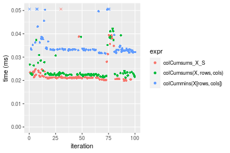

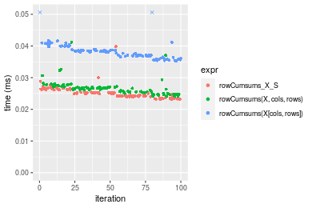
_Table: Benchmarking of colCumsums_X_S() and rowCumsums_X_S() on integer+1000x10 data (original and transposed).  The top panel shows times in milliseconds and the bottom panel shows relative times._


|   |expr           |    min|      lq|     mean|  median|      uq|    max|
|:--|:--------------|------:|-------:|--------:|-------:|-------:|------:|
|1  |colCumsums_X_S | 19.896| 20.9990| 22.83492| 21.1610| 21.6220| 54.841|
|2  |rowCumsums_X_S | 23.157| 24.1025| 25.05931| 24.9085| 25.3485| 39.821|


|   |expr           |      min|       lq|     mean|   median|       uq|       max|
|:--|:--------------|--------:|--------:|--------:|--------:|--------:|---------:|
|1  |colCumsums_X_S | 1.000000| 1.000000| 1.000000| 1.000000| 1.000000| 1.0000000|
|2  |rowCumsums_X_S | 1.163902| 1.147793| 1.097412| 1.177095| 1.172348| 0.7261173|

_Figure: Benchmarking of colCumsums_X_S() and rowCumsums_X_S() on integer+1000x10 data (original and transposed).  Outliers are displayed as crosses. Times are in milliseconds._


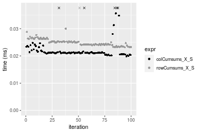

#### 10x1000 integer matrix

```r
> X <- data[["10x1000"]]
> rows <- sample.int(nrow(X), size = nrow(X) * 0.7)
> cols <- sample.int(ncol(X), size = ncol(X) * 0.7)
> X_S <- X[rows, cols]
> gc()
          used  (Mb) gc trigger  (Mb) max used  (Mb)
Ncells 5200291 277.8    8529671 455.6  8529671 455.6
Vcells 9493478  72.5   31876688 243.2 60562128 462.1
> colStats <- microbenchmark(colCumsums_X_S = colCumsums(X_S), `colCumsums(X, rows, cols)` = colCumsums(X, 
+     rows = rows, cols = cols), `colCummins(X[rows, cols])` = colCumsums(X[rows, cols]), unit = "ms")
> X <- t(X)
> X_S <- t(X_S)
> gc()
          used  (Mb) gc trigger  (Mb) max used  (Mb)
Ncells 5200267 277.8    8529671 455.6  8529671 455.6
Vcells 9498531  72.5   31876688 243.2 60562128 462.1
> rowStats <- microbenchmark(rowCumsums_X_S = rowCumsums(X_S), `rowCumsums(X, cols, rows)` = rowCumsums(X, 
+     rows = cols, cols = rows), `rowCumsums(X[cols, rows])` = rowCumsums(X[cols, rows]), unit = "ms")
```

_Table: Benchmarking of colCumsums_X_S(), colCumsums(X, rows, cols)() and colCummins(X[rows, cols])() on integer+10x1000 data. The top panel shows times in milliseconds and the bottom panel shows relative times._


|   |expr                      |      min|        lq|      mean|    median|        uq|      max|
|:--|:-------------------------|--------:|---------:|---------:|---------:|---------:|--------:|
|1  |colCumsums_X_S            | 0.020663| 0.0217285| 0.0228216| 0.0225240| 0.0227875| 0.039375|
|2  |colCumsums(X, rows, cols) | 0.022618| 0.0234350| 0.0243940| 0.0238195| 0.0246235| 0.041735|
|3  |colCummins(X[rows, cols]) | 0.032926| 0.0343930| 0.0356181| 0.0355960| 0.0360740| 0.049914|


|   |expr                      |      min|       lq|     mean|   median|       uq|      max|
|:--|:-------------------------|--------:|--------:|--------:|--------:|--------:|--------:|
|1  |colCumsums_X_S            | 1.000000| 1.000000| 1.000000| 1.000000| 1.000000| 1.000000|
|2  |colCumsums(X, rows, cols) | 1.094614| 1.078537| 1.068899| 1.057516| 1.080571| 1.059937|
|3  |colCummins(X[rows, cols]) | 1.593476| 1.582852| 1.560716| 1.580359| 1.583061| 1.267657|

_Table: Benchmarking of rowCumsums_X_S(), rowCumsums(X, cols, rows)() and rowCumsums(X[cols, rows])() on integer+10x1000 data (transposed). The top panel shows times in milliseconds and the bottom panel shows relative times._


|   |expr                      |      min|        lq|      mean|    median|        uq|      max|
|:--|:-------------------------|--------:|---------:|---------:|---------:|---------:|--------:|
|1  |rowCumsums_X_S            | 0.020002| 0.0208975| 0.0214689| 0.0210570| 0.0218395| 0.032830|
|2  |rowCumsums(X, cols, rows) | 0.020517| 0.0213845| 0.0225733| 0.0221090| 0.0227570| 0.050701|
|3  |rowCumsums(X[cols, rows]) | 0.030428| 0.0316715| 0.0327162| 0.0321275| 0.0334550| 0.051402|


|   |expr                      |      min|       lq|     mean|  median|       uq|      max|
|:--|:-------------------------|--------:|--------:|--------:|-------:|--------:|--------:|
|1  |rowCumsums_X_S            | 1.000000| 1.000000| 1.000000| 1.00000| 1.000000| 1.000000|
|2  |rowCumsums(X, cols, rows) | 1.025747| 1.023304| 1.051438| 1.04996| 1.042011| 1.544350|
|3  |rowCumsums(X[cols, rows]) | 1.521248| 1.515564| 1.523885| 1.52574| 1.531857| 1.565702|

_Figure: Benchmarking of colCumsums_X_S(), colCumsums(X, rows, cols)() and colCummins(X[rows, cols])() on integer+10x1000 data  as well as rowCumsums_X_S(), rowCumsums(X, cols, rows)() and rowCumsums(X[cols, rows])() on the same data transposed.  Outliers are displayed as crosses.  Times are in milliseconds._


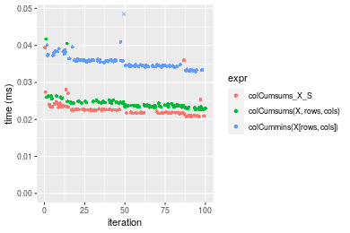

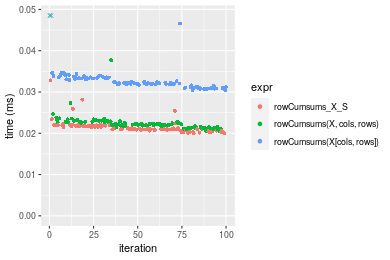
_Table: Benchmarking of colCumsums_X_S() and rowCumsums_X_S() on integer+10x1000 data (original and transposed).  The top panel shows times in milliseconds and the bottom panel shows relative times._


|   |expr           |    min|      lq|     mean| median|      uq|    max|
|:--|:--------------|------:|-------:|--------:|------:|-------:|------:|
|2  |rowCumsums_X_S | 20.002| 20.8975| 21.46894| 21.057| 21.8395| 32.830|
|1  |colCumsums_X_S | 20.663| 21.7285| 22.82161| 22.524| 22.7875| 39.375|


|   |expr           |      min|       lq|     mean|   median|       uq|     max|
|:--|:--------------|--------:|--------:|--------:|--------:|--------:|-------:|
|2  |rowCumsums_X_S | 1.000000| 1.000000| 1.000000| 1.000000| 1.000000| 1.00000|
|1  |colCumsums_X_S | 1.033047| 1.039765| 1.063006| 1.069668| 1.043408| 1.19936|

_Figure: Benchmarking of colCumsums_X_S() and rowCumsums_X_S() on integer+10x1000 data (original and transposed).  Outliers are displayed as crosses. Times are in milliseconds._


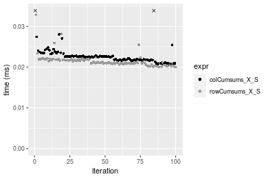

#### 100x1000 integer matrix

```r
> X <- data[["100x1000"]]
> rows <- sample.int(nrow(X), size = nrow(X) * 0.7)
> cols <- sample.int(ncol(X), size = ncol(X) * 0.7)
> X_S <- X[rows, cols]
> gc()
          used  (Mb) gc trigger  (Mb) max used  (Mb)
Ncells 5200502 277.8    8529671 455.6  8529671 455.6
Vcells 9516151  72.7   31876688 243.2 60562128 462.1
> colStats <- microbenchmark(colCumsums_X_S = colCumsums(X_S), `colCumsums(X, rows, cols)` = colCumsums(X, 
+     rows = rows, cols = cols), `colCummins(X[rows, cols])` = colCumsums(X[rows, cols]), unit = "ms")
> X <- t(X)
> X_S <- t(X_S)
> gc()
          used  (Mb) gc trigger  (Mb) max used  (Mb)
Ncells 5200478 277.8    8529671 455.6  8529671 455.6
Vcells 9566204  73.0   31876688 243.2 60562128 462.1
> rowStats <- microbenchmark(rowCumsums_X_S = rowCumsums(X_S), `rowCumsums(X, cols, rows)` = rowCumsums(X, 
+     rows = cols, cols = rows), `rowCumsums(X[cols, rows])` = rowCumsums(X[cols, rows]), unit = "ms")
```

_Table: Benchmarking of colCumsums_X_S(), colCumsums(X, rows, cols)() and colCummins(X[rows, cols])() on integer+100x1000 data. The top panel shows times in milliseconds and the bottom panel shows relative times._


|   |expr                      |      min|        lq|      mean|    median|        uq|      max|
|:--|:-------------------------|--------:|---------:|---------:|---------:|---------:|--------:|
|2  |colCumsums(X, rows, cols) | 0.114622| 0.1243840| 0.1399265| 0.1357755| 0.1505505| 0.250230|
|1  |colCumsums_X_S            | 0.120870| 0.1311700| 0.1469682| 0.1432735| 0.1580940| 0.206596|
|3  |colCummins(X[rows, cols]) | 0.187301| 0.2031185| 0.2304772| 0.2286825| 0.2467070| 0.307835|


|   |expr                      |      min|       lq|     mean|   median|       uq|       max|
|:--|:-------------------------|--------:|--------:|--------:|--------:|--------:|---------:|
|2  |colCumsums(X, rows, cols) | 1.000000| 1.000000| 1.000000| 1.000000| 1.000000| 1.0000000|
|1  |colCumsums_X_S            | 1.054510| 1.054557| 1.050324| 1.055224| 1.050106| 0.8256244|
|3  |colCummins(X[rows, cols]) | 1.634076| 1.632995| 1.647131| 1.684269| 1.638699| 1.2302082|

_Table: Benchmarking of rowCumsums_X_S(), rowCumsums(X, cols, rows)() and rowCumsums(X[cols, rows])() on integer+100x1000 data (transposed). The top panel shows times in milliseconds and the bottom panel shows relative times._


|   |expr                      |      min|        lq|      mean|    median|       uq|      max|
|:--|:-------------------------|--------:|---------:|---------:|---------:|--------:|--------:|
|2  |rowCumsums(X, cols, rows) | 0.121574| 0.1286955| 0.1447632| 0.1363945| 0.156258| 0.255207|
|1  |rowCumsums_X_S            | 0.128468| 0.1398965| 0.1607373| 0.1581045| 0.173563| 0.230483|
|3  |rowCumsums(X[cols, rows]) | 0.191760| 0.2062265| 0.2350259| 0.2276565| 0.257936| 0.329617|


|   |expr                      |      min|       lq|     mean|   median|       uq|       max|
|:--|:-------------------------|--------:|--------:|--------:|--------:|--------:|---------:|
|2  |rowCumsums(X, cols, rows) | 1.000000| 1.000000| 1.000000| 1.000000| 1.000000| 1.0000000|
|1  |rowCumsums_X_S            | 1.056706| 1.087035| 1.110347| 1.159171| 1.110746| 0.9031218|
|3  |rowCumsums(X[cols, rows]) | 1.577311| 1.602437| 1.623520| 1.669103| 1.650706| 1.2915672|

_Figure: Benchmarking of colCumsums_X_S(), colCumsums(X, rows, cols)() and colCummins(X[rows, cols])() on integer+100x1000 data  as well as rowCumsums_X_S(), rowCumsums(X, cols, rows)() and rowCumsums(X[cols, rows])() on the same data transposed.  Outliers are displayed as crosses.  Times are in milliseconds._


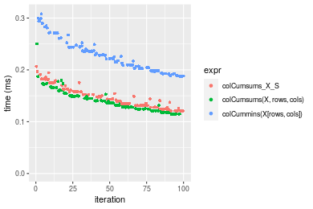

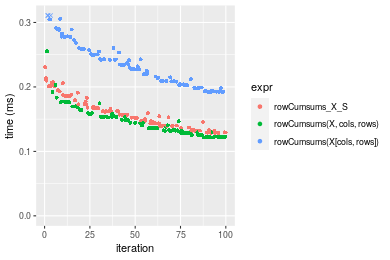
_Table: Benchmarking of colCumsums_X_S() and rowCumsums_X_S() on integer+100x1000 data (original and transposed).  The top panel shows times in milliseconds and the bottom panel shows relative times._


|   |expr           |     min|       lq|     mean|   median|      uq|     max|
|:--|:--------------|-------:|--------:|--------:|--------:|-------:|-------:|
|1  |colCumsums_X_S | 120.870| 131.1700| 146.9682| 143.2735| 158.094| 206.596|
|2  |rowCumsums_X_S | 128.468| 139.8965| 160.7373| 158.1045| 173.563| 230.483|


|   |expr           |      min|       lq|     mean|   median|       uq|      max|
|:--|:--------------|--------:|--------:|--------:|--------:|--------:|--------:|
|1  |colCumsums_X_S | 1.000000| 1.000000| 1.000000| 1.000000| 1.000000| 1.000000|
|2  |rowCumsums_X_S | 1.062861| 1.066528| 1.093688| 1.103515| 1.097847| 1.115622|

_Figure: Benchmarking of colCumsums_X_S() and rowCumsums_X_S() on integer+100x1000 data (original and transposed).  Outliers are displayed as crosses. Times are in milliseconds._


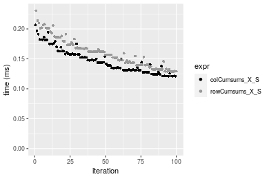

#### 1000x100 integer matrix

```r
> X <- data[["1000x100"]]
> rows <- sample.int(nrow(X), size = nrow(X) * 0.7)
> cols <- sample.int(ncol(X), size = ncol(X) * 0.7)
> X_S <- X[rows, cols]
> gc()
          used  (Mb) gc trigger  (Mb) max used  (Mb)
Ncells 5200712 277.8    8529671 455.6  8529671 455.6
Vcells 9516926  72.7   31876688 243.2 60562128 462.1
> colStats <- microbenchmark(colCumsums_X_S = colCumsums(X_S), `colCumsums(X, rows, cols)` = colCumsums(X, 
+     rows = rows, cols = cols), `colCummins(X[rows, cols])` = colCumsums(X[rows, cols]), unit = "ms")
> X <- t(X)
> X_S <- t(X_S)
> gc()
          used  (Mb) gc trigger  (Mb) max used  (Mb)
Ncells 5200688 277.8    8529671 455.6  8529671 455.6
Vcells 9566979  73.0   31876688 243.2 60562128 462.1
> rowStats <- microbenchmark(rowCumsums_X_S = rowCumsums(X_S), `rowCumsums(X, cols, rows)` = rowCumsums(X, 
+     rows = cols, cols = rows), `rowCumsums(X[cols, rows])` = rowCumsums(X[cols, rows]), unit = "ms")
```

_Table: Benchmarking of colCumsums_X_S(), colCumsums(X, rows, cols)() and colCummins(X[rows, cols])() on integer+1000x100 data. The top panel shows times in milliseconds and the bottom panel shows relative times._


|   |expr                      |      min|        lq|      mean|    median|        uq|      max|
|:--|:-------------------------|--------:|---------:|---------:|---------:|---------:|--------:|
|2  |colCumsums(X, rows, cols) | 0.111316| 0.1173475| 0.1331221| 0.1320605| 0.1413450| 0.180476|
|1  |colCumsums_X_S            | 0.116174| 0.1224300| 0.1359007| 0.1333120| 0.1468025| 0.187023|
|3  |colCummins(X[rows, cols]) | 0.179700| 0.1878335| 0.2151261| 0.2136050| 0.2347925| 0.316732|


|   |expr                      |      min|       lq|     mean|   median|       uq|      max|
|:--|:-------------------------|--------:|--------:|--------:|--------:|--------:|--------:|
|2  |colCumsums(X, rows, cols) | 1.000000| 1.000000| 1.000000| 1.000000| 1.000000| 1.000000|
|1  |colCumsums_X_S            | 1.043642| 1.043311| 1.020873| 1.009477| 1.038611| 1.036276|
|3  |colCummins(X[rows, cols]) | 1.614323| 1.600660| 1.616005| 1.617478| 1.661131| 1.754981|

_Table: Benchmarking of rowCumsums_X_S(), rowCumsums(X, cols, rows)() and rowCumsums(X[cols, rows])() on integer+1000x100 data (transposed). The top panel shows times in milliseconds and the bottom panel shows relative times._


|   |expr                      |      min|        lq|      mean|    median|        uq|      max|
|:--|:-------------------------|--------:|---------:|---------:|---------:|---------:|--------:|
|2  |rowCumsums(X, cols, rows) | 0.125494| 0.1360550| 0.1535297| 0.1488635| 0.1639980| 0.268564|
|1  |rowCumsums_X_S            | 0.134486| 0.1415375| 0.1619960| 0.1592740| 0.1754235| 0.222288|
|3  |rowCumsums(X[cols, rows]) | 0.201314| 0.2130210| 0.2425892| 0.2380050| 0.2651395| 0.324543|


|   |expr                      |      min|       lq|     mean|   median|       uq|      max|
|:--|:-------------------------|--------:|--------:|--------:|--------:|--------:|--------:|
|2  |rowCumsums(X, cols, rows) | 1.000000| 1.000000| 1.000000| 1.000000| 1.000000| 1.000000|
|1  |rowCumsums_X_S            | 1.071653| 1.040296| 1.055144| 1.069933| 1.069668| 0.827691|
|3  |rowCumsums(X[cols, rows]) | 1.604172| 1.565698| 1.580080| 1.598814| 1.616724| 1.208438|

_Figure: Benchmarking of colCumsums_X_S(), colCumsums(X, rows, cols)() and colCummins(X[rows, cols])() on integer+1000x100 data  as well as rowCumsums_X_S(), rowCumsums(X, cols, rows)() and rowCumsums(X[cols, rows])() on the same data transposed.  Outliers are displayed as crosses.  Times are in milliseconds._


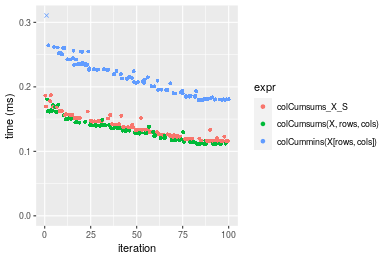

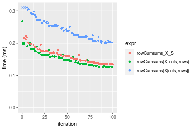
_Table: Benchmarking of colCumsums_X_S() and rowCumsums_X_S() on integer+1000x100 data (original and transposed).  The top panel shows times in milliseconds and the bottom panel shows relative times._


|   |expr           |     min|       lq|     mean|  median|       uq|     max|
|:--|:--------------|-------:|--------:|--------:|-------:|--------:|-------:|
|1  |colCumsums_X_S | 116.174| 122.4300| 135.9007| 133.312| 146.8025| 187.023|
|2  |rowCumsums_X_S | 134.486| 141.5375| 161.9960| 159.274| 175.4235| 222.288|


|   |expr           |      min|       lq|     mean|   median|       uq|     max|
|:--|:--------------|--------:|--------:|--------:|--------:|--------:|-------:|
|1  |colCumsums_X_S | 1.000000| 1.000000| 1.000000| 1.000000| 1.000000| 1.00000|
|2  |rowCumsums_X_S | 1.157626| 1.156069| 1.192017| 1.194746| 1.194963| 1.18856|

_Figure: Benchmarking of colCumsums_X_S() and rowCumsums_X_S() on integer+1000x100 data (original and transposed).  Outliers are displayed as crosses. Times are in milliseconds._


## Data type "double"

### Data
```r
> rmatrix <- function(nrow, ncol, mode = c("logical", "double", "integer", "index"), range = c(-100, 
+     +100), na_prob = 0) {
+     mode <- match.arg(mode)
+     n <- nrow * ncol
+     if (mode == "logical") {
+         x <- sample(c(FALSE, TRUE), size = n, replace = TRUE)
+     }     else if (mode == "index") {
+         x <- seq_len(n)
+         mode <- "integer"
+     }     else {
+         x <- runif(n, min = range[1], max = range[2])
+     }
+     storage.mode(x) <- mode
+     if (na_prob > 0) 
+         x[sample(n, size = na_prob * n)] <- NA
+     dim(x) <- c(nrow, ncol)
+     x
+ }
> rmatrices <- function(scale = 10, seed = 1, ...) {
+     set.seed(seed)
+     data <- list()
+     data[[1]] <- rmatrix(nrow = scale * 1, ncol = scale * 1, ...)
+     data[[2]] <- rmatrix(nrow = scale * 10, ncol = scale * 10, ...)
+     data[[3]] <- rmatrix(nrow = scale * 100, ncol = scale * 1, ...)
+     data[[4]] <- t(data[[3]])
+     data[[5]] <- rmatrix(nrow = scale * 10, ncol = scale * 100, ...)
+     data[[6]] <- t(data[[5]])
+     names(data) <- sapply(data, FUN = function(x) paste(dim(x), collapse = "x"))
+     data
+ }
> data <- rmatrices(mode = mode)
```

### Results

#### 10x10 double matrix

```r
> X <- data[["10x10"]]
> rows <- sample.int(nrow(X), size = nrow(X) * 0.7)
> cols <- sample.int(ncol(X), size = ncol(X) * 0.7)
> X_S <- X[rows, cols]
> gc()
          used  (Mb) gc trigger  (Mb) max used  (Mb)
Ncells 5200930 277.8    8529671 455.6  8529671 455.6
Vcells 9608033  73.4   31876688 243.2 60562128 462.1
> colStats <- microbenchmark(colCumsums_X_S = colCumsums(X_S), `colCumsums(X, rows, cols)` = colCumsums(X, 
+     rows = rows, cols = cols), `colCummins(X[rows, cols])` = colCumsums(X[rows, cols]), unit = "ms")
> X <- t(X)
> X_S <- t(X_S)
> gc()
          used  (Mb) gc trigger  (Mb) max used  (Mb)
Ncells 5200897 277.8    8529671 455.6  8529671 455.6
Vcells 9608171  73.4   31876688 243.2 60562128 462.1
> rowStats <- microbenchmark(rowCumsums_X_S = rowCumsums(X_S), `rowCumsums(X, cols, rows)` = rowCumsums(X, 
+     rows = cols, cols = rows), `rowCumsums(X[cols, rows])` = rowCumsums(X[cols, rows]), unit = "ms")
```

_Table: Benchmarking of colCumsums_X_S(), colCumsums(X, rows, cols)() and colCummins(X[rows, cols])() on double+10x10 data. The top panel shows times in milliseconds and the bottom panel shows relative times._


|   |expr                      |      min|       lq|      mean|    median|        uq|      max|
|:--|:-------------------------|--------:|--------:|---------:|---------:|---------:|--------:|
|1  |colCumsums_X_S            | 0.001788| 0.001956| 0.0022014| 0.0020330| 0.0021255| 0.016534|
|2  |colCumsums(X, rows, cols) | 0.002103| 0.002274| 0.0023992| 0.0023325| 0.0024335| 0.004869|
|3  |colCummins(X[rows, cols]) | 0.002886| 0.003062| 0.0032185| 0.0031600| 0.0032640| 0.008024|


|   |expr                      |      min|       lq|     mean|   median|       uq|       max|
|:--|:-------------------------|--------:|--------:|--------:|--------:|--------:|---------:|
|1  |colCumsums_X_S            | 1.000000| 1.000000| 1.000000| 1.000000| 1.000000| 1.0000000|
|2  |colCumsums(X, rows, cols) | 1.176174| 1.162577| 1.089866| 1.147319| 1.144907| 0.2944841|
|3  |colCummins(X[rows, cols]) | 1.614094| 1.565440| 1.462026| 1.554353| 1.535639| 0.4853030|

_Table: Benchmarking of rowCumsums_X_S(), rowCumsums(X, cols, rows)() and rowCumsums(X[cols, rows])() on double+10x10 data (transposed). The top panel shows times in milliseconds and the bottom panel shows relative times._


|   |expr                      |      min|        lq|      mean|   median|        uq|      max|
|:--|:-------------------------|--------:|---------:|---------:|--------:|---------:|--------:|
|1  |rowCumsums_X_S            | 0.001740| 0.0018990| 0.0020286| 0.001971| 0.0020695| 0.003978|
|2  |rowCumsums(X, cols, rows) | 0.002095| 0.0022325| 0.0025121| 0.002294| 0.0024070| 0.019733|
|3  |rowCumsums(X[cols, rows]) | 0.002707| 0.0029685| 0.0031006| 0.003056| 0.0031865| 0.005149|


|   |expr                      |      min|       lq|     mean|   median|       uq|      max|
|:--|:-------------------------|--------:|--------:|--------:|--------:|--------:|--------:|
|1  |rowCumsums_X_S            | 1.000000| 1.000000| 1.000000| 1.000000| 1.000000| 1.000000|
|2  |rowCumsums(X, cols, rows) | 1.204023| 1.175619| 1.238361| 1.163876| 1.163083| 4.960533|
|3  |rowCumsums(X[cols, rows]) | 1.555747| 1.563191| 1.528419| 1.550482| 1.539744| 1.294369|

_Figure: Benchmarking of colCumsums_X_S(), colCumsums(X, rows, cols)() and colCummins(X[rows, cols])() on double+10x10 data  as well as rowCumsums_X_S(), rowCumsums(X, cols, rows)() and rowCumsums(X[cols, rows])() on the same data transposed.  Outliers are displayed as crosses.  Times are in milliseconds._


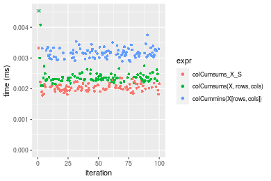

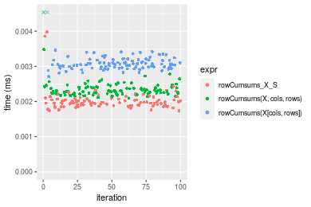
_Table: Benchmarking of colCumsums_X_S() and rowCumsums_X_S() on double+10x10 data (original and transposed).  The top panel shows times in milliseconds and the bottom panel shows relative times._


|   |expr           |   min|    lq|    mean| median|     uq|    max|
|:--|:--------------|-----:|-----:|-------:|------:|------:|------:|
|2  |rowCumsums_X_S | 1.740| 1.899| 2.02860|  1.971| 2.0695|  3.978|
|1  |colCumsums_X_S | 1.788| 1.956| 2.20139|  2.033| 2.1255| 16.534|


|   |expr           |      min|       lq|     mean|   median|      uq|     max|
|:--|:--------------|--------:|--------:|--------:|--------:|-------:|-------:|
|2  |rowCumsums_X_S | 1.000000| 1.000000| 1.000000| 1.000000| 1.00000| 1.00000|
|1  |colCumsums_X_S | 1.027586| 1.030016| 1.085177| 1.031456| 1.02706| 4.15636|

_Figure: Benchmarking of colCumsums_X_S() and rowCumsums_X_S() on double+10x10 data (original and transposed).  Outliers are displayed as crosses. Times are in milliseconds._


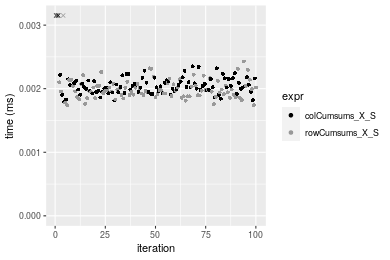

#### 100x100 double matrix

```r
> X <- data[["100x100"]]
> rows <- sample.int(nrow(X), size = nrow(X) * 0.7)
> cols <- sample.int(ncol(X), size = ncol(X) * 0.7)
> X_S <- X[rows, cols]
> gc()
          used  (Mb) gc trigger  (Mb) max used  (Mb)
Ncells 5201129 277.8    8529671 455.6  8529671 455.6
Vcells 9613984  73.4   31876688 243.2 60562128 462.1
> colStats <- microbenchmark(colCumsums_X_S = colCumsums(X_S), `colCumsums(X, rows, cols)` = colCumsums(X, 
+     rows = rows, cols = cols), `colCummins(X[rows, cols])` = colCumsums(X[rows, cols]), unit = "ms")
> X <- t(X)
> X_S <- t(X_S)
> gc()
          used  (Mb) gc trigger  (Mb) max used  (Mb)
Ncells 5201105 277.8    8529671 455.6  8529671 455.6
Vcells 9624037  73.5   31876688 243.2 60562128 462.1
> rowStats <- microbenchmark(rowCumsums_X_S = rowCumsums(X_S), `rowCumsums(X, cols, rows)` = rowCumsums(X, 
+     rows = cols, cols = rows), `rowCumsums(X[cols, rows])` = rowCumsums(X[cols, rows]), unit = "ms")
```

_Table: Benchmarking of colCumsums_X_S(), colCumsums(X, rows, cols)() and colCummins(X[rows, cols])() on double+100x100 data. The top panel shows times in milliseconds and the bottom panel shows relative times._


|   |expr                      |      min|        lq|      mean|    median|        uq|      max|
|:--|:-------------------------|--------:|---------:|---------:|---------:|---------:|--------:|
|2  |colCumsums(X, rows, cols) | 0.012510| 0.0131305| 0.0137650| 0.0136055| 0.0139070| 0.022369|
|1  |colCumsums_X_S            | 0.014541| 0.0151970| 0.0155555| 0.0154435| 0.0156120| 0.029622|
|3  |colCummins(X[rows, cols]) | 0.029763| 0.0305910| 0.0314978| 0.0312000| 0.0313975| 0.057288|


|   |expr                      |      min|       lq|     mean|   median|       uq|      max|
|:--|:-------------------------|--------:|--------:|--------:|--------:|--------:|--------:|
|2  |colCumsums(X, rows, cols) | 1.000000| 1.000000| 1.000000| 1.000000| 1.000000| 1.000000|
|1  |colCumsums_X_S            | 1.162350| 1.157382| 1.130081| 1.135092| 1.122600| 1.324243|
|3  |colCummins(X[rows, cols]) | 2.379137| 2.329767| 2.288257| 2.293190| 2.257676| 2.561044|

_Table: Benchmarking of rowCumsums_X_S(), rowCumsums(X, cols, rows)() and rowCumsums(X[cols, rows])() on double+100x100 data (transposed). The top panel shows times in milliseconds and the bottom panel shows relative times._


|   |expr                      |      min|        lq|      mean|    median|        uq|      max|
|:--|:-------------------------|--------:|---------:|---------:|---------:|---------:|--------:|
|1  |rowCumsums_X_S            | 0.015987| 0.0165495| 0.0170890| 0.0171005| 0.0173515| 0.021495|
|2  |rowCumsums(X, cols, rows) | 0.016578| 0.0171580| 0.0184190| 0.0176000| 0.0180890| 0.042720|
|3  |rowCumsums(X[cols, rows]) | 0.031220| 0.0318270| 0.0328658| 0.0328910| 0.0331765| 0.047805|


|   |expr                      |      min|       lq|     mean|   median|       uq|      max|
|:--|:-------------------------|--------:|--------:|--------:|--------:|--------:|--------:|
|1  |rowCumsums_X_S            | 1.000000| 1.000000| 1.000000| 1.000000| 1.000000| 1.000000|
|2  |rowCumsums(X, cols, rows) | 1.036968| 1.036768| 1.077824| 1.029210| 1.042504| 1.987439|
|3  |rowCumsums(X[cols, rows]) | 1.952837| 1.923140| 1.923210| 1.923394| 1.912025| 2.224006|

_Figure: Benchmarking of colCumsums_X_S(), colCumsums(X, rows, cols)() and colCummins(X[rows, cols])() on double+100x100 data  as well as rowCumsums_X_S(), rowCumsums(X, cols, rows)() and rowCumsums(X[cols, rows])() on the same data transposed.  Outliers are displayed as crosses.  Times are in milliseconds._


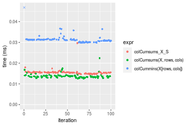

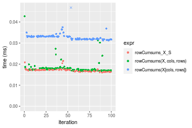
_Table: Benchmarking of colCumsums_X_S() and rowCumsums_X_S() on double+100x100 data (original and transposed).  The top panel shows times in milliseconds and the bottom panel shows relative times._


|   |expr           |    min|      lq|     mean|  median|      uq|    max|
|:--|:--------------|------:|-------:|--------:|-------:|-------:|------:|
|1  |colCumsums_X_S | 14.541| 15.1970| 15.55554| 15.4435| 15.6120| 29.622|
|2  |rowCumsums_X_S | 15.987| 16.5495| 17.08904| 17.1005| 17.3515| 21.495|


|   |expr           |      min|       lq|     mean|   median|       uq|       max|
|:--|:--------------|--------:|--------:|--------:|--------:|--------:|---------:|
|1  |colCumsums_X_S | 1.000000| 1.000000| 1.000000| 1.000000| 1.000000| 1.0000000|
|2  |rowCumsums_X_S | 1.099443| 1.088998| 1.098582| 1.107294| 1.111421| 0.7256431|

_Figure: Benchmarking of colCumsums_X_S() and rowCumsums_X_S() on double+100x100 data (original and transposed).  Outliers are displayed as crosses. Times are in milliseconds._


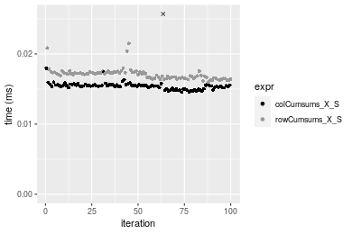

#### 1000x10 double matrix

```r
> X <- data[["1000x10"]]
> rows <- sample.int(nrow(X), size = nrow(X) * 0.7)
> cols <- sample.int(ncol(X), size = ncol(X) * 0.7)
> X_S <- X[rows, cols]
> gc()
          used  (Mb) gc trigger  (Mb) max used  (Mb)
Ncells 5201328 277.8    8529671 455.6  8529671 455.6
Vcells 9615384  73.4   31876688 243.2 60562128 462.1
> colStats <- microbenchmark(colCumsums_X_S = colCumsums(X_S), `colCumsums(X, rows, cols)` = colCumsums(X, 
+     rows = rows, cols = cols), `colCummins(X[rows, cols])` = colCumsums(X[rows, cols]), unit = "ms")
> X <- t(X)
> X_S <- t(X_S)
> gc()
          used  (Mb) gc trigger  (Mb) max used  (Mb)
Ncells 5201304 277.8    8529671 455.6  8529671 455.6
Vcells 9625437  73.5   31876688 243.2 60562128 462.1
> rowStats <- microbenchmark(rowCumsums_X_S = rowCumsums(X_S), `rowCumsums(X, cols, rows)` = rowCumsums(X, 
+     rows = cols, cols = rows), `rowCumsums(X[cols, rows])` = rowCumsums(X[cols, rows]), unit = "ms")
```

_Table: Benchmarking of colCumsums_X_S(), colCumsums(X, rows, cols)() and colCummins(X[rows, cols])() on double+1000x10 data. The top panel shows times in milliseconds and the bottom panel shows relative times._


|   |expr                      |      min|        lq|      mean|    median|       uq|      max|
|:--|:-------------------------|--------:|---------:|---------:|---------:|--------:|--------:|
|1  |colCumsums_X_S            | 0.013636| 0.0142150| 0.0146778| 0.0143670| 0.014572| 0.028476|
|2  |colCumsums(X, rows, cols) | 0.013671| 0.0145220| 0.0149880| 0.0148885| 0.015318| 0.019313|
|3  |colCummins(X[rows, cols]) | 0.029080| 0.0298125| 0.0310441| 0.0306755| 0.030983| 0.057977|


|   |expr                      |      min|       lq|     mean|   median|       uq|       max|
|:--|:-------------------------|--------:|--------:|--------:|--------:|--------:|---------:|
|1  |colCumsums_X_S            | 1.000000| 1.000000| 1.000000| 1.000000| 1.000000| 1.0000000|
|2  |colCumsums(X, rows, cols) | 1.002567| 1.021597| 1.021137| 1.036299| 1.051194| 0.6782203|
|3  |colCummins(X[rows, cols]) | 2.132590| 2.097256| 2.115042| 2.135136| 2.126201| 2.0359952|

_Table: Benchmarking of rowCumsums_X_S(), rowCumsums(X, cols, rows)() and rowCumsums(X[cols, rows])() on double+1000x10 data (transposed). The top panel shows times in milliseconds and the bottom panel shows relative times._


|   |expr                      |      min|        lq|      mean|    median|        uq|      max|
|:--|:-------------------------|--------:|---------:|---------:|---------:|---------:|--------:|
|1  |rowCumsums_X_S            | 0.017414| 0.0179620| 0.0186248| 0.0181975| 0.0188450| 0.030882|
|2  |rowCumsums(X, cols, rows) | 0.020751| 0.0215475| 0.0224733| 0.0221870| 0.0225515| 0.035438|
|3  |rowCumsums(X[cols, rows]) | 0.035460| 0.0363805| 0.0379843| 0.0367905| 0.0380045| 0.070058|


|   |expr                      |      min|       lq|     mean|   median|       uq|      max|
|:--|:-------------------------|--------:|--------:|--------:|--------:|--------:|--------:|
|1  |rowCumsums_X_S            | 1.000000| 1.000000| 1.000000| 1.000000| 1.000000| 1.000000|
|2  |rowCumsums(X, cols, rows) | 1.191627| 1.199616| 1.206636| 1.219233| 1.196684| 1.147529|
|3  |rowCumsums(X[cols, rows]) | 2.036293| 2.025415| 2.039450| 2.021734| 2.016689| 2.268571|

_Figure: Benchmarking of colCumsums_X_S(), colCumsums(X, rows, cols)() and colCummins(X[rows, cols])() on double+1000x10 data  as well as rowCumsums_X_S(), rowCumsums(X, cols, rows)() and rowCumsums(X[cols, rows])() on the same data transposed.  Outliers are displayed as crosses.  Times are in milliseconds._


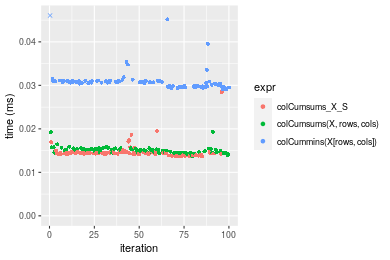

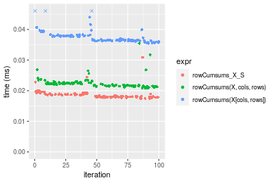
_Table: Benchmarking of colCumsums_X_S() and rowCumsums_X_S() on double+1000x10 data (original and transposed).  The top panel shows times in milliseconds and the bottom panel shows relative times._


|   |expr           |    min|     lq|     mean|  median|     uq|    max|
|:--|:--------------|------:|------:|--------:|-------:|------:|------:|
|1  |colCumsums_X_S | 13.636| 14.215| 14.67779| 14.3670| 14.572| 28.476|
|2  |rowCumsums_X_S | 17.414| 17.962| 18.62477| 18.1975| 18.845| 30.882|


|   |expr           |      min|       lq|     mean|   median|       uq|      max|
|:--|:--------------|--------:|--------:|--------:|--------:|--------:|--------:|
|1  |colCumsums_X_S | 1.000000| 1.000000| 1.000000| 1.000000| 1.000000| 1.000000|
|2  |rowCumsums_X_S | 1.277061| 1.263595| 1.268908| 1.266618| 1.293234| 1.084492|

_Figure: Benchmarking of colCumsums_X_S() and rowCumsums_X_S() on double+1000x10 data (original and transposed).  Outliers are displayed as crosses. Times are in milliseconds._


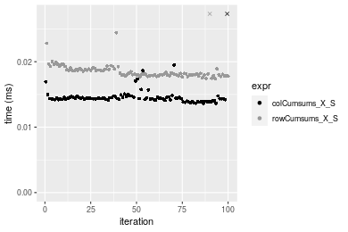

#### 10x1000 double matrix

```r
> X <- data[["10x1000"]]
> rows <- sample.int(nrow(X), size = nrow(X) * 0.7)
> cols <- sample.int(ncol(X), size = ncol(X) * 0.7)
> X_S <- X[rows, cols]
> gc()
          used  (Mb) gc trigger  (Mb) max used  (Mb)
Ncells 5201533 277.8    8529671 455.6  8529671 455.6
Vcells 9615520  73.4   31876688 243.2 60562128 462.1
> colStats <- microbenchmark(colCumsums_X_S = colCumsums(X_S), `colCumsums(X, rows, cols)` = colCumsums(X, 
+     rows = rows, cols = cols), `colCummins(X[rows, cols])` = colCumsums(X[rows, cols]), unit = "ms")
> X <- t(X)
> X_S <- t(X_S)
> gc()
          used  (Mb) gc trigger  (Mb) max used  (Mb)
Ncells 5201509 277.8    8529671 455.6  8529671 455.6
Vcells 9625573  73.5   31876688 243.2 60562128 462.1
> rowStats <- microbenchmark(rowCumsums_X_S = rowCumsums(X_S), `rowCumsums(X, cols, rows)` = rowCumsums(X, 
+     rows = cols, cols = rows), `rowCumsums(X[cols, rows])` = rowCumsums(X[cols, rows]), unit = "ms")
```

_Table: Benchmarking of colCumsums_X_S(), colCumsums(X, rows, cols)() and colCummins(X[rows, cols])() on double+10x1000 data. The top panel shows times in milliseconds and the bottom panel shows relative times._


|   |expr                      |      min|        lq|      mean|    median|        uq|      max|
|:--|:-------------------------|--------:|---------:|---------:|---------:|---------:|--------:|
|1  |colCumsums_X_S            | 0.015375| 0.0160580| 0.0165749| 0.0164700| 0.0168435| 0.031113|
|2  |colCumsums(X, rows, cols) | 0.015413| 0.0163180| 0.0173903| 0.0167470| 0.0175030| 0.036887|
|3  |colCummins(X[rows, cols]) | 0.033465| 0.0343655| 0.0354200| 0.0350205| 0.0359240| 0.049779|


|   |expr                      |      min|       lq|     mean|   median|       uq|      max|
|:--|:-------------------------|--------:|--------:|--------:|--------:|--------:|--------:|
|1  |colCumsums_X_S            | 1.000000| 1.000000| 1.000000| 1.000000| 1.000000| 1.000000|
|2  |colCumsums(X, rows, cols) | 1.002471| 1.016191| 1.049194| 1.016819| 1.039155| 1.185582|
|3  |colCummins(X[rows, cols]) | 2.176585| 2.140086| 2.136965| 2.126321| 2.132811| 1.599942|

_Table: Benchmarking of rowCumsums_X_S(), rowCumsums(X, cols, rows)() and rowCumsums(X[cols, rows])() on double+10x1000 data (transposed). The top panel shows times in milliseconds and the bottom panel shows relative times._


|   |expr                      |      min|       lq|      mean|    median|        uq|      max|
|:--|:-------------------------|--------:|--------:|---------:|---------:|---------:|--------:|
|1  |rowCumsums_X_S            | 0.014709| 0.015229| 0.0157979| 0.0155925| 0.0158990| 0.029984|
|2  |rowCumsums(X, cols, rows) | 0.017294| 0.017991| 0.0189216| 0.0185060| 0.0189190| 0.044872|
|3  |rowCumsums(X[cols, rows]) | 0.030251| 0.031014| 0.0322598| 0.0320335| 0.0323365| 0.048089|


|   |expr                      |      min|       lq|     mean|   median|       uq|      max|
|:--|:-------------------------|--------:|--------:|--------:|--------:|--------:|--------:|
|1  |rowCumsums_X_S            | 1.000000| 1.000000| 1.000000| 1.000000| 1.000000| 1.000000|
|2  |rowCumsums(X, cols, rows) | 1.175743| 1.181364| 1.197728| 1.186853| 1.189949| 1.496531|
|3  |rowCumsums(X[cols, rows]) | 2.056632| 2.036509| 2.042023| 2.054417| 2.033870| 1.603822|

_Figure: Benchmarking of colCumsums_X_S(), colCumsums(X, rows, cols)() and colCummins(X[rows, cols])() on double+10x1000 data  as well as rowCumsums_X_S(), rowCumsums(X, cols, rows)() and rowCumsums(X[cols, rows])() on the same data transposed.  Outliers are displayed as crosses.  Times are in milliseconds._


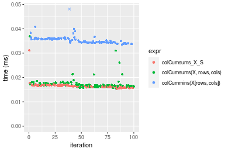

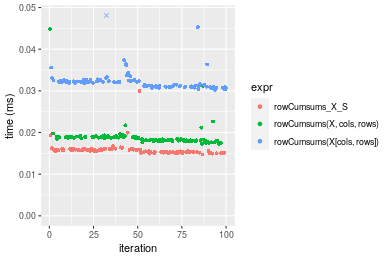
_Table: Benchmarking of colCumsums_X_S() and rowCumsums_X_S() on double+10x1000 data (original and transposed).  The top panel shows times in milliseconds and the bottom panel shows relative times._


|   |expr           |    min|     lq|     mean|  median|      uq|    max|
|:--|:--------------|------:|------:|--------:|-------:|-------:|------:|
|2  |rowCumsums_X_S | 14.709| 15.229| 15.79794| 15.5925| 15.8990| 29.984|
|1  |colCumsums_X_S | 15.375| 16.058| 16.57490| 16.4700| 16.8435| 31.113|


|   |expr           |      min|       lq|     mean|   median|       uq|      max|
|:--|:--------------|--------:|--------:|--------:|--------:|--------:|--------:|
|2  |rowCumsums_X_S | 1.000000| 1.000000| 1.000000| 1.000000| 1.000000| 1.000000|
|1  |colCumsums_X_S | 1.045278| 1.054436| 1.049181| 1.056277| 1.059406| 1.037653|

_Figure: Benchmarking of colCumsums_X_S() and rowCumsums_X_S() on double+10x1000 data (original and transposed).  Outliers are displayed as crosses. Times are in milliseconds._


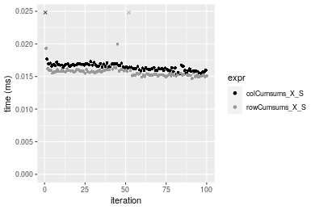

#### 100x1000 double matrix

```r
> X <- data[["100x1000"]]
> rows <- sample.int(nrow(X), size = nrow(X) * 0.7)
> cols <- sample.int(ncol(X), size = ncol(X) * 0.7)
> X_S <- X[rows, cols]
> gc()
          used  (Mb) gc trigger  (Mb) max used  (Mb)
Ncells 5201744 277.9    8529671 455.6  8529671 455.6
Vcells 9660975  73.8   31876688 243.2 60562128 462.1
> colStats <- microbenchmark(colCumsums_X_S = colCumsums(X_S), `colCumsums(X, rows, cols)` = colCumsums(X, 
+     rows = rows, cols = cols), `colCummins(X[rows, cols])` = colCumsums(X[rows, cols]), unit = "ms")
> X <- t(X)
> X_S <- t(X_S)
> gc()
          used  (Mb) gc trigger  (Mb) max used  (Mb)
Ncells 5201720 277.9    8529671 455.6  8529671 455.6
Vcells 9761028  74.5   31876688 243.2 60562128 462.1
> rowStats <- microbenchmark(rowCumsums_X_S = rowCumsums(X_S), `rowCumsums(X, cols, rows)` = rowCumsums(X, 
+     rows = cols, cols = rows), `rowCumsums(X[cols, rows])` = rowCumsums(X[cols, rows]), unit = "ms")
```

_Table: Benchmarking of colCumsums_X_S(), colCumsums(X, rows, cols)() and colCummins(X[rows, cols])() on double+100x1000 data. The top panel shows times in milliseconds and the bottom panel shows relative times._


|   |expr                      |      min|        lq|      mean|    median|        uq|      max|
|:--|:-------------------------|--------:|---------:|---------:|---------:|---------:|--------:|
|2  |colCumsums(X, rows, cols) | 0.078123| 0.0852240| 0.0948696| 0.0910215| 0.0987835| 0.222979|
|1  |colCumsums_X_S            | 0.089342| 0.0974465| 0.1065202| 0.1038410| 0.1125170| 0.157940|
|3  |colCummins(X[rows, cols]) | 0.190537| 0.2106785| 0.2312126| 0.2282060| 0.2427230| 0.421410|


|   |expr                      |      min|       lq|     mean|   median|       uq|       max|
|:--|:-------------------------|--------:|--------:|--------:|--------:|--------:|---------:|
|2  |colCumsums(X, rows, cols) | 1.000000| 1.000000| 1.000000| 1.000000| 1.000000| 1.0000000|
|1  |colCumsums_X_S            | 1.143607| 1.143416| 1.122807| 1.140840| 1.139026| 0.7083178|
|3  |colCummins(X[rows, cols]) | 2.438936| 2.472056| 2.437163| 2.507166| 2.457121| 1.8899089|

_Table: Benchmarking of rowCumsums_X_S(), rowCumsums(X, cols, rows)() and rowCumsums(X[cols, rows])() on double+100x1000 data (transposed). The top panel shows times in milliseconds and the bottom panel shows relative times._


|   |expr                      |      min|        lq|      mean|    median|        uq|      max|
|:--|:-------------------------|--------:|---------:|---------:|---------:|---------:|--------:|
|2  |rowCumsums(X, cols, rows) | 0.098962| 0.1045880| 0.1169032| 0.1111255| 0.1249150| 0.247900|
|1  |rowCumsums_X_S            | 0.094117| 0.1057070| 0.1172707| 0.1149435| 0.1248715| 0.167960|
|3  |rowCumsums(X[cols, rows]) | 0.195717| 0.2139035| 0.2352298| 0.2326945| 0.2493180| 0.345397|


|   |expr                      |       min|       lq|     mean|   median|        uq|       max|
|:--|:-------------------------|---------:|--------:|--------:|--------:|---------:|---------:|
|2  |rowCumsums(X, cols, rows) | 1.0000000| 1.000000| 1.000000| 1.000000| 1.0000000| 1.0000000|
|1  |rowCumsums_X_S            | 0.9510418| 1.010699| 1.003143| 1.034358| 0.9996518| 0.6775313|
|3  |rowCumsums(X[cols, rows]) | 1.9776985| 2.045201| 2.012176| 2.093979| 1.9959012| 1.3932916|

_Figure: Benchmarking of colCumsums_X_S(), colCumsums(X, rows, cols)() and colCummins(X[rows, cols])() on double+100x1000 data  as well as rowCumsums_X_S(), rowCumsums(X, cols, rows)() and rowCumsums(X[cols, rows])() on the same data transposed.  Outliers are displayed as crosses.  Times are in milliseconds._


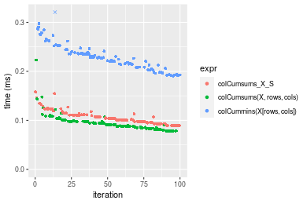

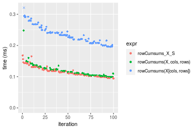
_Table: Benchmarking of colCumsums_X_S() and rowCumsums_X_S() on double+100x1000 data (original and transposed).  The top panel shows times in milliseconds and the bottom panel shows relative times._


|   |expr           |    min|       lq|     mean|   median|       uq|    max|
|:--|:--------------|------:|--------:|--------:|--------:|--------:|------:|
|1  |colCumsums_X_S | 89.342|  97.4465| 106.5202| 103.8410| 112.5170| 157.94|
|2  |rowCumsums_X_S | 94.117| 105.7070| 117.2707| 114.9435| 124.8715| 167.96|


|   |expr           |      min|      lq|     mean|   median|       uq|      max|
|:--|:--------------|--------:|-------:|--------:|--------:|--------:|--------:|
|1  |colCumsums_X_S | 1.000000| 1.00000| 1.000000| 1.000000| 1.000000| 1.000000|
|2  |rowCumsums_X_S | 1.053446| 1.08477| 1.100925| 1.106918| 1.109801| 1.063442|

_Figure: Benchmarking of colCumsums_X_S() and rowCumsums_X_S() on double+100x1000 data (original and transposed).  Outliers are displayed as crosses. Times are in milliseconds._


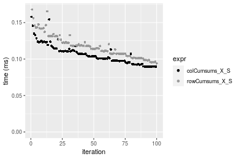

#### 1000x100 double matrix

```r
> X <- data[["1000x100"]]
> rows <- sample.int(nrow(X), size = nrow(X) * 0.7)
> cols <- sample.int(ncol(X), size = ncol(X) * 0.7)
> X_S <- X[rows, cols]
> gc()
          used  (Mb) gc trigger  (Mb) max used  (Mb)
Ncells 5201954 277.9    8529671 455.6  8529671 455.6
Vcells 9661116  73.8   31876688 243.2 60562128 462.1
> colStats <- microbenchmark(colCumsums_X_S = colCumsums(X_S), `colCumsums(X, rows, cols)` = colCumsums(X, 
+     rows = rows, cols = cols), `colCummins(X[rows, cols])` = colCumsums(X[rows, cols]), unit = "ms")
> X <- t(X)
> X_S <- t(X_S)
> gc()
          used  (Mb) gc trigger  (Mb) max used  (Mb)
Ncells 5201930 277.9    8529671 455.6  8529671 455.6
Vcells 9761169  74.5   31876688 243.2 60562128 462.1
> rowStats <- microbenchmark(rowCumsums_X_S = rowCumsums(X_S), `rowCumsums(X, cols, rows)` = rowCumsums(X, 
+     rows = cols, cols = rows), `rowCumsums(X[cols, rows])` = rowCumsums(X[cols, rows]), unit = "ms")
```

_Table: Benchmarking of colCumsums_X_S(), colCumsums(X, rows, cols)() and colCummins(X[rows, cols])() on double+1000x100 data. The top panel shows times in milliseconds and the bottom panel shows relative times._


|   |expr                      |      min|        lq|      mean|    median|        uq|      max|
|:--|:-------------------------|--------:|---------:|---------:|---------:|---------:|--------:|
|2  |colCumsums(X, rows, cols) | 0.077105| 0.0818540| 0.0912960| 0.0895540| 0.0941125| 0.188140|
|1  |colCumsums_X_S            | 0.087339| 0.0926745| 0.1017743| 0.0989260| 0.1063610| 0.147469|
|3  |colCummins(X[rows, cols]) | 0.192694| 0.2058950| 0.2269163| 0.2252045| 0.2423040| 0.384437|


|   |expr                      |      min|       lq|     mean|   median|       uq|       max|
|:--|:-------------------------|--------:|--------:|--------:|--------:|--------:|---------:|
|2  |colCumsums(X, rows, cols) | 1.000000| 1.000000| 1.000000| 1.000000| 1.000000| 1.0000000|
|1  |colCumsums_X_S            | 1.132728| 1.132193| 1.114774| 1.104652| 1.130147| 0.7838259|
|3  |colCummins(X[rows, cols]) | 2.499112| 2.515393| 2.485502| 2.514734| 2.574621| 2.0433560|

_Table: Benchmarking of rowCumsums_X_S(), rowCumsums(X, cols, rows)() and rowCumsums(X[cols, rows])() on double+1000x100 data (transposed). The top panel shows times in milliseconds and the bottom panel shows relative times._


|   |expr                      |      min|        lq|      mean|    median|        uq|      max|
|:--|:-------------------------|--------:|---------:|---------:|---------:|---------:|--------:|
|1  |rowCumsums_X_S            | 0.099372| 0.1077550| 0.1208908| 0.1183805| 0.1279110| 0.168878|
|2  |rowCumsums(X, cols, rows) | 0.097971| 0.1070255| 0.1214668| 0.1201700| 0.1275320| 0.262877|
|3  |rowCumsums(X[cols, rows]) | 0.197242| 0.2158110| 0.2400602| 0.2352330| 0.2568715| 0.322989|


|   |expr                      |       min|       lq|     mean|   median|       uq|      max|
|:--|:-------------------------|---------:|--------:|--------:|--------:|--------:|--------:|
|1  |rowCumsums_X_S            | 1.0000000| 1.000000| 1.000000| 1.000000| 1.000000| 1.000000|
|2  |rowCumsums(X, cols, rows) | 0.9859015| 0.993230| 1.004765| 1.015116| 0.997037| 1.556609|
|3  |rowCumsums(X[cols, rows]) | 1.9848851| 2.002793| 1.985761| 1.987092| 2.008205| 1.912558|

_Figure: Benchmarking of colCumsums_X_S(), colCumsums(X, rows, cols)() and colCummins(X[rows, cols])() on double+1000x100 data  as well as rowCumsums_X_S(), rowCumsums(X, cols, rows)() and rowCumsums(X[cols, rows])() on the same data transposed.  Outliers are displayed as crosses.  Times are in milliseconds._


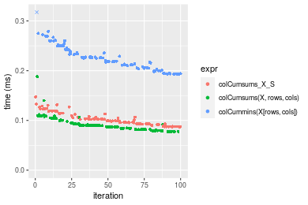

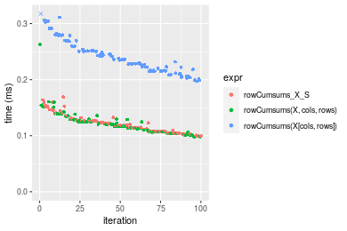
_Table: Benchmarking of colCumsums_X_S() and rowCumsums_X_S() on double+1000x100 data (original and transposed).  The top panel shows times in milliseconds and the bottom panel shows relative times._


|   |expr           |    min|       lq|     mean|   median|      uq|     max|
|:--|:--------------|------:|--------:|--------:|--------:|-------:|-------:|
|1  |colCumsums_X_S | 87.339|  92.6745| 101.7743|  98.9260| 106.361| 147.469|
|2  |rowCumsums_X_S | 99.372| 107.7550| 120.8908| 118.3805| 127.911| 168.878|


|   |expr           |      min|       lq|     mean|   median|       uq|      max|
|:--|:--------------|--------:|--------:|--------:|--------:|--------:|--------:|
|1  |colCumsums_X_S | 1.000000| 1.000000| 1.000000| 1.000000| 1.000000| 1.000000|
|2  |rowCumsums_X_S | 1.137773| 1.162726| 1.187831| 1.196657| 1.202612| 1.145176|

_Figure: Benchmarking of colCumsums_X_S() and rowCumsums_X_S() on double+1000x100 data (original and transposed).  Outliers are displayed as crosses. Times are in milliseconds._


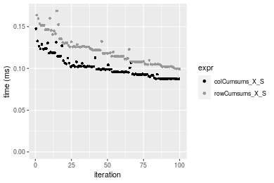


## Appendix

### Session information
```r
R version 4.1.1 Patched (2021-08-10 r80727)
Platform: x86_64-pc-linux-gnu (64-bit)
Running under: Ubuntu 18.04.5 LTS

Matrix products: default
BLAS:   /home/hb/software/R-devel/R-4-1-branch/lib/R/lib/libRblas.so
LAPACK: /home/hb/software/R-devel/R-4-1-branch/lib/R/lib/libRlapack.so

locale:
 [1] LC_CTYPE=en_US.UTF-8       LC_NUMERIC=C              
 [3] LC_TIME=en_US.UTF-8        LC_COLLATE=en_US.UTF-8    
 [5] LC_MONETARY=en_US.UTF-8    LC_MESSAGES=en_US.UTF-8   
 [7] LC_PAPER=en_US.UTF-8       LC_NAME=C                 
 [9] LC_ADDRESS=C               LC_TELEPHONE=C            
[11] LC_MEASUREMENT=en_US.UTF-8 LC_IDENTIFICATION=C       

attached base packages:
[1] stats     graphics  grDevices utils     datasets  methods   base     

other attached packages:
[1] microbenchmark_1.4-7   matrixStats_0.60.1     ggplot2_3.3.5         
[4] knitr_1.33             R.devices_2.17.0       R.utils_2.10.1        
[7] R.oo_1.24.0            R.methodsS3_1.8.1-9001 history_0.0.1-9000    

loaded via a namespace (and not attached):
 [1] Biobase_2.52.0          httr_1.4.2              splines_4.1.1          
 [4] bit64_4.0.5             network_1.17.1          assertthat_0.2.1       
 [7] highr_0.9               stats4_4.1.1            blob_1.2.2             
[10] GenomeInfoDbData_1.2.6  robustbase_0.93-8       pillar_1.6.2           
[13] RSQLite_2.2.8           lattice_0.20-44         glue_1.4.2             
[16] digest_0.6.27           XVector_0.32.0          colorspace_2.0-2       
[19] Matrix_1.3-4            XML_3.99-0.7            pkgconfig_2.0.3        
[22] zlibbioc_1.38.0         genefilter_1.74.0       purrr_0.3.4            
[25] ergm_4.1.2              xtable_1.8-4            scales_1.1.1           
[28] tibble_3.1.4            annotate_1.70.0         KEGGREST_1.32.0        
[31] farver_2.1.0            generics_0.1.0          IRanges_2.26.0         
[34] ellipsis_0.3.2          cachem_1.0.6            withr_2.4.2            
[37] BiocGenerics_0.38.0     mime_0.11               survival_3.2-13        
[40] magrittr_2.0.1          crayon_1.4.1            statnet.common_4.5.0   
[43] memoise_2.0.0           laeken_0.5.1            fansi_0.5.0            
[46] R.cache_0.15.0          MASS_7.3-54             R.rsp_0.44.0           
[49] progressr_0.8.0         tools_4.1.1             lifecycle_1.0.0        
[52] S4Vectors_0.30.0        trust_0.1-8             munsell_0.5.0          
[55] tabby_0.0.1-9001        AnnotationDbi_1.54.1    Biostrings_2.60.2      
[58] compiler_4.1.1          GenomeInfoDb_1.28.1     rlang_0.4.11           
[61] grid_4.1.1              RCurl_1.98-1.4          cwhmisc_6.6            
[64] rappdirs_0.3.3          startup_0.15.0          labeling_0.4.2         
[67] bitops_1.0-7            base64enc_0.1-3         boot_1.3-28            
[70] gtable_0.3.0            DBI_1.1.1               markdown_1.1           
[73] R6_2.5.1                lpSolveAPI_5.5.2.0-17.7 rle_0.9.2              
[76] dplyr_1.0.7             fastmap_1.1.0           bit_4.0.4              
[79] utf8_1.2.2              parallel_4.1.1          Rcpp_1.0.7             
[82] vctrs_0.3.8             png_0.1-7               DEoptimR_1.0-9         
[85] tidyselect_1.1.1        xfun_0.25               coda_0.19-4            
```
Total processing time was 21.85 secs.


### Reproducibility
To reproduce this report, do:
```r
html <- matrixStats:::benchmark('colRowCumsums_subset')
```

[RSP]: https://cran.r-project.org/package=R.rsp
[matrixStats]: https://cran.r-project.org/package=matrixStats

[StackOverflow:colMins?]: https://stackoverflow.com/questions/13676878 "Stack Overflow: fastest way to get Min from every column in a matrix?"
[StackOverflow:colSds?]: https://stackoverflow.com/questions/17549762 "Stack Overflow: Is there such 'colsd' in R?"
[StackOverflow:rowProds?]: https://stackoverflow.com/questions/20198801/ "Stack Overflow: Row product of matrix and column sum of matrix"

---------------------------------------
Copyright Dongcan Jiang. Last updated on 2021-08-25 18:54:20 (+0200 UTC). Powered by [RSP].

<script>
 var link = document.createElement('link');
 link.rel = 'icon';
 link.href = "data:image/png;base64,iVBORw0KGgoAAAANSUhEUgAAACAAAAAgCAMAAABEpIrGAAAA21BMVEUAAAAAAP8AAP8AAP8AAP8AAP8AAP8AAP8AAP8AAP8AAP8AAP8AAP8AAP8AAP8AAP8AAP8AAP8AAP8AAP8AAP8AAP8AAP8AAP8AAP8AAP8AAP8AAP8AAP8AAP8AAP8AAP8AAP8AAP8AAP8AAP8AAP8AAP8AAP8AAP8AAP8AAP8BAf4CAv0DA/wdHeIeHuEfH+AgIN8hId4lJdomJtknJ9g+PsE/P8BAQL9yco10dIt1dYp3d4h4eIeVlWqWlmmXl2iYmGeZmWabm2Tn5xjo6Bfp6Rb39wj4+Af//wA2M9hbAAAASXRSTlMAAQIJCgsMJSYnKD4/QGRlZmhpamtsbautrrCxuru8y8zN5ebn6Pn6+///////////////////////////////////////////LsUNcQAAAS9JREFUOI29k21XgkAQhVcFytdSMqMETU26UVqGmpaiFbL//xc1cAhhwVNf6n5i5z67M2dmYOyfJZUqlVLhkKucG7cgmUZTybDz6g0iDeq51PUr37Ds2cy2/C9NeES5puDjxuUk1xnToZsg8pfA3avHQ3lLIi7iWRrkv/OYtkScxBIMgDee0ALoyxHQBJ68JLCjOtQIMIANF7QG9G9fNnHvisCHBVMKgSJgiz7nE+AoBKrAPA3MgepvgR9TSCasrCKH0eB1wBGBFdCO+nAGjMVGPcQb5bd6mQRegN6+1axOs9nGfYcCtfi4NQosdtH7dB+txFIpXQqN1p9B/asRHToyS0jRgpV7nk4nwcq1BJ+x3Gl/v7S9Wmpp/aGquum7w3ZDyrADFYrl8vHBH+ev9AUASW1dmU4h4wAAAABJRU5ErkJggg=="
 document.getElementsByTagName('head')[0].appendChild(link);
</script>


