[matrixStats]: Benchmark report

---------------------------------------


# colDiffs() and rowDiffs() benchmarks

This report benchmark the performance of colDiffs() and rowDiffs() against alternative methods.

## Alternative methods

* apply() + diff()
* apply() + diff2()
* diff()


## Data type "integer"

### Data
```r
> rmatrix <- function(nrow, ncol, mode = c("logical", "double", "integer", "index"), range = c(-100, 
+     +100), na_prob = 0) {
+     mode <- match.arg(mode)
+     n <- nrow * ncol
+     if (mode == "logical") {
+         x <- sample(c(FALSE, TRUE), size = n, replace = TRUE)
+     }     else if (mode == "index") {
+         x <- seq_len(n)
+         mode <- "integer"
+     }     else {
+         x <- runif(n, min = range[1], max = range[2])
+     }
+     storage.mode(x) <- mode
+     if (na_prob > 0) 
+         x[sample(n, size = na_prob * n)] <- NA
+     dim(x) <- c(nrow, ncol)
+     x
+ }
> rmatrices <- function(scale = 10, seed = 1, ...) {
+     set.seed(seed)
+     data <- list()
+     data[[1]] <- rmatrix(nrow = scale * 1, ncol = scale * 1, ...)
+     data[[2]] <- rmatrix(nrow = scale * 10, ncol = scale * 10, ...)
+     data[[3]] <- rmatrix(nrow = scale * 100, ncol = scale * 1, ...)
+     data[[4]] <- t(data[[3]])
+     data[[5]] <- rmatrix(nrow = scale * 10, ncol = scale * 100, ...)
+     data[[6]] <- t(data[[5]])
+     names(data) <- sapply(data, FUN = function(x) paste(dim(x), collapse = "x"))
+     data
+ }
> data <- rmatrices(mode = mode)
```

### Results

#### 10x10 integer matrix


```r
> X <- data[["10x10"]]
> gc()
          used  (Mb) gc trigger  (Mb) max used  (Mb)
Ncells 5221589 278.9    8529671 455.6  8529671 455.6
Vcells 9980577  76.2   31876688 243.2 60562128 462.1
> colStats <- microbenchmark(colDiffs = colDiffs(X), `apply+diff` = apply(X, MARGIN = 2L, FUN = diff), 
+     `apply+diff2` = apply(X, MARGIN = 2L, FUN = diff2), diff = diff(X), unit = "ms")
> X <- t(X)
> gc()
          used  (Mb) gc trigger  (Mb) max used  (Mb)
Ncells 5212291 278.4    8529671 455.6  8529671 455.6
Vcells 9950246  76.0   31876688 243.2 60562128 462.1
> rowStats <- microbenchmark(rowDiffs = rowDiffs(X), `apply+diff` = apply(X, MARGIN = 1L, FUN = diff), 
+     `apply+diff2` = apply(X, MARGIN = 1L, FUN = diff2), `diff + t` = diff(t(X)), unit = "ms")
```

_Table: Benchmarking of colDiffs(), apply+diff(), apply+diff2() and diff() on integer+10x10 data. The top panel shows times in milliseconds and the bottom panel shows relative times._


|   |expr        |      min|        lq|      mean|    median|        uq|      max|
|:--|:-----------|--------:|---------:|---------:|---------:|---------:|--------:|
|1  |colDiffs    | 0.001954| 0.0024945| 0.0030917| 0.0030555| 0.0034100| 0.011732|
|4  |diff        | 0.007981| 0.0095225| 0.0111544| 0.0107775| 0.0116385| 0.055725|
|3  |apply+diff2 | 0.048816| 0.0529325| 0.0573205| 0.0557615| 0.0584190| 0.179273|
|2  |apply+diff  | 0.086678| 0.0901780| 0.0972666| 0.0953810| 0.1018200| 0.170467|


|   |expr        |       min|        lq|      mean|    median|       uq|       max|
|:--|:-----------|---------:|---------:|---------:|---------:|--------:|---------:|
|1  |colDiffs    |  1.000000|  1.000000|  1.000000|  1.000000|  1.00000|  1.000000|
|4  |diff        |  4.084442|  3.817398|  3.607885|  3.527246|  3.41305|  4.749829|
|3  |apply+diff2 | 24.982600| 21.219683| 18.540300| 18.249550| 17.13167| 15.280685|
|2  |apply+diff  | 44.359263| 36.150732| 31.460851| 31.216168| 29.85924| 14.530089|

_Table: Benchmarking of rowDiffs(), apply+diff(), apply+diff2() and diff + t() on integer+10x10 data (transposed). The top panel shows times in milliseconds and the bottom panel shows relative times._


|   |expr        |      min|        lq|      mean|    median|        uq|      max|
|:--|:-----------|--------:|---------:|---------:|---------:|---------:|--------:|
|1  |rowDiffs    | 0.001989| 0.0027065| 0.0031962| 0.0032110| 0.0035955| 0.009475|
|4  |diff + t    | 0.010558| 0.0126440| 0.0146196| 0.0144855| 0.0160235| 0.033993|
|3  |apply+diff2 | 0.049002| 0.0529945| 0.0570272| 0.0562080| 0.0587405| 0.149900|
|2  |apply+diff  | 0.087192| 0.0923010| 0.0993132| 0.0983380| 0.1041760| 0.141377|


|   |expr        |       min|        lq|      mean|    median|        uq|       max|
|:--|:-----------|---------:|---------:|---------:|---------:|---------:|---------:|
|1  |rowDiffs    |  1.000000|  1.000000|  1.000000|  1.000000|  1.000000|  1.000000|
|4  |diff + t    |  5.308195|  4.671716|  4.574047|  4.511211|  4.456543|  3.587652|
|3  |apply+diff2 | 24.636501| 19.580454| 17.842194| 17.504827| 16.337227| 15.820581|
|2  |apply+diff  | 43.837104| 34.103455| 31.072277| 30.625350| 28.973995| 14.921055|

_Figure: Benchmarking of colDiffs(), apply+diff(), apply+diff2() and diff() on integer+10x10 data  as well as rowDiffs(), apply+diff(), apply+diff2() and diff + t() on the same data transposed.  Outliers are displayed as crosses.  Times are in milliseconds._


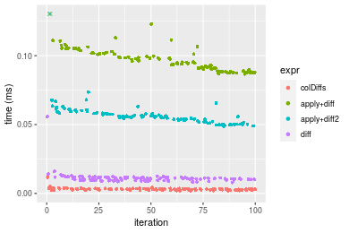

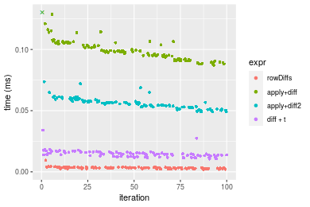
_Table: Benchmarking of colDiffs() and rowDiffs() on integer+10x10 data (original and transposed).  The top panel shows times in milliseconds and the bottom panel shows relative times._


|   |expr     |   min|     lq|    mean| median|     uq|    max|
|:--|:--------|-----:|------:|-------:|------:|------:|------:|
|1  |colDiffs | 1.954| 2.4945| 3.09167| 3.0555| 3.4100| 11.732|
|2  |rowDiffs | 1.989| 2.7065| 3.19620| 3.2110| 3.5955|  9.475|


|   |expr     |      min|       lq|    mean|   median|       uq|       max|
|:--|:--------|--------:|--------:|-------:|--------:|--------:|---------:|
|1  |colDiffs | 1.000000| 1.000000| 1.00000| 1.000000| 1.000000| 1.0000000|
|2  |rowDiffs | 1.017912| 1.084987| 1.03381| 1.050892| 1.054399| 0.8076202|

_Figure: Benchmarking of colDiffs() and rowDiffs() on integer+10x10 data (original and transposed).  Outliers are displayed as crosses. Times are in milliseconds._


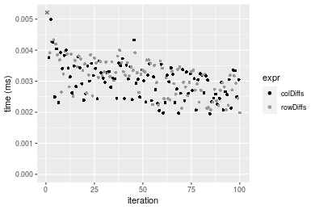

#### 100x100 integer matrix


```r
> X <- data[["100x100"]]
> gc()
          used  (Mb) gc trigger  (Mb) max used  (Mb)
Ncells 5210937 278.3    8529671 455.6  8529671 455.6
Vcells 9567136  73.0   31876688 243.2 60562128 462.1
> colStats <- microbenchmark(colDiffs = colDiffs(X), `apply+diff` = apply(X, MARGIN = 2L, FUN = diff), 
+     `apply+diff2` = apply(X, MARGIN = 2L, FUN = diff2), diff = diff(X), unit = "ms")
> X <- t(X)
> gc()
          used  (Mb) gc trigger  (Mb) max used  (Mb)
Ncells 5210913 278.3    8529671 455.6  8529671 455.6
Vcells 9572149  73.1   31876688 243.2 60562128 462.1
> rowStats <- microbenchmark(rowDiffs = rowDiffs(X), `apply+diff` = apply(X, MARGIN = 1L, FUN = diff), 
+     `apply+diff2` = apply(X, MARGIN = 1L, FUN = diff2), `diff + t` = diff(t(X)), unit = "ms")
```

_Table: Benchmarking of colDiffs(), apply+diff(), apply+diff2() and diff() on integer+100x100 data. The top panel shows times in milliseconds and the bottom panel shows relative times._


|   |expr        |      min|        lq|      mean|    median|        uq|      max|
|:--|:-----------|--------:|---------:|---------:|---------:|---------:|--------:|
|1  |colDiffs    | 0.022720| 0.0243530| 0.0267945| 0.0253725| 0.0268310| 0.043121|
|4  |diff        | 0.087568| 0.0914170| 0.1019660| 0.0957025| 0.1091395| 0.180788|
|3  |apply+diff2 | 0.274411| 0.2865855| 0.3192940| 0.3014605| 0.3363070| 0.551258|
|2  |apply+diff  | 0.682734| 0.7026075| 0.7717211| 0.7299490| 0.7967990| 1.197832|


|   |expr        |       min|        lq|      mean|    median|        uq|       max|
|:--|:-----------|---------:|---------:|---------:|---------:|---------:|---------:|
|1  |colDiffs    |  1.000000|  1.000000|  1.000000|  1.000000|  1.000000|  1.000000|
|4  |diff        |  3.854225|  3.753829|  3.805481|  3.771899|  4.067664|  4.192574|
|3  |apply+diff2 | 12.077949| 11.767975| 11.916397| 11.881387| 12.534270| 12.783980|
|2  |apply+diff  | 30.049912| 28.850963| 28.801464| 28.769298| 29.696955| 27.778391|

_Table: Benchmarking of rowDiffs(), apply+diff(), apply+diff2() and diff + t() on integer+100x100 data (transposed). The top panel shows times in milliseconds and the bottom panel shows relative times._


|   |expr        |      min|        lq|      mean|    median|        uq|      max|
|:--|:-----------|--------:|---------:|---------:|---------:|---------:|--------:|
|1  |rowDiffs    | 0.033468| 0.0356325| 0.0403932| 0.0377810| 0.0441705| 0.062311|
|4  |diff + t    | 0.101952| 0.1059645| 0.1162867| 0.1111445| 0.1207780| 0.180062|
|3  |apply+diff2 | 0.276969| 0.2889045| 0.3169044| 0.2996115| 0.3304000| 0.468003|
|2  |apply+diff  | 0.687461| 0.7022585| 0.7748586| 0.7258275| 0.8050630| 1.316043|


|   |expr        |       min|        lq|      mean|    median|        uq|       max|
|:--|:-----------|---------:|---------:|---------:|---------:|---------:|---------:|
|1  |rowDiffs    |  1.000000|  1.000000|  1.000000|  1.000000|  1.000000|  1.000000|
|4  |diff + t    |  3.046253|  2.973816|  2.878867|  2.941809|  2.734359|  2.889731|
|3  |apply+diff2 |  8.275636|  8.107893|  7.845485|  7.930216|  7.480105|  7.510760|
|2  |apply+diff  | 20.540845| 19.708370| 19.182887| 19.211442| 18.226260| 21.120557|

_Figure: Benchmarking of colDiffs(), apply+diff(), apply+diff2() and diff() on integer+100x100 data  as well as rowDiffs(), apply+diff(), apply+diff2() and diff + t() on the same data transposed.  Outliers are displayed as crosses.  Times are in milliseconds._


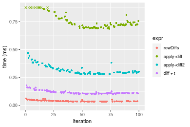
_Table: Benchmarking of colDiffs() and rowDiffs() on integer+100x100 data (original and transposed).  The top panel shows times in milliseconds and the bottom panel shows relative times._


|   |expr     |    min|      lq|     mean|  median|      uq|    max|
|:--|:--------|------:|-------:|--------:|-------:|-------:|------:|
|1  |colDiffs | 22.720| 24.3530| 26.79451| 25.3725| 26.8310| 43.121|
|2  |rowDiffs | 33.468| 35.6325| 40.39322| 37.7810| 44.1705| 62.311|


|   |expr     |      min|       lq|     mean|   median|       uq|      max|
|:--|:--------|--------:|--------:|--------:|--------:|--------:|--------:|
|1  |colDiffs | 1.000000| 1.000000| 1.000000| 1.000000| 1.000000| 1.000000|
|2  |rowDiffs | 1.473063| 1.463167| 1.507518| 1.489053| 1.646249| 1.445027|

_Figure: Benchmarking of colDiffs() and rowDiffs() on integer+100x100 data (original and transposed).  Outliers are displayed as crosses. Times are in milliseconds._


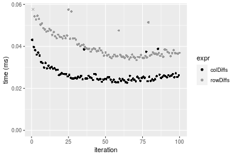

#### 1000x10 integer matrix


```r
> X <- data[["1000x10"]]
> gc()
          used  (Mb) gc trigger  (Mb) max used  (Mb)
Ncells 5211707 278.4    8529671 455.6  8529671 455.6
Vcells 9570927  73.1   31876688 243.2 60562128 462.1
> colStats <- microbenchmark(colDiffs = colDiffs(X), `apply+diff` = apply(X, MARGIN = 2L, FUN = diff), 
+     `apply+diff2` = apply(X, MARGIN = 2L, FUN = diff2), diff = diff(X), unit = "ms")
> X <- t(X)
> gc()
          used  (Mb) gc trigger  (Mb) max used  (Mb)
Ncells 5211695 278.4    8529671 455.6  8529671 455.6
Vcells 9575960  73.1   31876688 243.2 60562128 462.1
> rowStats <- microbenchmark(rowDiffs = rowDiffs(X), `apply+diff` = apply(X, MARGIN = 1L, FUN = diff), 
+     `apply+diff2` = apply(X, MARGIN = 1L, FUN = diff2), `diff + t` = diff(t(X)), unit = "ms")
```

_Table: Benchmarking of colDiffs(), apply+diff(), apply+diff2() and diff() on integer+1000x10 data. The top panel shows times in milliseconds and the bottom panel shows relative times._


|   |expr        |      min|        lq|      mean|   median|       uq|      max|
|:--|:-----------|--------:|---------:|---------:|--------:|--------:|--------:|
|1  |colDiffs    | 0.022243| 0.0262515| 0.0297688| 0.029234| 0.033370| 0.046911|
|4  |diff        | 0.091271| 0.1035955| 0.1154996| 0.111918| 0.120278| 0.206659|
|3  |apply+diff2 | 0.120975| 0.1399330| 0.1568516| 0.152697| 0.163107| 0.308744|
|2  |apply+diff  | 0.253351| 0.2852320| 0.3318267| 0.321153| 0.360368| 0.947031|


|   |expr        |       min|        lq|      mean|    median|        uq|       max|
|:--|:-----------|---------:|---------:|---------:|---------:|---------:|---------:|
|1  |colDiffs    |  1.000000|  1.000000|  1.000000|  1.000000|  1.000000|  1.000000|
|4  |diff        |  4.103358|  3.946270|  3.879888|  3.828351|  3.604375|  4.405342|
|3  |apply+diff2 |  5.438790|  5.330476|  5.268994|  5.223267|  4.887833|  6.581484|
|2  |apply+diff  | 11.390145| 10.865360| 11.146799| 10.985599| 10.799161| 20.187824|

_Table: Benchmarking of rowDiffs(), apply+diff(), apply+diff2() and diff + t() on integer+1000x10 data (transposed). The top panel shows times in milliseconds and the bottom panel shows relative times._


|   |expr        |      min|        lq|      mean|    median|        uq|      max|
|:--|:-----------|--------:|---------:|---------:|---------:|---------:|--------:|
|1  |rowDiffs    | 0.034183| 0.0372740| 0.0416555| 0.0403800| 0.0450055| 0.066722|
|4  |diff + t    | 0.103999| 0.1144365| 0.1282346| 0.1245210| 0.1382080| 0.223987|
|3  |apply+diff2 | 0.122528| 0.1343930| 0.1513732| 0.1456705| 0.1608315| 0.268266|
|2  |apply+diff  | 0.260132| 0.2768280| 0.3205279| 0.3149430| 0.3478400| 0.430764|


|   |expr        |      min|       lq|     mean|   median|       uq|      max|
|:--|:-----------|--------:|--------:|--------:|--------:|--------:|--------:|
|1  |rowDiffs    | 1.000000| 1.000000| 1.000000| 1.000000| 1.000000| 1.000000|
|4  |diff + t    | 3.042419| 3.070143| 3.078456| 3.083730| 3.070914| 3.357019|
|3  |apply+diff2 | 3.584472| 3.605543| 3.633932| 3.607491| 3.573597| 4.020653|
|2  |apply+diff  | 7.609982| 7.426839| 7.694735| 7.799480| 7.728833| 6.456101|

_Figure: Benchmarking of colDiffs(), apply+diff(), apply+diff2() and diff() on integer+1000x10 data  as well as rowDiffs(), apply+diff(), apply+diff2() and diff + t() on the same data transposed.  Outliers are displayed as crosses.  Times are in milliseconds._


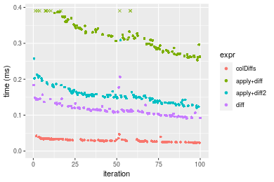

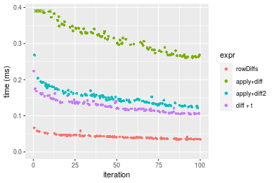
_Table: Benchmarking of colDiffs() and rowDiffs() on integer+1000x10 data (original and transposed).  The top panel shows times in milliseconds and the bottom panel shows relative times._


|   |expr     |    min|      lq|     mean| median|      uq|    max|
|:--|:--------|------:|-------:|--------:|------:|-------:|------:|
|1  |colDiffs | 22.243| 26.2515| 29.76879| 29.234| 33.3700| 46.911|
|2  |rowDiffs | 34.183| 37.2740| 41.65548| 40.380| 45.0055| 66.722|


|   |expr     |      min|       lq|   mean|   median|       uq|     max|
|:--|:--------|--------:|--------:|------:|--------:|--------:|-------:|
|1  |colDiffs | 1.000000| 1.000000| 1.0000| 1.000000| 1.000000| 1.00000|
|2  |rowDiffs | 1.536798| 1.419881| 1.3993| 1.381268| 1.348682| 1.42231|

_Figure: Benchmarking of colDiffs() and rowDiffs() on integer+1000x10 data (original and transposed).  Outliers are displayed as crosses. Times are in milliseconds._


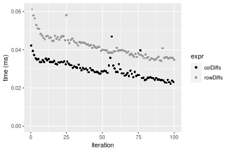

#### 10x1000 integer matrix


```r
> X <- data[["10x1000"]]
> gc()
          used  (Mb) gc trigger  (Mb) max used  (Mb)
Ncells 5211961 278.4    8529671 455.6  8529671 455.6
Vcells 9571795  73.1   31876688 243.2 60562128 462.1
> colStats <- microbenchmark(colDiffs = colDiffs(X), `apply+diff` = apply(X, MARGIN = 2L, FUN = diff), 
+     `apply+diff2` = apply(X, MARGIN = 2L, FUN = diff2), diff = diff(X), unit = "ms")
> X <- t(X)
> gc()
          used  (Mb) gc trigger  (Mb) max used  (Mb)
Ncells 5211937 278.4    8529671 455.6  8529671 455.6
Vcells 9576808  73.1   31876688 243.2 60562128 462.1
> rowStats <- microbenchmark(rowDiffs = rowDiffs(X), `apply+diff` = apply(X, MARGIN = 1L, FUN = diff), 
+     `apply+diff2` = apply(X, MARGIN = 1L, FUN = diff2), `diff + t` = diff(t(X)), unit = "ms")
```

_Table: Benchmarking of colDiffs(), apply+diff(), apply+diff2() and diff() on integer+10x1000 data. The top panel shows times in milliseconds and the bottom panel shows relative times._


|   |expr        |      min|        lq|      mean|    median|        uq|       max|
|:--|:-----------|--------:|---------:|---------:|---------:|---------:|---------:|
|1  |colDiffs    | 0.022336| 0.0249510| 0.0268664| 0.0258295| 0.0281165|  0.047132|
|4  |diff        | 0.086755| 0.0934565| 0.0981875| 0.0959990| 0.0988650|  0.164649|
|3  |apply+diff2 | 1.797929| 1.9697590| 2.0623319| 2.0391190| 2.1051500|  2.844316|
|2  |apply+diff  | 4.868596| 5.2459445| 5.5224501| 5.3340625| 5.5647270| 10.605102|


|   |expr        |        min|         lq|       mean|     median|         uq|        max|
|:--|:-----------|----------:|----------:|----------:|----------:|----------:|----------:|
|1  |colDiffs    |   1.000000|   1.000000|   1.000000|   1.000000|   1.000000|   1.000000|
|4  |diff        |   3.884088|   3.745601|   3.654662|   3.716642|   3.516263|   3.493359|
|3  |apply+diff2 |  80.494672|  78.945092|  76.762582|  78.945353|  74.872406|  60.347874|
|2  |apply+diff  | 217.970810| 210.249870| 205.552523| 206.510482| 197.916775| 225.008529|

_Table: Benchmarking of rowDiffs(), apply+diff(), apply+diff2() and diff + t() on integer+10x1000 data (transposed). The top panel shows times in milliseconds and the bottom panel shows relative times._


|   |expr        |      min|        lq|      mean|    median|        uq|       max|
|:--|:-----------|--------:|---------:|---------:|---------:|---------:|---------:|
|1  |rowDiffs    | 0.029975| 0.0336145| 0.0359140| 0.0344240| 0.0365195|  0.067347|
|4  |diff + t    | 0.097950| 0.1095145| 0.1172109| 0.1133445| 0.1190880|  0.208593|
|3  |apply+diff2 | 1.801484| 1.9679595| 2.1331394| 2.0244950| 2.0860485|  7.038373|
|2  |apply+diff  | 4.866091| 5.2611440| 5.4705944| 5.3597840| 5.5588710| 10.491253|


|   |expr        |        min|         lq|       mean|     median|         uq|        max|
|:--|:-----------|----------:|----------:|----------:|----------:|----------:|----------:|
|1  |rowDiffs    |   1.000000|   1.000000|   1.000000|   1.000000|   1.000000|   1.000000|
|4  |diff + t    |   3.267723|   3.257954|   3.263657|   3.292601|   3.260943|   3.097287|
|3  |apply+diff2 |  60.099550|  58.544958|  59.395795|  58.810568|  57.121497| 104.509080|
|2  |apply+diff  | 162.338315| 156.514123| 152.324927| 155.699047| 152.216514| 155.779070|

_Figure: Benchmarking of colDiffs(), apply+diff(), apply+diff2() and diff() on integer+10x1000 data  as well as rowDiffs(), apply+diff(), apply+diff2() and diff + t() on the same data transposed.  Outliers are displayed as crosses.  Times are in milliseconds._


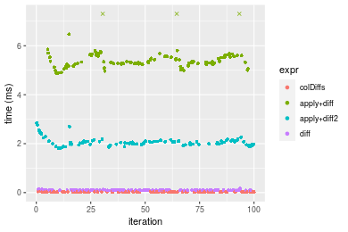

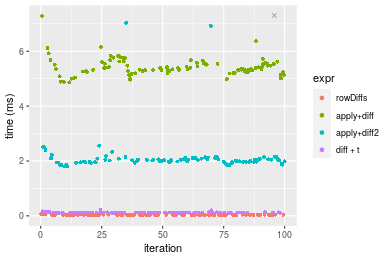
_Table: Benchmarking of colDiffs() and rowDiffs() on integer+10x1000 data (original and transposed).  The top panel shows times in milliseconds and the bottom panel shows relative times._


|   |expr     |    min|      lq|     mean|  median|      uq|    max|
|:--|:--------|------:|-------:|--------:|-------:|-------:|------:|
|1  |colDiffs | 22.336| 24.9510| 26.86637| 25.8295| 28.1165| 47.132|
|2  |rowDiffs | 29.975| 33.6145| 35.91398| 34.4240| 36.5195| 67.347|


|   |expr     |      min|       lq|     mean|  median|       uq|      max|
|:--|:--------|--------:|--------:|--------:|-------:|--------:|--------:|
|1  |colDiffs | 1.000000| 1.000000| 1.000000| 1.00000| 1.000000| 1.000000|
|2  |rowDiffs | 1.342004| 1.347221| 1.336763| 1.33274| 1.298864| 1.428902|

_Figure: Benchmarking of colDiffs() and rowDiffs() on integer+10x1000 data (original and transposed).  Outliers are displayed as crosses. Times are in milliseconds._


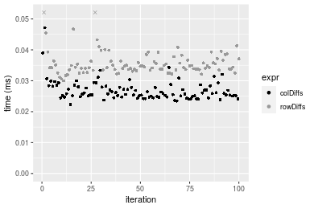

#### 100x1000 integer matrix


```r
> X <- data[["100x1000"]]
> gc()
          used  (Mb) gc trigger  (Mb) max used  (Mb)
Ncells 5212177 278.4    8529671 455.6  8529671 455.6
Vcells 9572361  73.1   31876688 243.2 60562128 462.1
> colStats <- microbenchmark(colDiffs = colDiffs(X), `apply+diff` = apply(X, MARGIN = 2L, FUN = diff), 
+     `apply+diff2` = apply(X, MARGIN = 2L, FUN = diff2), diff = diff(X), unit = "ms")
> X <- t(X)
> gc()
          used  (Mb) gc trigger  (Mb) max used  (Mb)
Ncells 5212171 278.4    8529671 455.6  8529671 455.6
Vcells 9622404  73.5   31876688 243.2 60562128 462.1
> rowStats <- microbenchmark(rowDiffs = rowDiffs(X), `apply+diff` = apply(X, MARGIN = 1L, FUN = diff), 
+     `apply+diff2` = apply(X, MARGIN = 1L, FUN = diff2), `diff + t` = diff(t(X)), unit = "ms")
```

_Table: Benchmarking of colDiffs(), apply+diff(), apply+diff2() and diff() on integer+100x1000 data. The top panel shows times in milliseconds and the bottom panel shows relative times._


|   |expr        |      min|        lq|      mean|    median|        uq|       max|
|:--|:-----------|--------:|---------:|---------:|---------:|---------:|---------:|
|1  |colDiffs    | 0.220242| 0.2393210| 0.2456916| 0.2451810| 0.2506115|  0.297203|
|4  |diff        | 0.837108| 0.8952495| 1.1099607| 0.9266345| 0.9504790| 18.800757|
|3  |apply+diff2 | 2.667214| 2.8828510| 3.1375531| 2.9471605| 2.9840970| 21.870916|
|2  |apply+diff  | 6.707820| 7.2997510| 8.0123042| 7.4189970| 7.5452825| 27.194875|


|   |expr        |       min|       lq|     mean|   median|        uq|      max|
|:--|:-----------|---------:|--------:|--------:|--------:|---------:|--------:|
|1  |colDiffs    |  1.000000|  1.00000|  1.00000|  1.00000|  1.000000|  1.00000|
|4  |diff        |  3.800855|  3.74079|  4.51770|  3.77939|  3.792639| 63.25897|
|3  |apply+diff2 | 12.110379| 12.04596| 12.77029| 12.02035| 11.907263| 73.58915|
|2  |apply+diff  | 30.456589| 30.50192| 32.61123| 30.25927| 30.107487| 91.50269|

_Table: Benchmarking of rowDiffs(), apply+diff(), apply+diff2() and diff + t() on integer+100x1000 data (transposed). The top panel shows times in milliseconds and the bottom panel shows relative times._


|   |expr        |      min|       lq|      mean|   median|       uq|       max|
|:--|:-----------|--------:|--------:|---------:|--------:|--------:|---------:|
|1  |rowDiffs    | 0.324826| 0.350251| 0.5336086| 0.356782| 0.366596| 17.692511|
|4  |diff + t    | 0.986962| 1.065435| 1.0956329| 1.085759| 1.114226|  1.412372|
|3  |apply+diff2 | 2.650777| 2.889380| 3.3135243| 2.950258| 3.008276| 21.220776|
|2  |apply+diff  | 6.732852| 7.320830| 7.8556445| 7.452088| 7.562580| 25.741307|


|   |expr        |       min|        lq|      mean|    median|        uq|       max|
|:--|:-----------|---------:|---------:|---------:|---------:|---------:|---------:|
|1  |rowDiffs    |  1.000000|  1.000000|  1.000000|  1.000000|  1.000000| 1.0000000|
|4  |diff + t    |  3.038433|  3.041917|  2.053252|  3.043201|  3.039383| 0.0798288|
|3  |apply+diff2 |  8.160606|  8.249455|  6.209653|  8.269076|  8.205971| 1.1994214|
|2  |apply+diff  | 20.727565| 20.901666| 14.721734| 20.886949| 20.629194| 1.4549267|

_Figure: Benchmarking of colDiffs(), apply+diff(), apply+diff2() and diff() on integer+100x1000 data  as well as rowDiffs(), apply+diff(), apply+diff2() and diff + t() on the same data transposed.  Outliers are displayed as crosses.  Times are in milliseconds._


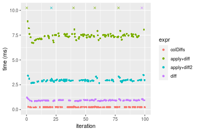

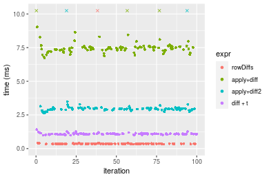
_Table: Benchmarking of colDiffs() and rowDiffs() on integer+100x1000 data (original and transposed).  The top panel shows times in milliseconds and the bottom panel shows relative times._


|   |expr     |     min|      lq|     mean|  median|       uq|       max|
|:--|:--------|-------:|-------:|--------:|-------:|--------:|---------:|
|1  |colDiffs | 220.242| 239.321| 245.6916| 245.181| 250.6115|   297.203|
|2  |rowDiffs | 324.826| 350.251| 533.6086| 356.782| 366.5960| 17692.511|


|   |expr     |      min|      lq|     mean|   median|       uq|      max|
|:--|:--------|--------:|-------:|--------:|--------:|--------:|--------:|
|1  |colDiffs | 1.000000| 1.00000| 1.000000| 1.000000| 1.000000|  1.00000|
|2  |rowDiffs | 1.474859| 1.46352| 2.171864| 1.455178| 1.462806| 59.53006|

_Figure: Benchmarking of colDiffs() and rowDiffs() on integer+100x1000 data (original and transposed).  Outliers are displayed as crosses. Times are in milliseconds._


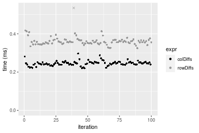

#### 1000x100 integer matrix


```r
> X <- data[["1000x100"]]
> gc()
          used  (Mb) gc trigger  (Mb) max used  (Mb)
Ncells 5212401 278.4    8529671 455.6  8529671 455.6
Vcells 9573035  73.1   31876688 243.2 60562128 462.1
> colStats <- microbenchmark(colDiffs = colDiffs(X), `apply+diff` = apply(X, MARGIN = 2L, FUN = diff), 
+     `apply+diff2` = apply(X, MARGIN = 2L, FUN = diff2), diff = diff(X), unit = "ms")
> X <- t(X)
> gc()
          used  (Mb) gc trigger  (Mb) max used  (Mb)
Ncells 5212395 278.4    8529671 455.6  8529671 455.6
Vcells 9623078  73.5   31876688 243.2 60562128 462.1
> rowStats <- microbenchmark(rowDiffs = rowDiffs(X), `apply+diff` = apply(X, MARGIN = 1L, FUN = diff), 
+     `apply+diff2` = apply(X, MARGIN = 1L, FUN = diff2), `diff + t` = diff(t(X)), unit = "ms")
```

_Table: Benchmarking of colDiffs(), apply+diff(), apply+diff2() and diff() on integer+1000x100 data. The top panel shows times in milliseconds and the bottom panel shows relative times._


|   |expr        |      min|        lq|      mean|    median|        uq|       max|
|:--|:-----------|--------:|---------:|---------:|---------:|---------:|---------:|
|1  |colDiffs    | 0.210796| 0.2235195| 0.2327042| 0.2320075| 0.2400205|  0.301566|
|4  |diff        | 0.811547| 0.8648805| 0.9887286| 0.9038545| 0.9344805|  8.510391|
|3  |apply+diff2 | 0.978443| 1.0580410| 1.1198984| 1.1048290| 1.1437750|  1.412121|
|2  |apply+diff  | 2.303703| 2.4978300| 2.8662854| 2.5936945| 2.7052950| 10.602644|


|   |expr        |       min|        lq|      mean|    median|        uq|       max|
|:--|:-----------|---------:|---------:|---------:|---------:|---------:|---------:|
|1  |colDiffs    |  1.000000|  1.000000|  1.000000|  1.000000|  1.000000|  1.000000|
|4  |diff        |  3.849916|  3.869374|  4.248863|  3.895799|  3.893336| 28.220658|
|3  |apply+diff2 |  4.641658|  4.733551|  4.812540|  4.762040|  4.765322|  4.682627|
|2  |apply+diff  | 10.928590| 11.174998| 12.317289| 11.179356| 11.271100| 35.158619|

_Table: Benchmarking of rowDiffs(), apply+diff(), apply+diff2() and diff + t() on integer+1000x100 data (transposed). The top panel shows times in milliseconds and the bottom panel shows relative times._


|   |expr        |      min|       lq|      mean|    median|        uq|       max|
|:--|:-----------|--------:|--------:|---------:|---------:|---------:|---------:|
|1  |rowDiffs    | 0.325121| 0.346176| 0.4463295| 0.3646085| 0.3858825|  7.986657|
|4  |diff + t    | 0.934064| 1.009519| 1.0746035| 1.0615935| 1.0999650|  1.494019|
|3  |apply+diff2 | 0.985068| 1.077364| 1.2894496| 1.1212320| 1.1768665|  8.874917|
|2  |apply+diff  | 2.310003| 2.495784| 2.8190690| 2.5909345| 2.7039315| 11.189777|


|   |expr        |      min|       lq|     mean|   median|       uq|       max|
|:--|:-----------|--------:|--------:|--------:|--------:|--------:|---------:|
|1  |rowDiffs    | 1.000000| 1.000000| 1.000000| 1.000000| 1.000000| 1.0000000|
|4  |diff + t    | 2.872973| 2.916203| 2.407646| 2.911598| 2.850518| 0.1870644|
|3  |apply+diff2 | 3.029850| 3.112186| 2.889008| 3.075167| 3.049805| 1.1112180|
|2  |apply+diff  | 7.105056| 7.209581| 6.316116| 7.106073| 7.007137| 1.4010589|

_Figure: Benchmarking of colDiffs(), apply+diff(), apply+diff2() and diff() on integer+1000x100 data  as well as rowDiffs(), apply+diff(), apply+diff2() and diff + t() on the same data transposed.  Outliers are displayed as crosses.  Times are in milliseconds._


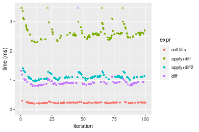

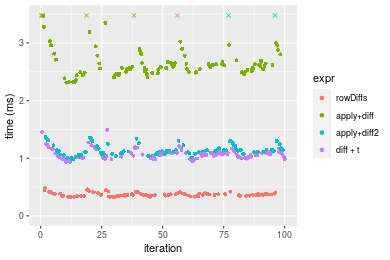
_Table: Benchmarking of colDiffs() and rowDiffs() on integer+1000x100 data (original and transposed).  The top panel shows times in milliseconds and the bottom panel shows relative times._


|   |expr     |     min|       lq|     mean|   median|       uq|      max|
|:--|:--------|-------:|--------:|--------:|--------:|--------:|--------:|
|1  |colDiffs | 210.796| 223.5195| 232.7042| 232.0075| 240.0205|  301.566|
|2  |rowDiffs | 325.121| 346.1760| 446.3295| 364.6085| 385.8825| 7986.657|


|   |expr     |      min|       lq|     mean|   median|       uq|      max|
|:--|:--------|--------:|--------:|--------:|--------:|--------:|--------:|
|1  |colDiffs | 1.000000| 1.000000| 1.000000| 1.000000| 1.000000|  1.00000|
|2  |rowDiffs | 1.542349| 1.548751| 1.918012| 1.571538| 1.607706| 26.48394|

_Figure: Benchmarking of colDiffs() and rowDiffs() on integer+1000x100 data (original and transposed).  Outliers are displayed as crosses. Times are in milliseconds._


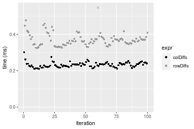


## Data type "double"

### Data
```r
> rmatrix <- function(nrow, ncol, mode = c("logical", "double", "integer", "index"), range = c(-100, 
+     +100), na_prob = 0) {
+     mode <- match.arg(mode)
+     n <- nrow * ncol
+     if (mode == "logical") {
+         x <- sample(c(FALSE, TRUE), size = n, replace = TRUE)
+     }     else if (mode == "index") {
+         x <- seq_len(n)
+         mode <- "integer"
+     }     else {
+         x <- runif(n, min = range[1], max = range[2])
+     }
+     storage.mode(x) <- mode
+     if (na_prob > 0) 
+         x[sample(n, size = na_prob * n)] <- NA
+     dim(x) <- c(nrow, ncol)
+     x
+ }
> rmatrices <- function(scale = 10, seed = 1, ...) {
+     set.seed(seed)
+     data <- list()
+     data[[1]] <- rmatrix(nrow = scale * 1, ncol = scale * 1, ...)
+     data[[2]] <- rmatrix(nrow = scale * 10, ncol = scale * 10, ...)
+     data[[3]] <- rmatrix(nrow = scale * 100, ncol = scale * 1, ...)
+     data[[4]] <- t(data[[3]])
+     data[[5]] <- rmatrix(nrow = scale * 10, ncol = scale * 100, ...)
+     data[[6]] <- t(data[[5]])
+     names(data) <- sapply(data, FUN = function(x) paste(dim(x), collapse = "x"))
+     data
+ }
> data <- rmatrices(mode = mode)
```

### Results

#### 10x10 double matrix


```r
> X <- data[["10x10"]]
> gc()
          used  (Mb) gc trigger  (Mb) max used  (Mb)
Ncells 5212651 278.4    8529671 455.6  8529671 455.6
Vcells 9689681  74.0   31876688 243.2 60562128 462.1
> colStats <- microbenchmark(colDiffs = colDiffs(X), `apply+diff` = apply(X, MARGIN = 2L, FUN = diff), 
+     `apply+diff2` = apply(X, MARGIN = 2L, FUN = diff2), diff = diff(X), unit = "ms")
> X <- t(X)
> gc()
          used  (Mb) gc trigger  (Mb) max used  (Mb)
Ncells 5212618 278.4    8529671 455.6  8529671 455.6
Vcells 9689779  74.0   31876688 243.2 60562128 462.1
> rowStats <- microbenchmark(rowDiffs = rowDiffs(X), `apply+diff` = apply(X, MARGIN = 1L, FUN = diff), 
+     `apply+diff2` = apply(X, MARGIN = 1L, FUN = diff2), `diff + t` = diff(t(X)), unit = "ms")
```

_Table: Benchmarking of colDiffs(), apply+diff(), apply+diff2() and diff() on double+10x10 data. The top panel shows times in milliseconds and the bottom panel shows relative times._


|   |expr        |      min|        lq|      mean|    median|        uq|      max|
|:--|:-----------|--------:|---------:|---------:|---------:|---------:|--------:|
|1  |colDiffs    | 0.002080| 0.0026625| 0.0033289| 0.0032840| 0.0036695| 0.012743|
|4  |diff        | 0.008685| 0.0099565| 0.0115552| 0.0113600| 0.0122175| 0.050040|
|3  |apply+diff2 | 0.051650| 0.0547855| 0.0577088| 0.0566275| 0.0600265| 0.095607|
|2  |apply+diff  | 0.090211| 0.0942510| 0.1012959| 0.0981310| 0.1063135| 0.179519|


|   |expr        |       min|       lq|      mean|    median|        uq|       max|
|:--|:-----------|---------:|--------:|---------:|---------:|---------:|---------:|
|1  |colDiffs    |  1.000000|  1.00000|  1.000000|  1.000000|  1.000000|  1.000000|
|4  |diff        |  4.175481|  3.73953|  3.471193|  3.459196|  3.329473|  3.926862|
|3  |apply+diff2 | 24.831731| 20.57671| 17.335859| 17.243453| 16.358223|  7.502707|
|2  |apply+diff  | 43.370673| 35.39944| 30.429524| 29.881547| 28.972203| 14.087656|

_Table: Benchmarking of rowDiffs(), apply+diff(), apply+diff2() and diff + t() on double+10x10 data (transposed). The top panel shows times in milliseconds and the bottom panel shows relative times._


|   |expr        |      min|        lq|      mean|    median|        uq|      max|
|:--|:-----------|--------:|---------:|---------:|---------:|---------:|--------:|
|1  |rowDiffs    | 0.001881| 0.0026795| 0.0031912| 0.0032365| 0.0035175| 0.009450|
|4  |diff + t    | 0.010592| 0.0129275| 0.0146411| 0.0145545| 0.0160270| 0.033850|
|3  |apply+diff2 | 0.049248| 0.0521735| 0.0564470| 0.0550390| 0.0579845| 0.139601|
|2  |apply+diff  | 0.087028| 0.0912560| 0.0982636| 0.0976895| 0.1026715| 0.134803|


|   |expr        |       min|        lq|      mean|    median|        uq|       max|
|:--|:-----------|---------:|---------:|---------:|---------:|---------:|---------:|
|1  |rowDiffs    |  1.000000|  1.000000|  1.000000|  1.000000|  1.000000|  1.000000|
|4  |diff + t    |  5.631047|  4.824594|  4.587989|  4.496988|  4.556361|  3.582011|
|3  |apply+diff2 | 26.181818| 19.471357| 17.688432| 17.005716| 16.484577| 14.772593|
|2  |apply+diff  | 46.266879| 34.057100| 30.792255| 30.183686| 29.188770| 14.264868|

_Figure: Benchmarking of colDiffs(), apply+diff(), apply+diff2() and diff() on double+10x10 data  as well as rowDiffs(), apply+diff(), apply+diff2() and diff + t() on the same data transposed.  Outliers are displayed as crosses.  Times are in milliseconds._


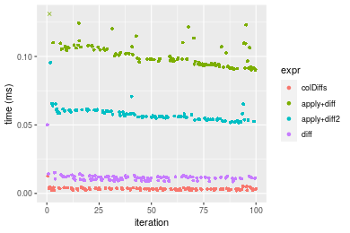

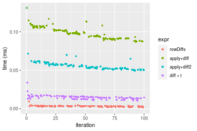
_Table: Benchmarking of colDiffs() and rowDiffs() on double+10x10 data (original and transposed).  The top panel shows times in milliseconds and the bottom panel shows relative times._


|   |expr     |   min|     lq|    mean| median|     uq|    max|
|:--|:--------|-----:|------:|-------:|------:|------:|------:|
|2  |rowDiffs | 1.881| 2.6795| 3.19118| 3.2365| 3.5175|  9.450|
|1  |colDiffs | 2.080| 2.6625| 3.32887| 3.2840| 3.6695| 12.743|


|   |expr     |      min|        lq|     mean|   median|       uq|      max|
|:--|:--------|--------:|---------:|--------:|--------:|--------:|--------:|
|2  |rowDiffs | 1.000000| 1.0000000| 1.000000| 1.000000| 1.000000| 1.000000|
|1  |colDiffs | 1.105795| 0.9936555| 1.043147| 1.014676| 1.043213| 1.348466|

_Figure: Benchmarking of colDiffs() and rowDiffs() on double+10x10 data (original and transposed).  Outliers are displayed as crosses. Times are in milliseconds._


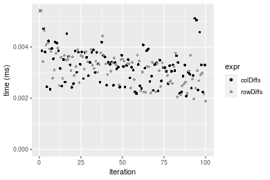

#### 100x100 double matrix


```r
> X <- data[["100x100"]]
> gc()
          used  (Mb) gc trigger  (Mb) max used  (Mb)
Ncells 5212870 278.4    8529671 455.6  8529671 455.6
Vcells 9689820  74.0   31876688 243.2 60562128 462.1
> colStats <- microbenchmark(colDiffs = colDiffs(X), `apply+diff` = apply(X, MARGIN = 2L, FUN = diff), 
+     `apply+diff2` = apply(X, MARGIN = 2L, FUN = diff2), diff = diff(X), unit = "ms")
> X <- t(X)
> gc()
          used  (Mb) gc trigger  (Mb) max used  (Mb)
Ncells 5212846 278.4    8529671 455.6  8529671 455.6
Vcells 9699833  74.1   31876688 243.2 60562128 462.1
> rowStats <- microbenchmark(rowDiffs = rowDiffs(X), `apply+diff` = apply(X, MARGIN = 1L, FUN = diff), 
+     `apply+diff2` = apply(X, MARGIN = 1L, FUN = diff2), `diff + t` = diff(t(X)), unit = "ms")
```

_Table: Benchmarking of colDiffs(), apply+diff(), apply+diff2() and diff() on double+100x100 data. The top panel shows times in milliseconds and the bottom panel shows relative times._


|   |expr        |      min|        lq|      mean|    median|        uq|      max|
|:--|:-----------|--------:|---------:|---------:|---------:|---------:|--------:|
|1  |colDiffs    | 0.023100| 0.0249275| 0.0273628| 0.0259930| 0.0283365| 0.045033|
|4  |diff        | 0.051161| 0.0545710| 0.0622083| 0.0577905| 0.0668045| 0.128612|
|3  |apply+diff2 | 0.276821| 0.2903645| 0.3266575| 0.3081505| 0.3526620| 0.574421|
|2  |apply+diff  | 0.627511| 0.6541060| 0.7320162| 0.6972865| 0.7858250| 1.221230|


|   |expr        |       min|        lq|     mean|   median|        uq|      max|
|:--|:-----------|---------:|---------:|--------:|--------:|---------:|--------:|
|1  |colDiffs    |  1.000000|  1.000000|  1.00000|  1.00000|  1.000000|  1.00000|
|4  |diff        |  2.214762|  2.189189|  2.27346|  2.22331|  2.357542|  2.85595|
|3  |apply+diff2 | 11.983593| 11.648360| 11.93800| 11.85513| 12.445503| 12.75556|
|2  |apply+diff  | 27.164978| 26.240337| 26.75221| 26.82593| 27.731901| 27.11856|

_Table: Benchmarking of rowDiffs(), apply+diff(), apply+diff2() and diff + t() on double+100x100 data (transposed). The top panel shows times in milliseconds and the bottom panel shows relative times._


|   |expr        |      min|        lq|      mean|    median|        uq|      max|
|:--|:-----------|--------:|---------:|---------:|---------:|---------:|--------:|
|1  |rowDiffs    | 0.028255| 0.0307465| 0.0346609| 0.0333050| 0.0375870| 0.054360|
|4  |diff + t    | 0.068153| 0.0724020| 0.0798607| 0.0758350| 0.0845270| 0.125395|
|3  |apply+diff2 | 0.285219| 0.2982425| 0.3285841| 0.3114945| 0.3449940| 0.491718|
|2  |apply+diff  | 0.645122| 0.6712770| 0.7397274| 0.6928275| 0.7856995| 1.297721|


|   |expr        |       min|        lq|      mean|    median|        uq|       max|
|:--|:-----------|---------:|---------:|---------:|---------:|---------:|---------:|
|1  |rowDiffs    |  1.000000|  1.000000|  1.000000|  1.000000|  1.000000|  1.000000|
|4  |diff + t    |  2.412069|  2.354805|  2.304057|  2.276985|  2.248836|  2.306751|
|3  |apply+diff2 | 10.094461|  9.700047|  9.479962|  9.352785|  9.178546|  9.045585|
|2  |apply+diff  | 22.832136| 21.832631| 21.341833| 20.802507| 20.903491| 23.872719|

_Figure: Benchmarking of colDiffs(), apply+diff(), apply+diff2() and diff() on double+100x100 data  as well as rowDiffs(), apply+diff(), apply+diff2() and diff + t() on the same data transposed.  Outliers are displayed as crosses.  Times are in milliseconds._


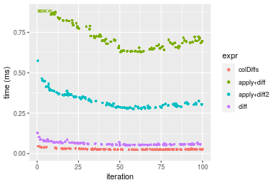

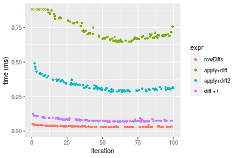
_Table: Benchmarking of colDiffs() and rowDiffs() on double+100x100 data (original and transposed).  The top panel shows times in milliseconds and the bottom panel shows relative times._


|   |expr     |    min|      lq|     mean| median|      uq|    max|
|:--|:--------|------:|-------:|--------:|------:|-------:|------:|
|1  |colDiffs | 23.100| 24.9275| 27.36283| 25.993| 28.3365| 45.033|
|2  |rowDiffs | 28.255| 30.7465| 34.66091| 33.305| 37.5870| 54.360|


|   |expr     |     min|       lq|     mean|   median|       uq|      max|
|:--|:--------|-------:|--------:|--------:|--------:|--------:|--------:|
|1  |colDiffs | 1.00000| 1.000000| 1.000000| 1.000000| 1.000000| 1.000000|
|2  |rowDiffs | 1.22316| 1.233437| 1.266715| 1.281306| 1.326452| 1.207115|

_Figure: Benchmarking of colDiffs() and rowDiffs() on double+100x100 data (original and transposed).  Outliers are displayed as crosses. Times are in milliseconds._


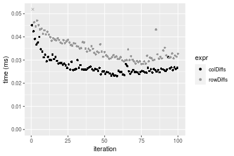

#### 1000x10 double matrix


```r
> X <- data[["1000x10"]]
> gc()
          used  (Mb) gc trigger  (Mb) max used  (Mb)
Ncells 5213076 278.5    8529671 455.6  8529671 455.6
Vcells 9690852  74.0   31876688 243.2 60562128 462.1
> colStats <- microbenchmark(colDiffs = colDiffs(X), `apply+diff` = apply(X, MARGIN = 2L, FUN = diff), 
+     `apply+diff2` = apply(X, MARGIN = 2L, FUN = diff2), diff = diff(X), unit = "ms")
> X <- t(X)
> gc()
          used  (Mb) gc trigger  (Mb) max used  (Mb)
Ncells 5213070 278.5    8529671 455.6  8529671 455.6
Vcells 9700895  74.1   31876688 243.2 60562128 462.1
> rowStats <- microbenchmark(rowDiffs = rowDiffs(X), `apply+diff` = apply(X, MARGIN = 1L, FUN = diff), 
+     `apply+diff2` = apply(X, MARGIN = 1L, FUN = diff2), `diff + t` = diff(t(X)), unit = "ms")
```

_Table: Benchmarking of colDiffs(), apply+diff(), apply+diff2() and diff() on double+1000x10 data. The top panel shows times in milliseconds and the bottom panel shows relative times._


|   |expr        |      min|        lq|      mean|    median|       uq|      max|
|:--|:-----------|--------:|---------:|---------:|---------:|--------:|--------:|
|1  |colDiffs    | 0.023613| 0.0268990| 0.0302743| 0.0293400| 0.034039| 0.042942|
|4  |diff        | 0.055417| 0.0600370| 0.0683621| 0.0666035| 0.071845| 0.137372|
|3  |apply+diff2 | 0.131302| 0.1448125| 0.1641396| 0.1611825| 0.171947| 0.287777|
|2  |apply+diff  | 0.206308| 0.2217895| 0.2566725| 0.2560955| 0.278098| 0.360161|


|   |expr        |      min|       lq|     mean|   median|       uq|      max|
|:--|:-----------|--------:|--------:|--------:|--------:|--------:|--------:|
|1  |colDiffs    | 1.000000| 1.000000| 1.000000| 1.000000| 1.000000| 1.000000|
|4  |diff        | 2.346885| 2.231942| 2.258087| 2.270058| 2.110667| 3.199013|
|3  |apply+diff2 | 5.560581| 5.383564| 5.421738| 5.493609| 5.051470| 6.701528|
|2  |apply+diff  | 8.737052| 8.245269| 8.478219| 8.728545| 8.169982| 8.387150|

_Table: Benchmarking of rowDiffs(), apply+diff(), apply+diff2() and diff + t() on double+1000x10 data (transposed). The top panel shows times in milliseconds and the bottom panel shows relative times._


|   |expr        |      min|        lq|      mean|    median|        uq|      max|
|:--|:-----------|--------:|---------:|---------:|---------:|---------:|--------:|
|1  |rowDiffs    | 0.030439| 0.0333965| 0.0370461| 0.0362580| 0.0397695| 0.057650|
|4  |diff + t    | 0.070721| 0.0791585| 0.0890181| 0.0856025| 0.0956845| 0.184646|
|3  |apply+diff2 | 0.128627| 0.1424815| 0.1609605| 0.1564495| 0.1709555| 0.269732|
|2  |apply+diff  | 0.203164| 0.2225625| 0.2577868| 0.2579720| 0.2822365| 0.355501|


|   |expr        |      min|       lq|     mean|   median|       uq|      max|
|:--|:-----------|--------:|--------:|--------:|--------:|--------:|--------:|
|1  |rowDiffs    | 1.000000| 1.000000| 1.000000| 1.000000| 1.000000| 1.000000|
|4  |diff + t    | 2.323368| 2.370263| 2.402903| 2.360927| 2.405977| 3.202879|
|3  |apply+diff2 | 4.225730| 4.266360| 4.344873| 4.314896| 4.298659| 4.678786|
|2  |apply+diff  | 6.674464| 6.664246| 6.958543| 7.114899| 7.096808| 6.166539|

_Figure: Benchmarking of colDiffs(), apply+diff(), apply+diff2() and diff() on double+1000x10 data  as well as rowDiffs(), apply+diff(), apply+diff2() and diff + t() on the same data transposed.  Outliers are displayed as crosses.  Times are in milliseconds._


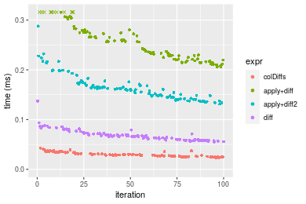

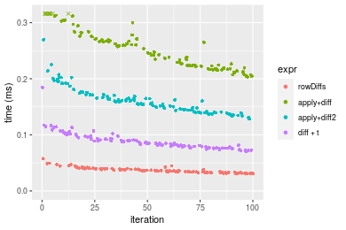
_Table: Benchmarking of colDiffs() and rowDiffs() on double+1000x10 data (original and transposed).  The top panel shows times in milliseconds and the bottom panel shows relative times._


|   |expr     |    min|      lq|     mean| median|      uq|    max|
|:--|:--------|------:|-------:|--------:|------:|-------:|------:|
|1  |colDiffs | 23.613| 26.8990| 30.27434| 29.340| 34.0390| 42.942|
|2  |rowDiffs | 30.439| 33.3965| 37.04608| 36.258| 39.7695| 57.650|


|   |expr     |      min|       lq|     mean|   median|       uq|      max|
|:--|:--------|--------:|--------:|--------:|--------:|--------:|--------:|
|1  |colDiffs | 1.000000| 1.000000| 1.000000| 1.000000| 1.000000| 1.000000|
|2  |rowDiffs | 1.289078| 1.241552| 1.223679| 1.235787| 1.168351| 1.342509|

_Figure: Benchmarking of colDiffs() and rowDiffs() on double+1000x10 data (original and transposed).  Outliers are displayed as crosses. Times are in milliseconds._


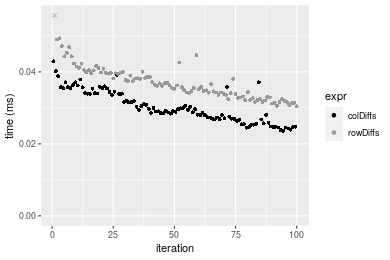

#### 10x1000 double matrix


```r
> X <- data[["10x1000"]]
> gc()
          used  (Mb) gc trigger  (Mb) max used  (Mb)
Ncells 5213316 278.5    8529671 455.6  8529671 455.6
Vcells 9692122  74.0   31876688 243.2 60562128 462.1
> colStats <- microbenchmark(colDiffs = colDiffs(X), `apply+diff` = apply(X, MARGIN = 2L, FUN = diff), 
+     `apply+diff2` = apply(X, MARGIN = 2L, FUN = diff2), diff = diff(X), unit = "ms")
> X <- t(X)
> gc()
          used  (Mb) gc trigger  (Mb) max used  (Mb)
Ncells 5213292 278.5    8529671 455.6  8529671 455.6
Vcells 9702135  74.1   31876688 243.2 60562128 462.1
> rowStats <- microbenchmark(rowDiffs = rowDiffs(X), `apply+diff` = apply(X, MARGIN = 1L, FUN = diff), 
+     `apply+diff2` = apply(X, MARGIN = 1L, FUN = diff2), `diff + t` = diff(t(X)), unit = "ms")
```

_Table: Benchmarking of colDiffs(), apply+diff(), apply+diff2() and diff() on double+10x1000 data. The top panel shows times in milliseconds and the bottom panel shows relative times._


|   |expr        |      min|        lq|      mean|    median|        uq|       max|
|:--|:-----------|--------:|---------:|---------:|---------:|---------:|---------:|
|1  |colDiffs    | 0.024531| 0.0267080| 0.0294914| 0.0283005| 0.0312220|  0.056440|
|4  |diff        | 0.054032| 0.0588175| 0.0640694| 0.0623700| 0.0657035|  0.117145|
|3  |apply+diff2 | 1.821629| 2.0057890| 2.0758672| 2.0595995| 2.1228035|  2.777601|
|2  |apply+diff  | 4.818522| 5.2300530| 5.5687312| 5.4151435| 5.6377065| 10.713772|


|   |expr        |        min|         lq|       mean|     median|         uq|        max|
|:--|:-----------|----------:|----------:|----------:|----------:|----------:|----------:|
|1  |colDiffs    |   1.000000|   1.000000|   1.000000|   1.000000|   1.000000|   1.000000|
|4  |diff        |   2.202601|   2.202243|   2.172475|   2.203848|   2.104398|   2.075567|
|3  |apply+diff2 |  74.258245|  75.100681|  70.388853|  72.776082|  67.990632|  49.213342|
|2  |apply+diff  | 196.425828| 195.823461| 188.825468| 191.344446| 180.568397| 189.825868|

_Table: Benchmarking of rowDiffs(), apply+diff(), apply+diff2() and diff + t() on double+10x1000 data (transposed). The top panel shows times in milliseconds and the bottom panel shows relative times._


|   |expr        |      min|        lq|      mean|    median|        uq|       max|
|:--|:-----------|--------:|---------:|---------:|---------:|---------:|---------:|
|1  |rowDiffs    | 0.027112| 0.0289850| 0.0313485| 0.0299175| 0.0324550|  0.058580|
|4  |diff + t    | 0.071328| 0.0781565| 0.0849833| 0.0835660| 0.0877535|  0.125718|
|3  |apply+diff2 | 1.803224| 1.9961200| 2.1511537| 2.0514605| 2.1154205|  7.177878|
|2  |apply+diff  | 4.844920| 5.2544145| 5.4940539| 5.4185500| 5.6013575| 10.422620|


|   |expr        |        min|         lq|      mean|     median|         uq|        max|
|:--|:-----------|----------:|----------:|---------:|----------:|----------:|----------:|
|1  |rowDiffs    |   1.000000|   1.000000|   1.00000|   1.000000|   1.000000|   1.000000|
|4  |diff + t    |   2.630865|   2.696446|   2.71092|   2.793215|   2.703851|   2.146091|
|3  |apply+diff2 |  66.510180|  68.867345|  68.62060|  68.570586|  65.180111| 122.531205|
|2  |apply+diff  | 178.700207| 181.280473| 175.25726| 181.116403| 172.588430| 177.921133|

_Figure: Benchmarking of colDiffs(), apply+diff(), apply+diff2() and diff() on double+10x1000 data  as well as rowDiffs(), apply+diff(), apply+diff2() and diff + t() on the same data transposed.  Outliers are displayed as crosses.  Times are in milliseconds._


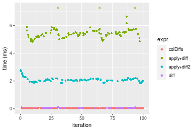

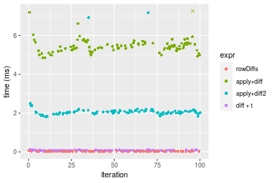
_Table: Benchmarking of colDiffs() and rowDiffs() on double+10x1000 data (original and transposed).  The top panel shows times in milliseconds and the bottom panel shows relative times._


|   |expr     |    min|     lq|     mean|  median|     uq|   max|
|:--|:--------|------:|------:|--------:|-------:|------:|-----:|
|1  |colDiffs | 24.531| 26.708| 29.49142| 28.3005| 31.222| 56.44|
|2  |rowDiffs | 27.112| 28.985| 31.34851| 29.9175| 32.455| 58.58|


|   |expr     |      min|       lq|     mean|   median|       uq|      max|
|:--|:--------|--------:|--------:|--------:|--------:|--------:|--------:|
|1  |colDiffs | 1.000000| 1.000000| 1.000000| 1.000000| 1.000000| 1.000000|
|2  |rowDiffs | 1.105214| 1.085255| 1.062971| 1.057137| 1.039491| 1.037916|

_Figure: Benchmarking of colDiffs() and rowDiffs() on double+10x1000 data (original and transposed).  Outliers are displayed as crosses. Times are in milliseconds._


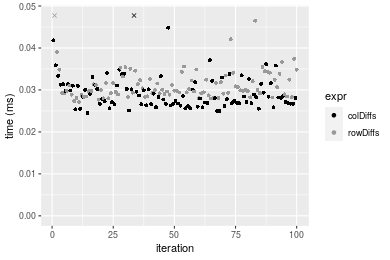

#### 100x1000 double matrix


```r
> X <- data[["100x1000"]]
> gc()
          used  (Mb) gc trigger  (Mb) max used  (Mb)
Ncells 5213528 278.5    8529671 455.6  8529671 455.6
Vcells 9692247  74.0   31876688 243.2 60562128 462.1
> colStats <- microbenchmark(colDiffs = colDiffs(X), `apply+diff` = apply(X, MARGIN = 2L, FUN = diff), 
+     `apply+diff2` = apply(X, MARGIN = 2L, FUN = diff2), diff = diff(X), unit = "ms")
> X <- t(X)
> gc()
          used  (Mb) gc trigger  (Mb) max used  (Mb)
Ncells 5213522 278.5    8529671 455.6  8529671 455.6
Vcells 9792290  74.8   31876688 243.2 60562128 462.1
> rowStats <- microbenchmark(rowDiffs = rowDiffs(X), `apply+diff` = apply(X, MARGIN = 1L, FUN = diff), 
+     `apply+diff2` = apply(X, MARGIN = 1L, FUN = diff2), `diff + t` = diff(t(X)), unit = "ms")
```

_Table: Benchmarking of colDiffs(), apply+diff(), apply+diff2() and diff() on double+100x1000 data. The top panel shows times in milliseconds and the bottom panel shows relative times._


|   |expr        |      min|        lq|      mean|    median|        uq|      max|
|:--|:-----------|--------:|---------:|---------:|---------:|---------:|--------:|
|1  |colDiffs    | 0.215833| 0.2410510| 0.4041848| 0.2538330| 0.2675530| 15.18175|
|4  |diff        | 0.489540| 0.5349305| 0.7167858| 0.5606355| 0.5856455| 15.57865|
|3  |apply+diff2 | 2.646576| 2.8985810| 3.2437154| 3.0101815| 3.1981280| 19.16186|
|2  |apply+diff  | 6.129846| 6.7155305| 7.8910013| 6.9547935| 7.3323635| 24.16777|


|   |expr        |       min|        lq|      mean|    median|        uq|      max|
|:--|:-----------|---------:|---------:|---------:|---------:|---------:|--------:|
|1  |colDiffs    |  1.000000|  1.000000|  1.000000|  1.000000|  1.000000| 1.000000|
|4  |diff        |  2.268143|  2.219159|  1.773411|  2.208678|  2.188895| 1.026143|
|3  |apply+diff2 | 12.262147| 12.024762|  8.025328| 11.858905| 11.953250| 1.262164|
|2  |apply+diff  | 28.400875| 27.859376| 19.523253| 27.399091| 27.405275| 1.591896|

_Table: Benchmarking of rowDiffs(), apply+diff(), apply+diff2() and diff + t() on double+100x1000 data (transposed). The top panel shows times in milliseconds and the bottom panel shows relative times._


|   |expr        |      min|       lq|      mean|    median|        uq|       max|
|:--|:-----------|--------:|--------:|---------:|---------:|---------:|---------:|
|1  |rowDiffs    | 0.265864| 0.291026| 0.3117314| 0.3055070| 0.3185970|  0.412818|
|4  |diff + t    | 0.636402| 0.712100| 0.7476812| 0.7408175| 0.7808475|  1.034439|
|3  |apply+diff2 | 2.745435| 2.978209| 3.5760799| 3.0764305| 3.3085420| 18.899369|
|2  |apply+diff  | 6.243330| 6.754134| 7.8876042| 7.0142665| 7.2528700| 23.494539|


|   |expr        |       min|       lq|      mean|    median|        uq|       max|
|:--|:-----------|---------:|--------:|---------:|---------:|---------:|---------:|
|1  |rowDiffs    |  1.000000|  1.00000|  1.000000|  1.000000|  1.000000|  1.000000|
|4  |diff + t    |  2.393713|  2.44686|  2.398479|  2.424879|  2.450894|  2.505799|
|3  |apply+diff2 | 10.326464| 10.23348| 11.471671| 10.069918| 10.384724| 45.781359|
|2  |apply+diff  | 23.483172| 23.20801| 25.302567| 22.959430| 22.765029| 56.912584|

_Figure: Benchmarking of colDiffs(), apply+diff(), apply+diff2() and diff() on double+100x1000 data  as well as rowDiffs(), apply+diff(), apply+diff2() and diff + t() on the same data transposed.  Outliers are displayed as crosses.  Times are in milliseconds._


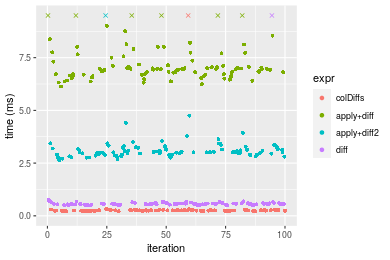

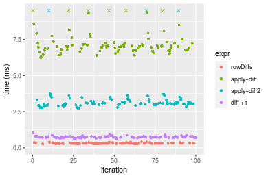
_Table: Benchmarking of colDiffs() and rowDiffs() on double+100x1000 data (original and transposed).  The top panel shows times in milliseconds and the bottom panel shows relative times._


|   |expr     |     min|      lq|     mean|  median|      uq|       max|
|:--|:--------|-------:|-------:|--------:|-------:|-------:|---------:|
|1  |colDiffs | 215.833| 241.051| 404.1848| 253.833| 267.553| 15181.753|
|2  |rowDiffs | 265.864| 291.026| 311.7314| 305.507| 318.597|   412.818|


|   |expr     |      min|       lq|      mean|   median|       uq|       max|
|:--|:--------|--------:|--------:|---------:|--------:|--------:|---------:|
|1  |colDiffs | 1.000000| 1.000000| 1.0000000| 1.000000| 1.000000| 1.0000000|
|2  |rowDiffs | 1.231804| 1.207321| 0.7712596| 1.203575| 1.190781| 0.0271917|

_Figure: Benchmarking of colDiffs() and rowDiffs() on double+100x1000 data (original and transposed).  Outliers are displayed as crosses. Times are in milliseconds._


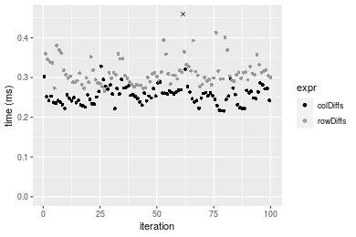

#### 1000x100 double matrix


```r
> X <- data[["1000x100"]]
> gc()
          used  (Mb) gc trigger  (Mb) max used  (Mb)
Ncells 5213764 278.5    8529671 455.6  8529671 455.6
Vcells 9693731  74.0   31876688 243.2 60562128 462.1
> colStats <- microbenchmark(colDiffs = colDiffs(X), `apply+diff` = apply(X, MARGIN = 2L, FUN = diff), 
+     `apply+diff2` = apply(X, MARGIN = 2L, FUN = diff2), diff = diff(X), unit = "ms")
> X <- t(X)
> gc()
          used  (Mb) gc trigger  (Mb) max used  (Mb)
Ncells 5213746 278.5    8529671 455.6  8529671 455.6
Vcells 9793754  74.8   31876688 243.2 60562128 462.1
> rowStats <- microbenchmark(rowDiffs = rowDiffs(X), `apply+diff` = apply(X, MARGIN = 1L, FUN = diff), 
+     `apply+diff2` = apply(X, MARGIN = 1L, FUN = diff2), `diff + t` = diff(t(X)), unit = "ms")
```

_Table: Benchmarking of colDiffs(), apply+diff(), apply+diff2() and diff() on double+1000x100 data. The top panel shows times in milliseconds and the bottom panel shows relative times._


|   |expr        |      min|        lq|      mean|    median|        uq|      max|
|:--|:-----------|--------:|---------:|---------:|---------:|---------:|--------:|
|1  |colDiffs    | 0.219531| 0.2375990| 0.2522123| 0.2491625| 0.2655255| 0.353970|
|4  |diff        | 0.478195| 0.5247625| 0.6945688| 0.5581735| 0.5891675| 7.334720|
|3  |apply+diff2 | 1.076347| 1.1491805| 1.2472880| 1.2362115| 1.3243010| 1.573288|
|2  |apply+diff  | 1.827761| 1.9305060| 2.5260755| 2.1793120| 2.3262090| 8.918474|


|   |expr        |      min|       lq|      mean|   median|       uq|       max|
|:--|:-----------|--------:|--------:|---------:|--------:|--------:|---------:|
|1  |colDiffs    | 1.000000| 1.000000|  1.000000| 1.000000| 1.000000|  1.000000|
|4  |diff        | 2.178257| 2.208606|  2.753905| 2.240199| 2.218873| 20.721304|
|3  |apply+diff2 | 4.902939| 4.836639|  4.945389| 4.961467| 4.987472|  4.444693|
|2  |apply+diff  | 8.325753| 8.125059| 10.015671| 8.746549| 8.760774| 25.195565|

_Table: Benchmarking of rowDiffs(), apply+diff(), apply+diff2() and diff + t() on double+1000x100 data (transposed). The top panel shows times in milliseconds and the bottom panel shows relative times._


|   |expr        |      min|        lq|      mean|    median|        uq|      max|
|:--|:-----------|--------:|---------:|---------:|---------:|---------:|--------:|
|1  |rowDiffs    | 0.272925| 0.2934385| 0.3149624| 0.3074485| 0.3376200| 0.401050|
|4  |diff + t    | 0.611892| 0.6760500| 0.8569438| 0.7228820| 0.7589485| 7.506957|
|3  |apply+diff2 | 1.085350| 1.1983680| 1.4240821| 1.2975220| 1.3898940| 7.975555|
|2  |apply+diff  | 1.823827| 1.9672945| 2.4480114| 2.1906855| 2.3622570| 9.479181|


|   |expr        |      min|       lq|     mean|   median|       uq|      max|
|:--|:-----------|--------:|--------:|--------:|--------:|--------:|--------:|
|1  |rowDiffs    | 1.000000| 1.000000| 1.000000| 1.000000| 1.000000|  1.00000|
|4  |diff + t    | 2.241979| 2.303890| 2.720781| 2.351230| 2.247937| 18.71826|
|3  |apply+diff2 | 3.976733| 4.083881| 4.521435| 4.220291| 4.116741| 19.88668|
|2  |apply+diff  | 6.682521| 6.704282| 7.772393| 7.125374| 6.996792| 23.63591|

_Figure: Benchmarking of colDiffs(), apply+diff(), apply+diff2() and diff() on double+1000x100 data  as well as rowDiffs(), apply+diff(), apply+diff2() and diff + t() on the same data transposed.  Outliers are displayed as crosses.  Times are in milliseconds._


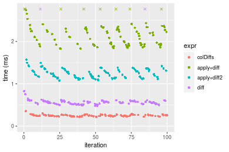

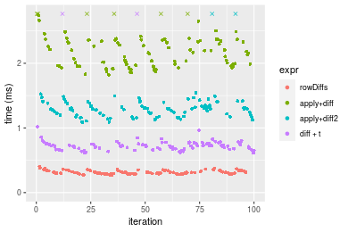
_Table: Benchmarking of colDiffs() and rowDiffs() on double+1000x100 data (original and transposed).  The top panel shows times in milliseconds and the bottom panel shows relative times._


|   |expr     |     min|       lq|     mean|   median|       uq|    max|
|:--|:--------|-------:|--------:|--------:|--------:|--------:|------:|
|1  |colDiffs | 219.531| 237.5990| 252.2123| 249.1625| 265.5255| 353.97|
|2  |rowDiffs | 272.925| 293.4385| 314.9624| 307.4485| 337.6200| 401.05|


|   |expr     |      min|       lq|     mean|   median|       uq|      max|
|:--|:--------|--------:|--------:|--------:|--------:|--------:|--------:|
|1  |colDiffs | 1.000000| 1.000000| 1.000000| 1.000000| 1.000000| 1.000000|
|2  |rowDiffs | 1.243219| 1.235016| 1.248799| 1.233928| 1.271516| 1.133006|

_Figure: Benchmarking of colDiffs() and rowDiffs() on double+1000x100 data (original and transposed).  Outliers are displayed as crosses. Times are in milliseconds._


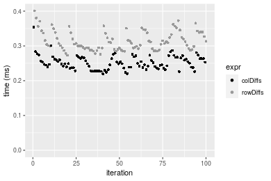


## Appendix

### Session information
```r
R version 4.1.1 Patched (2021-08-10 r80727)
Platform: x86_64-pc-linux-gnu (64-bit)
Running under: Ubuntu 18.04.5 LTS

Matrix products: default
BLAS:   /home/hb/software/R-devel/R-4-1-branch/lib/R/lib/libRblas.so
LAPACK: /home/hb/software/R-devel/R-4-1-branch/lib/R/lib/libRlapack.so

locale:
 [1] LC_CTYPE=en_US.UTF-8       LC_NUMERIC=C              
 [3] LC_TIME=en_US.UTF-8        LC_COLLATE=en_US.UTF-8    
 [5] LC_MONETARY=en_US.UTF-8    LC_MESSAGES=en_US.UTF-8   
 [7] LC_PAPER=en_US.UTF-8       LC_NAME=C                 
 [9] LC_ADDRESS=C               LC_TELEPHONE=C            
[11] LC_MEASUREMENT=en_US.UTF-8 LC_IDENTIFICATION=C       

attached base packages:
[1] stats     graphics  grDevices utils     datasets  methods   base     

other attached packages:
[1] microbenchmark_1.4-7   matrixStats_0.60.1     ggplot2_3.3.5         
[4] knitr_1.33             R.devices_2.17.0       R.utils_2.10.1        
[7] R.oo_1.24.0            R.methodsS3_1.8.1-9001 history_0.0.1-9000    

loaded via a namespace (and not attached):
 [1] Biobase_2.52.0          httr_1.4.2              splines_4.1.1          
 [4] bit64_4.0.5             network_1.17.1          assertthat_0.2.1       
 [7] highr_0.9               stats4_4.1.1            blob_1.2.2             
[10] GenomeInfoDbData_1.2.6  robustbase_0.93-8       pillar_1.6.2           
[13] RSQLite_2.2.8           lattice_0.20-44         glue_1.4.2             
[16] digest_0.6.27           XVector_0.32.0          colorspace_2.0-2       
[19] Matrix_1.3-4            XML_3.99-0.7            pkgconfig_2.0.3        
[22] zlibbioc_1.38.0         genefilter_1.74.0       purrr_0.3.4            
[25] ergm_4.1.2              xtable_1.8-4            scales_1.1.1           
[28] tibble_3.1.4            annotate_1.70.0         KEGGREST_1.32.0        
[31] farver_2.1.0            generics_0.1.0          IRanges_2.26.0         
[34] ellipsis_0.3.2          cachem_1.0.6            withr_2.4.2            
[37] BiocGenerics_0.38.0     mime_0.11               survival_3.2-13        
[40] magrittr_2.0.1          crayon_1.4.1            statnet.common_4.5.0   
[43] memoise_2.0.0           laeken_0.5.1            fansi_0.5.0            
[46] R.cache_0.15.0          MASS_7.3-54             R.rsp_0.44.0           
[49] progressr_0.8.0         tools_4.1.1             lifecycle_1.0.0        
[52] S4Vectors_0.30.0        trust_0.1-8             munsell_0.5.0          
[55] tabby_0.0.1-9001        AnnotationDbi_1.54.1    Biostrings_2.60.2      
[58] compiler_4.1.1          GenomeInfoDb_1.28.1     rlang_0.4.11           
[61] grid_4.1.1              RCurl_1.98-1.4          cwhmisc_6.6            
[64] rappdirs_0.3.3          startup_0.15.0          labeling_0.4.2         
[67] bitops_1.0-7            base64enc_0.1-3         boot_1.3-28            
[70] gtable_0.3.0            DBI_1.1.1               markdown_1.1           
[73] R6_2.5.1                lpSolveAPI_5.5.2.0-17.7 rle_0.9.2              
[76] dplyr_1.0.7             fastmap_1.1.0           bit_4.0.4              
[79] utf8_1.2.2              parallel_4.1.1          Rcpp_1.0.7             
[82] vctrs_0.3.8             png_0.1-7               DEoptimR_1.0-9         
[85] tidyselect_1.1.1        xfun_0.25               coda_0.19-4            
```
Total processing time was 32.79 secs.


### Reproducibility
To reproduce this report, do:
```r
html <- matrixStats:::benchmark('colDiffs')
```

[RSP]: https://cran.r-project.org/package=R.rsp
[matrixStats]: https://cran.r-project.org/package=matrixStats

[StackOverflow:colMins?]: https://stackoverflow.com/questions/13676878 "Stack Overflow: fastest way to get Min from every column in a matrix?"
[StackOverflow:colSds?]: https://stackoverflow.com/questions/17549762 "Stack Overflow: Is there such 'colsd' in R?"
[StackOverflow:rowProds?]: https://stackoverflow.com/questions/20198801/ "Stack Overflow: Row product of matrix and column sum of matrix"

---------------------------------------
Copyright Henrik Bengtsson. Last updated on 2021-08-25 18:55:42 (+0200 UTC). Powered by [RSP].

<script>
 var link = document.createElement('link');
 link.rel = 'icon';
 link.href = "data:image/png;base64,iVBORw0KGgoAAAANSUhEUgAAACAAAAAgCAMAAABEpIrGAAAA21BMVEUAAAAAAP8AAP8AAP8AAP8AAP8AAP8AAP8AAP8AAP8AAP8AAP8AAP8AAP8AAP8AAP8AAP8AAP8AAP8AAP8AAP8AAP8AAP8AAP8AAP8AAP8AAP8AAP8AAP8AAP8AAP8AAP8AAP8AAP8AAP8AAP8AAP8AAP8AAP8AAP8AAP8AAP8BAf4CAv0DA/wdHeIeHuEfH+AgIN8hId4lJdomJtknJ9g+PsE/P8BAQL9yco10dIt1dYp3d4h4eIeVlWqWlmmXl2iYmGeZmWabm2Tn5xjo6Bfp6Rb39wj4+Af//wA2M9hbAAAASXRSTlMAAQIJCgsMJSYnKD4/QGRlZmhpamtsbautrrCxuru8y8zN5ebn6Pn6+///////////////////////////////////////////LsUNcQAAAS9JREFUOI29k21XgkAQhVcFytdSMqMETU26UVqGmpaiFbL//xc1cAhhwVNf6n5i5z67M2dmYOyfJZUqlVLhkKucG7cgmUZTybDz6g0iDeq51PUr37Ds2cy2/C9NeES5puDjxuUk1xnToZsg8pfA3avHQ3lLIi7iWRrkv/OYtkScxBIMgDee0ALoyxHQBJ68JLCjOtQIMIANF7QG9G9fNnHvisCHBVMKgSJgiz7nE+AoBKrAPA3MgepvgR9TSCasrCKH0eB1wBGBFdCO+nAGjMVGPcQb5bd6mQRegN6+1axOs9nGfYcCtfi4NQosdtH7dB+txFIpXQqN1p9B/asRHToyS0jRgpV7nk4nwcq1BJ+x3Gl/v7S9Wmpp/aGquum7w3ZDyrADFYrl8vHBH+ev9AUASW1dmU4h4wAAAABJRU5ErkJggg=="
 document.getElementsByTagName('head')[0].appendChild(link);
</script>


