[matrixStats]: Benchmark report

---------------------------------------


# colDiffs() and rowDiffs() benchmarks on subsetted computation

This report benchmark the performance of colDiffs() and rowDiffs() on subsetted computation.


## Data type "integer"

### Data
```r
> rmatrix <- function(nrow, ncol, mode = c("logical", "double", "integer", "index"), range = c(-100, 
+     +100), na_prob = 0) {
+     mode <- match.arg(mode)
+     n <- nrow * ncol
+     if (mode == "logical") {
+         x <- sample(c(FALSE, TRUE), size = n, replace = TRUE)
+     }     else if (mode == "index") {
+         x <- seq_len(n)
+         mode <- "integer"
+     }     else {
+         x <- runif(n, min = range[1], max = range[2])
+     }
+     storage.mode(x) <- mode
+     if (na_prob > 0) 
+         x[sample(n, size = na_prob * n)] <- NA
+     dim(x) <- c(nrow, ncol)
+     x
+ }
> rmatrices <- function(scale = 10, seed = 1, ...) {
+     set.seed(seed)
+     data <- list()
+     data[[1]] <- rmatrix(nrow = scale * 1, ncol = scale * 1, ...)
+     data[[2]] <- rmatrix(nrow = scale * 10, ncol = scale * 10, ...)
+     data[[3]] <- rmatrix(nrow = scale * 100, ncol = scale * 1, ...)
+     data[[4]] <- t(data[[3]])
+     data[[5]] <- rmatrix(nrow = scale * 10, ncol = scale * 100, ...)
+     data[[6]] <- t(data[[5]])
+     names(data) <- sapply(data, FUN = function(x) paste(dim(x), collapse = "x"))
+     data
+ }
> data <- rmatrices(mode = mode)
```

### Results

#### 10x10 integer matrix


```r
> X <- data[["10x10"]]
> rows <- sample.int(nrow(X), size = nrow(X) * 0.7)
> cols <- sample.int(ncol(X), size = ncol(X) * 0.7)
> X_S <- X[rows, cols]
> gc()
          used  (Mb) gc trigger  (Mb) max used  (Mb)
Ncells 5216753 278.7    8529671 455.6  8529671 455.6
Vcells 9900928  75.6   31876688 243.2 60562128 462.1
> colStats <- microbenchmark(colDiffs_X_S = colDiffs(X_S), `colDiffs(X, rows, cols)` = colDiffs(X, 
+     rows = rows, cols = cols), `colDiffs(X[rows, cols])` = colDiffs(X[rows, cols]), unit = "ms")
> X <- t(X)
> X_S <- t(X_S)
> gc()
          used  (Mb) gc trigger  (Mb) max used  (Mb)
Ncells 5208390 278.2    8529671 455.6  8529671 455.6
Vcells 9873644  75.4   31876688 243.2 60562128 462.1
> rowStats <- microbenchmark(rowDiffs_X_S = rowDiffs(X_S), `rowDiffs(X, cols, rows)` = rowDiffs(X, 
+     rows = cols, cols = rows), `rowDiffs(X[cols, rows])` = rowDiffs(X[cols, rows]), unit = "ms")
```

_Table: Benchmarking of colDiffs_X_S(), colDiffs(X, rows, cols)() and colDiffs(X[rows, cols])() on integer+10x10 data. The top panel shows times in milliseconds and the bottom panel shows relative times._


|   |expr                    |      min|        lq|      mean|    median|        uq|      max|
|:--|:-----------------------|--------:|---------:|---------:|---------:|---------:|--------:|
|1  |colDiffs_X_S            | 0.001853| 0.0020885| 0.0030051| 0.0021650| 0.0022745| 0.081957|
|2  |colDiffs(X, rows, cols) | 0.002282| 0.0025300| 0.0026796| 0.0026200| 0.0027160| 0.005247|
|3  |colDiffs(X[rows, cols]) | 0.002682| 0.0030960| 0.0033030| 0.0032005| 0.0033445| 0.006976|


|   |expr                    |      min|       lq|      mean|   median|       uq|       max|
|:--|:-----------------------|--------:|--------:|---------:|--------:|--------:|---------:|
|1  |colDiffs_X_S            | 1.000000| 1.000000| 1.0000000| 1.000000| 1.000000| 1.0000000|
|2  |colDiffs(X, rows, cols) | 1.231516| 1.211396| 0.8916689| 1.210162| 1.194109| 0.0640214|
|3  |colDiffs(X[rows, cols]) | 1.447383| 1.482404| 1.0991069| 1.478291| 1.470433| 0.0851178|

_Table: Benchmarking of rowDiffs_X_S(), rowDiffs(X, cols, rows)() and rowDiffs(X[cols, rows])() on integer+10x10 data (transposed). The top panel shows times in milliseconds and the bottom panel shows relative times._


|   |expr                    |      min|        lq|      mean|    median|        uq|      max|
|:--|:-----------------------|--------:|---------:|---------:|---------:|---------:|--------:|
|1  |rowDiffs_X_S            | 0.002081| 0.0022595| 0.0024620| 0.0023425| 0.0024795| 0.004759|
|2  |rowDiffs(X, cols, rows) | 0.002440| 0.0026090| 0.0037223| 0.0027035| 0.0028260| 0.087765|
|3  |rowDiffs(X[cols, rows]) | 0.002922| 0.0032600| 0.0034573| 0.0033540| 0.0035450| 0.006753|


|   |expr                    |      min|       lq|     mean|   median|       uq|       max|
|:--|:-----------------------|--------:|--------:|--------:|--------:|--------:|---------:|
|1  |rowDiffs_X_S            | 1.000000| 1.000000| 1.000000| 1.000000| 1.000000|  1.000000|
|2  |rowDiffs(X, cols, rows) | 1.172513| 1.154680| 1.511928| 1.154109| 1.139746| 18.441900|
|3  |rowDiffs(X[cols, rows]) | 1.404133| 1.442797| 1.404293| 1.431804| 1.429724|  1.418996|

_Figure: Benchmarking of colDiffs_X_S(), colDiffs(X, rows, cols)() and colDiffs(X[rows, cols])() on integer+10x10 data  as well as rowDiffs_X_S(), rowDiffs(X, cols, rows)() and rowDiffs(X[cols, rows])() on the same data transposed.  Outliers are displayed as crosses.  Times are in milliseconds._


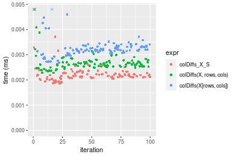

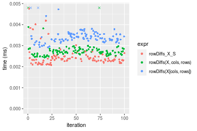
_Table: Benchmarking of colDiffs_X_S() and rowDiffs_X_S() on integer+10x10 data (original and transposed).  The top panel shows times in milliseconds and the bottom panel shows relative times._


|   |expr         |   min|     lq|    mean| median|     uq|    max|
|:--|:------------|-----:|------:|-------:|------:|------:|------:|
|1  |colDiffs_X_S | 1.853| 2.0885| 3.00514| 2.1650| 2.2745| 81.957|
|2  |rowDiffs_X_S | 2.081| 2.2595| 2.46195| 2.3425| 2.4795|  4.759|


|   |expr         |      min|       lq|      mean|   median|      uq|      max|
|:--|:------------|--------:|--------:|---------:|--------:|-------:|--------:|
|1  |colDiffs_X_S | 1.000000| 1.000000| 1.0000000| 1.000000| 1.00000| 1.000000|
|2  |rowDiffs_X_S | 1.123044| 1.081877| 0.8192464| 1.081986| 1.09013| 0.058067|

_Figure: Benchmarking of colDiffs_X_S() and rowDiffs_X_S() on integer+10x10 data (original and transposed).  Outliers are displayed as crosses. Times are in milliseconds._


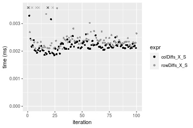

#### 100x100 integer matrix


```r
> X <- data[["100x100"]]
> rows <- sample.int(nrow(X), size = nrow(X) * 0.7)
> cols <- sample.int(ncol(X), size = ncol(X) * 0.7)
> X_S <- X[rows, cols]
> gc()
          used  (Mb) gc trigger  (Mb) max used  (Mb)
Ncells 5207004 278.1    8529671 455.6  8529671 455.6
Vcells 9542513  72.9   31876688 243.2 60562128 462.1
> colStats <- microbenchmark(colDiffs_X_S = colDiffs(X_S), `colDiffs(X, rows, cols)` = colDiffs(X, 
+     rows = rows, cols = cols), `colDiffs(X[rows, cols])` = colDiffs(X[rows, cols]), unit = "ms")
> X <- t(X)
> X_S <- t(X_S)
> gc()
          used  (Mb) gc trigger  (Mb) max used  (Mb)
Ncells 5206980 278.1    8529671 455.6  8529671 455.6
Vcells 9547566  72.9   31876688 243.2 60562128 462.1
> rowStats <- microbenchmark(rowDiffs_X_S = rowDiffs(X_S), `rowDiffs(X, cols, rows)` = rowDiffs(X, 
+     rows = cols, cols = rows), `rowDiffs(X[cols, rows])` = rowDiffs(X[cols, rows]), unit = "ms")
```

_Table: Benchmarking of colDiffs_X_S(), colDiffs(X, rows, cols)() and colDiffs(X[rows, cols])() on integer+100x100 data. The top panel shows times in milliseconds and the bottom panel shows relative times._


|   |expr                    |      min|        lq|      mean|    median|        uq|      max|
|:--|:-----------------------|--------:|---------:|---------:|---------:|---------:|--------:|
|1  |colDiffs_X_S            | 0.016574| 0.0173745| 0.0180267| 0.0179960| 0.0182000| 0.031714|
|2  |colDiffs(X, rows, cols) | 0.020271| 0.0212740| 0.0218350| 0.0218275| 0.0222450| 0.026163|
|3  |colDiffs(X[rows, cols]) | 0.026540| 0.0277900| 0.0289398| 0.0288405| 0.0292585| 0.056312|


|   |expr                    |      min|       lq|     mean|   median|       uq|       max|
|:--|:-----------------------|--------:|--------:|--------:|--------:|--------:|---------:|
|1  |colDiffs_X_S            | 1.000000| 1.000000| 1.000000| 1.000000| 1.000000| 1.0000000|
|2  |colDiffs(X, rows, cols) | 1.223060| 1.224438| 1.211256| 1.212908| 1.222253| 0.8249669|
|3  |colDiffs(X[rows, cols]) | 1.601303| 1.599471| 1.605381| 1.602606| 1.607610| 1.7756196|

_Table: Benchmarking of rowDiffs_X_S(), rowDiffs(X, cols, rows)() and rowDiffs(X[cols, rows])() on integer+100x100 data (transposed). The top panel shows times in milliseconds and the bottom panel shows relative times._


|   |expr                    |      min|        lq|      mean|    median|       uq|      max|
|:--|:-----------------------|--------:|---------:|---------:|---------:|--------:|--------:|
|2  |rowDiffs(X, cols, rows) | 0.023333| 0.0244220| 0.0256964| 0.0253795| 0.025925| 0.055503|
|1  |rowDiffs_X_S            | 0.024787| 0.0259895| 0.0272196| 0.0271065| 0.028147| 0.044725|
|3  |rowDiffs(X[cols, rows]) | 0.034909| 0.0364875| 0.0380877| 0.0379805| 0.038617| 0.054645|


|   |expr                    |      min|       lq|     mean|   median|       uq|       max|
|:--|:-----------------------|--------:|--------:|--------:|--------:|--------:|---------:|
|2  |rowDiffs(X, cols, rows) | 1.000000| 1.000000| 1.000000| 1.000000| 1.000000| 1.0000000|
|1  |rowDiffs_X_S            | 1.062315| 1.064184| 1.059278| 1.068047| 1.085709| 0.8058123|
|3  |rowDiffs(X[cols, rows]) | 1.496121| 1.494042| 1.482218| 1.496503| 1.489566| 0.9845414|

_Figure: Benchmarking of colDiffs_X_S(), colDiffs(X, rows, cols)() and colDiffs(X[rows, cols])() on integer+100x100 data  as well as rowDiffs_X_S(), rowDiffs(X, cols, rows)() and rowDiffs(X[cols, rows])() on the same data transposed.  Outliers are displayed as crosses.  Times are in milliseconds._


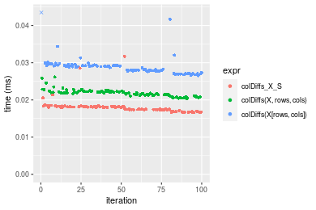

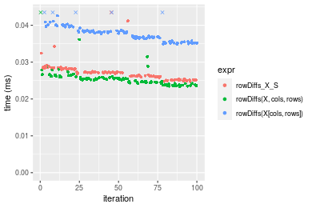
_Table: Benchmarking of colDiffs_X_S() and rowDiffs_X_S() on integer+100x100 data (original and transposed).  The top panel shows times in milliseconds and the bottom panel shows relative times._


|   |expr         |    min|      lq|     mean|  median|     uq|    max|
|:--|:------------|------:|-------:|--------:|-------:|------:|------:|
|1  |colDiffs_X_S | 16.574| 17.3745| 18.02672| 17.9960| 18.200| 31.714|
|2  |rowDiffs_X_S | 24.787| 25.9895| 27.21962| 27.1065| 28.147| 44.725|


|   |expr         |      min|       lq|    mean|   median|       uq|     max|
|:--|:------------|--------:|--------:|-------:|--------:|--------:|-------:|
|1  |colDiffs_X_S | 1.000000| 1.000000| 1.00000| 1.000000| 1.000000| 1.00000|
|2  |rowDiffs_X_S | 1.495535| 1.495842| 1.50996| 1.506251| 1.546539| 1.41026|

_Figure: Benchmarking of colDiffs_X_S() and rowDiffs_X_S() on integer+100x100 data (original and transposed).  Outliers are displayed as crosses. Times are in milliseconds._


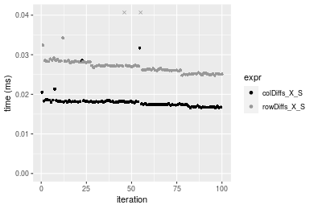

#### 1000x10 integer matrix


```r
> X <- data[["1000x10"]]
> rows <- sample.int(nrow(X), size = nrow(X) * 0.7)
> cols <- sample.int(ncol(X), size = ncol(X) * 0.7)
> X_S <- X[rows, cols]
> gc()
          used  (Mb) gc trigger  (Mb) max used  (Mb)
Ncells 5207746 278.2    8529671 455.6  8529671 455.6
Vcells 9546579  72.9   31876688 243.2 60562128 462.1
> colStats <- microbenchmark(colDiffs_X_S = colDiffs(X_S), `colDiffs(X, rows, cols)` = colDiffs(X, 
+     rows = rows, cols = cols), `colDiffs(X[rows, cols])` = colDiffs(X[rows, cols]), unit = "ms")
> X <- t(X)
> X_S <- t(X_S)
> gc()
          used  (Mb) gc trigger  (Mb) max used  (Mb)
Ncells 5207722 278.2    8529671 455.6  8529671 455.6
Vcells 9551632  72.9   31876688 243.2 60562128 462.1
> rowStats <- microbenchmark(rowDiffs_X_S = rowDiffs(X_S), `rowDiffs(X, cols, rows)` = rowDiffs(X, 
+     rows = cols, cols = rows), `rowDiffs(X[cols, rows])` = rowDiffs(X[cols, rows]), unit = "ms")
```

_Table: Benchmarking of colDiffs_X_S(), colDiffs(X, rows, cols)() and colDiffs(X[rows, cols])() on integer+1000x10 data. The top panel shows times in milliseconds and the bottom panel shows relative times._


|   |expr                    |      min|       lq|      mean|    median|        uq|      max|
|:--|:-----------------------|--------:|--------:|---------:|---------:|---------:|--------:|
|1  |colDiffs_X_S            | 0.016924| 0.017648| 0.0182821| 0.0178145| 0.0184195| 0.032679|
|2  |colDiffs(X, rows, cols) | 0.021740| 0.022522| 0.0231821| 0.0228625| 0.0234785| 0.034067|
|3  |colDiffs(X[rows, cols]) | 0.027479| 0.028699| 0.0297399| 0.0289215| 0.0299665| 0.058360|


|   |expr                    |      min|       lq|     mean|   median|       uq|      max|
|:--|:-----------------------|--------:|--------:|--------:|--------:|--------:|--------:|
|1  |colDiffs_X_S            | 1.000000| 1.000000| 1.000000| 1.000000| 1.000000| 1.000000|
|2  |colDiffs(X, rows, cols) | 1.284566| 1.276179| 1.268025| 1.283365| 1.274655| 1.042474|
|3  |colDiffs(X[rows, cols]) | 1.623671| 1.626190| 1.626728| 1.623481| 1.626890| 1.785856|

_Table: Benchmarking of rowDiffs_X_S(), rowDiffs(X, cols, rows)() and rowDiffs(X[cols, rows])() on integer+1000x10 data (transposed). The top panel shows times in milliseconds and the bottom panel shows relative times._


|   |expr                    |      min|        lq|      mean|    median|        uq|      max|
|:--|:-----------------------|--------:|---------:|---------:|---------:|---------:|--------:|
|1  |rowDiffs_X_S            | 0.025358| 0.0263175| 0.0272596| 0.0271155| 0.0283135| 0.032790|
|2  |rowDiffs(X, cols, rows) | 0.027049| 0.0275110| 0.0286743| 0.0284785| 0.0296440| 0.035178|
|3  |rowDiffs(X[cols, rows]) | 0.037066| 0.0388010| 0.0409239| 0.0401090| 0.0418575| 0.072411|


|   |expr                    |      min|       lq|     mean|   median|       uq|      max|
|:--|:-----------------------|--------:|--------:|--------:|--------:|--------:|--------:|
|1  |rowDiffs_X_S            | 1.000000| 1.000000| 1.000000| 1.000000| 1.000000| 1.000000|
|2  |rowDiffs(X, cols, rows) | 1.066685| 1.045350| 1.051896| 1.050266| 1.046992| 1.072827|
|3  |rowDiffs(X[cols, rows]) | 1.461708| 1.474342| 1.501262| 1.479191| 1.478358| 2.208326|

_Figure: Benchmarking of colDiffs_X_S(), colDiffs(X, rows, cols)() and colDiffs(X[rows, cols])() on integer+1000x10 data  as well as rowDiffs_X_S(), rowDiffs(X, cols, rows)() and rowDiffs(X[cols, rows])() on the same data transposed.  Outliers are displayed as crosses.  Times are in milliseconds._


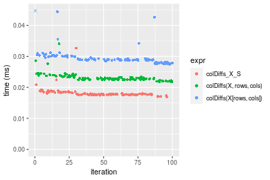

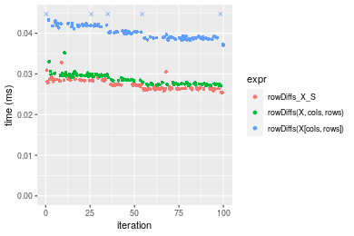
_Table: Benchmarking of colDiffs_X_S() and rowDiffs_X_S() on integer+1000x10 data (original and transposed).  The top panel shows times in milliseconds and the bottom panel shows relative times._


|   |expr         |    min|      lq|     mean|  median|      uq|    max|
|:--|:------------|------:|-------:|--------:|-------:|-------:|------:|
|1  |colDiffs_X_S | 16.924| 17.6480| 18.28206| 17.8145| 18.4195| 32.679|
|2  |rowDiffs_X_S | 25.358| 26.3175| 27.25965| 27.1155| 28.3135| 32.790|


|   |expr         |      min|       lq|    mean|   median|       uq|      max|
|:--|:------------|--------:|--------:|-------:|--------:|--------:|--------:|
|1  |colDiffs_X_S | 1.000000| 1.000000| 1.00000| 1.000000| 1.000000| 1.000000|
|2  |rowDiffs_X_S | 1.498346| 1.491246| 1.49106| 1.522103| 1.537148| 1.003397|

_Figure: Benchmarking of colDiffs_X_S() and rowDiffs_X_S() on integer+1000x10 data (original and transposed).  Outliers are displayed as crosses. Times are in milliseconds._


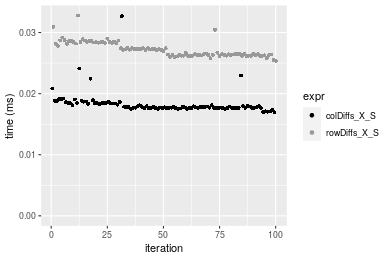

#### 10x1000 integer matrix


```r
> X <- data[["10x1000"]]
> rows <- sample.int(nrow(X), size = nrow(X) * 0.7)
> cols <- sample.int(ncol(X), size = ncol(X) * 0.7)
> X_S <- X[rows, cols]
> gc()
          used  (Mb) gc trigger  (Mb) max used  (Mb)
Ncells 5207951 278.2    8529671 455.6  8529671 455.6
Vcells 9547383  72.9   31876688 243.2 60562128 462.1
> colStats <- microbenchmark(colDiffs_X_S = colDiffs(X_S), `colDiffs(X, rows, cols)` = colDiffs(X, 
+     rows = rows, cols = cols), `colDiffs(X[rows, cols])` = colDiffs(X[rows, cols]), unit = "ms")
> X <- t(X)
> X_S <- t(X_S)
> gc()
          used  (Mb) gc trigger  (Mb) max used  (Mb)
Ncells 5207927 278.2    8529671 455.6  8529671 455.6
Vcells 9552436  72.9   31876688 243.2 60562128 462.1
> rowStats <- microbenchmark(rowDiffs_X_S = rowDiffs(X_S), `rowDiffs(X, cols, rows)` = rowDiffs(X, 
+     rows = cols, cols = rows), `rowDiffs(X[cols, rows])` = rowDiffs(X[cols, rows]), unit = "ms")
```

_Table: Benchmarking of colDiffs_X_S(), colDiffs(X, rows, cols)() and colDiffs(X[rows, cols])() on integer+10x1000 data. The top panel shows times in milliseconds and the bottom panel shows relative times._


|   |expr                    |      min|        lq|      mean|    median|        uq|      max|
|:--|:-----------------------|--------:|---------:|---------:|---------:|---------:|--------:|
|1  |colDiffs_X_S            | 0.015870| 0.0167690| 0.0176202| 0.0172355| 0.0175295| 0.033904|
|2  |colDiffs(X, rows, cols) | 0.019952| 0.0211185| 0.0220102| 0.0213615| 0.0221685| 0.037966|
|3  |colDiffs(X[rows, cols]) | 0.028584| 0.0299000| 0.0311677| 0.0308900| 0.0313985| 0.044057|


|   |expr                    |      min|       lq|     mean|   median|       uq|      max|
|:--|:-----------------------|--------:|--------:|--------:|--------:|--------:|--------:|
|1  |colDiffs_X_S            | 1.000000| 1.000000| 1.000000| 1.000000| 1.000000| 1.000000|
|2  |colDiffs(X, rows, cols) | 1.257215| 1.259377| 1.249148| 1.239390| 1.264640| 1.119809|
|3  |colDiffs(X[rows, cols]) | 1.801134| 1.783052| 1.768866| 1.792231| 1.791181| 1.299463|

_Table: Benchmarking of rowDiffs_X_S(), rowDiffs(X, cols, rows)() and rowDiffs(X[cols, rows])() on integer+10x1000 data (transposed). The top panel shows times in milliseconds and the bottom panel shows relative times._


|   |expr                    |      min|       lq|      mean|    median|        uq|      max|
|:--|:-----------------------|--------:|--------:|---------:|---------:|---------:|--------:|
|1  |rowDiffs_X_S            | 0.021083| 0.021359| 0.0224119| 0.0221535| 0.0230205| 0.028383|
|2  |rowDiffs(X, cols, rows) | 0.022123| 0.022477| 0.0234689| 0.0230855| 0.0238865| 0.046887|
|3  |rowDiffs(X[cols, rows]) | 0.031814| 0.032152| 0.0339521| 0.0333495| 0.0347535| 0.049268|


|   |expr                    |      min|       lq|     mean|   median|       uq|      max|
|:--|:-----------------------|--------:|--------:|--------:|--------:|--------:|--------:|
|1  |rowDiffs_X_S            | 1.000000| 1.000000| 1.000000| 1.000000| 1.000000| 1.000000|
|2  |rowDiffs(X, cols, rows) | 1.049329| 1.052343| 1.047164| 1.042070| 1.037619| 1.651939|
|3  |rowDiffs(X[cols, rows]) | 1.508988| 1.505314| 1.514914| 1.505383| 1.509676| 1.735828|

_Figure: Benchmarking of colDiffs_X_S(), colDiffs(X, rows, cols)() and colDiffs(X[rows, cols])() on integer+10x1000 data  as well as rowDiffs_X_S(), rowDiffs(X, cols, rows)() and rowDiffs(X[cols, rows])() on the same data transposed.  Outliers are displayed as crosses.  Times are in milliseconds._


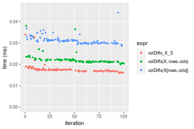

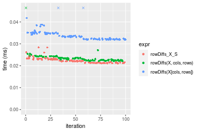
_Table: Benchmarking of colDiffs_X_S() and rowDiffs_X_S() on integer+10x1000 data (original and transposed).  The top panel shows times in milliseconds and the bottom panel shows relative times._


|   |expr         |    min|     lq|     mean|  median|      uq|    max|
|:--|:------------|------:|------:|--------:|-------:|-------:|------:|
|1  |colDiffs_X_S | 15.870| 16.769| 17.62017| 17.2355| 17.5295| 33.904|
|2  |rowDiffs_X_S | 21.083| 21.359| 22.41188| 22.1535| 23.0205| 28.383|


|   |expr         |      min|       lq|     mean|   median|       uq|       max|
|:--|:------------|--------:|--------:|--------:|--------:|--------:|---------:|
|1  |colDiffs_X_S | 1.000000| 1.000000| 1.000000| 1.000000| 1.000000| 1.0000000|
|2  |rowDiffs_X_S | 1.328481| 1.273719| 1.271945| 1.285341| 1.313243| 0.8371579|

_Figure: Benchmarking of colDiffs_X_S() and rowDiffs_X_S() on integer+10x1000 data (original and transposed).  Outliers are displayed as crosses. Times are in milliseconds._


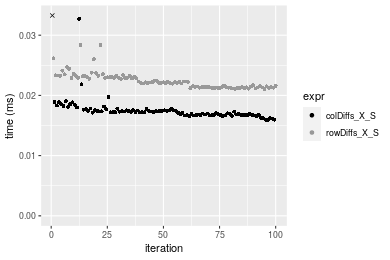

#### 100x1000 integer matrix


```r
> X <- data[["100x1000"]]
> rows <- sample.int(nrow(X), size = nrow(X) * 0.7)
> cols <- sample.int(ncol(X), size = ncol(X) * 0.7)
> X_S <- X[rows, cols]
> gc()
          used  (Mb) gc trigger  (Mb) max used  (Mb)
Ncells 5208162 278.2    8529671 455.6  8529671 455.6
Vcells 9570047  73.1   31876688 243.2 60562128 462.1
> colStats <- microbenchmark(colDiffs_X_S = colDiffs(X_S), `colDiffs(X, rows, cols)` = colDiffs(X, 
+     rows = rows, cols = cols), `colDiffs(X[rows, cols])` = colDiffs(X[rows, cols]), unit = "ms")
> X <- t(X)
> X_S <- t(X_S)
> gc()
          used  (Mb) gc trigger  (Mb) max used  (Mb)
Ncells 5208138 278.2    8529671 455.6  8529671 455.6
Vcells 9620100  73.4   31876688 243.2 60562128 462.1
> rowStats <- microbenchmark(rowDiffs_X_S = rowDiffs(X_S), `rowDiffs(X, cols, rows)` = rowDiffs(X, 
+     rows = cols, cols = rows), `rowDiffs(X[cols, rows])` = rowDiffs(X[cols, rows]), unit = "ms")
```

_Table: Benchmarking of colDiffs_X_S(), colDiffs(X, rows, cols)() and colDiffs(X[rows, cols])() on integer+100x1000 data. The top panel shows times in milliseconds and the bottom panel shows relative times._


|   |expr                    |      min|        lq|      mean|    median|        uq|      max|
|:--|:-----------------------|--------:|---------:|---------:|---------:|---------:|--------:|
|1  |colDiffs_X_S            | 0.105206| 0.1141290| 0.1273333| 0.1250335| 0.1339815| 0.185541|
|2  |colDiffs(X, rows, cols) | 0.126209| 0.1374505| 0.1539970| 0.1503190| 0.1659385| 0.271798|
|3  |colDiffs(X[rows, cols]) | 0.173455| 0.1886770| 0.2116374| 0.2124520| 0.2262440| 0.274103|


|   |expr                    |      min|       lq|     mean|   median|       uq|      max|
|:--|:-----------------------|--------:|--------:|--------:|--------:|--------:|--------:|
|1  |colDiffs_X_S            | 1.000000| 1.000000| 1.000000| 1.000000| 1.000000| 1.000000|
|2  |colDiffs(X, rows, cols) | 1.199637| 1.204343| 1.209401| 1.202230| 1.238518| 1.464895|
|3  |colDiffs(X[rows, cols]) | 1.648718| 1.653191| 1.662074| 1.699161| 1.688621| 1.477318|

_Table: Benchmarking of rowDiffs_X_S(), rowDiffs(X, cols, rows)() and rowDiffs(X[cols, rows])() on integer+100x1000 data (transposed). The top panel shows times in milliseconds and the bottom panel shows relative times._


|   |expr                    |      min|       lq|      mean|    median|        uq|      max|
|:--|:-----------------------|--------:|--------:|---------:|---------:|---------:|--------:|
|2  |rowDiffs(X, cols, rows) | 0.141634| 0.143431| 0.1641314| 0.1540035| 0.1791340| 0.293898|
|1  |rowDiffs_X_S            | 0.151821| 0.160112| 0.1849618| 0.1806230| 0.1996705| 0.273409|
|3  |rowDiffs(X[cols, rows]) | 0.215160| 0.220846| 0.2567680| 0.2489070| 0.2800360| 0.359153|


|   |expr                    |      min|       lq|     mean|   median|       uq|       max|
|:--|:-----------------------|--------:|--------:|--------:|--------:|--------:|---------:|
|2  |rowDiffs(X, cols, rows) | 1.000000| 1.000000| 1.000000| 1.000000| 1.000000| 1.0000000|
|1  |rowDiffs_X_S            | 1.071925| 1.116300| 1.126913| 1.172850| 1.114643| 0.9302853|
|3  |rowDiffs(X[cols, rows]) | 1.519127| 1.539737| 1.564406| 1.616243| 1.563277| 1.2220328|

_Figure: Benchmarking of colDiffs_X_S(), colDiffs(X, rows, cols)() and colDiffs(X[rows, cols])() on integer+100x1000 data  as well as rowDiffs_X_S(), rowDiffs(X, cols, rows)() and rowDiffs(X[cols, rows])() on the same data transposed.  Outliers are displayed as crosses.  Times are in milliseconds._


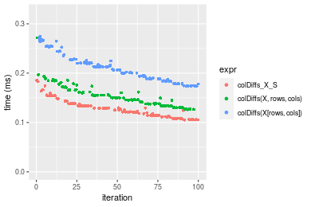

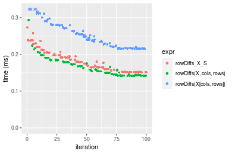
_Table: Benchmarking of colDiffs_X_S() and rowDiffs_X_S() on integer+100x1000 data (original and transposed).  The top panel shows times in milliseconds and the bottom panel shows relative times._


|   |expr         |     min|      lq|     mean|   median|       uq|     max|
|:--|:------------|-------:|-------:|--------:|--------:|--------:|-------:|
|1  |colDiffs_X_S | 105.206| 114.129| 127.3333| 125.0335| 133.9815| 185.541|
|2  |rowDiffs_X_S | 151.821| 160.112| 184.9617| 180.6230| 199.6705| 273.409|


|   |expr         |      min|       lq|     mean|   median|       uq|      max|
|:--|:------------|--------:|--------:|--------:|--------:|--------:|--------:|
|1  |colDiffs_X_S | 1.000000| 1.000000| 1.000000| 1.000000| 1.000000| 1.000000|
|2  |rowDiffs_X_S | 1.443083| 1.402904| 1.452579| 1.444597| 1.490284| 1.473577|

_Figure: Benchmarking of colDiffs_X_S() and rowDiffs_X_S() on integer+100x1000 data (original and transposed).  Outliers are displayed as crosses. Times are in milliseconds._


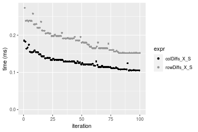

#### 1000x100 integer matrix


```r
> X <- data[["1000x100"]]
> rows <- sample.int(nrow(X), size = nrow(X) * 0.7)
> cols <- sample.int(ncol(X), size = ncol(X) * 0.7)
> X_S <- X[rows, cols]
> gc()
          used  (Mb) gc trigger  (Mb) max used  (Mb)
Ncells 5208372 278.2    8529671 455.6  8529671 455.6
Vcells 9570765  73.1   31876688 243.2 60562128 462.1
> colStats <- microbenchmark(colDiffs_X_S = colDiffs(X_S), `colDiffs(X, rows, cols)` = colDiffs(X, 
+     rows = rows, cols = cols), `colDiffs(X[rows, cols])` = colDiffs(X[rows, cols]), unit = "ms")
> X <- t(X)
> X_S <- t(X_S)
> gc()
          used  (Mb) gc trigger  (Mb) max used  (Mb)
Ncells 5208348 278.2    8529671 455.6  8529671 455.6
Vcells 9620818  73.5   31876688 243.2 60562128 462.1
> rowStats <- microbenchmark(rowDiffs_X_S = rowDiffs(X_S), `rowDiffs(X, cols, rows)` = rowDiffs(X, 
+     rows = cols, cols = rows), `rowDiffs(X[cols, rows])` = rowDiffs(X[cols, rows]), unit = "ms")
```

_Table: Benchmarking of colDiffs_X_S(), colDiffs(X, rows, cols)() and colDiffs(X[rows, cols])() on integer+1000x100 data. The top panel shows times in milliseconds and the bottom panel shows relative times._


|   |expr                    |      min|        lq|      mean|    median|        uq|      max|
|:--|:-----------------------|--------:|---------:|---------:|---------:|---------:|--------:|
|1  |colDiffs_X_S            | 0.103472| 0.1137520| 0.1272180| 0.1230740| 0.1346685| 0.218679|
|2  |colDiffs(X, rows, cols) | 0.122819| 0.1335395| 0.1501142| 0.1504485| 0.1582405| 0.204807|
|3  |colDiffs(X[rows, cols]) | 0.167456| 0.1864720| 0.2100959| 0.2098080| 0.2318155| 0.329141|


|   |expr                    |      min|       lq|     mean|   median|       uq|       max|
|:--|:-----------------------|--------:|--------:|--------:|--------:|--------:|---------:|
|1  |colDiffs_X_S            | 1.000000| 1.000000| 1.000000| 1.000000| 1.000000| 1.0000000|
|2  |colDiffs(X, rows, cols) | 1.186978| 1.173953| 1.179977| 1.222423| 1.175037| 0.9365646|
|3  |colDiffs(X[rows, cols]) | 1.618370| 1.639285| 1.651464| 1.704730| 1.721379| 1.5051331|

_Table: Benchmarking of rowDiffs_X_S(), rowDiffs(X, cols, rows)() and rowDiffs(X[cols, rows])() on integer+1000x100 data (transposed). The top panel shows times in milliseconds and the bottom panel shows relative times._


|   |expr                    |      min|        lq|      mean|    median|        uq|      max|
|:--|:-----------------------|--------:|---------:|---------:|---------:|---------:|--------:|
|2  |rowDiffs(X, cols, rows) | 0.144292| 0.1488515| 0.1721450| 0.1660545| 0.1877765| 0.299767|
|1  |rowDiffs_X_S            | 0.158597| 0.1617020| 0.1892060| 0.1826615| 0.2071985| 0.274642|
|3  |rowDiffs(X[cols, rows]) | 0.227369| 0.2306220| 0.2682557| 0.2549265| 0.2965480| 0.368254|


|   |expr                    |      min|       lq|     mean|   median|       uq|       max|
|:--|:-----------------------|--------:|--------:|--------:|--------:|--------:|---------:|
|2  |rowDiffs(X, cols, rows) | 1.000000| 1.000000| 1.000000| 1.000000| 1.000000| 1.0000000|
|1  |rowDiffs_X_S            | 1.099139| 1.086331| 1.099108| 1.100009| 1.103431| 0.9161849|
|3  |rowDiffs(X[cols, rows]) | 1.575756| 1.549343| 1.558313| 1.535198| 1.579260| 1.2284674|

_Figure: Benchmarking of colDiffs_X_S(), colDiffs(X, rows, cols)() and colDiffs(X[rows, cols])() on integer+1000x100 data  as well as rowDiffs_X_S(), rowDiffs(X, cols, rows)() and rowDiffs(X[cols, rows])() on the same data transposed.  Outliers are displayed as crosses.  Times are in milliseconds._


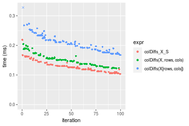

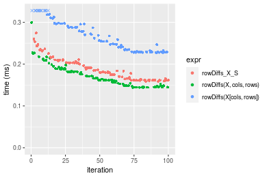
_Table: Benchmarking of colDiffs_X_S() and rowDiffs_X_S() on integer+1000x100 data (original and transposed).  The top panel shows times in milliseconds and the bottom panel shows relative times._


|   |expr         |     min|      lq|    mean|   median|       uq|     max|
|:--|:------------|-------:|-------:|-------:|--------:|--------:|-------:|
|1  |colDiffs_X_S | 103.472| 113.752| 127.218| 123.0740| 134.6685| 218.679|
|2  |rowDiffs_X_S | 158.597| 161.702| 189.206| 182.6615| 207.1985| 274.642|


|   |expr         |      min|       lq|     mean|  median|       uq|      max|
|:--|:------------|--------:|--------:|--------:|-------:|--------:|--------:|
|1  |colDiffs_X_S | 1.000000| 1.000000| 1.000000| 1.00000| 1.000000| 1.000000|
|2  |rowDiffs_X_S | 1.532753| 1.421531| 1.487258| 1.48416| 1.538582| 1.255914|

_Figure: Benchmarking of colDiffs_X_S() and rowDiffs_X_S() on integer+1000x100 data (original and transposed).  Outliers are displayed as crosses. Times are in milliseconds._


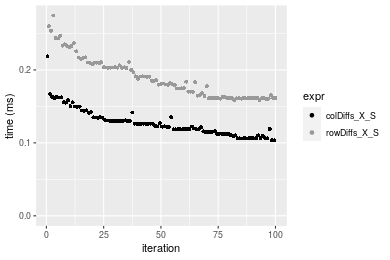


## Data type "double"

### Data
```r
> rmatrix <- function(nrow, ncol, mode = c("logical", "double", "integer", "index"), range = c(-100, 
+     +100), na_prob = 0) {
+     mode <- match.arg(mode)
+     n <- nrow * ncol
+     if (mode == "logical") {
+         x <- sample(c(FALSE, TRUE), size = n, replace = TRUE)
+     }     else if (mode == "index") {
+         x <- seq_len(n)
+         mode <- "integer"
+     }     else {
+         x <- runif(n, min = range[1], max = range[2])
+     }
+     storage.mode(x) <- mode
+     if (na_prob > 0) 
+         x[sample(n, size = na_prob * n)] <- NA
+     dim(x) <- c(nrow, ncol)
+     x
+ }
> rmatrices <- function(scale = 10, seed = 1, ...) {
+     set.seed(seed)
+     data <- list()
+     data[[1]] <- rmatrix(nrow = scale * 1, ncol = scale * 1, ...)
+     data[[2]] <- rmatrix(nrow = scale * 10, ncol = scale * 10, ...)
+     data[[3]] <- rmatrix(nrow = scale * 100, ncol = scale * 1, ...)
+     data[[4]] <- t(data[[3]])
+     data[[5]] <- rmatrix(nrow = scale * 10, ncol = scale * 100, ...)
+     data[[6]] <- t(data[[5]])
+     names(data) <- sapply(data, FUN = function(x) paste(dim(x), collapse = "x"))
+     data
+ }
> data <- rmatrices(mode = mode)
```

### Results

#### 10x10 double matrix


```r
> X <- data[["10x10"]]
> rows <- sample.int(nrow(X), size = nrow(X) * 0.7)
> cols <- sample.int(ncol(X), size = ncol(X) * 0.7)
> X_S <- X[rows, cols]
> gc()
          used  (Mb) gc trigger  (Mb) max used  (Mb)
Ncells 5208590 278.2    8529671 455.6  8529671 455.6
Vcells 9661854  73.8   31876688 243.2 60562128 462.1
> colStats <- microbenchmark(colDiffs_X_S = colDiffs(X_S), `colDiffs(X, rows, cols)` = colDiffs(X, 
+     rows = rows, cols = cols), `colDiffs(X[rows, cols])` = colDiffs(X[rows, cols]), unit = "ms")
> X <- t(X)
> X_S <- t(X_S)
> gc()
          used  (Mb) gc trigger  (Mb) max used  (Mb)
Ncells 5208557 278.2    8529671 455.6  8529671 455.6
Vcells 9661992  73.8   31876688 243.2 60562128 462.1
> rowStats <- microbenchmark(rowDiffs_X_S = rowDiffs(X_S), `rowDiffs(X, cols, rows)` = rowDiffs(X, 
+     rows = cols, cols = rows), `rowDiffs(X[cols, rows])` = rowDiffs(X[cols, rows]), unit = "ms")
```

_Table: Benchmarking of colDiffs_X_S(), colDiffs(X, rows, cols)() and colDiffs(X[rows, cols])() on double+10x10 data. The top panel shows times in milliseconds and the bottom panel shows relative times._


|   |expr                    |      min|       lq|      mean|   median|       uq|      max|
|:--|:-----------------------|--------:|--------:|---------:|--------:|--------:|--------:|
|1  |colDiffs_X_S            | 0.002027| 0.002165| 0.0023908| 0.002231| 0.002321| 0.015429|
|2  |colDiffs(X, rows, cols) | 0.002301| 0.002575| 0.0027069| 0.002640| 0.002741| 0.005425|
|3  |colDiffs(X[rows, cols]) | 0.002939| 0.003178| 0.0033462| 0.003304| 0.003390| 0.007236|


|   |expr                    |      min|       lq|     mean|   median|       uq|       max|
|:--|:-----------------------|--------:|--------:|--------:|--------:|--------:|---------:|
|1  |colDiffs_X_S            | 1.000000| 1.000000| 1.000000| 1.000000| 1.000000| 1.0000000|
|2  |colDiffs(X, rows, cols) | 1.135175| 1.189376| 1.132234| 1.183326| 1.180956| 0.3516106|
|3  |colDiffs(X[rows, cols]) | 1.449926| 1.467898| 1.399639| 1.480950| 1.460577| 0.4689870|

_Table: Benchmarking of rowDiffs_X_S(), rowDiffs(X, cols, rows)() and rowDiffs(X[cols, rows])() on double+10x10 data (transposed). The top panel shows times in milliseconds and the bottom panel shows relative times._


|   |expr                    |      min|        lq|      mean|   median|        uq|      max|
|:--|:-----------------------|--------:|---------:|---------:|--------:|---------:|--------:|
|1  |rowDiffs_X_S            | 0.002000| 0.0022050| 0.0023352| 0.002259| 0.0023600| 0.004508|
|2  |rowDiffs(X, cols, rows) | 0.002339| 0.0025395| 0.0028191| 0.002617| 0.0027345| 0.019367|
|3  |rowDiffs(X[cols, rows]) | 0.002918| 0.0032200| 0.0033761| 0.003306| 0.0034385| 0.006170|


|   |expr                    |    min|       lq|     mean|   median|       uq|      max|
|:--|:-----------------------|------:|--------:|--------:|--------:|--------:|--------:|
|1  |rowDiffs_X_S            | 1.0000| 1.000000| 1.000000| 1.000000| 1.000000| 1.000000|
|2  |rowDiffs(X, cols, rows) | 1.1695| 1.151701| 1.207223| 1.158477| 1.158686| 4.296140|
|3  |rowDiffs(X[cols, rows]) | 1.4590| 1.460317| 1.445750| 1.463479| 1.456991| 1.368678|

_Figure: Benchmarking of colDiffs_X_S(), colDiffs(X, rows, cols)() and colDiffs(X[rows, cols])() on double+10x10 data  as well as rowDiffs_X_S(), rowDiffs(X, cols, rows)() and rowDiffs(X[cols, rows])() on the same data transposed.  Outliers are displayed as crosses.  Times are in milliseconds._


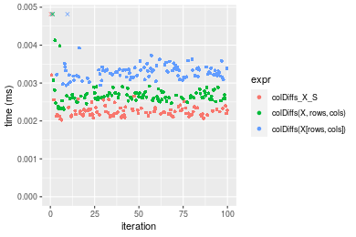

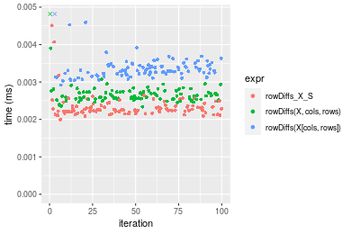
_Table: Benchmarking of colDiffs_X_S() and rowDiffs_X_S() on double+10x10 data (original and transposed).  The top panel shows times in milliseconds and the bottom panel shows relative times._


|   |expr         |   min|    lq|    mean| median|    uq|    max|
|:--|:------------|-----:|-----:|-------:|------:|-----:|------:|
|1  |colDiffs_X_S | 2.027| 2.165| 2.39076|  2.231| 2.321| 15.429|
|2  |rowDiffs_X_S | 2.000| 2.205| 2.33521|  2.259| 2.360|  4.508|


|   |expr         |       min|       lq|      mean|  median|       uq|       max|
|:--|:------------|---------:|--------:|---------:|-------:|--------:|---------:|
|1  |colDiffs_X_S | 1.0000000| 1.000000| 1.0000000| 1.00000| 1.000000| 1.0000000|
|2  |rowDiffs_X_S | 0.9866798| 1.018476| 0.9767647| 1.01255| 1.016803| 0.2921771|

_Figure: Benchmarking of colDiffs_X_S() and rowDiffs_X_S() on double+10x10 data (original and transposed).  Outliers are displayed as crosses. Times are in milliseconds._


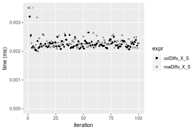

#### 100x100 double matrix


```r
> X <- data[["100x100"]]
> rows <- sample.int(nrow(X), size = nrow(X) * 0.7)
> cols <- sample.int(ncol(X), size = ncol(X) * 0.7)
> X_S <- X[rows, cols]
> gc()
          used  (Mb) gc trigger  (Mb) max used  (Mb)
Ncells 5208789 278.2    8529671 455.6  8529671 455.6
Vcells 9667788  73.8   31876688 243.2 60562128 462.1
> colStats <- microbenchmark(colDiffs_X_S = colDiffs(X_S), `colDiffs(X, rows, cols)` = colDiffs(X, 
+     rows = rows, cols = cols), `colDiffs(X[rows, cols])` = colDiffs(X[rows, cols]), unit = "ms")
> X <- t(X)
> X_S <- t(X_S)
> gc()
          used  (Mb) gc trigger  (Mb) max used  (Mb)
Ncells 5208765 278.2    8529671 455.6  8529671 455.6
Vcells 9677841  73.9   31876688 243.2 60562128 462.1
> rowStats <- microbenchmark(rowDiffs_X_S = rowDiffs(X_S), `rowDiffs(X, cols, rows)` = rowDiffs(X, 
+     rows = cols, cols = rows), `rowDiffs(X[cols, rows])` = rowDiffs(X[cols, rows]), unit = "ms")
```

_Table: Benchmarking of colDiffs_X_S(), colDiffs(X, rows, cols)() and colDiffs(X[rows, cols])() on double+100x100 data. The top panel shows times in milliseconds and the bottom panel shows relative times._


|   |expr                    |      min|        lq|      mean|   median|        uq|      max|
|:--|:-----------------------|--------:|---------:|---------:|--------:|---------:|--------:|
|1  |colDiffs_X_S            | 0.017660| 0.0182725| 0.0192073| 0.018885| 0.0194270| 0.032789|
|2  |colDiffs(X, rows, cols) | 0.021828| 0.0226875| 0.0233230| 0.023063| 0.0236800| 0.028592|
|3  |colDiffs(X[rows, cols]) | 0.032381| 0.0334315| 0.0346890| 0.033991| 0.0350635| 0.060921|


|   |expr                    |      min|       lq|     mean|   median|       uq|       max|
|:--|:-----------------------|--------:|--------:|--------:|--------:|--------:|---------:|
|1  |colDiffs_X_S            | 1.000000| 1.000000| 1.000000| 1.000000| 1.000000| 1.0000000|
|2  |colDiffs(X, rows, cols) | 1.236014| 1.241620| 1.214279| 1.221234| 1.218922| 0.8719998|
|3  |colDiffs(X[rows, cols]) | 1.833579| 1.829607| 1.806029| 1.799894| 1.804885| 1.8579707|

_Table: Benchmarking of rowDiffs_X_S(), rowDiffs(X, cols, rows)() and rowDiffs(X[cols, rows])() on double+100x100 data (transposed). The top panel shows times in milliseconds and the bottom panel shows relative times._


|   |expr                    |      min|        lq|      mean|    median|        uq|      max|
|:--|:-----------------------|--------:|---------:|---------:|---------:|---------:|--------:|
|2  |rowDiffs(X, cols, rows) | 0.018192| 0.0191005| 0.0200181| 0.0194705| 0.0198285| 0.046732|
|1  |rowDiffs_X_S            | 0.021486| 0.0221085| 0.0228331| 0.0223885| 0.0231845| 0.037368|
|3  |rowDiffs(X[cols, rows]) | 0.035955| 0.0373810| 0.0384471| 0.0377105| 0.0389640| 0.051352|


|   |expr                    |      min|       lq|     mean|   median|       uq|       max|
|:--|:-----------------------|--------:|--------:|--------:|--------:|--------:|---------:|
|2  |rowDiffs(X, cols, rows) | 1.000000| 1.000000| 1.000000| 1.000000| 1.000000| 1.0000000|
|1  |rowDiffs_X_S            | 1.181069| 1.157483| 1.140620| 1.149868| 1.169251| 0.7996234|
|3  |rowDiffs(X[cols, rows]) | 1.976418| 1.957069| 1.920613| 1.936802| 1.965050| 1.0988616|

_Figure: Benchmarking of colDiffs_X_S(), colDiffs(X, rows, cols)() and colDiffs(X[rows, cols])() on double+100x100 data  as well as rowDiffs_X_S(), rowDiffs(X, cols, rows)() and rowDiffs(X[cols, rows])() on the same data transposed.  Outliers are displayed as crosses.  Times are in milliseconds._


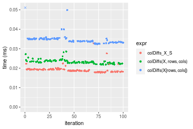

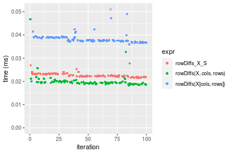
_Table: Benchmarking of colDiffs_X_S() and rowDiffs_X_S() on double+100x100 data (original and transposed).  The top panel shows times in milliseconds and the bottom panel shows relative times._


|   |expr         |    min|      lq|     mean|  median|      uq|    max|
|:--|:------------|------:|-------:|--------:|-------:|-------:|------:|
|1  |colDiffs_X_S | 17.660| 18.2725| 19.20731| 18.8850| 19.4270| 32.789|
|2  |rowDiffs_X_S | 21.486| 22.1085| 22.83310| 22.3885| 23.1845| 37.368|


|   |expr         |      min|       lq|     mean|   median|       uq|     max|
|:--|:------------|--------:|--------:|--------:|--------:|--------:|-------:|
|1  |colDiffs_X_S | 1.000000| 1.000000| 1.000000| 1.000000| 1.000000| 1.00000|
|2  |rowDiffs_X_S | 1.216648| 1.209933| 1.188771| 1.185518| 1.193416| 1.13965|

_Figure: Benchmarking of colDiffs_X_S() and rowDiffs_X_S() on double+100x100 data (original and transposed).  Outliers are displayed as crosses. Times are in milliseconds._


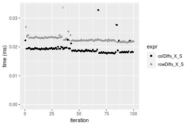

#### 1000x10 double matrix


```r
> X <- data[["1000x10"]]
> rows <- sample.int(nrow(X), size = nrow(X) * 0.7)
> cols <- sample.int(ncol(X), size = ncol(X) * 0.7)
> X_S <- X[rows, cols]
> gc()
          used  (Mb) gc trigger  (Mb) max used  (Mb)
Ncells 5208988 278.2    8529671 455.6  8529671 455.6
Vcells 9669163  73.8   31876688 243.2 60562128 462.1
> colStats <- microbenchmark(colDiffs_X_S = colDiffs(X_S), `colDiffs(X, rows, cols)` = colDiffs(X, 
+     rows = rows, cols = cols), `colDiffs(X[rows, cols])` = colDiffs(X[rows, cols]), unit = "ms")
> X <- t(X)
> X_S <- t(X_S)
> gc()
          used  (Mb) gc trigger  (Mb) max used  (Mb)
Ncells 5208964 278.2    8529671 455.6  8529671 455.6
Vcells 9679216  73.9   31876688 243.2 60562128 462.1
> rowStats <- microbenchmark(rowDiffs_X_S = rowDiffs(X_S), `rowDiffs(X, cols, rows)` = rowDiffs(X, 
+     rows = cols, cols = rows), `rowDiffs(X[cols, rows])` = rowDiffs(X[cols, rows]), unit = "ms")
```

_Table: Benchmarking of colDiffs_X_S(), colDiffs(X, rows, cols)() and colDiffs(X[rows, cols])() on double+1000x10 data. The top panel shows times in milliseconds and the bottom panel shows relative times._


|   |expr                    |      min|        lq|      mean|    median|        uq|      max|
|:--|:-----------------------|--------:|---------:|---------:|---------:|---------:|--------:|
|1  |colDiffs_X_S            | 0.017071| 0.0177390| 0.0182864| 0.0181515| 0.0186175| 0.023403|
|2  |colDiffs(X, rows, cols) | 0.023282| 0.0242775| 0.0252079| 0.0246955| 0.0255510| 0.038888|
|3  |colDiffs(X[rows, cols]) | 0.032231| 0.0333675| 0.0353652| 0.0342595| 0.0349865| 0.065132|


|   |expr                    |      min|       lq|     mean|   median|       uq|      max|
|:--|:-----------------------|--------:|--------:|--------:|--------:|--------:|--------:|
|1  |colDiffs_X_S            | 1.000000| 1.000000| 1.000000| 1.000000| 1.000000| 1.000000|
|2  |colDiffs(X, rows, cols) | 1.363833| 1.368595| 1.378502| 1.360521| 1.372418| 1.661667|
|3  |colDiffs(X[rows, cols]) | 1.888056| 1.881025| 1.933956| 1.887420| 1.879226| 2.783062|

_Table: Benchmarking of rowDiffs_X_S(), rowDiffs(X, cols, rows)() and rowDiffs(X[cols, rows])() on double+1000x10 data (transposed). The top panel shows times in milliseconds and the bottom panel shows relative times._


|   |expr                    |      min|        lq|      mean|    median|        uq|      max|
|:--|:-----------------------|--------:|---------:|---------:|---------:|---------:|--------:|
|2  |rowDiffs(X, cols, rows) | 0.021593| 0.0224475| 0.0233552| 0.0232645| 0.0237035| 0.035781|
|1  |rowDiffs_X_S            | 0.022180| 0.0231025| 0.0241712| 0.0238160| 0.0247260| 0.038145|
|3  |rowDiffs(X[cols, rows]) | 0.039317| 0.0408925| 0.0429012| 0.0422995| 0.0438610| 0.076166|


|   |expr                    |      min|       lq|     mean|   median|       uq|      max|
|:--|:-----------------------|--------:|--------:|--------:|--------:|--------:|--------:|
|2  |rowDiffs(X, cols, rows) | 1.000000| 1.000000| 1.000000| 1.000000| 1.000000| 1.000000|
|1  |rowDiffs_X_S            | 1.027185| 1.029179| 1.034937| 1.023706| 1.043137| 1.066069|
|3  |rowDiffs(X[cols, rows]) | 1.820822| 1.821695| 1.836902| 1.818199| 1.850402| 2.128672|

_Figure: Benchmarking of colDiffs_X_S(), colDiffs(X, rows, cols)() and colDiffs(X[rows, cols])() on double+1000x10 data  as well as rowDiffs_X_S(), rowDiffs(X, cols, rows)() and rowDiffs(X[cols, rows])() on the same data transposed.  Outliers are displayed as crosses.  Times are in milliseconds._


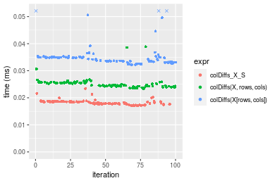

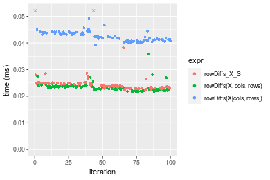
_Table: Benchmarking of colDiffs_X_S() and rowDiffs_X_S() on double+1000x10 data (original and transposed).  The top panel shows times in milliseconds and the bottom panel shows relative times._


|   |expr         |    min|      lq|     mean|  median|      uq|    max|
|:--|:------------|------:|-------:|--------:|-------:|-------:|------:|
|1  |colDiffs_X_S | 17.071| 17.7390| 18.28645| 18.1515| 18.6175| 23.403|
|2  |rowDiffs_X_S | 22.180| 23.1025| 24.17117| 23.8160| 24.7260| 38.145|


|   |expr         |      min|       lq|     mean|   median|       uq|      max|
|:--|:------------|--------:|--------:|--------:|--------:|--------:|--------:|
|1  |colDiffs_X_S | 1.000000| 1.000000| 1.000000| 1.000000| 1.000000| 1.000000|
|2  |rowDiffs_X_S | 1.299279| 1.302356| 1.321808| 1.312068| 1.328105| 1.629919|

_Figure: Benchmarking of colDiffs_X_S() and rowDiffs_X_S() on double+1000x10 data (original and transposed).  Outliers are displayed as crosses. Times are in milliseconds._


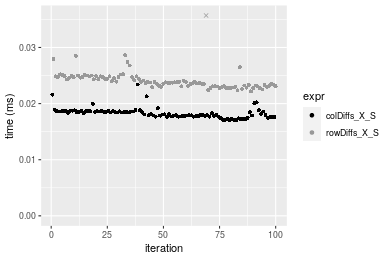

#### 10x1000 double matrix


```r
> X <- data[["10x1000"]]
> rows <- sample.int(nrow(X), size = nrow(X) * 0.7)
> cols <- sample.int(ncol(X), size = ncol(X) * 0.7)
> X_S <- X[rows, cols]
> gc()
          used  (Mb) gc trigger  (Mb) max used  (Mb)
Ncells 5209193 278.3    8529671 455.6  8529671 455.6
Vcells 9669299  73.8   31876688 243.2 60562128 462.1
> colStats <- microbenchmark(colDiffs_X_S = colDiffs(X_S), `colDiffs(X, rows, cols)` = colDiffs(X, 
+     rows = rows, cols = cols), `colDiffs(X[rows, cols])` = colDiffs(X[rows, cols]), unit = "ms")
> X <- t(X)
> X_S <- t(X_S)
> gc()
          used  (Mb) gc trigger  (Mb) max used  (Mb)
Ncells 5209169 278.2    8529671 455.6  8529671 455.6
Vcells 9679352  73.9   31876688 243.2 60562128 462.1
> rowStats <- microbenchmark(rowDiffs_X_S = rowDiffs(X_S), `rowDiffs(X, cols, rows)` = rowDiffs(X, 
+     rows = cols, cols = rows), `rowDiffs(X[cols, rows])` = rowDiffs(X[cols, rows]), unit = "ms")
```

_Table: Benchmarking of colDiffs_X_S(), colDiffs(X, rows, cols)() and colDiffs(X[rows, cols])() on double+10x1000 data. The top panel shows times in milliseconds and the bottom panel shows relative times._


|   |expr                    |      min|        lq|      mean|    median|        uq|      max|
|:--|:-----------------------|--------:|---------:|---------:|---------:|---------:|--------:|
|1  |colDiffs_X_S            | 0.017365| 0.0181230| 0.0190861| 0.0190085| 0.0192945| 0.036127|
|2  |colDiffs(X, rows, cols) | 0.021960| 0.0225610| 0.0237898| 0.0235120| 0.0241440| 0.041742|
|3  |colDiffs(X[rows, cols]) | 0.035284| 0.0369825| 0.0384188| 0.0381935| 0.0384775| 0.061739|


|   |expr                    |      min|       lq|     mean|   median|       uq|      max|
|:--|:-----------------------|--------:|--------:|--------:|--------:|--------:|--------:|
|1  |colDiffs_X_S            | 1.000000| 1.000000| 1.000000| 1.000000| 1.000000| 1.000000|
|2  |colDiffs(X, rows, cols) | 1.264613| 1.244882| 1.246449| 1.236920| 1.251341| 1.155424|
|3  |colDiffs(X[rows, cols]) | 2.031903| 2.040639| 2.012926| 2.009285| 1.994221| 1.708943|

_Table: Benchmarking of rowDiffs_X_S(), rowDiffs(X, cols, rows)() and rowDiffs(X[cols, rows])() on double+10x1000 data (transposed). The top panel shows times in milliseconds and the bottom panel shows relative times._


|   |expr                    |      min|       lq|      mean|   median|        uq|      max|
|:--|:-----------------------|--------:|--------:|---------:|--------:|---------:|--------:|
|2  |rowDiffs(X, cols, rows) | 0.017762| 0.018901| 0.0196780| 0.019386| 0.0197765| 0.045941|
|1  |rowDiffs_X_S            | 0.016350| 0.019423| 0.0198705| 0.019788| 0.0200795| 0.034849|
|3  |rowDiffs(X[cols, rows]) | 0.033709| 0.035291| 0.0361828| 0.036015| 0.0364650| 0.049748|


|   |expr                    |       min|       lq|     mean|   median|       uq|       max|
|:--|:-----------------------|---------:|--------:|--------:|--------:|--------:|---------:|
|2  |rowDiffs(X, cols, rows) | 1.0000000| 1.000000| 1.000000| 1.000000| 1.000000| 1.0000000|
|1  |rowDiffs_X_S            | 0.9205044| 1.027618| 1.009785| 1.020737| 1.015321| 0.7585599|
|3  |rowDiffs(X[cols, rows]) | 1.8978156| 1.867150| 1.838743| 1.857784| 1.843855| 1.0828672|

_Figure: Benchmarking of colDiffs_X_S(), colDiffs(X, rows, cols)() and colDiffs(X[rows, cols])() on double+10x1000 data  as well as rowDiffs_X_S(), rowDiffs(X, cols, rows)() and rowDiffs(X[cols, rows])() on the same data transposed.  Outliers are displayed as crosses.  Times are in milliseconds._


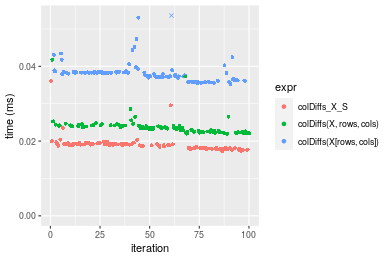

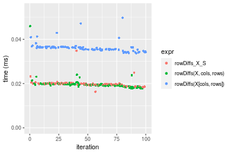
_Table: Benchmarking of colDiffs_X_S() and rowDiffs_X_S() on double+10x1000 data (original and transposed).  The top panel shows times in milliseconds and the bottom panel shows relative times._


|   |expr         |    min|     lq|     mean|  median|      uq|    max|
|:--|:------------|------:|------:|--------:|-------:|-------:|------:|
|1  |colDiffs_X_S | 17.365| 18.123| 19.08606| 19.0085| 19.2945| 36.127|
|2  |rowDiffs_X_S | 16.350| 19.423| 19.87054| 19.7880| 20.0795| 34.849|


|   |expr         |       min|       lq|     mean|   median|       uq|       max|
|:--|:------------|---------:|--------:|--------:|--------:|--------:|---------:|
|1  |colDiffs_X_S | 1.0000000| 1.000000| 1.000000| 1.000000| 1.000000| 1.0000000|
|2  |rowDiffs_X_S | 0.9415491| 1.071732| 1.041102| 1.041008| 1.040685| 0.9646248|

_Figure: Benchmarking of colDiffs_X_S() and rowDiffs_X_S() on double+10x1000 data (original and transposed).  Outliers are displayed as crosses. Times are in milliseconds._


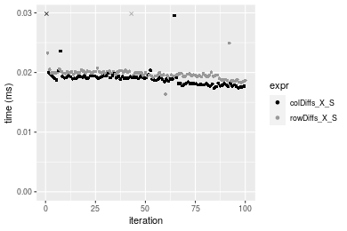

#### 100x1000 double matrix


```r
> X <- data[["100x1000"]]
> rows <- sample.int(nrow(X), size = nrow(X) * 0.7)
> cols <- sample.int(ncol(X), size = ncol(X) * 0.7)
> X_S <- X[rows, cols]
> gc()
          used  (Mb) gc trigger  (Mb) max used  (Mb)
Ncells 5209404 278.3    8529671 455.6  8529671 455.6
Vcells 9714724  74.2   31876688 243.2 60562128 462.1
> colStats <- microbenchmark(colDiffs_X_S = colDiffs(X_S), `colDiffs(X, rows, cols)` = colDiffs(X, 
+     rows = rows, cols = cols), `colDiffs(X[rows, cols])` = colDiffs(X[rows, cols]), unit = "ms")
> X <- t(X)
> X_S <- t(X_S)
> gc()
          used  (Mb) gc trigger  (Mb) max used  (Mb)
Ncells 5209380 278.3    8529671 455.6  8529671 455.6
Vcells 9814777  74.9   31876688 243.2 60562128 462.1
> rowStats <- microbenchmark(rowDiffs_X_S = rowDiffs(X_S), `rowDiffs(X, cols, rows)` = rowDiffs(X, 
+     rows = cols, cols = rows), `rowDiffs(X[cols, rows])` = rowDiffs(X[cols, rows]), unit = "ms")
```

_Table: Benchmarking of colDiffs_X_S(), colDiffs(X, rows, cols)() and colDiffs(X[rows, cols])() on double+100x1000 data. The top panel shows times in milliseconds and the bottom panel shows relative times._


|   |expr                    |      min|        lq|      mean|    median|        uq|      max|
|:--|:-----------------------|--------:|---------:|---------:|---------:|---------:|--------:|
|1  |colDiffs_X_S            | 0.107511| 0.1167435| 0.1380288| 0.1315225| 0.1482610| 0.420001|
|2  |colDiffs(X, rows, cols) | 0.130151| 0.1428920| 0.1642985| 0.1585660| 0.1778200| 0.307284|
|3  |colDiffs(X[rows, cols]) | 0.204619| 0.2275180| 0.2604196| 0.2573770| 0.2754015| 0.347143|


|   |expr                    |      min|       lq|     mean|   median|       uq|       max|
|:--|:-----------------------|--------:|--------:|--------:|--------:|--------:|---------:|
|1  |colDiffs_X_S            | 1.000000| 1.000000| 1.000000| 1.000000| 1.000000| 1.0000000|
|2  |colDiffs(X, rows, cols) | 1.210583| 1.223982| 1.190321| 1.205619| 1.199371| 0.7316268|
|3  |colDiffs(X[rows, cols]) | 1.903238| 1.948871| 1.886706| 1.956905| 1.857545| 0.8265290|

_Table: Benchmarking of rowDiffs_X_S(), rowDiffs(X, cols, rows)() and rowDiffs(X[cols, rows])() on double+100x1000 data (transposed). The top panel shows times in milliseconds and the bottom panel shows relative times._


|   |expr                    |      min|        lq|      mean|    median|        uq|      max|
|:--|:-----------------------|--------:|---------:|---------:|---------:|---------:|--------:|
|2  |rowDiffs(X, cols, rows) | 0.106067| 0.1119765| 0.1276081| 0.1191835| 0.1383565| 0.286915|
|1  |rowDiffs_X_S            | 0.126863| 0.1413660| 0.1584162| 0.1575735| 0.1701140| 0.238276|
|3  |rowDiffs(X[cols, rows]) | 0.220626| 0.2405685| 0.2703636| 0.2621900| 0.2886485| 0.407271|


|   |expr                    |      min|       lq|     mean|   median|       uq|       max|
|:--|:-----------------------|--------:|--------:|--------:|--------:|--------:|---------:|
|2  |rowDiffs(X, cols, rows) | 1.000000| 1.000000| 1.000000| 1.000000| 1.000000| 1.0000000|
|1  |rowDiffs_X_S            | 1.196065| 1.262461| 1.241428| 1.322108| 1.229534| 0.8304759|
|3  |rowDiffs(X[cols, rows]) | 2.080063| 2.148384| 2.118703| 2.199885| 2.086266| 1.4194831|

_Figure: Benchmarking of colDiffs_X_S(), colDiffs(X, rows, cols)() and colDiffs(X[rows, cols])() on double+100x1000 data  as well as rowDiffs_X_S(), rowDiffs(X, cols, rows)() and rowDiffs(X[cols, rows])() on the same data transposed.  Outliers are displayed as crosses.  Times are in milliseconds._


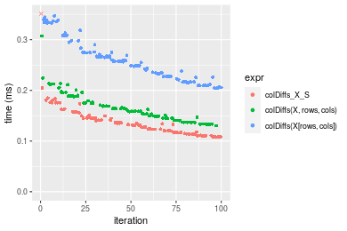

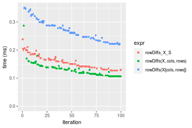
_Table: Benchmarking of colDiffs_X_S() and rowDiffs_X_S() on double+100x1000 data (original and transposed).  The top panel shows times in milliseconds and the bottom panel shows relative times._


|   |expr         |     min|       lq|     mean|   median|      uq|     max|
|:--|:------------|-------:|--------:|--------:|--------:|-------:|-------:|
|1  |colDiffs_X_S | 107.511| 116.7435| 138.0288| 131.5225| 148.261| 420.001|
|2  |rowDiffs_X_S | 126.863| 141.3660| 158.4162| 157.5735| 170.114| 238.276|


|   |expr         |  min|       lq|     mean|   median|       uq|       max|
|:--|:------------|----:|--------:|--------:|--------:|--------:|---------:|
|1  |colDiffs_X_S | 1.00| 1.000000| 1.000000| 1.000000| 1.000000| 1.0000000|
|2  |rowDiffs_X_S | 1.18| 1.210911| 1.147705| 1.198073| 1.147396| 0.5673225|

_Figure: Benchmarking of colDiffs_X_S() and rowDiffs_X_S() on double+100x1000 data (original and transposed).  Outliers are displayed as crosses. Times are in milliseconds._


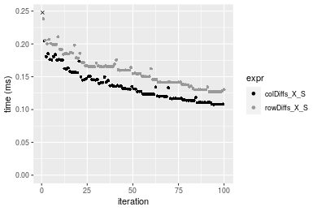

#### 1000x100 double matrix


```r
> X <- data[["1000x100"]]
> rows <- sample.int(nrow(X), size = nrow(X) * 0.7)
> cols <- sample.int(ncol(X), size = ncol(X) * 0.7)
> X_S <- X[rows, cols]
> gc()
          used  (Mb) gc trigger  (Mb) max used  (Mb)
Ncells 5209614 278.3    8529671 455.6  8529671 455.6
Vcells 9714865  74.2   31876688 243.2 60562128 462.1
> colStats <- microbenchmark(colDiffs_X_S = colDiffs(X_S), `colDiffs(X, rows, cols)` = colDiffs(X, 
+     rows = rows, cols = cols), `colDiffs(X[rows, cols])` = colDiffs(X[rows, cols]), unit = "ms")
> X <- t(X)
> X_S <- t(X_S)
> gc()
          used  (Mb) gc trigger  (Mb) max used  (Mb)
Ncells 5209590 278.3    8529671 455.6  8529671 455.6
Vcells 9814918  74.9   31876688 243.2 60562128 462.1
> rowStats <- microbenchmark(rowDiffs_X_S = rowDiffs(X_S), `rowDiffs(X, cols, rows)` = rowDiffs(X, 
+     rows = cols, cols = rows), `rowDiffs(X[cols, rows])` = rowDiffs(X[cols, rows]), unit = "ms")
```

_Table: Benchmarking of colDiffs_X_S(), colDiffs(X, rows, cols)() and colDiffs(X[rows, cols])() on double+1000x100 data. The top panel shows times in milliseconds and the bottom panel shows relative times._


|   |expr                    |      min|        lq|      mean|    median|        uq|      max|
|:--|:-----------------------|--------:|---------:|---------:|---------:|---------:|--------:|
|1  |colDiffs_X_S            | 0.103457| 0.1127685| 0.1273864| 0.1224880| 0.1348785| 0.194025|
|2  |colDiffs(X, rows, cols) | 0.131980| 0.1468910| 0.1644894| 0.1609465| 0.1724850| 0.273805|
|3  |colDiffs(X[rows, cols]) | 0.197955| 0.2158190| 0.2466904| 0.2428345| 0.2649460| 0.433847|


|   |expr                    |      min|       lq|     mean|   median|       uq|      max|
|:--|:-----------------------|--------:|--------:|--------:|--------:|--------:|--------:|
|1  |colDiffs_X_S            | 1.000000| 1.000000| 1.000000| 1.000000| 1.000000| 1.000000|
|2  |colDiffs(X, rows, cols) | 1.275699| 1.302589| 1.291263| 1.313978| 1.278818| 1.411184|
|3  |colDiffs(X[rows, cols]) | 1.913404| 1.913823| 1.936552| 1.982517| 1.964331| 2.236037|

_Table: Benchmarking of rowDiffs_X_S(), rowDiffs(X, cols, rows)() and rowDiffs(X[cols, rows])() on double+1000x100 data (transposed). The top panel shows times in milliseconds and the bottom panel shows relative times._


|   |expr                    |      min|        lq|      mean|    median|        uq|      max|
|:--|:-----------------------|--------:|---------:|---------:|---------:|---------:|--------:|
|2  |rowDiffs(X, cols, rows) | 0.107927| 0.1174900| 0.1338860| 0.1284205| 0.1420660| 0.321564|
|1  |rowDiffs_X_S            | 0.134344| 0.1399150| 0.1629436| 0.1591370| 0.1757520| 0.227270|
|3  |rowDiffs(X[cols, rows]) | 0.229788| 0.2465015| 0.2803006| 0.2730560| 0.3048045| 0.382753|


|   |expr                    |      min|       lq|     mean|   median|       uq|       max|
|:--|:-----------------------|--------:|--------:|--------:|--------:|--------:|---------:|
|2  |rowDiffs(X, cols, rows) | 1.000000| 1.000000| 1.000000| 1.000000| 1.000000| 1.0000000|
|1  |rowDiffs_X_S            | 1.244767| 1.190867| 1.217033| 1.239187| 1.237115| 0.7067644|
|3  |rowDiffs(X[cols, rows]) | 2.129106| 2.098064| 2.093577| 2.126265| 2.145513| 1.1902856|

_Figure: Benchmarking of colDiffs_X_S(), colDiffs(X, rows, cols)() and colDiffs(X[rows, cols])() on double+1000x100 data  as well as rowDiffs_X_S(), rowDiffs(X, cols, rows)() and rowDiffs(X[cols, rows])() on the same data transposed.  Outliers are displayed as crosses.  Times are in milliseconds._


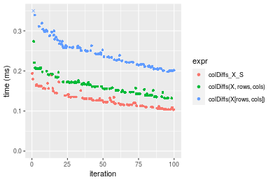

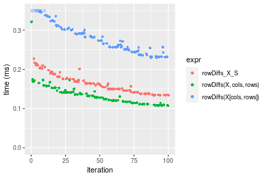
_Table: Benchmarking of colDiffs_X_S() and rowDiffs_X_S() on double+1000x100 data (original and transposed).  The top panel shows times in milliseconds and the bottom panel shows relative times._


|   |expr         |     min|       lq|     mean|  median|       uq|     max|
|:--|:------------|-------:|--------:|--------:|-------:|--------:|-------:|
|1  |colDiffs_X_S | 103.457| 112.7685| 127.3864| 122.488| 134.8785| 194.025|
|2  |rowDiffs_X_S | 134.344| 139.9150| 162.9436| 159.137| 175.7520| 227.270|


|   |expr         |      min|       lq|     mean|   median|       uq|      max|
|:--|:------------|--------:|--------:|--------:|--------:|--------:|--------:|
|1  |colDiffs_X_S | 1.000000| 1.000000| 1.000000| 1.000000| 1.000000| 1.000000|
|2  |rowDiffs_X_S | 1.298549| 1.240728| 1.279129| 1.299205| 1.303039| 1.171344|

_Figure: Benchmarking of colDiffs_X_S() and rowDiffs_X_S() on double+1000x100 data (original and transposed).  Outliers are displayed as crosses. Times are in milliseconds._


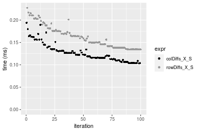


## Appendix

### Session information
```r
R version 4.1.1 Patched (2021-08-10 r80727)
Platform: x86_64-pc-linux-gnu (64-bit)
Running under: Ubuntu 18.04.5 LTS

Matrix products: default
BLAS:   /home/hb/software/R-devel/R-4-1-branch/lib/R/lib/libRblas.so
LAPACK: /home/hb/software/R-devel/R-4-1-branch/lib/R/lib/libRlapack.so

locale:
 [1] LC_CTYPE=en_US.UTF-8       LC_NUMERIC=C              
 [3] LC_TIME=en_US.UTF-8        LC_COLLATE=en_US.UTF-8    
 [5] LC_MONETARY=en_US.UTF-8    LC_MESSAGES=en_US.UTF-8   
 [7] LC_PAPER=en_US.UTF-8       LC_NAME=C                 
 [9] LC_ADDRESS=C               LC_TELEPHONE=C            
[11] LC_MEASUREMENT=en_US.UTF-8 LC_IDENTIFICATION=C       

attached base packages:
[1] stats     graphics  grDevices utils     datasets  methods   base     

other attached packages:
[1] microbenchmark_1.4-7   matrixStats_0.60.1     ggplot2_3.3.5         
[4] knitr_1.33             R.devices_2.17.0       R.utils_2.10.1        
[7] R.oo_1.24.0            R.methodsS3_1.8.1-9001 history_0.0.1-9000    

loaded via a namespace (and not attached):
 [1] Biobase_2.52.0          httr_1.4.2              splines_4.1.1          
 [4] bit64_4.0.5             network_1.17.1          assertthat_0.2.1       
 [7] highr_0.9               stats4_4.1.1            blob_1.2.2             
[10] GenomeInfoDbData_1.2.6  robustbase_0.93-8       pillar_1.6.2           
[13] RSQLite_2.2.8           lattice_0.20-44         glue_1.4.2             
[16] digest_0.6.27           XVector_0.32.0          colorspace_2.0-2       
[19] Matrix_1.3-4            XML_3.99-0.7            pkgconfig_2.0.3        
[22] zlibbioc_1.38.0         genefilter_1.74.0       purrr_0.3.4            
[25] ergm_4.1.2              xtable_1.8-4            scales_1.1.1           
[28] tibble_3.1.4            annotate_1.70.0         KEGGREST_1.32.0        
[31] farver_2.1.0            generics_0.1.0          IRanges_2.26.0         
[34] ellipsis_0.3.2          cachem_1.0.6            withr_2.4.2            
[37] BiocGenerics_0.38.0     mime_0.11               survival_3.2-13        
[40] magrittr_2.0.1          crayon_1.4.1            statnet.common_4.5.0   
[43] memoise_2.0.0           laeken_0.5.1            fansi_0.5.0            
[46] R.cache_0.15.0          MASS_7.3-54             R.rsp_0.44.0           
[49] progressr_0.8.0         tools_4.1.1             lifecycle_1.0.0        
[52] S4Vectors_0.30.0        trust_0.1-8             munsell_0.5.0          
[55] tabby_0.0.1-9001        AnnotationDbi_1.54.1    Biostrings_2.60.2      
[58] compiler_4.1.1          GenomeInfoDb_1.28.1     rlang_0.4.11           
[61] grid_4.1.1              RCurl_1.98-1.4          cwhmisc_6.6            
[64] rappdirs_0.3.3          startup_0.15.0          labeling_0.4.2         
[67] bitops_1.0-7            base64enc_0.1-3         boot_1.3-28            
[70] gtable_0.3.0            DBI_1.1.1               markdown_1.1           
[73] R6_2.5.1                lpSolveAPI_5.5.2.0-17.7 rle_0.9.2              
[76] dplyr_1.0.7             fastmap_1.1.0           bit_4.0.4              
[79] utf8_1.2.2              parallel_4.1.1          Rcpp_1.0.7             
[82] vctrs_0.3.8             png_0.1-7               DEoptimR_1.0-9         
[85] tidyselect_1.1.1        xfun_0.25               coda_0.19-4            
```
Total processing time was 21.96 secs.


### Reproducibility
To reproduce this report, do:
```r
html <- matrixStats:::benchmark('colRowDiffs_subset')
```

[RSP]: https://cran.r-project.org/package=R.rsp
[matrixStats]: https://cran.r-project.org/package=matrixStats

[StackOverflow:colMins?]: https://stackoverflow.com/questions/13676878 "Stack Overflow: fastest way to get Min from every column in a matrix?"
[StackOverflow:colSds?]: https://stackoverflow.com/questions/17549762 "Stack Overflow: Is there such 'colsd' in R?"
[StackOverflow:rowProds?]: https://stackoverflow.com/questions/20198801/ "Stack Overflow: Row product of matrix and column sum of matrix"

---------------------------------------
Copyright Dongcan Jiang. Last updated on 2021-08-25 18:55:08 (+0200 UTC). Powered by [RSP].

<script>
 var link = document.createElement('link');
 link.rel = 'icon';
 link.href = "data:image/png;base64,iVBORw0KGgoAAAANSUhEUgAAACAAAAAgCAMAAABEpIrGAAAA21BMVEUAAAAAAP8AAP8AAP8AAP8AAP8AAP8AAP8AAP8AAP8AAP8AAP8AAP8AAP8AAP8AAP8AAP8AAP8AAP8AAP8AAP8AAP8AAP8AAP8AAP8AAP8AAP8AAP8AAP8AAP8AAP8AAP8AAP8AAP8AAP8AAP8AAP8AAP8AAP8AAP8AAP8AAP8BAf4CAv0DA/wdHeIeHuEfH+AgIN8hId4lJdomJtknJ9g+PsE/P8BAQL9yco10dIt1dYp3d4h4eIeVlWqWlmmXl2iYmGeZmWabm2Tn5xjo6Bfp6Rb39wj4+Af//wA2M9hbAAAASXRSTlMAAQIJCgsMJSYnKD4/QGRlZmhpamtsbautrrCxuru8y8zN5ebn6Pn6+///////////////////////////////////////////LsUNcQAAAS9JREFUOI29k21XgkAQhVcFytdSMqMETU26UVqGmpaiFbL//xc1cAhhwVNf6n5i5z67M2dmYOyfJZUqlVLhkKucG7cgmUZTybDz6g0iDeq51PUr37Ds2cy2/C9NeES5puDjxuUk1xnToZsg8pfA3avHQ3lLIi7iWRrkv/OYtkScxBIMgDee0ALoyxHQBJ68JLCjOtQIMIANF7QG9G9fNnHvisCHBVMKgSJgiz7nE+AoBKrAPA3MgepvgR9TSCasrCKH0eB1wBGBFdCO+nAGjMVGPcQb5bd6mQRegN6+1axOs9nGfYcCtfi4NQosdtH7dB+txFIpXQqN1p9B/asRHToyS0jRgpV7nk4nwcq1BJ+x3Gl/v7S9Wmpp/aGquum7w3ZDyrADFYrl8vHBH+ev9AUASW1dmU4h4wAAAABJRU5ErkJggg=="
 document.getElementsByTagName('head')[0].appendChild(link);
</script>


