[matrixStats]: Benchmark report

---------------------------------------


# colLogSumExps() and rowLogSumExps() benchmarks

This report benchmark the performance of colLogSumExps() and rowLogSumExps() against alternative methods.

## Alternative methods

* apply() + matrixStats::logSumExp()
* apply() + logSumExp0()

where

```r
> logSumExp0 <- function(lx, ...) {
+     iMax <- which.max(lx)
+     log1p(sum(exp(lx[-iMax] - lx[iMax]))) + lx[iMax]
+ }
```


## Data
```r
> rmatrix <- function(nrow, ncol, mode = c("logical", "double", "integer", "index"), range = c(-100, 
+     +100), na_prob = 0) {
+     mode <- match.arg(mode)
+     n <- nrow * ncol
+     if (mode == "logical") {
+         x <- sample(c(FALSE, TRUE), size = n, replace = TRUE)
+     }     else if (mode == "index") {
+         x <- seq_len(n)
+         mode <- "integer"
+     }     else {
+         x <- runif(n, min = range[1], max = range[2])
+     }
+     storage.mode(x) <- mode
+     if (na_prob > 0) 
+         x[sample(n, size = na_prob * n)] <- NA
+     dim(x) <- c(nrow, ncol)
+     x
+ }
> rmatrices <- function(scale = 10, seed = 1, ...) {
+     set.seed(seed)
+     data <- list()
+     data[[1]] <- rmatrix(nrow = scale * 1, ncol = scale * 1, ...)
+     data[[2]] <- rmatrix(nrow = scale * 10, ncol = scale * 10, ...)
+     data[[3]] <- rmatrix(nrow = scale * 100, ncol = scale * 1, ...)
+     data[[4]] <- t(data[[3]])
+     data[[5]] <- rmatrix(nrow = scale * 10, ncol = scale * 100, ...)
+     data[[6]] <- t(data[[5]])
+     names(data) <- sapply(data, FUN = function(x) paste(dim(x), collapse = "x"))
+     data
+ }
> data <- rmatrices(mode = "double")
```

## Results

### 10x10 matrix


```r
> X <- data[["10x10"]]
> gc()
           used  (Mb) gc trigger  (Mb) max used  (Mb)
Ncells  5228971 279.3    8529671 455.6  8529671 455.6
Vcells 10151080  77.5   31876688 243.2 60562128 462.1
> colStats <- microbenchmark(colLogSumExps = colLogSumExps(X, na.rm = FALSE), `apply+logSumExp` = apply(X, 
+     MARGIN = 2L, FUN = logSumExp, na.rm = FALSE), `apply+logSumExp0` = apply(X, MARGIN = 2L, FUN = logSumExp0, 
+     na.rm = FALSE), unit = "ms")
> X <- t(X)
> gc()
           used  (Mb) gc trigger  (Mb) max used  (Mb)
Ncells  5219380 278.8    8529671 455.6  8529671 455.6
Vcells 10119728  77.3   31876688 243.2 60562128 462.1
> rowStats <- microbenchmark(rowLogSumExps = rowLogSumExps(X, na.rm = FALSE), `apply+logSumExp` = apply(X, 
+     MARGIN = 1L, FUN = logSumExp, na.rm = FALSE), `apply+logSumExp0` = apply(X, MARGIN = 1L, FUN = logSumExp0, 
+     na.rm = FALSE), unit = "ms")
```

_Table: Benchmarking of colLogSumExps(), apply+logSumExp() and apply+logSumExp0() on 10x10 data. The top panel shows times in milliseconds and the bottom panel shows relative times._


|   |expr             |      min|        lq|      mean|    median|        uq|      max|
|:--|:----------------|--------:|---------:|---------:|---------:|---------:|--------:|
|1  |colLogSumExps    | 0.004115| 0.0047255| 0.0053071| 0.0051590| 0.0055450| 0.018341|
|2  |apply+logSumExp  | 0.043589| 0.0460690| 0.0493210| 0.0475195| 0.0500855| 0.142218|
|3  |apply+logSumExp0 | 0.061030| 0.0631095| 0.0672718| 0.0643335| 0.0690305| 0.166412|


|   |expr             |      min|        lq|     mean|   median|        uq|      max|
|:--|:----------------|--------:|---------:|--------:|--------:|---------:|--------:|
|1  |colLogSumExps    |  1.00000|  1.000000|  1.00000|  1.00000|  1.000000| 1.000000|
|2  |apply+logSumExp  | 10.59271|  9.749021|  9.29344|  9.21099|  9.032552| 7.754103|
|3  |apply+logSumExp0 | 14.83111| 13.355095| 12.67586| 12.47015| 12.449143| 9.073224|

_Table: Benchmarking of rowLogSumExps(), apply+logSumExp() and apply+logSumExp0() on 10x10 data (transposed). The top panel shows times in milliseconds and the bottom panel shows relative times._


|   |expr             |      min|        lq|      mean|    median|        uq|      max|
|:--|:----------------|--------:|---------:|---------:|---------:|---------:|--------:|
|1  |rowLogSumExps    | 0.004288| 0.0047920| 0.0054875| 0.0053690| 0.0057515| 0.018216|
|2  |apply+logSumExp  | 0.043553| 0.0463765| 0.0488194| 0.0480420| 0.0497345| 0.104476|
|3  |apply+logSumExp0 | 0.058941| 0.0627360| 0.0676865| 0.0657705| 0.0689620| 0.156978|


|   |expr             |      min|        lq|      mean|    median|        uq|      max|
|:--|:----------------|--------:|---------:|---------:|---------:|---------:|--------:|
|1  |rowLogSumExps    |  1.00000|  1.000000|  1.000000|  1.000000|  1.000000| 1.000000|
|2  |apply+logSumExp  | 10.15695|  9.677901|  8.896548|  8.948035|  8.647222| 5.735398|
|3  |apply+logSumExp0 | 13.74557| 13.091820| 12.334767| 12.250047| 11.990263| 8.617589|

_Figure: Benchmarking of colLogSumExps(), apply+logSumExp() and apply+logSumExp0() on 10x10 data  as well as rowLogSumExps(), apply+logSumExp() and apply+logSumExp0() on the same data transposed.  Outliers are displayed as crosses.  Times are in milliseconds._


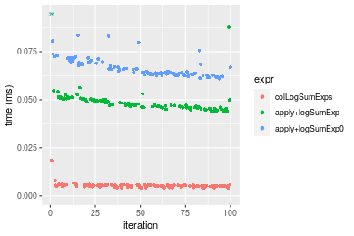

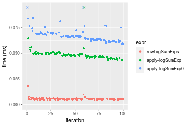
_Table: Benchmarking of colLogSumExps() and rowLogSumExps() on 10x10 data (original and transposed).  The top panel shows times in milliseconds and the bottom panel shows relative times._


|   |expr          |   min|     lq|    mean| median|     uq|    max|
|:--|:-------------|-----:|------:|-------:|------:|------:|------:|
|1  |colLogSumExps | 4.115| 4.7255| 5.30708|  5.159| 5.5450| 18.341|
|2  |rowLogSumExps | 4.288| 4.7920| 5.48746|  5.369| 5.7515| 18.216|


|   |expr          |      min|       lq|     mean|   median|       uq|       max|
|:--|:-------------|--------:|--------:|--------:|--------:|--------:|---------:|
|1  |colLogSumExps | 1.000000| 1.000000| 1.000000| 1.000000| 1.000000| 1.0000000|
|2  |rowLogSumExps | 1.042041| 1.014073| 1.033989| 1.040706| 1.037241| 0.9931847|

_Figure: Benchmarking of colLogSumExps() and rowLogSumExps() on 10x10 data (original and transposed).  Outliers are displayed as crosses. Times are in milliseconds._


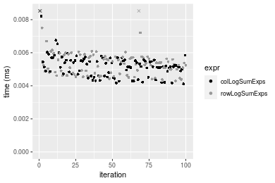

### 100x100 matrix


```r
> X <- data[["100x100"]]
> gc()
          used  (Mb) gc trigger  (Mb) max used  (Mb)
Ncells 5217958 278.7    8529671 455.6  8529671 455.6
Vcells 9736343  74.3   31876688 243.2 60562128 462.1
> colStats <- microbenchmark(colLogSumExps = colLogSumExps(X, na.rm = FALSE), `apply+logSumExp` = apply(X, 
+     MARGIN = 2L, FUN = logSumExp, na.rm = FALSE), `apply+logSumExp0` = apply(X, MARGIN = 2L, FUN = logSumExp0, 
+     na.rm = FALSE), unit = "ms")
> X <- t(X)
> gc()
          used  (Mb) gc trigger  (Mb) max used  (Mb)
Ncells 5217934 278.7    8529671 455.6  8529671 455.6
Vcells 9746356  74.4   31876688 243.2 60562128 462.1
> rowStats <- microbenchmark(rowLogSumExps = rowLogSumExps(X, na.rm = FALSE), `apply+logSumExp` = apply(X, 
+     MARGIN = 1L, FUN = logSumExp, na.rm = FALSE), `apply+logSumExp0` = apply(X, MARGIN = 1L, FUN = logSumExp0, 
+     na.rm = FALSE), unit = "ms")
```

_Table: Benchmarking of colLogSumExps(), apply+logSumExp() and apply+logSumExp0() on 100x100 data. The top panel shows times in milliseconds and the bottom panel shows relative times._


|   |expr             |      min|        lq|      mean|    median|        uq|      max|
|:--|:----------------|--------:|---------:|---------:|---------:|---------:|--------:|
|1  |colLogSumExps    | 0.157921| 0.1673080| 0.1806528| 0.1727235| 0.1869930| 0.289930|
|2  |apply+logSumExp  | 0.382036| 0.3999075| 0.4347645| 0.4173075| 0.4505250| 0.644744|
|3  |apply+logSumExp0 | 0.543190| 0.5626970| 0.6222792| 0.5895445| 0.6450365| 1.022007|


|   |expr             |      min|       lq|     mean|   median|       uq|      max|
|:--|:----------------|--------:|--------:|--------:|--------:|--------:|--------:|
|1  |colLogSumExps    | 1.000000| 1.000000| 1.000000| 1.000000| 1.000000| 1.000000|
|2  |apply+logSumExp  | 2.419159| 2.390247| 2.406630| 2.416044| 2.409315| 2.223792|
|3  |apply+logSumExp0 | 3.439631| 3.363240| 3.444615| 3.413227| 3.449522| 3.525013|

_Table: Benchmarking of rowLogSumExps(), apply+logSumExp() and apply+logSumExp0() on 100x100 data (transposed). The top panel shows times in milliseconds and the bottom panel shows relative times._


|   |expr             |      min|        lq|      mean|    median|        uq|      max|
|:--|:----------------|--------:|---------:|---------:|---------:|---------:|--------:|
|1  |rowLogSumExps    | 0.165548| 0.1703945| 0.1902944| 0.1811930| 0.1951185| 0.294609|
|2  |apply+logSumExp  | 0.380418| 0.4002895| 0.4395488| 0.4142425| 0.4495775| 0.687410|
|3  |apply+logSumExp0 | 0.542032| 0.5688875| 0.6197588| 0.5908095| 0.6360910| 1.152939|


|   |expr             |      min|       lq|     mean|   median|       uq|      max|
|:--|:----------------|--------:|--------:|--------:|--------:|--------:|--------:|
|1  |rowLogSumExps    | 1.000000| 1.000000| 1.000000| 1.000000| 1.000000| 1.000000|
|2  |apply+logSumExp  | 2.297932| 2.349193| 2.309836| 2.286195| 2.304125| 2.333296|
|3  |apply+logSumExp0 | 3.274168| 3.338649| 3.256842| 3.260664| 3.260024| 3.913455|

_Figure: Benchmarking of colLogSumExps(), apply+logSumExp() and apply+logSumExp0() on 100x100 data  as well as rowLogSumExps(), apply+logSumExp() and apply+logSumExp0() on the same data transposed.  Outliers are displayed as crosses.  Times are in milliseconds._


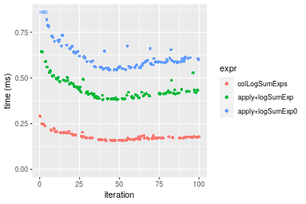

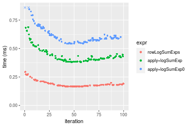
_Table: Benchmarking of colLogSumExps() and rowLogSumExps() on 100x100 data (original and transposed).  The top panel shows times in milliseconds and the bottom panel shows relative times._


|   |expr          |     min|       lq|     mean|   median|       uq|     max|
|:--|:-------------|-------:|--------:|--------:|--------:|--------:|-------:|
|1  |colLogSumExps | 157.921| 167.3080| 180.6528| 172.7235| 186.9930| 289.930|
|2  |rowLogSumExps | 165.548| 170.3945| 190.2944| 181.1930| 195.1185| 294.609|


|   |expr          |      min|       lq|     mean|   median|       uq|      max|
|:--|:-------------|--------:|--------:|--------:|--------:|--------:|--------:|
|1  |colLogSumExps | 1.000000| 1.000000| 1.000000| 1.000000| 1.000000| 1.000000|
|2  |rowLogSumExps | 1.048296| 1.018448| 1.053371| 1.049035| 1.043454| 1.016138|

_Figure: Benchmarking of colLogSumExps() and rowLogSumExps() on 100x100 data (original and transposed).  Outliers are displayed as crosses. Times are in milliseconds._


### 1000x10 matrix


```r
> X <- data[["1000x10"]]
> gc()
          used  (Mb) gc trigger  (Mb) max used  (Mb)
Ncells 5218689 278.8    8529671 455.6  8529671 455.6
Vcells 9740091  74.4   31876688 243.2 60562128 462.1
> colStats <- microbenchmark(colLogSumExps = colLogSumExps(X, na.rm = FALSE), `apply+logSumExp` = apply(X, 
+     MARGIN = 2L, FUN = logSumExp, na.rm = FALSE), `apply+logSumExp0` = apply(X, MARGIN = 2L, FUN = logSumExp0, 
+     na.rm = FALSE), unit = "ms")
> X <- t(X)
> gc()
          used  (Mb) gc trigger  (Mb) max used  (Mb)
Ncells 5218683 278.8    8529671 455.6  8529671 455.6
Vcells 9750134  74.4   31876688 243.2 60562128 462.1
> rowStats <- microbenchmark(rowLogSumExps = rowLogSumExps(X, na.rm = FALSE), `apply+logSumExp` = apply(X, 
+     MARGIN = 1L, FUN = logSumExp, na.rm = FALSE), `apply+logSumExp0` = apply(X, MARGIN = 1L, FUN = logSumExp0, 
+     na.rm = FALSE), unit = "ms")
```

_Table: Benchmarking of colLogSumExps(), apply+logSumExp() and apply+logSumExp0() on 1000x10 data. The top panel shows times in milliseconds and the bottom panel shows relative times._


|   |expr             |      min|       lq|      mean|   median|        uq|      max|
|:--|:----------------|--------:|--------:|---------:|--------:|---------:|--------:|
|1  |colLogSumExps    | 0.154186| 0.158505| 0.1814515| 0.172183| 0.2007125| 0.265225|
|2  |apply+logSumExp  | 0.228059| 0.233735| 0.2634239| 0.247757| 0.2804950| 0.469100|
|3  |apply+logSumExp0 | 0.270533| 0.277889| 0.3147685| 0.298207| 0.3446450| 0.448955|


|   |expr             |      min|       lq|     mean|   median|       uq|      max|
|:--|:----------------|--------:|--------:|--------:|--------:|--------:|--------:|
|1  |colLogSumExps    | 1.000000| 1.000000| 1.000000| 1.000000| 1.000000| 1.000000|
|2  |apply+logSumExp  | 1.479116| 1.474622| 1.451759| 1.438917| 1.397496| 1.768687|
|3  |apply+logSumExp0 | 1.754589| 1.753188| 1.734725| 1.731919| 1.717108| 1.692733|

_Table: Benchmarking of rowLogSumExps(), apply+logSumExp() and apply+logSumExp0() on 1000x10 data (transposed). The top panel shows times in milliseconds and the bottom panel shows relative times._


|   |expr             |      min|        lq|      mean|    median|        uq|      max|
|:--|:----------------|--------:|---------:|---------:|---------:|---------:|--------:|
|1  |rowLogSumExps    | 0.161690| 0.1670955| 0.1943217| 0.1870175| 0.2125375| 0.270339|
|2  |apply+logSumExp  | 0.228044| 0.2328070| 0.2652763| 0.2485140| 0.2892600| 0.459792|
|3  |apply+logSumExp0 | 0.271421| 0.2770635| 0.3082615| 0.2944350| 0.3266250| 0.434325|


|   |expr             |      min|       lq|     mean|   median|       uq|      max|
|:--|:----------------|--------:|--------:|--------:|--------:|--------:|--------:|
|1  |rowLogSumExps    | 1.000000| 1.000000| 1.000000| 1.000000| 1.000000| 1.000000|
|2  |apply+logSumExp  | 1.410378| 1.393257| 1.365140| 1.328828| 1.360983| 1.700798|
|3  |apply+logSumExp0 | 1.678651| 1.658115| 1.586346| 1.574371| 1.536788| 1.606594|

_Figure: Benchmarking of colLogSumExps(), apply+logSumExp() and apply+logSumExp0() on 1000x10 data  as well as rowLogSumExps(), apply+logSumExp() and apply+logSumExp0() on the same data transposed.  Outliers are displayed as crosses.  Times are in milliseconds._


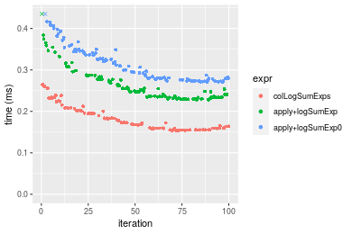


_Table: Benchmarking of colLogSumExps() and rowLogSumExps() on 1000x10 data (original and transposed).  The top panel shows times in milliseconds and the bottom panel shows relative times._


|   |expr          |     min|       lq|     mean|   median|       uq|     max|
|:--|:-------------|-------:|--------:|--------:|--------:|--------:|-------:|
|1  |colLogSumExps | 154.186| 158.5050| 181.4515| 172.1830| 200.7125| 265.225|
|2  |rowLogSumExps | 161.690| 167.0955| 194.3217| 187.0175| 212.5375| 270.339|


|   |expr          |      min|       lq|     mean|   median|       uq|      max|
|:--|:-------------|--------:|--------:|--------:|--------:|--------:|--------:|
|1  |colLogSumExps | 1.000000| 1.000000| 1.000000| 1.000000| 1.000000| 1.000000|
|2  |rowLogSumExps | 1.048669| 1.054197| 1.070929| 1.086155| 1.058915| 1.019282|

_Figure: Benchmarking of colLogSumExps() and rowLogSumExps() on 1000x10 data (original and transposed).  Outliers are displayed as crosses. Times are in milliseconds._


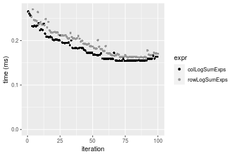

### 10x1000 matrix


```r
> X <- data[["10x1000"]]
> gc()
          used  (Mb) gc trigger  (Mb) max used  (Mb)
Ncells 5218920 278.8    8529671 455.6  8529671 455.6
Vcells 9740933  74.4   31876688 243.2 60562128 462.1
> colStats <- microbenchmark(colLogSumExps = colLogSumExps(X, na.rm = FALSE), `apply+logSumExp` = apply(X, 
+     MARGIN = 2L, FUN = logSumExp, na.rm = FALSE), `apply+logSumExp0` = apply(X, MARGIN = 2L, FUN = logSumExp0, 
+     na.rm = FALSE), unit = "ms")
> X <- t(X)
> gc()
          used  (Mb) gc trigger  (Mb) max used  (Mb)
Ncells 5218896 278.8    8529671 455.6  8529671 455.6
Vcells 9750946  74.4   31876688 243.2 60562128 462.1
> rowStats <- microbenchmark(rowLogSumExps = rowLogSumExps(X, na.rm = FALSE), `apply+logSumExp` = apply(X, 
+     MARGIN = 1L, FUN = logSumExp, na.rm = FALSE), `apply+logSumExp0` = apply(X, MARGIN = 1L, FUN = logSumExp0, 
+     na.rm = FALSE), unit = "ms")
```

_Table: Benchmarking of colLogSumExps(), apply+logSumExp() and apply+logSumExp0() on 10x1000 data. The top panel shows times in milliseconds and the bottom panel shows relative times._


|   |expr             |      min|       lq|      mean|   median|        uq|      max|
|:--|:----------------|--------:|--------:|---------:|--------:|---------:|--------:|
|1  |colLogSumExps    | 0.190061| 0.211368| 0.2199596| 0.217669| 0.2249845| 0.283629|
|2  |apply+logSumExp  | 1.764354| 1.991289| 2.1139157| 2.046578| 2.1101505| 6.844011|
|3  |apply+logSumExp0 | 2.993370| 3.385412| 3.5302578| 3.515979| 3.6096990| 8.362414|


|   |expr             |       min|        lq|      mean|    median|        uq|      max|
|:--|:----------------|---------:|---------:|---------:|---------:|---------:|--------:|
|1  |colLogSumExps    |  1.000000|  1.000000|  1.000000|  1.000000|  1.000000|  1.00000|
|2  |apply+logSumExp  |  9.283093|  9.420955|  9.610475|  9.402248|  9.379093| 24.13015|
|3  |apply+logSumExp0 | 15.749522| 16.016670| 16.049577| 16.152867| 16.044212| 29.48364|

_Table: Benchmarking of rowLogSumExps(), apply+logSumExp() and apply+logSumExp0() on 10x1000 data (transposed). The top panel shows times in milliseconds and the bottom panel shows relative times._


|   |expr             |      min|        lq|      mean|   median|       uq|      max|
|:--|:----------------|--------:|---------:|---------:|--------:|--------:|--------:|
|1  |rowLogSumExps    | 0.194062| 0.2169925| 0.2291399| 0.224315| 0.231641| 0.335443|
|2  |apply+logSumExp  | 1.777240| 1.9722690| 2.0639333| 2.024551| 2.115266| 3.554903|
|3  |apply+logSumExp0 | 3.024545| 3.3911160| 3.5965822| 3.481692| 3.643680| 8.478938|


|   |expr             |       min|        lq|      mean|    median|        uq|      max|
|:--|:----------------|---------:|---------:|---------:|---------:|---------:|--------:|
|1  |rowLogSumExps    |  1.000000|  1.000000|  1.000000|  1.000000|  1.000000|  1.00000|
|2  |apply+logSumExp  |  9.158104|  9.089111|  9.007306|  9.025482|  9.131656| 10.59764|
|3  |apply+logSumExp0 | 15.585457| 15.627803| 15.696009| 15.521443| 15.729856| 25.27684|

_Figure: Benchmarking of colLogSumExps(), apply+logSumExp() and apply+logSumExp0() on 10x1000 data  as well as rowLogSumExps(), apply+logSumExp() and apply+logSumExp0() on the same data transposed.  Outliers are displayed as crosses.  Times are in milliseconds._


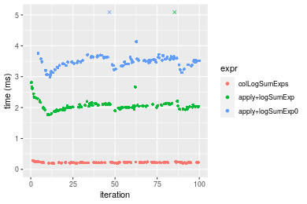

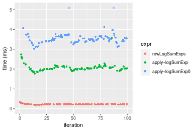
_Table: Benchmarking of colLogSumExps() and rowLogSumExps() on 10x1000 data (original and transposed).  The top panel shows times in milliseconds and the bottom panel shows relative times._


|   |expr          |     min|       lq|     mean|  median|       uq|     max|
|:--|:-------------|-------:|--------:|--------:|-------:|--------:|-------:|
|1  |colLogSumExps | 190.061| 211.3680| 219.9596| 217.669| 224.9845| 283.629|
|2  |rowLogSumExps | 194.062| 216.9925| 229.1399| 224.315| 231.6410| 335.443|


|   |expr          |      min|      lq|     mean|   median|       uq|      max|
|:--|:-------------|--------:|-------:|--------:|--------:|--------:|--------:|
|1  |colLogSumExps | 1.000000| 1.00000| 1.000000| 1.000000| 1.000000| 1.000000|
|2  |rowLogSumExps | 1.021051| 1.02661| 1.041737| 1.030533| 1.029586| 1.182682|

_Figure: Benchmarking of colLogSumExps() and rowLogSumExps() on 10x1000 data (original and transposed).  Outliers are displayed as crosses. Times are in milliseconds._


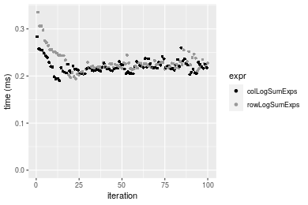

### 100x1000 matrix


```r
> X <- data[["100x1000"]]
> gc()
          used  (Mb) gc trigger  (Mb) max used  (Mb)
Ncells 5219106 278.8    8529671 455.6  8529671 455.6
Vcells 9741475  74.4   31876688 243.2 60562128 462.1
> colStats <- microbenchmark(colLogSumExps = colLogSumExps(X, na.rm = FALSE), `apply+logSumExp` = apply(X, 
+     MARGIN = 2L, FUN = logSumExp, na.rm = FALSE), `apply+logSumExp0` = apply(X, MARGIN = 2L, FUN = logSumExp0, 
+     na.rm = FALSE), unit = "ms")
> X <- t(X)
> gc()
          used  (Mb) gc trigger  (Mb) max used  (Mb)
Ncells 5219100 278.8    8529671 455.6  8529671 455.6
Vcells 9841518  75.1   31876688 243.2 60562128 462.1
> rowStats <- microbenchmark(rowLogSumExps = rowLogSumExps(X, na.rm = FALSE), `apply+logSumExp` = apply(X, 
+     MARGIN = 1L, FUN = logSumExp, na.rm = FALSE), `apply+logSumExp0` = apply(X, MARGIN = 1L, FUN = logSumExp0, 
+     na.rm = FALSE), unit = "ms")
```

_Table: Benchmarking of colLogSumExps(), apply+logSumExp() and apply+logSumExp0() on 100x1000 data. The top panel shows times in milliseconds and the bottom panel shows relative times._


|   |expr             |      min|       lq|     mean|   median|       uq|       max|
|:--|:----------------|--------:|--------:|--------:|--------:|--------:|---------:|
|1  |colLogSumExps    | 1.624391| 1.801557| 1.831439| 1.812264| 1.841316|  2.302175|
|2  |apply+logSumExp  | 3.776501| 4.174838| 4.484965| 4.217352| 4.271068| 25.059164|
|3  |apply+logSumExp0 | 5.371786| 5.919493| 6.429257| 5.985990| 6.074941| 27.184728|


|   |expr             |      min|       lq|     mean|   median|       uq|      max|
|:--|:----------------|--------:|--------:|--------:|--------:|--------:|--------:|
|1  |colLogSumExps    | 1.000000| 1.000000| 1.000000| 1.000000| 1.000000|  1.00000|
|2  |apply+logSumExp  | 2.324872| 2.317349| 2.448875| 2.327118| 2.319573| 10.88500|
|3  |apply+logSumExp0 | 3.306954| 3.285764| 3.510495| 3.303046| 3.299238| 11.80828|

_Table: Benchmarking of rowLogSumExps(), apply+logSumExp() and apply+logSumExp0() on 100x1000 data (transposed). The top panel shows times in milliseconds and the bottom panel shows relative times._


|   |expr             |      min|       lq|     mean|   median|       uq|       max|
|:--|:----------------|--------:|--------:|--------:|--------:|--------:|---------:|
|1  |rowLogSumExps    | 1.752514| 1.911463| 1.957864| 1.923861| 1.958441|  2.867753|
|2  |apply+logSumExp  | 3.780918| 4.187303| 4.473450| 4.231286| 4.299059| 25.509167|
|3  |apply+logSumExp0 | 5.396677| 5.923896| 6.441987| 5.986849| 6.092803| 26.030105|


|   |expr             |      min|       lq|     mean|   median|       uq|      max|
|:--|:----------------|--------:|--------:|--------:|--------:|--------:|--------:|
|1  |rowLogSumExps    | 1.000000| 1.000000| 1.000000| 1.000000| 1.000000| 1.000000|
|2  |apply+logSumExp  | 2.157425| 2.190627| 2.284862| 2.199371| 2.195143| 8.895176|
|3  |apply+logSumExp0 | 3.079392| 3.099142| 3.290314| 3.111892| 3.111047| 9.076830|

_Figure: Benchmarking of colLogSumExps(), apply+logSumExp() and apply+logSumExp0() on 100x1000 data  as well as rowLogSumExps(), apply+logSumExp() and apply+logSumExp0() on the same data transposed.  Outliers are displayed as crosses.  Times are in milliseconds._


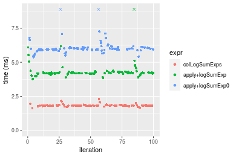

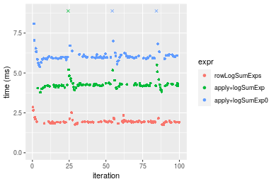
_Table: Benchmarking of colLogSumExps() and rowLogSumExps() on 100x1000 data (original and transposed).  The top panel shows times in milliseconds and the bottom panel shows relative times._


|   |expr          |      min|       lq|     mean|   median|       uq|      max|
|:--|:-------------|--------:|--------:|--------:|--------:|--------:|--------:|
|1  |colLogSumExps | 1.624391| 1.801557| 1.831439| 1.812264| 1.841316| 2.302175|
|2  |rowLogSumExps | 1.752514| 1.911463| 1.957864| 1.923861| 1.958441| 2.867753|


|   |expr          |      min|       lq|     mean|   median|      uq|      max|
|:--|:-------------|--------:|--------:|--------:|--------:|-------:|--------:|
|1  |colLogSumExps | 1.000000| 1.000000| 1.000000| 1.000000| 1.00000| 1.000000|
|2  |rowLogSumExps | 1.078874| 1.061006| 1.069031| 1.061579| 1.06361| 1.245671|

_Figure: Benchmarking of colLogSumExps() and rowLogSumExps() on 100x1000 data (original and transposed).  Outliers are displayed as crosses. Times are in milliseconds._


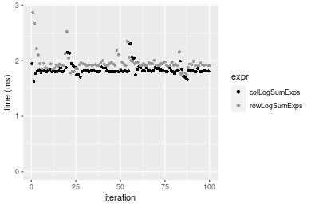

### 1000x100 matrix


```r
> X <- data[["1000x100"]]
> gc()
          used  (Mb) gc trigger  (Mb) max used  (Mb)
Ncells 5219312 278.8    8529671 455.6  8529671 455.6
Vcells 9742136  74.4   31876688 243.2 60562128 462.1
> colStats <- microbenchmark(colLogSumExps = colLogSumExps(X, na.rm = FALSE), `apply+logSumExp` = apply(X, 
+     MARGIN = 2L, FUN = logSumExp, na.rm = FALSE), `apply+logSumExp0` = apply(X, MARGIN = 2L, FUN = logSumExp0, 
+     na.rm = FALSE), unit = "ms")
> X <- t(X)
> gc()
          used  (Mb) gc trigger  (Mb) max used  (Mb)
Ncells 5219306 278.8    8529671 455.6  8529671 455.6
Vcells 9842179  75.1   31876688 243.2 60562128 462.1
> rowStats <- microbenchmark(rowLogSumExps = rowLogSumExps(X, na.rm = FALSE), `apply+logSumExp` = apply(X, 
+     MARGIN = 1L, FUN = logSumExp, na.rm = FALSE), `apply+logSumExp0` = apply(X, MARGIN = 1L, FUN = logSumExp0, 
+     na.rm = FALSE), unit = "ms")
```

_Table: Benchmarking of colLogSumExps(), apply+logSumExp() and apply+logSumExp0() on 1000x100 data. The top panel shows times in milliseconds and the bottom panel shows relative times._


|   |expr             |      min|       lq|     mean|   median|       uq|       max|
|:--|:----------------|--------:|--------:|--------:|--------:|--------:|---------:|
|1  |colLogSumExps    | 1.517303| 1.733855| 1.773318| 1.779090| 1.800228|  2.310471|
|2  |apply+logSumExp  | 2.216948| 2.432158| 2.553887| 2.474226| 2.508740| 10.567098|
|3  |apply+logSumExp0 | 2.592625| 2.825159| 3.043045| 2.875790| 2.923199| 11.135143|


|   |expr             |      min|       lq|     mean|   median|       uq|      max|
|:--|:----------------|--------:|--------:|--------:|--------:|--------:|--------:|
|1  |colLogSumExps    | 1.000000| 1.000000| 1.000000| 1.000000| 1.000000| 1.000000|
|2  |apply+logSumExp  | 1.461111| 1.402746| 1.440174| 1.390725| 1.393568| 4.573569|
|3  |apply+logSumExp0 | 1.708706| 1.629409| 1.716017| 1.616438| 1.623794| 4.819426|

_Table: Benchmarking of rowLogSumExps(), apply+logSumExp() and apply+logSumExp0() on 1000x100 data (transposed). The top panel shows times in milliseconds and the bottom panel shows relative times._


|   |expr             |      min|       lq|     mean|   median|       uq|       max|
|:--|:----------------|--------:|--------:|--------:|--------:|--------:|---------:|
|1  |rowLogSumExps    | 1.610505| 1.838343| 1.878647| 1.893433| 1.907017|  2.480900|
|2  |apply+logSumExp  | 2.181577| 2.453104| 2.513237| 2.514174| 2.556699|  3.612257|
|3  |apply+logSumExp0 | 2.651415| 2.857989| 3.184226| 2.938034| 3.005631| 11.197049|


|   |expr             |      min|       lq|     mean|   median|      uq|      max|
|:--|:----------------|--------:|--------:|--------:|--------:|-------:|--------:|
|1  |rowLogSumExps    | 1.000000| 1.000000| 1.000000| 1.000000| 1.00000| 1.000000|
|2  |apply+logSumExp  | 1.354592| 1.334411| 1.337791| 1.327839| 1.34068| 1.456027|
|3  |apply+logSumExp0 | 1.646325| 1.554655| 1.694957| 1.551697| 1.57609| 4.513301|

_Figure: Benchmarking of colLogSumExps(), apply+logSumExp() and apply+logSumExp0() on 1000x100 data  as well as rowLogSumExps(), apply+logSumExp() and apply+logSumExp0() on the same data transposed.  Outliers are displayed as crosses.  Times are in milliseconds._


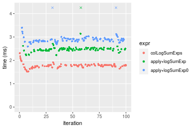

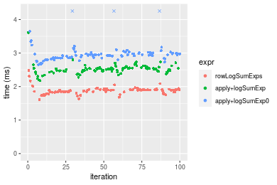
_Table: Benchmarking of colLogSumExps() and rowLogSumExps() on 1000x100 data (original and transposed).  The top panel shows times in milliseconds and the bottom panel shows relative times._


|   |expr          |      min|       lq|     mean|   median|       uq|      max|
|:--|:-------------|--------:|--------:|--------:|--------:|--------:|--------:|
|1  |colLogSumExps | 1.517303| 1.733855| 1.773318| 1.779090| 1.800228| 2.310471|
|2  |rowLogSumExps | 1.610505| 1.838343| 1.878647| 1.893433| 1.907017| 2.480900|


|   |expr          |      min|       lq|     mean|  median|      uq|      max|
|:--|:-------------|--------:|--------:|--------:|-------:|-------:|--------:|
|1  |colLogSumExps | 1.000000| 1.000000| 1.000000| 1.00000| 1.00000| 1.000000|
|2  |rowLogSumExps | 1.061426| 1.060263| 1.059396| 1.06427| 1.05932| 1.073764|

_Figure: Benchmarking of colLogSumExps() and rowLogSumExps() on 1000x100 data (original and transposed).  Outliers are displayed as crosses. Times are in milliseconds._


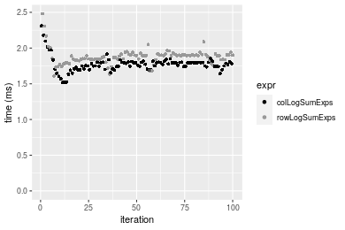


## Appendix

### Session information
```r
R version 4.1.1 Patched (2021-08-10 r80727)
Platform: x86_64-pc-linux-gnu (64-bit)
Running under: Ubuntu 18.04.5 LTS

Matrix products: default
BLAS:   /home/hb/software/R-devel/R-4-1-branch/lib/R/lib/libRblas.so
LAPACK: /home/hb/software/R-devel/R-4-1-branch/lib/R/lib/libRlapack.so

locale:
 [1] LC_CTYPE=en_US.UTF-8       LC_NUMERIC=C              
 [3] LC_TIME=en_US.UTF-8        LC_COLLATE=en_US.UTF-8    
 [5] LC_MONETARY=en_US.UTF-8    LC_MESSAGES=en_US.UTF-8   
 [7] LC_PAPER=en_US.UTF-8       LC_NAME=C                 
 [9] LC_ADDRESS=C               LC_TELEPHONE=C            
[11] LC_MEASUREMENT=en_US.UTF-8 LC_IDENTIFICATION=C       

attached base packages:
[1] stats     graphics  grDevices utils     datasets  methods   base     

other attached packages:
[1] microbenchmark_1.4-7   matrixStats_0.60.1     ggplot2_3.3.5         
[4] knitr_1.33             R.devices_2.17.0       R.utils_2.10.1        
[7] R.oo_1.24.0            R.methodsS3_1.8.1-9001 history_0.0.1-9000    

loaded via a namespace (and not attached):
 [1] Biobase_2.52.0          httr_1.4.2              splines_4.1.1          
 [4] bit64_4.0.5             network_1.17.1          assertthat_0.2.1       
 [7] highr_0.9               stats4_4.1.1            blob_1.2.2             
[10] GenomeInfoDbData_1.2.6  robustbase_0.93-8       pillar_1.6.2           
[13] RSQLite_2.2.8           lattice_0.20-44         glue_1.4.2             
[16] digest_0.6.27           XVector_0.32.0          colorspace_2.0-2       
[19] Matrix_1.3-4            XML_3.99-0.7            pkgconfig_2.0.3        
[22] zlibbioc_1.38.0         genefilter_1.74.0       purrr_0.3.4            
[25] ergm_4.1.2              xtable_1.8-4            scales_1.1.1           
[28] tibble_3.1.4            annotate_1.70.0         KEGGREST_1.32.0        
[31] farver_2.1.0            generics_0.1.0          IRanges_2.26.0         
[34] ellipsis_0.3.2          cachem_1.0.6            withr_2.4.2            
[37] BiocGenerics_0.38.0     mime_0.11               survival_3.2-13        
[40] magrittr_2.0.1          crayon_1.4.1            statnet.common_4.5.0   
[43] memoise_2.0.0           laeken_0.5.1            fansi_0.5.0            
[46] R.cache_0.15.0          MASS_7.3-54             R.rsp_0.44.0           
[49] progressr_0.8.0         tools_4.1.1             lifecycle_1.0.0        
[52] S4Vectors_0.30.0        trust_0.1-8             munsell_0.5.0          
[55] tabby_0.0.1-9001        AnnotationDbi_1.54.1    Biostrings_2.60.2      
[58] compiler_4.1.1          GenomeInfoDb_1.28.1     rlang_0.4.11           
[61] grid_4.1.1              RCurl_1.98-1.4          cwhmisc_6.6            
[64] rappdirs_0.3.3          startup_0.15.0          labeling_0.4.2         
[67] bitops_1.0-7            base64enc_0.1-3         boot_1.3-28            
[70] gtable_0.3.0            DBI_1.1.1               markdown_1.1           
[73] R6_2.5.1                lpSolveAPI_5.5.2.0-17.7 rle_0.9.2              
[76] dplyr_1.0.7             fastmap_1.1.0           bit_4.0.4              
[79] utf8_1.2.2              parallel_4.1.1          Rcpp_1.0.7             
[82] vctrs_0.3.8             png_0.1-7               DEoptimR_1.0-9         
[85] tidyselect_1.1.1        xfun_0.25               coda_0.19-4            
```
Total processing time was 16.57 secs.


### Reproducibility
To reproduce this report, do:
```r
html <- matrixStats:::benchmark('colLogSumExps')
```

[RSP]: https://cran.r-project.org/package=R.rsp
[matrixStats]: https://cran.r-project.org/package=matrixStats

[StackOverflow:colMins?]: https://stackoverflow.com/questions/13676878 "Stack Overflow: fastest way to get Min from every column in a matrix?"
[StackOverflow:colSds?]: https://stackoverflow.com/questions/17549762 "Stack Overflow: Is there such 'colsd' in R?"
[StackOverflow:rowProds?]: https://stackoverflow.com/questions/20198801/ "Stack Overflow: Row product of matrix and column sum of matrix"

---------------------------------------
Copyright Henrik Bengtsson. Last updated on 2021-08-25 18:56:13 (+0200 UTC). Powered by [RSP].

<script>
 var link = document.createElement('link');
 link.rel = 'icon';
 link.href = "data:image/png;base64,iVBORw0KGgoAAAANSUhEUgAAACAAAAAgCAMAAABEpIrGAAAA21BMVEUAAAAAAP8AAP8AAP8AAP8AAP8AAP8AAP8AAP8AAP8AAP8AAP8AAP8AAP8AAP8AAP8AAP8AAP8AAP8AAP8AAP8AAP8AAP8AAP8AAP8AAP8AAP8AAP8AAP8AAP8AAP8AAP8AAP8AAP8AAP8AAP8AAP8AAP8AAP8AAP8AAP8AAP8BAf4CAv0DA/wdHeIeHuEfH+AgIN8hId4lJdomJtknJ9g+PsE/P8BAQL9yco10dIt1dYp3d4h4eIeVlWqWlmmXl2iYmGeZmWabm2Tn5xjo6Bfp6Rb39wj4+Af//wA2M9hbAAAASXRSTlMAAQIJCgsMJSYnKD4/QGRlZmhpamtsbautrrCxuru8y8zN5ebn6Pn6+///////////////////////////////////////////LsUNcQAAAS9JREFUOI29k21XgkAQhVcFytdSMqMETU26UVqGmpaiFbL//xc1cAhhwVNf6n5i5z67M2dmYOyfJZUqlVLhkKucG7cgmUZTybDz6g0iDeq51PUr37Ds2cy2/C9NeES5puDjxuUk1xnToZsg8pfA3avHQ3lLIi7iWRrkv/OYtkScxBIMgDee0ALoyxHQBJ68JLCjOtQIMIANF7QG9G9fNnHvisCHBVMKgSJgiz7nE+AoBKrAPA3MgepvgR9TSCasrCKH0eB1wBGBFdCO+nAGjMVGPcQb5bd6mQRegN6+1axOs9nGfYcCtfi4NQosdtH7dB+txFIpXQqN1p9B/asRHToyS0jRgpV7nk4nwcq1BJ+x3Gl/v7S9Wmpp/aGquum7w3ZDyrADFYrl8vHBH+ev9AUASW1dmU4h4wAAAABJRU5ErkJggg=="
 document.getElementsByTagName('head')[0].appendChild(link);
</script>


