[matrixStats]: Benchmark report

---------------------------------------


# colLogSumExps() and rowLogSumExps() benchmarks on subsetted computation

This report benchmark the performance of colLogSumExps() and rowLogSumExps() on subsetted computation.


## Data
```r
> rmatrix <- function(nrow, ncol, mode = c("logical", "double", "integer", "index"), range = c(-100, 
+     +100), na_prob = 0) {
+     mode <- match.arg(mode)
+     n <- nrow * ncol
+     if (mode == "logical") {
+         x <- sample(c(FALSE, TRUE), size = n, replace = TRUE)
+     }     else if (mode == "index") {
+         x <- seq_len(n)
+         mode <- "integer"
+     }     else {
+         x <- runif(n, min = range[1], max = range[2])
+     }
+     storage.mode(x) <- mode
+     if (na_prob > 0) 
+         x[sample(n, size = na_prob * n)] <- NA
+     dim(x) <- c(nrow, ncol)
+     x
+ }
> rmatrices <- function(scale = 10, seed = 1, ...) {
+     set.seed(seed)
+     data <- list()
+     data[[1]] <- rmatrix(nrow = scale * 1, ncol = scale * 1, ...)
+     data[[2]] <- rmatrix(nrow = scale * 10, ncol = scale * 10, ...)
+     data[[3]] <- rmatrix(nrow = scale * 100, ncol = scale * 1, ...)
+     data[[4]] <- t(data[[3]])
+     data[[5]] <- rmatrix(nrow = scale * 10, ncol = scale * 100, ...)
+     data[[6]] <- t(data[[5]])
+     names(data) <- sapply(data, FUN = function(x) paste(dim(x), collapse = "x"))
+     data
+ }
> data <- rmatrices(mode = "double")
```

## Results

### 10x10 matrix


```r
> X <- data[["10x10"]]
> rows <- sample.int(nrow(X), size = nrow(X) * 0.7)
> cols <- sample.int(ncol(X), size = ncol(X) * 0.7)
> X_S <- X[rows, cols]
> gc()
           used  (Mb) gc trigger  (Mb) max used  (Mb)
Ncells  5224956 279.1    8529671 455.6  8529671 455.6
Vcells 10071502  76.9   31876688 243.2 60562128 462.1
> colStats <- microbenchmark(colLogSumExps_X_S = colLogSumExps(X_S, na.rm = FALSE), `colLogSumExps(X, rows, cols)` = colLogSumExps(X, 
+     rows = rows, cols = cols, na.rm = FALSE), `colLogSumExps(X[rows, cols])` = colLogSumExps(X[rows, 
+     cols], na.rm = FALSE), unit = "ms")
> X <- t(X)
> X_S <- t(X_S)
> gc()
           used  (Mb) gc trigger  (Mb) max used  (Mb)
Ncells  5216600 278.6    8529671 455.6  8529671 455.6
Vcells 10044274  76.7   31876688 243.2 60562128 462.1
> rowStats <- microbenchmark(rowLogSumExps_X_S = rowLogSumExps(X_S, na.rm = FALSE), `rowLogSumExps(X, cols, rows)` = rowLogSumExps(X, 
+     rows = cols, cols = rows, na.rm = FALSE), `rowLogSumExps(X[cols, rows])` = rowLogSumExps(X[cols, 
+     rows], na.rm = FALSE), unit = "ms")
```

_Table: Benchmarking of colLogSumExps_X_S(), colLogSumExps(X, rows, cols)() and colLogSumExps(X[rows, cols])() on 10x10 data. The top panel shows times in milliseconds and the bottom panel shows relative times._


|   |expr                         |      min|        lq|      mean|   median|       uq|      max|
|:--|:----------------------------|--------:|---------:|---------:|--------:|--------:|--------:|
|1  |colLogSumExps_X_S            | 0.003153| 0.0032055| 0.0042499| 0.003255| 0.003335| 0.097414|
|2  |colLogSumExps(X, rows, cols) | 0.003507| 0.0036035| 0.0037238| 0.003647| 0.003753| 0.006518|
|3  |colLogSumExps(X[rows, cols]) | 0.004060| 0.0042820| 0.0045311| 0.004370| 0.004523| 0.013022|


|   |expr                         |      min|       lq|     mean|  median|       uq|       max|
|:--|:----------------------------|--------:|--------:|--------:|-------:|--------:|---------:|
|1  |colLogSumExps_X_S            | 1.000000| 1.000000| 1.000000| 1.00000| 1.000000| 1.0000000|
|2  |colLogSumExps(X, rows, cols) | 1.112274| 1.124162| 0.876208| 1.12043| 1.125337| 0.0669103|
|3  |colLogSumExps(X[rows, cols]) | 1.287662| 1.335829| 1.066158| 1.34255| 1.356222| 0.1336769|

_Table: Benchmarking of rowLogSumExps_X_S(), rowLogSumExps(X, cols, rows)() and rowLogSumExps(X[cols, rows])() on 10x10 data (transposed). The top panel shows times in milliseconds and the bottom panel shows relative times._


|   |expr                         |      min|        lq|      mean|    median|        uq|      max|
|:--|:----------------------------|--------:|---------:|---------:|---------:|---------:|--------:|
|1  |rowLogSumExps_X_S            | 0.003180| 0.0032400| 0.0033692| 0.0032845| 0.0033800| 0.006432|
|2  |rowLogSumExps(X, cols, rows) | 0.003584| 0.0036505| 0.0047052| 0.0037270| 0.0038125| 0.096998|
|3  |rowLogSumExps(X[cols, rows]) | 0.004095| 0.0043450| 0.0044783| 0.0044225| 0.0045425| 0.006256|


|   |expr                         |      min|       lq|     mean|   median|       uq|        max|
|:--|:----------------------------|--------:|--------:|--------:|--------:|--------:|----------:|
|1  |rowLogSumExps_X_S            | 1.000000| 1.000000| 1.000000| 1.000000| 1.000000|  1.0000000|
|2  |rowLogSumExps(X, cols, rows) | 1.127044| 1.126697| 1.396514| 1.134724| 1.127959| 15.0805348|
|3  |rowLogSumExps(X[cols, rows]) | 1.287736| 1.341049| 1.329196| 1.346476| 1.343935|  0.9726368|

_Figure: Benchmarking of colLogSumExps_X_S(), colLogSumExps(X, rows, cols)() and colLogSumExps(X[rows, cols])() on 10x10 data  as well as rowLogSumExps_X_S(), rowLogSumExps(X, cols, rows)() and rowLogSumExps(X[cols, rows])() on the same data transposed.  Outliers are displayed as crosses.  Times are in milliseconds._


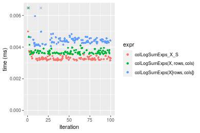


_Table: Benchmarking of colLogSumExps_X_S() and rowLogSumExps_X_S() on 10x10 data (original and transposed).  The top panel shows times in milliseconds and the bottom panel shows relative times._


|   |expr              |   min|     lq|    mean| median|    uq|    max|
|:--|:-----------------|-----:|------:|-------:|------:|-----:|------:|
|1  |colLogSumExps_X_S | 3.153| 3.2055| 4.24995| 3.2550| 3.335| 97.414|
|2  |rowLogSumExps_X_S | 3.180| 3.2400| 3.36921| 3.2845| 3.380|  6.432|


|   |expr              |      min|       lq|      mean|   median|       uq|       max|
|:--|:-----------------|--------:|--------:|---------:|--------:|--------:|---------:|
|1  |colLogSumExps_X_S | 1.000000| 1.000000| 1.0000000| 1.000000| 1.000000| 1.0000000|
|2  |rowLogSumExps_X_S | 1.008563| 1.010763| 0.7927646| 1.009063| 1.013493| 0.0660275|

_Figure: Benchmarking of colLogSumExps_X_S() and rowLogSumExps_X_S() on 10x10 data (original and transposed).  Outliers are displayed as crosses. Times are in milliseconds._


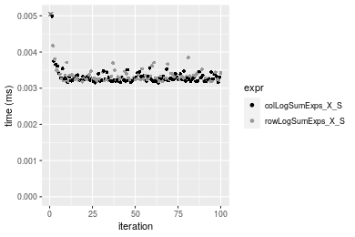

### 100x100 matrix


```r
> X <- data[["100x100"]]
> rows <- sample.int(nrow(X), size = nrow(X) * 0.7)
> cols <- sample.int(ncol(X), size = ncol(X) * 0.7)
> X_S <- X[rows, cols]
> gc()
          used  (Mb) gc trigger  (Mb) max used  (Mb)
Ncells 5215243 278.6    8529671 455.6  8529671 455.6
Vcells 9714948  74.2   31876688 243.2 60562128 462.1
> colStats <- microbenchmark(colLogSumExps_X_S = colLogSumExps(X_S, na.rm = FALSE), `colLogSumExps(X, rows, cols)` = colLogSumExps(X, 
+     rows = rows, cols = cols, na.rm = FALSE), `colLogSumExps(X[rows, cols])` = colLogSumExps(X[rows, 
+     cols], na.rm = FALSE), unit = "ms")
> X <- t(X)
> X_S <- t(X_S)
> gc()
          used  (Mb) gc trigger  (Mb) max used  (Mb)
Ncells 5215219 278.6    8529671 455.6  8529671 455.6
Vcells 9725001  74.2   31876688 243.2 60562128 462.1
> rowStats <- microbenchmark(rowLogSumExps_X_S = rowLogSumExps(X_S, na.rm = FALSE), `rowLogSumExps(X, cols, rows)` = rowLogSumExps(X, 
+     rows = cols, cols = rows, na.rm = FALSE), `rowLogSumExps(X[cols, rows])` = rowLogSumExps(X[cols, 
+     rows], na.rm = FALSE), unit = "ms")
```

_Table: Benchmarking of colLogSumExps_X_S(), colLogSumExps(X, rows, cols)() and colLogSumExps(X[rows, cols])() on 100x100 data. The top panel shows times in milliseconds and the bottom panel shows relative times._


|   |expr                         |      min|        lq|      mean|    median|        uq|      max|
|:--|:----------------------------|--------:|---------:|---------:|---------:|---------:|--------:|
|1  |colLogSumExps_X_S            | 0.090567| 0.0967505| 0.1061635| 0.1031355| 0.1137425| 0.138596|
|2  |colLogSumExps(X, rows, cols) | 0.093520| 0.0998940| 0.1083768| 0.1058630| 0.1177440| 0.137605|
|3  |colLogSumExps(X[rows, cols]) | 0.102416| 0.1090815| 0.1198994| 0.1162185| 0.1291190| 0.177860|


|   |expr                         |      min|       lq|     mean|   median|       uq|       max|
|:--|:----------------------------|--------:|--------:|--------:|--------:|--------:|---------:|
|1  |colLogSumExps_X_S            | 1.000000| 1.000000| 1.000000| 1.000000| 1.000000| 1.0000000|
|2  |colLogSumExps(X, rows, cols) | 1.032606| 1.032491| 1.020849| 1.026446| 1.035180| 0.9928497|
|3  |colLogSumExps(X[rows, cols]) | 1.130831| 1.127452| 1.129385| 1.126853| 1.135187| 1.2832982|

_Table: Benchmarking of rowLogSumExps_X_S(), rowLogSumExps(X, cols, rows)() and rowLogSumExps(X[cols, rows])() on 100x100 data (transposed). The top panel shows times in milliseconds and the bottom panel shows relative times._


|   |expr                         |      min|       lq|      mean|    median|        uq|      max|
|:--|:----------------------------|--------:|--------:|---------:|---------:|---------:|--------:|
|1  |rowLogSumExps_X_S            | 0.092120| 0.098513| 0.1101811| 0.1080375| 0.1198965| 0.140728|
|2  |rowLogSumExps(X, cols, rows) | 0.093270| 0.105276| 0.1114590| 0.1091665| 0.1173100| 0.163011|
|3  |rowLogSumExps(X[cols, rows]) | 0.103799| 0.112263| 0.1219352| 0.1211630| 0.1300495| 0.157524|


|   |expr                         |      min|       lq|     mean|  median|        uq|      max|
|:--|:----------------------------|--------:|--------:|--------:|-------:|---------:|--------:|
|1  |rowLogSumExps_X_S            | 1.000000| 1.000000| 1.000000| 1.00000| 1.0000000| 1.000000|
|2  |rowLogSumExps(X, cols, rows) | 1.012484| 1.068651| 1.011598| 1.01045| 0.9784272| 1.158341|
|3  |rowLogSumExps(X[cols, rows]) | 1.126780| 1.139576| 1.106679| 1.12149| 1.0846814| 1.119351|

_Figure: Benchmarking of colLogSumExps_X_S(), colLogSumExps(X, rows, cols)() and colLogSumExps(X[rows, cols])() on 100x100 data  as well as rowLogSumExps_X_S(), rowLogSumExps(X, cols, rows)() and rowLogSumExps(X[cols, rows])() on the same data transposed.  Outliers are displayed as crosses.  Times are in milliseconds._


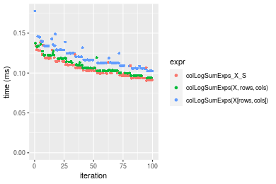

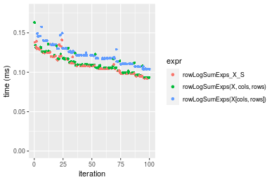
_Table: Benchmarking of colLogSumExps_X_S() and rowLogSumExps_X_S() on 100x100 data (original and transposed).  The top panel shows times in milliseconds and the bottom panel shows relative times._


|   |expr              |    min|      lq|     mean|   median|       uq|     max|
|:--|:-----------------|------:|-------:|--------:|--------:|--------:|-------:|
|1  |colLogSumExps_X_S | 90.567| 96.7505| 106.1635| 103.1355| 113.7425| 138.596|
|2  |rowLogSumExps_X_S | 92.120| 98.5130| 110.1811| 108.0375| 119.8965| 140.728|


|   |expr              |      min|       lq|     mean|  median|       uq|      max|
|:--|:-----------------|--------:|--------:|--------:|-------:|--------:|--------:|
|1  |colLogSumExps_X_S | 1.000000| 1.000000| 1.000000| 1.00000| 1.000000| 1.000000|
|2  |rowLogSumExps_X_S | 1.017148| 1.018217| 1.037844| 1.04753| 1.054105| 1.015383|

_Figure: Benchmarking of colLogSumExps_X_S() and rowLogSumExps_X_S() on 100x100 data (original and transposed).  Outliers are displayed as crosses. Times are in milliseconds._


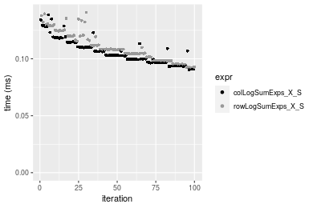

### 1000x10 matrix


```r
> X <- data[["1000x10"]]
> rows <- sample.int(nrow(X), size = nrow(X) * 0.7)
> cols <- sample.int(ncol(X), size = ncol(X) * 0.7)
> X_S <- X[rows, cols]
> gc()
          used  (Mb) gc trigger  (Mb) max used  (Mb)
Ncells 5215984 278.6    8529671 455.6  8529671 455.6
Vcells 9718996  74.2   31876688 243.2 60562128 462.1
> colStats <- microbenchmark(colLogSumExps_X_S = colLogSumExps(X_S, na.rm = FALSE), `colLogSumExps(X, rows, cols)` = colLogSumExps(X, 
+     rows = rows, cols = cols, na.rm = FALSE), `colLogSumExps(X[rows, cols])` = colLogSumExps(X[rows, 
+     cols], na.rm = FALSE), unit = "ms")
> X <- t(X)
> X_S <- t(X_S)
> gc()
          used  (Mb) gc trigger  (Mb) max used  (Mb)
Ncells 5215960 278.6    8529671 455.6  8529671 455.6
Vcells 9729049  74.3   31876688 243.2 60562128 462.1
> rowStats <- microbenchmark(rowLogSumExps_X_S = rowLogSumExps(X_S, na.rm = FALSE), `rowLogSumExps(X, cols, rows)` = rowLogSumExps(X, 
+     rows = cols, cols = rows, na.rm = FALSE), `rowLogSumExps(X[cols, rows])` = rowLogSumExps(X[cols, 
+     rows], na.rm = FALSE), unit = "ms")
```

_Table: Benchmarking of colLogSumExps_X_S(), colLogSumExps(X, rows, cols)() and colLogSumExps(X[rows, cols])() on 1000x10 data. The top panel shows times in milliseconds and the bottom panel shows relative times._


|   |expr                         |      min|        lq|      mean|    median|        uq|      max|
|:--|:----------------------------|--------:|---------:|---------:|---------:|---------:|--------:|
|1  |colLogSumExps_X_S            | 0.089180| 0.0951845| 0.1021562| 0.0983575| 0.1092525| 0.125407|
|2  |colLogSumExps(X, rows, cols) | 0.090603| 0.0967450| 0.1049659| 0.1027125| 0.1104635| 0.133387|
|3  |colLogSumExps(X[rows, cols]) | 0.098990| 0.1050460| 0.1150448| 0.1118800| 0.1242225| 0.171096|


|   |expr                         |      min|       lq|     mean|   median|       uq|      max|
|:--|:----------------------------|--------:|--------:|--------:|--------:|--------:|--------:|
|1  |colLogSumExps_X_S            | 1.000000| 1.000000| 1.000000| 1.000000| 1.000000| 1.000000|
|2  |colLogSumExps(X, rows, cols) | 1.015956| 1.016395| 1.027504| 1.044277| 1.011084| 1.063633|
|3  |colLogSumExps(X[rows, cols]) | 1.110002| 1.103604| 1.126166| 1.137483| 1.137022| 1.364326|

_Table: Benchmarking of rowLogSumExps_X_S(), rowLogSumExps(X, cols, rows)() and rowLogSumExps(X[cols, rows])() on 1000x10 data (transposed). The top panel shows times in milliseconds and the bottom panel shows relative times._


|   |expr                         |      min|        lq|      mean|   median|        uq|      max|
|:--|:----------------------------|--------:|---------:|---------:|--------:|---------:|--------:|
|1  |rowLogSumExps_X_S            | 0.090638| 0.1002485| 0.1075956| 0.104025| 0.1145445| 0.184519|
|2  |rowLogSumExps(X, cols, rows) | 0.091644| 0.0975770| 0.1099123| 0.105153| 0.1159690| 0.200519|
|3  |rowLogSumExps(X[cols, rows]) | 0.102591| 0.1124205| 0.1244612| 0.119713| 0.1337920| 0.216149|


|   |expr                         |      min|        lq|     mean|   median|       uq|      max|
|:--|:----------------------------|--------:|---------:|--------:|--------:|--------:|--------:|
|1  |rowLogSumExps_X_S            | 1.000000| 1.0000000| 1.000000| 1.000000| 1.000000| 1.000000|
|2  |rowLogSumExps(X, cols, rows) | 1.011099| 0.9733512| 1.021532| 1.010844| 1.012436| 1.086712|
|3  |rowLogSumExps(X[cols, rows]) | 1.131876| 1.1214183| 1.156750| 1.150810| 1.168035| 1.171419|

_Figure: Benchmarking of colLogSumExps_X_S(), colLogSumExps(X, rows, cols)() and colLogSumExps(X[rows, cols])() on 1000x10 data  as well as rowLogSumExps_X_S(), rowLogSumExps(X, cols, rows)() and rowLogSumExps(X[cols, rows])() on the same data transposed.  Outliers are displayed as crosses.  Times are in milliseconds._


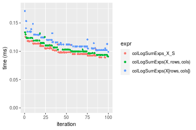

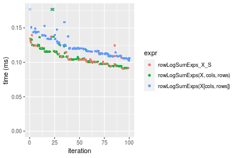
_Table: Benchmarking of colLogSumExps_X_S() and rowLogSumExps_X_S() on 1000x10 data (original and transposed).  The top panel shows times in milliseconds and the bottom panel shows relative times._


|   |expr              |    min|       lq|     mean|   median|       uq|     max|
|:--|:-----------------|------:|--------:|--------:|--------:|--------:|-------:|
|1  |colLogSumExps_X_S | 89.180|  95.1845| 102.1562|  98.3575| 109.2525| 125.407|
|2  |rowLogSumExps_X_S | 90.638| 100.2485| 107.5956| 104.0250| 114.5445| 184.519|


|   |expr              |      min|       lq|     mean|   median|       uq|      max|
|:--|:-----------------|--------:|--------:|--------:|--------:|--------:|--------:|
|1  |colLogSumExps_X_S | 1.000000| 1.000000| 1.000000| 1.000000| 1.000000| 1.000000|
|2  |rowLogSumExps_X_S | 1.016349| 1.053202| 1.053246| 1.057621| 1.048438| 1.471361|

_Figure: Benchmarking of colLogSumExps_X_S() and rowLogSumExps_X_S() on 1000x10 data (original and transposed).  Outliers are displayed as crosses. Times are in milliseconds._


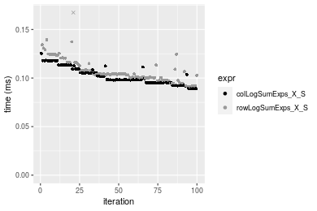

### 10x1000 matrix


```r
> X <- data[["10x1000"]]
> rows <- sample.int(nrow(X), size = nrow(X) * 0.7)
> cols <- sample.int(ncol(X), size = ncol(X) * 0.7)
> X_S <- X[rows, cols]
> gc()
          used  (Mb) gc trigger  (Mb) max used  (Mb)
Ncells 5216188 278.6    8529671 455.6  8529671 455.6
Vcells 9719923  74.2   31876688 243.2 60562128 462.1
> colStats <- microbenchmark(colLogSumExps_X_S = colLogSumExps(X_S, na.rm = FALSE), `colLogSumExps(X, rows, cols)` = colLogSumExps(X, 
+     rows = rows, cols = cols, na.rm = FALSE), `colLogSumExps(X[rows, cols])` = colLogSumExps(X[rows, 
+     cols], na.rm = FALSE), unit = "ms")
> X <- t(X)
> X_S <- t(X_S)
> gc()
          used  (Mb) gc trigger  (Mb) max used  (Mb)
Ncells 5216164 278.6    8529671 455.6  8529671 455.6
Vcells 9729976  74.3   31876688 243.2 60562128 462.1
> rowStats <- microbenchmark(rowLogSumExps_X_S = rowLogSumExps(X_S, na.rm = FALSE), `rowLogSumExps(X, cols, rows)` = rowLogSumExps(X, 
+     rows = cols, cols = rows, na.rm = FALSE), `rowLogSumExps(X[cols, rows])` = rowLogSumExps(X[cols, 
+     rows], na.rm = FALSE), unit = "ms")
```

_Table: Benchmarking of colLogSumExps_X_S(), colLogSumExps(X, rows, cols)() and colLogSumExps(X[rows, cols])() on 10x1000 data. The top panel shows times in milliseconds and the bottom panel shows relative times._


|   |expr                         |      min|        lq|      mean|    median|       uq|      max|
|:--|:----------------------------|--------:|---------:|---------:|---------:|--------:|--------:|
|1  |colLogSumExps_X_S            | 0.102946| 0.1111695| 0.1262989| 0.1261630| 0.137209| 0.186332|
|2  |colLogSumExps(X, rows, cols) | 0.107643| 0.1187910| 0.1294139| 0.1267515| 0.136894| 0.193177|
|3  |colLogSumExps(X[rows, cols]) | 0.116994| 0.1310735| 0.1416186| 0.1394095| 0.150752| 0.185741|


|   |expr                         |      min|       lq|     mean|   median|        uq|       max|
|:--|:----------------------------|--------:|--------:|--------:|--------:|---------:|---------:|
|1  |colLogSumExps_X_S            | 1.000000| 1.000000| 1.000000| 1.000000| 1.0000000| 1.0000000|
|2  |colLogSumExps(X, rows, cols) | 1.045626| 1.068558| 1.024664| 1.004665| 0.9977042| 1.0367355|
|3  |colLogSumExps(X[rows, cols]) | 1.136460| 1.179042| 1.121297| 1.104995| 1.0987034| 0.9968282|

_Table: Benchmarking of rowLogSumExps_X_S(), rowLogSumExps(X, cols, rows)() and rowLogSumExps(X[cols, rows])() on 10x1000 data (transposed). The top panel shows times in milliseconds and the bottom panel shows relative times._


|   |expr                         |      min|        lq|      mean|    median|        uq|      max|
|:--|:----------------------------|--------:|---------:|---------:|---------:|---------:|--------:|
|1  |rowLogSumExps_X_S            | 0.106905| 0.1176905| 0.1297395| 0.1253305| 0.1380135| 0.181775|
|2  |rowLogSumExps(X, cols, rows) | 0.112772| 0.1228200| 0.1352408| 0.1333800| 0.1414230| 0.208652|
|3  |rowLogSumExps(X[cols, rows]) | 0.118833| 0.1296295| 0.1429067| 0.1386620| 0.1534275| 0.193409|


|   |expr                         |      min|       lq|     mean|   median|       uq|      max|
|:--|:----------------------------|--------:|--------:|--------:|--------:|--------:|--------:|
|1  |rowLogSumExps_X_S            | 1.000000| 1.000000| 1.000000| 1.000000| 1.000000| 1.000000|
|2  |rowLogSumExps(X, cols, rows) | 1.054881| 1.043585| 1.042403| 1.064226| 1.024704| 1.147859|
|3  |rowLogSumExps(X[cols, rows]) | 1.111576| 1.101444| 1.101490| 1.106371| 1.111685| 1.064002|

_Figure: Benchmarking of colLogSumExps_X_S(), colLogSumExps(X, rows, cols)() and colLogSumExps(X[rows, cols])() on 10x1000 data  as well as rowLogSumExps_X_S(), rowLogSumExps(X, cols, rows)() and rowLogSumExps(X[cols, rows])() on the same data transposed.  Outliers are displayed as crosses.  Times are in milliseconds._


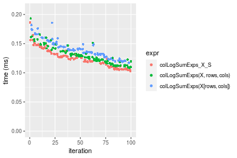

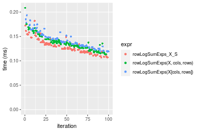
_Table: Benchmarking of colLogSumExps_X_S() and rowLogSumExps_X_S() on 10x1000 data (original and transposed).  The top panel shows times in milliseconds and the bottom panel shows relative times._


|   |expr              |     min|       lq|     mean|   median|       uq|     max|
|:--|:-----------------|-------:|--------:|--------:|--------:|--------:|-------:|
|2  |rowLogSumExps_X_S | 106.905| 117.6905| 129.7395| 125.3305| 138.0135| 181.775|
|1  |colLogSumExps_X_S | 102.946| 111.1695| 126.2989| 126.1630| 137.2090| 186.332|


|   |expr              |       min|       lq|      mean|   median|        uq|     max|
|:--|:-----------------|---------:|--------:|---------:|--------:|---------:|-------:|
|2  |rowLogSumExps_X_S | 1.0000000| 1.000000| 1.0000000| 1.000000| 1.0000000| 1.00000|
|1  |colLogSumExps_X_S | 0.9629671| 0.944592| 0.9734809| 1.006642| 0.9941709| 1.02507|

_Figure: Benchmarking of colLogSumExps_X_S() and rowLogSumExps_X_S() on 10x1000 data (original and transposed).  Outliers are displayed as crosses. Times are in milliseconds._


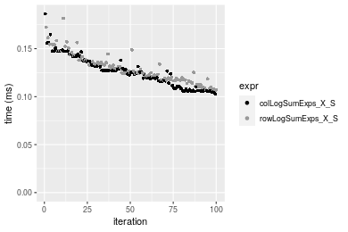

### 100x1000 matrix


```r
> X <- data[["100x1000"]]
> rows <- sample.int(nrow(X), size = nrow(X) * 0.7)
> cols <- sample.int(ncol(X), size = ncol(X) * 0.7)
> X_S <- X[rows, cols]
> gc()
          used  (Mb) gc trigger  (Mb) max used  (Mb)
Ncells 5216401 278.6    8529671 455.6  8529671 455.6
Vcells 9764656  74.5   31876688 243.2 60562128 462.1
> colStats <- microbenchmark(colLogSumExps_X_S = colLogSumExps(X_S, na.rm = FALSE), `colLogSumExps(X, rows, cols)` = colLogSumExps(X, 
+     rows = rows, cols = cols, na.rm = FALSE), `colLogSumExps(X[rows, cols])` = colLogSumExps(X[rows, 
+     cols], na.rm = FALSE), unit = "ms")
> X <- t(X)
> X_S <- t(X_S)
> gc()
          used  (Mb) gc trigger  (Mb) max used  (Mb)
Ncells 5216377 278.6    8529671 455.6  8529671 455.6
Vcells 9864709  75.3   31876688 243.2 60562128 462.1
> rowStats <- microbenchmark(rowLogSumExps_X_S = rowLogSumExps(X_S, na.rm = FALSE), `rowLogSumExps(X, cols, rows)` = rowLogSumExps(X, 
+     rows = cols, cols = rows, na.rm = FALSE), `rowLogSumExps(X[cols, rows])` = rowLogSumExps(X[cols, 
+     rows], na.rm = FALSE), unit = "ms")
```

_Table: Benchmarking of colLogSumExps_X_S(), colLogSumExps(X, rows, cols)() and colLogSumExps(X[rows, cols])() on 100x1000 data. The top panel shows times in milliseconds and the bottom panel shows relative times._


|   |expr                         |      min|        lq|      mean|    median|        uq|      max|
|:--|:----------------------------|--------:|---------:|---------:|---------:|---------:|--------:|
|1  |colLogSumExps_X_S            | 0.781934| 0.8967560| 0.9067277| 0.8979115| 0.9010825| 1.456129|
|2  |colLogSumExps(X, rows, cols) | 0.805189| 0.9229225| 0.9228147| 0.9256165| 0.9292315| 1.360920|
|3  |colLogSumExps(X[rows, cols]) | 0.880037| 1.0061050| 1.0225432| 1.0087370| 1.0196910| 1.341322|


|   |expr                         |      min|       lq|     mean|   median|       uq|      max|
|:--|:----------------------------|--------:|--------:|--------:|--------:|--------:|--------:|
|1  |colLogSumExps_X_S            | 1.000000| 1.000000| 1.000000| 1.000000| 1.000000| 1.000000|
|2  |colLogSumExps(X, rows, cols) | 1.029740| 1.029179| 1.017742| 1.030855| 1.031239| 0.934615|
|3  |colLogSumExps(X[rows, cols]) | 1.125462| 1.121938| 1.127729| 1.123426| 1.131629| 0.921156|

_Table: Benchmarking of rowLogSumExps_X_S(), rowLogSumExps(X, cols, rows)() and rowLogSumExps(X[cols, rows])() on 100x1000 data (transposed). The top panel shows times in milliseconds and the bottom panel shows relative times._


|   |expr                         |      min|        lq|      mean|   median|        uq|      max|
|:--|:----------------------------|--------:|---------:|---------:|--------:|---------:|--------:|
|1  |rowLogSumExps_X_S            | 0.827333| 0.9208120| 0.9433978| 0.923690| 0.9504715| 1.451742|
|2  |rowLogSumExps(X, cols, rows) | 0.849239| 0.9464205| 0.9543103| 0.948168| 0.9749475| 1.389180|
|3  |rowLogSumExps(X[cols, rows]) | 0.929286| 1.0340740| 1.0589153| 1.043933| 1.0746860| 1.459369|


|   |expr                         |      min|       lq|     mean|   median|       uq|       max|
|:--|:----------------------------|--------:|--------:|--------:|--------:|--------:|---------:|
|1  |rowLogSumExps_X_S            | 1.000000| 1.000000| 1.000000| 1.000000| 1.000000| 1.0000000|
|2  |rowLogSumExps(X, cols, rows) | 1.026478| 1.027811| 1.011567| 1.026500| 1.025751| 0.9569056|
|3  |rowLogSumExps(X[cols, rows]) | 1.123231| 1.123002| 1.122448| 1.130177| 1.130687| 1.0052537|

_Figure: Benchmarking of colLogSumExps_X_S(), colLogSumExps(X, rows, cols)() and colLogSumExps(X[rows, cols])() on 100x1000 data  as well as rowLogSumExps_X_S(), rowLogSumExps(X, cols, rows)() and rowLogSumExps(X[cols, rows])() on the same data transposed.  Outliers are displayed as crosses.  Times are in milliseconds._


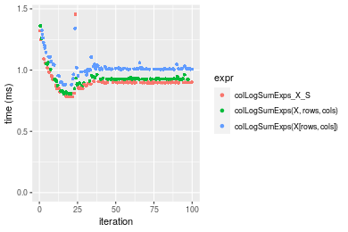

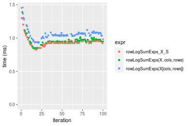
_Table: Benchmarking of colLogSumExps_X_S() and rowLogSumExps_X_S() on 100x1000 data (original and transposed).  The top panel shows times in milliseconds and the bottom panel shows relative times._


|   |expr              |     min|      lq|     mean|   median|       uq|      max|
|:--|:-----------------|-------:|-------:|--------:|--------:|--------:|--------:|
|1  |colLogSumExps_X_S | 781.934| 896.756| 906.7277| 897.9115| 901.0825| 1456.129|
|2  |rowLogSumExps_X_S | 827.333| 920.812| 943.3978| 923.6900| 950.4715| 1451.742|


|   |expr              |     min|       lq|     mean|   median|       uq|       max|
|:--|:-----------------|-------:|--------:|--------:|--------:|--------:|---------:|
|1  |colLogSumExps_X_S | 1.00000| 1.000000| 1.000000| 1.000000| 1.000000| 1.0000000|
|2  |rowLogSumExps_X_S | 1.05806| 1.026826| 1.040442| 1.028709| 1.054811| 0.9969872|

_Figure: Benchmarking of colLogSumExps_X_S() and rowLogSumExps_X_S() on 100x1000 data (original and transposed).  Outliers are displayed as crosses. Times are in milliseconds._


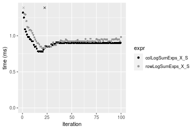

### 1000x100 matrix


```r
> X <- data[["1000x100"]]
> rows <- sample.int(nrow(X), size = nrow(X) * 0.7)
> cols <- sample.int(ncol(X), size = ncol(X) * 0.7)
> X_S <- X[rows, cols]
> gc()
          used  (Mb) gc trigger  (Mb) max used  (Mb)
Ncells 5216611 278.6    8529671 455.6  8529671 455.6
Vcells 9765483  74.6   31876688 243.2 60562128 462.1
> colStats <- microbenchmark(colLogSumExps_X_S = colLogSumExps(X_S, na.rm = FALSE), `colLogSumExps(X, rows, cols)` = colLogSumExps(X, 
+     rows = rows, cols = cols, na.rm = FALSE), `colLogSumExps(X[rows, cols])` = colLogSumExps(X[rows, 
+     cols], na.rm = FALSE), unit = "ms")
> X <- t(X)
> X_S <- t(X_S)
> gc()
          used  (Mb) gc trigger  (Mb) max used  (Mb)
Ncells 5216587 278.6    8529671 455.6  8529671 455.6
Vcells 9865536  75.3   31876688 243.2 60562128 462.1
> rowStats <- microbenchmark(rowLogSumExps_X_S = rowLogSumExps(X_S, na.rm = FALSE), `rowLogSumExps(X, cols, rows)` = rowLogSumExps(X, 
+     rows = cols, cols = rows, na.rm = FALSE), `rowLogSumExps(X[cols, rows])` = rowLogSumExps(X[cols, 
+     rows], na.rm = FALSE), unit = "ms")
```

_Table: Benchmarking of colLogSumExps_X_S(), colLogSumExps(X, rows, cols)() and colLogSumExps(X[rows, cols])() on 1000x100 data. The top panel shows times in milliseconds and the bottom panel shows relative times._


|   |expr                         |      min|        lq|      mean|    median|       uq|      max|
|:--|:----------------------------|--------:|---------:|---------:|---------:|--------:|--------:|
|1  |colLogSumExps_X_S            | 0.745673| 0.8376020| 0.8636380| 0.8539335| 0.858835| 1.246552|
|2  |colLogSumExps(X, rows, cols) | 0.764129| 0.8517975| 0.8834998| 0.8768770| 0.883215| 1.180537|
|3  |colLogSumExps(X[rows, cols]) | 0.839221| 0.9145985| 0.9506828| 0.9604135| 0.969277| 1.420172|


|   |expr                         |      min|       lq|     mean|   median|       uq|       max|
|:--|:----------------------------|--------:|--------:|--------:|--------:|--------:|---------:|
|1  |colLogSumExps_X_S            | 1.000000| 1.000000| 1.000000| 1.000000| 1.000000| 1.0000000|
|2  |colLogSumExps(X, rows, cols) | 1.024751| 1.016948| 1.022998| 1.026868| 1.028387| 0.9470419|
|3  |colLogSumExps(X[rows, cols]) | 1.125455| 1.091925| 1.100788| 1.124694| 1.128595| 1.1392802|

_Table: Benchmarking of rowLogSumExps_X_S(), rowLogSumExps(X, cols, rows)() and rowLogSumExps(X[cols, rows])() on 1000x100 data (transposed). The top panel shows times in milliseconds and the bottom panel shows relative times._


|   |expr                         |      min|        lq|      mean|   median|        uq|      max|
|:--|:----------------------------|--------:|---------:|---------:|--------:|---------:|--------:|
|2  |rowLogSumExps(X, cols, rows) | 0.783550| 0.8507085| 0.8992607| 0.875669| 0.9011415| 1.434717|
|1  |rowLogSumExps_X_S            | 0.785798| 0.8754500| 0.8941442| 0.885309| 0.9071225| 1.172982|
|3  |rowLogSumExps(X[cols, rows]) | 0.887504| 0.9777690| 1.0092014| 1.000114| 1.0253060| 1.411025|


|   |expr                         |      min|       lq|      mean|   median|       uq|       max|
|:--|:----------------------------|--------:|--------:|---------:|--------:|--------:|---------:|
|2  |rowLogSumExps(X, cols, rows) | 1.000000| 1.000000| 1.0000000| 1.000000| 1.000000| 1.0000000|
|1  |rowLogSumExps_X_S            | 1.002869| 1.029083| 0.9943103| 1.011009| 1.006637| 0.8175703|
|3  |rowLogSumExps(X[cols, rows]) | 1.132670| 1.149358| 1.1222569| 1.142114| 1.137786| 0.9834866|

_Figure: Benchmarking of colLogSumExps_X_S(), colLogSumExps(X, rows, cols)() and colLogSumExps(X[rows, cols])() on 1000x100 data  as well as rowLogSumExps_X_S(), rowLogSumExps(X, cols, rows)() and rowLogSumExps(X[cols, rows])() on the same data transposed.  Outliers are displayed as crosses.  Times are in milliseconds._


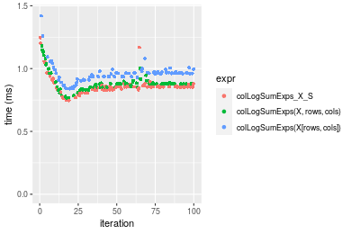

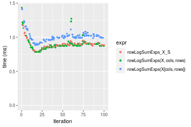
_Table: Benchmarking of colLogSumExps_X_S() and rowLogSumExps_X_S() on 1000x100 data (original and transposed).  The top panel shows times in milliseconds and the bottom panel shows relative times._


|   |expr              |     min|      lq|     mean|   median|       uq|      max|
|:--|:-----------------|-------:|-------:|--------:|--------:|--------:|--------:|
|1  |colLogSumExps_X_S | 745.673| 837.602| 863.6380| 853.9335| 858.8350| 1246.552|
|2  |rowLogSumExps_X_S | 785.798| 875.450| 894.1441| 885.3090| 907.1225| 1172.982|


|   |expr              |     min|       lq|     mean|   median|       uq|       max|
|:--|:-----------------|-------:|--------:|--------:|--------:|--------:|---------:|
|1  |colLogSumExps_X_S | 1.00000| 1.000000| 1.000000| 1.000000| 1.000000| 1.0000000|
|2  |rowLogSumExps_X_S | 1.05381| 1.045186| 1.035323| 1.036742| 1.056224| 0.9409812|

_Figure: Benchmarking of colLogSumExps_X_S() and rowLogSumExps_X_S() on 1000x100 data (original and transposed).  Outliers are displayed as crosses. Times are in milliseconds._


## Appendix

### Session information
```r
R version 4.1.1 Patched (2021-08-10 r80727)
Platform: x86_64-pc-linux-gnu (64-bit)
Running under: Ubuntu 18.04.5 LTS

Matrix products: default
BLAS:   /home/hb/software/R-devel/R-4-1-branch/lib/R/lib/libRblas.so
LAPACK: /home/hb/software/R-devel/R-4-1-branch/lib/R/lib/libRlapack.so

locale:
 [1] LC_CTYPE=en_US.UTF-8       LC_NUMERIC=C              
 [3] LC_TIME=en_US.UTF-8        LC_COLLATE=en_US.UTF-8    
 [5] LC_MONETARY=en_US.UTF-8    LC_MESSAGES=en_US.UTF-8   
 [7] LC_PAPER=en_US.UTF-8       LC_NAME=C                 
 [9] LC_ADDRESS=C               LC_TELEPHONE=C            
[11] LC_MEASUREMENT=en_US.UTF-8 LC_IDENTIFICATION=C       

attached base packages:
[1] stats     graphics  grDevices utils     datasets  methods   base     

other attached packages:
[1] microbenchmark_1.4-7   matrixStats_0.60.1     ggplot2_3.3.5         
[4] knitr_1.33             R.devices_2.17.0       R.utils_2.10.1        
[7] R.oo_1.24.0            R.methodsS3_1.8.1-9001 history_0.0.1-9000    

loaded via a namespace (and not attached):
 [1] Biobase_2.52.0          httr_1.4.2              splines_4.1.1          
 [4] bit64_4.0.5             network_1.17.1          assertthat_0.2.1       
 [7] highr_0.9               stats4_4.1.1            blob_1.2.2             
[10] GenomeInfoDbData_1.2.6  robustbase_0.93-8       pillar_1.6.2           
[13] RSQLite_2.2.8           lattice_0.20-44         glue_1.4.2             
[16] digest_0.6.27           XVector_0.32.0          colorspace_2.0-2       
[19] Matrix_1.3-4            XML_3.99-0.7            pkgconfig_2.0.3        
[22] zlibbioc_1.38.0         genefilter_1.74.0       purrr_0.3.4            
[25] ergm_4.1.2              xtable_1.8-4            scales_1.1.1           
[28] tibble_3.1.4            annotate_1.70.0         KEGGREST_1.32.0        
[31] farver_2.1.0            generics_0.1.0          IRanges_2.26.0         
[34] ellipsis_0.3.2          cachem_1.0.6            withr_2.4.2            
[37] BiocGenerics_0.38.0     mime_0.11               survival_3.2-13        
[40] magrittr_2.0.1          crayon_1.4.1            statnet.common_4.5.0   
[43] memoise_2.0.0           laeken_0.5.1            fansi_0.5.0            
[46] R.cache_0.15.0          MASS_7.3-54             R.rsp_0.44.0           
[49] progressr_0.8.0         tools_4.1.1             lifecycle_1.0.0        
[52] S4Vectors_0.30.0        trust_0.1-8             munsell_0.5.0          
[55] tabby_0.0.1-9001        AnnotationDbi_1.54.1    Biostrings_2.60.2      
[58] compiler_4.1.1          GenomeInfoDb_1.28.1     rlang_0.4.11           
[61] grid_4.1.1              RCurl_1.98-1.4          cwhmisc_6.6            
[64] rappdirs_0.3.3          startup_0.15.0          labeling_0.4.2         
[67] bitops_1.0-7            base64enc_0.1-3         boot_1.3-28            
[70] gtable_0.3.0            DBI_1.1.1               markdown_1.1           
[73] R6_2.5.1                lpSolveAPI_5.5.2.0-17.7 rle_0.9.2              
[76] dplyr_1.0.7             fastmap_1.1.0           bit_4.0.4              
[79] utf8_1.2.2              parallel_4.1.1          Rcpp_1.0.7             
[82] vctrs_0.3.8             png_0.1-7               DEoptimR_1.0-9         
[85] tidyselect_1.1.1        xfun_0.25               coda_0.19-4            
```
Total processing time was 12.18 secs.


### Reproducibility
To reproduce this report, do:
```r
html <- matrixStats:::benchmark('colRowLogSumExps_subset')
```

[RSP]: https://cran.r-project.org/package=R.rsp
[matrixStats]: https://cran.r-project.org/package=matrixStats

[StackOverflow:colMins?]: https://stackoverflow.com/questions/13676878 "Stack Overflow: fastest way to get Min from every column in a matrix?"
[StackOverflow:colSds?]: https://stackoverflow.com/questions/17549762 "Stack Overflow: Is there such 'colsd' in R?"
[StackOverflow:rowProds?]: https://stackoverflow.com/questions/20198801/ "Stack Overflow: Row product of matrix and column sum of matrix"

---------------------------------------
Copyright Dongcan Jiang. Last updated on 2021-08-25 18:55:55 (+0200 UTC). Powered by [RSP].

<script>
 var link = document.createElement('link');
 link.rel = 'icon';
 link.href = "data:image/png;base64,iVBORw0KGgoAAAANSUhEUgAAACAAAAAgCAMAAABEpIrGAAAA21BMVEUAAAAAAP8AAP8AAP8AAP8AAP8AAP8AAP8AAP8AAP8AAP8AAP8AAP8AAP8AAP8AAP8AAP8AAP8AAP8AAP8AAP8AAP8AAP8AAP8AAP8AAP8AAP8AAP8AAP8AAP8AAP8AAP8AAP8AAP8AAP8AAP8AAP8AAP8AAP8AAP8AAP8AAP8BAf4CAv0DA/wdHeIeHuEfH+AgIN8hId4lJdomJtknJ9g+PsE/P8BAQL9yco10dIt1dYp3d4h4eIeVlWqWlmmXl2iYmGeZmWabm2Tn5xjo6Bfp6Rb39wj4+Af//wA2M9hbAAAASXRSTlMAAQIJCgsMJSYnKD4/QGRlZmhpamtsbautrrCxuru8y8zN5ebn6Pn6+///////////////////////////////////////////LsUNcQAAAS9JREFUOI29k21XgkAQhVcFytdSMqMETU26UVqGmpaiFbL//xc1cAhhwVNf6n5i5z67M2dmYOyfJZUqlVLhkKucG7cgmUZTybDz6g0iDeq51PUr37Ds2cy2/C9NeES5puDjxuUk1xnToZsg8pfA3avHQ3lLIi7iWRrkv/OYtkScxBIMgDee0ALoyxHQBJ68JLCjOtQIMIANF7QG9G9fNnHvisCHBVMKgSJgiz7nE+AoBKrAPA3MgepvgR9TSCasrCKH0eB1wBGBFdCO+nAGjMVGPcQb5bd6mQRegN6+1axOs9nGfYcCtfi4NQosdtH7dB+txFIpXQqN1p9B/asRHToyS0jRgpV7nk4nwcq1BJ+x3Gl/v7S9Wmpp/aGquum7w3ZDyrADFYrl8vHBH+ev9AUASW1dmU4h4wAAAABJRU5ErkJggg=="
 document.getElementsByTagName('head')[0].appendChild(link);
</script>


