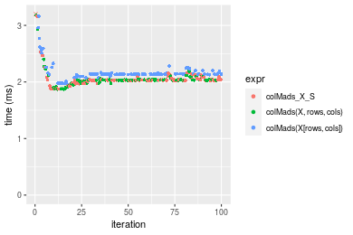

[matrixStats]: Benchmark report

---------------------------------------


# colMads() and rowMads() benchmarks on subsetted computation

This report benchmark the performance of colMads() and rowMads() on subsetted computation.


## Data type "integer"

### Data
```r
> rmatrix <- function(nrow, ncol, mode = c("logical", "double", "integer", "index"), range = c(-100, 
+     +100), na_prob = 0) {
+     mode <- match.arg(mode)
+     n <- nrow * ncol
+     if (mode == "logical") {
+         x <- sample(c(FALSE, TRUE), size = n, replace = TRUE)
+     }     else if (mode == "index") {
+         x <- seq_len(n)
+         mode <- "integer"
+     }     else {
+         x <- runif(n, min = range[1], max = range[2])
+     }
+     storage.mode(x) <- mode
+     if (na_prob > 0) 
+         x[sample(n, size = na_prob * n)] <- NA
+     dim(x) <- c(nrow, ncol)
+     x
+ }
> rmatrices <- function(scale = 10, seed = 1, ...) {
+     set.seed(seed)
+     data <- list()
+     data[[1]] <- rmatrix(nrow = scale * 1, ncol = scale * 1, ...)
+     data[[2]] <- rmatrix(nrow = scale * 10, ncol = scale * 10, ...)
+     data[[3]] <- rmatrix(nrow = scale * 100, ncol = scale * 1, ...)
+     data[[4]] <- t(data[[3]])
+     data[[5]] <- rmatrix(nrow = scale * 10, ncol = scale * 100, ...)
+     data[[6]] <- t(data[[5]])
+     names(data) <- sapply(data, FUN = function(x) paste(dim(x), collapse = "x"))
+     data
+ }
> data <- rmatrices(mode = mode)
```

### Results

#### 10x10 integer matrix

```r
> X <- data[["10x10"]]
> rows <- sample.int(nrow(X), size = nrow(X) * 0.7)
> cols <- sample.int(ncol(X), size = ncol(X) * 0.7)
> X_S <- X[rows, cols]
> gc()
           used  (Mb) gc trigger  (Mb) max used  (Mb)
Ncells  5230613 279.4    8529671 455.6  8529671 455.6
Vcells 10010013  76.4   31876688 243.2 60562128 462.1
> colStats <- microbenchmark(colMads_X_S = colMads(X_S, na.rm = FALSE), `colMads(X, rows, cols)` = colMads(X, 
+     rows = rows, cols = cols, na.rm = FALSE), `colMads(X[rows, cols])` = colMads(X[rows, cols], na.rm = FALSE), 
+     unit = "ms")
> X <- t(X)
> X_S <- t(X_S)
> gc()
          used  (Mb) gc trigger  (Mb) max used  (Mb)
Ncells 5222666 279.0    8529671 455.6  8529671 455.6
Vcells 9983739  76.2   31876688 243.2 60562128 462.1
> rowStats <- microbenchmark(rowMads_X_S = rowMads(X_S, na.rm = FALSE), `rowMads(X, cols, rows)` = rowMads(X, 
+     rows = cols, cols = rows, na.rm = FALSE), `rowMads(X[cols, rows])` = rowMads(X[cols, rows], na.rm = FALSE), 
+     unit = "ms")
```

_Table: Benchmarking of colMads_X_S(), colMads(X, rows, cols)() and colMads(X[rows, cols])() on integer+10x10 data. The top panel shows times in milliseconds and the bottom panel shows relative times._


|   |expr                   |      min|        lq|      mean|    median|        uq|      max|
|:--|:----------------------|--------:|---------:|---------:|---------:|---------:|--------:|
|1  |colMads_X_S            | 0.002897| 0.0030155| 0.0058568| 0.0031005| 0.0031965| 0.275000|
|2  |colMads(X, rows, cols) | 0.003300| 0.0034380| 0.0035962| 0.0035395| 0.0036545| 0.006543|
|3  |colMads(X[rows, cols]) | 0.003731| 0.0040170| 0.0043862| 0.0041550| 0.0043645| 0.018293|


|   |expr                   |      min|       lq|      mean|   median|       uq|       max|
|:--|:----------------------|--------:|--------:|---------:|--------:|--------:|---------:|
|1  |colMads_X_S            | 1.000000| 1.000000| 1.0000000| 1.000000| 1.000000| 1.0000000|
|2  |colMads(X, rows, cols) | 1.139109| 1.140109| 0.6140243| 1.141590| 1.143282| 0.0237927|
|3  |colMads(X[rows, cols]) | 1.287884| 1.332117| 0.7489081| 1.340106| 1.365400| 0.0665200|

_Table: Benchmarking of rowMads_X_S(), rowMads(X, cols, rows)() and rowMads(X[cols, rows])() on integer+10x10 data (transposed). The top panel shows times in milliseconds and the bottom panel shows relative times._


|   |expr                   |      min|       lq|      mean|    median|        uq|      max|
|:--|:----------------------|--------:|--------:|---------:|---------:|---------:|--------:|
|1  |rowMads_X_S            | 0.002952| 0.003079| 0.0032072| 0.0031660| 0.0032480| 0.006710|
|2  |rowMads(X, cols, rows) | 0.003306| 0.003475| 0.0064096| 0.0035395| 0.0036735| 0.270258|
|3  |rowMads(X[cols, rows]) | 0.003782| 0.004016| 0.0042449| 0.0041560| 0.0042925| 0.007147|


|   |expr                   |      min|       lq|     mean|   median|       uq|       max|
|:--|:----------------------|--------:|--------:|--------:|--------:|--------:|---------:|
|1  |rowMads_X_S            | 1.000000| 1.000000| 1.000000| 1.000000| 1.000000|  1.000000|
|2  |rowMads(X, cols, rows) | 1.119919| 1.128613| 1.998491| 1.117972| 1.131004| 40.276900|
|3  |rowMads(X[cols, rows]) | 1.281165| 1.304320| 1.323547| 1.312697| 1.321583|  1.065127|

_Figure: Benchmarking of colMads_X_S(), colMads(X, rows, cols)() and colMads(X[rows, cols])() on integer+10x10 data  as well as rowMads_X_S(), rowMads(X, cols, rows)() and rowMads(X[cols, rows])() on the same data transposed.  Outliers are displayed as crosses.  Times are in milliseconds._


_Table: Benchmarking of colMads_X_S() and rowMads_X_S() on integer+10x10 data (original and transposed).  The top panel shows times in milliseconds and the bottom panel shows relative times._


|   |expr        |   min|     lq|    mean| median|     uq|    max|
|:--|:-----------|-----:|------:|-------:|------:|------:|------:|
|1  |colMads_X_S | 2.897| 3.0155| 5.85682| 3.1005| 3.1965| 275.00|
|2  |rowMads_X_S | 2.952| 3.0790| 3.20720| 3.1660| 3.2480|   6.71|


|   |expr        |      min|       lq|      mean|   median|       uq|    max|
|:--|:-----------|--------:|--------:|---------:|--------:|--------:|------:|
|1  |colMads_X_S | 1.000000| 1.000000| 1.0000000| 1.000000| 1.000000| 1.0000|
|2  |rowMads_X_S | 1.018985| 1.021058| 0.5476009| 1.021126| 1.016111| 0.0244|

_Figure: Benchmarking of colMads_X_S() and rowMads_X_S() on integer+10x10 data (original and transposed).  Outliers are displayed as crosses. Times are in milliseconds._


#### 100x100 integer matrix

```r
> X <- data[["100x100"]]
> rows <- sample.int(nrow(X), size = nrow(X) * 0.7)
> cols <- sample.int(ncol(X), size = ncol(X) * 0.7)
> X_S <- X[rows, cols]
> gc()
          used  (Mb) gc trigger  (Mb) max used  (Mb)
Ncells 5221596 278.9    8529671 455.6  8529671 455.6
Vcells 9652762  73.7   31876688 243.2 60562128 462.1
> colStats <- microbenchmark(colMads_X_S = colMads(X_S, na.rm = FALSE), `colMads(X, rows, cols)` = colMads(X, 
+     rows = rows, cols = cols, na.rm = FALSE), `colMads(X[rows, cols])` = colMads(X[rows, cols], na.rm = FALSE), 
+     unit = "ms")
> X <- t(X)
> X_S <- t(X_S)
> gc()
          used  (Mb) gc trigger  (Mb) max used  (Mb)
Ncells 5221572 278.9    8529671 455.6  8529671 455.6
Vcells 9657815  73.7   31876688 243.2 60562128 462.1
> rowStats <- microbenchmark(rowMads_X_S = rowMads(X_S, na.rm = FALSE), `rowMads(X, cols, rows)` = rowMads(X, 
+     rows = cols, cols = rows, na.rm = FALSE), `rowMads(X[cols, rows])` = rowMads(X[cols, rows], na.rm = FALSE), 
+     unit = "ms")
```

_Table: Benchmarking of colMads_X_S(), colMads(X, rows, cols)() and colMads(X[rows, cols])() on integer+100x100 data. The top panel shows times in milliseconds and the bottom panel shows relative times._


|   |expr                   |      min|        lq|      mean|    median|        uq|      max|
|:--|:----------------------|--------:|---------:|---------:|---------:|---------:|--------:|
|2  |colMads(X, rows, cols) | 0.133489| 0.1427000| 0.1643306| 0.1620720| 0.1762455| 0.229778|
|1  |colMads_X_S            | 0.133940| 0.1420545| 0.1653787| 0.1640340| 0.1782025| 0.230007|
|3  |colMads(X[rows, cols]) | 0.141483| 0.1520570| 0.1757110| 0.1737415| 0.1913060| 0.269344|


|   |expr                   |      min|        lq|     mean|   median|       uq|      max|
|:--|:----------------------|--------:|---------:|--------:|--------:|--------:|--------:|
|2  |colMads(X, rows, cols) | 1.000000| 1.0000000| 1.000000| 1.000000| 1.000000| 1.000000|
|1  |colMads_X_S            | 1.003379| 0.9954765| 1.006378| 1.012106| 1.011104| 1.000997|
|3  |colMads(X[rows, cols]) | 1.059885| 1.0655711| 1.069253| 1.072002| 1.085452| 1.172192|

_Table: Benchmarking of rowMads_X_S(), rowMads(X, cols, rows)() and rowMads(X[cols, rows])() on integer+100x100 data (transposed). The top panel shows times in milliseconds and the bottom panel shows relative times._


|   |expr                   |      min|        lq|      mean|    median|       uq|      max|
|:--|:----------------------|--------:|---------:|---------:|---------:|--------:|--------:|
|2  |rowMads(X, cols, rows) | 0.134054| 0.1444445| 0.1645099| 0.1610480| 0.176094| 0.242336|
|1  |rowMads_X_S            | 0.137631| 0.1461835| 0.1689280| 0.1673675| 0.183561| 0.224565|
|3  |rowMads(X[cols, rows]) | 0.145598| 0.1560775| 0.1765251| 0.1731375| 0.190183| 0.239563|


|   |expr                   |      min|       lq|     mean|   median|       uq|       max|
|:--|:----------------------|--------:|--------:|--------:|--------:|--------:|---------:|
|2  |rowMads(X, cols, rows) | 1.000000| 1.000000| 1.000000| 1.000000| 1.000000| 1.0000000|
|1  |rowMads_X_S            | 1.026683| 1.012039| 1.026856| 1.039240| 1.042404| 0.9266679|
|3  |rowMads(X[cols, rows]) | 1.086115| 1.080536| 1.073036| 1.075068| 1.080008| 0.9885572|

_Figure: Benchmarking of colMads_X_S(), colMads(X, rows, cols)() and colMads(X[rows, cols])() on integer+100x100 data  as well as rowMads_X_S(), rowMads(X, cols, rows)() and rowMads(X[cols, rows])() on the same data transposed.  Outliers are displayed as crosses.  Times are in milliseconds._


_Table: Benchmarking of colMads_X_S() and rowMads_X_S() on integer+100x100 data (original and transposed).  The top panel shows times in milliseconds and the bottom panel shows relative times._


|   |expr        |     min|       lq|     mean|   median|       uq|     max|
|:--|:-----------|-------:|--------:|--------:|--------:|--------:|-------:|
|1  |colMads_X_S | 133.940| 142.0545| 165.3787| 164.0340| 178.2025| 230.007|
|2  |rowMads_X_S | 137.631| 146.1835| 168.9280| 167.3675| 183.5610| 224.565|


|   |expr        |      min|       lq|     mean|   median|      uq|       max|
|:--|:-----------|--------:|--------:|--------:|--------:|-------:|---------:|
|1  |colMads_X_S | 1.000000| 1.000000| 1.000000| 1.000000| 1.00000| 1.0000000|
|2  |rowMads_X_S | 1.027557| 1.029066| 1.021462| 1.020322| 1.03007| 0.9763399|

_Figure: Benchmarking of colMads_X_S() and rowMads_X_S() on integer+100x100 data (original and transposed).  Outliers are displayed as crosses. Times are in milliseconds._


#### 1000x10 integer matrix

```r
> X <- data[["1000x10"]]
> rows <- sample.int(nrow(X), size = nrow(X) * 0.7)
> cols <- sample.int(ncol(X), size = ncol(X) * 0.7)
> X_S <- X[rows, cols]
> gc()
          used  (Mb) gc trigger  (Mb) max used  (Mb)
Ncells 5222338 279.0    8529671 455.6  8529671 455.6
Vcells 9656804  73.7   31876688 243.2 60562128 462.1
> colStats <- microbenchmark(colMads_X_S = colMads(X_S, na.rm = FALSE), `colMads(X, rows, cols)` = colMads(X, 
+     rows = rows, cols = cols, na.rm = FALSE), `colMads(X[rows, cols])` = colMads(X[rows, cols], na.rm = FALSE), 
+     unit = "ms")
> X <- t(X)
> X_S <- t(X_S)
> gc()
          used  (Mb) gc trigger  (Mb) max used  (Mb)
Ncells 5222314 279.0    8529671 455.6  8529671 455.6
Vcells 9661857  73.8   31876688 243.2 60562128 462.1
> rowStats <- microbenchmark(rowMads_X_S = rowMads(X_S, na.rm = FALSE), `rowMads(X, cols, rows)` = rowMads(X, 
+     rows = cols, cols = rows, na.rm = FALSE), `rowMads(X[cols, rows])` = rowMads(X[cols, rows], na.rm = FALSE), 
+     unit = "ms")
```

_Table: Benchmarking of colMads_X_S(), colMads(X, rows, cols)() and colMads(X[rows, cols])() on integer+1000x10 data. The top panel shows times in milliseconds and the bottom panel shows relative times._


|   |expr                   |      min|        lq|      mean|    median|        uq|      max|
|:--|:----------------------|--------:|---------:|---------:|---------:|---------:|--------:|
|2  |colMads(X, rows, cols) | 0.117453| 0.1247245| 0.1396233| 0.1364435| 0.1481360| 0.186024|
|1  |colMads_X_S            | 0.115756| 0.1296875| 0.1410565| 0.1382630| 0.1474685| 0.207656|
|3  |colMads(X[rows, cols]) | 0.123733| 0.1314120| 0.1472302| 0.1438235| 0.1582085| 0.228173|


|   |expr                   |       min|       lq|     mean|   median|       uq|      max|
|:--|:----------------------|---------:|--------:|--------:|--------:|--------:|--------:|
|2  |colMads(X, rows, cols) | 1.0000000| 1.000000| 1.000000| 1.000000| 1.000000| 1.000000|
|1  |colMads_X_S            | 0.9855517| 1.039792| 1.010265| 1.013335| 0.995494| 1.116286|
|3  |colMads(X[rows, cols]) | 1.0534682| 1.053618| 1.054481| 1.054088| 1.067995| 1.226578|

_Table: Benchmarking of rowMads_X_S(), rowMads(X, cols, rows)() and rowMads(X[cols, rows])() on integer+1000x10 data (transposed). The top panel shows times in milliseconds and the bottom panel shows relative times._


|   |expr                   |      min|        lq|      mean|    median|        uq|      max|
|:--|:----------------------|--------:|---------:|---------:|---------:|---------:|--------:|
|1  |rowMads_X_S            | 0.119852| 0.1342820| 0.1505124| 0.1431685| 0.1527535| 0.251675|
|2  |rowMads(X, cols, rows) | 0.117795| 0.1277995| 0.1474039| 0.1459425| 0.1574675| 0.239278|
|3  |rowMads(X[cols, rows]) | 0.129588| 0.1424825| 0.1649833| 0.1585315| 0.1696535| 0.289764|


|   |expr                   |       min|        lq|      mean|   median|       uq|      max|
|:--|:----------------------|---------:|---------:|---------:|--------:|--------:|--------:|
|1  |rowMads_X_S            | 1.0000000| 1.0000000| 1.0000000| 1.000000| 1.000000| 1.000000|
|2  |rowMads(X, cols, rows) | 0.9828372| 0.9517247| 0.9793474| 1.019376| 1.030860| 0.950742|
|3  |rowMads(X[cols, rows]) | 1.0812335| 1.0610692| 1.0961446| 1.107307| 1.110636| 1.151342|

_Figure: Benchmarking of colMads_X_S(), colMads(X, rows, cols)() and colMads(X[rows, cols])() on integer+1000x10 data  as well as rowMads_X_S(), rowMads(X, cols, rows)() and rowMads(X[cols, rows])() on the same data transposed.  Outliers are displayed as crosses.  Times are in milliseconds._


_Table: Benchmarking of colMads_X_S() and rowMads_X_S() on integer+1000x10 data (original and transposed).  The top panel shows times in milliseconds and the bottom panel shows relative times._


|   |expr        |     min|       lq|     mean|   median|       uq|     max|
|:--|:-----------|-------:|--------:|--------:|--------:|--------:|-------:|
|1  |colMads_X_S | 115.756| 129.6875| 141.0565| 138.2630| 147.4685| 207.656|
|2  |rowMads_X_S | 119.852| 134.2820| 150.5124| 143.1685| 152.7535| 251.675|


|   |expr        |      min|       lq|     mean|  median|       uq|     max|
|:--|:-----------|--------:|--------:|--------:|-------:|--------:|-------:|
|1  |colMads_X_S | 1.000000| 1.000000| 1.000000| 1.00000| 1.000000| 1.00000|
|2  |rowMads_X_S | 1.035385| 1.035427| 1.067036| 1.03548| 1.035838| 1.21198|

_Figure: Benchmarking of colMads_X_S() and rowMads_X_S() on integer+1000x10 data (original and transposed).  Outliers are displayed as crosses. Times are in milliseconds._


#### 10x1000 integer matrix

```r
> X <- data[["10x1000"]]
> rows <- sample.int(nrow(X), size = nrow(X) * 0.7)
> cols <- sample.int(ncol(X), size = ncol(X) * 0.7)
> X_S <- X[rows, cols]
> gc()
          used  (Mb) gc trigger  (Mb) max used  (Mb)
Ncells 5222542 279.0    8529671 455.6  8529671 455.6
Vcells 9657625  73.7   31876688 243.2 60562128 462.1
> colStats <- microbenchmark(colMads_X_S = colMads(X_S, na.rm = FALSE), `colMads(X, rows, cols)` = colMads(X, 
+     rows = rows, cols = cols, na.rm = FALSE), `colMads(X[rows, cols])` = colMads(X[rows, cols], na.rm = FALSE), 
+     unit = "ms")
> X <- t(X)
> X_S <- t(X_S)
> gc()
          used  (Mb) gc trigger  (Mb) max used  (Mb)
Ncells 5222518 279.0    8529671 455.6  8529671 455.6
Vcells 9662678  73.8   31876688 243.2 60562128 462.1
> rowStats <- microbenchmark(rowMads_X_S = rowMads(X_S, na.rm = FALSE), `rowMads(X, cols, rows)` = rowMads(X, 
+     rows = cols, cols = rows, na.rm = FALSE), `rowMads(X[cols, rows])` = rowMads(X[cols, rows], na.rm = FALSE), 
+     unit = "ms")
```

_Table: Benchmarking of colMads_X_S(), colMads(X, rows, cols)() and colMads(X[rows, cols])() on integer+10x1000 data. The top panel shows times in milliseconds and the bottom panel shows relative times._


|   |expr                   |      min|        lq|      mean|    median|        uq|      max|
|:--|:----------------------|--------:|---------:|---------:|---------:|---------:|--------:|
|2  |colMads(X, rows, cols) | 0.097614| 0.1059500| 0.1156218| 0.1127260| 0.1201080| 0.166373|
|1  |colMads_X_S            | 0.094198| 0.1038435| 0.1150566| 0.1131975| 0.1245320| 0.180748|
|3  |colMads(X[rows, cols]) | 0.107073| 0.1175900| 0.1261233| 0.1231830| 0.1342685| 0.166177|


|   |expr                   |      min|       lq|      mean|   median|       uq|       max|
|:--|:----------------------|--------:|--------:|---------:|--------:|--------:|---------:|
|2  |colMads(X, rows, cols) | 1.000000| 1.000000| 1.0000000| 1.000000| 1.000000| 1.0000000|
|1  |colMads_X_S            | 0.965005| 0.980118| 0.9951123| 1.004183| 1.036833| 1.0864022|
|3  |colMads(X[rows, cols]) | 1.096902| 1.109863| 1.0908267| 1.092765| 1.117898| 0.9988219|

_Table: Benchmarking of rowMads_X_S(), rowMads(X, cols, rows)() and rowMads(X[cols, rows])() on integer+10x1000 data (transposed). The top panel shows times in milliseconds and the bottom panel shows relative times._


|   |expr                   |      min|        lq|      mean|    median|        uq|      max|
|:--|:----------------------|--------:|---------:|---------:|---------:|---------:|--------:|
|2  |rowMads(X, cols, rows) | 0.102962| 0.1091030| 0.1166636| 0.1124835| 0.1200705| 0.195332|
|1  |rowMads_X_S            | 0.107028| 0.1115420| 0.1203751| 0.1161365| 0.1277905| 0.155609|
|3  |rowMads(X[cols, rows]) | 0.116490| 0.1212795| 0.1314804| 0.1262820| 0.1395350| 0.187189|


|   |expr                   |      min|       lq|     mean|   median|       uq|       max|
|:--|:----------------------|--------:|--------:|--------:|--------:|--------:|---------:|
|2  |rowMads(X, cols, rows) | 1.000000| 1.000000| 1.000000| 1.000000| 1.000000| 1.0000000|
|1  |rowMads_X_S            | 1.039490| 1.022355| 1.031813| 1.032476| 1.064296| 0.7966385|
|3  |rowMads(X[cols, rows]) | 1.131388| 1.111606| 1.127004| 1.122671| 1.162109| 0.9583120|

_Figure: Benchmarking of colMads_X_S(), colMads(X, rows, cols)() and colMads(X[rows, cols])() on integer+10x1000 data  as well as rowMads_X_S(), rowMads(X, cols, rows)() and rowMads(X[cols, rows])() on the same data transposed.  Outliers are displayed as crosses.  Times are in milliseconds._


_Table: Benchmarking of colMads_X_S() and rowMads_X_S() on integer+10x1000 data (original and transposed).  The top panel shows times in milliseconds and the bottom panel shows relative times._


|   |expr        |     min|       lq|     mean|   median|       uq|     max|
|:--|:-----------|-------:|--------:|--------:|--------:|--------:|-------:|
|1  |colMads_X_S |  94.198| 103.8435| 115.0566| 113.1975| 124.5320| 180.748|
|2  |rowMads_X_S | 107.028| 111.5420| 120.3751| 116.1365| 127.7905| 155.609|


|   |expr        |      min|       lq|     mean|   median|       uq|       max|
|:--|:-----------|--------:|--------:|--------:|--------:|--------:|---------:|
|1  |colMads_X_S | 1.000000| 1.000000| 1.000000| 1.000000| 1.000000| 1.0000000|
|2  |rowMads_X_S | 1.136203| 1.074136| 1.046225| 1.025964| 1.026166| 0.8609169|

_Figure: Benchmarking of colMads_X_S() and rowMads_X_S() on integer+10x1000 data (original and transposed).  Outliers are displayed as crosses. Times are in milliseconds._


#### 100x1000 integer matrix

```r
> X <- data[["100x1000"]]
> rows <- sample.int(nrow(X), size = nrow(X) * 0.7)
> cols <- sample.int(ncol(X), size = ncol(X) * 0.7)
> X_S <- X[rows, cols]
> gc()
          used  (Mb) gc trigger  (Mb) max used  (Mb)
Ncells 5222755 279.0    8529671 455.6  8529671 455.6
Vcells 9680296  73.9   31876688 243.2 60562128 462.1
> colStats <- microbenchmark(colMads_X_S = colMads(X_S, na.rm = FALSE), `colMads(X, rows, cols)` = colMads(X, 
+     rows = rows, cols = cols, na.rm = FALSE), `colMads(X[rows, cols])` = colMads(X[rows, cols], na.rm = FALSE), 
+     unit = "ms")
> X <- t(X)
> X_S <- t(X_S)
> gc()
          used  (Mb) gc trigger  (Mb) max used  (Mb)
Ncells 5222731 279.0    8529671 455.6  8529671 455.6
Vcells 9730349  74.3   31876688 243.2 60562128 462.1
> rowStats <- microbenchmark(rowMads_X_S = rowMads(X_S, na.rm = FALSE), `rowMads(X, cols, rows)` = rowMads(X, 
+     rows = cols, cols = rows, na.rm = FALSE), `rowMads(X[cols, rows])` = rowMads(X[cols, rows], na.rm = FALSE), 
+     unit = "ms")
```

_Table: Benchmarking of colMads_X_S(), colMads(X, rows, cols)() and colMads(X[rows, cols])() on integer+100x1000 data. The top panel shows times in milliseconds and the bottom panel shows relative times._


|   |expr                   |      min|       lq|     mean|   median|       uq|      max|
|:--|:----------------------|--------:|--------:|--------:|--------:|--------:|--------:|
|1  |colMads_X_S            | 1.417719| 1.630202| 1.691884| 1.665612| 1.692498| 2.364768|
|2  |colMads(X, rows, cols) | 1.483859| 1.632983| 1.737114| 1.687781| 1.754010| 2.278443|
|3  |colMads(X[rows, cols]) | 1.498354| 1.715013| 1.818983| 1.776871| 1.818416| 2.565856|


|   |expr                   |      min|       lq|     mean|   median|       uq|       max|
|:--|:----------------------|--------:|--------:|--------:|--------:|--------:|---------:|
|1  |colMads_X_S            | 1.000000| 1.000000| 1.000000| 1.000000| 1.000000| 1.0000000|
|2  |colMads(X, rows, cols) | 1.046652| 1.001706| 1.026734| 1.013310| 1.036344| 0.9634954|
|3  |colMads(X[rows, cols]) | 1.056877| 1.052024| 1.075123| 1.066798| 1.074397| 1.0850350|

_Table: Benchmarking of rowMads_X_S(), rowMads(X, cols, rows)() and rowMads(X[cols, rows])() on integer+100x1000 data (transposed). The top panel shows times in milliseconds and the bottom panel shows relative times._


|   |expr                   |      min|       lq|     mean|   median|       uq|      max|
|:--|:----------------------|--------:|--------:|--------:|--------:|--------:|--------:|
|2  |rowMads(X, cols, rows) | 1.506947| 1.553424| 1.652926| 1.599171| 1.653604| 2.224853|
|1  |rowMads_X_S            | 1.564443| 1.585908| 1.705902| 1.634154| 1.723385| 2.317330|
|3  |rowMads(X[cols, rows]) | 1.632498| 1.655447| 1.795700| 1.700440| 1.755014| 4.476681|


|   |expr                   |      min|       lq|     mean|   median|       uq|      max|
|:--|:----------------------|--------:|--------:|--------:|--------:|--------:|--------:|
|2  |rowMads(X, cols, rows) | 1.000000| 1.000000| 1.000000| 1.000000| 1.000000| 1.000000|
|1  |rowMads_X_S            | 1.038154| 1.020911| 1.032050| 1.021876| 1.042199| 1.041565|
|3  |rowMads(X[cols, rows]) | 1.083315| 1.065676| 1.086377| 1.063326| 1.061327| 2.012124|

_Figure: Benchmarking of colMads_X_S(), colMads(X, rows, cols)() and colMads(X[rows, cols])() on integer+100x1000 data  as well as rowMads_X_S(), rowMads(X, cols, rows)() and rowMads(X[cols, rows])() on the same data transposed.  Outliers are displayed as crosses.  Times are in milliseconds._


_Table: Benchmarking of colMads_X_S() and rowMads_X_S() on integer+100x1000 data (original and transposed).  The top panel shows times in milliseconds and the bottom panel shows relative times._


|   |expr        |      min|       lq|     mean|   median|       uq|      max|
|:--|:-----------|--------:|--------:|--------:|--------:|--------:|--------:|
|2  |rowMads_X_S | 1.564443| 1.585908| 1.705902| 1.634154| 1.723385| 2.317330|
|1  |colMads_X_S | 1.417719| 1.630202| 1.691884| 1.665612| 1.692498| 2.364768|


|   |expr        |       min|      lq|      mean|  median|       uq|      max|
|:--|:-----------|---------:|-------:|---------:|-------:|--------:|--------:|
|2  |rowMads_X_S | 1.0000000| 1.00000| 1.0000000| 1.00000| 1.000000| 1.000000|
|1  |colMads_X_S | 0.9062133| 1.02793| 0.9917825| 1.01925| 0.982078| 1.020471|

_Figure: Benchmarking of colMads_X_S() and rowMads_X_S() on integer+100x1000 data (original and transposed).  Outliers are displayed as crosses. Times are in milliseconds._


#### 1000x100 integer matrix

```r
> X <- data[["1000x100"]]
> rows <- sample.int(nrow(X), size = nrow(X) * 0.7)
> cols <- sample.int(ncol(X), size = ncol(X) * 0.7)
> X_S <- X[rows, cols]
> gc()
          used  (Mb) gc trigger  (Mb) max used  (Mb)
Ncells 5222965 279.0    8529671 455.6  8529671 455.6
Vcells 9681071  73.9   31876688 243.2 60562128 462.1
> colStats <- microbenchmark(colMads_X_S = colMads(X_S, na.rm = FALSE), `colMads(X, rows, cols)` = colMads(X, 
+     rows = rows, cols = cols, na.rm = FALSE), `colMads(X[rows, cols])` = colMads(X[rows, cols], na.rm = FALSE), 
+     unit = "ms")
> X <- t(X)
> X_S <- t(X_S)
> gc()
          used  (Mb) gc trigger  (Mb) max used  (Mb)
Ncells 5222941 279.0    8529671 455.6  8529671 455.6
Vcells 9731124  74.3   31876688 243.2 60562128 462.1
> rowStats <- microbenchmark(rowMads_X_S = rowMads(X_S, na.rm = FALSE), `rowMads(X, cols, rows)` = rowMads(X, 
+     rows = cols, cols = rows, na.rm = FALSE), `rowMads(X[cols, rows])` = rowMads(X[cols, rows], na.rm = FALSE), 
+     unit = "ms")
```

_Table: Benchmarking of colMads_X_S(), colMads(X, rows, cols)() and colMads(X[rows, cols])() on integer+1000x100 data. The top panel shows times in milliseconds and the bottom panel shows relative times._


|   |expr                   |      min|       lq|     mean|   median|       uq|      max|
|:--|:----------------------|--------:|--------:|--------:|--------:|--------:|--------:|
|2  |colMads(X, rows, cols) | 1.085066| 1.149720| 1.208804| 1.185625| 1.226300| 1.643439|
|1  |colMads_X_S            | 1.089497| 1.184171| 1.214995| 1.198657| 1.223488| 1.847442|
|3  |colMads(X[rows, cols]) | 1.154745| 1.205556| 1.264744| 1.261588| 1.296334| 1.804970|


|   |expr                   |      min|       lq|     mean|   median|        uq|      max|
|:--|:----------------------|--------:|--------:|--------:|--------:|---------:|--------:|
|2  |colMads(X, rows, cols) | 1.000000| 1.000000| 1.000000| 1.000000| 1.0000000| 1.000000|
|1  |colMads_X_S            | 1.004084| 1.029964| 1.005122| 1.010991| 0.9977069| 1.124132|
|3  |colMads(X[rows, cols]) | 1.064216| 1.048564| 1.046277| 1.064070| 1.0571104| 1.098288|

_Table: Benchmarking of rowMads_X_S(), rowMads(X, cols, rows)() and rowMads(X[cols, rows])() on integer+1000x100 data (transposed). The top panel shows times in milliseconds and the bottom panel shows relative times._


|   |expr                   |      min|       lq|     mean|   median|       uq|      max|
|:--|:----------------------|--------:|--------:|--------:|--------:|--------:|--------:|
|2  |rowMads(X, cols, rows) | 1.105407| 1.170870| 1.214940| 1.201795| 1.207318| 1.882349|
|1  |rowMads_X_S            | 1.127465| 1.203342| 1.238002| 1.229418| 1.237796| 1.591996|
|3  |rowMads(X[cols, rows]) | 1.198161| 1.268891| 1.305387| 1.301751| 1.312086| 1.874509|


|   |expr                   |      min|       lq|     mean|   median|       uq|       max|
|:--|:----------------------|--------:|--------:|--------:|--------:|--------:|---------:|
|2  |rowMads(X, cols, rows) | 1.000000| 1.000000| 1.000000| 1.000000| 1.000000| 1.0000000|
|1  |rowMads_X_S            | 1.019955| 1.027733| 1.018981| 1.022984| 1.025245| 0.8457496|
|3  |rowMads(X[cols, rows]) | 1.083909| 1.083716| 1.074445| 1.083172| 1.086778| 0.9958350|

_Figure: Benchmarking of colMads_X_S(), colMads(X, rows, cols)() and colMads(X[rows, cols])() on integer+1000x100 data  as well as rowMads_X_S(), rowMads(X, cols, rows)() and rowMads(X[cols, rows])() on the same data transposed.  Outliers are displayed as crosses.  Times are in milliseconds._


_Table: Benchmarking of colMads_X_S() and rowMads_X_S() on integer+1000x100 data (original and transposed).  The top panel shows times in milliseconds and the bottom panel shows relative times._


|   |expr        |      min|       lq|     mean|   median|       uq|      max|
|:--|:-----------|--------:|--------:|--------:|--------:|--------:|--------:|
|1  |colMads_X_S | 1.089497| 1.184171| 1.214995| 1.198657| 1.223488| 1.847442|
|2  |rowMads_X_S | 1.127465| 1.203342| 1.238002| 1.229418| 1.237796| 1.591996|


|   |expr        |      min|      lq|     mean|   median|       uq|       max|
|:--|:-----------|--------:|-------:|--------:|--------:|--------:|---------:|
|1  |colMads_X_S | 1.000000| 1.00000| 1.000000| 1.000000| 1.000000| 1.0000000|
|2  |rowMads_X_S | 1.034849| 1.01619| 1.018935| 1.025663| 1.011695| 0.8617299|

_Figure: Benchmarking of colMads_X_S() and rowMads_X_S() on integer+1000x100 data (original and transposed).  Outliers are displayed as crosses. Times are in milliseconds._


## Data type "double"

### Data
```r
> rmatrix <- function(nrow, ncol, mode = c("logical", "double", "integer", "index"), range = c(-100, 
+     +100), na_prob = 0) {
+     mode <- match.arg(mode)
+     n <- nrow * ncol
+     if (mode == "logical") {
+         x <- sample(c(FALSE, TRUE), size = n, replace = TRUE)
+     }     else if (mode == "index") {
+         x <- seq_len(n)
+         mode <- "integer"
+     }     else {
+         x <- runif(n, min = range[1], max = range[2])
+     }
+     storage.mode(x) <- mode
+     if (na_prob > 0) 
+         x[sample(n, size = na_prob * n)] <- NA
+     dim(x) <- c(nrow, ncol)
+     x
+ }
> rmatrices <- function(scale = 10, seed = 1, ...) {
+     set.seed(seed)
+     data <- list()
+     data[[1]] <- rmatrix(nrow = scale * 1, ncol = scale * 1, ...)
+     data[[2]] <- rmatrix(nrow = scale * 10, ncol = scale * 10, ...)
+     data[[3]] <- rmatrix(nrow = scale * 100, ncol = scale * 1, ...)
+     data[[4]] <- t(data[[3]])
+     data[[5]] <- rmatrix(nrow = scale * 10, ncol = scale * 100, ...)
+     data[[6]] <- t(data[[5]])
+     names(data) <- sapply(data, FUN = function(x) paste(dim(x), collapse = "x"))
+     data
+ }
> data <- rmatrices(mode = mode)
```

### Results

#### 10x10 double matrix

```r
> X <- data[["10x10"]]
> rows <- sample.int(nrow(X), size = nrow(X) * 0.7)
> cols <- sample.int(ncol(X), size = ncol(X) * 0.7)
> X_S <- X[rows, cols]
> gc()
          used  (Mb) gc trigger  (Mb) max used  (Mb)
Ncells 5223183 279.0    8529671 455.6  8529671 455.6
Vcells 9772162  74.6   31876688 243.2 60562128 462.1
> colStats <- microbenchmark(colMads_X_S = colMads(X_S, na.rm = FALSE), `colMads(X, rows, cols)` = colMads(X, 
+     rows = rows, cols = cols, na.rm = FALSE), `colMads(X[rows, cols])` = colMads(X[rows, cols], na.rm = FALSE), 
+     unit = "ms")
> X <- t(X)
> X_S <- t(X_S)
> gc()
          used  (Mb) gc trigger  (Mb) max used  (Mb)
Ncells 5223150 279.0    8529671 455.6  8529671 455.6
Vcells 9772300  74.6   31876688 243.2 60562128 462.1
> rowStats <- microbenchmark(rowMads_X_S = rowMads(X_S, na.rm = FALSE), `rowMads(X, cols, rows)` = rowMads(X, 
+     rows = cols, cols = rows, na.rm = FALSE), `rowMads(X[cols, rows])` = rowMads(X[cols, rows], na.rm = FALSE), 
+     unit = "ms")
```

_Table: Benchmarking of colMads_X_S(), colMads(X, rows, cols)() and colMads(X[rows, cols])() on double+10x10 data. The top panel shows times in milliseconds and the bottom panel shows relative times._


|   |expr                   |      min|        lq|      mean|    median|        uq|      max|
|:--|:----------------------|--------:|---------:|---------:|---------:|---------:|--------:|
|1  |colMads_X_S            | 0.003726| 0.0038045| 0.0042544| 0.0038940| 0.0040430| 0.026198|
|2  |colMads(X, rows, cols) | 0.004155| 0.0043660| 0.0046214| 0.0044525| 0.0045435| 0.011127|
|3  |colMads(X[rows, cols]) | 0.004658| 0.0049150| 0.0051246| 0.0050410| 0.0051965| 0.011186|


|   |expr                   |      min|       lq|     mean|   median|       uq|       max|
|:--|:----------------------|--------:|--------:|--------:|--------:|--------:|---------:|
|1  |colMads_X_S            | 1.000000| 1.000000| 1.000000| 1.000000| 1.000000| 1.0000000|
|2  |colMads(X, rows, cols) | 1.115137| 1.147588| 1.086266| 1.143426| 1.123794| 0.4247271|
|3  |colMads(X[rows, cols]) | 1.250134| 1.291891| 1.204549| 1.294556| 1.285308| 0.4269792|

_Table: Benchmarking of rowMads_X_S(), rowMads(X, cols, rows)() and rowMads(X[cols, rows])() on double+10x10 data (transposed). The top panel shows times in milliseconds and the bottom panel shows relative times._


|   |expr                   |      min|        lq|      mean|    median|        uq|      max|
|:--|:----------------------|--------:|---------:|---------:|---------:|---------:|--------:|
|1  |rowMads_X_S            | 0.003594| 0.0036745| 0.0038523| 0.0038010| 0.0039325| 0.006779|
|2  |rowMads(X, cols, rows) | 0.003975| 0.0042030| 0.0045456| 0.0043055| 0.0044020| 0.024302|
|3  |rowMads(X[cols, rows]) | 0.004466| 0.0047335| 0.0050846| 0.0048645| 0.0049875| 0.019734|


|   |expr                   |      min|       lq|     mean|   median|       uq|      max|
|:--|:----------------------|--------:|--------:|--------:|--------:|--------:|--------:|
|1  |rowMads_X_S            | 1.000000| 1.000000| 1.000000| 1.000000| 1.000000| 1.000000|
|2  |rowMads(X, cols, rows) | 1.106010| 1.143829| 1.179974| 1.132728| 1.119390| 3.584894|
|3  |rowMads(X[cols, rows]) | 1.242627| 1.288202| 1.319877| 1.279795| 1.268277| 2.911049|

_Figure: Benchmarking of colMads_X_S(), colMads(X, rows, cols)() and colMads(X[rows, cols])() on double+10x10 data  as well as rowMads_X_S(), rowMads(X, cols, rows)() and rowMads(X[cols, rows])() on the same data transposed.  Outliers are displayed as crosses.  Times are in milliseconds._


_Table: Benchmarking of colMads_X_S() and rowMads_X_S() on double+10x10 data (original and transposed).  The top panel shows times in milliseconds and the bottom panel shows relative times._


|   |expr        |   min|     lq|    mean| median|     uq|    max|
|:--|:-----------|-----:|------:|-------:|------:|------:|------:|
|2  |rowMads_X_S | 3.594| 3.6745| 3.85229|  3.801| 3.9325|  6.779|
|1  |colMads_X_S | 3.726| 3.8045| 4.25439|  3.894| 4.0430| 26.198|


|   |expr        |      min|       lq|    mean|   median|       uq|      max|
|:--|:-----------|--------:|--------:|-------:|--------:|--------:|--------:|
|2  |rowMads_X_S | 1.000000| 1.000000| 1.00000| 1.000000| 1.000000| 1.000000|
|1  |colMads_X_S | 1.036728| 1.035379| 1.10438| 1.024467| 1.028099| 3.864582|

_Figure: Benchmarking of colMads_X_S() and rowMads_X_S() on double+10x10 data (original and transposed).  Outliers are displayed as crosses. Times are in milliseconds._


#### 100x100 double matrix

```r
> X <- data[["100x100"]]
> rows <- sample.int(nrow(X), size = nrow(X) * 0.7)
> cols <- sample.int(ncol(X), size = ncol(X) * 0.7)
> X_S <- X[rows, cols]
> gc()
          used  (Mb) gc trigger  (Mb) max used  (Mb)
Ncells 5223381 279.0    8529671 455.6  8529671 455.6
Vcells 9778099  74.7   31876688 243.2 60562128 462.1
> colStats <- microbenchmark(colMads_X_S = colMads(X_S, na.rm = FALSE), `colMads(X, rows, cols)` = colMads(X, 
+     rows = rows, cols = cols, na.rm = FALSE), `colMads(X[rows, cols])` = colMads(X[rows, cols], na.rm = FALSE), 
+     unit = "ms")
> X <- t(X)
> X_S <- t(X_S)
> gc()
          used  (Mb) gc trigger  (Mb) max used  (Mb)
Ncells 5223357 279.0    8529671 455.6  8529671 455.6
Vcells 9788152  74.7   31876688 243.2 60562128 462.1
> rowStats <- microbenchmark(rowMads_X_S = rowMads(X_S, na.rm = FALSE), `rowMads(X, cols, rows)` = rowMads(X, 
+     rows = cols, cols = rows, na.rm = FALSE), `rowMads(X[cols, rows])` = rowMads(X[cols, rows], na.rm = FALSE), 
+     unit = "ms")
```

_Table: Benchmarking of colMads_X_S(), colMads(X, rows, cols)() and colMads(X[rows, cols])() on double+100x100 data. The top panel shows times in milliseconds and the bottom panel shows relative times._


|   |expr                   |      min|        lq|      mean|    median|        uq|      max|
|:--|:----------------------|--------:|---------:|---------:|---------:|---------:|--------:|
|1  |colMads_X_S            | 0.185069| 0.1922325| 0.2081775| 0.2033905| 0.2202775| 0.252736|
|2  |colMads(X, rows, cols) | 0.185441| 0.1947715| 0.2096435| 0.2038805| 0.2210425| 0.280302|
|3  |colMads(X[rows, cols]) | 0.195130| 0.2025730| 0.2222310| 0.2150940| 0.2420335| 0.303092|


|   |expr                   |      min|       lq|     mean|   median|       uq|      max|
|:--|:----------------------|--------:|--------:|--------:|--------:|--------:|--------:|
|1  |colMads_X_S            | 1.000000| 1.000000| 1.000000| 1.000000| 1.000000| 1.000000|
|2  |colMads(X, rows, cols) | 1.002010| 1.013208| 1.007042| 1.002409| 1.003473| 1.109070|
|3  |colMads(X[rows, cols]) | 1.054364| 1.053792| 1.067507| 1.057542| 1.098766| 1.199243|

_Table: Benchmarking of rowMads_X_S(), rowMads(X, cols, rows)() and rowMads(X[cols, rows])() on double+100x100 data (transposed). The top panel shows times in milliseconds and the bottom panel shows relative times._


|   |expr                   |      min|        lq|      mean|   median|        uq|      max|
|:--|:----------------------|--------:|---------:|---------:|--------:|---------:|--------:|
|1  |rowMads_X_S            | 0.183997| 0.1996895| 0.2176960| 0.212422| 0.2309220| 0.317659|
|2  |rowMads(X, cols, rows) | 0.185518| 0.2023970| 0.2163835| 0.215181| 0.2294845| 0.281491|
|3  |rowMads(X[cols, rows]) | 0.194266| 0.2109260| 0.2262418| 0.223656| 0.2390645| 0.300976|


|   |expr                   |      min|       lq|      mean|   median|       uq|       max|
|:--|:----------------------|--------:|--------:|---------:|--------:|--------:|---------:|
|1  |rowMads_X_S            | 1.000000| 1.000000| 1.0000000| 1.000000| 1.000000| 1.0000000|
|2  |rowMads(X, cols, rows) | 1.008266| 1.013559| 0.9939712| 1.012988| 0.993775| 0.8861421|
|3  |rowMads(X[cols, rows]) | 1.055811| 1.056270| 1.0392560| 1.052885| 1.035261| 0.9474814|

_Figure: Benchmarking of colMads_X_S(), colMads(X, rows, cols)() and colMads(X[rows, cols])() on double+100x100 data  as well as rowMads_X_S(), rowMads(X, cols, rows)() and rowMads(X[cols, rows])() on the same data transposed.  Outliers are displayed as crosses.  Times are in milliseconds._


_Table: Benchmarking of colMads_X_S() and rowMads_X_S() on double+100x100 data (original and transposed).  The top panel shows times in milliseconds and the bottom panel shows relative times._


|   |expr        |     min|       lq|     mean|   median|       uq|     max|
|:--|:-----------|-------:|--------:|--------:|--------:|--------:|-------:|
|1  |colMads_X_S | 185.069| 192.2325| 208.1775| 203.3905| 220.2775| 252.736|
|2  |rowMads_X_S | 183.997| 199.6895| 217.6960| 212.4220| 230.9220| 317.659|


|   |expr        |       min|       lq|     mean|   median|       uq|      max|
|:--|:-----------|---------:|--------:|--------:|--------:|--------:|--------:|
|1  |colMads_X_S | 1.0000000| 1.000000| 1.000000| 1.000000| 1.000000| 1.000000|
|2  |rowMads_X_S | 0.9942076| 1.038792| 1.045723| 1.044405| 1.048323| 1.256881|

_Figure: Benchmarking of colMads_X_S() and rowMads_X_S() on double+100x100 data (original and transposed).  Outliers are displayed as crosses. Times are in milliseconds._


#### 1000x10 double matrix

```r
> X <- data[["1000x10"]]
> rows <- sample.int(nrow(X), size = nrow(X) * 0.7)
> cols <- sample.int(ncol(X), size = ncol(X) * 0.7)
> X_S <- X[rows, cols]
> gc()
          used  (Mb) gc trigger  (Mb) max used  (Mb)
Ncells 5223580 279.0    8529671 455.6  8529671 455.6
Vcells 9779494  74.7   31876688 243.2 60562128 462.1
> colStats <- microbenchmark(colMads_X_S = colMads(X_S, na.rm = FALSE), `colMads(X, rows, cols)` = colMads(X, 
+     rows = rows, cols = cols, na.rm = FALSE), `colMads(X[rows, cols])` = colMads(X[rows, cols], na.rm = FALSE), 
+     unit = "ms")
> X <- t(X)
> X_S <- t(X_S)
> gc()
          used  (Mb) gc trigger  (Mb) max used  (Mb)
Ncells 5223556 279.0    8529671 455.6  8529671 455.6
Vcells 9789547  74.7   31876688 243.2 60562128 462.1
> rowStats <- microbenchmark(rowMads_X_S = rowMads(X_S, na.rm = FALSE), `rowMads(X, cols, rows)` = rowMads(X, 
+     rows = cols, cols = rows, na.rm = FALSE), `rowMads(X[cols, rows])` = rowMads(X[cols, rows], na.rm = FALSE), 
+     unit = "ms")
```

_Table: Benchmarking of colMads_X_S(), colMads(X, rows, cols)() and colMads(X[rows, cols])() on double+1000x10 data. The top panel shows times in milliseconds and the bottom panel shows relative times._


|   |expr                   |      min|        lq|      mean|    median|        uq|      max|
|:--|:----------------------|--------:|---------:|---------:|---------:|---------:|--------:|
|2  |colMads(X, rows, cols) | 0.175997| 0.1773025| 0.2077430| 0.1962025| 0.2291455| 0.291108|
|3  |colMads(X[rows, cols]) | 0.183437| 0.1847305| 0.2166757| 0.2032115| 0.2393360| 0.332860|
|1  |colMads_X_S            | 0.172278| 0.1781660| 0.2096855| 0.2047495| 0.2254340| 0.284149|


|   |expr                   |      min|       lq|     mean|   median|        uq|       max|
|:--|:----------------------|--------:|--------:|--------:|--------:|---------:|---------:|
|2  |colMads(X, rows, cols) | 1.000000| 1.000000| 1.000000| 1.000000| 1.0000000| 1.0000000|
|3  |colMads(X[rows, cols]) | 1.042273| 1.041894| 1.042999| 1.035723| 1.0444717| 1.1434244|
|1  |colMads_X_S            | 0.978869| 1.004870| 1.009351| 1.043562| 0.9838029| 0.9760948|

_Table: Benchmarking of rowMads_X_S(), rowMads(X, cols, rows)() and rowMads(X[cols, rows])() on double+1000x10 data (transposed). The top panel shows times in milliseconds and the bottom panel shows relative times._


|   |expr                   |      min|        lq|      mean|    median|        uq|      max|
|:--|:----------------------|--------:|---------:|---------:|---------:|---------:|--------:|
|1  |rowMads_X_S            | 0.172019| 0.1766200| 0.2047788| 0.1916175| 0.2220000| 0.293810|
|2  |rowMads(X, cols, rows) | 0.175103| 0.1777085| 0.2124895| 0.2085635| 0.2366575| 0.289278|
|3  |rowMads(X[cols, rows]) | 0.183978| 0.1897030| 0.2214018| 0.2181130| 0.2410750| 0.340425|


|   |expr                   |      min|       lq|     mean|   median|       uq|       max|
|:--|:----------------------|--------:|--------:|--------:|--------:|--------:|---------:|
|1  |rowMads_X_S            | 1.000000| 1.000000| 1.000000| 1.000000| 1.000000| 1.0000000|
|2  |rowMads(X, cols, rows) | 1.017928| 1.006163| 1.037654| 1.088437| 1.066025| 0.9845751|
|3  |rowMads(X[cols, rows]) | 1.069521| 1.074074| 1.081175| 1.138273| 1.085923| 1.1586570|

_Figure: Benchmarking of colMads_X_S(), colMads(X, rows, cols)() and colMads(X[rows, cols])() on double+1000x10 data  as well as rowMads_X_S(), rowMads(X, cols, rows)() and rowMads(X[cols, rows])() on the same data transposed.  Outliers are displayed as crosses.  Times are in milliseconds._


_Table: Benchmarking of colMads_X_S() and rowMads_X_S() on double+1000x10 data (original and transposed).  The top panel shows times in milliseconds and the bottom panel shows relative times._


|   |expr        |     min|      lq|     mean|   median|      uq|     max|
|:--|:-----------|-------:|-------:|--------:|--------:|-------:|-------:|
|2  |rowMads_X_S | 172.019| 176.620| 204.7788| 191.6175| 222.000| 293.810|
|1  |colMads_X_S | 172.278| 178.166| 209.6855| 204.7495| 225.434| 284.149|


|   |expr        |      min|       lq|     mean|   median|       uq|       max|
|:--|:-----------|--------:|--------:|--------:|--------:|--------:|---------:|
|2  |rowMads_X_S | 1.000000| 1.000000| 1.000000| 1.000000| 1.000000| 1.0000000|
|1  |colMads_X_S | 1.001506| 1.008753| 1.023961| 1.068532| 1.015469| 0.9671182|

_Figure: Benchmarking of colMads_X_S() and rowMads_X_S() on double+1000x10 data (original and transposed).  Outliers are displayed as crosses. Times are in milliseconds._


#### 10x1000 double matrix

```r
> X <- data[["10x1000"]]
> rows <- sample.int(nrow(X), size = nrow(X) * 0.7)
> cols <- sample.int(ncol(X), size = ncol(X) * 0.7)
> X_S <- X[rows, cols]
> gc()
          used  (Mb) gc trigger  (Mb) max used  (Mb)
Ncells 5223784 279.0    8529671 455.6  8529671 455.6
Vcells 9779629  74.7   31876688 243.2 60562128 462.1
> colStats <- microbenchmark(colMads_X_S = colMads(X_S, na.rm = FALSE), `colMads(X, rows, cols)` = colMads(X, 
+     rows = rows, cols = cols, na.rm = FALSE), `colMads(X[rows, cols])` = colMads(X[rows, cols], na.rm = FALSE), 
+     unit = "ms")
> X <- t(X)
> X_S <- t(X_S)
> gc()
          used  (Mb) gc trigger  (Mb) max used  (Mb)
Ncells 5223760 279.0    8529671 455.6  8529671 455.6
Vcells 9789682  74.7   31876688 243.2 60562128 462.1
> rowStats <- microbenchmark(rowMads_X_S = rowMads(X_S, na.rm = FALSE), `rowMads(X, cols, rows)` = rowMads(X, 
+     rows = cols, cols = rows, na.rm = FALSE), `rowMads(X[cols, rows])` = rowMads(X[cols, rows], na.rm = FALSE), 
+     unit = "ms")
```

_Table: Benchmarking of colMads_X_S(), colMads(X, rows, cols)() and colMads(X[rows, cols])() on double+10x1000 data. The top panel shows times in milliseconds and the bottom panel shows relative times._


|   |expr                   |      min|        lq|      mean|    median|        uq|      max|
|:--|:----------------------|--------:|---------:|---------:|---------:|---------:|--------:|
|2  |colMads(X, rows, cols) | 0.141589| 0.1505660| 0.1690891| 0.1650760| 0.1825165| 0.246319|
|1  |colMads_X_S            | 0.138516| 0.1474945| 0.1739136| 0.1754285| 0.1910490| 0.262605|
|3  |colMads(X[rows, cols]) | 0.151591| 0.1656825| 0.1886651| 0.1861745| 0.2011445| 0.290701|


|   |expr                   |       min|        lq|     mean|   median|       uq|      max|
|:--|:----------------------|---------:|---------:|--------:|--------:|--------:|--------:|
|2  |colMads(X, rows, cols) | 1.0000000| 1.0000000| 1.000000| 1.000000| 1.000000| 1.000000|
|1  |colMads_X_S            | 0.9782963| 0.9796003| 1.028532| 1.062714| 1.046749| 1.066118|
|3  |colMads(X[rows, cols]) | 1.0706411| 1.1003978| 1.115773| 1.127811| 1.102062| 1.180181|

_Table: Benchmarking of rowMads_X_S(), rowMads(X, cols, rows)() and rowMads(X[cols, rows])() on double+10x1000 data (transposed). The top panel shows times in milliseconds and the bottom panel shows relative times._


|   |expr                   |      min|        lq|      mean|    median|       uq|      max|
|:--|:----------------------|--------:|---------:|---------:|---------:|--------:|--------:|
|1  |rowMads_X_S            | 0.137422| 0.1501845| 0.1723559| 0.1694125| 0.185415| 0.236189|
|2  |rowMads(X, cols, rows) | 0.140753| 0.1505595| 0.1718368| 0.1725220| 0.182812| 0.271620|
|3  |rowMads(X[cols, rows]) | 0.148459| 0.1593680| 0.1851883| 0.1840025| 0.201822| 0.248958|


|   |expr                   |      min|       lq|     mean|   median|        uq|      max|
|:--|:----------------------|--------:|--------:|--------:|--------:|---------:|--------:|
|1  |rowMads_X_S            | 1.000000| 1.000000| 1.000000| 1.000000| 1.0000000| 1.000000|
|2  |rowMads(X, cols, rows) | 1.024239| 1.002497| 0.996988| 1.018355| 0.9859612| 1.150011|
|3  |rowMads(X[cols, rows]) | 1.080315| 1.061148| 1.074453| 1.086121| 1.0884880| 1.054063|

_Figure: Benchmarking of colMads_X_S(), colMads(X, rows, cols)() and colMads(X[rows, cols])() on double+10x1000 data  as well as rowMads_X_S(), rowMads(X, cols, rows)() and rowMads(X[cols, rows])() on the same data transposed.  Outliers are displayed as crosses.  Times are in milliseconds._


_Table: Benchmarking of colMads_X_S() and rowMads_X_S() on double+10x1000 data (original and transposed).  The top panel shows times in milliseconds and the bottom panel shows relative times._


|   |expr        |     min|       lq|     mean|   median|      uq|     max|
|:--|:-----------|-------:|--------:|--------:|--------:|-------:|-------:|
|2  |rowMads_X_S | 137.422| 150.1845| 172.3559| 169.4125| 185.415| 236.189|
|1  |colMads_X_S | 138.516| 147.4945| 173.9135| 175.4285| 191.049| 262.605|


|   |expr        |      min|        lq|     mean|   median|       uq|      max|
|:--|:-----------|--------:|---------:|--------:|--------:|--------:|--------:|
|2  |rowMads_X_S | 1.000000| 1.0000000| 1.000000| 1.000000| 1.000000| 1.000000|
|1  |colMads_X_S | 1.007961| 0.9820887| 1.009038| 1.035511| 1.030386| 1.111843|

_Figure: Benchmarking of colMads_X_S() and rowMads_X_S() on double+10x1000 data (original and transposed).  Outliers are displayed as crosses. Times are in milliseconds._


#### 100x1000 double matrix

```r
> X <- data[["100x1000"]]
> rows <- sample.int(nrow(X), size = nrow(X) * 0.7)
> cols <- sample.int(ncol(X), size = ncol(X) * 0.7)
> X_S <- X[rows, cols]
> gc()
          used (Mb) gc trigger  (Mb) max used  (Mb)
Ncells 5223997  279    8529671 455.6  8529671 455.6
Vcells 9825073   75   31876688 243.2 60562128 462.1
> colStats <- microbenchmark(colMads_X_S = colMads(X_S, na.rm = FALSE), `colMads(X, rows, cols)` = colMads(X, 
+     rows = rows, cols = cols, na.rm = FALSE), `colMads(X[rows, cols])` = colMads(X[rows, cols], na.rm = FALSE), 
+     unit = "ms")
> X <- t(X)
> X_S <- t(X_S)
> gc()
          used  (Mb) gc trigger  (Mb) max used  (Mb)
Ncells 5223973 279.0    8529671 455.6  8529671 455.6
Vcells 9925126  75.8   31876688 243.2 60562128 462.1
> rowStats <- microbenchmark(rowMads_X_S = rowMads(X_S, na.rm = FALSE), `rowMads(X, cols, rows)` = rowMads(X, 
+     rows = cols, cols = rows, na.rm = FALSE), `rowMads(X[cols, rows])` = rowMads(X[cols, rows], na.rm = FALSE), 
+     unit = "ms")
```

_Table: Benchmarking of colMads_X_S(), colMads(X, rows, cols)() and colMads(X[rows, cols])() on double+100x1000 data. The top panel shows times in milliseconds and the bottom panel shows relative times._


|   |expr                   |      min|       lq|     mean|   median|       uq|      max|
|:--|:----------------------|--------:|--------:|--------:|--------:|--------:|--------:|
|1  |colMads_X_S            | 1.875287| 2.024370| 2.060110| 2.032348| 2.040499| 3.241494|
|2  |colMads(X, rows, cols) | 1.872633| 2.021563| 2.045685| 2.033446| 2.038120| 3.172565|
|3  |colMads(X[rows, cols]) | 1.969665| 2.132613| 2.175704| 2.138631| 2.146966| 3.166726|


|   |expr                   |       min|        lq|     mean|   median|        uq|       max|
|:--|:----------------------|---------:|---------:|--------:|--------:|---------:|---------:|
|1  |colMads_X_S            | 1.0000000| 1.0000000| 1.000000| 1.000000| 1.0000000| 1.0000000|
|2  |colMads(X, rows, cols) | 0.9985847| 0.9986131| 0.992998| 1.000540| 0.9988339| 0.9787354|
|3  |colMads(X[rows, cols]) | 1.0503272| 1.0534695| 1.056111| 1.052296| 1.0521772| 0.9769341|

_Table: Benchmarking of rowMads_X_S(), rowMads(X, cols, rows)() and rowMads(X[cols, rows])() on double+100x1000 data (transposed). The top panel shows times in milliseconds and the bottom panel shows relative times._


|   |expr                   |      min|       lq|     mean|   median|       uq|      max|
|:--|:----------------------|--------:|--------:|--------:|--------:|--------:|--------:|
|1  |rowMads_X_S            | 1.863827| 2.015923| 2.076716| 2.021421| 2.054693| 3.223811|
|2  |rowMads(X, cols, rows) | 1.882677| 2.040559| 2.054763| 2.045401| 2.058898| 2.997697|
|3  |rowMads(X[cols, rows]) | 1.972272| 2.126524| 2.168128| 2.134272| 2.152099| 2.893971|


|   |expr                   |      min|       lq|      mean|   median|       uq|       max|
|:--|:----------------------|--------:|--------:|---------:|--------:|--------:|---------:|
|1  |rowMads_X_S            | 1.000000| 1.000000| 1.0000000| 1.000000| 1.000000| 1.0000000|
|2  |rowMads(X, cols, rows) | 1.010114| 1.012221| 0.9894288| 1.011863| 1.002047| 0.9298613|
|3  |rowMads(X[cols, rows]) | 1.058184| 1.054864| 1.0440176| 1.055828| 1.047407| 0.8976863|

_Figure: Benchmarking of colMads_X_S(), colMads(X, rows, cols)() and colMads(X[rows, cols])() on double+100x1000 data  as well as rowMads_X_S(), rowMads(X, cols, rows)() and rowMads(X[cols, rows])() on the same data transposed.  Outliers are displayed as crosses.  Times are in milliseconds._





_Table: Benchmarking of colMads_X_S() and rowMads_X_S() on double+100x1000 data (original and transposed).  The top panel shows times in milliseconds and the bottom panel shows relative times._


|   |expr        |      min|       lq|     mean|   median|       uq|      max|
|:--|:-----------|--------:|--------:|--------:|--------:|--------:|--------:|
|2  |rowMads_X_S | 1.863827| 2.015923| 2.076716| 2.021421| 2.054693| 3.223811|
|1  |colMads_X_S | 1.875287| 2.024370| 2.060110| 2.032348| 2.040499| 3.241494|


|   |expr        |      min|      lq|      mean|   median|        uq|      max|
|:--|:-----------|--------:|-------:|---------:|--------:|---------:|--------:|
|2  |rowMads_X_S | 1.000000| 1.00000| 1.0000000| 1.000000| 1.0000000| 1.000000|
|1  |colMads_X_S | 1.006149| 1.00419| 0.9920035| 1.005406| 0.9930919| 1.005485|

_Figure: Benchmarking of colMads_X_S() and rowMads_X_S() on double+100x1000 data (original and transposed).  Outliers are displayed as crosses. Times are in milliseconds._


#### 1000x100 double matrix

```r
> X <- data[["1000x100"]]
> rows <- sample.int(nrow(X), size = nrow(X) * 0.7)
> cols <- sample.int(ncol(X), size = ncol(X) * 0.7)
> X_S <- X[rows, cols]
> gc()
          used  (Mb) gc trigger  (Mb) max used  (Mb)
Ncells 5224207 279.1    8529671 455.6  8529671 455.6
Vcells 9825214  75.0   31876688 243.2 60562128 462.1
> colStats <- microbenchmark(colMads_X_S = colMads(X_S, na.rm = FALSE), `colMads(X, rows, cols)` = colMads(X, 
+     rows = rows, cols = cols, na.rm = FALSE), `colMads(X[rows, cols])` = colMads(X[rows, cols], na.rm = FALSE), 
+     unit = "ms")
> X <- t(X)
> X_S <- t(X_S)
> gc()
          used  (Mb) gc trigger  (Mb) max used  (Mb)
Ncells 5224183 279.1    8529671 455.6  8529671 455.6
Vcells 9925267  75.8   31876688 243.2 60562128 462.1
> rowStats <- microbenchmark(rowMads_X_S = rowMads(X_S, na.rm = FALSE), `rowMads(X, cols, rows)` = rowMads(X, 
+     rows = cols, cols = rows, na.rm = FALSE), `rowMads(X[cols, rows])` = rowMads(X[cols, rows], na.rm = FALSE), 
+     unit = "ms")
```

_Table: Benchmarking of colMads_X_S(), colMads(X, rows, cols)() and colMads(X[rows, cols])() on double+1000x100 data. The top panel shows times in milliseconds and the bottom panel shows relative times._


|   |expr                   |      min|       lq|     mean|   median|       uq|      max|
|:--|:----------------------|--------:|--------:|--------:|--------:|--------:|--------:|
|1  |colMads_X_S            | 1.706926| 1.850517| 1.887975| 1.854982| 1.903505| 2.812716|
|2  |colMads(X, rows, cols) | 1.714144| 1.852256| 1.896291| 1.859166| 1.911118| 2.640585|
|3  |colMads(X[rows, cols]) | 1.801265| 1.944529| 1.966103| 1.956179| 2.001884| 2.847237|


|   |expr                   |      min|       lq|     mean|   median|       uq|       max|
|:--|:----------------------|--------:|--------:|--------:|--------:|--------:|---------:|
|1  |colMads_X_S            | 1.000000| 1.000000| 1.000000| 1.000000| 1.000000| 1.0000000|
|2  |colMads(X, rows, cols) | 1.004229| 1.000940| 1.004405| 1.002255| 1.003999| 0.9388026|
|3  |colMads(X[rows, cols]) | 1.055268| 1.050803| 1.041382| 1.054554| 1.051683| 1.0122732|

_Table: Benchmarking of rowMads_X_S(), rowMads(X, cols, rows)() and rowMads(X[cols, rows])() on double+1000x100 data (transposed). The top panel shows times in milliseconds and the bottom panel shows relative times._


|   |expr                   |      min|       lq|     mean|   median|       uq|      max|
|:--|:----------------------|--------:|--------:|--------:|--------:|--------:|--------:|
|1  |rowMads_X_S            | 1.701636| 1.838294| 1.866937| 1.846607| 1.897780| 2.446870|
|2  |rowMads(X, cols, rows) | 1.723853| 1.863206| 1.907139| 1.871997| 1.912233| 2.926454|
|3  |rowMads(X[cols, rows]) | 1.802261| 1.950943| 1.978890| 1.961919| 2.003583| 2.957204|


|   |expr                   |      min|       lq|     mean|   median|       uq|      max|
|:--|:----------------------|--------:|--------:|--------:|--------:|--------:|--------:|
|1  |rowMads_X_S            | 1.000000| 1.000000| 1.000000| 1.000000| 1.000000| 1.000000|
|2  |rowMads(X, cols, rows) | 1.013056| 1.013552| 1.021534| 1.013750| 1.007616| 1.195999|
|3  |rowMads(X[cols, rows]) | 1.059134| 1.061280| 1.059966| 1.062445| 1.055751| 1.208566|

_Figure: Benchmarking of colMads_X_S(), colMads(X, rows, cols)() and colMads(X[rows, cols])() on double+1000x100 data  as well as rowMads_X_S(), rowMads(X, cols, rows)() and rowMads(X[cols, rows])() on the same data transposed.  Outliers are displayed as crosses.  Times are in milliseconds._


_Table: Benchmarking of colMads_X_S() and rowMads_X_S() on double+1000x100 data (original and transposed).  The top panel shows times in milliseconds and the bottom panel shows relative times._


|   |expr        |      min|       lq|     mean|   median|       uq|      max|
|:--|:-----------|--------:|--------:|--------:|--------:|--------:|--------:|
|2  |rowMads_X_S | 1.701636| 1.838294| 1.866937| 1.846607| 1.897780| 2.446870|
|1  |colMads_X_S | 1.706926| 1.850517| 1.887975| 1.854982| 1.903505| 2.812716|


|   |expr        |      min|       lq|     mean|   median|       uq|      max|
|:--|:-----------|--------:|--------:|--------:|--------:|--------:|--------:|
|2  |rowMads_X_S | 1.000000| 1.000000| 1.000000| 1.000000| 1.000000| 1.000000|
|1  |colMads_X_S | 1.003109| 1.006649| 1.011269| 1.004536| 1.003017| 1.149516|

_Figure: Benchmarking of colMads_X_S() and rowMads_X_S() on double+1000x100 data (original and transposed).  Outliers are displayed as crosses. Times are in milliseconds._


## Appendix

### Session information
```r
R version 4.1.1 Patched (2021-08-10 r80727)
Platform: x86_64-pc-linux-gnu (64-bit)
Running under: Ubuntu 18.04.5 LTS

Matrix products: default
BLAS:   /home/hb/software/R-devel/R-4-1-branch/lib/R/lib/libRblas.so
LAPACK: /home/hb/software/R-devel/R-4-1-branch/lib/R/lib/libRlapack.so

locale:
 [1] LC_CTYPE=en_US.UTF-8       LC_NUMERIC=C              
 [3] LC_TIME=en_US.UTF-8        LC_COLLATE=en_US.UTF-8    
 [5] LC_MONETARY=en_US.UTF-8    LC_MESSAGES=en_US.UTF-8   
 [7] LC_PAPER=en_US.UTF-8       LC_NAME=C                 
 [9] LC_ADDRESS=C               LC_TELEPHONE=C            
[11] LC_MEASUREMENT=en_US.UTF-8 LC_IDENTIFICATION=C       

attached base packages:
[1] stats     graphics  grDevices utils     datasets  methods   base     

other attached packages:
[1] microbenchmark_1.4-7   matrixStats_0.60.1     ggplot2_3.3.5         
[4] knitr_1.33             R.devices_2.17.0       R.utils_2.10.1        
[7] R.oo_1.24.0            R.methodsS3_1.8.1-9001 history_0.0.1-9000    

loaded via a namespace (and not attached):
 [1] Biobase_2.52.0          httr_1.4.2              splines_4.1.1          
 [4] bit64_4.0.5             network_1.17.1          assertthat_0.2.1       
 [7] highr_0.9               stats4_4.1.1            blob_1.2.2             
[10] GenomeInfoDbData_1.2.6  robustbase_0.93-8       pillar_1.6.2           
[13] RSQLite_2.2.8           lattice_0.20-44         glue_1.4.2             
[16] digest_0.6.27           XVector_0.32.0          colorspace_2.0-2       
[19] Matrix_1.3-4            XML_3.99-0.7            pkgconfig_2.0.3        
[22] zlibbioc_1.38.0         genefilter_1.74.0       purrr_0.3.4            
[25] ergm_4.1.2              xtable_1.8-4            scales_1.1.1           
[28] tibble_3.1.4            annotate_1.70.0         KEGGREST_1.32.0        
[31] farver_2.1.0            generics_0.1.0          IRanges_2.26.0         
[34] ellipsis_0.3.2          cachem_1.0.6            withr_2.4.2            
[37] BiocGenerics_0.38.0     mime_0.11               survival_3.2-13        
[40] magrittr_2.0.1          crayon_1.4.1            statnet.common_4.5.0   
[43] memoise_2.0.0           laeken_0.5.1            fansi_0.5.0            
[46] R.cache_0.15.0          MASS_7.3-54             R.rsp_0.44.0           
[49] progressr_0.8.0         tools_4.1.1             lifecycle_1.0.0        
[52] S4Vectors_0.30.0        trust_0.1-8             munsell_0.5.0          
[55] tabby_0.0.1-9001        AnnotationDbi_1.54.1    Biostrings_2.60.2      
[58] compiler_4.1.1          GenomeInfoDb_1.28.1     rlang_0.4.11           
[61] grid_4.1.1              RCurl_1.98-1.4          cwhmisc_6.6            
[64] rappdirs_0.3.3          startup_0.15.0          labeling_0.4.2         
[67] bitops_1.0-7            base64enc_0.1-3         boot_1.3-28            
[70] gtable_0.3.0            DBI_1.1.1               markdown_1.1           
[73] R6_2.5.1                lpSolveAPI_5.5.2.0-17.7 rle_0.9.2              
[76] dplyr_1.0.7             fastmap_1.1.0           bit_4.0.4              
[79] utf8_1.2.2              parallel_4.1.1          Rcpp_1.0.7             
[82] vctrs_0.3.8             png_0.1-7               DEoptimR_1.0-9         
[85] tidyselect_1.1.1        xfun_0.25               coda_0.19-4            
```
Total processing time was 26.63 secs.


### Reproducibility
To reproduce this report, do:
```r
html <- matrixStats:::benchmark('colRowMads_subset')
```

[RSP]: https://cran.r-project.org/package=R.rsp
[matrixStats]: https://cran.r-project.org/package=matrixStats

[StackOverflow:colMins?]: https://stackoverflow.com/questions/13676878 "Stack Overflow: fastest way to get Min from every column in a matrix?"
[StackOverflow:colSds?]: https://stackoverflow.com/questions/17549762 "Stack Overflow: Is there such 'colsd' in R?"
[StackOverflow:rowProds?]: https://stackoverflow.com/questions/20198801/ "Stack Overflow: Row product of matrix and column sum of matrix"

---------------------------------------
Copyright Dongcan Jiang. Last updated on 2021-08-25 18:56:41 (+0200 UTC). Powered by [RSP].

<script>
 var link = document.createElement('link');
 link.rel = 'icon';
 link.href = "data:image/png;base64,iVBORw0KGgoAAAANSUhEUgAAACAAAAAgCAMAAABEpIrGAAAA21BMVEUAAAAAAP8AAP8AAP8AAP8AAP8AAP8AAP8AAP8AAP8AAP8AAP8AAP8AAP8AAP8AAP8AAP8AAP8AAP8AAP8AAP8AAP8AAP8AAP8AAP8AAP8AAP8AAP8AAP8AAP8AAP8AAP8AAP8AAP8AAP8AAP8AAP8AAP8AAP8AAP8AAP8AAP8BAf4CAv0DA/wdHeIeHuEfH+AgIN8hId4lJdomJtknJ9g+PsE/P8BAQL9yco10dIt1dYp3d4h4eIeVlWqWlmmXl2iYmGeZmWabm2Tn5xjo6Bfp6Rb39wj4+Af//wA2M9hbAAAASXRSTlMAAQIJCgsMJSYnKD4/QGRlZmhpamtsbautrrCxuru8y8zN5ebn6Pn6+///////////////////////////////////////////LsUNcQAAAS9JREFUOI29k21XgkAQhVcFytdSMqMETU26UVqGmpaiFbL//xc1cAhhwVNf6n5i5z67M2dmYOyfJZUqlVLhkKucG7cgmUZTybDz6g0iDeq51PUr37Ds2cy2/C9NeES5puDjxuUk1xnToZsg8pfA3avHQ3lLIi7iWRrkv/OYtkScxBIMgDee0ALoyxHQBJ68JLCjOtQIMIANF7QG9G9fNnHvisCHBVMKgSJgiz7nE+AoBKrAPA3MgepvgR9TSCasrCKH0eB1wBGBFdCO+nAGjMVGPcQb5bd6mQRegN6+1axOs9nGfYcCtfi4NQosdtH7dB+txFIpXQqN1p9B/asRHToyS0jRgpV7nk4nwcq1BJ+x3Gl/v7S9Wmpp/aGquum7w3ZDyrADFYrl8vHBH+ev9AUASW1dmU4h4wAAAABJRU5ErkJggg=="
 document.getElementsByTagName('head')[0].appendChild(link);
</script>


