[matrixStats]: Benchmark report

---------------------------------------


# colMeans2() and rowMeans2() benchmarks

This report benchmark the performance of colMeans2() and rowMeans2() against alternative methods.

## Alternative methods

* apply() + mean()
* .colMeans() and .rowMeans()
* colMeans() and rowMeans()


## Data type "integer"

### Data
```r
> rmatrix <- function(nrow, ncol, mode = c("logical", "double", "integer", "index"), range = c(-100, 
+     +100), na_prob = 0) {
+     mode <- match.arg(mode)
+     n <- nrow * ncol
+     if (mode == "logical") {
+         x <- sample(c(FALSE, TRUE), size = n, replace = TRUE)
+     }     else if (mode == "index") {
+         x <- seq_len(n)
+         mode <- "integer"
+     }     else {
+         x <- runif(n, min = range[1], max = range[2])
+     }
+     storage.mode(x) <- mode
+     if (na_prob > 0) 
+         x[sample(n, size = na_prob * n)] <- NA
+     dim(x) <- c(nrow, ncol)
+     x
+ }
> rmatrices <- function(scale = 10, seed = 1, ...) {
+     set.seed(seed)
+     data <- list()
+     data[[1]] <- rmatrix(nrow = scale * 1, ncol = scale * 1, ...)
+     data[[2]] <- rmatrix(nrow = scale * 10, ncol = scale * 10, ...)
+     data[[3]] <- rmatrix(nrow = scale * 100, ncol = scale * 1, ...)
+     data[[4]] <- t(data[[3]])
+     data[[5]] <- rmatrix(nrow = scale * 10, ncol = scale * 100, ...)
+     data[[6]] <- t(data[[5]])
+     names(data) <- sapply(data, FUN = function(x) paste(dim(x), collapse = "x"))
+     data
+ }
> data <- rmatrices(mode = mode)
```

### Results

#### 10x10 integer matrix

```r
> X <- data[["10x10"]]
> gc()
           used  (Mb) gc trigger  (Mb) max used  (Mb)
Ncells  5243331 280.1    8529671 455.6  8529671 455.6
Vcells 10144820  77.4   31876688 243.2 60562128 462.1
> colStats <- microbenchmark(colMeans2 = colMeans2(X, na.rm = FALSE), .colMeans = .colMeans(X, m = nrow(X), 
+     n = ncol(X), na.rm = FALSE), colMeans = colMeans(X, na.rm = FALSE), `apply+mean` = apply(X, MARGIN = 2L, 
+     FUN = mean, na.rm = FALSE), unit = "ms")
> X <- t(X)
> gc()
           used  (Mb) gc trigger  (Mb) max used  (Mb)
Ncells  5234941 279.6    8529671 455.6  8529671 455.6
Vcells 10117596  77.2   31876688 243.2 60562128 462.1
> rowStats <- microbenchmark(rowMeans2 = rowMeans2(X, na.rm = FALSE), .rowMeans = .rowMeans(X, m = nrow(X), 
+     n = ncol(X), na.rm = FALSE), rowMeans = rowMeans(X, na.rm = FALSE), `apply+mean` = apply(X, MARGIN = 1L, 
+     FUN = mean, na.rm = FALSE), unit = "ms")
```

_Table: Benchmarking of colMeans2(), .colMeans(), colMeans() and apply+mean() on integer+10x10 data. The top panel shows times in milliseconds and the bottom panel shows relative times._


|   |expr       |      min|        lq|      mean|    median|        uq|      max|
|:--|:----------|--------:|---------:|---------:|---------:|---------:|--------:|
|1  |colMeans2  | 0.001992| 0.0023665| 0.0031423| 0.0030835| 0.0033555| 0.016988|
|2  |.colMeans  | 0.002875| 0.0032820| 0.0038932| 0.0036305| 0.0042620| 0.018913|
|3  |colMeans   | 0.005486| 0.0060380| 0.0069369| 0.0064100| 0.0075990| 0.018538|
|4  |apply+mean | 0.069440| 0.0719295| 0.0740808| 0.0730880| 0.0742025| 0.149651|


|   |expr       |       min|        lq|      mean|    median|        uq|      max|
|:--|:----------|---------:|---------:|---------:|---------:|---------:|--------:|
|1  |colMeans2  |  1.000000|  1.000000|  1.000000|  1.000000|  1.000000| 1.000000|
|2  |.colMeans  |  1.443273|  1.386858|  1.238933|  1.177396|  1.270153| 1.113315|
|3  |colMeans   |  2.754016|  2.551447|  2.207549|  2.078807|  2.264640| 1.091241|
|4  |apply+mean | 34.859438| 30.394887| 23.575056| 23.702935| 22.113694| 8.809218|

_Table: Benchmarking of rowMeans2(), .rowMeans(), rowMeans() and apply+mean() on integer+10x10 data (transposed). The top panel shows times in milliseconds and the bottom panel shows relative times._


|   |expr       |      min|        lq|      mean|    median|        uq|      max|
|:--|:----------|--------:|---------:|---------:|---------:|---------:|--------:|
|1  |rowMeans2  | 0.002010| 0.0023115| 0.0029323| 0.0028950| 0.0032590| 0.013166|
|2  |.rowMeans  | 0.004297| 0.0045735| 0.0049267| 0.0048095| 0.0050785| 0.012926|
|3  |rowMeans   | 0.006422| 0.0070070| 0.0079371| 0.0077705| 0.0081275| 0.035648|
|4  |apply+mean | 0.069812| 0.0727465| 0.0743678| 0.0735045| 0.0742985| 0.134797|


|   |expr       |       min|        lq|      mean|    median|        uq|        max|
|:--|:----------|---------:|---------:|---------:|---------:|---------:|----------:|
|1  |rowMeans2  |  1.000000|  1.000000|  1.000000|  1.000000|  1.000000|  1.0000000|
|2  |.rowMeans  |  2.137811|  1.978585|  1.680165|  1.661313|  1.558300|  0.9817712|
|3  |rowMeans   |  3.195025|  3.031365|  2.706806|  2.684111|  2.493863|  2.7075801|
|4  |apply+mean | 34.732338| 31.471555| 25.361946| 25.390155| 22.797944| 10.2382652|

_Figure: Benchmarking of colMeans2(), .colMeans(), colMeans() and apply+mean() on integer+10x10 data  as well as rowMeans2(), .rowMeans(), rowMeans() and apply+mean() on the same data transposed.  Outliers are displayed as crosses.  Times are in milliseconds._


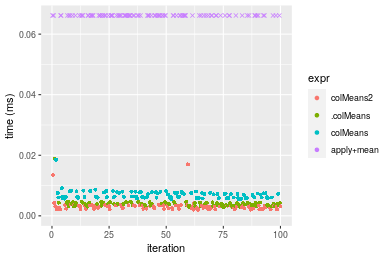

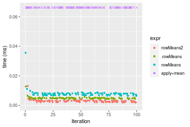
_Table: Benchmarking of colMeans2() and rowMeans2() on integer+10x10 data (original and transposed).  The top panel shows times in milliseconds and the bottom panel shows relative times._


|   |expr      |   min|     lq|    mean| median|     uq|    max|
|:--|:---------|-----:|------:|-------:|------:|------:|------:|
|2  |rowMeans2 | 2.010| 2.3115| 2.93226| 2.8950| 3.2590| 13.166|
|1  |colMeans2 | 1.992| 2.3665| 3.14234| 3.0835| 3.3555| 16.988|


|   |expr      |       min|       lq|     mean|   median|      uq|      max|
|:--|:---------|---------:|--------:|--------:|--------:|-------:|--------:|
|2  |rowMeans2 | 1.0000000| 1.000000| 1.000000| 1.000000| 1.00000| 1.000000|
|1  |colMeans2 | 0.9910448| 1.023794| 1.071644| 1.065112| 1.02961| 1.290293|

_Figure: Benchmarking of colMeans2() and rowMeans2() on integer+10x10 data (original and transposed).  Outliers are displayed as crosses. Times are in milliseconds._


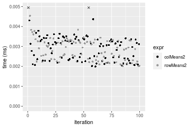

#### 100x100 integer matrix

```r
> X <- data[["100x100"]]
> gc()
          used  (Mb) gc trigger  (Mb) max used  (Mb)
Ncells 5233542 279.6    8529671 455.6  8529671 455.6
Vcells 9734433  74.3   31876688 243.2 60562128 462.1
> colStats <- microbenchmark(colMeans2 = colMeans2(X, na.rm = FALSE), .colMeans = .colMeans(X, m = nrow(X), 
+     n = ncol(X), na.rm = FALSE), colMeans = colMeans(X, na.rm = FALSE), `apply+mean` = apply(X, MARGIN = 2L, 
+     FUN = mean, na.rm = FALSE), unit = "ms")
> X <- t(X)
> gc()
          used  (Mb) gc trigger  (Mb) max used  (Mb)
Ncells 5233518 279.6    8529671 455.6  8529671 455.6
Vcells 9739446  74.4   31876688 243.2 60562128 462.1
> rowStats <- microbenchmark(rowMeans2 = rowMeans2(X, na.rm = FALSE), .rowMeans = .rowMeans(X, m = nrow(X), 
+     n = ncol(X), na.rm = FALSE), rowMeans = rowMeans(X, na.rm = FALSE), `apply+mean` = apply(X, MARGIN = 1L, 
+     FUN = mean, na.rm = FALSE), unit = "ms")
```

_Table: Benchmarking of colMeans2(), .colMeans(), colMeans() and apply+mean() on integer+100x100 data. The top panel shows times in milliseconds and the bottom panel shows relative times._


|   |expr       |      min|        lq|      mean|   median|       uq|      max|
|:--|:----------|--------:|---------:|---------:|--------:|--------:|--------:|
|2  |.colMeans  | 0.011740| 0.0129460| 0.0147181| 0.014228| 0.015126| 0.030573|
|1  |colMeans2  | 0.013761| 0.0151360| 0.0170067| 0.016602| 0.017374| 0.032148|
|3  |colMeans   | 0.014046| 0.0159465| 0.0178452| 0.017108| 0.019011| 0.036727|
|4  |apply+mean | 0.404897| 0.4364410| 0.4947802| 0.481770| 0.534527| 0.727672|


|   |expr       |       min|        lq|      mean|    median|        uq|       max|
|:--|:----------|---------:|---------:|---------:|---------:|---------:|---------:|
|2  |.colMeans  |  1.000000|  1.000000|  1.000000|  1.000000|  1.000000|  1.000000|
|1  |colMeans2  |  1.172146|  1.169164|  1.155498|  1.166854|  1.148618|  1.051516|
|3  |colMeans   |  1.196422|  1.231770|  1.212467|  1.202418|  1.256843|  1.201289|
|4  |apply+mean | 34.488671| 33.712421| 33.617103| 33.860697| 35.338292| 23.801132|

_Table: Benchmarking of rowMeans2(), .rowMeans(), rowMeans() and apply+mean() on integer+100x100 data (transposed). The top panel shows times in milliseconds and the bottom panel shows relative times._


|   |expr       |      min|        lq|      mean|    median|        uq|      max|
|:--|:----------|--------:|---------:|---------:|---------:|---------:|--------:|
|1  |rowMeans2  | 0.015711| 0.0175810| 0.0208816| 0.0204045| 0.0239075| 0.035039|
|2  |.rowMeans  | 0.034387| 0.0360530| 0.0425171| 0.0403155| 0.0461885| 0.064760|
|3  |rowMeans   | 0.036265| 0.0400645| 0.0463726| 0.0447190| 0.0495415| 0.073816|
|4  |apply+mean | 0.393155| 0.4262150| 0.4861259| 0.4767065| 0.5237225| 0.729521|


|   |expr       |       min|        lq|      mean|    median|        uq|       max|
|:--|:----------|---------:|---------:|---------:|---------:|---------:|---------:|
|1  |rowMeans2  |  1.000000|  1.000000|  1.000000|  1.000000|  1.000000|  1.000000|
|2  |.rowMeans  |  2.188721|  2.050680|  2.036106|  1.975814|  1.931967|  1.848226|
|3  |rowMeans   |  2.308255|  2.278852|  2.220744|  2.191624|  2.072216|  2.106681|
|4  |apply+mean | 25.024187| 24.242933| 23.280133| 23.362812| 21.906201| 20.820257|

_Figure: Benchmarking of colMeans2(), .colMeans(), colMeans() and apply+mean() on integer+100x100 data  as well as rowMeans2(), .rowMeans(), rowMeans() and apply+mean() on the same data transposed.  Outliers are displayed as crosses.  Times are in milliseconds._


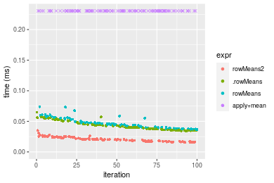
_Table: Benchmarking of colMeans2() and rowMeans2() on integer+100x100 data (original and transposed).  The top panel shows times in milliseconds and the bottom panel shows relative times._


|   |expr      |    min|     lq|     mean|  median|      uq|    max|
|:--|:---------|------:|------:|--------:|-------:|-------:|------:|
|1  |colMeans2 | 13.761| 15.136| 17.00674| 16.6020| 17.3740| 32.148|
|2  |rowMeans2 | 15.711| 17.581| 20.88158| 20.4045| 23.9075| 35.039|


|   |expr      |      min|       lq|     mean|   median|      uq|      max|
|:--|:---------|--------:|--------:|--------:|--------:|-------:|--------:|
|1  |colMeans2 | 1.000000| 1.000000| 1.000000| 1.000000| 1.00000| 1.000000|
|2  |rowMeans2 | 1.141705| 1.161535| 1.227841| 1.229039| 1.37605| 1.089928|

_Figure: Benchmarking of colMeans2() and rowMeans2() on integer+100x100 data (original and transposed).  Outliers are displayed as crosses. Times are in milliseconds._


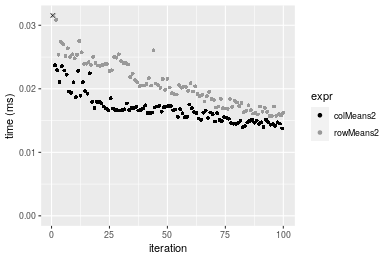

#### 1000x10 integer matrix

```r
> X <- data[["1000x10"]]
> gc()
          used  (Mb) gc trigger  (Mb) max used  (Mb)
Ncells 5234288 279.6    8529671 455.6  8529671 455.6
Vcells 9738176  74.3   31876688 243.2 60562128 462.1
> colStats <- microbenchmark(colMeans2 = colMeans2(X, na.rm = FALSE), .colMeans = .colMeans(X, m = nrow(X), 
+     n = ncol(X), na.rm = FALSE), colMeans = colMeans(X, na.rm = FALSE), `apply+mean` = apply(X, MARGIN = 2L, 
+     FUN = mean, na.rm = FALSE), unit = "ms")
> X <- t(X)
> gc()
          used  (Mb) gc trigger  (Mb) max used  (Mb)
Ncells 5234282 279.6    8529671 455.6  8529671 455.6
Vcells 9743219  74.4   31876688 243.2 60562128 462.1
> rowStats <- microbenchmark(rowMeans2 = rowMeans2(X, na.rm = FALSE), .rowMeans = .rowMeans(X, m = nrow(X), 
+     n = ncol(X), na.rm = FALSE), rowMeans = rowMeans(X, na.rm = FALSE), `apply+mean` = apply(X, MARGIN = 1L, 
+     FUN = mean, na.rm = FALSE), unit = "ms")
```

_Table: Benchmarking of colMeans2(), .colMeans(), colMeans() and apply+mean() on integer+1000x10 data. The top panel shows times in milliseconds and the bottom panel shows relative times._


|   |expr       |      min|        lq|      mean|    median|        uq|      max|
|:--|:----------|--------:|---------:|---------:|---------:|---------:|--------:|
|2  |.colMeans  | 0.013163| 0.0143130| 0.0155026| 0.0154285| 0.0163975| 0.022736|
|3  |colMeans   | 0.015870| 0.0175615| 0.0189664| 0.0186625| 0.0197770| 0.035407|
|1  |colMeans2  | 0.015938| 0.0173365| 0.0188227| 0.0189070| 0.0195330| 0.031747|
|4  |apply+mean | 0.141983| 0.1481960| 0.1607782| 0.1592475| 0.1725340| 0.251937|


|   |expr       |       min|        lq|      mean|    median|        uq|       max|
|:--|:----------|---------:|---------:|---------:|---------:|---------:|---------:|
|2  |.colMeans  |  1.000000|  1.000000|  1.000000|  1.000000|  1.000000|  1.000000|
|3  |colMeans   |  1.205652|  1.226962|  1.223431|  1.209612|  1.206098|  1.557310|
|1  |colMeans2  |  1.210818|  1.211242|  1.214164|  1.225459|  1.191218|  1.396332|
|4  |apply+mean | 10.786523| 10.353944| 10.371052| 10.321645| 10.521970| 11.080973|

_Table: Benchmarking of rowMeans2(), .rowMeans(), rowMeans() and apply+mean() on integer+1000x10 data (transposed). The top panel shows times in milliseconds and the bottom panel shows relative times._


|   |expr       |      min|        lq|      mean|    median|        uq|      max|
|:--|:----------|--------:|---------:|---------:|---------:|---------:|--------:|
|1  |rowMeans2  | 0.015900| 0.0175550| 0.0198808| 0.0189100| 0.0208750| 0.038201|
|4  |apply+mean | 0.118695| 0.1301820| 0.1446521| 0.1382570| 0.1604360| 0.259639|
|2  |.rowMeans  | 0.146888| 0.1554555| 0.1738174| 0.1708555| 0.1906365| 0.219340|
|3  |rowMeans   | 0.148658| 0.1588325| 0.1761765| 0.1715380| 0.1868535| 0.229172|


|   |expr       |      min|       lq|     mean|   median|       uq|      max|
|:--|:----------|--------:|--------:|--------:|--------:|--------:|--------:|
|1  |rowMeans2  | 1.000000| 1.000000| 1.000000| 1.000000| 1.000000| 1.000000|
|4  |apply+mean | 7.465094| 7.415665| 7.275974| 7.311317| 7.685557| 6.796654|
|2  |.rowMeans  | 9.238239| 8.855340| 8.742980| 9.035193| 9.132287| 5.741734|
|3  |rowMeans   | 9.349560| 9.047707| 8.861643| 9.071285| 8.951066| 5.999110|

_Figure: Benchmarking of colMeans2(), .colMeans(), colMeans() and apply+mean() on integer+1000x10 data  as well as rowMeans2(), .rowMeans(), rowMeans() and apply+mean() on the same data transposed.  Outliers are displayed as crosses.  Times are in milliseconds._


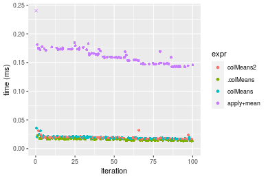

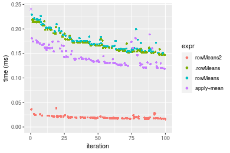
_Table: Benchmarking of colMeans2() and rowMeans2() on integer+1000x10 data (original and transposed).  The top panel shows times in milliseconds and the bottom panel shows relative times._


|   |expr      |    min|      lq|     mean| median|     uq|    max|
|:--|:---------|------:|-------:|--------:|------:|------:|------:|
|1  |colMeans2 | 15.938| 17.3365| 18.82268| 18.907| 19.533| 31.747|
|2  |rowMeans2 | 15.900| 17.5550| 19.88079| 18.910| 20.875| 38.201|


|   |expr      |       min|       lq|     mean|   median|       uq|      max|
|:--|:---------|---------:|--------:|--------:|--------:|--------:|--------:|
|1  |colMeans2 | 1.0000000| 1.000000| 1.000000| 1.000000| 1.000000| 1.000000|
|2  |rowMeans2 | 0.9976158| 1.012603| 1.056215| 1.000159| 1.068704| 1.203295|

_Figure: Benchmarking of colMeans2() and rowMeans2() on integer+1000x10 data (original and transposed).  Outliers are displayed as crosses. Times are in milliseconds._


#### 10x1000 integer matrix

```r
> X <- data[["10x1000"]]
> gc()
          used  (Mb) gc trigger  (Mb) max used  (Mb)
Ncells 5234528 279.6    8529671 455.6  8529671 455.6
Vcells 9739019  74.4   31876688 243.2 60562128 462.1
> colStats <- microbenchmark(colMeans2 = colMeans2(X, na.rm = FALSE), .colMeans = .colMeans(X, m = nrow(X), 
+     n = ncol(X), na.rm = FALSE), colMeans = colMeans(X, na.rm = FALSE), `apply+mean` = apply(X, MARGIN = 2L, 
+     FUN = mean, na.rm = FALSE), unit = "ms")
> X <- t(X)
> gc()
          used  (Mb) gc trigger  (Mb) max used  (Mb)
Ncells 5234504 279.6    8529671 455.6  8529671 455.6
Vcells 9744032  74.4   31876688 243.2 60562128 462.1
> rowStats <- microbenchmark(rowMeans2 = rowMeans2(X, na.rm = FALSE), .rowMeans = .rowMeans(X, m = nrow(X), 
+     n = ncol(X), na.rm = FALSE), rowMeans = rowMeans(X, na.rm = FALSE), `apply+mean` = apply(X, MARGIN = 1L, 
+     FUN = mean, na.rm = FALSE), unit = "ms")
```

_Table: Benchmarking of colMeans2(), .colMeans(), colMeans() and apply+mean() on integer+10x1000 data. The top panel shows times in milliseconds and the bottom panel shows relative times._


|   |expr       |      min|       lq|      mean|    median|        uq|      max|
|:--|:----------|--------:|--------:|---------:|---------:|---------:|--------:|
|2  |.colMeans  | 0.013135| 0.014760| 0.0158475| 0.0157035| 0.0163910| 0.022401|
|3  |colMeans   | 0.015766| 0.017293| 0.0202043| 0.0187220| 0.0211025| 0.054562|
|1  |colMeans2  | 0.016770| 0.019353| 0.0213923| 0.0205510| 0.0222930| 0.038533|
|4  |apply+mean | 3.089859| 3.492587| 3.6795149| 3.5659015| 3.8066240| 8.120902|


|   |expr       |        min|         lq|       mean|     median|         uq|        max|
|:--|:----------|----------:|----------:|----------:|----------:|----------:|----------:|
|2  |.colMeans  |   1.000000|   1.000000|   1.000000|   1.000000|   1.000000|   1.000000|
|3  |colMeans   |   1.200305|   1.171612|   1.274921|   1.192218|   1.287444|   2.435695|
|1  |colMeans2  |   1.276741|   1.311179|   1.349890|   1.308689|   1.360076|   1.720146|
|4  |apply+mean | 235.238599| 236.625135| 232.183111| 227.076862| 232.238668| 362.524084|

_Table: Benchmarking of rowMeans2(), .rowMeans(), rowMeans() and apply+mean() on integer+10x1000 data (transposed). The top panel shows times in milliseconds and the bottom panel shows relative times._


|   |expr       |      min|       lq|      mean|    median|        uq|      max|
|:--|:----------|--------:|--------:|---------:|---------:|---------:|--------:|
|1  |rowMeans2  | 0.017299| 0.019108| 0.0219312| 0.0201595| 0.0217275| 0.052354|
|2  |.rowMeans  | 0.026678| 0.029969| 0.0313585| 0.0308465| 0.0318540| 0.049340|
|3  |rowMeans   | 0.029382| 0.032307| 0.0356464| 0.0336205| 0.0363340| 0.077620|
|4  |apply+mean | 3.112655| 3.484507| 3.6993173| 3.6053875| 3.8273165| 8.703466|


|   |expr       |       min|         lq|       mean|     median|         uq|         max|
|:--|:----------|---------:|----------:|----------:|----------:|----------:|-----------:|
|1  |rowMeans2  |   1.00000|   1.000000|   1.000000|   1.000000|   1.000000|   1.0000000|
|2  |.rowMeans  |   1.54217|   1.568401|   1.429861|   1.530122|   1.466068|   0.9424304|
|3  |rowMeans   |   1.69848|   1.690758|   1.625374|   1.667725|   1.672259|   1.4825992|
|4  |apply+mean | 179.93266| 182.358567| 168.678445| 178.843101| 176.150800| 166.2426176|

_Figure: Benchmarking of colMeans2(), .colMeans(), colMeans() and apply+mean() on integer+10x1000 data  as well as rowMeans2(), .rowMeans(), rowMeans() and apply+mean() on the same data transposed.  Outliers are displayed as crosses.  Times are in milliseconds._


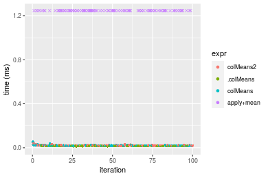

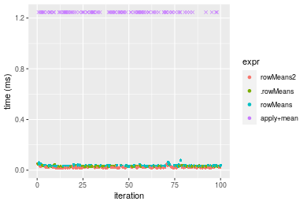
_Table: Benchmarking of colMeans2() and rowMeans2() on integer+10x1000 data (original and transposed).  The top panel shows times in milliseconds and the bottom panel shows relative times._


|   |expr      |    min|     lq|     mean|  median|      uq|    max|
|:--|:---------|------:|------:|--------:|-------:|-------:|------:|
|2  |rowMeans2 | 17.299| 19.108| 21.93118| 20.1595| 21.7275| 52.354|
|1  |colMeans2 | 16.770| 19.353| 21.39234| 20.5510| 22.2930| 38.533|


|   |expr      |       min|       lq|      mean|  median|       uq|       max|
|:--|:---------|---------:|--------:|---------:|-------:|--------:|---------:|
|2  |rowMeans2 | 1.0000000| 1.000000| 1.0000000| 1.00000| 1.000000| 1.0000000|
|1  |colMeans2 | 0.9694202| 1.012822| 0.9754304| 1.01942| 1.026027| 0.7360087|

_Figure: Benchmarking of colMeans2() and rowMeans2() on integer+10x1000 data (original and transposed).  Outliers are displayed as crosses. Times are in milliseconds._


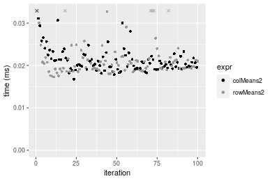

#### 100x1000 integer matrix

```r
> X <- data[["100x1000"]]
> gc()
          used  (Mb) gc trigger  (Mb) max used  (Mb)
Ncells 5234746 279.6    8529671 455.6  8529671 455.6
Vcells 9739590  74.4   31876688 243.2 60562128 462.1
> colStats <- microbenchmark(colMeans2 = colMeans2(X, na.rm = FALSE), .colMeans = .colMeans(X, m = nrow(X), 
+     n = ncol(X), na.rm = FALSE), colMeans = colMeans(X, na.rm = FALSE), `apply+mean` = apply(X, MARGIN = 2L, 
+     FUN = mean, na.rm = FALSE), unit = "ms")
> X <- t(X)
> gc()
          used  (Mb) gc trigger  (Mb) max used  (Mb)
Ncells 5234734 279.6    8529671 455.6  8529671 455.6
Vcells 9789623  74.7   31876688 243.2 60562128 462.1
> rowStats <- microbenchmark(rowMeans2 = rowMeans2(X, na.rm = FALSE), .rowMeans = .rowMeans(X, m = nrow(X), 
+     n = ncol(X), na.rm = FALSE), rowMeans = rowMeans(X, na.rm = FALSE), `apply+mean` = apply(X, MARGIN = 1L, 
+     FUN = mean, na.rm = FALSE), unit = "ms")
```

_Table: Benchmarking of colMeans2(), .colMeans(), colMeans() and apply+mean() on integer+100x1000 data. The top panel shows times in milliseconds and the bottom panel shows relative times._


|   |expr       |      min|        lq|      mean|    median|        uq|       max|
|:--|:----------|--------:|---------:|---------:|---------:|---------:|---------:|
|2  |.colMeans  | 0.088949| 0.1015470| 0.1064333| 0.1039070| 0.1072950|  0.192288|
|3  |colMeans   | 0.090834| 0.1030705| 0.1075519| 0.1054680| 0.1104115|  0.146975|
|1  |colMeans2  | 0.119515| 0.1331360| 0.1387987| 0.1375605| 0.1435235|  0.185253|
|4  |apply+mean | 3.759292| 4.2359465| 4.5301877| 4.3567710| 4.5313390| 18.450519|


|   |expr       |       min|        lq|      mean|    median|        uq|        max|
|:--|:----------|---------:|---------:|---------:|---------:|---------:|----------:|
|2  |.colMeans  |  1.000000|  1.000000|  1.000000|  1.000000|  1.000000|  1.0000000|
|3  |colMeans   |  1.021192|  1.015003|  1.010510|  1.015023|  1.029046|  0.7643483|
|1  |colMeans2  |  1.343635|  1.311078|  1.304091|  1.323881|  1.337653|  0.9634143|
|4  |apply+mean | 42.263454| 41.714147| 42.563631| 41.929524| 42.232527| 95.9525243|

_Table: Benchmarking of rowMeans2(), .rowMeans(), rowMeans() and apply+mean() on integer+100x1000 data (transposed). The top panel shows times in milliseconds and the bottom panel shows relative times._


|   |expr       |      min|        lq|      mean|    median|        uq|       max|
|:--|:----------|--------:|---------:|---------:|---------:|---------:|---------:|
|1  |rowMeans2  | 0.144974| 0.1653780| 0.1728834| 0.1683720| 0.1758220|  0.289812|
|2  |.rowMeans  | 0.222891| 0.2537550| 0.2598834| 0.2559765| 0.2628260|  0.383208|
|3  |rowMeans   | 0.229851| 0.2565955| 0.2605143| 0.2596985| 0.2671795|  0.310940|
|4  |apply+mean | 3.751237| 4.1897070| 4.5080480| 4.3244395| 4.5011175| 18.660145|


|   |expr       |       min|        lq|      mean|    median|        uq|       max|
|:--|:----------|---------:|---------:|---------:|---------:|---------:|---------:|
|1  |rowMeans2  |  1.000000|  1.000000|  1.000000|  1.000000|  1.000000|  1.000000|
|2  |.rowMeans  |  1.537455|  1.534394|  1.503229|  1.520303|  1.494841|  1.322264|
|3  |rowMeans   |  1.585464|  1.551570|  1.506878|  1.542409|  1.519602|  1.072902|
|4  |apply+mean | 25.875240| 25.334125| 26.075651| 25.683840| 25.600423| 64.387068|

_Figure: Benchmarking of colMeans2(), .colMeans(), colMeans() and apply+mean() on integer+100x1000 data  as well as rowMeans2(), .rowMeans(), rowMeans() and apply+mean() on the same data transposed.  Outliers are displayed as crosses.  Times are in milliseconds._


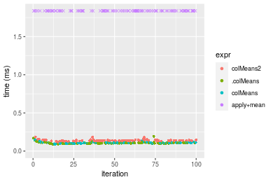

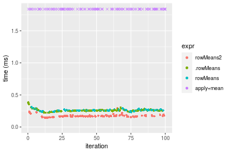
_Table: Benchmarking of colMeans2() and rowMeans2() on integer+100x1000 data (original and transposed).  The top panel shows times in milliseconds and the bottom panel shows relative times._


|   |expr      |     min|      lq|     mean|   median|       uq|     max|
|:--|:---------|-------:|-------:|--------:|--------:|--------:|-------:|
|1  |colMeans2 | 119.515| 133.136| 138.7987| 137.5605| 143.5235| 185.253|
|2  |rowMeans2 | 144.974| 165.378| 172.8834| 168.3720| 175.8220| 289.812|


|   |expr      |      min|       lq|     mean|   median|      uq|      max|
|:--|:---------|--------:|--------:|--------:|--------:|-------:|--------:|
|1  |colMeans2 | 1.000000| 1.000000| 1.000000| 1.000000| 1.00000| 1.000000|
|2  |rowMeans2 | 1.213019| 1.242173| 1.245569| 1.223985| 1.22504| 1.564412|

_Figure: Benchmarking of colMeans2() and rowMeans2() on integer+100x1000 data (original and transposed).  Outliers are displayed as crosses. Times are in milliseconds._


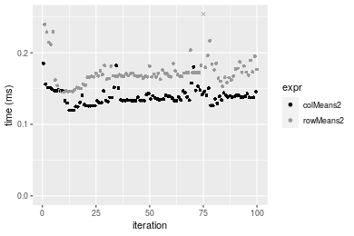

#### 1000x100 integer matrix

```r
> X <- data[["1000x100"]]
> gc()
          used  (Mb) gc trigger  (Mb) max used  (Mb)
Ncells 5234970 279.6    8529671 455.6  8529671 455.6
Vcells 9740368  74.4   31876688 243.2 60562128 462.1
> colStats <- microbenchmark(colMeans2 = colMeans2(X, na.rm = FALSE), .colMeans = .colMeans(X, m = nrow(X), 
+     n = ncol(X), na.rm = FALSE), colMeans = colMeans(X, na.rm = FALSE), `apply+mean` = apply(X, MARGIN = 2L, 
+     FUN = mean, na.rm = FALSE), unit = "ms")
> X <- t(X)
> gc()
          used  (Mb) gc trigger  (Mb) max used  (Mb)
Ncells 5234958 279.6    8529671 455.6  8529671 455.6
Vcells 9790401  74.7   31876688 243.2 60562128 462.1
> rowStats <- microbenchmark(rowMeans2 = rowMeans2(X, na.rm = FALSE), .rowMeans = .rowMeans(X, m = nrow(X), 
+     n = ncol(X), na.rm = FALSE), rowMeans = rowMeans(X, na.rm = FALSE), `apply+mean` = apply(X, MARGIN = 1L, 
+     FUN = mean, na.rm = FALSE), unit = "ms")
```

_Table: Benchmarking of colMeans2(), .colMeans(), colMeans() and apply+mean() on integer+1000x100 data. The top panel shows times in milliseconds and the bottom panel shows relative times._


|   |expr       |      min|        lq|      mean|   median|        uq|      max|
|:--|:----------|--------:|---------:|---------:|--------:|---------:|--------:|
|2  |.colMeans  | 0.081085| 0.0905185| 0.0962668| 0.092616| 0.0961065| 0.151066|
|3  |colMeans   | 0.085667| 0.0928960| 0.1003407| 0.096000| 0.1054990| 0.151169|
|1  |colMeans2  | 0.106836| 0.1174530| 0.1254939| 0.122546| 0.1274805| 0.191988|
|4  |apply+mean | 0.903353| 0.9894655| 1.0771977| 1.024349| 1.1213500| 1.578615|


|   |expr       |       min|        lq|      mean|    median|       uq|       max|
|:--|:----------|---------:|---------:|---------:|---------:|--------:|---------:|
|2  |.colMeans  |  1.000000|  1.000000|  1.000000|  1.000000|  1.00000|  1.000000|
|3  |colMeans   |  1.056509|  1.026265|  1.042319|  1.036538|  1.09773|  1.000682|
|1  |colMeans2  |  1.317580|  1.297558|  1.303605|  1.323162|  1.32645|  1.270888|
|4  |apply+mean | 11.140815| 10.931086| 11.189713| 11.060168| 11.66779| 10.449836|

_Table: Benchmarking of rowMeans2(), .rowMeans(), rowMeans() and apply+mean() on integer+1000x100 data (transposed). The top panel shows times in milliseconds and the bottom panel shows relative times._


|   |expr       |      min|       lq|      mean|    median|        uq|      max|
|:--|:----------|--------:|--------:|---------:|---------:|---------:|--------:|
|1  |rowMeans2  | 0.144888| 0.153491| 0.1650511| 0.1635605| 0.1693450| 0.241371|
|2  |.rowMeans  | 0.320223| 0.346984| 0.3659653| 0.3583930| 0.3687080| 0.566216|
|3  |rowMeans   | 0.322849| 0.351780| 0.3698612| 0.3693370| 0.3732825| 0.496529|
|4  |apply+mean | 0.918096| 1.004307| 1.0543432| 1.0237475| 1.0430140| 1.641317|


|   |expr       |      min|       lq|     mean|   median|       uq|      max|
|:--|:----------|--------:|--------:|--------:|--------:|--------:|--------:|
|1  |rowMeans2  | 1.000000| 1.000000| 1.000000| 1.000000| 1.000000| 1.000000|
|2  |.rowMeans  | 2.210142| 2.260615| 2.217285| 2.191195| 2.177259| 2.345833|
|3  |rowMeans   | 2.228266| 2.291861| 2.240889| 2.258106| 2.204272| 2.057120|
|4  |apply+mean | 6.336591| 6.543103| 6.387980| 6.259137| 6.159107| 6.799976|

_Figure: Benchmarking of colMeans2(), .colMeans(), colMeans() and apply+mean() on integer+1000x100 data  as well as rowMeans2(), .rowMeans(), rowMeans() and apply+mean() on the same data transposed.  Outliers are displayed as crosses.  Times are in milliseconds._


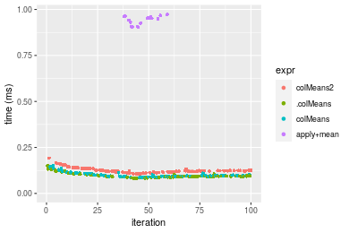


_Table: Benchmarking of colMeans2() and rowMeans2() on integer+1000x100 data (original and transposed).  The top panel shows times in milliseconds and the bottom panel shows relative times._


|   |expr      |     min|      lq|     mean|   median|       uq|     max|
|:--|:---------|-------:|-------:|--------:|--------:|--------:|-------:|
|1  |colMeans2 | 106.836| 117.453| 125.4939| 122.5460| 127.4805| 191.988|
|2  |rowMeans2 | 144.888| 153.491| 165.0511| 163.5605| 169.3450| 241.371|


|   |expr      |      min|       lq|     mean|   median|       uq|      max|
|:--|:---------|--------:|--------:|--------:|--------:|--------:|--------:|
|1  |colMeans2 | 1.000000| 1.000000| 1.000000| 1.000000| 1.000000| 1.000000|
|2  |rowMeans2 | 1.356172| 1.306829| 1.315212| 1.334687| 1.328399| 1.257219|

_Figure: Benchmarking of colMeans2() and rowMeans2() on integer+1000x100 data (original and transposed).  Outliers are displayed as crosses. Times are in milliseconds._


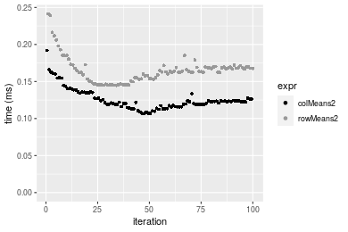


## Data type "double"

### Data
```r
> rmatrix <- function(nrow, ncol, mode = c("logical", "double", "integer", "index"), range = c(-100, 
+     +100), na_prob = 0) {
+     mode <- match.arg(mode)
+     n <- nrow * ncol
+     if (mode == "logical") {
+         x <- sample(c(FALSE, TRUE), size = n, replace = TRUE)
+     }     else if (mode == "index") {
+         x <- seq_len(n)
+         mode <- "integer"
+     }     else {
+         x <- runif(n, min = range[1], max = range[2])
+     }
+     storage.mode(x) <- mode
+     if (na_prob > 0) 
+         x[sample(n, size = na_prob * n)] <- NA
+     dim(x) <- c(nrow, ncol)
+     x
+ }
> rmatrices <- function(scale = 10, seed = 1, ...) {
+     set.seed(seed)
+     data <- list()
+     data[[1]] <- rmatrix(nrow = scale * 1, ncol = scale * 1, ...)
+     data[[2]] <- rmatrix(nrow = scale * 10, ncol = scale * 10, ...)
+     data[[3]] <- rmatrix(nrow = scale * 100, ncol = scale * 1, ...)
+     data[[4]] <- t(data[[3]])
+     data[[5]] <- rmatrix(nrow = scale * 10, ncol = scale * 100, ...)
+     data[[6]] <- t(data[[5]])
+     names(data) <- sapply(data, FUN = function(x) paste(dim(x), collapse = "x"))
+     data
+ }
> data <- rmatrices(mode = mode)
```

### Results

#### 10x10 double matrix

```r
> X <- data[["10x10"]]
> gc()
          used  (Mb) gc trigger  (Mb) max used  (Mb)
Ncells 5235197 279.6    8529671 455.6  8529671 455.6
Vcells 9856301  75.2   31876688 243.2 60562128 462.1
> colStats <- microbenchmark(colMeans2 = colMeans2(X, na.rm = FALSE), .colMeans = .colMeans(X, m = nrow(X), 
+     n = ncol(X), na.rm = FALSE), colMeans = colMeans(X, na.rm = FALSE), `apply+mean` = apply(X, MARGIN = 2L, 
+     FUN = mean, na.rm = FALSE), unit = "ms")
> X <- t(X)
> gc()
          used  (Mb) gc trigger  (Mb) max used  (Mb)
Ncells 5235182 279.6    8529671 455.6  8529671 455.6
Vcells 9856429  75.2   31876688 243.2 60562128 462.1
> rowStats <- microbenchmark(rowMeans2 = rowMeans2(X, na.rm = FALSE), .rowMeans = .rowMeans(X, m = nrow(X), 
+     n = ncol(X), na.rm = FALSE), rowMeans = rowMeans(X, na.rm = FALSE), `apply+mean` = apply(X, MARGIN = 1L, 
+     FUN = mean, na.rm = FALSE), unit = "ms")
```

_Table: Benchmarking of colMeans2(), .colMeans(), colMeans() and apply+mean() on double+10x10 data. The top panel shows times in milliseconds and the bottom panel shows relative times._


|   |expr       |      min|        lq|      mean|    median|        uq|      max|
|:--|:----------|--------:|---------:|---------:|---------:|---------:|--------:|
|1  |colMeans2  | 0.001996| 0.0024525| 0.0030822| 0.0031190| 0.0034125| 0.015239|
|2  |.colMeans  | 0.002793| 0.0031900| 0.0037191| 0.0035125| 0.0040765| 0.014507|
|3  |colMeans   | 0.005298| 0.0057790| 0.0066577| 0.0063560| 0.0073735| 0.017426|
|4  |apply+mean | 0.065818| 0.0689910| 0.0720126| 0.0704775| 0.0726980| 0.147648|


|   |expr       |       min|        lq|      mean|    median|        uq|       max|
|:--|:----------|---------:|---------:|---------:|---------:|---------:|---------:|
|1  |colMeans2  |  1.000000|  1.000000|  1.000000|  1.000000|  1.000000| 1.0000000|
|2  |.colMeans  |  1.399299|  1.300714|  1.206622|  1.126162|  1.194579| 0.9519654|
|3  |colMeans   |  2.654309|  2.356371|  2.160032|  2.037833|  2.160733| 1.1435134|
|4  |apply+mean | 32.974950| 28.130887| 23.364032| 22.596185| 21.303443| 9.6888247|

_Table: Benchmarking of rowMeans2(), .rowMeans(), rowMeans() and apply+mean() on double+10x10 data (transposed). The top panel shows times in milliseconds and the bottom panel shows relative times._


|   |expr       |      min|        lq|      mean|    median|        uq|      max|
|:--|:----------|--------:|---------:|---------:|---------:|---------:|--------:|
|1  |rowMeans2  | 0.002003| 0.0022810| 0.0029061| 0.0029145| 0.0032550| 0.013025|
|2  |.rowMeans  | 0.002305| 0.0026760| 0.0030477| 0.0029510| 0.0031760| 0.007883|
|3  |rowMeans   | 0.004476| 0.0050145| 0.0059769| 0.0058160| 0.0062755| 0.031453|
|4  |apply+mean | 0.066499| 0.0679560| 0.0713963| 0.0696305| 0.0729915| 0.139354|


|   |expr       |       min|        lq|      mean|    median|         uq|        max|
|:--|:----------|---------:|---------:|---------:|---------:|----------:|----------:|
|1  |rowMeans2  |  1.000000|  1.000000|  1.000000|  1.000000|  1.0000000|  1.0000000|
|2  |.rowMeans  |  1.150774|  1.173170|  1.048750|  1.012524|  0.9757296|  0.6052207|
|3  |rowMeans   |  2.234648|  2.198378|  2.056692|  1.995540|  1.9279570|  2.4148177|
|4  |apply+mean | 33.199700| 29.792196| 24.568075| 23.891062| 22.4244240| 10.6989635|

_Figure: Benchmarking of colMeans2(), .colMeans(), colMeans() and apply+mean() on double+10x10 data  as well as rowMeans2(), .rowMeans(), rowMeans() and apply+mean() on the same data transposed.  Outliers are displayed as crosses.  Times are in milliseconds._


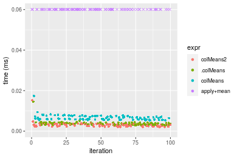

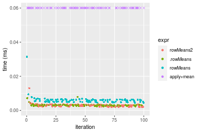
_Table: Benchmarking of colMeans2() and rowMeans2() on double+10x10 data (original and transposed).  The top panel shows times in milliseconds and the bottom panel shows relative times._


|   |expr      |   min|     lq|    mean| median|     uq|    max|
|:--|:---------|-----:|------:|-------:|------:|------:|------:|
|2  |rowMeans2 | 2.003| 2.2810| 2.90606| 2.9145| 3.2550| 13.025|
|1  |colMeans2 | 1.996| 2.4525| 3.08220| 3.1190| 3.4125| 15.239|


|   |expr      |       min|       lq|     mean|   median|       uq|      max|
|:--|:---------|---------:|--------:|--------:|--------:|--------:|--------:|
|2  |rowMeans2 | 1.0000000| 1.000000| 1.000000| 1.000000| 1.000000| 1.000000|
|1  |colMeans2 | 0.9965052| 1.075186| 1.060611| 1.070166| 1.048387| 1.169981|

_Figure: Benchmarking of colMeans2() and rowMeans2() on double+10x10 data (original and transposed).  Outliers are displayed as crosses. Times are in milliseconds._


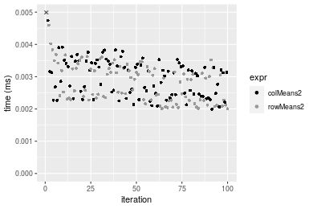

#### 100x100 double matrix

```r
> X <- data[["100x100"]]
> gc()
          used  (Mb) gc trigger  (Mb) max used  (Mb)
Ncells 5235434 279.7    8529671 455.6  8529671 455.6
Vcells 9857359  75.3   31876688 243.2 60562128 462.1
> colStats <- microbenchmark(colMeans2 = colMeans2(X, na.rm = FALSE), .colMeans = .colMeans(X, m = nrow(X), 
+     n = ncol(X), na.rm = FALSE), colMeans = colMeans(X, na.rm = FALSE), `apply+mean` = apply(X, MARGIN = 2L, 
+     FUN = mean, na.rm = FALSE), unit = "ms")
> X <- t(X)
> gc()
          used  (Mb) gc trigger  (Mb) max used  (Mb)
Ncells 5235410 279.7    8529671 455.6  8529671 455.6
Vcells 9867372  75.3   31876688 243.2 60562128 462.1
> rowStats <- microbenchmark(rowMeans2 = rowMeans2(X, na.rm = FALSE), .rowMeans = .rowMeans(X, m = nrow(X), 
+     n = ncol(X), na.rm = FALSE), rowMeans = rowMeans(X, na.rm = FALSE), `apply+mean` = apply(X, MARGIN = 1L, 
+     FUN = mean, na.rm = FALSE), unit = "ms")
```

_Table: Benchmarking of colMeans2(), .colMeans(), colMeans() and apply+mean() on double+100x100 data. The top panel shows times in milliseconds and the bottom panel shows relative times._


|   |expr       |      min|       lq|      mean|   median|       uq|      max|
|:--|:----------|--------:|--------:|---------:|--------:|--------:|--------:|
|2  |.colMeans  | 0.008987| 0.010441| 0.0115130| 0.011085| 0.012182| 0.018603|
|3  |colMeans   | 0.011359| 0.013062| 0.0146494| 0.013877| 0.015752| 0.034765|
|1  |colMeans2  | 0.027815| 0.030040| 0.0336852| 0.032915| 0.034501| 0.062917|
|4  |apply+mean | 0.410485| 0.448217| 0.5050557| 0.488233| 0.535023| 0.757183|


|   |expr       |       min|        lq|      mean|    median|        uq|       max|
|:--|:----------|---------:|---------:|---------:|---------:|---------:|---------:|
|2  |.colMeans  |  1.000000|  1.000000|  1.000000|  1.000000|  1.000000|  1.000000|
|3  |colMeans   |  1.263937|  1.251030|  1.272422|  1.251872|  1.293055|  1.868785|
|1  |colMeans2  |  3.095026|  2.877119|  2.925835|  2.969328|  2.832129|  3.382089|
|4  |apply+mean | 45.675420| 42.928551| 43.868258| 44.044474| 43.919143| 40.702199|

_Table: Benchmarking of rowMeans2(), .rowMeans(), rowMeans() and apply+mean() on double+100x100 data (transposed). The top panel shows times in milliseconds and the bottom panel shows relative times._


|   |expr       |      min|        lq|      mean|    median|       uq|      max|
|:--|:----------|--------:|---------:|---------:|---------:|--------:|--------:|
|1  |rowMeans2  | 0.021014| 0.0234945| 0.0277081| 0.0271525| 0.031365| 0.049027|
|2  |.rowMeans  | 0.023541| 0.0247930| 0.0289273| 0.0280110| 0.030970| 0.048662|
|3  |rowMeans   | 0.024992| 0.0281065| 0.0323572| 0.0316395| 0.034588| 0.051641|
|4  |apply+mean | 0.392591| 0.4288000| 0.4924598| 0.4824895| 0.520098| 0.748713|


|   |expr       |       min|        lq|      mean|    median|         uq|        max|
|:--|:----------|---------:|---------:|---------:|---------:|----------:|----------:|
|1  |rowMeans2  |  1.000000|  1.000000|  1.000000|  1.000000|  1.0000000|  1.0000000|
|2  |.rowMeans  |  1.120253|  1.055268|  1.044001|  1.031618|  0.9874063|  0.9925551|
|3  |rowMeans   |  1.189302|  1.196301|  1.167789|  1.165252|  1.1027579|  1.0533176|
|4  |apply+mean | 18.682355| 18.251080| 17.773162| 17.769616| 16.5821138| 15.2714423|

_Figure: Benchmarking of colMeans2(), .colMeans(), colMeans() and apply+mean() on double+100x100 data  as well as rowMeans2(), .rowMeans(), rowMeans() and apply+mean() on the same data transposed.  Outliers are displayed as crosses.  Times are in milliseconds._


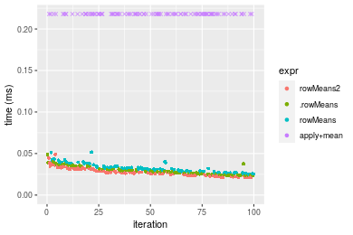
_Table: Benchmarking of colMeans2() and rowMeans2() on double+100x100 data (original and transposed).  The top panel shows times in milliseconds and the bottom panel shows relative times._


|   |expr      |    min|      lq|     mean|  median|     uq|    max|
|:--|:---------|------:|-------:|--------:|-------:|------:|------:|
|2  |rowMeans2 | 21.014| 23.4945| 27.70806| 27.1525| 31.365| 49.027|
|1  |colMeans2 | 27.815| 30.0400| 33.68517| 32.9150| 34.501| 62.917|


|   |expr      |      min|       lq|     mean|   median|       uq|      max|
|:--|:---------|--------:|--------:|--------:|--------:|--------:|--------:|
|2  |rowMeans2 | 1.000000| 1.000000| 1.000000| 1.000000| 1.000000| 1.000000|
|1  |colMeans2 | 1.323641| 1.278597| 1.215717| 1.212227| 1.099984| 1.283313|

_Figure: Benchmarking of colMeans2() and rowMeans2() on double+100x100 data (original and transposed).  Outliers are displayed as crosses. Times are in milliseconds._


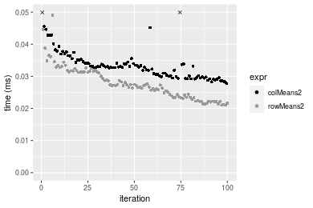

#### 1000x10 double matrix

```r
> X <- data[["1000x10"]]
> gc()
          used  (Mb) gc trigger  (Mb) max used  (Mb)
Ncells 5235640 279.7    8529671 455.6  8529671 455.6
Vcells 9858451  75.3   31876688 243.2 60562128 462.1
> colStats <- microbenchmark(colMeans2 = colMeans2(X, na.rm = FALSE), .colMeans = .colMeans(X, m = nrow(X), 
+     n = ncol(X), na.rm = FALSE), colMeans = colMeans(X, na.rm = FALSE), `apply+mean` = apply(X, MARGIN = 2L, 
+     FUN = mean, na.rm = FALSE), unit = "ms")
> X <- t(X)
> gc()
          used  (Mb) gc trigger  (Mb) max used  (Mb)
Ncells 5235634 279.7    8529671 455.6  8529671 455.6
Vcells 9868494  75.3   31876688 243.2 60562128 462.1
> rowStats <- microbenchmark(rowMeans2 = rowMeans2(X, na.rm = FALSE), .rowMeans = .rowMeans(X, m = nrow(X), 
+     n = ncol(X), na.rm = FALSE), rowMeans = rowMeans(X, na.rm = FALSE), `apply+mean` = apply(X, MARGIN = 1L, 
+     FUN = mean, na.rm = FALSE), unit = "ms")
```

_Table: Benchmarking of colMeans2(), .colMeans(), colMeans() and apply+mean() on double+1000x10 data. The top panel shows times in milliseconds and the bottom panel shows relative times._


|   |expr       |      min|        lq|      mean|    median|        uq|      max|
|:--|:----------|--------:|---------:|---------:|---------:|---------:|--------:|
|2  |.colMeans  | 0.012308| 0.0133250| 0.0146995| 0.0142910| 0.0154300| 0.028084|
|3  |colMeans   | 0.014901| 0.0161505| 0.0176729| 0.0172540| 0.0186615| 0.034493|
|1  |colMeans2  | 0.031277| 0.0332970| 0.0369031| 0.0363365| 0.0400575| 0.055325|
|4  |apply+mean | 0.152822| 0.1561930| 0.1708273| 0.1665185| 0.1801325| 0.279692|


|   |expr       |       min|        lq|      mean|    median|        uq|      max|
|:--|:----------|---------:|---------:|---------:|---------:|---------:|--------:|
|2  |.colMeans  |  1.000000|  1.000000|  1.000000|  1.000000|  1.000000| 1.000000|
|3  |colMeans   |  1.210676|  1.212045|  1.202279|  1.207333|  1.209430| 1.228208|
|1  |colMeans2  |  2.541193|  2.498837|  2.510497|  2.542614|  2.596079| 1.969983|
|4  |apply+mean | 12.416477| 11.721801| 11.621278| 11.651984| 11.674174| 9.959123|

_Table: Benchmarking of rowMeans2(), .rowMeans(), rowMeans() and apply+mean() on double+1000x10 data (transposed). The top panel shows times in milliseconds and the bottom panel shows relative times._


|   |expr       |      min|        lq|      mean|    median|        uq|      max|
|:--|:----------|--------:|---------:|---------:|---------:|---------:|--------:|
|1  |rowMeans2  | 0.024470| 0.0260450| 0.0282201| 0.0273965| 0.0296895| 0.044917|
|2  |.rowMeans  | 0.029456| 0.0308975| 0.0340446| 0.0336540| 0.0367775| 0.043824|
|3  |rowMeans   | 0.031758| 0.0339380| 0.0367688| 0.0354640| 0.0386305| 0.054903|
|4  |apply+mean | 0.149294| 0.1560205| 0.1740137| 0.1678455| 0.1844835| 0.288138|


|   |expr       |      min|       lq|     mean|   median|       uq|       max|
|:--|:----------|--------:|--------:|--------:|--------:|--------:|---------:|
|1  |rowMeans2  | 1.000000| 1.000000| 1.000000| 1.000000| 1.000000| 1.0000000|
|2  |.rowMeans  | 1.203760| 1.186312| 1.206397| 1.228405| 1.238738| 0.9756662|
|3  |rowMeans   | 1.297834| 1.303052| 1.302933| 1.294472| 1.301150| 1.2223212|
|4  |apply+mean | 6.101103| 5.990420| 6.166313| 6.126531| 6.213762| 6.4148986|

_Figure: Benchmarking of colMeans2(), .colMeans(), colMeans() and apply+mean() on double+1000x10 data  as well as rowMeans2(), .rowMeans(), rowMeans() and apply+mean() on the same data transposed.  Outliers are displayed as crosses.  Times are in milliseconds._


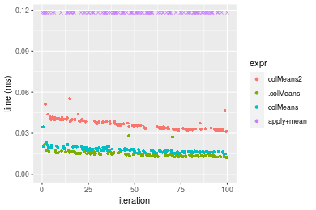

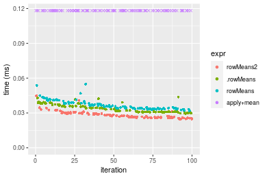
_Table: Benchmarking of colMeans2() and rowMeans2() on double+1000x10 data (original and transposed).  The top panel shows times in milliseconds and the bottom panel shows relative times._


|   |expr      |    min|     lq|     mean|  median|      uq|    max|
|:--|:---------|------:|------:|--------:|-------:|-------:|------:|
|2  |rowMeans2 | 24.470| 26.045| 28.22006| 27.3965| 29.6895| 44.917|
|1  |colMeans2 | 31.277| 33.297| 36.90313| 36.3365| 40.0575| 55.325|


|   |expr      |      min|       lq|     mean|   median|       uq|      max|
|:--|:---------|--------:|--------:|--------:|--------:|--------:|--------:|
|2  |rowMeans2 | 1.000000| 1.000000| 1.000000| 1.000000| 1.000000| 1.000000|
|1  |colMeans2 | 1.278177| 1.278441| 1.307691| 1.326319| 1.349214| 1.231716|

_Figure: Benchmarking of colMeans2() and rowMeans2() on double+1000x10 data (original and transposed).  Outliers are displayed as crosses. Times are in milliseconds._


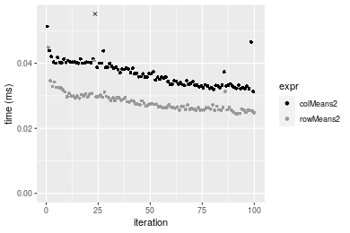

#### 10x1000 double matrix

```r
> X <- data[["10x1000"]]
> gc()
          used  (Mb) gc trigger  (Mb) max used  (Mb)
Ncells 5235880 279.7    8529671 455.6  8529671 455.6
Vcells 9858628  75.3   31876688 243.2 60562128 462.1
> colStats <- microbenchmark(colMeans2 = colMeans2(X, na.rm = FALSE), .colMeans = .colMeans(X, m = nrow(X), 
+     n = ncol(X), na.rm = FALSE), colMeans = colMeans(X, na.rm = FALSE), `apply+mean` = apply(X, MARGIN = 2L, 
+     FUN = mean, na.rm = FALSE), unit = "ms")
> X <- t(X)
> gc()
          used  (Mb) gc trigger  (Mb) max used  (Mb)
Ncells 5235856 279.7    8529671 455.6  8529671 455.6
Vcells 9868641  75.3   31876688 243.2 60562128 462.1
> rowStats <- microbenchmark(rowMeans2 = rowMeans2(X, na.rm = FALSE), .rowMeans = .rowMeans(X, m = nrow(X), 
+     n = ncol(X), na.rm = FALSE), rowMeans = rowMeans(X, na.rm = FALSE), `apply+mean` = apply(X, MARGIN = 1L, 
+     FUN = mean, na.rm = FALSE), unit = "ms")
```

_Table: Benchmarking of colMeans2(), .colMeans(), colMeans() and apply+mean() on double+10x1000 data. The top panel shows times in milliseconds and the bottom panel shows relative times._


|   |expr       |      min|        lq|      mean|    median|        uq|      max|
|:--|:----------|--------:|---------:|---------:|---------:|---------:|--------:|
|2  |.colMeans  | 0.010296| 0.0115655| 0.0129187| 0.0123925| 0.0135930| 0.022940|
|3  |colMeans   | 0.012201| 0.0142505| 0.0166892| 0.0154615| 0.0176905| 0.052161|
|1  |colMeans2  | 0.029690| 0.0341375| 0.0367869| 0.0356605| 0.0379780| 0.059502|
|4  |apply+mean | 3.155567| 3.4715400| 3.6900753| 3.5772010| 3.8181300| 8.767973|


|   |expr       |        min|         lq|       mean|     median|         uq|        max|
|:--|:----------|----------:|----------:|----------:|----------:|----------:|----------:|
|2  |.colMeans  |   1.000000|   1.000000|   1.000000|   1.000000|   1.000000|   1.000000|
|3  |colMeans   |   1.185023|   1.232156|   1.291861|   1.247650|   1.301442|   2.273801|
|1  |colMeans2  |   2.883644|   2.951667|   2.847570|   2.877587|   2.793938|   2.593810|
|4  |apply+mean | 306.484751| 300.163417| 285.638283| 288.658544| 280.889428| 382.213296|

_Table: Benchmarking of rowMeans2(), .rowMeans(), rowMeans() and apply+mean() on double+10x1000 data (transposed). The top panel shows times in milliseconds and the bottom panel shows relative times._


|   |expr       |      min|       lq|      mean|    median|        uq|      max|
|:--|:----------|--------:|--------:|---------:|---------:|---------:|--------:|
|1  |rowMeans2  | 0.024614| 0.027924| 0.0303011| 0.0291305| 0.0306365| 0.070284|
|2  |.rowMeans  | 0.025822| 0.028817| 0.0301902| 0.0299545| 0.0307390| 0.049536|
|3  |rowMeans   | 0.028587| 0.031351| 0.0335336| 0.0323470| 0.0342050| 0.056989|
|4  |apply+mean | 3.134174| 3.486367| 3.6998181| 3.5839590| 3.8396975| 8.790471|


|   |expr       |        min|         lq|        mean|     median|         uq|         max|
|:--|:----------|----------:|----------:|-----------:|----------:|----------:|-----------:|
|1  |rowMeans2  |   1.000000|   1.000000|   1.0000000|   1.000000|   1.000000|   1.0000000|
|2  |.rowMeans  |   1.049078|   1.031980|   0.9963397|   1.028287|   1.003346|   0.7047977|
|3  |rowMeans   |   1.161412|   1.122726|   1.1066797|   1.110417|   1.116479|   0.8108389|
|4  |apply+mean | 127.332981| 124.851991| 122.1018541| 123.031153| 125.330815| 125.0707273|

_Figure: Benchmarking of colMeans2(), .colMeans(), colMeans() and apply+mean() on double+10x1000 data  as well as rowMeans2(), .rowMeans(), rowMeans() and apply+mean() on the same data transposed.  Outliers are displayed as crosses.  Times are in milliseconds._


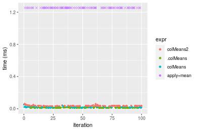

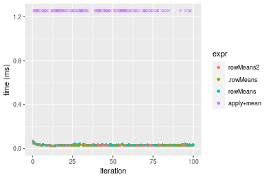
_Table: Benchmarking of colMeans2() and rowMeans2() on double+10x1000 data (original and transposed).  The top panel shows times in milliseconds and the bottom panel shows relative times._


|   |expr      |    min|      lq|     mean|  median|      uq|    max|
|:--|:---------|------:|-------:|--------:|-------:|-------:|------:|
|2  |rowMeans2 | 24.614| 27.9240| 30.30108| 29.1305| 30.6365| 70.284|
|1  |colMeans2 | 29.690| 34.1375| 36.78690| 35.6605| 37.9780| 59.502|


|   |expr      |      min|       lq|     mean|   median|       uq|       max|
|:--|:---------|--------:|--------:|--------:|--------:|--------:|---------:|
|2  |rowMeans2 | 1.000000| 1.000000| 1.000000| 1.000000| 1.000000| 1.0000000|
|1  |colMeans2 | 1.206224| 1.222515| 1.214046| 1.224164| 1.239632| 0.8465938|

_Figure: Benchmarking of colMeans2() and rowMeans2() on double+10x1000 data (original and transposed).  Outliers are displayed as crosses. Times are in milliseconds._


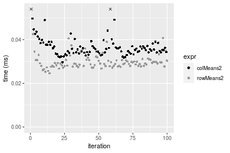

#### 100x1000 double matrix

```r
> X <- data[["100x1000"]]
> gc()
          used  (Mb) gc trigger  (Mb) max used  (Mb)
Ncells 5236098 279.7    8529671 455.6  8529671 455.6
Vcells 9859933  75.3   31876688 243.2 60562128 462.1
> colStats <- microbenchmark(colMeans2 = colMeans2(X, na.rm = FALSE), .colMeans = .colMeans(X, m = nrow(X), 
+     n = ncol(X), na.rm = FALSE), colMeans = colMeans(X, na.rm = FALSE), `apply+mean` = apply(X, MARGIN = 2L, 
+     FUN = mean, na.rm = FALSE), unit = "ms")
> X <- t(X)
> gc()
          used  (Mb) gc trigger  (Mb) max used  (Mb)
Ncells 5236086 279.7    8529671 455.6  8529671 455.6
Vcells 9959966  76.0   31876688 243.2 60562128 462.1
> rowStats <- microbenchmark(rowMeans2 = rowMeans2(X, na.rm = FALSE), .rowMeans = .rowMeans(X, m = nrow(X), 
+     n = ncol(X), na.rm = FALSE), rowMeans = rowMeans(X, na.rm = FALSE), `apply+mean` = apply(X, MARGIN = 1L, 
+     FUN = mean, na.rm = FALSE), unit = "ms")
```

_Table: Benchmarking of colMeans2(), .colMeans(), colMeans() and apply+mean() on double+100x1000 data. The top panel shows times in milliseconds and the bottom panel shows relative times._


|   |expr       |      min|        lq|      mean|    median|        uq|       max|
|:--|:----------|--------:|---------:|---------:|---------:|---------:|---------:|
|2  |.colMeans  | 0.066739| 0.0727180| 0.0806974| 0.0767745| 0.0853800|  0.141699|
|3  |colMeans   | 0.066169| 0.0752170| 0.0829405| 0.0781310| 0.0887805|  0.126869|
|1  |colMeans2  | 0.254845| 0.2795845| 0.2909625| 0.2872260| 0.2980720|  0.369301|
|4  |apply+mean | 3.836750| 4.3152365| 4.6636250| 4.4540265| 4.6160400| 21.206860|


|   |expr       |        min|        lq|      mean|    median|        uq|         max|
|:--|:----------|----------:|---------:|---------:|---------:|---------:|-----------:|
|2  |.colMeans  |  1.0000000|  1.000000|  1.000000|  1.000000|  1.000000|   1.0000000|
|3  |colMeans   |  0.9914593|  1.034366|  1.027797|  1.017669|  1.039828|   0.8953415|
|1  |colMeans2  |  3.8185319|  3.844777|  3.605601|  3.741164|  3.491122|   2.6062358|
|4  |apply+mean | 57.4888746| 59.342068| 57.791537| 58.014399| 54.064652| 149.6613244|

_Table: Benchmarking of rowMeans2(), .rowMeans(), rowMeans() and apply+mean() on double+100x1000 data (transposed). The top panel shows times in milliseconds and the bottom panel shows relative times._


|   |expr       |      min|       lq|      mean|    median|        uq|       max|
|:--|:----------|--------:|--------:|---------:|---------:|---------:|---------:|
|1  |rowMeans2  | 0.198660| 0.227482| 0.2354485| 0.2311605| 0.2388610|  0.320887|
|2  |.rowMeans  | 0.212628| 0.241880| 0.2498996| 0.2453545| 0.2522545|  0.370692|
|3  |rowMeans   | 0.219002| 0.239185| 0.2494270| 0.2483555| 0.2561965|  0.309427|
|4  |apply+mean | 3.825158| 4.317397| 4.6837063| 4.4098160| 4.6284035| 21.396095|


|   |expr       |       min|        lq|      mean|    median|        uq|        max|
|:--|:----------|---------:|---------:|---------:|---------:|---------:|----------:|
|1  |rowMeans2  |  1.000000|  1.000000|  1.000000|  1.000000|  1.000000|  1.0000000|
|2  |.rowMeans  |  1.070311|  1.063293|  1.061377|  1.061403|  1.056072|  1.1552104|
|3  |rowMeans   |  1.102396|  1.051446|  1.059370|  1.074385|  1.072576|  0.9642865|
|4  |apply+mean | 19.254797| 18.979071| 19.892699| 19.076858| 19.376974| 66.6779739|

_Figure: Benchmarking of colMeans2(), .colMeans(), colMeans() and apply+mean() on double+100x1000 data  as well as rowMeans2(), .rowMeans(), rowMeans() and apply+mean() on the same data transposed.  Outliers are displayed as crosses.  Times are in milliseconds._


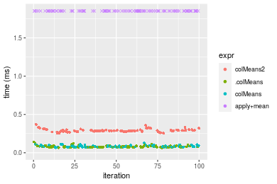

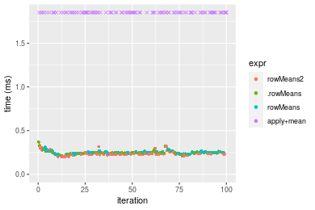
_Table: Benchmarking of colMeans2() and rowMeans2() on double+100x1000 data (original and transposed).  The top panel shows times in milliseconds and the bottom panel shows relative times._


|   |expr      |     min|       lq|     mean|   median|      uq|     max|
|:--|:---------|-------:|--------:|--------:|--------:|-------:|-------:|
|2  |rowMeans2 | 198.660| 227.4820| 235.4485| 231.1605| 238.861| 320.887|
|1  |colMeans2 | 254.845| 279.5845| 290.9625| 287.2260| 298.072| 369.301|


|   |expr      |     min|      lq|    mean|   median|       uq|      max|
|:--|:---------|-------:|-------:|-------:|--------:|--------:|--------:|
|2  |rowMeans2 | 1.00000| 1.00000| 1.00000| 1.000000| 1.000000| 1.000000|
|1  |colMeans2 | 1.28282| 1.22904| 1.23578| 1.242539| 1.247889| 1.150875|

_Figure: Benchmarking of colMeans2() and rowMeans2() on double+100x1000 data (original and transposed).  Outliers are displayed as crosses. Times are in milliseconds._


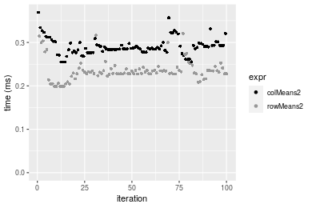

#### 1000x100 double matrix

```r
> X <- data[["1000x100"]]
> gc()
          used  (Mb) gc trigger  (Mb) max used  (Mb)
Ncells 5236322 279.7    8529671 455.6  8529671 455.6
Vcells 9860082  75.3   31876688 243.2 60562128 462.1
> colStats <- microbenchmark(colMeans2 = colMeans2(X, na.rm = FALSE), .colMeans = .colMeans(X, m = nrow(X), 
+     n = ncol(X), na.rm = FALSE), colMeans = colMeans(X, na.rm = FALSE), `apply+mean` = apply(X, MARGIN = 2L, 
+     FUN = mean, na.rm = FALSE), unit = "ms")
> X <- t(X)
> gc()
          used  (Mb) gc trigger  (Mb) max used  (Mb)
Ncells 5236310 279.7    8529671 455.6  8529671 455.6
Vcells 9960115  76.0   31876688 243.2 60562128 462.1
> rowStats <- microbenchmark(rowMeans2 = rowMeans2(X, na.rm = FALSE), .rowMeans = .rowMeans(X, m = nrow(X), 
+     n = ncol(X), na.rm = FALSE), rowMeans = rowMeans(X, na.rm = FALSE), `apply+mean` = apply(X, MARGIN = 1L, 
+     FUN = mean, na.rm = FALSE), unit = "ms")
```

_Table: Benchmarking of colMeans2(), .colMeans(), colMeans() and apply+mean() on double+1000x100 data. The top panel shows times in milliseconds and the bottom panel shows relative times._


|   |expr       |      min|        lq|      mean|    median|        uq|      max|
|:--|:----------|--------:|---------:|---------:|---------:|---------:|--------:|
|2  |.colMeans  | 0.078356| 0.0846185| 0.0919227| 0.0870375| 0.0928480| 0.152949|
|3  |colMeans   | 0.081547| 0.0872605| 0.0946950| 0.0910655| 0.0991070| 0.140971|
|1  |colMeans2  | 0.234739| 0.2545375| 0.2689275| 0.2617520| 0.2790605| 0.394196|
|4  |apply+mean | 1.028068| 1.0913320| 1.2594016| 1.1235075| 1.2650220| 8.153290|


|   |expr       |       min|        lq|      mean|    median|        uq|        max|
|:--|:----------|---------:|---------:|---------:|---------:|---------:|----------:|
|2  |.colMeans  |  1.000000|  1.000000|  1.000000|  1.000000|  1.000000|  1.0000000|
|3  |colMeans   |  1.040724|  1.031222|  1.030160|  1.046279|  1.067411|  0.9216863|
|1  |colMeans2  |  2.995801|  3.008060|  2.925584|  3.007347|  3.005563|  2.5773035|
|4  |apply+mean | 13.120476| 12.897085| 13.700663| 12.908315| 13.624655| 53.3072462|

_Table: Benchmarking of rowMeans2(), .rowMeans(), rowMeans() and apply+mean() on double+1000x100 data (transposed). The top panel shows times in milliseconds and the bottom panel shows relative times._


|   |expr       |      min|        lq|      mean|    median|        uq|      max|
|:--|:----------|--------:|---------:|---------:|---------:|---------:|--------:|
|1  |rowMeans2  | 0.188308| 0.1979490| 0.2157943| 0.2110160| 0.2248610| 0.315616|
|2  |.rowMeans  | 0.215012| 0.2269885| 0.2450801| 0.2401625| 0.2537825| 0.375243|
|3  |rowMeans   | 0.217828| 0.2344560| 0.2482889| 0.2434065| 0.2572280| 0.350805|
|4  |apply+mean | 1.074836| 1.1571190| 1.3129454| 1.1795160| 1.2999040| 8.436009|


|   |expr       |      min|       lq|     mean|   median|       uq|       max|
|:--|:----------|--------:|--------:|--------:|--------:|--------:|---------:|
|1  |rowMeans2  | 1.000000| 1.000000| 1.000000| 1.000000| 1.000000|  1.000000|
|2  |.rowMeans  | 1.141810| 1.146702| 1.135712| 1.138125| 1.128620|  1.188923|
|3  |rowMeans   | 1.156764| 1.184426| 1.150581| 1.153498| 1.143942|  1.111493|
|4  |apply+mean | 5.707862| 5.845541| 6.084245| 5.589699| 5.780922| 26.728711|

_Figure: Benchmarking of colMeans2(), .colMeans(), colMeans() and apply+mean() on double+1000x100 data  as well as rowMeans2(), .rowMeans(), rowMeans() and apply+mean() on the same data transposed.  Outliers are displayed as crosses.  Times are in milliseconds._


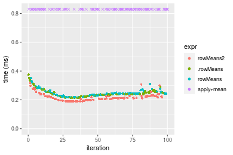
_Table: Benchmarking of colMeans2() and rowMeans2() on double+1000x100 data (original and transposed).  The top panel shows times in milliseconds and the bottom panel shows relative times._


|   |expr      |     min|       lq|     mean|  median|       uq|     max|
|:--|:---------|-------:|--------:|--------:|-------:|--------:|-------:|
|2  |rowMeans2 | 188.308| 197.9490| 215.7943| 211.016| 224.8610| 315.616|
|1  |colMeans2 | 234.739| 254.5375| 268.9275| 261.752| 279.0605| 394.196|


|   |expr      |     min|       lq|     mean|   median|       uq|      max|
|:--|:---------|-------:|--------:|--------:|--------:|--------:|--------:|
|2  |rowMeans2 | 1.00000| 1.000000| 1.000000| 1.000000| 1.000000| 1.000000|
|1  |colMeans2 | 1.24657| 1.285874| 1.246221| 1.240437| 1.241036| 1.248973|

_Figure: Benchmarking of colMeans2() and rowMeans2() on double+1000x100 data (original and transposed).  Outliers are displayed as crosses. Times are in milliseconds._


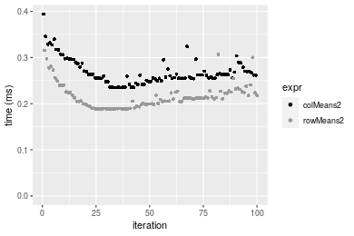


## Appendix

### Session information
```r
R version 4.1.1 Patched (2021-08-10 r80727)
Platform: x86_64-pc-linux-gnu (64-bit)
Running under: Ubuntu 18.04.5 LTS

Matrix products: default
BLAS:   /home/hb/software/R-devel/R-4-1-branch/lib/R/lib/libRblas.so
LAPACK: /home/hb/software/R-devel/R-4-1-branch/lib/R/lib/libRlapack.so

locale:
 [1] LC_CTYPE=en_US.UTF-8       LC_NUMERIC=C              
 [3] LC_TIME=en_US.UTF-8        LC_COLLATE=en_US.UTF-8    
 [5] LC_MONETARY=en_US.UTF-8    LC_MESSAGES=en_US.UTF-8   
 [7] LC_PAPER=en_US.UTF-8       LC_NAME=C                 
 [9] LC_ADDRESS=C               LC_TELEPHONE=C            
[11] LC_MEASUREMENT=en_US.UTF-8 LC_IDENTIFICATION=C       

attached base packages:
[1] stats     graphics  grDevices utils     datasets  methods   base     

other attached packages:
[1] microbenchmark_1.4-7   matrixStats_0.60.1     ggplot2_3.3.5         
[4] knitr_1.33             R.devices_2.17.0       R.utils_2.10.1        
[7] R.oo_1.24.0            R.methodsS3_1.8.1-9001 history_0.0.1-9000    

loaded via a namespace (and not attached):
 [1] Biobase_2.52.0          httr_1.4.2              splines_4.1.1          
 [4] bit64_4.0.5             network_1.17.1          assertthat_0.2.1       
 [7] highr_0.9               stats4_4.1.1            blob_1.2.2             
[10] GenomeInfoDbData_1.2.6  robustbase_0.93-8       pillar_1.6.2           
[13] RSQLite_2.2.8           lattice_0.20-44         glue_1.4.2             
[16] digest_0.6.27           XVector_0.32.0          colorspace_2.0-2       
[19] Matrix_1.3-4            XML_3.99-0.7            pkgconfig_2.0.3        
[22] zlibbioc_1.38.0         genefilter_1.74.0       purrr_0.3.4            
[25] ergm_4.1.2              xtable_1.8-4            scales_1.1.1           
[28] tibble_3.1.4            annotate_1.70.0         KEGGREST_1.32.0        
[31] farver_2.1.0            generics_0.1.0          IRanges_2.26.0         
[34] ellipsis_0.3.2          cachem_1.0.6            withr_2.4.2            
[37] BiocGenerics_0.38.0     mime_0.11               survival_3.2-13        
[40] magrittr_2.0.1          crayon_1.4.1            statnet.common_4.5.0   
[43] memoise_2.0.0           laeken_0.5.1            fansi_0.5.0            
[46] R.cache_0.15.0          MASS_7.3-54             R.rsp_0.44.0           
[49] progressr_0.8.0         tools_4.1.1             lifecycle_1.0.0        
[52] S4Vectors_0.30.0        trust_0.1-8             munsell_0.5.0          
[55] tabby_0.0.1-9001        AnnotationDbi_1.54.1    Biostrings_2.60.2      
[58] compiler_4.1.1          GenomeInfoDb_1.28.1     rlang_0.4.11           
[61] grid_4.1.1              RCurl_1.98-1.4          cwhmisc_6.6            
[64] rappdirs_0.3.3          startup_0.15.0          labeling_0.4.2         
[67] bitops_1.0-7            base64enc_0.1-3         boot_1.3-28            
[70] gtable_0.3.0            DBI_1.1.1               markdown_1.1           
[73] R6_2.5.1                lpSolveAPI_5.5.2.0-17.7 rle_0.9.2              
[76] dplyr_1.0.7             fastmap_1.1.0           bit_4.0.4              
[79] utf8_1.2.2              parallel_4.1.1          Rcpp_1.0.7             
[82] vctrs_0.3.8             png_0.1-7               DEoptimR_1.0-9         
[85] tidyselect_1.1.1        xfun_0.25               coda_0.19-4            
```
Total processing time was 27.69 secs.


### Reproducibility
To reproduce this report, do:
```r
html <- matrixStats:::benchmark('colMeans2')
```

[RSP]: https://cran.r-project.org/package=R.rsp
[matrixStats]: https://cran.r-project.org/package=matrixStats

[StackOverflow:colMins?]: https://stackoverflow.com/questions/13676878 "Stack Overflow: fastest way to get Min from every column in a matrix?"
[StackOverflow:colSds?]: https://stackoverflow.com/questions/17549762 "Stack Overflow: Is there such 'colsd' in R?"
[StackOverflow:rowProds?]: https://stackoverflow.com/questions/20198801/ "Stack Overflow: Row product of matrix and column sum of matrix"

---------------------------------------
Copyright Henrik Bengtsson. Last updated on 2021-08-25 18:59:04 (+0200 UTC). Powered by [RSP].

<script>
 var link = document.createElement('link');
 link.rel = 'icon';
 link.href = "data:image/png;base64,iVBORw0KGgoAAAANSUhEUgAAACAAAAAgCAMAAABEpIrGAAAA21BMVEUAAAAAAP8AAP8AAP8AAP8AAP8AAP8AAP8AAP8AAP8AAP8AAP8AAP8AAP8AAP8AAP8AAP8AAP8AAP8AAP8AAP8AAP8AAP8AAP8AAP8AAP8AAP8AAP8AAP8AAP8AAP8AAP8AAP8AAP8AAP8AAP8AAP8AAP8AAP8AAP8AAP8AAP8BAf4CAv0DA/wdHeIeHuEfH+AgIN8hId4lJdomJtknJ9g+PsE/P8BAQL9yco10dIt1dYp3d4h4eIeVlWqWlmmXl2iYmGeZmWabm2Tn5xjo6Bfp6Rb39wj4+Af//wA2M9hbAAAASXRSTlMAAQIJCgsMJSYnKD4/QGRlZmhpamtsbautrrCxuru8y8zN5ebn6Pn6+///////////////////////////////////////////LsUNcQAAAS9JREFUOI29k21XgkAQhVcFytdSMqMETU26UVqGmpaiFbL//xc1cAhhwVNf6n5i5z67M2dmYOyfJZUqlVLhkKucG7cgmUZTybDz6g0iDeq51PUr37Ds2cy2/C9NeES5puDjxuUk1xnToZsg8pfA3avHQ3lLIi7iWRrkv/OYtkScxBIMgDee0ALoyxHQBJ68JLCjOtQIMIANF7QG9G9fNnHvisCHBVMKgSJgiz7nE+AoBKrAPA3MgepvgR9TSCasrCKH0eB1wBGBFdCO+nAGjMVGPcQb5bd6mQRegN6+1axOs9nGfYcCtfi4NQosdtH7dB+txFIpXQqN1p9B/asRHToyS0jRgpV7nk4nwcq1BJ+x3Gl/v7S9Wmpp/aGquum7w3ZDyrADFYrl8vHBH+ev9AUASW1dmU4h4wAAAABJRU5ErkJggg=="
 document.getElementsByTagName('head')[0].appendChild(link);
</script>

