[matrixStats]: Benchmark report

---------------------------------------


# colMedians() and rowMedians() benchmarks

This report benchmark the performance of colMedians() and rowMedians() against alternative methods.

## Alternative methods

* apply() + median()


## Data type "integer"

### Data
```r
> rmatrix <- function(nrow, ncol, mode = c("logical", "double", "integer", "index"), range = c(-100, 
+     +100), na_prob = 0) {
+     mode <- match.arg(mode)
+     n <- nrow * ncol
+     if (mode == "logical") {
+         x <- sample(c(FALSE, TRUE), size = n, replace = TRUE)
+     }     else if (mode == "index") {
+         x <- seq_len(n)
+         mode <- "integer"
+     }     else {
+         x <- runif(n, min = range[1], max = range[2])
+     }
+     storage.mode(x) <- mode
+     if (na_prob > 0) 
+         x[sample(n, size = na_prob * n)] <- NA
+     dim(x) <- c(nrow, ncol)
+     x
+ }
> rmatrices <- function(scale = 10, seed = 1, ...) {
+     set.seed(seed)
+     data <- list()
+     data[[1]] <- rmatrix(nrow = scale * 1, ncol = scale * 1, ...)
+     data[[2]] <- rmatrix(nrow = scale * 10, ncol = scale * 10, ...)
+     data[[3]] <- rmatrix(nrow = scale * 100, ncol = scale * 1, ...)
+     data[[4]] <- t(data[[3]])
+     data[[5]] <- rmatrix(nrow = scale * 10, ncol = scale * 100, ...)
+     data[[6]] <- t(data[[5]])
+     names(data) <- sapply(data, FUN = function(x) paste(dim(x), collapse = "x"))
+     data
+ }
> data <- rmatrices(mode = mode)
```

### Results

#### 10x10 integer matrix


```r
> X <- data[["10x10"]]
> gc()
           used  (Mb) gc trigger  (Mb) max used  (Mb)
Ncells  5252897 280.6    8529671 455.6  8529671 455.6
Vcells 10204002  77.9   31876688 243.2 60562128 462.1
> colStats <- microbenchmark(colMedians = colMedians(X, na.rm = FALSE), `apply+median` = apply(X, MARGIN = 2L, 
+     FUN = median, na.rm = FALSE), unit = "ms")
> X <- t(X)
> gc()
           used  (Mb) gc trigger  (Mb) max used  (Mb)
Ncells  5242876 280.0    8529671 455.6  8529671 455.6
Vcells 10171042  77.6   31876688 243.2 60562128 462.1
> rowStats <- microbenchmark(rowMedians = rowMedians(X, na.rm = FALSE), `apply+median` = apply(X, MARGIN = 1L, 
+     FUN = median, na.rm = FALSE), unit = "ms")
```

_Table: Benchmarking of colMedians() and apply+median() on integer+10x10 data. The top panel shows times in milliseconds and the bottom panel shows relative times._


|   |expr         |      min|        lq|      mean|    median|        uq|      max|
|:--|:------------|--------:|---------:|---------:|---------:|---------:|--------:|
|1  |colMedians   | 0.002002| 0.0024270| 0.0035696| 0.0033185| 0.0040520| 0.016345|
|2  |apply+median | 0.310973| 0.3230125| 0.3543233| 0.3410970| 0.3817475| 0.582277|


|   |expr         |      min|       lq|     mean|   median|       uq|      max|
|:--|:------------|--------:|--------:|--------:|--------:|--------:|--------:|
|1  |colMedians   |   1.0000|   1.0000|  1.00000|   1.0000|  1.00000|  1.00000|
|2  |apply+median | 155.3312| 133.0913| 99.26191| 102.7865| 94.21212| 35.62417|

_Table: Benchmarking of rowMedians() and apply+median() on integer+10x10 data (transposed). The top panel shows times in milliseconds and the bottom panel shows relative times._


|   |expr         |      min|        lq|      mean|    median|       uq|      max|
|:--|:------------|--------:|---------:|---------:|---------:|--------:|--------:|
|1  |rowMedians   | 0.002156| 0.0027635| 0.0041715| 0.0038790| 0.004733| 0.017459|
|2  |apply+median | 0.308591| 0.3233260| 0.3567586| 0.3377955| 0.385195| 0.579707|


|   |expr         |      min|       lq|     mean|   median|       uq|      max|
|:--|:------------|--------:|--------:|--------:|--------:|--------:|--------:|
|1  |rowMedians   |   1.0000|   1.0000|  1.00000|  1.00000|  1.00000|  1.00000|
|2  |apply+median | 143.1313| 116.9987| 85.52244| 87.08314| 81.38496| 33.20391|

_Figure: Benchmarking of colMedians() and apply+median() on integer+10x10 data  as well as rowMedians() and apply+median() on the same data transposed.  Outliers are displayed as crosses.  Times are in milliseconds._


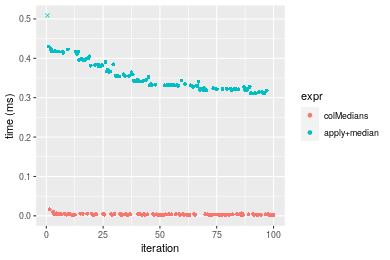

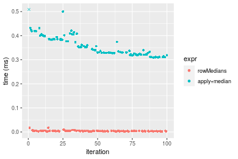
_Table: Benchmarking of colMedians() and rowMedians() on integer+10x10 data (original and transposed).  The top panel shows times in milliseconds and the bottom panel shows relative times._


|   |expr       |   min|     lq|    mean| median|    uq|    max|
|:--|:----------|-----:|------:|-------:|------:|-----:|------:|
|1  |colMedians | 2.002| 2.4270| 3.56958| 3.3185| 4.052| 16.345|
|2  |rowMedians | 2.156| 2.7635| 4.17152| 3.8790| 4.733| 17.459|


|   |expr       |      min|       lq|    mean|   median|       uq|      max|
|:--|:----------|--------:|--------:|-------:|--------:|--------:|--------:|
|1  |colMedians | 1.000000| 1.000000| 1.00000| 1.000000| 1.000000| 1.000000|
|2  |rowMedians | 1.076923| 1.138648| 1.16863| 1.168902| 1.168065| 1.068155|

_Figure: Benchmarking of colMedians() and rowMedians() on integer+10x10 data (original and transposed).  Outliers are displayed as crosses. Times are in milliseconds._


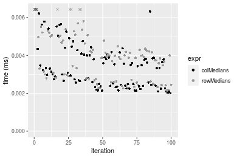

#### 100x100 integer matrix


```r
> X <- data[["100x100"]]
> gc()
          used  (Mb) gc trigger  (Mb) max used  (Mb)
Ncells 5241456 280.0    8529671 455.6  8529671 455.6
Vcells 9787564  74.7   31876688 243.2 60562128 462.1
> colStats <- microbenchmark(colMedians = colMedians(X, na.rm = FALSE), `apply+median` = apply(X, MARGIN = 2L, 
+     FUN = median, na.rm = FALSE), unit = "ms")
> X <- t(X)
> gc()
          used  (Mb) gc trigger  (Mb) max used  (Mb)
Ncells 5241432 280.0    8529671 455.6  8529671 455.6
Vcells 9792577  74.8   31876688 243.2 60562128 462.1
> rowStats <- microbenchmark(rowMedians = rowMedians(X, na.rm = FALSE), `apply+median` = apply(X, MARGIN = 1L, 
+     FUN = median, na.rm = FALSE), unit = "ms")
```

_Table: Benchmarking of colMedians() and apply+median() on integer+100x100 data. The top panel shows times in milliseconds and the bottom panel shows relative times._


|   |expr         |      min|       lq|      mean|   median|        uq|      max|
|:--|:------------|--------:|--------:|---------:|--------:|---------:|--------:|
|1  |colMedians   | 0.127340| 0.140582| 0.1470973| 0.144952| 0.1504695| 0.229001|
|2  |apply+median | 2.686897| 2.910646| 3.0856011| 3.030000| 3.2023125| 4.590683|


|   |expr         |      min|       lq|    mean|   median|       uq|      max|
|:--|:------------|--------:|--------:|-------:|--------:|--------:|--------:|
|1  |colMedians   |  1.00000|  1.00000|  1.0000|  1.00000|  1.00000|  1.00000|
|2  |apply+median | 21.10018| 20.70426| 20.9766| 20.90347| 21.28214| 20.04656|

_Table: Benchmarking of rowMedians() and apply+median() on integer+100x100 data (transposed). The top panel shows times in milliseconds and the bottom panel shows relative times._


|   |expr         |      min|        lq|      mean|   median|       uq|      max|
|:--|:------------|--------:|---------:|---------:|--------:|--------:|--------:|
|1  |rowMedians   | 0.132543| 0.1467965| 0.1528494| 0.151171| 0.155498| 0.200015|
|2  |apply+median | 2.659839| 2.9596155| 3.0970776| 3.014756| 3.143353| 4.610926|


|   |expr         |      min|       lq|     mean|   median|       uq|     max|
|:--|:------------|--------:|--------:|--------:|--------:|--------:|-------:|
|1  |rowMedians   |  1.00000|  1.00000|  1.00000|  1.00000|  1.00000|  1.0000|
|2  |apply+median | 20.06774| 20.16135| 20.26228| 19.94269| 20.21475| 23.0529|

_Figure: Benchmarking of colMedians() and apply+median() on integer+100x100 data  as well as rowMedians() and apply+median() on the same data transposed.  Outliers are displayed as crosses.  Times are in milliseconds._


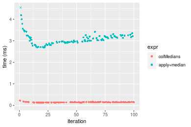

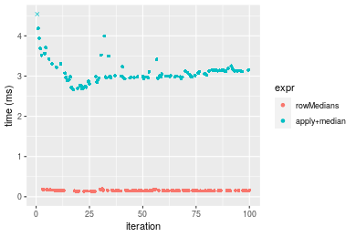
_Table: Benchmarking of colMedians() and rowMedians() on integer+100x100 data (original and transposed).  The top panel shows times in milliseconds and the bottom panel shows relative times._


|   |expr       |     min|       lq|     mean|  median|       uq|     max|
|:--|:----------|-------:|--------:|--------:|-------:|--------:|-------:|
|1  |colMedians | 127.340| 140.5820| 147.0973| 144.952| 150.4695| 229.001|
|2  |rowMedians | 132.543| 146.7965| 152.8494| 151.171| 155.4980| 200.015|


|   |expr       |      min|       lq|     mean|   median|       uq|       max|
|:--|:----------|--------:|--------:|--------:|--------:|--------:|---------:|
|1  |colMedians | 1.000000| 1.000000| 1.000000| 1.000000| 1.000000| 1.0000000|
|2  |rowMedians | 1.040859| 1.044205| 1.039105| 1.042904| 1.033419| 0.8734241|

_Figure: Benchmarking of colMedians() and rowMedians() on integer+100x100 data (original and transposed).  Outliers are displayed as crosses. Times are in milliseconds._


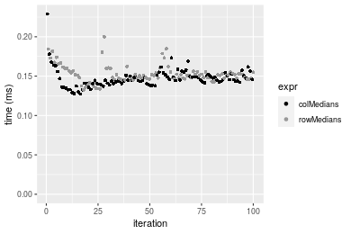

#### 1000x10 integer matrix


```r
> X <- data[["1000x10"]]
> gc()
          used  (Mb) gc trigger  (Mb) max used  (Mb)
Ncells 5242187 280.0    8529671 455.6  8529671 455.6
Vcells 9791069  74.7   31876688 243.2 60562128 462.1
> colStats <- microbenchmark(colMedians = colMedians(X, na.rm = FALSE), `apply+median` = apply(X, MARGIN = 2L, 
+     FUN = median, na.rm = FALSE), unit = "ms")
> X <- t(X)
> gc()
          used  (Mb) gc trigger  (Mb) max used  (Mb)
Ncells 5242163 280.0    8529671 455.6  8529671 455.6
Vcells 9796082  74.8   31876688 243.2 60562128 462.1
> rowStats <- microbenchmark(rowMedians = rowMedians(X, na.rm = FALSE), `apply+median` = apply(X, MARGIN = 1L, 
+     FUN = median, na.rm = FALSE), unit = "ms")
```

_Table: Benchmarking of colMedians() and apply+median() on integer+1000x10 data. The top panel shows times in milliseconds and the bottom panel shows relative times._


|   |expr         |      min|       lq|      mean|    median|        uq|      max|
|:--|:------------|--------:|--------:|---------:|---------:|---------:|--------:|
|1  |colMedians   | 0.113615| 0.118650| 0.1391206| 0.1365785| 0.1496255| 0.210331|
|2  |apply+median | 0.467260| 0.495739| 0.5718556| 0.5475755| 0.6248200| 0.918998|


|   |expr         |      min|       lq|     mean|   median|       uq|      max|
|:--|:------------|--------:|--------:|--------:|--------:|--------:|--------:|
|1  |colMedians   | 1.000000| 1.000000| 1.000000| 1.000000| 1.000000| 1.000000|
|2  |apply+median | 4.112661| 4.178163| 4.110501| 4.009236| 4.175892| 4.369294|

_Table: Benchmarking of rowMedians() and apply+median() on integer+1000x10 data (transposed). The top panel shows times in milliseconds and the bottom panel shows relative times._


|   |expr         |      min|        lq|      mean|    median|        uq|      max|
|:--|:------------|--------:|---------:|---------:|---------:|---------:|--------:|
|1  |rowMedians   | 0.116880| 0.1204105| 0.1424556| 0.1341970| 0.1559945| 0.214430|
|2  |apply+median | 0.466145| 0.4931330| 0.5716402| 0.5507485| 0.6267335| 0.918222|


|   |expr         |      min|       lq|    mean|  median|       uq|      max|
|:--|:------------|--------:|--------:|-------:|-------:|--------:|--------:|
|1  |rowMedians   | 1.000000| 1.000000| 1.00000| 1.00000| 1.000000| 1.000000|
|2  |apply+median | 3.988236| 4.095432| 4.01276| 4.10403| 4.017664| 4.282153|

_Figure: Benchmarking of colMedians() and apply+median() on integer+1000x10 data  as well as rowMedians() and apply+median() on the same data transposed.  Outliers are displayed as crosses.  Times are in milliseconds._


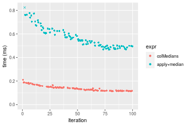

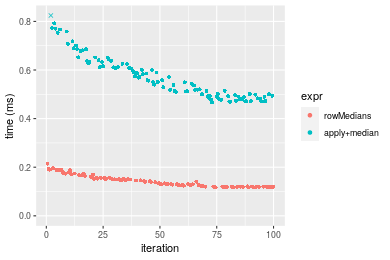
_Table: Benchmarking of colMedians() and rowMedians() on integer+1000x10 data (original and transposed).  The top panel shows times in milliseconds and the bottom panel shows relative times._


|   |expr       |     min|       lq|     mean|   median|       uq|     max|
|:--|:----------|-------:|--------:|--------:|--------:|--------:|-------:|
|2  |rowMedians | 116.880| 120.4105| 142.4556| 134.1970| 155.9945| 214.430|
|1  |colMedians | 113.615| 118.6500| 139.1207| 136.5785| 149.6255| 210.331|


|   |expr       |       min|        lq|      mean|   median|        uq|       max|
|:--|:----------|---------:|---------:|---------:|--------:|---------:|---------:|
|2  |rowMedians | 1.0000000| 1.0000000| 1.0000000| 1.000000| 1.0000000| 1.0000000|
|1  |colMedians | 0.9720654| 0.9853792| 0.9765894| 1.017746| 0.9591716| 0.9808842|

_Figure: Benchmarking of colMedians() and rowMedians() on integer+1000x10 data (original and transposed).  Outliers are displayed as crosses. Times are in milliseconds._


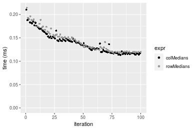

#### 10x1000 integer matrix


```r
> X <- data[["10x1000"]]
> gc()
          used  (Mb) gc trigger  (Mb) max used  (Mb)
Ncells 5242375 280.0    8529671 455.6  8529671 455.6
Vcells 9791749  74.8   31876688 243.2 60562128 462.1
> colStats <- microbenchmark(colMedians = colMedians(X, na.rm = FALSE), `apply+median` = apply(X, MARGIN = 2L, 
+     FUN = median, na.rm = FALSE), unit = "ms")
> X <- t(X)
> gc()
          used  (Mb) gc trigger  (Mb) max used  (Mb)
Ncells 5242351 280.0    8529671 455.6  8529671 455.6
Vcells 9796762  74.8   31876688 243.2 60562128 462.1
> rowStats <- microbenchmark(rowMedians = rowMedians(X, na.rm = FALSE), `apply+median` = apply(X, MARGIN = 1L, 
+     FUN = median, na.rm = FALSE), unit = "ms")
```

_Table: Benchmarking of colMedians() and apply+median() on integer+10x1000 data. The top panel shows times in milliseconds and the bottom panel shows relative times._


|   |expr         |       min|        lq|       mean|     median|         uq|       max|
|:--|:------------|---------:|---------:|----------:|----------:|----------:|---------:|
|1  |colMedians   |  0.144102|  0.157876|  0.1714867|  0.1723645|  0.1819535|  0.217141|
|2  |apply+median | 24.215789| 27.295327| 28.3589666| 27.6258305| 28.2971200| 49.793969|


|   |expr         |      min|       lq|     mean|   median|       uq|      max|
|:--|:------------|--------:|--------:|--------:|--------:|--------:|--------:|
|1  |colMedians   |   1.0000|   1.0000|   1.0000|   1.0000|   1.0000|   1.0000|
|2  |apply+median | 168.0462| 172.8909| 165.3713| 160.2756| 155.5184| 229.3163|

_Table: Benchmarking of rowMedians() and apply+median() on integer+10x1000 data (transposed). The top panel shows times in milliseconds and the bottom panel shows relative times._


|   |expr         |       min|         lq|       mean|    median|        uq|       max|
|:--|:------------|---------:|----------:|----------:|---------:|---------:|---------:|
|1  |rowMedians   |  0.147904|  0.1637175|  0.1773978|  0.182425|  0.188922|  0.289775|
|2  |apply+median | 25.153866| 27.6570375| 28.4921616| 28.154947| 28.639067| 34.371020|


|   |expr         |      min|       lq|     mean|   median|      uq|      max|
|:--|:------------|--------:|--------:|--------:|--------:|-------:|--------:|
|1  |rowMedians   |   1.0000|   1.0000|   1.0000|   1.0000|   1.000|   1.0000|
|2  |apply+median | 170.0689| 168.9315| 160.6117| 154.3371| 151.592| 118.6128|

_Figure: Benchmarking of colMedians() and apply+median() on integer+10x1000 data  as well as rowMedians() and apply+median() on the same data transposed.  Outliers are displayed as crosses.  Times are in milliseconds._


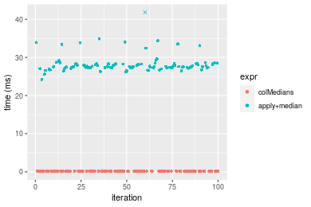

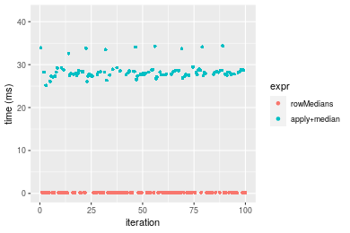
_Table: Benchmarking of colMedians() and rowMedians() on integer+10x1000 data (original and transposed).  The top panel shows times in milliseconds and the bottom panel shows relative times._


|   |expr       |     min|       lq|     mean|   median|       uq|     max|
|:--|:----------|-------:|--------:|--------:|--------:|--------:|-------:|
|1  |colMedians | 144.102| 157.8760| 171.4867| 172.3645| 181.9535| 217.141|
|2  |rowMedians | 147.904| 163.7175| 177.3979| 182.4250| 188.9220| 289.775|


|   |expr       |      min|       lq|    mean|   median|       uq|      max|
|:--|:----------|--------:|--------:|-------:|--------:|--------:|--------:|
|1  |colMedians | 1.000000| 1.000000| 1.00000| 1.000000| 1.000000| 1.000000|
|2  |rowMedians | 1.026384| 1.037001| 1.03447| 1.058368| 1.038298| 1.334502|

_Figure: Benchmarking of colMedians() and rowMedians() on integer+10x1000 data (original and transposed).  Outliers are displayed as crosses. Times are in milliseconds._


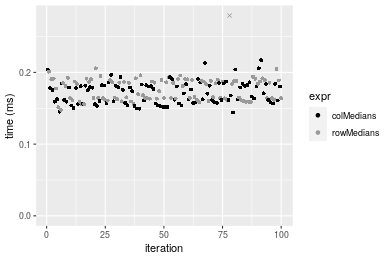

#### 100x1000 integer matrix


```r
> X <- data[["100x1000"]]
> gc()
          used  (Mb) gc trigger  (Mb) max used  (Mb)
Ncells 5242556 280.0    8529671 455.6  8529671 455.6
Vcells 9792224  74.8   31876688 243.2 60562128 462.1
> colStats <- microbenchmark(colMedians = colMedians(X, na.rm = FALSE), `apply+median` = apply(X, MARGIN = 2L, 
+     FUN = median, na.rm = FALSE), unit = "ms")
> X <- t(X)
> gc()
          used  (Mb) gc trigger  (Mb) max used  (Mb)
Ncells 5242532 280.0    8529671 455.6  8529671 455.6
Vcells 9842237  75.1   31876688 243.2 60562128 462.1
> rowStats <- microbenchmark(rowMedians = rowMedians(X, na.rm = FALSE), `apply+median` = apply(X, MARGIN = 1L, 
+     FUN = median, na.rm = FALSE), unit = "ms")
```

_Table: Benchmarking of colMedians() and apply+median() on integer+100x1000 data. The top panel shows times in milliseconds and the bottom panel shows relative times._


|   |expr         |       min|        lq|      mean|    median|        uq|       max|
|:--|:------------|---------:|---------:|---------:|---------:|---------:|---------:|
|1  |colMedians   |  1.374103|  1.451085|  1.480879|  1.472018|  1.493628|  1.765821|
|2  |apply+median | 27.910714| 30.666674| 31.738819| 31.045874| 31.455668| 42.046024|


|   |expr         |      min|       lq|     mean|   median|       uq|      max|
|:--|:------------|--------:|--------:|--------:|--------:|--------:|--------:|
|1  |colMedians   |  1.00000|  1.00000|  1.00000|  1.00000|  1.00000|  1.00000|
|2  |apply+median | 20.31195| 21.13362| 21.43242| 21.09069| 21.05991| 23.81103|

_Table: Benchmarking of rowMedians() and apply+median() on integer+100x1000 data (transposed). The top panel shows times in milliseconds and the bottom panel shows relative times._


|   |expr         |       min|        lq|      mean|    median|        uq|       max|
|:--|:------------|---------:|---------:|---------:|---------:|---------:|---------:|
|1  |rowMedians   |  1.404421|  1.496287|  1.558611|  1.556288|  1.610146|  1.698434|
|2  |apply+median | 27.623059| 30.747152| 31.927814| 31.235588| 31.795802| 42.329560|


|   |expr         |      min|       lq|     mean|   median|       uq|     max|
|:--|:------------|--------:|--------:|--------:|--------:|--------:|-------:|
|1  |rowMedians   |  1.00000|  1.00000|  1.00000|  1.00000|  1.00000|  1.0000|
|2  |apply+median | 19.66865| 20.54897| 20.48479| 20.07057| 19.74715| 24.9227|

_Figure: Benchmarking of colMedians() and apply+median() on integer+100x1000 data  as well as rowMedians() and apply+median() on the same data transposed.  Outliers are displayed as crosses.  Times are in milliseconds._


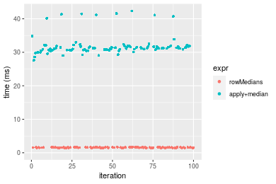
_Table: Benchmarking of colMedians() and rowMedians() on integer+100x1000 data (original and transposed).  The top panel shows times in milliseconds and the bottom panel shows relative times._


|   |expr       |      min|       lq|     mean|   median|       uq|      max|
|:--|:----------|--------:|--------:|--------:|--------:|--------:|--------:|
|1  |colMedians | 1.374103| 1.451085| 1.480879| 1.472018| 1.493628| 1.765821|
|2  |rowMedians | 1.404421| 1.496287| 1.558611| 1.556288| 1.610146| 1.698434|


|   |expr       |      min|       lq|    mean|   median|       uq|       max|
|:--|:----------|--------:|--------:|-------:|--------:|--------:|---------:|
|1  |colMedians | 1.000000| 1.000000| 1.00000| 1.000000| 1.000000| 1.0000000|
|2  |rowMedians | 1.022064| 1.031151| 1.05249| 1.057248| 1.078011| 0.9618381|

_Figure: Benchmarking of colMedians() and rowMedians() on integer+100x1000 data (original and transposed).  Outliers are displayed as crosses. Times are in milliseconds._


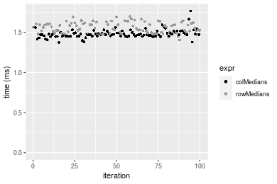

#### 1000x100 integer matrix


```r
> X <- data[["1000x100"]]
> gc()
          used  (Mb) gc trigger  (Mb) max used  (Mb)
Ncells 5242752 280.0    8529671 455.6  8529671 455.6
Vcells 9792813  74.8   31876688 243.2 60562128 462.1
> colStats <- microbenchmark(colMedians = colMedians(X, na.rm = FALSE), `apply+median` = apply(X, MARGIN = 2L, 
+     FUN = median, na.rm = FALSE), unit = "ms")
> X <- t(X)
> gc()
          used  (Mb) gc trigger  (Mb) max used  (Mb)
Ncells 5242728 280.0    8529671 455.6  8529671 455.6
Vcells 9842826  75.1   31876688 243.2 60562128 462.1
> rowStats <- microbenchmark(rowMedians = rowMedians(X, na.rm = FALSE), `apply+median` = apply(X, MARGIN = 1L, 
+     FUN = median, na.rm = FALSE), unit = "ms")
```

_Table: Benchmarking of colMedians() and apply+median() on integer+1000x100 data. The top panel shows times in milliseconds and the bottom panel shows relative times._


|   |expr         |      min|       lq|     mean|   median|       uq|       max|
|:--|:------------|--------:|--------:|--------:|--------:|--------:|---------:|
|1  |colMedians   | 1.117822| 1.276309| 1.291809| 1.284461| 1.313016|  1.851671|
|2  |apply+median | 4.466651| 5.017188| 5.249548| 5.090154| 5.221628| 15.406186|


|   |expr         |      min|       lq|     mean|   median|      uq|      max|
|:--|:------------|--------:|--------:|--------:|--------:|-------:|--------:|
|1  |colMedians   | 1.000000| 1.000000| 1.000000| 1.000000| 1.00000| 1.000000|
|2  |apply+median | 3.995852| 3.931014| 4.063718| 3.962872| 3.97682| 8.320153|

_Table: Benchmarking of rowMedians() and apply+median() on integer+1000x100 data (transposed). The top panel shows times in milliseconds and the bottom panel shows relative times._


|   |expr         |      min|       lq|     mean|   median|       uq|       max|
|:--|:------------|--------:|--------:|--------:|--------:|--------:|---------:|
|1  |rowMedians   | 1.144068| 1.302847| 1.313454| 1.313314| 1.324774|  1.574031|
|2  |apply+median | 4.438241| 4.986463| 5.178526| 5.039875| 5.089077| 15.821266|


|   |expr         |      min|      lq|     mean|   median|       uq|      max|
|:--|:------------|--------:|-------:|--------:|--------:|--------:|--------:|
|1  |rowMedians   | 1.000000| 1.00000| 1.000000| 1.000000| 1.000000|  1.00000|
|2  |apply+median | 3.879351| 3.82736| 3.942678| 3.837526| 3.841467| 10.05143|

_Figure: Benchmarking of colMedians() and apply+median() on integer+1000x100 data  as well as rowMedians() and apply+median() on the same data transposed.  Outliers are displayed as crosses.  Times are in milliseconds._


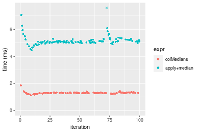

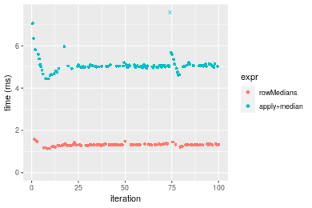
_Table: Benchmarking of colMedians() and rowMedians() on integer+1000x100 data (original and transposed).  The top panel shows times in milliseconds and the bottom panel shows relative times._


|   |expr       |      min|       lq|     mean|   median|       uq|      max|
|:--|:----------|--------:|--------:|--------:|--------:|--------:|--------:|
|1  |colMedians | 1.117822| 1.276309| 1.291809| 1.284461| 1.313016| 1.851671|
|2  |rowMedians | 1.144068| 1.302847| 1.313454| 1.313314| 1.324774| 1.574031|


|   |expr       |     min|       lq|     mean|   median|       uq|       max|
|:--|:----------|-------:|--------:|--------:|--------:|--------:|---------:|
|1  |colMedians | 1.00000| 1.000000| 1.000000| 1.000000| 1.000000| 1.0000000|
|2  |rowMedians | 1.02348| 1.020792| 1.016755| 1.022463| 1.008955| 0.8500598|

_Figure: Benchmarking of colMedians() and rowMedians() on integer+1000x100 data (original and transposed).  Outliers are displayed as crosses. Times are in milliseconds._


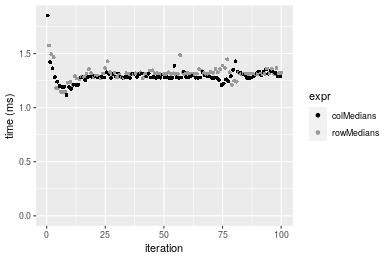


## Data type "double"

### Data
```r
> rmatrix <- function(nrow, ncol, mode = c("logical", "double", "integer", "index"), range = c(-100, 
+     +100), na_prob = 0) {
+     mode <- match.arg(mode)
+     n <- nrow * ncol
+     if (mode == "logical") {
+         x <- sample(c(FALSE, TRUE), size = n, replace = TRUE)
+     }     else if (mode == "index") {
+         x <- seq_len(n)
+         mode <- "integer"
+     }     else {
+         x <- runif(n, min = range[1], max = range[2])
+     }
+     storage.mode(x) <- mode
+     if (na_prob > 0) 
+         x[sample(n, size = na_prob * n)] <- NA
+     dim(x) <- c(nrow, ncol)
+     x
+ }
> rmatrices <- function(scale = 10, seed = 1, ...) {
+     set.seed(seed)
+     data <- list()
+     data[[1]] <- rmatrix(nrow = scale * 1, ncol = scale * 1, ...)
+     data[[2]] <- rmatrix(nrow = scale * 10, ncol = scale * 10, ...)
+     data[[3]] <- rmatrix(nrow = scale * 100, ncol = scale * 1, ...)
+     data[[4]] <- t(data[[3]])
+     data[[5]] <- rmatrix(nrow = scale * 10, ncol = scale * 100, ...)
+     data[[6]] <- t(data[[5]])
+     names(data) <- sapply(data, FUN = function(x) paste(dim(x), collapse = "x"))
+     data
+ }
> data <- rmatrices(mode = mode)
```

### Results

#### 10x10 double matrix


```r
> X <- data[["10x10"]]
> gc()
          used  (Mb) gc trigger  (Mb) max used  (Mb)
Ncells 5242934 280.1    8529671 455.6  8529671 455.6
Vcells 9909186  75.7   31876688 243.2 60562128 462.1
> colStats <- microbenchmark(colMedians = colMedians(X, na.rm = FALSE), `apply+median` = apply(X, MARGIN = 2L, 
+     FUN = median, na.rm = FALSE), unit = "ms")
> X <- t(X)
> gc()
          used  (Mb) gc trigger  (Mb) max used  (Mb)
Ncells 5242919 280.1    8529671 455.6  8529671 455.6
Vcells 9909314  75.7   31876688 243.2 60562128 462.1
> rowStats <- microbenchmark(rowMedians = rowMedians(X, na.rm = FALSE), `apply+median` = apply(X, MARGIN = 1L, 
+     FUN = median, na.rm = FALSE), unit = "ms")
```

_Table: Benchmarking of colMedians() and apply+median() on double+10x10 data. The top panel shows times in milliseconds and the bottom panel shows relative times._


|   |expr         |      min|       lq|      mean|   median|        uq|      max|
|:--|:------------|--------:|--------:|---------:|--------:|---------:|--------:|
|1  |colMedians   | 0.002722| 0.003405| 0.0048599| 0.004527| 0.0055105| 0.020931|
|2  |apply+median | 0.318562| 0.330678| 0.3679373| 0.352705| 0.3870845| 0.601393|


|   |expr         |      min|       lq|     mean|   median|      uq|      max|
|:--|:------------|--------:|--------:|--------:|--------:|-------:|--------:|
|1  |colMedians   |   1.0000|  1.00000|  1.00000|  1.00000|  1.0000|  1.00000|
|2  |apply+median | 117.0323| 97.11542| 75.70928| 77.91142| 70.2449| 28.73217|

_Table: Benchmarking of rowMedians() and apply+median() on double+10x10 data (transposed). The top panel shows times in milliseconds and the bottom panel shows relative times._


|   |expr         |      min|        lq|      mean|    median|       uq|      max|
|:--|:------------|--------:|---------:|---------:|---------:|--------:|--------:|
|1  |rowMedians   | 0.002799| 0.0036850| 0.0051966| 0.0051590| 0.005987| 0.017993|
|2  |apply+median | 0.304087| 0.3250145| 0.3618629| 0.3496705| 0.405575| 0.585888|


|   |expr         |      min|       lq|     mean|   median|       uq|    max|
|:--|:------------|--------:|--------:|--------:|--------:|--------:|------:|
|1  |rowMedians   |   1.0000|  1.00000|  1.00000|  1.00000|  1.00000|  1.000|
|2  |apply+median | 108.6413| 88.19932| 69.63441| 67.77874| 67.74261| 32.562|

_Figure: Benchmarking of colMedians() and apply+median() on double+10x10 data  as well as rowMedians() and apply+median() on the same data transposed.  Outliers are displayed as crosses.  Times are in milliseconds._


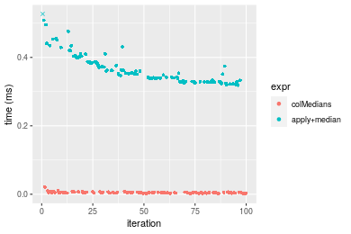


_Table: Benchmarking of colMedians() and rowMedians() on double+10x10 data (original and transposed).  The top panel shows times in milliseconds and the bottom panel shows relative times._


|   |expr       |   min|    lq|    mean| median|     uq|    max|
|:--|:----------|-----:|-----:|-------:|------:|------:|------:|
|1  |colMedians | 2.722| 3.405| 4.85987|  4.527| 5.5105| 20.931|
|2  |rowMedians | 2.799| 3.685| 5.19661|  5.159| 5.9870| 17.993|


|   |expr       |      min|       lq|    mean|   median|       uq|      max|
|:--|:----------|--------:|--------:|-------:|--------:|--------:|--------:|
|1  |colMedians | 1.000000| 1.000000| 1.00000| 1.000000| 1.000000| 1.000000|
|2  |rowMedians | 1.028288| 1.082232| 1.06929| 1.139607| 1.086471| 0.859634|

_Figure: Benchmarking of colMedians() and rowMedians() on double+10x10 data (original and transposed).  Outliers are displayed as crosses. Times are in milliseconds._


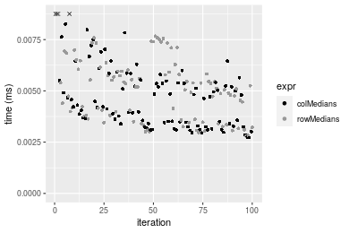

#### 100x100 double matrix


```r
> X <- data[["100x100"]]
> gc()
          used  (Mb) gc trigger  (Mb) max used  (Mb)
Ncells 5243130 280.1    8529671 455.6  8529671 455.6
Vcells 9909326  75.7   31876688 243.2 60562128 462.1
> colStats <- microbenchmark(colMedians = colMedians(X, na.rm = FALSE), `apply+median` = apply(X, MARGIN = 2L, 
+     FUN = median, na.rm = FALSE), unit = "ms")
> X <- t(X)
> gc()
          used  (Mb) gc trigger  (Mb) max used  (Mb)
Ncells 5243106 280.1    8529671 455.6  8529671 455.6
Vcells 9919339  75.7   31876688 243.2 60562128 462.1
> rowStats <- microbenchmark(rowMedians = rowMedians(X, na.rm = FALSE), `apply+median` = apply(X, MARGIN = 1L, 
+     FUN = median, na.rm = FALSE), unit = "ms")
```

_Table: Benchmarking of colMedians() and apply+median() on double+100x100 data. The top panel shows times in milliseconds and the bottom panel shows relative times._


|   |expr         |      min|       lq|      mean|   median|       uq|      max|
|:--|:------------|--------:|--------:|---------:|--------:|--------:|--------:|
|1  |colMedians   | 0.195424| 0.212914| 0.2197392| 0.218946| 0.223244| 0.330914|
|2  |apply+median | 2.764987| 3.066848| 3.1859469| 3.141621| 3.293928| 4.702083|


|   |expr         |      min|       lq|     mean|   median|       uq|      max|
|:--|:------------|--------:|--------:|--------:|--------:|--------:|--------:|
|1  |colMedians   |  1.00000|  1.00000|  1.00000|  1.00000|  1.00000|  1.00000|
|2  |apply+median | 14.14866| 14.40417| 14.49877| 14.34884| 14.75484| 14.20938|

_Table: Benchmarking of rowMedians() and apply+median() on double+100x100 data (transposed). The top panel shows times in milliseconds and the bottom panel shows relative times._


|   |expr         |      min|        lq|      mean|  median|       uq|      max|
|:--|:------------|--------:|---------:|---------:|-------:|--------:|--------:|
|1  |rowMedians   | 0.190917| 0.2133255| 0.2207082| 0.21938| 0.225468| 0.270784|
|2  |apply+median | 2.752276| 3.0632630| 3.2004389| 3.14504| 3.330661| 4.719369|


|   |expr         |      min|       lq|     mean|   median|       uq|      max|
|:--|:------------|--------:|--------:|--------:|--------:|--------:|--------:|
|1  |rowMedians   |  1.00000|  1.00000|  1.00000|  1.00000|  1.00000|  1.00000|
|2  |apply+median | 14.41609| 14.35957| 14.50077| 14.33604| 14.77221| 17.42854|

_Figure: Benchmarking of colMedians() and apply+median() on double+100x100 data  as well as rowMedians() and apply+median() on the same data transposed.  Outliers are displayed as crosses.  Times are in milliseconds._


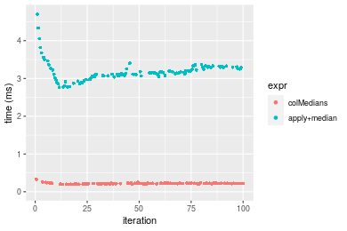

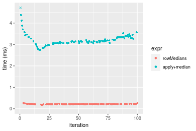
_Table: Benchmarking of colMedians() and rowMedians() on double+100x100 data (original and transposed).  The top panel shows times in milliseconds and the bottom panel shows relative times._


|   |expr       |     min|       lq|     mean|  median|      uq|     max|
|:--|:----------|-------:|--------:|--------:|-------:|-------:|-------:|
|1  |colMedians | 195.424| 212.9140| 219.7392| 218.946| 223.244| 330.914|
|2  |rowMedians | 190.917| 213.3255| 220.7081| 219.380| 225.468| 270.784|


|   |expr       |       min|       lq|    mean|   median|       uq|       max|
|:--|:----------|---------:|--------:|-------:|--------:|--------:|---------:|
|1  |colMedians | 1.0000000| 1.000000| 1.00000| 1.000000| 1.000000| 1.0000000|
|2  |rowMedians | 0.9769373| 1.001933| 1.00441| 1.001982| 1.009962| 0.8182912|

_Figure: Benchmarking of colMedians() and rowMedians() on double+100x100 data (original and transposed).  Outliers are displayed as crosses. Times are in milliseconds._


#### 1000x10 double matrix


```r
> X <- data[["1000x10"]]
> gc()
          used  (Mb) gc trigger  (Mb) max used  (Mb)
Ncells 5243315 280.1    8529671 455.6  8529671 455.6
Vcells 9910207  75.7   31876688 243.2 60562128 462.1
> colStats <- microbenchmark(colMedians = colMedians(X, na.rm = FALSE), `apply+median` = apply(X, MARGIN = 2L, 
+     FUN = median, na.rm = FALSE), unit = "ms")
> X <- t(X)
> gc()
          used  (Mb) gc trigger  (Mb) max used  (Mb)
Ncells 5243297 280.1    8529671 455.6  8529671 455.6
Vcells 9920230  75.7   31876688 243.2 60562128 462.1
> rowStats <- microbenchmark(rowMedians = rowMedians(X, na.rm = FALSE), `apply+median` = apply(X, MARGIN = 1L, 
+     FUN = median, na.rm = FALSE), unit = "ms")
```

_Table: Benchmarking of colMedians() and apply+median() on double+1000x10 data. The top panel shows times in milliseconds and the bottom panel shows relative times._


|   |expr         |      min|        lq|      mean|   median|       uq|      max|
|:--|:------------|--------:|---------:|---------:|--------:|--------:|--------:|
|1  |colMedians   | 0.175335| 0.1829445| 0.2131880| 0.198377| 0.229199| 0.308704|
|2  |apply+median | 0.531410| 0.5498355| 0.6345319| 0.585643| 0.688513| 1.033381|


|   |expr         |      min|       lq|     mean|   median|       uq|      max|
|:--|:------------|--------:|--------:|--------:|--------:|--------:|--------:|
|1  |colMedians   | 1.000000| 1.000000| 1.000000| 1.000000| 1.000000| 1.000000|
|2  |apply+median | 3.030827| 3.005477| 2.976396| 2.952172| 3.003996| 3.347482|

_Table: Benchmarking of rowMedians() and apply+median() on double+1000x10 data (transposed). The top panel shows times in milliseconds and the bottom panel shows relative times._


|   |expr         |      min|        lq|      mean|    median|        uq|      max|
|:--|:------------|--------:|---------:|---------:|---------:|---------:|--------:|
|1  |rowMedians   | 0.176283| 0.1859945| 0.2198387| 0.2039295| 0.2355145| 0.389123|
|2  |apply+median | 0.526611| 0.5679495| 0.6610664| 0.6418115| 0.7123670| 1.326834|


|   |expr         |      min|       lq|     mean|   median|       uq|      max|
|:--|:------------|--------:|--------:|--------:|--------:|--------:|--------:|
|1  |rowMedians   | 1.000000| 1.000000| 1.000000| 1.000000| 1.000000| 1.000000|
|2  |apply+median | 2.987305| 3.053582| 3.007052| 3.147222| 3.024727| 3.409806|

_Figure: Benchmarking of colMedians() and apply+median() on double+1000x10 data  as well as rowMedians() and apply+median() on the same data transposed.  Outliers are displayed as crosses.  Times are in milliseconds._


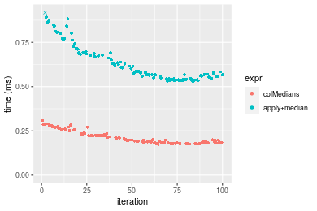

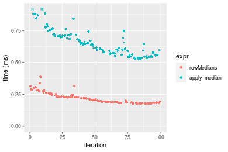
_Table: Benchmarking of colMedians() and rowMedians() on double+1000x10 data (original and transposed).  The top panel shows times in milliseconds and the bottom panel shows relative times._


|   |expr       |     min|       lq|     mean|   median|       uq|     max|
|:--|:----------|-------:|--------:|--------:|--------:|--------:|-------:|
|1  |colMedians | 175.335| 182.9445| 213.1880| 198.3770| 229.1990| 308.704|
|2  |rowMedians | 176.283| 185.9945| 219.8387| 203.9295| 235.5145| 389.123|


|   |expr       |      min|       lq|     mean|  median|       uq|      max|
|:--|:----------|--------:|--------:|--------:|-------:|--------:|--------:|
|1  |colMedians | 1.000000| 1.000000| 1.000000| 1.00000| 1.000000| 1.000000|
|2  |rowMedians | 1.005407| 1.016672| 1.031197| 1.02799| 1.027555| 1.260505|

_Figure: Benchmarking of colMedians() and rowMedians() on double+1000x10 data (original and transposed).  Outliers are displayed as crosses. Times are in milliseconds._


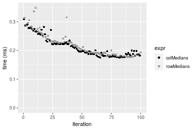

#### 10x1000 double matrix


```r
> X <- data[["10x1000"]]
> gc()
          used  (Mb) gc trigger  (Mb) max used  (Mb)
Ncells 5243509 280.1    8529671 455.6  8529671 455.6
Vcells 9911262  75.7   31876688 243.2 60562128 462.1
> colStats <- microbenchmark(colMedians = colMedians(X, na.rm = FALSE), `apply+median` = apply(X, MARGIN = 2L, 
+     FUN = median, na.rm = FALSE), unit = "ms")
> X <- t(X)
> gc()
          used  (Mb) gc trigger  (Mb) max used  (Mb)
Ncells 5243485 280.1    8529671 455.6  8529671 455.6
Vcells 9921275  75.7   31876688 243.2 60562128 462.1
> rowStats <- microbenchmark(rowMedians = rowMedians(X, na.rm = FALSE), `apply+median` = apply(X, MARGIN = 1L, 
+     FUN = median, na.rm = FALSE), unit = "ms")
```

_Table: Benchmarking of colMedians() and apply+median() on double+10x1000 data. The top panel shows times in milliseconds and the bottom panel shows relative times._


|   |expr         |       min|         lq|       mean|    median|        uq|       max|
|:--|:------------|---------:|----------:|----------:|---------:|---------:|---------:|
|1  |colMedians   |  0.205459|  0.2310795|  0.2412473|  0.243109|  0.249687|  0.272166|
|2  |apply+median | 24.932106| 28.1365430| 28.9532241| 28.356629| 29.045983| 35.188701|


|   |expr         |      min|       lq|     mean|   median|       uq|      max|
|:--|:------------|--------:|--------:|--------:|--------:|--------:|--------:|
|1  |colMedians   |   1.0000|   1.0000|   1.0000|   1.0000|   1.0000|   1.0000|
|2  |apply+median | 121.3483| 121.7613| 120.0147| 116.6416| 116.3296| 129.2913|

_Table: Benchmarking of rowMedians() and apply+median() on double+10x1000 data (transposed). The top panel shows times in milliseconds and the bottom panel shows relative times._


|   |expr         |       min|        lq|       mean|    median|        uq|       max|
|:--|:------------|---------:|---------:|----------:|---------:|---------:|---------:|
|1  |rowMedians   |  0.217118|  0.231363|  0.2432768|  0.244235|  0.250688|  0.306857|
|2  |apply+median | 25.173491| 28.197331| 29.1656326| 28.556639| 29.053978| 49.903651|


|   |expr         |      min|       lq|     mean|   median|      uq|      max|
|:--|:------------|--------:|--------:|--------:|--------:|-------:|--------:|
|1  |rowMedians   |   1.0000|   1.0000|   1.0000|   1.0000|   1.000|   1.0000|
|2  |apply+median | 115.9438| 121.8749| 119.8866| 116.9228| 115.897| 162.6284|

_Figure: Benchmarking of colMedians() and apply+median() on double+10x1000 data  as well as rowMedians() and apply+median() on the same data transposed.  Outliers are displayed as crosses.  Times are in milliseconds._


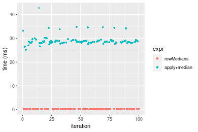
_Table: Benchmarking of colMedians() and rowMedians() on double+10x1000 data (original and transposed).  The top panel shows times in milliseconds and the bottom panel shows relative times._


|   |expr       |     min|       lq|     mean|  median|      uq|     max|
|:--|:----------|-------:|--------:|--------:|-------:|-------:|-------:|
|1  |colMedians | 205.459| 231.0795| 241.2473| 243.109| 249.687| 272.166|
|2  |rowMedians | 217.118| 231.3630| 243.2768| 244.235| 250.688| 306.857|


|   |expr       |      min|       lq|     mean|   median|       uq|      max|
|:--|:----------|--------:|--------:|--------:|--------:|--------:|--------:|
|1  |colMedians | 1.000000| 1.000000| 1.000000| 1.000000| 1.000000| 1.000000|
|2  |rowMedians | 1.056746| 1.001227| 1.008412| 1.004632| 1.004009| 1.127463|

_Figure: Benchmarking of colMedians() and rowMedians() on double+10x1000 data (original and transposed).  Outliers are displayed as crosses. Times are in milliseconds._


#### 100x1000 double matrix


```r
> X <- data[["100x1000"]]
> gc()
          used  (Mb) gc trigger  (Mb) max used  (Mb)
Ncells 5243690 280.1    8529671 455.6  8529671 455.6
Vcells 9911380  75.7   31876688 243.2 60562128 462.1
> colStats <- microbenchmark(colMedians = colMedians(X, na.rm = FALSE), `apply+median` = apply(X, MARGIN = 2L, 
+     FUN = median, na.rm = FALSE), unit = "ms")
> X <- t(X)
> gc()
           used  (Mb) gc trigger  (Mb) max used  (Mb)
Ncells  5243666 280.1    8529671 455.6  8529671 455.6
Vcells 10011393  76.4   31876688 243.2 60562128 462.1
> rowStats <- microbenchmark(rowMedians = rowMedians(X, na.rm = FALSE), `apply+median` = apply(X, MARGIN = 1L, 
+     FUN = median, na.rm = FALSE), unit = "ms")
```

_Table: Benchmarking of colMedians() and apply+median() on double+100x1000 data. The top panel shows times in milliseconds and the bottom panel shows relative times._


|   |expr         |       min|        lq|      mean|    median|        uq|      max|
|:--|:------------|---------:|---------:|---------:|---------:|---------:|--------:|
|1  |colMedians   |  1.991339|  2.163176|  2.212279|  2.201229|  2.239289|  3.22232|
|2  |apply+median | 28.649616| 31.665022| 33.011730| 32.111881| 32.701452| 45.12525|


|   |expr         |      min|       lq|     mean|   median|      uq|      max|
|:--|:------------|--------:|--------:|--------:|--------:|-------:|--------:|
|1  |colMedians   |  1.00000|  1.00000|  1.00000|  1.00000|  1.0000|  1.00000|
|2  |apply+median | 14.38711| 14.63821| 14.92205| 14.58816| 14.6035| 14.00396|

_Table: Benchmarking of rowMedians() and apply+median() on double+100x1000 data (transposed). The top panel shows times in milliseconds and the bottom panel shows relative times._


|   |expr         |       min|        lq|      mean|    median|        uq|        max|
|:--|:------------|---------:|---------:|---------:|---------:|---------:|----------:|
|1  |rowMedians   |  1.986987|  2.208758|  2.288274|  2.297048|  2.341113|   3.016235|
|2  |apply+median | 29.213197| 31.805172| 36.488748| 32.142513| 32.771625| 390.646579|


|   |expr         |      min|       lq|     mean|   median|       uq|      max|
|:--|:------------|--------:|--------:|--------:|--------:|--------:|--------:|
|1  |rowMedians   |  1.00000|  1.00000|  1.00000|  1.00000|  1.00000|   1.0000|
|2  |apply+median | 14.70226| 14.39957| 15.94597| 13.99297| 13.99831| 129.5146|

_Figure: Benchmarking of colMedians() and apply+median() on double+100x1000 data  as well as rowMedians() and apply+median() on the same data transposed.  Outliers are displayed as crosses.  Times are in milliseconds._


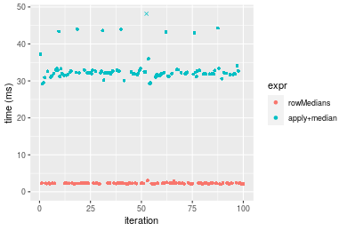
_Table: Benchmarking of colMedians() and rowMedians() on double+100x1000 data (original and transposed).  The top panel shows times in milliseconds and the bottom panel shows relative times._


|   |expr       |      min|       lq|     mean|   median|       uq|      max|
|:--|:----------|--------:|--------:|--------:|--------:|--------:|--------:|
|1  |colMedians | 1.991339| 2.163176| 2.212279| 2.201229| 2.239289| 3.222320|
|2  |rowMedians | 1.986987| 2.208758| 2.288274| 2.297048| 2.341113| 3.016235|


|   |expr       |       min|       lq|     mean|   median|       uq|       max|
|:--|:----------|---------:|--------:|--------:|--------:|--------:|---------:|
|1  |colMedians | 1.0000000| 1.000000| 1.000000| 1.000000| 1.000000| 1.0000000|
|2  |rowMedians | 0.9978145| 1.021072| 1.034352| 1.043529| 1.045472| 0.9360445|

_Figure: Benchmarking of colMedians() and rowMedians() on double+100x1000 data (original and transposed).  Outliers are displayed as crosses. Times are in milliseconds._


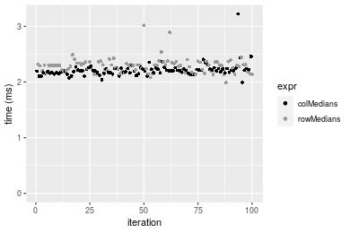

#### 1000x100 double matrix


```r
> X <- data[["1000x100"]]
> gc()
          used  (Mb) gc trigger  (Mb) max used  (Mb)
Ncells 5243886 280.1    8529671 455.6  8529671 455.6
Vcells 9912619  75.7   31876688 243.2 60562128 462.1
> colStats <- microbenchmark(colMedians = colMedians(X, na.rm = FALSE), `apply+median` = apply(X, MARGIN = 2L, 
+     FUN = median, na.rm = FALSE), unit = "ms")
> X <- t(X)
> gc()
           used  (Mb) gc trigger  (Mb) max used  (Mb)
Ncells  5243862 280.1    8529671 455.6  8529671 455.6
Vcells 10012632  76.4   31876688 243.2 60562128 462.1
> rowStats <- microbenchmark(rowMedians = rowMedians(X, na.rm = FALSE), `apply+median` = apply(X, MARGIN = 1L, 
+     FUN = median, na.rm = FALSE), unit = "ms")
```

_Table: Benchmarking of colMedians() and apply+median() on double+1000x100 data. The top panel shows times in milliseconds and the bottom panel shows relative times._


|   |expr         |      min|       lq|     mean|   median|       uq|       max|
|:--|:------------|--------:|--------:|--------:|--------:|--------:|---------:|
|1  |colMedians   | 1.758738| 2.000690| 2.029535| 2.024788| 2.062974|  2.853849|
|2  |apply+median | 5.150175| 5.782103| 6.113051| 5.866638| 5.971119| 14.670965|


|   |expr         |      min|       lq|     mean|   median|       uq|      max|
|:--|:------------|--------:|--------:|--------:|--------:|--------:|--------:|
|1  |colMedians   | 1.000000| 1.000000| 1.000000| 1.000000| 1.000000| 1.000000|
|2  |apply+median | 2.928336| 2.890054| 3.012045| 2.897409| 2.894423| 5.140764|

_Table: Benchmarking of rowMedians() and apply+median() on double+1000x100 data (transposed). The top panel shows times in milliseconds and the bottom panel shows relative times._


|   |expr         |      min|       lq|     mean|   median|       uq|       max|
|:--|:------------|--------:|--------:|--------:|--------:|--------:|---------:|
|1  |rowMedians   | 1.749699| 1.991984| 2.039428| 2.032979| 2.076482|  2.413104|
|2  |apply+median | 5.179044| 5.814283| 6.093613| 5.871463| 6.005294| 15.101126|


|   |expr         |      min|      lq|     mean|   median|       uq|      max|
|:--|:------------|--------:|-------:|--------:|--------:|--------:|--------:|
|1  |rowMedians   | 1.000000| 1.00000| 1.000000| 1.000000| 1.000000| 1.000000|
|2  |apply+median | 2.959963| 2.91884| 2.987903| 2.888108| 2.892052| 6.257967|

_Figure: Benchmarking of colMedians() and apply+median() on double+1000x100 data  as well as rowMedians() and apply+median() on the same data transposed.  Outliers are displayed as crosses.  Times are in milliseconds._


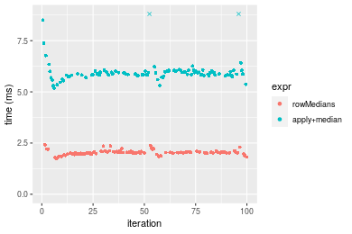
_Table: Benchmarking of colMedians() and rowMedians() on double+1000x100 data (original and transposed).  The top panel shows times in milliseconds and the bottom panel shows relative times._


|   |expr       |      min|       lq|     mean|   median|       uq|      max|
|:--|:----------|--------:|--------:|--------:|--------:|--------:|--------:|
|1  |colMedians | 1.758738| 2.000690| 2.029535| 2.024788| 2.062974| 2.853849|
|2  |rowMedians | 1.749699| 1.991984| 2.039428| 2.032979| 2.076482| 2.413104|


|   |expr       |       min|        lq|     mean|   median|       uq|       max|
|:--|:----------|---------:|---------:|--------:|--------:|--------:|---------:|
|1  |colMedians | 1.0000000| 1.0000000| 1.000000| 1.000000| 1.000000| 1.0000000|
|2  |rowMedians | 0.9948605| 0.9956485| 1.004875| 1.004045| 1.006548| 0.8455612|

_Figure: Benchmarking of colMedians() and rowMedians() on double+1000x100 data (original and transposed).  Outliers are displayed as crosses. Times are in milliseconds._


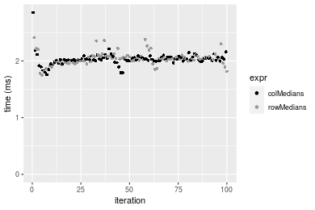


## Appendix

### Session information
```r
R version 4.1.1 Patched (2021-08-10 r80727)
Platform: x86_64-pc-linux-gnu (64-bit)
Running under: Ubuntu 18.04.5 LTS

Matrix products: default
BLAS:   /home/hb/software/R-devel/R-4-1-branch/lib/R/lib/libRblas.so
LAPACK: /home/hb/software/R-devel/R-4-1-branch/lib/R/lib/libRlapack.so

locale:
 [1] LC_CTYPE=en_US.UTF-8       LC_NUMERIC=C              
 [3] LC_TIME=en_US.UTF-8        LC_COLLATE=en_US.UTF-8    
 [5] LC_MONETARY=en_US.UTF-8    LC_MESSAGES=en_US.UTF-8   
 [7] LC_PAPER=en_US.UTF-8       LC_NAME=C                 
 [9] LC_ADDRESS=C               LC_TELEPHONE=C            
[11] LC_MEASUREMENT=en_US.UTF-8 LC_IDENTIFICATION=C       

attached base packages:
[1] stats     graphics  grDevices utils     datasets  methods   base     

other attached packages:
[1] microbenchmark_1.4-7   matrixStats_0.60.1     ggplot2_3.3.5         
[4] knitr_1.33             R.devices_2.17.0       R.utils_2.10.1        
[7] R.oo_1.24.0            R.methodsS3_1.8.1-9001 history_0.0.1-9000    

loaded via a namespace (and not attached):
 [1] Biobase_2.52.0          httr_1.4.2              splines_4.1.1          
 [4] bit64_4.0.5             network_1.17.1          assertthat_0.2.1       
 [7] highr_0.9               stats4_4.1.1            blob_1.2.2             
[10] GenomeInfoDbData_1.2.6  robustbase_0.93-8       pillar_1.6.2           
[13] RSQLite_2.2.8           lattice_0.20-44         glue_1.4.2             
[16] digest_0.6.27           XVector_0.32.0          colorspace_2.0-2       
[19] Matrix_1.3-4            XML_3.99-0.7            pkgconfig_2.0.3        
[22] zlibbioc_1.38.0         genefilter_1.74.0       purrr_0.3.4            
[25] ergm_4.1.2              xtable_1.8-4            scales_1.1.1           
[28] tibble_3.1.4            annotate_1.70.0         KEGGREST_1.32.0        
[31] farver_2.1.0            generics_0.1.0          IRanges_2.26.0         
[34] ellipsis_0.3.2          cachem_1.0.6            withr_2.4.2            
[37] BiocGenerics_0.38.0     mime_0.11               survival_3.2-13        
[40] magrittr_2.0.1          crayon_1.4.1            statnet.common_4.5.0   
[43] memoise_2.0.0           laeken_0.5.1            fansi_0.5.0            
[46] R.cache_0.15.0          MASS_7.3-54             R.rsp_0.44.0           
[49] progressr_0.8.0         tools_4.1.1             lifecycle_1.0.0        
[52] S4Vectors_0.30.0        trust_0.1-8             munsell_0.5.0          
[55] tabby_0.0.1-9001        AnnotationDbi_1.54.1    Biostrings_2.60.2      
[58] compiler_4.1.1          GenomeInfoDb_1.28.1     rlang_0.4.11           
[61] grid_4.1.1              RCurl_1.98-1.4          cwhmisc_6.6            
[64] rappdirs_0.3.3          startup_0.15.0          labeling_0.4.2         
[67] bitops_1.0-7            base64enc_0.1-3         boot_1.3-28            
[70] gtable_0.3.0            DBI_1.1.1               markdown_1.1           
[73] R6_2.5.1                lpSolveAPI_5.5.2.0-17.7 rle_0.9.2              
[76] dplyr_1.0.7             fastmap_1.1.0           bit_4.0.4              
[79] utf8_1.2.2              parallel_4.1.1          Rcpp_1.0.7             
[82] vctrs_0.3.8             png_0.1-7               DEoptimR_1.0-9         
[85] tidyselect_1.1.1        xfun_0.25               coda_0.19-4            
```
Total processing time was 52.96 secs.


### Reproducibility
To reproduce this report, do:
```r
html <- matrixStats:::benchmark('colMedians')
```

[RSP]: https://cran.r-project.org/package=R.rsp
[matrixStats]: https://cran.r-project.org/package=matrixStats

[StackOverflow:colMins?]: https://stackoverflow.com/questions/13676878 "Stack Overflow: fastest way to get Min from every column in a matrix?"
[StackOverflow:colSds?]: https://stackoverflow.com/questions/17549762 "Stack Overflow: Is there such 'colsd' in R?"
[StackOverflow:rowProds?]: https://stackoverflow.com/questions/20198801/ "Stack Overflow: Row product of matrix and column sum of matrix"

---------------------------------------
Copyright Henrik Bengtsson. Last updated on 2021-08-25 19:00:25 (+0200 UTC). Powered by [RSP].

<script>
 var link = document.createElement('link');
 link.rel = 'icon';
 link.href = "data:image/png;base64,iVBORw0KGgoAAAANSUhEUgAAACAAAAAgCAMAAABEpIrGAAAA21BMVEUAAAAAAP8AAP8AAP8AAP8AAP8AAP8AAP8AAP8AAP8AAP8AAP8AAP8AAP8AAP8AAP8AAP8AAP8AAP8AAP8AAP8AAP8AAP8AAP8AAP8AAP8AAP8AAP8AAP8AAP8AAP8AAP8AAP8AAP8AAP8AAP8AAP8AAP8AAP8AAP8AAP8AAP8BAf4CAv0DA/wdHeIeHuEfH+AgIN8hId4lJdomJtknJ9g+PsE/P8BAQL9yco10dIt1dYp3d4h4eIeVlWqWlmmXl2iYmGeZmWabm2Tn5xjo6Bfp6Rb39wj4+Af//wA2M9hbAAAASXRSTlMAAQIJCgsMJSYnKD4/QGRlZmhpamtsbautrrCxuru8y8zN5ebn6Pn6+///////////////////////////////////////////LsUNcQAAAS9JREFUOI29k21XgkAQhVcFytdSMqMETU26UVqGmpaiFbL//xc1cAhhwVNf6n5i5z67M2dmYOyfJZUqlVLhkKucG7cgmUZTybDz6g0iDeq51PUr37Ds2cy2/C9NeES5puDjxuUk1xnToZsg8pfA3avHQ3lLIi7iWRrkv/OYtkScxBIMgDee0ALoyxHQBJ68JLCjOtQIMIANF7QG9G9fNnHvisCHBVMKgSJgiz7nE+AoBKrAPA3MgepvgR9TSCasrCKH0eB1wBGBFdCO+nAGjMVGPcQb5bd6mQRegN6+1axOs9nGfYcCtfi4NQosdtH7dB+txFIpXQqN1p9B/asRHToyS0jRgpV7nk4nwcq1BJ+x3Gl/v7S9Wmpp/aGquum7w3ZDyrADFYrl8vHBH+ev9AUASW1dmU4h4wAAAABJRU5ErkJggg=="
 document.getElementsByTagName('head')[0].appendChild(link);
</script>


