[matrixStats]: Benchmark report

---------------------------------------


# colMedians() and rowMedians() benchmarks on subsetted computation

This report benchmark the performance of colMedians() and rowMedians() on subsetted computation.


## Data type "integer"

### Data
```r
> rmatrix <- function(nrow, ncol, mode = c("logical", "double", "integer", "index"), range = c(-100, 
+     +100), na_prob = 0) {
+     mode <- match.arg(mode)
+     n <- nrow * ncol
+     if (mode == "logical") {
+         x <- sample(c(FALSE, TRUE), size = n, replace = TRUE)
+     }     else if (mode == "index") {
+         x <- seq_len(n)
+         mode <- "integer"
+     }     else {
+         x <- runif(n, min = range[1], max = range[2])
+     }
+     storage.mode(x) <- mode
+     if (na_prob > 0) 
+         x[sample(n, size = na_prob * n)] <- NA
+     dim(x) <- c(nrow, ncol)
+     x
+ }
> rmatrices <- function(scale = 10, seed = 1, ...) {
+     set.seed(seed)
+     data <- list()
+     data[[1]] <- rmatrix(nrow = scale * 1, ncol = scale * 1, ...)
+     data[[2]] <- rmatrix(nrow = scale * 10, ncol = scale * 10, ...)
+     data[[3]] <- rmatrix(nrow = scale * 100, ncol = scale * 1, ...)
+     data[[4]] <- t(data[[3]])
+     data[[5]] <- rmatrix(nrow = scale * 10, ncol = scale * 100, ...)
+     data[[6]] <- t(data[[5]])
+     names(data) <- sapply(data, FUN = function(x) paste(dim(x), collapse = "x"))
+     data
+ }
> data <- rmatrices(mode = mode)
```

### Results

#### 10x10 integer matrix


```r
> X <- data[["10x10"]]
> rows <- sample.int(nrow(X), size = nrow(X) * 0.7)
> cols <- sample.int(ncol(X), size = ncol(X) * 0.7)
> X_S <- X[rows, cols]
> gc()
           used  (Mb) gc trigger  (Mb) max used  (Mb)
Ncells  5247785 280.3    8529671 455.6  8529671 455.6
Vcells 10124522  77.3   31876688 243.2 60562128 462.1
> colStats <- microbenchmark(colMedians_X_S = colMedians(X_S, na.rm = FALSE), `colMedians(X, rows, cols)` = colMedians(X, 
+     rows = rows, cols = cols, na.rm = FALSE), `colMedians(X[rows, cols])` = colMedians(X[rows, cols], 
+     na.rm = FALSE), unit = "ms")
> X <- t(X)
> X_S <- t(X_S)
> gc()
           used  (Mb) gc trigger  (Mb) max used  (Mb)
Ncells  5239184 279.9    8529671 455.6  8529671 455.6
Vcells 10096500  77.1   31876688 243.2 60562128 462.1
> rowStats <- microbenchmark(rowMedians_X_S = rowMedians(X_S, na.rm = FALSE), `rowMedians(X, cols, rows)` = rowMedians(X, 
+     rows = cols, cols = rows, na.rm = FALSE), `rowMedians(X[cols, rows])` = rowMedians(X[cols, rows], 
+     na.rm = FALSE), unit = "ms")
```

_Table: Benchmarking of colMedians_X_S(), colMedians(X, rows, cols)() and colMedians(X[rows, cols])() on integer+10x10 data. The top panel shows times in milliseconds and the bottom panel shows relative times._


|   |expr                      |      min|       lq|      mean|    median|        uq|      max|
|:--|:-------------------------|--------:|--------:|---------:|---------:|---------:|--------:|
|1  |colMedians_X_S            | 0.002163| 0.002199| 0.0024745| 0.0022340| 0.0023215| 0.019472|
|2  |colMedians(X, rows, cols) | 0.002535| 0.002617| 0.0027482| 0.0026785| 0.0027815| 0.005729|
|3  |colMedians(X[rows, cols]) | 0.002998| 0.003217| 0.0034158| 0.0033335| 0.0034665| 0.008748|


|   |expr                      |      min|       lq|     mean|   median|       uq|       max|
|:--|:-------------------------|--------:|--------:|--------:|--------:|--------:|---------:|
|1  |colMedians_X_S            | 1.000000| 1.000000| 1.000000| 1.000000| 1.000000| 1.0000000|
|2  |colMedians(X, rows, cols) | 1.171983| 1.190086| 1.110587| 1.198970| 1.198148| 0.2942173|
|3  |colMedians(X[rows, cols]) | 1.386038| 1.462938| 1.380363| 1.492166| 1.493216| 0.4492605|

_Table: Benchmarking of rowMedians_X_S(), rowMedians(X, cols, rows)() and rowMedians(X[cols, rows])() on integer+10x10 data (transposed). The top panel shows times in milliseconds and the bottom panel shows relative times._


|   |expr                      |      min|        lq|      mean|    median|        uq|      max|
|:--|:-------------------------|--------:|---------:|---------:|---------:|---------:|--------:|
|1  |rowMedians_X_S            | 0.002181| 0.0022175| 0.0023243| 0.0022505| 0.0023545| 0.005164|
|2  |rowMedians(X, cols, rows) | 0.002533| 0.0026210| 0.0029240| 0.0026630| 0.0028205| 0.021817|
|3  |rowMedians(X[cols, rows]) | 0.003055| 0.0032280| 0.0034302| 0.0033365| 0.0034945| 0.006212|


|   |expr                      |      min|       lq|     mean|   median|       uq|      max|
|:--|:-------------------------|--------:|--------:|--------:|--------:|--------:|--------:|
|1  |rowMedians_X_S            | 1.000000| 1.000000| 1.000000| 1.000000| 1.000000| 1.000000|
|2  |rowMedians(X, cols, rows) | 1.161394| 1.181962| 1.257998| 1.183293| 1.197919| 4.224826|
|3  |rowMedians(X[cols, rows]) | 1.400734| 1.455693| 1.475774| 1.482559| 1.484179| 1.202943|

_Figure: Benchmarking of colMedians_X_S(), colMedians(X, rows, cols)() and colMedians(X[rows, cols])() on integer+10x10 data  as well as rowMedians_X_S(), rowMedians(X, cols, rows)() and rowMedians(X[cols, rows])() on the same data transposed.  Outliers are displayed as crosses.  Times are in milliseconds._


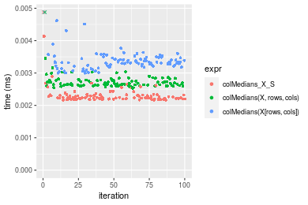

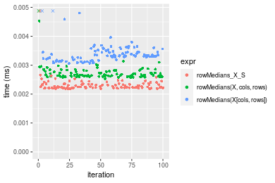
_Table: Benchmarking of colMedians_X_S() and rowMedians_X_S() on integer+10x10 data (original and transposed).  The top panel shows times in milliseconds and the bottom panel shows relative times._


|   |expr           |   min|     lq|    mean| median|     uq|    max|
|:--|:--------------|-----:|------:|-------:|------:|------:|------:|
|1  |colMedians_X_S | 2.163| 2.1990| 2.47453| 2.2340| 2.3215| 19.472|
|2  |rowMedians_X_S | 2.181| 2.2175| 2.32432| 2.2505| 2.3545|  5.164|


|   |expr           |      min|       lq|      mean|   median|       uq|       max|
|:--|:--------------|--------:|--------:|---------:|--------:|--------:|---------:|
|1  |colMedians_X_S | 1.000000| 1.000000| 1.0000000| 1.000000| 1.000000| 1.0000000|
|2  |rowMedians_X_S | 1.008322| 1.008413| 0.9392976| 1.007386| 1.014215| 0.2652013|

_Figure: Benchmarking of colMedians_X_S() and rowMedians_X_S() on integer+10x10 data (original and transposed).  Outliers are displayed as crosses. Times are in milliseconds._


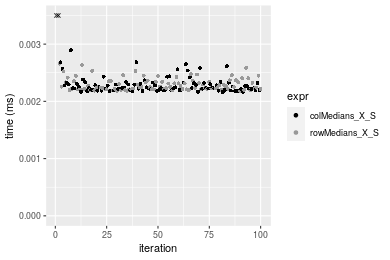

#### 100x100 integer matrix


```r
> X <- data[["100x100"]]
> rows <- sample.int(nrow(X), size = nrow(X) * 0.7)
> cols <- sample.int(ncol(X), size = ncol(X) * 0.7)
> X_S <- X[rows, cols]
> gc()
          used  (Mb) gc trigger  (Mb) max used  (Mb)
Ncells 5237789 279.8    8529671 455.6  8529671 455.6
Vcells 9764735  74.5   31876688 243.2 60562128 462.1
> colStats <- microbenchmark(colMedians_X_S = colMedians(X_S, na.rm = FALSE), `colMedians(X, rows, cols)` = colMedians(X, 
+     rows = rows, cols = cols, na.rm = FALSE), `colMedians(X[rows, cols])` = colMedians(X[rows, cols], 
+     na.rm = FALSE), unit = "ms")
> X <- t(X)
> X_S <- t(X_S)
> gc()
          used  (Mb) gc trigger  (Mb) max used  (Mb)
Ncells 5237765 279.8    8529671 455.6  8529671 455.6
Vcells 9769788  74.6   31876688 243.2 60562128 462.1
> rowStats <- microbenchmark(rowMedians_X_S = rowMedians(X_S, na.rm = FALSE), `rowMedians(X, cols, rows)` = rowMedians(X, 
+     rows = cols, cols = rows, na.rm = FALSE), `rowMedians(X[cols, rows])` = rowMedians(X[cols, rows], 
+     na.rm = FALSE), unit = "ms")
```

_Table: Benchmarking of colMedians_X_S(), colMedians(X, rows, cols)() and colMedians(X[rows, cols])() on integer+100x100 data. The top panel shows times in milliseconds and the bottom panel shows relative times._


|   |expr                      |      min|       lq|      mean|   median|        uq|      max|
|:--|:-------------------------|--------:|--------:|---------:|--------:|---------:|--------:|
|2  |colMedians(X, rows, cols) | 0.069116| 0.072851| 0.0793460| 0.077139| 0.0862925| 0.104431|
|1  |colMedians_X_S            | 0.069252| 0.071934| 0.0797361| 0.078661| 0.0867320| 0.098567|
|3  |colMedians(X[rows, cols]) | 0.078479| 0.082545| 0.0916573| 0.090465| 0.0992660| 0.147848|


|   |expr                      |      min|        lq|     mean|   median|       uq|       max|
|:--|:-------------------------|--------:|---------:|--------:|--------:|--------:|---------:|
|2  |colMedians(X, rows, cols) | 1.000000| 1.0000000| 1.000000| 1.000000| 1.000000| 1.0000000|
|1  |colMedians_X_S            | 1.001968| 0.9874127| 1.004917| 1.019731| 1.005093| 0.9438481|
|3  |colMedians(X[rows, cols]) | 1.135468| 1.1330661| 1.155161| 1.172753| 1.150343| 1.4157482|

_Table: Benchmarking of rowMedians_X_S(), rowMedians(X, cols, rows)() and rowMedians(X[cols, rows])() on integer+100x100 data (transposed). The top panel shows times in milliseconds and the bottom panel shows relative times._


|   |expr                      |      min|        lq|      mean|    median|        uq|      max|
|:--|:-------------------------|--------:|---------:|---------:|---------:|---------:|--------:|
|2  |rowMedians(X, cols, rows) | 0.069257| 0.0738550| 0.0805676| 0.0787260| 0.0866245| 0.127741|
|1  |rowMedians_X_S            | 0.070610| 0.0735400| 0.0812061| 0.0796825| 0.0882810| 0.111361|
|3  |rowMedians(X[cols, rows]) | 0.080528| 0.0840335| 0.0924440| 0.0897890| 0.0999170| 0.123347|


|   |expr                      |      min|        lq|     mean|   median|       uq|       max|
|:--|:-------------------------|--------:|---------:|--------:|--------:|--------:|---------:|
|2  |rowMedians(X, cols, rows) | 1.000000| 1.0000000| 1.000000| 1.000000| 1.000000| 1.0000000|
|1  |rowMedians_X_S            | 1.019536| 0.9957349| 1.007925| 1.012150| 1.019123| 0.8717718|
|3  |rowMedians(X[cols, rows]) | 1.162742| 1.1378173| 1.147409| 1.140525| 1.153450| 0.9656023|

_Figure: Benchmarking of colMedians_X_S(), colMedians(X, rows, cols)() and colMedians(X[rows, cols])() on integer+100x100 data  as well as rowMedians_X_S(), rowMedians(X, cols, rows)() and rowMedians(X[cols, rows])() on the same data transposed.  Outliers are displayed as crosses.  Times are in milliseconds._


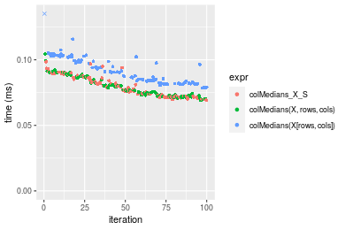

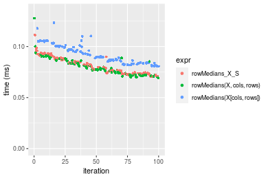
_Table: Benchmarking of colMedians_X_S() and rowMedians_X_S() on integer+100x100 data (original and transposed).  The top panel shows times in milliseconds and the bottom panel shows relative times._


|   |expr           |    min|     lq|     mean|  median|     uq|     max|
|:--|:--------------|------:|------:|--------:|-------:|------:|-------:|
|1  |colMedians_X_S | 69.252| 71.934| 79.73608| 78.6610| 86.732|  98.567|
|2  |rowMedians_X_S | 70.610| 73.540| 81.20607| 79.6825| 88.281| 111.361|


|   |expr           |     min|       lq|     mean|   median|      uq|    max|
|:--|:--------------|-------:|--------:|--------:|--------:|-------:|------:|
|1  |colMedians_X_S | 1.00000| 1.000000| 1.000000| 1.000000| 1.00000| 1.0000|
|2  |rowMedians_X_S | 1.01961| 1.022326| 1.018436| 1.012986| 1.01786| 1.1298|

_Figure: Benchmarking of colMedians_X_S() and rowMedians_X_S() on integer+100x100 data (original and transposed).  Outliers are displayed as crosses. Times are in milliseconds._


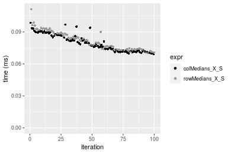

#### 1000x10 integer matrix


```r
> X <- data[["1000x10"]]
> rows <- sample.int(nrow(X), size = nrow(X) * 0.7)
> cols <- sample.int(ncol(X), size = ncol(X) * 0.7)
> X_S <- X[rows, cols]
> gc()
          used  (Mb) gc trigger  (Mb) max used  (Mb)
Ncells 5238531 279.8    8529671 455.6  8529671 455.6
Vcells 9768787  74.6   31876688 243.2 60562128 462.1
> colStats <- microbenchmark(colMedians_X_S = colMedians(X_S, na.rm = FALSE), `colMedians(X, rows, cols)` = colMedians(X, 
+     rows = rows, cols = cols, na.rm = FALSE), `colMedians(X[rows, cols])` = colMedians(X[rows, cols], 
+     na.rm = FALSE), unit = "ms")
> X <- t(X)
> X_S <- t(X_S)
> gc()
          used  (Mb) gc trigger  (Mb) max used  (Mb)
Ncells 5238507 279.8    8529671 455.6  8529671 455.6
Vcells 9773840  74.6   31876688 243.2 60562128 462.1
> rowStats <- microbenchmark(rowMedians_X_S = rowMedians(X_S, na.rm = FALSE), `rowMedians(X, cols, rows)` = rowMedians(X, 
+     rows = cols, cols = rows, na.rm = FALSE), `rowMedians(X[cols, rows])` = rowMedians(X[cols, rows], 
+     na.rm = FALSE), unit = "ms")
```

_Table: Benchmarking of colMedians_X_S(), colMedians(X, rows, cols)() and colMedians(X[rows, cols])() on integer+1000x10 data. The top panel shows times in milliseconds and the bottom panel shows relative times._


|   |expr                      |      min|        lq|      mean|    median|        uq|      max|
|:--|:-------------------------|--------:|---------:|---------:|---------:|---------:|--------:|
|1  |colMedians_X_S            | 0.054543| 0.0594295| 0.0631123| 0.0629970| 0.0673695| 0.079262|
|2  |colMedians(X, rows, cols) | 0.056625| 0.0595910| 0.0645022| 0.0632955| 0.0679385| 0.086290|
|3  |colMedians(X[rows, cols]) | 0.063995| 0.0669875| 0.0736701| 0.0727865| 0.0788835| 0.124442|


|   |expr                      |      min|       lq|     mean|   median|       uq|      max|
|:--|:-------------------------|--------:|--------:|--------:|--------:|--------:|--------:|
|1  |colMedians_X_S            | 1.000000| 1.000000| 1.000000| 1.000000| 1.000000| 1.000000|
|2  |colMedians(X, rows, cols) | 1.038172| 1.002717| 1.022022| 1.004738| 1.008446| 1.088668|
|3  |colMedians(X[rows, cols]) | 1.173294| 1.127176| 1.167285| 1.155396| 1.170908| 1.570008|

_Table: Benchmarking of rowMedians_X_S(), rowMedians(X, cols, rows)() and rowMedians(X[cols, rows])() on integer+1000x10 data (transposed). The top panel shows times in milliseconds and the bottom panel shows relative times._


|   |expr                      |      min|        lq|      mean|    median|        uq|      max|
|:--|:-------------------------|--------:|---------:|---------:|---------:|---------:|--------:|
|1  |rowMedians_X_S            | 0.056406| 0.0594995| 0.0645912| 0.0625805| 0.0684625| 0.086030|
|2  |rowMedians(X, cols, rows) | 0.057026| 0.0604740| 0.0656146| 0.0656415| 0.0696365| 0.080560|
|3  |rowMedians(X[cols, rows]) | 0.067574| 0.0716700| 0.0781866| 0.0768110| 0.0825960| 0.133214|


|   |expr                      |      min|       lq|     mean|   median|       uq|       max|
|:--|:-------------------------|--------:|--------:|--------:|--------:|--------:|---------:|
|1  |rowMedians_X_S            | 1.000000| 1.000000| 1.000000| 1.000000| 1.000000| 1.0000000|
|2  |rowMedians(X, cols, rows) | 1.010992| 1.016378| 1.015844| 1.048913| 1.017148| 0.9364175|
|3  |rowMedians(X[cols, rows]) | 1.197993| 1.204548| 1.210484| 1.227395| 1.206441| 1.5484598|

_Figure: Benchmarking of colMedians_X_S(), colMedians(X, rows, cols)() and colMedians(X[rows, cols])() on integer+1000x10 data  as well as rowMedians_X_S(), rowMedians(X, cols, rows)() and rowMedians(X[cols, rows])() on the same data transposed.  Outliers are displayed as crosses.  Times are in milliseconds._


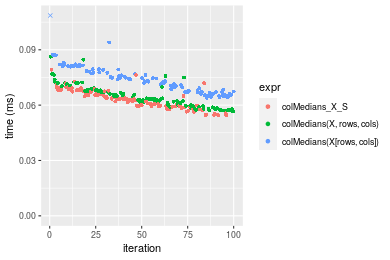

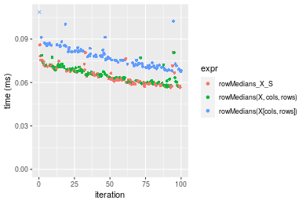
_Table: Benchmarking of colMedians_X_S() and rowMedians_X_S() on integer+1000x10 data (original and transposed).  The top panel shows times in milliseconds and the bottom panel shows relative times._


|   |expr           |    min|      lq|     mean|  median|      uq|    max|
|:--|:--------------|------:|-------:|--------:|-------:|-------:|------:|
|2  |rowMedians_X_S | 56.406| 59.4995| 64.59124| 62.5805| 68.4625| 86.030|
|1  |colMedians_X_S | 54.543| 59.4295| 63.11233| 62.9970| 67.3695| 79.262|


|   |expr           |       min|        lq|      mean|   median|        uq|       max|
|:--|:--------------|---------:|---------:|---------:|--------:|---------:|---------:|
|2  |rowMedians_X_S | 1.0000000| 1.0000000| 1.0000000| 1.000000| 1.0000000| 1.0000000|
|1  |colMedians_X_S | 0.9669716| 0.9988235| 0.9771036| 1.006655| 0.9840351| 0.9213298|

_Figure: Benchmarking of colMedians_X_S() and rowMedians_X_S() on integer+1000x10 data (original and transposed).  Outliers are displayed as crosses. Times are in milliseconds._


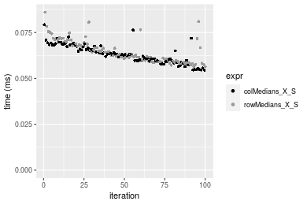

#### 10x1000 integer matrix


```r
> X <- data[["10x1000"]]
> rows <- sample.int(nrow(X), size = nrow(X) * 0.7)
> cols <- sample.int(ncol(X), size = ncol(X) * 0.7)
> X_S <- X[rows, cols]
> gc()
          used  (Mb) gc trigger  (Mb) max used  (Mb)
Ncells 5238735 279.8    8529671 455.6  8529671 455.6
Vcells 9769665  74.6   31876688 243.2 60562128 462.1
> colStats <- microbenchmark(colMedians_X_S = colMedians(X_S, na.rm = FALSE), `colMedians(X, rows, cols)` = colMedians(X, 
+     rows = rows, cols = cols, na.rm = FALSE), `colMedians(X[rows, cols])` = colMedians(X[rows, cols], 
+     na.rm = FALSE), unit = "ms")
> X <- t(X)
> X_S <- t(X_S)
> gc()
          used  (Mb) gc trigger  (Mb) max used  (Mb)
Ncells 5238711 279.8    8529671 455.6  8529671 455.6
Vcells 9774718  74.6   31876688 243.2 60562128 462.1
> rowStats <- microbenchmark(rowMedians_X_S = rowMedians(X_S, na.rm = FALSE), `rowMedians(X, cols, rows)` = rowMedians(X, 
+     rows = cols, cols = rows, na.rm = FALSE), `rowMedians(X[cols, rows])` = rowMedians(X[cols, rows], 
+     na.rm = FALSE), unit = "ms")
```

_Table: Benchmarking of colMedians_X_S(), colMedians(X, rows, cols)() and colMedians(X[rows, cols])() on integer+10x1000 data. The top panel shows times in milliseconds and the bottom panel shows relative times._


|   |expr                      |      min|        lq|      mean|    median|        uq|      max|
|:--|:-------------------------|--------:|---------:|---------:|---------:|---------:|--------:|
|1  |colMedians_X_S            | 0.057607| 0.0638645| 0.0694792| 0.0687495| 0.0734705| 0.113717|
|2  |colMedians(X, rows, cols) | 0.059817| 0.0649060| 0.0703234| 0.0692460| 0.0760760| 0.101284|
|3  |colMedians(X[rows, cols]) | 0.068616| 0.0777975| 0.0825283| 0.0823880| 0.0875695| 0.106415|


|   |expr                      |      min|       lq|     mean|   median|       uq|       max|
|:--|:-------------------------|--------:|--------:|--------:|--------:|--------:|---------:|
|1  |colMedians_X_S            | 1.000000| 1.000000| 1.000000| 1.000000| 1.000000| 1.0000000|
|2  |colMedians(X, rows, cols) | 1.038363| 1.016308| 1.012152| 1.007222| 1.035463| 0.8906672|
|3  |colMedians(X[rows, cols]) | 1.191105| 1.218165| 1.187814| 1.198380| 1.191900| 0.9357880|

_Table: Benchmarking of rowMedians_X_S(), rowMedians(X, cols, rows)() and rowMedians(X[cols, rows])() on integer+10x1000 data (transposed). The top panel shows times in milliseconds and the bottom panel shows relative times._


|   |expr                      |      min|       lq|      mean|    median|       uq|      max|
|:--|:-------------------------|--------:|--------:|---------:|---------:|--------:|--------:|
|1  |rowMedians_X_S            | 0.057861| 0.064206| 0.0689257| 0.0687080| 0.072853| 0.094408|
|2  |rowMedians(X, cols, rows) | 0.055081| 0.065515| 0.0705320| 0.0691355| 0.075734| 0.118382|
|3  |rowMedians(X[cols, rows]) | 0.065683| 0.074714| 0.0802904| 0.0796345| 0.085440| 0.104847|


|   |expr                      |       min|       lq|     mean|   median|       uq|      max|
|:--|:-------------------------|---------:|--------:|--------:|--------:|--------:|--------:|
|1  |rowMedians_X_S            | 1.0000000| 1.000000| 1.000000| 1.000000| 1.000000| 1.000000|
|2  |rowMedians(X, cols, rows) | 0.9519538| 1.020388| 1.023305| 1.006222| 1.039545| 1.253940|
|3  |rowMedians(X[cols, rows]) | 1.1351860| 1.163661| 1.164882| 1.159028| 1.172773| 1.110573|

_Figure: Benchmarking of colMedians_X_S(), colMedians(X, rows, cols)() and colMedians(X[rows, cols])() on integer+10x1000 data  as well as rowMedians_X_S(), rowMedians(X, cols, rows)() and rowMedians(X[cols, rows])() on the same data transposed.  Outliers are displayed as crosses.  Times are in milliseconds._


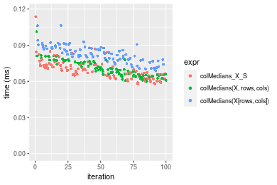

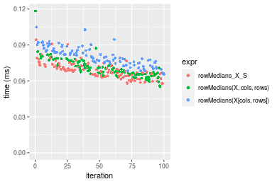
_Table: Benchmarking of colMedians_X_S() and rowMedians_X_S() on integer+10x1000 data (original and transposed).  The top panel shows times in milliseconds and the bottom panel shows relative times._


|   |expr           |    min|      lq|     mean|  median|      uq|     max|
|:--|:--------------|------:|-------:|--------:|-------:|-------:|-------:|
|2  |rowMedians_X_S | 57.861| 64.2060| 68.92574| 68.7080| 72.8530|  94.408|
|1  |colMedians_X_S | 57.607| 63.8645| 69.47915| 68.7495| 73.4705| 113.717|


|   |expr           |       min|        lq|     mean|   median|       uq|      max|
|:--|:--------------|---------:|---------:|--------:|--------:|--------:|--------:|
|2  |rowMedians_X_S | 1.0000000| 1.0000000| 1.000000| 1.000000| 1.000000| 1.000000|
|1  |colMedians_X_S | 0.9956102| 0.9946812| 1.008029| 1.000604| 1.008476| 1.204527|

_Figure: Benchmarking of colMedians_X_S() and rowMedians_X_S() on integer+10x1000 data (original and transposed).  Outliers are displayed as crosses. Times are in milliseconds._


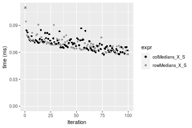

#### 100x1000 integer matrix


```r
> X <- data[["100x1000"]]
> rows <- sample.int(nrow(X), size = nrow(X) * 0.7)
> cols <- sample.int(ncol(X), size = ncol(X) * 0.7)
> X_S <- X[rows, cols]
> gc()
          used  (Mb) gc trigger  (Mb) max used  (Mb)
Ncells 5238948 279.8    8529671 455.6  8529671 455.6
Vcells 9792341  74.8   31876688 243.2 60562128 462.1
> colStats <- microbenchmark(colMedians_X_S = colMedians(X_S, na.rm = FALSE), `colMedians(X, rows, cols)` = colMedians(X, 
+     rows = rows, cols = cols, na.rm = FALSE), `colMedians(X[rows, cols])` = colMedians(X[rows, cols], 
+     na.rm = FALSE), unit = "ms")
> X <- t(X)
> X_S <- t(X_S)
> gc()
          used  (Mb) gc trigger  (Mb) max used  (Mb)
Ncells 5238924 279.8    8529671 455.6  8529671 455.6
Vcells 9842394  75.1   31876688 243.2 60562128 462.1
> rowStats <- microbenchmark(rowMedians_X_S = rowMedians(X_S, na.rm = FALSE), `rowMedians(X, cols, rows)` = rowMedians(X, 
+     rows = cols, cols = rows, na.rm = FALSE), `rowMedians(X[cols, rows])` = rowMedians(X[cols, rows], 
+     na.rm = FALSE), unit = "ms")
```

_Table: Benchmarking of colMedians_X_S(), colMedians(X, rows, cols)() and colMedians(X[rows, cols])() on integer+100x1000 data. The top panel shows times in milliseconds and the bottom panel shows relative times._


|   |expr                      |      min|        lq|      mean|    median|       uq|      max|
|:--|:-------------------------|--------:|---------:|---------:|---------:|--------:|--------:|
|2  |colMedians(X, rows, cols) | 0.635346| 0.6738715| 0.7030194| 0.6914905| 0.695738| 1.094365|
|1  |colMedians_X_S            | 0.644687| 0.6738565| 0.7190352| 0.7011530| 0.713199| 1.084984|
|3  |colMedians(X[rows, cols]) | 0.709922| 0.7313225| 0.7970094| 0.7729150| 0.795093| 1.167164|


|   |expr                      |      min|        lq|     mean|   median|       uq|       max|
|:--|:-------------------------|--------:|---------:|--------:|--------:|--------:|---------:|
|2  |colMedians(X, rows, cols) | 1.000000| 1.0000000| 1.000000| 1.000000| 1.000000| 1.0000000|
|1  |colMedians_X_S            | 1.014702| 0.9999777| 1.022782| 1.013973| 1.025097| 0.9914279|
|3  |colMedians(X[rows, cols]) | 1.117379| 1.0852551| 1.133695| 1.117752| 1.142805| 1.0665217|

_Table: Benchmarking of rowMedians_X_S(), rowMedians(X, cols, rows)() and rowMedians(X[cols, rows])() on integer+100x1000 data (transposed). The top panel shows times in milliseconds and the bottom panel shows relative times._


|   |expr                      |      min|        lq|      mean|    median|        uq|      max|
|:--|:-------------------------|--------:|---------:|---------:|---------:|---------:|--------:|
|2  |rowMedians(X, cols, rows) | 0.653285| 0.6896480| 0.7130112| 0.7085320| 0.7116845| 1.109525|
|1  |rowMedians_X_S            | 0.654745| 0.6735305| 0.7320690| 0.7105690| 0.7270165| 1.116330|
|3  |rowMedians(X[cols, rows]) | 0.718816| 0.7586375| 0.7996243| 0.7812705| 0.7928640| 1.177174|


|   |expr                      |      min|        lq|     mean|   median|       uq|      max|
|:--|:-------------------------|--------:|---------:|--------:|--------:|--------:|--------:|
|2  |rowMedians(X, cols, rows) | 1.000000| 1.0000000| 1.000000| 1.000000| 1.000000| 1.000000|
|1  |rowMedians_X_S            | 1.002235| 0.9766294| 1.026729| 1.002875| 1.021543| 1.006133|
|3  |rowMedians(X[cols, rows]) | 1.100310| 1.1000358| 1.121475| 1.102661| 1.114067| 1.060971|

_Figure: Benchmarking of colMedians_X_S(), colMedians(X, rows, cols)() and colMedians(X[rows, cols])() on integer+100x1000 data  as well as rowMedians_X_S(), rowMedians(X, cols, rows)() and rowMedians(X[cols, rows])() on the same data transposed.  Outliers are displayed as crosses.  Times are in milliseconds._


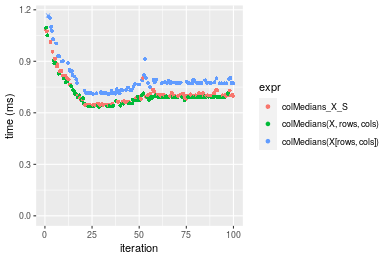

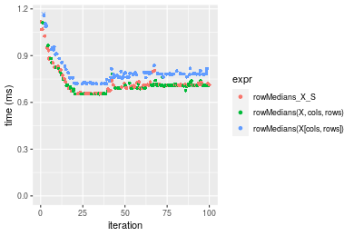
_Table: Benchmarking of colMedians_X_S() and rowMedians_X_S() on integer+100x1000 data (original and transposed).  The top panel shows times in milliseconds and the bottom panel shows relative times._


|   |expr           |     min|       lq|     mean|  median|       uq|      max|
|:--|:--------------|-------:|--------:|--------:|-------:|--------:|--------:|
|1  |colMedians_X_S | 644.687| 673.8565| 719.0353| 701.153| 713.1990| 1084.984|
|2  |rowMedians_X_S | 654.745| 673.5305| 732.0690| 710.569| 727.0165| 1116.330|


|   |expr           |      min|        lq|     mean|   median|       uq|      max|
|:--|:--------------|--------:|---------:|--------:|--------:|--------:|--------:|
|1  |colMedians_X_S | 1.000000| 1.0000000| 1.000000| 1.000000| 1.000000| 1.000000|
|2  |rowMedians_X_S | 1.015601| 0.9995162| 1.018127| 1.013429| 1.019374| 1.028891|

_Figure: Benchmarking of colMedians_X_S() and rowMedians_X_S() on integer+100x1000 data (original and transposed).  Outliers are displayed as crosses. Times are in milliseconds._


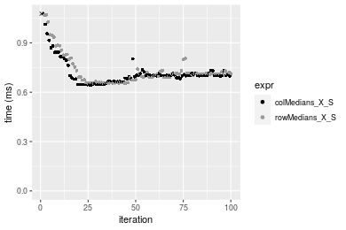

#### 1000x100 integer matrix


```r
> X <- data[["1000x100"]]
> rows <- sample.int(nrow(X), size = nrow(X) * 0.7)
> cols <- sample.int(ncol(X), size = ncol(X) * 0.7)
> X_S <- X[rows, cols]
> gc()
          used  (Mb) gc trigger  (Mb) max used  (Mb)
Ncells 5239158 279.9    8529671 455.6  8529671 455.6
Vcells 9793150  74.8   31876688 243.2 60562128 462.1
> colStats <- microbenchmark(colMedians_X_S = colMedians(X_S, na.rm = FALSE), `colMedians(X, rows, cols)` = colMedians(X, 
+     rows = rows, cols = cols, na.rm = FALSE), `colMedians(X[rows, cols])` = colMedians(X[rows, cols], 
+     na.rm = FALSE), unit = "ms")
> X <- t(X)
> X_S <- t(X_S)
> gc()
          used  (Mb) gc trigger  (Mb) max used  (Mb)
Ncells 5239134 279.8    8529671 455.6  8529671 455.6
Vcells 9843203  75.1   31876688 243.2 60562128 462.1
> rowStats <- microbenchmark(rowMedians_X_S = rowMedians(X_S, na.rm = FALSE), `rowMedians(X, cols, rows)` = rowMedians(X, 
+     rows = cols, cols = rows, na.rm = FALSE), `rowMedians(X[cols, rows])` = rowMedians(X[cols, rows], 
+     na.rm = FALSE), unit = "ms")
```

_Table: Benchmarking of colMedians_X_S(), colMedians(X, rows, cols)() and colMedians(X[rows, cols])() on integer+1000x100 data. The top panel shows times in milliseconds and the bottom panel shows relative times._


|   |expr                      |      min|        lq|      mean|    median|        uq|      max|
|:--|:-------------------------|--------:|---------:|---------:|---------:|---------:|--------:|
|2  |colMedians(X, rows, cols) | 0.542375| 0.5586685| 0.6134581| 0.5899005| 0.6108425| 0.897709|
|1  |colMedians_X_S            | 0.548545| 0.5801265| 0.6199907| 0.5974650| 0.6132550| 0.919849|
|3  |colMedians(X[rows, cols]) | 0.613835| 0.6391615| 0.6827193| 0.6663900| 0.6871140| 1.060343|


|   |expr                      |      min|       lq|     mean|   median|       uq|      max|
|:--|:-------------------------|--------:|--------:|--------:|--------:|--------:|--------:|
|2  |colMedians(X, rows, cols) | 1.000000| 1.000000| 1.000000| 1.000000| 1.000000| 1.000000|
|1  |colMedians_X_S            | 1.011376| 1.038409| 1.010649| 1.012823| 1.003950| 1.024663|
|3  |colMedians(X[rows, cols]) | 1.131754| 1.144080| 1.112903| 1.129665| 1.124863| 1.181166|

_Table: Benchmarking of rowMedians_X_S(), rowMedians(X, cols, rows)() and rowMedians(X[cols, rows])() on integer+1000x100 data (transposed). The top panel shows times in milliseconds and the bottom panel shows relative times._


|   |expr                      |      min|        lq|      mean|    median|        uq|      max|
|:--|:-------------------------|--------:|---------:|---------:|---------:|---------:|--------:|
|2  |rowMedians(X, cols, rows) | 0.562586| 0.5799270| 0.6204745| 0.6098665| 0.6151765| 0.987498|
|1  |rowMedians_X_S            | 0.563336| 0.5812390| 0.6226931| 0.6109915| 0.6181360| 0.911761|
|3  |rowMedians(X[cols, rows]) | 0.630449| 0.6649245| 0.7000485| 0.6858585| 0.6996220| 1.046044|


|   |expr                      |      min|       lq|     mean|   median|       uq|       max|
|:--|:-------------------------|--------:|--------:|--------:|--------:|--------:|---------:|
|2  |rowMedians(X, cols, rows) | 1.000000| 1.000000| 1.000000| 1.000000| 1.000000| 1.0000000|
|1  |rowMedians_X_S            | 1.001333| 1.002262| 1.003576| 1.001845| 1.004811| 0.9233041|
|3  |rowMedians(X[cols, rows]) | 1.120627| 1.146566| 1.128247| 1.124604| 1.137270| 1.0592872|

_Figure: Benchmarking of colMedians_X_S(), colMedians(X, rows, cols)() and colMedians(X[rows, cols])() on integer+1000x100 data  as well as rowMedians_X_S(), rowMedians(X, cols, rows)() and rowMedians(X[cols, rows])() on the same data transposed.  Outliers are displayed as crosses.  Times are in milliseconds._


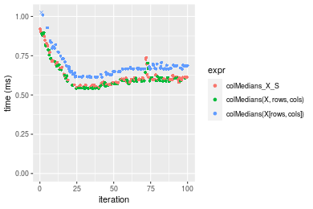

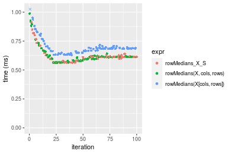
_Table: Benchmarking of colMedians_X_S() and rowMedians_X_S() on integer+1000x100 data (original and transposed).  The top panel shows times in milliseconds and the bottom panel shows relative times._


|   |expr           |     min|       lq|     mean|   median|      uq|     max|
|:--|:--------------|-------:|--------:|--------:|--------:|-------:|-------:|
|1  |colMedians_X_S | 548.545| 580.1265| 619.9907| 597.4650| 613.255| 919.849|
|2  |rowMedians_X_S | 563.336| 581.2390| 622.6931| 610.9915| 618.136| 911.761|


|   |expr           |      min|       lq|     mean|  median|       uq|       max|
|:--|:--------------|--------:|--------:|--------:|-------:|--------:|---------:|
|1  |colMedians_X_S | 1.000000| 1.000000| 1.000000| 1.00000| 1.000000| 1.0000000|
|2  |rowMedians_X_S | 1.026964| 1.001918| 1.004359| 1.02264| 1.007959| 0.9912073|

_Figure: Benchmarking of colMedians_X_S() and rowMedians_X_S() on integer+1000x100 data (original and transposed).  Outliers are displayed as crosses. Times are in milliseconds._


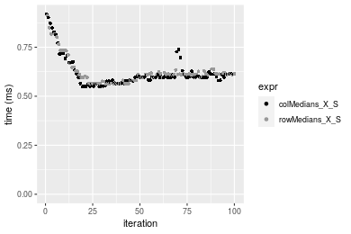


## Data type "double"

### Data
```r
> rmatrix <- function(nrow, ncol, mode = c("logical", "double", "integer", "index"), range = c(-100, 
+     +100), na_prob = 0) {
+     mode <- match.arg(mode)
+     n <- nrow * ncol
+     if (mode == "logical") {
+         x <- sample(c(FALSE, TRUE), size = n, replace = TRUE)
+     }     else if (mode == "index") {
+         x <- seq_len(n)
+         mode <- "integer"
+     }     else {
+         x <- runif(n, min = range[1], max = range[2])
+     }
+     storage.mode(x) <- mode
+     if (na_prob > 0) 
+         x[sample(n, size = na_prob * n)] <- NA
+     dim(x) <- c(nrow, ncol)
+     x
+ }
> rmatrices <- function(scale = 10, seed = 1, ...) {
+     set.seed(seed)
+     data <- list()
+     data[[1]] <- rmatrix(nrow = scale * 1, ncol = scale * 1, ...)
+     data[[2]] <- rmatrix(nrow = scale * 10, ncol = scale * 10, ...)
+     data[[3]] <- rmatrix(nrow = scale * 100, ncol = scale * 1, ...)
+     data[[4]] <- t(data[[3]])
+     data[[5]] <- rmatrix(nrow = scale * 10, ncol = scale * 100, ...)
+     data[[6]] <- t(data[[5]])
+     names(data) <- sapply(data, FUN = function(x) paste(dim(x), collapse = "x"))
+     data
+ }
> data <- rmatrices(mode = mode)
```

### Results

#### 10x10 double matrix


```r
> X <- data[["10x10"]]
> rows <- sample.int(nrow(X), size = nrow(X) * 0.7)
> cols <- sample.int(ncol(X), size = ncol(X) * 0.7)
> X_S <- X[rows, cols]
> gc()
          used  (Mb) gc trigger  (Mb) max used  (Mb)
Ncells 5239376 279.9    8529671 455.6  8529671 455.6
Vcells 9884275  75.5   31876688 243.2 60562128 462.1
> colStats <- microbenchmark(colMedians_X_S = colMedians(X_S, na.rm = FALSE), `colMedians(X, rows, cols)` = colMedians(X, 
+     rows = rows, cols = cols, na.rm = FALSE), `colMedians(X[rows, cols])` = colMedians(X[rows, cols], 
+     na.rm = FALSE), unit = "ms")
> X <- t(X)
> X_S <- t(X_S)
> gc()
          used  (Mb) gc trigger  (Mb) max used  (Mb)
Ncells 5239343 279.9    8529671 455.6  8529671 455.6
Vcells 9884413  75.5   31876688 243.2 60562128 462.1
> rowStats <- microbenchmark(rowMedians_X_S = rowMedians(X_S, na.rm = FALSE), `rowMedians(X, cols, rows)` = rowMedians(X, 
+     rows = cols, cols = rows, na.rm = FALSE), `rowMedians(X[cols, rows])` = rowMedians(X[cols, rows], 
+     na.rm = FALSE), unit = "ms")
```

_Table: Benchmarking of colMedians_X_S(), colMedians(X, rows, cols)() and colMedians(X[rows, cols])() on double+10x10 data. The top panel shows times in milliseconds and the bottom panel shows relative times._


|   |expr                      |      min|        lq|      mean|    median|       uq|      max|
|:--|:-------------------------|--------:|---------:|---------:|---------:|--------:|--------:|
|1  |colMedians_X_S            | 0.002490| 0.0025895| 0.0028466| 0.0026545| 0.002736| 0.018644|
|2  |colMedians(X, rows, cols) | 0.002917| 0.0030090| 0.0031242| 0.0030645| 0.003159| 0.005872|
|3  |colMedians(X[rows, cols]) | 0.003429| 0.0036395| 0.0038189| 0.0037195| 0.003856| 0.008036|


|   |expr                      |      min|       lq|     mean|   median|       uq|       max|
|:--|:-------------------------|--------:|--------:|--------:|--------:|--------:|---------:|
|1  |colMedians_X_S            | 1.000000| 1.000000| 1.000000| 1.000000| 1.000000| 1.0000000|
|2  |colMedians(X, rows, cols) | 1.171486| 1.162000| 1.097493| 1.154455| 1.154605| 0.3149539|
|3  |colMedians(X[rows, cols]) | 1.377108| 1.405484| 1.341542| 1.401206| 1.409357| 0.4310234|

_Table: Benchmarking of rowMedians_X_S(), rowMedians(X, cols, rows)() and rowMedians(X[cols, rows])() on double+10x10 data (transposed). The top panel shows times in milliseconds and the bottom panel shows relative times._


|   |expr                      |      min|        lq|      mean|    median|        uq|      max|
|:--|:-------------------------|--------:|---------:|---------:|---------:|---------:|--------:|
|1  |rowMedians_X_S            | 0.002556| 0.0025905| 0.0027087| 0.0026310| 0.0027155| 0.005601|
|2  |rowMedians(X, cols, rows) | 0.002897| 0.0030335| 0.0033404| 0.0031045| 0.0032295| 0.021598|
|3  |rowMedians(X[cols, rows]) | 0.003444| 0.0036960| 0.0038254| 0.0037505| 0.0038540| 0.006482|


|   |expr                      |      min|       lq|     mean|   median|       uq|      max|
|:--|:-------------------------|--------:|--------:|--------:|--------:|--------:|--------:|
|1  |rowMedians_X_S            | 1.000000| 1.000000| 1.000000| 1.000000| 1.000000| 1.000000|
|2  |rowMedians(X, cols, rows) | 1.133412| 1.171010| 1.233222| 1.179970| 1.189284| 3.856097|
|3  |rowMedians(X[cols, rows]) | 1.347418| 1.426752| 1.412292| 1.425504| 1.419260| 1.157293|

_Figure: Benchmarking of colMedians_X_S(), colMedians(X, rows, cols)() and colMedians(X[rows, cols])() on double+10x10 data  as well as rowMedians_X_S(), rowMedians(X, cols, rows)() and rowMedians(X[cols, rows])() on the same data transposed.  Outliers are displayed as crosses.  Times are in milliseconds._


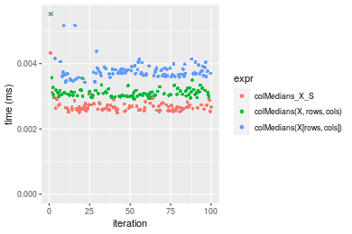

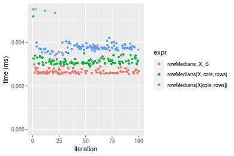
_Table: Benchmarking of colMedians_X_S() and rowMedians_X_S() on double+10x10 data (original and transposed).  The top panel shows times in milliseconds and the bottom panel shows relative times._


|   |expr           |   min|     lq|    mean| median|     uq|    max|
|:--|:--------------|-----:|------:|-------:|------:|------:|------:|
|2  |rowMedians_X_S | 2.556| 2.5905| 2.70866| 2.6310| 2.7155|  5.601|
|1  |colMedians_X_S | 2.490| 2.5895| 2.84665| 2.6545| 2.7360| 18.644|


|   |expr           |       min|       lq|     mean|   median|       uq|      max|
|:--|:--------------|---------:|--------:|--------:|--------:|--------:|--------:|
|2  |rowMedians_X_S | 1.0000000| 1.000000| 1.000000| 1.000000| 1.000000| 1.000000|
|1  |colMedians_X_S | 0.9741784| 0.999614| 1.050944| 1.008932| 1.007549| 3.328691|

_Figure: Benchmarking of colMedians_X_S() and rowMedians_X_S() on double+10x10 data (original and transposed).  Outliers are displayed as crosses. Times are in milliseconds._


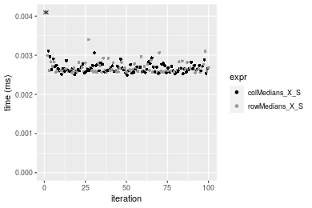

#### 100x100 double matrix


```r
> X <- data[["100x100"]]
> rows <- sample.int(nrow(X), size = nrow(X) * 0.7)
> cols <- sample.int(ncol(X), size = ncol(X) * 0.7)
> X_S <- X[rows, cols]
> gc()
          used  (Mb) gc trigger  (Mb) max used  (Mb)
Ncells 5239574 279.9    8529671 455.6  8529671 455.6
Vcells 9890242  75.5   31876688 243.2 60562128 462.1
> colStats <- microbenchmark(colMedians_X_S = colMedians(X_S, na.rm = FALSE), `colMedians(X, rows, cols)` = colMedians(X, 
+     rows = rows, cols = cols, na.rm = FALSE), `colMedians(X[rows, cols])` = colMedians(X[rows, cols], 
+     na.rm = FALSE), unit = "ms")
> X <- t(X)
> X_S <- t(X_S)
> gc()
          used  (Mb) gc trigger  (Mb) max used  (Mb)
Ncells 5239550 279.9    8529671 455.6  8529671 455.6
Vcells 9900295  75.6   31876688 243.2 60562128 462.1
> rowStats <- microbenchmark(rowMedians_X_S = rowMedians(X_S, na.rm = FALSE), `rowMedians(X, cols, rows)` = rowMedians(X, 
+     rows = cols, cols = rows, na.rm = FALSE), `rowMedians(X[cols, rows])` = rowMedians(X[cols, rows], 
+     na.rm = FALSE), unit = "ms")
```

_Table: Benchmarking of colMedians_X_S(), colMedians(X, rows, cols)() and colMedians(X[rows, cols])() on double+100x100 data. The top panel shows times in milliseconds and the bottom panel shows relative times._


|   |expr                      |      min|        lq|      mean|    median|        uq|      max|
|:--|:-------------------------|--------:|---------:|---------:|---------:|---------:|--------:|
|2  |colMedians(X, rows, cols) | 0.101925| 0.1117655| 0.1212787| 0.1171620| 0.1295415| 0.151337|
|1  |colMedians_X_S            | 0.103978| 0.1112645| 0.1234687| 0.1188605| 0.1317415| 0.161438|
|3  |colMedians(X[rows, cols]) | 0.115783| 0.1256555| 0.1383609| 0.1321245| 0.1517625| 0.198398|


|   |expr                      |      min|        lq|     mean|   median|       uq|      max|
|:--|:-------------------------|--------:|---------:|--------:|--------:|--------:|--------:|
|2  |colMedians(X, rows, cols) | 1.000000| 1.0000000| 1.000000| 1.000000| 1.000000| 1.000000|
|1  |colMedians_X_S            | 1.020142| 0.9955174| 1.018057| 1.014497| 1.016983| 1.066745|
|3  |colMedians(X[rows, cols]) | 1.135963| 1.1242781| 1.140851| 1.127708| 1.171536| 1.310968|

_Table: Benchmarking of rowMedians_X_S(), rowMedians(X, cols, rows)() and rowMedians(X[cols, rows])() on double+100x100 data (transposed). The top panel shows times in milliseconds and the bottom panel shows relative times._


|   |expr                      |      min|        lq|      mean|    median|        uq|      max|
|:--|:-------------------------|--------:|---------:|---------:|---------:|---------:|--------:|
|2  |rowMedians(X, cols, rows) | 0.100047| 0.1098685| 0.1210682| 0.1172750| 0.1301320| 0.174698|
|1  |rowMedians_X_S            | 0.100199| 0.1109900| 0.1219336| 0.1179545| 0.1356425| 0.157060|
|3  |rowMedians(X[cols, rows]) | 0.112576| 0.1235160| 0.1345665| 0.1313620| 0.1411585| 0.173878|


|   |expr                      |      min|       lq|     mean|   median|       uq|       max|
|:--|:-------------------------|--------:|--------:|--------:|--------:|--------:|---------:|
|2  |rowMedians(X, cols, rows) | 1.000000| 1.000000| 1.000000| 1.000000| 1.000000| 1.0000000|
|1  |rowMedians_X_S            | 1.001519| 1.010208| 1.007148| 1.005794| 1.042345| 0.8990372|
|3  |rowMedians(X[cols, rows]) | 1.125231| 1.124217| 1.111493| 1.120119| 1.084733| 0.9953062|

_Figure: Benchmarking of colMedians_X_S(), colMedians(X, rows, cols)() and colMedians(X[rows, cols])() on double+100x100 data  as well as rowMedians_X_S(), rowMedians(X, cols, rows)() and rowMedians(X[cols, rows])() on the same data transposed.  Outliers are displayed as crosses.  Times are in milliseconds._


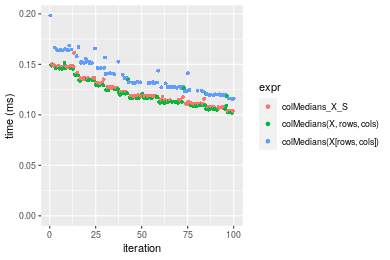

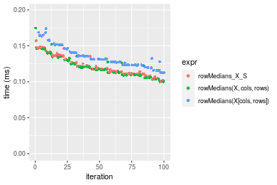
_Table: Benchmarking of colMedians_X_S() and rowMedians_X_S() on double+100x100 data (original and transposed).  The top panel shows times in milliseconds and the bottom panel shows relative times._


|   |expr           |     min|       lq|     mean|   median|       uq|     max|
|:--|:--------------|-------:|--------:|--------:|--------:|--------:|-------:|
|2  |rowMedians_X_S | 100.199| 110.9900| 121.9335| 117.9545| 135.6425| 157.060|
|1  |colMedians_X_S | 103.978| 111.2645| 123.4687| 118.8605| 131.7415| 161.438|


|   |expr           |      min|       lq|    mean|   median|        uq|      max|
|:--|:--------------|--------:|--------:|-------:|--------:|---------:|--------:|
|2  |rowMedians_X_S | 1.000000| 1.000000| 1.00000| 1.000000| 1.0000000| 1.000000|
|1  |colMedians_X_S | 1.037715| 1.002473| 1.01259| 1.007681| 0.9712406| 1.027875|

_Figure: Benchmarking of colMedians_X_S() and rowMedians_X_S() on double+100x100 data (original and transposed).  Outliers are displayed as crosses. Times are in milliseconds._


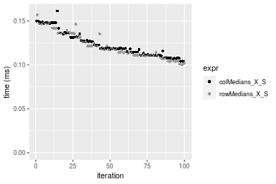

#### 1000x10 double matrix


```r
> X <- data[["1000x10"]]
> rows <- sample.int(nrow(X), size = nrow(X) * 0.7)
> cols <- sample.int(ncol(X), size = ncol(X) * 0.7)
> X_S <- X[rows, cols]
> gc()
          used  (Mb) gc trigger  (Mb) max used  (Mb)
Ncells 5239773 279.9    8529671 455.6  8529671 455.6
Vcells 9891676  75.5   31876688 243.2 60562128 462.1
> colStats <- microbenchmark(colMedians_X_S = colMedians(X_S, na.rm = FALSE), `colMedians(X, rows, cols)` = colMedians(X, 
+     rows = rows, cols = cols, na.rm = FALSE), `colMedians(X[rows, cols])` = colMedians(X[rows, cols], 
+     na.rm = FALSE), unit = "ms")
> X <- t(X)
> X_S <- t(X_S)
> gc()
          used  (Mb) gc trigger  (Mb) max used  (Mb)
Ncells 5239749 279.9    8529671 455.6  8529671 455.6
Vcells 9901729  75.6   31876688 243.2 60562128 462.1
> rowStats <- microbenchmark(rowMedians_X_S = rowMedians(X_S, na.rm = FALSE), `rowMedians(X, cols, rows)` = rowMedians(X, 
+     rows = cols, cols = rows, na.rm = FALSE), `rowMedians(X[cols, rows])` = rowMedians(X[cols, rows], 
+     na.rm = FALSE), unit = "ms")
```

_Table: Benchmarking of colMedians_X_S(), colMedians(X, rows, cols)() and colMedians(X[rows, cols])() on double+1000x10 data. The top panel shows times in milliseconds and the bottom panel shows relative times._


|   |expr                      |      min|        lq|      mean|    median|        uq|      max|
|:--|:-------------------------|--------:|---------:|---------:|---------:|---------:|--------:|
|2  |colMedians(X, rows, cols) | 0.104012| 0.1111355| 0.1220537| 0.1161530| 0.1321765| 0.155425|
|1  |colMedians_X_S            | 0.103607| 0.1135510| 0.1246139| 0.1190045| 0.1382310| 0.170538|
|3  |colMedians(X[rows, cols]) | 0.115903| 0.1236835| 0.1368437| 0.1283180| 0.1482930| 0.196038|


|   |expr                      |       min|       lq|     mean|   median|       uq|      max|
|:--|:-------------------------|---------:|--------:|--------:|--------:|--------:|--------:|
|2  |colMedians(X, rows, cols) | 1.0000000| 1.000000| 1.000000| 1.000000| 1.000000| 1.000000|
|1  |colMedians_X_S            | 0.9961062| 1.021735| 1.020976| 1.024550| 1.045806| 1.097237|
|3  |colMedians(X[rows, cols]) | 1.1143233| 1.112907| 1.121176| 1.104733| 1.121932| 1.261303|

_Table: Benchmarking of rowMedians_X_S(), rowMedians(X, cols, rows)() and rowMedians(X[cols, rows])() on double+1000x10 data (transposed). The top panel shows times in milliseconds and the bottom panel shows relative times._


|   |expr                      |      min|        lq|      mean|    median|        uq|      max|
|:--|:-------------------------|--------:|---------:|---------:|---------:|---------:|--------:|
|1  |rowMedians_X_S            | 0.100210| 0.1097955| 0.1186854| 0.1135725| 0.1251785| 0.184877|
|2  |rowMedians(X, cols, rows) | 0.101310| 0.1083490| 0.1209355| 0.1163735| 0.1318075| 0.156862|
|3  |rowMedians(X[cols, rows]) | 0.114796| 0.1225060| 0.1361408| 0.1302300| 0.1452115| 0.213212|


|   |expr                      |      min|        lq|     mean|   median|       uq|       max|
|:--|:-------------------------|--------:|---------:|--------:|--------:|--------:|---------:|
|1  |rowMedians_X_S            | 1.000000| 1.0000000| 1.000000| 1.000000| 1.000000| 1.0000000|
|2  |rowMedians(X, cols, rows) | 1.010977| 0.9868255| 1.018959| 1.024663| 1.052956| 0.8484668|
|3  |rowMedians(X[cols, rows]) | 1.145554| 1.1157652| 1.147073| 1.146668| 1.160035| 1.1532641|

_Figure: Benchmarking of colMedians_X_S(), colMedians(X, rows, cols)() and colMedians(X[rows, cols])() on double+1000x10 data  as well as rowMedians_X_S(), rowMedians(X, cols, rows)() and rowMedians(X[cols, rows])() on the same data transposed.  Outliers are displayed as crosses.  Times are in milliseconds._


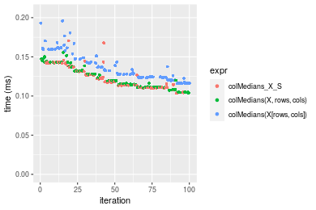

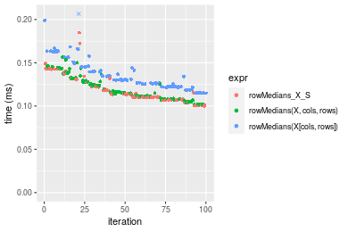
_Table: Benchmarking of colMedians_X_S() and rowMedians_X_S() on double+1000x10 data (original and transposed).  The top panel shows times in milliseconds and the bottom panel shows relative times._


|   |expr           |     min|       lq|     mean|   median|       uq|     max|
|:--|:--------------|-------:|--------:|--------:|--------:|--------:|-------:|
|2  |rowMedians_X_S | 100.210| 109.7955| 118.6854| 113.5725| 125.1785| 184.877|
|1  |colMedians_X_S | 103.607| 113.5510| 124.6139| 119.0045| 138.2310| 170.538|


|   |expr           |      min|       lq|     mean|   median|       uq|       max|
|:--|:--------------|--------:|--------:|--------:|--------:|--------:|---------:|
|2  |rowMedians_X_S | 1.000000| 1.000000| 1.000000| 1.000000| 1.000000| 1.0000000|
|1  |colMedians_X_S | 1.033899| 1.034204| 1.049952| 1.047829| 1.104271| 0.9224403|

_Figure: Benchmarking of colMedians_X_S() and rowMedians_X_S() on double+1000x10 data (original and transposed).  Outliers are displayed as crosses. Times are in milliseconds._


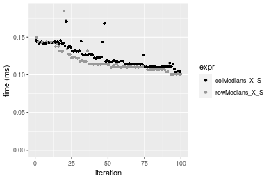

#### 10x1000 double matrix


```r
> X <- data[["10x1000"]]
> rows <- sample.int(nrow(X), size = nrow(X) * 0.7)
> cols <- sample.int(ncol(X), size = ncol(X) * 0.7)
> X_S <- X[rows, cols]
> gc()
          used  (Mb) gc trigger  (Mb) max used  (Mb)
Ncells 5239977 279.9    8529671 455.6  8529671 455.6
Vcells 9891811  75.5   31876688 243.2 60562128 462.1
> colStats <- microbenchmark(colMedians_X_S = colMedians(X_S, na.rm = FALSE), `colMedians(X, rows, cols)` = colMedians(X, 
+     rows = rows, cols = cols, na.rm = FALSE), `colMedians(X[rows, cols])` = colMedians(X[rows, cols], 
+     na.rm = FALSE), unit = "ms")
> X <- t(X)
> X_S <- t(X_S)
> gc()
          used  (Mb) gc trigger  (Mb) max used  (Mb)
Ncells 5239953 279.9    8529671 455.6  8529671 455.6
Vcells 9901864  75.6   31876688 243.2 60562128 462.1
> rowStats <- microbenchmark(rowMedians_X_S = rowMedians(X_S, na.rm = FALSE), `rowMedians(X, cols, rows)` = rowMedians(X, 
+     rows = cols, cols = rows, na.rm = FALSE), `rowMedians(X[cols, rows])` = rowMedians(X[cols, rows], 
+     na.rm = FALSE), unit = "ms")
```

_Table: Benchmarking of colMedians_X_S(), colMedians(X, rows, cols)() and colMedians(X[rows, cols])() on double+10x1000 data. The top panel shows times in milliseconds and the bottom panel shows relative times._


|   |expr                      |      min|      lq|      mean|    median|        uq|      max|
|:--|:-------------------------|--------:|-------:|---------:|---------:|---------:|--------:|
|2  |colMedians(X, rows, cols) | 0.088462| 0.09563| 0.1030767| 0.0992875| 0.1069560| 0.147320|
|1  |colMedians_X_S            | 0.090052| 0.09560| 0.1060133| 0.1038405| 0.1167395| 0.147353|
|3  |colMedians(X[rows, cols]) | 0.105745| 0.11218| 0.1228702| 0.1206255| 0.1320260| 0.153536|


|   |expr                      |      min|        lq|     mean|   median|       uq|      max|
|:--|:-------------------------|--------:|---------:|--------:|--------:|--------:|--------:|
|2  |colMedians(X, rows, cols) | 1.000000| 1.0000000| 1.000000| 1.000000| 1.000000| 1.000000|
|1  |colMedians_X_S            | 1.017974| 0.9996863| 1.028489| 1.045857| 1.091472| 1.000224|
|3  |colMedians(X[rows, cols]) | 1.195372| 1.1730628| 1.192027| 1.214911| 1.234395| 1.042194|

_Table: Benchmarking of rowMedians_X_S(), rowMedians(X, cols, rows)() and rowMedians(X[cols, rows])() on double+10x1000 data (transposed). The top panel shows times in milliseconds and the bottom panel shows relative times._


|   |expr                      |      min|        lq|      mean|    median|        uq|      max|
|:--|:-------------------------|--------:|---------:|---------:|---------:|---------:|--------:|
|2  |rowMedians(X, cols, rows) | 0.088831| 0.0944575| 0.1032622| 0.0994000| 0.1096750| 0.155342|
|1  |rowMedians_X_S            | 0.089726| 0.0944270| 0.1036007| 0.0997180| 0.1111390| 0.129735|
|3  |rowMedians(X[cols, rows]) | 0.102564| 0.1072990| 0.1181547| 0.1148835| 0.1272235| 0.144642|


|   |expr                      |      min|        lq|     mean|   median|       uq|       max|
|:--|:-------------------------|--------:|---------:|--------:|--------:|--------:|---------:|
|2  |rowMedians(X, cols, rows) | 1.000000| 1.0000000| 1.000000| 1.000000| 1.000000| 1.0000000|
|1  |rowMedians_X_S            | 1.010075| 0.9996771| 1.003278| 1.003199| 1.013348| 0.8351573|
|3  |rowMedians(X[cols, rows]) | 1.154597| 1.1359500| 1.144220| 1.155770| 1.160005| 0.9311197|

_Figure: Benchmarking of colMedians_X_S(), colMedians(X, rows, cols)() and colMedians(X[rows, cols])() on double+10x1000 data  as well as rowMedians_X_S(), rowMedians(X, cols, rows)() and rowMedians(X[cols, rows])() on the same data transposed.  Outliers are displayed as crosses.  Times are in milliseconds._


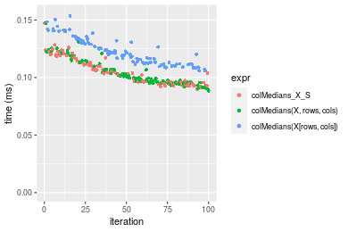

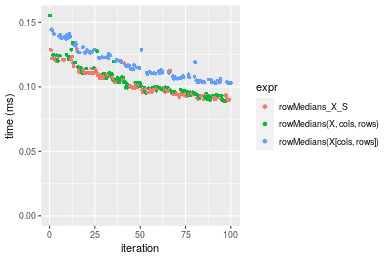
_Table: Benchmarking of colMedians_X_S() and rowMedians_X_S() on double+10x1000 data (original and transposed).  The top panel shows times in milliseconds and the bottom panel shows relative times._


|   |expr           |    min|     lq|     mean|   median|       uq|     max|
|:--|:--------------|------:|------:|--------:|--------:|--------:|-------:|
|2  |rowMedians_X_S | 89.726| 94.427| 103.6007|  99.7180| 111.1390| 129.735|
|1  |colMedians_X_S | 90.052| 95.600| 106.0133| 103.8405| 116.7395| 147.353|


|   |expr           |      min|       lq|     mean|   median|       uq|    max|
|:--|:--------------|--------:|--------:|--------:|--------:|--------:|------:|
|2  |rowMedians_X_S | 1.000000| 1.000000| 1.000000| 1.000000| 1.000000| 1.0000|
|1  |colMedians_X_S | 1.003633| 1.012422| 1.023287| 1.041342| 1.050392| 1.1358|

_Figure: Benchmarking of colMedians_X_S() and rowMedians_X_S() on double+10x1000 data (original and transposed).  Outliers are displayed as crosses. Times are in milliseconds._


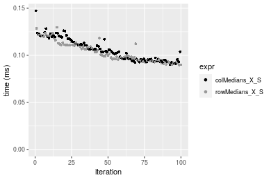

#### 100x1000 double matrix


```r
> X <- data[["100x1000"]]
> rows <- sample.int(nrow(X), size = nrow(X) * 0.7)
> cols <- sample.int(ncol(X), size = ncol(X) * 0.7)
> X_S <- X[rows, cols]
> gc()
          used  (Mb) gc trigger  (Mb) max used  (Mb)
Ncells 5240190 279.9    8529671 455.6  8529671 455.6
Vcells 9937299  75.9   31876688 243.2 60562128 462.1
> colStats <- microbenchmark(colMedians_X_S = colMedians(X_S, na.rm = FALSE), `colMedians(X, rows, cols)` = colMedians(X, 
+     rows = rows, cols = cols, na.rm = FALSE), `colMedians(X[rows, cols])` = colMedians(X[rows, cols], 
+     na.rm = FALSE), unit = "ms")
> X <- t(X)
> X_S <- t(X_S)
> gc()
           used  (Mb) gc trigger  (Mb) max used  (Mb)
Ncells  5240166 279.9    8529671 455.6  8529671 455.6
Vcells 10037352  76.6   31876688 243.2 60562128 462.1
> rowStats <- microbenchmark(rowMedians_X_S = rowMedians(X_S, na.rm = FALSE), `rowMedians(X, cols, rows)` = rowMedians(X, 
+     rows = cols, cols = rows, na.rm = FALSE), `rowMedians(X[cols, rows])` = rowMedians(X[cols, rows], 
+     na.rm = FALSE), unit = "ms")
```

_Table: Benchmarking of colMedians_X_S(), colMedians(X, rows, cols)() and colMedians(X[rows, cols])() on double+100x1000 data. The top panel shows times in milliseconds and the bottom panel shows relative times._


|   |expr                      |      min|       lq|     mean|   median|       uq|      max|
|:--|:-------------------------|--------:|--------:|--------:|--------:|--------:|--------:|
|2  |colMedians(X, rows, cols) | 0.921789| 0.979211| 1.010901| 1.002326| 1.012625| 1.589265|
|1  |colMedians_X_S            | 0.938714| 0.997927| 1.037205| 1.022477| 1.028766| 1.570415|
|3  |colMedians(X[rows, cols]) | 1.036626| 1.099875| 1.152640| 1.126634| 1.149837| 1.637606|


|   |expr                      |      min|       lq|     mean|   median|       uq|       max|
|:--|:-------------------------|--------:|--------:|--------:|--------:|--------:|---------:|
|2  |colMedians(X, rows, cols) | 1.000000| 1.000000| 1.000000| 1.000000| 1.000000| 1.0000000|
|1  |colMedians_X_S            | 1.018361| 1.019113| 1.026020| 1.020104| 1.015940| 0.9881392|
|3  |colMedians(X[rows, cols]) | 1.124581| 1.123225| 1.140211| 1.124019| 1.135502| 1.0304172|

_Table: Benchmarking of rowMedians_X_S(), rowMedians(X, cols, rows)() and rowMedians(X[cols, rows])() on double+100x1000 data (transposed). The top panel shows times in milliseconds and the bottom panel shows relative times._


|   |expr                      |      min|       lq|     mean|   median|       uq|      max|
|:--|:-------------------------|--------:|--------:|--------:|--------:|--------:|--------:|
|1  |rowMedians_X_S            | 0.940216| 0.994695| 1.049102| 1.020496| 1.036348| 1.649330|
|2  |rowMedians(X, cols, rows) | 0.946835| 1.002986| 1.032128| 1.028485| 1.034212| 1.581807|
|3  |rowMedians(X[cols, rows]) | 1.042311| 1.109849| 1.161684| 1.131268| 1.153399| 1.743448|


|   |expr                      |      min|       lq|      mean|   median|        uq|       max|
|:--|:-------------------------|--------:|--------:|---------:|--------:|---------:|---------:|
|1  |rowMedians_X_S            | 1.000000| 1.000000| 1.0000000| 1.000000| 1.0000000| 1.0000000|
|2  |rowMedians(X, cols, rows) | 1.007040| 1.008335| 0.9838207| 1.007828| 0.9979389| 0.9590603|
|3  |rowMedians(X[cols, rows]) | 1.108587| 1.115768| 1.1073129| 1.108546| 1.1129456| 1.0570644|

_Figure: Benchmarking of colMedians_X_S(), colMedians(X, rows, cols)() and colMedians(X[rows, cols])() on double+100x1000 data  as well as rowMedians_X_S(), rowMedians(X, cols, rows)() and rowMedians(X[cols, rows])() on the same data transposed.  Outliers are displayed as crosses.  Times are in milliseconds._


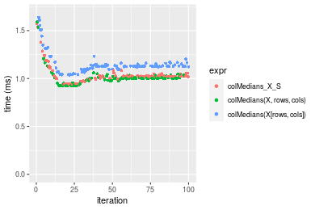

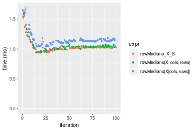
_Table: Benchmarking of colMedians_X_S() and rowMedians_X_S() on double+100x1000 data (original and transposed).  The top panel shows times in milliseconds and the bottom panel shows relative times._


|   |expr           |     min|      lq|     mean|   median|       uq|      max|
|:--|:--------------|-------:|-------:|--------:|--------:|--------:|--------:|
|2  |rowMedians_X_S | 940.216| 994.695| 1049.102| 1020.496| 1036.349| 1649.330|
|1  |colMedians_X_S | 938.714| 997.927| 1037.205| 1022.477| 1028.766| 1570.415|


|   |expr           |       min|       lq|    mean|   median|        uq|       max|
|:--|:--------------|---------:|--------:|-------:|--------:|---------:|---------:|
|2  |rowMedians_X_S | 1.0000000| 1.000000| 1.00000| 1.000000| 1.0000000| 1.0000000|
|1  |colMedians_X_S | 0.9984025| 1.003249| 0.98866| 1.001941| 0.9926834| 0.9521533|

_Figure: Benchmarking of colMedians_X_S() and rowMedians_X_S() on double+100x1000 data (original and transposed).  Outliers are displayed as crosses. Times are in milliseconds._


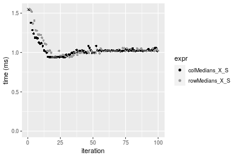

#### 1000x100 double matrix


```r
> X <- data[["1000x100"]]
> rows <- sample.int(nrow(X), size = nrow(X) * 0.7)
> cols <- sample.int(ncol(X), size = ncol(X) * 0.7)
> X_S <- X[rows, cols]
> gc()
          used  (Mb) gc trigger  (Mb) max used  (Mb)
Ncells 5240400 279.9    8529671 455.6  8529671 455.6
Vcells 9937440  75.9   31876688 243.2 60562128 462.1
> colStats <- microbenchmark(colMedians_X_S = colMedians(X_S, na.rm = FALSE), `colMedians(X, rows, cols)` = colMedians(X, 
+     rows = rows, cols = cols, na.rm = FALSE), `colMedians(X[rows, cols])` = colMedians(X[rows, cols], 
+     na.rm = FALSE), unit = "ms")
> X <- t(X)
> X_S <- t(X_S)
> gc()
           used  (Mb) gc trigger  (Mb) max used  (Mb)
Ncells  5240376 279.9    8529671 455.6  8529671 455.6
Vcells 10037493  76.6   31876688 243.2 60562128 462.1
> rowStats <- microbenchmark(rowMedians_X_S = rowMedians(X_S, na.rm = FALSE), `rowMedians(X, cols, rows)` = rowMedians(X, 
+     rows = cols, cols = rows, na.rm = FALSE), `rowMedians(X[cols, rows])` = rowMedians(X[cols, rows], 
+     na.rm = FALSE), unit = "ms")
```

_Table: Benchmarking of colMedians_X_S(), colMedians(X, rows, cols)() and colMedians(X[rows, cols])() on double+1000x100 data. The top panel shows times in milliseconds and the bottom panel shows relative times._


|   |expr                      |      min|        lq|      mean|   median|       uq|      max|
|:--|:-------------------------|--------:|---------:|---------:|--------:|--------:|--------:|
|2  |colMedians(X, rows, cols) | 0.845679| 0.8987655| 0.9485350| 0.920911| 0.946645| 1.420834|
|1  |colMedians_X_S            | 0.865912| 0.9361000| 0.9665304| 0.940565| 0.965938| 1.436688|
|3  |colMedians(X[rows, cols]) | 0.957878| 1.0109785| 1.0527629| 1.040747| 1.069799| 1.683818|


|   |expr                      |      min|       lq|     mean|   median|       uq|      max|
|:--|:-------------------------|--------:|--------:|--------:|--------:|--------:|--------:|
|2  |colMedians(X, rows, cols) | 1.000000| 1.000000| 1.000000| 1.000000| 1.000000| 1.000000|
|1  |colMedians_X_S            | 1.023925| 1.041540| 1.018972| 1.021342| 1.020380| 1.011158|
|3  |colMedians(X[rows, cols]) | 1.132673| 1.124852| 1.109883| 1.130128| 1.130095| 1.185091|

_Table: Benchmarking of rowMedians_X_S(), rowMedians(X, cols, rows)() and rowMedians(X[cols, rows])() on double+1000x100 data (transposed). The top panel shows times in milliseconds and the bottom panel shows relative times._


|   |expr                      |      min|        lq|      mean|    median|        uq|      max|
|:--|:-------------------------|--------:|---------:|---------:|---------:|---------:|--------:|
|1  |rowMedians_X_S            | 0.862445| 0.9155875| 0.9573673| 0.9401565| 0.9662345| 1.345372|
|2  |rowMedians(X, cols, rows) | 0.874553| 0.9244920| 0.9689037| 0.9509190| 0.9777455| 1.561815|
|3  |rowMedians(X[cols, rows]) | 0.959739| 1.0286375| 1.0703545| 1.0536875| 1.0793480| 1.603569|


|   |expr                      |      min|       lq|     mean|   median|       uq|      max|
|:--|:-------------------------|--------:|--------:|--------:|--------:|--------:|--------:|
|1  |rowMedians_X_S            | 1.000000| 1.000000| 1.000000| 1.000000| 1.000000| 1.000000|
|2  |rowMedians(X, cols, rows) | 1.014039| 1.009725| 1.012050| 1.011448| 1.011913| 1.160880|
|3  |rowMedians(X[cols, rows]) | 1.112812| 1.123473| 1.118019| 1.120758| 1.117066| 1.191915|

_Figure: Benchmarking of colMedians_X_S(), colMedians(X, rows, cols)() and colMedians(X[rows, cols])() on double+1000x100 data  as well as rowMedians_X_S(), rowMedians(X, cols, rows)() and rowMedians(X[cols, rows])() on the same data transposed.  Outliers are displayed as crosses.  Times are in milliseconds._


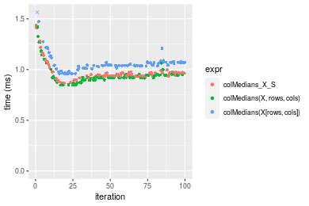

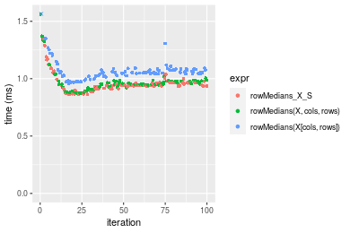
_Table: Benchmarking of colMedians_X_S() and rowMedians_X_S() on double+1000x100 data (original and transposed).  The top panel shows times in milliseconds and the bottom panel shows relative times._


|   |expr           |     min|       lq|     mean|   median|       uq|      max|
|:--|:--------------|-------:|--------:|--------:|--------:|--------:|--------:|
|2  |rowMedians_X_S | 862.445| 915.5875| 957.3673| 940.1565| 966.2345| 1345.372|
|1  |colMedians_X_S | 865.912| 936.1000| 966.5304| 940.5650| 965.9380| 1436.688|


|   |expr           |     min|       lq|     mean|   median|        uq|      max|
|:--|:--------------|-------:|--------:|--------:|--------:|---------:|--------:|
|2  |rowMedians_X_S | 1.00000| 1.000000| 1.000000| 1.000000| 1.0000000| 1.000000|
|1  |colMedians_X_S | 1.00402| 1.022404| 1.009571| 1.000434| 0.9996931| 1.067874|

_Figure: Benchmarking of colMedians_X_S() and rowMedians_X_S() on double+1000x100 data (original and transposed).  Outliers are displayed as crosses. Times are in milliseconds._


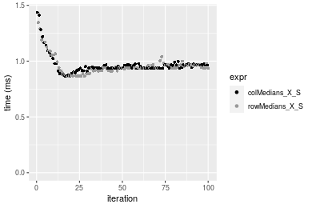


## Appendix

### Session information
```r
R version 4.1.1 Patched (2021-08-10 r80727)
Platform: x86_64-pc-linux-gnu (64-bit)
Running under: Ubuntu 18.04.5 LTS

Matrix products: default
BLAS:   /home/hb/software/R-devel/R-4-1-branch/lib/R/lib/libRblas.so
LAPACK: /home/hb/software/R-devel/R-4-1-branch/lib/R/lib/libRlapack.so

locale:
 [1] LC_CTYPE=en_US.UTF-8       LC_NUMERIC=C              
 [3] LC_TIME=en_US.UTF-8        LC_COLLATE=en_US.UTF-8    
 [5] LC_MONETARY=en_US.UTF-8    LC_MESSAGES=en_US.UTF-8   
 [7] LC_PAPER=en_US.UTF-8       LC_NAME=C                 
 [9] LC_ADDRESS=C               LC_TELEPHONE=C            
[11] LC_MEASUREMENT=en_US.UTF-8 LC_IDENTIFICATION=C       

attached base packages:
[1] stats     graphics  grDevices utils     datasets  methods   base     

other attached packages:
[1] microbenchmark_1.4-7   matrixStats_0.60.1     ggplot2_3.3.5         
[4] knitr_1.33             R.devices_2.17.0       R.utils_2.10.1        
[7] R.oo_1.24.0            R.methodsS3_1.8.1-9001 history_0.0.1-9000    

loaded via a namespace (and not attached):
 [1] Biobase_2.52.0          httr_1.4.2              splines_4.1.1          
 [4] bit64_4.0.5             network_1.17.1          assertthat_0.2.1       
 [7] highr_0.9               stats4_4.1.1            blob_1.2.2             
[10] GenomeInfoDbData_1.2.6  robustbase_0.93-8       pillar_1.6.2           
[13] RSQLite_2.2.8           lattice_0.20-44         glue_1.4.2             
[16] digest_0.6.27           XVector_0.32.0          colorspace_2.0-2       
[19] Matrix_1.3-4            XML_3.99-0.7            pkgconfig_2.0.3        
[22] zlibbioc_1.38.0         genefilter_1.74.0       purrr_0.3.4            
[25] ergm_4.1.2              xtable_1.8-4            scales_1.1.1           
[28] tibble_3.1.4            annotate_1.70.0         KEGGREST_1.32.0        
[31] farver_2.1.0            generics_0.1.0          IRanges_2.26.0         
[34] ellipsis_0.3.2          cachem_1.0.6            withr_2.4.2            
[37] BiocGenerics_0.38.0     mime_0.11               survival_3.2-13        
[40] magrittr_2.0.1          crayon_1.4.1            statnet.common_4.5.0   
[43] memoise_2.0.0           laeken_0.5.1            fansi_0.5.0            
[46] R.cache_0.15.0          MASS_7.3-54             R.rsp_0.44.0           
[49] progressr_0.8.0         tools_4.1.1             lifecycle_1.0.0        
[52] S4Vectors_0.30.0        trust_0.1-8             munsell_0.5.0          
[55] tabby_0.0.1-9001        AnnotationDbi_1.54.1    Biostrings_2.60.2      
[58] compiler_4.1.1          GenomeInfoDb_1.28.1     rlang_0.4.11           
[61] grid_4.1.1              RCurl_1.98-1.4          cwhmisc_6.6            
[64] rappdirs_0.3.3          startup_0.15.0          labeling_0.4.2         
[67] bitops_1.0-7            base64enc_0.1-3         boot_1.3-28            
[70] gtable_0.3.0            DBI_1.1.1               markdown_1.1           
[73] R6_2.5.1                lpSolveAPI_5.5.2.0-17.7 rle_0.9.2              
[76] dplyr_1.0.7             fastmap_1.1.0           bit_4.0.4              
[79] utf8_1.2.2              parallel_4.1.1          Rcpp_1.0.7             
[82] vctrs_0.3.8             png_0.1-7               DEoptimR_1.0-9         
[85] tidyselect_1.1.1        xfun_0.25               coda_0.19-4            
```
Total processing time was 25.15 secs.


### Reproducibility
To reproduce this report, do:
```r
html <- matrixStats:::benchmark('colRowMedians_subset')
```

[RSP]: https://cran.r-project.org/package=R.rsp
[matrixStats]: https://cran.r-project.org/package=matrixStats

[StackOverflow:colMins?]: https://stackoverflow.com/questions/13676878 "Stack Overflow: fastest way to get Min from every column in a matrix?"
[StackOverflow:colSds?]: https://stackoverflow.com/questions/17549762 "Stack Overflow: Is there such 'colsd' in R?"
[StackOverflow:rowProds?]: https://stackoverflow.com/questions/20198801/ "Stack Overflow: Row product of matrix and column sum of matrix"

---------------------------------------
Copyright Dongcan Jiang. Last updated on 2021-08-25 18:59:31 (+0200 UTC). Powered by [RSP].

<script>
 var link = document.createElement('link');
 link.rel = 'icon';
 link.href = "data:image/png;base64,iVBORw0KGgoAAAANSUhEUgAAACAAAAAgCAMAAABEpIrGAAAA21BMVEUAAAAAAP8AAP8AAP8AAP8AAP8AAP8AAP8AAP8AAP8AAP8AAP8AAP8AAP8AAP8AAP8AAP8AAP8AAP8AAP8AAP8AAP8AAP8AAP8AAP8AAP8AAP8AAP8AAP8AAP8AAP8AAP8AAP8AAP8AAP8AAP8AAP8AAP8AAP8AAP8AAP8AAP8BAf4CAv0DA/wdHeIeHuEfH+AgIN8hId4lJdomJtknJ9g+PsE/P8BAQL9yco10dIt1dYp3d4h4eIeVlWqWlmmXl2iYmGeZmWabm2Tn5xjo6Bfp6Rb39wj4+Af//wA2M9hbAAAASXRSTlMAAQIJCgsMJSYnKD4/QGRlZmhpamtsbautrrCxuru8y8zN5ebn6Pn6+///////////////////////////////////////////LsUNcQAAAS9JREFUOI29k21XgkAQhVcFytdSMqMETU26UVqGmpaiFbL//xc1cAhhwVNf6n5i5z67M2dmYOyfJZUqlVLhkKucG7cgmUZTybDz6g0iDeq51PUr37Ds2cy2/C9NeES5puDjxuUk1xnToZsg8pfA3avHQ3lLIi7iWRrkv/OYtkScxBIMgDee0ALoyxHQBJ68JLCjOtQIMIANF7QG9G9fNnHvisCHBVMKgSJgiz7nE+AoBKrAPA3MgepvgR9TSCasrCKH0eB1wBGBFdCO+nAGjMVGPcQb5bd6mQRegN6+1axOs9nGfYcCtfi4NQosdtH7dB+txFIpXQqN1p9B/asRHToyS0jRgpV7nk4nwcq1BJ+x3Gl/v7S9Wmpp/aGquum7w3ZDyrADFYrl8vHBH+ev9AUASW1dmU4h4wAAAABJRU5ErkJggg=="
 document.getElementsByTagName('head')[0].appendChild(link);
</script>


