[matrixStats]: Benchmark report

---------------------------------------


# colMins() and rowMins() benchmarks

This report benchmark the performance of colMins() and rowMins() against alternative methods.

## Alternative methods

* apply() + min()
* lapply() + pmin()
* lapply() + pmin.int()

See also [StackOverflow:colMins?].


## Data type "integer"

### Data
```r
> rmatrix <- function(nrow, ncol, mode = c("logical", "double", "integer", "index"), range = c(-100, 
+     +100), na_prob = 0) {
+     mode <- match.arg(mode)
+     n <- nrow * ncol
+     if (mode == "logical") {
+         x <- sample(c(FALSE, TRUE), size = n, replace = TRUE)
+     }     else if (mode == "index") {
+         x <- seq_len(n)
+         mode <- "integer"
+     }     else {
+         x <- runif(n, min = range[1], max = range[2])
+     }
+     storage.mode(x) <- mode
+     if (na_prob > 0) 
+         x[sample(n, size = na_prob * n)] <- NA
+     dim(x) <- c(nrow, ncol)
+     x
+ }
> rmatrices <- function(scale = 10, seed = 1, ...) {
+     set.seed(seed)
+     data <- list()
+     data[[1]] <- rmatrix(nrow = scale * 1, ncol = scale * 1, ...)
+     data[[2]] <- rmatrix(nrow = scale * 10, ncol = scale * 10, ...)
+     data[[3]] <- rmatrix(nrow = scale * 100, ncol = scale * 1, ...)
+     data[[4]] <- t(data[[3]])
+     data[[5]] <- rmatrix(nrow = scale * 10, ncol = scale * 100, ...)
+     data[[6]] <- t(data[[5]])
+     names(data) <- sapply(data, FUN = function(x) paste(dim(x), collapse = "x"))
+     data
+ }
> data <- rmatrices(mode = mode)
```

### Results

#### 10x10 integer matrix


```r
> X <- data[["10x10"]]
> gc()
           used  (Mb) gc trigger  (Mb) max used  (Mb)
Ncells  5261045 281.0    8529671 455.6  8529671 455.6
Vcells 10261516  78.3   31876688 243.2 60562128 462.1
> colStats <- microbenchmark(colMins = colMins(X, na.rm = FALSE), `apply+min` = apply(X, MARGIN = 2L, 
+     FUN = min, na.rm = FALSE), `lapply+pmin` = do.call(pmin, lapply(seq_len(nrow(X)), function(i) X[i, 
+     ])), `lapply+pmin.int` = do.call(pmin.int, lapply(seq_len(nrow(X)), function(i) X[i, ])), unit = "ms")
> X <- t(X)
> gc()
           used  (Mb) gc trigger  (Mb) max used  (Mb)
Ncells  5250822 280.5    8529671 455.6  8529671 455.6
Vcells 10228244  78.1   31876688 243.2 60562128 462.1
> rowStats <- microbenchmark(rowMins = rowMins(X, na.rm = FALSE), `apply+min` = apply(X, MARGIN = 1L, 
+     FUN = min, na.rm = FALSE), `lapply+pmin` = do.call(pmin, lapply(seq_len(ncol(X)), function(i) X[, 
+     i])), `lapply+pmin.int` = do.call(pmin.int, lapply(seq_len(ncol(X)), function(i) X[, i])), unit = "ms")
```

_Table: Benchmarking of colMins(), apply+min(), lapply+pmin() and lapply+pmin.int() on integer+10x10 data. The top panel shows times in milliseconds and the bottom panel shows relative times._


|   |expr            |      min|        lq|      mean|    median|        uq|      max|
|:--|:---------------|--------:|---------:|---------:|---------:|---------:|--------:|
|1  |colMins         | 0.001961| 0.0024625| 0.0031184| 0.0030480| 0.0035400| 0.013601|
|4  |lapply+pmin.int | 0.019177| 0.0207965| 0.0218450| 0.0213775| 0.0220245| 0.058372|
|3  |lapply+pmin     | 0.030621| 0.0336390| 0.0348887| 0.0345025| 0.0353340| 0.061177|
|2  |apply+min       | 0.032676| 0.0351865| 0.0383533| 0.0376110| 0.0396480| 0.092919|


|   |expr            |       min|        lq|      mean|    median|        uq|      max|
|:--|:---------------|---------:|---------:|---------:|---------:|---------:|--------:|
|1  |colMins         |  1.000000|  1.000000|  1.000000|  1.000000|  1.000000| 1.000000|
|4  |lapply+pmin.int |  9.779194|  8.445279|  7.005259|  7.013616|  6.221610| 4.291743|
|3  |lapply+pmin     | 15.614992| 13.660508| 11.188108| 11.319718|  9.981356| 4.497978|
|2  |apply+min       | 16.662927| 14.288934| 12.299140| 12.339567| 11.200000| 6.831777|

_Table: Benchmarking of rowMins(), apply+min(), lapply+pmin() and lapply+pmin.int() on integer+10x10 data (transposed). The top panel shows times in milliseconds and the bottom panel shows relative times._


|   |expr            |      min|        lq|      mean|   median|       uq|      max|
|:--|:---------------|--------:|---------:|---------:|--------:|--------:|--------:|
|1  |rowMins         | 0.002075| 0.0025490| 0.0032280| 0.003185| 0.003531| 0.015027|
|4  |lapply+pmin.int | 0.018828| 0.0199445| 0.0209203| 0.020780| 0.021589| 0.030489|
|3  |lapply+pmin     | 0.030842| 0.0327230| 0.0345111| 0.034101| 0.034914| 0.076136|
|2  |apply+min       | 0.032612| 0.0361775| 0.0386453| 0.037367| 0.039665| 0.088746|


|   |expr            |       min|        lq|      mean|    median|        uq|      max|
|:--|:---------------|---------:|---------:|---------:|---------:|---------:|--------:|
|1  |rowMins         |  1.000000|  1.000000|  1.000000|  1.000000|  1.000000| 1.000000|
|4  |lapply+pmin.int |  9.073735|  7.824441|  6.480926|  6.524333|  6.114132| 2.028948|
|3  |lapply+pmin     | 14.863615| 12.837583| 10.691250| 10.706750|  9.887851| 5.066613|
|2  |apply+min       | 15.716627| 14.192821| 11.971979| 11.732182| 11.233362| 5.905770|

_Figure: Benchmarking of colMins(), apply+min(), lapply+pmin() and lapply+pmin.int() on integer+10x10 data  as well as rowMins(), apply+min(), lapply+pmin() and lapply+pmin.int() on the same data transposed.  Outliers are displayed as crosses.  Times are in milliseconds._


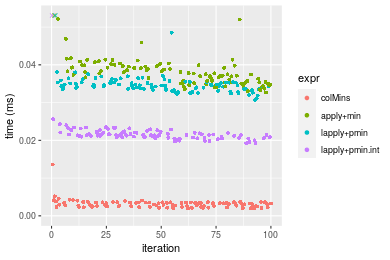

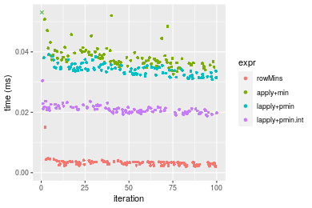
_Table: Benchmarking of colMins() and rowMins() on integer+10x10 data (original and transposed).  The top panel shows times in milliseconds and the bottom panel shows relative times._


|   |expr    |   min|     lq|    mean| median|    uq|    max|
|:--|:-------|-----:|------:|-------:|------:|-----:|------:|
|1  |colMins | 1.961| 2.4625| 3.11837|  3.048| 3.540| 13.601|
|2  |rowMins | 2.075| 2.5490| 3.22798|  3.185| 3.531| 15.027|


|   |expr    |      min|       lq|    mean|   median|        uq|      max|
|:--|:-------|--------:|--------:|-------:|--------:|---------:|--------:|
|1  |colMins | 1.000000| 1.000000| 1.00000| 1.000000| 1.0000000| 1.000000|
|2  |rowMins | 1.058134| 1.035127| 1.03515| 1.044947| 0.9974576| 1.104845|

_Figure: Benchmarking of colMins() and rowMins() on integer+10x10 data (original and transposed).  Outliers are displayed as crosses. Times are in milliseconds._


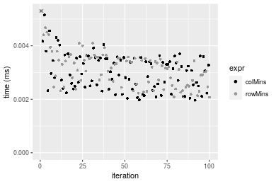

#### 100x100 integer matrix


```r
> X <- data[["100x100"]]
> gc()
          used  (Mb) gc trigger  (Mb) max used  (Mb)
Ncells 5249419 280.4    8529671 455.6  8529671 455.6
Vcells 9845021  75.2   31876688 243.2 60562128 462.1
> colStats <- microbenchmark(colMins = colMins(X, na.rm = FALSE), `apply+min` = apply(X, MARGIN = 2L, 
+     FUN = min, na.rm = FALSE), `lapply+pmin` = do.call(pmin, lapply(seq_len(nrow(X)), function(i) X[i, 
+     ])), `lapply+pmin.int` = do.call(pmin.int, lapply(seq_len(nrow(X)), function(i) X[i, ])), unit = "ms")
> X <- t(X)
> gc()
          used  (Mb) gc trigger  (Mb) max used  (Mb)
Ncells 5249395 280.4    8529671 455.6  8529671 455.6
Vcells 9850098  75.2   31876688 243.2 60562128 462.1
> rowStats <- microbenchmark(rowMins = rowMins(X, na.rm = FALSE), `apply+min` = apply(X, MARGIN = 1L, 
+     FUN = min, na.rm = FALSE), `lapply+pmin` = do.call(pmin, lapply(seq_len(ncol(X)), function(i) X[, 
+     i])), `lapply+pmin.int` = do.call(pmin.int, lapply(seq_len(ncol(X)), function(i) X[, i])), unit = "ms")
```

_Table: Benchmarking of colMins(), apply+min(), lapply+pmin() and lapply+pmin.int() on integer+100x100 data. The top panel shows times in milliseconds and the bottom panel shows relative times._


|   |expr            |      min|        lq|      mean|    median|        uq|      max|
|:--|:---------------|--------:|---------:|---------:|---------:|---------:|--------:|
|1  |colMins         | 0.019701| 0.0220015| 0.0260000| 0.0243420| 0.0275535| 0.050158|
|4  |lapply+pmin.int | 0.160862| 0.1737545| 0.2046270| 0.1904940| 0.2215825| 0.342907|
|2  |apply+min       | 0.162650| 0.1761235| 0.2063965| 0.1980970| 0.2242105| 0.357808|
|3  |lapply+pmin     | 0.218463| 0.2366050| 0.2765518| 0.2609345| 0.2945850| 0.506499|


|   |expr            |       min|        lq|      mean|    median|        uq|       max|
|:--|:---------------|---------:|---------:|---------:|---------:|---------:|---------:|
|1  |colMins         |  1.000000|  1.000000|  1.000000|  1.000000|  1.000000|  1.000000|
|4  |lapply+pmin.int |  8.165169|  7.897393|  7.870271|  7.825733|  8.041900|  6.836537|
|2  |apply+min       |  8.255926|  8.005068|  7.938332|  8.138074|  8.137278|  7.133618|
|3  |lapply+pmin     | 11.088930| 10.754039| 10.636612| 10.719518| 10.691382| 10.098070|

_Table: Benchmarking of rowMins(), apply+min(), lapply+pmin() and lapply+pmin.int() on integer+100x100 data (transposed). The top panel shows times in milliseconds and the bottom panel shows relative times._


|   |expr            |      min|        lq|      mean|    median|        uq|      max|
|:--|:---------------|--------:|---------:|---------:|---------:|---------:|--------:|
|1  |rowMins         | 0.028062| 0.0313810| 0.0370879| 0.0366945| 0.0410420| 0.059481|
|4  |lapply+pmin.int | 0.140107| 0.1504120| 0.1716608| 0.1668850| 0.1818020| 0.293210|
|2  |apply+min       | 0.161842| 0.1730955| 0.2021828| 0.1897060| 0.2156300| 0.380225|
|3  |lapply+pmin     | 0.191663| 0.2107970| 0.2371760| 0.2327130| 0.2503695| 0.338557|


|   |expr            |      min|       lq|     mean|   median|       uq|      max|
|:--|:---------------|--------:|--------:|--------:|--------:|--------:|--------:|
|1  |rowMins         | 1.000000| 1.000000| 1.000000| 1.000000| 1.000000| 1.000000|
|4  |lapply+pmin.int | 4.992766| 4.793091| 4.628482| 4.547957| 4.429657| 4.929473|
|2  |apply+min       | 5.767301| 5.515933| 5.451446| 5.169876| 5.253886| 6.392377|
|3  |lapply+pmin     | 6.829984| 6.717345| 6.394967| 6.341904| 6.100324| 5.691851|

_Figure: Benchmarking of colMins(), apply+min(), lapply+pmin() and lapply+pmin.int() on integer+100x100 data  as well as rowMins(), apply+min(), lapply+pmin() and lapply+pmin.int() on the same data transposed.  Outliers are displayed as crosses.  Times are in milliseconds._


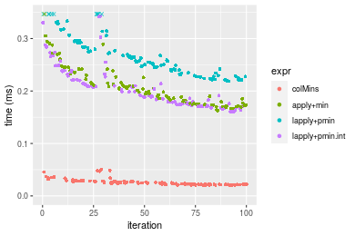

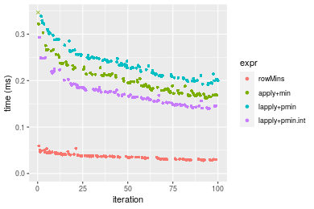
_Table: Benchmarking of colMins() and rowMins() on integer+100x100 data (original and transposed).  The top panel shows times in milliseconds and the bottom panel shows relative times._


|   |expr    |    min|      lq|     mean|  median|      uq|    max|
|:--|:-------|------:|-------:|--------:|-------:|-------:|------:|
|1  |colMins | 19.701| 22.0015| 25.99999| 24.3420| 27.5535| 50.158|
|2  |rowMins | 28.062| 31.3810| 37.08792| 36.6945| 41.0420| 59.481|


|   |expr    |      min|       lq|     mean|   median|       uq|      max|
|:--|:-------|--------:|--------:|--------:|--------:|--------:|--------:|
|1  |colMins | 1.000000| 1.000000| 1.000000| 1.000000| 1.000000| 1.000000|
|2  |rowMins | 1.424395| 1.426312| 1.426459| 1.507456| 1.489539| 1.185873|

_Figure: Benchmarking of colMins() and rowMins() on integer+100x100 data (original and transposed).  Outliers are displayed as crosses. Times are in milliseconds._


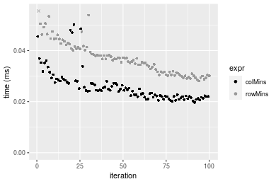

#### 1000x10 integer matrix


```r
> X <- data[["1000x10"]]
> gc()
          used  (Mb) gc trigger  (Mb) max used  (Mb)
Ncells 5250165 280.4    8529671 455.6  8529671 455.6
Vcells 9848772  75.2   31876688 243.2 60562128 462.1
> colStats <- microbenchmark(colMins = colMins(X, na.rm = FALSE), `apply+min` = apply(X, MARGIN = 2L, 
+     FUN = min, na.rm = FALSE), `lapply+pmin` = do.call(pmin, lapply(seq_len(nrow(X)), function(i) X[i, 
+     ])), `lapply+pmin.int` = do.call(pmin.int, lapply(seq_len(nrow(X)), function(i) X[i, ])), unit = "ms")
> X <- t(X)
> gc()
          used  (Mb) gc trigger  (Mb) max used  (Mb)
Ncells 5250159 280.4    8529671 455.6  8529671 455.6
Vcells 9853879  75.2   31876688 243.2 60562128 462.1
> rowStats <- microbenchmark(rowMins = rowMins(X, na.rm = FALSE), `apply+min` = apply(X, MARGIN = 1L, 
+     FUN = min, na.rm = FALSE), `lapply+pmin` = do.call(pmin, lapply(seq_len(ncol(X)), function(i) X[, 
+     i])), `lapply+pmin.int` = do.call(pmin.int, lapply(seq_len(ncol(X)), function(i) X[, i])), unit = "ms")
```

_Table: Benchmarking of colMins(), apply+min(), lapply+pmin() and lapply+pmin.int() on integer+1000x10 data. The top panel shows times in milliseconds and the bottom panel shows relative times._


|   |expr            |      min|        lq|      mean|    median|        uq|      max|
|:--|:---------------|--------:|---------:|---------:|---------:|---------:|--------:|
|1  |colMins         | 0.016098| 0.0182495| 0.0195772| 0.0189285| 0.0201150| 0.034340|
|2  |apply+min       | 0.092033| 0.0980675| 0.1057655| 0.1039540| 0.1100675| 0.178412|
|4  |lapply+pmin.int | 1.041009| 1.1513665| 1.2030655| 1.1846995| 1.2500025| 1.630197|
|3  |lapply+pmin     | 1.553083| 1.6863190| 1.8311417| 1.7646325| 1.8476255| 7.274179|


|   |expr            |       min|        lq|      mean|   median|        uq|        max|
|:--|:---------------|---------:|---------:|---------:|--------:|---------:|----------:|
|1  |colMins         |  1.000000|  1.000000|  1.000000|  1.00000|  1.000000|   1.000000|
|2  |apply+min       |  5.717046|  5.373709|  5.402473|  5.49193|  5.471912|   5.195457|
|4  |lapply+pmin.int | 64.666977| 63.090304| 61.452255| 62.58813| 62.142804|  47.472248|
|3  |lapply+pmin     | 96.476767| 92.403573| 93.534212| 93.22622| 91.853120| 211.828160|

_Table: Benchmarking of rowMins(), apply+min(), lapply+pmin() and lapply+pmin.int() on integer+1000x10 data (transposed). The top panel shows times in milliseconds and the bottom panel shows relative times._


|   |expr            |      min|        lq|      mean|    median|       uq|      max|
|:--|:---------------|--------:|---------:|---------:|---------:|--------:|--------:|
|1  |rowMins         | 0.027722| 0.0322975| 0.0355971| 0.0339830| 0.035857| 0.070898|
|2  |apply+min       | 0.091952| 0.1015750| 0.1117716| 0.1064265| 0.117356| 0.235355|
|4  |lapply+pmin.int | 1.022871| 1.1123160| 1.2268829| 1.1674330| 1.210100| 6.624442|
|3  |lapply+pmin     | 1.516378| 1.6735670| 1.7703788| 1.7543370| 1.824891| 2.640951|


|   |expr            |       min|       lq|      mean|    median|        uq|       max|
|:--|:---------------|---------:|--------:|---------:|---------:|---------:|---------:|
|1  |rowMins         |  1.000000|  1.00000|  1.000000|  1.000000|  1.000000|  1.000000|
|2  |apply+min       |  3.316932|  3.14498|  3.139912|  3.131757|  3.272889|  3.319628|
|4  |lapply+pmin.int | 36.897446| 34.43969| 34.465849| 34.353441| 33.747929| 93.436232|
|3  |lapply+pmin     | 54.699444| 51.81723| 49.733848| 51.623959| 50.893577| 37.250007|

_Figure: Benchmarking of colMins(), apply+min(), lapply+pmin() and lapply+pmin.int() on integer+1000x10 data  as well as rowMins(), apply+min(), lapply+pmin() and lapply+pmin.int() on the same data transposed.  Outliers are displayed as crosses.  Times are in milliseconds._


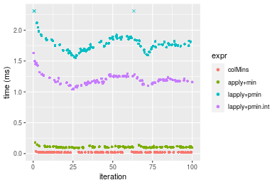

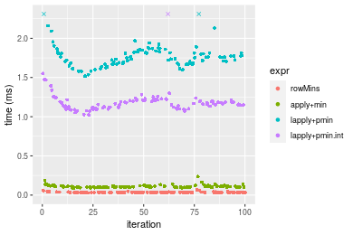
_Table: Benchmarking of colMins() and rowMins() on integer+1000x10 data (original and transposed).  The top panel shows times in milliseconds and the bottom panel shows relative times._


|   |expr    |    min|      lq|     mean|  median|     uq|    max|
|:--|:-------|------:|-------:|--------:|-------:|------:|------:|
|1  |colMins | 16.098| 18.2495| 19.57724| 18.9285| 20.115| 34.340|
|2  |rowMins | 27.722| 32.2975| 35.59706| 33.9830| 35.857| 70.898|


|   |expr    |      min|       lq|     mean|   median|     uq|      max|
|:--|:-------|--------:|--------:|--------:|--------:|------:|--------:|
|1  |colMins | 1.000000| 1.000000| 1.000000| 1.000000| 1.0000| 1.000000|
|2  |rowMins | 1.722077| 1.769775| 1.818288| 1.795335| 1.7826| 2.064589|

_Figure: Benchmarking of colMins() and rowMins() on integer+1000x10 data (original and transposed).  Outliers are displayed as crosses. Times are in milliseconds._


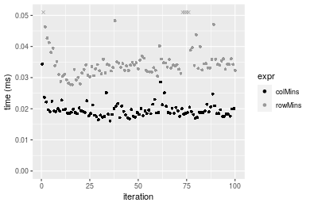

#### 10x1000 integer matrix


```r
> X <- data[["10x1000"]]
> gc()
          used  (Mb) gc trigger  (Mb) max used  (Mb)
Ncells 5250393 280.5    8529671 455.6  8529671 455.6
Vcells 9849681  75.2   31876688 243.2 60562128 462.1
> colStats <- microbenchmark(colMins = colMins(X, na.rm = FALSE), `apply+min` = apply(X, MARGIN = 2L, 
+     FUN = min, na.rm = FALSE), `lapply+pmin` = do.call(pmin, lapply(seq_len(nrow(X)), function(i) X[i, 
+     ])), `lapply+pmin.int` = do.call(pmin.int, lapply(seq_len(nrow(X)), function(i) X[i, ])), unit = "ms")
> X <- t(X)
> gc()
          used  (Mb) gc trigger  (Mb) max used  (Mb)
Ncells 5250381 280.5    8529671 455.6  8529671 455.6
Vcells 9854778  75.2   31876688 243.2 60562128 462.1
> rowStats <- microbenchmark(rowMins = rowMins(X, na.rm = FALSE), `apply+min` = apply(X, MARGIN = 1L, 
+     FUN = min, na.rm = FALSE), `lapply+pmin` = do.call(pmin, lapply(seq_len(ncol(X)), function(i) X[, 
+     i])), `lapply+pmin.int` = do.call(pmin.int, lapply(seq_len(ncol(X)), function(i) X[, i])), unit = "ms")
```

_Table: Benchmarking of colMins(), apply+min(), lapply+pmin() and lapply+pmin.int() on integer+10x1000 data. The top panel shows times in milliseconds and the bottom panel shows relative times._


|   |expr            |      min|        lq|      mean|    median|        uq|      max|
|:--|:---------------|--------:|---------:|---------:|---------:|---------:|--------:|
|1  |colMins         | 0.040626| 0.0447915| 0.0499942| 0.0475190| 0.0517620| 0.078766|
|4  |lapply+pmin.int | 0.086942| 0.0944890| 0.1020910| 0.0979325| 0.1051145| 0.148585|
|3  |lapply+pmin     | 0.096333| 0.1060625| 0.1173308| 0.1099185| 0.1234000| 0.203392|
|2  |apply+min       | 0.938481| 1.0313715| 1.0971496| 1.0732180| 1.1306615| 1.537324|


|   |expr            |       min|        lq|      mean|    median|        uq|       max|
|:--|:---------------|---------:|---------:|---------:|---------:|---------:|---------:|
|1  |colMins         |  1.000000|  1.000000|  1.000000|  1.000000|  1.000000|  1.000000|
|4  |lapply+pmin.int |  2.140058|  2.109530|  2.042059|  2.060913|  2.030727|  1.886410|
|3  |lapply+pmin     |  2.371215|  2.367916|  2.346891|  2.313148|  2.383988|  2.582231|
|2  |apply+min       | 23.100502| 23.026054| 21.945560| 22.585029| 21.843466| 19.517609|

_Table: Benchmarking of rowMins(), apply+min(), lapply+pmin() and lapply+pmin.int() on integer+10x1000 data (transposed). The top panel shows times in milliseconds and the bottom panel shows relative times._


|   |expr            |      min|        lq|      mean|    median|        uq|      max|
|:--|:---------------|--------:|---------:|---------:|---------:|---------:|--------:|
|1  |rowMins         | 0.040354| 0.0436515| 0.0481795| 0.0461620| 0.0510930| 0.087116|
|4  |lapply+pmin.int | 0.067021| 0.0711615| 0.0793412| 0.0754335| 0.0841045| 0.138087|
|3  |lapply+pmin     | 0.075066| 0.0816025| 0.0896339| 0.0858935| 0.0951510| 0.128482|
|2  |apply+min       | 0.935962| 1.0378985| 1.0887489| 1.0698970| 1.1208725| 1.622883|


|   |expr            |       min|        lq|      mean|    median|        uq|       max|
|:--|:---------------|---------:|---------:|---------:|---------:|---------:|---------:|
|1  |rowMins         |  1.000000|  1.000000|  1.000000|  1.000000|  1.000000|  1.000000|
|4  |lapply+pmin.int |  1.660827|  1.630219|  1.646785|  1.634104|  1.646106|  1.585093|
|3  |lapply+pmin     |  1.860187|  1.869409|  1.860417|  1.860697|  1.862310|  1.474838|
|2  |apply+min       | 23.193785| 23.776926| 22.597777| 23.177007| 21.937888| 18.628989|

_Figure: Benchmarking of colMins(), apply+min(), lapply+pmin() and lapply+pmin.int() on integer+10x1000 data  as well as rowMins(), apply+min(), lapply+pmin() and lapply+pmin.int() on the same data transposed.  Outliers are displayed as crosses.  Times are in milliseconds._


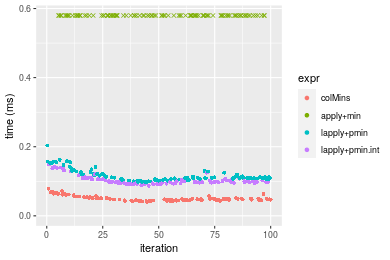

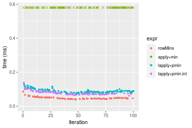
_Table: Benchmarking of colMins() and rowMins() on integer+10x1000 data (original and transposed).  The top panel shows times in milliseconds and the bottom panel shows relative times._


|   |expr    |    min|      lq|     mean| median|     uq|    max|
|:--|:-------|------:|-------:|--------:|------:|------:|------:|
|2  |rowMins | 40.354| 43.6515| 48.17947| 46.162| 51.093| 87.116|
|1  |colMins | 40.626| 44.7915| 49.99415| 47.519| 51.762| 78.766|


|   |expr    |     min|       lq|     mean|   median|       uq|       max|
|:--|:-------|-------:|--------:|--------:|--------:|--------:|---------:|
|2  |rowMins | 1.00000| 1.000000| 1.000000| 1.000000| 1.000000| 1.0000000|
|1  |colMins | 1.00674| 1.026116| 1.037665| 1.029397| 1.013094| 0.9041508|

_Figure: Benchmarking of colMins() and rowMins() on integer+10x1000 data (original and transposed).  Outliers are displayed as crosses. Times are in milliseconds._


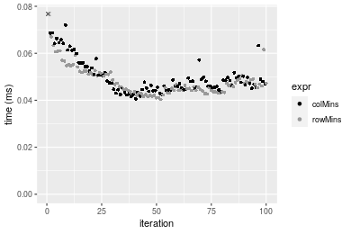

#### 100x1000 integer matrix


```r
> X <- data[["100x1000"]]
> gc()
          used  (Mb) gc trigger  (Mb) max used  (Mb)
Ncells 5250623 280.5    8529671 455.6  8529671 455.6
Vcells 9850292  75.2   31876688 243.2 60562128 462.1
> colStats <- microbenchmark(colMins = colMins(X, na.rm = FALSE), `apply+min` = apply(X, MARGIN = 2L, 
+     FUN = min, na.rm = FALSE), `lapply+pmin` = do.call(pmin, lapply(seq_len(nrow(X)), function(i) X[i, 
+     ])), `lapply+pmin.int` = do.call(pmin.int, lapply(seq_len(nrow(X)), function(i) X[i, ])), unit = "ms")
> X <- t(X)
> gc()
          used  (Mb) gc trigger  (Mb) max used  (Mb)
Ncells 5250611 280.5    8529671 455.6  8529671 455.6
Vcells 9900389  75.6   31876688 243.2 60562128 462.1
> rowStats <- microbenchmark(rowMins = rowMins(X, na.rm = FALSE), `apply+min` = apply(X, MARGIN = 1L, 
+     FUN = min, na.rm = FALSE), `lapply+pmin` = do.call(pmin, lapply(seq_len(ncol(X)), function(i) X[, 
+     i])), `lapply+pmin.int` = do.call(pmin.int, lapply(seq_len(ncol(X)), function(i) X[, i])), unit = "ms")
```

_Table: Benchmarking of colMins(), apply+min(), lapply+pmin() and lapply+pmin.int() on integer+100x1000 data. The top panel shows times in milliseconds and the bottom panel shows relative times._


|   |expr            |      min|       lq|      mean|    median|        uq|       max|
|:--|:---------------|--------:|--------:|---------:|---------:|---------:|---------:|
|1  |colMins         | 0.185483| 0.212613| 0.2210963| 0.2201230| 0.2279455|  0.292429|
|4  |lapply+pmin.int | 0.707608| 0.800243| 0.8401222| 0.8207525| 0.8510785|  1.202391|
|3  |lapply+pmin     | 0.765025| 0.855969| 0.8861484| 0.8817275| 0.8931765|  1.216636|
|2  |apply+min       | 1.578081| 1.709996| 1.9386553| 1.7540850| 1.7909110| 17.400191|


|   |expr            |      min|       lq|     mean|   median|       uq|       max|
|:--|:---------------|--------:|--------:|--------:|--------:|--------:|---------:|
|1  |colMins         | 1.000000| 1.000000| 1.000000| 1.000000| 1.000000|  1.000000|
|4  |lapply+pmin.int | 3.814948| 3.763848| 3.799803| 3.728609| 3.733693|  4.111737|
|3  |lapply+pmin     | 4.124502| 4.025949| 4.007975| 4.005613| 3.918377|  4.160449|
|2  |apply+min       | 8.507955| 8.042765| 8.768377| 7.968658| 7.856751| 59.502276|

_Table: Benchmarking of rowMins(), apply+min(), lapply+pmin() and lapply+pmin.int() on integer+100x1000 data (transposed). The top panel shows times in milliseconds and the bottom panel shows relative times._


|   |expr            |      min|        lq|      mean|    median|        uq|       max|
|:--|:---------------|--------:|---------:|---------:|---------:|---------:|---------:|
|1  |rowMins         | 0.272467| 0.2965420| 0.3111866| 0.3066340| 0.3163490|  0.408973|
|4  |lapply+pmin.int | 0.488489| 0.5373605| 0.5648683| 0.5483525| 0.5768830|  0.789271|
|3  |lapply+pmin     | 0.543294| 0.6062425| 0.6287185| 0.6221345| 0.6356095|  0.819154|
|2  |apply+min       | 1.541115| 1.6870285| 1.9138076| 1.7120345| 1.7813550| 17.143776|


|   |expr            |      min|       lq|     mean|   median|       uq|       max|
|:--|:---------------|--------:|--------:|--------:|--------:|--------:|---------:|
|1  |rowMins         | 1.000000| 1.000000| 1.000000| 1.000000| 1.000000|  1.000000|
|4  |lapply+pmin.int | 1.792837| 1.812089| 1.815208| 1.788296| 1.823565|  1.929885|
|3  |lapply+pmin     | 1.993981| 2.044373| 2.020391| 2.028916| 2.009203|  2.002954|
|2  |apply+min       | 5.656153| 5.689004| 6.150032| 5.583316| 5.630980| 41.919090|

_Figure: Benchmarking of colMins(), apply+min(), lapply+pmin() and lapply+pmin.int() on integer+100x1000 data  as well as rowMins(), apply+min(), lapply+pmin() and lapply+pmin.int() on the same data transposed.  Outliers are displayed as crosses.  Times are in milliseconds._


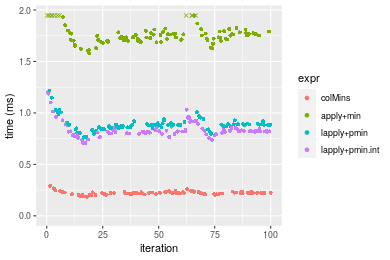

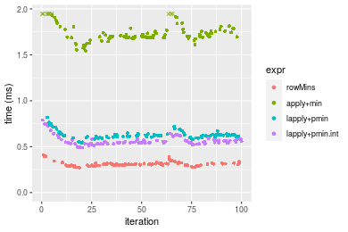
_Table: Benchmarking of colMins() and rowMins() on integer+100x1000 data (original and transposed).  The top panel shows times in milliseconds and the bottom panel shows relative times._


|   |expr    |     min|      lq|     mean|  median|       uq|     max|
|:--|:-------|-------:|-------:|--------:|-------:|--------:|-------:|
|1  |colMins | 185.483| 212.613| 221.0963| 220.123| 227.9455| 292.429|
|2  |rowMins | 272.467| 296.542| 311.1866| 306.634| 316.3490| 408.973|


|   |expr    |      min|      lq|     mean|   median|       uq|      max|
|:--|:-------|--------:|-------:|--------:|--------:|--------:|--------:|
|1  |colMins | 1.000000| 1.00000| 1.000000| 1.000000| 1.000000| 1.000000|
|2  |rowMins | 1.468959| 1.39475| 1.407471| 1.393012| 1.387827| 1.398538|

_Figure: Benchmarking of colMins() and rowMins() on integer+100x1000 data (original and transposed).  Outliers are displayed as crosses. Times are in milliseconds._


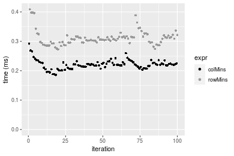

#### 1000x100 integer matrix


```r
> X <- data[["1000x100"]]
> gc()
          used  (Mb) gc trigger  (Mb) max used  (Mb)
Ncells 5250841 280.5    8529671 455.6  8529671 455.6
Vcells 9851077  75.2   31876688 243.2 60562128 462.1
> colStats <- microbenchmark(colMins = colMins(X, na.rm = FALSE), `apply+min` = apply(X, MARGIN = 2L, 
+     FUN = min, na.rm = FALSE), `lapply+pmin` = do.call(pmin, lapply(seq_len(nrow(X)), function(i) X[i, 
+     ])), `lapply+pmin.int` = do.call(pmin.int, lapply(seq_len(nrow(X)), function(i) X[i, ])), unit = "ms")
> X <- t(X)
> gc()
          used  (Mb) gc trigger  (Mb) max used  (Mb)
Ncells 5250835 280.5    8529671 455.6  8529671 455.6
Vcells 9901184  75.6   31876688 243.2 60562128 462.1
> rowStats <- microbenchmark(rowMins = rowMins(X, na.rm = FALSE), `apply+min` = apply(X, MARGIN = 1L, 
+     FUN = min, na.rm = FALSE), `lapply+pmin` = do.call(pmin, lapply(seq_len(ncol(X)), function(i) X[, 
+     i])), `lapply+pmin.int` = do.call(pmin.int, lapply(seq_len(ncol(X)), function(i) X[, i])), unit = "ms")
```

_Table: Benchmarking of colMins(), apply+min(), lapply+pmin() and lapply+pmin.int() on integer+1000x100 data. The top panel shows times in milliseconds and the bottom panel shows relative times._


|   |expr            |      min|        lq|      mean|    median|        uq|       max|
|:--|:---------------|--------:|---------:|---------:|---------:|---------:|---------:|
|1  |colMins         | 0.142558| 0.1614985| 0.1669243| 0.1647525| 0.1715450|  0.217975|
|2  |apply+min       | 0.710634| 0.7904130| 0.8290255| 0.8108770| 0.8435595|  1.149814|
|4  |lapply+pmin.int | 1.654945| 1.8326940| 2.1036546| 1.8882600| 1.9360495| 21.940809|
|3  |lapply+pmin     | 2.126190| 2.4123750| 2.4756398| 2.4662435| 2.5552180|  3.071616|


|   |expr            |       min|        lq|      mean|    median|        uq|        max|
|:--|:---------------|---------:|---------:|---------:|---------:|---------:|----------:|
|1  |colMins         |  1.000000|  1.000000|  1.000000|  1.000000|  1.000000|   1.000000|
|2  |apply+min       |  4.984876|  4.894244|  4.966477|  4.921789|  4.917424|   5.274981|
|4  |lapply+pmin.int | 11.608924| 11.348056| 12.602448| 11.461192| 11.285957| 100.657456|
|3  |lapply+pmin     | 14.914561| 14.937445| 14.830915| 14.969384| 14.895322|  14.091598|

_Table: Benchmarking of rowMins(), apply+min(), lapply+pmin() and lapply+pmin.int() on integer+1000x100 data (transposed). The top panel shows times in milliseconds and the bottom panel shows relative times._


|   |expr            |      min|        lq|      mean|    median|        uq|       max|
|:--|:---------------|--------:|---------:|---------:|---------:|---------:|---------:|
|1  |rowMins         | 0.262699| 0.2928810| 0.3032057| 0.2963325| 0.3085615|  0.397681|
|2  |apply+min       | 0.723057| 0.7841425| 0.8252375| 0.7958415| 0.8274980|  1.205860|
|4  |lapply+pmin.int | 1.407189| 1.5698125| 1.9452756| 1.6088105| 1.6758330| 32.196058|
|3  |lapply+pmin     | 1.885795| 2.1447950| 2.2211179| 2.2088455| 2.2686420|  2.785102|


|   |expr            |      min|       lq|     mean|   median|       uq|       max|
|:--|:---------------|--------:|--------:|--------:|--------:|--------:|---------:|
|1  |rowMins         | 1.000000| 1.000000| 1.000000| 1.000000| 1.000000|  1.000000|
|2  |apply+min       | 2.752416| 2.677342| 2.721708| 2.685637| 2.681793|  3.032229|
|4  |lapply+pmin.int | 5.356659| 5.359899| 6.415695| 5.429072| 5.431115| 80.959508|
|3  |lapply+pmin     | 7.178539| 7.323094| 7.325448| 7.453943| 7.352317|  7.003357|

_Figure: Benchmarking of colMins(), apply+min(), lapply+pmin() and lapply+pmin.int() on integer+1000x100 data  as well as rowMins(), apply+min(), lapply+pmin() and lapply+pmin.int() on the same data transposed.  Outliers are displayed as crosses.  Times are in milliseconds._


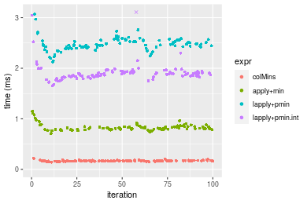

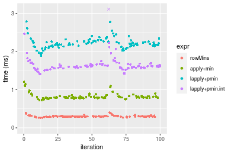
_Table: Benchmarking of colMins() and rowMins() on integer+1000x100 data (original and transposed).  The top panel shows times in milliseconds and the bottom panel shows relative times._


|   |expr    |     min|       lq|     mean|   median|       uq|     max|
|:--|:-------|-------:|--------:|--------:|--------:|--------:|-------:|
|1  |colMins | 142.558| 161.4985| 166.9243| 164.7525| 171.5450| 217.975|
|2  |rowMins | 262.699| 292.8810| 303.2057| 296.3325| 308.5615| 397.681|


|   |expr    |      min|       lq|     mean|   median|      uq|      max|
|:--|:-------|--------:|--------:|--------:|--------:|-------:|--------:|
|1  |colMins | 1.000000| 1.000000| 1.000000| 1.000000| 1.00000| 1.000000|
|2  |rowMins | 1.842752| 1.813522| 1.816427| 1.798652| 1.79872| 1.824434|

_Figure: Benchmarking of colMins() and rowMins() on integer+1000x100 data (original and transposed).  Outliers are displayed as crosses. Times are in milliseconds._


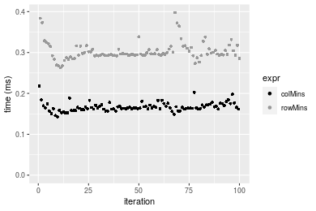


## Data type "double"

### Data
```r
> rmatrix <- function(nrow, ncol, mode = c("logical", "double", "integer", "index"), range = c(-100, 
+     +100), na_prob = 0) {
+     mode <- match.arg(mode)
+     n <- nrow * ncol
+     if (mode == "logical") {
+         x <- sample(c(FALSE, TRUE), size = n, replace = TRUE)
+     }     else if (mode == "index") {
+         x <- seq_len(n)
+         mode <- "integer"
+     }     else {
+         x <- runif(n, min = range[1], max = range[2])
+     }
+     storage.mode(x) <- mode
+     if (na_prob > 0) 
+         x[sample(n, size = na_prob * n)] <- NA
+     dim(x) <- c(nrow, ncol)
+     x
+ }
> rmatrices <- function(scale = 10, seed = 1, ...) {
+     set.seed(seed)
+     data <- list()
+     data[[1]] <- rmatrix(nrow = scale * 1, ncol = scale * 1, ...)
+     data[[2]] <- rmatrix(nrow = scale * 10, ncol = scale * 10, ...)
+     data[[3]] <- rmatrix(nrow = scale * 100, ncol = scale * 1, ...)
+     data[[4]] <- t(data[[3]])
+     data[[5]] <- rmatrix(nrow = scale * 10, ncol = scale * 100, ...)
+     data[[6]] <- t(data[[5]])
+     names(data) <- sapply(data, FUN = function(x) paste(dim(x), collapse = "x"))
+     data
+ }
> data <- rmatrices(mode = mode)
```

### Results

#### 10x10 double matrix


```r
> X <- data[["10x10"]]
> gc()
          used  (Mb) gc trigger  (Mb) max used  (Mb)
Ncells 5251084 280.5    8529671 455.6  8529671 455.6
Vcells 9967044  76.1   31876688 243.2 60562128 462.1
> colStats <- microbenchmark(colMins = colMins(X, na.rm = FALSE), `apply+min` = apply(X, MARGIN = 2L, 
+     FUN = min, na.rm = FALSE), `lapply+pmin` = do.call(pmin, lapply(seq_len(nrow(X)), function(i) X[i, 
+     ])), `lapply+pmin.int` = do.call(pmin.int, lapply(seq_len(nrow(X)), function(i) X[i, ])), unit = "ms")
> X <- t(X)
> gc()
          used  (Mb) gc trigger  (Mb) max used  (Mb)
Ncells 5251057 280.5    8529671 455.6  8529671 455.6
Vcells 9967216  76.1   31876688 243.2 60562128 462.1
> rowStats <- microbenchmark(rowMins = rowMins(X, na.rm = FALSE), `apply+min` = apply(X, MARGIN = 1L, 
+     FUN = min, na.rm = FALSE), `lapply+pmin` = do.call(pmin, lapply(seq_len(ncol(X)), function(i) X[, 
+     i])), `lapply+pmin.int` = do.call(pmin.int, lapply(seq_len(ncol(X)), function(i) X[, i])), unit = "ms")
```

_Table: Benchmarking of colMins(), apply+min(), lapply+pmin() and lapply+pmin.int() on double+10x10 data. The top panel shows times in milliseconds and the bottom panel shows relative times._


|   |expr            |      min|        lq|      mean|    median|        uq|      max|
|:--|:---------------|--------:|---------:|---------:|---------:|---------:|--------:|
|1  |colMins         | 0.001998| 0.0025055| 0.0031965| 0.0031380| 0.0034950| 0.013934|
|4  |lapply+pmin.int | 0.019558| 0.0210665| 0.0221236| 0.0215675| 0.0225060| 0.052832|
|3  |lapply+pmin     | 0.031477| 0.0339570| 0.0349273| 0.0345505| 0.0354165| 0.052220|
|2  |apply+min       | 0.033463| 0.0356130| 0.0384171| 0.0377820| 0.0395280| 0.094447|


|   |expr            |       min|        lq|      mean|    median|        uq|      max|
|:--|:---------------|---------:|---------:|---------:|---------:|---------:|--------:|
|1  |colMins         |  1.000000|  1.000000|  1.000000|  1.000000|  1.000000| 1.000000|
|4  |lapply+pmin.int |  9.788789|  8.408102|  6.921167|  6.873008|  6.439485| 3.791589|
|3  |lapply+pmin     | 15.754254| 13.552983| 10.926692| 11.010357| 10.133476| 3.747668|
|2  |apply+min       | 16.748248| 14.213929| 12.018467| 12.040153| 11.309871| 6.778168|

_Table: Benchmarking of rowMins(), apply+min(), lapply+pmin() and lapply+pmin.int() on double+10x10 data (transposed). The top panel shows times in milliseconds and the bottom panel shows relative times._


|   |expr            |      min|        lq|      mean|    median|        uq|      max|
|:--|:---------------|--------:|---------:|---------:|---------:|---------:|--------:|
|1  |rowMins         | 0.001981| 0.0023840| 0.0031251| 0.0030920| 0.0035575| 0.014820|
|4  |lapply+pmin.int | 0.018385| 0.0199360| 0.0209329| 0.0208635| 0.0216685| 0.030255|
|3  |lapply+pmin     | 0.029550| 0.0325610| 0.0343982| 0.0338975| 0.0351370| 0.074499|
|2  |apply+min       | 0.032283| 0.0359755| 0.0385445| 0.0373450| 0.0393505| 0.088373|


|   |expr            |       min|        lq|      mean|    median|        uq|      max|
|:--|:---------------|---------:|---------:|---------:|---------:|---------:|--------:|
|1  |rowMins         |  1.000000|  1.000000|  1.000000|  1.000000|  1.000000| 1.000000|
|4  |lapply+pmin.int |  9.280666|  8.362416|  6.698369|  6.747574|  6.090935| 2.041498|
|3  |lapply+pmin     | 14.916709| 13.658138| 11.007129| 10.962969|  9.876880| 5.026923|
|2  |apply+min       | 16.296315| 15.090394| 12.333918| 12.077943| 11.061279| 5.963090|

_Figure: Benchmarking of colMins(), apply+min(), lapply+pmin() and lapply+pmin.int() on double+10x10 data  as well as rowMins(), apply+min(), lapply+pmin() and lapply+pmin.int() on the same data transposed.  Outliers are displayed as crosses.  Times are in milliseconds._


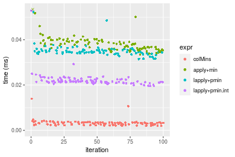


_Table: Benchmarking of colMins() and rowMins() on double+10x10 data (original and transposed).  The top panel shows times in milliseconds and the bottom panel shows relative times._


|   |expr    |   min|     lq|    mean| median|     uq|    max|
|:--|:-------|-----:|------:|-------:|------:|------:|------:|
|2  |rowMins | 1.981| 2.3840| 3.12508|  3.092| 3.5575| 14.820|
|1  |colMins | 1.998| 2.5055| 3.19651|  3.138| 3.4950| 13.934|


|   |expr    |      min|       lq|     mean|   median|        uq|       max|
|:--|:-------|--------:|--------:|--------:|--------:|---------:|---------:|
|2  |rowMins | 1.000000| 1.000000| 1.000000| 1.000000| 1.0000000| 1.0000000|
|1  |colMins | 1.008582| 1.050965| 1.022857| 1.014877| 0.9824315| 0.9402159|

_Figure: Benchmarking of colMins() and rowMins() on double+10x10 data (original and transposed).  Outliers are displayed as crosses. Times are in milliseconds._


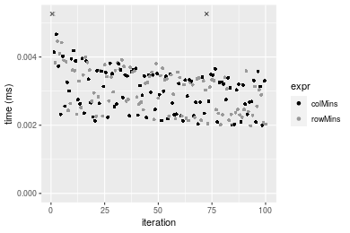

#### 100x100 double matrix


```r
> X <- data[["100x100"]]
> gc()
          used  (Mb) gc trigger  (Mb) max used  (Mb)
Ncells 5251309 280.5    8529671 455.6  8529671 455.6
Vcells 9968120  76.1   31876688 243.2 60562128 462.1
> colStats <- microbenchmark(colMins = colMins(X, na.rm = FALSE), `apply+min` = apply(X, MARGIN = 2L, 
+     FUN = min, na.rm = FALSE), `lapply+pmin` = do.call(pmin, lapply(seq_len(nrow(X)), function(i) X[i, 
+     ])), `lapply+pmin.int` = do.call(pmin.int, lapply(seq_len(nrow(X)), function(i) X[i, ])), unit = "ms")
> X <- t(X)
> gc()
          used  (Mb) gc trigger  (Mb) max used  (Mb)
Ncells 5251285 280.5    8529671 455.6  8529671 455.6
Vcells 9978197  76.2   31876688 243.2 60562128 462.1
> rowStats <- microbenchmark(rowMins = rowMins(X, na.rm = FALSE), `apply+min` = apply(X, MARGIN = 1L, 
+     FUN = min, na.rm = FALSE), `lapply+pmin` = do.call(pmin, lapply(seq_len(ncol(X)), function(i) X[, 
+     i])), `lapply+pmin.int` = do.call(pmin.int, lapply(seq_len(ncol(X)), function(i) X[, i])), unit = "ms")
```

_Table: Benchmarking of colMins(), apply+min(), lapply+pmin() and lapply+pmin.int() on double+100x100 data. The top panel shows times in milliseconds and the bottom panel shows relative times._


|   |expr            |      min|        lq|      mean|    median|        uq|      max|
|:--|:---------------|--------:|---------:|---------:|---------:|---------:|--------:|
|1  |colMins         | 0.023677| 0.0261010| 0.0301559| 0.0291890| 0.0317655| 0.052084|
|2  |apply+min       | 0.165868| 0.1785005| 0.2056516| 0.1978490| 0.2189710| 0.363973|
|4  |lapply+pmin.int | 0.172886| 0.1855755| 0.2154075| 0.2046485| 0.2312620| 0.433534|
|3  |lapply+pmin     | 0.228570| 0.2484515| 0.2819802| 0.2740650| 0.2975335| 0.459524|


|   |expr            |      min|       lq|     mean|   median|       uq|      max|
|:--|:---------------|--------:|--------:|--------:|--------:|--------:|--------:|
|1  |colMins         | 1.000000| 1.000000| 1.000000| 1.000000| 1.000000| 1.000000|
|2  |apply+min       | 7.005448| 6.838838| 6.819611| 6.778204| 6.893359| 6.988192|
|4  |lapply+pmin.int | 7.301854| 7.109900| 7.143128| 7.011152| 7.280288| 8.323746|
|3  |lapply+pmin     | 9.653672| 9.518850| 9.350746| 9.389325| 9.366561| 8.822748|

_Table: Benchmarking of rowMins(), apply+min(), lapply+pmin() and lapply+pmin.int() on double+100x100 data (transposed). The top panel shows times in milliseconds and the bottom panel shows relative times._


|   |expr            |      min|        lq|      mean|    median|        uq|      max|
|:--|:---------------|--------:|---------:|---------:|---------:|---------:|--------:|
|1  |rowMins         | 0.026255| 0.0296210| 0.0347608| 0.0339850| 0.0384645| 0.055810|
|4  |lapply+pmin.int | 0.147401| 0.1611060| 0.1827663| 0.1819535| 0.1937765| 0.298389|
|2  |apply+min       | 0.167141| 0.1795820| 0.2087781| 0.2038960| 0.2210330| 0.380344|
|3  |lapply+pmin     | 0.201589| 0.2220815| 0.2505038| 0.2475970| 0.2627900| 0.375251|


|   |expr            |      min|       lq|     mean|   median|       uq|      max|
|:--|:---------------|--------:|--------:|--------:|--------:|--------:|--------:|
|1  |rowMins         | 1.000000| 1.000000| 1.000000| 1.000000| 1.000000| 1.000000|
|4  |lapply+pmin.int | 5.614207| 5.438912| 5.257834| 5.353936| 5.037801| 5.346515|
|2  |apply+min       | 6.366064| 6.062658| 6.006142| 5.999588| 5.746416| 6.814979|
|3  |lapply+pmin     | 7.678119| 7.497434| 7.206509| 7.285479| 6.832014| 6.723723|

_Figure: Benchmarking of colMins(), apply+min(), lapply+pmin() and lapply+pmin.int() on double+100x100 data  as well as rowMins(), apply+min(), lapply+pmin() and lapply+pmin.int() on the same data transposed.  Outliers are displayed as crosses.  Times are in milliseconds._


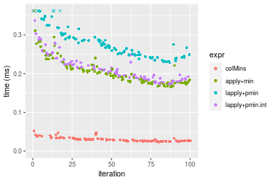

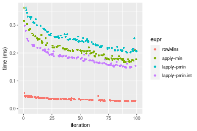
_Table: Benchmarking of colMins() and rowMins() on double+100x100 data (original and transposed).  The top panel shows times in milliseconds and the bottom panel shows relative times._


|   |expr    |    min|     lq|     mean| median|      uq|    max|
|:--|:-------|------:|------:|--------:|------:|-------:|------:|
|1  |colMins | 23.677| 26.101| 30.15591| 29.189| 31.7655| 52.084|
|2  |rowMins | 26.255| 29.621| 34.76077| 33.985| 38.4645| 55.810|


|   |expr    |      min|       lq|     mean|   median|       uq|      max|
|:--|:-------|--------:|--------:|--------:|--------:|--------:|--------:|
|1  |colMins | 1.000000| 1.000000| 1.000000| 1.000000| 1.000000| 1.000000|
|2  |rowMins | 1.108882| 1.134861| 1.152702| 1.164308| 1.210889| 1.071538|

_Figure: Benchmarking of colMins() and rowMins() on double+100x100 data (original and transposed).  Outliers are displayed as crosses. Times are in milliseconds._


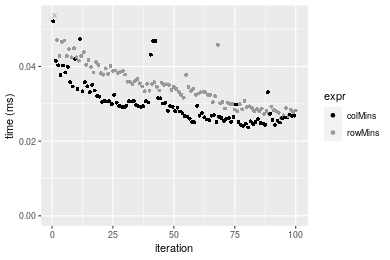

#### 1000x10 double matrix


```r
> X <- data[["1000x10"]]
> gc()
          used  (Mb) gc trigger  (Mb) max used  (Mb)
Ncells 5251515 280.5    8529671 455.6  8529671 455.6
Vcells 9969241  76.1   31876688 243.2 60562128 462.1
> colStats <- microbenchmark(colMins = colMins(X, na.rm = FALSE), `apply+min` = apply(X, MARGIN = 2L, 
+     FUN = min, na.rm = FALSE), `lapply+pmin` = do.call(pmin, lapply(seq_len(nrow(X)), function(i) X[i, 
+     ])), `lapply+pmin.int` = do.call(pmin.int, lapply(seq_len(nrow(X)), function(i) X[i, ])), unit = "ms")
> X <- t(X)
> gc()
          used  (Mb) gc trigger  (Mb) max used  (Mb)
Ncells 5251509 280.5    8529671 455.6  8529671 455.6
Vcells 9979348  76.2   31876688 243.2 60562128 462.1
> rowStats <- microbenchmark(rowMins = rowMins(X, na.rm = FALSE), `apply+min` = apply(X, MARGIN = 1L, 
+     FUN = min, na.rm = FALSE), `lapply+pmin` = do.call(pmin, lapply(seq_len(ncol(X)), function(i) X[, 
+     i])), `lapply+pmin.int` = do.call(pmin.int, lapply(seq_len(ncol(X)), function(i) X[, i])), unit = "ms")
```

_Table: Benchmarking of colMins(), apply+min(), lapply+pmin() and lapply+pmin.int() on double+1000x10 data. The top panel shows times in milliseconds and the bottom panel shows relative times._


|   |expr            |      min|        lq|      mean|   median|        uq|      max|
|:--|:---------------|--------:|---------:|---------:|--------:|---------:|--------:|
|1  |colMins         | 0.021997| 0.0242860| 0.0265977| 0.025224| 0.0265595| 0.068963|
|2  |apply+min       | 0.096774| 0.1063215| 0.1158731| 0.110821| 0.1172005| 0.235033|
|4  |lapply+pmin.int | 1.038897| 1.1553585| 1.2204119| 1.188010| 1.2416395| 2.431739|
|3  |lapply+pmin     | 1.530459| 1.7143695| 1.8709654| 1.766916| 1.8631005| 6.630570|


|   |expr            |       min|        lq|      mean|    median|        uq|       max|
|:--|:---------------|---------:|---------:|---------:|---------:|---------:|---------:|
|1  |colMins         |  1.000000|  1.000000|  1.000000|  1.000000|  1.000000|  1.000000|
|2  |apply+min       |  4.399418|  4.377893|  4.356508|  4.393474|  4.412752|  3.408103|
|4  |lapply+pmin.int | 47.229031| 47.573026| 45.884115| 47.098398| 46.749355| 35.261502|
|3  |lapply+pmin     | 69.575806| 70.590855| 70.343125| 70.048981| 70.148177| 96.146774|

_Table: Benchmarking of rowMins(), apply+min(), lapply+pmin() and lapply+pmin.int() on double+1000x10 data (transposed). The top panel shows times in milliseconds and the bottom panel shows relative times._


|   |expr            |      min|        lq|      mean|    median|        uq|      max|
|:--|:---------------|--------:|---------:|---------:|---------:|---------:|--------:|
|1  |rowMins         | 0.023627| 0.0271900| 0.0292032| 0.0287020| 0.0300185| 0.052191|
|2  |apply+min       | 0.095888| 0.1071055| 0.1161132| 0.1125895| 0.1192445| 0.192410|
|4  |lapply+pmin.int | 1.017413| 1.1128380| 1.2169178| 1.1503685| 1.1986465| 6.657355|
|3  |lapply+pmin     | 1.525861| 1.6821610| 1.7586292| 1.7375345| 1.8250130| 2.348565|


|   |expr            |       min|       lq|      mean|    median|        uq|        max|
|:--|:---------------|---------:|--------:|---------:|---------:|---------:|----------:|
|1  |rowMins         |  1.000000|  1.00000|  1.000000|  1.000000|  1.000000|   1.000000|
|2  |apply+min       |  4.058408|  3.93915|  3.976042|  3.922706|  3.972367|   3.686651|
|4  |lapply+pmin.int | 43.061455| 40.92821| 41.670673| 40.079733| 39.930260| 127.557529|
|3  |lapply+pmin     | 64.581242| 61.86690| 60.220387| 60.537053| 60.796276|  44.999425|

_Figure: Benchmarking of colMins(), apply+min(), lapply+pmin() and lapply+pmin.int() on double+1000x10 data  as well as rowMins(), apply+min(), lapply+pmin() and lapply+pmin.int() on the same data transposed.  Outliers are displayed as crosses.  Times are in milliseconds._


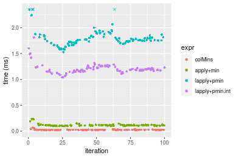

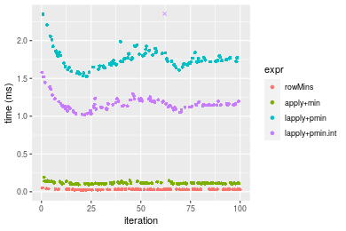
_Table: Benchmarking of colMins() and rowMins() on double+1000x10 data (original and transposed).  The top panel shows times in milliseconds and the bottom panel shows relative times._


|   |expr    |    min|     lq|     mean| median|      uq|    max|
|:--|:-------|------:|------:|--------:|------:|-------:|------:|
|1  |colMins | 21.997| 24.286| 26.59770| 25.224| 26.5595| 68.963|
|2  |rowMins | 23.627| 27.190| 29.20322| 28.702| 30.0185| 52.191|


|   |expr    |      min|       lq|    mean|   median|       uq|       max|
|:--|:-------|--------:|--------:|-------:|--------:|--------:|---------:|
|1  |colMins | 1.000000| 1.000000| 1.00000| 1.000000| 1.000000| 1.0000000|
|2  |rowMins | 1.074101| 1.119575| 1.09796| 1.137885| 1.130236| 0.7567971|

_Figure: Benchmarking of colMins() and rowMins() on double+1000x10 data (original and transposed).  Outliers are displayed as crosses. Times are in milliseconds._


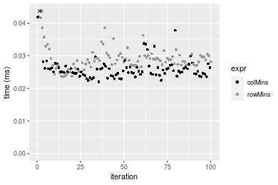

#### 10x1000 double matrix


```r
> X <- data[["10x1000"]]
> gc()
          used  (Mb) gc trigger  (Mb) max used  (Mb)
Ncells 5251743 280.5    8529671 455.6  8529671 455.6
Vcells 9969398  76.1   31876688 243.2 60562128 462.1
> colStats <- microbenchmark(colMins = colMins(X, na.rm = FALSE), `apply+min` = apply(X, MARGIN = 2L, 
+     FUN = min, na.rm = FALSE), `lapply+pmin` = do.call(pmin, lapply(seq_len(nrow(X)), function(i) X[i, 
+     ])), `lapply+pmin.int` = do.call(pmin.int, lapply(seq_len(nrow(X)), function(i) X[i, ])), unit = "ms")
> X <- t(X)
> gc()
          used  (Mb) gc trigger  (Mb) max used  (Mb)
Ncells 5251731 280.5    8529671 455.6  8529671 455.6
Vcells 9979495  76.2   31876688 243.2 60562128 462.1
> rowStats <- microbenchmark(rowMins = rowMins(X, na.rm = FALSE), `apply+min` = apply(X, MARGIN = 1L, 
+     FUN = min, na.rm = FALSE), `lapply+pmin` = do.call(pmin, lapply(seq_len(ncol(X)), function(i) X[, 
+     i])), `lapply+pmin.int` = do.call(pmin.int, lapply(seq_len(ncol(X)), function(i) X[, i])), unit = "ms")
```

_Table: Benchmarking of colMins(), apply+min(), lapply+pmin() and lapply+pmin.int() on double+10x1000 data. The top panel shows times in milliseconds and the bottom panel shows relative times._


|   |expr            |      min|        lq|      mean|    median|        uq|      max|
|:--|:---------------|--------:|---------:|---------:|---------:|---------:|--------:|
|1  |colMins         | 0.039752| 0.0437190| 0.0484646| 0.0462090| 0.0504145| 0.079809|
|4  |lapply+pmin.int | 0.100573| 0.1097125| 0.1185558| 0.1143175| 0.1255090| 0.167419|
|3  |lapply+pmin     | 0.109426| 0.1209245| 0.1339786| 0.1264700| 0.1412060| 0.229594|
|2  |apply+min       | 0.938959| 1.0064870| 1.0852165| 1.0653735| 1.1191365| 1.535932|


|   |expr            |       min|        lq|      mean|    median|        uq|       max|
|:--|:---------------|---------:|---------:|---------:|---------:|---------:|---------:|
|1  |colMins         |  1.000000|  1.000000|  1.000000|  1.000000|  1.000000|  1.000000|
|4  |lapply+pmin.int |  2.530011|  2.509492|  2.446234|  2.473923|  2.489542|  2.097746|
|3  |lapply+pmin     |  2.752717|  2.765948|  2.764462|  2.736913|  2.800901|  2.876793|
|2  |apply+min       | 23.620422| 23.021730| 22.391937| 23.055541| 22.198703| 19.245098|

_Table: Benchmarking of rowMins(), apply+min(), lapply+pmin() and lapply+pmin.int() on double+10x1000 data (transposed). The top panel shows times in milliseconds and the bottom panel shows relative times._


|   |expr            |      min|        lq|      mean|   median|        uq|      max|
|:--|:---------------|--------:|---------:|---------:|--------:|---------:|--------:|
|1  |rowMins         | 0.040033| 0.0433390| 0.0484441| 0.046561| 0.0517350| 0.091275|
|4  |lapply+pmin.int | 0.071748| 0.0770780| 0.0892832| 0.083807| 0.0964775| 0.141539|
|3  |lapply+pmin     | 0.081649| 0.0894985| 0.0988413| 0.094670| 0.1046090| 0.151546|
|2  |apply+min       | 0.936921| 1.0311710| 1.0894527| 1.064358| 1.1025045| 1.489842|


|   |expr            |       min|       lq|      mean|    median|        uq|       max|
|:--|:---------------|---------:|--------:|---------:|---------:|---------:|---------:|
|1  |rowMins         |  1.000000|  1.00000|  1.000000|  1.000000|  1.000000|  1.000000|
|4  |lapply+pmin.int |  1.792221|  1.77849|  1.843014|  1.799940|  1.864840|  1.550687|
|3  |lapply+pmin     |  2.039542|  2.06508|  2.040316|  2.033247|  2.022016|  1.660323|
|2  |apply+min       | 23.403717| 23.79314| 22.488858| 22.859432| 21.310612| 16.322564|

_Figure: Benchmarking of colMins(), apply+min(), lapply+pmin() and lapply+pmin.int() on double+10x1000 data  as well as rowMins(), apply+min(), lapply+pmin() and lapply+pmin.int() on the same data transposed.  Outliers are displayed as crosses.  Times are in milliseconds._


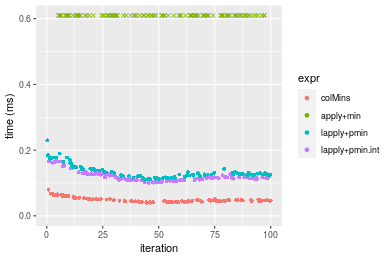

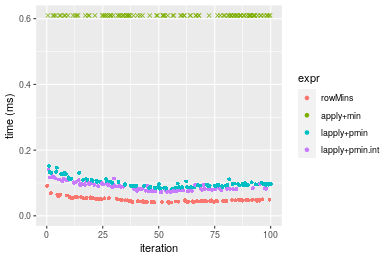
_Table: Benchmarking of colMins() and rowMins() on double+10x1000 data (original and transposed).  The top panel shows times in milliseconds and the bottom panel shows relative times._


|   |expr    |    min|     lq|     mean| median|      uq|    max|
|:--|:-------|------:|------:|--------:|------:|-------:|------:|
|1  |colMins | 39.752| 43.719| 48.46461| 46.209| 50.4145| 79.809|
|2  |rowMins | 40.033| 43.339| 48.44411| 46.561| 51.7350| 91.275|


|   |expr    |      min|        lq|     mean|   median|       uq|      max|
|:--|:-------|--------:|---------:|--------:|--------:|--------:|--------:|
|1  |colMins | 1.000000| 1.0000000| 1.000000| 1.000000| 1.000000| 1.000000|
|2  |rowMins | 1.007069| 0.9913081| 0.999577| 1.007618| 1.026193| 1.143668|

_Figure: Benchmarking of colMins() and rowMins() on double+10x1000 data (original and transposed).  Outliers are displayed as crosses. Times are in milliseconds._


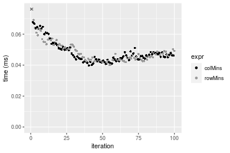

#### 100x1000 double matrix


```r
> X <- data[["100x1000"]]
> gc()
          used  (Mb) gc trigger  (Mb) max used  (Mb)
Ncells 5251973 280.5    8529671 455.6  8529671 455.6
Vcells 9970756  76.1   31876688 243.2 60562128 462.1
> colStats <- microbenchmark(colMins = colMins(X, na.rm = FALSE), `apply+min` = apply(X, MARGIN = 2L, 
+     FUN = min, na.rm = FALSE), `lapply+pmin` = do.call(pmin, lapply(seq_len(nrow(X)), function(i) X[i, 
+     ])), `lapply+pmin.int` = do.call(pmin.int, lapply(seq_len(nrow(X)), function(i) X[i, ])), unit = "ms")
> X <- t(X)
> gc()
           used  (Mb) gc trigger  (Mb) max used  (Mb)
Ncells  5251961 280.5    8529671 455.6  8529671 455.6
Vcells 10070853  76.9   31876688 243.2 60562128 462.1
> rowStats <- microbenchmark(rowMins = rowMins(X, na.rm = FALSE), `apply+min` = apply(X, MARGIN = 1L, 
+     FUN = min, na.rm = FALSE), `lapply+pmin` = do.call(pmin, lapply(seq_len(ncol(X)), function(i) X[, 
+     i])), `lapply+pmin.int` = do.call(pmin.int, lapply(seq_len(ncol(X)), function(i) X[, i])), unit = "ms")
```

_Table: Benchmarking of colMins(), apply+min(), lapply+pmin() and lapply+pmin.int() on double+100x1000 data. The top panel shows times in milliseconds and the bottom panel shows relative times._


|   |expr            |      min|        lq|      mean|   median|       uq|       max|
|:--|:---------------|--------:|---------:|---------:|--------:|--------:|---------:|
|1  |colMins         | 0.227381| 0.2548190| 0.2739132| 0.267334| 0.277895|  0.502656|
|4  |lapply+pmin.int | 0.863405| 0.9637765| 1.1428165| 0.987881| 1.027360| 14.176907|
|3  |lapply+pmin     | 0.915867| 0.9997155| 1.0604782| 1.050261| 1.085116|  1.476039|
|2  |apply+min       | 1.584813| 1.6895700| 1.9285642| 1.748488| 1.850658| 14.398383|


|   |expr            |      min|       lq|     mean|   median|       uq|       max|
|:--|:---------------|--------:|--------:|--------:|--------:|--------:|---------:|
|1  |colMins         | 1.000000| 1.000000| 1.000000| 1.000000| 1.000000|  1.000000|
|4  |lapply+pmin.int | 3.797173| 3.782200| 4.172184| 3.695306| 3.696936| 28.203994|
|3  |lapply+pmin     | 4.027896| 3.923238| 3.871584| 3.928649| 3.904770|  2.936479|
|2  |apply+min       | 6.969857| 6.630471| 7.040785| 6.540463| 6.659560| 28.644606|

_Table: Benchmarking of rowMins(), apply+min(), lapply+pmin() and lapply+pmin.int() on double+100x1000 data (transposed). The top panel shows times in milliseconds and the bottom panel shows relative times._


|   |expr            |      min|        lq|      mean|    median|        uq|       max|
|:--|:---------------|--------:|---------:|---------:|---------:|---------:|---------:|
|1  |rowMins         | 0.251866| 0.2734045| 0.2879059| 0.2838515| 0.2923460|  0.384646|
|4  |lapply+pmin.int | 0.581773| 0.6260660| 0.6624369| 0.6448945| 0.6725805|  0.945455|
|3  |lapply+pmin     | 0.638555| 0.6904935| 0.8486707| 0.7131885| 0.7489960| 13.055857|
|2  |apply+min       | 1.504383| 1.6841305| 1.9164179| 1.7282255| 1.8514770| 14.720780|


|   |expr            |      min|       lq|     mean|   median|       uq|       max|
|:--|:---------------|--------:|--------:|--------:|--------:|--------:|---------:|
|1  |rowMins         | 1.000000| 1.000000| 1.000000| 1.000000| 1.000000|  1.000000|
|4  |lapply+pmin.int | 2.309851| 2.289889| 2.300880| 2.271943| 2.300632|  2.457987|
|3  |lapply+pmin     | 2.535296| 2.525538| 2.947737| 2.512541| 2.562019| 33.942526|
|2  |apply+min       | 5.972950| 6.159849| 6.656404| 6.088485| 6.333170| 38.270982|

_Figure: Benchmarking of colMins(), apply+min(), lapply+pmin() and lapply+pmin.int() on double+100x1000 data  as well as rowMins(), apply+min(), lapply+pmin() and lapply+pmin.int() on the same data transposed.  Outliers are displayed as crosses.  Times are in milliseconds._


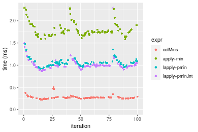

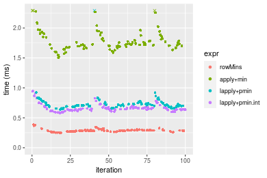
_Table: Benchmarking of colMins() and rowMins() on double+100x1000 data (original and transposed).  The top panel shows times in milliseconds and the bottom panel shows relative times._


|   |expr    |     min|       lq|     mean|   median|      uq|     max|
|:--|:-------|-------:|--------:|--------:|--------:|-------:|-------:|
|1  |colMins | 227.381| 254.8190| 273.9133| 267.3340| 277.895| 502.656|
|2  |rowMins | 251.866| 273.4045| 287.9059| 283.8515| 292.346| 384.646|


|   |expr    |      min|       lq|     mean|   median|       uq|       max|
|:--|:-------|--------:|--------:|--------:|--------:|--------:|---------:|
|1  |colMins | 1.000000| 1.000000| 1.000000| 1.000000| 1.000000| 1.0000000|
|2  |rowMins | 1.107683| 1.072936| 1.051084| 1.061786| 1.052002| 0.7652271|

_Figure: Benchmarking of colMins() and rowMins() on double+100x1000 data (original and transposed).  Outliers are displayed as crosses. Times are in milliseconds._


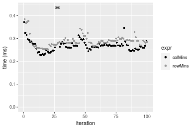

#### 1000x100 double matrix


```r
> X <- data[["1000x100"]]
> gc()
          used  (Mb) gc trigger  (Mb) max used  (Mb)
Ncells 5252191 280.5    8529671 455.6  8529671 455.6
Vcells 9970895  76.1   31876688 243.2 60562128 462.1
> colStats <- microbenchmark(colMins = colMins(X, na.rm = FALSE), `apply+min` = apply(X, MARGIN = 2L, 
+     FUN = min, na.rm = FALSE), `lapply+pmin` = do.call(pmin, lapply(seq_len(nrow(X)), function(i) X[i, 
+     ])), `lapply+pmin.int` = do.call(pmin.int, lapply(seq_len(nrow(X)), function(i) X[i, ])), unit = "ms")
> X <- t(X)
> gc()
           used  (Mb) gc trigger  (Mb) max used  (Mb)
Ncells  5252185 280.5    8529671 455.6  8529671 455.6
Vcells 10071002  76.9   31876688 243.2 60562128 462.1
> rowStats <- microbenchmark(rowMins = rowMins(X, na.rm = FALSE), `apply+min` = apply(X, MARGIN = 1L, 
+     FUN = min, na.rm = FALSE), `lapply+pmin` = do.call(pmin, lapply(seq_len(ncol(X)), function(i) X[, 
+     i])), `lapply+pmin.int` = do.call(pmin.int, lapply(seq_len(ncol(X)), function(i) X[, i])), unit = "ms")
```

_Table: Benchmarking of colMins(), apply+min(), lapply+pmin() and lapply+pmin.int() on double+1000x100 data. The top panel shows times in milliseconds and the bottom panel shows relative times._


|   |expr            |      min|       lq|      mean|   median|       uq|       max|
|:--|:---------------|--------:|--------:|---------:|--------:|--------:|---------:|
|1  |colMins         | 0.198985| 0.217623| 0.2302715| 0.226118| 0.235797|  0.318356|
|2  |apply+min       | 0.784831| 0.852859| 1.0999258| 0.877416| 0.908524| 19.860580|
|4  |lapply+pmin.int | 1.791695| 1.976490| 2.0853159| 2.025352| 2.102216|  3.437286|
|3  |lapply+pmin     | 2.259539| 2.573584| 2.8327318| 2.656083| 2.724118| 19.084852|


|   |expr            |       min|        lq|      mean|    median|        uq|      max|
|:--|:---------------|---------:|---------:|---------:|---------:|---------:|--------:|
|1  |colMins         |  1.000000|  1.000000|  1.000000|  1.000000|  1.000000|  1.00000|
|2  |apply+min       |  3.944172|  3.918975|  4.776647|  3.880346|  3.852992| 62.38481|
|4  |lapply+pmin.int |  9.004171|  9.082176|  9.055900|  8.957056|  8.915364| 10.79699|
|3  |lapply+pmin     | 11.355323| 11.825882| 12.301702| 11.746446| 11.552810| 59.94815|

_Table: Benchmarking of rowMins(), apply+min(), lapply+pmin() and lapply+pmin.int() on double+1000x100 data (transposed). The top panel shows times in milliseconds and the bottom panel shows relative times._


|   |expr            |      min|        lq|      mean|    median|        uq|       max|
|:--|:---------------|--------:|---------:|---------:|---------:|---------:|---------:|
|1  |rowMins         | 0.230426| 0.2557065| 0.2684111| 0.2635605| 0.2765010|  0.361881|
|2  |apply+min       | 0.803615| 0.8602285| 1.0989035| 0.8957240| 0.9356645| 18.147457|
|4  |lapply+pmin.int | 1.458839| 1.6289240| 1.7163720| 1.6748620| 1.7383040|  2.867851|
|3  |lapply+pmin     | 1.940831| 2.1925340| 2.4580825| 2.2610000| 2.3534130| 19.545645|


|   |expr            |      min|       lq|     mean|   median|       uq|       max|
|:--|:---------------|--------:|--------:|--------:|--------:|--------:|---------:|
|1  |rowMins         | 1.000000| 1.000000| 1.000000| 1.000000| 1.000000|  1.000000|
|2  |apply+min       | 3.487519| 3.364124| 4.094106| 3.398552| 3.383946| 50.147582|
|4  |lapply+pmin.int | 6.331052| 6.370288| 6.394564| 6.354754| 6.286791|  7.924845|
|3  |lapply+pmin     | 8.422795| 8.574416| 9.157902| 8.578675| 8.511409| 54.011250|

_Figure: Benchmarking of colMins(), apply+min(), lapply+pmin() and lapply+pmin.int() on double+1000x100 data  as well as rowMins(), apply+min(), lapply+pmin() and lapply+pmin.int() on the same data transposed.  Outliers are displayed as crosses.  Times are in milliseconds._


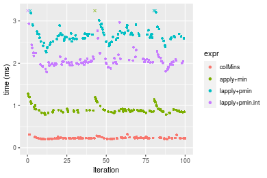

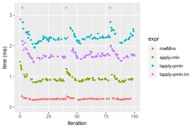
_Table: Benchmarking of colMins() and rowMins() on double+1000x100 data (original and transposed).  The top panel shows times in milliseconds and the bottom panel shows relative times._


|   |expr    |     min|       lq|     mean|   median|      uq|     max|
|:--|:-------|-------:|--------:|--------:|--------:|-------:|-------:|
|1  |colMins | 198.985| 217.6230| 230.2715| 226.1180| 235.797| 318.356|
|2  |rowMins | 230.426| 255.7065| 268.4111| 263.5605| 276.501| 361.881|


|   |expr    |      min|       lq|     mean|   median|       uq|      max|
|:--|:-------|--------:|--------:|--------:|--------:|--------:|--------:|
|1  |colMins | 1.000000| 1.000000| 1.000000| 1.000000| 1.000000| 1.000000|
|2  |rowMins | 1.158007| 1.174998| 1.165629| 1.165588| 1.172623| 1.136718|

_Figure: Benchmarking of colMins() and rowMins() on double+1000x100 data (original and transposed).  Outliers are displayed as crosses. Times are in milliseconds._


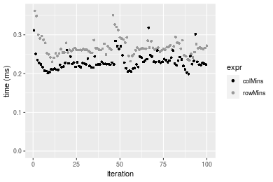


## Appendix

### Session information
```r
R version 4.1.1 Patched (2021-08-10 r80727)
Platform: x86_64-pc-linux-gnu (64-bit)
Running under: Ubuntu 18.04.5 LTS

Matrix products: default
BLAS:   /home/hb/software/R-devel/R-4-1-branch/lib/R/lib/libRblas.so
LAPACK: /home/hb/software/R-devel/R-4-1-branch/lib/R/lib/libRlapack.so

locale:
 [1] LC_CTYPE=en_US.UTF-8       LC_NUMERIC=C              
 [3] LC_TIME=en_US.UTF-8        LC_COLLATE=en_US.UTF-8    
 [5] LC_MONETARY=en_US.UTF-8    LC_MESSAGES=en_US.UTF-8   
 [7] LC_PAPER=en_US.UTF-8       LC_NAME=C                 
 [9] LC_ADDRESS=C               LC_TELEPHONE=C            
[11] LC_MEASUREMENT=en_US.UTF-8 LC_IDENTIFICATION=C       

attached base packages:
[1] stats     graphics  grDevices utils     datasets  methods   base     

other attached packages:
[1] microbenchmark_1.4-7   matrixStats_0.60.1     ggplot2_3.3.5         
[4] knitr_1.33             R.devices_2.17.0       R.utils_2.10.1        
[7] R.oo_1.24.0            R.methodsS3_1.8.1-9001 history_0.0.1-9000    

loaded via a namespace (and not attached):
 [1] Biobase_2.52.0          httr_1.4.2              splines_4.1.1          
 [4] bit64_4.0.5             network_1.17.1          assertthat_0.2.1       
 [7] highr_0.9               stats4_4.1.1            blob_1.2.2             
[10] GenomeInfoDbData_1.2.6  robustbase_0.93-8       pillar_1.6.2           
[13] RSQLite_2.2.8           lattice_0.20-44         glue_1.4.2             
[16] digest_0.6.27           XVector_0.32.0          colorspace_2.0-2       
[19] Matrix_1.3-4            XML_3.99-0.7            pkgconfig_2.0.3        
[22] zlibbioc_1.38.0         genefilter_1.74.0       purrr_0.3.4            
[25] ergm_4.1.2              xtable_1.8-4            scales_1.1.1           
[28] tibble_3.1.4            annotate_1.70.0         KEGGREST_1.32.0        
[31] farver_2.1.0            generics_0.1.0          IRanges_2.26.0         
[34] ellipsis_0.3.2          cachem_1.0.6            withr_2.4.2            
[37] BiocGenerics_0.38.0     mime_0.11               survival_3.2-13        
[40] magrittr_2.0.1          crayon_1.4.1            statnet.common_4.5.0   
[43] memoise_2.0.0           laeken_0.5.1            fansi_0.5.0            
[46] R.cache_0.15.0          MASS_7.3-54             R.rsp_0.44.0           
[49] progressr_0.8.0         tools_4.1.1             lifecycle_1.0.0        
[52] S4Vectors_0.30.0        trust_0.1-8             munsell_0.5.0          
[55] tabby_0.0.1-9001        AnnotationDbi_1.54.1    Biostrings_2.60.2      
[58] compiler_4.1.1          GenomeInfoDb_1.28.1     rlang_0.4.11           
[61] grid_4.1.1              RCurl_1.98-1.4          cwhmisc_6.6            
[64] rappdirs_0.3.3          startup_0.15.0          labeling_0.4.2         
[67] bitops_1.0-7            base64enc_0.1-3         boot_1.3-28            
[70] gtable_0.3.0            DBI_1.1.1               markdown_1.1           
[73] R6_2.5.1                lpSolveAPI_5.5.2.0-17.7 rle_0.9.2              
[76] dplyr_1.0.7             fastmap_1.1.0           bit_4.0.4              
[79] utf8_1.2.2              parallel_4.1.1          Rcpp_1.0.7             
[82] vctrs_0.3.8             png_0.1-7               DEoptimR_1.0-9         
[85] tidyselect_1.1.1        xfun_0.25               coda_0.19-4            
```
Total processing time was 29.15 secs.


### Reproducibility
To reproduce this report, do:
```r
html <- matrixStats:::benchmark('colMins')
```

[RSP]: https://cran.r-project.org/package=R.rsp
[matrixStats]: https://cran.r-project.org/package=matrixStats

[StackOverflow:colMins?]: https://stackoverflow.com/questions/13676878 "Stack Overflow: fastest way to get Min from every column in a matrix?"
[StackOverflow:colSds?]: https://stackoverflow.com/questions/17549762 "Stack Overflow: Is there such 'colsd' in R?"
[StackOverflow:rowProds?]: https://stackoverflow.com/questions/20198801/ "Stack Overflow: Row product of matrix and column sum of matrix"

---------------------------------------
Copyright Henrik Bengtsson. Last updated on 2021-08-25 19:01:20 (+0200 UTC). Powered by [RSP].

<script>
 var link = document.createElement('link');
 link.rel = 'icon';
 link.href = "data:image/png;base64,iVBORw0KGgoAAAANSUhEUgAAACAAAAAgCAMAAABEpIrGAAAA21BMVEUAAAAAAP8AAP8AAP8AAP8AAP8AAP8AAP8AAP8AAP8AAP8AAP8AAP8AAP8AAP8AAP8AAP8AAP8AAP8AAP8AAP8AAP8AAP8AAP8AAP8AAP8AAP8AAP8AAP8AAP8AAP8AAP8AAP8AAP8AAP8AAP8AAP8AAP8AAP8AAP8AAP8AAP8BAf4CAv0DA/wdHeIeHuEfH+AgIN8hId4lJdomJtknJ9g+PsE/P8BAQL9yco10dIt1dYp3d4h4eIeVlWqWlmmXl2iYmGeZmWabm2Tn5xjo6Bfp6Rb39wj4+Af//wA2M9hbAAAASXRSTlMAAQIJCgsMJSYnKD4/QGRlZmhpamtsbautrrCxuru8y8zN5ebn6Pn6+///////////////////////////////////////////LsUNcQAAAS9JREFUOI29k21XgkAQhVcFytdSMqMETU26UVqGmpaiFbL//xc1cAhhwVNf6n5i5z67M2dmYOyfJZUqlVLhkKucG7cgmUZTybDz6g0iDeq51PUr37Ds2cy2/C9NeES5puDjxuUk1xnToZsg8pfA3avHQ3lLIi7iWRrkv/OYtkScxBIMgDee0ALoyxHQBJ68JLCjOtQIMIANF7QG9G9fNnHvisCHBVMKgSJgiz7nE+AoBKrAPA3MgepvgR9TSCasrCKH0eB1wBGBFdCO+nAGjMVGPcQb5bd6mQRegN6+1axOs9nGfYcCtfi4NQosdtH7dB+txFIpXQqN1p9B/asRHToyS0jRgpV7nk4nwcq1BJ+x3Gl/v7S9Wmpp/aGquum7w3ZDyrADFYrl8vHBH+ev9AUASW1dmU4h4wAAAABJRU5ErkJggg=="
 document.getElementsByTagName('head')[0].appendChild(link);
</script>


