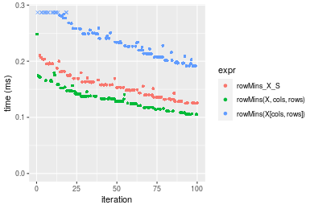

[matrixStats]: Benchmark report

---------------------------------------


# colMins() and rowMins() benchmarks on subsetted computation

This report benchmark the performance of colMins() and rowMins() on subsetted computation.


## Data type "integer"

### Data
```r
> rmatrix <- function(nrow, ncol, mode = c("logical", "double", "integer", "index"), range = c(-100, 
+     +100), na_prob = 0) {
+     mode <- match.arg(mode)
+     n <- nrow * ncol
+     if (mode == "logical") {
+         x <- sample(c(FALSE, TRUE), size = n, replace = TRUE)
+     }     else if (mode == "index") {
+         x <- seq_len(n)
+         mode <- "integer"
+     }     else {
+         x <- runif(n, min = range[1], max = range[2])
+     }
+     storage.mode(x) <- mode
+     if (na_prob > 0) 
+         x[sample(n, size = na_prob * n)] <- NA
+     dim(x) <- c(nrow, ncol)
+     x
+ }
> rmatrices <- function(scale = 10, seed = 1, ...) {
+     set.seed(seed)
+     data <- list()
+     data[[1]] <- rmatrix(nrow = scale * 1, ncol = scale * 1, ...)
+     data[[2]] <- rmatrix(nrow = scale * 10, ncol = scale * 10, ...)
+     data[[3]] <- rmatrix(nrow = scale * 100, ncol = scale * 1, ...)
+     data[[4]] <- t(data[[3]])
+     data[[5]] <- rmatrix(nrow = scale * 10, ncol = scale * 100, ...)
+     data[[6]] <- t(data[[5]])
+     names(data) <- sapply(data, FUN = function(x) paste(dim(x), collapse = "x"))
+     data
+ }
> data <- rmatrices(mode = mode)
```

### Results

#### 10x10 integer matrix


```r
> X <- data[["10x10"]]
> rows <- sample.int(nrow(X), size = nrow(X) * 0.7)
> cols <- sample.int(ncol(X), size = ncol(X) * 0.7)
> X_S <- X[rows, cols]
> gc()
           used  (Mb) gc trigger  (Mb) max used  (Mb)
Ncells  5255602 280.7    8529671 455.6  8529671 455.6
Vcells 10179002  77.7   31876688 243.2 60562128 462.1
> colStats <- microbenchmark(colMins_X_S = colMins(X_S, na.rm = FALSE), `colMins(X, rows, cols)` = colMins(X, 
+     rows = rows, cols = cols, na.rm = FALSE), `colMins(X[rows, cols])` = colMins(X[rows, cols], na.rm = FALSE), 
+     unit = "ms")
> X <- t(X)
> X_S <- t(X_S)
> gc()
           used  (Mb) gc trigger  (Mb) max used  (Mb)
Ncells  5246833 280.3    8529671 455.6  8529671 455.6
Vcells 10150363  77.5   31876688 243.2 60562128 462.1
> rowStats <- microbenchmark(rowMins_X_S = rowMins(X_S, na.rm = FALSE), `rowMins(X, cols, rows)` = rowMins(X, 
+     rows = cols, cols = rows, na.rm = FALSE), `rowMins(X[cols, rows])` = rowMins(X[cols, rows], na.rm = FALSE), 
+     unit = "ms")
```

_Table: Benchmarking of colMins_X_S(), colMins(X, rows, cols)() and colMins(X[rows, cols])() on integer+10x10 data. The top panel shows times in milliseconds and the bottom panel shows relative times._


|   |expr                   |      min|        lq|      mean|    median|        uq|      max|
|:--|:----------------------|--------:|---------:|---------:|---------:|---------:|--------:|
|1  |colMins_X_S            | 0.001824| 0.0019145| 0.0028551| 0.0019550| 0.0020350| 0.088238|
|2  |colMins(X, rows, cols) | 0.002216| 0.0023135| 0.0024317| 0.0023595| 0.0024805| 0.004936|
|3  |colMins(X[rows, cols]) | 0.002652| 0.0028795| 0.0030817| 0.0029765| 0.0031300| 0.007775|


|   |expr                   |      min|       lq|     mean|   median|       uq|       max|
|:--|:----------------------|--------:|--------:|--------:|--------:|--------:|---------:|
|1  |colMins_X_S            | 1.000000| 1.000000| 1.000000| 1.000000| 1.000000| 1.0000000|
|2  |colMins(X, rows, cols) | 1.214912| 1.208409| 0.851675| 1.206905| 1.218919| 0.0559396|
|3  |colMins(X[rows, cols]) | 1.453947| 1.504048| 1.079362| 1.522506| 1.538083| 0.0881140|

_Table: Benchmarking of rowMins_X_S(), rowMins(X, cols, rows)() and rowMins(X[cols, rows])() on integer+10x10 data (transposed). The top panel shows times in milliseconds and the bottom panel shows relative times._


|   |expr                   |      min|       lq|      mean|    median|        uq|      max|
|:--|:----------------------|--------:|--------:|---------:|---------:|---------:|--------:|
|1  |rowMins_X_S            | 0.001895| 0.001980| 0.0021116| 0.0020505| 0.0021580| 0.004468|
|2  |rowMins(X, cols, rows) | 0.002313| 0.002386| 0.0033428| 0.0024475| 0.0025790| 0.087173|
|3  |rowMins(X[cols, rows]) | 0.002761| 0.002978| 0.0031251| 0.0030610| 0.0031565| 0.005473|


|   |expr                   |      min|       lq|     mean|   median|       uq|       max|
|:--|:----------------------|--------:|--------:|--------:|--------:|--------:|---------:|
|1  |rowMins_X_S            | 1.000000| 1.000000| 1.000000| 1.000000| 1.000000|  1.000000|
|2  |rowMins(X, cols, rows) | 1.220581| 1.205051| 1.583119| 1.193611| 1.195088| 19.510519|
|3  |rowMins(X[cols, rows]) | 1.456992| 1.504040| 1.479982| 1.492807| 1.462697|  1.224933|

_Figure: Benchmarking of colMins_X_S(), colMins(X, rows, cols)() and colMins(X[rows, cols])() on integer+10x10 data  as well as rowMins_X_S(), rowMins(X, cols, rows)() and rowMins(X[cols, rows])() on the same data transposed.  Outliers are displayed as crosses.  Times are in milliseconds._


_Table: Benchmarking of colMins_X_S() and rowMins_X_S() on integer+10x10 data (original and transposed).  The top panel shows times in milliseconds and the bottom panel shows relative times._


|   |expr        |   min|     lq|    mean| median|    uq|    max|
|:--|:-----------|-----:|------:|-------:|------:|-----:|------:|
|1  |colMins_X_S | 1.824| 1.9145| 2.85515| 1.9550| 2.035| 88.238|
|2  |rowMins_X_S | 1.895| 1.9800| 2.11156| 2.0505| 2.158|  4.468|


|   |expr        |      min|       lq|      mean|   median|       uq|       max|
|:--|:-----------|--------:|--------:|---------:|--------:|--------:|---------:|
|1  |colMins_X_S | 1.000000| 1.000000| 1.0000000| 1.000000| 1.000000| 1.0000000|
|2  |rowMins_X_S | 1.038925| 1.034213| 0.7395618| 1.048849| 1.060442| 0.0506358|

_Figure: Benchmarking of colMins_X_S() and rowMins_X_S() on integer+10x10 data (original and transposed).  Outliers are displayed as crosses. Times are in milliseconds._


#### 100x100 integer matrix


```r
> X <- data[["100x100"]]
> rows <- sample.int(nrow(X), size = nrow(X) * 0.7)
> cols <- sample.int(ncol(X), size = ncol(X) * 0.7)
> X_S <- X[rows, cols]
> gc()
          used  (Mb) gc trigger  (Mb) max used  (Mb)
Ncells 5245449 280.2    8529671 455.6  8529671 455.6
Vcells 9819235  75.0   31876688 243.2 60562128 462.1
> colStats <- microbenchmark(colMins_X_S = colMins(X_S, na.rm = FALSE), `colMins(X, rows, cols)` = colMins(X, 
+     rows = rows, cols = cols, na.rm = FALSE), `colMins(X[rows, cols])` = colMins(X[rows, cols], na.rm = FALSE), 
+     unit = "ms")
> X <- t(X)
> X_S <- t(X_S)
> gc()
          used  (Mb) gc trigger  (Mb) max used  (Mb)
Ncells 5245425 280.2    8529671 455.6  8529671 455.6
Vcells 9824288  75.0   31876688 243.2 60562128 462.1
> rowStats <- microbenchmark(rowMins_X_S = rowMins(X_S, na.rm = FALSE), `rowMins(X, cols, rows)` = rowMins(X, 
+     rows = cols, cols = rows, na.rm = FALSE), `rowMins(X[cols, rows])` = rowMins(X[cols, rows], na.rm = FALSE), 
+     unit = "ms")
```

_Table: Benchmarking of colMins_X_S(), colMins(X, rows, cols)() and colMins(X[rows, cols])() on integer+100x100 data. The top panel shows times in milliseconds and the bottom panel shows relative times._


|   |expr                   |      min|        lq|      mean|    median|        uq|      max|
|:--|:----------------------|--------:|---------:|---------:|---------:|---------:|--------:|
|2  |colMins(X, rows, cols) | 0.016246| 0.0173075| 0.0176170| 0.0175725| 0.0178660| 0.021259|
|1  |colMins_X_S            | 0.017303| 0.0182985| 0.0184890| 0.0184670| 0.0186440| 0.023789|
|3  |colMins(X[rows, cols]) | 0.028228| 0.0295035| 0.0304097| 0.0298320| 0.0301315| 0.061707|


|   |expr                   |      min|       lq|    mean|   median|       uq|      max|
|:--|:----------------------|--------:|--------:|-------:|--------:|--------:|--------:|
|2  |colMins(X, rows, cols) | 1.000000| 1.000000| 1.00000| 1.000000| 1.000000| 1.000000|
|1  |colMins_X_S            | 1.065062| 1.057258| 1.04950| 1.050903| 1.043546| 1.119008|
|3  |colMins(X[rows, cols]) | 1.737535| 1.704666| 1.72616| 1.697653| 1.686527| 2.902630|

_Table: Benchmarking of rowMins_X_S(), rowMins(X, cols, rows)() and rowMins(X[cols, rows])() on integer+100x100 data (transposed). The top panel shows times in milliseconds and the bottom panel shows relative times._


|   |expr                   |      min|        lq|      mean|    median|        uq|      max|
|:--|:----------------------|--------:|---------:|---------:|---------:|---------:|--------:|
|2  |rowMins(X, cols, rows) | 0.020058| 0.0213765| 0.0225047| 0.0222750| 0.0228580| 0.045919|
|1  |rowMins_X_S            | 0.022125| 0.0234000| 0.0241292| 0.0243645| 0.0247175| 0.030877|
|3  |rowMins(X[cols, rows]) | 0.032824| 0.0344555| 0.0357612| 0.0357735| 0.0362945| 0.050519|


|   |expr                   |      min|      lq|     mean|   median|       uq|       max|
|:--|:----------------------|--------:|-------:|--------:|--------:|--------:|---------:|
|2  |rowMins(X, cols, rows) | 1.000000| 1.00000| 1.000000| 1.000000| 1.000000| 1.0000000|
|1  |rowMins_X_S            | 1.103051| 1.09466| 1.072184| 1.093805| 1.081350| 0.6724232|
|3  |rowMins(X[cols, rows]) | 1.636454| 1.61184| 1.589050| 1.605993| 1.587825| 1.1001764|

_Figure: Benchmarking of colMins_X_S(), colMins(X, rows, cols)() and colMins(X[rows, cols])() on integer+100x100 data  as well as rowMins_X_S(), rowMins(X, cols, rows)() and rowMins(X[cols, rows])() on the same data transposed.  Outliers are displayed as crosses.  Times are in milliseconds._


_Table: Benchmarking of colMins_X_S() and rowMins_X_S() on integer+100x100 data (original and transposed).  The top panel shows times in milliseconds and the bottom panel shows relative times._


|   |expr        |    min|      lq|     mean|  median|      uq|    max|
|:--|:-----------|------:|-------:|--------:|-------:|-------:|------:|
|1  |colMins_X_S | 17.303| 18.2985| 18.48900| 18.4670| 18.6440| 23.789|
|2  |rowMins_X_S | 22.125| 23.4000| 24.12922| 24.3645| 24.7175| 30.877|


|   |expr        |     min|       lq|     mean|   median|       uq|      max|
|:--|:-----------|-------:|--------:|--------:|--------:|--------:|--------:|
|1  |colMins_X_S | 1.00000| 1.000000| 1.000000| 1.000000| 1.000000| 1.000000|
|2  |rowMins_X_S | 1.27868| 1.278793| 1.305058| 1.319353| 1.325762| 1.297953|

_Figure: Benchmarking of colMins_X_S() and rowMins_X_S() on integer+100x100 data (original and transposed).  Outliers are displayed as crosses. Times are in milliseconds._


#### 1000x10 integer matrix


```r
> X <- data[["1000x10"]]
> rows <- sample.int(nrow(X), size = nrow(X) * 0.7)
> cols <- sample.int(ncol(X), size = ncol(X) * 0.7)
> X_S <- X[rows, cols]
> gc()
          used  (Mb) gc trigger  (Mb) max used  (Mb)
Ncells 5246191 280.2    8529671 455.6  8529671 455.6
Vcells 9823276  75.0   31876688 243.2 60562128 462.1
> colStats <- microbenchmark(colMins_X_S = colMins(X_S, na.rm = FALSE), `colMins(X, rows, cols)` = colMins(X, 
+     rows = rows, cols = cols, na.rm = FALSE), `colMins(X[rows, cols])` = colMins(X[rows, cols], na.rm = FALSE), 
+     unit = "ms")
> X <- t(X)
> X_S <- t(X_S)
> gc()
          used  (Mb) gc trigger  (Mb) max used  (Mb)
Ncells 5246167 280.2    8529671 455.6  8529671 455.6
Vcells 9828329  75.0   31876688 243.2 60562128 462.1
> rowStats <- microbenchmark(rowMins_X_S = rowMins(X_S, na.rm = FALSE), `rowMins(X, cols, rows)` = rowMins(X, 
+     rows = cols, cols = rows, na.rm = FALSE), `rowMins(X[cols, rows])` = rowMins(X[cols, rows], na.rm = FALSE), 
+     unit = "ms")
```

_Table: Benchmarking of colMins_X_S(), colMins(X, rows, cols)() and colMins(X[rows, cols])() on integer+1000x10 data. The top panel shows times in milliseconds and the bottom panel shows relative times._


|   |expr                   |      min|        lq|      mean|    median|        uq|      max|
|:--|:----------------------|--------:|---------:|---------:|---------:|---------:|--------:|
|1  |colMins_X_S            | 0.012624| 0.0127975| 0.0130295| 0.0128785| 0.0130165| 0.022591|
|2  |colMins(X, rows, cols) | 0.013766| 0.0141075| 0.0145299| 0.0143240| 0.0146560| 0.019234|
|3  |colMins(X[rows, cols]) | 0.024394| 0.0247165| 0.0253511| 0.0249745| 0.0251640| 0.050858|


|   |expr                   |      min|       lq|     mean|   median|       uq|      max|
|:--|:----------------------|--------:|--------:|--------:|--------:|--------:|--------:|
|1  |colMins_X_S            | 1.000000| 1.000000| 1.000000| 1.000000| 1.000000| 1.000000|
|2  |colMins(X, rows, cols) | 1.090463| 1.102364| 1.115148| 1.112241| 1.125956| 0.851401|
|3  |colMins(X[rows, cols]) | 1.932351| 1.931354| 1.945663| 1.939240| 1.933239| 2.251250|

_Table: Benchmarking of rowMins_X_S(), rowMins(X, cols, rows)() and rowMins(X[cols, rows])() on integer+1000x10 data (transposed). The top panel shows times in milliseconds and the bottom panel shows relative times._


|   |expr                   |      min|        lq|      mean|    median|        uq|      max|
|:--|:----------------------|--------:|---------:|---------:|---------:|---------:|--------:|
|1  |rowMins_X_S            | 0.021538| 0.0224915| 0.0231572| 0.0227275| 0.0237150| 0.036367|
|2  |rowMins(X, cols, rows) | 0.020882| 0.0220075| 0.0226914| 0.0228020| 0.0232315| 0.028191|
|3  |rowMins(X[cols, rows]) | 0.033943| 0.0355290| 0.0369136| 0.0360005| 0.0374970| 0.071707|


|   |expr                   |       min|        lq|      mean|   median|        uq|       max|
|:--|:----------------------|---------:|---------:|---------:|--------:|---------:|---------:|
|1  |rowMins_X_S            | 1.0000000| 1.0000000| 1.0000000| 1.000000| 1.0000000| 1.0000000|
|2  |rowMins(X, cols, rows) | 0.9695422| 0.9784808| 0.9798866| 1.003278| 0.9796121| 0.7751808|
|3  |rowMins(X[cols, rows]) | 1.5759588| 1.5796634| 1.5940471| 1.584006| 1.5811512| 1.9717601|

_Figure: Benchmarking of colMins_X_S(), colMins(X, rows, cols)() and colMins(X[rows, cols])() on integer+1000x10 data  as well as rowMins_X_S(), rowMins(X, cols, rows)() and rowMins(X[cols, rows])() on the same data transposed.  Outliers are displayed as crosses.  Times are in milliseconds._


_Table: Benchmarking of colMins_X_S() and rowMins_X_S() on integer+1000x10 data (original and transposed).  The top panel shows times in milliseconds and the bottom panel shows relative times._


|   |expr        |    min|      lq|     mean|  median|      uq|    max|
|:--|:-----------|------:|-------:|--------:|-------:|-------:|------:|
|1  |colMins_X_S | 12.624| 12.7975| 13.02954| 12.8785| 13.0165| 22.591|
|2  |rowMins_X_S | 21.538| 22.4915| 23.15717| 22.7275| 23.7150| 36.367|


|   |expr        |      min|       lq|     mean|   median|       uq|    max|
|:--|:-----------|--------:|--------:|--------:|--------:|--------:|------:|
|1  |colMins_X_S | 1.000000| 1.000000| 1.000000| 1.000000| 1.000000| 1.0000|
|2  |rowMins_X_S | 1.706115| 1.757492| 1.777282| 1.764763| 1.821918| 1.6098|

_Figure: Benchmarking of colMins_X_S() and rowMins_X_S() on integer+1000x10 data (original and transposed).  Outliers are displayed as crosses. Times are in milliseconds._


#### 10x1000 integer matrix


```r
> X <- data[["10x1000"]]
> rows <- sample.int(nrow(X), size = nrow(X) * 0.7)
> cols <- sample.int(ncol(X), size = ncol(X) * 0.7)
> X_S <- X[rows, cols]
> gc()
          used  (Mb) gc trigger  (Mb) max used  (Mb)
Ncells 5246395 280.2    8529671 455.6  8529671 455.6
Vcells 9824092  75.0   31876688 243.2 60562128 462.1
> colStats <- microbenchmark(colMins_X_S = colMins(X_S, na.rm = FALSE), `colMins(X, rows, cols)` = colMins(X, 
+     rows = rows, cols = cols, na.rm = FALSE), `colMins(X[rows, cols])` = colMins(X[rows, cols], na.rm = FALSE), 
+     unit = "ms")
> X <- t(X)
> X_S <- t(X_S)
> gc()
          used  (Mb) gc trigger  (Mb) max used  (Mb)
Ncells 5246371 280.2    8529671 455.6  8529671 455.6
Vcells 9829145  75.0   31876688 243.2 60562128 462.1
> rowStats <- microbenchmark(rowMins_X_S = rowMins(X_S, na.rm = FALSE), `rowMins(X, cols, rows)` = rowMins(X, 
+     rows = cols, cols = rows, na.rm = FALSE), `rowMins(X[cols, rows])` = rowMins(X[cols, rows], na.rm = FALSE), 
+     unit = "ms")
```

_Table: Benchmarking of colMins_X_S(), colMins(X, rows, cols)() and colMins(X[rows, cols])() on integer+10x1000 data. The top panel shows times in milliseconds and the bottom panel shows relative times._


|   |expr                   |      min|       lq|      mean|    median|        uq|      max|
|:--|:----------------------|--------:|--------:|---------:|---------:|---------:|--------:|
|1  |colMins_X_S            | 0.027145| 0.030413| 0.0311386| 0.0310520| 0.0317120| 0.049130|
|2  |colMins(X, rows, cols) | 0.032023| 0.034360| 0.0360924| 0.0356090| 0.0374095| 0.054955|
|3  |colMins(X[rows, cols]) | 0.040437| 0.043705| 0.0449355| 0.0447285| 0.0458695| 0.058580|


|   |expr                   |      min|      lq|     mean|   median|       uq|      max|
|:--|:----------------------|--------:|-------:|--------:|--------:|--------:|--------:|
|1  |colMins_X_S            | 1.000000| 1.00000| 1.000000| 1.000000| 1.000000| 1.000000|
|2  |colMins(X, rows, cols) | 1.179702| 1.12978| 1.159087| 1.146754| 1.179664| 1.118563|
|3  |colMins(X[rows, cols]) | 1.489667| 1.43705| 1.443078| 1.440439| 1.446440| 1.192347|

_Table: Benchmarking of rowMins_X_S(), rowMins(X, cols, rows)() and rowMins(X[cols, rows])() on integer+10x1000 data (transposed). The top panel shows times in milliseconds and the bottom panel shows relative times._


|   |expr                   |      min|        lq|      mean|    median|        uq|      max|
|:--|:----------------------|--------:|---------:|---------:|---------:|---------:|--------:|
|1  |rowMins_X_S            | 0.030415| 0.0322585| 0.0336089| 0.0337605| 0.0346190| 0.050089|
|2  |rowMins(X, cols, rows) | 0.028900| 0.0328595| 0.0344084| 0.0338655| 0.0358275| 0.063049|
|3  |rowMins(X[cols, rows]) | 0.040093| 0.0430085| 0.0450824| 0.0450740| 0.0467100| 0.058829|


|   |expr                   |       min|       lq|     mean|   median|       uq|      max|
|:--|:----------------------|---------:|--------:|--------:|--------:|--------:|--------:|
|1  |rowMins_X_S            | 1.0000000| 1.000000| 1.000000| 1.000000| 1.000000| 1.000000|
|2  |rowMins(X, cols, rows) | 0.9501891| 1.018631| 1.023789| 1.003110| 1.034909| 1.258739|
|3  |rowMins(X[cols, rows]) | 1.3181983| 1.333246| 1.341383| 1.335111| 1.349259| 1.174489|

_Figure: Benchmarking of colMins_X_S(), colMins(X, rows, cols)() and colMins(X[rows, cols])() on integer+10x1000 data  as well as rowMins_X_S(), rowMins(X, cols, rows)() and rowMins(X[cols, rows])() on the same data transposed.  Outliers are displayed as crosses.  Times are in milliseconds._


_Table: Benchmarking of colMins_X_S() and rowMins_X_S() on integer+10x1000 data (original and transposed).  The top panel shows times in milliseconds and the bottom panel shows relative times._


|   |expr        |    min|      lq|     mean|  median|     uq|    max|
|:--|:-----------|------:|-------:|--------:|-------:|------:|------:|
|1  |colMins_X_S | 27.145| 30.4130| 31.13861| 31.0520| 31.712| 49.130|
|2  |rowMins_X_S | 30.415| 32.2585| 33.60889| 33.7605| 34.619| 50.089|


|   |expr        |      min|       lq|     mean|   median|       uq|     max|
|:--|:-----------|--------:|--------:|--------:|--------:|--------:|-------:|
|1  |colMins_X_S | 1.000000| 1.000000| 1.000000| 1.000000| 1.000000| 1.00000|
|2  |rowMins_X_S | 1.120464| 1.060681| 1.079332| 1.087225| 1.091669| 1.01952|

_Figure: Benchmarking of colMins_X_S() and rowMins_X_S() on integer+10x1000 data (original and transposed).  Outliers are displayed as crosses. Times are in milliseconds._


#### 100x1000 integer matrix


```r
> X <- data[["100x1000"]]
> rows <- sample.int(nrow(X), size = nrow(X) * 0.7)
> cols <- sample.int(ncol(X), size = ncol(X) * 0.7)
> X_S <- X[rows, cols]
> gc()
          used  (Mb) gc trigger  (Mb) max used  (Mb)
Ncells 5246608 280.2    8529671 455.6  8529671 455.6
Vcells 9846763  75.2   31876688 243.2 60562128 462.1
> colStats <- microbenchmark(colMins_X_S = colMins(X_S, na.rm = FALSE), `colMins(X, rows, cols)` = colMins(X, 
+     rows = rows, cols = cols, na.rm = FALSE), `colMins(X[rows, cols])` = colMins(X[rows, cols], na.rm = FALSE), 
+     unit = "ms")
> X <- t(X)
> X_S <- t(X_S)
> gc()
          used  (Mb) gc trigger  (Mb) max used  (Mb)
Ncells 5246584 280.2    8529671 455.6  8529671 455.6
Vcells 9896816  75.6   31876688 243.2 60562128 462.1
> rowStats <- microbenchmark(rowMins_X_S = rowMins(X_S, na.rm = FALSE), `rowMins(X, cols, rows)` = rowMins(X, 
+     rows = cols, cols = rows, na.rm = FALSE), `rowMins(X[cols, rows])` = rowMins(X[cols, rows], na.rm = FALSE), 
+     unit = "ms")
```

_Table: Benchmarking of colMins_X_S(), colMins(X, rows, cols)() and colMins(X[rows, cols])() on integer+100x1000 data. The top panel shows times in milliseconds and the bottom panel shows relative times._


|   |expr                   |      min|        lq|      mean|    median|        uq|      max|
|:--|:----------------------|--------:|---------:|---------:|---------:|---------:|--------:|
|2  |colMins(X, rows, cols) | 0.098981| 0.1108115| 0.1220782| 0.1182920| 0.1350380| 0.211816|
|1  |colMins_X_S            | 0.104215| 0.1201845| 0.1315901| 0.1284340| 0.1429875| 0.186393|
|3  |colMins(X[rows, cols]) | 0.172079| 0.1982065| 0.2196798| 0.2150395| 0.2381535| 0.284584|


|   |expr                   |      min|       lq|     mean|   median|       uq|      max|
|:--|:----------------------|--------:|--------:|--------:|--------:|--------:|--------:|
|2  |colMins(X, rows, cols) | 1.000000| 1.000000| 1.000000| 1.000000| 1.000000| 1.000000|
|1  |colMins_X_S            | 1.052879| 1.084585| 1.077917| 1.085737| 1.058869| 0.879976|
|3  |colMins(X[rows, cols]) | 1.738505| 1.788682| 1.799501| 1.817870| 1.763604| 1.343544|

_Table: Benchmarking of rowMins_X_S(), rowMins(X, cols, rows)() and rowMins(X[cols, rows])() on integer+100x1000 data (transposed). The top panel shows times in milliseconds and the bottom panel shows relative times._


|   |expr                   |      min|        lq|      mean|    median|        uq|      max|
|:--|:----------------------|--------:|---------:|---------:|---------:|---------:|--------:|
|2  |rowMins(X, cols, rows) | 0.119397| 0.1233845| 0.1430347| 0.1374560| 0.1559030| 0.243470|
|1  |rowMins_X_S            | 0.135333| 0.1472975| 0.1705212| 0.1705720| 0.1829455| 0.239549|
|3  |rowMins(X[cols, rows]) | 0.197957| 0.2138430| 0.2458982| 0.2423385| 0.2661420| 0.328259|


|   |expr                   |      min|       lq|     mean|   median|       uq|       max|
|:--|:----------------------|--------:|--------:|--------:|--------:|--------:|---------:|
|2  |rowMins(X, cols, rows) | 1.000000| 1.000000| 1.000000| 1.000000| 1.000000| 1.0000000|
|1  |rowMins_X_S            | 1.133471| 1.193809| 1.192167| 1.240921| 1.173457| 0.9838953|
|3  |rowMins(X[cols, rows]) | 1.657973| 1.733143| 1.719151| 1.763026| 1.707100| 1.3482524|

_Figure: Benchmarking of colMins_X_S(), colMins(X, rows, cols)() and colMins(X[rows, cols])() on integer+100x1000 data  as well as rowMins_X_S(), rowMins(X, cols, rows)() and rowMins(X[cols, rows])() on the same data transposed.  Outliers are displayed as crosses.  Times are in milliseconds._


_Table: Benchmarking of colMins_X_S() and rowMins_X_S() on integer+100x1000 data (original and transposed).  The top panel shows times in milliseconds and the bottom panel shows relative times._


|   |expr        |     min|       lq|     mean|  median|       uq|     max|
|:--|:-----------|-------:|--------:|--------:|-------:|--------:|-------:|
|1  |colMins_X_S | 104.215| 120.1845| 131.5901| 128.434| 142.9875| 186.393|
|2  |rowMins_X_S | 135.333| 147.2975| 170.5212| 170.572| 182.9455| 239.549|


|   |expr        |      min|       lq|     mean|   median|       uq|      max|
|:--|:-----------|--------:|--------:|--------:|--------:|--------:|--------:|
|1  |colMins_X_S | 1.000000| 1.000000| 1.000000| 1.000000| 1.000000| 1.000000|
|2  |rowMins_X_S | 1.298594| 1.225595| 1.295851| 1.328091| 1.279451| 1.285182|

_Figure: Benchmarking of colMins_X_S() and rowMins_X_S() on integer+100x1000 data (original and transposed).  Outliers are displayed as crosses. Times are in milliseconds._


#### 1000x100 integer matrix


```r
> X <- data[["1000x100"]]
> rows <- sample.int(nrow(X), size = nrow(X) * 0.7)
> cols <- sample.int(ncol(X), size = ncol(X) * 0.7)
> X_S <- X[rows, cols]
> gc()
          used  (Mb) gc trigger  (Mb) max used  (Mb)
Ncells 5246818 280.3    8529671 455.6  8529671 455.6
Vcells 9847530  75.2   31876688 243.2 60562128 462.1
> colStats <- microbenchmark(colMins_X_S = colMins(X_S, na.rm = FALSE), `colMins(X, rows, cols)` = colMins(X, 
+     rows = rows, cols = cols, na.rm = FALSE), `colMins(X[rows, cols])` = colMins(X[rows, cols], na.rm = FALSE), 
+     unit = "ms")
> X <- t(X)
> X_S <- t(X_S)
> gc()
          used  (Mb) gc trigger  (Mb) max used  (Mb)
Ncells 5246794 280.3    8529671 455.6  8529671 455.6
Vcells 9897583  75.6   31876688 243.2 60562128 462.1
> rowStats <- microbenchmark(rowMins_X_S = rowMins(X_S, na.rm = FALSE), `rowMins(X, cols, rows)` = rowMins(X, 
+     rows = cols, cols = rows, na.rm = FALSE), `rowMins(X[cols, rows])` = rowMins(X[cols, rows], na.rm = FALSE), 
+     unit = "ms")
```

_Table: Benchmarking of colMins_X_S(), colMins(X, rows, cols)() and colMins(X[rows, cols])() on integer+1000x100 data. The top panel shows times in milliseconds and the bottom panel shows relative times._


|   |expr                   |      min|        lq|      mean|    median|        uq|      max|
|:--|:----------------------|--------:|---------:|---------:|---------:|---------:|--------:|
|2  |colMins(X, rows, cols) | 0.073723| 0.0784890| 0.0864956| 0.0828675| 0.0915205| 0.112950|
|1  |colMins_X_S            | 0.081442| 0.0870510| 0.0939272| 0.0903125| 0.1003715| 0.133458|
|3  |colMins(X[rows, cols]) | 0.155940| 0.1666595| 0.1831948| 0.1729565| 0.1990415| 0.270186|


|   |expr                   |      min|       lq|     mean|   median|       uq|      max|
|:--|:----------------------|--------:|--------:|--------:|--------:|--------:|--------:|
|2  |colMins(X, rows, cols) | 1.000000| 1.000000| 1.000000| 1.000000| 1.000000| 1.000000|
|1  |colMins_X_S            | 1.104703| 1.109085| 1.085918| 1.089842| 1.096711| 1.181567|
|3  |colMins(X[rows, cols]) | 2.115215| 2.123349| 2.117966| 2.087145| 2.174830| 2.392085|

_Table: Benchmarking of rowMins_X_S(), rowMins(X, cols, rows)() and rowMins(X[cols, rows])() on integer+1000x100 data (transposed). The top panel shows times in milliseconds and the bottom panel shows relative times._


|   |expr                   |      min|        lq|      mean|   median|        uq|      max|
|:--|:----------------------|--------:|---------:|---------:|--------:|---------:|--------:|
|2  |rowMins(X, cols, rows) | 0.105034| 0.1174560| 0.1336602| 0.132533| 0.1419420| 0.248245|
|1  |rowMins_X_S            | 0.125060| 0.1356705| 0.1562093| 0.153204| 0.1693875| 0.210504|
|3  |rowMins(X[cols, rows]) | 0.191453| 0.2076660| 0.2399987| 0.233307| 0.2587460| 0.332191|


|   |expr                   |      min|       lq|     mean|   median|       uq|       max|
|:--|:----------------------|--------:|--------:|--------:|--------:|--------:|---------:|
|2  |rowMins(X, cols, rows) | 1.000000| 1.000000| 1.000000| 1.000000| 1.000000| 1.0000000|
|1  |rowMins_X_S            | 1.190662| 1.155075| 1.168705| 1.155969| 1.193357| 0.8479687|
|3  |rowMins(X[cols, rows]) | 1.822772| 1.768032| 1.795588| 1.760369| 1.822899| 1.3381579|

_Figure: Benchmarking of colMins_X_S(), colMins(X, rows, cols)() and colMins(X[rows, cols])() on integer+1000x100 data  as well as rowMins_X_S(), rowMins(X, cols, rows)() and rowMins(X[cols, rows])() on the same data transposed.  Outliers are displayed as crosses.  Times are in milliseconds._



_Table: Benchmarking of colMins_X_S() and rowMins_X_S() on integer+1000x100 data (original and transposed).  The top panel shows times in milliseconds and the bottom panel shows relative times._


|   |expr        |     min|       lq|      mean|   median|       uq|     max|
|:--|:-----------|-------:|--------:|---------:|--------:|--------:|-------:|
|1  |colMins_X_S |  81.442|  87.0510|  93.92716|  90.3125| 100.3715| 133.458|
|2  |rowMins_X_S | 125.060| 135.6705| 156.20930| 153.2040| 169.3875| 210.504|


|   |expr        |      min|       lq|    mean|   median|       uq|      max|
|:--|:-----------|--------:|--------:|-------:|--------:|--------:|--------:|
|1  |colMins_X_S | 1.000000| 1.000000| 1.00000| 1.000000| 1.000000| 1.000000|
|2  |rowMins_X_S | 1.535571| 1.558517| 1.66309| 1.696376| 1.687606| 1.577305|

_Figure: Benchmarking of colMins_X_S() and rowMins_X_S() on integer+1000x100 data (original and transposed).  Outliers are displayed as crosses. Times are in milliseconds._


## Data type "double"

### Data
```r
> rmatrix <- function(nrow, ncol, mode = c("logical", "double", "integer", "index"), range = c(-100, 
+     +100), na_prob = 0) {
+     mode <- match.arg(mode)
+     n <- nrow * ncol
+     if (mode == "logical") {
+         x <- sample(c(FALSE, TRUE), size = n, replace = TRUE)
+     }     else if (mode == "index") {
+         x <- seq_len(n)
+         mode <- "integer"
+     }     else {
+         x <- runif(n, min = range[1], max = range[2])
+     }
+     storage.mode(x) <- mode
+     if (na_prob > 0) 
+         x[sample(n, size = na_prob * n)] <- NA
+     dim(x) <- c(nrow, ncol)
+     x
+ }
> rmatrices <- function(scale = 10, seed = 1, ...) {
+     set.seed(seed)
+     data <- list()
+     data[[1]] <- rmatrix(nrow = scale * 1, ncol = scale * 1, ...)
+     data[[2]] <- rmatrix(nrow = scale * 10, ncol = scale * 10, ...)
+     data[[3]] <- rmatrix(nrow = scale * 100, ncol = scale * 1, ...)
+     data[[4]] <- t(data[[3]])
+     data[[5]] <- rmatrix(nrow = scale * 10, ncol = scale * 100, ...)
+     data[[6]] <- t(data[[5]])
+     names(data) <- sapply(data, FUN = function(x) paste(dim(x), collapse = "x"))
+     data
+ }
> data <- rmatrices(mode = mode)
```

### Results

#### 10x10 double matrix


```r
> X <- data[["10x10"]]
> rows <- sample.int(nrow(X), size = nrow(X) * 0.7)
> cols <- sample.int(ncol(X), size = ncol(X) * 0.7)
> X_S <- X[rows, cols]
> gc()
          used  (Mb) gc trigger  (Mb) max used  (Mb)
Ncells 5247036 280.3    8529671 455.6  8529671 455.6
Vcells 9938626  75.9   31876688 243.2 60562128 462.1
> colStats <- microbenchmark(colMins_X_S = colMins(X_S, na.rm = FALSE), `colMins(X, rows, cols)` = colMins(X, 
+     rows = rows, cols = cols, na.rm = FALSE), `colMins(X[rows, cols])` = colMins(X[rows, cols], na.rm = FALSE), 
+     unit = "ms")
> X <- t(X)
> X_S <- t(X_S)
> gc()
          used  (Mb) gc trigger  (Mb) max used  (Mb)
Ncells 5247003 280.3    8529671 455.6  8529671 455.6
Vcells 9938764  75.9   31876688 243.2 60562128 462.1
> rowStats <- microbenchmark(rowMins_X_S = rowMins(X_S, na.rm = FALSE), `rowMins(X, cols, rows)` = rowMins(X, 
+     rows = cols, cols = rows, na.rm = FALSE), `rowMins(X[cols, rows])` = rowMins(X[cols, rows], na.rm = FALSE), 
+     unit = "ms")
```

_Table: Benchmarking of colMins_X_S(), colMins(X, rows, cols)() and colMins(X[rows, cols])() on double+10x10 data. The top panel shows times in milliseconds and the bottom panel shows relative times._


|   |expr                   |      min|        lq|      mean|   median|        uq|      max|
|:--|:----------------------|--------:|---------:|---------:|--------:|---------:|--------:|
|1  |colMins_X_S            | 0.001838| 0.0019275| 0.0021597| 0.001980| 0.0020700| 0.016292|
|2  |colMins(X, rows, cols) | 0.002220| 0.0023050| 0.0024166| 0.002356| 0.0024585| 0.004970|
|3  |colMins(X[rows, cols]) | 0.002677| 0.0029595| 0.0031801| 0.003045| 0.0031770| 0.008924|


|   |expr                   |      min|       lq|     mean|   median|       uq|       max|
|:--|:----------------------|--------:|--------:|--------:|--------:|--------:|---------:|
|1  |colMins_X_S            | 1.000000| 1.000000| 1.000000| 1.000000| 1.000000| 1.0000000|
|2  |colMins(X, rows, cols) | 1.207835| 1.195850| 1.118950| 1.189899| 1.187681| 0.3050577|
|3  |colMins(X[rows, cols]) | 1.456474| 1.535409| 1.472427| 1.537879| 1.534783| 0.5477535|

_Table: Benchmarking of rowMins_X_S(), rowMins(X, cols, rows)() and rowMins(X[cols, rows])() on double+10x10 data (transposed). The top panel shows times in milliseconds and the bottom panel shows relative times._


|   |expr                   |      min|        lq|      mean|    median|        uq|      max|
|:--|:----------------------|--------:|---------:|---------:|---------:|---------:|--------:|
|1  |rowMins_X_S            | 0.001897| 0.0019800| 0.0020982| 0.0020360| 0.0021405| 0.004637|
|2  |rowMins(X, cols, rows) | 0.002291| 0.0023705| 0.0026435| 0.0024425| 0.0025465| 0.018619|
|3  |rowMins(X[cols, rows]) | 0.002779| 0.0030395| 0.0033091| 0.0031125| 0.0032620| 0.010612|


|   |expr                   |      min|       lq|     mean|   median|       uq|      max|
|:--|:----------------------|--------:|--------:|--------:|--------:|--------:|--------:|
|1  |rowMins_X_S            | 1.000000| 1.000000| 1.000000| 1.000000| 1.000000| 1.000000|
|2  |rowMins(X, cols, rows) | 1.207696| 1.197222| 1.259864| 1.199656| 1.189675| 4.015312|
|3  |rowMins(X[cols, rows]) | 1.464945| 1.535101| 1.577125| 1.528733| 1.523943| 2.288549|

_Figure: Benchmarking of colMins_X_S(), colMins(X, rows, cols)() and colMins(X[rows, cols])() on double+10x10 data  as well as rowMins_X_S(), rowMins(X, cols, rows)() and rowMins(X[cols, rows])() on the same data transposed.  Outliers are displayed as crosses.  Times are in milliseconds._


_Table: Benchmarking of colMins_X_S() and rowMins_X_S() on double+10x10 data (original and transposed).  The top panel shows times in milliseconds and the bottom panel shows relative times._


|   |expr        |   min|     lq|    mean| median|     uq|    max|
|:--|:-----------|-----:|------:|-------:|------:|------:|------:|
|1  |colMins_X_S | 1.838| 1.9275| 2.15974|  1.980| 2.0700| 16.292|
|2  |rowMins_X_S | 1.897| 1.9800| 2.09821|  2.036| 2.1405|  4.637|


|   |expr        |    min|       lq|      mean|   median|       uq|       max|
|:--|:-----------|------:|--------:|---------:|--------:|--------:|---------:|
|1  |colMins_X_S | 1.0000| 1.000000| 1.0000000| 1.000000| 1.000000| 1.0000000|
|2  |rowMins_X_S | 1.0321| 1.027237| 0.9715105| 1.028283| 1.034058| 0.2846182|

_Figure: Benchmarking of colMins_X_S() and rowMins_X_S() on double+10x10 data (original and transposed).  Outliers are displayed as crosses. Times are in milliseconds._


#### 100x100 double matrix


```r
> X <- data[["100x100"]]
> rows <- sample.int(nrow(X), size = nrow(X) * 0.7)
> cols <- sample.int(ncol(X), size = ncol(X) * 0.7)
> X_S <- X[rows, cols]
> gc()
          used  (Mb) gc trigger  (Mb) max used  (Mb)
Ncells 5247234 280.3    8529671 455.6  8529671 455.6
Vcells 9944566  75.9   31876688 243.2 60562128 462.1
> colStats <- microbenchmark(colMins_X_S = colMins(X_S, na.rm = FALSE), `colMins(X, rows, cols)` = colMins(X, 
+     rows = rows, cols = cols, na.rm = FALSE), `colMins(X[rows, cols])` = colMins(X[rows, cols], na.rm = FALSE), 
+     unit = "ms")
> X <- t(X)
> X_S <- t(X_S)
> gc()
          used  (Mb) gc trigger  (Mb) max used  (Mb)
Ncells 5247210 280.3    8529671 455.6  8529671 455.6
Vcells 9954619  76.0   31876688 243.2 60562128 462.1
> rowStats <- microbenchmark(rowMins_X_S = rowMins(X_S, na.rm = FALSE), `rowMins(X, cols, rows)` = rowMins(X, 
+     rows = cols, cols = rows, na.rm = FALSE), `rowMins(X[cols, rows])` = rowMins(X[cols, rows], na.rm = FALSE), 
+     unit = "ms")
```

_Table: Benchmarking of colMins_X_S(), colMins(X, rows, cols)() and colMins(X[rows, cols])() on double+100x100 data. The top panel shows times in milliseconds and the bottom panel shows relative times._


|   |expr                   |      min|       lq|      mean|    median|        uq|      max|
|:--|:----------------------|--------:|--------:|---------:|---------:|---------:|--------:|
|2  |colMins(X, rows, cols) | 0.017388| 0.018709| 0.0193960| 0.0194430| 0.0197540| 0.026693|
|1  |colMins_X_S            | 0.019686| 0.020248| 0.0209610| 0.0209495| 0.0212135| 0.028075|
|3  |colMins(X[rows, cols]) | 0.035459| 0.036099| 0.0376484| 0.0373310| 0.0376300| 0.081881|


|   |expr                   |     min|       lq|     mean|   median|       uq|      max|
|:--|:----------------------|-------:|--------:|--------:|--------:|--------:|--------:|
|2  |colMins(X, rows, cols) | 1.00000| 1.000000| 1.000000| 1.000000| 1.000000| 1.000000|
|1  |colMins_X_S            | 1.13216| 1.082260| 1.080689| 1.077483| 1.073884| 1.051774|
|3  |colMins(X[rows, cols]) | 2.03928| 1.929499| 1.941036| 1.920023| 1.904931| 3.067508|

_Table: Benchmarking of rowMins_X_S(), rowMins(X, cols, rows)() and rowMins(X[cols, rows])() on double+100x100 data (transposed). The top panel shows times in milliseconds and the bottom panel shows relative times._


|   |expr                   |      min|        lq|      mean|    median|        uq|      max|
|:--|:----------------------|--------:|---------:|---------:|---------:|---------:|--------:|
|1  |rowMins_X_S            | 0.019915| 0.0211350| 0.0216981| 0.0215095| 0.0221730| 0.028498|
|2  |rowMins(X, cols, rows) | 0.020550| 0.0214005| 0.0225884| 0.0219840| 0.0226715| 0.051804|
|3  |rowMins(X[cols, rows]) | 0.035124| 0.0369345| 0.0378889| 0.0373850| 0.0385780| 0.052682|


|   |expr                   |      min|       lq|     mean|   median|       uq|      max|
|:--|:----------------------|--------:|--------:|--------:|--------:|--------:|--------:|
|1  |rowMins_X_S            | 1.000000| 1.000000| 1.000000| 1.000000| 1.000000| 1.000000|
|2  |rowMins(X, cols, rows) | 1.031886| 1.012562| 1.041032| 1.022060| 1.022482| 1.817812|
|3  |rowMins(X[cols, rows]) | 1.763696| 1.747551| 1.746183| 1.738069| 1.739864| 1.848621|

_Figure: Benchmarking of colMins_X_S(), colMins(X, rows, cols)() and colMins(X[rows, cols])() on double+100x100 data  as well as rowMins_X_S(), rowMins(X, cols, rows)() and rowMins(X[cols, rows])() on the same data transposed.  Outliers are displayed as crosses.  Times are in milliseconds._


_Table: Benchmarking of colMins_X_S() and rowMins_X_S() on double+100x100 data (original and transposed).  The top panel shows times in milliseconds and the bottom panel shows relative times._


|   |expr        |    min|     lq|     mean|  median|      uq|    max|
|:--|:-----------|------:|------:|--------:|-------:|-------:|------:|
|1  |colMins_X_S | 19.686| 20.248| 20.96105| 20.9495| 21.2135| 28.075|
|2  |rowMins_X_S | 19.915| 21.135| 21.69812| 21.5095| 22.1730| 28.498|


|   |expr        |      min|       lq|     mean|   median|       uq|      max|
|:--|:-----------|--------:|--------:|--------:|--------:|--------:|--------:|
|1  |colMins_X_S | 1.000000| 1.000000| 1.000000| 1.000000| 1.000000| 1.000000|
|2  |rowMins_X_S | 1.011633| 1.043807| 1.035164| 1.026731| 1.045231| 1.015067|

_Figure: Benchmarking of colMins_X_S() and rowMins_X_S() on double+100x100 data (original and transposed).  Outliers are displayed as crosses. Times are in milliseconds._


#### 1000x10 double matrix


```r
> X <- data[["1000x10"]]
> rows <- sample.int(nrow(X), size = nrow(X) * 0.7)
> cols <- sample.int(ncol(X), size = ncol(X) * 0.7)
> X_S <- X[rows, cols]
> gc()
          used  (Mb) gc trigger  (Mb) max used  (Mb)
Ncells 5247433 280.3    8529671 455.6  8529671 455.6
Vcells 9945961  75.9   31876688 243.2 60562128 462.1
> colStats <- microbenchmark(colMins_X_S = colMins(X_S, na.rm = FALSE), `colMins(X, rows, cols)` = colMins(X, 
+     rows = rows, cols = cols, na.rm = FALSE), `colMins(X[rows, cols])` = colMins(X[rows, cols], na.rm = FALSE), 
+     unit = "ms")
> X <- t(X)
> X_S <- t(X_S)
> gc()
          used  (Mb) gc trigger  (Mb) max used  (Mb)
Ncells 5247409 280.3    8529671 455.6  8529671 455.6
Vcells 9956014  76.0   31876688 243.2 60562128 462.1
> rowStats <- microbenchmark(rowMins_X_S = rowMins(X_S, na.rm = FALSE), `rowMins(X, cols, rows)` = rowMins(X, 
+     rows = cols, cols = rows, na.rm = FALSE), `rowMins(X[cols, rows])` = rowMins(X[cols, rows], na.rm = FALSE), 
+     unit = "ms")
```

_Table: Benchmarking of colMins_X_S(), colMins(X, rows, cols)() and colMins(X[rows, cols])() on double+1000x10 data. The top panel shows times in milliseconds and the bottom panel shows relative times._


|   |expr                   |      min|        lq|      mean|    median|        uq|      max|
|:--|:----------------------|--------:|---------:|---------:|---------:|---------:|--------:|
|1  |colMins_X_S            | 0.016357| 0.0169535| 0.0174170| 0.0170480| 0.0172185| 0.031485|
|2  |colMins(X, rows, cols) | 0.017032| 0.0179310| 0.0181883| 0.0182175| 0.0183750| 0.022566|
|3  |colMins(X[rows, cols]) | 0.032399| 0.0338045| 0.0342687| 0.0341165| 0.0342590| 0.062102|


|   |expr                   |      min|       lq|     mean|   median|       uq|       max|
|:--|:----------------------|--------:|--------:|--------:|--------:|--------:|---------:|
|1  |colMins_X_S            | 1.000000| 1.000000| 1.000000| 1.000000| 1.000000| 1.0000000|
|2  |colMins(X, rows, cols) | 1.041267| 1.057658| 1.044284| 1.068600| 1.067166| 0.7167222|
|3  |colMins(X[rows, cols]) | 1.980742| 1.993954| 1.967550| 2.001203| 1.989662| 1.9724313|

_Table: Benchmarking of rowMins_X_S(), rowMins(X, cols, rows)() and rowMins(X[cols, rows])() on double+1000x10 data (transposed). The top panel shows times in milliseconds and the bottom panel shows relative times._


|   |expr                   |      min|        lq|      mean|    median|        uq|      max|
|:--|:----------------------|--------:|---------:|---------:|---------:|---------:|--------:|
|1  |rowMins_X_S            | 0.017693| 0.0186045| 0.0193016| 0.0190875| 0.0197155| 0.033773|
|2  |rowMins(X, cols, rows) | 0.020590| 0.0218915| 0.0228138| 0.0227640| 0.0234500| 0.028774|
|3  |rowMins(X[cols, rows]) | 0.035052| 0.0368290| 0.0391780| 0.0381565| 0.0397365| 0.074442|


|   |expr                   |      min|       lq|     mean|   median|       uq|       max|
|:--|:----------------------|--------:|--------:|--------:|--------:|--------:|---------:|
|1  |rowMins_X_S            | 1.000000| 1.000000| 1.000000| 1.000000| 1.000000| 1.0000000|
|2  |rowMins(X, cols, rows) | 1.163737| 1.176678| 1.181969| 1.192613| 1.189420| 0.8519824|
|3  |rowMins(X[cols, rows]) | 1.981122| 1.979575| 2.029785| 1.999031| 2.015495| 2.2041868|

_Figure: Benchmarking of colMins_X_S(), colMins(X, rows, cols)() and colMins(X[rows, cols])() on double+1000x10 data  as well as rowMins_X_S(), rowMins(X, cols, rows)() and rowMins(X[cols, rows])() on the same data transposed.  Outliers are displayed as crosses.  Times are in milliseconds._


_Table: Benchmarking of colMins_X_S() and rowMins_X_S() on double+1000x10 data (original and transposed).  The top panel shows times in milliseconds and the bottom panel shows relative times._


|   |expr        |    min|      lq|     mean|  median|      uq|    max|
|:--|:-----------|------:|-------:|--------:|-------:|-------:|------:|
|1  |colMins_X_S | 16.357| 16.9535| 17.41696| 17.0480| 17.2185| 31.485|
|2  |rowMins_X_S | 17.693| 18.6045| 19.30155| 19.0875| 19.7155| 33.773|


|   |expr        |      min|       lq|     mean|   median|       uq|      max|
|:--|:-----------|--------:|--------:|--------:|--------:|--------:|--------:|
|1  |colMins_X_S | 1.000000| 1.000000| 1.000000| 1.000000| 1.000000| 1.000000|
|2  |rowMins_X_S | 1.081678| 1.097384| 1.108204| 1.119633| 1.145018| 1.072669|

_Figure: Benchmarking of colMins_X_S() and rowMins_X_S() on double+1000x10 data (original and transposed).  Outliers are displayed as crosses. Times are in milliseconds._


#### 10x1000 double matrix


```r
> X <- data[["10x1000"]]
> rows <- sample.int(nrow(X), size = nrow(X) * 0.7)
> cols <- sample.int(ncol(X), size = ncol(X) * 0.7)
> X_S <- X[rows, cols]
> gc()
          used  (Mb) gc trigger  (Mb) max used  (Mb)
Ncells 5247637 280.3    8529671 455.6  8529671 455.6
Vcells 9946096  75.9   31876688 243.2 60562128 462.1
> colStats <- microbenchmark(colMins_X_S = colMins(X_S, na.rm = FALSE), `colMins(X, rows, cols)` = colMins(X, 
+     rows = rows, cols = cols, na.rm = FALSE), `colMins(X[rows, cols])` = colMins(X[rows, cols], na.rm = FALSE), 
+     unit = "ms")
> X <- t(X)
> X_S <- t(X_S)
> gc()
          used  (Mb) gc trigger  (Mb) max used  (Mb)
Ncells 5247613 280.3    8529671 455.6  8529671 455.6
Vcells 9956149  76.0   31876688 243.2 60562128 462.1
> rowStats <- microbenchmark(rowMins_X_S = rowMins(X_S, na.rm = FALSE), `rowMins(X, cols, rows)` = rowMins(X, 
+     rows = cols, cols = rows, na.rm = FALSE), `rowMins(X[cols, rows])` = rowMins(X[cols, rows], na.rm = FALSE), 
+     unit = "ms")
```

_Table: Benchmarking of colMins_X_S(), colMins(X, rows, cols)() and colMins(X[rows, cols])() on double+10x1000 data. The top panel shows times in milliseconds and the bottom panel shows relative times._


|   |expr                   |      min|        lq|      mean|    median|        uq|      max|
|:--|:----------------------|--------:|---------:|---------:|---------:|---------:|--------:|
|1  |colMins_X_S            | 0.030396| 0.0331165| 0.0341850| 0.0340105| 0.0348855| 0.057655|
|2  |colMins(X, rows, cols) | 0.029013| 0.0336240| 0.0360027| 0.0352750| 0.0379075| 0.060231|
|3  |colMins(X[rows, cols]) | 0.048585| 0.0521060| 0.0536512| 0.0538440| 0.0548405| 0.066291|


|   |expr                   |       min|       lq|     mean|   median|       uq|      max|
|:--|:----------------------|---------:|--------:|--------:|--------:|--------:|--------:|
|1  |colMins_X_S            | 1.0000000| 1.000000| 1.000000| 1.000000| 1.000000| 1.000000|
|2  |colMins(X, rows, cols) | 0.9545006| 1.015325| 1.053173| 1.037180| 1.086626| 1.044680|
|3  |colMins(X[rows, cols]) | 1.5984011| 1.573415| 1.569437| 1.583158| 1.572014| 1.149787|

_Table: Benchmarking of rowMins_X_S(), rowMins(X, cols, rows)() and rowMins(X[cols, rows])() on double+10x1000 data (transposed). The top panel shows times in milliseconds and the bottom panel shows relative times._


|   |expr                   |      min|        lq|      mean|    median|        uq|      max|
|:--|:----------------------|--------:|---------:|---------:|---------:|---------:|--------:|
|1  |rowMins_X_S            | 0.029790| 0.0319780| 0.0329715| 0.0326920| 0.0340190| 0.041739|
|2  |rowMins(X, cols, rows) | 0.026884| 0.0339335| 0.0361346| 0.0358535| 0.0377485| 0.081865|
|3  |rowMins(X[cols, rows]) | 0.044573| 0.0481225| 0.0497464| 0.0498195| 0.0512985| 0.059541|


|   |expr                   |       min|       lq|     mean|   median|       uq|      max|
|:--|:----------------------|---------:|--------:|--------:|--------:|--------:|--------:|
|1  |rowMins_X_S            | 1.0000000| 1.000000| 1.000000| 1.000000| 1.000000| 1.000000|
|2  |rowMins(X, cols, rows) | 0.9024505| 1.061151| 1.095932| 1.096706| 1.109630| 1.961355|
|3  |rowMins(X[cols, rows]) | 1.4962403| 1.504863| 1.508770| 1.523905| 1.507937| 1.426508|

_Figure: Benchmarking of colMins_X_S(), colMins(X, rows, cols)() and colMins(X[rows, cols])() on double+10x1000 data  as well as rowMins_X_S(), rowMins(X, cols, rows)() and rowMins(X[cols, rows])() on the same data transposed.  Outliers are displayed as crosses.  Times are in milliseconds._


_Table: Benchmarking of colMins_X_S() and rowMins_X_S() on double+10x1000 data (original and transposed).  The top panel shows times in milliseconds and the bottom panel shows relative times._


|   |expr        |    min|      lq|     mean|  median|      uq|    max|
|:--|:-----------|------:|-------:|--------:|-------:|-------:|------:|
|2  |rowMins_X_S | 29.790| 31.9780| 32.97152| 32.6920| 34.0190| 41.739|
|1  |colMins_X_S | 30.396| 33.1165| 34.18499| 34.0105| 34.8855| 57.655|


|   |expr        |      min|       lq|     mean|   median|       uq|      max|
|:--|:-----------|--------:|--------:|--------:|--------:|--------:|--------:|
|2  |rowMins_X_S | 1.000000| 1.000000| 1.000000| 1.000000| 1.000000| 1.000000|
|1  |colMins_X_S | 1.020342| 1.035603| 1.036804| 1.040331| 1.025471| 1.381322|

_Figure: Benchmarking of colMins_X_S() and rowMins_X_S() on double+10x1000 data (original and transposed).  Outliers are displayed as crosses. Times are in milliseconds._


#### 100x1000 double matrix


```r
> X <- data[["100x1000"]]
> rows <- sample.int(nrow(X), size = nrow(X) * 0.7)
> cols <- sample.int(ncol(X), size = ncol(X) * 0.7)
> X_S <- X[rows, cols]
> gc()
          used  (Mb) gc trigger  (Mb) max used  (Mb)
Ncells 5247850 280.3    8529671 455.6  8529671 455.6
Vcells 9991541  76.3   31876688 243.2 60562128 462.1
> colStats <- microbenchmark(colMins_X_S = colMins(X_S, na.rm = FALSE), `colMins(X, rows, cols)` = colMins(X, 
+     rows = rows, cols = cols, na.rm = FALSE), `colMins(X[rows, cols])` = colMins(X[rows, cols], na.rm = FALSE), 
+     unit = "ms")
> X <- t(X)
> X_S <- t(X_S)
> gc()
           used  (Mb) gc trigger  (Mb) max used  (Mb)
Ncells  5247826 280.3    8529671 455.6  8529671 455.6
Vcells 10091594  77.0   31876688 243.2 60562128 462.1
> rowStats <- microbenchmark(rowMins_X_S = rowMins(X_S, na.rm = FALSE), `rowMins(X, cols, rows)` = rowMins(X, 
+     rows = cols, cols = rows, na.rm = FALSE), `rowMins(X[cols, rows])` = rowMins(X[cols, rows], na.rm = FALSE), 
+     unit = "ms")
```

_Table: Benchmarking of colMins_X_S(), colMins(X, rows, cols)() and colMins(X[rows, cols])() on double+100x1000 data. The top panel shows times in milliseconds and the bottom panel shows relative times._


|   |expr                   |      min|       lq|      mean|    median|        uq|      max|
|:--|:----------------------|--------:|--------:|---------:|---------:|---------:|--------:|
|1  |colMins_X_S            | 0.118586| 0.132462| 0.1521474| 0.1495030| 0.1661150| 0.227501|
|2  |colMins(X, rows, cols) | 0.122183| 0.132991| 0.1518777| 0.1500845| 0.1606015| 0.278352|
|3  |colMins(X[rows, cols]) | 0.213240| 0.239611| 0.2759704| 0.2702650| 0.2984635| 0.395115|


|   |expr                   |      min|       lq|     mean|   median|        uq|      max|
|:--|:----------------------|--------:|--------:|--------:|--------:|---------:|--------:|
|1  |colMins_X_S            | 1.000000| 1.000000| 1.000000| 1.000000| 1.0000000| 1.000000|
|2  |colMins(X, rows, cols) | 1.030332| 1.003994| 0.998227| 1.003890| 0.9668091| 1.223520|
|3  |colMins(X[rows, cols]) | 1.798189| 1.808904| 1.813835| 1.807756| 1.7967282| 1.736762|

_Table: Benchmarking of rowMins_X_S(), rowMins(X, cols, rows)() and rowMins(X[cols, rows])() on double+100x1000 data (transposed). The top panel shows times in milliseconds and the bottom panel shows relative times._


|   |expr                   |      min|        lq|      mean|    median|        uq|      max|
|:--|:----------------------|--------:|---------:|---------:|---------:|---------:|--------:|
|2  |rowMins(X, cols, rows) | 0.132620| 0.1370405| 0.1587292| 0.1517905| 0.1722215| 0.308469|
|1  |rowMins_X_S            | 0.126679| 0.1375235| 0.1588114| 0.1587335| 0.1722160| 0.245443|
|3  |rowMins(X[cols, rows]) | 0.218846| 0.2326025| 0.2707474| 0.2678340| 0.2956165| 0.385106|


|   |expr                   |       min|       lq|     mean|   median|        uq|       max|
|:--|:----------------------|---------:|--------:|--------:|--------:|---------:|---------:|
|2  |rowMins(X, cols, rows) | 1.0000000| 1.000000| 1.000000| 1.000000| 1.0000000| 1.0000000|
|1  |rowMins_X_S            | 0.9552028| 1.003524| 1.000517| 1.045741| 0.9999681| 0.7956813|
|3  |rowMins(X[cols, rows]) | 1.6501734| 1.697327| 1.705718| 1.764498| 1.7164901| 1.2484431|

_Figure: Benchmarking of colMins_X_S(), colMins(X, rows, cols)() and colMins(X[rows, cols])() on double+100x1000 data  as well as rowMins_X_S(), rowMins(X, cols, rows)() and rowMins(X[cols, rows])() on the same data transposed.  Outliers are displayed as crosses.  Times are in milliseconds._


_Table: Benchmarking of colMins_X_S() and rowMins_X_S() on double+100x1000 data (original and transposed).  The top panel shows times in milliseconds and the bottom panel shows relative times._


|   |expr        |     min|       lq|     mean|   median|      uq|     max|
|:--|:-----------|-------:|--------:|--------:|--------:|-------:|-------:|
|1  |colMins_X_S | 118.586| 132.4620| 152.1474| 149.5030| 166.115| 227.501|
|2  |rowMins_X_S | 126.679| 137.5235| 158.8114| 158.7335| 172.216| 245.443|


|   |expr        |      min|       lq|     mean|   median|       uq|      max|
|:--|:-----------|--------:|--------:|--------:|--------:|--------:|--------:|
|1  |colMins_X_S | 1.000000| 1.000000| 1.000000| 1.000000| 1.000000| 1.000000|
|2  |rowMins_X_S | 1.068246| 1.038211| 1.043799| 1.061741| 1.036728| 1.078866|

_Figure: Benchmarking of colMins_X_S() and rowMins_X_S() on double+100x1000 data (original and transposed).  Outliers are displayed as crosses. Times are in milliseconds._


#### 1000x100 double matrix


```r
> X <- data[["1000x100"]]
> rows <- sample.int(nrow(X), size = nrow(X) * 0.7)
> cols <- sample.int(ncol(X), size = ncol(X) * 0.7)
> X_S <- X[rows, cols]
> gc()
          used  (Mb) gc trigger  (Mb) max used  (Mb)
Ncells 5248060 280.3    8529671 455.6  8529671 455.6
Vcells 9991682  76.3   31876688 243.2 60562128 462.1
> colStats <- microbenchmark(colMins_X_S = colMins(X_S, na.rm = FALSE), `colMins(X, rows, cols)` = colMins(X, 
+     rows = rows, cols = cols, na.rm = FALSE), `colMins(X[rows, cols])` = colMins(X[rows, cols], na.rm = FALSE), 
+     unit = "ms")
> X <- t(X)
> X_S <- t(X_S)
> gc()
           used  (Mb) gc trigger  (Mb) max used  (Mb)
Ncells  5248036 280.3    8529671 455.6  8529671 455.6
Vcells 10091735  77.0   31876688 243.2 60562128 462.1
> rowStats <- microbenchmark(rowMins_X_S = rowMins(X_S, na.rm = FALSE), `rowMins(X, cols, rows)` = rowMins(X, 
+     rows = cols, cols = rows, na.rm = FALSE), `rowMins(X[cols, rows])` = rowMins(X[cols, rows], na.rm = FALSE), 
+     unit = "ms")
```

_Table: Benchmarking of colMins_X_S(), colMins(X, rows, cols)() and colMins(X[rows, cols])() on double+1000x100 data. The top panel shows times in milliseconds and the bottom panel shows relative times._


|   |expr                   |      min|        lq|      mean|    median|        uq|      max|
|:--|:----------------------|--------:|---------:|---------:|---------:|---------:|--------:|
|2  |colMins(X, rows, cols) | 0.091964| 0.1034160| 0.1141226| 0.1105280| 0.1181925| 0.170529|
|1  |colMins_X_S            | 0.099554| 0.1102085| 0.1213548| 0.1190625| 0.1273965| 0.195952|
|3  |colMins(X[rows, cols]) | 0.197339| 0.2213435| 0.2450470| 0.2387210| 0.2648765| 0.403472|


|   |expr                   |      min|       lq|     mean|   median|       uq|      max|
|:--|:----------------------|--------:|--------:|--------:|--------:|--------:|--------:|
|2  |colMins(X, rows, cols) | 1.000000| 1.000000| 1.000000| 1.000000| 1.000000| 1.000000|
|1  |colMins_X_S            | 1.082532| 1.065681| 1.063372| 1.077216| 1.077873| 1.149083|
|3  |colMins(X[rows, cols]) | 2.145829| 2.140322| 2.147227| 2.159824| 2.241060| 2.366002|

_Table: Benchmarking of rowMins_X_S(), rowMins(X, cols, rows)() and rowMins(X[cols, rows])() on double+1000x100 data (transposed). The top panel shows times in milliseconds and the bottom panel shows relative times._


|   |expr                   |      min|       lq|      mean|   median|        uq|      max|
|:--|:----------------------|--------:|--------:|---------:|--------:|---------:|--------:|
|2  |rowMins(X, cols, rows) | 0.110872| 0.124601| 0.1416099| 0.140200| 0.1502035| 0.306694|
|1  |rowMins_X_S            | 0.111578| 0.120331| 0.1399997| 0.141158| 0.1514435| 0.194540|
|3  |rowMins(X[cols, rows]) | 0.204501| 0.225596| 0.2596275| 0.254827| 0.2890105| 0.357487|


|   |expr                   |      min|        lq|      mean|   median|       uq|      max|
|:--|:----------------------|--------:|---------:|---------:|--------:|--------:|--------:|
|2  |rowMins(X, cols, rows) | 1.000000| 1.0000000| 1.0000000| 1.000000| 1.000000| 1.000000|
|1  |rowMins_X_S            | 1.006368| 0.9657306| 0.9886291| 1.006833| 1.008255| 0.634313|
|3  |rowMins(X[cols, rows]) | 1.844478| 1.8105473| 1.8333996| 1.817596| 1.924126| 1.165615|

_Figure: Benchmarking of colMins_X_S(), colMins(X, rows, cols)() and colMins(X[rows, cols])() on double+1000x100 data  as well as rowMins_X_S(), rowMins(X, cols, rows)() and rowMins(X[cols, rows])() on the same data transposed.  Outliers are displayed as crosses.  Times are in milliseconds._


_Table: Benchmarking of colMins_X_S() and rowMins_X_S() on double+1000x100 data (original and transposed).  The top panel shows times in milliseconds and the bottom panel shows relative times._


|   |expr        |     min|       lq|     mean|   median|       uq|     max|
|:--|:-----------|-------:|--------:|--------:|--------:|--------:|-------:|
|1  |colMins_X_S |  99.554| 110.2085| 121.3548| 119.0625| 127.3965| 195.952|
|2  |rowMins_X_S | 111.578| 120.3310| 139.9997| 141.1580| 151.4435| 194.540|


|   |expr        |      min|       lq|    mean|   median|       uq|       max|
|:--|:-----------|--------:|--------:|-------:|--------:|--------:|---------:|
|1  |colMins_X_S | 1.000000| 1.000000| 1.00000| 1.000000| 1.000000| 1.0000000|
|2  |rowMins_X_S | 1.120779| 1.091849| 1.15364| 1.185579| 1.188757| 0.9927942|

_Figure: Benchmarking of colMins_X_S() and rowMins_X_S() on double+1000x100 data (original and transposed).  Outliers are displayed as crosses. Times are in milliseconds._


## Appendix

### Session information
```r
R version 4.1.1 Patched (2021-08-10 r80727)
Platform: x86_64-pc-linux-gnu (64-bit)
Running under: Ubuntu 18.04.5 LTS

Matrix products: default
BLAS:   /home/hb/software/R-devel/R-4-1-branch/lib/R/lib/libRblas.so
LAPACK: /home/hb/software/R-devel/R-4-1-branch/lib/R/lib/libRlapack.so

locale:
 [1] LC_CTYPE=en_US.UTF-8       LC_NUMERIC=C              
 [3] LC_TIME=en_US.UTF-8        LC_COLLATE=en_US.UTF-8    
 [5] LC_MONETARY=en_US.UTF-8    LC_MESSAGES=en_US.UTF-8   
 [7] LC_PAPER=en_US.UTF-8       LC_NAME=C                 
 [9] LC_ADDRESS=C               LC_TELEPHONE=C            
[11] LC_MEASUREMENT=en_US.UTF-8 LC_IDENTIFICATION=C       

attached base packages:
[1] stats     graphics  grDevices utils     datasets  methods   base     

other attached packages:
[1] microbenchmark_1.4-7   matrixStats_0.60.1     ggplot2_3.3.5         
[4] knitr_1.33             R.devices_2.17.0       R.utils_2.10.1        
[7] R.oo_1.24.0            R.methodsS3_1.8.1-9001 history_0.0.1-9000    

loaded via a namespace (and not attached):
 [1] Biobase_2.52.0          httr_1.4.2              splines_4.1.1          
 [4] bit64_4.0.5             network_1.17.1          assertthat_0.2.1       
 [7] highr_0.9               stats4_4.1.1            blob_1.2.2             
[10] GenomeInfoDbData_1.2.6  robustbase_0.93-8       pillar_1.6.2           
[13] RSQLite_2.2.8           lattice_0.20-44         glue_1.4.2             
[16] digest_0.6.27           XVector_0.32.0          colorspace_2.0-2       
[19] Matrix_1.3-4            XML_3.99-0.7            pkgconfig_2.0.3        
[22] zlibbioc_1.38.0         genefilter_1.74.0       purrr_0.3.4            
[25] ergm_4.1.2              xtable_1.8-4            scales_1.1.1           
[28] tibble_3.1.4            annotate_1.70.0         KEGGREST_1.32.0        
[31] farver_2.1.0            generics_0.1.0          IRanges_2.26.0         
[34] ellipsis_0.3.2          cachem_1.0.6            withr_2.4.2            
[37] BiocGenerics_0.38.0     mime_0.11               survival_3.2-13        
[40] magrittr_2.0.1          crayon_1.4.1            statnet.common_4.5.0   
[43] memoise_2.0.0           laeken_0.5.1            fansi_0.5.0            
[46] R.cache_0.15.0          MASS_7.3-54             R.rsp_0.44.0           
[49] progressr_0.8.0         tools_4.1.1             lifecycle_1.0.0        
[52] S4Vectors_0.30.0        trust_0.1-8             munsell_0.5.0          
[55] tabby_0.0.1-9001        AnnotationDbi_1.54.1    Biostrings_2.60.2      
[58] compiler_4.1.1          GenomeInfoDb_1.28.1     rlang_0.4.11           
[61] grid_4.1.1              RCurl_1.98-1.4          cwhmisc_6.6            
[64] rappdirs_0.3.3          startup_0.15.0          labeling_0.4.2         
[67] bitops_1.0-7            base64enc_0.1-3         boot_1.3-28            
[70] gtable_0.3.0            DBI_1.1.1               markdown_1.1           
[73] R6_2.5.1                lpSolveAPI_5.5.2.0-17.7 rle_0.9.2              
[76] dplyr_1.0.7             fastmap_1.1.0           bit_4.0.4              
[79] utf8_1.2.2              parallel_4.1.1          Rcpp_1.0.7             
[82] vctrs_0.3.8             png_0.1-7               DEoptimR_1.0-9         
[85] tidyselect_1.1.1        xfun_0.25               coda_0.19-4            
```
Total processing time was 23.4 secs.


### Reproducibility
To reproduce this report, do:
```r
html <- matrixStats:::benchmark('colRowMins_subset')
```

[RSP]: https://cran.r-project.org/package=R.rsp
[matrixStats]: https://cran.r-project.org/package=matrixStats

[StackOverflow:colMins?]: https://stackoverflow.com/questions/13676878 "Stack Overflow: fastest way to get Min from every column in a matrix?"
[StackOverflow:colSds?]: https://stackoverflow.com/questions/17549762 "Stack Overflow: Is there such 'colsd' in R?"
[StackOverflow:rowProds?]: https://stackoverflow.com/questions/20198801/ "Stack Overflow: Row product of matrix and column sum of matrix"

---------------------------------------
Copyright Dongcan Jiang. Last updated on 2021-08-25 19:00:50 (+0200 UTC). Powered by [RSP].

<script>
 var link = document.createElement('link');
 link.rel = 'icon';
 link.href = "data:image/png;base64,iVBORw0KGgoAAAANSUhEUgAAACAAAAAgCAMAAABEpIrGAAAA21BMVEUAAAAAAP8AAP8AAP8AAP8AAP8AAP8AAP8AAP8AAP8AAP8AAP8AAP8AAP8AAP8AAP8AAP8AAP8AAP8AAP8AAP8AAP8AAP8AAP8AAP8AAP8AAP8AAP8AAP8AAP8AAP8AAP8AAP8AAP8AAP8AAP8AAP8AAP8AAP8AAP8AAP8AAP8BAf4CAv0DA/wdHeIeHuEfH+AgIN8hId4lJdomJtknJ9g+PsE/P8BAQL9yco10dIt1dYp3d4h4eIeVlWqWlmmXl2iYmGeZmWabm2Tn5xjo6Bfp6Rb39wj4+Af//wA2M9hbAAAASXRSTlMAAQIJCgsMJSYnKD4/QGRlZmhpamtsbautrrCxuru8y8zN5ebn6Pn6+///////////////////////////////////////////LsUNcQAAAS9JREFUOI29k21XgkAQhVcFytdSMqMETU26UVqGmpaiFbL//xc1cAhhwVNf6n5i5z67M2dmYOyfJZUqlVLhkKucG7cgmUZTybDz6g0iDeq51PUr37Ds2cy2/C9NeES5puDjxuUk1xnToZsg8pfA3avHQ3lLIi7iWRrkv/OYtkScxBIMgDee0ALoyxHQBJ68JLCjOtQIMIANF7QG9G9fNnHvisCHBVMKgSJgiz7nE+AoBKrAPA3MgepvgR9TSCasrCKH0eB1wBGBFdCO+nAGjMVGPcQb5bd6mQRegN6+1axOs9nGfYcCtfi4NQosdtH7dB+txFIpXQqN1p9B/asRHToyS0jRgpV7nk4nwcq1BJ+x3Gl/v7S9Wmpp/aGquum7w3ZDyrADFYrl8vHBH+ev9AUASW1dmU4h4wAAAABJRU5ErkJggg=="
 document.getElementsByTagName('head')[0].appendChild(link);
</script>


