[matrixStats]: Benchmark report

---------------------------------------


# colOrderStats() and rowOrderStats() benchmarks

This report benchmark the performance of colOrderStats() and rowOrderStats() against alternative methods.

## Alternative methods

* apply() + quantile(..., type = 3L)
* Biobase::rowQ()


## Data type "integer"

### Data
```r
> rmatrix <- function(nrow, ncol, mode = c("logical", "double", "integer", "index"), range = c(-100, 
+     +100), na_prob = 0) {
+     mode <- match.arg(mode)
+     n <- nrow * ncol
+     if (mode == "logical") {
+         x <- sample(c(FALSE, TRUE), size = n, replace = TRUE)
+     }     else if (mode == "index") {
+         x <- seq_len(n)
+         mode <- "integer"
+     }     else {
+         x <- runif(n, min = range[1], max = range[2])
+     }
+     storage.mode(x) <- mode
+     if (na_prob > 0) 
+         x[sample(n, size = na_prob * n)] <- NA
+     dim(x) <- c(nrow, ncol)
+     x
+ }
> rmatrices <- function(scale = 10, seed = 1, ...) {
+     set.seed(seed)
+     data <- list()
+     data[[1]] <- rmatrix(nrow = scale * 1, ncol = scale * 1, ...)
+     data[[2]] <- rmatrix(nrow = scale * 10, ncol = scale * 10, ...)
+     data[[3]] <- rmatrix(nrow = scale * 100, ncol = scale * 1, ...)
+     data[[4]] <- t(data[[3]])
+     data[[5]] <- rmatrix(nrow = scale * 10, ncol = scale * 100, ...)
+     data[[6]] <- t(data[[5]])
+     names(data) <- sapply(data, FUN = function(x) paste(dim(x), collapse = "x"))
+     data
+ }
> data <- rmatrices(mode = mode)
```

### Results

#### 10x10 integer matrix


```r
> X <- data[["10x10"]]
> gc()
           used  (Mb) gc trigger  (Mb) max used  (Mb)
Ncells  5269306 281.5    8529671 455.6  8529671 455.6
Vcells 10317661  78.8   31876688 243.2 60562128 462.1
> probs <- 0.3
> which <- round(probs * nrow(X))
> colStats <- microbenchmark(colOrderStats = colOrderStats(X, which = which, na.rm = FALSE), `apply+quantile` = apply(X, 
+     MARGIN = 2L, FUN = quantile, probs = probs, na.rm = FALSE, type = 3L), `rowQ(t(X))` = rowQ(t(X), 
+     which = which), unit = "ms")
> X <- t(X)
> gc()
           used  (Mb) gc trigger  (Mb) max used  (Mb)
Ncells  5258875 280.9    8529671 455.6  8529671 455.6
Vcells 10283551  78.5   31876688 243.2 60562128 462.1
> rowStats <- microbenchmark(rowOrderStats = rowOrderStats(X, which = which, na.rm = FALSE), `apply+quantile` = apply(X, 
+     MARGIN = 1L, FUN = quantile, probs = probs, na.rm = FALSE, type = 3L), rowQ = rowQ(X, which = which), 
+     unit = "ms")
```


_Table: Benchmarking of colOrderStats(), apply+quantile() and rowQ(t(X))() on integer+10x10 data. The top panel shows times in milliseconds and the bottom panel shows relative times._


|   |expr           |      min|        lq|      mean|    median|        uq|      max|
|:--|:--------------|--------:|---------:|---------:|---------:|---------:|--------:|
|1  |colOrderStats  | 0.002396| 0.0037805| 0.0062407| 0.0070845| 0.0077215| 0.021831|
|3  |rowQ(t(X))     | 0.012643| 0.0168480| 0.0226396| 0.0232330| 0.0261490| 0.087454|
|2  |apply+quantile | 0.975088| 1.0036845| 1.1207877| 1.0441720| 1.1999000| 1.862094|


|   |expr           |        min|         lq|       mean|     median|         uq|       max|
|:--|:--------------|----------:|----------:|----------:|----------:|----------:|---------:|
|1  |colOrderStats  |   1.000000|   1.000000|   1.000000|   1.000000|   1.000000|  1.000000|
|3  |rowQ(t(X))     |   5.276711|   4.456553|   3.627766|   3.279413|   3.386518|  4.005955|
|2  |apply+quantile | 406.964942| 265.489882| 179.594704| 147.388242| 155.397267| 85.295864|

_Table: Benchmarking of rowOrderStats(), apply+quantile() and rowQ() on integer+10x10 data (transposed). The top panel shows times in milliseconds and the bottom panel shows relative times._


|   |expr           |      min|        lq|      mean|    median|        uq|      max|
|:--|:--------------|--------:|---------:|---------:|---------:|---------:|--------:|
|1  |rowOrderStats  | 0.002694| 0.0040520| 0.0065888| 0.0069900| 0.0079115| 0.022313|
|3  |rowQ           | 0.009588| 0.0123015| 0.0178083| 0.0177435| 0.0212500| 0.066164|
|2  |apply+quantile | 0.970525| 1.0066915| 1.1155095| 1.0487675| 1.1791805| 1.865108|


|   |expr           |       min|         lq|      mean|     median|         uq|       max|
|:--|:--------------|---------:|----------:|---------:|----------:|----------:|---------:|
|1  |rowOrderStats  |   1.00000|   1.000000|   1.00000|   1.000000|   1.000000|  1.000000|
|3  |rowQ           |   3.55902|   3.035908|   2.70281|   2.538412|   2.685964|  2.965267|
|2  |apply+quantile | 360.25427| 248.443115| 169.30338| 150.038269| 149.046388| 83.588401|

_Figure: Benchmarking of colOrderStats(), apply+quantile() and rowQ(t(X))() on integer+10x10 data  as well as rowOrderStats(), apply+quantile() and rowQ() on the same data transposed.  Outliers are displayed as crosses.  Times are in milliseconds._


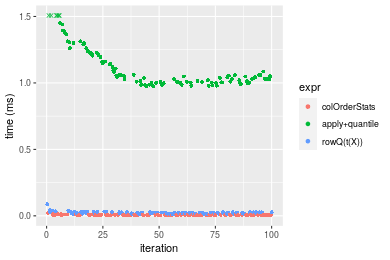

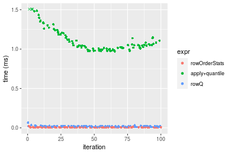
_Table: Benchmarking of colOrderStats() and rowOrderStats() on integer+10x10 data (original and transposed).  The top panel shows times in milliseconds and the bottom panel shows relative times._


|   |expr          |   min|     lq|    mean| median|     uq|    max|
|:--|:-------------|-----:|------:|-------:|------:|------:|------:|
|2  |rowOrderStats | 2.694| 4.0520| 6.58882| 6.9900| 7.9115| 22.313|
|1  |colOrderStats | 2.396| 3.7805| 6.24065| 7.0845| 7.7215| 21.831|


|   |expr          |       min|        lq|      mean|   median|        uq|       max|
|:--|:-------------|---------:|---------:|---------:|--------:|---------:|---------:|
|2  |rowOrderStats | 1.0000000| 1.0000000| 1.0000000| 1.000000| 1.0000000| 1.0000000|
|1  |colOrderStats | 0.8893838| 0.9329961| 0.9471575| 1.013519| 0.9759843| 0.9783982|

_Figure: Benchmarking of colOrderStats() and rowOrderStats() on integer+10x10 data (original and transposed).  Outliers are displayed as crosses. Times are in milliseconds._


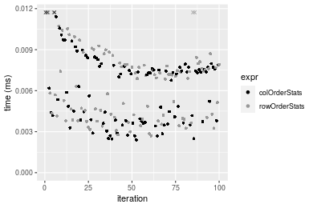

#### 100x100 integer matrix


```r
> X <- data[["100x100"]]
> gc()
          used  (Mb) gc trigger  (Mb) max used  (Mb)
Ncells 5257430 280.8    8529671 455.6  8529671 455.6
Vcells 9900114  75.6   31876688 243.2 60562128 462.1
> probs <- 0.3
> which <- round(probs * nrow(X))
> colStats <- microbenchmark(colOrderStats = colOrderStats(X, which = which, na.rm = FALSE), `apply+quantile` = apply(X, 
+     MARGIN = 2L, FUN = quantile, probs = probs, na.rm = FALSE, type = 3L), `rowQ(t(X))` = rowQ(t(X), 
+     which = which), unit = "ms")
> X <- t(X)
> gc()
          used  (Mb) gc trigger  (Mb) max used  (Mb)
Ncells 5257423 280.8    8529671 455.6  8529671 455.6
Vcells 9905220  75.6   31876688 243.2 60562128 462.1
> rowStats <- microbenchmark(rowOrderStats = rowOrderStats(X, which = which, na.rm = FALSE), `apply+quantile` = apply(X, 
+     MARGIN = 1L, FUN = quantile, probs = probs, na.rm = FALSE, type = 3L), rowQ = rowQ(X, which = which), 
+     unit = "ms")
```


_Table: Benchmarking of colOrderStats(), apply+quantile() and rowQ(t(X))() on integer+100x100 data. The top panel shows times in milliseconds and the bottom panel shows relative times._


|   |expr           |      min|        lq|       mean|     median|         uq|       max|
|:--|:--------------|--------:|---------:|----------:|----------:|----------:|---------:|
|1  |colOrderStats  | 0.121116|  0.135349|  0.1434340|  0.1414745|  0.1488490|  0.221667|
|3  |rowQ(t(X))     | 0.279749|  0.305540|  0.3258962|  0.3175130|  0.3356855|  0.677341|
|2  |apply+quantile | 9.943573| 10.994908| 11.5292535| 11.2429440| 11.5286880| 19.321712|


|   |expr           |       min|        lq|      mean|    median|        uq|       max|
|:--|:--------------|---------:|---------:|---------:|---------:|---------:|---------:|
|1  |colOrderStats  |  1.000000|  1.000000|  1.000000|  1.000000|  1.000000|  1.000000|
|3  |rowQ(t(X))     |  2.309761|  2.257423|  2.272099|  2.244313|  2.255208|  3.055669|
|2  |apply+quantile | 82.099582| 81.233759| 80.380216| 79.469756| 77.452237| 87.165487|

_Table: Benchmarking of rowOrderStats(), apply+quantile() and rowQ() on integer+100x100 data (transposed). The top panel shows times in milliseconds and the bottom panel shows relative times._


|   |expr           |      min|         lq|       mean|     median|         uq|       max|
|:--|:--------------|--------:|----------:|----------:|----------:|----------:|---------:|
|1  |rowOrderStats  | 0.119327|  0.1333260|  0.1420992|  0.1403775|  0.1497055|  0.209515|
|3  |rowQ           | 0.250628|  0.2823345|  0.2976014|  0.2914755|  0.3103715|  0.462297|
|2  |apply+quantile | 9.926337| 11.0183420| 11.5296399| 11.2123495| 11.4981340| 19.613236|


|   |expr           |       min|        lq|      mean|    median|        uq|      max|
|:--|:--------------|---------:|---------:|---------:|---------:|---------:|--------:|
|1  |rowOrderStats  |  1.000000|  1.000000|  1.000000|  1.000000|  1.000000|  1.00000|
|3  |rowQ           |  2.100346|  2.117625|  2.094322|  2.076369|  2.073214|  2.20651|
|2  |apply+quantile | 83.186010| 82.642110| 81.137970| 79.872839| 76.805020| 93.61256|

_Figure: Benchmarking of colOrderStats(), apply+quantile() and rowQ(t(X))() on integer+100x100 data  as well as rowOrderStats(), apply+quantile() and rowQ() on the same data transposed.  Outliers are displayed as crosses.  Times are in milliseconds._


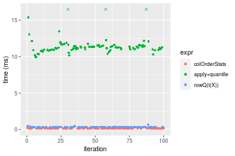


_Table: Benchmarking of colOrderStats() and rowOrderStats() on integer+100x100 data (original and transposed).  The top panel shows times in milliseconds and the bottom panel shows relative times._


|   |expr          |     min|      lq|     mean|   median|       uq|     max|
|:--|:-------------|-------:|-------:|--------:|--------:|--------:|-------:|
|2  |rowOrderStats | 119.327| 133.326| 142.0992| 140.3775| 149.7055| 209.515|
|1  |colOrderStats | 121.116| 135.349| 143.4340| 141.4745| 148.8490| 221.667|


|   |expr          |      min|       lq|     mean|   median|        uq|      max|
|:--|:-------------|--------:|--------:|--------:|--------:|---------:|--------:|
|2  |rowOrderStats | 1.000000| 1.000000| 1.000000| 1.000000| 1.0000000| 1.000000|
|1  |colOrderStats | 1.014992| 1.015173| 1.009393| 1.007815| 0.9942788| 1.058001|

_Figure: Benchmarking of colOrderStats() and rowOrderStats() on integer+100x100 data (original and transposed).  Outliers are displayed as crosses. Times are in milliseconds._


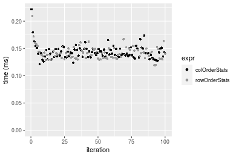

#### 1000x10 integer matrix


```r
> X <- data[["1000x10"]]
> gc()
          used  (Mb) gc trigger  (Mb) max used  (Mb)
Ncells 5256850 280.8    8529671 455.6  8529671 455.6
Vcells 9878091  75.4   31876688 243.2 60562128 462.1
> probs <- 0.3
> which <- round(probs * nrow(X))
> colStats <- microbenchmark(colOrderStats = colOrderStats(X, which = which, na.rm = FALSE), `apply+quantile` = apply(X, 
+     MARGIN = 2L, FUN = quantile, probs = probs, na.rm = FALSE, type = 3L), `rowQ(t(X))` = rowQ(t(X), 
+     which = which), unit = "ms")
> X <- t(X)
> gc()
          used  (Mb) gc trigger  (Mb) max used  (Mb)
Ncells 5256837 280.8    8529671 455.6  8529671 455.6
Vcells 9883187  75.5   31876688 243.2 60562128 462.1
> rowStats <- microbenchmark(rowOrderStats = rowOrderStats(X, which = which, na.rm = FALSE), `apply+quantile` = apply(X, 
+     MARGIN = 1L, FUN = quantile, probs = probs, na.rm = FALSE, type = 3L), rowQ = rowQ(X, which = which), 
+     unit = "ms")
```


_Table: Benchmarking of colOrderStats(), apply+quantile() and rowQ(t(X))() on integer+1000x10 data. The top panel shows times in milliseconds and the bottom panel shows relative times._


|   |expr           |      min|        lq|      mean|    median|        uq|      max|
|:--|:--------------|--------:|---------:|---------:|---------:|---------:|--------:|
|1  |colOrderStats  | 0.106410| 0.1168395| 0.1242575| 0.1211515| 0.1248625| 0.197992|
|3  |rowQ(t(X))     | 0.250002| 0.2777335| 0.2898191| 0.2861890| 0.2938555| 0.421549|
|2  |apply+quantile | 1.310605| 1.4263815| 1.5075162| 1.4662695| 1.5187220| 2.356509|


|   |expr           |       min|        lq|      mean|    median|        uq|       max|
|:--|:--------------|---------:|---------:|---------:|---------:|---------:|---------:|
|1  |colOrderStats  |  1.000000|  1.000000|  1.000000|  1.000000|  1.000000|  1.000000|
|3  |rowQ(t(X))     |  2.349422|  2.377051|  2.332407|  2.362241|  2.353433|  2.129121|
|2  |apply+quantile | 12.316559| 12.208042| 12.132194| 12.102776| 12.163156| 11.902041|

_Table: Benchmarking of rowOrderStats(), apply+quantile() and rowQ() on integer+1000x10 data (transposed). The top panel shows times in milliseconds and the bottom panel shows relative times._


|   |expr           |      min|        lq|      mean|    median|        uq|      max|
|:--|:--------------|--------:|---------:|---------:|---------:|---------:|--------:|
|1  |rowOrderStats  | 0.106115| 0.1147415| 0.1261883| 0.1194615| 0.1326435| 0.200507|
|3  |rowQ           | 0.235041| 0.2544380| 0.2738397| 0.2633070| 0.2739980| 0.479350|
|2  |apply+quantile | 1.319350| 1.4084165| 1.5141066| 1.4477820| 1.5399640| 2.374097|


|   |expr           |       min|        lq|      mean|    median|        uq|      max|
|:--|:--------------|---------:|---------:|---------:|---------:|---------:|--------:|
|1  |rowOrderStats  |  1.000000|  1.000000|  1.000000|  1.000000|  1.000000|  1.00000|
|3  |rowQ           |  2.214965|  2.217489|  2.170088|  2.204116|  2.065672|  2.39069|
|2  |apply+quantile | 12.433209| 12.274691| 11.998786| 12.119235| 11.609796| 11.84047|

_Figure: Benchmarking of colOrderStats(), apply+quantile() and rowQ(t(X))() on integer+1000x10 data  as well as rowOrderStats(), apply+quantile() and rowQ() on the same data transposed.  Outliers are displayed as crosses.  Times are in milliseconds._


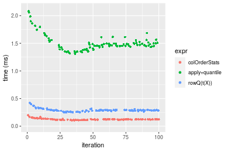

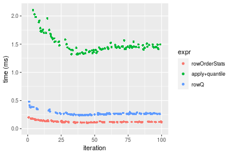
_Table: Benchmarking of colOrderStats() and rowOrderStats() on integer+1000x10 data (original and transposed).  The top panel shows times in milliseconds and the bottom panel shows relative times._


|   |expr          |     min|       lq|     mean|   median|       uq|     max|
|:--|:-------------|-------:|--------:|--------:|--------:|--------:|-------:|
|2  |rowOrderStats | 106.115| 114.7415| 126.1883| 119.4615| 132.6435| 200.507|
|1  |colOrderStats | 106.410| 116.8395| 124.2575| 121.1515| 124.8625| 197.992|


|   |expr          |     min|       lq|      mean|   median|       uq|       max|
|:--|:-------------|-------:|--------:|---------:|--------:|--------:|---------:|
|2  |rowOrderStats | 1.00000| 1.000000| 1.0000000| 1.000000| 1.000000| 1.0000000|
|1  |colOrderStats | 1.00278| 1.018285| 0.9846991| 1.014147| 0.941339| 0.9874568|

_Figure: Benchmarking of colOrderStats() and rowOrderStats() on integer+1000x10 data (original and transposed).  Outliers are displayed as crosses. Times are in milliseconds._


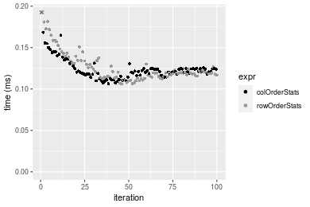

#### 10x1000 integer matrix


```r
> X <- data[["10x1000"]]
> gc()
          used  (Mb) gc trigger  (Mb) max used  (Mb)
Ncells 5257057 280.8    8529671 455.6  8529671 455.6
Vcells 9878897  75.4   31876688 243.2 60562128 462.1
> probs <- 0.3
> which <- round(probs * nrow(X))
> colStats <- microbenchmark(colOrderStats = colOrderStats(X, which = which, na.rm = FALSE), `apply+quantile` = apply(X, 
+     MARGIN = 2L, FUN = quantile, probs = probs, na.rm = FALSE, type = 3L), `rowQ(t(X))` = rowQ(t(X), 
+     which = which), unit = "ms")
> X <- t(X)
> gc()
          used  (Mb) gc trigger  (Mb) max used  (Mb)
Ncells 5257050 280.8    8529671 455.6  8529671 455.6
Vcells 9884003  75.5   31876688 243.2 60562128 462.1
> rowStats <- microbenchmark(rowOrderStats = rowOrderStats(X, which = which, na.rm = FALSE), `apply+quantile` = apply(X, 
+     MARGIN = 1L, FUN = quantile, probs = probs, na.rm = FALSE, type = 3L), rowQ = rowQ(X, which = which), 
+     unit = "ms")
```


_Table: Benchmarking of colOrderStats(), apply+quantile() and rowQ(t(X))() on integer+10x1000 data. The top panel shows times in milliseconds and the bottom panel shows relative times._


|   |expr           |        min|          lq|        mean|      median|          uq|        max|
|:--|:--------------|----------:|-----------:|-----------:|-----------:|-----------:|----------:|
|1  |colOrderStats  |   0.124002|   0.1318285|   0.1431571|   0.1378460|   0.1554585|   0.185293|
|3  |rowQ(t(X))     |   0.269732|   0.3016940|   0.3238651|   0.3193965|   0.3494285|   0.392793|
|2  |apply+quantile | 101.607258| 106.5879280| 110.3892779| 107.7140460| 114.1283415| 139.618113|


|   |expr           |        min|         lq|       mean|     median|         uq|        max|
|:--|:--------------|----------:|----------:|----------:|----------:|----------:|----------:|
|1  |colOrderStats  |   1.000000|   1.000000|   1.000000|   1.000000|   1.000000|   1.000000|
|3  |rowQ(t(X))     |   2.175223|   2.288534|   2.262306|   2.317053|   2.247729|   2.119848|
|2  |apply+quantile | 819.400155| 808.534786| 771.105854| 781.408572| 734.140246| 753.499123|

_Table: Benchmarking of rowOrderStats(), apply+quantile() and rowQ() on integer+10x1000 data (transposed). The top panel shows times in milliseconds and the bottom panel shows relative times._


|   |expr           |        min|          lq|        mean|      median|          uq|        max|
|:--|:--------------|----------:|-----------:|-----------:|-----------:|-----------:|----------:|
|1  |rowOrderStats  |   0.125915|   0.1338215|   0.1532770|   0.1493295|   0.1570805|   0.788864|
|3  |rowQ           |   0.273050|   0.2898920|   0.3083554|   0.3069140|   0.3276880|   0.355935|
|2  |apply+quantile | 103.987802| 108.3288355| 111.7019650| 109.5762585| 114.3073555| 150.291124|


|   |expr           |        min|         lq|       mean|    median|         uq|         max|
|:--|:--------------|----------:|----------:|----------:|---------:|----------:|-----------:|
|1  |rowOrderStats  |   1.000000|   1.000000|   1.000000|   1.00000|   1.000000|   1.0000000|
|3  |rowQ           |   2.168526|   2.166259|   2.011753|   2.05528|   2.086115|   0.4511994|
|2  |apply+quantile | 825.857142| 809.502475| 728.759006| 733.78842| 727.699208| 190.5158861|

_Figure: Benchmarking of colOrderStats(), apply+quantile() and rowQ(t(X))() on integer+10x1000 data  as well as rowOrderStats(), apply+quantile() and rowQ() on the same data transposed.  Outliers are displayed as crosses.  Times are in milliseconds._


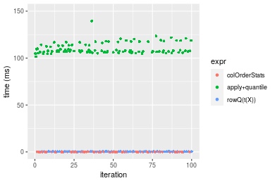

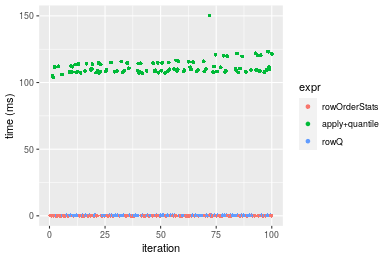
_Table: Benchmarking of colOrderStats() and rowOrderStats() on integer+10x1000 data (original and transposed).  The top panel shows times in milliseconds and the bottom panel shows relative times._


|   |expr          |     min|       lq|     mean|   median|       uq|     max|
|:--|:-------------|-------:|--------:|--------:|--------:|--------:|-------:|
|1  |colOrderStats | 124.002| 131.8285| 143.1571| 137.8460| 155.4585| 185.293|
|2  |rowOrderStats | 125.915| 133.8215| 153.2770| 149.3295| 157.0805| 788.864|


|   |expr          |      min|       lq|     mean|   median|       uq|      max|
|:--|:-------------|--------:|--------:|--------:|--------:|--------:|--------:|
|1  |colOrderStats | 1.000000| 1.000000| 1.000000| 1.000000| 1.000000| 1.000000|
|2  |rowOrderStats | 1.015427| 1.015118| 1.070691| 1.083307| 1.010434| 4.257387|

_Figure: Benchmarking of colOrderStats() and rowOrderStats() on integer+10x1000 data (original and transposed).  Outliers are displayed as crosses. Times are in milliseconds._


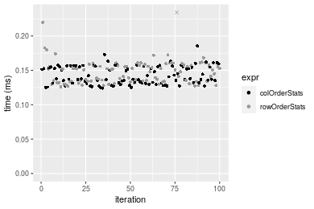

#### 100x1000 integer matrix


```r
> X <- data[["100x1000"]]
> gc()
          used  (Mb) gc trigger  (Mb) max used  (Mb)
Ncells 5257261 280.8    8529671 455.6  8529671 455.6
Vcells 9879471  75.4   31876688 243.2 60562128 462.1
> probs <- 0.3
> which <- round(probs * nrow(X))
> colStats <- microbenchmark(colOrderStats = colOrderStats(X, which = which, na.rm = FALSE), `apply+quantile` = apply(X, 
+     MARGIN = 2L, FUN = quantile, probs = probs, na.rm = FALSE, type = 3L), `rowQ(t(X))` = rowQ(t(X), 
+     which = which), unit = "ms")
> X <- t(X)
> gc()
          used  (Mb) gc trigger  (Mb) max used  (Mb)
Ncells 5257254 280.8    8529671 455.6  8529671 455.6
Vcells 9929577  75.8   31876688 243.2 60562128 462.1
> rowStats <- microbenchmark(rowOrderStats = rowOrderStats(X, which = which, na.rm = FALSE), `apply+quantile` = apply(X, 
+     MARGIN = 1L, FUN = quantile, probs = probs, na.rm = FALSE, type = 3L), rowQ = rowQ(X, which = which), 
+     unit = "ms")
```


_Table: Benchmarking of colOrderStats(), apply+quantile() and rowQ(t(X))() on integer+100x1000 data. The top panel shows times in milliseconds and the bottom panel shows relative times._


|   |expr           |        min|         lq|       mean|     median|         uq|        max|
|:--|:--------------|----------:|----------:|----------:|----------:|----------:|----------:|
|1  |colOrderStats  |   1.219348|   1.365900|   1.381086|   1.384183|   1.408145|   1.720466|
|3  |rowQ(t(X))     |   2.775344|   3.082995|   3.132328|   3.139558|   3.185383|   3.591160|
|2  |apply+quantile | 111.164408| 115.238164| 122.089223| 116.179811| 122.372979| 480.882709|


|   |expr           |       min|        lq|      mean|    median|        uq|        max|
|:--|:--------------|---------:|---------:|---------:|---------:|---------:|----------:|
|1  |colOrderStats  |  1.000000|  1.000000|  1.000000|  1.000000|  1.000000|   1.000000|
|3  |rowQ(t(X))     |  2.276089|  2.257117|  2.268017|  2.268168|  2.262113|   2.087318|
|2  |apply+quantile | 91.167089| 84.367936| 88.400864| 83.933882| 86.903678| 279.507243|

_Table: Benchmarking of rowOrderStats(), apply+quantile() and rowQ() on integer+100x1000 data (transposed). The top panel shows times in milliseconds and the bottom panel shows relative times._


|   |expr           |        min|         lq|       mean|     median|         uq|        max|
|:--|:--------------|----------:|----------:|----------:|----------:|----------:|----------:|
|1  |rowOrderStats  |   1.229144|   1.352091|   1.388292|   1.380804|   1.399889|   1.901524|
|3  |rowQ           |   2.855065|   2.956792|   3.016552|   2.997631|   3.050488|   3.791487|
|2  |apply+quantile | 109.771326| 116.278713| 120.133722| 117.287056| 123.625769| 137.379784|


|   |expr           |       min|       lq|      mean|    median|        uq|      max|
|:--|:--------------|---------:|--------:|---------:|---------:|---------:|--------:|
|1  |rowOrderStats  |  1.000000|  1.00000|  1.000000|  1.000000|  1.000000|  1.00000|
|3  |rowQ           |  2.322808|  2.18683|  2.172851|  2.170932|  2.179093|  1.99392|
|2  |apply+quantile | 89.307132| 85.99921| 86.533448| 84.941133| 88.311154| 72.24720|

_Figure: Benchmarking of colOrderStats(), apply+quantile() and rowQ(t(X))() on integer+100x1000 data  as well as rowOrderStats(), apply+quantile() and rowQ() on the same data transposed.  Outliers are displayed as crosses.  Times are in milliseconds._


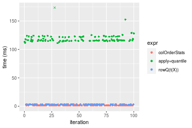

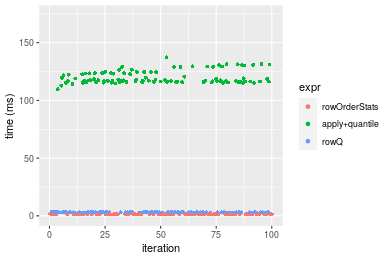
_Table: Benchmarking of colOrderStats() and rowOrderStats() on integer+100x1000 data (original and transposed).  The top panel shows times in milliseconds and the bottom panel shows relative times._


|   |expr          |      min|       lq|     mean|   median|       uq|      max|
|:--|:-------------|--------:|--------:|--------:|--------:|--------:|--------:|
|2  |rowOrderStats | 1.229144| 1.352091| 1.388292| 1.380804| 1.399889| 1.901524|
|1  |colOrderStats | 1.219348| 1.365900| 1.381086| 1.384183| 1.408145| 1.720466|


|   |expr          |       min|       lq|      mean|   median|       uq|       max|
|:--|:-------------|---------:|--------:|---------:|--------:|--------:|---------:|
|2  |rowOrderStats | 1.0000000| 1.000000| 1.0000000| 1.000000| 1.000000| 1.0000000|
|1  |colOrderStats | 0.9920302| 1.010213| 0.9948094| 1.002447| 1.005898| 0.9047827|

_Figure: Benchmarking of colOrderStats() and rowOrderStats() on integer+100x1000 data (original and transposed).  Outliers are displayed as crosses. Times are in milliseconds._


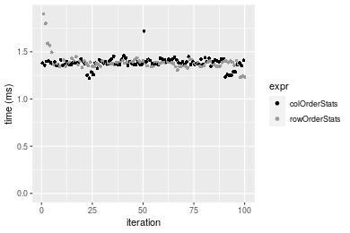

#### 1000x100 integer matrix


```r
> X <- data[["1000x100"]]
> gc()
          used  (Mb) gc trigger  (Mb) max used  (Mb)
Ncells 5257467 280.8    8529671 455.6  8529671 455.6
Vcells 9880161  75.4   31876688 243.2 60562128 462.1
> probs <- 0.3
> which <- round(probs * nrow(X))
> colStats <- microbenchmark(colOrderStats = colOrderStats(X, which = which, na.rm = FALSE), `apply+quantile` = apply(X, 
+     MARGIN = 2L, FUN = quantile, probs = probs, na.rm = FALSE, type = 3L), `rowQ(t(X))` = rowQ(t(X), 
+     which = which), unit = "ms")
> X <- t(X)
> gc()
          used  (Mb) gc trigger  (Mb) max used  (Mb)
Ncells 5257460 280.8    8529671 455.6  8529671 455.6
Vcells 9930267  75.8   31876688 243.2 60562128 462.1
> rowStats <- microbenchmark(rowOrderStats = rowOrderStats(X, which = which, na.rm = FALSE), `apply+quantile` = apply(X, 
+     MARGIN = 1L, FUN = quantile, probs = probs, na.rm = FALSE, type = 3L), rowQ = rowQ(X, which = which), 
+     unit = "ms")
```


_Table: Benchmarking of colOrderStats(), apply+quantile() and rowQ(t(X))() on integer+1000x100 data. The top panel shows times in milliseconds and the bottom panel shows relative times._


|   |expr           |       min|        lq|      mean|    median|        uq|       max|
|:--|:--------------|---------:|---------:|---------:|---------:|---------:|---------:|
|1  |colOrderStats  |  1.078755|  1.270765|  1.321262|  1.291163|  1.328442|  2.055190|
|3  |rowQ(t(X))     |  2.529615|  2.949383|  3.010792|  3.016215|  3.058868|  3.766083|
|2  |apply+quantile | 13.201258| 14.866861| 15.268522| 15.066990| 15.257983| 24.594818|


|   |expr           |       min|       lq|      mean|    median|        uq|       max|
|:--|:--------------|---------:|--------:|---------:|---------:|---------:|---------:|
|1  |colOrderStats  |  1.000000|  1.00000|  1.000000|  1.000000|  1.000000|  1.000000|
|3  |rowQ(t(X))     |  2.344939|  2.32095|  2.278724|  2.336044|  2.302598|  1.832474|
|2  |apply+quantile | 12.237494| 11.69914| 11.556011| 11.669312| 11.485618| 11.967175|

_Table: Benchmarking of rowOrderStats(), apply+quantile() and rowQ() on integer+1000x100 data (transposed). The top panel shows times in milliseconds and the bottom panel shows relative times._


|   |expr           |       min|        lq|      mean|    median|        uq|       max|
|:--|:--------------|---------:|---------:|---------:|---------:|---------:|---------:|
|1  |rowOrderStats  |  1.098761|  1.262751|  1.285397|  1.281689|  1.307838|  1.459712|
|3  |rowQ           |  2.436686|  2.803228|  2.854766|  2.834445|  2.870170|  3.542653|
|2  |apply+quantile | 12.988127| 14.762653| 15.346651| 14.920025| 15.134125| 37.313406|


|   |expr           |       min|        lq|      mean|    median|        uq|       max|
|:--|:--------------|---------:|---------:|---------:|---------:|---------:|---------:|
|1  |rowOrderStats  |  1.000000|  1.000000|  1.000000|  1.000000|  1.000000|  1.000000|
|3  |rowQ           |  2.217667|  2.219938|  2.220922|  2.211492|  2.194591|  2.426953|
|2  |apply+quantile | 11.820703| 11.690871| 11.939232| 11.640914| 11.571861| 25.562170|

_Figure: Benchmarking of colOrderStats(), apply+quantile() and rowQ(t(X))() on integer+1000x100 data  as well as rowOrderStats(), apply+quantile() and rowQ() on the same data transposed.  Outliers are displayed as crosses.  Times are in milliseconds._


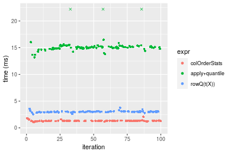

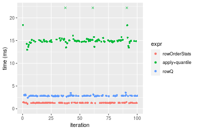
_Table: Benchmarking of colOrderStats() and rowOrderStats() on integer+1000x100 data (original and transposed).  The top panel shows times in milliseconds and the bottom panel shows relative times._


|   |expr          |      min|       lq|     mean|   median|       uq|      max|
|:--|:-------------|--------:|--------:|--------:|--------:|--------:|--------:|
|2  |rowOrderStats | 1.098761| 1.262751| 1.285397| 1.281689| 1.307838| 1.459712|
|1  |colOrderStats | 1.078755| 1.270765| 1.321262| 1.291163| 1.328442| 2.055190|


|   |expr          |       min|       lq|     mean|   median|       uq|      max|
|:--|:-------------|---------:|--------:|--------:|--------:|--------:|--------:|
|2  |rowOrderStats | 1.0000000| 1.000000| 1.000000| 1.000000| 1.000000| 1.000000|
|1  |colOrderStats | 0.9817922| 1.006347| 1.027902| 1.007393| 1.015754| 1.407942|

_Figure: Benchmarking of colOrderStats() and rowOrderStats() on integer+1000x100 data (original and transposed).  Outliers are displayed as crosses. Times are in milliseconds._


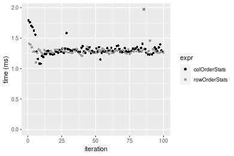


## Data type "double"

### Data
```r
> rmatrix <- function(nrow, ncol, mode = c("logical", "double", "integer", "index"), range = c(-100, 
+     +100), na_prob = 0) {
+     mode <- match.arg(mode)
+     n <- nrow * ncol
+     if (mode == "logical") {
+         x <- sample(c(FALSE, TRUE), size = n, replace = TRUE)
+     }     else if (mode == "index") {
+         x <- seq_len(n)
+         mode <- "integer"
+     }     else {
+         x <- runif(n, min = range[1], max = range[2])
+     }
+     storage.mode(x) <- mode
+     if (na_prob > 0) 
+         x[sample(n, size = na_prob * n)] <- NA
+     dim(x) <- c(nrow, ncol)
+     x
+ }
> rmatrices <- function(scale = 10, seed = 1, ...) {
+     set.seed(seed)
+     data <- list()
+     data[[1]] <- rmatrix(nrow = scale * 1, ncol = scale * 1, ...)
+     data[[2]] <- rmatrix(nrow = scale * 10, ncol = scale * 10, ...)
+     data[[3]] <- rmatrix(nrow = scale * 100, ncol = scale * 1, ...)
+     data[[4]] <- t(data[[3]])
+     data[[5]] <- rmatrix(nrow = scale * 10, ncol = scale * 100, ...)
+     data[[6]] <- t(data[[5]])
+     names(data) <- sapply(data, FUN = function(x) paste(dim(x), collapse = "x"))
+     data
+ }
> data <- rmatrices(mode = mode)
```

### Results

#### 10x10 double matrix


```r
> X <- data[["10x10"]]
> gc()
          used  (Mb) gc trigger  (Mb) max used  (Mb)
Ncells 5257681 280.8    8529671 455.6  8529671 455.6
Vcells 9996062  76.3   31876688 243.2 60562128 462.1
> probs <- 0.3
> which <- round(probs * nrow(X))
> colStats <- microbenchmark(colOrderStats = colOrderStats(X, which = which, na.rm = FALSE), `apply+quantile` = apply(X, 
+     MARGIN = 2L, FUN = quantile, probs = probs, na.rm = FALSE, type = 3L), `rowQ(t(X))` = rowQ(t(X), 
+     which = which), unit = "ms")
> X <- t(X)
> gc()
          used  (Mb) gc trigger  (Mb) max used  (Mb)
Ncells 5257665 280.8    8529671 455.6  8529671 455.6
Vcells 9996253  76.3   31876688 243.2 60562128 462.1
> rowStats <- microbenchmark(rowOrderStats = rowOrderStats(X, which = which, na.rm = FALSE), `apply+quantile` = apply(X, 
+     MARGIN = 1L, FUN = quantile, probs = probs, na.rm = FALSE, type = 3L), rowQ = rowQ(X, which = which), 
+     unit = "ms")
```


_Table: Benchmarking of colOrderStats(), apply+quantile() and rowQ(t(X))() on double+10x10 data. The top panel shows times in milliseconds and the bottom panel shows relative times._


|   |expr           |      min|        lq|      mean|   median|       uq|      max|
|:--|:--------------|--------:|---------:|---------:|--------:|--------:|--------:|
|1  |colOrderStats  | 0.002723| 0.0040980| 0.0071918| 0.007184| 0.008979| 0.024424|
|3  |rowQ(t(X))     | 0.007045| 0.0096715| 0.0150802| 0.013765| 0.018273| 0.064306|
|2  |apply+quantile | 0.974496| 1.0605275| 1.1666162| 1.118092| 1.240284| 1.883778|


|   |expr           |       min|         lq|       mean|     median|         uq|       max|
|:--|:--------------|---------:|----------:|----------:|----------:|----------:|---------:|
|1  |colOrderStats  |   1.00000|   1.000000|   1.000000|   1.000000|   1.000000|  1.000000|
|3  |rowQ(t(X))     |   2.58722|   2.360054|   2.096869|   1.916063|   2.035082|  2.632902|
|2  |apply+quantile | 357.87587| 258.791484| 162.215224| 155.636414| 138.131585| 77.128153|

_Table: Benchmarking of rowOrderStats(), apply+quantile() and rowQ() on double+10x10 data (transposed). The top panel shows times in milliseconds and the bottom panel shows relative times._


|   |expr           |      min|        lq|      mean|   median|        uq|      max|
|:--|:--------------|--------:|---------:|---------:|--------:|---------:|--------:|
|1  |rowOrderStats  | 0.002695| 0.0044695| 0.0070952| 0.007262| 0.0087205| 0.022080|
|3  |rowQ           | 0.004579| 0.0057440| 0.0096944| 0.008419| 0.0122845| 0.041155|
|2  |apply+quantile | 0.980516| 1.0507330| 1.1473062| 1.101219| 1.2051105| 1.888113|


|   |expr           |        min|         lq|       mean|     median|         uq|       max|
|:--|:--------------|----------:|----------:|----------:|----------:|----------:|---------:|
|1  |rowOrderStats  |   1.000000|   1.000000|   1.000000|   1.000000|   1.000000|  1.000000|
|3  |rowQ           |   1.699072|   1.285155|   1.366343|   1.159323|   1.408692|  1.863904|
|2  |apply+quantile | 363.827829| 235.089607| 161.702652| 151.641214| 138.192822| 85.512364|

_Figure: Benchmarking of colOrderStats(), apply+quantile() and rowQ(t(X))() on double+10x10 data  as well as rowOrderStats(), apply+quantile() and rowQ() on the same data transposed.  Outliers are displayed as crosses.  Times are in milliseconds._


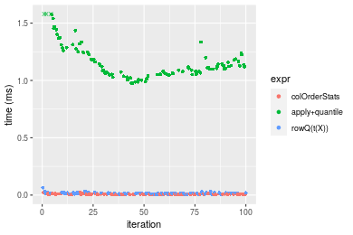

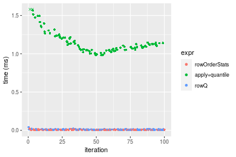
_Table: Benchmarking of colOrderStats() and rowOrderStats() on double+10x10 data (original and transposed).  The top panel shows times in milliseconds and the bottom panel shows relative times._


|   |expr          |   min|     lq|    mean| median|     uq|    max|
|:--|:-------------|-----:|------:|-------:|------:|------:|------:|
|1  |colOrderStats | 2.723| 4.0980| 7.19178|  7.184| 8.9790| 24.424|
|2  |rowOrderStats | 2.695| 4.4695| 7.09516|  7.262| 8.7205| 22.080|


|   |expr          |       min|       lq|      mean|   median|        uq|       max|
|:--|:-------------|---------:|--------:|---------:|--------:|---------:|---------:|
|1  |colOrderStats | 1.0000000| 1.000000| 1.0000000| 1.000000| 1.0000000| 1.0000000|
|2  |rowOrderStats | 0.9897172| 1.090654| 0.9865652| 1.010857| 0.9712106| 0.9040288|

_Figure: Benchmarking of colOrderStats() and rowOrderStats() on double+10x10 data (original and transposed).  Outliers are displayed as crosses. Times are in milliseconds._


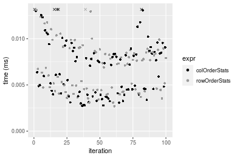

#### 100x100 double matrix


```r
> X <- data[["100x100"]]
> gc()
          used  (Mb) gc trigger  (Mb) max used  (Mb)
Ncells 5257877 280.9    8529671 455.6  8529671 455.6
Vcells 9997057  76.3   31876688 243.2 60562128 462.1
> probs <- 0.3
> which <- round(probs * nrow(X))
> colStats <- microbenchmark(colOrderStats = colOrderStats(X, which = which, na.rm = FALSE), `apply+quantile` = apply(X, 
+     MARGIN = 2L, FUN = quantile, probs = probs, na.rm = FALSE, type = 3L), `rowQ(t(X))` = rowQ(t(X), 
+     which = which), unit = "ms")
> X <- t(X)
> gc()
           used  (Mb) gc trigger  (Mb) max used  (Mb)
Ncells  5257870 280.9    8529671 455.6  8529671 455.6
Vcells 10007163  76.4   31876688 243.2 60562128 462.1
> rowStats <- microbenchmark(rowOrderStats = rowOrderStats(X, which = which, na.rm = FALSE), `apply+quantile` = apply(X, 
+     MARGIN = 1L, FUN = quantile, probs = probs, na.rm = FALSE, type = 3L), rowQ = rowQ(X, which = which), 
+     unit = "ms")
```


_Table: Benchmarking of colOrderStats(), apply+quantile() and rowQ(t(X))() on double+100x100 data. The top panel shows times in milliseconds and the bottom panel shows relative times._


|   |expr           |       min|         lq|       mean|     median|         uq|       max|
|:--|:--------------|---------:|----------:|----------:|----------:|----------:|---------:|
|1  |colOrderStats  |  0.177703|  0.1916150|  0.1995934|  0.1977870|  0.2045805|  0.288525|
|3  |rowQ(t(X))     |  0.212612|  0.2432105|  0.2591192|  0.2526645|  0.2739580|  0.405890|
|2  |apply+quantile | 10.028506| 11.4788985| 11.9744905| 11.6753335| 11.9374215| 21.520099|


|   |expr           |       min|        lq|      mean|    median|        uq|       max|
|:--|:--------------|---------:|---------:|---------:|---------:|---------:|---------:|
|1  |colOrderStats  |  1.000000|  1.000000|  1.000000|  1.000000|  1.000000|  1.000000|
|3  |rowQ(t(X))     |  1.196446|  1.269267|  1.298235|  1.277458|  1.339121|  1.406776|
|2  |apply+quantile | 56.434084| 59.906054| 59.994421| 59.029833| 58.350730| 74.586601|

_Table: Benchmarking of rowOrderStats(), apply+quantile() and rowQ() on double+100x100 data (transposed). The top panel shows times in milliseconds and the bottom panel shows relative times._


|   |expr           |       min|         lq|       mean|     median|        uq|       max|
|:--|:--------------|---------:|----------:|----------:|----------:|---------:|---------:|
|1  |rowOrderStats  |  0.169022|  0.1952500|  0.2043069|  0.2003635|  0.211534|  0.312825|
|3  |rowQ           |  0.190266|  0.2157775|  0.2267057|  0.2250685|  0.233820|  0.340676|
|2  |apply+quantile | 10.111341| 11.4911475| 12.0170979| 11.7217235| 11.949077| 20.266493|


|   |expr           |       min|        lq|      mean|    median|        uq|       max|
|:--|:--------------|---------:|---------:|---------:|---------:|---------:|---------:|
|1  |rowOrderStats  |  1.000000|  1.000000|  1.000000|  1.000000|  1.000000|  1.000000|
|3  |rowQ           |  1.125688|  1.105134|  1.109633|  1.123301|  1.105354|  1.089031|
|2  |apply+quantile | 59.822633| 58.853508| 58.818852| 58.502290| 56.487735| 64.785401|

_Figure: Benchmarking of colOrderStats(), apply+quantile() and rowQ(t(X))() on double+100x100 data  as well as rowOrderStats(), apply+quantile() and rowQ() on the same data transposed.  Outliers are displayed as crosses.  Times are in milliseconds._


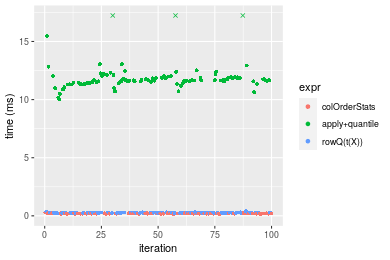

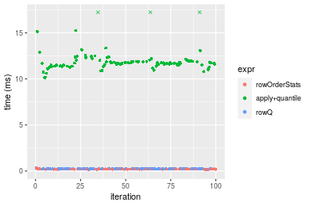
_Table: Benchmarking of colOrderStats() and rowOrderStats() on double+100x100 data (original and transposed).  The top panel shows times in milliseconds and the bottom panel shows relative times._


|   |expr          |     min|      lq|     mean|   median|       uq|     max|
|:--|:-------------|-------:|-------:|--------:|--------:|--------:|-------:|
|1  |colOrderStats | 177.703| 191.615| 199.5934| 197.7870| 204.5805| 288.525|
|2  |rowOrderStats | 169.022| 195.250| 204.3069| 200.3635| 211.5340| 312.825|


|   |expr          |       min|      lq|     mean|   median|       uq|      max|
|:--|:-------------|---------:|-------:|--------:|--------:|--------:|--------:|
|1  |colOrderStats | 1.0000000| 1.00000| 1.000000| 1.000000| 1.000000| 1.000000|
|2  |rowOrderStats | 0.9511488| 1.01897| 1.023616| 1.013027| 1.033989| 1.084221|

_Figure: Benchmarking of colOrderStats() and rowOrderStats() on double+100x100 data (original and transposed).  Outliers are displayed as crosses. Times are in milliseconds._


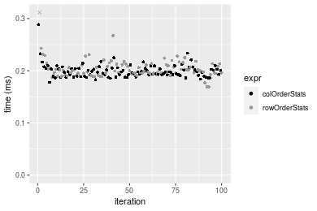

#### 1000x10 double matrix


```r
> X <- data[["1000x10"]]
> gc()
          used  (Mb) gc trigger  (Mb) max used  (Mb)
Ncells 5258086 280.9    8529671 455.6  8529671 455.6
Vcells 9998142  76.3   31876688 243.2 60562128 462.1
> probs <- 0.3
> which <- round(probs * nrow(X))
> colStats <- microbenchmark(colOrderStats = colOrderStats(X, which = which, na.rm = FALSE), `apply+quantile` = apply(X, 
+     MARGIN = 2L, FUN = quantile, probs = probs, na.rm = FALSE, type = 3L), `rowQ(t(X))` = rowQ(t(X), 
+     which = which), unit = "ms")
> X <- t(X)
> gc()
           used  (Mb) gc trigger  (Mb) max used  (Mb)
Ncells  5258079 280.9    8529671 455.6  8529671 455.6
Vcells 10008248  76.4   31876688 243.2 60562128 462.1
> rowStats <- microbenchmark(rowOrderStats = rowOrderStats(X, which = which, na.rm = FALSE), `apply+quantile` = apply(X, 
+     MARGIN = 1L, FUN = quantile, probs = probs, na.rm = FALSE, type = 3L), rowQ = rowQ(X, which = which), 
+     unit = "ms")
```


_Table: Benchmarking of colOrderStats(), apply+quantile() and rowQ(t(X))() on double+1000x10 data. The top panel shows times in milliseconds and the bottom panel shows relative times._


|   |expr           |      min|        lq|      mean|   median|        uq|      max|
|:--|:--------------|--------:|---------:|---------:|--------:|---------:|--------:|
|1  |colOrderStats  | 0.144676| 0.1657695| 0.1733250| 0.170141| 0.1756655| 0.252495|
|3  |rowQ(t(X))     | 0.184947| 0.2107565| 0.2218174| 0.216962| 0.2263955| 0.321162|
|2  |apply+quantile | 1.373490| 1.5201495| 1.6075449| 1.558847| 1.5815890| 2.483009|


|   |expr           |      min|       lq|     mean|   median|       uq|      max|
|:--|:--------------|--------:|--------:|--------:|--------:|--------:|--------:|
|1  |colOrderStats  | 1.000000| 1.000000| 1.000000| 1.000000| 1.000000| 1.000000|
|3  |rowQ(t(X))     | 1.278353| 1.271383| 1.279777| 1.275189| 1.288787| 1.271954|
|2  |apply+quantile | 9.493558| 9.170260| 9.274744| 9.162089| 9.003413| 9.833894|

_Table: Benchmarking of rowOrderStats(), apply+quantile() and rowQ() on double+1000x10 data (transposed). The top panel shows times in milliseconds and the bottom panel shows relative times._


|   |expr           |      min|       lq|      mean|    median|        uq|      max|
|:--|:--------------|--------:|--------:|---------:|---------:|---------:|--------:|
|1  |rowOrderStats  | 0.146966| 0.166810| 0.1767326| 0.1734530| 0.1828175| 0.256861|
|3  |rowQ           | 0.166082| 0.184958| 0.1979290| 0.1940875| 0.2004360| 0.290413|
|2  |apply+quantile | 1.351771| 1.534270| 1.6172578| 1.5654525| 1.6522005| 2.451222|


|   |expr           |      min|       lq|     mean|   median|       uq|      max|
|:--|:--------------|--------:|--------:|--------:|--------:|--------:|--------:|
|1  |rowOrderStats  | 1.000000| 1.000000| 1.000000| 1.000000| 1.000000| 1.000000|
|3  |rowQ           | 1.130071| 1.108794| 1.119935| 1.118963| 1.096372| 1.130623|
|2  |apply+quantile | 9.197848| 9.197710| 9.150876| 9.025226| 9.037431| 9.542990|

_Figure: Benchmarking of colOrderStats(), apply+quantile() and rowQ(t(X))() on double+1000x10 data  as well as rowOrderStats(), apply+quantile() and rowQ() on the same data transposed.  Outliers are displayed as crosses.  Times are in milliseconds._


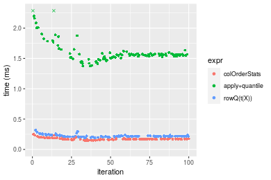

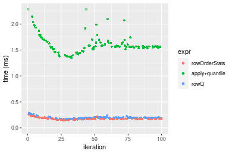
_Table: Benchmarking of colOrderStats() and rowOrderStats() on double+1000x10 data (original and transposed).  The top panel shows times in milliseconds and the bottom panel shows relative times._


|   |expr          |     min|       lq|     mean|  median|       uq|     max|
|:--|:-------------|-------:|--------:|--------:|-------:|--------:|-------:|
|1  |colOrderStats | 144.676| 165.7695| 173.3250| 170.141| 175.6655| 252.495|
|2  |rowOrderStats | 146.966| 166.8100| 176.7326| 173.453| 182.8175| 256.861|


|   |expr          |      min|       lq|    mean|   median|       uq|      max|
|:--|:-------------|--------:|--------:|-------:|--------:|--------:|--------:|
|1  |colOrderStats | 1.000000| 1.000000| 1.00000| 1.000000| 1.000000| 1.000000|
|2  |rowOrderStats | 1.015829| 1.006277| 1.01966| 1.019466| 1.040714| 1.017291|

_Figure: Benchmarking of colOrderStats() and rowOrderStats() on double+1000x10 data (original and transposed).  Outliers are displayed as crosses. Times are in milliseconds._


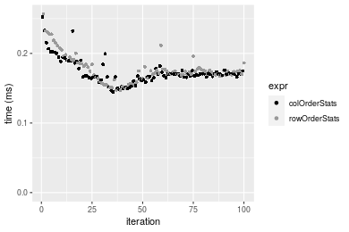

#### 10x1000 double matrix


```r
> X <- data[["10x1000"]]
> gc()
          used  (Mb) gc trigger  (Mb) max used  (Mb)
Ncells 5258299 280.9    8529671 455.6  8529671 455.6
Vcells 9998286  76.3   31876688 243.2 60562128 462.1
> probs <- 0.3
> which <- round(probs * nrow(X))
> colStats <- microbenchmark(colOrderStats = colOrderStats(X, which = which, na.rm = FALSE), `apply+quantile` = apply(X, 
+     MARGIN = 2L, FUN = quantile, probs = probs, na.rm = FALSE, type = 3L), `rowQ(t(X))` = rowQ(t(X), 
+     which = which), unit = "ms")
> X <- t(X)
> gc()
           used  (Mb) gc trigger  (Mb) max used  (Mb)
Ncells  5258292 280.9    8529671 455.6  8529671 455.6
Vcells 10008392  76.4   31876688 243.2 60562128 462.1
> rowStats <- microbenchmark(rowOrderStats = rowOrderStats(X, which = which, na.rm = FALSE), `apply+quantile` = apply(X, 
+     MARGIN = 1L, FUN = quantile, probs = probs, na.rm = FALSE, type = 3L), rowQ = rowQ(X, which = which), 
+     unit = "ms")
```


_Table: Benchmarking of colOrderStats(), apply+quantile() and rowQ(t(X))() on double+10x1000 data. The top panel shows times in milliseconds and the bottom panel shows relative times._


|   |expr           |        min|         lq|        mean|      median|          uq|        max|
|:--|:--------------|----------:|----------:|-----------:|-----------:|-----------:|----------:|
|1  |colOrderStats  |   0.171737|   0.186555|   0.1968494|   0.1938465|   0.2065565|   0.271162|
|3  |rowQ(t(X))     |   0.216194|   0.236266|   0.2577024|   0.2605375|   0.2819640|   0.301067|
|2  |apply+quantile | 106.664616| 109.549966| 113.2855592| 110.9872570| 118.1856230| 149.783925|


|   |expr           |        min|         lq|       mean|    median|        uq|        max|
|:--|:--------------|----------:|----------:|----------:|---------:|---------:|----------:|
|1  |colOrderStats  |   1.000000|   1.000000|   1.000000|   1.00000|   1.00000|   1.000000|
|3  |rowQ(t(X))     |   1.258867|   1.266468|   1.309135|   1.34404|   1.36507|   1.110285|
|2  |apply+quantile | 621.092811| 587.226105| 575.493633| 572.55229| 572.17092| 552.378006|

_Table: Benchmarking of rowOrderStats(), apply+quantile() and rowQ() on double+10x1000 data (transposed). The top panel shows times in milliseconds and the bottom panel shows relative times._


|   |expr           |        min|          lq|        mean|     median|          uq|        max|
|:--|:--------------|----------:|-----------:|-----------:|----------:|-----------:|----------:|
|1  |rowOrderStats  |   0.181723|   0.1886440|   0.2014066|   0.196627|   0.2107015|   0.287134|
|3  |rowQ           |   0.204683|   0.2125185|   0.2283302|   0.226741|   0.2454870|   0.268385|
|2  |apply+quantile | 105.972920| 109.2857275| 115.6893836| 110.959095| 115.5505770| 477.361265|


|   |expr           |        min|         lq|       mean|     median|         uq|         max|
|:--|:--------------|----------:|----------:|----------:|----------:|----------:|-----------:|
|1  |rowOrderStats  |   1.000000|   1.000000|   1.000000|   1.000000|   1.000000|    1.000000|
|3  |rowQ           |   1.126346|   1.126559|   1.133678|   1.153153|   1.165094|    0.934703|
|2  |apply+quantile | 583.156342| 579.322573| 574.407141| 564.312607| 548.408896| 1662.503448|

_Figure: Benchmarking of colOrderStats(), apply+quantile() and rowQ(t(X))() on double+10x1000 data  as well as rowOrderStats(), apply+quantile() and rowQ() on the same data transposed.  Outliers are displayed as crosses.  Times are in milliseconds._


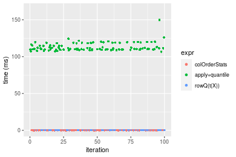

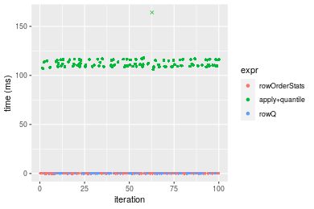
_Table: Benchmarking of colOrderStats() and rowOrderStats() on double+10x1000 data (original and transposed).  The top panel shows times in milliseconds and the bottom panel shows relative times._


|   |expr          |     min|      lq|     mean|   median|       uq|     max|
|:--|:-------------|-------:|-------:|--------:|--------:|--------:|-------:|
|1  |colOrderStats | 171.737| 186.555| 196.8494| 193.8465| 206.5565| 271.162|
|2  |rowOrderStats | 181.723| 188.644| 201.4066| 196.6270| 210.7015| 287.134|


|   |expr          |      min|       lq|     mean|   median|       uq|      max|
|:--|:-------------|--------:|--------:|--------:|--------:|--------:|--------:|
|1  |colOrderStats | 1.000000| 1.000000| 1.000000| 1.000000| 1.000000| 1.000000|
|2  |rowOrderStats | 1.058147| 1.011198| 1.023151| 1.014344| 1.020067| 1.058902|

_Figure: Benchmarking of colOrderStats() and rowOrderStats() on double+10x1000 data (original and transposed).  Outliers are displayed as crosses. Times are in milliseconds._


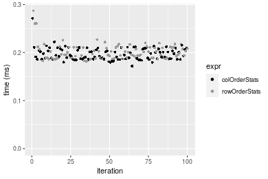

#### 100x1000 double matrix


```r
> X <- data[["100x1000"]]
> gc()
          used  (Mb) gc trigger  (Mb) max used  (Mb)
Ncells 5258503 280.9    8529671 455.6  8529671 455.6
Vcells 9999566  76.3   31876688 243.2 60562128 462.1
> probs <- 0.3
> which <- round(probs * nrow(X))
> colStats <- microbenchmark(colOrderStats = colOrderStats(X, which = which, na.rm = FALSE), `apply+quantile` = apply(X, 
+     MARGIN = 2L, FUN = quantile, probs = probs, na.rm = FALSE, type = 3L), `rowQ(t(X))` = rowQ(t(X), 
+     which = which), unit = "ms")
> X <- t(X)
> gc()
           used  (Mb) gc trigger  (Mb) max used  (Mb)
Ncells  5258496 280.9    8529671 455.6  8529671 455.6
Vcells 10099672  77.1   31876688 243.2 60562128 462.1
> rowStats <- microbenchmark(rowOrderStats = rowOrderStats(X, which = which, na.rm = FALSE), `apply+quantile` = apply(X, 
+     MARGIN = 1L, FUN = quantile, probs = probs, na.rm = FALSE, type = 3L), rowQ = rowQ(X, which = which), 
+     unit = "ms")
```


_Table: Benchmarking of colOrderStats(), apply+quantile() and rowQ(t(X))() on double+100x1000 data. The top panel shows times in milliseconds and the bottom panel shows relative times._


|   |expr           |        min|         lq|       mean|     median|         uq|        max|
|:--|:--------------|----------:|----------:|----------:|----------:|----------:|----------:|
|1  |colOrderStats  |   1.773591|   1.933325|   1.949205|   1.944247|   1.963194|   2.416942|
|3  |rowQ(t(X))     |   2.169692|   2.416991|   2.491048|   2.469575|   2.564758|   2.794766|
|2  |apply+quantile | 114.188566| 118.126534| 123.401497| 119.857953| 128.084724| 145.367849|


|   |expr           |       min|        lq|      mean|    median|        uq|       max|
|:--|:--------------|---------:|---------:|---------:|---------:|---------:|---------:|
|1  |colOrderStats  |  1.000000|  1.000000|  1.000000|  1.000000|  1.000000|  1.000000|
|3  |rowQ(t(X))     |  1.223333|  1.250173|  1.277982|  1.270196|  1.306421|  1.156323|
|2  |apply+quantile | 64.382694| 61.100195| 63.308629| 61.647477| 65.243030| 60.145361|

_Table: Benchmarking of rowOrderStats(), apply+quantile() and rowQ() on double+100x1000 data (transposed). The top panel shows times in milliseconds and the bottom panel shows relative times._


|   |expr           |        min|         lq|       mean|     median|         uq|        max|
|:--|:--------------|----------:|----------:|----------:|----------:|----------:|----------:|
|1  |rowOrderStats  |   1.801919|   1.911488|   1.965733|   1.942744|   1.988827|   2.659659|
|3  |rowQ           |   1.978909|   2.155988|   2.237016|   2.224080|   2.308471|   2.666294|
|2  |apply+quantile | 111.111029| 117.869459| 122.544606| 119.899045| 126.599067| 150.167055|


|   |expr           |       min|        lq|      mean|    median|       uq|       max|
|:--|:--------------|---------:|---------:|---------:|---------:|--------:|---------:|
|1  |rowOrderStats  |  1.000000|  1.000000|  1.000000|  1.000000|  1.00000|  1.000000|
|3  |rowQ           |  1.098223|  1.127911|  1.138006|  1.144814|  1.16072|  1.002495|
|2  |apply+quantile | 61.662610| 61.663703| 62.340417| 61.716338| 63.65513| 56.461018|

_Figure: Benchmarking of colOrderStats(), apply+quantile() and rowQ(t(X))() on double+100x1000 data  as well as rowOrderStats(), apply+quantile() and rowQ() on the same data transposed.  Outliers are displayed as crosses.  Times are in milliseconds._


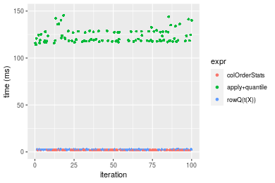

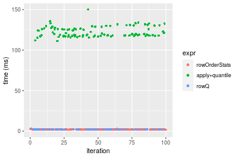
_Table: Benchmarking of colOrderStats() and rowOrderStats() on double+100x1000 data (original and transposed).  The top panel shows times in milliseconds and the bottom panel shows relative times._


|   |expr          |      min|       lq|     mean|   median|       uq|      max|
|:--|:-------------|--------:|--------:|--------:|--------:|--------:|--------:|
|2  |rowOrderStats | 1.801919| 1.911488| 1.965733| 1.942744| 1.988827| 2.659659|
|1  |colOrderStats | 1.773591| 1.933325| 1.949205| 1.944247| 1.963194| 2.416942|


|   |expr          |      min|       lq|     mean|   median|        uq|       max|
|:--|:-------------|--------:|--------:|--------:|--------:|---------:|---------:|
|2  |rowOrderStats | 1.000000| 1.000000| 1.000000| 1.000000| 1.0000000| 1.0000000|
|1  |colOrderStats | 0.984279| 1.011424| 0.991592| 1.000774| 0.9871113| 0.9087413|

_Figure: Benchmarking of colOrderStats() and rowOrderStats() on double+100x1000 data (original and transposed).  Outliers are displayed as crosses. Times are in milliseconds._


#### 1000x100 double matrix


```r
> X <- data[["1000x100"]]
> gc()
          used  (Mb) gc trigger  (Mb) max used  (Mb)
Ncells 5258709 280.9    8529671 455.6  8529671 455.6
Vcells 9999703  76.3   31876688 243.2 60562128 462.1
> probs <- 0.3
> which <- round(probs * nrow(X))
> colStats <- microbenchmark(colOrderStats = colOrderStats(X, which = which, na.rm = FALSE), `apply+quantile` = apply(X, 
+     MARGIN = 2L, FUN = quantile, probs = probs, na.rm = FALSE, type = 3L), `rowQ(t(X))` = rowQ(t(X), 
+     which = which), unit = "ms")
> X <- t(X)
> gc()
           used  (Mb) gc trigger  (Mb) max used  (Mb)
Ncells  5258702 280.9    8529671 455.6  8529671 455.6
Vcells 10099809  77.1   31876688 243.2 60562128 462.1
> rowStats <- microbenchmark(rowOrderStats = rowOrderStats(X, which = which, na.rm = FALSE), `apply+quantile` = apply(X, 
+     MARGIN = 1L, FUN = quantile, probs = probs, na.rm = FALSE, type = 3L), rowQ = rowQ(X, which = which), 
+     unit = "ms")
```


_Table: Benchmarking of colOrderStats(), apply+quantile() and rowQ(t(X))() on double+1000x100 data. The top panel shows times in milliseconds and the bottom panel shows relative times._


|   |expr           |       min|        lq|      mean|    median|        uq|       max|
|:--|:--------------|---------:|---------:|---------:|---------:|---------:|---------:|
|1  |colOrderStats  |  1.569726|  1.848809|  1.905385|  1.885864|  1.920953|  2.646510|
|3  |rowQ(t(X))     |  2.114182|  2.348117|  2.442088|  2.413133|  2.509334|  3.642366|
|2  |apply+quantile | 13.820662| 15.439949| 15.864930| 15.625089| 15.898580| 25.050803|


|   |expr           |      min|       lq|     mean|   median|       uq|      max|
|:--|:--------------|--------:|--------:|--------:|--------:|--------:|--------:|
|1  |colOrderStats  | 1.000000| 1.000000| 1.000000| 1.000000| 1.000000| 1.000000|
|3  |rowQ(t(X))     | 1.346848| 1.270070| 1.281677| 1.279590| 1.306296| 1.376290|
|2  |apply+quantile | 8.804506| 8.351295| 8.326363| 8.285374| 8.276400| 9.465599|

_Table: Benchmarking of rowOrderStats(), apply+quantile() and rowQ() on double+1000x100 data (transposed). The top panel shows times in milliseconds and the bottom panel shows relative times._


|   |expr           |       min|        lq|      mean|    median|        uq|       max|
|:--|:--------------|---------:|---------:|---------:|---------:|---------:|---------:|
|1  |rowOrderStats  |  1.676724|  1.899617|  1.927373|  1.924489|  1.956063|  2.169934|
|3  |rowQ           |  1.905838|  2.104718|  2.156928|  2.125433|  2.196982|  2.647807|
|2  |apply+quantile | 13.425054| 15.419405| 15.919382| 15.604428| 15.870903| 24.963535|


|   |expr           |      min|       lq|     mean|   median|       uq|       max|
|:--|:--------------|--------:|--------:|--------:|--------:|--------:|---------:|
|1  |rowOrderStats  | 1.000000| 1.000000| 1.000000| 1.000000| 1.000000|  1.000000|
|3  |rowQ           | 1.136644| 1.107970| 1.119103| 1.104414| 1.123165|  1.220225|
|2  |apply+quantile | 8.006717| 8.117113| 8.259629| 8.108347| 8.113695| 11.504283|

_Figure: Benchmarking of colOrderStats(), apply+quantile() and rowQ(t(X))() on double+1000x100 data  as well as rowOrderStats(), apply+quantile() and rowQ() on the same data transposed.  Outliers are displayed as crosses.  Times are in milliseconds._


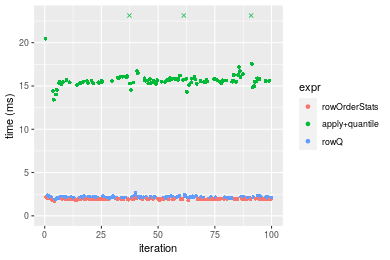
_Table: Benchmarking of colOrderStats() and rowOrderStats() on double+1000x100 data (original and transposed).  The top panel shows times in milliseconds and the bottom panel shows relative times._


|   |expr          |      min|       lq|     mean|   median|       uq|      max|
|:--|:-------------|--------:|--------:|--------:|--------:|--------:|--------:|
|1  |colOrderStats | 1.569726| 1.848809| 1.905385| 1.885864| 1.920953| 2.646510|
|2  |rowOrderStats | 1.676724| 1.899617| 1.927373| 1.924489| 1.956063| 2.169934|


|   |expr          |      min|       lq|    mean|   median|       uq|       max|
|:--|:-------------|--------:|--------:|-------:|--------:|--------:|---------:|
|1  |colOrderStats | 1.000000| 1.000000| 1.00000| 1.000000| 1.000000| 1.0000000|
|2  |rowOrderStats | 1.068164| 1.027481| 1.01154| 1.020482| 1.018277| 0.8199228|

_Figure: Benchmarking of colOrderStats() and rowOrderStats() on double+1000x100 data (original and transposed).  Outliers are displayed as crosses. Times are in milliseconds._


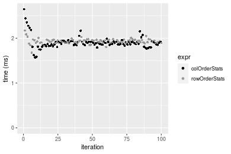


## Appendix

### Session information
```r
R version 4.1.1 Patched (2021-08-10 r80727)
Platform: x86_64-pc-linux-gnu (64-bit)
Running under: Ubuntu 18.04.5 LTS

Matrix products: default
BLAS:   /home/hb/software/R-devel/R-4-1-branch/lib/R/lib/libRblas.so
LAPACK: /home/hb/software/R-devel/R-4-1-branch/lib/R/lib/libRlapack.so

locale:
 [1] LC_CTYPE=en_US.UTF-8       LC_NUMERIC=C              
 [3] LC_TIME=en_US.UTF-8        LC_COLLATE=en_US.UTF-8    
 [5] LC_MONETARY=en_US.UTF-8    LC_MESSAGES=en_US.UTF-8   
 [7] LC_PAPER=en_US.UTF-8       LC_NAME=C                 
 [9] LC_ADDRESS=C               LC_TELEPHONE=C            
[11] LC_MEASUREMENT=en_US.UTF-8 LC_IDENTIFICATION=C       

attached base packages:
[1] stats     graphics  grDevices utils     datasets  methods   base     

other attached packages:
[1] microbenchmark_1.4-7   matrixStats_0.60.1     ggplot2_3.3.5         
[4] knitr_1.33             R.devices_2.17.0       R.utils_2.10.1        
[7] R.oo_1.24.0            R.methodsS3_1.8.1-9001 history_0.0.1-9000    

loaded via a namespace (and not attached):
 [1] Biobase_2.52.0          httr_1.4.2              splines_4.1.1          
 [4] bit64_4.0.5             network_1.17.1          assertthat_0.2.1       
 [7] highr_0.9               stats4_4.1.1            blob_1.2.2             
[10] GenomeInfoDbData_1.2.6  robustbase_0.93-8       pillar_1.6.2           
[13] RSQLite_2.2.8           lattice_0.20-44         glue_1.4.2             
[16] digest_0.6.27           XVector_0.32.0          colorspace_2.0-2       
[19] Matrix_1.3-4            XML_3.99-0.7            pkgconfig_2.0.3        
[22] zlibbioc_1.38.0         genefilter_1.74.0       purrr_0.3.4            
[25] ergm_4.1.2              xtable_1.8-4            scales_1.1.1           
[28] tibble_3.1.4            annotate_1.70.0         KEGGREST_1.32.0        
[31] farver_2.1.0            generics_0.1.0          IRanges_2.26.0         
[34] ellipsis_0.3.2          cachem_1.0.6            withr_2.4.2            
[37] BiocGenerics_0.38.0     mime_0.11               survival_3.2-13        
[40] magrittr_2.0.1          crayon_1.4.1            statnet.common_4.5.0   
[43] memoise_2.0.0           laeken_0.5.1            fansi_0.5.0            
[46] R.cache_0.15.0          MASS_7.3-54             R.rsp_0.44.0           
[49] progressr_0.8.0         tools_4.1.1             lifecycle_1.0.0        
[52] S4Vectors_0.30.0        trust_0.1-8             munsell_0.5.0          
[55] tabby_0.0.1-9001        AnnotationDbi_1.54.1    Biostrings_2.60.2      
[58] compiler_4.1.1          GenomeInfoDb_1.28.1     rlang_0.4.11           
[61] grid_4.1.1              RCurl_1.98-1.4          cwhmisc_6.6            
[64] rappdirs_0.3.3          startup_0.15.0          labeling_0.4.2         
[67] bitops_1.0-7            base64enc_0.1-3         boot_1.3-28            
[70] gtable_0.3.0            DBI_1.1.1               markdown_1.1           
[73] R6_2.5.1                lpSolveAPI_5.5.2.0-17.7 rle_0.9.2              
[76] dplyr_1.0.7             fastmap_1.1.0           bit_4.0.4              
[79] utf8_1.2.2              parallel_4.1.1          Rcpp_1.0.7             
[82] vctrs_0.3.8             png_0.1-7               DEoptimR_1.0-9         
[85] tidyselect_1.1.1        xfun_0.25               coda_0.19-4            
```
Total processing time was 2.22 mins.


### Reproducibility
To reproduce this report, do:
```r
html <- matrixStats:::benchmark('colOrderStats')
```

[RSP]: https://cran.r-project.org/package=R.rsp
[matrixStats]: https://cran.r-project.org/package=matrixStats

[StackOverflow:colMins?]: https://stackoverflow.com/questions/13676878 "Stack Overflow: fastest way to get Min from every column in a matrix?"
[StackOverflow:colSds?]: https://stackoverflow.com/questions/17549762 "Stack Overflow: Is there such 'colsd' in R?"
[StackOverflow:rowProds?]: https://stackoverflow.com/questions/20198801/ "Stack Overflow: Row product of matrix and column sum of matrix"

---------------------------------------
Copyright Henrik Bengtsson. Last updated on 2021-08-25 19:04:01 (+0200 UTC). Powered by [RSP].

<script>
 var link = document.createElement('link');
 link.rel = 'icon';
 link.href = "data:image/png;base64,iVBORw0KGgoAAAANSUhEUgAAACAAAAAgCAMAAABEpIrGAAAA21BMVEUAAAAAAP8AAP8AAP8AAP8AAP8AAP8AAP8AAP8AAP8AAP8AAP8AAP8AAP8AAP8AAP8AAP8AAP8AAP8AAP8AAP8AAP8AAP8AAP8AAP8AAP8AAP8AAP8AAP8AAP8AAP8AAP8AAP8AAP8AAP8AAP8AAP8AAP8AAP8AAP8AAP8AAP8BAf4CAv0DA/wdHeIeHuEfH+AgIN8hId4lJdomJtknJ9g+PsE/P8BAQL9yco10dIt1dYp3d4h4eIeVlWqWlmmXl2iYmGeZmWabm2Tn5xjo6Bfp6Rb39wj4+Af//wA2M9hbAAAASXRSTlMAAQIJCgsMJSYnKD4/QGRlZmhpamtsbautrrCxuru8y8zN5ebn6Pn6+///////////////////////////////////////////LsUNcQAAAS9JREFUOI29k21XgkAQhVcFytdSMqMETU26UVqGmpaiFbL//xc1cAhhwVNf6n5i5z67M2dmYOyfJZUqlVLhkKucG7cgmUZTybDz6g0iDeq51PUr37Ds2cy2/C9NeES5puDjxuUk1xnToZsg8pfA3avHQ3lLIi7iWRrkv/OYtkScxBIMgDee0ALoyxHQBJ68JLCjOtQIMIANF7QG9G9fNnHvisCHBVMKgSJgiz7nE+AoBKrAPA3MgepvgR9TSCasrCKH0eB1wBGBFdCO+nAGjMVGPcQb5bd6mQRegN6+1axOs9nGfYcCtfi4NQosdtH7dB+txFIpXQqN1p9B/asRHToyS0jRgpV7nk4nwcq1BJ+x3Gl/v7S9Wmpp/aGquum7w3ZDyrADFYrl8vHBH+ev9AUASW1dmU4h4wAAAABJRU5ErkJggg=="
 document.getElementsByTagName('head')[0].appendChild(link);
</script>


