[matrixStats]: Benchmark report

---------------------------------------


# colProds() and rowProds() benchmarks

This report benchmark the performance of colProds() and rowProds() against alternative methods.

## Alternative methods

* colProds()/rowProds() using method="expSumLog"
* apply() + prod()
* apply() + product()


## Data
```r
> rmatrix <- function(nrow, ncol, mode = c("logical", "double", "integer", "index"), range = c(-100, 
+     +100), na_prob = 0) {
+     mode <- match.arg(mode)
+     n <- nrow * ncol
+     if (mode == "logical") {
+         x <- sample(c(FALSE, TRUE), size = n, replace = TRUE)
+     }     else if (mode == "index") {
+         x <- seq_len(n)
+         mode <- "integer"
+     }     else {
+         x <- runif(n, min = range[1], max = range[2])
+     }
+     storage.mode(x) <- mode
+     if (na_prob > 0) 
+         x[sample(n, size = na_prob * n)] <- NA
+     dim(x) <- c(nrow, ncol)
+     x
+ }
> rmatrices <- function(scale = 10, seed = 1, ...) {
+     set.seed(seed)
+     data <- list()
+     data[[1]] <- rmatrix(nrow = scale * 1, ncol = scale * 1, ...)
+     data[[2]] <- rmatrix(nrow = scale * 10, ncol = scale * 10, ...)
+     data[[3]] <- rmatrix(nrow = scale * 100, ncol = scale * 1, ...)
+     data[[4]] <- t(data[[3]])
+     data[[5]] <- rmatrix(nrow = scale * 10, ncol = scale * 100, ...)
+     data[[6]] <- t(data[[5]])
+     names(data) <- sapply(data, FUN = function(x) paste(dim(x), collapse = "x"))
+     data
+ }
> data <- rmatrices(mode = "double")
```

## Results

### 10x10 matrix


```r
> X <- data[["10x10"]]
> colStats <- microbenchmark(`colProds w/ direct` = colProds(X, method = "direct", na.rm = FALSE), 
+     `colProds w/ expSumLog` = colProds(X, method = "expSumLog", na.rm = FALSE), `apply+prod` = apply(X, 
+         MARGIN = 2L, FUN = prod, na.rm = FALSE), `apply+product` = apply(X, MARGIN = 2L, FUN = product, 
+         na.rm = FALSE), unit = "ms")
> X <- t(X)
> rowStats <- microbenchmark(`rowProds w/ direct` = rowProds(X, method = "direct", na.rm = FALSE), 
+     `rowProds w/ expSumLog` = rowProds(X, method = "expSumLog", na.rm = FALSE), `apply+prod` = apply(X, 
+         MARGIN = 1L, FUN = prod, na.rm = FALSE), `apply+product` = apply(X, MARGIN = 1L, FUN = product, 
+         na.rm = FALSE), unit = "ms")
```

_Table: Benchmarking of colProds w/ direct(), colProds w/ expSumLog(), apply+prod() and apply+product() on 10x10 data. The top panel shows times in milliseconds and the bottom panel shows relative times._


|   |expr                  |      min|        lq|      mean|    median|        uq|      max|
|:--|:---------------------|--------:|---------:|---------:|---------:|---------:|--------:|
|1  |colProds w/ direct    | 0.015464| 0.0170365| 0.0182301| 0.0177725| 0.0186310| 0.049166|
|2  |colProds w/ expSumLog | 0.025361| 0.0266820| 0.0282407| 0.0281735| 0.0294785| 0.036924|
|3  |apply+prod            | 0.033480| 0.0359415| 0.0375526| 0.0366855| 0.0375965| 0.064597|
|4  |apply+product         | 0.045762| 0.0488585| 0.0511288| 0.0501465| 0.0509425| 0.148216|


|   |expr                  |      min|       lq|     mean|   median|       uq|       max|
|:--|:---------------------|--------:|--------:|--------:|--------:|--------:|---------:|
|1  |colProds w/ direct    | 1.000000| 1.000000| 1.000000| 1.000000| 1.000000| 1.0000000|
|2  |colProds w/ expSumLog | 1.640003| 1.566167| 1.549127| 1.585230| 1.582229| 0.7510068|
|3  |apply+prod            | 2.165029| 2.109676| 2.059926| 2.064172| 2.017954| 1.3138551|
|4  |apply+product         | 2.959260| 2.867872| 2.804639| 2.821578| 2.734287| 3.0146036|

_Table: Benchmarking of rowProds w/ direct(), rowProds w/ expSumLog(), apply+prod() and apply+product() on 10x10 data (transposed). The top panel shows times in milliseconds and the bottom panel shows relative times._


|   |expr                  |      min|        lq|      mean|    median|        uq|      max|
|:--|:---------------------|--------:|---------:|---------:|---------:|---------:|--------:|
|1  |rowProds w/ direct    | 0.015246| 0.0167345| 0.0177963| 0.0177585| 0.0188475| 0.023598|
|2  |rowProds w/ expSumLog | 0.024732| 0.0268055| 0.0286955| 0.0284790| 0.0295640| 0.057406|
|3  |apply+prod            | 0.032469| 0.0348370| 0.0372683| 0.0364710| 0.0378930| 0.103660|
|4  |apply+product         | 0.043533| 0.0466160| 0.0486299| 0.0484055| 0.0505520| 0.065340|


|   |expr                  |      min|       lq|     mean|   median|       uq|      max|
|:--|:---------------------|--------:|--------:|--------:|--------:|--------:|--------:|
|1  |rowProds w/ direct    | 1.000000| 1.000000| 1.000000| 1.000000| 1.000000| 1.000000|
|2  |rowProds w/ expSumLog | 1.622196| 1.601811| 1.612443| 1.603683| 1.568590| 2.432664|
|3  |apply+prod            | 2.129673| 2.081747| 2.094159| 2.053721| 2.010505| 4.392745|
|4  |apply+product         | 2.855372| 2.785623| 2.732585| 2.725765| 2.682159| 2.768879|

_Figure: Benchmarking of colProds w/ direct(), colProds w/ expSumLog(), apply+prod() and apply+product() on 10x10 data  as well as rowProds w/ direct(), rowProds w/ expSumLog(), apply+prod() and apply+product() on the same data transposed.  Outliers are displayed as crosses.  Times are in milliseconds._


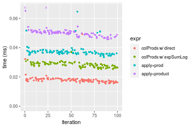

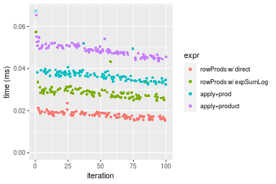
_Table: Benchmarking of colProds w/ direct() and rowProds w/ direct() on 10x10 data (original and transposed).  The top panel shows times in milliseconds and the bottom panel shows relative times._


|   |expr               |    min|      lq|     mean|  median|      uq|    max|
|:--|:------------------|------:|-------:|--------:|-------:|-------:|------:|
|2  |rowProds w/ direct | 15.246| 16.7345| 17.79631| 17.7585| 18.8475| 23.598|
|1  |colProds w/ direct | 15.464| 17.0365| 18.23007| 17.7725| 18.6310| 49.166|


|   |expr               |      min|       lq|     mean|   median|        uq|      max|
|:--|:------------------|--------:|--------:|--------:|--------:|---------:|--------:|
|2  |rowProds w/ direct | 1.000000| 1.000000| 1.000000| 1.000000| 1.0000000| 1.000000|
|1  |colProds w/ direct | 1.014299| 1.018047| 1.024374| 1.000788| 0.9885131| 2.083482|

_Figure: Benchmarking of colProds w/ direct() and rowProds w/ direct() on 10x10 data (original and transposed).  Outliers are displayed as crosses. Times are in milliseconds._


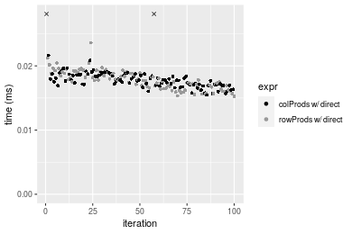

### 100x100 matrix


```r
> X <- data[["100x100"]]
> colStats <- microbenchmark(`colProds w/ direct` = colProds(X, method = "direct", na.rm = FALSE), 
+     `colProds w/ expSumLog` = colProds(X, method = "expSumLog", na.rm = FALSE), `apply+prod` = apply(X, 
+         MARGIN = 2L, FUN = prod, na.rm = FALSE), `apply+product` = apply(X, MARGIN = 2L, FUN = product, 
+         na.rm = FALSE), unit = "ms")
> X <- t(X)
> rowStats <- microbenchmark(`rowProds w/ direct` = rowProds(X, method = "direct", na.rm = FALSE), 
+     `rowProds w/ expSumLog` = rowProds(X, method = "expSumLog", na.rm = FALSE), `apply+prod` = apply(X, 
+         MARGIN = 1L, FUN = prod, na.rm = FALSE), `apply+product` = apply(X, MARGIN = 1L, FUN = product, 
+         na.rm = FALSE), unit = "ms")
```

_Table: Benchmarking of colProds w/ direct(), colProds w/ expSumLog(), apply+prod() and apply+product() on 100x100 data. The top panel shows times in milliseconds and the bottom panel shows relative times._


|   |expr                  |      min|        lq|      mean|    median|        uq|      max|
|:--|:---------------------|--------:|---------:|---------:|---------:|---------:|--------:|
|1  |colProds w/ direct    | 0.117317| 0.1297035| 0.1389370| 0.1333210| 0.1395285| 0.237072|
|3  |apply+prod            | 0.166813| 0.1828500| 0.1986652| 0.1910825| 0.2050910| 0.325056|
|2  |colProds w/ expSumLog | 0.386637| 0.4198260| 0.4610244| 0.4508850| 0.4610140| 0.673868|
|4  |apply+product         | 0.448368| 0.5021095| 0.5515868| 0.5223415| 0.5637455| 1.064698|


|   |expr                  |     min|       lq|     mean|   median|       uq|      max|
|:--|:---------------------|-------:|--------:|--------:|--------:|--------:|--------:|
|1  |colProds w/ direct    | 1.00000| 1.000000| 1.000000| 1.000000| 1.000000| 1.000000|
|3  |apply+prod            | 1.42190| 1.409754| 1.429894| 1.433251| 1.469886| 1.371128|
|2  |colProds w/ expSumLog | 3.29566| 3.236813| 3.318225| 3.381950| 3.304085| 2.842461|
|4  |apply+product         | 3.82185| 3.871210| 3.970048| 3.917924| 4.040361| 4.491032|

_Table: Benchmarking of rowProds w/ direct(), rowProds w/ expSumLog(), apply+prod() and apply+product() on 100x100 data (transposed). The top panel shows times in milliseconds and the bottom panel shows relative times._


|   |expr                  |      min|        lq|      mean|    median|        uq|      max|
|:--|:---------------------|--------:|---------:|---------:|---------:|---------:|--------:|
|1  |rowProds w/ direct    | 0.143839| 0.1627010| 0.1789774| 0.1673370| 0.1870145| 0.289425|
|3  |apply+prod            | 0.164456| 0.1826105| 0.2021063| 0.1936155| 0.2103705| 0.342941|
|2  |rowProds w/ expSumLog | 0.428025| 0.4628110| 0.5036717| 0.4825730| 0.5232340| 0.791292|
|4  |apply+product         | 0.449080| 0.4948235| 0.5339072| 0.5152880| 0.5423520| 0.831811|


|   |expr                  |      min|       lq|     mean|   median|       uq|      max|
|:--|:---------------------|--------:|--------:|--------:|--------:|--------:|--------:|
|1  |rowProds w/ direct    | 1.000000| 1.000000| 1.000000| 1.000000| 1.000000| 1.000000|
|3  |apply+prod            | 1.143334| 1.122369| 1.129228| 1.157039| 1.124889| 1.184905|
|2  |rowProds w/ expSumLog | 2.975723| 2.844549| 2.814163| 2.883839| 2.797826| 2.734014|
|4  |apply+product         | 3.122102| 3.041306| 2.983098| 3.079343| 2.900053| 2.874012|

_Figure: Benchmarking of colProds w/ direct(), colProds w/ expSumLog(), apply+prod() and apply+product() on 100x100 data  as well as rowProds w/ direct(), rowProds w/ expSumLog(), apply+prod() and apply+product() on the same data transposed.  Outliers are displayed as crosses.  Times are in milliseconds._


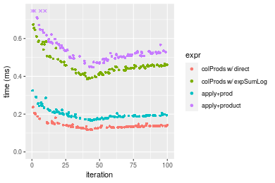

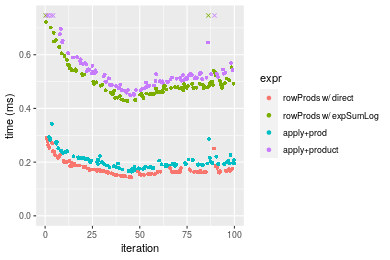
_Table: Benchmarking of colProds w/ direct() and rowProds w/ direct() on 100x100 data (original and transposed).  The top panel shows times in milliseconds and the bottom panel shows relative times._


|   |expr               |     min|       lq|     mean|  median|       uq|     max|
|:--|:------------------|-------:|--------:|--------:|-------:|--------:|-------:|
|1  |colProds w/ direct | 117.317| 129.7035| 138.9370| 133.321| 139.5285| 237.072|
|2  |rowProds w/ direct | 143.839| 162.7010| 178.9774| 167.337| 187.0145| 289.425|


|   |expr               |      min|       lq|     mean|   median|       uq|      max|
|:--|:------------------|--------:|--------:|--------:|--------:|--------:|--------:|
|1  |colProds w/ direct | 1.000000| 1.000000| 1.000000| 1.000000| 1.000000| 1.000000|
|2  |rowProds w/ direct | 1.226071| 1.254407| 1.288191| 1.255144| 1.340332| 1.220832|

_Figure: Benchmarking of colProds w/ direct() and rowProds w/ direct() on 100x100 data (original and transposed).  Outliers are displayed as crosses. Times are in milliseconds._


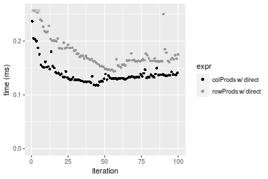

### 1000x10 matrix


```r
> X <- data[["1000x10"]]
> colStats <- microbenchmark(`colProds w/ direct` = colProds(X, method = "direct", na.rm = FALSE), 
+     `colProds w/ expSumLog` = colProds(X, method = "expSumLog", na.rm = FALSE), `apply+prod` = apply(X, 
+         MARGIN = 2L, FUN = prod, na.rm = FALSE), `apply+product` = apply(X, MARGIN = 2L, FUN = product, 
+         na.rm = FALSE), unit = "ms")
> X <- t(X)
> rowStats <- microbenchmark(`rowProds w/ direct` = rowProds(X, method = "direct", na.rm = FALSE), 
+     `rowProds w/ expSumLog` = rowProds(X, method = "expSumLog", na.rm = FALSE), `apply+prod` = apply(X, 
+         MARGIN = 1L, FUN = prod, na.rm = FALSE), `apply+product` = apply(X, MARGIN = 1L, FUN = product, 
+         na.rm = FALSE), unit = "ms")
```

_Table: Benchmarking of colProds w/ direct(), colProds w/ expSumLog(), apply+prod() and apply+product() on 1000x10 data. The top panel shows times in milliseconds and the bottom panel shows relative times._


|   |expr                  |      min|        lq|      mean|    median|        uq|      max|
|:--|:---------------------|--------:|---------:|---------:|---------:|---------:|--------:|
|1  |colProds w/ direct    | 0.051304| 0.0555880| 0.0648662| 0.0591295| 0.0745600| 0.093749|
|3  |apply+prod            | 0.091343| 0.0985405| 0.1111484| 0.1021665| 0.1195895| 0.172639|
|2  |colProds w/ expSumLog | 0.271162| 0.2915345| 0.3244262| 0.3017575| 0.3528975| 0.468217|
|4  |apply+product         | 0.312593| 0.3361785| 0.3770063| 0.3539670| 0.3983920| 0.635558|


|   |expr                  |      min|       lq|     mean|   median|       uq|      max|
|:--|:---------------------|--------:|--------:|--------:|--------:|--------:|--------:|
|1  |colProds w/ direct    | 1.000000| 1.000000| 1.000000| 1.000000| 1.000000| 1.000000|
|3  |apply+prod            | 1.780426| 1.772694| 1.713502| 1.727843| 1.603936| 1.841502|
|2  |colProds w/ expSumLog | 5.285397| 5.244558| 5.001466| 5.103332| 4.733067| 4.994368|
|4  |apply+product         | 6.092956| 6.047681| 5.812059| 5.986301| 5.343240| 6.779358|

_Table: Benchmarking of rowProds w/ direct(), rowProds w/ expSumLog(), apply+prod() and apply+product() on 1000x10 data (transposed). The top panel shows times in milliseconds and the bottom panel shows relative times._


|   |expr                  |      min|        lq|      mean|    median|        uq|      max|
|:--|:---------------------|--------:|---------:|---------:|---------:|---------:|--------:|
|1  |rowProds w/ direct    | 0.079256| 0.0846850| 0.0926506| 0.0876200| 0.0973465| 0.149839|
|3  |apply+prod            | 0.092173| 0.0977360| 0.1104220| 0.1021925| 0.1203055| 0.167060|
|2  |rowProds w/ expSumLog | 0.305427| 0.3295275| 0.3678592| 0.3405060| 0.3975110| 0.506773|
|4  |apply+product         | 0.316353| 0.3345365| 0.3766125| 0.3523175| 0.4027160| 0.610738|


|   |expr                  |      min|       lq|     mean|   median|       uq|      max|
|:--|:---------------------|--------:|--------:|--------:|--------:|--------:|--------:|
|1  |rowProds w/ direct    | 1.000000| 1.000000| 1.000000| 1.000000| 1.000000| 1.000000|
|3  |apply+prod            | 1.162978| 1.154112| 1.191811| 1.166315| 1.235848| 1.114930|
|2  |rowProds w/ expSumLog | 3.853677| 3.891214| 3.970390| 3.886167| 4.083465| 3.382117|
|4  |apply+product         | 3.991534| 3.950363| 4.064867| 4.020971| 4.136933| 4.075962|

_Figure: Benchmarking of colProds w/ direct(), colProds w/ expSumLog(), apply+prod() and apply+product() on 1000x10 data  as well as rowProds w/ direct(), rowProds w/ expSumLog(), apply+prod() and apply+product() on the same data transposed.  Outliers are displayed as crosses.  Times are in milliseconds._


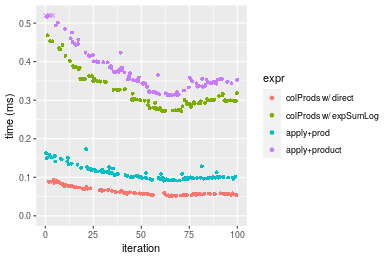

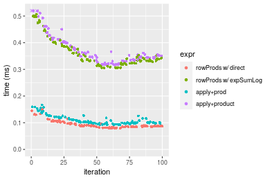
_Table: Benchmarking of colProds w/ direct() and rowProds w/ direct() on 1000x10 data (original and transposed).  The top panel shows times in milliseconds and the bottom panel shows relative times._


|   |expr               |    min|     lq|     mean|  median|      uq|     max|
|:--|:------------------|------:|------:|--------:|-------:|-------:|-------:|
|1  |colProds w/ direct | 51.304| 55.588| 64.86623| 59.1295| 74.5600|  93.749|
|2  |rowProds w/ direct | 79.256| 84.685| 92.65065| 87.6200| 97.3465| 149.839|


|   |expr               |      min|      lq|     mean|   median|       uq|    max|
|:--|:------------------|--------:|-------:|--------:|--------:|--------:|------:|
|1  |colProds w/ direct | 1.000000| 1.00000| 1.000000| 1.000000| 1.000000| 1.0000|
|2  |rowProds w/ direct | 1.544831| 1.52344| 1.428334| 1.481832| 1.305613| 1.5983|

_Figure: Benchmarking of colProds w/ direct() and rowProds w/ direct() on 1000x10 data (original and transposed).  Outliers are displayed as crosses. Times are in milliseconds._


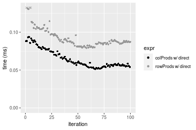

### 10x1000 matrix


```r
> X <- data[["10x1000"]]
> colStats <- microbenchmark(`colProds w/ direct` = colProds(X, method = "direct", na.rm = FALSE), 
+     `colProds w/ expSumLog` = colProds(X, method = "expSumLog", na.rm = FALSE), `apply+prod` = apply(X, 
+         MARGIN = 2L, FUN = prod, na.rm = FALSE), `apply+product` = apply(X, MARGIN = 2L, FUN = product, 
+         na.rm = FALSE), unit = "ms")
> X <- t(X)
> rowStats <- microbenchmark(`rowProds w/ direct` = rowProds(X, method = "direct", na.rm = FALSE), 
+     `rowProds w/ expSumLog` = rowProds(X, method = "expSumLog", na.rm = FALSE), `apply+prod` = apply(X, 
+         MARGIN = 1L, FUN = prod, na.rm = FALSE), `apply+product` = apply(X, MARGIN = 1L, FUN = product, 
+         na.rm = FALSE), unit = "ms")
```

_Table: Benchmarking of colProds w/ direct(), colProds w/ expSumLog(), apply+prod() and apply+product() on 10x1000 data. The top panel shows times in milliseconds and the bottom panel shows relative times._


|   |expr                  |      min|        lq|     mean|   median|       uq|      max|
|:--|:---------------------|--------:|---------:|--------:|--------:|--------:|--------:|
|1  |colProds w/ direct    | 0.799044| 0.9231395| 0.958287| 0.942038| 0.971782| 1.286089|
|3  |apply+prod            | 0.960443| 1.0770465| 1.143599| 1.124933| 1.171175| 1.680799|
|2  |colProds w/ expSumLog | 1.563287| 1.7493370| 1.905964| 1.800013| 1.841074| 7.304836|
|4  |apply+product         | 1.822864| 2.0337965| 2.112645| 2.081757| 2.131324| 2.968760|


|   |expr                  |      min|       lq|     mean|   median|       uq|      max|
|:--|:---------------------|--------:|--------:|--------:|--------:|--------:|--------:|
|1  |colProds w/ direct    | 1.000000| 1.000000| 1.000000| 1.000000| 1.000000| 1.000000|
|3  |apply+prod            | 1.201990| 1.166721| 1.193378| 1.194148| 1.205182| 1.306907|
|2  |colProds w/ expSumLog | 1.956447| 1.894987| 1.988928| 1.910765| 1.894534| 5.679884|
|4  |apply+product         | 2.281306| 2.203130| 2.204606| 2.209843| 2.193213| 2.308363|

_Table: Benchmarking of rowProds w/ direct(), rowProds w/ expSumLog(), apply+prod() and apply+product() on 10x1000 data (transposed). The top panel shows times in milliseconds and the bottom panel shows relative times._


|   |expr                  |      min|       lq|      mean|    median|        uq|      max|
|:--|:---------------------|--------:|--------:|---------:|---------:|---------:|--------:|
|1  |rowProds w/ direct    | 0.823888| 0.937789| 0.9609848| 0.9533515| 0.9761085| 1.274040|
|3  |apply+prod            | 0.936360| 1.083555| 1.1131097| 1.1021725| 1.1470555| 1.402351|
|2  |rowProds w/ expSumLog | 1.518385| 1.768428| 1.8766842| 1.8216165| 1.8756260| 7.359193|
|4  |apply+product         | 1.792159| 2.034142| 2.1317012| 2.0607120| 2.1115305| 7.548568|


|   |expr                  |      min|       lq|     mean|   median|       uq|      max|
|:--|:---------------------|--------:|--------:|--------:|--------:|--------:|--------:|
|1  |rowProds w/ direct    | 1.000000| 1.000000| 1.000000| 1.000000| 1.000000| 1.000000|
|3  |apply+prod            | 1.136514| 1.155436| 1.158301| 1.156103| 1.175131| 1.100712|
|2  |rowProds w/ expSumLog | 1.842951| 1.885742| 1.952876| 1.910750| 1.921534| 5.776265|
|4  |apply+product         | 2.175246| 2.169083| 2.218246| 2.161545| 2.163213| 5.924907|

_Figure: Benchmarking of colProds w/ direct(), colProds w/ expSumLog(), apply+prod() and apply+product() on 10x1000 data  as well as rowProds w/ direct(), rowProds w/ expSumLog(), apply+prod() and apply+product() on the same data transposed.  Outliers are displayed as crosses.  Times are in milliseconds._


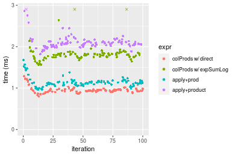

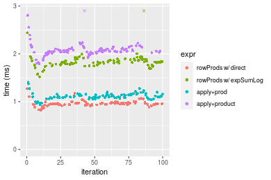
_Table: Benchmarking of colProds w/ direct() and rowProds w/ direct() on 10x1000 data (original and transposed).  The top panel shows times in milliseconds and the bottom panel shows relative times._


|   |expr               |     min|       lq|     mean|   median|       uq|      max|
|:--|:------------------|-------:|--------:|--------:|--------:|--------:|--------:|
|1  |colProds w/ direct | 799.044| 923.1395| 958.2870| 942.0380| 971.7820| 1286.089|
|2  |rowProds w/ direct | 823.888| 937.7890| 960.9848| 953.3515| 976.1085| 1274.040|


|   |expr               |      min|       lq|     mean|  median|       uq|       max|
|:--|:------------------|--------:|--------:|--------:|-------:|--------:|---------:|
|1  |colProds w/ direct | 1.000000| 1.000000| 1.000000| 1.00000| 1.000000| 1.0000000|
|2  |rowProds w/ direct | 1.031092| 1.015869| 1.002815| 1.01201| 1.004452| 0.9906313|

_Figure: Benchmarking of colProds w/ direct() and rowProds w/ direct() on 10x1000 data (original and transposed).  Outliers are displayed as crosses. Times are in milliseconds._


### 100x1000 matrix


```r
> X <- data[["100x1000"]]
> colStats <- microbenchmark(`colProds w/ direct` = colProds(X, method = "direct", na.rm = FALSE), 
+     `colProds w/ expSumLog` = colProds(X, method = "expSumLog", na.rm = FALSE), `apply+prod` = apply(X, 
+         MARGIN = 2L, FUN = prod, na.rm = FALSE), `apply+product` = apply(X, MARGIN = 2L, FUN = product, 
+         na.rm = FALSE), unit = "ms")
> X <- t(X)
> rowStats <- microbenchmark(`rowProds w/ direct` = rowProds(X, method = "direct", na.rm = FALSE), 
+     `rowProds w/ expSumLog` = rowProds(X, method = "expSumLog", na.rm = FALSE), `apply+prod` = apply(X, 
+         MARGIN = 1L, FUN = prod, na.rm = FALSE), `apply+product` = apply(X, MARGIN = 1L, FUN = product, 
+         na.rm = FALSE), unit = "ms")
```

_Table: Benchmarking of colProds w/ direct(), colProds w/ expSumLog(), apply+prod() and apply+product() on 100x1000 data. The top panel shows times in milliseconds and the bottom panel shows relative times._


|   |expr                  |      min|       lq|     mean|   median|       uq|       max|
|:--|:---------------------|--------:|--------:|--------:|--------:|--------:|---------:|
|1  |colProds w/ direct    | 1.179389| 1.314968| 1.345066| 1.349840| 1.366229|  1.683755|
|3  |apply+prod            | 1.575255| 1.775967| 1.847444| 1.816569| 1.860508|  2.686729|
|2  |colProds w/ expSumLog | 4.051115| 4.557006| 5.084922| 4.656977| 4.700619| 25.746866|
|4  |apply+product         | 4.427333| 5.124107| 5.434336| 5.213097| 5.292663| 26.213598|


|   |expr                  |      min|       lq|     mean|   median|       uq|       max|
|:--|:---------------------|--------:|--------:|--------:|--------:|--------:|---------:|
|1  |colProds w/ direct    | 1.000000| 1.000000| 1.000000| 1.000000| 1.000000|  1.000000|
|3  |apply+prod            | 1.335654| 1.350577| 1.373497| 1.345767| 1.361784|  1.595677|
|2  |colProds w/ expSumLog | 3.434927| 3.465487| 3.780426| 3.450023| 3.440580| 15.291337|
|4  |apply+product         | 3.753921| 3.896753| 4.040201| 3.862013| 3.873922| 15.568535|

_Table: Benchmarking of rowProds w/ direct(), rowProds w/ expSumLog(), apply+prod() and apply+product() on 100x1000 data (transposed). The top panel shows times in milliseconds and the bottom panel shows relative times._


|   |expr                  |      min|       lq|     mean|   median|       uq|       max|
|:--|:---------------------|--------:|--------:|--------:|--------:|--------:|---------:|
|1  |rowProds w/ direct    | 1.500721| 1.640316| 1.706389| 1.682621| 1.714270|  2.488731|
|3  |apply+prod            | 1.582496| 1.776851| 2.437600| 1.833390| 1.871156| 22.490657|
|2  |rowProds w/ expSumLog | 4.158133| 4.859330| 4.947674| 4.949581| 5.036792|  7.099323|
|4  |apply+product         | 4.655465| 5.131910| 5.281496| 5.262080| 5.310206|  6.602964|


|   |expr                  |      min|       lq|     mean|   median|       uq|      max|
|:--|:---------------------|--------:|--------:|--------:|--------:|--------:|--------:|
|1  |rowProds w/ direct    | 1.000000| 1.000000| 1.000000| 1.000000| 1.000000| 1.000000|
|3  |apply+prod            | 1.054490| 1.083237| 1.428514| 1.089603| 1.091518| 9.036998|
|2  |rowProds w/ expSumLog | 2.770757| 2.962434| 2.899500| 2.941590| 2.938156| 2.852587|
|4  |apply+product         | 3.102152| 3.128610| 3.095130| 3.127311| 3.097649| 2.653145|

_Figure: Benchmarking of colProds w/ direct(), colProds w/ expSumLog(), apply+prod() and apply+product() on 100x1000 data  as well as rowProds w/ direct(), rowProds w/ expSumLog(), apply+prod() and apply+product() on the same data transposed.  Outliers are displayed as crosses.  Times are in milliseconds._


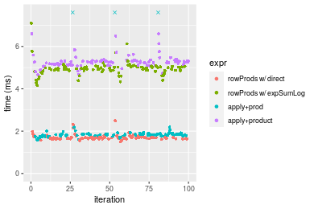
_Table: Benchmarking of colProds w/ direct() and rowProds w/ direct() on 100x1000 data (original and transposed).  The top panel shows times in milliseconds and the bottom panel shows relative times._


|   |expr               |      min|       lq|     mean|   median|       uq|      max|
|:--|:------------------|--------:|--------:|--------:|--------:|--------:|--------:|
|1  |colProds w/ direct | 1.179389| 1.314968| 1.345066| 1.349840| 1.366229| 1.683755|
|2  |rowProds w/ direct | 1.500721| 1.640316| 1.706389| 1.682621| 1.714270| 2.488731|


|   |expr               |      min|       lq|     mean|   median|       uq|      max|
|:--|:------------------|--------:|--------:|--------:|--------:|--------:|--------:|
|1  |colProds w/ direct | 1.000000| 1.000000| 1.000000| 1.000000| 1.000000| 1.000000|
|2  |rowProds w/ direct | 1.272456| 1.247419| 1.268629| 1.246534| 1.254746| 1.478084|

_Figure: Benchmarking of colProds w/ direct() and rowProds w/ direct() on 100x1000 data (original and transposed).  Outliers are displayed as crosses. Times are in milliseconds._


### 1000x100 matrix


```r
> X <- data[["1000x100"]]
> colStats <- microbenchmark(`colProds w/ direct` = colProds(X, method = "direct", na.rm = FALSE), 
+     `colProds w/ expSumLog` = colProds(X, method = "expSumLog", na.rm = FALSE), `apply+prod` = apply(X, 
+         MARGIN = 2L, FUN = prod, na.rm = FALSE), `apply+product` = apply(X, MARGIN = 2L, FUN = product, 
+         na.rm = FALSE), unit = "ms")
> X <- t(X)
> rowStats <- microbenchmark(`rowProds w/ direct` = rowProds(X, method = "direct", na.rm = FALSE), 
+     `rowProds w/ expSumLog` = rowProds(X, method = "expSumLog", na.rm = FALSE), `apply+prod` = apply(X, 
+         MARGIN = 1L, FUN = prod, na.rm = FALSE), `apply+product` = apply(X, MARGIN = 1L, FUN = product, 
+         na.rm = FALSE), unit = "ms")
```

_Table: Benchmarking of colProds w/ direct(), colProds w/ expSumLog(), apply+prod() and apply+product() on 1000x100 data. The top panel shows times in milliseconds and the bottom panel shows relative times._


|   |expr                  |      min|        lq|      mean|    median|       uq|      max|
|:--|:---------------------|--------:|---------:|---------:|---------:|--------:|--------:|
|1  |colProds w/ direct    | 0.492126| 0.5421640| 0.5585672| 0.5555440| 0.567384| 0.681578|
|3  |apply+prod            | 0.811366| 0.8763845| 1.1486733| 0.8955615| 0.922404| 9.229041|
|2  |colProds w/ expSumLog | 2.734650| 3.1977200| 3.2522467| 3.2312370| 3.302136| 4.137175|
|4  |apply+product         | 3.094241| 3.5440850| 3.6029714| 3.5776690| 3.663947| 4.990393|


|   |expr                  |      min|       lq|     mean|   median|       uq|       max|
|:--|:---------------------|--------:|--------:|--------:|--------:|--------:|---------:|
|1  |colProds w/ direct    | 1.000000| 1.000000| 1.000000| 1.000000| 1.000000|  1.000000|
|3  |apply+prod            | 1.648696| 1.616456| 2.056464| 1.612044| 1.625714| 13.540697|
|2  |colProds w/ expSumLog | 5.556809| 5.898068| 5.822481| 5.816348| 5.819932|  6.069995|
|4  |apply+product         | 6.287497| 6.536924| 6.450382| 6.439938| 6.457615|  7.321822|

_Table: Benchmarking of rowProds w/ direct(), rowProds w/ expSumLog(), apply+prod() and apply+product() on 1000x100 data (transposed). The top panel shows times in milliseconds and the bottom panel shows relative times._


|   |expr                  |      min|        lq|      mean|    median|        uq|        max|
|:--|:---------------------|--------:|---------:|---------:|---------:|---------:|----------:|
|1  |rowProds w/ direct    | 0.766797| 0.8575020| 0.9809245| 0.8771355| 0.8963170|   9.267478|
|3  |apply+prod            | 0.813991| 0.9070525| 0.9439808| 0.9191840| 0.9451315|   1.385319|
|2  |rowProds w/ expSumLog | 3.031859| 3.5412015| 3.7012978| 3.5755145| 3.6667280|  11.453874|
|4  |apply+product         | 3.082218| 3.5543650| 7.2111981| 3.6093075| 3.7005655| 360.611770|


|   |expr                  |      min|       lq|      mean|   median|       uq|        max|
|:--|:---------------------|--------:|--------:|---------:|--------:|--------:|----------:|
|1  |rowProds w/ direct    | 1.000000| 1.000000| 1.0000000| 1.000000| 1.000000|  1.0000000|
|3  |apply+prod            | 1.061547| 1.057785| 0.9623379| 1.047938| 1.054461|  0.1494818|
|2  |rowProds w/ expSumLog | 3.953927| 4.129671| 3.7732749| 4.076354| 4.090883|  1.2359214|
|4  |apply+product         | 4.019601| 4.145022| 7.3514303| 4.114880| 4.128635| 38.9115324|

_Figure: Benchmarking of colProds w/ direct(), colProds w/ expSumLog(), apply+prod() and apply+product() on 1000x100 data  as well as rowProds w/ direct(), rowProds w/ expSumLog(), apply+prod() and apply+product() on the same data transposed.  Outliers are displayed as crosses.  Times are in milliseconds._


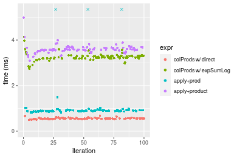

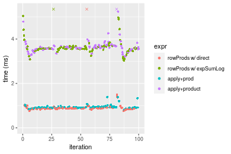
_Table: Benchmarking of colProds w/ direct() and rowProds w/ direct() on 1000x100 data (original and transposed).  The top panel shows times in milliseconds and the bottom panel shows relative times._


|   |expr               |     min|      lq|     mean|   median|      uq|      max|
|:--|:------------------|-------:|-------:|--------:|--------:|-------:|--------:|
|1  |colProds w/ direct | 492.126| 542.164| 558.5671| 555.5440| 567.384|  681.578|
|2  |rowProds w/ direct | 766.797| 857.502| 980.9245| 877.1355| 896.317| 9267.478|


|   |expr               |      min|       lq|     mean|   median|       uq|      max|
|:--|:------------------|--------:|--------:|--------:|--------:|--------:|--------:|
|1  |colProds w/ direct | 1.000000| 1.000000| 1.000000| 1.000000| 1.000000|  1.00000|
|2  |rowProds w/ direct | 1.558132| 1.581628| 1.756144| 1.578877| 1.579736| 13.59709|

_Figure: Benchmarking of colProds w/ direct() and rowProds w/ direct() on 1000x100 data (original and transposed).  Outliers are displayed as crosses. Times are in milliseconds._


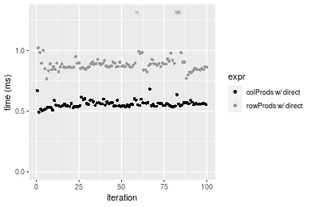


## Appendix

### Session information
```r
R version 4.1.1 Patched (2021-08-10 r80727)
Platform: x86_64-pc-linux-gnu (64-bit)
Running under: Ubuntu 18.04.5 LTS

Matrix products: default
BLAS:   /home/hb/software/R-devel/R-4-1-branch/lib/R/lib/libRblas.so
LAPACK: /home/hb/software/R-devel/R-4-1-branch/lib/R/lib/libRlapack.so

locale:
 [1] LC_CTYPE=en_US.UTF-8       LC_NUMERIC=C              
 [3] LC_TIME=en_US.UTF-8        LC_COLLATE=en_US.UTF-8    
 [5] LC_MONETARY=en_US.UTF-8    LC_MESSAGES=en_US.UTF-8   
 [7] LC_PAPER=en_US.UTF-8       LC_NAME=C                 
 [9] LC_ADDRESS=C               LC_TELEPHONE=C            
[11] LC_MEASUREMENT=en_US.UTF-8 LC_IDENTIFICATION=C       

attached base packages:
[1] stats     graphics  grDevices utils     datasets  methods   base     

other attached packages:
[1] microbenchmark_1.4-7   matrixStats_0.60.1     ggplot2_3.3.5         
[4] knitr_1.33             R.devices_2.17.0       R.utils_2.10.1        
[7] R.oo_1.24.0            R.methodsS3_1.8.1-9001 history_0.0.1-9000    

loaded via a namespace (and not attached):
 [1] Biobase_2.52.0          httr_1.4.2              splines_4.1.1          
 [4] bit64_4.0.5             network_1.17.1          assertthat_0.2.1       
 [7] highr_0.9               stats4_4.1.1            blob_1.2.2             
[10] GenomeInfoDbData_1.2.6  robustbase_0.93-8       pillar_1.6.2           
[13] RSQLite_2.2.8           lattice_0.20-44         glue_1.4.2             
[16] digest_0.6.27           XVector_0.32.0          colorspace_2.0-2       
[19] Matrix_1.3-4            XML_3.99-0.7            pkgconfig_2.0.3        
[22] zlibbioc_1.38.0         genefilter_1.74.0       purrr_0.3.4            
[25] ergm_4.1.2              xtable_1.8-4            scales_1.1.1           
[28] tibble_3.1.4            annotate_1.70.0         KEGGREST_1.32.0        
[31] farver_2.1.0            generics_0.1.0          IRanges_2.26.0         
[34] ellipsis_0.3.2          cachem_1.0.6            withr_2.4.2            
[37] BiocGenerics_0.38.0     mime_0.11               survival_3.2-13        
[40] magrittr_2.0.1          crayon_1.4.1            statnet.common_4.5.0   
[43] memoise_2.0.0           laeken_0.5.1            fansi_0.5.0            
[46] R.cache_0.15.0          MASS_7.3-54             R.rsp_0.44.0           
[49] progressr_0.8.0         tools_4.1.1             lifecycle_1.0.0        
[52] S4Vectors_0.30.0        trust_0.1-8             munsell_0.5.0          
[55] tabby_0.0.1-9001        AnnotationDbi_1.54.1    Biostrings_2.60.2      
[58] compiler_4.1.1          GenomeInfoDb_1.28.1     rlang_0.4.11           
[61] grid_4.1.1              RCurl_1.98-1.4          cwhmisc_6.6            
[64] rappdirs_0.3.3          startup_0.15.0          labeling_0.4.2         
[67] bitops_1.0-7            base64enc_0.1-3         boot_1.3-28            
[70] gtable_0.3.0            DBI_1.1.1               markdown_1.1           
[73] R6_2.5.1                lpSolveAPI_5.5.2.0-17.7 rle_0.9.2              
[76] dplyr_1.0.7             fastmap_1.1.0           bit_4.0.4              
[79] utf8_1.2.2              parallel_4.1.1          Rcpp_1.0.7             
[82] vctrs_0.3.8             png_0.1-7               DEoptimR_1.0-9         
[85] tidyselect_1.1.1        xfun_0.25               coda_0.19-4            
```
Total processing time was 18.47 secs.


### Reproducibility
To reproduce this report, do:
```r
html <- matrixStats:::benchmark('colProds')
```

[RSP]: https://cran.r-project.org/package=R.rsp
[matrixStats]: https://cran.r-project.org/package=matrixStats

[StackOverflow:colMins?]: https://stackoverflow.com/questions/13676878 "Stack Overflow: fastest way to get Min from every column in a matrix?"
[StackOverflow:colSds?]: https://stackoverflow.com/questions/17549762 "Stack Overflow: Is there such 'colsd' in R?"
[StackOverflow:rowProds?]: https://stackoverflow.com/questions/20198801/ "Stack Overflow: Row product of matrix and column sum of matrix"

---------------------------------------
Copyright Henrik Bengtsson. Last updated on 2021-08-25 19:04:39 (+0200 UTC). Powered by [RSP].

<script>
 var link = document.createElement('link');
 link.rel = 'icon';
 link.href = "data:image/png;base64,iVBORw0KGgoAAAANSUhEUgAAACAAAAAgCAMAAABEpIrGAAAA21BMVEUAAAAAAP8AAP8AAP8AAP8AAP8AAP8AAP8AAP8AAP8AAP8AAP8AAP8AAP8AAP8AAP8AAP8AAP8AAP8AAP8AAP8AAP8AAP8AAP8AAP8AAP8AAP8AAP8AAP8AAP8AAP8AAP8AAP8AAP8AAP8AAP8AAP8AAP8AAP8AAP8AAP8AAP8BAf4CAv0DA/wdHeIeHuEfH+AgIN8hId4lJdomJtknJ9g+PsE/P8BAQL9yco10dIt1dYp3d4h4eIeVlWqWlmmXl2iYmGeZmWabm2Tn5xjo6Bfp6Rb39wj4+Af//wA2M9hbAAAASXRSTlMAAQIJCgsMJSYnKD4/QGRlZmhpamtsbautrrCxuru8y8zN5ebn6Pn6+///////////////////////////////////////////LsUNcQAAAS9JREFUOI29k21XgkAQhVcFytdSMqMETU26UVqGmpaiFbL//xc1cAhhwVNf6n5i5z67M2dmYOyfJZUqlVLhkKucG7cgmUZTybDz6g0iDeq51PUr37Ds2cy2/C9NeES5puDjxuUk1xnToZsg8pfA3avHQ3lLIi7iWRrkv/OYtkScxBIMgDee0ALoyxHQBJ68JLCjOtQIMIANF7QG9G9fNnHvisCHBVMKgSJgiz7nE+AoBKrAPA3MgepvgR9TSCasrCKH0eB1wBGBFdCO+nAGjMVGPcQb5bd6mQRegN6+1axOs9nGfYcCtfi4NQosdtH7dB+txFIpXQqN1p9B/asRHToyS0jRgpV7nk4nwcq1BJ+x3Gl/v7S9Wmpp/aGquum7w3ZDyrADFYrl8vHBH+ev9AUASW1dmU4h4wAAAABJRU5ErkJggg=="
 document.getElementsByTagName('head')[0].appendChild(link);
</script>


