[matrixStats]: Benchmark report

---------------------------------------


# colRanges() and rowRanges() benchmarks on subsetted computation

This report benchmark the performance of colRanges() and rowRanges() on subsetted computation.


## Data type "integer"

### Data
```r
> rmatrix <- function(nrow, ncol, mode = c("logical", "double", "integer", "index"), range = c(-100, 
+     +100), na_prob = 0) {
+     mode <- match.arg(mode)
+     n <- nrow * ncol
+     if (mode == "logical") {
+         x <- sample(c(FALSE, TRUE), size = n, replace = TRUE)
+     }     else if (mode == "index") {
+         x <- seq_len(n)
+         mode <- "integer"
+     }     else {
+         x <- runif(n, min = range[1], max = range[2])
+     }
+     storage.mode(x) <- mode
+     if (na_prob > 0) 
+         x[sample(n, size = na_prob * n)] <- NA
+     dim(x) <- c(nrow, ncol)
+     x
+ }
> rmatrices <- function(scale = 10, seed = 1, ...) {
+     set.seed(seed)
+     data <- list()
+     data[[1]] <- rmatrix(nrow = scale * 1, ncol = scale * 1, ...)
+     data[[2]] <- rmatrix(nrow = scale * 10, ncol = scale * 10, ...)
+     data[[3]] <- rmatrix(nrow = scale * 100, ncol = scale * 1, ...)
+     data[[4]] <- t(data[[3]])
+     data[[5]] <- rmatrix(nrow = scale * 10, ncol = scale * 100, ...)
+     data[[6]] <- t(data[[5]])
+     names(data) <- sapply(data, FUN = function(x) paste(dim(x), collapse = "x"))
+     data
+ }
> data <- rmatrices(mode = mode)
```

### Results

#### 10x10 integer matrix

```r
> X <- data[["10x10"]]
> rows <- sample.int(nrow(X), size = nrow(X) * 0.7)
> cols <- sample.int(ncol(X), size = ncol(X) * 0.7)
> X_S <- X[rows, cols]
> gc()
           used  (Mb) gc trigger  (Mb) max used  (Mb)
Ncells  5284711 282.3    8529671 455.6  8529671 455.6
Vcells 10380208  79.2   31876688 243.2 60562128 462.1
> colStats <- microbenchmark(colRanges_X_S = colRanges(X_S, na.rm = FALSE), `colRanges(X, rows, cols)` = colRanges(X, 
+     rows = rows, cols = cols, na.rm = FALSE), `colRanges(X[rows, cols])` = colRanges(X[rows, cols], 
+     na.rm = FALSE), unit = "ms")
> X <- t(X)
> X_S <- t(X_S)
> gc()
           used  (Mb) gc trigger  (Mb) max used  (Mb)
Ncells  5275333 281.8    8529671 455.6  8529671 455.6
Vcells 10349535  79.0   31876688 243.2 60562128 462.1
> rowStats <- microbenchmark(rowRanges_X_S = rowRanges(X_S, na.rm = FALSE), `rowRanges(X, cols, rows)` = rowRanges(X, 
+     rows = cols, cols = rows, na.rm = FALSE), `rowRanges(X[cols, rows])` = rowRanges(X[cols, rows], 
+     na.rm = FALSE), unit = "ms")
```

_Table: Benchmarking of colRanges_X_S(), colRanges(X, rows, cols)() and colRanges(X[rows, cols])() on integer+10x10 data. The top panel shows times in milliseconds and the bottom panel shows relative times._


|   |expr                     |      min|        lq|      mean|    median|        uq|      max|
|:--|:------------------------|--------:|---------:|---------:|---------:|---------:|--------:|
|1  |colRanges_X_S            | 0.001961| 0.0020475| 0.0030051| 0.0020880| 0.0021865| 0.088867|
|2  |colRanges(X, rows, cols) | 0.002340| 0.0024575| 0.0025985| 0.0025365| 0.0026355| 0.005529|
|3  |colRanges(X[rows, cols]) | 0.002814| 0.0029880| 0.0032172| 0.0031035| 0.0032710| 0.007759|


|   |expr                     |      min|       lq|      mean|   median|       uq|       max|
|:--|:------------------------|--------:|--------:|---------:|--------:|--------:|---------:|
|1  |colRanges_X_S            | 1.000000| 1.000000| 1.0000000| 1.000000| 1.000000| 1.0000000|
|2  |colRanges(X, rows, cols) | 1.193269| 1.200244| 0.8646856| 1.214799| 1.205351| 0.0622166|
|3  |colRanges(X[rows, cols]) | 1.434982| 1.459341| 1.0705655| 1.486351| 1.495998| 0.0873103|

_Table: Benchmarking of rowRanges_X_S(), rowRanges(X, cols, rows)() and rowRanges(X[cols, rows])() on integer+10x10 data (transposed). The top panel shows times in milliseconds and the bottom panel shows relative times._


|   |expr                     |      min|        lq|      mean|    median|        uq|      max|
|:--|:------------------------|--------:|---------:|---------:|---------:|---------:|--------:|
|1  |rowRanges_X_S            | 0.002009| 0.0021170| 0.0022792| 0.0021795| 0.0023175| 0.005540|
|2  |rowRanges(X, cols, rows) | 0.002383| 0.0024685| 0.0036978| 0.0025320| 0.0026815| 0.112314|
|3  |rowRanges(X[cols, rows]) | 0.002881| 0.0030920| 0.0034571| 0.0032020| 0.0033840| 0.015251|


|   |expr                     |      min|       lq|     mean|   median|       uq|       max|
|:--|:------------------------|--------:|--------:|--------:|--------:|--------:|---------:|
|1  |rowRanges_X_S            | 1.000000| 1.000000| 1.000000| 1.000000| 1.000000|  1.000000|
|2  |rowRanges(X, cols, rows) | 1.186162| 1.166037| 1.622394| 1.161734| 1.157066| 20.273285|
|3  |rowRanges(X[cols, rows]) | 1.434047| 1.460557| 1.516809| 1.469144| 1.460194|  2.752888|

_Figure: Benchmarking of colRanges_X_S(), colRanges(X, rows, cols)() and colRanges(X[rows, cols])() on integer+10x10 data  as well as rowRanges_X_S(), rowRanges(X, cols, rows)() and rowRanges(X[cols, rows])() on the same data transposed.  Outliers are displayed as crosses.  Times are in milliseconds._


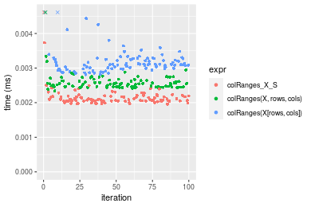

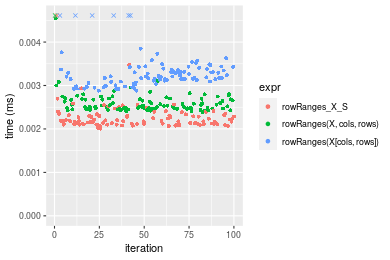
_Table: Benchmarking of colRanges_X_S() and rowRanges_X_S() on integer+10x10 data (original and transposed).  The top panel shows times in milliseconds and the bottom panel shows relative times._


|   |expr          |   min|     lq|    mean| median|     uq|    max|
|:--|:-------------|-----:|------:|-------:|------:|------:|------:|
|1  |colRanges_X_S | 1.961| 2.0475| 3.00515| 2.0880| 2.1865| 88.867|
|2  |rowRanges_X_S | 2.009| 2.1170| 2.27920| 2.1795| 2.3175|  5.540|


|   |expr          |      min|       lq|      mean|   median|       uq|       max|
|:--|:-------------|--------:|--------:|---------:|--------:|--------:|---------:|
|1  |colRanges_X_S | 1.000000| 1.000000| 1.0000000| 1.000000| 1.000000| 1.0000000|
|2  |rowRanges_X_S | 1.024477| 1.033944| 0.7584314| 1.043822| 1.059913| 0.0623404|

_Figure: Benchmarking of colRanges_X_S() and rowRanges_X_S() on integer+10x10 data (original and transposed).  Outliers are displayed as crosses. Times are in milliseconds._


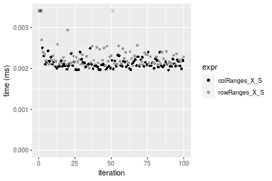

#### 100x100 integer matrix

```r
> X <- data[["100x100"]]
> rows <- sample.int(nrow(X), size = nrow(X) * 0.7)
> cols <- sample.int(ncol(X), size = ncol(X) * 0.7)
> X_S <- X[rows, cols]
> gc()
           used  (Mb) gc trigger  (Mb) max used  (Mb)
Ncells  5273952 281.7    8529671 455.6  8529671 455.6
Vcells 10018404  76.5   31876688 243.2 60562128 462.1
> colStats <- microbenchmark(colRanges_X_S = colRanges(X_S, na.rm = FALSE), `colRanges(X, rows, cols)` = colRanges(X, 
+     rows = rows, cols = cols, na.rm = FALSE), `colRanges(X[rows, cols])` = colRanges(X[rows, cols], 
+     na.rm = FALSE), unit = "ms")
> X <- t(X)
> X_S <- t(X_S)
> gc()
           used  (Mb) gc trigger  (Mb) max used  (Mb)
Ncells  5273928 281.7    8529671 455.6  8529671 455.6
Vcells 10023457  76.5   31876688 243.2 60562128 462.1
> rowStats <- microbenchmark(rowRanges_X_S = rowRanges(X_S, na.rm = FALSE), `rowRanges(X, cols, rows)` = rowRanges(X, 
+     rows = cols, cols = rows, na.rm = FALSE), `rowRanges(X[cols, rows])` = rowRanges(X[cols, rows], 
+     na.rm = FALSE), unit = "ms")
```

_Table: Benchmarking of colRanges_X_S(), colRanges(X, rows, cols)() and colRanges(X[rows, cols])() on integer+100x100 data. The top panel shows times in milliseconds and the bottom panel shows relative times._


|   |expr                     |      min|        lq|      mean|    median|       uq|      max|
|:--|:------------------------|--------:|---------:|---------:|---------:|--------:|--------:|
|1  |colRanges_X_S            | 0.019220| 0.0202785| 0.0209938| 0.0209020| 0.021548| 0.028393|
|2  |colRanges(X, rows, cols) | 0.022091| 0.0230705| 0.0240528| 0.0237480| 0.024272| 0.036341|
|3  |colRanges(X[rows, cols]) | 0.029285| 0.0308255| 0.0328113| 0.0317855| 0.033014| 0.076312|


|   |expr                     |      min|       lq|     mean|   median|       uq|      max|
|:--|:------------------------|--------:|--------:|--------:|--------:|--------:|--------:|
|1  |colRanges_X_S            | 1.000000| 1.000000| 1.000000| 1.000000| 1.000000| 1.000000|
|2  |colRanges(X, rows, cols) | 1.149376| 1.137683| 1.145712| 1.136159| 1.126415| 1.279928|
|3  |colRanges(X[rows, cols]) | 1.523673| 1.520107| 1.562908| 1.520692| 1.532114| 2.687705|

_Table: Benchmarking of rowRanges_X_S(), rowRanges(X, cols, rows)() and rowRanges(X[cols, rows])() on integer+100x100 data (transposed). The top panel shows times in milliseconds and the bottom panel shows relative times._


|   |expr                     |      min|        lq|      mean|    median|        uq|      max|
|:--|:------------------------|--------:|---------:|---------:|---------:|---------:|--------:|
|2  |rowRanges(X, cols, rows) | 0.019247| 0.0199475| 0.0212810| 0.0208235| 0.0217910| 0.047923|
|1  |rowRanges_X_S            | 0.019995| 0.0208815| 0.0218721| 0.0219785| 0.0226165| 0.028548|
|3  |rowRanges(X[cols, rows]) | 0.030854| 0.0314480| 0.0333112| 0.0327595| 0.0342245| 0.053218|


|   |expr                     |      min|       lq|     mean|   median|       uq|       max|
|:--|:------------------------|--------:|--------:|--------:|--------:|--------:|---------:|
|2  |rowRanges(X, cols, rows) | 1.000000| 1.000000| 1.000000| 1.000000| 1.000000| 1.0000000|
|1  |rowRanges_X_S            | 1.038863| 1.046823| 1.027775| 1.055466| 1.037883| 0.5957056|
|3  |rowRanges(X[cols, rows]) | 1.603055| 1.576538| 1.565302| 1.573198| 1.570580| 1.1104897|

_Figure: Benchmarking of colRanges_X_S(), colRanges(X, rows, cols)() and colRanges(X[rows, cols])() on integer+100x100 data  as well as rowRanges_X_S(), rowRanges(X, cols, rows)() and rowRanges(X[cols, rows])() on the same data transposed.  Outliers are displayed as crosses.  Times are in milliseconds._


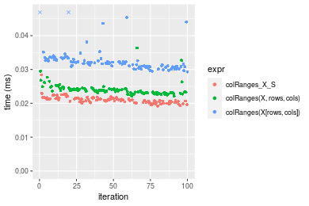

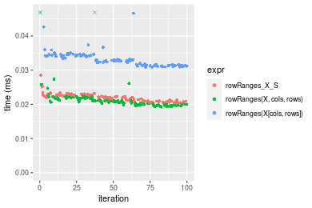
_Table: Benchmarking of colRanges_X_S() and rowRanges_X_S() on integer+100x100 data (original and transposed).  The top panel shows times in milliseconds and the bottom panel shows relative times._


|   |expr          |    min|      lq|     mean|  median|      uq|    max|
|:--|:-------------|------:|-------:|--------:|-------:|-------:|------:|
|1  |colRanges_X_S | 19.220| 20.2785| 20.99377| 20.9020| 21.5480| 28.393|
|2  |rowRanges_X_S | 19.995| 20.8815| 21.87208| 21.9785| 22.6165| 28.548|


|   |expr          |      min|       lq|     mean|   median|       uq|      max|
|:--|:-------------|--------:|--------:|--------:|--------:|--------:|--------:|
|1  |colRanges_X_S | 1.000000| 1.000000| 1.000000| 1.000000| 1.000000| 1.000000|
|2  |rowRanges_X_S | 1.040323| 1.029736| 1.041837| 1.051502| 1.049587| 1.005459|

_Figure: Benchmarking of colRanges_X_S() and rowRanges_X_S() on integer+100x100 data (original and transposed).  Outliers are displayed as crosses. Times are in milliseconds._


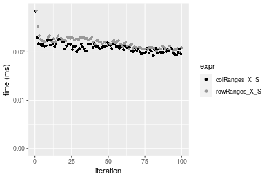

#### 1000x10 integer matrix

```r
> X <- data[["1000x10"]]
> rows <- sample.int(nrow(X), size = nrow(X) * 0.7)
> cols <- sample.int(ncol(X), size = ncol(X) * 0.7)
> X_S <- X[rows, cols]
> gc()
           used  (Mb) gc trigger  (Mb) max used  (Mb)
Ncells  5274695 281.7    8529671 455.6  8529671 455.6
Vcells 10022443  76.5   31876688 243.2 60562128 462.1
> colStats <- microbenchmark(colRanges_X_S = colRanges(X_S, na.rm = FALSE), `colRanges(X, rows, cols)` = colRanges(X, 
+     rows = rows, cols = cols, na.rm = FALSE), `colRanges(X[rows, cols])` = colRanges(X[rows, cols], 
+     na.rm = FALSE), unit = "ms")
> X <- t(X)
> X_S <- t(X_S)
> gc()
           used  (Mb) gc trigger  (Mb) max used  (Mb)
Ncells  5274671 281.7    8529671 455.6  8529671 455.6
Vcells 10027496  76.6   31876688 243.2 60562128 462.1
> rowStats <- microbenchmark(rowRanges_X_S = rowRanges(X_S, na.rm = FALSE), `rowRanges(X, cols, rows)` = rowRanges(X, 
+     rows = cols, cols = rows, na.rm = FALSE), `rowRanges(X[cols, rows])` = rowRanges(X[cols, rows], 
+     na.rm = FALSE), unit = "ms")
```

_Table: Benchmarking of colRanges_X_S(), colRanges(X, rows, cols)() and colRanges(X[rows, cols])() on integer+1000x10 data. The top panel shows times in milliseconds and the bottom panel shows relative times._


|   |expr                     |      min|        lq|      mean|    median|        uq|      max|
|:--|:------------------------|--------:|---------:|---------:|---------:|---------:|--------:|
|1  |colRanges_X_S            | 0.014498| 0.0148325| 0.0151943| 0.0152545| 0.0153600| 0.017962|
|2  |colRanges(X, rows, cols) | 0.019393| 0.0199415| 0.0206006| 0.0204100| 0.0207565| 0.034746|
|3  |colRanges(X[rows, cols]) | 0.025697| 0.0261810| 0.0272128| 0.0268035| 0.0273605| 0.055022|


|   |expr                     |      min|       lq|     mean|   median|       uq|      max|
|:--|:------------------------|--------:|--------:|--------:|--------:|--------:|--------:|
|1  |colRanges_X_S            | 1.000000| 1.000000| 1.000000| 1.000000| 1.000000| 1.000000|
|2  |colRanges(X, rows, cols) | 1.337633| 1.344446| 1.355816| 1.337966| 1.351335| 1.934417|
|3  |colRanges(X[rows, cols]) | 1.772451| 1.765110| 1.790989| 1.757088| 1.781283| 3.063245|

_Table: Benchmarking of rowRanges_X_S(), rowRanges(X, cols, rows)() and rowRanges(X[cols, rows])() on integer+1000x10 data (transposed). The top panel shows times in milliseconds and the bottom panel shows relative times._


|   |expr                     |      min|        lq|      mean|    median|        uq|      max|
|:--|:------------------------|--------:|---------:|---------:|---------:|---------:|--------:|
|1  |rowRanges_X_S            | 0.019007| 0.0198945| 0.0206969| 0.0206480| 0.0209895| 0.035138|
|2  |rowRanges(X, cols, rows) | 0.019214| 0.0201775| 0.0209782| 0.0209150| 0.0213425| 0.026627|
|3  |rowRanges(X[cols, rows]) | 0.031743| 0.0332035| 0.0346958| 0.0346355| 0.0350590| 0.069478|


|   |expr                     |      min|       lq|     mean|   median|       uq|       max|
|:--|:------------------------|--------:|--------:|--------:|--------:|--------:|---------:|
|1  |rowRanges_X_S            | 1.000000| 1.000000| 1.000000| 1.000000| 1.000000| 1.0000000|
|2  |rowRanges(X, cols, rows) | 1.010891| 1.014225| 1.013588| 1.012931| 1.016818| 0.7577836|
|3  |rowRanges(X[cols, rows]) | 1.670069| 1.668979| 1.676372| 1.677426| 1.670311| 1.9772895|

_Figure: Benchmarking of colRanges_X_S(), colRanges(X, rows, cols)() and colRanges(X[rows, cols])() on integer+1000x10 data  as well as rowRanges_X_S(), rowRanges(X, cols, rows)() and rowRanges(X[cols, rows])() on the same data transposed.  Outliers are displayed as crosses.  Times are in milliseconds._


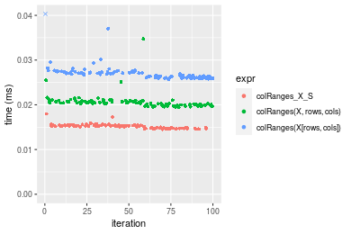

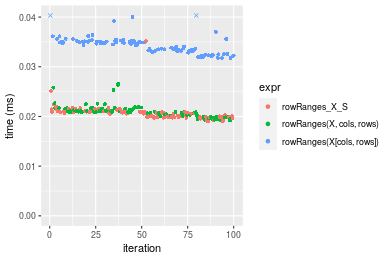
_Table: Benchmarking of colRanges_X_S() and rowRanges_X_S() on integer+1000x10 data (original and transposed).  The top panel shows times in milliseconds and the bottom panel shows relative times._


|   |expr          |    min|      lq|     mean|  median|      uq|    max|
|:--|:-------------|------:|-------:|--------:|-------:|-------:|------:|
|1  |colRanges_X_S | 14.498| 14.8325| 15.19428| 15.2545| 15.3600| 17.962|
|2  |rowRanges_X_S | 19.007| 19.8945| 20.69693| 20.6480| 20.9895| 35.138|


|   |expr          |      min|       lq|     mean|   median|       uq|      max|
|:--|:-------------|--------:|--------:|--------:|--------:|--------:|--------:|
|1  |colRanges_X_S | 1.000000| 1.000000| 1.000000| 1.000000| 1.000000| 1.000000|
|2  |rowRanges_X_S | 1.311008| 1.341278| 1.362153| 1.353568| 1.366504| 1.956241|

_Figure: Benchmarking of colRanges_X_S() and rowRanges_X_S() on integer+1000x10 data (original and transposed).  Outliers are displayed as crosses. Times are in milliseconds._


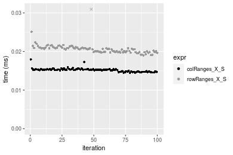

#### 10x1000 integer matrix

```r
> X <- data[["10x1000"]]
> rows <- sample.int(nrow(X), size = nrow(X) * 0.7)
> cols <- sample.int(ncol(X), size = ncol(X) * 0.7)
> X_S <- X[rows, cols]
> gc()
           used  (Mb) gc trigger  (Mb) max used  (Mb)
Ncells  5274900 281.8    8529671 455.6  8529671 455.6
Vcells 10023320  76.5   31876688 243.2 60562128 462.1
> colStats <- microbenchmark(colRanges_X_S = colRanges(X_S, na.rm = FALSE), `colRanges(X, rows, cols)` = colRanges(X, 
+     rows = rows, cols = cols, na.rm = FALSE), `colRanges(X[rows, cols])` = colRanges(X[rows, cols], 
+     na.rm = FALSE), unit = "ms")
> X <- t(X)
> X_S <- t(X_S)
> gc()
           used  (Mb) gc trigger  (Mb) max used  (Mb)
Ncells  5274876 281.8    8529671 455.6  8529671 455.6
Vcells 10028373  76.6   31876688 243.2 60562128 462.1
> rowStats <- microbenchmark(rowRanges_X_S = rowRanges(X_S, na.rm = FALSE), `rowRanges(X, cols, rows)` = rowRanges(X, 
+     rows = cols, cols = rows, na.rm = FALSE), `rowRanges(X[cols, rows])` = rowRanges(X[cols, rows], 
+     na.rm = FALSE), unit = "ms")
```

_Table: Benchmarking of colRanges_X_S(), colRanges(X, rows, cols)() and colRanges(X[rows, cols])() on integer+10x1000 data. The top panel shows times in milliseconds and the bottom panel shows relative times._


|   |expr                     |      min|        lq|      mean|    median|        uq|      max|
|:--|:------------------------|--------:|---------:|---------:|---------:|---------:|--------:|
|1  |colRanges_X_S            | 0.036023| 0.0397245| 0.0420837| 0.0417455| 0.0434585| 0.067160|
|2  |colRanges(X, rows, cols) | 0.042470| 0.0468715| 0.0502354| 0.0495945| 0.0531000| 0.073264|
|3  |colRanges(X[rows, cols]) | 0.048893| 0.0530160| 0.0553122| 0.0554755| 0.0571870| 0.070152|


|   |expr                     |      min|       lq|     mean|   median|       uq|      max|
|:--|:------------------------|--------:|--------:|--------:|--------:|--------:|--------:|
|1  |colRanges_X_S            | 1.000000| 1.000000| 1.000000| 1.000000| 1.000000| 1.000000|
|2  |colRanges(X, rows, cols) | 1.178969| 1.179914| 1.193703| 1.188020| 1.221855| 1.090887|
|3  |colRanges(X[rows, cols]) | 1.357272| 1.334592| 1.314339| 1.328898| 1.315899| 1.044550|

_Table: Benchmarking of rowRanges_X_S(), rowRanges(X, cols, rows)() and rowRanges(X[cols, rows])() on integer+10x1000 data (transposed). The top panel shows times in milliseconds and the bottom panel shows relative times._


|   |expr                     |      min|        lq|      mean|    median|        uq|      max|
|:--|:------------------------|--------:|---------:|---------:|---------:|---------:|--------:|
|1  |rowRanges_X_S            | 0.033585| 0.0362560| 0.0377057| 0.0372760| 0.0386595| 0.053485|
|2  |rowRanges(X, cols, rows) | 0.032384| 0.0378620| 0.0401970| 0.0399965| 0.0419260| 0.068506|
|3  |rowRanges(X[cols, rows]) | 0.044299| 0.0469715| 0.0491028| 0.0489445| 0.0509770| 0.061887|


|   |expr                     |      min|       lq|     mean|   median|       uq|      max|
|:--|:------------------------|--------:|--------:|--------:|--------:|--------:|--------:|
|1  |rowRanges_X_S            | 1.000000| 1.000000| 1.000000| 1.000000| 1.000000| 1.000000|
|2  |rowRanges(X, cols, rows) | 0.964240| 1.044296| 1.066075| 1.072983| 1.084494| 1.280845|
|3  |rowRanges(X[cols, rows]) | 1.319012| 1.295551| 1.302267| 1.313030| 1.318615| 1.157091|

_Figure: Benchmarking of colRanges_X_S(), colRanges(X, rows, cols)() and colRanges(X[rows, cols])() on integer+10x1000 data  as well as rowRanges_X_S(), rowRanges(X, cols, rows)() and rowRanges(X[cols, rows])() on the same data transposed.  Outliers are displayed as crosses.  Times are in milliseconds._


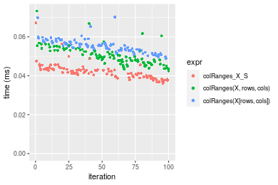

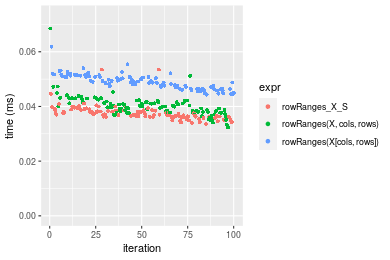
_Table: Benchmarking of colRanges_X_S() and rowRanges_X_S() on integer+10x1000 data (original and transposed).  The top panel shows times in milliseconds and the bottom panel shows relative times._


|   |expr          |    min|      lq|     mean|  median|      uq|    max|
|:--|:-------------|------:|-------:|--------:|-------:|-------:|------:|
|2  |rowRanges_X_S | 33.585| 36.2560| 37.70566| 37.2760| 38.6595| 53.485|
|1  |colRanges_X_S | 36.023| 39.7245| 42.08370| 41.7455| 43.4585| 67.160|


|   |expr          |      min|       lq|     mean|   median|       uq|      max|
|:--|:-------------|--------:|--------:|--------:|--------:|--------:|--------:|
|2  |rowRanges_X_S | 1.000000| 1.000000| 1.000000| 1.000000| 1.000000| 1.000000|
|1  |colRanges_X_S | 1.072592| 1.095667| 1.116111| 1.119903| 1.124135| 1.255679|

_Figure: Benchmarking of colRanges_X_S() and rowRanges_X_S() on integer+10x1000 data (original and transposed).  Outliers are displayed as crosses. Times are in milliseconds._


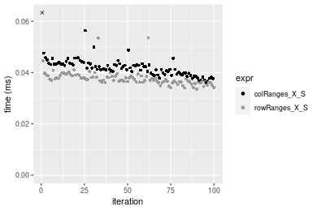

#### 100x1000 integer matrix

```r
> X <- data[["100x1000"]]
> rows <- sample.int(nrow(X), size = nrow(X) * 0.7)
> cols <- sample.int(ncol(X), size = ncol(X) * 0.7)
> X_S <- X[rows, cols]
> gc()
           used  (Mb) gc trigger  (Mb) max used  (Mb)
Ncells  5275110 281.8    8529671 455.6  8529671 455.6
Vcells 10045996  76.7   31876688 243.2 60562128 462.1
> colStats <- microbenchmark(colRanges_X_S = colRanges(X_S, na.rm = FALSE), `colRanges(X, rows, cols)` = colRanges(X, 
+     rows = rows, cols = cols, na.rm = FALSE), `colRanges(X[rows, cols])` = colRanges(X[rows, cols], 
+     na.rm = FALSE), unit = "ms")
> X <- t(X)
> X_S <- t(X_S)
> gc()
           used  (Mb) gc trigger  (Mb) max used  (Mb)
Ncells  5275086 281.8    8529671 455.6  8529671 455.6
Vcells 10096049  77.1   31876688 243.2 60562128 462.1
> rowStats <- microbenchmark(rowRanges_X_S = rowRanges(X_S, na.rm = FALSE), `rowRanges(X, cols, rows)` = rowRanges(X, 
+     rows = cols, cols = rows, na.rm = FALSE), `rowRanges(X[cols, rows])` = rowRanges(X[cols, rows], 
+     na.rm = FALSE), unit = "ms")
```

_Table: Benchmarking of colRanges_X_S(), colRanges(X, rows, cols)() and colRanges(X[rows, cols])() on integer+100x1000 data. The top panel shows times in milliseconds and the bottom panel shows relative times._


|   |expr                     |      min|        lq|      mean|    median|        uq|      max|
|:--|:------------------------|--------:|---------:|---------:|---------:|---------:|--------:|
|1  |colRanges_X_S            | 0.130499| 0.1368120| 0.1611784| 0.1553205| 0.1767130| 0.252218|
|2  |colRanges(X, rows, cols) | 0.147868| 0.1536695| 0.1785957| 0.1747015| 0.1988680| 0.299349|
|3  |colRanges(X[rows, cols]) | 0.201111| 0.2122050| 0.2486858| 0.2401130| 0.2693935| 0.368923|


|   |expr                     |      min|       lq|     mean|   median|       uq|      max|
|:--|:------------------------|--------:|--------:|--------:|--------:|--------:|--------:|
|1  |colRanges_X_S            | 1.000000| 1.000000| 1.000000| 1.000000| 1.000000| 1.000000|
|2  |colRanges(X, rows, cols) | 1.133097| 1.123217| 1.108062| 1.124781| 1.125373| 1.186866|
|3  |colRanges(X[rows, cols]) | 1.541092| 1.551070| 1.542923| 1.545920| 1.524469| 1.462715|

_Table: Benchmarking of rowRanges_X_S(), rowRanges(X, cols, rows)() and rowRanges(X[cols, rows])() on integer+100x1000 data (transposed). The top panel shows times in milliseconds and the bottom panel shows relative times._


|   |expr                     |      min|        lq|      mean|    median|        uq|      max|
|:--|:------------------------|--------:|---------:|---------:|---------:|---------:|--------:|
|2  |rowRanges(X, cols, rows) | 0.121502| 0.1296910| 0.1472742| 0.1401625| 0.1594755| 0.250781|
|1  |rowRanges_X_S            | 0.126744| 0.1407030| 0.1592755| 0.1589260| 0.1697035| 0.227490|
|3  |rowRanges(X[cols, rows]) | 0.189912| 0.2061865| 0.2352388| 0.2257905| 0.2542060| 0.319791|


|   |expr                     |      min|       lq|     mean|  median|       uq|       max|
|:--|:------------------------|--------:|--------:|--------:|-------:|--------:|---------:|
|2  |rowRanges(X, cols, rows) | 1.000000| 1.000000| 1.000000| 1.00000| 1.000000| 1.0000000|
|1  |rowRanges_X_S            | 1.043143| 1.084909| 1.081489| 1.13387| 1.064135| 0.9071261|
|3  |rowRanges(X[cols, rows]) | 1.563036| 1.589829| 1.597284| 1.61092| 1.594013| 1.2751803|

_Figure: Benchmarking of colRanges_X_S(), colRanges(X, rows, cols)() and colRanges(X[rows, cols])() on integer+100x1000 data  as well as rowRanges_X_S(), rowRanges(X, cols, rows)() and rowRanges(X[cols, rows])() on the same data transposed.  Outliers are displayed as crosses.  Times are in milliseconds._


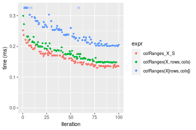

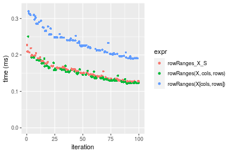
_Table: Benchmarking of colRanges_X_S() and rowRanges_X_S() on integer+100x1000 data (original and transposed).  The top panel shows times in milliseconds and the bottom panel shows relative times._


|   |expr          |     min|      lq|     mean|   median|       uq|     max|
|:--|:-------------|-------:|-------:|--------:|--------:|--------:|-------:|
|1  |colRanges_X_S | 130.499| 136.812| 161.1784| 155.3205| 176.7130| 252.218|
|2  |rowRanges_X_S | 126.744| 140.703| 159.2755| 158.9260| 169.7035| 227.490|


|   |expr          |       min|       lq|     mean|   median|       uq|       max|
|:--|:-------------|---------:|--------:|--------:|--------:|--------:|---------:|
|1  |colRanges_X_S | 1.0000000| 1.000000| 1.000000| 1.000000| 1.000000| 1.0000000|
|2  |rowRanges_X_S | 0.9712258| 1.028441| 0.988194| 1.023213| 0.960334| 0.9019578|

_Figure: Benchmarking of colRanges_X_S() and rowRanges_X_S() on integer+100x1000 data (original and transposed).  Outliers are displayed as crosses. Times are in milliseconds._


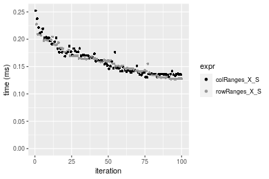

#### 1000x100 integer matrix

```r
> X <- data[["1000x100"]]
> rows <- sample.int(nrow(X), size = nrow(X) * 0.7)
> cols <- sample.int(ncol(X), size = ncol(X) * 0.7)
> X_S <- X[rows, cols]
> gc()
           used  (Mb) gc trigger  (Mb) max used  (Mb)
Ncells  5275323 281.8    8529671 455.6  8529671 455.6
Vcells 10046784  76.7   31876688 243.2 60562128 462.1
> colStats <- microbenchmark(colRanges_X_S = colRanges(X_S, na.rm = FALSE), `colRanges(X, rows, cols)` = colRanges(X, 
+     rows = rows, cols = cols, na.rm = FALSE), `colRanges(X[rows, cols])` = colRanges(X[rows, cols], 
+     na.rm = FALSE), unit = "ms")
> X <- t(X)
> X_S <- t(X_S)
> gc()
           used  (Mb) gc trigger  (Mb) max used  (Mb)
Ncells  5275299 281.8    8529671 455.6  8529671 455.6
Vcells 10096837  77.1   31876688 243.2 60562128 462.1
> rowStats <- microbenchmark(rowRanges_X_S = rowRanges(X_S, na.rm = FALSE), `rowRanges(X, cols, rows)` = rowRanges(X, 
+     rows = cols, cols = rows, na.rm = FALSE), `rowRanges(X[cols, rows])` = rowRanges(X[cols, rows], 
+     na.rm = FALSE), unit = "ms")
```

_Table: Benchmarking of colRanges_X_S(), colRanges(X, rows, cols)() and colRanges(X[rows, cols])() on integer+1000x100 data. The top panel shows times in milliseconds and the bottom panel shows relative times._


|   |expr                     |      min|       lq|      mean|    median|        uq|      max|
|:--|:------------------------|--------:|--------:|---------:|---------:|---------:|--------:|
|1  |colRanges_X_S            | 0.091087| 0.105285| 0.1180325| 0.1127475| 0.1205720| 0.287098|
|2  |colRanges(X, rows, cols) | 0.105857| 0.122238| 0.1351061| 0.1304855| 0.1461225| 0.209747|
|3  |colRanges(X[rows, cols]) | 0.160686| 0.184816| 0.2075819| 0.2014940| 0.2322715| 0.322001|


|   |expr                     |      min|       lq|     mean|   median|       uq|       max|
|:--|:------------------------|--------:|--------:|--------:|--------:|--------:|---------:|
|1  |colRanges_X_S            | 1.000000| 1.000000| 1.000000| 1.000000| 1.000000| 1.0000000|
|2  |colRanges(X, rows, cols) | 1.162153| 1.161020| 1.144651| 1.157325| 1.211911| 0.7305763|
|3  |colRanges(X[rows, cols]) | 1.764094| 1.755388| 1.758684| 1.787126| 1.926413| 1.1215717|

_Table: Benchmarking of rowRanges_X_S(), rowRanges(X, cols, rows)() and rowRanges(X[cols, rows])() on integer+1000x100 data (transposed). The top panel shows times in milliseconds and the bottom panel shows relative times._


|   |expr                     |      min|       lq|      mean|    median|        uq|      max|
|:--|:------------------------|--------:|--------:|---------:|---------:|---------:|--------:|
|2  |rowRanges(X, cols, rows) | 0.098893| 0.111990| 0.1254097| 0.1228230| 0.1313675| 0.236047|
|1  |rowRanges_X_S            | 0.105175| 0.114969| 0.1302448| 0.1297190| 0.1390275| 0.175607|
|3  |rowRanges(X[cols, rows]) | 0.173518| 0.189835| 0.2160340| 0.2137265| 0.2341840| 0.294645|


|   |expr                     |      min|       lq|     mean|   median|       uq|       max|
|:--|:------------------------|--------:|--------:|--------:|--------:|--------:|---------:|
|2  |rowRanges(X, cols, rows) | 1.000000| 1.000000| 1.000000| 1.000000| 1.000000| 1.0000000|
|1  |rowRanges_X_S            | 1.063523| 1.026601| 1.038555| 1.056146| 1.058310| 0.7439493|
|3  |rowRanges(X[cols, rows]) | 1.754603| 1.695107| 1.722626| 1.740118| 1.782663| 1.2482472|

_Figure: Benchmarking of colRanges_X_S(), colRanges(X, rows, cols)() and colRanges(X[rows, cols])() on integer+1000x100 data  as well as rowRanges_X_S(), rowRanges(X, cols, rows)() and rowRanges(X[cols, rows])() on the same data transposed.  Outliers are displayed as crosses.  Times are in milliseconds._


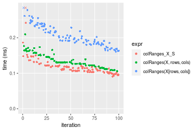

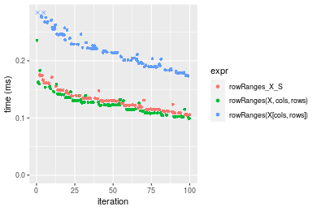
_Table: Benchmarking of colRanges_X_S() and rowRanges_X_S() on integer+1000x100 data (original and transposed).  The top panel shows times in milliseconds and the bottom panel shows relative times._


|   |expr          |     min|      lq|     mean|   median|       uq|     max|
|:--|:-------------|-------:|-------:|--------:|--------:|--------:|-------:|
|1  |colRanges_X_S |  91.087| 105.285| 118.0325| 112.7475| 120.5720| 287.098|
|2  |rowRanges_X_S | 105.175| 114.969| 130.2448| 129.7190| 139.0275| 175.607|


|   |expr          |      min|       lq|     mean|   median|       uq|       max|
|:--|:-------------|--------:|--------:|--------:|--------:|--------:|---------:|
|1  |colRanges_X_S | 1.000000| 1.000000| 1.000000| 1.000000| 1.000000| 1.0000000|
|2  |rowRanges_X_S | 1.154665| 1.091979| 1.103465| 1.150527| 1.153066| 0.6116622|

_Figure: Benchmarking of colRanges_X_S() and rowRanges_X_S() on integer+1000x100 data (original and transposed).  Outliers are displayed as crosses. Times are in milliseconds._


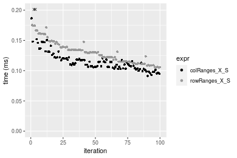


## Data type "double"

### Data
```r
> rmatrix <- function(nrow, ncol, mode = c("logical", "double", "integer", "index"), range = c(-100, 
+     +100), na_prob = 0) {
+     mode <- match.arg(mode)
+     n <- nrow * ncol
+     if (mode == "logical") {
+         x <- sample(c(FALSE, TRUE), size = n, replace = TRUE)
+     }     else if (mode == "index") {
+         x <- seq_len(n)
+         mode <- "integer"
+     }     else {
+         x <- runif(n, min = range[1], max = range[2])
+     }
+     storage.mode(x) <- mode
+     if (na_prob > 0) 
+         x[sample(n, size = na_prob * n)] <- NA
+     dim(x) <- c(nrow, ncol)
+     x
+ }
> rmatrices <- function(scale = 10, seed = 1, ...) {
+     set.seed(seed)
+     data <- list()
+     data[[1]] <- rmatrix(nrow = scale * 1, ncol = scale * 1, ...)
+     data[[2]] <- rmatrix(nrow = scale * 10, ncol = scale * 10, ...)
+     data[[3]] <- rmatrix(nrow = scale * 100, ncol = scale * 1, ...)
+     data[[4]] <- t(data[[3]])
+     data[[5]] <- rmatrix(nrow = scale * 10, ncol = scale * 100, ...)
+     data[[6]] <- t(data[[5]])
+     names(data) <- sapply(data, FUN = function(x) paste(dim(x), collapse = "x"))
+     data
+ }
> data <- rmatrices(mode = mode)
```

### Results

#### 10x10 double matrix

```r
> X <- data[["10x10"]]
> rows <- sample.int(nrow(X), size = nrow(X) * 0.7)
> cols <- sample.int(ncol(X), size = ncol(X) * 0.7)
> X_S <- X[rows, cols]
> gc()
           used  (Mb) gc trigger  (Mb) max used  (Mb)
Ncells  5275540 281.8    8529671 455.6  8529671 455.6
Vcells 10137899  77.4   31876688 243.2 60562128 462.1
> colStats <- microbenchmark(colRanges_X_S = colRanges(X_S, na.rm = FALSE), `colRanges(X, rows, cols)` = colRanges(X, 
+     rows = rows, cols = cols, na.rm = FALSE), `colRanges(X[rows, cols])` = colRanges(X[rows, cols], 
+     na.rm = FALSE), unit = "ms")
> X <- t(X)
> X_S <- t(X_S)
> gc()
           used  (Mb) gc trigger  (Mb) max used  (Mb)
Ncells  5275507 281.8    8529671 455.6  8529671 455.6
Vcells 10138037  77.4   31876688 243.2 60562128 462.1
> rowStats <- microbenchmark(rowRanges_X_S = rowRanges(X_S, na.rm = FALSE), `rowRanges(X, cols, rows)` = rowRanges(X, 
+     rows = cols, cols = rows, na.rm = FALSE), `rowRanges(X[cols, rows])` = rowRanges(X[cols, rows], 
+     na.rm = FALSE), unit = "ms")
```

_Table: Benchmarking of colRanges_X_S(), colRanges(X, rows, cols)() and colRanges(X[rows, cols])() on double+10x10 data. The top panel shows times in milliseconds and the bottom panel shows relative times._


|   |expr                     |      min|       lq|      mean|    median|        uq|      max|
|:--|:------------------------|--------:|--------:|---------:|---------:|---------:|--------:|
|1  |colRanges_X_S            | 0.001966| 0.002051| 0.0023074| 0.0020970| 0.0021895| 0.018612|
|2  |colRanges(X, rows, cols) | 0.002367| 0.002446| 0.0025814| 0.0025165| 0.0026375| 0.005537|
|3  |colRanges(X[rows, cols]) | 0.002874| 0.003100| 0.0033132| 0.0031760| 0.0032800| 0.007898|


|   |expr                     |      min|       lq|     mean|   median|       uq|       max|
|:--|:------------------------|--------:|--------:|--------:|--------:|--------:|---------:|
|1  |colRanges_X_S            | 1.000000| 1.000000| 1.000000| 1.000000| 1.000000| 1.0000000|
|2  |colRanges(X, rows, cols) | 1.203967| 1.192589| 1.118785| 1.200048| 1.204613| 0.2974962|
|3  |colRanges(X[rows, cols]) | 1.461852| 1.511458| 1.435938| 1.514545| 1.498059| 0.4243499|

_Table: Benchmarking of rowRanges_X_S(), rowRanges(X, cols, rows)() and rowRanges(X[cols, rows])() on double+10x10 data (transposed). The top panel shows times in milliseconds and the bottom panel shows relative times._


|   |expr                     |      min|        lq|      mean|    median|        uq|      max|
|:--|:------------------------|--------:|---------:|---------:|---------:|---------:|--------:|
|1  |rowRanges_X_S            | 0.002013| 0.0021200| 0.0022276| 0.0021775| 0.0022460| 0.004895|
|2  |rowRanges(X, cols, rows) | 0.002385| 0.0024675| 0.0027750| 0.0025410| 0.0026565| 0.020980|
|3  |rowRanges(X[cols, rows]) | 0.002935| 0.0031355| 0.0033161| 0.0032275| 0.0033730| 0.006645|


|   |expr                     |      min|       lq|     mean|   median|       uq|      max|
|:--|:------------------------|--------:|--------:|--------:|--------:|--------:|--------:|
|1  |rowRanges_X_S            | 1.000000| 1.000000| 1.000000| 1.000000| 1.000000| 1.000000|
|2  |rowRanges(X, cols, rows) | 1.184799| 1.163915| 1.245741| 1.166935| 1.182769| 4.286006|
|3  |rowRanges(X[cols, rows]) | 1.458023| 1.479009| 1.488622| 1.482204| 1.501781| 1.357508|

_Figure: Benchmarking of colRanges_X_S(), colRanges(X, rows, cols)() and colRanges(X[rows, cols])() on double+10x10 data  as well as rowRanges_X_S(), rowRanges(X, cols, rows)() and rowRanges(X[cols, rows])() on the same data transposed.  Outliers are displayed as crosses.  Times are in milliseconds._


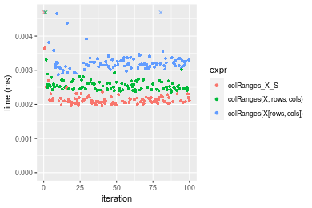

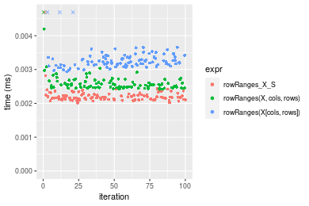
_Table: Benchmarking of colRanges_X_S() and rowRanges_X_S() on double+10x10 data (original and transposed).  The top panel shows times in milliseconds and the bottom panel shows relative times._


|   |expr          |   min|    lq|    mean| median|     uq|    max|
|:--|:-------------|-----:|-----:|-------:|------:|------:|------:|
|1  |colRanges_X_S | 1.966| 2.051| 2.30737| 2.0970| 2.1895| 18.612|
|2  |rowRanges_X_S | 2.013| 2.120| 2.22763| 2.1775| 2.2460|  4.895|


|   |expr          |      min|       lq|      mean|   median|       uq|       max|
|:--|:-------------|--------:|--------:|---------:|--------:|--------:|---------:|
|1  |colRanges_X_S | 1.000000| 1.000000| 1.0000000| 1.000000| 1.000000| 1.0000000|
|2  |rowRanges_X_S | 1.023906| 1.033642| 0.9654412| 1.038388| 1.025805| 0.2630024|

_Figure: Benchmarking of colRanges_X_S() and rowRanges_X_S() on double+10x10 data (original and transposed).  Outliers are displayed as crosses. Times are in milliseconds._


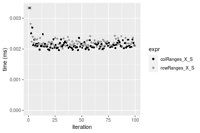

#### 100x100 double matrix

```r
> X <- data[["100x100"]]
> rows <- sample.int(nrow(X), size = nrow(X) * 0.7)
> cols <- sample.int(ncol(X), size = ncol(X) * 0.7)
> X_S <- X[rows, cols]
> gc()
           used  (Mb) gc trigger  (Mb) max used  (Mb)
Ncells  5275737 281.8    8529671 455.6  8529671 455.6
Vcells 10143856  77.4   31876688 243.2 60562128 462.1
> colStats <- microbenchmark(colRanges_X_S = colRanges(X_S, na.rm = FALSE), `colRanges(X, rows, cols)` = colRanges(X, 
+     rows = rows, cols = cols, na.rm = FALSE), `colRanges(X[rows, cols])` = colRanges(X[rows, cols], 
+     na.rm = FALSE), unit = "ms")
> X <- t(X)
> X_S <- t(X_S)
> gc()
           used  (Mb) gc trigger  (Mb) max used  (Mb)
Ncells  5275713 281.8    8529671 455.6  8529671 455.6
Vcells 10153909  77.5   31876688 243.2 60562128 462.1
> rowStats <- microbenchmark(rowRanges_X_S = rowRanges(X_S, na.rm = FALSE), `rowRanges(X, cols, rows)` = rowRanges(X, 
+     rows = cols, cols = rows, na.rm = FALSE), `rowRanges(X[cols, rows])` = rowRanges(X[cols, rows], 
+     na.rm = FALSE), unit = "ms")
```

_Table: Benchmarking of colRanges_X_S(), colRanges(X, rows, cols)() and colRanges(X[rows, cols])() on double+100x100 data. The top panel shows times in milliseconds and the bottom panel shows relative times._


|   |expr                     |      min|       lq|      mean|    median|       uq|      max|
|:--|:------------------------|--------:|--------:|---------:|---------:|--------:|--------:|
|2  |colRanges(X, rows, cols) | 0.020479| 0.022388| 0.0236069| 0.0230210| 0.023640| 0.038637|
|1  |colRanges_X_S            | 0.021569| 0.022727| 0.0235964| 0.0235820| 0.024032| 0.030008|
|3  |colRanges(X[rows, cols]) | 0.036079| 0.038117| 0.0397602| 0.0393795| 0.039892| 0.073133|


|   |expr                     |      min|       lq|      mean|   median|       uq|       max|
|:--|:------------------------|--------:|--------:|---------:|--------:|--------:|---------:|
|2  |colRanges(X, rows, cols) | 1.000000| 1.000000| 1.0000000| 1.000000| 1.000000| 1.0000000|
|1  |colRanges_X_S            | 1.053225| 1.015142| 0.9995556| 1.024369| 1.016582| 0.7766649|
|3  |colRanges(X[rows, cols]) | 1.761756| 1.702564| 1.6842642| 1.710590| 1.687479| 1.8928229|

_Table: Benchmarking of rowRanges_X_S(), rowRanges(X, cols, rows)() and rowRanges(X[cols, rows])() on double+100x100 data (transposed). The top panel shows times in milliseconds and the bottom panel shows relative times._


|   |expr                     |      min|        lq|      mean|    median|        uq|      max|
|:--|:------------------------|--------:|---------:|---------:|---------:|---------:|--------:|
|2  |rowRanges(X, cols, rows) | 0.024003| 0.0256810| 0.0274516| 0.0265875| 0.0274190| 0.064424|
|1  |rowRanges_X_S            | 0.025524| 0.0270575| 0.0284155| 0.0283500| 0.0292785| 0.043727|
|3  |rowRanges(X[cols, rows]) | 0.040490| 0.0423565| 0.0438055| 0.0437525| 0.0450170| 0.051882|


|   |expr                     |      min|       lq|     mean|   median|       uq|       max|
|:--|:------------------------|--------:|--------:|--------:|--------:|--------:|---------:|
|2  |rowRanges(X, cols, rows) | 1.000000| 1.000000| 1.000000| 1.000000| 1.000000| 1.0000000|
|1  |rowRanges_X_S            | 1.063367| 1.053600| 1.035112| 1.066291| 1.067818| 0.6787377|
|3  |rowRanges(X[cols, rows]) | 1.686872| 1.649332| 1.595735| 1.645604| 1.641818| 0.8053210|

_Figure: Benchmarking of colRanges_X_S(), colRanges(X, rows, cols)() and colRanges(X[rows, cols])() on double+100x100 data  as well as rowRanges_X_S(), rowRanges(X, cols, rows)() and rowRanges(X[cols, rows])() on the same data transposed.  Outliers are displayed as crosses.  Times are in milliseconds._


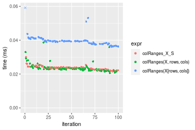

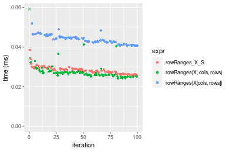
_Table: Benchmarking of colRanges_X_S() and rowRanges_X_S() on double+100x100 data (original and transposed).  The top panel shows times in milliseconds and the bottom panel shows relative times._


|   |expr          |    min|      lq|     mean| median|      uq|    max|
|:--|:-------------|------:|-------:|--------:|------:|-------:|------:|
|1  |colRanges_X_S | 21.569| 22.7270| 23.59637| 23.582| 24.0320| 30.008|
|2  |rowRanges_X_S | 25.524| 27.0575| 28.41547| 28.350| 29.2785| 43.727|


|   |expr          |      min|       lq|     mean|   median|       uq|      max|
|:--|:-------------|--------:|--------:|--------:|--------:|--------:|--------:|
|1  |colRanges_X_S | 1.000000| 1.000000| 1.000000| 1.000000| 1.000000| 1.000000|
|2  |rowRanges_X_S | 1.183365| 1.190544| 1.204231| 1.202188| 1.218313| 1.457178|

_Figure: Benchmarking of colRanges_X_S() and rowRanges_X_S() on double+100x100 data (original and transposed).  Outliers are displayed as crosses. Times are in milliseconds._


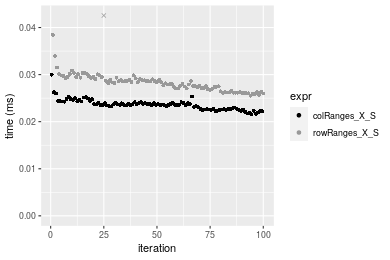

#### 1000x10 double matrix

```r
> X <- data[["1000x10"]]
> rows <- sample.int(nrow(X), size = nrow(X) * 0.7)
> cols <- sample.int(ncol(X), size = ncol(X) * 0.7)
> X_S <- X[rows, cols]
> gc()
           used  (Mb) gc trigger  (Mb) max used  (Mb)
Ncells  5275937 281.8    8529671 455.6  8529671 455.6
Vcells 10145279  77.5   31876688 243.2 60562128 462.1
> colStats <- microbenchmark(colRanges_X_S = colRanges(X_S, na.rm = FALSE), `colRanges(X, rows, cols)` = colRanges(X, 
+     rows = rows, cols = cols, na.rm = FALSE), `colRanges(X[rows, cols])` = colRanges(X[rows, cols], 
+     na.rm = FALSE), unit = "ms")
> X <- t(X)
> X_S <- t(X_S)
> gc()
           used  (Mb) gc trigger  (Mb) max used  (Mb)
Ncells  5275913 281.8    8529671 455.6  8529671 455.6
Vcells 10155332  77.5   31876688 243.2 60562128 462.1
> rowStats <- microbenchmark(rowRanges_X_S = rowRanges(X_S, na.rm = FALSE), `rowRanges(X, cols, rows)` = rowRanges(X, 
+     rows = cols, cols = rows, na.rm = FALSE), `rowRanges(X[cols, rows])` = rowRanges(X[cols, rows], 
+     na.rm = FALSE), unit = "ms")
```

_Table: Benchmarking of colRanges_X_S(), colRanges(X, rows, cols)() and colRanges(X[rows, cols])() on double+1000x10 data. The top panel shows times in milliseconds and the bottom panel shows relative times._


|   |expr                     |      min|        lq|      mean|    median|       uq|      max|
|:--|:------------------------|--------:|---------:|---------:|---------:|--------:|--------:|
|1  |colRanges_X_S            | 0.017208| 0.0180405| 0.0186029| 0.0185750| 0.018823| 0.032158|
|2  |colRanges(X, rows, cols) | 0.018402| 0.0192105| 0.0197464| 0.0196890| 0.020151| 0.026949|
|3  |colRanges(X[rows, cols]) | 0.032242| 0.0335585| 0.0348291| 0.0340055| 0.035160| 0.069628|


|   |expr                     |      min|       lq|     mean|   median|       uq|       max|
|:--|:------------------------|--------:|--------:|--------:|--------:|--------:|---------:|
|1  |colRanges_X_S            | 1.000000| 1.000000| 1.000000| 1.000000| 1.000000| 1.0000000|
|2  |colRanges(X, rows, cols) | 1.069386| 1.064854| 1.061468| 1.059973| 1.070552| 0.8380185|
|3  |colRanges(X[rows, cols]) | 1.873663| 1.860176| 1.872238| 1.830713| 1.867927| 2.1651844|

_Table: Benchmarking of rowRanges_X_S(), rowRanges(X, cols, rows)() and rowRanges(X[cols, rows])() on double+1000x10 data (transposed). The top panel shows times in milliseconds and the bottom panel shows relative times._


|   |expr                     |      min|       lq|      mean|    median|       uq|      max|
|:--|:------------------------|--------:|--------:|---------:|---------:|--------:|--------:|
|1  |rowRanges_X_S            | 0.023957| 0.025030| 0.0260793| 0.0253655| 0.026453| 0.038574|
|2  |rowRanges(X, cols, rows) | 0.024391| 0.025670| 0.0267179| 0.0267205| 0.027449| 0.042101|
|3  |rowRanges(X[cols, rows]) | 0.041732| 0.043514| 0.0453701| 0.0451915| 0.045685| 0.081784|


|   |expr                     |      min|       lq|     mean|   median|       uq|      max|
|:--|:------------------------|--------:|--------:|--------:|--------:|--------:|--------:|
|1  |rowRanges_X_S            | 1.000000| 1.000000| 1.000000| 1.000000| 1.000000| 1.000000|
|2  |rowRanges(X, cols, rows) | 1.018116| 1.025569| 1.024488| 1.053419| 1.037652| 1.091435|
|3  |rowRanges(X[cols, rows]) | 1.741954| 1.738474| 1.739697| 1.781613| 1.727025| 2.120185|

_Figure: Benchmarking of colRanges_X_S(), colRanges(X, rows, cols)() and colRanges(X[rows, cols])() on double+1000x10 data  as well as rowRanges_X_S(), rowRanges(X, cols, rows)() and rowRanges(X[cols, rows])() on the same data transposed.  Outliers are displayed as crosses.  Times are in milliseconds._


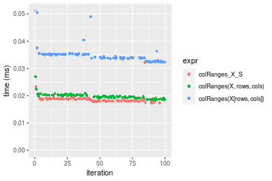

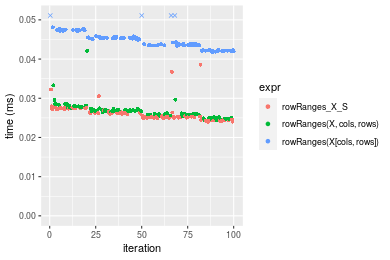
_Table: Benchmarking of colRanges_X_S() and rowRanges_X_S() on double+1000x10 data (original and transposed).  The top panel shows times in milliseconds and the bottom panel shows relative times._


|   |expr          |    min|      lq|     mean|  median|     uq|    max|
|:--|:-------------|------:|-------:|--------:|-------:|------:|------:|
|1  |colRanges_X_S | 17.208| 18.0405| 18.60291| 18.5750| 18.823| 32.158|
|2  |rowRanges_X_S | 23.957| 25.0300| 26.07930| 25.3655| 26.453| 38.574|


|   |expr          |      min|       lq|     mean|   median|       uq|      max|
|:--|:-------------|--------:|--------:|--------:|--------:|--------:|--------:|
|1  |colRanges_X_S | 1.000000| 1.000000| 1.000000| 1.000000| 1.000000| 1.000000|
|2  |rowRanges_X_S | 1.392201| 1.387434| 1.401894| 1.365572| 1.405355| 1.199515|

_Figure: Benchmarking of colRanges_X_S() and rowRanges_X_S() on double+1000x10 data (original and transposed).  Outliers are displayed as crosses. Times are in milliseconds._


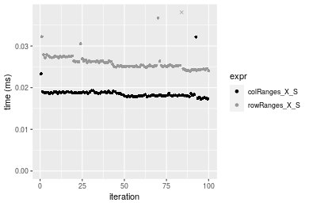

#### 10x1000 double matrix

```r
> X <- data[["10x1000"]]
> rows <- sample.int(nrow(X), size = nrow(X) * 0.7)
> cols <- sample.int(ncol(X), size = ncol(X) * 0.7)
> X_S <- X[rows, cols]
> gc()
           used  (Mb) gc trigger  (Mb) max used  (Mb)
Ncells  5276142 281.8    8529671 455.6  8529671 455.6
Vcells 10145415  77.5   31876688 243.2 60562128 462.1
> colStats <- microbenchmark(colRanges_X_S = colRanges(X_S, na.rm = FALSE), `colRanges(X, rows, cols)` = colRanges(X, 
+     rows = rows, cols = cols, na.rm = FALSE), `colRanges(X[rows, cols])` = colRanges(X[rows, cols], 
+     na.rm = FALSE), unit = "ms")
> X <- t(X)
> X_S <- t(X_S)
> gc()
           used  (Mb) gc trigger  (Mb) max used  (Mb)
Ncells  5276118 281.8    8529671 455.6  8529671 455.6
Vcells 10155468  77.5   31876688 243.2 60562128 462.1
> rowStats <- microbenchmark(rowRanges_X_S = rowRanges(X_S, na.rm = FALSE), `rowRanges(X, cols, rows)` = rowRanges(X, 
+     rows = cols, cols = rows, na.rm = FALSE), `rowRanges(X[cols, rows])` = rowRanges(X[cols, rows], 
+     na.rm = FALSE), unit = "ms")
```

_Table: Benchmarking of colRanges_X_S(), colRanges(X, rows, cols)() and colRanges(X[rows, cols])() on double+10x1000 data. The top panel shows times in milliseconds and the bottom panel shows relative times._


|   |expr                     |      min|        lq|      mean|    median|        uq|      max|
|:--|:------------------------|--------:|---------:|---------:|---------:|---------:|--------:|
|1  |colRanges_X_S            | 0.036116| 0.0401485| 0.0430188| 0.0421410| 0.0448010| 0.074487|
|2  |colRanges(X, rows, cols) | 0.035282| 0.0444070| 0.0493891| 0.0478195| 0.0527630| 0.087755|
|3  |colRanges(X[rows, cols]) | 0.052511| 0.0589570| 0.0622248| 0.0616820| 0.0645095| 0.087244|


|   |expr                     |       min|       lq|     mean|   median|       uq|      max|
|:--|:------------------------|---------:|--------:|--------:|--------:|--------:|--------:|
|1  |colRanges_X_S            | 1.0000000| 1.000000| 1.000000| 1.000000| 1.000000| 1.000000|
|2  |colRanges(X, rows, cols) | 0.9769077| 1.106069| 1.148082| 1.134750| 1.177719| 1.178125|
|3  |colRanges(X[rows, cols]) | 1.4539539| 1.468473| 1.446457| 1.463705| 1.439912| 1.171265|

_Table: Benchmarking of rowRanges_X_S(), rowRanges(X, cols, rows)() and rowRanges(X[cols, rows])() on double+10x1000 data (transposed). The top panel shows times in milliseconds and the bottom panel shows relative times._


|   |expr                     |      min|        lq|      mean|    median|        uq|      max|
|:--|:------------------------|--------:|---------:|---------:|---------:|---------:|--------:|
|1  |rowRanges_X_S            | 0.036295| 0.0401505| 0.0422042| 0.0416980| 0.0440115| 0.057381|
|2  |rowRanges(X, cols, rows) | 0.030486| 0.0412595| 0.0453842| 0.0447375| 0.0485925| 0.088057|
|3  |rowRanges(X[cols, rows]) | 0.049509| 0.0561305| 0.0585581| 0.0581410| 0.0612455| 0.072385|


|   |expr                     |       min|       lq|     mean|   median|       uq|      max|
|:--|:------------------------|---------:|--------:|--------:|--------:|--------:|--------:|
|1  |rowRanges_X_S            | 1.0000000| 1.000000| 1.000000| 1.000000| 1.000000| 1.000000|
|2  |rowRanges(X, cols, rows) | 0.8399504| 1.027621| 1.075348| 1.072893| 1.104086| 1.534602|
|3  |rowRanges(X[cols, rows]) | 1.3640722| 1.398003| 1.387495| 1.394335| 1.391579| 1.261480|

_Figure: Benchmarking of colRanges_X_S(), colRanges(X, rows, cols)() and colRanges(X[rows, cols])() on double+10x1000 data  as well as rowRanges_X_S(), rowRanges(X, cols, rows)() and rowRanges(X[cols, rows])() on the same data transposed.  Outliers are displayed as crosses.  Times are in milliseconds._


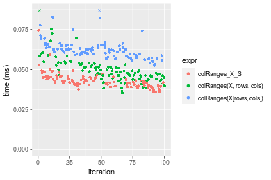

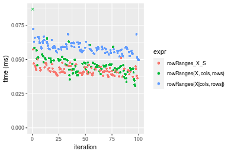
_Table: Benchmarking of colRanges_X_S() and rowRanges_X_S() on double+10x1000 data (original and transposed).  The top panel shows times in milliseconds and the bottom panel shows relative times._


|   |expr          |    min|      lq|     mean| median|      uq|    max|
|:--|:-------------|------:|-------:|--------:|------:|-------:|------:|
|2  |rowRanges_X_S | 36.295| 40.1505| 42.20418| 41.698| 44.0115| 57.381|
|1  |colRanges_X_S | 36.116| 40.1485| 43.01877| 42.141| 44.8010| 74.487|


|   |expr          |       min|        lq|     mean|   median|       uq|      max|
|:--|:-------------|---------:|---------:|--------:|--------:|--------:|--------:|
|2  |rowRanges_X_S | 1.0000000| 1.0000000| 1.000000| 1.000000| 1.000000| 1.000000|
|1  |colRanges_X_S | 0.9950682| 0.9999502| 1.019301| 1.010624| 1.017939| 1.298113|

_Figure: Benchmarking of colRanges_X_S() and rowRanges_X_S() on double+10x1000 data (original and transposed).  Outliers are displayed as crosses. Times are in milliseconds._


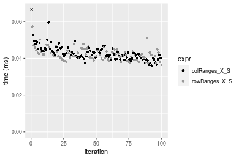

#### 100x1000 double matrix

```r
> X <- data[["100x1000"]]
> rows <- sample.int(nrow(X), size = nrow(X) * 0.7)
> cols <- sample.int(ncol(X), size = ncol(X) * 0.7)
> X_S <- X[rows, cols]
> gc()
           used  (Mb) gc trigger  (Mb) max used  (Mb)
Ncells  5276352 281.8    8529671 455.6  8529671 455.6
Vcells 10190887  77.8   31876688 243.2 60562128 462.1
> colStats <- microbenchmark(colRanges_X_S = colRanges(X_S, na.rm = FALSE), `colRanges(X, rows, cols)` = colRanges(X, 
+     rows = rows, cols = cols, na.rm = FALSE), `colRanges(X[rows, cols])` = colRanges(X[rows, cols], 
+     na.rm = FALSE), unit = "ms")
> X <- t(X)
> X_S <- t(X_S)
> gc()
           used  (Mb) gc trigger  (Mb) max used  (Mb)
Ncells  5276328 281.8    8529671 455.6  8529671 455.6
Vcells 10290940  78.6   31876688 243.2 60562128 462.1
> rowStats <- microbenchmark(rowRanges_X_S = rowRanges(X_S, na.rm = FALSE), `rowRanges(X, cols, rows)` = rowRanges(X, 
+     rows = cols, cols = rows, na.rm = FALSE), `rowRanges(X[cols, rows])` = rowRanges(X[cols, rows], 
+     na.rm = FALSE), unit = "ms")
```

_Table: Benchmarking of colRanges_X_S(), colRanges(X, rows, cols)() and colRanges(X[rows, cols])() on double+100x1000 data. The top panel shows times in milliseconds and the bottom panel shows relative times._


|   |expr                     |      min|        lq|      mean|   median|        uq|      max|
|:--|:------------------------|--------:|---------:|---------:|--------:|---------:|--------:|
|1  |colRanges_X_S            | 0.148704| 0.1520220| 0.1773611| 0.168714| 0.1937670| 0.268810|
|2  |colRanges(X, rows, cols) | 0.157781| 0.1618165| 0.1887665| 0.178095| 0.2070165| 0.350054|
|3  |colRanges(X[rows, cols]) | 0.243819| 0.2551330| 0.2953810| 0.291198| 0.3187445| 0.410486|


|   |expr                     |      min|       lq|     mean|   median|       uq|      max|
|:--|:------------------------|--------:|--------:|--------:|--------:|--------:|--------:|
|1  |colRanges_X_S            | 1.000000| 1.000000| 1.000000| 1.000000| 1.000000| 1.000000|
|2  |colRanges(X, rows, cols) | 1.061041| 1.064428| 1.064306| 1.055603| 1.068378| 1.302236|
|3  |colRanges(X[rows, cols]) | 1.639626| 1.678264| 1.665422| 1.725986| 1.644989| 1.527049|

_Table: Benchmarking of rowRanges_X_S(), rowRanges(X, cols, rows)() and rowRanges(X[cols, rows])() on double+100x1000 data (transposed). The top panel shows times in milliseconds and the bottom panel shows relative times._


|   |expr                     |      min|        lq|      mean|    median|        uq|      max|
|:--|:------------------------|--------:|---------:|---------:|---------:|---------:|--------:|
|2  |rowRanges(X, cols, rows) | 0.177058| 0.1798430| 0.2033431| 0.1887905| 0.2189920| 0.383434|
|1  |rowRanges_X_S            | 0.180120| 0.1882065| 0.2183224| 0.2100115| 0.2364915| 0.327934|
|3  |rowRanges(X[cols, rows]) | 0.273754| 0.2862750| 0.3264317| 0.3092660| 0.3556315| 0.469742|


|   |expr                     |      min|       lq|     mean|   median|       uq|       max|
|:--|:------------------------|--------:|--------:|--------:|--------:|--------:|---------:|
|2  |rowRanges(X, cols, rows) | 1.000000| 1.000000| 1.000000| 1.000000| 1.000000| 1.0000000|
|1  |rowRanges_X_S            | 1.017294| 1.046504| 1.073665| 1.112405| 1.079909| 0.8552554|
|3  |rowRanges(X[cols, rows]) | 1.546126| 1.591805| 1.605324| 1.638144| 1.623948| 1.2250922|

_Figure: Benchmarking of colRanges_X_S(), colRanges(X, rows, cols)() and colRanges(X[rows, cols])() on double+100x1000 data  as well as rowRanges_X_S(), rowRanges(X, cols, rows)() and rowRanges(X[cols, rows])() on the same data transposed.  Outliers are displayed as crosses.  Times are in milliseconds._


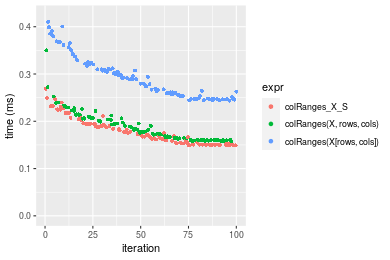

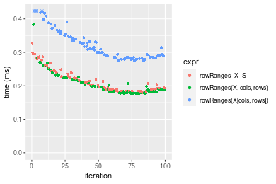
_Table: Benchmarking of colRanges_X_S() and rowRanges_X_S() on double+100x1000 data (original and transposed).  The top panel shows times in milliseconds and the bottom panel shows relative times._


|   |expr          |     min|       lq|     mean|   median|       uq|     max|
|:--|:-------------|-------:|--------:|--------:|--------:|--------:|-------:|
|1  |colRanges_X_S | 148.704| 152.0220| 177.3611| 168.7140| 193.7670| 268.810|
|2  |rowRanges_X_S | 180.120| 188.2065| 218.3224| 210.0115| 236.4915| 327.934|


|   |expr          |      min|       lq|     mean|   median|       uq|      max|
|:--|:-------------|--------:|--------:|--------:|--------:|--------:|--------:|
|1  |colRanges_X_S | 1.000000| 1.000000| 1.000000| 1.000000| 1.000000| 1.000000|
|2  |rowRanges_X_S | 1.211265| 1.238022| 1.230949| 1.244778| 1.220494| 1.219947|

_Figure: Benchmarking of colRanges_X_S() and rowRanges_X_S() on double+100x1000 data (original and transposed).  Outliers are displayed as crosses. Times are in milliseconds._


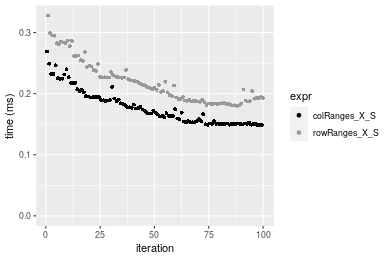

#### 1000x100 double matrix

```r
> X <- data[["1000x100"]]
> rows <- sample.int(nrow(X), size = nrow(X) * 0.7)
> cols <- sample.int(ncol(X), size = ncol(X) * 0.7)
> X_S <- X[rows, cols]
> gc()
           used  (Mb) gc trigger  (Mb) max used  (Mb)
Ncells  5276565 281.8    8529671 455.6  8529671 455.6
Vcells 10191031  77.8   31876688 243.2 60562128 462.1
> colStats <- microbenchmark(colRanges_X_S = colRanges(X_S, na.rm = FALSE), `colRanges(X, rows, cols)` = colRanges(X, 
+     rows = rows, cols = cols, na.rm = FALSE), `colRanges(X[rows, cols])` = colRanges(X[rows, cols], 
+     na.rm = FALSE), unit = "ms")
> X <- t(X)
> X_S <- t(X_S)
> gc()
           used  (Mb) gc trigger  (Mb) max used  (Mb)
Ncells  5276541 281.8    8529671 455.6  8529671 455.6
Vcells 10291084  78.6   31876688 243.2 60562128 462.1
> rowStats <- microbenchmark(rowRanges_X_S = rowRanges(X_S, na.rm = FALSE), `rowRanges(X, cols, rows)` = rowRanges(X, 
+     rows = cols, cols = rows, na.rm = FALSE), `rowRanges(X[cols, rows])` = rowRanges(X[cols, rows], 
+     na.rm = FALSE), unit = "ms")
```

_Table: Benchmarking of colRanges_X_S(), colRanges(X, rows, cols)() and colRanges(X[rows, cols])() on double+1000x100 data. The top panel shows times in milliseconds and the bottom panel shows relative times._


|   |expr                     |      min|        lq|      mean|    median|        uq|      max|
|:--|:------------------------|--------:|---------:|---------:|---------:|---------:|--------:|
|1  |colRanges_X_S            | 0.111994| 0.1185700| 0.1348464| 0.1296555| 0.1422635| 0.212458|
|2  |colRanges(X, rows, cols) | 0.106181| 0.1143010| 0.1302994| 0.1299525| 0.1363570| 0.202443|
|3  |colRanges(X[rows, cols]) | 0.207885| 0.2264065| 0.2566025| 0.2520265| 0.2767080| 0.425901|


|   |expr                     |       min|       lq|      mean|   median|       uq|       max|
|:--|:------------------------|---------:|--------:|---------:|--------:|--------:|---------:|
|1  |colRanges_X_S            | 1.0000000| 1.000000| 1.0000000| 1.000000| 1.000000| 1.0000000|
|2  |colRanges(X, rows, cols) | 0.9480954| 0.963996| 0.9662801| 1.002291| 0.958482| 0.9528613|
|3  |colRanges(X[rows, cols]) | 1.8562155| 1.909475| 1.9029248| 1.943817| 1.945039| 2.0046362|

_Table: Benchmarking of rowRanges_X_S(), rowRanges(X, cols, rows)() and rowRanges(X[cols, rows])() on double+1000x100 data (transposed). The top panel shows times in milliseconds and the bottom panel shows relative times._


|   |expr                     |      min|        lq|      mean|    median|        uq|      max|
|:--|:------------------------|--------:|---------:|---------:|---------:|---------:|--------:|
|2  |rowRanges(X, cols, rows) | 0.140555| 0.1476530| 0.1711768| 0.1670870| 0.1838090| 0.351313|
|1  |rowRanges_X_S            | 0.151332| 0.1561730| 0.1810896| 0.1710405| 0.1980135| 0.267442|
|3  |rowRanges(X[cols, rows]) | 0.245382| 0.2556045| 0.2956437| 0.2792345| 0.3227230| 0.421361|


|   |expr                     |      min|       lq|     mean|   median|       uq|       max|
|:--|:------------------------|--------:|--------:|--------:|--------:|--------:|---------:|
|2  |rowRanges(X, cols, rows) | 1.000000| 1.000000| 1.000000| 1.000000| 1.000000| 1.0000000|
|1  |rowRanges_X_S            | 1.076675| 1.057703| 1.057910| 1.023661| 1.077279| 0.7612642|
|3  |rowRanges(X[cols, rows]) | 1.745808| 1.731116| 1.727125| 1.671192| 1.755752| 1.1993891|

_Figure: Benchmarking of colRanges_X_S(), colRanges(X, rows, cols)() and colRanges(X[rows, cols])() on double+1000x100 data  as well as rowRanges_X_S(), rowRanges(X, cols, rows)() and rowRanges(X[cols, rows])() on the same data transposed.  Outliers are displayed as crosses.  Times are in milliseconds._


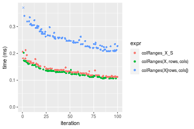

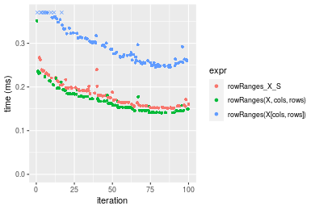
_Table: Benchmarking of colRanges_X_S() and rowRanges_X_S() on double+1000x100 data (original and transposed).  The top panel shows times in milliseconds and the bottom panel shows relative times._


|   |expr          |     min|      lq|     mean|   median|       uq|     max|
|:--|:-------------|-------:|-------:|--------:|--------:|--------:|-------:|
|1  |colRanges_X_S | 111.994| 118.570| 134.8464| 129.6555| 142.2635| 212.458|
|2  |rowRanges_X_S | 151.332| 156.173| 181.0897| 171.0405| 198.0135| 267.442|


|   |expr          |      min|       lq|     mean|   median|       uq|      max|
|:--|:-------------|--------:|--------:|--------:|--------:|--------:|--------:|
|1  |colRanges_X_S | 1.000000| 1.000000| 1.000000| 1.000000| 1.000000| 1.000000|
|2  |rowRanges_X_S | 1.351251| 1.317138| 1.342933| 1.319192| 1.391879| 1.258799|

_Figure: Benchmarking of colRanges_X_S() and rowRanges_X_S() on double+1000x100 data (original and transposed).  Outliers are displayed as crosses. Times are in milliseconds._


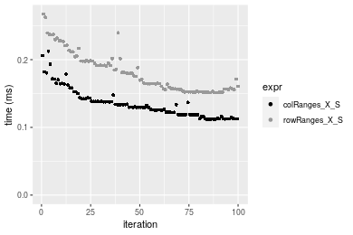


## Appendix

### Session information
```r
R version 4.1.1 Patched (2021-08-10 r80727)
Platform: x86_64-pc-linux-gnu (64-bit)
Running under: Ubuntu 18.04.5 LTS

Matrix products: default
BLAS:   /home/hb/software/R-devel/R-4-1-branch/lib/R/lib/libRblas.so
LAPACK: /home/hb/software/R-devel/R-4-1-branch/lib/R/lib/libRlapack.so

locale:
 [1] LC_CTYPE=en_US.UTF-8       LC_NUMERIC=C              
 [3] LC_TIME=en_US.UTF-8        LC_COLLATE=en_US.UTF-8    
 [5] LC_MONETARY=en_US.UTF-8    LC_MESSAGES=en_US.UTF-8   
 [7] LC_PAPER=en_US.UTF-8       LC_NAME=C                 
 [9] LC_ADDRESS=C               LC_TELEPHONE=C            
[11] LC_MEASUREMENT=en_US.UTF-8 LC_IDENTIFICATION=C       

attached base packages:
[1] stats     graphics  grDevices utils     datasets  methods   base     

other attached packages:
[1] microbenchmark_1.4-7   matrixStats_0.60.1     ggplot2_3.3.5         
[4] knitr_1.33             R.devices_2.17.0       R.utils_2.10.1        
[7] R.oo_1.24.0            R.methodsS3_1.8.1-9001 history_0.0.1-9000    

loaded via a namespace (and not attached):
 [1] Biobase_2.52.0          httr_1.4.2              splines_4.1.1          
 [4] bit64_4.0.5             network_1.17.1          assertthat_0.2.1       
 [7] highr_0.9               stats4_4.1.1            blob_1.2.2             
[10] GenomeInfoDbData_1.2.6  robustbase_0.93-8       pillar_1.6.2           
[13] RSQLite_2.2.8           lattice_0.20-44         glue_1.4.2             
[16] digest_0.6.27           XVector_0.32.0          colorspace_2.0-2       
[19] Matrix_1.3-4            XML_3.99-0.7            pkgconfig_2.0.3        
[22] zlibbioc_1.38.0         genefilter_1.74.0       purrr_0.3.4            
[25] ergm_4.1.2              xtable_1.8-4            scales_1.1.1           
[28] tibble_3.1.4            annotate_1.70.0         KEGGREST_1.32.0        
[31] farver_2.1.0            generics_0.1.0          IRanges_2.26.0         
[34] ellipsis_0.3.2          cachem_1.0.6            withr_2.4.2            
[37] BiocGenerics_0.38.0     mime_0.11               survival_3.2-13        
[40] magrittr_2.0.1          crayon_1.4.1            statnet.common_4.5.0   
[43] memoise_2.0.0           laeken_0.5.1            fansi_0.5.0            
[46] R.cache_0.15.0          MASS_7.3-54             R.rsp_0.44.0           
[49] progressr_0.8.0         tools_4.1.1             lifecycle_1.0.0        
[52] S4Vectors_0.30.0        trust_0.1-8             munsell_0.5.0          
[55] tabby_0.0.1-9001        AnnotationDbi_1.54.1    Biostrings_2.60.2      
[58] compiler_4.1.1          GenomeInfoDb_1.28.1     rlang_0.4.11           
[61] grid_4.1.1              RCurl_1.98-1.4          cwhmisc_6.6            
[64] rappdirs_0.3.3          startup_0.15.0          labeling_0.4.2         
[67] bitops_1.0-7            base64enc_0.1-3         boot_1.3-28            
[70] gtable_0.3.0            DBI_1.1.1               markdown_1.1           
[73] R6_2.5.1                lpSolveAPI_5.5.2.0-17.7 rle_0.9.2              
[76] dplyr_1.0.7             fastmap_1.1.0           bit_4.0.4              
[79] utf8_1.2.2              parallel_4.1.1          Rcpp_1.0.7             
[82] vctrs_0.3.8             png_0.1-7               DEoptimR_1.0-9         
[85] tidyselect_1.1.1        xfun_0.25               coda_0.19-4            
```
Total processing time was 23.36 secs.


### Reproducibility
To reproduce this report, do:
```r
html <- matrixStats:::benchmark('colRowRanges_subset')
```

[RSP]: https://cran.r-project.org/package=R.rsp
[matrixStats]: https://cran.r-project.org/package=matrixStats

[StackOverflow:colMins?]: https://stackoverflow.com/questions/13676878 "Stack Overflow: fastest way to get Min from every column in a matrix?"
[StackOverflow:colSds?]: https://stackoverflow.com/questions/17549762 "Stack Overflow: Is there such 'colsd' in R?"
[StackOverflow:rowProds?]: https://stackoverflow.com/questions/20198801/ "Stack Overflow: Row product of matrix and column sum of matrix"

---------------------------------------
Copyright Dongcan Jiang. Last updated on 2021-08-25 19:06:56 (+0200 UTC). Powered by [RSP].

<script>
 var link = document.createElement('link');
 link.rel = 'icon';
 link.href = "data:image/png;base64,iVBORw0KGgoAAAANSUhEUgAAACAAAAAgCAMAAABEpIrGAAAA21BMVEUAAAAAAP8AAP8AAP8AAP8AAP8AAP8AAP8AAP8AAP8AAP8AAP8AAP8AAP8AAP8AAP8AAP8AAP8AAP8AAP8AAP8AAP8AAP8AAP8AAP8AAP8AAP8AAP8AAP8AAP8AAP8AAP8AAP8AAP8AAP8AAP8AAP8AAP8AAP8AAP8AAP8AAP8BAf4CAv0DA/wdHeIeHuEfH+AgIN8hId4lJdomJtknJ9g+PsE/P8BAQL9yco10dIt1dYp3d4h4eIeVlWqWlmmXl2iYmGeZmWabm2Tn5xjo6Bfp6Rb39wj4+Af//wA2M9hbAAAASXRSTlMAAQIJCgsMJSYnKD4/QGRlZmhpamtsbautrrCxuru8y8zN5ebn6Pn6+///////////////////////////////////////////LsUNcQAAAS9JREFUOI29k21XgkAQhVcFytdSMqMETU26UVqGmpaiFbL//xc1cAhhwVNf6n5i5z67M2dmYOyfJZUqlVLhkKucG7cgmUZTybDz6g0iDeq51PUr37Ds2cy2/C9NeES5puDjxuUk1xnToZsg8pfA3avHQ3lLIi7iWRrkv/OYtkScxBIMgDee0ALoyxHQBJ68JLCjOtQIMIANF7QG9G9fNnHvisCHBVMKgSJgiz7nE+AoBKrAPA3MgepvgR9TSCasrCKH0eB1wBGBFdCO+nAGjMVGPcQb5bd6mQRegN6+1axOs9nGfYcCtfi4NQosdtH7dB+txFIpXQqN1p9B/asRHToyS0jRgpV7nk4nwcq1BJ+x3Gl/v7S9Wmpp/aGquum7w3ZDyrADFYrl8vHBH+ev9AUASW1dmU4h4wAAAABJRU5ErkJggg=="
 document.getElementsByTagName('head')[0].appendChild(link);
</script>


