[matrixStats]: Benchmark report

---------------------------------------


# colVars() and rowVars() benchmarks

This report benchmark the performance of colVars() and rowVars() against alternative methods.

## Alternative methods

* apply() + var()
* colVarColMeans() and rowVarColMeans()
* genefilter::rowVars(t(.)) and genefilter::rowVars()

where

```r
> colVarColMeans <- function(x, na.rm = TRUE) {
+     if (na.rm) {
+         n <- colSums(!is.na(x))
+     }     else {
+         n <- nrow(x)
+     }
+     var <- colMeans(x * x, na.rm = na.rm) - (colMeans(x, na.rm = na.rm))^2
+     var * n/(n - 1)
+ }
```

and

```r
> rowVarRowMeans <- function(x, na.rm = TRUE) {
+     if (na.rm) {
+         n <- rowSums(!is.na(x))
+     }     else {
+         n <- ncol(x)
+     }
+     mu <- rowMeans(x, na.rm = na.rm)
+     var <- rowMeans(x * x, na.rm = na.rm) - mu^2
+     var * (n/(n - 1))
+ }
```


## Data type "integer"

### Data
```r
> rmatrix <- function(nrow, ncol, mode = c("logical", "double", "integer", "index"), range = c(-100, 
+     +100), na_prob = 0) {
+     mode <- match.arg(mode)
+     n <- nrow * ncol
+     if (mode == "logical") {
+         x <- sample(c(FALSE, TRUE), size = n, replace = TRUE)
+     }     else if (mode == "index") {
+         x <- seq_len(n)
+         mode <- "integer"
+     }     else {
+         x <- runif(n, min = range[1], max = range[2])
+     }
+     storage.mode(x) <- mode
+     if (na_prob > 0) 
+         x[sample(n, size = na_prob * n)] <- NA
+     dim(x) <- c(nrow, ncol)
+     x
+ }
> rmatrices <- function(scale = 10, seed = 1, ...) {
+     set.seed(seed)
+     data <- list()
+     data[[1]] <- rmatrix(nrow = scale * 1, ncol = scale * 1, ...)
+     data[[2]] <- rmatrix(nrow = scale * 10, ncol = scale * 10, ...)
+     data[[3]] <- rmatrix(nrow = scale * 100, ncol = scale * 1, ...)
+     data[[4]] <- t(data[[3]])
+     data[[5]] <- rmatrix(nrow = scale * 10, ncol = scale * 100, ...)
+     data[[6]] <- t(data[[5]])
+     names(data) <- sapply(data, FUN = function(x) paste(dim(x), collapse = "x"))
+     data
+ }
> data <- rmatrices(mode = mode)
```

### Results

#### 10x10 integer matrix

```r
> X <- data[["10x10"]]
> gc()
           used  (Mb) gc trigger  (Mb) max used  (Mb)
Ncells  5324574 284.4    8529671 455.6  8529671 455.6
Vcells 10675378  81.5   31876688 243.2 60562128 462.1
> colStats <- microbenchmark(colVars = colVars(X, na.rm = FALSE), colVarsCenter = colVars(X, center = colMeans(X, 
+     na.rm = FALSE), na.rm = FALSE), colVarColMeans = colVarColMeans(X, na.rm = FALSE), `apply+var` = apply(X, 
+     MARGIN = 2L, FUN = var, na.rm = FALSE), `genefilter::rowVars(t(.))` = genefilter_colVars(X, na.rm = FALSE), 
+     unit = "ms")
> X <- t(X)
> gc()
           used  (Mb) gc trigger  (Mb) max used  (Mb)
Ncells  5311190 283.7    8529671 455.6  8529671 455.6
Vcells 10630747  81.2   31876688 243.2 60562128 462.1
> rowStats <- microbenchmark(rowVars = rowVars(X, na.rm = FALSE), rowVarsCenter = rowVars(X, center = rowMeans(X, 
+     na.rm = FALSE), na.rm = FALSE), rowVarRowMeans = rowVarRowMeans(X, na.rm = FALSE), `apply+var` = apply(X, 
+     MARGIN = 1L, FUN = var, na.rm = FALSE), `genefilter::rowVars` = genefilter_rowVars(X, na.rm = FALSE), 
+     unit = "ms")
```

_Table: Benchmarking of colVars(), colVarsCenter(), colVarColMeans(), apply+var() and genefilter::rowVars(t(.))() on integer+10x10 data. The top panel shows times in milliseconds and the bottom panel shows relative times._


|   |expr                      |      min|        lq|      mean|    median|        uq|      max|
|:--|:-------------------------|--------:|---------:|---------:|---------:|---------:|--------:|
|1  |colVars                   | 0.002360| 0.0031560| 0.0046498| 0.0044535| 0.0055355| 0.011795|
|3  |colVarColMeans            | 0.013864| 0.0168240| 0.0212893| 0.0184410| 0.0213865| 0.122530|
|5  |genefilter::rowVars(t(.)) | 0.035432| 0.0425200| 0.0590438| 0.0471030| 0.0557940| 1.006462|
|2  |colVarsCenter             | 0.036826| 0.0450000| 0.0616142| 0.0489495| 0.0569050| 0.961093|
|4  |apply+var                 | 0.122563| 0.1328825| 0.1513238| 0.1453265| 0.1617335| 0.350631|


|   |expr                      |       min|        lq|      mean|    median|        uq|      max|
|:--|:-------------------------|---------:|---------:|---------:|---------:|---------:|--------:|
|1  |colVars                   |  1.000000|  1.000000|  1.000000|  1.000000|  1.000000|  1.00000|
|3  |colVarColMeans            |  5.874576|  5.330799|  4.578599|  4.140788|  3.863517| 10.38830|
|5  |genefilter::rowVars(t(.)) | 15.013559| 13.472750| 12.698283| 10.576625| 10.079306| 85.32955|
|2  |colVarsCenter             | 15.604237| 14.258555| 13.251067| 10.991243| 10.280011| 81.48309|
|4  |apply+var                 | 51.933475| 42.104721| 32.544511| 32.631975| 29.217505| 29.72709|

_Table: Benchmarking of rowVars(), rowVarsCenter(), rowVarRowMeans(), apply+var() and genefilter::rowVars() on integer+10x10 data (transposed). The top panel shows times in milliseconds and the bottom panel shows relative times._


|   |expr                |      min|        lq|      mean|    median|        uq|      max|
|:--|:-------------------|--------:|---------:|---------:|---------:|---------:|--------:|
|1  |rowVars             | 0.002373| 0.0035160| 0.0042179| 0.0040805| 0.0046895| 0.010942|
|3  |rowVarRowMeans      | 0.015161| 0.0169170| 0.0189191| 0.0184695| 0.0199395| 0.033628|
|2  |rowVarsCenter       | 0.023000| 0.0267620| 0.0319457| 0.0293280| 0.0320235| 0.173975|
|5  |genefilter::rowVars | 0.030653| 0.0352425| 0.0382160| 0.0374810| 0.0401580| 0.078717|
|4  |apply+var           | 0.119604| 0.1247110| 0.1362969| 0.1323155| 0.1442730| 0.242408|


|   |expr                |       min|        lq|      mean|    median|        uq|       max|
|:--|:-------------------|---------:|---------:|---------:|---------:|---------:|---------:|
|1  |rowVars             |  1.000000|  1.000000|  1.000000|  1.000000|  1.000000|  1.000000|
|3  |rowVarRowMeans      |  6.388959|  4.811433|  4.485468|  4.526283|  4.251946|  3.073296|
|2  |rowVarsCenter       |  9.692372|  7.611490|  7.573901|  7.187354|  6.828766| 15.899744|
|5  |genefilter::rowVars | 12.917404| 10.023464|  9.060493|  9.185394|  8.563386|  7.194023|
|4  |apply+var           | 50.402023| 35.469568| 32.314156| 32.426296| 30.765114| 22.153902|

_Figure: Benchmarking of colVars(), colVarsCenter(), colVarColMeans(), apply+var() and genefilter::rowVars(t(.))() on integer+10x10 data  as well as rowVars(), rowVarsCenter(), rowVarRowMeans(), apply+var() and genefilter::rowVars() on the same data transposed.  Outliers are displayed as crosses.  Times are in milliseconds._


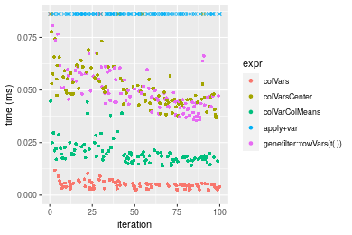

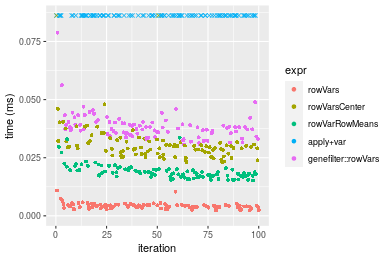
_Table: Benchmarking of colVars() and rowVars() on integer+10x10 data (original and transposed).  The top panel shows times in milliseconds and the bottom panel shows relative times._


|   |expr    |   min|    lq|    mean| median|     uq|    max|
|:--|:-------|-----:|-----:|-------:|------:|------:|------:|
|2  |rowVars | 2.373| 3.516| 4.21787| 4.0805| 4.6895| 10.942|
|1  |colVars | 2.360| 3.156| 4.64975| 4.4535| 5.5355| 11.795|


|   |expr    |       min|        lq|     mean|  median|       uq|      max|
|:--|:-------|---------:|---------:|--------:|-------:|--------:|--------:|
|2  |rowVars | 1.0000000| 1.0000000| 1.000000| 1.00000| 1.000000| 1.000000|
|1  |colVars | 0.9945217| 0.8976109| 1.102393| 1.09141| 1.180403| 1.077956|

_Figure: Benchmarking of colVars() and rowVars() on integer+10x10 data (original and transposed).  Outliers are displayed as crosses. Times are in milliseconds._


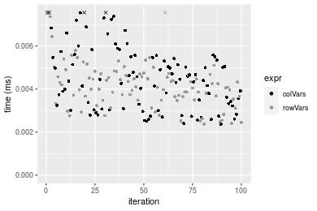

#### 100x100 integer matrix

```r
> X <- data[["100x100"]]
> gc()
           used  (Mb) gc trigger  (Mb) max used  (Mb)
Ncells  5309786 283.6    8529671 455.6  8529671 455.6
Vcells 10247410  78.2   31876688 243.2 60562128 462.1
> colStats <- microbenchmark(colVars = colVars(X, na.rm = FALSE), colVarsCenter = colVars(X, center = colMeans(X, 
+     na.rm = FALSE), na.rm = FALSE), colVarColMeans = colVarColMeans(X, na.rm = FALSE), `apply+var` = apply(X, 
+     MARGIN = 2L, FUN = var, na.rm = FALSE), `genefilter::rowVars(t(.))` = genefilter_colVars(X, na.rm = FALSE), 
+     unit = "ms")
> X <- t(X)
> gc()
           used  (Mb) gc trigger  (Mb) max used  (Mb)
Ncells  5309780 283.6    8529671 455.6  8529671 455.6
Vcells 10252517  78.3   31876688 243.2 60562128 462.1
> rowStats <- microbenchmark(rowVars = rowVars(X, na.rm = FALSE), rowVarsCenter = rowVars(X, center = rowMeans(X, 
+     na.rm = FALSE), na.rm = FALSE), rowVarRowMeans = rowVarRowMeans(X, na.rm = FALSE), `apply+var` = apply(X, 
+     MARGIN = 1L, FUN = var, na.rm = FALSE), `genefilter::rowVars` = genefilter_rowVars(X, na.rm = FALSE), 
+     unit = "ms")
```

_Table: Benchmarking of colVars(), colVarsCenter(), colVarColMeans(), apply+var() and genefilter::rowVars(t(.))() on integer+100x100 data. The top panel shows times in milliseconds and the bottom panel shows relative times._


|   |expr                      |      min|        lq|      mean|    median|        uq|      max|
|:--|:-------------------------|--------:|---------:|---------:|---------:|---------:|--------:|
|1  |colVars                   | 0.038146| 0.0413890| 0.0451367| 0.0432765| 0.0464960| 0.082799|
|3  |colVarColMeans            | 0.060688| 0.0647700| 0.0703947| 0.0689990| 0.0730820| 0.106353|
|5  |genefilter::rowVars(t(.)) | 0.164999| 0.1731930| 0.1896125| 0.1821255| 0.1969555| 0.304063|
|2  |colVarsCenter             | 0.207949| 0.2204515| 0.2433081| 0.2276340| 0.2409900| 0.631655|
|4  |apply+var                 | 0.892923| 0.9234845| 0.9989406| 0.9687440| 1.0103940| 1.495626|


|   |expr                      |       min|        lq|      mean|    median|        uq|       max|
|:--|:-------------------------|---------:|---------:|---------:|---------:|---------:|---------:|
|1  |colVars                   |  1.000000|  1.000000|  1.000000|  1.000000|  1.000000|  1.000000|
|3  |colVarColMeans            |  1.590940|  1.564909|  1.559590|  1.594376|  1.571791|  1.284472|
|5  |genefilter::rowVars(t(.)) |  4.325460|  4.184518|  4.200854|  4.208416|  4.235966|  3.672303|
|2  |colVarsCenter             |  5.451397|  5.326331|  5.390477|  5.259991|  5.183027|  7.628776|
|4  |apply+var                 | 23.408037| 22.312317| 22.131470| 22.384989| 21.730773| 18.063334|

_Table: Benchmarking of rowVars(), rowVarsCenter(), rowVarRowMeans(), apply+var() and genefilter::rowVars() on integer+100x100 data (transposed). The top panel shows times in milliseconds and the bottom panel shows relative times._


|   |expr                |      min|        lq|      mean|    median|        uq|      max|
|:--|:-------------------|--------:|---------:|---------:|---------:|---------:|--------:|
|1  |rowVars             | 0.043003| 0.0454375| 0.0503081| 0.0479315| 0.0539205| 0.097518|
|2  |rowVarsCenter       | 0.099361| 0.1064440| 0.1200966| 0.1105360| 0.1182625| 0.375241|
|3  |rowVarRowMeans      | 0.106450| 0.1109485| 0.1218221| 0.1154390| 0.1221825| 0.205070|
|5  |genefilter::rowVars | 0.147794| 0.1548060| 0.1670031| 0.1617555| 0.1700555| 0.244416|
|4  |apply+var           | 0.885880| 0.9060705| 1.0053500| 0.9554105| 1.0036455| 1.888583|


|   |expr                |       min|        lq|      mean|    median|        uq|       max|
|:--|:-------------------|---------:|---------:|---------:|---------:|---------:|---------:|
|1  |rowVars             |  1.000000|  1.000000|  1.000000|  1.000000|  1.000000|  1.000000|
|2  |rowVarsCenter       |  2.310560|  2.342646|  2.387223|  2.306124|  2.193275|  3.847915|
|3  |rowVarRowMeans      |  2.475409|  2.441783|  2.421522|  2.408416|  2.265975|  2.102894|
|5  |genefilter::rowVars |  3.436830|  3.407010|  3.319607|  3.374722|  3.153819|  2.506368|
|4  |apply+var           | 20.600423| 19.941029| 19.983863| 19.932831| 18.613431| 19.366507|

_Figure: Benchmarking of colVars(), colVarsCenter(), colVarColMeans(), apply+var() and genefilter::rowVars(t(.))() on integer+100x100 data  as well as rowVars(), rowVarsCenter(), rowVarRowMeans(), apply+var() and genefilter::rowVars() on the same data transposed.  Outliers are displayed as crosses.  Times are in milliseconds._


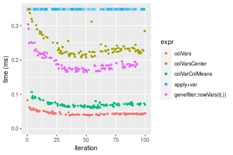

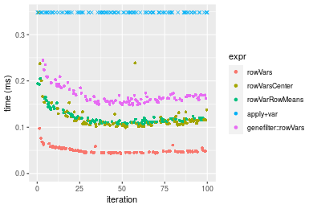
_Table: Benchmarking of colVars() and rowVars() on integer+100x100 data (original and transposed).  The top panel shows times in milliseconds and the bottom panel shows relative times._


|   |expr    |    min|      lq|     mean|  median|      uq|    max|
|:--|:-------|------:|-------:|--------:|-------:|-------:|------:|
|1  |colVars | 38.146| 41.3890| 45.13666| 43.2765| 46.4960| 82.799|
|2  |rowVars | 43.003| 45.4375| 50.30809| 47.9315| 53.9205| 97.518|


|   |expr    |      min|       lq|     mean|   median|      uq|      max|
|:--|:-------|--------:|--------:|--------:|--------:|-------:|--------:|
|1  |colVars | 1.000000| 1.000000| 1.000000| 1.000000| 1.00000| 1.000000|
|2  |rowVars | 1.127327| 1.097816| 1.114573| 1.107564| 1.15968| 1.177768|

_Figure: Benchmarking of colVars() and rowVars() on integer+100x100 data (original and transposed).  Outliers are displayed as crosses. Times are in milliseconds._


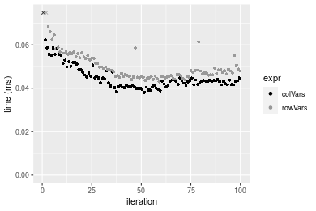

#### 1000x10 integer matrix

```r
> X <- data[["1000x10"]]
> gc()
           used  (Mb) gc trigger  (Mb) max used  (Mb)
Ncells  5310596 283.7    8529671 455.6  8529671 455.6
Vcells 10251685  78.3   31876688 243.2 60562128 462.1
> colStats <- microbenchmark(colVars = colVars(X, na.rm = FALSE), colVarsCenter = colVars(X, center = colMeans(X, 
+     na.rm = FALSE), na.rm = FALSE), colVarColMeans = colVarColMeans(X, na.rm = FALSE), `apply+var` = apply(X, 
+     MARGIN = 2L, FUN = var, na.rm = FALSE), `genefilter::rowVars(t(.))` = genefilter_colVars(X, na.rm = FALSE), 
+     unit = "ms")
> X <- t(X)
> gc()
           used  (Mb) gc trigger  (Mb) max used  (Mb)
Ncells  5310584 283.7    8529671 455.6  8529671 455.6
Vcells 10256782  78.3   31876688 243.2 60562128 462.1
> rowStats <- microbenchmark(rowVars = rowVars(X, na.rm = FALSE), rowVarsCenter = rowVars(X, center = rowMeans(X, 
+     na.rm = FALSE), na.rm = FALSE), rowVarRowMeans = rowVarRowMeans(X, na.rm = FALSE), `apply+var` = apply(X, 
+     MARGIN = 1L, FUN = var, na.rm = FALSE), `genefilter::rowVars` = genefilter_rowVars(X, na.rm = FALSE), 
+     unit = "ms")
```

_Table: Benchmarking of colVars(), colVarsCenter(), colVarColMeans(), apply+var() and genefilter::rowVars(t(.))() on integer+1000x10 data. The top panel shows times in milliseconds and the bottom panel shows relative times._


|   |expr                      |      min|        lq|      mean|    median|        uq|      max|
|:--|:-------------------------|--------:|---------:|---------:|---------:|---------:|--------:|
|1  |colVars                   | 0.037941| 0.0400425| 0.0451982| 0.0430165| 0.0495390| 0.067072|
|3  |colVarColMeans            | 0.058470| 0.0619070| 0.0691308| 0.0662595| 0.0735880| 0.114414|
|2  |colVarsCenter             | 0.135759| 0.1450995| 0.1678398| 0.1544730| 0.1801345| 0.478353|
|4  |apply+var                 | 0.189094| 0.2013655| 0.2262694| 0.2115195| 0.2421755| 0.370089|
|5  |genefilter::rowVars(t(.)) | 0.359036| 0.3675440| 0.4118899| 0.3827155| 0.4625595| 0.604099|


|   |expr                      |      min|       lq|     mean|   median|       uq|      max|
|:--|:-------------------------|--------:|--------:|--------:|--------:|--------:|--------:|
|1  |colVars                   | 1.000000| 1.000000| 1.000000| 1.000000| 1.000000| 1.000000|
|3  |colVarColMeans            | 1.541077| 1.546032| 1.529502| 1.540328| 1.485456| 1.705839|
|2  |colVarsCenter             | 3.578161| 3.623637| 3.713416| 3.591017| 3.636216| 7.131933|
|4  |apply+var                 | 4.983896| 5.028794| 5.006155| 4.917171| 4.888583| 5.517787|
|5  |genefilter::rowVars(t(.)) | 9.463008| 9.178847| 9.112966| 8.896947| 9.337280| 9.006724|

_Table: Benchmarking of rowVars(), rowVarsCenter(), rowVarRowMeans(), apply+var() and genefilter::rowVars() on integer+1000x10 data (transposed). The top panel shows times in milliseconds and the bottom panel shows relative times._


|   |expr                |      min|        lq|      mean|    median|        uq|      max|
|:--|:-------------------|--------:|---------:|---------:|---------:|---------:|--------:|
|1  |rowVars             | 0.043226| 0.0445885| 0.0500476| 0.0455225| 0.0528190| 0.088238|
|2  |rowVarsCenter       | 0.197012| 0.2011390| 0.2271245| 0.2043530| 0.2347250| 0.689770|
|4  |apply+var           | 0.191455| 0.2004800| 0.2195763| 0.2053075| 0.2302720| 0.369756|
|3  |rowVarRowMeans      | 0.302150| 0.3041035| 0.3362109| 0.3064550| 0.3589295| 0.527757|
|5  |genefilter::rowVars | 0.344107| 0.3475805| 0.3767046| 0.3510630| 0.3872640| 0.599410|


|   |expr                |      min|       lq|     mean|   median|       uq|      max|
|:--|:-------------------|--------:|--------:|--------:|--------:|--------:|--------:|
|1  |rowVars             | 1.000000| 1.000000| 1.000000| 1.000000| 1.000000| 1.000000|
|2  |rowVarsCenter       | 4.557720| 4.511006| 4.538171| 4.489055| 4.443950| 7.817154|
|4  |apply+var           | 4.429163| 4.496227| 4.387351| 4.510022| 4.359643| 4.190440|
|3  |rowVarRowMeans      | 6.990006| 6.820223| 6.717823| 6.731946| 6.795462| 5.981063|
|5  |genefilter::rowVars | 7.960649| 7.795295| 7.526928| 7.711857| 7.331907| 6.793105|

_Figure: Benchmarking of colVars(), colVarsCenter(), colVarColMeans(), apply+var() and genefilter::rowVars(t(.))() on integer+1000x10 data  as well as rowVars(), rowVarsCenter(), rowVarRowMeans(), apply+var() and genefilter::rowVars() on the same data transposed.  Outliers are displayed as crosses.  Times are in milliseconds._


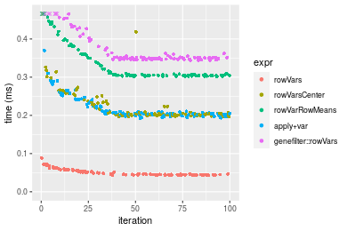
_Table: Benchmarking of colVars() and rowVars() on integer+1000x10 data (original and transposed).  The top panel shows times in milliseconds and the bottom panel shows relative times._


|   |expr    |    min|      lq|     mean|  median|     uq|    max|
|:--|:-------|------:|-------:|--------:|-------:|------:|------:|
|1  |colVars | 37.941| 40.0425| 45.19823| 43.0165| 49.539| 67.072|
|2  |rowVars | 43.226| 44.5885| 50.04759| 45.5225| 52.819| 88.238|


|   |expr    |      min|       lq|     mean|   median|      uq|      max|
|:--|:-------|--------:|--------:|--------:|--------:|-------:|--------:|
|1  |colVars | 1.000000| 1.000000| 1.000000| 1.000000| 1.00000| 1.000000|
|2  |rowVars | 1.139295| 1.113529| 1.107291| 1.058257| 1.06621| 1.315571|

_Figure: Benchmarking of colVars() and rowVars() on integer+1000x10 data (original and transposed).  Outliers are displayed as crosses. Times are in milliseconds._


#### 10x1000 integer matrix

```r
> X <- data[["10x1000"]]
> gc()
           used  (Mb) gc trigger  (Mb) max used  (Mb)
Ncells  5310831 283.7    8529671 455.6  8529671 455.6
Vcells 10252708  78.3   31876688 243.2 60562128 462.1
> colStats <- microbenchmark(colVars = colVars(X, na.rm = FALSE), colVarsCenter = colVars(X, center = colMeans(X, 
+     na.rm = FALSE), na.rm = FALSE), colVarColMeans = colVarColMeans(X, na.rm = FALSE), `apply+var` = apply(X, 
+     MARGIN = 2L, FUN = var, na.rm = FALSE), `genefilter::rowVars(t(.))` = genefilter_colVars(X, na.rm = FALSE), 
+     unit = "ms")
> X <- t(X)
> gc()
           used  (Mb) gc trigger  (Mb) max used  (Mb)
Ncells  5310825 283.7    8529671 455.6  8529671 455.6
Vcells 10257815  78.3   31876688 243.2 60562128 462.1
> rowStats <- microbenchmark(rowVars = rowVars(X, na.rm = FALSE), rowVarsCenter = rowVars(X, center = rowMeans(X, 
+     na.rm = FALSE), na.rm = FALSE), rowVarRowMeans = rowVarRowMeans(X, na.rm = FALSE), `apply+var` = apply(X, 
+     MARGIN = 1L, FUN = var, na.rm = FALSE), `genefilter::rowVars` = genefilter_rowVars(X, na.rm = FALSE), 
+     unit = "ms")
```

_Table: Benchmarking of colVars(), colVarsCenter(), colVarColMeans(), apply+var() and genefilter::rowVars(t(.))() on integer+10x1000 data. The top panel shows times in milliseconds and the bottom panel shows relative times._


|   |expr                      |      min|       lq|      mean|    median|        uq|       max|
|:--|:-------------------------|--------:|--------:|---------:|---------:|---------:|---------:|
|1  |colVars                   | 0.040310| 0.044805| 0.0484361| 0.0473075| 0.0506900|  0.084852|
|3  |colVarColMeans            | 0.069532| 0.077210| 0.0831507| 0.0821375| 0.0868505|  0.140173|
|5  |genefilter::rowVars(t(.)) | 0.160276| 0.176805| 0.1919223| 0.1864665| 0.2021215|  0.278555|
|2  |colVarsCenter             | 0.842742| 0.926340| 1.0948278| 0.9689705| 1.0150505|  7.110711|
|4  |apply+var                 | 7.727900| 8.404078| 8.8476474| 8.6144495| 8.8371020| 15.560164|


|   |expr                      |        min|         lq|       mean|     median|         uq|        max|
|:--|:-------------------------|----------:|----------:|----------:|----------:|----------:|----------:|
|1  |colVars                   |   1.000000|   1.000000|   1.000000|   1.000000|   1.000000|   1.000000|
|3  |colVarColMeans            |   1.724932|   1.723245|   1.716710|   1.736247|   1.713366|   1.651971|
|5  |genefilter::rowVars(t(.)) |   3.976085|   3.946100|   3.962384|   3.941584|   3.987404|   3.282834|
|2  |colVarsCenter             |  20.906524|  20.674925|  22.603563|  20.482387|  20.024670|  83.801336|
|4  |apply+var                 | 191.711734| 187.570093| 182.666500| 182.094795| 174.336200| 183.380050|

_Table: Benchmarking of rowVars(), rowVarsCenter(), rowVarRowMeans(), apply+var() and genefilter::rowVars() on integer+10x1000 data (transposed). The top panel shows times in milliseconds and the bottom panel shows relative times._


|   |expr                |      min|        lq|      mean|    median|        uq|       max|
|:--|:-------------------|--------:|---------:|---------:|---------:|---------:|---------:|
|1  |rowVars             | 0.040909| 0.0458035| 0.0484437| 0.0475970| 0.0501660|  0.066115|
|3  |rowVarRowMeans      | 0.095888| 0.1040220| 0.1109857| 0.1077580| 0.1139725|  0.239718|
|2  |rowVarsCenter       | 0.097298| 0.1112460| 0.1246629| 0.1185145| 0.1297625|  0.277787|
|5  |genefilter::rowVars | 0.139836| 0.1540495| 0.1672120| 0.1605695| 0.1722090|  0.283510|
|4  |apply+var           | 7.679890| 8.2745725| 9.0351688| 8.6155415| 8.9748085| 25.272514|


|   |expr                |        min|         lq|       mean|     median|         uq|        max|
|:--|:-------------------|----------:|----------:|----------:|----------:|----------:|----------:|
|1  |rowVars             |   1.000000|   1.000000|   1.000000|   1.000000|   1.000000|   1.000000|
|3  |rowVarRowMeans      |   2.343934|   2.271049|   2.291026|   2.263966|   2.271907|   3.625773|
|2  |rowVarsCenter       |   2.378401|   2.428766|   2.573358|   2.489957|   2.586662|   4.201573|
|5  |genefilter::rowVars |   3.418221|   3.363269|   3.451678|   3.373521|   3.432783|   4.288134|
|4  |apply+var           | 187.731062| 180.653716| 186.508759| 181.010179| 178.902215| 382.250836|

_Figure: Benchmarking of colVars(), colVarsCenter(), colVarColMeans(), apply+var() and genefilter::rowVars(t(.))() on integer+10x1000 data  as well as rowVars(), rowVarsCenter(), rowVarRowMeans(), apply+var() and genefilter::rowVars() on the same data transposed.  Outliers are displayed as crosses.  Times are in milliseconds._


_Table: Benchmarking of colVars() and rowVars() on integer+10x1000 data (original and transposed).  The top panel shows times in milliseconds and the bottom panel shows relative times._


|   |expr    |    min|      lq|     mean|  median|     uq|    max|
|:--|:-------|------:|-------:|--------:|-------:|------:|------:|
|1  |colVars | 40.310| 44.8050| 48.43607| 47.3075| 50.690| 84.852|
|2  |rowVars | 40.909| 45.8035| 48.44367| 47.5970| 50.166| 66.115|


|   |expr    |     min|       lq|     mean|  median|        uq|       max|
|:--|:-------|-------:|--------:|--------:|-------:|---------:|---------:|
|1  |colVars | 1.00000| 1.000000| 1.000000| 1.00000| 1.0000000| 1.0000000|
|2  |rowVars | 1.01486| 1.022285| 1.000157| 1.00612| 0.9896627| 0.7791802|

_Figure: Benchmarking of colVars() and rowVars() on integer+10x1000 data (original and transposed).  Outliers are displayed as crosses. Times are in milliseconds._


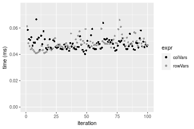

#### 100x1000 integer matrix

```r
> X <- data[["100x1000"]]
> gc()
           used  (Mb) gc trigger  (Mb) max used  (Mb)
Ncells  5311079 283.7    8529671 455.6  8529671 455.6
Vcells 10253445  78.3   31876688 243.2 60562128 462.1
> colStats <- microbenchmark(colVars = colVars(X, na.rm = FALSE), colVarsCenter = colVars(X, center = colMeans(X, 
+     na.rm = FALSE), na.rm = FALSE), colVarColMeans = colVarColMeans(X, na.rm = FALSE), `apply+var` = apply(X, 
+     MARGIN = 2L, FUN = var, na.rm = FALSE), `genefilter::rowVars(t(.))` = genefilter_colVars(X, na.rm = FALSE), 
+     unit = "ms")
> X <- t(X)
> gc()
           used  (Mb) gc trigger  (Mb) max used  (Mb)
Ncells  5311067 283.7    8529671 455.6  8529671 455.6
Vcells 10303542  78.7   31876688 243.2 60562128 462.1
> rowStats <- microbenchmark(rowVars = rowVars(X, na.rm = FALSE), rowVarsCenter = rowVars(X, center = rowMeans(X, 
+     na.rm = FALSE), na.rm = FALSE), rowVarRowMeans = rowVarRowMeans(X, na.rm = FALSE), `apply+var` = apply(X, 
+     MARGIN = 1L, FUN = var, na.rm = FALSE), `genefilter::rowVars` = genefilter_rowVars(X, na.rm = FALSE), 
+     unit = "ms")
```

_Table: Benchmarking of colVars(), colVarsCenter(), colVarColMeans(), apply+var() and genefilter::rowVars(t(.))() on integer+100x1000 data. The top panel shows times in milliseconds and the bottom panel shows relative times._


|   |expr                      |      min|        lq|       mean|    median|        uq|       max|
|:--|:-------------------------|--------:|---------:|----------:|---------:|---------:|---------:|
|1  |colVars                   | 0.370829| 0.4085235|  0.4195262| 0.4157715|  0.426228|  0.519336|
|3  |colVarColMeans            | 0.503366| 0.5655590|  0.5905095| 0.5838090|  0.601591|  0.780460|
|5  |genefilter::rowVars(t(.)) | 1.270763| 1.3460095|  1.7212105| 1.3984925|  1.446581| 16.919878|
|2  |colVarsCenter             | 1.914315| 2.0718710|  2.1389776| 2.1026925|  2.151651|  3.248097|
|4  |apply+var                 | 8.841118| 9.6817635| 10.4105899| 9.8669370| 10.065778| 25.771648|


|   |expr                      |       min|        lq|      mean|    median|        uq|       max|
|:--|:-------------------------|---------:|---------:|---------:|---------:|---------:|---------:|
|1  |colVars                   |  1.000000|  1.000000|  1.000000|  1.000000|  1.000000|  1.000000|
|3  |colVarColMeans            |  1.357407|  1.384398|  1.407563|  1.404158|  1.411430|  1.502804|
|5  |genefilter::rowVars(t(.)) |  3.426817|  3.294815|  4.102748|  3.363608|  3.393914| 32.579829|
|2  |colVarsCenter             |  5.162258|  5.071608|  5.098555|  5.057327|  5.048121|  6.254327|
|4  |apply+var                 | 23.841496| 23.699404| 24.815110| 23.731634| 23.615947| 49.624228|

_Table: Benchmarking of rowVars(), rowVarsCenter(), rowVarRowMeans(), apply+var() and genefilter::rowVars() on integer+100x1000 data (transposed). The top panel shows times in milliseconds and the bottom panel shows relative times._


|   |expr                |      min|        lq|       mean|    median|         uq|       max|
|:--|:-------------------|--------:|---------:|----------:|---------:|----------:|---------:|
|1  |rowVars             | 0.418112| 0.4630555|  0.4845348| 0.4746995|  0.4897880|  0.916874|
|2  |rowVarsCenter       | 0.740568| 0.8279065|  0.8805668| 0.8497355|  0.8723015|  1.988345|
|3  |rowVarRowMeans      | 0.773923| 0.8634255|  0.8888374| 0.8765830|  0.8993800|  1.268610|
|5  |genefilter::rowVars | 1.173905| 1.2380160|  1.3416203| 1.2660140|  1.3133850|  2.995484|
|4  |apply+var           | 8.836777| 9.7173340| 10.4228695| 9.8858500| 10.0527290| 23.224188|


|   |expr                |       min|        lq|      mean|    median|        uq|       max|
|:--|:-------------------|---------:|---------:|---------:|---------:|---------:|---------:|
|1  |rowVars             |  1.000000|  1.000000|  1.000000|  1.000000|  1.000000|  1.000000|
|2  |rowVarsCenter       |  1.771219|  1.787921|  1.817345|  1.790049|  1.780978|  2.168613|
|3  |rowVarRowMeans      |  1.850995|  1.864626|  1.834414|  1.846606|  1.836264|  1.383625|
|5  |genefilter::rowVars |  2.807633|  2.673580|  2.768883|  2.666980|  2.681538|  3.267062|
|4  |apply+var           | 21.134952| 20.985247| 21.511084| 20.825491| 20.524653| 25.329749|

_Figure: Benchmarking of colVars(), colVarsCenter(), colVarColMeans(), apply+var() and genefilter::rowVars(t(.))() on integer+100x1000 data  as well as rowVars(), rowVarsCenter(), rowVarRowMeans(), apply+var() and genefilter::rowVars() on the same data transposed.  Outliers are displayed as crosses.  Times are in milliseconds._


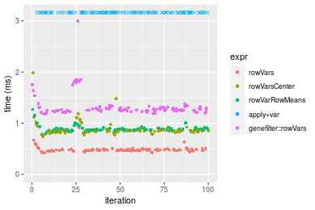
_Table: Benchmarking of colVars() and rowVars() on integer+100x1000 data (original and transposed).  The top panel shows times in milliseconds and the bottom panel shows relative times._


|   |expr    |     min|       lq|     mean|   median|      uq|     max|
|:--|:-------|-------:|--------:|--------:|--------:|-------:|-------:|
|1  |colVars | 370.829| 408.5235| 419.5262| 415.7715| 426.228| 519.336|
|2  |rowVars | 418.112| 463.0555| 484.5348| 474.6995| 489.788| 916.874|


|   |expr    |      min|       lq|     mean|   median|       uq|      max|
|:--|:-------|--------:|--------:|--------:|--------:|--------:|--------:|
|1  |colVars | 1.000000| 1.000000| 1.000000| 1.000000| 1.000000| 1.000000|
|2  |rowVars | 1.127506| 1.133486| 1.154957| 1.141732| 1.149122| 1.765474|

_Figure: Benchmarking of colVars() and rowVars() on integer+100x1000 data (original and transposed).  Outliers are displayed as crosses. Times are in milliseconds._


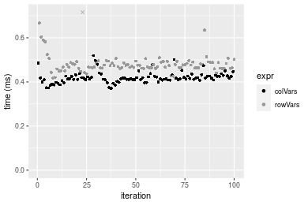

#### 1000x100 integer matrix

```r
> X <- data[["1000x100"]]
> gc()
           used  (Mb) gc trigger  (Mb) max used  (Mb)
Ncells  5311322 283.7    8529671 455.6  8529671 455.6
Vcells 10254291  78.3   31876688 243.2 60562128 462.1
> colStats <- microbenchmark(colVars = colVars(X, na.rm = FALSE), colVarsCenter = colVars(X, center = colMeans(X, 
+     na.rm = FALSE), na.rm = FALSE), colVarColMeans = colVarColMeans(X, na.rm = FALSE), `apply+var` = apply(X, 
+     MARGIN = 2L, FUN = var, na.rm = FALSE), `genefilter::rowVars(t(.))` = genefilter_colVars(X, na.rm = FALSE), 
+     unit = "ms")
> X <- t(X)
> gc()
           used  (Mb) gc trigger  (Mb) max used  (Mb)
Ncells  5311310 283.7    8529671 455.6  8529671 455.6
Vcells 10304388  78.7   31876688 243.2 60562128 462.1
> rowStats <- microbenchmark(rowVars = rowVars(X, na.rm = FALSE), rowVarsCenter = rowVars(X, center = rowMeans(X, 
+     na.rm = FALSE), na.rm = FALSE), rowVarRowMeans = rowVarRowMeans(X, na.rm = FALSE), `apply+var` = apply(X, 
+     MARGIN = 1L, FUN = var, na.rm = FALSE), `genefilter::rowVars` = genefilter_rowVars(X, na.rm = FALSE), 
+     unit = "ms")
```

_Table: Benchmarking of colVars(), colVarsCenter(), colVarColMeans(), apply+var() and genefilter::rowVars(t(.))() on integer+1000x100 data. The top panel shows times in milliseconds and the bottom panel shows relative times._


|   |expr                      |      min|        lq|      mean|    median|        uq|       max|
|:--|:-------------------------|--------:|---------:|---------:|---------:|---------:|---------:|
|1  |colVars                   | 0.363207| 0.4007100| 0.4253631| 0.4098655| 0.4388995|  0.861742|
|3  |colVarColMeans            | 0.482134| 0.5276105| 0.5627123| 0.5550705| 0.5885535|  0.783706|
|2  |colVarsCenter             | 1.132922| 1.2575280| 1.3980389| 1.3109680| 1.3451710|  8.618698|
|5  |genefilter::rowVars(t(.)) | 1.370261| 1.4955900| 1.6599965| 1.5673965| 1.6268775|  9.540546|
|4  |apply+var                 | 1.737615| 1.9083930| 2.1507354| 1.9615955| 2.0303695| 10.291710|


|   |expr                      |      min|       lq|     mean|   median|       uq|        max|
|:--|:-------------------------|--------:|--------:|--------:|--------:|--------:|----------:|
|1  |colVars                   | 1.000000| 1.000000| 1.000000| 1.000000| 1.000000|  1.0000000|
|3  |colVarColMeans            | 1.327436| 1.316689| 1.322899| 1.354275| 1.340976|  0.9094439|
|2  |colVarsCenter             | 3.119219| 3.138250| 3.286695| 3.198532| 3.064872| 10.0014830|
|5  |genefilter::rowVars(t(.)) | 3.772672| 3.732350| 3.902540| 3.824173| 3.706720| 11.0712325|
|4  |apply+var                 | 4.784090| 4.762529| 5.056234| 4.785949| 4.626047| 11.9429133|

_Table: Benchmarking of rowVars(), rowVarsCenter(), rowVarRowMeans(), apply+var() and genefilter::rowVars() on integer+1000x100 data (transposed). The top panel shows times in milliseconds and the bottom panel shows relative times._


|   |expr                |      min|        lq|      mean|    median|       uq|      max|
|:--|:-------------------|--------:|---------:|---------:|---------:|--------:|--------:|
|1  |rowVars             | 0.417132| 0.4528270| 0.4700069| 0.4648665| 0.472382| 0.978441|
|2  |rowVarsCenter       | 0.848116| 0.9121935| 0.9626401| 0.9328475| 0.961714| 1.944915|
|3  |rowVarRowMeans      | 0.963181| 1.0461160| 1.0901473| 1.0766520| 1.107744| 1.699706|
|5  |genefilter::rowVars | 1.266613| 1.4009005| 1.5936395| 1.4462570| 1.475210| 8.766786|
|4  |apply+var           | 1.775390| 1.9011820| 2.0848153| 1.9612635| 2.045497| 9.556229|


|   |expr                |      min|       lq|     mean|   median|       uq|      max|
|:--|:-------------------|--------:|--------:|--------:|--------:|--------:|--------:|
|1  |rowVars             | 1.000000| 1.000000| 1.000000| 1.000000| 1.000000| 1.000000|
|2  |rowVarsCenter       | 2.033208| 2.014442| 2.048140| 2.006700| 2.035882| 1.987769|
|3  |rowVarRowMeans      | 2.309056| 2.310189| 2.319428| 2.316046| 2.345017| 1.737157|
|5  |genefilter::rowVars | 3.036480| 3.093677| 3.390672| 3.111123| 3.122916| 8.959954|
|4  |apply+var           | 4.256183| 4.198473| 4.435712| 4.218982| 4.330176| 9.766791|

_Figure: Benchmarking of colVars(), colVarsCenter(), colVarColMeans(), apply+var() and genefilter::rowVars(t(.))() on integer+1000x100 data  as well as rowVars(), rowVarsCenter(), rowVarRowMeans(), apply+var() and genefilter::rowVars() on the same data transposed.  Outliers are displayed as crosses.  Times are in milliseconds._


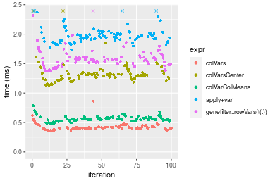

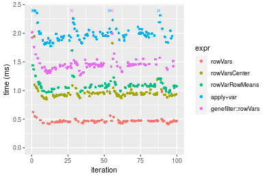
_Table: Benchmarking of colVars() and rowVars() on integer+1000x100 data (original and transposed).  The top panel shows times in milliseconds and the bottom panel shows relative times._


|   |expr    |     min|      lq|     mean|   median|       uq|     max|
|:--|:-------|-------:|-------:|--------:|--------:|--------:|-------:|
|1  |colVars | 363.207| 400.710| 425.3631| 409.8655| 438.8995| 861.742|
|2  |rowVars | 417.132| 452.827| 470.0069| 464.8665| 472.3820| 978.441|


|   |expr    |      min|       lq|     mean|   median|       uq|      max|
|:--|:-------|--------:|--------:|--------:|--------:|--------:|--------:|
|1  |colVars | 1.000000| 1.000000| 1.000000| 1.000000| 1.000000| 1.000000|
|2  |rowVars | 1.148469| 1.130062| 1.104955| 1.134193| 1.076287| 1.135422|

_Figure: Benchmarking of colVars() and rowVars() on integer+1000x100 data (original and transposed).  Outliers are displayed as crosses. Times are in milliseconds._


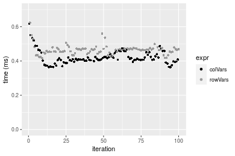


## Data type "double"

### Data
```r
> rmatrix <- function(nrow, ncol, mode = c("logical", "double", "integer", "index"), range = c(-100, 
+     +100), na_prob = 0) {
+     mode <- match.arg(mode)
+     n <- nrow * ncol
+     if (mode == "logical") {
+         x <- sample(c(FALSE, TRUE), size = n, replace = TRUE)
+     }     else if (mode == "index") {
+         x <- seq_len(n)
+         mode <- "integer"
+     }     else {
+         x <- runif(n, min = range[1], max = range[2])
+     }
+     storage.mode(x) <- mode
+     if (na_prob > 0) 
+         x[sample(n, size = na_prob * n)] <- NA
+     dim(x) <- c(nrow, ncol)
+     x
+ }
> rmatrices <- function(scale = 10, seed = 1, ...) {
+     set.seed(seed)
+     data <- list()
+     data[[1]] <- rmatrix(nrow = scale * 1, ncol = scale * 1, ...)
+     data[[2]] <- rmatrix(nrow = scale * 10, ncol = scale * 10, ...)
+     data[[3]] <- rmatrix(nrow = scale * 100, ncol = scale * 1, ...)
+     data[[4]] <- t(data[[3]])
+     data[[5]] <- rmatrix(nrow = scale * 10, ncol = scale * 100, ...)
+     data[[6]] <- t(data[[5]])
+     names(data) <- sapply(data, FUN = function(x) paste(dim(x), collapse = "x"))
+     data
+ }
> data <- rmatrices(mode = mode)
```

### Results

#### 10x10 double matrix

```r
> X <- data[["10x10"]]
> gc()
           used  (Mb) gc trigger  (Mb) max used  (Mb)
Ncells  5311574 283.7    8529671 455.6  8529671 455.6
Vcells 10370330  79.2   31876688 243.2 60562128 462.1
> colStats <- microbenchmark(colVars = colVars(X, na.rm = FALSE), colVarsCenter = colVars(X, center = colMeans(X, 
+     na.rm = FALSE), na.rm = FALSE), colVarColMeans = colVarColMeans(X, na.rm = FALSE), `apply+var` = apply(X, 
+     MARGIN = 2L, FUN = var, na.rm = FALSE), `genefilter::rowVars(t(.))` = genefilter_colVars(X, na.rm = FALSE), 
+     unit = "ms")
> X <- t(X)
> gc()
           used  (Mb) gc trigger  (Mb) max used  (Mb)
Ncells  5311559 283.7    8529671 455.6  8529671 455.6
Vcells 10370522  79.2   31876688 243.2 60562128 462.1
> rowStats <- microbenchmark(rowVars = rowVars(X, na.rm = FALSE), rowVarsCenter = rowVars(X, center = rowMeans(X, 
+     na.rm = FALSE), na.rm = FALSE), rowVarRowMeans = rowVarRowMeans(X, na.rm = FALSE), `apply+var` = apply(X, 
+     MARGIN = 1L, FUN = var, na.rm = FALSE), `genefilter::rowVars` = genefilter_rowVars(X, na.rm = FALSE), 
+     unit = "ms")
```

_Table: Benchmarking of colVars(), colVarsCenter(), colVarColMeans(), apply+var() and genefilter::rowVars(t(.))() on double+10x10 data. The top panel shows times in milliseconds and the bottom panel shows relative times._


|   |expr                      |      min|        lq|      mean|    median|        uq|      max|
|:--|:-------------------------|--------:|---------:|---------:|---------:|---------:|--------:|
|1  |colVars                   | 0.002324| 0.0030675| 0.0042399| 0.0042840| 0.0049775| 0.011146|
|3  |colVarColMeans            | 0.013662| 0.0156890| 0.0181517| 0.0171560| 0.0196865| 0.064575|
|5  |genefilter::rowVars(t(.)) | 0.034680| 0.0399530| 0.0445390| 0.0429920| 0.0477220| 0.106259|
|2  |colVarsCenter             | 0.035354| 0.0429560| 0.0488164| 0.0454875| 0.0519625| 0.175900|
|4  |apply+var                 | 0.118836| 0.1294370| 0.1399149| 0.1370680| 0.1471245| 0.212091|


|   |expr                      |       min|        lq|      mean|    median|        uq|       max|
|:--|:-------------------------|---------:|---------:|---------:|---------:|---------:|---------:|
|1  |colVars                   |  1.000000|  1.000000|  1.000000|  1.000000|  1.000000|  1.000000|
|3  |colVarColMeans            |  5.878658|  5.114588|  4.281139|  4.004669|  3.955098|  5.793558|
|5  |genefilter::rowVars(t(.)) | 14.922547| 13.024613| 10.504657| 10.035481|  9.587544|  9.533375|
|2  |colVarsCenter             | 15.212564| 14.003586| 11.513483| 10.617997| 10.439478| 15.781446|
|4  |apply+var                 | 51.134251| 42.196251| 32.999347| 31.995331| 29.557911| 19.028441|

_Table: Benchmarking of rowVars(), rowVarsCenter(), rowVarRowMeans(), apply+var() and genefilter::rowVars() on double+10x10 data (transposed). The top panel shows times in milliseconds and the bottom panel shows relative times._


|   |expr                |      min|        lq|      mean|    median|        uq|      max|
|:--|:-------------------|--------:|---------:|---------:|---------:|---------:|--------:|
|1  |rowVars             | 0.002332| 0.0035340| 0.0041633| 0.0040995| 0.0046600| 0.011632|
|3  |rowVarRowMeans      | 0.012076| 0.0138485| 0.0153650| 0.0151250| 0.0164810| 0.025843|
|2  |rowVarsCenter       | 0.021286| 0.0258045| 0.0306393| 0.0278605| 0.0306815| 0.165175|
|5  |genefilter::rowVars | 0.029458| 0.0334900| 0.0366212| 0.0359425| 0.0386085| 0.075654|
|4  |apply+var           | 0.120389| 0.1268535| 0.1391906| 0.1366650| 0.1447080| 0.245290|


|   |expr                |       min|        lq|      mean|    median|        uq|       max|
|:--|:-------------------|---------:|---------:|---------:|---------:|---------:|---------:|
|1  |rowVars             |  1.000000|  1.000000|  1.000000|  1.000000|  1.000000|  1.000000|
|3  |rowVarRowMeans      |  5.178388|  3.918647|  3.690571|  3.689474|  3.536695|  2.221716|
|2  |rowVarsCenter       |  9.127787|  7.301783|  7.359341|  6.796073|  6.584013| 14.200052|
|5  |genefilter::rowVars | 12.632075|  9.476514|  8.796158|  8.767533|  8.285086|  6.503955|
|4  |apply+var           | 51.624786| 35.895161| 33.432585| 33.336992| 31.053219| 21.087517|

_Figure: Benchmarking of colVars(), colVarsCenter(), colVarColMeans(), apply+var() and genefilter::rowVars(t(.))() on double+10x10 data  as well as rowVars(), rowVarsCenter(), rowVarRowMeans(), apply+var() and genefilter::rowVars() on the same data transposed.  Outliers are displayed as crosses.  Times are in milliseconds._


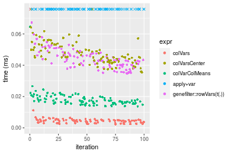

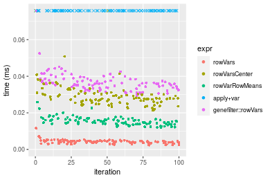
_Table: Benchmarking of colVars() and rowVars() on double+10x10 data (original and transposed).  The top panel shows times in milliseconds and the bottom panel shows relative times._


|   |expr    |   min|     lq|    mean| median|     uq|    max|
|:--|:-------|-----:|------:|-------:|------:|------:|------:|
|2  |rowVars | 2.332| 3.5340| 4.16332| 4.0995| 4.6600| 11.632|
|1  |colVars | 2.324| 3.0675| 4.23993| 4.2840| 4.9775| 11.146|


|   |expr    |       min|        lq|     mean|   median|       uq|       max|
|:--|:-------|---------:|---------:|--------:|--------:|--------:|---------:|
|2  |rowVars | 1.0000000| 1.0000000| 1.000000| 1.000000| 1.000000| 1.0000000|
|1  |colVars | 0.9965695| 0.8679966| 1.018401| 1.045006| 1.068133| 0.9582187|

_Figure: Benchmarking of colVars() and rowVars() on double+10x10 data (original and transposed).  Outliers are displayed as crosses. Times are in milliseconds._


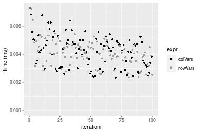

#### 100x100 double matrix

```r
> X <- data[["100x100"]]
> gc()
           used  (Mb) gc trigger  (Mb) max used  (Mb)
Ncells  5311790 283.7    8529671 455.6  8529671 455.6
Vcells 10371438  79.2   31876688 243.2 60562128 462.1
> colStats <- microbenchmark(colVars = colVars(X, na.rm = FALSE), colVarsCenter = colVars(X, center = colMeans(X, 
+     na.rm = FALSE), na.rm = FALSE), colVarColMeans = colVarColMeans(X, na.rm = FALSE), `apply+var` = apply(X, 
+     MARGIN = 2L, FUN = var, na.rm = FALSE), `genefilter::rowVars(t(.))` = genefilter_colVars(X, na.rm = FALSE), 
+     unit = "ms")
> X <- t(X)
> gc()
           used  (Mb) gc trigger  (Mb) max used  (Mb)
Ncells  5311793 283.7    8529671 455.6  8529671 455.6
Vcells 10381560  79.3   31876688 243.2 60562128 462.1
> rowStats <- microbenchmark(rowVars = rowVars(X, na.rm = FALSE), rowVarsCenter = rowVars(X, center = rowMeans(X, 
+     na.rm = FALSE), na.rm = FALSE), rowVarRowMeans = rowVarRowMeans(X, na.rm = FALSE), `apply+var` = apply(X, 
+     MARGIN = 1L, FUN = var, na.rm = FALSE), `genefilter::rowVars` = genefilter_rowVars(X, na.rm = FALSE), 
+     unit = "ms")
```

_Table: Benchmarking of colVars(), colVarsCenter(), colVarColMeans(), apply+var() and genefilter::rowVars(t(.))() on double+100x100 data. The top panel shows times in milliseconds and the bottom panel shows relative times._


|   |expr                      |      min|        lq|      mean|    median|        uq|      max|
|:--|:-------------------------|--------:|---------:|---------:|---------:|---------:|--------:|
|3  |colVarColMeans            | 0.034550| 0.0376165| 0.0403220| 0.0394090| 0.0417280| 0.054983|
|1  |colVars                   | 0.038112| 0.0407025| 0.0448693| 0.0430195| 0.0467095| 0.080185|
|5  |genefilter::rowVars(t(.)) | 0.154983| 0.1632025| 0.1801385| 0.1692275| 0.1896000| 0.302693|
|2  |colVarsCenter             | 0.180966| 0.1930835| 0.2117339| 0.1990085| 0.2079165| 0.535319|
|4  |apply+var                 | 0.878946| 0.9064145| 0.9826759| 0.9481085| 0.9967995| 1.483164|


|   |expr                      |       min|        lq|      mean|    median|        uq|       max|
|:--|:-------------------------|---------:|---------:|---------:|---------:|---------:|---------:|
|3  |colVarColMeans            |  1.000000|  1.000000|  1.000000|  1.000000|  1.000000|  1.000000|
|1  |colVars                   |  1.103097|  1.082038|  1.112776|  1.091616|  1.119380|  1.458360|
|5  |genefilter::rowVars(t(.)) |  4.485760|  4.338588|  4.467501|  4.294133|  4.543712|  5.505211|
|2  |colVarsCenter             |  5.237800|  5.132947|  5.251080|  5.049824|  4.982661|  9.736082|
|4  |apply+var                 | 25.439826| 24.096194| 24.370726| 24.058172| 23.888025| 26.974956|

_Table: Benchmarking of rowVars(), rowVarsCenter(), rowVarRowMeans(), apply+var() and genefilter::rowVars() on double+100x100 data (transposed). The top panel shows times in milliseconds and the bottom panel shows relative times._


|   |expr                |      min|        lq|      mean|    median|        uq|      max|
|:--|:-------------------|--------:|---------:|---------:|---------:|---------:|--------:|
|1  |rowVars             | 0.038347| 0.0411570| 0.0455176| 0.0431400| 0.0486570| 0.066723|
|3  |rowVarRowMeans      | 0.065138| 0.0675215| 0.0733791| 0.0696150| 0.0756715| 0.121582|
|2  |rowVarsCenter       | 0.088767| 0.0943445| 0.1055336| 0.0981400| 0.1079580| 0.314286|
|5  |genefilter::rowVars | 0.138098| 0.1439415| 0.1558099| 0.1496205| 0.1607345| 0.234906|
|4  |apply+var           | 0.880335| 0.9126775| 0.9974756| 0.9485235| 1.0044210| 1.532095|


|   |expr                |       min|        lq|      mean|    median|        uq|       max|
|:--|:-------------------|---------:|---------:|---------:|---------:|---------:|---------:|
|1  |rowVars             |  1.000000|  1.000000|  1.000000|  1.000000|  1.000000|  1.000000|
|3  |rowVarRowMeans      |  1.698647|  1.640584|  1.612103|  1.613700|  1.555203|  1.822190|
|2  |rowVarsCenter       |  2.314836|  2.292308|  2.318522|  2.274919|  2.218756|  4.710310|
|5  |genefilter::rowVars |  3.601273|  3.497376|  3.423068|  3.468255|  3.303420|  3.520615|
|4  |apply+var           | 22.957076| 22.175511| 21.914055| 21.987100| 20.642888| 22.962022|

_Figure: Benchmarking of colVars(), colVarsCenter(), colVarColMeans(), apply+var() and genefilter::rowVars(t(.))() on double+100x100 data  as well as rowVars(), rowVarsCenter(), rowVarRowMeans(), apply+var() and genefilter::rowVars() on the same data transposed.  Outliers are displayed as crosses.  Times are in milliseconds._


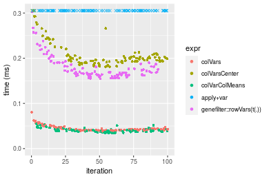

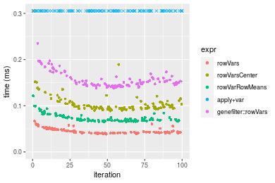
_Table: Benchmarking of colVars() and rowVars() on double+100x100 data (original and transposed).  The top panel shows times in milliseconds and the bottom panel shows relative times._


|   |expr    |    min|      lq|     mean|  median|      uq|    max|
|:--|:-------|------:|-------:|--------:|-------:|-------:|------:|
|1  |colVars | 38.112| 40.7025| 44.86932| 43.0195| 46.7095| 80.185|
|2  |rowVars | 38.347| 41.1570| 45.51762| 43.1400| 48.6570| 66.723|


|   |expr    |      min|       lq|     mean|   median|       uq|       max|
|:--|:-------|--------:|--------:|--------:|--------:|--------:|---------:|
|1  |colVars | 1.000000| 1.000000| 1.000000| 1.000000| 1.000000| 1.0000000|
|2  |rowVars | 1.006166| 1.011166| 1.014449| 1.002801| 1.041694| 0.8321132|

_Figure: Benchmarking of colVars() and rowVars() on double+100x100 data (original and transposed).  Outliers are displayed as crosses. Times are in milliseconds._


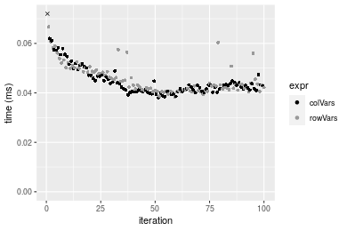

#### 1000x10 double matrix

```r
> X <- data[["1000x10"]]
> gc()
           used  (Mb) gc trigger  (Mb) max used  (Mb)
Ncells  5312056 283.7    8529671 455.6  8529671 455.6
Vcells 10372817  79.2   31876688 243.2 60562128 462.1
> colStats <- microbenchmark(colVars = colVars(X, na.rm = FALSE), colVarsCenter = colVars(X, center = colMeans(X, 
+     na.rm = FALSE), na.rm = FALSE), colVarColMeans = colVarColMeans(X, na.rm = FALSE), `apply+var` = apply(X, 
+     MARGIN = 2L, FUN = var, na.rm = FALSE), `genefilter::rowVars(t(.))` = genefilter_colVars(X, na.rm = FALSE), 
+     unit = "ms")
> X <- t(X)
> gc()
           used  (Mb) gc trigger  (Mb) max used  (Mb)
Ncells  5312044 283.7    8529671 455.6  8529671 455.6
Vcells 10382914  79.3   31876688 243.2 60562128 462.1
> rowStats <- microbenchmark(rowVars = rowVars(X, na.rm = FALSE), rowVarsCenter = rowVars(X, center = rowMeans(X, 
+     na.rm = FALSE), na.rm = FALSE), rowVarRowMeans = rowVarRowMeans(X, na.rm = FALSE), `apply+var` = apply(X, 
+     MARGIN = 1L, FUN = var, na.rm = FALSE), `genefilter::rowVars` = genefilter_rowVars(X, na.rm = FALSE), 
+     unit = "ms")
```

_Table: Benchmarking of colVars(), colVarsCenter(), colVarColMeans(), apply+var() and genefilter::rowVars(t(.))() on double+1000x10 data. The top panel shows times in milliseconds and the bottom panel shows relative times._


|   |expr                      |      min|        lq|      mean|    median|        uq|      max|
|:--|:-------------------------|--------:|---------:|---------:|---------:|---------:|--------:|
|3  |colVarColMeans            | 0.036424| 0.0413250| 0.0453536| 0.0445445| 0.0481710| 0.068859|
|1  |colVars                   | 0.038044| 0.0407880| 0.0470514| 0.0463525| 0.0511450| 0.069190|
|2  |colVarsCenter             | 0.115508| 0.1243390| 0.1440905| 0.1360350| 0.1520300| 0.395856|
|4  |apply+var                 | 0.184691| 0.1982325| 0.2233855| 0.2129610| 0.2389775| 0.355468|
|5  |genefilter::rowVars(t(.)) | 0.252518| 0.2626890| 0.3005084| 0.2869555| 0.3331290| 0.444355|


|   |expr                      |      min|        lq|     mean|   median|       uq|      max|
|:--|:-------------------------|--------:|---------:|--------:|--------:|--------:|--------:|
|3  |colVarColMeans            | 1.000000| 1.0000000| 1.000000| 1.000000| 1.000000| 1.000000|
|1  |colVars                   | 1.044476| 0.9870054| 1.037433| 1.040589| 1.061738| 1.004807|
|2  |colVarsCenter             | 3.171206| 3.0088082| 3.177045| 3.053912| 3.156048| 5.748791|
|4  |apply+var                 | 5.070585| 4.7969147| 4.925416| 4.780860| 4.961024| 5.162259|
|5  |genefilter::rowVars(t(.)) | 6.932737| 6.3566606| 6.625895| 6.441996| 6.915551| 6.453114|

_Table: Benchmarking of rowVars(), rowVarsCenter(), rowVarRowMeans(), apply+var() and genefilter::rowVars() on double+1000x10 data (transposed). The top panel shows times in milliseconds and the bottom panel shows relative times._


|   |expr                |      min|        lq|      mean|    median|        uq|      max|
|:--|:-------------------|--------:|---------:|---------:|---------:|---------:|--------:|
|1  |rowVars             | 0.038129| 0.0404745| 0.0474356| 0.0454810| 0.0521865| 0.088187|
|3  |rowVarRowMeans      | 0.063686| 0.0666385| 0.0770592| 0.0737510| 0.0842280| 0.139195|
|2  |rowVarsCenter       | 0.087531| 0.0942935| 0.1137596| 0.1048190| 0.1266610| 0.320216|
|4  |apply+var           | 0.184153| 0.1954625| 0.2231553| 0.2173145| 0.2444120| 0.347457|
|5  |genefilter::rowVars | 0.235445| 0.2414380| 0.2754153| 0.2625005| 0.3001445| 0.416986|


|   |expr                |      min|       lq|     mean|   median|       uq|      max|
|:--|:-------------------|--------:|--------:|--------:|--------:|--------:|--------:|
|1  |rowVars             | 1.000000| 1.000000| 1.000000| 1.000000| 1.000000| 1.000000|
|3  |rowVarRowMeans      | 1.670277| 1.646432| 1.624502| 1.621578| 1.613981| 1.578407|
|2  |rowVarsCenter       | 2.295654| 2.329701| 2.398191| 2.304677| 2.427084| 3.631102|
|4  |apply+var           | 4.829736| 4.829275| 4.704387| 4.778138| 4.683433| 3.940002|
|5  |genefilter::rowVars | 6.174959| 5.965188| 5.806093| 5.771652| 5.751382| 4.728429|

_Figure: Benchmarking of colVars(), colVarsCenter(), colVarColMeans(), apply+var() and genefilter::rowVars(t(.))() on double+1000x10 data  as well as rowVars(), rowVarsCenter(), rowVarRowMeans(), apply+var() and genefilter::rowVars() on the same data transposed.  Outliers are displayed as crosses.  Times are in milliseconds._


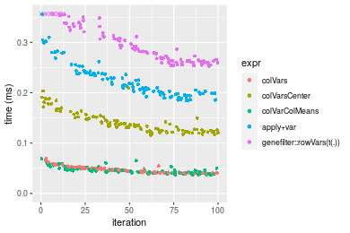

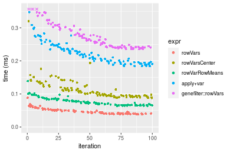
_Table: Benchmarking of colVars() and rowVars() on double+1000x10 data (original and transposed).  The top panel shows times in milliseconds and the bottom panel shows relative times._


|   |expr    |    min|      lq|     mean|  median|      uq|    max|
|:--|:-------|------:|-------:|--------:|-------:|-------:|------:|
|2  |rowVars | 38.129| 40.4745| 47.43557| 45.4810| 52.1865| 88.187|
|1  |colVars | 38.044| 40.7880| 47.05136| 46.3525| 51.1450| 69.190|


|   |expr    |       min|       lq|      mean|   median|        uq|       max|
|:--|:-------|---------:|--------:|---------:|--------:|---------:|---------:|
|2  |rowVars | 1.0000000| 1.000000| 1.0000000| 1.000000| 1.0000000| 1.0000000|
|1  |colVars | 0.9977707| 1.007746| 0.9919004| 1.019162| 0.9800427| 0.7845828|

_Figure: Benchmarking of colVars() and rowVars() on double+1000x10 data (original and transposed).  Outliers are displayed as crosses. Times are in milliseconds._


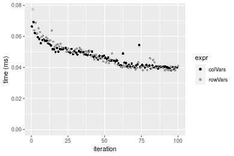

#### 10x1000 double matrix

```r
> X <- data[["10x1000"]]
> gc()
           used  (Mb) gc trigger  (Mb) max used  (Mb)
Ncells  5312290 283.8    8529671 455.6  8529671 455.6
Vcells 10372966  79.2   31876688 243.2 60562128 462.1
> colStats <- microbenchmark(colVars = colVars(X, na.rm = FALSE), colVarsCenter = colVars(X, center = colMeans(X, 
+     na.rm = FALSE), na.rm = FALSE), colVarColMeans = colVarColMeans(X, na.rm = FALSE), `apply+var` = apply(X, 
+     MARGIN = 2L, FUN = var, na.rm = FALSE), `genefilter::rowVars(t(.))` = genefilter_colVars(X, na.rm = FALSE), 
+     unit = "ms")
> X <- t(X)
> gc()
           used  (Mb) gc trigger  (Mb) max used  (Mb)
Ncells  5312284 283.8    8529671 455.6  8529671 455.6
Vcells 10383073  79.3   31876688 243.2 60562128 462.1
> rowStats <- microbenchmark(rowVars = rowVars(X, na.rm = FALSE), rowVarsCenter = rowVars(X, center = rowMeans(X, 
+     na.rm = FALSE), na.rm = FALSE), rowVarRowMeans = rowVarRowMeans(X, na.rm = FALSE), `apply+var` = apply(X, 
+     MARGIN = 1L, FUN = var, na.rm = FALSE), `genefilter::rowVars` = genefilter_rowVars(X, na.rm = FALSE), 
+     unit = "ms")
```

_Table: Benchmarking of colVars(), colVarsCenter(), colVarColMeans(), apply+var() and genefilter::rowVars(t(.))() on double+10x1000 data. The top panel shows times in milliseconds and the bottom panel shows relative times._


|   |expr                      |      min|        lq|      mean|    median|        uq|       max|
|:--|:-------------------------|--------:|---------:|---------:|---------:|---------:|---------:|
|1  |colVars                   | 0.039794| 0.0429090| 0.0469636| 0.0452155| 0.0484165|  0.091483|
|3  |colVarColMeans            | 0.042958| 0.0466380| 0.0521861| 0.0501135| 0.0569770|  0.078319|
|5  |genefilter::rowVars(t(.)) | 0.158553| 0.1796210| 0.2005337| 0.1895110| 0.2033935|  0.461371|
|2  |colVarsCenter             | 0.833458| 0.9014035| 0.9466516| 0.9471060| 0.9731435|  1.530369|
|4  |apply+var                 | 7.765121| 8.4133765| 8.9748003| 8.7040295| 8.9040455| 16.613906|


|   |expr                      |        min|         lq|       mean|     median|         uq|         max|
|:--|:-------------------------|----------:|----------:|----------:|----------:|----------:|-----------:|
|1  |colVars                   |   1.000000|   1.000000|   1.000000|   1.000000|   1.000000|   1.0000000|
|3  |colVarColMeans            |   1.079509|   1.086905|   1.111204|   1.108326|   1.176810|   0.8561044|
|5  |genefilter::rowVars(t(.)) |   3.984344|   4.186091|   4.269986|   4.191284|   4.200913|   5.0432430|
|2  |colVarsCenter             |  20.944313|  21.007330|  20.157157|  20.946490|  20.099419|  16.7284523|
|4  |apply+var                 | 195.132960| 196.074868| 191.101403| 192.501012| 183.905187| 181.6064843|

_Table: Benchmarking of rowVars(), rowVarsCenter(), rowVarRowMeans(), apply+var() and genefilter::rowVars() on double+10x1000 data (transposed). The top panel shows times in milliseconds and the bottom panel shows relative times._


|   |expr                |      min|        lq|      mean|    median|        uq|       max|
|:--|:-------------------|--------:|---------:|---------:|---------:|---------:|---------:|
|1  |rowVars             | 0.038568| 0.0441540| 0.0463789| 0.0457460| 0.0476350|  0.066105|
|3  |rowVarRowMeans      | 0.072553| 0.0781125| 0.0833582| 0.0810600| 0.0867100|  0.113056|
|2  |rowVarsCenter       | 0.097160| 0.1089710| 0.1223411| 0.1167165| 0.1282330|  0.252790|
|5  |genefilter::rowVars | 0.135930| 0.1559825| 0.1667408| 0.1643475| 0.1729475|  0.244898|
|4  |apply+var           | 7.734458| 8.5229970| 9.0260429| 8.7360185| 8.8759365| 16.427359|


|   |expr                |        min|         lq|       mean|     median|         uq|        max|
|:--|:-------------------|----------:|----------:|----------:|----------:|----------:|----------:|
|1  |rowVars             |   1.000000|   1.000000|   1.000000|   1.000000|   1.000000|   1.000000|
|3  |rowVarRowMeans      |   1.881171|   1.769092|   1.797331|   1.771958|   1.820300|   1.710249|
|2  |rowVarsCenter       |   2.519187|   2.467976|   2.637863|   2.551403|   2.691991|   3.824068|
|5  |genefilter::rowVars |   3.524424|   3.532692|   3.595189|   3.592609|   3.630681|   3.704682|
|4  |apply+var           | 200.540811| 193.028876| 194.615412| 190.967921| 186.332245| 248.504031|

_Figure: Benchmarking of colVars(), colVarsCenter(), colVarColMeans(), apply+var() and genefilter::rowVars(t(.))() on double+10x1000 data  as well as rowVars(), rowVarsCenter(), rowVarRowMeans(), apply+var() and genefilter::rowVars() on the same data transposed.  Outliers are displayed as crosses.  Times are in milliseconds._


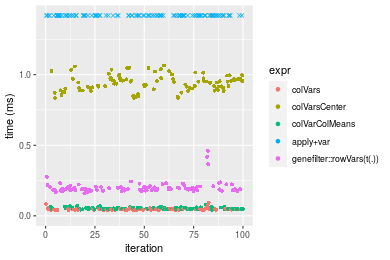

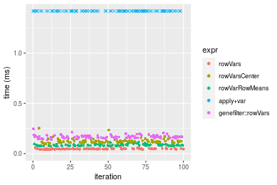
_Table: Benchmarking of colVars() and rowVars() on double+10x1000 data (original and transposed).  The top panel shows times in milliseconds and the bottom panel shows relative times._


|   |expr    |    min|     lq|     mean|  median|      uq|    max|
|:--|:-------|------:|------:|--------:|-------:|-------:|------:|
|1  |colVars | 39.794| 42.909| 46.96355| 45.2155| 48.4165| 91.483|
|2  |rowVars | 38.568| 44.154| 46.37887| 45.7460| 47.6350| 66.105|


|   |expr    |       min|       lq|      mean|   median|        uq|       max|
|:--|:-------|---------:|--------:|---------:|--------:|---------:|---------:|
|1  |colVars | 1.0000000| 1.000000| 1.0000000| 1.000000| 1.0000000| 1.0000000|
|2  |rowVars | 0.9691913| 1.029015| 0.9875503| 1.011733| 0.9838588| 0.7225933|

_Figure: Benchmarking of colVars() and rowVars() on double+10x1000 data (original and transposed).  Outliers are displayed as crosses. Times are in milliseconds._


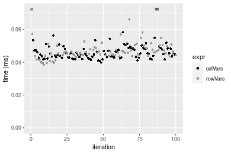

#### 100x1000 double matrix

```r
> X <- data[["100x1000"]]
> gc()
           used  (Mb) gc trigger  (Mb) max used  (Mb)
Ncells  5312538 283.8    8529671 455.6  8529671 455.6
Vcells 10374556  79.2   31876688 243.2 60562128 462.1
> colStats <- microbenchmark(colVars = colVars(X, na.rm = FALSE), colVarsCenter = colVars(X, center = colMeans(X, 
+     na.rm = FALSE), na.rm = FALSE), colVarColMeans = colVarColMeans(X, na.rm = FALSE), `apply+var` = apply(X, 
+     MARGIN = 2L, FUN = var, na.rm = FALSE), `genefilter::rowVars(t(.))` = genefilter_colVars(X, na.rm = FALSE), 
+     unit = "ms")
> X <- t(X)
> gc()
           used  (Mb) gc trigger  (Mb) max used  (Mb)
Ncells  5312526 283.8    8529671 455.6  8529671 455.6
Vcells 10474653  80.0   31876688 243.2 60562128 462.1
> rowStats <- microbenchmark(rowVars = rowVars(X, na.rm = FALSE), rowVarsCenter = rowVars(X, center = rowMeans(X, 
+     na.rm = FALSE), na.rm = FALSE), rowVarRowMeans = rowVarRowMeans(X, na.rm = FALSE), `apply+var` = apply(X, 
+     MARGIN = 1L, FUN = var, na.rm = FALSE), `genefilter::rowVars` = genefilter_rowVars(X, na.rm = FALSE), 
+     unit = "ms")
```

_Table: Benchmarking of colVars(), colVarsCenter(), colVarColMeans(), apply+var() and genefilter::rowVars(t(.))() on double+100x1000 data. The top panel shows times in milliseconds and the bottom panel shows relative times._


|   |expr                      |      min|        lq|      mean|   median|       uq|       max|
|:--|:-------------------------|--------:|---------:|---------:|--------:|--------:|---------:|
|3  |colVarColMeans            | 0.227658| 0.2568100| 0.4061417| 0.280031| 0.297967| 12.848085|
|1  |colVars                   | 0.366654| 0.3971055| 0.4143027| 0.413039| 0.422013|  0.533167|
|5  |genefilter::rowVars(t(.)) | 1.241417| 1.3575785| 1.5669587| 1.427919| 1.503113| 13.640083|
|2  |colVarsCenter             | 1.587058| 1.7256375| 2.0593262| 1.781643| 1.853342| 14.534955|
|4  |apply+var                 | 8.771338| 9.6010645| 9.9796321| 9.758297| 9.934980| 23.449087|


|   |expr                      |       min|        lq|      mean|    median|        uq|       max|
|:--|:-------------------------|---------:|---------:|---------:|---------:|---------:|---------:|
|3  |colVarColMeans            |  1.000000|  1.000000|  1.000000|  1.000000|  1.000000| 1.0000000|
|1  |colVars                   |  1.610547|  1.546301|  1.020094|  1.474976|  1.416308| 0.0414978|
|5  |genefilter::rowVars(t(.)) |  5.452991|  5.286315|  3.858158|  5.099144|  5.044564| 1.0616433|
|2  |colVarsCenter             |  6.971238|  6.719511|  5.070463|  6.362308|  6.219957| 1.1312935|
|4  |apply+var                 | 38.528574| 37.385867| 24.571801| 34.847203| 33.342550| 1.8251037|

_Table: Benchmarking of rowVars(), rowVarsCenter(), rowVarRowMeans(), apply+var() and genefilter::rowVars() on double+100x1000 data (transposed). The top panel shows times in milliseconds and the bottom panel shows relative times._


|   |expr                |      min|        lq|       mean|    median|         uq|       max|
|:--|:-------------------|--------:|---------:|----------:|---------:|----------:|---------:|
|1  |rowVars             | 0.383108| 0.4212025|  0.4443792| 0.4335005|  0.4644170|  0.577450|
|3  |rowVarRowMeans      | 0.557170| 0.5967800|  0.6316420| 0.6073605|  0.6280675|  1.328177|
|2  |rowVarsCenter       | 0.748677| 0.8087930|  0.8737887| 0.8343895|  0.8868905|  1.608309|
|5  |genefilter::rowVars | 1.144970| 1.2229115|  1.4326800| 1.2636820|  1.3533885| 12.169686|
|4  |apply+var           | 8.836759| 9.6938980| 10.2881584| 9.8871080| 10.1604960| 21.798754|


|   |expr                |       min|        lq|      mean|    median|        uq|       max|
|:--|:-------------------|---------:|---------:|---------:|---------:|---------:|---------:|
|1  |rowVars             |  1.000000|  1.000000|  1.000000|  1.000000|  1.000000|  1.000000|
|3  |rowVarRowMeans      |  1.454342|  1.416848|  1.421403|  1.401061|  1.352378|  2.300073|
|2  |rowVarsCenter       |  1.954219|  1.920200|  1.966313|  1.924772|  1.909686|  2.785192|
|5  |genefilter::rowVars |  2.988635|  2.903381|  3.224003|  2.915065|  2.914167| 21.074874|
|4  |apply+var           | 23.065974| 23.014816| 23.151754| 22.807605| 21.877959| 37.750029|

_Figure: Benchmarking of colVars(), colVarsCenter(), colVarColMeans(), apply+var() and genefilter::rowVars(t(.))() on double+100x1000 data  as well as rowVars(), rowVarsCenter(), rowVarRowMeans(), apply+var() and genefilter::rowVars() on the same data transposed.  Outliers are displayed as crosses.  Times are in milliseconds._


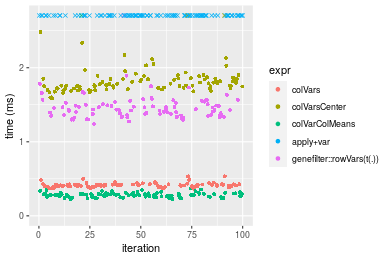

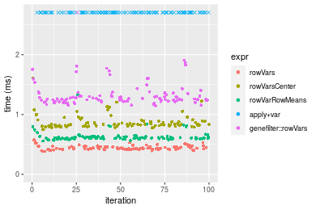
_Table: Benchmarking of colVars() and rowVars() on double+100x1000 data (original and transposed).  The top panel shows times in milliseconds and the bottom panel shows relative times._


|   |expr    |     min|       lq|     mean|   median|      uq|     max|
|:--|:-------|-------:|--------:|--------:|--------:|-------:|-------:|
|1  |colVars | 366.654| 397.1055| 414.3027| 413.0390| 422.013| 533.167|
|2  |rowVars | 383.108| 421.2025| 444.3792| 433.5005| 464.417| 577.450|


|   |expr    |      min|       lq|     mean|   median|      uq|      max|
|:--|:-------|--------:|--------:|--------:|--------:|-------:|--------:|
|1  |colVars | 1.000000| 1.000000| 1.000000| 1.000000| 1.00000| 1.000000|
|2  |rowVars | 1.044876| 1.060682| 1.072596| 1.049539| 1.10048| 1.083057|

_Figure: Benchmarking of colVars() and rowVars() on double+100x1000 data (original and transposed).  Outliers are displayed as crosses. Times are in milliseconds._


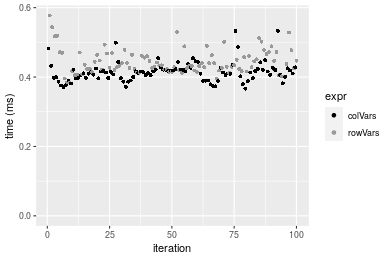

#### 1000x100 double matrix

```r
> X <- data[["1000x100"]]
> gc()
           used  (Mb) gc trigger  (Mb) max used  (Mb)
Ncells  5312781 283.8    8529671 455.6  8529671 455.6
Vcells 10374718  79.2   31876688 243.2 60562128 462.1
> colStats <- microbenchmark(colVars = colVars(X, na.rm = FALSE), colVarsCenter = colVars(X, center = colMeans(X, 
+     na.rm = FALSE), na.rm = FALSE), colVarColMeans = colVarColMeans(X, na.rm = FALSE), `apply+var` = apply(X, 
+     MARGIN = 2L, FUN = var, na.rm = FALSE), `genefilter::rowVars(t(.))` = genefilter_colVars(X, na.rm = FALSE), 
+     unit = "ms")
> X <- t(X)
> gc()
           used  (Mb) gc trigger  (Mb) max used  (Mb)
Ncells  5312769 283.8    8529671 455.6  8529671 455.6
Vcells 10474815  80.0   31876688 243.2 60562128 462.1
> rowStats <- microbenchmark(rowVars = rowVars(X, na.rm = FALSE), rowVarsCenter = rowVars(X, center = rowMeans(X, 
+     na.rm = FALSE), na.rm = FALSE), rowVarRowMeans = rowVarRowMeans(X, na.rm = FALSE), `apply+var` = apply(X, 
+     MARGIN = 1L, FUN = var, na.rm = FALSE), `genefilter::rowVars` = genefilter_rowVars(X, na.rm = FALSE), 
+     unit = "ms")
```

_Table: Benchmarking of colVars(), colVarsCenter(), colVarColMeans(), apply+var() and genefilter::rowVars(t(.))() on double+1000x100 data. The top panel shows times in milliseconds and the bottom panel shows relative times._


|   |expr                      |      min|        lq|      mean|    median|        uq|      max|
|:--|:-------------------------|--------:|---------:|---------:|---------:|---------:|--------:|
|3  |colVarColMeans            | 0.236591| 0.2548605| 0.3502374| 0.2667690| 0.2795570| 7.219906|
|1  |colVars                   | 0.362819| 0.3896030| 0.4205326| 0.4064870| 0.4257745| 0.848092|
|2  |colVarsCenter             | 0.846065| 0.9378680| 1.0836001| 0.9712455| 1.0618485| 8.273782|
|5  |genefilter::rowVars(t(.)) | 1.285118| 1.3944565| 1.5633854| 1.4472140| 1.5514135| 9.008731|
|4  |apply+var                 | 1.666260| 1.7751905| 1.9326401| 1.8247425| 1.9000110| 9.021567|


|   |expr                      |      min|       lq|     mean|   median|       uq|       max|
|:--|:-------------------------|--------:|--------:|--------:|--------:|--------:|---------:|
|3  |colVarColMeans            | 1.000000| 1.000000| 1.000000| 1.000000| 1.000000| 1.0000000|
|1  |colVars                   | 1.533528| 1.528691| 1.200708| 1.523742| 1.523033| 0.1174658|
|2  |colVarsCenter             | 3.576066| 3.679927| 3.093902| 3.640773| 3.798326| 1.1459681|
|5  |genefilter::rowVars(t(.)) | 5.431813| 5.471450| 4.463788| 5.424971| 5.549543| 1.2477629|
|4  |apply+var                 | 7.042787| 6.965342| 5.518086| 6.840160| 6.796507| 1.2495408|

_Table: Benchmarking of rowVars(), rowVarsCenter(), rowVarRowMeans(), apply+var() and genefilter::rowVars() on double+1000x100 data (transposed). The top panel shows times in milliseconds and the bottom panel shows relative times._


|   |expr                |      min|        lq|      mean|    median|       uq|      max|
|:--|:-------------------|--------:|---------:|---------:|---------:|--------:|--------:|
|1  |rowVars             | 0.369447| 0.3981980| 0.4138544| 0.4101275| 0.420431| 0.565742|
|3  |rowVarRowMeans      | 0.522479| 0.5821485| 0.6792477| 0.6035575| 0.630286| 7.376799|
|2  |rowVarsCenter       | 0.729655| 0.7770475| 0.9085696| 0.8090230| 0.849332| 7.632795|
|5  |genefilter::rowVars | 1.128522| 1.2424880| 1.4133518| 1.3286465| 1.373558| 8.355827|
|4  |apply+var           | 1.678533| 1.8045680| 1.9414004| 1.9013635| 2.018127| 2.691588|


|   |expr                |      min|       lq|     mean|   median|       uq|       max|
|:--|:-------------------|--------:|--------:|--------:|--------:|--------:|---------:|
|1  |rowVars             | 1.000000| 1.000000| 1.000000| 1.000000| 1.000000|  1.000000|
|3  |rowVarRowMeans      | 1.414219| 1.461957| 1.641272| 1.471634| 1.499143| 13.039157|
|2  |rowVarsCenter       | 1.974992| 1.951410| 2.195385| 1.972613| 2.020146| 13.491653|
|5  |genefilter::rowVars | 3.054625| 3.120277| 3.415094| 3.239594| 3.267024| 14.769678|
|4  |apply+var           | 4.543366| 4.531836| 4.691023| 4.636030| 4.800140|  4.757625|

_Figure: Benchmarking of colVars(), colVarsCenter(), colVarColMeans(), apply+var() and genefilter::rowVars(t(.))() on double+1000x100 data  as well as rowVars(), rowVarsCenter(), rowVarRowMeans(), apply+var() and genefilter::rowVars() on the same data transposed.  Outliers are displayed as crosses.  Times are in milliseconds._


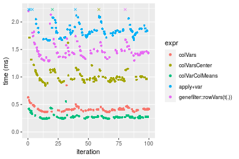

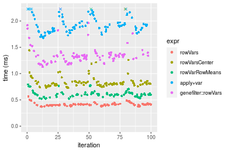
_Table: Benchmarking of colVars() and rowVars() on double+1000x100 data (original and transposed).  The top panel shows times in milliseconds and the bottom panel shows relative times._


|   |expr    |     min|      lq|     mean|   median|       uq|     max|
|:--|:-------|-------:|-------:|--------:|--------:|--------:|-------:|
|1  |colVars | 362.819| 389.603| 420.5326| 406.4870| 425.7745| 848.092|
|2  |rowVars | 369.447| 398.198| 413.8544| 410.1275| 420.4310| 565.742|


|   |expr    |      min|       lq|      mean|   median|        uq|       max|
|:--|:-------|--------:|--------:|---------:|--------:|---------:|---------:|
|1  |colVars | 1.000000| 1.000000| 1.0000000| 1.000000| 1.0000000| 1.0000000|
|2  |rowVars | 1.018268| 1.022061| 0.9841197| 1.008956| 0.9874499| 0.6670762|

_Figure: Benchmarking of colVars() and rowVars() on double+1000x100 data (original and transposed).  Outliers are displayed as crosses. Times are in milliseconds._


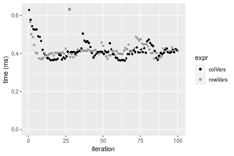


## Appendix

### Session information
```r
R version 4.1.1 Patched (2021-08-10 r80727)
Platform: x86_64-pc-linux-gnu (64-bit)
Running under: Ubuntu 18.04.5 LTS

Matrix products: default
BLAS:   /home/hb/software/R-devel/R-4-1-branch/lib/R/lib/libRblas.so
LAPACK: /home/hb/software/R-devel/R-4-1-branch/lib/R/lib/libRlapack.so

locale:
 [1] LC_CTYPE=en_US.UTF-8       LC_NUMERIC=C              
 [3] LC_TIME=en_US.UTF-8        LC_COLLATE=en_US.UTF-8    
 [5] LC_MONETARY=en_US.UTF-8    LC_MESSAGES=en_US.UTF-8   
 [7] LC_PAPER=en_US.UTF-8       LC_NAME=C                 
 [9] LC_ADDRESS=C               LC_TELEPHONE=C            
[11] LC_MEASUREMENT=en_US.UTF-8 LC_IDENTIFICATION=C       

attached base packages:
[1] stats     graphics  grDevices utils     datasets  methods   base     

other attached packages:
[1] microbenchmark_1.4-7   matrixStats_0.60.1     ggplot2_3.3.5         
[4] knitr_1.33             R.devices_2.17.0       R.utils_2.10.1        
[7] R.oo_1.24.0            R.methodsS3_1.8.1-9001 history_0.0.1-9000    

loaded via a namespace (and not attached):
 [1] Biobase_2.52.0          httr_1.4.2              splines_4.1.1          
 [4] bit64_4.0.5             network_1.17.1          assertthat_0.2.1       
 [7] highr_0.9               stats4_4.1.1            blob_1.2.2             
[10] GenomeInfoDbData_1.2.6  robustbase_0.93-8       pillar_1.6.2           
[13] RSQLite_2.2.8           lattice_0.20-44         glue_1.4.2             
[16] digest_0.6.27           XVector_0.32.0          colorspace_2.0-2       
[19] Matrix_1.3-4            XML_3.99-0.7            pkgconfig_2.0.3        
[22] zlibbioc_1.38.0         genefilter_1.74.0       purrr_0.3.4            
[25] ergm_4.1.2              xtable_1.8-4            scales_1.1.1           
[28] tibble_3.1.4            annotate_1.70.0         KEGGREST_1.32.0        
[31] farver_2.1.0            generics_0.1.0          IRanges_2.26.0         
[34] ellipsis_0.3.2          cachem_1.0.6            withr_2.4.2            
[37] BiocGenerics_0.38.0     mime_0.11               survival_3.2-13        
[40] magrittr_2.0.1          crayon_1.4.1            statnet.common_4.5.0   
[43] memoise_2.0.0           laeken_0.5.1            fansi_0.5.0            
[46] R.cache_0.15.0          MASS_7.3-54             R.rsp_0.44.0           
[49] progressr_0.8.0         tools_4.1.1             lifecycle_1.0.0        
[52] S4Vectors_0.30.0        trust_0.1-8             munsell_0.5.0          
[55] tabby_0.0.1-9001        AnnotationDbi_1.54.1    Biostrings_2.60.2      
[58] compiler_4.1.1          GenomeInfoDb_1.28.1     rlang_0.4.11           
[61] grid_4.1.1              RCurl_1.98-1.4          cwhmisc_6.6            
[64] rappdirs_0.3.3          startup_0.15.0          labeling_0.4.2         
[67] bitops_1.0-7            base64enc_0.1-3         boot_1.3-28            
[70] gtable_0.3.0            DBI_1.1.1               markdown_1.1           
[73] R6_2.5.1                lpSolveAPI_5.5.2.0-17.7 rle_0.9.2              
[76] dplyr_1.0.7             fastmap_1.1.0           bit_4.0.4              
[79] utf8_1.2.2              parallel_4.1.1          Rcpp_1.0.7             
[82] vctrs_0.3.8             png_0.1-7               DEoptimR_1.0-9         
[85] tidyselect_1.1.1        xfun_0.25               coda_0.19-4            
```
Total processing time was 36.81 secs.


### Reproducibility
To reproduce this report, do:
```r
html <- matrixStats:::benchmark('colVars')
```

[RSP]: https://cran.r-project.org/package=R.rsp
[matrixStats]: https://cran.r-project.org/package=matrixStats

[StackOverflow:colMins?]: https://stackoverflow.com/questions/13676878 "Stack Overflow: fastest way to get Min from every column in a matrix?"
[StackOverflow:colSds?]: https://stackoverflow.com/questions/17549762 "Stack Overflow: Is there such 'colsd' in R?"
[StackOverflow:rowProds?]: https://stackoverflow.com/questions/20198801/ "Stack Overflow: Row product of matrix and column sum of matrix"

---------------------------------------
Copyright Henrik Bengtsson. Last updated on 2021-08-25 19:11:09 (+0200 UTC). Powered by [RSP].

<script>
 var link = document.createElement('link');
 link.rel = 'icon';
 link.href = "data:image/png;base64,iVBORw0KGgoAAAANSUhEUgAAACAAAAAgCAMAAABEpIrGAAAA21BMVEUAAAAAAP8AAP8AAP8AAP8AAP8AAP8AAP8AAP8AAP8AAP8AAP8AAP8AAP8AAP8AAP8AAP8AAP8AAP8AAP8AAP8AAP8AAP8AAP8AAP8AAP8AAP8AAP8AAP8AAP8AAP8AAP8AAP8AAP8AAP8AAP8AAP8AAP8AAP8AAP8AAP8AAP8BAf4CAv0DA/wdHeIeHuEfH+AgIN8hId4lJdomJtknJ9g+PsE/P8BAQL9yco10dIt1dYp3d4h4eIeVlWqWlmmXl2iYmGeZmWabm2Tn5xjo6Bfp6Rb39wj4+Af//wA2M9hbAAAASXRSTlMAAQIJCgsMJSYnKD4/QGRlZmhpamtsbautrrCxuru8y8zN5ebn6Pn6+///////////////////////////////////////////LsUNcQAAAS9JREFUOI29k21XgkAQhVcFytdSMqMETU26UVqGmpaiFbL//xc1cAhhwVNf6n5i5z67M2dmYOyfJZUqlVLhkKucG7cgmUZTybDz6g0iDeq51PUr37Ds2cy2/C9NeES5puDjxuUk1xnToZsg8pfA3avHQ3lLIi7iWRrkv/OYtkScxBIMgDee0ALoyxHQBJ68JLCjOtQIMIANF7QG9G9fNnHvisCHBVMKgSJgiz7nE+AoBKrAPA3MgepvgR9TSCasrCKH0eB1wBGBFdCO+nAGjMVGPcQb5bd6mQRegN6+1axOs9nGfYcCtfi4NQosdtH7dB+txFIpXQqN1p9B/asRHToyS0jRgpV7nk4nwcq1BJ+x3Gl/v7S9Wmpp/aGquum7w3ZDyrADFYrl8vHBH+ev9AUASW1dmU4h4wAAAABJRU5ErkJggg=="
 document.getElementsByTagName('head')[0].appendChild(link);
</script>


