[matrixStats]: Benchmark report

---------------------------------------


# colVars() and rowVars() benchmarks  on subsetted computation

This report benchmark the performance of colVars() and rowVars() on subsetted computation.


## Data type "integer"

### Data
```r
> rmatrix <- function(nrow, ncol, mode = c("logical", "double", "integer", "index"), range = c(-100, 
+     +100), na_prob = 0) {
+     mode <- match.arg(mode)
+     n <- nrow * ncol
+     if (mode == "logical") {
+         x <- sample(c(FALSE, TRUE), size = n, replace = TRUE)
+     }     else if (mode == "index") {
+         x <- seq_len(n)
+         mode <- "integer"
+     }     else {
+         x <- runif(n, min = range[1], max = range[2])
+     }
+     storage.mode(x) <- mode
+     if (na_prob > 0) 
+         x[sample(n, size = na_prob * n)] <- NA
+     dim(x) <- c(nrow, ncol)
+     x
+ }
> rmatrices <- function(scale = 10, seed = 1, ...) {
+     set.seed(seed)
+     data <- list()
+     data[[1]] <- rmatrix(nrow = scale * 1, ncol = scale * 1, ...)
+     data[[2]] <- rmatrix(nrow = scale * 10, ncol = scale * 10, ...)
+     data[[3]] <- rmatrix(nrow = scale * 100, ncol = scale * 1, ...)
+     data[[4]] <- t(data[[3]])
+     data[[5]] <- rmatrix(nrow = scale * 10, ncol = scale * 100, ...)
+     data[[6]] <- t(data[[5]])
+     names(data) <- sapply(data, FUN = function(x) paste(dim(x), collapse = "x"))
+     data
+ }
> data <- rmatrices(mode = mode)
```

### Results

#### 10x10 integer matrix

```r
> X <- data[["10x10"]]
> rows <- sample.int(nrow(X), size = nrow(X) * 0.7)
> cols <- sample.int(ncol(X), size = ncol(X) * 0.7)
> X_S <- X[rows, cols]
> gc()
           used  (Mb) gc trigger  (Mb) max used  (Mb)
Ncells  5313475 283.8    8529671 455.6  8529671 455.6
Vcells 10408382  79.5   31876688 243.2 60562128 462.1
> colStats <- microbenchmark(colVars_X_S = colVars(X_S, na.rm = FALSE), `colVars(X, rows, cols)` = colVars(X, 
+     rows = rows, cols = cols, na.rm = FALSE), `colVars(X[rows, cols])` = colVars(X[rows, cols], na.rm = FALSE), 
+     unit = "ms")
> X <- t(X)
> X_S <- t(X_S)
> gc()
           used  (Mb) gc trigger  (Mb) max used  (Mb)
Ncells  5304511 283.3    8529671 455.6  8529671 455.6
Vcells 10378278  79.2   31876688 243.2 60562128 462.1
> rowStats <- microbenchmark(rowVars_X_S = rowVars(X_S, na.rm = FALSE), `rowVars(X, cols, rows)` = rowVars(X, 
+     rows = cols, cols = rows, na.rm = FALSE), `rowVars(X[cols, rows])` = rowVars(X[cols, rows], na.rm = FALSE), 
+     unit = "ms")
```

_Table: Benchmarking of colVars_X_S(), colVars(X, rows, cols)() and colVars(X[rows, cols])() on integer+10x10 data. The top panel shows times in milliseconds and the bottom panel shows relative times._


|   |expr                   |      min|        lq|      mean|    median|        uq|      max|
|:--|:----------------------|--------:|---------:|---------:|---------:|---------:|--------:|
|1  |colVars_X_S            | 0.002451| 0.0025125| 0.0070175| 0.0025795| 0.0026850| 0.436973|
|2  |colVars(X, rows, cols) | 0.002814| 0.0029330| 0.0030652| 0.0030040| 0.0031325| 0.005606|
|3  |colVars(X[rows, cols]) | 0.003282| 0.0034870| 0.0036752| 0.0035845| 0.0036990| 0.007568|


|   |expr                   |      min|       lq|      mean|   median|       uq|       max|
|:--|:----------------------|--------:|--------:|---------:|--------:|--------:|---------:|
|1  |colVars_X_S            | 1.000000| 1.000000| 1.0000000| 1.000000| 1.000000| 1.0000000|
|2  |colVars(X, rows, cols) | 1.148103| 1.167363| 0.4367996| 1.164567| 1.166667| 0.0128292|
|3  |colVars(X[rows, cols]) | 1.339045| 1.387861| 0.5237121| 1.389610| 1.377654| 0.0173191|

_Table: Benchmarking of rowVars_X_S(), rowVars(X, cols, rows)() and rowVars(X[cols, rows])() on integer+10x10 data (transposed). The top panel shows times in milliseconds and the bottom panel shows relative times._


|   |expr                   |      min|        lq|      mean|    median|        uq|      max|
|:--|:----------------------|--------:|---------:|---------:|---------:|---------:|--------:|
|1  |rowVars_X_S            | 0.002484| 0.0025335| 0.0026493| 0.0025930| 0.0026770| 0.005196|
|2  |rowVars(X, cols, rows) | 0.002873| 0.0029225| 0.0073218| 0.0029825| 0.0031230| 0.430308|
|3  |rowVars(X[cols, rows]) | 0.003265| 0.0035030| 0.0037006| 0.0036340| 0.0037575| 0.005864|


|   |expr                   |      min|       lq|     mean|   median|       uq|      max|
|:--|:----------------------|--------:|--------:|--------:|--------:|--------:|--------:|
|1  |rowVars_X_S            | 1.000000| 1.000000| 1.000000| 1.000000| 1.000000|  1.00000|
|2  |rowVars(X, cols, rows) | 1.156602| 1.153542| 2.763635| 1.150212| 1.166604| 82.81524|
|3  |rowVars(X[cols, rows]) | 1.314412| 1.382672| 1.396793| 1.401466| 1.403623|  1.12856|

_Figure: Benchmarking of colVars_X_S(), colVars(X, rows, cols)() and colVars(X[rows, cols])() on integer+10x10 data  as well as rowVars_X_S(), rowVars(X, cols, rows)() and rowVars(X[cols, rows])() on the same data transposed.  Outliers are displayed as crosses.  Times are in milliseconds._


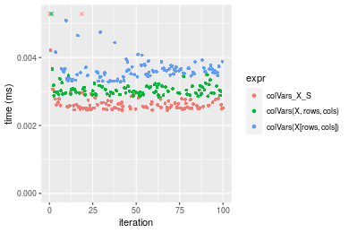

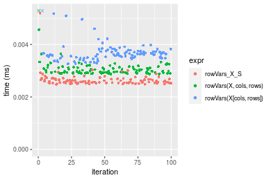
_Table: Benchmarking of colVars_X_S() and rowVars_X_S() on integer+10x10 data (original and transposed).  The top panel shows times in milliseconds and the bottom panel shows relative times._


|   |expr        |   min|     lq|    mean| median|    uq|     max|
|:--|:-----------|-----:|------:|-------:|------:|-----:|-------:|
|1  |colVars_X_S | 2.451| 2.5125| 7.01752| 2.5795| 2.685| 436.973|
|2  |rowVars_X_S | 2.484| 2.5335| 2.64934| 2.5930| 2.677|   5.196|


|   |expr        |      min|       lq|      mean|   median|        uq|       max|
|:--|:-----------|--------:|--------:|---------:|--------:|---------:|---------:|
|1  |colVars_X_S | 1.000000| 1.000000| 1.0000000| 1.000000| 1.0000000| 1.0000000|
|2  |rowVars_X_S | 1.013464| 1.008358| 0.3775322| 1.005234| 0.9970205| 0.0118909|

_Figure: Benchmarking of colVars_X_S() and rowVars_X_S() on integer+10x10 data (original and transposed).  Outliers are displayed as crosses. Times are in milliseconds._


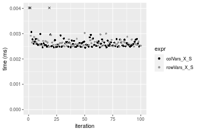

#### 100x100 integer matrix

```r
> X <- data[["100x100"]]
> rows <- sample.int(nrow(X), size = nrow(X) * 0.7)
> cols <- sample.int(ncol(X), size = ncol(X) * 0.7)
> X_S <- X[rows, cols]
> gc()
           used  (Mb) gc trigger  (Mb) max used  (Mb)
Ncells  5303939 283.3    8529671 455.6  8529671 455.6
Vcells 10214460  78.0   31876688 243.2 60562128 462.1
> colStats <- microbenchmark(colVars_X_S = colVars(X_S, na.rm = FALSE), `colVars(X, rows, cols)` = colVars(X, 
+     rows = rows, cols = cols, na.rm = FALSE), `colVars(X[rows, cols])` = colVars(X[rows, cols], na.rm = FALSE), 
+     unit = "ms")
> X <- t(X)
> X_S <- t(X_S)
> gc()
           used  (Mb) gc trigger  (Mb) max used  (Mb)
Ncells  5303915 283.3    8529671 455.6  8529671 455.6
Vcells 10219513  78.0   31876688 243.2 60562128 462.1
> rowStats <- microbenchmark(rowVars_X_S = rowVars(X_S, na.rm = FALSE), `rowVars(X, cols, rows)` = rowVars(X, 
+     rows = cols, cols = rows, na.rm = FALSE), `rowVars(X[cols, rows])` = rowVars(X[cols, rows], na.rm = FALSE), 
+     unit = "ms")
```

_Table: Benchmarking of colVars_X_S(), colVars(X, rows, cols)() and colVars(X[rows, cols])() on integer+100x100 data. The top panel shows times in milliseconds and the bottom panel shows relative times._


|   |expr                   |      min|        lq|      mean|    median|        uq|      max|
|:--|:----------------------|--------:|---------:|---------:|---------:|---------:|--------:|
|2  |colVars(X, rows, cols) | 0.027985| 0.0286135| 0.0303356| 0.0302370| 0.0309675| 0.048198|
|1  |colVars_X_S            | 0.028323| 0.0287680| 0.0306895| 0.0308400| 0.0313955| 0.046575|
|3  |colVars(X[rows, cols]) | 0.038464| 0.0391175| 0.0422214| 0.0417525| 0.0436855| 0.077703|


|   |expr                   |      min|       lq|     mean|   median|       uq|       max|
|:--|:----------------------|--------:|--------:|--------:|--------:|--------:|---------:|
|2  |colVars(X, rows, cols) | 1.000000| 1.000000| 1.000000| 1.000000| 1.000000| 1.0000000|
|1  |colVars_X_S            | 1.012078| 1.005400| 1.011667| 1.019942| 1.013821| 0.9663264|
|3  |colVars(X[rows, cols]) | 1.374451| 1.367099| 1.391811| 1.380841| 1.410689| 1.6121623|

_Table: Benchmarking of rowVars_X_S(), rowVars(X, cols, rows)() and rowVars(X[cols, rows])() on integer+100x100 data (transposed). The top panel shows times in milliseconds and the bottom panel shows relative times._


|   |expr                   |      min|       lq|      mean|    median|        uq|      max|
|:--|:----------------------|--------:|--------:|---------:|---------:|---------:|--------:|
|2  |rowVars(X, cols, rows) | 0.026026| 0.027455| 0.0286493| 0.0283570| 0.0287885| 0.063004|
|1  |rowVars_X_S            | 0.028856| 0.030070| 0.0312815| 0.0313595| 0.0320725| 0.046009|
|3  |rowVars(X[cols, rows]) | 0.038393| 0.040125| 0.0418369| 0.0418370| 0.0431630| 0.056781|


|   |expr                   |      min|       lq|     mean|   median|       uq|       max|
|:--|:----------------------|--------:|--------:|--------:|--------:|--------:|---------:|
|2  |rowVars(X, cols, rows) | 1.000000| 1.000000| 1.000000| 1.000000| 1.000000| 1.0000000|
|1  |rowVars_X_S            | 1.108737| 1.095247| 1.091877| 1.105882| 1.114073| 0.7302552|
|3  |rowVars(X[cols, rows]) | 1.475179| 1.461482| 1.460311| 1.475368| 1.499314| 0.9012285|

_Figure: Benchmarking of colVars_X_S(), colVars(X, rows, cols)() and colVars(X[rows, cols])() on integer+100x100 data  as well as rowVars_X_S(), rowVars(X, cols, rows)() and rowVars(X[cols, rows])() on the same data transposed.  Outliers are displayed as crosses.  Times are in milliseconds._


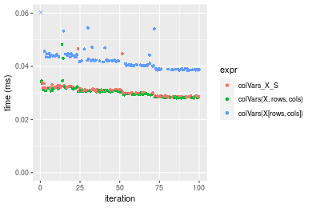


_Table: Benchmarking of colVars_X_S() and rowVars_X_S() on integer+100x100 data (original and transposed).  The top panel shows times in milliseconds and the bottom panel shows relative times._


|   |expr        |    min|     lq|     mean|  median|      uq|    max|
|:--|:-----------|------:|------:|--------:|-------:|-------:|------:|
|1  |colVars_X_S | 28.323| 28.768| 30.68953| 30.8400| 31.3955| 46.575|
|2  |rowVars_X_S | 28.856| 30.070| 31.28148| 31.3595| 32.0725| 46.009|


|   |expr        |      min|       lq|     mean|   median|       uq|       max|
|:--|:-----------|--------:|--------:|--------:|--------:|--------:|---------:|
|1  |colVars_X_S | 1.000000| 1.000000| 1.000000| 1.000000| 1.000000| 1.0000000|
|2  |rowVars_X_S | 1.018819| 1.045259| 1.019288| 1.016845| 1.021564| 0.9878476|

_Figure: Benchmarking of colVars_X_S() and rowVars_X_S() on integer+100x100 data (original and transposed).  Outliers are displayed as crosses. Times are in milliseconds._


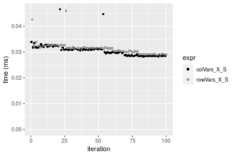

#### 1000x10 integer matrix

```r
> X <- data[["1000x10"]]
> rows <- sample.int(nrow(X), size = nrow(X) * 0.7)
> cols <- sample.int(ncol(X), size = ncol(X) * 0.7)
> X_S <- X[rows, cols]
> gc()
           used  (Mb) gc trigger  (Mb) max used  (Mb)
Ncells  5304664 283.3    8529671 455.6  8529671 455.6
Vcells 10218477  78.0   31876688 243.2 60562128 462.1
> colStats <- microbenchmark(colVars_X_S = colVars(X_S, na.rm = FALSE), `colVars(X, rows, cols)` = colVars(X, 
+     rows = rows, cols = cols, na.rm = FALSE), `colVars(X[rows, cols])` = colVars(X[rows, cols], na.rm = FALSE), 
+     unit = "ms")
> X <- t(X)
> X_S <- t(X_S)
> gc()
           used  (Mb) gc trigger  (Mb) max used  (Mb)
Ncells  5304658 283.3    8529671 455.6  8529671 455.6
Vcells 10223560  78.0   31876688 243.2 60562128 462.1
> rowStats <- microbenchmark(rowVars_X_S = rowVars(X_S, na.rm = FALSE), `rowVars(X, cols, rows)` = rowVars(X, 
+     rows = cols, cols = rows, na.rm = FALSE), `rowVars(X[cols, rows])` = rowVars(X[cols, rows], na.rm = FALSE), 
+     unit = "ms")
```

_Table: Benchmarking of colVars_X_S(), colVars(X, rows, cols)() and colVars(X[rows, cols])() on integer+1000x10 data. The top panel shows times in milliseconds and the bottom panel shows relative times._


|   |expr                   |      min|        lq|      mean|   median|        uq|      max|
|:--|:----------------------|--------:|---------:|---------:|--------:|---------:|--------:|
|1  |colVars_X_S            | 0.028019| 0.0292240| 0.0302776| 0.030340| 0.0315175| 0.034922|
|2  |colVars(X, rows, cols) | 0.029855| 0.0307185| 0.0320918| 0.032063| 0.0329080| 0.044749|
|3  |colVars(X[rows, cols]) | 0.038693| 0.0391380| 0.0419313| 0.041079| 0.0436910| 0.072446|


|   |expr                   |      min|       lq|     mean|   median|       uq|      max|
|:--|:----------------------|--------:|--------:|--------:|--------:|--------:|--------:|
|1  |colVars_X_S            | 1.000000| 1.000000| 1.000000| 1.000000| 1.000000| 1.000000|
|2  |colVars(X, rows, cols) | 1.065527| 1.051139| 1.059917| 1.056790| 1.044118| 1.281399|
|3  |colVars(X[rows, cols]) | 1.380956| 1.339242| 1.384895| 1.353955| 1.386246| 2.074509|

_Table: Benchmarking of rowVars_X_S(), rowVars(X, cols, rows)() and rowVars(X[cols, rows])() on integer+1000x10 data (transposed). The top panel shows times in milliseconds and the bottom panel shows relative times._


|   |expr                   |      min|        lq|      mean|    median|        uq|      max|
|:--|:----------------------|--------:|---------:|---------:|---------:|---------:|--------:|
|2  |rowVars(X, cols, rows) | 0.029057| 0.0303490| 0.0321784| 0.0320585| 0.0330030| 0.047128|
|1  |rowVars_X_S            | 0.030924| 0.0319015| 0.0335245| 0.0330375| 0.0344330| 0.046180|
|3  |rowVars(X[cols, rows]) | 0.042868| 0.0446260| 0.0471752| 0.0461325| 0.0482645| 0.082476|


|   |expr                   |      min|       lq|     mean|   median|       uq|       max|
|:--|:----------------------|--------:|--------:|--------:|--------:|--------:|---------:|
|2  |rowVars(X, cols, rows) | 1.000000| 1.000000| 1.000000| 1.000000| 1.000000| 1.0000000|
|1  |rowVars_X_S            | 1.064253| 1.051155| 1.041832| 1.030538| 1.043329| 0.9798846|
|3  |rowVars(X[cols, rows]) | 1.475307| 1.470427| 1.466050| 1.439010| 1.462428| 1.7500424|

_Figure: Benchmarking of colVars_X_S(), colVars(X, rows, cols)() and colVars(X[rows, cols])() on integer+1000x10 data  as well as rowVars_X_S(), rowVars(X, cols, rows)() and rowVars(X[cols, rows])() on the same data transposed.  Outliers are displayed as crosses.  Times are in milliseconds._


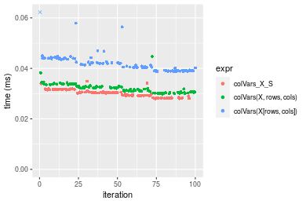

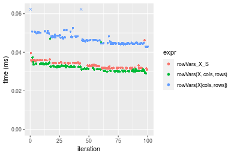
_Table: Benchmarking of colVars_X_S() and rowVars_X_S() on integer+1000x10 data (original and transposed).  The top panel shows times in milliseconds and the bottom panel shows relative times._


|   |expr        |    min|      lq|     mean|  median|      uq|    max|
|:--|:-----------|------:|-------:|--------:|-------:|-------:|------:|
|1  |colVars_X_S | 28.019| 29.2240| 30.27761| 30.3400| 31.5175| 34.922|
|2  |rowVars_X_S | 30.924| 31.9015| 33.52450| 33.0375| 34.4330| 46.180|


|   |expr        |     min|      lq|     mean|   median|       uq|      max|
|:--|:-----------|-------:|-------:|--------:|--------:|--------:|--------:|
|1  |colVars_X_S | 1.00000| 1.00000| 1.000000| 1.000000| 1.000000| 1.000000|
|2  |rowVars_X_S | 1.10368| 1.09162| 1.107237| 1.088909| 1.092504| 1.322376|

_Figure: Benchmarking of colVars_X_S() and rowVars_X_S() on integer+1000x10 data (original and transposed).  Outliers are displayed as crosses. Times are in milliseconds._


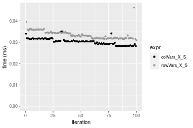

#### 10x1000 integer matrix

```r
> X <- data[["10x1000"]]
> rows <- sample.int(nrow(X), size = nrow(X) * 0.7)
> cols <- sample.int(ncol(X), size = ncol(X) * 0.7)
> X_S <- X[rows, cols]
> gc()
           used  (Mb) gc trigger  (Mb) max used  (Mb)
Ncells  5304887 283.4    8529671 455.6  8529671 455.6
Vcells 10219326  78.0   31876688 243.2 60562128 462.1
> colStats <- microbenchmark(colVars_X_S = colVars(X_S, na.rm = FALSE), `colVars(X, rows, cols)` = colVars(X, 
+     rows = rows, cols = cols, na.rm = FALSE), `colVars(X[rows, cols])` = colVars(X[rows, cols], na.rm = FALSE), 
+     unit = "ms")
> X <- t(X)
> X_S <- t(X_S)
> gc()
           used  (Mb) gc trigger  (Mb) max used  (Mb)
Ncells  5304863 283.4    8529671 455.6  8529671 455.6
Vcells 10224379  78.1   31876688 243.2 60562128 462.1
> rowStats <- microbenchmark(rowVars_X_S = rowVars(X_S, na.rm = FALSE), `rowVars(X, cols, rows)` = rowVars(X, 
+     rows = cols, cols = rows, na.rm = FALSE), `rowVars(X[cols, rows])` = rowVars(X[cols, rows], na.rm = FALSE), 
+     unit = "ms")
```

_Table: Benchmarking of colVars_X_S(), colVars(X, rows, cols)() and colVars(X[rows, cols])() on integer+10x1000 data. The top panel shows times in milliseconds and the bottom panel shows relative times._


|   |expr                   |      min|        lq|      mean|    median|        uq|      max|
|:--|:----------------------|--------:|---------:|---------:|---------:|---------:|--------:|
|1  |colVars_X_S            | 0.024115| 0.0252590| 0.0264496| 0.0262930| 0.0272620| 0.046359|
|2  |colVars(X, rows, cols) | 0.026724| 0.0277995| 0.0290717| 0.0287825| 0.0293585| 0.043846|
|3  |colVars(X[rows, cols]) | 0.036762| 0.0384355| 0.0400454| 0.0395665| 0.0412865| 0.056059|


|   |expr                   |      min|       lq|     mean|   median|       uq|       max|
|:--|:----------------------|--------:|--------:|--------:|--------:|--------:|---------:|
|1  |colVars_X_S            | 1.000000| 1.000000| 1.000000| 1.000000| 1.000000| 1.0000000|
|2  |colVars(X, rows, cols) | 1.108190| 1.100578| 1.099136| 1.094683| 1.076902| 0.9457926|
|3  |colVars(X[rows, cols]) | 1.524445| 1.521656| 1.514024| 1.504830| 1.514434| 1.2092366|

_Table: Benchmarking of rowVars_X_S(), rowVars(X, cols, rows)() and rowVars(X[cols, rows])() on integer+10x1000 data (transposed). The top panel shows times in milliseconds and the bottom panel shows relative times._


|   |expr                   |      min|        lq|      mean|    median|       uq|      max|
|:--|:----------------------|--------:|---------:|---------:|---------:|--------:|--------:|
|2  |rowVars(X, cols, rows) | 0.025886| 0.0266785| 0.0284970| 0.0276275| 0.028616| 0.052249|
|1  |rowVars_X_S            | 0.026625| 0.0274760| 0.0289053| 0.0289415| 0.030196| 0.039186|
|3  |rowVars(X[cols, rows]) | 0.037645| 0.0381920| 0.0407808| 0.0407245| 0.042712| 0.056766|


|   |expr                   |      min|       lq|     mean|   median|       uq|       max|
|:--|:----------------------|--------:|--------:|--------:|--------:|--------:|---------:|
|2  |rowVars(X, cols, rows) | 1.000000| 1.000000| 1.000000| 1.000000| 1.000000| 1.0000000|
|1  |rowVars_X_S            | 1.028548| 1.029893| 1.014329| 1.047561| 1.055214| 0.7499856|
|3  |rowVars(X[cols, rows]) | 1.454261| 1.431565| 1.431055| 1.474057| 1.492592| 1.0864514|

_Figure: Benchmarking of colVars_X_S(), colVars(X, rows, cols)() and colVars(X[rows, cols])() on integer+10x1000 data  as well as rowVars_X_S(), rowVars(X, cols, rows)() and rowVars(X[cols, rows])() on the same data transposed.  Outliers are displayed as crosses.  Times are in milliseconds._


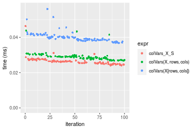

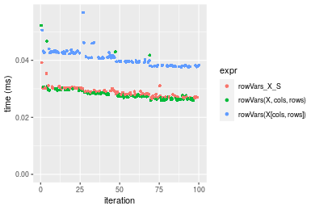
_Table: Benchmarking of colVars_X_S() and rowVars_X_S() on integer+10x1000 data (original and transposed).  The top panel shows times in milliseconds and the bottom panel shows relative times._


|   |expr        |    min|     lq|     mean|  median|     uq|    max|
|:--|:-----------|------:|------:|--------:|-------:|------:|------:|
|1  |colVars_X_S | 24.115| 25.259| 26.44962| 26.2930| 27.262| 46.359|
|2  |rowVars_X_S | 26.625| 27.476| 28.90532| 28.9415| 30.196| 39.186|


|   |expr        |      min|       lq|     mean|  median|       uq|       max|
|:--|:-----------|--------:|--------:|--------:|-------:|--------:|---------:|
|1  |colVars_X_S | 1.000000| 1.000000| 1.000000| 1.00000| 1.000000| 1.0000000|
|2  |rowVars_X_S | 1.104085| 1.087771| 1.092844| 1.10073| 1.107622| 0.8452728|

_Figure: Benchmarking of colVars_X_S() and rowVars_X_S() on integer+10x1000 data (original and transposed).  Outliers are displayed as crosses. Times are in milliseconds._


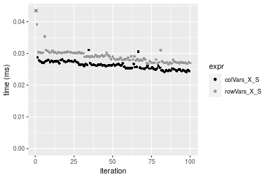

#### 100x1000 integer matrix

```r
> X <- data[["100x1000"]]
> rows <- sample.int(nrow(X), size = nrow(X) * 0.7)
> cols <- sample.int(ncol(X), size = ncol(X) * 0.7)
> X_S <- X[rows, cols]
> gc()
           used  (Mb) gc trigger  (Mb) max used  (Mb)
Ncells  5305097 283.4    8529671 455.6  8529671 455.6
Vcells 10241990  78.2   31876688 243.2 60562128 462.1
> colStats <- microbenchmark(colVars_X_S = colVars(X_S, na.rm = FALSE), `colVars(X, rows, cols)` = colVars(X, 
+     rows = rows, cols = cols, na.rm = FALSE), `colVars(X[rows, cols])` = colVars(X[rows, cols], na.rm = FALSE), 
+     unit = "ms")
> X <- t(X)
> X_S <- t(X_S)
> gc()
           used  (Mb) gc trigger  (Mb) max used  (Mb)
Ncells  5305073 283.4    8529671 455.6  8529671 455.6
Vcells 10292043  78.6   31876688 243.2 60562128 462.1
> rowStats <- microbenchmark(rowVars_X_S = rowVars(X_S, na.rm = FALSE), `rowVars(X, cols, rows)` = rowVars(X, 
+     rows = cols, cols = rows, na.rm = FALSE), `rowVars(X[cols, rows])` = rowVars(X[cols, rows], na.rm = FALSE), 
+     unit = "ms")
```

_Table: Benchmarking of colVars_X_S(), colVars(X, rows, cols)() and colVars(X[rows, cols])() on integer+100x1000 data. The top panel shows times in milliseconds and the bottom panel shows relative times._


|   |expr                   |      min|        lq|      mean|    median|        uq|      max|
|:--|:----------------------|--------:|---------:|---------:|---------:|---------:|--------:|
|2  |colVars(X, rows, cols) | 0.170699| 0.1713820| 0.1943607| 0.1804095| 0.2148900| 0.320984|
|1  |colVars_X_S            | 0.180924| 0.1814310| 0.2063428| 0.1918895| 0.2278745| 0.319186|
|3  |colVars(X[rows, cols]) | 0.246783| 0.2497795| 0.2871655| 0.2778190| 0.3137455| 0.382359|


|   |expr                   |      min|       lq|     mean|   median|       uq|       max|
|:--|:----------------------|--------:|--------:|--------:|--------:|--------:|---------:|
|2  |colVars(X, rows, cols) | 1.000000| 1.000000| 1.000000| 1.000000| 1.000000| 1.0000000|
|1  |colVars_X_S            | 1.059901| 1.058635| 1.061649| 1.063633| 1.060424| 0.9943985|
|3  |colVars(X[rows, cols]) | 1.445720| 1.457443| 1.477488| 1.539935| 1.460028| 1.1912089|

_Table: Benchmarking of rowVars_X_S(), rowVars(X, cols, rows)() and rowVars(X[cols, rows])() on integer+100x1000 data (transposed). The top panel shows times in milliseconds and the bottom panel shows relative times._


|   |expr                   |      min|        lq|      mean|    median|        uq|      max|
|:--|:----------------------|--------:|---------:|---------:|---------:|---------:|--------:|
|2  |rowVars(X, cols, rows) | 0.176198| 0.1771145| 0.1991892| 0.1815065| 0.2190860| 0.340945|
|1  |rowVars_X_S            | 0.199158| 0.1996755| 0.2363779| 0.2266205| 0.2590505| 0.364469|
|3  |rowVars(X[cols, rows]) | 0.262288| 0.2645515| 0.3063157| 0.2876855| 0.3367670| 0.448063|


|   |expr                   |      min|       lq|     mean|   median|       uq|      max|
|:--|:----------------------|--------:|--------:|--------:|--------:|--------:|--------:|
|2  |rowVars(X, cols, rows) | 1.000000| 1.000000| 1.000000| 1.000000| 1.000000| 1.000000|
|1  |rowVars_X_S            | 1.130308| 1.127381| 1.186701| 1.248553| 1.182415| 1.068996|
|3  |rowVars(X[cols, rows]) | 1.488598| 1.493675| 1.537813| 1.584987| 1.537145| 1.314180|

_Figure: Benchmarking of colVars_X_S(), colVars(X, rows, cols)() and colVars(X[rows, cols])() on integer+100x1000 data  as well as rowVars_X_S(), rowVars(X, cols, rows)() and rowVars(X[cols, rows])() on the same data transposed.  Outliers are displayed as crosses.  Times are in milliseconds._


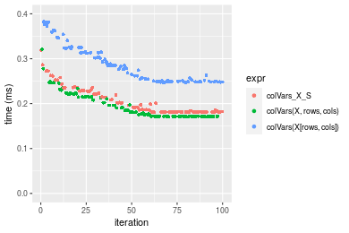

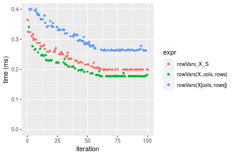
_Table: Benchmarking of colVars_X_S() and rowVars_X_S() on integer+100x1000 data (original and transposed).  The top panel shows times in milliseconds and the bottom panel shows relative times._


|   |expr        |     min|       lq|     mean|   median|       uq|     max|
|:--|:-----------|-------:|--------:|--------:|--------:|--------:|-------:|
|1  |colVars_X_S | 180.924| 181.4310| 206.3428| 191.8895| 227.8745| 319.186|
|2  |rowVars_X_S | 199.158| 199.6755| 236.3779| 226.6205| 259.0505| 364.469|


|   |expr        |      min|       lq|     mean|   median|       uq|     max|
|:--|:-----------|--------:|--------:|--------:|--------:|--------:|-------:|
|1  |colVars_X_S | 1.000000| 1.000000| 1.000000| 1.000000| 1.000000| 1.00000|
|2  |rowVars_X_S | 1.100783| 1.100559| 1.145559| 1.180995| 1.136812| 1.14187|

_Figure: Benchmarking of colVars_X_S() and rowVars_X_S() on integer+100x1000 data (original and transposed).  Outliers are displayed as crosses. Times are in milliseconds._


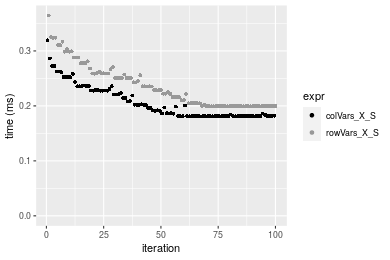

#### 1000x100 integer matrix

```r
> X <- data[["1000x100"]]
> rows <- sample.int(nrow(X), size = nrow(X) * 0.7)
> cols <- sample.int(ncol(X), size = ncol(X) * 0.7)
> X_S <- X[rows, cols]
> gc()
           used  (Mb) gc trigger  (Mb) max used  (Mb)
Ncells  5305310 283.4    8529671 455.6  8529671 455.6
Vcells 10242762  78.2   31876688 243.2 60562128 462.1
> colStats <- microbenchmark(colVars_X_S = colVars(X_S, na.rm = FALSE), `colVars(X, rows, cols)` = colVars(X, 
+     rows = rows, cols = cols, na.rm = FALSE), `colVars(X[rows, cols])` = colVars(X[rows, cols], na.rm = FALSE), 
+     unit = "ms")
> X <- t(X)
> X_S <- t(X_S)
> gc()
           used  (Mb) gc trigger  (Mb) max used  (Mb)
Ncells  5305286 283.4    8529671 455.6  8529671 455.6
Vcells 10292815  78.6   31876688 243.2 60562128 462.1
> rowStats <- microbenchmark(rowVars_X_S = rowVars(X_S, na.rm = FALSE), `rowVars(X, cols, rows)` = rowVars(X, 
+     rows = cols, cols = rows, na.rm = FALSE), `rowVars(X[cols, rows])` = rowVars(X[cols, rows], na.rm = FALSE), 
+     unit = "ms")
```

_Table: Benchmarking of colVars_X_S(), colVars(X, rows, cols)() and colVars(X[rows, cols])() on integer+1000x100 data. The top panel shows times in milliseconds and the bottom panel shows relative times._


|   |expr                   |      min|        lq|      mean|   median|        uq|      max|
|:--|:----------------------|--------:|---------:|---------:|--------:|---------:|--------:|
|1  |colVars_X_S            | 0.178698| 0.1792615| 0.2049866| 0.188912| 0.2250750| 0.313021|
|2  |colVars(X, rows, cols) | 0.170253| 0.1712710| 0.2008434| 0.195449| 0.2151080| 0.288070|
|3  |colVars(X[rows, cols]) | 0.242082| 0.2438890| 0.2862163| 0.272755| 0.3163155| 0.461182|


|   |expr                   |       min|        lq|      mean|   median|       uq|       max|
|:--|:----------------------|---------:|---------:|---------:|--------:|--------:|---------:|
|1  |colVars_X_S            | 1.0000000| 1.0000000| 1.0000000| 1.000000| 1.000000| 1.0000000|
|2  |colVars(X, rows, cols) | 0.9527415| 0.9554255| 0.9797881| 1.034603| 0.955717| 0.9202897|
|3  |colVars(X[rows, cols]) | 1.3546990| 1.3605208| 1.3962681| 1.443820| 1.405378| 1.4733261|

_Table: Benchmarking of rowVars_X_S(), rowVars(X, cols, rows)() and rowVars(X[cols, rows])() on integer+1000x100 data (transposed). The top panel shows times in milliseconds and the bottom panel shows relative times._


|   |expr                   |      min|       lq|      mean|    median|       uq|      max|
|:--|:----------------------|--------:|--------:|---------:|---------:|--------:|--------:|
|2  |rowVars(X, cols, rows) | 0.180915| 0.182972| 0.2118343| 0.1986295| 0.230347| 0.368540|
|1  |rowVars_X_S            | 0.203932| 0.204951| 0.2357006| 0.2190045| 0.263383| 0.342913|
|3  |rowVars(X[cols, rows]) | 0.270652| 0.272308| 0.3132944| 0.2891600| 0.353193| 0.459817|


|   |expr                   |      min|       lq|     mean|   median|       uq|       max|
|:--|:----------------------|--------:|--------:|--------:|--------:|--------:|---------:|
|2  |rowVars(X, cols, rows) | 1.000000| 1.000000| 1.000000| 1.000000| 1.000000| 1.0000000|
|1  |rowVars_X_S            | 1.127225| 1.120122| 1.112665| 1.102578| 1.143418| 0.9304635|
|3  |rowVars(X[cols, rows]) | 1.496018| 1.488250| 1.478960| 1.455776| 1.533308| 1.2476719|

_Figure: Benchmarking of colVars_X_S(), colVars(X, rows, cols)() and colVars(X[rows, cols])() on integer+1000x100 data  as well as rowVars_X_S(), rowVars(X, cols, rows)() and rowVars(X[cols, rows])() on the same data transposed.  Outliers are displayed as crosses.  Times are in milliseconds._


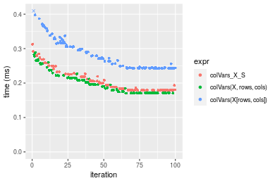

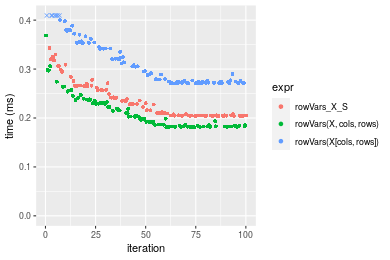
_Table: Benchmarking of colVars_X_S() and rowVars_X_S() on integer+1000x100 data (original and transposed).  The top panel shows times in milliseconds and the bottom panel shows relative times._


|   |expr        |     min|       lq|     mean|   median|      uq|     max|
|:--|:-----------|-------:|--------:|--------:|--------:|-------:|-------:|
|1  |colVars_X_S | 178.698| 179.2615| 204.9866| 188.9120| 225.075| 313.021|
|2  |rowVars_X_S | 203.932| 204.9510| 235.7006| 219.0045| 263.383| 342.913|


|   |expr        |     min|       lq|     mean|   median|       uq|      max|
|:--|:-----------|-------:|--------:|--------:|--------:|--------:|--------:|
|1  |colVars_X_S | 1.00000| 1.000000| 1.000000| 1.000000| 1.000000| 1.000000|
|2  |rowVars_X_S | 1.14121| 1.143307| 1.149834| 1.159294| 1.170201| 1.095495|

_Figure: Benchmarking of colVars_X_S() and rowVars_X_S() on integer+1000x100 data (original and transposed).  Outliers are displayed as crosses. Times are in milliseconds._


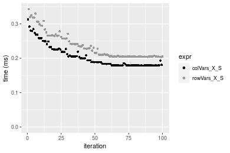


## Data type "double"

### Data
```r
> rmatrix <- function(nrow, ncol, mode = c("logical", "double", "integer", "index"), range = c(-100, 
+     +100), na_prob = 0) {
+     mode <- match.arg(mode)
+     n <- nrow * ncol
+     if (mode == "logical") {
+         x <- sample(c(FALSE, TRUE), size = n, replace = TRUE)
+     }     else if (mode == "index") {
+         x <- seq_len(n)
+         mode <- "integer"
+     }     else {
+         x <- runif(n, min = range[1], max = range[2])
+     }
+     storage.mode(x) <- mode
+     if (na_prob > 0) 
+         x[sample(n, size = na_prob * n)] <- NA
+     dim(x) <- c(nrow, ncol)
+     x
+ }
> rmatrices <- function(scale = 10, seed = 1, ...) {
+     set.seed(seed)
+     data <- list()
+     data[[1]] <- rmatrix(nrow = scale * 1, ncol = scale * 1, ...)
+     data[[2]] <- rmatrix(nrow = scale * 10, ncol = scale * 10, ...)
+     data[[3]] <- rmatrix(nrow = scale * 100, ncol = scale * 1, ...)
+     data[[4]] <- t(data[[3]])
+     data[[5]] <- rmatrix(nrow = scale * 10, ncol = scale * 100, ...)
+     data[[6]] <- t(data[[5]])
+     names(data) <- sapply(data, FUN = function(x) paste(dim(x), collapse = "x"))
+     data
+ }
> data <- rmatrices(mode = mode)
```

### Results

#### 10x10 double matrix

```r
> X <- data[["10x10"]]
> rows <- sample.int(nrow(X), size = nrow(X) * 0.7)
> cols <- sample.int(ncol(X), size = ncol(X) * 0.7)
> X_S <- X[rows, cols]
> gc()
           used  (Mb) gc trigger  (Mb) max used  (Mb)
Ncells  5305527 283.4    8529671 455.6  8529671 455.6
Vcells 10333858  78.9   31876688 243.2 60562128 462.1
> colStats <- microbenchmark(colVars_X_S = colVars(X_S, na.rm = FALSE), `colVars(X, rows, cols)` = colVars(X, 
+     rows = rows, cols = cols, na.rm = FALSE), `colVars(X[rows, cols])` = colVars(X[rows, cols], na.rm = FALSE), 
+     unit = "ms")
> X <- t(X)
> X_S <- t(X_S)
> gc()
           used  (Mb) gc trigger  (Mb) max used  (Mb)
Ncells  5305494 283.4    8529671 455.6  8529671 455.6
Vcells 10333996  78.9   31876688 243.2 60562128 462.1
> rowStats <- microbenchmark(rowVars_X_S = rowVars(X_S, na.rm = FALSE), `rowVars(X, cols, rows)` = rowVars(X, 
+     rows = cols, cols = rows, na.rm = FALSE), `rowVars(X[cols, rows])` = rowVars(X[cols, rows], na.rm = FALSE), 
+     unit = "ms")
```

_Table: Benchmarking of colVars_X_S(), colVars(X, rows, cols)() and colVars(X[rows, cols])() on double+10x10 data. The top panel shows times in milliseconds and the bottom panel shows relative times._


|   |expr                   |      min|        lq|      mean|    median|        uq|      max|
|:--|:----------------------|--------:|---------:|---------:|---------:|---------:|--------:|
|1  |colVars_X_S            | 0.002423| 0.0025035| 0.0027823| 0.0025600| 0.0026405| 0.019923|
|2  |colVars(X, rows, cols) | 0.002790| 0.0029340| 0.0030901| 0.0030425| 0.0031570| 0.005115|
|3  |colVars(X[rows, cols]) | 0.003314| 0.0035325| 0.0037636| 0.0036705| 0.0038240| 0.008721|


|   |expr                   |      min|       lq|     mean|   median|       uq|       max|
|:--|:----------------------|--------:|--------:|--------:|--------:|--------:|---------:|
|1  |colVars_X_S            | 1.000000| 1.000000| 1.000000| 1.000000| 1.000000| 1.0000000|
|2  |colVars(X, rows, cols) | 1.151465| 1.171959| 1.110621| 1.188477| 1.195607| 0.2567384|
|3  |colVars(X[rows, cols]) | 1.367726| 1.411025| 1.352713| 1.433789| 1.448211| 0.4377353|

_Table: Benchmarking of rowVars_X_S(), rowVars(X, cols, rows)() and rowVars(X[cols, rows])() on double+10x10 data (transposed). The top panel shows times in milliseconds and the bottom panel shows relative times._


|   |expr                   |      min|       lq|      mean|    median|        uq|      max|
|:--|:----------------------|--------:|--------:|---------:|---------:|---------:|--------:|
|1  |rowVars_X_S            | 0.002438| 0.002495| 0.0026244| 0.0025585| 0.0026630| 0.005217|
|2  |rowVars(X, cols, rows) | 0.002836| 0.002919| 0.0032354| 0.0030095| 0.0031415| 0.020951|
|3  |rowVars(X[cols, rows]) | 0.003357| 0.003563| 0.0037771| 0.0036510| 0.0037745| 0.009268|


|   |expr                   |      min|       lq|     mean|   median|       uq|     max|
|:--|:----------------------|--------:|--------:|--------:|--------:|--------:|-------:|
|1  |rowVars_X_S            | 1.000000| 1.000000| 1.000000| 1.000000| 1.000000| 1.00000|
|2  |rowVars(X, cols, rows) | 1.163249| 1.169940| 1.232799| 1.176275| 1.179685| 4.01591|
|3  |rowVars(X[cols, rows]) | 1.376948| 1.428056| 1.439219| 1.427008| 1.417386| 1.77650|

_Figure: Benchmarking of colVars_X_S(), colVars(X, rows, cols)() and colVars(X[rows, cols])() on double+10x10 data  as well as rowVars_X_S(), rowVars(X, cols, rows)() and rowVars(X[cols, rows])() on the same data transposed.  Outliers are displayed as crosses.  Times are in milliseconds._


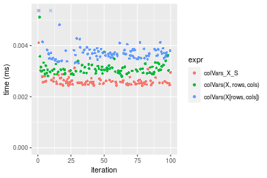

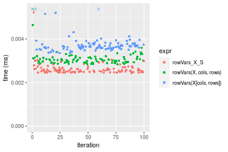
_Table: Benchmarking of colVars_X_S() and rowVars_X_S() on double+10x10 data (original and transposed).  The top panel shows times in milliseconds and the bottom panel shows relative times._


|   |expr        |   min|     lq|    mean| median|     uq|    max|
|:--|:-----------|-----:|------:|-------:|------:|------:|------:|
|2  |rowVars_X_S | 2.438| 2.4950| 2.62441| 2.5585| 2.6630|  5.217|
|1  |colVars_X_S | 2.423| 2.5035| 2.78229| 2.5600| 2.6405| 19.923|


|   |expr        |       min|       lq|     mean|   median|        uq|      max|
|:--|:-----------|---------:|--------:|--------:|--------:|---------:|--------:|
|2  |rowVars_X_S | 1.0000000| 1.000000| 1.000000| 1.000000| 1.0000000| 1.000000|
|1  |colVars_X_S | 0.9938474| 1.003407| 1.060158| 1.000586| 0.9915509| 3.818861|

_Figure: Benchmarking of colVars_X_S() and rowVars_X_S() on double+10x10 data (original and transposed).  Outliers are displayed as crosses. Times are in milliseconds._


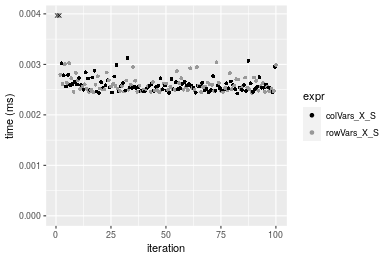

#### 100x100 double matrix

```r
> X <- data[["100x100"]]
> rows <- sample.int(nrow(X), size = nrow(X) * 0.7)
> cols <- sample.int(ncol(X), size = ncol(X) * 0.7)
> X_S <- X[rows, cols]
> gc()
           used  (Mb) gc trigger  (Mb) max used  (Mb)
Ncells  5305724 283.4    8529671 455.6  8529671 455.6
Vcells 10339798  78.9   31876688 243.2 60562128 462.1
> colStats <- microbenchmark(colVars_X_S = colVars(X_S, na.rm = FALSE), `colVars(X, rows, cols)` = colVars(X, 
+     rows = rows, cols = cols, na.rm = FALSE), `colVars(X[rows, cols])` = colVars(X[rows, cols], na.rm = FALSE), 
+     unit = "ms")
> X <- t(X)
> X_S <- t(X_S)
> gc()
           used  (Mb) gc trigger  (Mb) max used  (Mb)
Ncells  5305700 283.4    8529671 455.6  8529671 455.6
Vcells 10349851  79.0   31876688 243.2 60562128 462.1
> rowStats <- microbenchmark(rowVars_X_S = rowVars(X_S, na.rm = FALSE), `rowVars(X, cols, rows)` = rowVars(X, 
+     rows = cols, cols = rows, na.rm = FALSE), `rowVars(X[cols, rows])` = rowVars(X[cols, rows], na.rm = FALSE), 
+     unit = "ms")
```

_Table: Benchmarking of colVars_X_S(), colVars(X, rows, cols)() and colVars(X[rows, cols])() on double+100x100 data. The top panel shows times in milliseconds and the bottom panel shows relative times._


|   |expr                   |      min|        lq|      mean|    median|        uq|      max|
|:--|:----------------------|--------:|---------:|---------:|---------:|---------:|--------:|
|2  |colVars(X, rows, cols) | 0.027517| 0.0283115| 0.0297297| 0.0294775| 0.0307375| 0.034834|
|1  |colVars_X_S            | 0.028107| 0.0286775| 0.0301949| 0.0299240| 0.0311230| 0.034625|
|3  |colVars(X[rows, cols]) | 0.042798| 0.0433775| 0.0465208| 0.0459590| 0.0477750| 0.077095|


|   |expr                   |      min|       lq|     mean|   median|       uq|       max|
|:--|:----------------------|--------:|--------:|--------:|--------:|--------:|---------:|
|2  |colVars(X, rows, cols) | 1.000000| 1.000000| 1.000000| 1.000000| 1.000000| 1.0000000|
|1  |colVars_X_S            | 1.021441| 1.012928| 1.015645| 1.015147| 1.012542| 0.9940001|
|3  |colVars(X[rows, cols]) | 1.555329| 1.532151| 1.564788| 1.559121| 1.554290| 2.2132112|

_Table: Benchmarking of rowVars_X_S(), rowVars(X, cols, rows)() and rowVars(X[cols, rows])() on double+100x100 data (transposed). The top panel shows times in milliseconds and the bottom panel shows relative times._


|   |expr                   |      min|        lq|      mean|    median|        uq|      max|
|:--|:----------------------|--------:|---------:|---------:|---------:|---------:|--------:|
|2  |rowVars(X, cols, rows) | 0.027510| 0.0285280| 0.0302492| 0.0300195| 0.0308850| 0.055849|
|1  |rowVars_X_S            | 0.027792| 0.0283365| 0.0301394| 0.0303665| 0.0311465| 0.045532|
|3  |rowVars(X[cols, rows]) | 0.042626| 0.0430955| 0.0456128| 0.0455615| 0.0467870| 0.058819|


|   |expr                   |      min|        lq|      mean|   median|       uq|       max|
|:--|:----------------------|--------:|---------:|---------:|--------:|--------:|---------:|
|2  |rowVars(X, cols, rows) | 1.000000| 1.0000000| 1.0000000| 1.000000| 1.000000| 1.0000000|
|1  |rowVars_X_S            | 1.010251| 0.9932873| 0.9963688| 1.011559| 1.008467| 0.8152697|
|3  |rowVars(X[cols, rows]) | 1.549473| 1.5106387| 1.5078994| 1.517730| 1.514878| 1.0531791|

_Figure: Benchmarking of colVars_X_S(), colVars(X, rows, cols)() and colVars(X[rows, cols])() on double+100x100 data  as well as rowVars_X_S(), rowVars(X, cols, rows)() and rowVars(X[cols, rows])() on the same data transposed.  Outliers are displayed as crosses.  Times are in milliseconds._


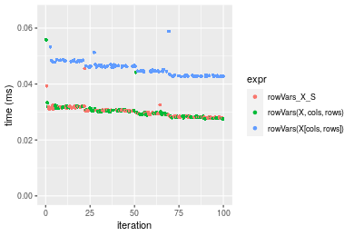
_Table: Benchmarking of colVars_X_S() and rowVars_X_S() on double+100x100 data (original and transposed).  The top panel shows times in milliseconds and the bottom panel shows relative times._


|   |expr        |    min|      lq|     mean|  median|      uq|    max|
|:--|:-----------|------:|-------:|--------:|-------:|-------:|------:|
|1  |colVars_X_S | 28.107| 28.6775| 30.19486| 29.9240| 31.1230| 34.625|
|2  |rowVars_X_S | 27.792| 28.3365| 30.13938| 30.3665| 31.1465| 45.532|


|   |expr        |       min|        lq|      mean|   median|       uq|      max|
|:--|:-----------|---------:|---------:|---------:|--------:|--------:|--------:|
|1  |colVars_X_S | 1.0000000| 1.0000000| 1.0000000| 1.000000| 1.000000| 1.000000|
|2  |rowVars_X_S | 0.9887928| 0.9881091| 0.9981626| 1.014787| 1.000755| 1.315004|

_Figure: Benchmarking of colVars_X_S() and rowVars_X_S() on double+100x100 data (original and transposed).  Outliers are displayed as crosses. Times are in milliseconds._


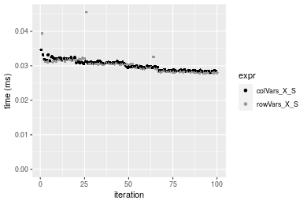

#### 1000x10 double matrix

```r
> X <- data[["1000x10"]]
> rows <- sample.int(nrow(X), size = nrow(X) * 0.7)
> cols <- sample.int(ncol(X), size = ncol(X) * 0.7)
> X_S <- X[rows, cols]
> gc()
           used  (Mb) gc trigger  (Mb) max used  (Mb)
Ncells  5305924 283.4    8529671 455.6  8529671 455.6
Vcells 10341197  78.9   31876688 243.2 60562128 462.1
> colStats <- microbenchmark(colVars_X_S = colVars(X_S, na.rm = FALSE), `colVars(X, rows, cols)` = colVars(X, 
+     rows = rows, cols = cols, na.rm = FALSE), `colVars(X[rows, cols])` = colVars(X[rows, cols], na.rm = FALSE), 
+     unit = "ms")
> X <- t(X)
> X_S <- t(X_S)
> gc()
           used  (Mb) gc trigger  (Mb) max used  (Mb)
Ncells  5305900 283.4    8529671 455.6  8529671 455.6
Vcells 10351250  79.0   31876688 243.2 60562128 462.1
> rowStats <- microbenchmark(rowVars_X_S = rowVars(X_S, na.rm = FALSE), `rowVars(X, cols, rows)` = rowVars(X, 
+     rows = cols, cols = rows, na.rm = FALSE), `rowVars(X[cols, rows])` = rowVars(X[cols, rows], na.rm = FALSE), 
+     unit = "ms")
```

_Table: Benchmarking of colVars_X_S(), colVars(X, rows, cols)() and colVars(X[rows, cols])() on double+1000x10 data. The top panel shows times in milliseconds and the bottom panel shows relative times._


|   |expr                   |      min|        lq|      mean|    median|        uq|      max|
|:--|:----------------------|--------:|---------:|---------:|---------:|---------:|--------:|
|1  |colVars_X_S            | 0.028114| 0.0292890| 0.0303046| 0.0303190| 0.0307595| 0.045685|
|2  |colVars(X, rows, cols) | 0.028809| 0.0309165| 0.0322758| 0.0321100| 0.0328970| 0.044336|
|3  |colVars(X[rows, cols]) | 0.042581| 0.0438735| 0.0467559| 0.0455775| 0.0473600| 0.081429|


|   |expr                   |      min|       lq|     mean|   median|       uq|       max|
|:--|:----------------------|--------:|--------:|--------:|--------:|--------:|---------:|
|1  |colVars_X_S            | 1.000000| 1.000000| 1.000000| 1.000000| 1.000000| 1.0000000|
|2  |colVars(X, rows, cols) | 1.024721| 1.055567| 1.065045| 1.059072| 1.069491| 0.9704717|
|3  |colVars(X[rows, cols]) | 1.514584| 1.497951| 1.542865| 1.503265| 1.539687| 1.7824012|

_Table: Benchmarking of rowVars_X_S(), rowVars(X, cols, rows)() and rowVars(X[cols, rows])() on double+1000x10 data (transposed). The top panel shows times in milliseconds and the bottom panel shows relative times._


|   |expr                   |      min|       lq|      mean|    median|       uq|      max|
|:--|:----------------------|--------:|--------:|---------:|---------:|--------:|--------:|
|1  |rowVars_X_S            | 0.027404| 0.029216| 0.0303824| 0.0296630| 0.031700| 0.044171|
|2  |rowVars(X, cols, rows) | 0.029509| 0.031362| 0.0328319| 0.0328285| 0.034127| 0.043699|
|3  |rowVars(X[cols, rows]) | 0.044517| 0.047763| 0.0497608| 0.0483685| 0.051843| 0.086874|


|   |expr                   |      min|       lq|     mean|   median|       uq|       max|
|:--|:----------------------|--------:|--------:|--------:|--------:|--------:|---------:|
|1  |rowVars_X_S            | 1.000000| 1.000000| 1.000000| 1.000000| 1.000000| 1.0000000|
|2  |rowVars(X, cols, rows) | 1.076814| 1.073453| 1.080622| 1.106715| 1.076561| 0.9893143|
|3  |rowVars(X[cols, rows]) | 1.624471| 1.634823| 1.637817| 1.630600| 1.635426| 1.9667655|

_Figure: Benchmarking of colVars_X_S(), colVars(X, rows, cols)() and colVars(X[rows, cols])() on double+1000x10 data  as well as rowVars_X_S(), rowVars(X, cols, rows)() and rowVars(X[cols, rows])() on the same data transposed.  Outliers are displayed as crosses.  Times are in milliseconds._


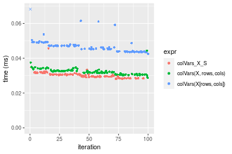

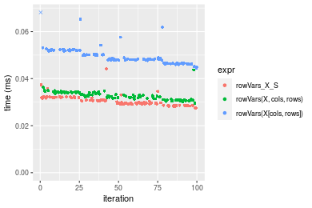
_Table: Benchmarking of colVars_X_S() and rowVars_X_S() on double+1000x10 data (original and transposed).  The top panel shows times in milliseconds and the bottom panel shows relative times._


|   |expr        |    min|     lq|     mean| median|      uq|    max|
|:--|:-----------|------:|------:|--------:|------:|-------:|------:|
|2  |rowVars_X_S | 27.404| 29.216| 30.38238| 29.663| 31.7000| 44.171|
|1  |colVars_X_S | 28.114| 29.289| 30.30461| 30.319| 30.7595| 45.685|


|   |expr        |      min|       lq|      mean|   median|        uq|      max|
|:--|:-----------|--------:|--------:|---------:|--------:|---------:|--------:|
|2  |rowVars_X_S | 1.000000| 1.000000| 1.0000000| 1.000000| 1.0000000| 1.000000|
|1  |colVars_X_S | 1.025909| 1.002499| 0.9974403| 1.022115| 0.9703312| 1.034276|

_Figure: Benchmarking of colVars_X_S() and rowVars_X_S() on double+1000x10 data (original and transposed).  Outliers are displayed as crosses. Times are in milliseconds._


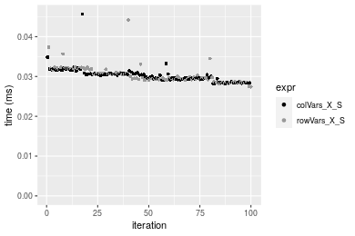

#### 10x1000 double matrix

```r
> X <- data[["10x1000"]]
> rows <- sample.int(nrow(X), size = nrow(X) * 0.7)
> cols <- sample.int(ncol(X), size = ncol(X) * 0.7)
> X_S <- X[rows, cols]
> gc()
           used  (Mb) gc trigger  (Mb) max used  (Mb)
Ncells  5306129 283.4    8529671 455.6  8529671 455.6
Vcells 10341333  78.9   31876688 243.2 60562128 462.1
> colStats <- microbenchmark(colVars_X_S = colVars(X_S, na.rm = FALSE), `colVars(X, rows, cols)` = colVars(X, 
+     rows = rows, cols = cols, na.rm = FALSE), `colVars(X[rows, cols])` = colVars(X[rows, cols], na.rm = FALSE), 
+     unit = "ms")
> X <- t(X)
> X_S <- t(X_S)
> gc()
           used  (Mb) gc trigger  (Mb) max used  (Mb)
Ncells  5306105 283.4    8529671 455.6  8529671 455.6
Vcells 10351386  79.0   31876688 243.2 60562128 462.1
> rowStats <- microbenchmark(rowVars_X_S = rowVars(X_S, na.rm = FALSE), `rowVars(X, cols, rows)` = rowVars(X, 
+     rows = cols, cols = rows, na.rm = FALSE), `rowVars(X[cols, rows])` = rowVars(X[cols, rows], na.rm = FALSE), 
+     unit = "ms")
```

_Table: Benchmarking of colVars_X_S(), colVars(X, rows, cols)() and colVars(X[rows, cols])() on double+10x1000 data. The top panel shows times in milliseconds and the bottom panel shows relative times._


|   |expr                   |      min|        lq|      mean|    median|        uq|      max|
|:--|:----------------------|--------:|---------:|---------:|---------:|---------:|--------:|
|1  |colVars_X_S            | 0.022560| 0.0230830| 0.0248897| 0.0246065| 0.0255495| 0.046647|
|2  |colVars(X, rows, cols) | 0.024435| 0.0254435| 0.0271204| 0.0267215| 0.0278235| 0.049176|
|3  |colVars(X[rows, cols]) | 0.040151| 0.0410115| 0.0434201| 0.0438420| 0.0449765| 0.051028|


|   |expr                   |      min|       lq|     mean|   median|       uq|      max|
|:--|:----------------------|--------:|--------:|--------:|--------:|--------:|--------:|
|1  |colVars_X_S            | 1.000000| 1.000000| 1.000000| 1.000000| 1.000000| 1.000000|
|2  |colVars(X, rows, cols) | 1.083112| 1.102261| 1.089624| 1.085953| 1.089004| 1.054216|
|3  |colVars(X[rows, cols]) | 1.779743| 1.776697| 1.744498| 1.781724| 1.760367| 1.093918|

_Table: Benchmarking of rowVars_X_S(), rowVars(X, cols, rows)() and rowVars(X[cols, rows])() on double+10x1000 data (transposed). The top panel shows times in milliseconds and the bottom panel shows relative times._


|   |expr                   |      min|        lq|      mean|    median|        uq|      max|
|:--|:----------------------|--------:|---------:|---------:|---------:|---------:|--------:|
|1  |rowVars_X_S            | 0.022952| 0.0244625| 0.0254638| 0.0254965| 0.0261215| 0.038473|
|2  |rowVars(X, cols, rows) | 0.024120| 0.0259270| 0.0274347| 0.0267445| 0.0276475| 0.053115|
|3  |rowVars(X[cols, rows]) | 0.038254| 0.0402460| 0.0420541| 0.0417415| 0.0432995| 0.057531|


|   |expr                   |      min|       lq|     mean|   median|       uq|      max|
|:--|:----------------------|--------:|--------:|--------:|--------:|--------:|--------:|
|1  |rowVars_X_S            | 1.000000| 1.000000| 1.000000| 1.000000| 1.000000| 1.000000|
|2  |rowVars(X, cols, rows) | 1.050889| 1.059867| 1.077401| 1.048948| 1.058419| 1.380579|
|3  |rowVars(X[cols, rows]) | 1.666696| 1.645212| 1.651524| 1.637146| 1.657619| 1.495360|

_Figure: Benchmarking of colVars_X_S(), colVars(X, rows, cols)() and colVars(X[rows, cols])() on double+10x1000 data  as well as rowVars_X_S(), rowVars(X, cols, rows)() and rowVars(X[cols, rows])() on the same data transposed.  Outliers are displayed as crosses.  Times are in milliseconds._


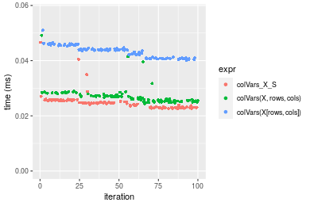

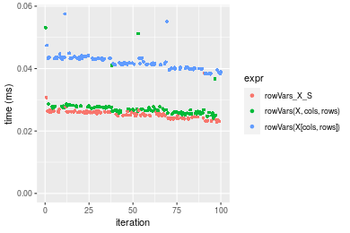
_Table: Benchmarking of colVars_X_S() and rowVars_X_S() on double+10x1000 data (original and transposed).  The top panel shows times in milliseconds and the bottom panel shows relative times._


|   |expr        |    min|      lq|     mean|  median|      uq|    max|
|:--|:-----------|------:|-------:|--------:|-------:|-------:|------:|
|1  |colVars_X_S | 22.560| 23.0830| 24.88972| 24.6065| 25.5495| 46.647|
|2  |rowVars_X_S | 22.952| 24.4625| 25.46378| 25.4965| 26.1215| 38.473|


|   |expr        |      min|       lq|     mean|   median|       uq|      max|
|:--|:-----------|--------:|--------:|--------:|--------:|--------:|--------:|
|1  |colVars_X_S | 1.000000| 1.000000| 1.000000| 1.000000| 1.000000| 1.000000|
|2  |rowVars_X_S | 1.017376| 1.059763| 1.023064| 1.036169| 1.022388| 0.824769|

_Figure: Benchmarking of colVars_X_S() and rowVars_X_S() on double+10x1000 data (original and transposed).  Outliers are displayed as crosses. Times are in milliseconds._


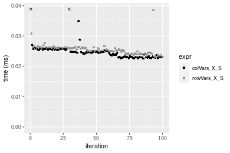

#### 100x1000 double matrix

```r
> X <- data[["100x1000"]]
> rows <- sample.int(nrow(X), size = nrow(X) * 0.7)
> cols <- sample.int(ncol(X), size = ncol(X) * 0.7)
> X_S <- X[rows, cols]
> gc()
           used  (Mb) gc trigger  (Mb) max used  (Mb)
Ncells  5306339 283.4    8529671 455.6  8529671 455.6
Vcells 10386780  79.3   31876688 243.2 60562128 462.1
> colStats <- microbenchmark(colVars_X_S = colVars(X_S, na.rm = FALSE), `colVars(X, rows, cols)` = colVars(X, 
+     rows = rows, cols = cols, na.rm = FALSE), `colVars(X[rows, cols])` = colVars(X[rows, cols], na.rm = FALSE), 
+     unit = "ms")
> X <- t(X)
> X_S <- t(X_S)
> gc()
           used  (Mb) gc trigger  (Mb) max used  (Mb)
Ncells  5306315 283.4    8529671 455.6  8529671 455.6
Vcells 10486833  80.1   31876688 243.2 60562128 462.1
> rowStats <- microbenchmark(rowVars_X_S = rowVars(X_S, na.rm = FALSE), `rowVars(X, cols, rows)` = rowVars(X, 
+     rows = cols, cols = rows, na.rm = FALSE), `rowVars(X[cols, rows])` = rowVars(X[cols, rows], na.rm = FALSE), 
+     unit = "ms")
```

_Table: Benchmarking of colVars_X_S(), colVars(X, rows, cols)() and colVars(X[rows, cols])() on double+100x1000 data. The top panel shows times in milliseconds and the bottom panel shows relative times._


|   |expr                   |      min|        lq|      mean|    median|        uq|      max|
|:--|:----------------------|--------:|---------:|---------:|---------:|---------:|--------:|
|2  |colVars(X, rows, cols) | 0.169359| 0.1701765| 0.1952870| 0.1838380| 0.2132940| 0.351037|
|1  |colVars_X_S            | 0.179704| 0.1802660| 0.2073025| 0.1907365| 0.2266135| 0.318807|
|3  |colVars(X[rows, cols]) | 0.274232| 0.2768420| 0.3249188| 0.3157020| 0.3540155| 0.463902|


|   |expr                   |      min|       lq|     mean|   median|       uq|       max|
|:--|:----------------------|--------:|--------:|--------:|--------:|--------:|---------:|
|2  |colVars(X, rows, cols) | 1.000000| 1.000000| 1.000000| 1.000000| 1.000000| 1.0000000|
|1  |colVars_X_S            | 1.061083| 1.059288| 1.061527| 1.037525| 1.062447| 0.9081863|
|3  |colVars(X[rows, cols]) | 1.619235| 1.626793| 1.663802| 1.717284| 1.659754| 1.3215188|

_Table: Benchmarking of rowVars_X_S(), rowVars(X, cols, rows)() and rowVars(X[cols, rows])() on double+100x1000 data (transposed). The top panel shows times in milliseconds and the bottom panel shows relative times._


|   |expr                   |      min|        lq|      mean|    median|        uq|      max|
|:--|:----------------------|--------:|---------:|---------:|---------:|---------:|--------:|
|2  |rowVars(X, cols, rows) | 0.185157| 0.1873580| 0.2378642| 0.2130875| 0.2735040| 0.424047|
|1  |rowVars_X_S            | 0.178136| 0.1936855| 0.2526022| 0.2286480| 0.2974055| 0.457705|
|3  |rowVars(X[cols, rows]) | 0.272941| 0.2953370| 0.3768145| 0.3430070| 0.4457450| 0.687151|


|   |expr                   |       min|       lq|     mean|   median|       uq|      max|
|:--|:----------------------|---------:|--------:|--------:|--------:|--------:|--------:|
|2  |rowVars(X, cols, rows) | 1.0000000| 1.000000| 1.000000| 1.000000| 1.000000| 1.000000|
|1  |rowVars_X_S            | 0.9620808| 1.033772| 1.061960| 1.073024| 1.087390| 1.079373|
|3  |rowVars(X[cols, rows]) | 1.4741058| 1.576324| 1.584158| 1.609700| 1.629757| 1.620459|

_Figure: Benchmarking of colVars_X_S(), colVars(X, rows, cols)() and colVars(X[rows, cols])() on double+100x1000 data  as well as rowVars_X_S(), rowVars(X, cols, rows)() and rowVars(X[cols, rows])() on the same data transposed.  Outliers are displayed as crosses.  Times are in milliseconds._


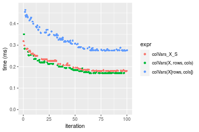

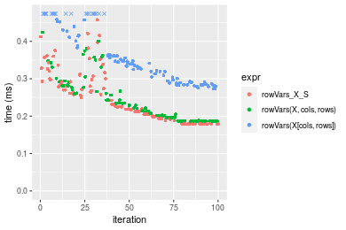
_Table: Benchmarking of colVars_X_S() and rowVars_X_S() on double+100x1000 data (original and transposed).  The top panel shows times in milliseconds and the bottom panel shows relative times._


|   |expr        |     min|       lq|     mean|   median|       uq|     max|
|:--|:-----------|-------:|--------:|--------:|--------:|--------:|-------:|
|1  |colVars_X_S | 179.704| 180.2660| 207.3025| 190.7365| 226.6135| 318.807|
|2  |rowVars_X_S | 178.136| 193.6855| 252.6022| 228.6480| 297.4055| 457.705|


|   |expr        |       min|       lq|    mean|   median|       uq|     max|
|:--|:-----------|---------:|--------:|-------:|--------:|--------:|-------:|
|1  |colVars_X_S | 1.0000000| 1.000000| 1.00000| 1.000000| 1.000000| 1.00000|
|2  |rowVars_X_S | 0.9912745| 1.074443| 1.21852| 1.198764| 1.312391| 1.43568|

_Figure: Benchmarking of colVars_X_S() and rowVars_X_S() on double+100x1000 data (original and transposed).  Outliers are displayed as crosses. Times are in milliseconds._


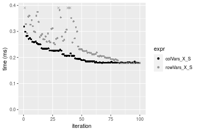

#### 1000x100 double matrix

```r
> X <- data[["1000x100"]]
> rows <- sample.int(nrow(X), size = nrow(X) * 0.7)
> cols <- sample.int(ncol(X), size = ncol(X) * 0.7)
> X_S <- X[rows, cols]
> gc()
           used  (Mb) gc trigger  (Mb) max used  (Mb)
Ncells  5306552 283.5    8529671 455.6  8529671 455.6
Vcells 10386924  79.3   31876688 243.2 60562128 462.1
> colStats <- microbenchmark(colVars_X_S = colVars(X_S, na.rm = FALSE), `colVars(X, rows, cols)` = colVars(X, 
+     rows = rows, cols = cols, na.rm = FALSE), `colVars(X[rows, cols])` = colVars(X[rows, cols], na.rm = FALSE), 
+     unit = "ms")
> X <- t(X)
> X_S <- t(X_S)
> gc()
           used  (Mb) gc trigger  (Mb) max used  (Mb)
Ncells  5306528 283.4    8529671 455.6  8529671 455.6
Vcells 10486977  80.1   31876688 243.2 60562128 462.1
> rowStats <- microbenchmark(rowVars_X_S = rowVars(X_S, na.rm = FALSE), `rowVars(X, cols, rows)` = rowVars(X, 
+     rows = cols, cols = rows, na.rm = FALSE), `rowVars(X[cols, rows])` = rowVars(X[cols, rows], na.rm = FALSE), 
+     unit = "ms")
```

_Table: Benchmarking of colVars_X_S(), colVars(X, rows, cols)() and colVars(X[rows, cols])() on double+1000x100 data. The top panel shows times in milliseconds and the bottom panel shows relative times._


|   |expr                   |      min|        lq|      mean|    median|        uq|      max|
|:--|:----------------------|--------:|---------:|---------:|---------:|---------:|--------:|
|1  |colVars_X_S            | 0.178952| 0.1793685| 0.2051606| 0.1906165| 0.2189645| 0.341077|
|2  |colVars(X, rows, cols) | 0.171817| 0.1729900| 0.2030784| 0.1971150| 0.2166705| 0.305432|
|3  |colVars(X[rows, cols]) | 0.272187| 0.2754670| 0.3221239| 0.3077675| 0.3538490| 0.544893|


|   |expr                   |      min|        lq|      mean|   median|        uq|       max|
|:--|:----------------------|--------:|---------:|---------:|--------:|---------:|---------:|
|1  |colVars_X_S            | 1.000000| 1.0000000| 1.0000000| 1.000000| 1.0000000| 1.0000000|
|2  |colVars(X, rows, cols) | 0.960129| 0.9644391| 0.9898507| 1.034092| 0.9895234| 0.8954928|
|3  |colVars(X[rows, cols]) | 1.521006| 1.5357602| 1.5701058| 1.614590| 1.6160108| 1.5975659|

_Table: Benchmarking of rowVars_X_S(), rowVars(X, cols, rows)() and rowVars(X[cols, rows])() on double+1000x100 data (transposed). The top panel shows times in milliseconds and the bottom panel shows relative times._


|   |expr                   |      min|        lq|      mean|    median|        uq|      max|
|:--|:----------------------|--------:|---------:|---------:|---------:|---------:|--------:|
|1  |rowVars_X_S            | 0.179657| 0.1806765| 0.2120898| 0.2022000| 0.2313065| 0.334975|
|2  |rowVars(X, cols, rows) | 0.192060| 0.1937910| 0.2292665| 0.2210560| 0.2504780| 0.442760|
|3  |rowVars(X[cols, rows]) | 0.276550| 0.2855770| 0.3323317| 0.3093595| 0.3642020| 0.471504|


|   |expr                   |      min|       lq|     mean|   median|       uq|     max|
|:--|:----------------------|--------:|--------:|--------:|--------:|--------:|-------:|
|1  |rowVars_X_S            | 1.000000| 1.000000| 1.000000| 1.000000| 1.000000| 1.00000|
|2  |rowVars(X, cols, rows) | 1.069037| 1.072585| 1.080988| 1.093254| 1.082884| 1.32177|
|3  |rowVars(X[cols, rows]) | 1.539322| 1.580599| 1.566938| 1.529968| 1.574543| 1.40758|

_Figure: Benchmarking of colVars_X_S(), colVars(X, rows, cols)() and colVars(X[rows, cols])() on double+1000x100 data  as well as rowVars_X_S(), rowVars(X, cols, rows)() and rowVars(X[cols, rows])() on the same data transposed.  Outliers are displayed as crosses.  Times are in milliseconds._


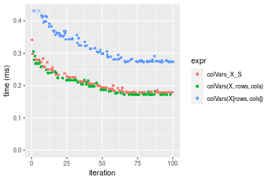

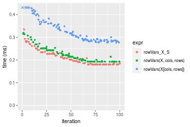
_Table: Benchmarking of colVars_X_S() and rowVars_X_S() on double+1000x100 data (original and transposed).  The top panel shows times in milliseconds and the bottom panel shows relative times._


|   |expr        |     min|       lq|     mean|   median|       uq|     max|
|:--|:-----------|-------:|--------:|--------:|--------:|--------:|-------:|
|1  |colVars_X_S | 178.952| 179.3685| 205.1606| 190.6165| 218.9645| 341.077|
|2  |rowVars_X_S | 179.657| 180.6765| 212.0898| 202.2000| 231.3065| 334.975|


|   |expr        |     min|       lq|     mean|   median|       uq|       max|
|:--|:-----------|-------:|--------:|--------:|--------:|--------:|---------:|
|1  |colVars_X_S | 1.00000| 1.000000| 1.000000| 1.000000| 1.000000| 1.0000000|
|2  |rowVars_X_S | 1.00394| 1.007292| 1.033775| 1.060769| 1.056365| 0.9821096|

_Figure: Benchmarking of colVars_X_S() and rowVars_X_S() on double+1000x100 data (original and transposed).  Outliers are displayed as crosses. Times are in milliseconds._


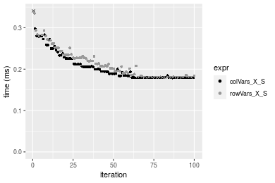


## Appendix

### Session information
```r
R version 4.1.1 Patched (2021-08-10 r80727)
Platform: x86_64-pc-linux-gnu (64-bit)
Running under: Ubuntu 18.04.5 LTS

Matrix products: default
BLAS:   /home/hb/software/R-devel/R-4-1-branch/lib/R/lib/libRblas.so
LAPACK: /home/hb/software/R-devel/R-4-1-branch/lib/R/lib/libRlapack.so

locale:
 [1] LC_CTYPE=en_US.UTF-8       LC_NUMERIC=C              
 [3] LC_TIME=en_US.UTF-8        LC_COLLATE=en_US.UTF-8    
 [5] LC_MONETARY=en_US.UTF-8    LC_MESSAGES=en_US.UTF-8   
 [7] LC_PAPER=en_US.UTF-8       LC_NAME=C                 
 [9] LC_ADDRESS=C               LC_TELEPHONE=C            
[11] LC_MEASUREMENT=en_US.UTF-8 LC_IDENTIFICATION=C       

attached base packages:
[1] stats     graphics  grDevices utils     datasets  methods   base     

other attached packages:
[1] microbenchmark_1.4-7   matrixStats_0.60.1     ggplot2_3.3.5         
[4] knitr_1.33             R.devices_2.17.0       R.utils_2.10.1        
[7] R.oo_1.24.0            R.methodsS3_1.8.1-9001 history_0.0.1-9000    

loaded via a namespace (and not attached):
 [1] Biobase_2.52.0          httr_1.4.2              splines_4.1.1          
 [4] bit64_4.0.5             network_1.17.1          assertthat_0.2.1       
 [7] highr_0.9               stats4_4.1.1            blob_1.2.2             
[10] GenomeInfoDbData_1.2.6  robustbase_0.93-8       pillar_1.6.2           
[13] RSQLite_2.2.8           lattice_0.20-44         glue_1.4.2             
[16] digest_0.6.27           XVector_0.32.0          colorspace_2.0-2       
[19] Matrix_1.3-4            XML_3.99-0.7            pkgconfig_2.0.3        
[22] zlibbioc_1.38.0         genefilter_1.74.0       purrr_0.3.4            
[25] ergm_4.1.2              xtable_1.8-4            scales_1.1.1           
[28] tibble_3.1.4            annotate_1.70.0         KEGGREST_1.32.0        
[31] farver_2.1.0            generics_0.1.0          IRanges_2.26.0         
[34] ellipsis_0.3.2          cachem_1.0.6            withr_2.4.2            
[37] BiocGenerics_0.38.0     mime_0.11               survival_3.2-13        
[40] magrittr_2.0.1          crayon_1.4.1            statnet.common_4.5.0   
[43] memoise_2.0.0           laeken_0.5.1            fansi_0.5.0            
[46] R.cache_0.15.0          MASS_7.3-54             R.rsp_0.44.0           
[49] progressr_0.8.0         tools_4.1.1             lifecycle_1.0.0        
[52] S4Vectors_0.30.0        trust_0.1-8             munsell_0.5.0          
[55] tabby_0.0.1-9001        AnnotationDbi_1.54.1    Biostrings_2.60.2      
[58] compiler_4.1.1          GenomeInfoDb_1.28.1     rlang_0.4.11           
[61] grid_4.1.1              RCurl_1.98-1.4          cwhmisc_6.6            
[64] rappdirs_0.3.3          startup_0.15.0          labeling_0.4.2         
[67] bitops_1.0-7            base64enc_0.1-3         boot_1.3-28            
[70] gtable_0.3.0            DBI_1.1.1               markdown_1.1           
[73] R6_2.5.1                lpSolveAPI_5.5.2.0-17.7 rle_0.9.2              
[76] dplyr_1.0.7             fastmap_1.1.0           bit_4.0.4              
[79] utf8_1.2.2              parallel_4.1.1          Rcpp_1.0.7             
[82] vctrs_0.3.8             png_0.1-7               DEoptimR_1.0-9         
[85] tidyselect_1.1.1        xfun_0.25               coda_0.19-4            
```
Total processing time was 23.44 secs.


### Reproducibility
To reproduce this report, do:
```r
html <- matrixStats:::benchmark('colRowVars_subset')
```

[RSP]: https://cran.r-project.org/package=R.rsp
[matrixStats]: https://cran.r-project.org/package=matrixStats

[StackOverflow:colMins?]: https://stackoverflow.com/questions/13676878 "Stack Overflow: fastest way to get Min from every column in a matrix?"
[StackOverflow:colSds?]: https://stackoverflow.com/questions/17549762 "Stack Overflow: Is there such 'colsd' in R?"
[StackOverflow:rowProds?]: https://stackoverflow.com/questions/20198801/ "Stack Overflow: Row product of matrix and column sum of matrix"

---------------------------------------
Copyright Dongcan Jiang. Last updated on 2021-08-25 19:10:31 (+0200 UTC). Powered by [RSP].

<script>
 var link = document.createElement('link');
 link.rel = 'icon';
 link.href = "data:image/png;base64,iVBORw0KGgoAAAANSUhEUgAAACAAAAAgCAMAAABEpIrGAAAA21BMVEUAAAAAAP8AAP8AAP8AAP8AAP8AAP8AAP8AAP8AAP8AAP8AAP8AAP8AAP8AAP8AAP8AAP8AAP8AAP8AAP8AAP8AAP8AAP8AAP8AAP8AAP8AAP8AAP8AAP8AAP8AAP8AAP8AAP8AAP8AAP8AAP8AAP8AAP8AAP8AAP8AAP8AAP8BAf4CAv0DA/wdHeIeHuEfH+AgIN8hId4lJdomJtknJ9g+PsE/P8BAQL9yco10dIt1dYp3d4h4eIeVlWqWlmmXl2iYmGeZmWabm2Tn5xjo6Bfp6Rb39wj4+Af//wA2M9hbAAAASXRSTlMAAQIJCgsMJSYnKD4/QGRlZmhpamtsbautrrCxuru8y8zN5ebn6Pn6+///////////////////////////////////////////LsUNcQAAAS9JREFUOI29k21XgkAQhVcFytdSMqMETU26UVqGmpaiFbL//xc1cAhhwVNf6n5i5z67M2dmYOyfJZUqlVLhkKucG7cgmUZTybDz6g0iDeq51PUr37Ds2cy2/C9NeES5puDjxuUk1xnToZsg8pfA3avHQ3lLIi7iWRrkv/OYtkScxBIMgDee0ALoyxHQBJ68JLCjOtQIMIANF7QG9G9fNnHvisCHBVMKgSJgiz7nE+AoBKrAPA3MgepvgR9TSCasrCKH0eB1wBGBFdCO+nAGjMVGPcQb5bd6mQRegN6+1axOs9nGfYcCtfi4NQosdtH7dB+txFIpXQqN1p9B/asRHToyS0jRgpV7nk4nwcq1BJ+x3Gl/v7S9Wmpp/aGquum7w3ZDyrADFYrl8vHBH+ev9AUASW1dmU4h4wAAAABJRU5ErkJggg=="
 document.getElementsByTagName('head')[0].appendChild(link);
</script>


