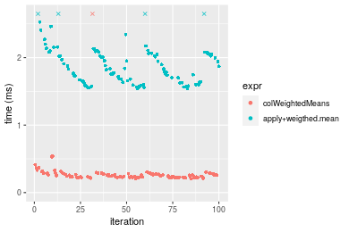

[matrixStats]: Benchmark report

---------------------------------------


# colWeightedMeans() and rowWeightedMeans() benchmarks

This report benchmark the performance of colWeightedMeans() and rowWeightedMeans() against alternative methods.

## Alternative methods

* apply() + weighted.mean()


## Data
```r
> rmatrix <- function(nrow, ncol, mode = c("logical", "double", "integer", "index"), range = c(-100, 
+     +100), na_prob = 0) {
+     mode <- match.arg(mode)
+     n <- nrow * ncol
+     if (mode == "logical") {
+         x <- sample(c(FALSE, TRUE), size = n, replace = TRUE)
+     }     else if (mode == "index") {
+         x <- seq_len(n)
+         mode <- "integer"
+     }     else {
+         x <- runif(n, min = range[1], max = range[2])
+     }
+     storage.mode(x) <- mode
+     if (na_prob > 0) 
+         x[sample(n, size = na_prob * n)] <- NA
+     dim(x) <- c(nrow, ncol)
+     x
+ }
> rmatrices <- function(scale = 10, seed = 1, ...) {
+     set.seed(seed)
+     data <- list()
+     data[[1]] <- rmatrix(nrow = scale * 1, ncol = scale * 1, ...)
+     data[[2]] <- rmatrix(nrow = scale * 10, ncol = scale * 10, ...)
+     data[[3]] <- rmatrix(nrow = scale * 100, ncol = scale * 1, ...)
+     data[[4]] <- t(data[[3]])
+     data[[5]] <- rmatrix(nrow = scale * 10, ncol = scale * 100, ...)
+     data[[6]] <- t(data[[5]])
+     names(data) <- sapply(data, FUN = function(x) paste(dim(x), collapse = "x"))
+     data
+ }
> data <- rmatrices(mode = "double")
```

## Results

### 10x10 matrix


```r
> X <- data[["10x10"]]
> w <- runif(nrow(X))
> gc()
           used  (Mb) gc trigger  (Mb) max used  (Mb)
Ncells  5329774 284.7    8529671 455.6  8529671 455.6
Vcells 10836871  82.7   31876688 243.2 60562128 462.1
> colStats <- microbenchmark(colWeightedMeans = colWeightedMeans(X, w = w, na.rm = FALSE), `apply+weigthed.mean` = apply(X, 
+     MARGIN = 2L, FUN = weighted.mean, w = w, na.rm = FALSE), unit = "ms")
> X <- t(X)
> gc()
           used  (Mb) gc trigger  (Mb) max used  (Mb)
Ncells  5319055 284.1    8529671 455.6  8529671 455.6
Vcells 10801549  82.5   31876688 243.2 60562128 462.1
> rowStats <- microbenchmark(rowWeightedMeans = rowWeightedMeans(X, w = w, na.rm = FALSE), `apply+weigthed.mean` = apply(X, 
+     MARGIN = 1L, FUN = weighted.mean, w = w, na.rm = FALSE), unit = "ms")
```

_Table: Benchmarking of colWeightedMeans() and apply+weigthed.mean() on 10x10 data. The top panel shows times in milliseconds and the bottom panel shows relative times._


|   |expr                |      min|        lq|      mean|    median|        uq|      max|
|:--|:-------------------|--------:|---------:|---------:|---------:|---------:|--------:|
|1  |colWeightedMeans    | 0.013956| 0.0151095| 0.0173941| 0.0166140| 0.0183450| 0.051339|
|2  |apply+weigthed.mean | 0.079649| 0.0828495| 0.0888316| 0.0857315| 0.0885965| 0.306993|


|   |expr                |      min|       lq|     mean|   median|       uq|      max|
|:--|:-------------------|--------:|--------:|--------:|--------:|--------:|--------:|
|1  |colWeightedMeans    | 1.000000| 1.000000| 1.000000| 1.000000| 1.000000| 1.000000|
|2  |apply+weigthed.mean | 5.707151| 5.483272| 5.106996| 5.160196| 4.829463| 5.979723|

_Table: Benchmarking of rowWeightedMeans() and apply+weigthed.mean() on 10x10 data (transposed). The top panel shows times in milliseconds and the bottom panel shows relative times._


|   |expr                |      min|        lq|      mean|   median|        uq|      max|
|:--|:-------------------|--------:|---------:|---------:|--------:|---------:|--------:|
|1  |rowWeightedMeans    | 0.019123| 0.0217185| 0.0240152| 0.023250| 0.0248235| 0.066777|
|2  |apply+weigthed.mean | 0.079402| 0.0830350| 0.0891472| 0.086606| 0.0915680| 0.174824|


|   |expr                |      min|       lq|     mean|   median|       uq|      max|
|:--|:-------------------|--------:|--------:|--------:|--------:|--------:|--------:|
|1  |rowWeightedMeans    | 1.000000| 1.000000| 1.000000| 1.000000| 1.000000| 1.000000|
|2  |apply+weigthed.mean | 4.152173| 3.823238| 3.712118| 3.724989| 3.688763| 2.618027|

_Figure: Benchmarking of colWeightedMeans() and apply+weigthed.mean() on 10x10 data  as well as rowWeightedMeans() and apply+weigthed.mean() on the same data transposed.  Outliers are displayed as crosses.  Times are in milliseconds._


_Table: Benchmarking of colWeightedMeans() and rowWeightedMeans() on 10x10 data (original and transposed).  The top panel shows times in milliseconds and the bottom panel shows relative times._


|   |expr             |    min|      lq|     mean| median|      uq|    max|
|:--|:----------------|------:|-------:|--------:|------:|-------:|------:|
|1  |colWeightedMeans | 13.956| 15.1095| 17.39410| 16.614| 18.3450| 51.339|
|2  |rowWeightedMeans | 19.123| 21.7185| 24.01519| 23.250| 24.8235| 66.777|


|   |expr             |      min|       lq|     mean|   median|       uq|      max|
|:--|:----------------|--------:|--------:|--------:|--------:|--------:|--------:|
|1  |colWeightedMeans | 1.000000| 1.000000| 1.000000| 1.000000| 1.000000| 1.000000|
|2  |rowWeightedMeans | 1.370235| 1.437407| 1.380651| 1.399422| 1.353148| 1.300707|

_Figure: Benchmarking of colWeightedMeans() and rowWeightedMeans() on 10x10 data (original and transposed).  Outliers are displayed as crosses. Times are in milliseconds._


### 100x100 matrix


```r
> X <- data[["100x100"]]
> w <- runif(nrow(X))
> gc()
           used  (Mb) gc trigger  (Mb) max used  (Mb)
Ncells  5317634 284.0    8529671 455.6  8529671 455.6
Vcells 10416411  79.5   31876688 243.2 60562128 462.1
> colStats <- microbenchmark(colWeightedMeans = colWeightedMeans(X, w = w, na.rm = FALSE), `apply+weigthed.mean` = apply(X, 
+     MARGIN = 2L, FUN = weighted.mean, w = w, na.rm = FALSE), unit = "ms")
> X <- t(X)
> gc()
           used  (Mb) gc trigger  (Mb) max used  (Mb)
Ncells  5317610 284.0    8529671 455.6  8529671 455.6
Vcells 10426424  79.6   31876688 243.2 60562128 462.1
> rowStats <- microbenchmark(rowWeightedMeans = rowWeightedMeans(X, w = w, na.rm = FALSE), `apply+weigthed.mean` = apply(X, 
+     MARGIN = 1L, FUN = weighted.mean, w = w, na.rm = FALSE), unit = "ms")
```

_Table: Benchmarking of colWeightedMeans() and apply+weigthed.mean() on 100x100 data. The top panel shows times in milliseconds and the bottom panel shows relative times._


|   |expr                |      min|        lq|      mean|    median|        uq|      max|
|:--|:-------------------|--------:|---------:|---------:|---------:|---------:|--------:|
|1  |colWeightedMeans    | 0.030232| 0.0341905| 0.0415913| 0.0396795| 0.0481765| 0.088324|
|2  |apply+weigthed.mean | 0.555367| 0.5899205| 0.7002991| 0.6624400| 0.7478170| 1.354487|


|   |expr                |      min|       lq|     mean|   median|       uq|      max|
|:--|:-------------------|--------:|--------:|--------:|--------:|--------:|--------:|
|1  |colWeightedMeans    |  1.00000|  1.00000|  1.00000|  1.00000|  1.00000|  1.00000|
|2  |apply+weigthed.mean | 18.37017| 17.25393| 16.83764| 16.69477| 15.52244| 15.33544|

_Table: Benchmarking of rowWeightedMeans() and apply+weigthed.mean() on 100x100 data (transposed). The top panel shows times in milliseconds and the bottom panel shows relative times._


|   |expr                |      min|        lq|      mean|   median|       uq|      max|
|:--|:-------------------|--------:|---------:|---------:|--------:|--------:|--------:|
|1  |rowWeightedMeans    | 0.119904| 0.1255045| 0.1474997| 0.142242| 0.162559| 0.245560|
|2  |apply+weigthed.mean | 0.549818| 0.5672270| 0.6628345| 0.641835| 0.719392| 1.138727|


|   |expr                |      min|       lq|     mean|   median|       uq|      max|
|:--|:-------------------|--------:|--------:|--------:|--------:|--------:|--------:|
|1  |rowWeightedMeans    | 1.000000| 1.000000| 1.000000| 1.000000| 1.000000| 1.000000|
|2  |apply+weigthed.mean | 4.585485| 4.519575| 4.493802| 4.512275| 4.425421| 4.637266|

_Figure: Benchmarking of colWeightedMeans() and apply+weigthed.mean() on 100x100 data  as well as rowWeightedMeans() and apply+weigthed.mean() on the same data transposed.  Outliers are displayed as crosses.  Times are in milliseconds._


_Table: Benchmarking of colWeightedMeans() and rowWeightedMeans() on 100x100 data (original and transposed).  The top panel shows times in milliseconds and the bottom panel shows relative times._


|   |expr             |     min|       lq|      mean|   median|       uq|     max|
|:--|:----------------|-------:|--------:|---------:|--------:|--------:|-------:|
|1  |colWeightedMeans |  30.232|  34.1905|  41.59129|  39.6795|  48.1765|  88.324|
|2  |rowWeightedMeans | 119.904| 125.5045| 147.49972| 142.2420| 162.5590| 245.560|


|   |expr             |      min|       lq|     mean|   median|       uq|      max|
|:--|:----------------|--------:|--------:|--------:|--------:|--------:|--------:|
|1  |colWeightedMeans | 1.000000| 1.000000| 1.000000| 1.000000| 1.000000| 1.000000|
|2  |rowWeightedMeans | 3.966129| 3.670742| 3.546409| 3.584773| 3.374239| 2.780218|

_Figure: Benchmarking of colWeightedMeans() and rowWeightedMeans() on 100x100 data (original and transposed).  Outliers are displayed as crosses. Times are in milliseconds._


### 1000x10 matrix


```r
> X <- data[["1000x10"]]
> w <- runif(nrow(X))
> gc()
           used  (Mb) gc trigger  (Mb) max used  (Mb)
Ncells  5318335 284.1    8529671 455.6  8529671 455.6
Vcells 10420778  79.6   31876688 243.2 60562128 462.1
> colStats <- microbenchmark(colWeightedMeans = colWeightedMeans(X, w = w, na.rm = FALSE), `apply+weigthed.mean` = apply(X, 
+     MARGIN = 2L, FUN = weighted.mean, w = w, na.rm = FALSE), unit = "ms")
> X <- t(X)
> gc()
           used  (Mb) gc trigger  (Mb) max used  (Mb)
Ncells  5318329 284.1    8529671 455.6  8529671 455.6
Vcells 10430821  79.6   31876688 243.2 60562128 462.1
> rowStats <- microbenchmark(rowWeightedMeans = rowWeightedMeans(X, w = w, na.rm = FALSE), `apply+weigthed.mean` = apply(X, 
+     MARGIN = 1L, FUN = weighted.mean, w = w, na.rm = FALSE), unit = "ms")
```

_Table: Benchmarking of colWeightedMeans() and apply+weigthed.mean() on 1000x10 data. The top panel shows times in milliseconds and the bottom panel shows relative times._


|   |expr                |      min|        lq|      mean|    median|        uq|      max|
|:--|:-------------------|--------:|---------:|---------:|---------:|---------:|--------:|
|1  |colWeightedMeans    | 0.049971| 0.0548630| 0.0609515| 0.0588590| 0.0650855| 0.135331|
|2  |apply+weigthed.mean | 0.211792| 0.2281235| 0.2468247| 0.2400965| 0.2623080| 0.355333|


|   |expr                |      min|       lq|     mean|   median|       uq|      max|
|:--|:-------------------|--------:|--------:|--------:|--------:|--------:|--------:|
|1  |colWeightedMeans    | 1.000000| 1.000000| 1.000000| 1.000000| 1.000000| 1.000000|
|2  |apply+weigthed.mean | 4.238298| 4.158057| 4.049527| 4.079181| 4.030206| 2.625659|

_Table: Benchmarking of rowWeightedMeans() and apply+weigthed.mean() on 1000x10 data (transposed). The top panel shows times in milliseconds and the bottom panel shows relative times._


|   |expr                |      min|        lq|      mean|    median|        uq|      max|
|:--|:-------------------|--------:|---------:|---------:|---------:|---------:|--------:|
|1  |rowWeightedMeans    | 0.152673| 0.1696105| 0.1855038| 0.1826945| 0.1975075| 0.304953|
|2  |apply+weigthed.mean | 0.195234| 0.2165075| 0.2399114| 0.2333165| 0.2564390| 0.351846|


|   |expr                |      min|       lq|     mean|   median|       uq|      max|
|:--|:-------------------|--------:|--------:|--------:|--------:|--------:|--------:|
|1  |rowWeightedMeans    | 1.000000| 1.000000| 1.000000| 1.000000| 1.000000| 1.000000|
|2  |apply+weigthed.mean | 1.278772| 1.276498| 1.293296| 1.277086| 1.298376| 1.153771|

_Figure: Benchmarking of colWeightedMeans() and apply+weigthed.mean() on 1000x10 data  as well as rowWeightedMeans() and apply+weigthed.mean() on the same data transposed.  Outliers are displayed as crosses.  Times are in milliseconds._


_Table: Benchmarking of colWeightedMeans() and rowWeightedMeans() on 1000x10 data (original and transposed).  The top panel shows times in milliseconds and the bottom panel shows relative times._


|   |expr             |     min|       lq|     mean|   median|       uq|     max|
|:--|:----------------|-------:|--------:|--------:|--------:|--------:|-------:|
|1  |colWeightedMeans |  49.971|  54.8630|  60.9515|  58.8590|  65.0855| 135.331|
|2  |rowWeightedMeans | 152.673| 169.6105| 185.5038| 182.6945| 197.5075| 304.953|


|   |expr             |      min|       lq|     mean|   median|       uq|      max|
|:--|:----------------|--------:|--------:|--------:|--------:|--------:|--------:|
|1  |colWeightedMeans | 1.000000| 1.000000| 1.000000| 1.000000| 1.000000| 1.000000|
|2  |rowWeightedMeans | 3.055232| 3.091528| 3.043466| 3.103935| 3.034585| 2.253386|

_Figure: Benchmarking of colWeightedMeans() and rowWeightedMeans() on 1000x10 data (original and transposed).  Outliers are displayed as crosses. Times are in milliseconds._


### 10x1000 matrix


```r
> X <- data[["10x1000"]]
> w <- runif(nrow(X))
> gc()
           used  (Mb) gc trigger  (Mb) max used  (Mb)
Ncells  5318551 284.1    8529671 455.6  8529671 455.6
Vcells 10420605  79.6   31876688 243.2 60562128 462.1
> colStats <- microbenchmark(colWeightedMeans = colWeightedMeans(X, w = w, na.rm = FALSE), `apply+weigthed.mean` = apply(X, 
+     MARGIN = 2L, FUN = weighted.mean, w = w, na.rm = FALSE), unit = "ms")
> X <- t(X)
> gc()
           used  (Mb) gc trigger  (Mb) max used  (Mb)
Ncells  5318527 284.1    8529671 455.6  8529671 455.6
Vcells 10430618  79.6   31876688 243.2 60562128 462.1
> rowStats <- microbenchmark(rowWeightedMeans = rowWeightedMeans(X, w = w, na.rm = FALSE), `apply+weigthed.mean` = apply(X, 
+     MARGIN = 1L, FUN = weighted.mean, w = w, na.rm = FALSE), unit = "ms")
```

_Table: Benchmarking of colWeightedMeans() and apply+weigthed.mean() on 10x1000 data. The top panel shows times in milliseconds and the bottom panel shows relative times._


|   |expr                |      min|       lq|      mean|    median|       uq|      max|
|:--|:-------------------|--------:|--------:|---------:|---------:|--------:|--------:|
|1  |colWeightedMeans    | 0.029489| 0.032739| 0.0394763| 0.0368465| 0.042318|  0.10219|
|2  |apply+weigthed.mean | 4.084716| 4.528123| 4.8010556| 4.6832870| 4.777128| 11.05300|


|   |expr                |      min|       lq|     mean|   median|       uq|      max|
|:--|:-------------------|--------:|--------:|--------:|--------:|--------:|--------:|
|1  |colWeightedMeans    |   1.0000|   1.0000|   1.0000|   1.0000|   1.0000|   1.0000|
|2  |apply+weigthed.mean | 138.5166| 138.3097| 121.6186| 127.1026| 112.8864| 108.1613|

_Table: Benchmarking of rowWeightedMeans() and apply+weigthed.mean() on 10x1000 data (transposed). The top panel shows times in milliseconds and the bottom panel shows relative times._


|   |expr                |      min|        lq|      mean|   median|       uq|       max|
|:--|:-------------------|--------:|---------:|---------:|--------:|--------:|---------:|
|1  |rowWeightedMeans    | 0.118433| 0.1310465| 0.1392433| 0.137177| 0.142301|  0.223296|
|2  |apply+weigthed.mean | 4.093245| 4.5486995| 4.8070154| 4.706437| 4.788188| 11.003123|


|   |expr                |      min|       lq|     mean|   median|       uq|      max|
|:--|:-------------------|--------:|--------:|--------:|--------:|--------:|--------:|
|1  |rowWeightedMeans    |  1.00000|  1.00000|  1.00000|  1.00000|  1.00000|  1.00000|
|2  |apply+weigthed.mean | 34.56169| 34.71058| 34.52242| 34.30923| 33.64831| 49.27595|

_Figure: Benchmarking of colWeightedMeans() and apply+weigthed.mean() on 10x1000 data  as well as rowWeightedMeans() and apply+weigthed.mean() on the same data transposed.  Outliers are displayed as crosses.  Times are in milliseconds._


_Table: Benchmarking of colWeightedMeans() and rowWeightedMeans() on 10x1000 data (original and transposed).  The top panel shows times in milliseconds and the bottom panel shows relative times._


|   |expr             |     min|       lq|      mean|   median|      uq|     max|
|:--|:----------------|-------:|--------:|---------:|--------:|-------:|-------:|
|1  |colWeightedMeans |  29.489|  32.7390|  39.47633|  36.8465|  42.318| 102.190|
|2  |rowWeightedMeans | 118.433| 131.0465| 139.24328| 137.1770| 142.301| 223.296|


|   |expr             |      min|       lq|    mean|   median|       uq|      max|
|:--|:----------------|--------:|--------:|-------:|--------:|--------:|--------:|
|1  |colWeightedMeans | 1.000000| 1.000000| 1.00000| 1.000000| 1.000000| 1.000000|
|2  |rowWeightedMeans | 4.016176| 4.002764| 3.52726| 3.722932| 3.362659| 2.185106|

_Figure: Benchmarking of colWeightedMeans() and rowWeightedMeans() on 10x1000 data (original and transposed).  Outliers are displayed as crosses. Times are in milliseconds._


### 100x1000 matrix


```r
> X <- data[["100x1000"]]
> w <- runif(nrow(X))
> gc()
           used  (Mb) gc trigger  (Mb) max used  (Mb)
Ncells  5318741 284.1    8529671 455.6  8529671 455.6
Vcells 10421196  79.6   31876688 243.2 60562128 462.1
> colStats <- microbenchmark(colWeightedMeans = colWeightedMeans(X, w = w, na.rm = FALSE), `apply+weigthed.mean` = apply(X, 
+     MARGIN = 2L, FUN = weighted.mean, w = w, na.rm = FALSE), unit = "ms")
> X <- t(X)
> gc()
           used  (Mb) gc trigger  (Mb) max used  (Mb)
Ncells  5318717 284.1    8529671 455.6  8529671 455.6
Vcells 10521209  80.3   31876688 243.2 60562128 462.1
> rowStats <- microbenchmark(rowWeightedMeans = rowWeightedMeans(X, w = w, na.rm = FALSE), `apply+weigthed.mean` = apply(X, 
+     MARGIN = 1L, FUN = weighted.mean, w = w, na.rm = FALSE), unit = "ms")
```

_Table: Benchmarking of colWeightedMeans() and apply+weigthed.mean() on 100x1000 data. The top panel shows times in milliseconds and the bottom panel shows relative times._


|   |expr                |      min|       lq|      mean|    median|       uq|      max|
|:--|:-------------------|--------:|--------:|---------:|---------:|--------:|--------:|
|1  |colWeightedMeans    | 0.185700| 0.219297| 0.4396765| 0.2470125| 0.272899| 19.48006|
|2  |apply+weigthed.mean | 5.412697| 5.866960| 6.5537505| 5.9813235| 6.263001| 28.49123|


|   |expr                |      min|       lq|     mean|   median|       uq|      max|
|:--|:-------------------|--------:|--------:|--------:|--------:|--------:|--------:|
|1  |colWeightedMeans    |  1.00000|  1.00000|  1.00000|  1.00000|  1.00000| 1.000000|
|2  |apply+weigthed.mean | 29.14753| 26.75349| 14.90585| 24.21466| 22.94989| 1.462584|

_Table: Benchmarking of rowWeightedMeans() and apply+weigthed.mean() on 100x1000 data (transposed). The top panel shows times in milliseconds and the bottom panel shows relative times._


|   |expr                |      min|       lq|     mean|   median|       uq|       max|
|:--|:-------------------|--------:|--------:|--------:|--------:|--------:|---------:|
|1  |rowWeightedMeans    | 1.054020| 1.153162| 1.269207| 1.182492| 1.305193|  2.109278|
|2  |apply+weigthed.mean | 5.405374| 5.879766| 7.117222| 6.029890| 6.585137| 31.438123|


|   |expr                |      min|       lq|     mean|   median|       uq|      max|
|:--|:-------------------|--------:|--------:|--------:|--------:|--------:|--------:|
|1  |rowWeightedMeans    | 1.000000| 1.000000| 1.000000| 1.000000| 1.000000|  1.00000|
|2  |apply+weigthed.mean | 5.128341| 5.098821| 5.607613| 5.099308| 5.045336| 14.90468|

_Figure: Benchmarking of colWeightedMeans() and apply+weigthed.mean() on 100x1000 data  as well as rowWeightedMeans() and apply+weigthed.mean() on the same data transposed.  Outliers are displayed as crosses.  Times are in milliseconds._


_Table: Benchmarking of colWeightedMeans() and rowWeightedMeans() on 100x1000 data (original and transposed).  The top panel shows times in milliseconds and the bottom panel shows relative times._


|   |expr             |     min|       lq|      mean|    median|       uq|       max|
|:--|:----------------|-------:|--------:|---------:|---------:|--------:|---------:|
|1  |colWeightedMeans |  185.70|  219.297|  439.6765|  247.0125|  272.899| 19480.060|
|2  |rowWeightedMeans | 1054.02| 1153.162| 1269.2071| 1182.4920| 1305.193|  2109.278|


|   |expr             |      min|       lq|     mean|   median|       uq|       max|
|:--|:----------------|--------:|--------:|--------:|--------:|--------:|---------:|
|1  |colWeightedMeans | 1.000000| 1.000000| 1.000000| 1.000000| 1.000000| 1.0000000|
|2  |rowWeightedMeans | 5.675929| 5.258449| 2.886684| 4.787175| 4.782696| 0.1082788|

_Figure: Benchmarking of colWeightedMeans() and rowWeightedMeans() on 100x1000 data (original and transposed).  Outliers are displayed as crosses. Times are in milliseconds._


### 1000x100 matrix


```r
> X <- data[["1000x100"]]
> w <- runif(nrow(X))
> gc()
           used  (Mb) gc trigger  (Mb) max used  (Mb)
Ncells  5318910 284.1    8529671 455.6  8529671 455.6
Vcells 10422719  79.6   31876688 243.2 60562128 462.1
> colStats <- microbenchmark(colWeightedMeans = colWeightedMeans(X, w = w, na.rm = FALSE), `apply+weigthed.mean` = apply(X, 
+     MARGIN = 2L, FUN = weighted.mean, w = w, na.rm = FALSE), unit = "ms")
> X <- t(X)
> gc()
           used  (Mb) gc trigger  (Mb) max used  (Mb)
Ncells  5318904 284.1    8529671 455.6  8529671 455.6
Vcells 10522762  80.3   31876688 243.2 60562128 462.1
> rowStats <- microbenchmark(rowWeightedMeans = rowWeightedMeans(X, w = w, na.rm = FALSE), `apply+weigthed.mean` = apply(X, 
+     MARGIN = 1L, FUN = weighted.mean, w = w, na.rm = FALSE), unit = "ms")
```

_Table: Benchmarking of colWeightedMeans() and apply+weigthed.mean() on 1000x100 data. The top panel shows times in milliseconds and the bottom panel shows relative times._


|   |expr                |      min|        lq|      mean|   median|        uq|       max|
|:--|:-------------------|--------:|---------:|---------:|--------:|---------:|---------:|
|1  |colWeightedMeans    | 0.205215| 0.2276095| 0.3425132| 0.245658| 0.2785555|  8.429282|
|2  |apply+weigthed.mean | 1.540183| 1.6469045| 2.0503194| 1.837805| 2.0657935| 10.520204|


|   |expr                |      min|       lq|     mean|   median|       uq|      max|
|:--|:-------------------|--------:|--------:|--------:|--------:|--------:|--------:|
|1  |colWeightedMeans    | 1.000000| 1.000000| 1.000000| 1.000000| 1.000000| 1.000000|
|2  |apply+weigthed.mean | 7.505217| 7.235658| 5.986104| 7.481153| 7.416093| 1.248055|

_Table: Benchmarking of rowWeightedMeans() and apply+weigthed.mean() on 1000x100 data (transposed). The top panel shows times in milliseconds and the bottom panel shows relative times._


|   |expr                |      min|       lq|     mean|   median|       uq|      max|
|:--|:-------------------|--------:|--------:|--------:|--------:|--------:|--------:|
|1  |rowWeightedMeans    | 1.068420| 1.125180| 1.245604| 1.194421| 1.330394|  1.94012|
|2  |apply+weigthed.mean | 1.561156| 1.628209| 2.060293| 1.714316| 1.977224| 10.16854|


|   |expr                |      min|       lq|     mean|   median|       uq|      max|
|:--|:-------------------|--------:|--------:|--------:|--------:|--------:|--------:|
|1  |rowWeightedMeans    | 1.000000| 1.000000| 1.000000| 1.000000| 1.000000| 1.000000|
|2  |apply+weigthed.mean | 1.461182| 1.447065| 1.654052| 1.435269| 1.486195| 5.241191|

_Figure: Benchmarking of colWeightedMeans() and apply+weigthed.mean() on 1000x100 data  as well as rowWeightedMeans() and apply+weigthed.mean() on the same data transposed.  Outliers are displayed as crosses.  Times are in milliseconds._





_Table: Benchmarking of colWeightedMeans() and rowWeightedMeans() on 1000x100 data (original and transposed).  The top panel shows times in milliseconds and the bottom panel shows relative times._


|   |expr             |      min|        lq|      mean|   median|        uq|      max|
|:--|:----------------|--------:|---------:|---------:|--------:|---------:|--------:|
|1  |colWeightedMeans |  205.215|  227.6095|  342.5132|  245.658|  278.5555| 8429.282|
|2  |rowWeightedMeans | 1068.420| 1125.1800| 1245.6036| 1194.421| 1330.3935| 1940.120|


|   |expr             |      min|       lq|     mean|   median|       uq|       max|
|:--|:----------------|--------:|--------:|--------:|--------:|--------:|---------:|
|1  |colWeightedMeans | 1.000000| 1.000000| 1.000000| 1.000000| 1.000000| 1.0000000|
|2  |rowWeightedMeans | 5.206345| 4.943467| 3.636659| 4.862129| 4.776045| 0.2301643|

_Figure: Benchmarking of colWeightedMeans() and rowWeightedMeans() on 1000x100 data (original and transposed).  Outliers are displayed as crosses. Times are in milliseconds._


## Appendix

### Session information
```r
R version 4.1.1 Patched (2021-08-10 r80727)
Platform: x86_64-pc-linux-gnu (64-bit)
Running under: Ubuntu 18.04.5 LTS

Matrix products: default
BLAS:   /home/hb/software/R-devel/R-4-1-branch/lib/R/lib/libRblas.so
LAPACK: /home/hb/software/R-devel/R-4-1-branch/lib/R/lib/libRlapack.so

locale:
 [1] LC_CTYPE=en_US.UTF-8       LC_NUMERIC=C              
 [3] LC_TIME=en_US.UTF-8        LC_COLLATE=en_US.UTF-8    
 [5] LC_MONETARY=en_US.UTF-8    LC_MESSAGES=en_US.UTF-8   
 [7] LC_PAPER=en_US.UTF-8       LC_NAME=C                 
 [9] LC_ADDRESS=C               LC_TELEPHONE=C            
[11] LC_MEASUREMENT=en_US.UTF-8 LC_IDENTIFICATION=C       

attached base packages:
[1] stats     graphics  grDevices utils     datasets  methods   base     

other attached packages:
[1] microbenchmark_1.4-7   matrixStats_0.60.1     ggplot2_3.3.5         
[4] knitr_1.33             R.devices_2.17.0       R.utils_2.10.1        
[7] R.oo_1.24.0            R.methodsS3_1.8.1-9001 history_0.0.1-9000    

loaded via a namespace (and not attached):
 [1] Biobase_2.52.0          httr_1.4.2              splines_4.1.1          
 [4] bit64_4.0.5             network_1.17.1          assertthat_0.2.1       
 [7] highr_0.9               stats4_4.1.1            blob_1.2.2             
[10] GenomeInfoDbData_1.2.6  robustbase_0.93-8       pillar_1.6.2           
[13] RSQLite_2.2.8           lattice_0.20-44         glue_1.4.2             
[16] digest_0.6.27           XVector_0.32.0          colorspace_2.0-2       
[19] Matrix_1.3-4            XML_3.99-0.7            pkgconfig_2.0.3        
[22] zlibbioc_1.38.0         genefilter_1.74.0       purrr_0.3.4            
[25] ergm_4.1.2              xtable_1.8-4            scales_1.1.1           
[28] tibble_3.1.4            annotate_1.70.0         KEGGREST_1.32.0        
[31] farver_2.1.0            generics_0.1.0          IRanges_2.26.0         
[34] ellipsis_0.3.2          cachem_1.0.6            withr_2.4.2            
[37] BiocGenerics_0.38.0     mime_0.11               survival_3.2-13        
[40] magrittr_2.0.1          crayon_1.4.1            statnet.common_4.5.0   
[43] memoise_2.0.0           laeken_0.5.1            fansi_0.5.0            
[46] R.cache_0.15.0          MASS_7.3-54             R.rsp_0.44.0           
[49] progressr_0.8.0         tools_4.1.1             lifecycle_1.0.0        
[52] S4Vectors_0.30.0        trust_0.1-8             munsell_0.5.0          
[55] tabby_0.0.1-9001        AnnotationDbi_1.54.1    Biostrings_2.60.2      
[58] compiler_4.1.1          GenomeInfoDb_1.28.1     rlang_0.4.11           
[61] grid_4.1.1              RCurl_1.98-1.4          cwhmisc_6.6            
[64] rappdirs_0.3.3          startup_0.15.0          labeling_0.4.2         
[67] bitops_1.0-7            base64enc_0.1-3         boot_1.3-28            
[70] gtable_0.3.0            DBI_1.1.1               markdown_1.1           
[73] R6_2.5.1                lpSolveAPI_5.5.2.0-17.7 rle_0.9.2              
[76] dplyr_1.0.7             fastmap_1.1.0           bit_4.0.4              
[79] utf8_1.2.2              parallel_4.1.1          Rcpp_1.0.7             
[82] vctrs_0.3.8             png_0.1-7               DEoptimR_1.0-9         
[85] tidyselect_1.1.1        xfun_0.25               coda_0.19-4            
```
Total processing time was 14.77 secs.


### Reproducibility
To reproduce this report, do:
```r
html <- matrixStats:::benchmark('colWeightedMeans')
```

[RSP]: https://cran.r-project.org/package=R.rsp
[matrixStats]: https://cran.r-project.org/package=matrixStats

[StackOverflow:colMins?]: https://stackoverflow.com/questions/13676878 "Stack Overflow: fastest way to get Min from every column in a matrix?"
[StackOverflow:colSds?]: https://stackoverflow.com/questions/17549762 "Stack Overflow: Is there such 'colsd' in R?"
[StackOverflow:rowProds?]: https://stackoverflow.com/questions/20198801/ "Stack Overflow: Row product of matrix and column sum of matrix"

---------------------------------------
Copyright Henrik Bengtsson. Last updated on 2021-08-25 19:11:39 (+0200 UTC). Powered by [RSP].

<script>
 var link = document.createElement('link');
 link.rel = 'icon';
 link.href = "data:image/png;base64,iVBORw0KGgoAAAANSUhEUgAAACAAAAAgCAMAAABEpIrGAAAA21BMVEUAAAAAAP8AAP8AAP8AAP8AAP8AAP8AAP8AAP8AAP8AAP8AAP8AAP8AAP8AAP8AAP8AAP8AAP8AAP8AAP8AAP8AAP8AAP8AAP8AAP8AAP8AAP8AAP8AAP8AAP8AAP8AAP8AAP8AAP8AAP8AAP8AAP8AAP8AAP8AAP8AAP8AAP8BAf4CAv0DA/wdHeIeHuEfH+AgIN8hId4lJdomJtknJ9g+PsE/P8BAQL9yco10dIt1dYp3d4h4eIeVlWqWlmmXl2iYmGeZmWabm2Tn5xjo6Bfp6Rb39wj4+Af//wA2M9hbAAAASXRSTlMAAQIJCgsMJSYnKD4/QGRlZmhpamtsbautrrCxuru8y8zN5ebn6Pn6+///////////////////////////////////////////LsUNcQAAAS9JREFUOI29k21XgkAQhVcFytdSMqMETU26UVqGmpaiFbL//xc1cAhhwVNf6n5i5z67M2dmYOyfJZUqlVLhkKucG7cgmUZTybDz6g0iDeq51PUr37Ds2cy2/C9NeES5puDjxuUk1xnToZsg8pfA3avHQ3lLIi7iWRrkv/OYtkScxBIMgDee0ALoyxHQBJ68JLCjOtQIMIANF7QG9G9fNnHvisCHBVMKgSJgiz7nE+AoBKrAPA3MgepvgR9TSCasrCKH0eB1wBGBFdCO+nAGjMVGPcQb5bd6mQRegN6+1axOs9nGfYcCtfi4NQosdtH7dB+txFIpXQqN1p9B/asRHToyS0jRgpV7nk4nwcq1BJ+x3Gl/v7S9Wmpp/aGquum7w3ZDyrADFYrl8vHBH+ev9AUASW1dmU4h4wAAAABJRU5ErkJggg=="
 document.getElementsByTagName('head')[0].appendChild(link);
</script>


