[matrixStats]: Benchmark report

---------------------------------------


# colWeightedMedians() and rowWeightedMedians() benchmarks

This report benchmark the performance of colWeightedMedians() and rowWeightedMedians() against alternative methods.

## Alternative methods

* apply() + weightedMedian()


## Data
```r
> rmatrix <- function(nrow, ncol, mode = c("logical", "double", "integer", "index"), range = c(-100, 
+     +100), na_prob = 0) {
+     mode <- match.arg(mode)
+     n <- nrow * ncol
+     if (mode == "logical") {
+         x <- sample(c(FALSE, TRUE), size = n, replace = TRUE)
+     }     else if (mode == "index") {
+         x <- seq_len(n)
+         mode <- "integer"
+     }     else {
+         x <- runif(n, min = range[1], max = range[2])
+     }
+     storage.mode(x) <- mode
+     if (na_prob > 0) 
+         x[sample(n, size = na_prob * n)] <- NA
+     dim(x) <- c(nrow, ncol)
+     x
+ }
> rmatrices <- function(scale = 10, seed = 1, ...) {
+     set.seed(seed)
+     data <- list()
+     data[[1]] <- rmatrix(nrow = scale * 1, ncol = scale * 1, ...)
+     data[[2]] <- rmatrix(nrow = scale * 10, ncol = scale * 10, ...)
+     data[[3]] <- rmatrix(nrow = scale * 100, ncol = scale * 1, ...)
+     data[[4]] <- t(data[[3]])
+     data[[5]] <- rmatrix(nrow = scale * 10, ncol = scale * 100, ...)
+     data[[6]] <- t(data[[5]])
+     names(data) <- sapply(data, FUN = function(x) paste(dim(x), collapse = "x"))
+     data
+ }
> data <- rmatrices(mode = "double")
```

## Results

### 10x10 matrix


```r
> X <- data[["10x10"]]
> w <- runif(nrow(X))
> gc()
           used  (Mb) gc trigger  (Mb) max used  (Mb)
Ncells  5336126 285.0    8529671 455.6  8529671 455.6
Vcells 10891982  83.1   31876688 243.2 60562128 462.1
> colStats <- microbenchmark(colWeightedMedians = colWeightedMedians(X, w = w, na.rm = FALSE), `apply+weigthedMedian` = apply(X, 
+     MARGIN = 2L, FUN = weightedMedian, w = w, na.rm = FALSE), unit = "ms")
> X <- t(X)
> gc()
           used  (Mb) gc trigger  (Mb) max used  (Mb)
Ncells  5325293 284.5    8529671 455.6  8529671 455.6
Vcells 10856360  82.9   31876688 243.2 60562128 462.1
> rowStats <- microbenchmark(rowWeightedMedians = rowWeightedMedians(X, w = w, na.rm = FALSE), `apply+weigthedMedian` = apply(X, 
+     MARGIN = 1L, FUN = weightedMedian, w = w, na.rm = FALSE), unit = "ms")
```

_Table: Benchmarking of colWeightedMedians() and apply+weigthedMedian() on 10x10 data. The top panel shows times in milliseconds and the bottom panel shows relative times._


|   |expr                 |      min|        lq|      mean|    median|        uq|      max|
|:--|:--------------------|--------:|---------:|---------:|---------:|---------:|--------:|
|2  |apply+weigthedMedian | 0.057735| 0.0607080| 0.0643024| 0.0626710| 0.0653680| 0.152657|
|1  |colWeightedMedians   | 0.069744| 0.0727645| 0.0767094| 0.0751535| 0.0786175| 0.112733|


|   |expr                 |      min|       lq|     mean|   median|       uq|       max|
|:--|:--------------------|--------:|--------:|--------:|--------:|--------:|---------:|
|2  |apply+weigthedMedian | 1.000000| 1.000000| 1.000000| 1.000000| 1.000000| 1.0000000|
|1  |colWeightedMedians   | 1.208002| 1.198598| 1.192948| 1.199175| 1.202691| 0.7384725|

_Table: Benchmarking of rowWeightedMedians() and apply+weigthedMedian() on 10x10 data (transposed). The top panel shows times in milliseconds and the bottom panel shows relative times._


|   |expr                 |      min|        lq|      mean|    median|        uq|      max|
|:--|:--------------------|--------:|---------:|---------:|---------:|---------:|--------:|
|2  |apply+weigthedMedian | 0.054782| 0.0593475| 0.0631794| 0.0613125| 0.0648945| 0.145517|
|1  |rowWeightedMedians   | 0.067214| 0.0728870| 0.0767203| 0.0758585| 0.0801185| 0.112614|


|   |expr                 |      min|       lq|     mean|   median|       uq|      max|
|:--|:--------------------|--------:|--------:|--------:|--------:|--------:|--------:|
|2  |apply+weigthedMedian | 1.000000| 1.000000| 1.000000| 1.000000| 1.000000| 1.000000|
|1  |rowWeightedMedians   | 1.226936| 1.228139| 1.214324| 1.237244| 1.234596| 0.773889|

_Figure: Benchmarking of colWeightedMedians() and apply+weigthedMedian() on 10x10 data  as well as rowWeightedMedians() and apply+weigthedMedian() on the same data transposed.  Outliers are displayed as crosses.  Times are in milliseconds._


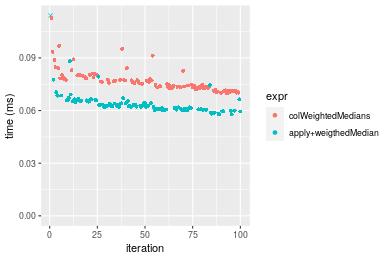

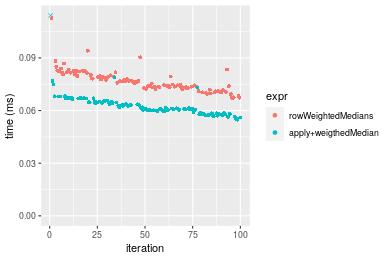
_Table: Benchmarking of colWeightedMedians() and rowWeightedMedians() on 10x10 data (original and transposed).  The top panel shows times in milliseconds and the bottom panel shows relative times._


|   |expr               |    min|      lq|     mean|  median|      uq|     max|
|:--|:------------------|------:|-------:|--------:|-------:|-------:|-------:|
|1  |colWeightedMedians | 69.744| 72.7645| 76.70944| 75.1535| 78.6175| 112.733|
|2  |rowWeightedMedians | 67.214| 72.8870| 76.72029| 75.8585| 80.1185| 112.614|


|   |expr               |       min|       lq|     mean|   median|       uq|       max|
|:--|:------------------|---------:|--------:|--------:|--------:|--------:|---------:|
|1  |colWeightedMedians | 1.0000000| 1.000000| 1.000000| 1.000000| 1.000000| 1.0000000|
|2  |rowWeightedMedians | 0.9637245| 1.001683| 1.000141| 1.009381| 1.019092| 0.9989444|

_Figure: Benchmarking of colWeightedMedians() and rowWeightedMedians() on 10x10 data (original and transposed).  Outliers are displayed as crosses. Times are in milliseconds._


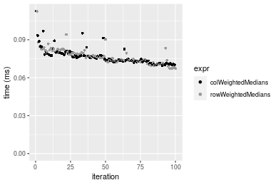

### 100x100 matrix


```r
> X <- data[["100x100"]]
> w <- runif(nrow(X))
> gc()
           used  (Mb) gc trigger  (Mb) max used  (Mb)
Ncells  5323872 284.4    8529671 455.6  8529671 455.6
Vcells 10471222  79.9   31876688 243.2 60562128 462.1
> colStats <- microbenchmark(colWeightedMedians = colWeightedMedians(X, w = w, na.rm = FALSE), `apply+weigthedMedian` = apply(X, 
+     MARGIN = 2L, FUN = weightedMedian, w = w, na.rm = FALSE), unit = "ms")
> X <- t(X)
> gc()
           used  (Mb) gc trigger  (Mb) max used  (Mb)
Ncells  5323848 284.4    8529671 455.6  8529671 455.6
Vcells 10481235  80.0   31876688 243.2 60562128 462.1
> rowStats <- microbenchmark(rowWeightedMedians = rowWeightedMedians(X, w = w, na.rm = FALSE), `apply+weigthedMedian` = apply(X, 
+     MARGIN = 1L, FUN = weightedMedian, w = w, na.rm = FALSE), unit = "ms")
```

_Table: Benchmarking of colWeightedMedians() and apply+weigthedMedian() on 100x100 data. The top panel shows times in milliseconds and the bottom panel shows relative times._


|   |expr                 |      min|        lq|      mean|   median|        uq|      max|
|:--|:--------------------|--------:|---------:|---------:|--------:|---------:|--------:|
|2  |apply+weigthedMedian | 0.698149| 0.7197470| 0.7778816| 0.755399| 0.7825195| 1.254192|
|1  |colWeightedMedians   | 0.755686| 0.7709115| 0.8548933| 0.818420| 0.8587720| 1.262195|


|   |expr                 |      min|       lq|     mean|   median|       uq|      max|
|:--|:--------------------|--------:|--------:|--------:|--------:|--------:|--------:|
|2  |apply+weigthedMedian | 1.000000| 1.000000| 1.000000| 1.000000| 1.000000| 1.000000|
|1  |colWeightedMedians   | 1.082414| 1.071087| 1.099002| 1.083427| 1.097445| 1.006381|

_Table: Benchmarking of rowWeightedMedians() and apply+weigthedMedian() on 100x100 data (transposed). The top panel shows times in milliseconds and the bottom panel shows relative times._


|   |expr                 |      min|       lq|      mean|    median|        uq|      max|
|:--|:--------------------|--------:|--------:|---------:|---------:|---------:|--------:|
|2  |apply+weigthedMedian | 0.699066| 0.712970| 0.7666201| 0.7449215| 0.7633770| 1.247787|
|1  |rowWeightedMedians   | 0.762679| 0.785641| 0.8554737| 0.8185300| 0.8626815| 1.267212|


|   |expr                 |      min|       lq|     mean|   median|       uq|      max|
|:--|:--------------------|--------:|--------:|--------:|--------:|--------:|--------:|
|2  |apply+weigthedMedian | 1.000000| 1.000000| 1.000000| 1.000000| 1.000000| 1.000000|
|1  |rowWeightedMedians   | 1.090997| 1.101927| 1.115903| 1.098814| 1.130086| 1.015568|

_Figure: Benchmarking of colWeightedMedians() and apply+weigthedMedian() on 100x100 data  as well as rowWeightedMedians() and apply+weigthedMedian() on the same data transposed.  Outliers are displayed as crosses.  Times are in milliseconds._


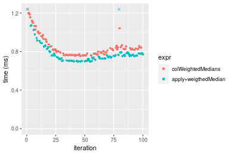

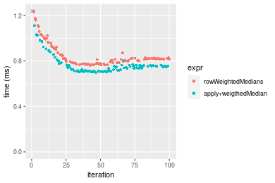
_Table: Benchmarking of colWeightedMedians() and rowWeightedMedians() on 100x100 data (original and transposed).  The top panel shows times in milliseconds and the bottom panel shows relative times._


|   |expr               |     min|       lq|     mean| median|       uq|      max|
|:--|:------------------|-------:|--------:|--------:|------:|--------:|--------:|
|1  |colWeightedMedians | 755.686| 770.9115| 854.8933| 818.42| 858.7720| 1262.195|
|2  |rowWeightedMedians | 762.679| 785.6410| 855.4737| 818.53| 862.6815| 1267.212|


|   |expr               |      min|       lq|     mean|   median|       uq|      max|
|:--|:------------------|--------:|--------:|--------:|--------:|--------:|--------:|
|1  |colWeightedMedians | 1.000000| 1.000000| 1.000000| 1.000000| 1.000000| 1.000000|
|2  |rowWeightedMedians | 1.009254| 1.019107| 1.000679| 1.000134| 1.004552| 1.003975|

_Figure: Benchmarking of colWeightedMedians() and rowWeightedMedians() on 100x100 data (original and transposed).  Outliers are displayed as crosses. Times are in milliseconds._


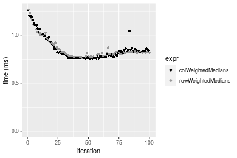

### 1000x10 matrix


```r
> X <- data[["1000x10"]]
> w <- runif(nrow(X))
> gc()
           used  (Mb) gc trigger  (Mb) max used  (Mb)
Ncells  5324573 284.4    8529671 455.6  8529671 455.6
Vcells 10475586  80.0   31876688 243.2 60562128 462.1
> colStats <- microbenchmark(colWeightedMedians = colWeightedMedians(X, w = w, na.rm = FALSE), `apply+weigthedMedian` = apply(X, 
+     MARGIN = 2L, FUN = weightedMedian, w = w, na.rm = FALSE), unit = "ms")
> X <- t(X)
> gc()
           used  (Mb) gc trigger  (Mb) max used  (Mb)
Ncells  5324567 284.4    8529671 455.6  8529671 455.6
Vcells 10485629  80.0   31876688 243.2 60562128 462.1
> rowStats <- microbenchmark(rowWeightedMedians = rowWeightedMedians(X, w = w, na.rm = FALSE), `apply+weigthedMedian` = apply(X, 
+     MARGIN = 1L, FUN = weightedMedian, w = w, na.rm = FALSE), unit = "ms")
```

_Table: Benchmarking of colWeightedMedians() and apply+weigthedMedian() on 1000x10 data. The top panel shows times in milliseconds and the bottom panel shows relative times._


|   |expr                 |      min|        lq|      mean|    median|        uq|      max|
|:--|:--------------------|--------:|---------:|---------:|---------:|---------:|--------:|
|2  |apply+weigthedMedian | 0.566671| 0.5727345| 0.6213638| 0.5881475| 0.6245870| 0.941552|
|1  |colWeightedMedians   | 0.585212| 0.5931230| 0.6585967| 0.6203480| 0.6876295| 1.078221|


|   |expr                 |      min|       lq|     mean|   median|       uq|      max|
|:--|:--------------------|--------:|--------:|--------:|--------:|--------:|--------:|
|2  |apply+weigthedMedian | 1.000000| 1.000000| 1.000000| 1.000000| 1.000000| 1.000000|
|1  |colWeightedMedians   | 1.032719| 1.035599| 1.059921| 1.054749| 1.100935| 1.145153|

_Table: Benchmarking of rowWeightedMedians() and apply+weigthedMedian() on 1000x10 data (transposed). The top panel shows times in milliseconds and the bottom panel shows relative times._


|   |expr                 |      min|       lq|      mean|   median|        uq|      max|
|:--|:--------------------|--------:|--------:|---------:|--------:|---------:|--------:|
|2  |apply+weigthedMedian | 0.567541| 0.572906| 0.6191645| 0.585090| 0.6164795| 0.860573|
|1  |rowWeightedMedians   | 0.588173| 0.594631| 0.6423677| 0.610705| 0.6421510| 0.978510|


|   |expr                 |      min|       lq|     mean|  median|       uq|      max|
|:--|:--------------------|--------:|--------:|--------:|-------:|--------:|--------:|
|2  |apply+weigthedMedian | 1.000000| 1.000000| 1.000000| 1.00000| 1.000000| 1.000000|
|1  |rowWeightedMedians   | 1.036353| 1.037921| 1.037475| 1.04378| 1.041642| 1.137045|

_Figure: Benchmarking of colWeightedMedians() and apply+weigthedMedian() on 1000x10 data  as well as rowWeightedMedians() and apply+weigthedMedian() on the same data transposed.  Outliers are displayed as crosses.  Times are in milliseconds._


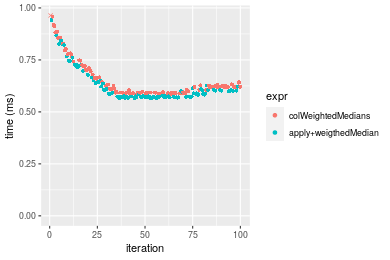

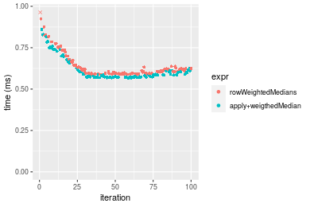
_Table: Benchmarking of colWeightedMedians() and rowWeightedMedians() on 1000x10 data (original and transposed).  The top panel shows times in milliseconds and the bottom panel shows relative times._


|   |expr               |     min|      lq|     mean|  median|       uq|      max|
|:--|:------------------|-------:|-------:|--------:|-------:|--------:|--------:|
|2  |rowWeightedMedians | 588.173| 594.631| 642.3677| 610.705| 642.1510|  978.510|
|1  |colWeightedMedians | 585.212| 593.123| 658.5968| 620.348| 687.6295| 1078.221|


|   |expr               |       min|       lq|     mean|  median|       uq|      max|
|:--|:------------------|---------:|--------:|--------:|-------:|--------:|--------:|
|2  |rowWeightedMedians | 1.0000000| 1.000000| 1.000000| 1.00000| 1.000000| 1.000000|
|1  |colWeightedMedians | 0.9949658| 0.997464| 1.025265| 1.01579| 1.070822| 1.101901|

_Figure: Benchmarking of colWeightedMedians() and rowWeightedMedians() on 1000x10 data (original and transposed).  Outliers are displayed as crosses. Times are in milliseconds._


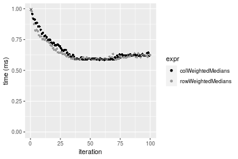

### 10x1000 matrix


```r
> X <- data[["10x1000"]]
> w <- runif(nrow(X))
> gc()
           used  (Mb) gc trigger  (Mb) max used  (Mb)
Ncells  5324789 284.4    8529671 455.6  8529671 455.6
Vcells 10475454  80.0   31876688 243.2 60562128 462.1
> colStats <- microbenchmark(colWeightedMedians = colWeightedMedians(X, w = w, na.rm = FALSE), `apply+weigthedMedian` = apply(X, 
+     MARGIN = 2L, FUN = weightedMedian, w = w, na.rm = FALSE), unit = "ms")
> X <- t(X)
> gc()
           used  (Mb) gc trigger  (Mb) max used  (Mb)
Ncells  5324765 284.4    8529671 455.6  8529671 455.6
Vcells 10485467  80.0   31876688 243.2 60562128 462.1
> rowStats <- microbenchmark(rowWeightedMedians = rowWeightedMedians(X, w = w, na.rm = FALSE), `apply+weigthedMedian` = apply(X, 
+     MARGIN = 1L, FUN = weightedMedian, w = w, na.rm = FALSE), unit = "ms")
```

_Table: Benchmarking of colWeightedMedians() and apply+weigthedMedian() on 10x1000 data. The top panel shows times in milliseconds and the bottom panel shows relative times._


|   |expr                 |      min|       lq|     mean|   median|       uq|       max|
|:--|:--------------------|--------:|--------:|--------:|--------:|--------:|---------:|
|2  |apply+weigthedMedian | 2.753192| 3.078094| 3.213874| 3.144999| 3.216814|  9.785959|
|1  |colWeightedMedians   | 3.321706| 3.697391| 3.871337| 3.772746| 3.853225| 10.209476|


|   |expr                 |      min|       lq|    mean|   median|       uq|      max|
|:--|:--------------------|--------:|--------:|-------:|--------:|--------:|--------:|
|2  |apply+weigthedMedian | 1.000000| 1.000000| 1.00000| 1.000000| 1.000000| 1.000000|
|1  |colWeightedMedians   | 1.206493| 1.201195| 1.20457| 1.199601| 1.197839| 1.043278|

_Table: Benchmarking of rowWeightedMedians() and apply+weigthedMedian() on 10x1000 data (transposed). The top panel shows times in milliseconds and the bottom panel shows relative times._


|   |expr                 |      min|      lq|     mean|   median|       uq|       max|
|:--|:--------------------|--------:|-------:|--------:|--------:|--------:|---------:|
|2  |apply+weigthedMedian | 2.783791| 3.10578| 3.236681| 3.157621| 3.213204|  9.654826|
|1  |rowWeightedMedians   | 3.281124| 3.66063| 3.842434| 3.759111| 3.838177| 10.139083|


|   |expr                 |      min|       lq|     mean|   median|       uq|      max|
|:--|:--------------------|--------:|--------:|--------:|--------:|--------:|--------:|
|2  |apply+weigthedMedian | 1.000000| 1.000000| 1.000000| 1.000000| 1.000000| 1.000000|
|1  |rowWeightedMedians   | 1.178653| 1.178651| 1.187153| 1.190488| 1.194502| 1.050157|

_Figure: Benchmarking of colWeightedMedians() and apply+weigthedMedian() on 10x1000 data  as well as rowWeightedMedians() and apply+weigthedMedian() on the same data transposed.  Outliers are displayed as crosses.  Times are in milliseconds._


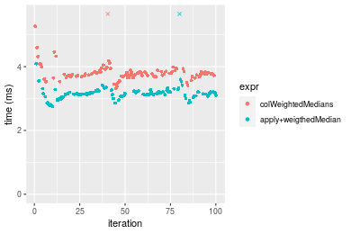

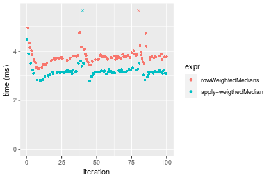
_Table: Benchmarking of colWeightedMedians() and rowWeightedMedians() on 10x1000 data (original and transposed).  The top panel shows times in milliseconds and the bottom panel shows relative times._


|   |expr               |      min|       lq|     mean|   median|       uq|      max|
|:--|:------------------|--------:|--------:|--------:|--------:|--------:|--------:|
|2  |rowWeightedMedians | 3.281124| 3.660630| 3.842434| 3.759111| 3.838177| 10.13908|
|1  |colWeightedMedians | 3.321706| 3.697391| 3.871337| 3.772746| 3.853225| 10.20948|


|   |expr               |      min|       lq|     mean|   median|      uq|      max|
|:--|:------------------|--------:|--------:|--------:|--------:|-------:|--------:|
|2  |rowWeightedMedians | 1.000000| 1.000000| 1.000000| 1.000000| 1.00000| 1.000000|
|1  |colWeightedMedians | 1.012368| 1.010042| 1.007522| 1.003627| 1.00392| 1.006943|

_Figure: Benchmarking of colWeightedMedians() and rowWeightedMedians() on 10x1000 data (original and transposed).  Outliers are displayed as crosses. Times are in milliseconds._


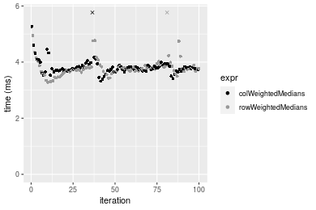

### 100x1000 matrix


```r
> X <- data[["100x1000"]]
> w <- runif(nrow(X))
> gc()
           used  (Mb) gc trigger  (Mb) max used  (Mb)
Ncells  5324967 284.4    8529671 455.6  8529671 455.6
Vcells 10476036  80.0   31876688 243.2 60562128 462.1
> colStats <- microbenchmark(colWeightedMedians = colWeightedMedians(X, w = w, na.rm = FALSE), `apply+weigthedMedian` = apply(X, 
+     MARGIN = 2L, FUN = weightedMedian, w = w, na.rm = FALSE), unit = "ms")
> X <- t(X)
> gc()
           used  (Mb) gc trigger  (Mb) max used  (Mb)
Ncells  5324955 284.4    8529671 455.6  8529671 455.6
Vcells 10576069  80.7   31876688 243.2 60562128 462.1
> rowStats <- microbenchmark(rowWeightedMedians = rowWeightedMedians(X, w = w, na.rm = FALSE), `apply+weigthedMedian` = apply(X, 
+     MARGIN = 1L, FUN = weightedMedian, w = w, na.rm = FALSE), unit = "ms")
```

_Table: Benchmarking of colWeightedMedians() and apply+weigthedMedian() on 100x1000 data. The top panel shows times in milliseconds and the bottom panel shows relative times._


|   |expr                 |      min|       lq|     mean|   median|       uq|      max|
|:--|:--------------------|--------:|--------:|--------:|--------:|--------:|--------:|
|2  |apply+weigthedMedian | 6.890591| 7.480619| 7.825088| 7.554851| 7.633451| 27.24606|
|1  |colWeightedMedians   | 7.395820| 8.068511| 8.369593| 8.148709| 8.241084| 26.70743|


|   |expr                 |      min|       lq|     mean|   median|       uq|      max|
|:--|:--------------------|--------:|--------:|--------:|--------:|--------:|--------:|
|2  |apply+weigthedMedian | 1.000000| 1.000000| 1.000000| 1.000000| 1.000000| 1.000000|
|1  |colWeightedMedians   | 1.073322| 1.078589| 1.069584| 1.078606| 1.079601| 0.980231|

_Table: Benchmarking of rowWeightedMedians() and apply+weigthedMedian() on 100x1000 data (transposed). The top panel shows times in milliseconds and the bottom panel shows relative times._


|   |expr                 |      min|       lq|     mean|   median|       uq|       max|
|:--|:--------------------|--------:|--------:|--------:|--------:|--------:|---------:|
|2  |apply+weigthedMedian | 6.926695| 7.492705| 7.639871| 7.559138| 7.635518|  9.637283|
|1  |rowWeightedMedians   | 7.464479| 8.106582| 8.607993| 8.156696| 8.231931| 27.903324|


|   |expr                 |      min|      lq|    mean|   median|      uq|      max|
|:--|:--------------------|--------:|-------:|-------:|--------:|-------:|--------:|
|2  |apply+weigthedMedian | 1.000000| 1.00000| 1.00000| 1.000000| 1.00000| 1.000000|
|1  |rowWeightedMedians   | 1.077639| 1.08193| 1.12672| 1.079051| 1.07811| 2.895352|

_Figure: Benchmarking of colWeightedMedians() and apply+weigthedMedian() on 100x1000 data  as well as rowWeightedMedians() and apply+weigthedMedian() on the same data transposed.  Outliers are displayed as crosses.  Times are in milliseconds._


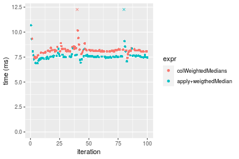

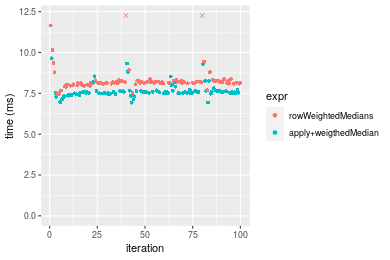
_Table: Benchmarking of colWeightedMedians() and rowWeightedMedians() on 100x1000 data (original and transposed).  The top panel shows times in milliseconds and the bottom panel shows relative times._


|   |expr               |      min|       lq|     mean|   median|       uq|      max|
|:--|:------------------|--------:|--------:|--------:|--------:|--------:|--------:|
|1  |colWeightedMedians | 7.395820| 8.068511| 8.369593| 8.148709| 8.241084| 26.70743|
|2  |rowWeightedMedians | 7.464479| 8.106582| 8.607993| 8.156696| 8.231931| 27.90332|


|   |expr               |      min|       lq|     mean|  median|        uq|      max|
|:--|:------------------|--------:|--------:|--------:|-------:|---------:|--------:|
|1  |colWeightedMedians | 1.000000| 1.000000| 1.000000| 1.00000| 1.0000000| 1.000000|
|2  |rowWeightedMedians | 1.009284| 1.004719| 1.028484| 1.00098| 0.9988893| 1.044778|

_Figure: Benchmarking of colWeightedMedians() and rowWeightedMedians() on 100x1000 data (original and transposed).  Outliers are displayed as crosses. Times are in milliseconds._


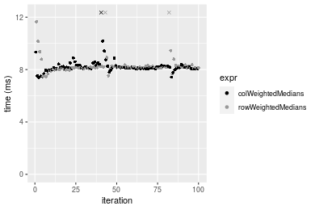

### 1000x100 matrix


```r
> X <- data[["1000x100"]]
> w <- runif(nrow(X))
> gc()
           used  (Mb) gc trigger  (Mb) max used  (Mb)
Ncells  5325154 284.4    8529671 455.6  8529671 455.6
Vcells 10477585  80.0   31876688 243.2 60562128 462.1
> colStats <- microbenchmark(colWeightedMedians = colWeightedMedians(X, w = w, na.rm = FALSE), `apply+weigthedMedian` = apply(X, 
+     MARGIN = 2L, FUN = weightedMedian, w = w, na.rm = FALSE), unit = "ms")
> X <- t(X)
> gc()
           used  (Mb) gc trigger  (Mb) max used  (Mb)
Ncells  5325142 284.4    8529671 455.6  8529671 455.6
Vcells 10577618  80.8   31876688 243.2 60562128 462.1
> rowStats <- microbenchmark(rowWeightedMedians = rowWeightedMedians(X, w = w, na.rm = FALSE), `apply+weigthedMedian` = apply(X, 
+     MARGIN = 1L, FUN = weightedMedian, w = w, na.rm = FALSE), unit = "ms")
```

_Table: Benchmarking of colWeightedMedians() and apply+weigthedMedian() on 1000x100 data. The top panel shows times in milliseconds and the bottom panel shows relative times._


|   |expr                 |      min|       lq|     mean|   median|       uq|      max|
|:--|:--------------------|--------:|--------:|--------:|--------:|--------:|--------:|
|2  |apply+weigthedMedian | 5.487842| 5.976517| 6.143820| 6.082755| 6.133801| 14.53874|
|1  |colWeightedMedians   | 5.581019| 6.066359| 6.287458| 6.192349| 6.224260| 15.38716|


|   |expr                 |      min|       lq|     mean|   median|       uq|      max|
|:--|:--------------------|--------:|--------:|--------:|--------:|--------:|--------:|
|2  |apply+weigthedMedian | 1.000000| 1.000000| 1.000000| 1.000000| 1.000000| 1.000000|
|1  |colWeightedMedians   | 1.016979| 1.015032| 1.023379| 1.018017| 1.014748| 1.058356|

_Table: Benchmarking of rowWeightedMedians() and apply+weigthedMedian() on 1000x100 data (transposed). The top panel shows times in milliseconds and the bottom panel shows relative times._


|   |expr                 |      min|       lq|     mean|   median|       uq|      max|
|:--|:--------------------|--------:|--------:|--------:|--------:|--------:|--------:|
|2  |apply+weigthedMedian | 5.535188| 6.018122| 6.206917| 6.141623| 6.169907| 15.39945|
|1  |rowWeightedMedians   | 5.601261| 6.088288| 6.376918| 6.229851| 6.260240| 15.11609|


|   |expr                 |      min|       lq|     mean|   median|       uq|       max|
|:--|:--------------------|--------:|--------:|--------:|--------:|--------:|---------:|
|2  |apply+weigthedMedian | 1.000000| 1.000000| 1.000000| 1.000000| 1.000000| 1.0000000|
|1  |rowWeightedMedians   | 1.011937| 1.011659| 1.027389| 1.014365| 1.014641| 0.9815997|

_Figure: Benchmarking of colWeightedMedians() and apply+weigthedMedian() on 1000x100 data  as well as rowWeightedMedians() and apply+weigthedMedian() on the same data transposed.  Outliers are displayed as crosses.  Times are in milliseconds._


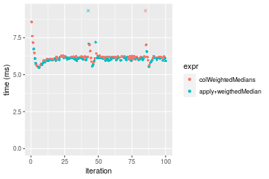

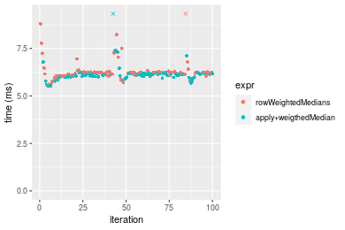
_Table: Benchmarking of colWeightedMedians() and rowWeightedMedians() on 1000x100 data (original and transposed).  The top panel shows times in milliseconds and the bottom panel shows relative times._


|   |expr               |      min|       lq|     mean|   median|      uq|      max|
|:--|:------------------|--------:|--------:|--------:|--------:|-------:|--------:|
|1  |colWeightedMedians | 5.581019| 6.066359| 6.287458| 6.192349| 6.22426| 15.38716|
|2  |rowWeightedMedians | 5.601261| 6.088288| 6.376918| 6.229851| 6.26024| 15.11609|


|   |expr               |      min|       lq|     mean|   median|      uq|       max|
|:--|:------------------|--------:|--------:|--------:|--------:|-------:|---------:|
|1  |colWeightedMedians | 1.000000| 1.000000| 1.000000| 1.000000| 1.00000| 1.0000000|
|2  |rowWeightedMedians | 1.003627| 1.003615| 1.014228| 1.006056| 1.00578| 0.9823835|

_Figure: Benchmarking of colWeightedMedians() and rowWeightedMedians() on 1000x100 data (original and transposed).  Outliers are displayed as crosses. Times are in milliseconds._


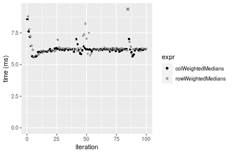


## Appendix

### Session information
```r
R version 4.1.1 Patched (2021-08-10 r80727)
Platform: x86_64-pc-linux-gnu (64-bit)
Running under: Ubuntu 18.04.5 LTS

Matrix products: default
BLAS:   /home/hb/software/R-devel/R-4-1-branch/lib/R/lib/libRblas.so
LAPACK: /home/hb/software/R-devel/R-4-1-branch/lib/R/lib/libRlapack.so

locale:
 [1] LC_CTYPE=en_US.UTF-8       LC_NUMERIC=C              
 [3] LC_TIME=en_US.UTF-8        LC_COLLATE=en_US.UTF-8    
 [5] LC_MONETARY=en_US.UTF-8    LC_MESSAGES=en_US.UTF-8   
 [7] LC_PAPER=en_US.UTF-8       LC_NAME=C                 
 [9] LC_ADDRESS=C               LC_TELEPHONE=C            
[11] LC_MEASUREMENT=en_US.UTF-8 LC_IDENTIFICATION=C       

attached base packages:
[1] stats     graphics  grDevices utils     datasets  methods   base     

other attached packages:
[1] microbenchmark_1.4-7   matrixStats_0.60.1     ggplot2_3.3.5         
[4] knitr_1.33             R.devices_2.17.0       R.utils_2.10.1        
[7] R.oo_1.24.0            R.methodsS3_1.8.1-9001 history_0.0.1-9000    

loaded via a namespace (and not attached):
 [1] Biobase_2.52.0          httr_1.4.2              splines_4.1.1          
 [4] bit64_4.0.5             network_1.17.1          assertthat_0.2.1       
 [7] highr_0.9               stats4_4.1.1            blob_1.2.2             
[10] GenomeInfoDbData_1.2.6  robustbase_0.93-8       pillar_1.6.2           
[13] RSQLite_2.2.8           lattice_0.20-44         glue_1.4.2             
[16] digest_0.6.27           XVector_0.32.0          colorspace_2.0-2       
[19] Matrix_1.3-4            XML_3.99-0.7            pkgconfig_2.0.3        
[22] zlibbioc_1.38.0         genefilter_1.74.0       purrr_0.3.4            
[25] ergm_4.1.2              xtable_1.8-4            scales_1.1.1           
[28] tibble_3.1.4            annotate_1.70.0         KEGGREST_1.32.0        
[31] farver_2.1.0            generics_0.1.0          IRanges_2.26.0         
[34] ellipsis_0.3.2          cachem_1.0.6            withr_2.4.2            
[37] BiocGenerics_0.38.0     mime_0.11               survival_3.2-13        
[40] magrittr_2.0.1          crayon_1.4.1            statnet.common_4.5.0   
[43] memoise_2.0.0           laeken_0.5.1            fansi_0.5.0            
[46] R.cache_0.15.0          MASS_7.3-54             R.rsp_0.44.0           
[49] progressr_0.8.0         tools_4.1.1             lifecycle_1.0.0        
[52] S4Vectors_0.30.0        trust_0.1-8             munsell_0.5.0          
[55] tabby_0.0.1-9001        AnnotationDbi_1.54.1    Biostrings_2.60.2      
[58] compiler_4.1.1          GenomeInfoDb_1.28.1     rlang_0.4.11           
[61] grid_4.1.1              RCurl_1.98-1.4          cwhmisc_6.6            
[64] rappdirs_0.3.3          startup_0.15.0          labeling_0.4.2         
[67] bitops_1.0-7            base64enc_0.1-3         boot_1.3-28            
[70] gtable_0.3.0            DBI_1.1.1               markdown_1.1           
[73] R6_2.5.1                lpSolveAPI_5.5.2.0-17.7 rle_0.9.2              
[76] dplyr_1.0.7             fastmap_1.1.0           bit_4.0.4              
[79] utf8_1.2.2              parallel_4.1.1          Rcpp_1.0.7             
[82] vctrs_0.3.8             png_0.1-7               DEoptimR_1.0-9         
[85] tidyselect_1.1.1        xfun_0.25               coda_0.19-4            
```
Total processing time was 19.23 secs.


### Reproducibility
To reproduce this report, do:
```r
html <- matrixStats:::benchmark('colWeightedMedians')
```

[RSP]: https://cran.r-project.org/package=R.rsp
[matrixStats]: https://cran.r-project.org/package=matrixStats

[StackOverflow:colMins?]: https://stackoverflow.com/questions/13676878 "Stack Overflow: fastest way to get Min from every column in a matrix?"
[StackOverflow:colSds?]: https://stackoverflow.com/questions/17549762 "Stack Overflow: Is there such 'colsd' in R?"
[StackOverflow:rowProds?]: https://stackoverflow.com/questions/20198801/ "Stack Overflow: Row product of matrix and column sum of matrix"

---------------------------------------
Copyright Henrik Bengtsson. Last updated on 2021-08-25 19:12:19 (+0200 UTC). Powered by [RSP].

<script>
 var link = document.createElement('link');
 link.rel = 'icon';
 link.href = "data:image/png;base64,iVBORw0KGgoAAAANSUhEUgAAACAAAAAgCAMAAABEpIrGAAAA21BMVEUAAAAAAP8AAP8AAP8AAP8AAP8AAP8AAP8AAP8AAP8AAP8AAP8AAP8AAP8AAP8AAP8AAP8AAP8AAP8AAP8AAP8AAP8AAP8AAP8AAP8AAP8AAP8AAP8AAP8AAP8AAP8AAP8AAP8AAP8AAP8AAP8AAP8AAP8AAP8AAP8AAP8AAP8BAf4CAv0DA/wdHeIeHuEfH+AgIN8hId4lJdomJtknJ9g+PsE/P8BAQL9yco10dIt1dYp3d4h4eIeVlWqWlmmXl2iYmGeZmWabm2Tn5xjo6Bfp6Rb39wj4+Af//wA2M9hbAAAASXRSTlMAAQIJCgsMJSYnKD4/QGRlZmhpamtsbautrrCxuru8y8zN5ebn6Pn6+///////////////////////////////////////////LsUNcQAAAS9JREFUOI29k21XgkAQhVcFytdSMqMETU26UVqGmpaiFbL//xc1cAhhwVNf6n5i5z67M2dmYOyfJZUqlVLhkKucG7cgmUZTybDz6g0iDeq51PUr37Ds2cy2/C9NeES5puDjxuUk1xnToZsg8pfA3avHQ3lLIi7iWRrkv/OYtkScxBIMgDee0ALoyxHQBJ68JLCjOtQIMIANF7QG9G9fNnHvisCHBVMKgSJgiz7nE+AoBKrAPA3MgepvgR9TSCasrCKH0eB1wBGBFdCO+nAGjMVGPcQb5bd6mQRegN6+1axOs9nGfYcCtfi4NQosdtH7dB+txFIpXQqN1p9B/asRHToyS0jRgpV7nk4nwcq1BJ+x3Gl/v7S9Wmpp/aGquum7w3ZDyrADFYrl8vHBH+ev9AUASW1dmU4h4wAAAABJRU5ErkJggg=="
 document.getElementsByTagName('head')[0].appendChild(link);
</script>


