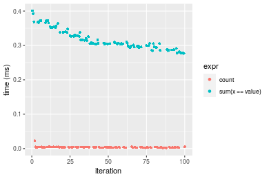
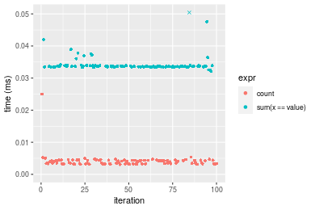

[matrixStats]: Benchmark report

---------------------------------------


# count() benchmarks

This report benchmark the performance of count() against alternative methods.

## Alternative methods

* sum(x == value)


## Data type "integer"
### Data
```r
> rvector <- function(n, mode = c("logical", "double", "integer"), range = c(-100, +100), na_prob = 0) {
+     mode <- match.arg(mode)
+     if (mode == "logical") {
+         x <- sample(c(FALSE, TRUE), size = n, replace = TRUE)
+     }     else {
+         x <- runif(n, min = range[1], max = range[2])
+     }
+     storage.mode(x) <- mode
+     if (na_prob > 0) 
+         x[sample(n, size = na_prob * n)] <- NA
+     x
+ }
> rvectors <- function(scale = 10, seed = 1, ...) {
+     set.seed(seed)
+     data <- list()
+     data[[1]] <- rvector(n = scale * 100, ...)
+     data[[2]] <- rvector(n = scale * 1000, ...)
+     data[[3]] <- rvector(n = scale * 10000, ...)
+     data[[4]] <- rvector(n = scale * 1e+05, ...)
+     data[[5]] <- rvector(n = scale * 1e+06, ...)
+     names(data) <- sprintf("n = %d", sapply(data, FUN = length))
+     data
+ }
> data <- rvectors(mode = mode)
```

### Results

### n = 1000 vector

```r
> x <- data[["n = 1000"]]
> gc()
           used  (Mb) gc trigger  (Mb) max used  (Mb)
Ncells  5328806 284.6    8529671 455.6  8529671 455.6
Vcells 37453872 285.8   66528939 507.6 60562128 462.1
> stats <- microbenchmark(count = count(x, value), `sum(x == value)` = sum(x == value), unit = "ms")
```

_Table: Benchmarking of count() and sum(x == value)() on integer+n = 1000 data. The top panel shows times in milliseconds and the bottom panel shows relative times._


|   |expr            |      min|        lq|      mean|   median|       uq|      max|
|:--|:---------------|--------:|---------:|---------:|--------:|--------:|--------:|
|1  |count           | 0.002963| 0.0031560| 0.0036359| 0.003269| 0.003465| 0.023826|
|2  |sum(x == value) | 0.004211| 0.0043245| 0.0045332| 0.004403| 0.004481| 0.013697|


|   |expr            |      min|       lq|     mean|   median|       uq|       max|
|:--|:---------------|--------:|--------:|--------:|--------:|--------:|---------:|
|1  |count           | 1.000000| 1.000000| 1.000000| 1.000000| 1.000000| 1.0000000|
|2  |sum(x == value) | 1.421195| 1.370247| 1.246779| 1.346895| 1.293218| 0.5748762|

_Figure: Benchmarking of count() and sum(x == value)() on integer+n = 1000 data.  Outliers are displayed as crosses.  Times are in milliseconds._


### n = 10000 vector

```r
> x <- data[["n = 10000"]]
> gc()
           used  (Mb) gc trigger  (Mb) max used  (Mb)
Ncells  5326573 284.5    8529671 455.6  8529671 455.6
Vcells 15818616 120.7   53223152 406.1 60562128 462.1
> stats <- microbenchmark(count = count(x, value), `sum(x == value)` = sum(x == value), unit = "ms")
```

_Table: Benchmarking of count() and sum(x == value)() on integer+n = 10000 data. The top panel shows times in milliseconds and the bottom panel shows relative times._


|   |expr            |      min|        lq|      mean|   median|        uq|      max|
|:--|:---------------|--------:|---------:|---------:|--------:|---------:|--------:|
|1  |count           | 0.002987| 0.0033400| 0.0040824| 0.003892| 0.0042985| 0.025761|
|2  |sum(x == value) | 0.035581| 0.0374245| 0.0387245| 0.037691| 0.0391610| 0.052762|


|   |expr            |      min|       lq|     mean|   median|       uq|      max|
|:--|:---------------|--------:|--------:|--------:|--------:|--------:|--------:|
|1  |count           |  1.00000|  1.00000| 1.000000| 1.000000| 1.000000| 1.000000|
|2  |sum(x == value) | 11.91195| 11.20494| 9.485654| 9.684224| 9.110387| 2.048135|

_Figure: Benchmarking of count() and sum(x == value)() on integer+n = 10000 data.  Outliers are displayed as crosses.  Times are in milliseconds._


### n = 100000 vector

```r
> x <- data[["n = 100000"]]
> gc()
           used  (Mb) gc trigger  (Mb) max used  (Mb)
Ncells  5326636 284.5    8529671 455.6  8529671 455.6
Vcells 15818658 120.7   53223152 406.1 60562128 462.1
> stats <- microbenchmark(count = count(x, value), `sum(x == value)` = sum(x == value), unit = "ms")
```

_Table: Benchmarking of count() and sum(x == value)() on integer+n = 100000 data. The top panel shows times in milliseconds and the bottom panel shows relative times._


|   |expr            |      min|        lq|      mean|    median|        uq|      max|
|:--|:---------------|--------:|---------:|---------:|---------:|---------:|--------:|
|1  |count           | 0.002412| 0.0027625| 0.0037828| 0.0033975| 0.0043455| 0.023250|
|2  |sum(x == value) | 0.276560| 0.2957400| 0.3162287| 0.3059775| 0.3342625| 0.401091|


|   |expr            |    min|       lq|     mean|  median|       uq|      max|
|:--|:---------------|------:|--------:|--------:|-------:|--------:|--------:|
|1  |count           |   1.00|   1.0000|  1.00000|  1.0000|  1.00000|  1.00000|
|2  |sum(x == value) | 114.66| 107.0552| 83.59668| 90.0596| 76.92153| 17.25123|

_Figure: Benchmarking of count() and sum(x == value)() on integer+n = 100000 data.  Outliers are displayed as crosses.  Times are in milliseconds._



### n = 1000000 vector

```r
> x <- data[["n = 1000000"]]
> gc()
           used  (Mb) gc trigger  (Mb) max used  (Mb)
Ncells  5326699 284.5    8529671 455.6  8529671 455.6
Vcells 15819213 120.7   53223152 406.1 60562128 462.1
> stats <- microbenchmark(count = count(x, value), `sum(x == value)` = sum(x == value), unit = "ms")
```

_Table: Benchmarking of count() and sum(x == value)() on integer+n = 1000000 data. The top panel shows times in milliseconds and the bottom panel shows relative times._


|   |expr            |      min|        lq|      mean|    median|       uq|       max|
|:--|:---------------|--------:|---------:|---------:|---------:|--------:|---------:|
|1  |count           | 0.001981| 0.0025015| 0.0102454| 0.0063565| 0.016595|  0.030828|
|2  |sum(x == value) | 2.797049| 3.5377980| 3.6884905| 3.5646060| 3.593936| 17.222212|


|   |expr            |      min|       lq|     mean|   median|       uq|      max|
|:--|:---------------|--------:|--------:|--------:|--------:|--------:|--------:|
|1  |count           |    1.000|    1.000|   1.0000|   1.0000|   1.0000|   1.0000|
|2  |sum(x == value) | 1411.938| 1414.271| 360.0129| 560.7812| 216.5674| 558.6549|

_Figure: Benchmarking of count() and sum(x == value)() on integer+n = 1000000 data.  Outliers are displayed as crosses.  Times are in milliseconds._


### n = 10000000 vector

```r
> x <- data[["n = 10000000"]]
> gc()
           used  (Mb) gc trigger  (Mb) max used  (Mb)
Ncells  5326762 284.5    8529671 455.6  8529671 455.6
Vcells 15819255 120.7   53223152 406.1 60562128 462.1
> stats <- microbenchmark(count = count(x, value), `sum(x == value)` = sum(x == value), unit = "ms")
```

_Table: Benchmarking of count() and sum(x == value)() on integer+n = 10000000 data. The top panel shows times in milliseconds and the bottom panel shows relative times._


|   |expr            |       min|        lq|       mean|     median|         uq|       max|
|:--|:---------------|---------:|---------:|----------:|----------:|----------:|---------:|
|1  |count           |  0.002007|  0.002561|  0.0131692|  0.0036965|  0.0241115|  0.035557|
|2  |sum(x == value) | 35.804868| 36.474240| 39.2176533| 36.9697970| 37.4299840| 55.510647|


|   |expr            |      min|       lq|     mean|  median|       uq|      max|
|:--|:---------------|--------:|--------:|--------:|-------:|--------:|--------:|
|1  |count           |     1.00|     1.00|    1.000|     1.0|    1.000|    1.000|
|2  |sum(x == value) | 17839.99| 14242.19| 2977.987| 10001.3| 1552.371| 1561.174|

_Figure: Benchmarking of count() and sum(x == value)() on integer+n = 10000000 data.  Outliers are displayed as crosses.  Times are in milliseconds._


## Data type "double"
### Data
```r
> rvector <- function(n, mode = c("logical", "double", "integer"), range = c(-100, +100), na_prob = 0) {
+     mode <- match.arg(mode)
+     if (mode == "logical") {
+         x <- sample(c(FALSE, TRUE), size = n, replace = TRUE)
+     }     else {
+         x <- runif(n, min = range[1], max = range[2])
+     }
+     storage.mode(x) <- mode
+     if (na_prob > 0) 
+         x[sample(n, size = na_prob * n)] <- NA
+     x
+ }
> rvectors <- function(scale = 10, seed = 1, ...) {
+     set.seed(seed)
+     data <- list()
+     data[[1]] <- rvector(n = scale * 100, ...)
+     data[[2]] <- rvector(n = scale * 1000, ...)
+     data[[3]] <- rvector(n = scale * 10000, ...)
+     data[[4]] <- rvector(n = scale * 1e+05, ...)
+     data[[5]] <- rvector(n = scale * 1e+06, ...)
+     names(data) <- sprintf("n = %d", sapply(data, FUN = length))
+     data
+ }
> data <- rvectors(mode = mode)
```

### Results

### n = 1000 vector

```r
> x <- data[["n = 1000"]]
> gc()
           used  (Mb) gc trigger  (Mb) max used  (Mb)
Ncells  5326825 284.5    8529671 455.6  8529671 455.6
Vcells 21375126 163.1   53223152 406.1 60562128 462.1
> stats <- microbenchmark(count = count(x, value), `sum(x == value)` = sum(x == value), unit = "ms")
```

_Table: Benchmarking of count() and sum(x == value)() on double+n = 1000 data. The top panel shows times in milliseconds and the bottom panel shows relative times._


|   |expr            |      min|        lq|      mean|    median|       uq|      max|
|:--|:---------------|--------:|---------:|---------:|---------:|--------:|--------:|
|1  |count           | 0.003170| 0.0033640| 0.0038077| 0.0035055| 0.003624| 0.025294|
|2  |sum(x == value) | 0.003983| 0.0040985| 0.0042885| 0.0041635| 0.004260| 0.014047|


|   |expr            |      min|       lq|    mean|   median|       uq|       max|
|:--|:---------------|--------:|--------:|-------:|--------:|--------:|---------:|
|1  |count           | 1.000000| 1.000000| 1.00000| 1.000000| 1.000000| 1.0000000|
|2  |sum(x == value) | 1.256467| 1.218341| 1.12628| 1.187705| 1.175497| 0.5553491|

_Figure: Benchmarking of count() and sum(x == value)() on double+n = 1000 data.  Outliers are displayed as crosses.  Times are in milliseconds._


### n = 10000 vector

```r
> x <- data[["n = 10000"]]
> gc()
           used  (Mb) gc trigger  (Mb) max used  (Mb)
Ncells  5326888 284.5    8529671 455.6  8529671 455.6
Vcells 21375167 163.1   53223152 406.1 60562128 462.1
> stats <- microbenchmark(count = count(x, value), `sum(x == value)` = sum(x == value), unit = "ms")
```

_Table: Benchmarking of count() and sum(x == value)() on double+n = 10000 data. The top panel shows times in milliseconds and the bottom panel shows relative times._


|   |expr            |      min|        lq|      mean|    median|        uq|      max|
|:--|:---------------|--------:|---------:|---------:|---------:|---------:|--------:|
|1  |count           | 0.003084| 0.0033045| 0.0040723| 0.0037945| 0.0043805| 0.025023|
|2  |sum(x == value) | 0.032108| 0.0335125| 0.0342588| 0.0336250| 0.0337760| 0.052027|


|   |expr            |      min|       lq|    mean|  median|       uq|      max|
|:--|:---------------|--------:|--------:|-------:|-------:|--------:|--------:|
|1  |count           |  1.00000|  1.00000| 1.00000| 1.00000| 1.000000| 1.000000|
|2  |sum(x == value) | 10.41115| 10.14147| 8.41259| 8.86151| 7.710535| 2.079167|

_Figure: Benchmarking of count() and sum(x == value)() on double+n = 10000 data.  Outliers are displayed as crosses.  Times are in milliseconds._



### n = 100000 vector

```r
> x <- data[["n = 100000"]]
> gc()
           used  (Mb) gc trigger  (Mb) max used  (Mb)
Ncells  5326951 284.5    8529671 455.6  8529671 455.6
Vcells 21375491 163.1   53223152 406.1 60562128 462.1
> stats <- microbenchmark(count = count(x, value), `sum(x == value)` = sum(x == value), unit = "ms")
```

_Table: Benchmarking of count() and sum(x == value)() on double+n = 100000 data. The top panel shows times in milliseconds and the bottom panel shows relative times._


|   |expr            |      min|       lq|      mean|    median|       uq|      max|
|:--|:---------------|--------:|--------:|---------:|---------:|--------:|--------:|
|1  |count           | 0.002565| 0.002884| 0.0041810| 0.0036640| 0.004688| 0.028827|
|2  |sum(x == value) | 0.261388| 0.271350| 0.2949966| 0.2892505| 0.313009| 0.374071|


|   |expr            |      min|       lq|     mean|   median|       uq|      max|
|:--|:---------------|--------:|--------:|--------:|--------:|--------:|--------:|
|1  |count           |   1.0000|  1.00000|  1.00000|  1.00000|  1.00000|  1.00000|
|2  |sum(x == value) | 101.9057| 94.08807| 70.55698| 78.94391| 66.76813| 12.97641|

_Figure: Benchmarking of count() and sum(x == value)() on double+n = 100000 data.  Outliers are displayed as crosses.  Times are in milliseconds._


### n = 1000000 vector

```r
> x <- data[["n = 1000000"]]
> gc()
           used  (Mb) gc trigger  (Mb) max used  (Mb)
Ncells  5327014 284.5    8529671 455.6  8529671 455.6
Vcells 21375863 163.1   53223152 406.1 60562128 462.1
> stats <- microbenchmark(count = count(x, value), `sum(x == value)` = sum(x == value), unit = "ms")
```

_Table: Benchmarking of count() and sum(x == value)() on double+n = 1000000 data. The top panel shows times in milliseconds and the bottom panel shows relative times._


|   |expr            |      min|       lq|      mean|   median|        uq|       max|
|:--|:---------------|--------:|--------:|---------:|--------:|---------:|---------:|
|1  |count           | 0.001985| 0.002481| 0.0111833| 0.009625| 0.0183635|  0.032442|
|2  |sum(x == value) | 3.321211| 3.411456| 3.6900379| 3.441822| 3.5675620| 17.761495|


|   |expr            |      min|       lq|   mean|   median|       uq|      max|
|:--|:---------------|--------:|--------:|------:|--------:|--------:|--------:|
|1  |count           |    1.000|    1.000|   1.00|   1.0000|   1.0000|   1.0000|
|2  |sum(x == value) | 1673.154| 1375.032| 329.96| 357.5919| 194.2746| 547.4846|

_Figure: Benchmarking of count() and sum(x == value)() on double+n = 1000000 data.  Outliers are displayed as crosses.  Times are in milliseconds._


### n = 10000000 vector

```r
> x <- data[["n = 10000000"]]
> gc()
           used  (Mb) gc trigger  (Mb) max used  (Mb)
Ncells  5327077 284.5    8529671 455.6  8529671 455.6
Vcells 21375905 163.1   53223152 406.1 60562128 462.1
> stats <- microbenchmark(count = count(x, value), `sum(x == value)` = sum(x == value), unit = "ms")
```

_Table: Benchmarking of count() and sum(x == value)() on double+n = 10000000 data. The top panel shows times in milliseconds and the bottom panel shows relative times._


|   |expr            |       min|         lq|       mean|    median|         uq|        max|
|:--|:---------------|---------:|----------:|----------:|---------:|----------:|----------:|
|1  |count           |  0.001998|  0.0025375|  0.0141113|  0.003532|  0.0268855|   0.030452|
|2  |sum(x == value) | 32.952294| 33.4601140| 40.3936593| 34.074120| 35.2056820| 413.800210|


|   |expr            |      min|       lq|     mean|   median|       uq|      max|
|:--|:---------------|--------:|--------:|--------:|--------:|--------:|--------:|
|1  |count           |     1.00|     1.00|    1.000|    1.000|    1.000|     1.00|
|2  |sum(x == value) | 16492.64| 13186.25| 2862.504| 9647.259| 1309.467| 13588.61|

_Figure: Benchmarking of count() and sum(x == value)() on double+n = 10000000 data.  Outliers are displayed as crosses.  Times are in milliseconds._


## Appendix

### Session information
```r
R version 4.1.1 Patched (2021-08-10 r80727)
Platform: x86_64-pc-linux-gnu (64-bit)
Running under: Ubuntu 18.04.5 LTS

Matrix products: default
BLAS:   /home/hb/software/R-devel/R-4-1-branch/lib/R/lib/libRblas.so
LAPACK: /home/hb/software/R-devel/R-4-1-branch/lib/R/lib/libRlapack.so

locale:
 [1] LC_CTYPE=en_US.UTF-8       LC_NUMERIC=C              
 [3] LC_TIME=en_US.UTF-8        LC_COLLATE=en_US.UTF-8    
 [5] LC_MONETARY=en_US.UTF-8    LC_MESSAGES=en_US.UTF-8   
 [7] LC_PAPER=en_US.UTF-8       LC_NAME=C                 
 [9] LC_ADDRESS=C               LC_TELEPHONE=C            
[11] LC_MEASUREMENT=en_US.UTF-8 LC_IDENTIFICATION=C       

attached base packages:
[1] stats     graphics  grDevices utils     datasets  methods   base     

other attached packages:
[1] microbenchmark_1.4-7   matrixStats_0.60.1     ggplot2_3.3.5         
[4] knitr_1.33             R.devices_2.17.0       R.utils_2.10.1        
[7] R.oo_1.24.0            R.methodsS3_1.8.1-9001 history_0.0.1-9000    

loaded via a namespace (and not attached):
 [1] Biobase_2.52.0          httr_1.4.2              splines_4.1.1          
 [4] bit64_4.0.5             network_1.17.1          assertthat_0.2.1       
 [7] highr_0.9               stats4_4.1.1            blob_1.2.2             
[10] GenomeInfoDbData_1.2.6  robustbase_0.93-8       pillar_1.6.2           
[13] RSQLite_2.2.8           lattice_0.20-44         glue_1.4.2             
[16] digest_0.6.27           XVector_0.32.0          colorspace_2.0-2       
[19] Matrix_1.3-4            XML_3.99-0.7            pkgconfig_2.0.3        
[22] zlibbioc_1.38.0         genefilter_1.74.0       purrr_0.3.4            
[25] ergm_4.1.2              xtable_1.8-4            scales_1.1.1           
[28] tibble_3.1.4            annotate_1.70.0         KEGGREST_1.32.0        
[31] farver_2.1.0            generics_0.1.0          IRanges_2.26.0         
[34] ellipsis_0.3.2          cachem_1.0.6            withr_2.4.2            
[37] BiocGenerics_0.38.0     mime_0.11               survival_3.2-13        
[40] magrittr_2.0.1          crayon_1.4.1            statnet.common_4.5.0   
[43] memoise_2.0.0           laeken_0.5.1            fansi_0.5.0            
[46] R.cache_0.15.0          MASS_7.3-54             R.rsp_0.44.0           
[49] progressr_0.8.0         tools_4.1.1             lifecycle_1.0.0        
[52] S4Vectors_0.30.0        trust_0.1-8             munsell_0.5.0          
[55] tabby_0.0.1-9001        AnnotationDbi_1.54.1    Biostrings_2.60.2      
[58] compiler_4.1.1          GenomeInfoDb_1.28.1     rlang_0.4.11           
[61] grid_4.1.1              RCurl_1.98-1.4          cwhmisc_6.6            
[64] rappdirs_0.3.3          startup_0.15.0          labeling_0.4.2         
[67] bitops_1.0-7            base64enc_0.1-3         boot_1.3-28            
[70] gtable_0.3.0            DBI_1.1.1               markdown_1.1           
[73] R6_2.5.1                lpSolveAPI_5.5.2.0-17.7 rle_0.9.2              
[76] dplyr_1.0.7             fastmap_1.1.0           bit_4.0.4              
[79] utf8_1.2.2              parallel_4.1.1          Rcpp_1.0.7             
[82] vctrs_0.3.8             png_0.1-7               DEoptimR_1.0-9         
[85] tidyselect_1.1.1        xfun_0.25               coda_0.19-4            
```
Total processing time was 21.96 secs.


### Reproducibility
To reproduce this report, do:
```r
html <- matrixStats:::benchmark('count')
```

[RSP]: https://cran.r-project.org/package=R.rsp
[matrixStats]: https://cran.r-project.org/package=matrixStats

[StackOverflow:colMins?]: https://stackoverflow.com/questions/13676878 "Stack Overflow: fastest way to get Min from every column in a matrix?"
[StackOverflow:colSds?]: https://stackoverflow.com/questions/17549762 "Stack Overflow: Is there such 'colsd' in R?"
[StackOverflow:rowProds?]: https://stackoverflow.com/questions/20198801/ "Stack Overflow: Row product of matrix and column sum of matrix"

---------------------------------------
Copyright Henrik Bengtsson. Last updated on 2021-08-25 19:14:11 (+0200 UTC). Powered by [RSP].

<script>
 var link = document.createElement('link');
 link.rel = 'icon';
 link.href = "data:image/png;base64,iVBORw0KGgoAAAANSUhEUgAAACAAAAAgCAMAAABEpIrGAAAA21BMVEUAAAAAAP8AAP8AAP8AAP8AAP8AAP8AAP8AAP8AAP8AAP8AAP8AAP8AAP8AAP8AAP8AAP8AAP8AAP8AAP8AAP8AAP8AAP8AAP8AAP8AAP8AAP8AAP8AAP8AAP8AAP8AAP8AAP8AAP8AAP8AAP8AAP8AAP8AAP8AAP8AAP8AAP8BAf4CAv0DA/wdHeIeHuEfH+AgIN8hId4lJdomJtknJ9g+PsE/P8BAQL9yco10dIt1dYp3d4h4eIeVlWqWlmmXl2iYmGeZmWabm2Tn5xjo6Bfp6Rb39wj4+Af//wA2M9hbAAAASXRSTlMAAQIJCgsMJSYnKD4/QGRlZmhpamtsbautrrCxuru8y8zN5ebn6Pn6+///////////////////////////////////////////LsUNcQAAAS9JREFUOI29k21XgkAQhVcFytdSMqMETU26UVqGmpaiFbL//xc1cAhhwVNf6n5i5z67M2dmYOyfJZUqlVLhkKucG7cgmUZTybDz6g0iDeq51PUr37Ds2cy2/C9NeES5puDjxuUk1xnToZsg8pfA3avHQ3lLIi7iWRrkv/OYtkScxBIMgDee0ALoyxHQBJ68JLCjOtQIMIANF7QG9G9fNnHvisCHBVMKgSJgiz7nE+AoBKrAPA3MgepvgR9TSCasrCKH0eB1wBGBFdCO+nAGjMVGPcQb5bd6mQRegN6+1axOs9nGfYcCtfi4NQosdtH7dB+txFIpXQqN1p9B/asRHToyS0jRgpV7nk4nwcq1BJ+x3Gl/v7S9Wmpp/aGquum7w3ZDyrADFYrl8vHBH+ev9AUASW1dmU4h4wAAAABJRU5ErkJggg=="
 document.getElementsByTagName('head')[0].appendChild(link);
</script>


