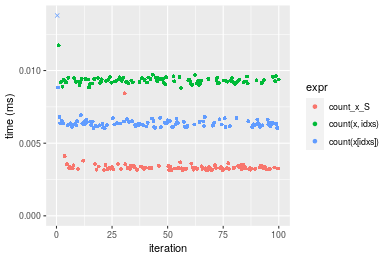
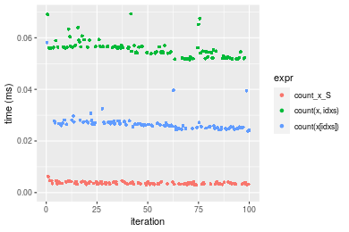
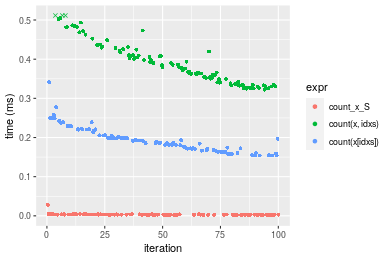
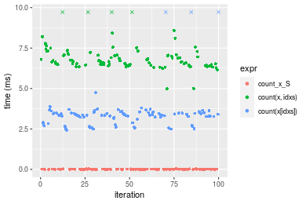
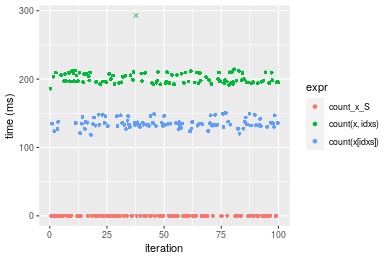
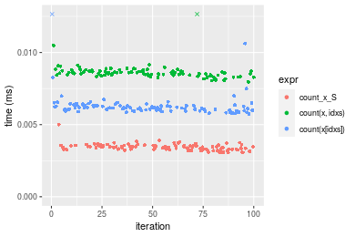
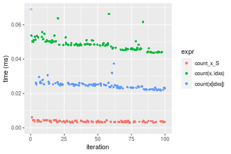
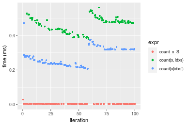
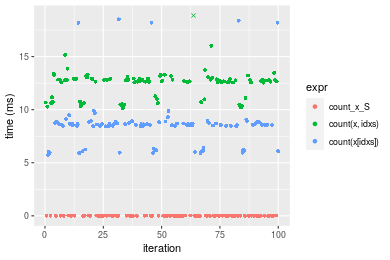
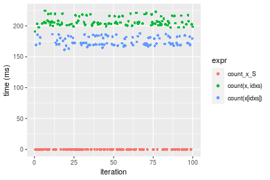

[matrixStats]: Benchmark report

---------------------------------------


# count() benchmarks on subsetted computation

This report benchmark the performance of count() on subsetted computation.


## Data type "integer"
### Data
```r
> rvector <- function(n, mode = c("logical", "double", "integer"), range = c(-100, +100), na_prob = 0) {
+     mode <- match.arg(mode)
+     if (mode == "logical") {
+         x <- sample(c(FALSE, TRUE), size = n, replace = TRUE)
+     }     else {
+         x <- runif(n, min = range[1], max = range[2])
+     }
+     storage.mode(x) <- mode
+     if (na_prob > 0) 
+         x[sample(n, size = na_prob * n)] <- NA
+     x
+ }
> rvectors <- function(scale = 10, seed = 1, ...) {
+     set.seed(seed)
+     data <- list()
+     data[[1]] <- rvector(n = scale * 100, ...)
+     data[[2]] <- rvector(n = scale * 1000, ...)
+     data[[3]] <- rvector(n = scale * 10000, ...)
+     data[[4]] <- rvector(n = scale * 1e+05, ...)
+     data[[5]] <- rvector(n = scale * 1e+06, ...)
+     names(data) <- sprintf("n = %d", sapply(data, FUN = length))
+     data
+ }
> data <- rvectors(mode = mode)
```

### Results

### n = 1000 vector

```r
> x <- data[["n = 1000"]]
> idxs <- sample.int(length(x), size = length(x) * 0.7)
> x_S <- x[idxs]
> gc()
           used  (Mb) gc trigger  (Mb) max used  (Mb)
Ncells  5337704 285.1    8529671 455.6  8529671 455.6
Vcells 16188595 123.6   31876688 243.2 60562128 462.1
> stats <- microbenchmark(count_x_S = count(x_S, value), `count(x, idxs)` = count(x, idxs = idxs, value), 
+     `count(x[idxs])` = count(x[idxs], value), unit = "ms")
```

_Table: Benchmarking of count_x_S(), count(x, idxs)() and count(x[idxs])() on integer+n = 1000 data. The top panel shows times in milliseconds and the bottom panel shows relative times._


|   |expr           |      min|        lq|      mean|    median|       uq|      max|
|:--|:--------------|--------:|---------:|---------:|---------:|--------:|--------:|
|1  |count_x_S      | 0.003124| 0.0032290| 0.0033736| 0.0032875| 0.003396| 0.008437|
|3  |count(x[idxs]) | 0.006028| 0.0062300| 0.0083352| 0.0063275| 0.006489| 0.201845|
|2  |count(x, idxs) | 0.008802| 0.0091875| 0.0093289| 0.0093030| 0.009424| 0.011735|


|   |expr           |      min|       lq|     mean|   median|       uq|       max|
|:--|:--------------|--------:|--------:|--------:|--------:|--------:|---------:|
|1  |count_x_S      | 1.000000| 1.000000| 1.000000| 1.000000| 1.000000|  1.000000|
|3  |count(x[idxs]) | 1.929577| 1.929390| 2.470705| 1.924715| 1.910777| 23.923788|
|2  |count(x, idxs) | 2.817542| 2.845308| 2.765271| 2.829810| 2.775029|  1.390897|

_Figure: Benchmarking of count_x_S(), count(x, idxs)() and count(x[idxs])() on integer+n = 1000 data.  Outliers are displayed as crosses.  Times are in milliseconds._



### n = 10000 vector

```r
> x <- data[["n = 10000"]]
> idxs <- sample.int(length(x), size = length(x) * 0.7)
> x_S <- x[idxs]
> gc()
           used  (Mb) gc trigger  (Mb) max used  (Mb)
Ncells  5325873 284.5    8529671 455.6  8529671 455.6
Vcells 15826127 120.8   31876688 243.2 60562128 462.1
> stats <- microbenchmark(count_x_S = count(x_S, value), `count(x, idxs)` = count(x, idxs = idxs, value), 
+     `count(x[idxs])` = count(x[idxs], value), unit = "ms")
```

_Table: Benchmarking of count_x_S(), count(x, idxs)() and count(x[idxs])() on integer+n = 10000 data. The top panel shows times in milliseconds and the bottom panel shows relative times._


|   |expr           |      min|        lq|      mean|   median|        uq|      max|
|:--|:--------------|--------:|---------:|---------:|--------:|---------:|--------:|
|1  |count_x_S      | 0.002959| 0.0033245| 0.0036661| 0.003490| 0.0040450| 0.006257|
|3  |count(x[idxs]) | 0.023779| 0.0252135| 0.0268024| 0.026144| 0.0270715| 0.058188|
|2  |count(x, idxs) | 0.051535| 0.0539220| 0.0557227| 0.055899| 0.0565915| 0.069279|


|   |expr           |       min|        lq|      mean|    median|        uq|       max|
|:--|:--------------|---------:|---------:|---------:|---------:|---------:|---------:|
|1  |count_x_S      |  1.000000|  1.000000|  1.000000|  1.000000|  1.000000|  1.000000|
|3  |count(x[idxs]) |  8.036161|  7.584148|  7.310963|  7.491117|  6.692583|  9.299664|
|2  |count(x, idxs) | 17.416357| 16.219582| 15.199612| 16.016905| 13.990482| 11.072239|

_Figure: Benchmarking of count_x_S(), count(x, idxs)() and count(x[idxs])() on integer+n = 10000 data.  Outliers are displayed as crosses.  Times are in milliseconds._



### n = 100000 vector

```r
> x <- data[["n = 100000"]]
> idxs <- sample.int(length(x), size = length(x) * 0.7)
> x_S <- x[idxs]
> gc()
           used  (Mb) gc trigger  (Mb) max used  (Mb)
Ncells  5325945 284.5    8529671 455.6  8529671 455.6
Vcells 15889687 121.3   31876688 243.2 60562128 462.1
> stats <- microbenchmark(count_x_S = count(x_S, value), `count(x, idxs)` = count(x, idxs = idxs, value), 
+     `count(x[idxs])` = count(x[idxs], value), unit = "ms")
```

_Table: Benchmarking of count_x_S(), count(x, idxs)() and count(x[idxs])() on integer+n = 100000 data. The top panel shows times in milliseconds and the bottom panel shows relative times._


|   |expr           |      min|       lq|      mean|    median|       uq|      max|
|:--|:--------------|--------:|--------:|---------:|---------:|--------:|--------:|
|1  |count_x_S      | 0.001966| 0.002521| 0.0033355| 0.0030575| 0.003545| 0.027890|
|3  |count(x[idxs]) | 0.154013| 0.171140| 0.1946933| 0.1920005| 0.209566| 0.341173|
|2  |count(x, idxs) | 0.322152| 0.340729| 0.3890901| 0.3765425| 0.422771| 0.526677|


|   |expr           |       min|        lq|      mean|    median|        uq|      max|
|:--|:--------------|---------:|---------:|---------:|---------:|---------:|--------:|
|1  |count_x_S      |   1.00000|   1.00000|   1.00000|   1.00000|   1.00000|  1.00000|
|3  |count(x[idxs]) |  78.33825|  67.88576|  58.37075|  62.79657|  59.11594| 12.23281|
|2  |count(x, idxs) | 163.86165| 135.15629| 116.65260| 123.15372| 119.25839| 18.88408|

_Figure: Benchmarking of count_x_S(), count(x, idxs)() and count(x[idxs])() on integer+n = 100000 data.  Outliers are displayed as crosses.  Times are in milliseconds._



### n = 1000000 vector

```r
> x <- data[["n = 1000000"]]
> idxs <- sample.int(length(x), size = length(x) * 0.7)
> x_S <- x[idxs]
> gc()
           used  (Mb) gc trigger  (Mb) max used  (Mb)
Ncells  5326017 284.5    8529671 455.6  8529671 455.6
Vcells 16519736 126.1   31876688 243.2 60562128 462.1
> stats <- microbenchmark(count_x_S = count(x_S, value), `count(x, idxs)` = count(x, idxs = idxs, value), 
+     `count(x[idxs])` = count(x[idxs], value), unit = "ms")
```

_Table: Benchmarking of count_x_S(), count(x, idxs)() and count(x[idxs])() on integer+n = 1000000 data. The top panel shows times in milliseconds and the bottom panel shows relative times._


|   |expr           |      min|       lq|      mean|   median|       uq|       max|
|:--|:--------------|--------:|--------:|---------:|--------:|--------:|---------:|
|1  |count_x_S      | 0.002259| 0.002726| 0.0087498| 0.004727| 0.016404|  0.029541|
|3  |count(x[idxs]) | 2.430345| 3.218565| 3.5464096| 3.356628| 3.504419| 12.517851|
|2  |count(x, idxs) | 4.987628| 6.450848| 7.0870798| 6.666243| 7.080705| 14.853591|


|   |expr           |      min|       lq|     mean|   median|      uq|      max|
|:--|:--------------|--------:|--------:|--------:|--------:|-------:|--------:|
|1  |count_x_S      |    1.000|    1.000|   1.0000|    1.000|   1.000|   1.0000|
|3  |count(x[idxs]) | 1075.850| 1180.691| 405.3151|  710.097| 213.632| 423.7450|
|2  |count(x, idxs) | 2207.892| 2366.415| 809.9742| 1410.248| 431.645| 502.8127|

_Figure: Benchmarking of count_x_S(), count(x, idxs)() and count(x[idxs])() on integer+n = 1000000 data.  Outliers are displayed as crosses.  Times are in milliseconds._



### n = 10000000 vector

```r
> x <- data[["n = 10000000"]]
> idxs <- sample.int(length(x), size = length(x) * 0.7)
> x_S <- x[idxs]
> gc()
           used  (Mb) gc trigger  (Mb) max used  (Mb)
Ncells  5326089 284.5    8529671 455.6  8529671 455.6
Vcells 22819784 174.2   38332025 292.5 60562128 462.1
> stats <- microbenchmark(count_x_S = count(x_S, value), `count(x, idxs)` = count(x, idxs = idxs, value), 
+     `count(x[idxs])` = count(x[idxs], value), unit = "ms")
```

_Table: Benchmarking of count_x_S(), count(x, idxs)() and count(x[idxs])() on integer+n = 10000000 data. The top panel shows times in milliseconds and the bottom panel shows relative times._


|   |expr           |        min|          lq|        mean|     median|          uq|        max|
|:--|:--------------|----------:|-----------:|-----------:|----------:|-----------:|----------:|
|1  |count_x_S      |   0.004811|   0.0084275|   0.0226571|   0.011918|   0.0398745|   0.060674|
|3  |count(x[idxs]) | 118.524917| 131.7575515| 135.2031126| 133.612279| 137.3446095| 150.740488|
|2  |count(x, idxs) | 186.045876| 195.3748840| 204.4757756| 197.859924| 208.1215880| 570.309314|


|   |expr           |      min|       lq|     mean|   median|       uq|      max|
|:--|:--------------|--------:|--------:|--------:|--------:|--------:|--------:|
|1  |count_x_S      |     1.00|     1.00|    1.000|     1.00|    1.000|    1.000|
|3  |count(x[idxs]) | 24636.23| 15634.24| 5967.359| 11210.96| 3444.422| 2484.433|
|2  |count(x, idxs) | 38670.94| 23183.02| 9024.795| 16601.77| 5219.416| 9399.567|

_Figure: Benchmarking of count_x_S(), count(x, idxs)() and count(x[idxs])() on integer+n = 10000000 data.  Outliers are displayed as crosses.  Times are in milliseconds._




## Data type "double"
### Data
```r
> rvector <- function(n, mode = c("logical", "double", "integer"), range = c(-100, +100), na_prob = 0) {
+     mode <- match.arg(mode)
+     if (mode == "logical") {
+         x <- sample(c(FALSE, TRUE), size = n, replace = TRUE)
+     }     else {
+         x <- runif(n, min = range[1], max = range[2])
+     }
+     storage.mode(x) <- mode
+     if (na_prob > 0) 
+         x[sample(n, size = na_prob * n)] <- NA
+     x
+ }
> rvectors <- function(scale = 10, seed = 1, ...) {
+     set.seed(seed)
+     data <- list()
+     data[[1]] <- rvector(n = scale * 100, ...)
+     data[[2]] <- rvector(n = scale * 1000, ...)
+     data[[3]] <- rvector(n = scale * 10000, ...)
+     data[[4]] <- rvector(n = scale * 1e+05, ...)
+     data[[5]] <- rvector(n = scale * 1e+06, ...)
+     names(data) <- sprintf("n = %d", sapply(data, FUN = length))
+     data
+ }
> data <- rvectors(mode = mode)
```

### Results

### n = 1000 vector

```r
> x <- data[["n = 1000"]]
> idxs <- sample.int(length(x), size = length(x) * 0.7)
> x_S <- x[idxs]
> gc()
           used  (Mb) gc trigger  (Mb) max used  (Mb)
Ncells  5326164 284.5    8529671 455.6  8529671 455.6
Vcells 21376985 163.1   46078430 351.6 60562128 462.1
> stats <- microbenchmark(count_x_S = count(x_S, value), `count(x, idxs)` = count(x, idxs = idxs, value), 
+     `count(x[idxs])` = count(x[idxs], value), unit = "ms")
```

_Table: Benchmarking of count_x_S(), count(x, idxs)() and count(x[idxs])() on double+n = 1000 data. The top panel shows times in milliseconds and the bottom panel shows relative times._


|   |expr           |      min|        lq|      mean|    median|        uq|      max|
|:--|:--------------|--------:|---------:|---------:|---------:|---------:|--------:|
|1  |count_x_S      | 0.003063| 0.0032870| 0.0034310| 0.0034255| 0.0035500| 0.005006|
|3  |count(x[idxs]) | 0.005732| 0.0060000| 0.0065527| 0.0061685| 0.0063315| 0.036603|
|2  |count(x, idxs) | 0.007954| 0.0084305| 0.0087315| 0.0085650| 0.0087110| 0.022903|


|   |expr           |      min|       lq|     mean|   median|       uq|      max|
|:--|:--------------|--------:|--------:|--------:|--------:|--------:|--------:|
|1  |count_x_S      | 1.000000| 1.000000| 1.000000| 1.000000| 1.000000| 1.000000|
|3  |count(x[idxs]) | 1.871368| 1.825373| 1.909826| 1.800759| 1.783521| 7.311826|
|2  |count(x, idxs) | 2.596801| 2.564801| 2.544870| 2.500365| 2.453803| 4.575110|

_Figure: Benchmarking of count_x_S(), count(x, idxs)() and count(x[idxs])() on double+n = 1000 data.  Outliers are displayed as crosses.  Times are in milliseconds._



### n = 10000 vector

```r
> x <- data[["n = 10000"]]
> idxs <- sample.int(length(x), size = length(x) * 0.7)
> x_S <- x[idxs]
> gc()
           used  (Mb) gc trigger  (Mb) max used  (Mb)
Ncells  5326233 284.5    8529671 455.6  8529671 455.6
Vcells 21386477 163.2   46078430 351.6 60562128 462.1
> stats <- microbenchmark(count_x_S = count(x_S, value), `count(x, idxs)` = count(x, idxs = idxs, value), 
+     `count(x[idxs])` = count(x[idxs], value), unit = "ms")
```

_Table: Benchmarking of count_x_S(), count(x, idxs)() and count(x[idxs])() on double+n = 10000 data. The top panel shows times in milliseconds and the bottom panel shows relative times._


|   |expr           |      min|        lq|      mean|    median|        uq|      max|
|:--|:--------------|--------:|---------:|---------:|---------:|---------:|--------:|
|1  |count_x_S      | 0.003036| 0.0033195| 0.0036829| 0.0035275| 0.0040255| 0.006112|
|3  |count(x[idxs]) | 0.021808| 0.0233370| 0.0252238| 0.0247295| 0.0254530| 0.076580|
|2  |count(x, idxs) | 0.043698| 0.0460250| 0.0486790| 0.0483470| 0.0503150| 0.066311|


|   |expr           |       min|        lq|      mean|    median|        uq|      max|
|:--|:--------------|---------:|---------:|---------:|---------:|---------:|--------:|
|1  |count_x_S      |  1.000000|  1.000000|  1.000000|  1.000000|  1.000000|  1.00000|
|3  |count(x[idxs]) |  7.183136|  7.030276|  6.848862|  7.010489|  6.322941| 12.52945|
|2  |count(x, idxs) | 14.393281| 13.865040| 13.217504| 13.705741| 12.499068| 10.84931|

_Figure: Benchmarking of count_x_S(), count(x, idxs)() and count(x[idxs])() on double+n = 10000 data.  Outliers are displayed as crosses.  Times are in milliseconds._



### n = 100000 vector

```r
> x <- data[["n = 100000"]]
> idxs <- sample.int(length(x), size = length(x) * 0.7)
> x_S <- x[idxs]
> gc()
           used  (Mb) gc trigger  (Mb) max used  (Mb)
Ncells  5326305 284.5    8529671 455.6  8529671 455.6
Vcells 21481355 163.9   46078430 351.6 60562128 462.1
> stats <- microbenchmark(count_x_S = count(x_S, value), `count(x, idxs)` = count(x, idxs = idxs, value), 
+     `count(x[idxs])` = count(x[idxs], value), unit = "ms")
```

_Table: Benchmarking of count_x_S(), count(x, idxs)() and count(x[idxs])() on double+n = 100000 data. The top panel shows times in milliseconds and the bottom panel shows relative times._


|   |expr           |      min|        lq|      mean|    median|        uq|      max|
|:--|:--------------|--------:|---------:|---------:|---------:|---------:|--------:|
|1  |count_x_S      | 0.001986| 0.0025905| 0.0033840| 0.0031240| 0.0035645| 0.028566|
|3  |count(x[idxs]) | 0.206053| 0.2353825| 0.2762238| 0.2576055| 0.3195455| 0.471001|
|2  |count(x, idxs) | 0.380342| 0.4334860| 0.4658087| 0.4761000| 0.4900790| 0.561349|


|   |expr           |      min|        lq|      mean|    median|        uq|      max|
|:--|:--------------|--------:|---------:|---------:|---------:|---------:|--------:|
|1  |count_x_S      |   1.0000|   1.00000|   1.00000|   1.00000|   1.00000|  1.00000|
|3  |count(x[idxs]) | 103.7528|  90.86373|  81.62617|  82.46015|  89.64665| 16.48817|
|2  |count(x, idxs) | 191.5116| 167.33681| 137.64991| 152.40077| 137.48885| 19.65095|

_Figure: Benchmarking of count_x_S(), count(x, idxs)() and count(x[idxs])() on double+n = 100000 data.  Outliers are displayed as crosses.  Times are in milliseconds._



### n = 1000000 vector

```r
> x <- data[["n = 1000000"]]
> idxs <- sample.int(length(x), size = length(x) * 0.7)
> x_S <- x[idxs]
> gc()
           used  (Mb) gc trigger  (Mb) max used  (Mb)
Ncells  5326377 284.5    8529671 455.6  8529671 455.6
Vcells 22426799 171.2   46078430 351.6 60562128 462.1
> stats <- microbenchmark(count_x_S = count(x_S, value), `count(x, idxs)` = count(x, idxs = idxs, value), 
+     `count(x[idxs])` = count(x[idxs], value), unit = "ms")
```

_Table: Benchmarking of count_x_S(), count(x, idxs)() and count(x[idxs])() on double+n = 1000000 data. The top panel shows times in milliseconds and the bottom panel shows relative times._


|   |expr           |       min|        lq|      mean|    median|        uq|       max|
|:--|:--------------|---------:|---------:|---------:|---------:|---------:|---------:|
|1  |count_x_S      |  0.003225|  0.003772|  0.010707|  0.006211|  0.020316|  0.030798|
|3  |count(x[idxs]) |  5.751479|  8.461458|  8.665678|  8.584268|  8.747654| 18.502944|
|2  |count(x, idxs) | 10.133536| 12.543808| 12.468542| 12.700802| 12.899890| 22.428013|


|   |expr           |      min|       lq|      mean|   median|       uq|      max|
|:--|:--------------|--------:|--------:|---------:|--------:|--------:|--------:|
|1  |count_x_S      |    1.000|    1.000|    1.0000|    1.000|   1.0000|   1.0000|
|3  |count(x[idxs]) | 1783.404| 2243.229|  809.3455| 1382.107| 430.5796| 600.7839|
|2  |count(x, idxs) | 3142.182| 3325.506| 1164.5203| 2044.888| 634.9621| 728.2295|

_Figure: Benchmarking of count_x_S(), count(x, idxs)() and count(x[idxs])() on double+n = 1000000 data.  Outliers are displayed as crosses.  Times are in milliseconds._



### n = 10000000 vector

```r
> x <- data[["n = 10000000"]]
> idxs <- sample.int(length(x), size = length(x) * 0.7)
> x_S <- x[idxs]
> gc()
           used  (Mb) gc trigger  (Mb) max used  (Mb)
Ncells  5326449 284.5    8529671 455.6  8529671 455.6
Vcells 31876847 243.3   55374116 422.5 60562128 462.1
> stats <- microbenchmark(count_x_S = count(x_S, value), `count(x, idxs)` = count(x, idxs = idxs, value), 
+     `count(x[idxs])` = count(x[idxs], value), unit = "ms")
```

_Table: Benchmarking of count_x_S(), count(x, idxs)() and count(x[idxs])() on double+n = 10000000 data. The top panel shows times in milliseconds and the bottom panel shows relative times._


|   |expr           |        min|          lq|        mean|      median|         uq|       max|
|:--|:--------------|----------:|-----------:|-----------:|-----------:|----------:|---------:|
|1  |count_x_S      |   0.005089|   0.0087895|   0.0234985|   0.0121685|   0.041993|   0.05784|
|3  |count(x[idxs]) | 161.468239| 169.2475305| 174.9807320| 172.2786870| 182.015596| 187.60757|
|2  |count(x, idxs) | 190.857170| 202.2372885| 207.0915016| 204.9505185| 213.253214| 224.48294|


|   |expr           |      min|       lq|     mean|   median|       uq|      max|
|:--|:--------------|--------:|--------:|--------:|--------:|--------:|--------:|
|1  |count_x_S      |     1.00|     1.00|    1.000|     1.00|    1.000|    1.000|
|3  |count(x[idxs]) | 31728.87| 19255.65| 7446.480| 14157.76| 4334.427| 3243.561|
|2  |count(x, idxs) | 37503.87| 23008.96| 8812.986| 16842.71| 5078.304| 3881.102|

_Figure: Benchmarking of count_x_S(), count(x, idxs)() and count(x[idxs])() on double+n = 10000000 data.  Outliers are displayed as crosses.  Times are in milliseconds._




## Appendix

### Session information
```r
R version 4.1.1 Patched (2021-08-10 r80727)
Platform: x86_64-pc-linux-gnu (64-bit)
Running under: Ubuntu 18.04.5 LTS

Matrix products: default
BLAS:   /home/hb/software/R-devel/R-4-1-branch/lib/R/lib/libRblas.so
LAPACK: /home/hb/software/R-devel/R-4-1-branch/lib/R/lib/libRlapack.so

locale:
 [1] LC_CTYPE=en_US.UTF-8       LC_NUMERIC=C              
 [3] LC_TIME=en_US.UTF-8        LC_COLLATE=en_US.UTF-8    
 [5] LC_MONETARY=en_US.UTF-8    LC_MESSAGES=en_US.UTF-8   
 [7] LC_PAPER=en_US.UTF-8       LC_NAME=C                 
 [9] LC_ADDRESS=C               LC_TELEPHONE=C            
[11] LC_MEASUREMENT=en_US.UTF-8 LC_IDENTIFICATION=C       

attached base packages:
[1] stats     graphics  grDevices utils     datasets  methods   base     

other attached packages:
[1] microbenchmark_1.4-7   matrixStats_0.60.1     ggplot2_3.3.5         
[4] knitr_1.33             R.devices_2.17.0       R.utils_2.10.1        
[7] R.oo_1.24.0            R.methodsS3_1.8.1-9001 history_0.0.1-9000    

loaded via a namespace (and not attached):
 [1] Biobase_2.52.0          httr_1.4.2              splines_4.1.1          
 [4] bit64_4.0.5             network_1.17.1          assertthat_0.2.1       
 [7] highr_0.9               stats4_4.1.1            blob_1.2.2             
[10] GenomeInfoDbData_1.2.6  robustbase_0.93-8       pillar_1.6.2           
[13] RSQLite_2.2.8           lattice_0.20-44         glue_1.4.2             
[16] digest_0.6.27           XVector_0.32.0          colorspace_2.0-2       
[19] Matrix_1.3-4            XML_3.99-0.7            pkgconfig_2.0.3        
[22] zlibbioc_1.38.0         genefilter_1.74.0       purrr_0.3.4            
[25] ergm_4.1.2              xtable_1.8-4            scales_1.1.1           
[28] tibble_3.1.4            annotate_1.70.0         KEGGREST_1.32.0        
[31] farver_2.1.0            generics_0.1.0          IRanges_2.26.0         
[34] ellipsis_0.3.2          cachem_1.0.6            withr_2.4.2            
[37] BiocGenerics_0.38.0     mime_0.11               survival_3.2-13        
[40] magrittr_2.0.1          crayon_1.4.1            statnet.common_4.5.0   
[43] memoise_2.0.0           laeken_0.5.1            fansi_0.5.0            
[46] R.cache_0.15.0          MASS_7.3-54             R.rsp_0.44.0           
[49] progressr_0.8.0         tools_4.1.1             lifecycle_1.0.0        
[52] S4Vectors_0.30.0        trust_0.1-8             munsell_0.5.0          
[55] tabby_0.0.1-9001        AnnotationDbi_1.54.1    Biostrings_2.60.2      
[58] compiler_4.1.1          GenomeInfoDb_1.28.1     rlang_0.4.11           
[61] grid_4.1.1              RCurl_1.98-1.4          cwhmisc_6.6            
[64] rappdirs_0.3.3          startup_0.15.0          labeling_0.4.2         
[67] bitops_1.0-7            base64enc_0.1-3         boot_1.3-28            
[70] gtable_0.3.0            DBI_1.1.1               markdown_1.1           
[73] R6_2.5.1                lpSolveAPI_5.5.2.0-17.7 rle_0.9.2              
[76] dplyr_1.0.7             fastmap_1.1.0           bit_4.0.4              
[79] utf8_1.2.2              parallel_4.1.1          Rcpp_1.0.7             
[82] vctrs_0.3.8             png_0.1-7               DEoptimR_1.0-9         
[85] tidyselect_1.1.1        xfun_0.25               coda_0.19-4            
```
Total processing time was 1.47 mins.


### Reproducibility
To reproduce this report, do:
```r
html <- matrixStats:::benchmark('count_subset')
```

[RSP]: https://cran.r-project.org/package=R.rsp
[matrixStats]: https://cran.r-project.org/package=matrixStats

[StackOverflow:colMins?]: https://stackoverflow.com/questions/13676878 "Stack Overflow: fastest way to get Min from every column in a matrix?"
[StackOverflow:colSds?]: https://stackoverflow.com/questions/17549762 "Stack Overflow: Is there such 'colsd' in R?"
[StackOverflow:rowProds?]: https://stackoverflow.com/questions/20198801/ "Stack Overflow: Row product of matrix and column sum of matrix"

---------------------------------------
Copyright Dongcan Jiang. Last updated on 2021-08-25 19:13:48 (+0200 UTC). Powered by [RSP].

<script>
 var link = document.createElement('link');
 link.rel = 'icon';
 link.href = "data:image/png;base64,iVBORw0KGgoAAAANSUhEUgAAACAAAAAgCAMAAABEpIrGAAAA21BMVEUAAAAAAP8AAP8AAP8AAP8AAP8AAP8AAP8AAP8AAP8AAP8AAP8AAP8AAP8AAP8AAP8AAP8AAP8AAP8AAP8AAP8AAP8AAP8AAP8AAP8AAP8AAP8AAP8AAP8AAP8AAP8AAP8AAP8AAP8AAP8AAP8AAP8AAP8AAP8AAP8AAP8AAP8BAf4CAv0DA/wdHeIeHuEfH+AgIN8hId4lJdomJtknJ9g+PsE/P8BAQL9yco10dIt1dYp3d4h4eIeVlWqWlmmXl2iYmGeZmWabm2Tn5xjo6Bfp6Rb39wj4+Af//wA2M9hbAAAASXRSTlMAAQIJCgsMJSYnKD4/QGRlZmhpamtsbautrrCxuru8y8zN5ebn6Pn6+///////////////////////////////////////////LsUNcQAAAS9JREFUOI29k21XgkAQhVcFytdSMqMETU26UVqGmpaiFbL//xc1cAhhwVNf6n5i5z67M2dmYOyfJZUqlVLhkKucG7cgmUZTybDz6g0iDeq51PUr37Ds2cy2/C9NeES5puDjxuUk1xnToZsg8pfA3avHQ3lLIi7iWRrkv/OYtkScxBIMgDee0ALoyxHQBJ68JLCjOtQIMIANF7QG9G9fNnHvisCHBVMKgSJgiz7nE+AoBKrAPA3MgepvgR9TSCasrCKH0eB1wBGBFdCO+nAGjMVGPcQb5bd6mQRegN6+1axOs9nGfYcCtfi4NQosdtH7dB+txFIpXQqN1p9B/asRHToyS0jRgpV7nk4nwcq1BJ+x3Gl/v7S9Wmpp/aGquum7w3ZDyrADFYrl8vHBH+ev9AUASW1dmU4h4wAAAABJRU5ErkJggg=="
 document.getElementsByTagName('head')[0].appendChild(link);
</script>


