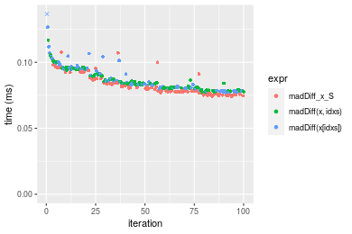
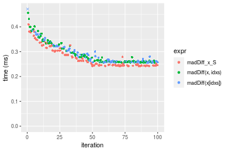
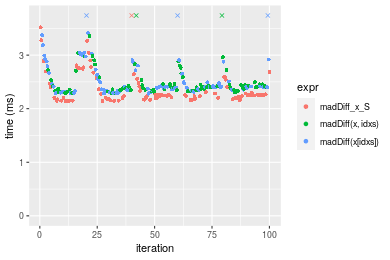
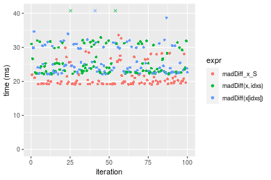
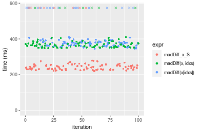
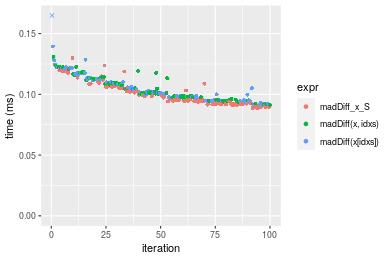
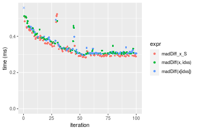
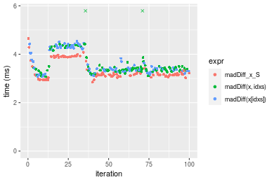
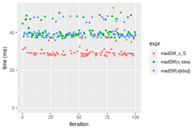
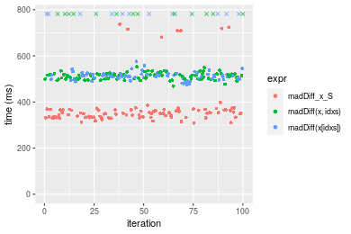

[matrixStats]: Benchmark report

---------------------------------------


# madDiff() benchmarks on subsetted computation

This report benchmark the performance of madDiff() on subsetted computation.


## Data type "integer"
### Data
```r
> rvector <- function(n, mode = c("logical", "double", "integer"), range = c(-100, +100), na_prob = 0) {
+     mode <- match.arg(mode)
+     if (mode == "logical") {
+         x <- sample(c(FALSE, TRUE), size = n, replace = TRUE)
+     }     else {
+         x <- runif(n, min = range[1], max = range[2])
+     }
+     storage.mode(x) <- mode
+     if (na_prob > 0) 
+         x[sample(n, size = na_prob * n)] <- NA
+     x
+ }
> rvectors <- function(scale = 10, seed = 1, ...) {
+     set.seed(seed)
+     data <- list()
+     data[[1]] <- rvector(n = scale * 100, ...)
+     data[[2]] <- rvector(n = scale * 1000, ...)
+     data[[3]] <- rvector(n = scale * 10000, ...)
+     data[[4]] <- rvector(n = scale * 1e+05, ...)
+     data[[5]] <- rvector(n = scale * 1e+06, ...)
+     names(data) <- sprintf("n = %d", sapply(data, FUN = length))
+     data
+ }
> data <- rvectors(mode = mode)
```

### Results

### n = 1000 vector


```r
> x <- data[["n = 1000"]]
> idxs <- sample.int(length(x), size = length(x) * 0.7)
> x_S <- x[idxs]
> gc()
           used  (Mb) gc trigger  (Mb) max used  (Mb)
Ncells  5342018 285.3    8529671 455.6  8529671 455.6
Vcells 16991412 129.7   34090130 260.1 60562128 462.1
> stats <- microbenchmark(madDiff_x_S = madDiff(x_S), `madDiff(x, idxs)` = madDiff(x, idxs = idxs), 
+     `madDiff(x[idxs])` = madDiff(x[idxs]), unit = "ms")
```

_Table: Benchmarking of madDiff_x_S(), madDiff(x, idxs)() and madDiff(x[idxs])() on integer+n = 1000 data. The top panel shows times in milliseconds and the bottom panel shows relative times._


|   |expr             |      min|        lq|      mean|    median|        uq|      max|
|:--|:----------------|--------:|---------:|---------:|---------:|---------:|--------:|
|1  |madDiff_x_S      | 0.074106| 0.0763210| 0.0817296| 0.0783660| 0.0841565| 0.107667|
|3  |madDiff(x[idxs]) | 0.077065| 0.0800100| 0.0909396| 0.0836455| 0.0953205| 0.430596|
|2  |madDiff(x, idxs) | 0.076762| 0.0804655| 0.0864272| 0.0840825| 0.0909930| 0.116771|


|   |expr             |      min|       lq|     mean|   median|       uq|      max|
|:--|:----------------|--------:|--------:|--------:|--------:|--------:|--------:|
|1  |madDiff_x_S      | 1.000000| 1.000000| 1.000000| 1.000000| 1.000000| 1.000000|
|3  |madDiff(x[idxs]) | 1.039929| 1.048335| 1.112688| 1.067370| 1.132658| 3.999331|
|2  |madDiff(x, idxs) | 1.035841| 1.054304| 1.057477| 1.072946| 1.081236| 1.084557|

_Figure: Benchmarking of madDiff_x_S(), madDiff(x, idxs)() and madDiff(x[idxs])() on integer+n = 1000 data.  Outliers are displayed as crosses.  Times are in milliseconds._



### n = 10000 vector


```r
> x <- data[["n = 10000"]]
> idxs <- sample.int(length(x), size = length(x) * 0.7)
> x_S <- x[idxs]
> gc()
           used  (Mb) gc trigger  (Mb) max used  (Mb)
Ncells  5329797 284.7    8529671 455.6  8529671 455.6
Vcells 15829452 120.8   34090130 260.1 60562128 462.1
> stats <- microbenchmark(madDiff_x_S = madDiff(x_S), `madDiff(x, idxs)` = madDiff(x, idxs = idxs), 
+     `madDiff(x[idxs])` = madDiff(x[idxs]), unit = "ms")
```

_Table: Benchmarking of madDiff_x_S(), madDiff(x, idxs)() and madDiff(x[idxs])() on integer+n = 10000 data. The top panel shows times in milliseconds and the bottom panel shows relative times._


|   |expr             |      min|       lq|      mean|   median|        uq|      max|
|:--|:----------------|--------:|--------:|---------:|--------:|---------:|--------:|
|1  |madDiff_x_S      | 0.241514| 0.244577| 0.2782568| 0.255501| 0.3043530| 0.409451|
|3  |madDiff(x[idxs]) | 0.255587| 0.258550| 0.2899554| 0.268064| 0.3140205| 0.526827|
|2  |madDiff(x, idxs) | 0.256066| 0.258769| 0.2953597| 0.276357| 0.3311450| 0.456839|


|   |expr             |      min|       lq|     mean|   median|       uq|      max|
|:--|:----------------|--------:|--------:|--------:|--------:|--------:|--------:|
|1  |madDiff_x_S      | 1.000000| 1.000000| 1.000000| 1.000000| 1.000000| 1.000000|
|3  |madDiff(x[idxs]) | 1.058270| 1.057131| 1.042042| 1.049170| 1.031764| 1.286667|
|2  |madDiff(x, idxs) | 1.060253| 1.058027| 1.061464| 1.081628| 1.088029| 1.115735|

_Figure: Benchmarking of madDiff_x_S(), madDiff(x, idxs)() and madDiff(x[idxs])() on integer+n = 10000 data.  Outliers are displayed as crosses.  Times are in milliseconds._



### n = 100000 vector


```r
> x <- data[["n = 100000"]]
> idxs <- sample.int(length(x), size = length(x) * 0.7)
> x_S <- x[idxs]
> gc()
           used  (Mb) gc trigger  (Mb) max used  (Mb)
Ncells  5329869 284.7    8529671 455.6  8529671 455.6
Vcells 15893012 121.3   34090130 260.1 60562128 462.1
> stats <- microbenchmark(madDiff_x_S = madDiff(x_S), `madDiff(x, idxs)` = madDiff(x, idxs = idxs), 
+     `madDiff(x[idxs])` = madDiff(x[idxs]), unit = "ms")
```

_Table: Benchmarking of madDiff_x_S(), madDiff(x, idxs)() and madDiff(x[idxs])() on integer+n = 100000 data. The top panel shows times in milliseconds and the bottom panel shows relative times._


|   |expr             |      min|       lq|     mean|   median|       uq|       max|
|:--|:----------------|--------:|--------:|--------:|--------:|--------:|---------:|
|1  |madDiff_x_S      | 2.137499| 2.192357| 2.424793| 2.251765| 2.441035|  8.505536|
|2  |madDiff(x, idxs) | 2.287631| 2.346812| 2.540693| 2.401973| 2.454836|  8.973306|
|3  |madDiff(x[idxs]) | 2.282479| 2.337624| 2.778587| 2.405591| 2.657550| 16.775502|


|   |expr             |      min|       lq|     mean|   median|       uq|      max|
|:--|:----------------|--------:|--------:|--------:|--------:|--------:|--------:|
|1  |madDiff_x_S      | 1.000000| 1.000000| 1.000000| 1.000000| 1.000000| 1.000000|
|2  |madDiff(x, idxs) | 1.070237| 1.070452| 1.047798| 1.066707| 1.005654| 1.054996|
|3  |madDiff(x[idxs]) | 1.067827| 1.066261| 1.145907| 1.068313| 1.088698| 1.972304|

_Figure: Benchmarking of madDiff_x_S(), madDiff(x, idxs)() and madDiff(x[idxs])() on integer+n = 100000 data.  Outliers are displayed as crosses.  Times are in milliseconds._



### n = 1000000 vector


```r
> x <- data[["n = 1000000"]]
> idxs <- sample.int(length(x), size = length(x) * 0.7)
> x_S <- x[idxs]
> gc()
           used  (Mb) gc trigger  (Mb) max used  (Mb)
Ncells  5329941 284.7    8529671 455.6  8529671 455.6
Vcells 16523061 126.1   34090130 260.1 60562128 462.1
> stats <- microbenchmark(madDiff_x_S = madDiff(x_S), `madDiff(x, idxs)` = madDiff(x, idxs = idxs), 
+     `madDiff(x[idxs])` = madDiff(x[idxs]), unit = "ms")
```

_Table: Benchmarking of madDiff_x_S(), madDiff(x, idxs)() and madDiff(x[idxs])() on integer+n = 1000000 data. The top panel shows times in milliseconds and the bottom panel shows relative times._


|   |expr             |      min|       lq|     mean|   median|       uq|       max|
|:--|:----------------|--------:|--------:|--------:|--------:|--------:|---------:|
|1  |madDiff_x_S      | 19.07366| 19.31225| 21.73484| 19.95797| 21.95595|  33.60129|
|2  |madDiff(x, idxs) | 22.10209| 22.70318| 26.13706| 24.01666| 30.41792|  45.68622|
|3  |madDiff(x[idxs]) | 22.10672| 22.82510| 29.51516| 24.08327| 30.00760| 388.78462|


|   |expr             |      min|       lq|     mean|   median|       uq|       max|
|:--|:----------------|--------:|--------:|--------:|--------:|--------:|---------:|
|1  |madDiff_x_S      | 1.000000| 1.000000| 1.000000| 1.000000| 1.000000|  1.000000|
|2  |madDiff(x, idxs) | 1.158776| 1.175585| 1.202542| 1.203362| 1.385406|  1.359657|
|3  |madDiff(x[idxs]) | 1.159018| 1.181898| 1.357965| 1.206699| 1.366718| 11.570528|

_Figure: Benchmarking of madDiff_x_S(), madDiff(x, idxs)() and madDiff(x[idxs])() on integer+n = 1000000 data.  Outliers are displayed as crosses.  Times are in milliseconds._



### n = 10000000 vector


```r
> x <- data[["n = 10000000"]]
> idxs <- sample.int(length(x), size = length(x) * 0.7)
> x_S <- x[idxs]
> gc()
           used  (Mb) gc trigger  (Mb) max used  (Mb)
Ncells  5330013 284.7    8529671 455.6  8529671 455.6
Vcells 22823109 174.2   40988156 312.8 60562128 462.1
> stats <- microbenchmark(madDiff_x_S = madDiff(x_S), `madDiff(x, idxs)` = madDiff(x, idxs = idxs), 
+     `madDiff(x[idxs])` = madDiff(x[idxs]), unit = "ms")
```

_Table: Benchmarking of madDiff_x_S(), madDiff(x, idxs)() and madDiff(x[idxs])() on integer+n = 10000000 data. The top panel shows times in milliseconds and the bottom panel shows relative times._


|   |expr             |      min|       lq|     mean|   median|       uq|      max|
|:--|:----------------|--------:|--------:|--------:|--------:|--------:|--------:|
|1  |madDiff_x_S      | 219.2115| 230.8682| 271.2571| 243.5861| 255.2630| 633.8320|
|2  |madDiff(x, idxs) | 349.0237| 356.1255| 398.2568| 368.0111| 379.9252| 763.0911|
|3  |madDiff(x[idxs]) | 344.5653| 363.9755| 439.2488| 379.6998| 397.2683| 806.7670|


|   |expr             |      min|       lq|     mean|   median|       uq|      max|
|:--|:----------------|--------:|--------:|--------:|--------:|--------:|--------:|
|1  |madDiff_x_S      | 1.000000| 1.000000| 1.000000| 1.000000| 1.000000| 1.000000|
|2  |madDiff(x, idxs) | 1.592178| 1.542549| 1.468189| 1.510805| 1.488368| 1.203933|
|3  |madDiff(x[idxs]) | 1.571840| 1.576552| 1.619308| 1.558791| 1.556310| 1.272840|

_Figure: Benchmarking of madDiff_x_S(), madDiff(x, idxs)() and madDiff(x[idxs])() on integer+n = 10000000 data.  Outliers are displayed as crosses.  Times are in milliseconds._




## Data type "double"
### Data
```r
> rvector <- function(n, mode = c("logical", "double", "integer"), range = c(-100, +100), na_prob = 0) {
+     mode <- match.arg(mode)
+     if (mode == "logical") {
+         x <- sample(c(FALSE, TRUE), size = n, replace = TRUE)
+     }     else {
+         x <- runif(n, min = range[1], max = range[2])
+     }
+     storage.mode(x) <- mode
+     if (na_prob > 0) 
+         x[sample(n, size = na_prob * n)] <- NA
+     x
+ }
> rvectors <- function(scale = 10, seed = 1, ...) {
+     set.seed(seed)
+     data <- list()
+     data[[1]] <- rvector(n = scale * 100, ...)
+     data[[2]] <- rvector(n = scale * 1000, ...)
+     data[[3]] <- rvector(n = scale * 10000, ...)
+     data[[4]] <- rvector(n = scale * 1e+05, ...)
+     data[[5]] <- rvector(n = scale * 1e+06, ...)
+     names(data) <- sprintf("n = %d", sapply(data, FUN = length))
+     data
+ }
> data <- rvectors(mode = mode)
```

### Results

### n = 1000 vector


```r
> x <- data[["n = 1000"]]
> idxs <- sample.int(length(x), size = length(x) * 0.7)
> x_S <- x[idxs]
> gc()
           used  (Mb) gc trigger  (Mb) max used  (Mb)
Ncells  5330088 284.7    8529671 455.6  8529671 455.6
Vcells 21380310 163.2   71118732 542.6 68324404 521.3
> stats <- microbenchmark(madDiff_x_S = madDiff(x_S), `madDiff(x, idxs)` = madDiff(x, idxs = idxs), 
+     `madDiff(x[idxs])` = madDiff(x[idxs]), unit = "ms")
```

_Table: Benchmarking of madDiff_x_S(), madDiff(x, idxs)() and madDiff(x[idxs])() on double+n = 1000 data. The top panel shows times in milliseconds and the bottom panel shows relative times._


|   |expr             |      min|       lq|      mean|    median|        uq|      max|
|:--|:----------------|--------:|--------:|---------:|---------:|---------:|--------:|
|1  |madDiff_x_S      | 0.088639| 0.092148| 0.0993094| 0.0950780| 0.1053155| 0.129918|
|3  |madDiff(x[idxs]) | 0.090911| 0.095238| 0.1061634| 0.1013615| 0.1124420| 0.245817|
|2  |madDiff(x, idxs) | 0.091444| 0.095935| 0.1048928| 0.1015975| 0.1131920| 0.130759|


|   |expr             |      min|       lq|     mean|   median|       uq|      max|
|:--|:----------------|--------:|--------:|--------:|--------:|--------:|--------:|
|1  |madDiff_x_S      | 1.000000| 1.000000| 1.000000| 1.000000| 1.000000| 1.000000|
|3  |madDiff(x[idxs]) | 1.025632| 1.033533| 1.069017| 1.066088| 1.067668| 1.892094|
|2  |madDiff(x, idxs) | 1.031645| 1.041097| 1.056223| 1.068570| 1.074790| 1.006473|

_Figure: Benchmarking of madDiff_x_S(), madDiff(x, idxs)() and madDiff(x[idxs])() on double+n = 1000 data.  Outliers are displayed as crosses.  Times are in milliseconds._



### n = 10000 vector


```r
> x <- data[["n = 10000"]]
> idxs <- sample.int(length(x), size = length(x) * 0.7)
> x_S <- x[idxs]
> gc()
           used  (Mb) gc trigger  (Mb) max used  (Mb)
Ncells  5330157 284.7    8529671 455.6  8529671 455.6
Vcells 21389802 163.2   71118732 542.6 68324404 521.3
> stats <- microbenchmark(madDiff_x_S = madDiff(x_S), `madDiff(x, idxs)` = madDiff(x, idxs = idxs), 
+     `madDiff(x[idxs])` = madDiff(x[idxs]), unit = "ms")
```

_Table: Benchmarking of madDiff_x_S(), madDiff(x, idxs)() and madDiff(x[idxs])() on double+n = 10000 data. The top panel shows times in milliseconds and the bottom panel shows relative times._


|   |expr             |      min|        lq|      mean|    median|       uq|      max|
|:--|:----------------|--------:|---------:|---------:|---------:|--------:|--------:|
|1  |madDiff_x_S      | 0.283091| 0.2924375| 0.3362268| 0.3026925| 0.362518| 0.522399|
|3  |madDiff(x[idxs]) | 0.297945| 0.3061445| 0.3409607| 0.3145700| 0.366660| 0.628820|
|2  |madDiff(x, idxs) | 0.297125| 0.3060925| 0.3508024| 0.3204135| 0.388525| 0.511688|


|   |expr             |      min|       lq|     mean|   median|       uq|       max|
|:--|:----------------|--------:|--------:|--------:|--------:|--------:|---------:|
|1  |madDiff_x_S      | 1.000000| 1.000000| 1.000000| 1.000000| 1.000000| 1.0000000|
|3  |madDiff(x[idxs]) | 1.052471| 1.046872| 1.014080| 1.039240| 1.011426| 1.2037159|
|2  |madDiff(x, idxs) | 1.049574| 1.046694| 1.043351| 1.058545| 1.071740| 0.9794965|

_Figure: Benchmarking of madDiff_x_S(), madDiff(x, idxs)() and madDiff(x[idxs])() on double+n = 10000 data.  Outliers are displayed as crosses.  Times are in milliseconds._



### n = 100000 vector


```r
> x <- data[["n = 100000"]]
> idxs <- sample.int(length(x), size = length(x) * 0.7)
> x_S <- x[idxs]
> gc()
           used  (Mb) gc trigger  (Mb) max used  (Mb)
Ncells  5330229 284.7    8529671 455.6  8529671 455.6
Vcells 21484682 164.0   71118732 542.6 68324404 521.3
> stats <- microbenchmark(madDiff_x_S = madDiff(x_S), `madDiff(x, idxs)` = madDiff(x, idxs = idxs), 
+     `madDiff(x[idxs])` = madDiff(x[idxs]), unit = "ms")
```

_Table: Benchmarking of madDiff_x_S(), madDiff(x, idxs)() and madDiff(x[idxs])() on double+n = 100000 data. The top panel shows times in milliseconds and the bottom panel shows relative times._


|   |expr             |      min|       lq|     mean|   median|       uq|       max|
|:--|:----------------|--------:|--------:|--------:|--------:|--------:|---------:|
|1  |madDiff_x_S      | 2.852060| 3.100382| 3.343521| 3.160017| 3.733188|  4.649720|
|2  |madDiff(x, idxs) | 3.073497| 3.309583| 3.651664| 3.369550| 3.501716| 10.416782|
|3  |madDiff(x[idxs]) | 3.078086| 3.308984| 3.658173| 3.406265| 4.239719|  4.533597|


|   |expr             |      min|       lq|     mean|   median|        uq|       max|
|:--|:----------------|--------:|--------:|--------:|--------:|---------:|---------:|
|1  |madDiff_x_S      | 1.000000| 1.000000| 1.000000| 1.000000| 1.0000000| 1.0000000|
|2  |madDiff(x, idxs) | 1.077641| 1.067476| 1.092161| 1.066307| 0.9379962| 2.2403031|
|3  |madDiff(x[idxs]) | 1.079250| 1.067282| 1.094108| 1.077926| 1.1356834| 0.9750258|

_Figure: Benchmarking of madDiff_x_S(), madDiff(x, idxs)() and madDiff(x[idxs])() on double+n = 100000 data.  Outliers are displayed as crosses.  Times are in milliseconds._



### n = 1000000 vector


```r
> x <- data[["n = 1000000"]]
> idxs <- sample.int(length(x), size = length(x) * 0.7)
> x_S <- x[idxs]
> gc()
           used  (Mb) gc trigger  (Mb) max used  (Mb)
Ncells  5330301 284.7    8529671 455.6  8529671 455.6
Vcells 22430126 171.2   71118732 542.6 71092113 542.4
> stats <- microbenchmark(madDiff_x_S = madDiff(x_S), `madDiff(x, idxs)` = madDiff(x, idxs = idxs), 
+     `madDiff(x[idxs])` = madDiff(x[idxs]), unit = "ms")
```

_Table: Benchmarking of madDiff_x_S(), madDiff(x, idxs)() and madDiff(x[idxs])() on double+n = 1000000 data. The top panel shows times in milliseconds and the bottom panel shows relative times._


|   |expr             |      min|       lq|     mean|   median|       uq|      max|
|:--|:----------------|--------:|--------:|--------:|--------:|--------:|--------:|
|1  |madDiff_x_S      | 27.44413| 28.24720| 30.18858| 28.85604| 29.82229| 53.18479|
|3  |madDiff(x[idxs]) | 35.93065| 38.09962| 39.80374| 38.80446| 39.87832| 48.79393|
|2  |madDiff(x, idxs) | 36.86829| 38.58991| 40.78729| 39.40539| 40.67034| 50.55616|


|   |expr             |      min|       lq|     mean|   median|       uq|       max|
|:--|:----------------|--------:|--------:|--------:|--------:|--------:|---------:|
|1  |madDiff_x_S      | 1.000000| 1.000000| 1.000000| 1.000000| 1.000000| 1.0000000|
|3  |madDiff(x[idxs]) | 1.309229| 1.348793| 1.318503| 1.344760| 1.337198| 0.9174415|
|2  |madDiff(x, idxs) | 1.343395| 1.366150| 1.351084| 1.365586| 1.363757| 0.9505755|

_Figure: Benchmarking of madDiff_x_S(), madDiff(x, idxs)() and madDiff(x[idxs])() on double+n = 1000000 data.  Outliers are displayed as crosses.  Times are in milliseconds._



### n = 10000000 vector


```r
> x <- data[["n = 10000000"]]
> idxs <- sample.int(length(x), size = length(x) * 0.7)
> x_S <- x[idxs]
> gc()
           used  (Mb) gc trigger  (Mb) max used  (Mb)
Ncells  5330373 284.7    8529671 455.6  8529671 455.6
Vcells 31880174 243.3   71118732 542.6 71092113 542.4
> stats <- microbenchmark(madDiff_x_S = madDiff(x_S), `madDiff(x, idxs)` = madDiff(x, idxs = idxs), 
+     `madDiff(x[idxs])` = madDiff(x[idxs]), unit = "ms")
```

_Table: Benchmarking of madDiff_x_S(), madDiff(x, idxs)() and madDiff(x[idxs])() on double+n = 10000000 data. The top panel shows times in milliseconds and the bottom panel shows relative times._


|   |expr             |      min|       lq|     mean|   median|       uq|      max|
|:--|:----------------|--------:|--------:|--------:|--------:|--------:|--------:|
|1  |madDiff_x_S      | 308.9380| 333.8033| 374.0135| 350.9787| 365.4677| 738.1890|
|3  |madDiff(x[idxs]) | 475.1683| 503.4658| 552.2412| 515.1401| 524.8876| 891.8701|
|2  |madDiff(x, idxs) | 469.0873| 500.8675| 559.6173| 517.0455| 530.4690| 906.0613|


|   |expr             |      min|       lq|     mean|   median|       uq|      max|
|:--|:----------------|--------:|--------:|--------:|--------:|--------:|--------:|
|1  |madDiff_x_S      | 1.000000| 1.000000| 1.000000| 1.000000| 1.000000| 1.000000|
|3  |madDiff(x[idxs]) | 1.538070| 1.508271| 1.476527| 1.467725| 1.436208| 1.208187|
|2  |madDiff(x, idxs) | 1.518387| 1.500487| 1.496249| 1.473153| 1.451480| 1.227411|

_Figure: Benchmarking of madDiff_x_S(), madDiff(x, idxs)() and madDiff(x[idxs])() on double+n = 10000000 data.  Outliers are displayed as crosses.  Times are in milliseconds._




## Appendix

### Session information
```r
R version 4.1.1 Patched (2021-08-10 r80727)
Platform: x86_64-pc-linux-gnu (64-bit)
Running under: Ubuntu 18.04.5 LTS

Matrix products: default
BLAS:   /home/hb/software/R-devel/R-4-1-branch/lib/R/lib/libRblas.so
LAPACK: /home/hb/software/R-devel/R-4-1-branch/lib/R/lib/libRlapack.so

locale:
 [1] LC_CTYPE=en_US.UTF-8       LC_NUMERIC=C              
 [3] LC_TIME=en_US.UTF-8        LC_COLLATE=en_US.UTF-8    
 [5] LC_MONETARY=en_US.UTF-8    LC_MESSAGES=en_US.UTF-8   
 [7] LC_PAPER=en_US.UTF-8       LC_NAME=C                 
 [9] LC_ADDRESS=C               LC_TELEPHONE=C            
[11] LC_MEASUREMENT=en_US.UTF-8 LC_IDENTIFICATION=C       

attached base packages:
[1] stats     graphics  grDevices utils     datasets  methods   base     

other attached packages:
[1] microbenchmark_1.4-7   matrixStats_0.60.1     ggplot2_3.3.5         
[4] knitr_1.33             R.devices_2.17.0       R.utils_2.10.1        
[7] R.oo_1.24.0            R.methodsS3_1.8.1-9001 history_0.0.1-9000    

loaded via a namespace (and not attached):
 [1] Biobase_2.52.0          httr_1.4.2              splines_4.1.1          
 [4] bit64_4.0.5             network_1.17.1          assertthat_0.2.1       
 [7] highr_0.9               stats4_4.1.1            blob_1.2.2             
[10] GenomeInfoDbData_1.2.6  robustbase_0.93-8       pillar_1.6.2           
[13] RSQLite_2.2.8           lattice_0.20-44         glue_1.4.2             
[16] digest_0.6.27           XVector_0.32.0          colorspace_2.0-2       
[19] Matrix_1.3-4            XML_3.99-0.7            pkgconfig_2.0.3        
[22] zlibbioc_1.38.0         genefilter_1.74.0       purrr_0.3.4            
[25] ergm_4.1.2              xtable_1.8-4            scales_1.1.1           
[28] tibble_3.1.4            annotate_1.70.0         KEGGREST_1.32.0        
[31] farver_2.1.0            generics_0.1.0          IRanges_2.26.0         
[34] ellipsis_0.3.2          cachem_1.0.6            withr_2.4.2            
[37] BiocGenerics_0.38.0     mime_0.11               survival_3.2-13        
[40] magrittr_2.0.1          crayon_1.4.1            statnet.common_4.5.0   
[43] memoise_2.0.0           laeken_0.5.1            fansi_0.5.0            
[46] R.cache_0.15.0          MASS_7.3-54             R.rsp_0.44.0           
[49] progressr_0.8.0         tools_4.1.1             lifecycle_1.0.0        
[52] S4Vectors_0.30.0        trust_0.1-8             munsell_0.5.0          
[55] tabby_0.0.1-9001        AnnotationDbi_1.54.1    Biostrings_2.60.2      
[58] compiler_4.1.1          GenomeInfoDb_1.28.1     rlang_0.4.11           
[61] grid_4.1.1              RCurl_1.98-1.4          cwhmisc_6.6            
[64] rappdirs_0.3.3          startup_0.15.0          labeling_0.4.2         
[67] bitops_1.0-7            base64enc_0.1-3         boot_1.3-28            
[70] gtable_0.3.0            DBI_1.1.1               markdown_1.1           
[73] R6_2.5.1                lpSolveAPI_5.5.2.0-17.7 rle_0.9.2              
[76] dplyr_1.0.7             fastmap_1.1.0           bit_4.0.4              
[79] utf8_1.2.2              parallel_4.1.1          Rcpp_1.0.7             
[82] vctrs_0.3.8             png_0.1-7               DEoptimR_1.0-9         
[85] tidyselect_1.1.1        xfun_0.25               coda_0.19-4            
```
Total processing time was 4.88 mins.


### Reproducibility
To reproduce this report, do:
```r
html <- matrixStats:::benchmark('madDiff_subset')
```

[RSP]: https://cran.r-project.org/package=R.rsp
[matrixStats]: https://cran.r-project.org/package=matrixStats

[StackOverflow:colMins?]: https://stackoverflow.com/questions/13676878 "Stack Overflow: fastest way to get Min from every column in a matrix?"
[StackOverflow:colSds?]: https://stackoverflow.com/questions/17549762 "Stack Overflow: Is there such 'colsd' in R?"
[StackOverflow:rowProds?]: https://stackoverflow.com/questions/20198801/ "Stack Overflow: Row product of matrix and column sum of matrix"

---------------------------------------
Copyright Dongcan Jiang. Last updated on 2021-08-25 19:19:49 (+0200 UTC). Powered by [RSP].

<script>
 var link = document.createElement('link');
 link.rel = 'icon';
 link.href = "data:image/png;base64,iVBORw0KGgoAAAANSUhEUgAAACAAAAAgCAMAAABEpIrGAAAA21BMVEUAAAAAAP8AAP8AAP8AAP8AAP8AAP8AAP8AAP8AAP8AAP8AAP8AAP8AAP8AAP8AAP8AAP8AAP8AAP8AAP8AAP8AAP8AAP8AAP8AAP8AAP8AAP8AAP8AAP8AAP8AAP8AAP8AAP8AAP8AAP8AAP8AAP8AAP8AAP8AAP8AAP8AAP8BAf4CAv0DA/wdHeIeHuEfH+AgIN8hId4lJdomJtknJ9g+PsE/P8BAQL9yco10dIt1dYp3d4h4eIeVlWqWlmmXl2iYmGeZmWabm2Tn5xjo6Bfp6Rb39wj4+Af//wA2M9hbAAAASXRSTlMAAQIJCgsMJSYnKD4/QGRlZmhpamtsbautrrCxuru8y8zN5ebn6Pn6+///////////////////////////////////////////LsUNcQAAAS9JREFUOI29k21XgkAQhVcFytdSMqMETU26UVqGmpaiFbL//xc1cAhhwVNf6n5i5z67M2dmYOyfJZUqlVLhkKucG7cgmUZTybDz6g0iDeq51PUr37Ds2cy2/C9NeES5puDjxuUk1xnToZsg8pfA3avHQ3lLIi7iWRrkv/OYtkScxBIMgDee0ALoyxHQBJ68JLCjOtQIMIANF7QG9G9fNnHvisCHBVMKgSJgiz7nE+AoBKrAPA3MgepvgR9TSCasrCKH0eB1wBGBFdCO+nAGjMVGPcQb5bd6mQRegN6+1axOs9nGfYcCtfi4NQosdtH7dB+txFIpXQqN1p9B/asRHToyS0jRgpV7nk4nwcq1BJ+x3Gl/v7S9Wmpp/aGquum7w3ZDyrADFYrl8vHBH+ev9AUASW1dmU4h4wAAAABJRU5ErkJggg=="
 document.getElementsByTagName('head')[0].appendChild(link);
</script>


