[matrixStats]: Benchmark report

---------------------------------------


# mean2() benchmarks

This report benchmark the performance of mean2() against alternative methods.

## Alternative methods

* mean() + [()
* mean.default() + [() - avoids method dispatching

as below

```r
> mean2_R_v1 <- function(x, na.rm = FALSE, idxs) {
+     mean(x[idxs], na.rm = na.rm)
+ }
```
and
```r
> mean2_R_v2 <- function(x, na.rm = FALSE, idxs) {
+     mean.default(x[idxs], na.rm = na.rm)
+ }
```


## Data type "integer"
### Data
```r
> rvector <- function(n, mode = c("logical", "double", "integer"), range = c(-100, +100), na_prob = 0) {
+     mode <- match.arg(mode)
+     if (mode == "logical") {
+         x <- sample(c(FALSE, TRUE), size = n, replace = TRUE)
+     }     else {
+         x <- runif(n, min = range[1], max = range[2])
+     }
+     storage.mode(x) <- mode
+     if (na_prob > 0) 
+         x[sample(n, size = na_prob * n)] <- NA
+     x
+ }
> rvectors <- function(scale = 10, seed = 1, ...) {
+     set.seed(seed)
+     data <- list()
+     data[[1]] <- rvector(n = scale * 100, ...)
+     data[[2]] <- rvector(n = scale * 1000, ...)
+     data[[3]] <- rvector(n = scale * 10000, ...)
+     data[[4]] <- rvector(n = scale * 1e+05, ...)
+     data[[5]] <- rvector(n = scale * 1e+06, ...)
+     names(data) <- sprintf("n = %d", sapply(data, FUN = length))
+     data
+ }
> data <- rvectors(mode = mode)
```

### Results

### n = 1000 vector


#### All elements
```r
> x <- data[["n = 1000"]]
> gc()
           used  (Mb) gc trigger  (Mb)  max used  (Mb)
Ncells  5335209 285.0    8529671 455.6   8529671 455.6
Vcells 37464398 285.9   58379130 445.4 101881463 777.3
> stats <- microbenchmark(mean2 = mean2(x, refine = TRUE), mean2_no_refine = mean2(x, refine = FALSE), 
+     mean = mean(x), mean.default = mean.default(x), unit = "ms")
```

_Table: Benchmarking of mean2(), mean2_no_refine(), mean() and mean.default() on n = 1000+all data. The top panel shows times in milliseconds and the bottom panel shows relative times._


|   |expr            |      min|        lq|      mean|    median|        uq|      max|
|:--|:---------------|--------:|---------:|---------:|---------:|---------:|--------:|
|4  |mean.default    | 0.002644| 0.0027400| 0.0030311| 0.0027865| 0.0028750| 0.019038|
|1  |mean2           | 0.002992| 0.0030355| 0.0034202| 0.0031365| 0.0032185| 0.023013|
|2  |mean2_no_refine | 0.002983| 0.0030465| 0.0033331| 0.0031375| 0.0032170| 0.011124|
|3  |mean            | 0.004267| 0.0044290| 0.0050100| 0.0045415| 0.0046795| 0.024184|


|   |expr            |      min|       lq|     mean|   median|       uq|       max|
|:--|:---------------|--------:|--------:|--------:|--------:|--------:|---------:|
|4  |mean.default    | 1.000000| 1.000000| 1.000000| 1.000000| 1.000000| 1.0000000|
|1  |mean2           | 1.131619| 1.107847| 1.128375| 1.125606| 1.119478| 1.2087929|
|2  |mean2_no_refine | 1.128215| 1.111861| 1.099637| 1.125965| 1.118956| 0.5843051|
|3  |mean            | 1.613843| 1.616423| 1.652860| 1.629822| 1.627652| 1.2703015|

_Figure: Benchmarking of mean2(), mean2_no_refine(), mean() and mean.default() on n = 1000+all data.  Outliers are displayed as crosses.  Times are in milliseconds._

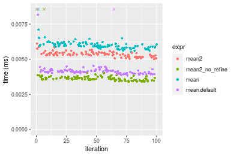


#### A 20% subset
```r
> x <- data[["n = 1000"]]
> subset
[1] 0.2
> idxs <- sort(sample(length(x), size = subset * length(x), replace = FALSE))
> gc()
           used  (Mb) gc trigger  (Mb)  max used  (Mb)
Ncells  5333066 284.9    8529671 455.6   8529671 455.6
Vcells 15828942 120.8   46703304 356.4 101881463 777.3
> stats <- microbenchmark(mean2 = mean2(x, idxs = idxs, refine = TRUE), mean2_no_refine = mean2(x, 
+     idxs = idxs, refine = FALSE), `mean+[()` = mean2_R_v1(x, idxs = idxs), `mean.default+[()` = mean2_R_v2(x, 
+     idxs = idxs), unit = "ms")
```

_Table: Benchmarking of mean2(), mean2_no_refine(), mean+[()() and mean.default+[()() on integer+n = 1000+0.2 data. The top panel shows times in milliseconds and the bottom panel shows relative times._


|   |expr             |      min|        lq|      mean|    median|       uq|      max|
|:--|:----------------|--------:|---------:|---------:|---------:|--------:|--------:|
|2  |mean2_no_refine  | 0.002748| 0.0030090| 0.0034480| 0.0031075| 0.003252| 0.019823|
|1  |mean2            | 0.002736| 0.0030055| 0.0031542| 0.0031385| 0.003242| 0.003930|
|4  |mean.default+[() | 0.003742| 0.0039725| 0.0042215| 0.0040670| 0.004234| 0.015538|
|3  |mean+[()         | 0.005980| 0.0062890| 0.0066827| 0.0064585| 0.006637| 0.024305|


|   |expr             |       min|        lq|      mean|   median|       uq|       max|
|:--|:----------------|---------:|---------:|---------:|--------:|--------:|---------:|
|2  |mean2_no_refine  | 1.0000000| 1.0000000| 1.0000000| 1.000000| 1.000000| 1.0000000|
|1  |mean2            | 0.9956332| 0.9988368| 0.9148018| 1.009976| 0.996925| 0.1982546|
|4  |mean.default+[() | 1.3617176| 1.3202060| 1.2243472| 1.308769| 1.301968| 0.7838370|
|3  |mean+[()         | 2.1761281| 2.0900631| 1.9381489| 2.078359| 2.040898| 1.2261010|

_Figure: Benchmarking of mean2(), mean2_no_refine(), mean+[()() and mean.default+[()() on integer+n = 1000+0.2 data.  Outliers are displayed as crosses.  Times are in milliseconds._

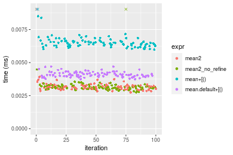

#### A 40% subset
```r
> x <- data[["n = 1000"]]
> subset
[1] 0.4
> idxs <- sort(sample(length(x), size = subset * length(x), replace = FALSE))
> gc()
           used  (Mb) gc trigger  (Mb)  max used  (Mb)
Ncells  5333150 284.9    8529671 455.6   8529671 455.6
Vcells 15829618 120.8   46703304 356.4 101881463 777.3
> stats <- microbenchmark(mean2 = mean2(x, idxs = idxs, refine = TRUE), mean2_no_refine = mean2(x, 
+     idxs = idxs, refine = FALSE), `mean+[()` = mean2_R_v1(x, idxs = idxs), `mean.default+[()` = mean2_R_v2(x, 
+     idxs = idxs), unit = "ms")
```

_Table: Benchmarking of mean2(), mean2_no_refine(), mean+[()() and mean.default+[()() on integer+n = 1000+0.4 data. The top panel shows times in milliseconds and the bottom panel shows relative times._


|   |expr             |      min|        lq|      mean|    median|        uq|      max|
|:--|:----------------|--------:|---------:|---------:|---------:|---------:|--------:|
|2  |mean2_no_refine  | 0.003707| 0.0039070| 0.0041698| 0.0040185| 0.0041995| 0.015867|
|1  |mean2            | 0.003713| 0.0038895| 0.0041802| 0.0040240| 0.0042490| 0.009105|
|4  |mean.default+[() | 0.004356| 0.0046555| 0.0049403| 0.0048135| 0.0049160| 0.018109|
|3  |mean+[()         | 0.006681| 0.0070390| 0.0074300| 0.0071950| 0.0074245| 0.027253|


|   |expr             |      min|        lq|     mean|   median|       uq|       max|
|:--|:----------------|--------:|---------:|--------:|--------:|--------:|---------:|
|2  |mean2_no_refine  | 1.000000| 1.0000000| 1.000000| 1.000000| 1.000000| 1.0000000|
|1  |mean2            | 1.001619| 0.9955209| 1.002499| 1.001369| 1.011787| 0.5738325|
|4  |mean.default+[() | 1.175074| 1.1915792| 1.184804| 1.197835| 1.170616| 1.1412996|
|3  |mean+[()         | 1.802266| 1.8016381| 1.781887| 1.790469| 1.767949| 1.7175900|

_Figure: Benchmarking of mean2(), mean2_no_refine(), mean+[()() and mean.default+[()() on integer+n = 1000+0.4 data.  Outliers are displayed as crosses.  Times are in milliseconds._

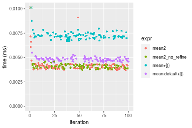

#### A 80% subset
```r
> x <- data[["n = 1000"]]
> subset
[1] 0.8
> idxs <- sort(sample(length(x), size = subset * length(x), replace = FALSE))
> gc()
           used  (Mb) gc trigger  (Mb)  max used  (Mb)
Ncells  5333231 284.9    8529671 455.6   8529671 455.6
Vcells 15829872 120.8   46703304 356.4 101881463 777.3
> stats <- microbenchmark(mean2 = mean2(x, idxs = idxs, refine = TRUE), mean2_no_refine = mean2(x, 
+     idxs = idxs, refine = FALSE), `mean+[()` = mean2_R_v1(x, idxs = idxs), `mean.default+[()` = mean2_R_v2(x, 
+     idxs = idxs), unit = "ms")
```

_Table: Benchmarking of mean2(), mean2_no_refine(), mean+[()() and mean.default+[()() on integer+n = 1000+0.8 data. The top panel shows times in milliseconds and the bottom panel shows relative times._


|   |expr             |      min|        lq|      mean|    median|        uq|      max|
|:--|:----------------|--------:|---------:|---------:|---------:|---------:|--------:|
|2  |mean2_no_refine  | 0.005617| 0.0058795| 0.0060997| 0.0059950| 0.0062935| 0.008362|
|1  |mean2            | 0.005550| 0.0058745| 0.0065841| 0.0060490| 0.0063270| 0.025825|
|4  |mean.default+[() | 0.006109| 0.0063475| 0.0066216| 0.0065025| 0.0067620| 0.011049|
|3  |mean+[()         | 0.008464| 0.0087735| 0.0093324| 0.0090215| 0.0092860| 0.034636|


|   |expr             |       min|        lq|     mean|   median|       uq|      max|
|:--|:----------------|---------:|---------:|--------:|--------:|--------:|--------:|
|2  |mean2_no_refine  | 1.0000000| 1.0000000| 1.000000| 1.000000| 1.000000| 1.000000|
|1  |mean2            | 0.9880719| 0.9991496| 1.079412| 1.009008| 1.005323| 3.088376|
|4  |mean.default+[() | 1.0875912| 1.0795986| 1.085570| 1.084654| 1.074442| 1.321335|
|3  |mean+[()         | 1.5068542| 1.4922187| 1.529975| 1.504837| 1.475491| 4.142071|

_Figure: Benchmarking of mean2(), mean2_no_refine(), mean+[()() and mean.default+[()() on integer+n = 1000+0.8 data.  Outliers are displayed as crosses.  Times are in milliseconds._

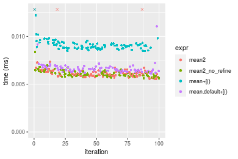


### n = 10000 vector


#### All elements
```r
> x <- data[["n = 10000"]]
> gc()
           used  (Mb) gc trigger  (Mb)  max used  (Mb)
Ncells  5333241 284.9    8529671 455.6   8529671 455.6
Vcells 15829656 120.8   46703304 356.4 101881463 777.3
> stats <- microbenchmark(mean2 = mean2(x, refine = TRUE), mean2_no_refine = mean2(x, refine = FALSE), 
+     mean = mean(x), mean.default = mean.default(x), unit = "ms")
```

_Table: Benchmarking of mean2(), mean2_no_refine(), mean() and mean.default() on n = 10000+all data. The top panel shows times in milliseconds and the bottom panel shows relative times._


|   |expr            |      min|        lq|      mean|    median|        uq|      max|
|:--|:---------------|--------:|---------:|---------:|---------:|---------:|--------:|
|4  |mean.default    | 0.013168| 0.0138065| 0.0142189| 0.0139930| 0.0144305| 0.027982|
|3  |mean            | 0.014819| 0.0155985| 0.0163233| 0.0159980| 0.0163880| 0.034170|
|2  |mean2_no_refine | 0.017081| 0.0177570| 0.0183532| 0.0179305| 0.0185955| 0.032276|
|1  |mean2           | 0.016948| 0.0178315| 0.0184025| 0.0180020| 0.0186490| 0.032773|


|   |expr            |     min|       lq|     mean|   median|       uq|      max|
|:--|:---------------|-------:|--------:|--------:|--------:|--------:|--------:|
|4  |mean.default    | 1.00000| 1.000000| 1.000000| 1.000000| 1.000000| 1.000000|
|3  |mean            | 1.12538| 1.129794| 1.147993| 1.143286| 1.135650| 1.221142|
|2  |mean2_no_refine | 1.29716| 1.286133| 1.290756| 1.281391| 1.288625| 1.153456|
|1  |mean2           | 1.28706| 1.291529| 1.294226| 1.286500| 1.292332| 1.171217|

_Figure: Benchmarking of mean2(), mean2_no_refine(), mean() and mean.default() on n = 10000+all data.  Outliers are displayed as crosses.  Times are in milliseconds._

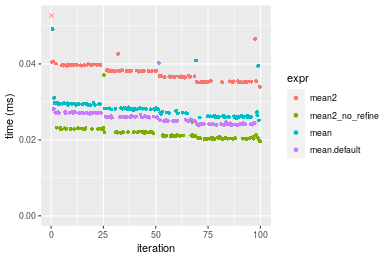


#### A 20% subset
```r
> x <- data[["n = 10000"]]
> subset
[1] 0.2
> idxs <- sort(sample(length(x), size = subset * length(x), replace = FALSE))
> gc()
           used  (Mb) gc trigger  (Mb)  max used  (Mb)
Ncells  5333393 284.9    8529671 455.6   8529671 455.6
Vcells 15831048 120.8   46703304 356.4 101881463 777.3
> stats <- microbenchmark(mean2 = mean2(x, idxs = idxs, refine = TRUE), mean2_no_refine = mean2(x, 
+     idxs = idxs, refine = FALSE), `mean+[()` = mean2_R_v1(x, idxs = idxs), `mean.default+[()` = mean2_R_v2(x, 
+     idxs = idxs), unit = "ms")
```

_Table: Benchmarking of mean2(), mean2_no_refine(), mean+[()() and mean.default+[()() on integer+n = 10000+0.2 data. The top panel shows times in milliseconds and the bottom panel shows relative times._


|   |expr             |      min|        lq|      mean|    median|        uq|      max|
|:--|:----------------|--------:|---------:|---------:|---------:|---------:|--------:|
|4  |mean.default+[() | 0.011244| 0.0118025| 0.0122085| 0.0120220| 0.0123640| 0.018002|
|1  |mean2            | 0.011402| 0.0119860| 0.0124435| 0.0122490| 0.0126350| 0.018282|
|2  |mean2_no_refine  | 0.011353| 0.0120910| 0.0127748| 0.0124010| 0.0128515| 0.034642|
|3  |mean+[()         | 0.013511| 0.0143220| 0.0156329| 0.0146925| 0.0152425| 0.051375|


|   |expr             |      min|       lq|     mean|   median|       uq|      max|
|:--|:----------------|--------:|--------:|--------:|--------:|--------:|--------:|
|4  |mean.default+[() | 1.000000| 1.000000| 1.000000| 1.000000| 1.000000| 1.000000|
|1  |mean2            | 1.014052| 1.015548| 1.019248| 1.018882| 1.021918| 1.015554|
|2  |mean2_no_refine  | 1.009694| 1.024444| 1.046381| 1.031526| 1.039429| 1.924342|
|3  |mean+[()         | 1.201619| 1.213472| 1.280493| 1.222134| 1.232813| 2.853850|

_Figure: Benchmarking of mean2(), mean2_no_refine(), mean+[()() and mean.default+[()() on integer+n = 10000+0.2 data.  Outliers are displayed as crosses.  Times are in milliseconds._

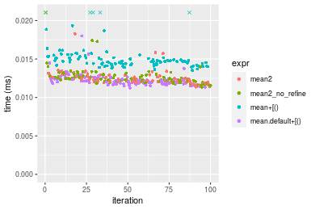

#### A 40% subset
```r
> x <- data[["n = 10000"]]
> subset
[1] 0.4
> idxs <- sort(sample(length(x), size = subset * length(x), replace = FALSE))
> gc()
           used  (Mb) gc trigger  (Mb)  max used  (Mb)
Ncells  5333474 284.9    8529671 455.6   8529671 455.6
Vcells 15832404 120.8   46703304 356.4 101881463 777.3
> stats <- microbenchmark(mean2 = mean2(x, idxs = idxs, refine = TRUE), mean2_no_refine = mean2(x, 
+     idxs = idxs, refine = FALSE), `mean+[()` = mean2_R_v1(x, idxs = idxs), `mean.default+[()` = mean2_R_v2(x, 
+     idxs = idxs), unit = "ms")
```

_Table: Benchmarking of mean2(), mean2_no_refine(), mean+[()() and mean.default+[()() on integer+n = 10000+0.4 data. The top panel shows times in milliseconds and the bottom panel shows relative times._


|   |expr             |      min|        lq|      mean|    median|        uq|      max|
|:--|:----------------|--------:|---------:|---------:|---------:|---------:|--------:|
|4  |mean.default+[() | 0.018318| 0.0195020| 0.0204484| 0.0203160| 0.0208745| 0.033990|
|2  |mean2_no_refine  | 0.020049| 0.0209755| 0.0223444| 0.0218995| 0.0230970| 0.036959|
|1  |mean2            | 0.020087| 0.0209700| 0.0221402| 0.0219190| 0.0225585| 0.039007|
|3  |mean+[()         | 0.021083| 0.0222545| 0.0239472| 0.0230885| 0.0238945| 0.069703|


|   |expr             |      min|       lq|     mean|   median|       uq|      max|
|:--|:----------------|--------:|--------:|--------:|--------:|--------:|--------:|
|4  |mean.default+[() | 1.000000| 1.000000| 1.000000| 1.000000| 1.000000| 1.000000|
|2  |mean2_no_refine  | 1.094497| 1.075556| 1.092718| 1.077943| 1.106470| 1.087349|
|1  |mean2            | 1.096572| 1.075274| 1.082733| 1.078903| 1.080673| 1.147602|
|3  |mean+[()         | 1.150944| 1.141139| 1.171100| 1.136469| 1.144674| 2.050691|

_Figure: Benchmarking of mean2(), mean2_no_refine(), mean+[()() and mean.default+[()() on integer+n = 10000+0.4 data.  Outliers are displayed as crosses.  Times are in milliseconds._

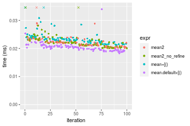

#### A 80% subset
```r
> x <- data[["n = 10000"]]
> subset
[1] 0.8
> idxs <- sort(sample(length(x), size = subset * length(x), replace = FALSE))
> gc()
           used  (Mb) gc trigger  (Mb)  max used  (Mb)
Ncells  5333555 284.9    8529671 455.6   8529671 455.6
Vcells 15834822 120.9   46703304 356.4 101881463 777.3
> stats <- microbenchmark(mean2 = mean2(x, idxs = idxs, refine = TRUE), mean2_no_refine = mean2(x, 
+     idxs = idxs, refine = FALSE), `mean+[()` = mean2_R_v1(x, idxs = idxs), `mean.default+[()` = mean2_R_v2(x, 
+     idxs = idxs), unit = "ms")
```

_Table: Benchmarking of mean2(), mean2_no_refine(), mean+[()() and mean.default+[()() on integer+n = 10000+0.8 data. The top panel shows times in milliseconds and the bottom panel shows relative times._


|   |expr             |      min|        lq|      mean|    median|        uq|      max|
|:--|:----------------|--------:|---------:|---------:|---------:|---------:|--------:|
|4  |mean.default+[() | 0.033108| 0.0351345| 0.0377840| 0.0366405| 0.0384795| 0.052429|
|3  |mean+[()         | 0.035239| 0.0379350| 0.0417208| 0.0397670| 0.0424440| 0.074999|
|2  |mean2_no_refine  | 0.037113| 0.0386835| 0.0425239| 0.0403430| 0.0432415| 0.075843|
|1  |mean2            | 0.036976| 0.0397130| 0.0451191| 0.0410610| 0.0432870| 0.304684|


|   |expr             |      min|       lq|     mean|   median|       uq|      max|
|:--|:----------------|--------:|--------:|--------:|--------:|--------:|--------:|
|4  |mean.default+[() | 1.000000| 1.000000| 1.000000| 1.000000| 1.000000| 1.000000|
|3  |mean+[()         | 1.064365| 1.079708| 1.104193| 1.085329| 1.103029| 1.430487|
|2  |mean2_no_refine  | 1.120968| 1.101012| 1.125449| 1.101049| 1.123754| 1.446585|
|1  |mean2            | 1.116830| 1.130313| 1.194134| 1.120645| 1.124937| 5.811364|

_Figure: Benchmarking of mean2(), mean2_no_refine(), mean+[()() and mean.default+[()() on integer+n = 10000+0.8 data.  Outliers are displayed as crosses.  Times are in milliseconds._

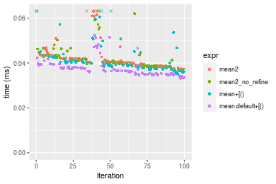


### n = 100000 vector


#### All elements
```r
> x <- data[["n = 100000"]]
> gc()
           used  (Mb) gc trigger  (Mb)  max used  (Mb)
Ncells  5333565 284.9    8529671 455.6   8529671 455.6
Vcells 15834826 120.9   46703304 356.4 101881463 777.3
> stats <- microbenchmark(mean2 = mean2(x, refine = TRUE), mean2_no_refine = mean2(x, refine = FALSE), 
+     mean = mean(x), mean.default = mean.default(x), unit = "ms")
```

_Table: Benchmarking of mean2(), mean2_no_refine(), mean() and mean.default() on n = 100000+all data. The top panel shows times in milliseconds and the bottom panel shows relative times._


|   |expr            |      min|        lq|      mean|    median|        uq|      max|
|:--|:---------------|--------:|---------:|---------:|---------:|---------:|--------:|
|4  |mean.default    | 0.086089| 0.0939410| 0.1017803| 0.1000040| 0.1069845| 0.133384|
|3  |mean            | 0.087773| 0.0958705| 0.1042470| 0.1020055| 0.1118700| 0.153118|
|2  |mean2_no_refine | 0.113125| 0.1235325| 0.1354121| 0.1313805| 0.1454950| 0.190802|
|1  |mean2           | 0.113166| 0.1238950| 0.1370114| 0.1315580| 0.1479895| 0.191542|


|   |expr            |      min|       lq|     mean|   median|       uq|      max|
|:--|:---------------|--------:|--------:|--------:|--------:|--------:|--------:|
|4  |mean.default    | 1.000000| 1.000000| 1.000000| 1.000000| 1.000000| 1.000000|
|3  |mean            | 1.019561| 1.020539| 1.024235| 1.020014| 1.045665| 1.147949|
|2  |mean2_no_refine | 1.314047| 1.315001| 1.330435| 1.313752| 1.359963| 1.430471|
|1  |mean2           | 1.314523| 1.318860| 1.346148| 1.315527| 1.383280| 1.436019|

_Figure: Benchmarking of mean2(), mean2_no_refine(), mean() and mean.default() on n = 100000+all data.  Outliers are displayed as crosses.  Times are in milliseconds._

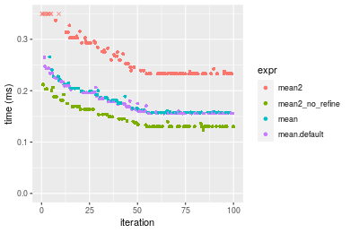


#### A 20% subset
```r
> x <- data[["n = 100000"]]
> subset
[1] 0.2
> idxs <- sort(sample(length(x), size = subset * length(x), replace = FALSE))
> gc()
           used  (Mb) gc trigger  (Mb)  max used  (Mb)
Ncells  5333717 284.9    8529671 455.6   8529671 455.6
Vcells 15841365 120.9   46703304 356.4 101881463 777.3
> stats <- microbenchmark(mean2 = mean2(x, idxs = idxs, refine = TRUE), mean2_no_refine = mean2(x, 
+     idxs = idxs, refine = FALSE), `mean+[()` = mean2_R_v1(x, idxs = idxs), `mean.default+[()` = mean2_R_v2(x, 
+     idxs = idxs), unit = "ms")
```

_Table: Benchmarking of mean2(), mean2_no_refine(), mean+[()() and mean.default+[()() on integer+n = 100000+0.2 data. The top panel shows times in milliseconds and the bottom panel shows relative times._


|   |expr             |      min|       lq|      mean|    median|        uq|      max|
|:--|:----------------|--------:|--------:|---------:|---------:|---------:|--------:|
|4  |mean.default+[() | 0.067272| 0.070955| 0.0779639| 0.0743770| 0.0830760| 0.119719|
|3  |mean+[()         | 0.069493| 0.073628| 0.0799708| 0.0773515| 0.0854515| 0.114088|
|2  |mean2_no_refine  | 0.076796| 0.081816| 0.0883674| 0.0847455| 0.0942295| 0.114397|
|1  |mean2            | 0.077077| 0.081859| 0.0892513| 0.0867050| 0.0936555| 0.142096|


|   |expr             |      min|       lq|     mean|   median|       uq|       max|
|:--|:----------------|--------:|--------:|--------:|--------:|--------:|---------:|
|4  |mean.default+[() | 1.000000| 1.000000| 1.000000| 1.000000| 1.000000| 1.0000000|
|3  |mean+[()         | 1.033015| 1.037672| 1.025741| 1.039992| 1.028594| 0.9529649|
|2  |mean2_no_refine  | 1.141574| 1.153069| 1.133439| 1.139405| 1.134257| 0.9555459|
|1  |mean2            | 1.145752| 1.153675| 1.144776| 1.165750| 1.127347| 1.1869127|

_Figure: Benchmarking of mean2(), mean2_no_refine(), mean+[()() and mean.default+[()() on integer+n = 100000+0.2 data.  Outliers are displayed as crosses.  Times are in milliseconds._

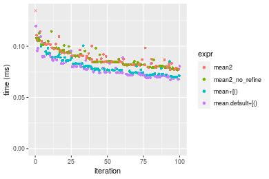

#### A 40% subset
```r
> x <- data[["n = 100000"]]
> subset
[1] 0.4
> idxs <- sort(sample(length(x), size = subset * length(x), replace = FALSE))
> gc()
           used  (Mb) gc trigger  (Mb)  max used  (Mb)
Ncells  5333798 284.9    8529671 455.6   8529671 455.6
Vcells 15851943 121.0   46703304 356.4 101881463 777.3
> stats <- microbenchmark(mean2 = mean2(x, idxs = idxs, refine = TRUE), mean2_no_refine = mean2(x, 
+     idxs = idxs, refine = FALSE), `mean+[()` = mean2_R_v1(x, idxs = idxs), `mean.default+[()` = mean2_R_v2(x, 
+     idxs = idxs), unit = "ms")
```

_Table: Benchmarking of mean2(), mean2_no_refine(), mean+[()() and mean.default+[()() on integer+n = 100000+0.4 data. The top panel shows times in milliseconds and the bottom panel shows relative times._


|   |expr             |      min|        lq|      mean|   median|        uq|      max|
|:--|:----------------|--------:|---------:|---------:|--------:|---------:|--------:|
|4  |mean.default+[() | 0.110645| 0.1216670| 0.1385319| 0.135250| 0.1464605| 0.217912|
|3  |mean+[()         | 0.112323| 0.1188815| 0.1365603| 0.136013| 0.1467645| 0.200972|
|2  |mean2_no_refine  | 0.127548| 0.1362975| 0.1540432| 0.150394| 0.1659490| 0.211932|
|1  |mean2            | 0.127682| 0.1372890| 0.1554826| 0.154730| 0.1654435| 0.222608|


|   |expr             |      min|        lq|      mean|   median|       uq|       max|
|:--|:----------------|--------:|---------:|---------:|--------:|--------:|---------:|
|4  |mean.default+[() | 1.000000| 1.0000000| 1.0000000| 1.000000| 1.000000| 1.0000000|
|3  |mean+[()         | 1.015166| 0.9771055| 0.9857681| 1.005641| 1.002076| 0.9222622|
|2  |mean2_no_refine  | 1.152768| 1.1202504| 1.1119690| 1.111970| 1.133063| 0.9725577|
|1  |mean2            | 1.153979| 1.1283996| 1.1223596| 1.144030| 1.129612| 1.0215500|

_Figure: Benchmarking of mean2(), mean2_no_refine(), mean+[()() and mean.default+[()() on integer+n = 100000+0.4 data.  Outliers are displayed as crosses.  Times are in milliseconds._

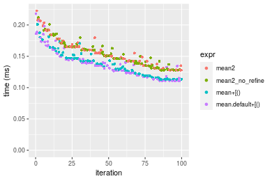

#### A 80% subset
```r
> x <- data[["n = 100000"]]
> subset
[1] 0.8
> idxs <- sort(sample(length(x), size = subset * length(x), replace = FALSE))
> gc()
           used  (Mb) gc trigger  (Mb)  max used  (Mb)
Ncells  5333879 284.9    8529671 455.6   8529671 455.6
Vcells 15871997 121.1   46703304 356.4 101881463 777.3
> stats <- microbenchmark(mean2 = mean2(x, idxs = idxs, refine = TRUE), mean2_no_refine = mean2(x, 
+     idxs = idxs, refine = FALSE), `mean+[()` = mean2_R_v1(x, idxs = idxs), `mean.default+[()` = mean2_R_v2(x, 
+     idxs = idxs), unit = "ms")
```

_Table: Benchmarking of mean2(), mean2_no_refine(), mean+[()() and mean.default+[()() on integer+n = 100000+0.8 data. The top panel shows times in milliseconds and the bottom panel shows relative times._


|   |expr             |      min|        lq|      mean|    median|        uq|      max|
|:--|:----------------|--------:|---------:|---------:|---------:|---------:|--------:|
|3  |mean+[()         | 0.220048| 0.2270255| 0.2741137| 0.2705260| 0.3147935| 0.407134|
|4  |mean.default+[() | 0.218661| 0.2199195| 0.2706278| 0.2729675| 0.3123145| 0.345561|
|2  |mean2_no_refine  | 0.254661| 0.2622925| 0.3371748| 0.3114755| 0.4364735| 0.454337|
|1  |mean2            | 0.255069| 0.2713740| 0.3351383| 0.3210450| 0.4143855| 0.457223|


|   |expr             |       min|        lq|      mean|   median|       uq|       max|
|:--|:----------------|---------:|---------:|---------:|--------:|--------:|---------:|
|3  |mean+[()         | 1.0000000| 1.0000000| 1.0000000| 1.000000| 1.000000| 1.0000000|
|4  |mean.default+[() | 0.9936968| 0.9686996| 0.9872832| 1.009025| 0.992125| 0.8487648|
|2  |mean2_no_refine  | 1.1572975| 1.1553438| 1.2300548| 1.151370| 1.386539| 1.1159397|
|1  |mean2            | 1.1591516| 1.1953459| 1.2226252| 1.186744| 1.316372| 1.1230283|

_Figure: Benchmarking of mean2(), mean2_no_refine(), mean+[()() and mean.default+[()() on integer+n = 100000+0.8 data.  Outliers are displayed as crosses.  Times are in milliseconds._

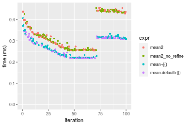


### n = 1000000 vector


#### All elements
```r
> x <- data[["n = 1000000"]]
> gc()
           used  (Mb) gc trigger  (Mb)  max used  (Mb)
Ncells  5333889 284.9    8529671 455.6   8529671 455.6
Vcells 15872197 121.1   46703304 356.4 101881463 777.3
> stats <- microbenchmark(mean2 = mean2(x, refine = TRUE), mean2_no_refine = mean2(x, refine = FALSE), 
+     mean = mean(x), mean.default = mean.default(x), unit = "ms")
```

_Table: Benchmarking of mean2(), mean2_no_refine(), mean() and mean.default() on n = 1000000+all data. The top panel shows times in milliseconds and the bottom panel shows relative times._


|   |expr            |      min|        lq|      mean|    median|       uq|      max|
|:--|:---------------|--------:|---------:|---------:|---------:|--------:|--------:|
|4  |mean.default    | 0.781505| 0.8023825| 0.8331030| 0.8240795| 0.832862| 1.192908|
|3  |mean            | 0.784452| 0.8052410| 0.8382436| 0.8268195| 0.832684| 1.341355|
|1  |mean2           | 1.030187| 1.0576885| 1.0999319| 1.0822270| 1.102979| 1.815785|
|2  |mean2_no_refine | 1.030142| 1.0335435| 1.1019452| 1.0862900| 1.102585| 1.785978|


|   |expr            |      min|       lq|     mean|   median|        uq|      max|
|:--|:---------------|--------:|--------:|--------:|--------:|---------:|--------:|
|4  |mean.default    | 1.000000| 1.000000| 1.000000| 1.000000| 1.0000000| 1.000000|
|3  |mean            | 1.003771| 1.003562| 1.006170| 1.003325| 0.9997863| 1.124441|
|1  |mean2           | 1.318209| 1.318185| 1.320283| 1.313256| 1.3243232| 1.522150|
|2  |mean2_no_refine | 1.318151| 1.288093| 1.322700| 1.318186| 1.3238514| 1.497163|

_Figure: Benchmarking of mean2(), mean2_no_refine(), mean() and mean.default() on n = 1000000+all data.  Outliers are displayed as crosses.  Times are in milliseconds._

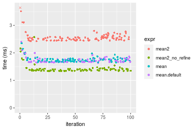


#### A 20% subset
```r
> x <- data[["n = 1000000"]]
> subset
[1] 0.2
> idxs <- sort(sample(length(x), size = subset * length(x), replace = FALSE))
> gc()
           used  (Mb) gc trigger  (Mb)  max used  (Mb)
Ncells  5334041 284.9    8529671 455.6   8529671 455.6
Vcells 15932735 121.6   46703304 356.4 101881463 777.3
> stats <- microbenchmark(mean2 = mean2(x, idxs = idxs, refine = TRUE), mean2_no_refine = mean2(x, 
+     idxs = idxs, refine = FALSE), `mean+[()` = mean2_R_v1(x, idxs = idxs), `mean.default+[()` = mean2_R_v2(x, 
+     idxs = idxs), unit = "ms")
```

_Table: Benchmarking of mean2(), mean2_no_refine(), mean+[()() and mean.default+[()() on integer+n = 1000000+0.2 data. The top panel shows times in milliseconds and the bottom panel shows relative times._


|   |expr             |      min|        lq|      mean|    median|        uq|       max|
|:--|:----------------|--------:|---------:|---------:|---------:|---------:|---------:|
|3  |mean+[()         | 0.567962| 0.6327910| 0.8461862| 0.7494230| 0.8619645| 11.109744|
|4  |mean.default+[() | 0.564959| 0.5874640| 0.7434595| 0.7777125| 0.8554040|  1.123919|
|2  |mean2_no_refine  | 0.675981| 0.7142115| 0.9288030| 0.8646745| 1.1634940|  1.410423|
|1  |mean2            | 0.680770| 0.7195735| 0.9591212| 0.8990550| 1.2039735|  1.287770|


|   |expr             |       min|        lq|      mean|   median|        uq|       max|
|:--|:----------------|---------:|---------:|---------:|--------:|---------:|---------:|
|3  |mean+[()         | 1.0000000| 1.0000000| 1.0000000| 1.000000| 1.0000000| 1.0000000|
|4  |mean.default+[() | 0.9947127| 0.9283697| 0.8786003| 1.037748| 0.9923889| 0.1011652|
|2  |mean2_no_refine  | 1.1901870| 1.1286689| 1.0976343| 1.153787| 1.3498166| 0.1269537|
|1  |mean2            | 1.1986189| 1.1371424| 1.1334634| 1.199663| 1.3967785| 0.1159136|

_Figure: Benchmarking of mean2(), mean2_no_refine(), mean+[()() and mean.default+[()() on integer+n = 1000000+0.2 data.  Outliers are displayed as crosses.  Times are in milliseconds._

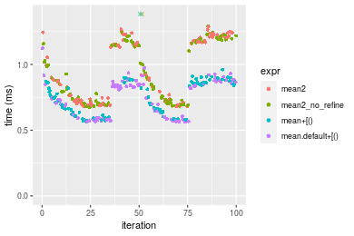

#### A 40% subset
```r
> x <- data[["n = 1000000"]]
> subset
[1] 0.4
> idxs <- sort(sample(length(x), size = subset * length(x), replace = FALSE))
> gc()
           used  (Mb) gc trigger  (Mb)  max used  (Mb)
Ncells  5334116 284.9    8529671 455.6   8529671 455.6
Vcells 16032781 122.4   46703304 356.4 101881463 777.3
> stats <- microbenchmark(mean2 = mean2(x, idxs = idxs, refine = TRUE), mean2_no_refine = mean2(x, 
+     idxs = idxs, refine = FALSE), `mean+[()` = mean2_R_v1(x, idxs = idxs), `mean.default+[()` = mean2_R_v2(x, 
+     idxs = idxs), unit = "ms")
```

_Table: Benchmarking of mean2(), mean2_no_refine(), mean+[()() and mean.default+[()() on integer+n = 1000000+0.4 data. The top panel shows times in milliseconds and the bottom panel shows relative times._


|   |expr             |      min|       lq|     mean|   median|       uq|       max|
|:--|:----------------|--------:|--------:|--------:|--------:|--------:|---------:|
|4  |mean.default+[() | 1.167260| 1.542802| 1.709931| 1.647669| 1.684692| 13.413051|
|3  |mean+[()         | 1.176652| 1.513987| 1.587801| 1.650256| 1.687054|  1.769663|
|2  |mean2_no_refine  | 1.350894| 1.635193| 2.256859| 2.267421| 2.313971| 13.259026|
|1  |mean2            | 1.377870| 1.921315| 2.103943| 2.277221| 2.301809|  2.805382|


|   |expr             |      min|        lq|      mean|   median|       uq|       max|
|:--|:----------------|--------:|---------:|---------:|--------:|--------:|---------:|
|4  |mean.default+[() | 1.000000| 1.0000000| 1.0000000| 1.000000| 1.000000| 1.0000000|
|3  |mean+[()         | 1.008046| 0.9813229| 0.9285761| 1.001570| 1.001402| 0.1319359|
|2  |mean2_no_refine  | 1.157321| 1.0598855| 1.3198542| 1.376138| 1.373527| 0.9885168|
|1  |mean2            | 1.180431| 1.2453409| 1.2304257| 1.382086| 1.366308| 0.2091532|

_Figure: Benchmarking of mean2(), mean2_no_refine(), mean+[()() and mean.default+[()() on integer+n = 1000000+0.4 data.  Outliers are displayed as crosses.  Times are in milliseconds._

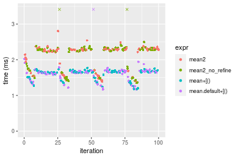

#### A 80% subset
```r
> x <- data[["n = 1000000"]]
> subset
[1] 0.8
> idxs <- sort(sample(length(x), size = subset * length(x), replace = FALSE))
> gc()
           used  (Mb) gc trigger  (Mb)  max used  (Mb)
Ncells  5334203 284.9    8529671 455.6   8529671 455.6
Vcells 16233598 123.9   46703304 356.4 101881463 777.3
> stats <- microbenchmark(mean2 = mean2(x, idxs = idxs, refine = TRUE), mean2_no_refine = mean2(x, 
+     idxs = idxs, refine = FALSE), `mean+[()` = mean2_R_v1(x, idxs = idxs), `mean.default+[()` = mean2_R_v2(x, 
+     idxs = idxs), unit = "ms")
```

_Table: Benchmarking of mean2(), mean2_no_refine(), mean+[()() and mean.default+[()() on integer+n = 1000000+0.8 data. The top panel shows times in milliseconds and the bottom panel shows relative times._


|   |expr             |      min|       lq|     mean|   median|       uq|      max|
|:--|:----------------|--------:|--------:|--------:|--------:|--------:|--------:|
|4  |mean.default+[() | 2.318165| 2.394410| 2.556104| 2.452503| 2.491433| 8.348316|
|3  |mean+[()         | 2.326090| 2.412050| 2.566803| 2.457890| 2.527220| 8.420793|
|1  |mean2            | 2.713277| 2.779487| 3.046277| 2.866725| 2.982606| 8.860754|
|2  |mean2_no_refine  | 2.706951| 2.841883| 3.168071| 2.898226| 2.998219| 8.864914|


|   |expr             |      min|       lq|     mean|   median|       uq|      max|
|:--|:----------------|--------:|--------:|--------:|--------:|--------:|--------:|
|4  |mean.default+[() | 1.000000| 1.000000| 1.000000| 1.000000| 1.000000| 1.000000|
|3  |mean+[()         | 1.003419| 1.007367| 1.004185| 1.002196| 1.014364| 1.008682|
|1  |mean2            | 1.170442| 1.160823| 1.191766| 1.168898| 1.197145| 1.061382|
|2  |mean2_no_refine  | 1.167713| 1.186882| 1.239414| 1.181742| 1.203412| 1.061881|

_Figure: Benchmarking of mean2(), mean2_no_refine(), mean+[()() and mean.default+[()() on integer+n = 1000000+0.8 data.  Outliers are displayed as crosses.  Times are in milliseconds._

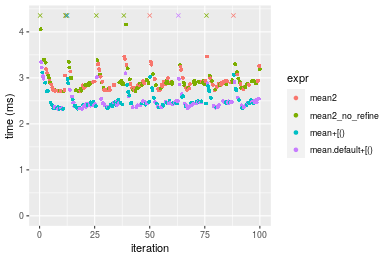


### n = 10000000 vector


#### All elements
```r
> x <- data[["n = 10000000"]]
> gc()
           used  (Mb) gc trigger  (Mb)  max used  (Mb)
Ncells  5334213 284.9    8529671 455.6   8529671 455.6
Vcells 16233166 123.9   46703304 356.4 101881463 777.3
> stats <- microbenchmark(mean2 = mean2(x, refine = TRUE), mean2_no_refine = mean2(x, refine = FALSE), 
+     mean = mean(x), mean.default = mean.default(x), unit = "ms")
```

_Table: Benchmarking of mean2(), mean2_no_refine(), mean() and mean.default() on n = 10000000+all data. The top panel shows times in milliseconds and the bottom panel shows relative times._


|   |expr            |       min|        lq|      mean|    median|        uq|      max|
|:--|:---------------|---------:|---------:|---------:|---------:|---------:|--------:|
|4  |mean.default    |  8.820035|  9.338323|  9.481309|  9.401161|  9.533841| 12.94580|
|3  |mean            |  8.850172|  9.348933|  9.431105|  9.403455|  9.509620| 11.47250|
|1  |mean2           | 11.220452| 11.505320| 11.779207| 11.718151| 11.943236| 14.36670|
|2  |mean2_no_refine | 11.219526| 11.512978| 11.751696| 11.741934| 11.920455| 13.29831|


|   |expr            |      min|       lq|      mean|   median|        uq|       max|
|:--|:---------------|--------:|--------:|---------:|--------:|---------:|---------:|
|4  |mean.default    | 1.000000| 1.000000| 1.0000000| 1.000000| 1.0000000| 1.0000000|
|3  |mean            | 1.003417| 1.001136| 0.9947049| 1.000244| 0.9974594| 0.8861952|
|1  |mean2           | 1.272155| 1.232054| 1.2423608| 1.246458| 1.2527203| 1.1097575|
|2  |mean2_no_refine | 1.272050| 1.232874| 1.2394592| 1.248988| 1.2503308| 1.0272300|

_Figure: Benchmarking of mean2(), mean2_no_refine(), mean() and mean.default() on n = 10000000+all data.  Outliers are displayed as crosses.  Times are in milliseconds._

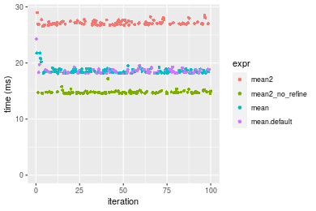


#### A 20% subset
```r
> x <- data[["n = 10000000"]]
> subset
[1] 0.2
> idxs <- sort(sample(length(x), size = subset * length(x), replace = FALSE))
> gc()
           used  (Mb) gc trigger  (Mb)  max used  (Mb)
Ncells  5334365 284.9    8529671 455.6   8529671 455.6
Vcells 16833704 128.5   46703304 356.4 101881463 777.3
> stats <- microbenchmark(mean2 = mean2(x, idxs = idxs, refine = TRUE), mean2_no_refine = mean2(x, 
+     idxs = idxs, refine = FALSE), `mean+[()` = mean2_R_v1(x, idxs = idxs), `mean.default+[()` = mean2_R_v2(x, 
+     idxs = idxs), unit = "ms")
```

_Table: Benchmarking of mean2(), mean2_no_refine(), mean+[()() and mean.default+[()() on integer+n = 10000000+0.2 data. The top panel shows times in milliseconds and the bottom panel shows relative times._


|   |expr             |      min|        lq|     mean|    median|       uq|      max|
|:--|:----------------|--------:|---------:|--------:|---------:|--------:|--------:|
|4  |mean.default+[() | 8.105865|  8.821421| 10.00521|  9.983128| 10.24088| 20.72092|
|3  |mean+[()         | 8.337124|  9.947527| 10.66760| 10.132872| 10.60189| 20.82084|
|1  |mean2            | 9.381135| 12.821609| 13.13456| 13.100914| 13.64462| 22.03093|
|2  |mean2_no_refine  | 9.472205| 12.778382| 13.50176| 13.210631| 14.22950| 22.34785|


|   |expr             |      min|       lq|     mean|   median|       uq|      max|
|:--|:----------------|--------:|--------:|--------:|--------:|--------:|--------:|
|4  |mean.default+[() | 1.000000| 1.000000| 1.000000| 1.000000| 1.000000| 1.000000|
|3  |mean+[()         | 1.028530| 1.127656| 1.066205| 1.015000| 1.035252| 1.004822|
|1  |mean2            | 1.157327| 1.453463| 1.312773| 1.312305| 1.332368| 1.063222|
|2  |mean2_no_refine  | 1.168562| 1.448563| 1.349473| 1.323296| 1.389481| 1.078517|

_Figure: Benchmarking of mean2(), mean2_no_refine(), mean+[()() and mean.default+[()() on integer+n = 10000000+0.2 data.  Outliers are displayed as crosses.  Times are in milliseconds._

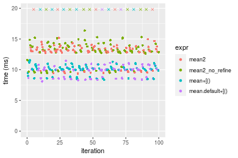

#### A 40% subset
```r
> x <- data[["n = 10000000"]]
> subset
[1] 0.4
> idxs <- sort(sample(length(x), size = subset * length(x), replace = FALSE))
> gc()
           used  (Mb) gc trigger  (Mb)  max used  (Mb)
Ncells  5334440 284.9    8529671 455.6   8529671 455.6
Vcells 17834651 136.1   46703304 356.4 101881463 777.3
> stats <- microbenchmark(mean2 = mean2(x, idxs = idxs, refine = TRUE), mean2_no_refine = mean2(x, 
+     idxs = idxs, refine = FALSE), `mean+[()` = mean2_R_v1(x, idxs = idxs), `mean.default+[()` = mean2_R_v2(x, 
+     idxs = idxs), unit = "ms")
```

_Table: Benchmarking of mean2(), mean2_no_refine(), mean+[()() and mean.default+[()() on integer+n = 10000000+0.4 data. The top panel shows times in milliseconds and the bottom panel shows relative times._


|   |expr             |      min|       lq|     mean|   median|       uq|      max|
|:--|:----------------|--------:|--------:|--------:|--------:|--------:|--------:|
|4  |mean.default+[() | 13.45022| 15.00510| 17.29576| 17.71355| 18.03555| 28.16862|
|3  |mean+[()         | 13.35736| 14.98070| 17.65791| 17.84439| 18.44718| 35.18150|
|1  |mean2            | 17.36632| 23.75696| 24.61952| 24.18407| 25.44178| 28.58307|
|2  |mean2_no_refine  | 16.49944| 23.80050| 24.68057| 24.48683| 26.88420| 28.82598|


|   |expr             |       min|        lq|     mean|   median|       uq|      max|
|:--|:----------------|---------:|---------:|--------:|--------:|--------:|--------:|
|4  |mean.default+[() | 1.0000000| 1.0000000| 1.000000| 1.000000| 1.000000| 1.000000|
|3  |mean+[()         | 0.9930961| 0.9983741| 1.020939| 1.007386| 1.022823| 1.248961|
|1  |mean2            | 1.2911552| 1.5832595| 1.423442| 1.365286| 1.410646| 1.014713|
|2  |mean2_no_refine  | 1.2267037| 1.5861609| 1.426972| 1.382378| 1.490623| 1.023337|

_Figure: Benchmarking of mean2(), mean2_no_refine(), mean+[()() and mean.default+[()() on integer+n = 10000000+0.4 data.  Outliers are displayed as crosses.  Times are in milliseconds._

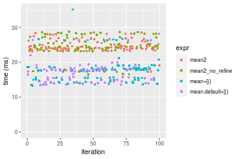

#### A 80% subset
```r
> x <- data[["n = 10000000"]]
> subset
[1] 0.8
> idxs <- sort(sample(length(x), size = subset * length(x), replace = FALSE))
> gc()
           used  (Mb) gc trigger  (Mb)  max used  (Mb)
Ncells  5334527 284.9    8529671 455.6   8529671 455.6
Vcells 19834715 151.4   46703304 356.4 101881463 777.3
> stats <- microbenchmark(mean2 = mean2(x, idxs = idxs, refine = TRUE), mean2_no_refine = mean2(x, 
+     idxs = idxs, refine = FALSE), `mean+[()` = mean2_R_v1(x, idxs = idxs), `mean.default+[()` = mean2_R_v2(x, 
+     idxs = idxs), unit = "ms")
```

_Table: Benchmarking of mean2(), mean2_no_refine(), mean+[()() and mean.default+[()() on integer+n = 10000000+0.8 data. The top panel shows times in milliseconds and the bottom panel shows relative times._


|   |expr             |      min|       lq|     mean|   median|       uq|       max|
|:--|:----------------|--------:|--------:|--------:|--------:|--------:|---------:|
|4  |mean.default+[() | 25.81895| 26.51238| 30.21581| 28.05782| 35.32258|  48.05117|
|3  |mean+[()         | 25.81136| 26.52639| 33.27037| 28.08455| 30.11104| 399.47393|
|1  |mean2            | 29.67431| 41.22107| 43.72055| 42.64755| 48.19389|  50.79746|
|2  |mean2_no_refine  | 29.80945| 41.46204| 44.23641| 47.05902| 48.32213|  52.20627|


|   |expr             |       min|       lq|     mean|   median|        uq|      max|
|:--|:----------------|---------:|--------:|--------:|--------:|---------:|--------:|
|4  |mean.default+[() | 1.0000000| 1.000000| 1.000000| 1.000000| 1.0000000| 1.000000|
|3  |mean+[()         | 0.9997062| 1.000528| 1.101091| 1.000952| 0.8524585| 8.313511|
|1  |mean2            | 1.1493228| 1.554786| 1.446943| 1.519988| 1.3643931| 1.057153|
|2  |mean2_no_refine  | 1.1545569| 1.563875| 1.464015| 1.677215| 1.3680238| 1.086472|

_Figure: Benchmarking of mean2(), mean2_no_refine(), mean+[()() and mean.default+[()() on integer+n = 10000000+0.8 data.  Outliers are displayed as crosses.  Times are in milliseconds._

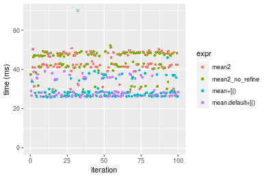


## Data type "double"
### Data
```r
> rvector <- function(n, mode = c("logical", "double", "integer"), range = c(-100, +100), na_prob = 0) {
+     mode <- match.arg(mode)
+     if (mode == "logical") {
+         x <- sample(c(FALSE, TRUE), size = n, replace = TRUE)
+     }     else {
+         x <- runif(n, min = range[1], max = range[2])
+     }
+     storage.mode(x) <- mode
+     if (na_prob > 0) 
+         x[sample(n, size = na_prob * n)] <- NA
+     x
+ }
> rvectors <- function(scale = 10, seed = 1, ...) {
+     set.seed(seed)
+     data <- list()
+     data[[1]] <- rvector(n = scale * 100, ...)
+     data[[2]] <- rvector(n = scale * 1000, ...)
+     data[[3]] <- rvector(n = scale * 10000, ...)
+     data[[4]] <- rvector(n = scale * 1e+05, ...)
+     data[[5]] <- rvector(n = scale * 1e+06, ...)
+     names(data) <- sprintf("n = %d", sapply(data, FUN = length))
+     data
+ }
> data <- rvectors(mode = mode)
```

### Results

### n = 1000 vector


#### All elements
```r
> x <- data[["n = 1000"]]
> gc()
           used  (Mb) gc trigger  (Mb)  max used  (Mb)
Ncells  5334537 284.9    8529671 455.6   8529671 455.6
Vcells 25389783 193.8   46703304 356.4 101881463 777.3
> stats <- microbenchmark(mean2 = mean2(x, refine = TRUE), mean2_no_refine = mean2(x, refine = FALSE), 
+     mean = mean(x), mean.default = mean.default(x), unit = "ms")
```

_Table: Benchmarking of mean2(), mean2_no_refine(), mean() and mean.default() on n = 1000+all data. The top panel shows times in milliseconds and the bottom panel shows relative times._


|   |expr            |      min|        lq|      mean|    median|        uq|      max|
|:--|:---------------|--------:|---------:|---------:|---------:|---------:|--------:|
|2  |mean2_no_refine | 0.003397| 0.0035125| 0.0036706| 0.0036035| 0.0037195| 0.008628|
|4  |mean.default    | 0.003853| 0.0040150| 0.0043051| 0.0041085| 0.0041940| 0.018430|
|1  |mean2           | 0.005006| 0.0052320| 0.0054801| 0.0053370| 0.0054530| 0.018092|
|3  |mean            | 0.005515| 0.0058415| 0.0061428| 0.0059525| 0.0060955| 0.021552|


|   |expr            |      min|       lq|     mean|   median|       uq|      max|
|:--|:---------------|--------:|--------:|--------:|--------:|--------:|--------:|
|2  |mean2_no_refine | 1.000000| 1.000000| 1.000000| 1.000000| 1.000000| 1.000000|
|4  |mean.default    | 1.134236| 1.143061| 1.172858| 1.140141| 1.127571| 2.136069|
|1  |mean2           | 1.473653| 1.489537| 1.492974| 1.481060| 1.466057| 2.096894|
|3  |mean            | 1.623491| 1.663061| 1.673515| 1.651866| 1.638796| 2.497914|

_Figure: Benchmarking of mean2(), mean2_no_refine(), mean() and mean.default() on n = 1000+all data.  Outliers are displayed as crosses.  Times are in milliseconds._


#### A 20% subset
```r
> x <- data[["n = 1000"]]
> subset
[1] 0.2
> idxs <- sort(sample(length(x), size = subset * length(x), replace = FALSE))
> gc()
           used  (Mb) gc trigger  (Mb)  max used  (Mb)
Ncells  5334686 285.0    8529671 455.6   8529671 455.6
Vcells 21391506 163.3   46703304 356.4 101881463 777.3
> stats <- microbenchmark(mean2 = mean2(x, idxs = idxs, refine = TRUE), mean2_no_refine = mean2(x, 
+     idxs = idxs, refine = FALSE), `mean+[()` = mean2_R_v1(x, idxs = idxs), `mean.default+[()` = mean2_R_v2(x, 
+     idxs = idxs), unit = "ms")
```

_Table: Benchmarking of mean2(), mean2_no_refine(), mean+[()() and mean.default+[()() on double+n = 1000+0.2 data. The top panel shows times in milliseconds and the bottom panel shows relative times._


|   |expr             |      min|        lq|      mean|    median|       uq|      max|
|:--|:----------------|--------:|---------:|---------:|---------:|--------:|--------:|
|2  |mean2_no_refine  | 0.002829| 0.0030780| 0.0033358| 0.0031720| 0.003297| 0.016660|
|1  |mean2            | 0.003176| 0.0034155| 0.0036594| 0.0035295| 0.003669| 0.010323|
|4  |mean.default+[() | 0.003777| 0.0040305| 0.0042983| 0.0041570| 0.004339| 0.014093|
|3  |mean+[()         | 0.006017| 0.0064345| 0.0068636| 0.0066250| 0.006828| 0.024158|


|   |expr             |      min|       lq|     mean|   median|       uq|       max|
|:--|:----------------|--------:|--------:|--------:|--------:|--------:|---------:|
|2  |mean2_no_refine  | 1.000000| 1.000000| 1.000000| 1.000000| 1.000000| 1.0000000|
|1  |mean2            | 1.122658| 1.109649| 1.097018| 1.112705| 1.112830| 0.6196279|
|4  |mean.default+[() | 1.335101| 1.309454| 1.288555| 1.310530| 1.316045| 0.8459184|
|3  |mean+[()         | 2.126900| 2.090481| 2.057588| 2.088588| 2.070974| 1.4500600|

_Figure: Benchmarking of mean2(), mean2_no_refine(), mean+[()() and mean.default+[()() on double+n = 1000+0.2 data.  Outliers are displayed as crosses.  Times are in milliseconds._

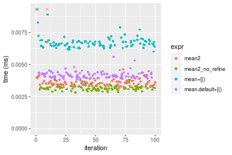

#### A 40% subset
```r
> x <- data[["n = 1000"]]
> subset
[1] 0.4
> idxs <- sort(sample(length(x), size = subset * length(x), replace = FALSE))
> gc()
           used  (Mb) gc trigger  (Mb)  max used  (Mb)
Ncells  5334770 285.0    8529671 455.6   8529671 455.6
Vcells 21391667 163.3   46703304 356.4 101881463 777.3
> stats <- microbenchmark(mean2 = mean2(x, idxs = idxs, refine = TRUE), mean2_no_refine = mean2(x, 
+     idxs = idxs, refine = FALSE), `mean+[()` = mean2_R_v1(x, idxs = idxs), `mean.default+[()` = mean2_R_v2(x, 
+     idxs = idxs), unit = "ms")
```

_Table: Benchmarking of mean2(), mean2_no_refine(), mean+[()() and mean.default+[()() on double+n = 1000+0.4 data. The top panel shows times in milliseconds and the bottom panel shows relative times._


|   |expr             |      min|        lq|      mean|    median|        uq|      max|
|:--|:----------------|--------:|---------:|---------:|---------:|---------:|--------:|
|2  |mean2_no_refine  | 0.003955| 0.0041900| 0.0044788| 0.0043285| 0.0045640| 0.013814|
|1  |mean2            | 0.004634| 0.0048675| 0.0051350| 0.0050510| 0.0053005| 0.006276|
|4  |mean.default+[() | 0.004870| 0.0051460| 0.0054945| 0.0053365| 0.0055185| 0.019900|
|3  |mean+[()         | 0.007242| 0.0076560| 0.0082527| 0.0079435| 0.0081550| 0.026346|


|   |expr             |      min|       lq|     mean|   median|       uq|       max|
|:--|:----------------|--------:|--------:|--------:|--------:|--------:|---------:|
|2  |mean2_no_refine  | 1.000000| 1.000000| 1.000000| 1.000000| 1.000000| 1.0000000|
|1  |mean2            | 1.171681| 1.161695| 1.146505| 1.166917| 1.161372| 0.4543217|
|4  |mean.default+[() | 1.231353| 1.228162| 1.226784| 1.232875| 1.209137| 1.4405675|
|3  |mean+[()         | 1.831100| 1.827208| 1.842612| 1.835162| 1.786810| 1.9071956|

_Figure: Benchmarking of mean2(), mean2_no_refine(), mean+[()() and mean.default+[()() on double+n = 1000+0.4 data.  Outliers are displayed as crosses.  Times are in milliseconds._

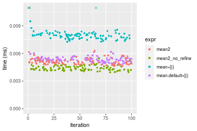

#### A 80% subset
```r
> x <- data[["n = 1000"]]
> subset
[1] 0.8
> idxs <- sort(sample(length(x), size = subset * length(x), replace = FALSE))
> gc()
           used  (Mb) gc trigger  (Mb)  max used  (Mb)
Ncells  5334851 285.0    8529671 455.6   8529671 455.6
Vcells 21391921 163.3   46703304 356.4 101881463 777.3
> stats <- microbenchmark(mean2 = mean2(x, idxs = idxs, refine = TRUE), mean2_no_refine = mean2(x, 
+     idxs = idxs, refine = FALSE), `mean+[()` = mean2_R_v1(x, idxs = idxs), `mean.default+[()` = mean2_R_v2(x, 
+     idxs = idxs), unit = "ms")
```

_Table: Benchmarking of mean2(), mean2_no_refine(), mean+[()() and mean.default+[()() on double+n = 1000+0.8 data. The top panel shows times in milliseconds and the bottom panel shows relative times._


|   |expr             |      min|        lq|      mean|    median|        uq|      max|
|:--|:----------------|--------:|---------:|---------:|---------:|---------:|--------:|
|2  |mean2_no_refine  | 0.006096| 0.0063290| 0.0067313| 0.0065355| 0.0067290| 0.021217|
|4  |mean.default+[() | 0.006673| 0.0070425| 0.0072381| 0.0072185| 0.0073795| 0.009505|
|1  |mean2            | 0.007397| 0.0076115| 0.0080315| 0.0077860| 0.0080540| 0.025651|
|3  |mean+[()         | 0.009168| 0.0095680| 0.0100987| 0.0097825| 0.0100630| 0.034877|


|   |expr             |      min|       lq|     mean|   median|       uq|       max|
|:--|:----------------|--------:|--------:|--------:|--------:|--------:|---------:|
|2  |mean2_no_refine  | 1.000000| 1.000000| 1.000000| 1.000000| 1.000000| 1.0000000|
|4  |mean.default+[() | 1.094652| 1.112735| 1.075295| 1.104506| 1.096671| 0.4479898|
|1  |mean2            | 1.213419| 1.202639| 1.193172| 1.191340| 1.196909| 1.2089834|
|3  |mean+[()         | 1.503937| 1.511771| 1.500270| 1.496825| 1.495467| 1.6438233|

_Figure: Benchmarking of mean2(), mean2_no_refine(), mean+[()() and mean.default+[()() on double+n = 1000+0.8 data.  Outliers are displayed as crosses.  Times are in milliseconds._


### n = 10000 vector


#### All elements
```r
> x <- data[["n = 10000"]]
> gc()
           used  (Mb) gc trigger  (Mb)  max used  (Mb)
Ncells  5334861 285.0    8529671 455.6   8529671 455.6
Vcells 21391489 163.3   46703304 356.4 101881463 777.3
> stats <- microbenchmark(mean2 = mean2(x, refine = TRUE), mean2_no_refine = mean2(x, refine = FALSE), 
+     mean = mean(x), mean.default = mean.default(x), unit = "ms")
```

_Table: Benchmarking of mean2(), mean2_no_refine(), mean() and mean.default() on n = 10000+all data. The top panel shows times in milliseconds and the bottom panel shows relative times._


|   |expr            |      min|        lq|      mean|    median|        uq|      max|
|:--|:---------------|--------:|---------:|---------:|---------:|---------:|--------:|
|2  |mean2_no_refine | 0.019592| 0.0204710| 0.0216919| 0.0212445| 0.0224825| 0.037104|
|4  |mean.default    | 0.023796| 0.0242965| 0.0257009| 0.0258625| 0.0267565| 0.040319|
|3  |mean            | 0.025122| 0.0262995| 0.0282379| 0.0280265| 0.0292220| 0.049169|
|1  |mean2           | 0.033995| 0.0354585| 0.0377419| 0.0380060| 0.0395335| 0.055808|


|   |expr            |      min|       lq|     mean|   median|       uq|      max|
|:--|:---------------|--------:|--------:|--------:|--------:|--------:|--------:|
|2  |mean2_no_refine | 1.000000| 1.000000| 1.000000| 1.000000| 1.000000| 1.000000|
|4  |mean.default    | 1.214577| 1.186874| 1.184816| 1.217374| 1.190103| 1.086648|
|3  |mean            | 1.282258| 1.284720| 1.301773| 1.319236| 1.299767| 1.325167|
|1  |mean2           | 1.735147| 1.732133| 1.739913| 1.788981| 1.758412| 1.504097|

_Figure: Benchmarking of mean2(), mean2_no_refine(), mean() and mean.default() on n = 10000+all data.  Outliers are displayed as crosses.  Times are in milliseconds._


#### A 20% subset
```r
> x <- data[["n = 10000"]]
> subset
[1] 0.2
> idxs <- sort(sample(length(x), size = subset * length(x), replace = FALSE))
> gc()
           used  (Mb) gc trigger  (Mb)  max used  (Mb)
Ncells  5335010 285.0    8529671 455.6   8529671 455.6
Vcells 21393922 163.3   46703304 356.4 101881463 777.3
> stats <- microbenchmark(mean2 = mean2(x, idxs = idxs, refine = TRUE), mean2_no_refine = mean2(x, 
+     idxs = idxs, refine = FALSE), `mean+[()` = mean2_R_v1(x, idxs = idxs), `mean.default+[()` = mean2_R_v2(x, 
+     idxs = idxs), unit = "ms")
```

_Table: Benchmarking of mean2(), mean2_no_refine(), mean+[()() and mean.default+[()() on double+n = 10000+0.2 data. The top panel shows times in milliseconds and the bottom panel shows relative times._


|   |expr             |      min|        lq|      mean|   median|        uq|      max|
|:--|:----------------|--------:|---------:|---------:|--------:|---------:|--------:|
|2  |mean2_no_refine  | 0.012235| 0.0128715| 0.0137211| 0.013318| 0.0137245| 0.024455|
|4  |mean.default+[() | 0.012882| 0.0136635| 0.0142658| 0.013986| 0.0144090| 0.028018|
|1  |mean2            | 0.015782| 0.0162710| 0.0171119| 0.016755| 0.0173325| 0.031873|
|3  |mean+[()         | 0.015611| 0.0164135| 0.0174252| 0.016794| 0.0173245| 0.064889|


|   |expr             |      min|       lq|     mean|   median|       uq|      max|
|:--|:----------------|--------:|--------:|--------:|--------:|--------:|--------:|
|2  |mean2_no_refine  | 1.000000| 1.000000| 1.000000| 1.000000| 1.000000| 1.000000|
|4  |mean.default+[() | 1.052881| 1.061531| 1.039705| 1.050158| 1.049874| 1.145696|
|1  |mean2            | 1.289906| 1.264111| 1.247130| 1.258072| 1.262887| 1.303333|
|3  |mean+[()         | 1.275930| 1.275182| 1.269963| 1.261000| 1.262305| 2.653404|

_Figure: Benchmarking of mean2(), mean2_no_refine(), mean+[()() and mean.default+[()() on double+n = 10000+0.2 data.  Outliers are displayed as crosses.  Times are in milliseconds._

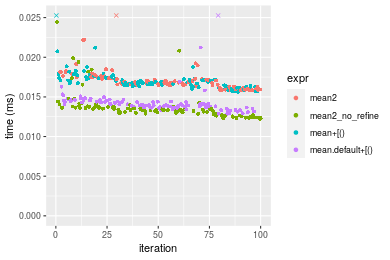

#### A 40% subset
```r
> x <- data[["n = 10000"]]
> subset
[1] 0.4
> idxs <- sort(sample(length(x), size = subset * length(x), replace = FALSE))
> gc()
           used  (Mb) gc trigger  (Mb)  max used  (Mb)
Ncells  5335094 285.0    8529671 455.6   8529671 455.6
Vcells 21394983 163.3   46703304 356.4 101881463 777.3
> stats <- microbenchmark(mean2 = mean2(x, idxs = idxs, refine = TRUE), mean2_no_refine = mean2(x, 
+     idxs = idxs, refine = FALSE), `mean+[()` = mean2_R_v1(x, idxs = idxs), `mean.default+[()` = mean2_R_v2(x, 
+     idxs = idxs), unit = "ms")
```

_Table: Benchmarking of mean2(), mean2_no_refine(), mean+[()() and mean.default+[()() on double+n = 10000+0.4 data. The top panel shows times in milliseconds and the bottom panel shows relative times._


|   |expr             |      min|        lq|      mean|    median|        uq|      max|
|:--|:----------------|--------:|---------:|---------:|---------:|---------:|--------:|
|2  |mean2_no_refine  | 0.020904| 0.0219150| 0.0236334| 0.0228335| 0.0238410| 0.039096|
|4  |mean.default+[() | 0.020723| 0.0221710| 0.0231311| 0.0228425| 0.0239555| 0.031711|
|3  |mean+[()         | 0.023336| 0.0250565| 0.0270711| 0.0258095| 0.0274085| 0.081607|
|1  |mean2            | 0.026991| 0.0283175| 0.0297291| 0.0293300| 0.0306085| 0.046726|


|   |expr             |       min|       lq|     mean|   median|       uq|      max|
|:--|:----------------|---------:|--------:|--------:|--------:|--------:|--------:|
|2  |mean2_no_refine  | 1.0000000| 1.000000| 1.000000| 1.000000| 1.000000| 1.000000|
|4  |mean.default+[() | 0.9913414| 1.011681| 0.978747| 1.000394| 1.004803| 0.811106|
|3  |mean+[()         | 1.1163414| 1.143349| 1.145461| 1.130335| 1.149637| 2.087349|
|1  |mean2            | 1.2911883| 1.292151| 1.257931| 1.284516| 1.283860| 1.195161|

_Figure: Benchmarking of mean2(), mean2_no_refine(), mean+[()() and mean.default+[()() on double+n = 10000+0.4 data.  Outliers are displayed as crosses.  Times are in milliseconds._

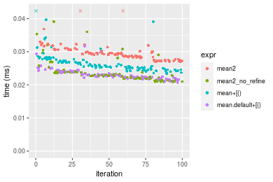

#### A 80% subset
```r
> x <- data[["n = 10000"]]
> subset
[1] 0.8
> idxs <- sort(sample(length(x), size = subset * length(x), replace = FALSE))
> gc()
           used  (Mb) gc trigger  (Mb)  max used  (Mb)
Ncells  5335175 285.0    8529671 455.6   8529671 455.6
Vcells 21397037 163.3   46703304 356.4 101881463 777.3
> stats <- microbenchmark(mean2 = mean2(x, idxs = idxs, refine = TRUE), mean2_no_refine = mean2(x, 
+     idxs = idxs, refine = FALSE), `mean+[()` = mean2_R_v1(x, idxs = idxs), `mean.default+[()` = mean2_R_v2(x, 
+     idxs = idxs), unit = "ms")
```

_Table: Benchmarking of mean2(), mean2_no_refine(), mean+[()() and mean.default+[()() on double+n = 10000+0.8 data. The top panel shows times in milliseconds and the bottom panel shows relative times._


|   |expr             |      min|        lq|      mean|    median|        uq|      max|
|:--|:----------------|--------:|---------:|---------:|---------:|---------:|--------:|
|4  |mean.default+[() | 0.036775| 0.0382140| 0.0407724| 0.0405630| 0.0423160| 0.053501|
|2  |mean2_no_refine  | 0.036998| 0.0389655| 0.0426207| 0.0416175| 0.0447005| 0.077864|
|3  |mean+[()         | 0.039122| 0.0409575| 0.0442101| 0.0435920| 0.0456245| 0.073438|
|1  |mean2            | 0.047836| 0.0505150| 0.0542753| 0.0538305| 0.0575540| 0.065101|


|   |expr             |      min|       lq|     mean|   median|       uq|      max|
|:--|:----------------|--------:|--------:|--------:|--------:|--------:|--------:|
|4  |mean.default+[() | 1.000000| 1.000000| 1.000000| 1.000000| 1.000000| 1.000000|
|2  |mean2_no_refine  | 1.006064| 1.019666| 1.045334| 1.025997| 1.056350| 1.455375|
|3  |mean+[()         | 1.063821| 1.071793| 1.084315| 1.074674| 1.078186| 1.372647|
|1  |mean2            | 1.300775| 1.321898| 1.331178| 1.327084| 1.360100| 1.216818|

_Figure: Benchmarking of mean2(), mean2_no_refine(), mean+[()() and mean.default+[()() on double+n = 10000+0.8 data.  Outliers are displayed as crosses.  Times are in milliseconds._

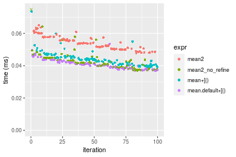


### n = 100000 vector


#### All elements
```r
> x <- data[["n = 100000"]]
> gc()
           used  (Mb) gc trigger  (Mb)  max used  (Mb)
Ncells  5335185 285.0    8529671 455.6   8529671 455.6
Vcells 21396605 163.3   46703304 356.4 101881463 777.3
> stats <- microbenchmark(mean2 = mean2(x, refine = TRUE), mean2_no_refine = mean2(x, refine = FALSE), 
+     mean = mean(x), mean.default = mean.default(x), unit = "ms")
```

_Table: Benchmarking of mean2(), mean2_no_refine(), mean() and mean.default() on n = 100000+all data. The top panel shows times in milliseconds and the bottom panel shows relative times._


|   |expr            |      min|        lq|      mean|    median|        uq|      max|
|:--|:---------------|--------:|---------:|---------:|---------:|---------:|--------:|
|2  |mean2_no_refine | 0.123641| 0.1301225| 0.1480198| 0.1367445| 0.1636720| 0.212153|
|3  |mean            | 0.157203| 0.1574605| 0.1760000| 0.1586010| 0.1949485| 0.265719|
|4  |mean.default    | 0.155662| 0.1558715| 0.1776203| 0.1642010| 0.1959210| 0.264739|
|1  |mean2           | 0.232905| 0.2330720| 0.2702550| 0.2524035| 0.2967165| 0.416678|


|   |expr            |      min|       lq|     mean|   median|       uq|      max|
|:--|:---------------|--------:|--------:|--------:|--------:|--------:|--------:|
|2  |mean2_no_refine | 1.000000| 1.000000| 1.000000| 1.000000| 1.000000| 1.000000|
|3  |mean            | 1.271447| 1.210094| 1.189031| 1.159835| 1.191093| 1.252488|
|4  |mean.default    | 1.258984| 1.197883| 1.199977| 1.200787| 1.197034| 1.247868|
|1  |mean2           | 1.883720| 1.791174| 1.825803| 1.845804| 1.812873| 1.964045|

_Figure: Benchmarking of mean2(), mean2_no_refine(), mean() and mean.default() on n = 100000+all data.  Outliers are displayed as crosses.  Times are in milliseconds._


#### A 20% subset
```r
> x <- data[["n = 100000"]]
> subset
[1] 0.2
> idxs <- sort(sample(length(x), size = subset * length(x), replace = FALSE))
> gc()
           used  (Mb) gc trigger  (Mb)  max used  (Mb)
Ncells  5335334 285.0    8529671 455.6   8529671 455.6
Vcells 21403139 163.3   46703304 356.4 101881463 777.3
> stats <- microbenchmark(mean2 = mean2(x, idxs = idxs, refine = TRUE), mean2_no_refine = mean2(x, 
+     idxs = idxs, refine = FALSE), `mean+[()` = mean2_R_v1(x, idxs = idxs), `mean.default+[()` = mean2_R_v2(x, 
+     idxs = idxs), unit = "ms")
```

_Table: Benchmarking of mean2(), mean2_no_refine(), mean+[()() and mean.default+[()() on double+n = 100000+0.2 data. The top panel shows times in milliseconds and the bottom panel shows relative times._


|   |expr             |      min|        lq|      mean|    median|        uq|      max|
|:--|:----------------|--------:|---------:|---------:|---------:|---------:|--------:|
|2  |mean2_no_refine  | 0.077349| 0.0856255| 0.0927483| 0.0903835| 0.0989490| 0.119778|
|4  |mean.default+[() | 0.081374| 0.0861535| 0.0951665| 0.0919175| 0.1009670| 0.131160|
|3  |mean+[()         | 0.083170| 0.0885990| 0.0973453| 0.0966945| 0.1043025| 0.133494|
|1  |mean2            | 0.105852| 0.1158745| 0.1261990| 0.1235155| 0.1353835| 0.232145|


|   |expr             |      min|       lq|     mean|   median|       uq|      max|
|:--|:----------------|--------:|--------:|--------:|--------:|--------:|--------:|
|2  |mean2_no_refine  | 1.000000| 1.000000| 1.000000| 1.000000| 1.000000| 1.000000|
|4  |mean.default+[() | 1.052037| 1.006166| 1.026072| 1.016972| 1.020394| 1.095026|
|3  |mean+[()         | 1.075256| 1.034727| 1.049564| 1.069825| 1.054104| 1.114512|
|1  |mean2            | 1.368499| 1.353271| 1.360661| 1.366571| 1.368215| 1.938127|

_Figure: Benchmarking of mean2(), mean2_no_refine(), mean+[()() and mean.default+[()() on double+n = 100000+0.2 data.  Outliers are displayed as crosses.  Times are in milliseconds._


#### A 40% subset
```r
> x <- data[["n = 100000"]]
> subset
[1] 0.4
> idxs <- sort(sample(length(x), size = subset * length(x), replace = FALSE))
> gc()
           used  (Mb) gc trigger  (Mb)  max used  (Mb)
Ncells  5335418 285.0    8529671 455.6   8529671 455.6
Vcells 21414762 163.4   46703304 356.4 101881463 777.3
> stats <- microbenchmark(mean2 = mean2(x, idxs = idxs, refine = TRUE), mean2_no_refine = mean2(x, 
+     idxs = idxs, refine = FALSE), `mean+[()` = mean2_R_v1(x, idxs = idxs), `mean.default+[()` = mean2_R_v2(x, 
+     idxs = idxs), unit = "ms")
```

_Table: Benchmarking of mean2(), mean2_no_refine(), mean+[()() and mean.default+[()() on double+n = 100000+0.4 data. The top panel shows times in milliseconds and the bottom panel shows relative times._


|   |expr             |      min|        lq|      mean|    median|       uq|      max|
|:--|:----------------|--------:|---------:|---------:|---------:|--------:|--------:|
|2  |mean2_no_refine  | 0.136383| 0.1369515| 0.1596459| 0.1564385| 0.177603| 0.224354|
|4  |mean.default+[() | 0.134424| 0.1386260| 0.1634526| 0.1571330| 0.180167| 0.300216|
|3  |mean+[()         | 0.136195| 0.1387200| 0.1625829| 0.1589555| 0.177135| 0.230900|
|1  |mean2            | 0.181882| 0.1827200| 0.2163775| 0.2123575| 0.236955| 0.305140|


|   |expr             |       min|       lq|     mean|   median|        uq|      max|
|:--|:----------------|---------:|--------:|--------:|--------:|---------:|--------:|
|2  |mean2_no_refine  | 1.0000000| 1.000000| 1.000000| 1.000000| 1.0000000| 1.000000|
|4  |mean.default+[() | 0.9856360| 1.012227| 1.023845| 1.004439| 1.0144367| 1.338135|
|3  |mean+[()         | 0.9986215| 1.012913| 1.018397| 1.016089| 0.9973649| 1.029177|
|1  |mean2            | 1.3336120| 1.334195| 1.355359| 1.357450| 1.3341835| 1.360083|

_Figure: Benchmarking of mean2(), mean2_no_refine(), mean+[()() and mean.default+[()() on double+n = 100000+0.4 data.  Outliers are displayed as crosses.  Times are in milliseconds._

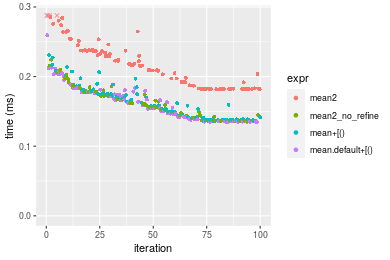

#### A 80% subset
```r
> x <- data[["n = 100000"]]
> subset
[1] 0.8
> idxs <- sort(sample(length(x), size = subset * length(x), replace = FALSE))
> gc()
           used  (Mb) gc trigger  (Mb)  max used  (Mb)
Ncells  5335499 285.0    8529671 455.6   8529671 455.6
Vcells 21434816 163.6   46703304 356.4 101881463 777.3
> stats <- microbenchmark(mean2 = mean2(x, idxs = idxs, refine = TRUE), mean2_no_refine = mean2(x, 
+     idxs = idxs, refine = FALSE), `mean+[()` = mean2_R_v1(x, idxs = idxs), `mean.default+[()` = mean2_R_v2(x, 
+     idxs = idxs), unit = "ms")
```

_Table: Benchmarking of mean2(), mean2_no_refine(), mean+[()() and mean.default+[()() on double+n = 100000+0.8 data. The top panel shows times in milliseconds and the bottom panel shows relative times._


|   |expr             |      min|        lq|      mean|    median|        uq|      max|
|:--|:----------------|--------:|---------:|---------:|---------:|---------:|--------:|
|4  |mean.default+[() | 0.261269| 0.2649040| 0.3562759| 0.2869375| 0.3184455| 6.092981|
|2  |mean2_no_refine  | 0.272242| 0.2749425| 0.3049602| 0.2906005| 0.3257420| 0.412461|
|3  |mean+[()         | 0.263600| 0.2718540| 0.3079954| 0.2970435| 0.3242510| 0.527499|
|1  |mean2            | 0.357708| 0.3648395| 0.4119429| 0.3919220| 0.4516170| 0.598076|


|   |expr             |      min|       lq|      mean|   median|       uq|       max|
|:--|:----------------|--------:|--------:|---------:|--------:|--------:|---------:|
|4  |mean.default+[() | 1.000000| 1.000000| 1.0000000| 1.000000| 1.000000| 1.0000000|
|2  |mean2_no_refine  | 1.041999| 1.037895| 0.8559665| 1.012766| 1.022913| 0.0676945|
|3  |mean+[()         | 1.008922| 1.026236| 0.8644855| 1.035220| 1.018231| 0.0865749|
|1  |mean2            | 1.369118| 1.377252| 1.1562469| 1.365879| 1.418192| 0.0981582|

_Figure: Benchmarking of mean2(), mean2_no_refine(), mean+[()() and mean.default+[()() on double+n = 100000+0.8 data.  Outliers are displayed as crosses.  Times are in milliseconds._

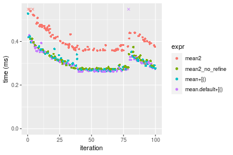


### n = 1000000 vector


#### All elements
```r
> x <- data[["n = 1000000"]]
> gc()
           used  (Mb) gc trigger  (Mb)  max used  (Mb)
Ncells  5335509 285.0    8529671 455.6   8529671 455.6
Vcells 21434384 163.6   46703304 356.4 101881463 777.3
> stats <- microbenchmark(mean2 = mean2(x, refine = TRUE), mean2_no_refine = mean2(x, refine = FALSE), 
+     mean = mean(x), mean.default = mean.default(x), unit = "ms")
```

_Table: Benchmarking of mean2(), mean2_no_refine(), mean() and mean.default() on n = 1000000+all data. The top panel shows times in milliseconds and the bottom panel shows relative times._


|   |expr            |      min|       lq|     mean|   median|       uq|      max|
|:--|:---------------|--------:|--------:|--------:|--------:|--------:|--------:|
|2  |mean2_no_refine | 1.333625| 1.352267| 1.423952| 1.381003| 1.414618| 2.574833|
|4  |mean.default    | 1.636013| 1.670561| 1.742952| 1.700897| 1.776353| 2.402908|
|3  |mean            | 1.651583| 1.688845| 1.752163| 1.723132| 1.776223| 2.350706|
|1  |mean2           | 2.424576| 2.475733| 2.578822| 2.534032| 2.581672| 4.091119|


|   |expr            |      min|       lq|     mean|   median|       uq|       max|
|:--|:---------------|--------:|--------:|--------:|--------:|--------:|---------:|
|2  |mean2_no_refine | 1.000000| 1.000000| 1.000000| 1.000000| 1.000000| 1.0000000|
|4  |mean.default    | 1.226741| 1.235378| 1.224024| 1.231639| 1.255712| 0.9332287|
|3  |mean            | 1.238416| 1.248900| 1.230493| 1.247739| 1.255621| 0.9129547|
|1  |mean2           | 1.818034| 1.830803| 1.811031| 1.834921| 1.824996| 1.5888871|

_Figure: Benchmarking of mean2(), mean2_no_refine(), mean() and mean.default() on n = 1000000+all data.  Outliers are displayed as crosses.  Times are in milliseconds._


#### A 20% subset
```r
> x <- data[["n = 1000000"]]
> subset
[1] 0.2
> idxs <- sort(sample(length(x), size = subset * length(x), replace = FALSE))
> gc()
           used (Mb) gc trigger  (Mb)  max used  (Mb)
Ncells  5335658  285    8529671 455.6   8529671 455.6
Vcells 21494917  164   46703304 356.4 101881463 777.3
> stats <- microbenchmark(mean2 = mean2(x, idxs = idxs, refine = TRUE), mean2_no_refine = mean2(x, 
+     idxs = idxs, refine = FALSE), `mean+[()` = mean2_R_v1(x, idxs = idxs), `mean.default+[()` = mean2_R_v2(x, 
+     idxs = idxs), unit = "ms")
```

_Table: Benchmarking of mean2(), mean2_no_refine(), mean+[()() and mean.default+[()() on double+n = 1000000+0.2 data. The top panel shows times in milliseconds and the bottom panel shows relative times._


|   |expr             |      min|       lq|     mean|   median|       uq|      max|
|:--|:----------------|--------:|--------:|--------:|--------:|--------:|--------:|
|2  |mean2_no_refine  | 1.060349| 1.089580| 1.255321| 1.118643| 1.145223| 7.532557|
|4  |mean.default+[() | 1.134807| 1.164546| 1.272702| 1.190851| 1.228322| 7.659987|
|3  |mean+[()         | 1.143280| 1.180238| 1.219480| 1.199141| 1.238282| 1.641473|
|1  |mean2            | 1.594557| 1.632402| 1.698210| 1.665925| 1.729671| 2.319990|


|   |expr             |      min|       lq|      mean|   median|       uq|       max|
|:--|:----------------|--------:|--------:|---------:|--------:|--------:|---------:|
|2  |mean2_no_refine  | 1.000000| 1.000000| 1.0000000| 1.000000| 1.000000| 1.0000000|
|4  |mean.default+[() | 1.070220| 1.068803| 1.0138459| 1.064549| 1.072561| 1.0169172|
|3  |mean+[()         | 1.078211| 1.083204| 0.9714482| 1.071960| 1.081258| 0.2179171|
|1  |mean2            | 1.503804| 1.498193| 1.3528091| 1.489236| 1.510335| 0.3079950|

_Figure: Benchmarking of mean2(), mean2_no_refine(), mean+[()() and mean.default+[()() on double+n = 1000000+0.2 data.  Outliers are displayed as crosses.  Times are in milliseconds._

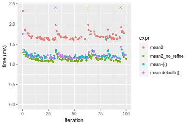

#### A 40% subset
```r
> x <- data[["n = 1000000"]]
> subset
[1] 0.4
> idxs <- sort(sample(length(x), size = subset * length(x), replace = FALSE))
> gc()
           used  (Mb) gc trigger  (Mb)  max used  (Mb)
Ncells  5335742 285.0    8529671 455.6   8529671 455.6
Vcells 21594978 164.8   46703304 356.4 101881463 777.3
> stats <- microbenchmark(mean2 = mean2(x, idxs = idxs, refine = TRUE), mean2_no_refine = mean2(x, 
+     idxs = idxs, refine = FALSE), `mean+[()` = mean2_R_v1(x, idxs = idxs), `mean.default+[()` = mean2_R_v2(x, 
+     idxs = idxs), unit = "ms")
```

_Table: Benchmarking of mean2(), mean2_no_refine(), mean+[()() and mean.default+[()() on double+n = 1000000+0.4 data. The top panel shows times in milliseconds and the bottom panel shows relative times._


|   |expr             |      min|       lq|     mean|   median|       uq|      max|
|:--|:----------------|--------:|--------:|--------:|--------:|--------:|--------:|
|2  |mean2_no_refine  | 1.745365| 1.819536| 2.011218| 1.864065| 1.956688| 8.094959|
|4  |mean.default+[() | 1.848216| 1.932346| 2.128681| 1.971524| 2.031969| 8.231800|
|3  |mean+[()         | 1.888923| 1.947911| 2.003362| 1.994406| 2.046650| 2.196784|
|1  |mean2            | 2.496994| 2.586266| 2.824170| 2.650161| 2.760435| 8.884958|


|   |expr             |      min|       lq|      mean|   median|       uq|       max|
|:--|:----------------|--------:|--------:|---------:|--------:|--------:|---------:|
|2  |mean2_no_refine  | 1.000000| 1.000000| 1.0000000| 1.000000| 1.000000| 1.0000000|
|4  |mean.default+[() | 1.058928| 1.061999| 1.0584043| 1.057648| 1.038473| 1.0169045|
|3  |mean+[()         | 1.082251| 1.070553| 0.9960942| 1.069923| 1.045976| 0.2713768|
|1  |mean2            | 1.430643| 1.421387| 1.4042092| 1.421711| 1.410769| 1.0975915|

_Figure: Benchmarking of mean2(), mean2_no_refine(), mean+[()() and mean.default+[()() on double+n = 1000000+0.4 data.  Outliers are displayed as crosses.  Times are in milliseconds._

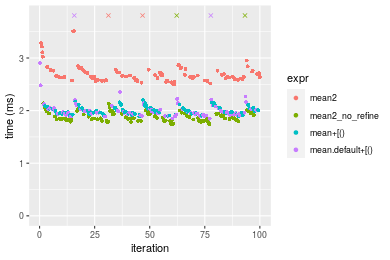

#### A 80% subset
```r
> x <- data[["n = 1000000"]]
> subset
[1] 0.8
> idxs <- sort(sample(length(x), size = subset * length(x), replace = FALSE))
> gc()
           used  (Mb) gc trigger  (Mb)  max used  (Mb)
Ncells  5335823 285.0    8529671 455.6   8529671 455.6
Vcells 21795032 166.3   46703304 356.4 101881463 777.3
> stats <- microbenchmark(mean2 = mean2(x, idxs = idxs, refine = TRUE), mean2_no_refine = mean2(x, 
+     idxs = idxs, refine = FALSE), `mean+[()` = mean2_R_v1(x, idxs = idxs), `mean.default+[()` = mean2_R_v2(x, 
+     idxs = idxs), unit = "ms")
```

_Table: Benchmarking of mean2(), mean2_no_refine(), mean+[()() and mean.default+[()() on double+n = 1000000+0.8 data. The top panel shows times in milliseconds and the bottom panel shows relative times._


|   |expr             |      min|       lq|     mean|   median|       uq|       max|
|:--|:----------------|--------:|--------:|--------:|--------:|--------:|---------:|
|2  |mean2_no_refine  | 3.062606| 3.205199| 3.579960| 3.296143| 3.539412|  9.760095|
|4  |mean.default+[() | 3.185006| 3.296816| 3.738387| 3.419195| 3.705976|  9.599141|
|3  |mean+[()         | 3.240967| 3.365845| 3.784418| 3.511828| 3.694897|  9.764755|
|1  |mean2            | 4.242442| 4.399191| 4.692116| 4.514841| 4.854763| 10.971203|


|   |expr             |      min|       lq|     mean|   median|       uq|      max|
|:--|:----------------|--------:|--------:|--------:|--------:|--------:|--------:|
|2  |mean2_no_refine  | 1.000000| 1.000000| 1.000000| 1.000000| 1.000000| 1.000000|
|4  |mean.default+[() | 1.039966| 1.028584| 1.044254| 1.037332| 1.047060| 0.983509|
|3  |mean+[()         | 1.058238| 1.050121| 1.057112| 1.065436| 1.043929| 1.000477|
|1  |mean2            | 1.385239| 1.372517| 1.310662| 1.369734| 1.371630| 1.124088|

_Figure: Benchmarking of mean2(), mean2_no_refine(), mean+[()() and mean.default+[()() on double+n = 1000000+0.8 data.  Outliers are displayed as crosses.  Times are in milliseconds._

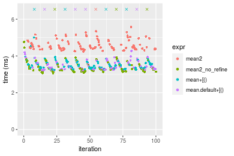


### n = 10000000 vector


#### All elements
```r
> x <- data[["n = 10000000"]]
> gc()
           used  (Mb) gc trigger  (Mb)  max used  (Mb)
Ncells  5335833 285.0    8529671 455.6   8529671 455.6
Vcells 21794600 166.3   46703304 356.4 101881463 777.3
> stats <- microbenchmark(mean2 = mean2(x, refine = TRUE), mean2_no_refine = mean2(x, refine = FALSE), 
+     mean = mean(x), mean.default = mean.default(x), unit = "ms")
```

_Table: Benchmarking of mean2(), mean2_no_refine(), mean() and mean.default() on n = 10000000+all data. The top panel shows times in milliseconds and the bottom panel shows relative times._


|   |expr            |      min|       lq|     mean|   median|       uq|      max|
|:--|:---------------|--------:|--------:|--------:|--------:|--------:|--------:|
|2  |mean2_no_refine | 14.49868| 14.62616| 14.80666| 14.73758| 14.85474| 17.19605|
|3  |mean            | 18.12252| 18.34603| 18.68131| 18.48286| 18.88111| 21.76762|
|4  |mean.default    | 18.14405| 18.28320| 18.64565| 18.50771| 18.82398| 24.29008|
|1  |mean2           | 26.54792| 26.91221| 27.22419| 27.10253| 27.43443| 28.98659|


|   |expr            |      min|       lq|     mean|   median|       uq|      max|
|:--|:---------------|--------:|--------:|--------:|--------:|--------:|--------:|
|2  |mean2_no_refine | 1.000000| 1.000000| 1.000000| 1.000000| 1.000000| 1.000000|
|3  |mean            | 1.249943| 1.254330| 1.261683| 1.254131| 1.271049| 1.265850|
|4  |mean.default    | 1.251428| 1.250034| 1.259275| 1.255817| 1.267203| 1.412538|
|1  |mean2           | 1.831058| 1.840005| 1.838645| 1.839008| 1.846846| 1.685654|

_Figure: Benchmarking of mean2(), mean2_no_refine(), mean() and mean.default() on n = 10000000+all data.  Outliers are displayed as crosses.  Times are in milliseconds._


#### A 20% subset
```r
> x <- data[["n = 10000000"]]
> subset
[1] 0.2
> idxs <- sort(sample(length(x), size = subset * length(x), replace = FALSE))
> gc()
           used  (Mb) gc trigger  (Mb)  max used  (Mb)
Ncells  5335982 285.0    8529671 455.6   8529671 455.6
Vcells 22397007 170.9   46703304 356.4 101881463 777.3
> stats <- microbenchmark(mean2 = mean2(x, idxs = idxs, refine = TRUE), mean2_no_refine = mean2(x, 
+     idxs = idxs, refine = FALSE), `mean+[()` = mean2_R_v1(x, idxs = idxs), `mean.default+[()` = mean2_R_v2(x, 
+     idxs = idxs), unit = "ms")
```

_Table: Benchmarking of mean2(), mean2_no_refine(), mean+[()() and mean.default+[()() on double+n = 10000000+0.2 data. The top panel shows times in milliseconds and the bottom panel shows relative times._


|   |expr             |      min|       lq|     mean|   median|       uq|      max|
|:--|:----------------|--------:|--------:|--------:|--------:|--------:|--------:|
|2  |mean2_no_refine  | 11.81605| 11.93566| 12.69844| 12.05150| 12.41685| 20.45035|
|4  |mean.default+[() | 13.33752| 13.62064| 14.50310| 13.75737| 14.36470| 21.41216|
|3  |mean+[()         | 13.38795| 13.67508| 14.34312| 13.84662| 14.20438| 21.41130|
|1  |mean2            | 18.04404| 18.23449| 19.43780| 18.39911| 18.87307| 26.55891|


|   |expr             |      min|       lq|     mean|   median|       uq|      max|
|:--|:----------------|--------:|--------:|--------:|--------:|--------:|--------:|
|2  |mean2_no_refine  | 1.000000| 1.000000| 1.000000| 1.000000| 1.000000| 1.000000|
|4  |mean.default+[() | 1.128764| 1.141172| 1.142117| 1.141548| 1.156871| 1.047031|
|3  |mean+[()         | 1.133032| 1.145733| 1.129518| 1.148954| 1.143960| 1.046989|
|1  |mean2            | 1.527080| 1.527732| 1.530723| 1.526707| 1.519956| 1.298702|

_Figure: Benchmarking of mean2(), mean2_no_refine(), mean+[()() and mean.default+[()() on double+n = 10000000+0.2 data.  Outliers are displayed as crosses.  Times are in milliseconds._

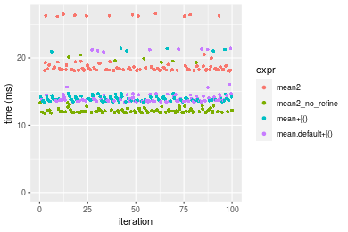

#### A 40% subset
```r
> x <- data[["n = 10000000"]]
> subset
[1] 0.4
> idxs <- sort(sample(length(x), size = subset * length(x), replace = FALSE))
> gc()
           used  (Mb) gc trigger  (Mb)  max used  (Mb)
Ncells  5336066 285.0    8529671 455.6   8529671 455.6
Vcells 23397068 178.6   46703304 356.4 101881463 777.3
> stats <- microbenchmark(mean2 = mean2(x, idxs = idxs, refine = TRUE), mean2_no_refine = mean2(x, 
+     idxs = idxs, refine = FALSE), `mean+[()` = mean2_R_v1(x, idxs = idxs), `mean.default+[()` = mean2_R_v2(x, 
+     idxs = idxs), unit = "ms")
```

_Table: Benchmarking of mean2(), mean2_no_refine(), mean+[()() and mean.default+[()() on double+n = 10000000+0.4 data. The top panel shows times in milliseconds and the bottom panel shows relative times._


|   |expr             |      min|       lq|     mean|   median|       uq|       max|
|:--|:----------------|--------:|--------:|--------:|--------:|--------:|---------:|
|2  |mean2_no_refine  | 18.72819| 19.47158| 21.36158| 19.88508| 20.33191|  27.27118|
|3  |mean+[()         | 21.62594| 21.92370| 23.54343| 22.16877| 22.54664|  29.87771|
|4  |mean.default+[() | 21.50124| 21.95887| 23.79628| 22.28273| 23.29906|  38.36955|
|1  |mean2            | 26.87450| 27.83740| 33.39097| 28.42617| 29.09137| 408.78697|


|   |expr             |      min|       lq|     mean|   median|       uq|       max|
|:--|:----------------|--------:|--------:|--------:|--------:|--------:|---------:|
|2  |mean2_no_refine  | 1.000000| 1.000000| 1.000000| 1.000000| 1.000000|  1.000000|
|3  |mean+[()         | 1.154726| 1.125933| 1.102139| 1.114845| 1.108929|  1.095578|
|4  |mean.default+[() | 1.148068| 1.127740| 1.113976| 1.120576| 1.145935|  1.406963|
|1  |mean2            | 1.434976| 1.429643| 1.563132| 1.429523| 1.430823| 14.989705|

_Figure: Benchmarking of mean2(), mean2_no_refine(), mean+[()() and mean.default+[()() on double+n = 10000000+0.4 data.  Outliers are displayed as crosses.  Times are in milliseconds._

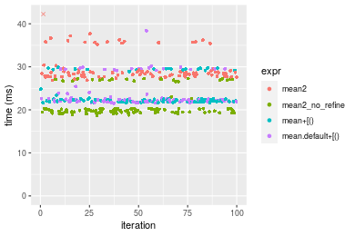

#### A 80% subset
```r
> x <- data[["n = 10000000"]]
> subset
[1] 0.8
> idxs <- sort(sample(length(x), size = subset * length(x), replace = FALSE))
> gc()
           used  (Mb) gc trigger  (Mb)  max used  (Mb)
Ncells  5336147 285.0    8529671 455.6   8529671 455.6
Vcells 25397122 193.8   46703304 356.4 101881463 777.3
> stats <- microbenchmark(mean2 = mean2(x, idxs = idxs, refine = TRUE), mean2_no_refine = mean2(x, 
+     idxs = idxs, refine = FALSE), `mean+[()` = mean2_R_v1(x, idxs = idxs), `mean.default+[()` = mean2_R_v2(x, 
+     idxs = idxs), unit = "ms")
```

_Table: Benchmarking of mean2(), mean2_no_refine(), mean+[()() and mean.default+[()() on double+n = 10000000+0.8 data. The top panel shows times in milliseconds and the bottom panel shows relative times._


|   |expr             |      min|       lq|     mean|   median|       uq|       max|
|:--|:----------------|--------:|--------:|--------:|--------:|--------:|---------:|
|4  |mean.default+[() | 45.08694| 48.03676| 50.27481| 49.96531| 52.91864|  54.96800|
|3  |mean+[()         | 46.00506| 47.96573| 50.41644| 50.01278| 52.99518|  57.83929|
|2  |mean2_no_refine  | 40.67148| 45.62297| 49.37627| 51.05324| 51.85897|  56.11946|
|1  |mean2            | 57.04986| 58.86777| 65.67113| 63.45499| 64.26397| 428.41058|


|   |expr             |      min|        lq|      mean|   median|        uq|      max|
|:--|:----------------|--------:|---------:|---------:|--------:|---------:|--------:|
|4  |mean.default+[() | 1.000000| 1.0000000| 1.0000000| 1.000000| 1.0000000| 1.000000|
|3  |mean+[()         | 1.020363| 0.9985213| 1.0028172| 1.000950| 1.0014463| 1.052236|
|2  |mean2_no_refine  | 0.902068| 0.9497511| 0.9821276| 1.021774| 0.9799754| 1.020948|
|1  |mean2            | 1.265330| 1.2254735| 1.3062433| 1.269981| 1.2143918| 7.793818|

_Figure: Benchmarking of mean2(), mean2_no_refine(), mean+[()() and mean.default+[()() on double+n = 10000000+0.8 data.  Outliers are displayed as crosses.  Times are in milliseconds._

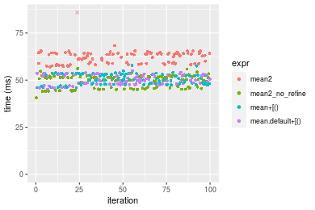


## Appendix

### Session information
```r
R version 4.1.1 Patched (2021-08-10 r80727)
Platform: x86_64-pc-linux-gnu (64-bit)
Running under: Ubuntu 18.04.5 LTS

Matrix products: default
BLAS:   /home/hb/software/R-devel/R-4-1-branch/lib/R/lib/libRblas.so
LAPACK: /home/hb/software/R-devel/R-4-1-branch/lib/R/lib/libRlapack.so

locale:
 [1] LC_CTYPE=en_US.UTF-8       LC_NUMERIC=C              
 [3] LC_TIME=en_US.UTF-8        LC_COLLATE=en_US.UTF-8    
 [5] LC_MONETARY=en_US.UTF-8    LC_MESSAGES=en_US.UTF-8   
 [7] LC_PAPER=en_US.UTF-8       LC_NAME=C                 
 [9] LC_ADDRESS=C               LC_TELEPHONE=C            
[11] LC_MEASUREMENT=en_US.UTF-8 LC_IDENTIFICATION=C       

attached base packages:
[1] stats     graphics  grDevices utils     datasets  methods   base     

other attached packages:
[1] microbenchmark_1.4-7   matrixStats_0.60.1     ggplot2_3.3.5         
[4] knitr_1.33             R.devices_2.17.0       R.utils_2.10.1        
[7] R.oo_1.24.0            R.methodsS3_1.8.1-9001 history_0.0.1-9000    

loaded via a namespace (and not attached):
 [1] Biobase_2.52.0          httr_1.4.2              splines_4.1.1          
 [4] bit64_4.0.5             network_1.17.1          assertthat_0.2.1       
 [7] highr_0.9               stats4_4.1.1            blob_1.2.2             
[10] GenomeInfoDbData_1.2.6  robustbase_0.93-8       pillar_1.6.2           
[13] RSQLite_2.2.8           lattice_0.20-44         glue_1.4.2             
[16] digest_0.6.27           XVector_0.32.0          colorspace_2.0-2       
[19] Matrix_1.3-4            XML_3.99-0.7            pkgconfig_2.0.3        
[22] zlibbioc_1.38.0         genefilter_1.74.0       purrr_0.3.4            
[25] ergm_4.1.2              xtable_1.8-4            scales_1.1.1           
[28] tibble_3.1.4            annotate_1.70.0         KEGGREST_1.32.0        
[31] farver_2.1.0            generics_0.1.0          IRanges_2.26.0         
[34] ellipsis_0.3.2          cachem_1.0.6            withr_2.4.2            
[37] BiocGenerics_0.38.0     mime_0.11               survival_3.2-13        
[40] magrittr_2.0.1          crayon_1.4.1            statnet.common_4.5.0   
[43] memoise_2.0.0           laeken_0.5.1            fansi_0.5.0            
[46] R.cache_0.15.0          MASS_7.3-54             R.rsp_0.44.0           
[49] progressr_0.8.0         tools_4.1.1             lifecycle_1.0.0        
[52] S4Vectors_0.30.0        trust_0.1-8             munsell_0.5.0          
[55] tabby_0.0.1-9001        AnnotationDbi_1.54.1    Biostrings_2.60.2      
[58] compiler_4.1.1          GenomeInfoDb_1.28.1     rlang_0.4.11           
[61] grid_4.1.1              RCurl_1.98-1.4          cwhmisc_6.6            
[64] rappdirs_0.3.3          startup_0.15.0          labeling_0.4.2         
[67] bitops_1.0-7            base64enc_0.1-3         boot_1.3-28            
[70] gtable_0.3.0            DBI_1.1.1               markdown_1.1           
[73] R6_2.5.1                lpSolveAPI_5.5.2.0-17.7 rle_0.9.2              
[76] dplyr_1.0.7             fastmap_1.1.0           bit_4.0.4              
[79] utf8_1.2.2              parallel_4.1.1          Rcpp_1.0.7             
[82] vctrs_0.3.8             png_0.1-7               DEoptimR_1.0-9         
[85] tidyselect_1.1.1        xfun_0.25               coda_0.19-4            
```
Total processing time was 2.22 mins.


### Reproducibility
To reproduce this report, do:
```r
html <- matrixStats:::benchmark('mean2')
```

[RSP]: https://cran.r-project.org/package=R.rsp
[matrixStats]: https://cran.r-project.org/package=matrixStats

[StackOverflow:colMins?]: https://stackoverflow.com/questions/13676878 "Stack Overflow: fastest way to get Min from every column in a matrix?"
[StackOverflow:colSds?]: https://stackoverflow.com/questions/17549762 "Stack Overflow: Is there such 'colsd' in R?"
[StackOverflow:rowProds?]: https://stackoverflow.com/questions/20198801/ "Stack Overflow: Row product of matrix and column sum of matrix"

---------------------------------------
Copyright Henrik Bengtsson. Last updated on 2021-08-25 19:25:30 (+0200 UTC). Powered by [RSP].

<script>
 var link = document.createElement('link');
 link.rel = 'icon';
 link.href = "data:image/png;base64,iVBORw0KGgoAAAANSUhEUgAAACAAAAAgCAMAAABEpIrGAAAA21BMVEUAAAAAAP8AAP8AAP8AAP8AAP8AAP8AAP8AAP8AAP8AAP8AAP8AAP8AAP8AAP8AAP8AAP8AAP8AAP8AAP8AAP8AAP8AAP8AAP8AAP8AAP8AAP8AAP8AAP8AAP8AAP8AAP8AAP8AAP8AAP8AAP8AAP8AAP8AAP8AAP8AAP8AAP8BAf4CAv0DA/wdHeIeHuEfH+AgIN8hId4lJdomJtknJ9g+PsE/P8BAQL9yco10dIt1dYp3d4h4eIeVlWqWlmmXl2iYmGeZmWabm2Tn5xjo6Bfp6Rb39wj4+Af//wA2M9hbAAAASXRSTlMAAQIJCgsMJSYnKD4/QGRlZmhpamtsbautrrCxuru8y8zN5ebn6Pn6+///////////////////////////////////////////LsUNcQAAAS9JREFUOI29k21XgkAQhVcFytdSMqMETU26UVqGmpaiFbL//xc1cAhhwVNf6n5i5z67M2dmYOyfJZUqlVLhkKucG7cgmUZTybDz6g0iDeq51PUr37Ds2cy2/C9NeES5puDjxuUk1xnToZsg8pfA3avHQ3lLIi7iWRrkv/OYtkScxBIMgDee0ALoyxHQBJ68JLCjOtQIMIANF7QG9G9fNnHvisCHBVMKgSJgiz7nE+AoBKrAPA3MgepvgR9TSCasrCKH0eB1wBGBFdCO+nAGjMVGPcQb5bd6mQRegN6+1axOs9nGfYcCtfi4NQosdtH7dB+txFIpXQqN1p9B/asRHToyS0jRgpV7nk4nwcq1BJ+x3Gl/v7S9Wmpp/aGquum7w3ZDyrADFYrl8vHBH+ev9AUASW1dmU4h4wAAAABJRU5ErkJggg=="
 document.getElementsByTagName('head')[0].appendChild(link);
</script>


