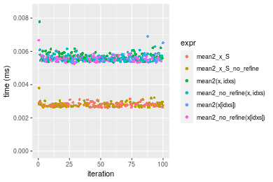
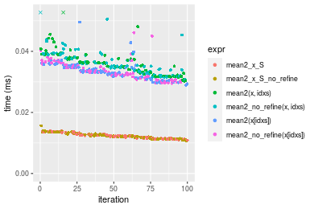
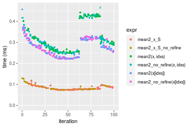
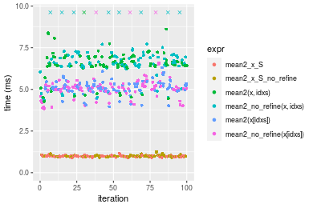
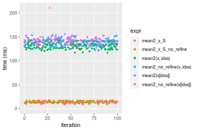
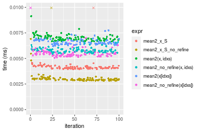
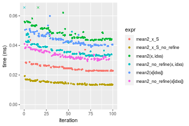
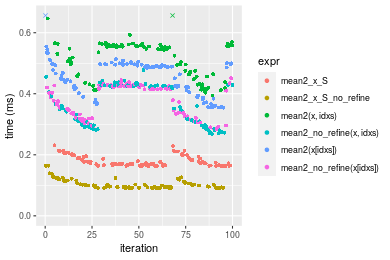
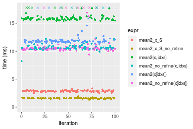
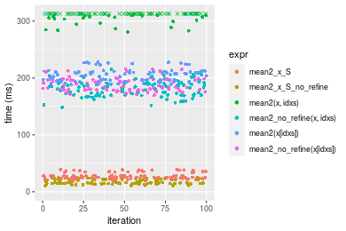

[matrixStats]: Benchmark report

---------------------------------------


# mean2() benchmarks on subsetted computation

This report benchmark the performance of mean2() on subsetted computation.


## Data type "integer"
### Data
```r
> rvector <- function(n, mode = c("logical", "double", "integer"), range = c(-100, +100), na_prob = 0) {
+     mode <- match.arg(mode)
+     if (mode == "logical") {
+         x <- sample(c(FALSE, TRUE), size = n, replace = TRUE)
+     }     else {
+         x <- runif(n, min = range[1], max = range[2])
+     }
+     storage.mode(x) <- mode
+     if (na_prob > 0) 
+         x[sample(n, size = na_prob * n)] <- NA
+     x
+ }
> rvectors <- function(scale = 10, seed = 1, ...) {
+     set.seed(seed)
+     data <- list()
+     data[[1]] <- rvector(n = scale * 100, ...)
+     data[[2]] <- rvector(n = scale * 1000, ...)
+     data[[3]] <- rvector(n = scale * 10000, ...)
+     data[[4]] <- rvector(n = scale * 1e+05, ...)
+     data[[5]] <- rvector(n = scale * 1e+06, ...)
+     names(data) <- sprintf("n = %d", sapply(data, FUN = length))
+     data
+ }
> data <- rvectors(mode = mode)
```

### Results

### n = 1000 vector


```r
> x <- data[["n = 1000"]]
> idxs <- sample.int(length(x), size = length(x) * 0.7)
> x_S <- x[idxs]
> gc()
           used  (Mb) gc trigger  (Mb)  max used  (Mb)
Ncells  5343782 285.4    8529671 455.6   8529671 455.6
Vcells 16994035 129.7   33615701 256.5 101881463 777.3
> stats <- microbenchmark(mean2_x_S = mean2(x_S, refine = TRUE), mean2_x_S_no_refine = mean2(x_S, refine = FALSE), 
+     `mean2(x, idxs)` = mean2(x, idxs = idxs, refine = TRUE), `mean2_no_refine(x, idxs)` = mean2(x, 
+         idxs = idxs, refine = FALSE), `mean2(x[idxs])` = mean2(x[idxs], refine = TRUE), `mean2_no_refine(x[idxs])` = mean2(x[idxs], 
+         refine = FALSE), unit = "ms")
```

_Table: Benchmarking of mean2_x_S(), mean2_x_S_no_refine(), mean2(x, idxs)(), mean2_no_refine(x, idxs)(), mean2(x[idxs])() and mean2_no_refine(x[idxs])() on integer+n = 1000 data. The top panel shows times in milliseconds and the bottom panel shows relative times._


|   |expr                     |      min|        lq|      mean|    median|        uq|      max|
|:--|:------------------------|--------:|---------:|---------:|---------:|---------:|--------:|
|1  |mean2_x_S                | 0.002617| 0.0026800| 0.0027879| 0.0027855| 0.0028580| 0.003139|
|2  |mean2_x_S_no_refine      | 0.002625| 0.0026925| 0.0028074| 0.0027875| 0.0028820| 0.003789|
|6  |mean2_no_refine(x[idxs]) | 0.005270| 0.0054265| 0.0069546| 0.0055245| 0.0056670| 0.145760|
|5  |mean2(x[idxs])           | 0.005305| 0.0054455| 0.0055669| 0.0055265| 0.0056240| 0.006907|
|4  |mean2_no_refine(x, idxs) | 0.005361| 0.0054705| 0.0056265| 0.0055845| 0.0057365| 0.006292|
|3  |mean2(x, idxs)           | 0.005354| 0.0055135| 0.0056912| 0.0056400| 0.0058250| 0.007782|


|   |expr                     |      min|       lq|     mean|   median|       uq|       max|
|:--|:------------------------|--------:|--------:|--------:|--------:|--------:|---------:|
|1  |mean2_x_S                | 1.000000| 1.000000| 1.000000| 1.000000| 1.000000|  1.000000|
|2  |mean2_x_S_no_refine      | 1.003057| 1.004664| 1.006962| 1.000718| 1.008398|  1.207072|
|6  |mean2_no_refine(x[idxs]) | 2.013756| 2.024813| 2.494516| 1.983306| 1.982855| 46.435170|
|5  |mean2(x[idxs])           | 2.027130| 2.031903| 1.996786| 1.984024| 1.967810|  2.200382|
|4  |mean2_no_refine(x, idxs) | 2.048529| 2.041231| 2.018142| 2.004847| 2.007173|  2.004460|
|3  |mean2(x, idxs)           | 2.045854| 2.057276| 2.041364| 2.024771| 2.038139|  2.479134|

_Figure: Benchmarking of mean2_x_S(), mean2_x_S_no_refine(), mean2(x, idxs)(), mean2_no_refine(x, idxs)(), mean2(x[idxs])() and mean2_no_refine(x[idxs])() on integer+n = 1000 data.  Outliers are displayed as crosses.  Times are in milliseconds._



### n = 10000 vector


```r
> x <- data[["n = 10000"]]
> idxs <- sample.int(length(x), size = length(x) * 0.7)
> x_S <- x[idxs]
> gc()
           used  (Mb) gc trigger  (Mb)  max used  (Mb)
Ncells  5331508 284.8    8529671 455.6   8529671 455.6
Vcells 15833074 120.8   33615701 256.5 101881463 777.3
> stats <- microbenchmark(mean2_x_S = mean2(x_S, refine = TRUE), mean2_x_S_no_refine = mean2(x_S, refine = FALSE), 
+     `mean2(x, idxs)` = mean2(x, idxs = idxs, refine = TRUE), `mean2_no_refine(x, idxs)` = mean2(x, 
+         idxs = idxs, refine = FALSE), `mean2(x[idxs])` = mean2(x[idxs], refine = TRUE), `mean2_no_refine(x[idxs])` = mean2(x[idxs], 
+         refine = FALSE), unit = "ms")
```

_Table: Benchmarking of mean2_x_S(), mean2_x_S_no_refine(), mean2(x, idxs)(), mean2_no_refine(x, idxs)(), mean2(x[idxs])() and mean2_no_refine(x[idxs])() on integer+n = 10000 data. The top panel shows times in milliseconds and the bottom panel shows relative times._


|   |expr                     |      min|        lq|      mean|    median|        uq|      max|
|:--|:------------------------|--------:|---------:|---------:|---------:|---------:|--------:|
|1  |mean2_x_S                | 0.010794| 0.0114820| 0.0122459| 0.0122445| 0.0127205| 0.013998|
|2  |mean2_x_S_no_refine      | 0.010723| 0.0114335| 0.0123639| 0.0123120| 0.0130385| 0.015634|
|6  |mean2_no_refine(x[idxs]) | 0.029503| 0.0311895| 0.0333866| 0.0328465| 0.0348800| 0.046098|
|5  |mean2(x[idxs])           | 0.028908| 0.0317200| 0.0335386| 0.0335125| 0.0349180| 0.049548|
|4  |mean2_no_refine(x, idxs) | 0.030674| 0.0328510| 0.0362676| 0.0351895| 0.0389210| 0.070046|
|3  |mean2(x, idxs)           | 0.030257| 0.0322325| 0.0359282| 0.0357235| 0.0380070| 0.055797|


|   |expr                     |       min|       lq|     mean|   median|       uq|      max|
|:--|:------------------------|---------:|--------:|--------:|--------:|--------:|--------:|
|1  |mean2_x_S                | 1.0000000| 1.000000| 1.000000| 1.000000| 1.000000| 1.000000|
|2  |mean2_x_S_no_refine      | 0.9934223| 0.995776| 1.009643| 1.005513| 1.024999| 1.116874|
|6  |mean2_no_refine(x[idxs]) | 2.7332777| 2.716382| 2.726360| 2.682551| 2.742031| 3.293185|
|5  |mean2(x[idxs])           | 2.6781545| 2.762585| 2.738773| 2.736943| 2.745018| 3.539649|
|4  |mean2_no_refine(x, idxs) | 2.8417639| 2.861087| 2.961620| 2.873903| 3.059707| 5.004001|
|3  |mean2(x, idxs)           | 2.8031314| 2.807220| 2.933910| 2.917514| 2.987854| 3.986069|

_Figure: Benchmarking of mean2_x_S(), mean2_x_S_no_refine(), mean2(x, idxs)(), mean2_no_refine(x, idxs)(), mean2(x[idxs])() and mean2_no_refine(x[idxs])() on integer+n = 10000 data.  Outliers are displayed as crosses.  Times are in milliseconds._



### n = 100000 vector


```r
> x <- data[["n = 100000"]]
> idxs <- sample.int(length(x), size = length(x) * 0.7)
> x_S <- x[idxs]
> gc()
           used  (Mb) gc trigger  (Mb)  max used  (Mb)
Ncells  5331607 284.8    8529671 455.6   8529671 455.6
Vcells 15896652 121.3   33615701 256.5 101881463 777.3
> stats <- microbenchmark(mean2_x_S = mean2(x_S, refine = TRUE), mean2_x_S_no_refine = mean2(x_S, refine = FALSE), 
+     `mean2(x, idxs)` = mean2(x, idxs = idxs, refine = TRUE), `mean2_no_refine(x, idxs)` = mean2(x, 
+         idxs = idxs, refine = FALSE), `mean2(x[idxs])` = mean2(x[idxs], refine = TRUE), `mean2_no_refine(x[idxs])` = mean2(x[idxs], 
+         refine = FALSE), unit = "ms")
```

_Table: Benchmarking of mean2_x_S(), mean2_x_S_no_refine(), mean2(x, idxs)(), mean2_no_refine(x, idxs)(), mean2(x[idxs])() and mean2_no_refine(x[idxs])() on integer+n = 100000 data. The top panel shows times in milliseconds and the bottom panel shows relative times._


|   |expr                     |      min|        lq|      mean|    median|        uq|      max|
|:--|:------------------------|--------:|---------:|---------:|---------:|---------:|--------:|
|2  |mean2_x_S_no_refine      | 0.073527| 0.0756660| 0.0851851| 0.0783055| 0.0925870| 0.129134|
|1  |mean2_x_S                | 0.073509| 0.0756385| 0.0837340| 0.0794795| 0.0897670| 0.117633|
|6  |mean2_no_refine(x[idxs]) | 0.221539| 0.2335015| 0.2773580| 0.2771705| 0.3177650| 0.374438|
|5  |mean2(x[idxs])           | 0.221734| 0.2386475| 0.2804623| 0.2785185| 0.3143685| 0.457560|
|3  |mean2(x, idxs)           | 0.249248| 0.2649270| 0.3884439| 0.2992800| 0.4184140| 6.716517|
|4  |mean2_no_refine(x, idxs) | 0.245279| 0.2639460| 0.3185506| 0.3024775| 0.3546150| 0.434245|


|   |expr                     |       min|        lq|      mean|   median|        uq|        max|
|:--|:------------------------|---------:|---------:|---------:|--------:|---------:|----------:|
|2  |mean2_x_S_no_refine      | 1.0000000| 1.0000000| 1.0000000| 1.000000| 1.0000000|  1.0000000|
|1  |mean2_x_S                | 0.9997552| 0.9996366| 0.9829651| 1.014993| 0.9695422|  0.9109375|
|6  |mean2_no_refine(x[idxs]) | 3.0130292| 3.0859501| 3.2559449| 3.539604| 3.4320693|  2.8996082|
|5  |mean2(x[idxs])           | 3.0156813| 3.1539595| 3.2923877| 3.556819| 3.3953849|  3.5432961|
|3  |mean2(x, idxs)           | 3.3898840| 3.5012687| 4.5599985| 3.821954| 4.5191442| 52.0119953|
|4  |mean2_no_refine(x, idxs) | 3.3359038| 3.4883039| 3.7395113| 3.862787| 3.8300733|  3.3627472|

_Figure: Benchmarking of mean2_x_S(), mean2_x_S_no_refine(), mean2(x, idxs)(), mean2_no_refine(x, idxs)(), mean2(x[idxs])() and mean2_no_refine(x[idxs])() on integer+n = 100000 data.  Outliers are displayed as crosses.  Times are in milliseconds._



### n = 1000000 vector


```r
> x <- data[["n = 1000000"]]
> idxs <- sample.int(length(x), size = length(x) * 0.7)
> x_S <- x[idxs]
> gc()
           used  (Mb) gc trigger  (Mb)  max used  (Mb)
Ncells  5331706 284.8    8529671 455.6   8529671 455.6
Vcells 16526934 126.1   33615701 256.5 101881463 777.3
> stats <- microbenchmark(mean2_x_S = mean2(x_S, refine = TRUE), mean2_x_S_no_refine = mean2(x_S, refine = FALSE), 
+     `mean2(x, idxs)` = mean2(x, idxs = idxs, refine = TRUE), `mean2_no_refine(x, idxs)` = mean2(x, 
+         idxs = idxs, refine = FALSE), `mean2(x[idxs])` = mean2(x[idxs], refine = TRUE), `mean2_no_refine(x[idxs])` = mean2(x[idxs], 
+         refine = FALSE), unit = "ms")
```

_Table: Benchmarking of mean2_x_S(), mean2_x_S_no_refine(), mean2(x, idxs)(), mean2_no_refine(x, idxs)(), mean2(x[idxs])() and mean2_no_refine(x[idxs])() on integer+n = 1000000 data. The top panel shows times in milliseconds and the bottom panel shows relative times._


|   |expr                     |      min|       lq|      mean|    median|       uq|       max|
|:--|:------------------------|--------:|--------:|---------:|---------:|--------:|---------:|
|1  |mean2_x_S                | 0.888980| 0.970562| 0.9870926| 0.9813695| 1.004870|  1.153251|
|2  |mean2_x_S_no_refine      | 0.908760| 0.970577| 0.9978088| 0.9825275| 1.019047|  1.260782|
|6  |mean2_no_refine(x[idxs]) | 3.841791| 4.892468| 5.3651200| 5.0987125| 5.278500| 16.702025|
|5  |mean2(x[idxs])           | 3.957112| 4.925172| 5.1072061| 5.1187365| 5.339589|  6.302222|
|3  |mean2(x, idxs)           | 4.279667| 6.379384| 6.5634663| 6.5185200| 6.940049| 16.112859|
|4  |mean2_no_refine(x, idxs) | 4.347253| 6.408241| 7.2835367| 6.6077075| 7.058704| 17.249946|


|   |expr                     |      min|       lq|     mean|   median|       uq|       max|
|:--|:------------------------|--------:|--------:|--------:|--------:|--------:|---------:|
|1  |mean2_x_S                | 1.000000| 1.000000| 1.000000| 1.000000| 1.000000|  1.000000|
|2  |mean2_x_S_no_refine      | 1.022250| 1.000015| 1.010856| 1.001180| 1.014108|  1.093242|
|6  |mean2_no_refine(x[idxs]) | 4.321572| 5.040860| 5.435275| 5.195507| 5.252919| 14.482558|
|5  |mean2(x[idxs])           | 4.451295| 5.074556| 5.173989| 5.215911| 5.313711|  5.464744|
|3  |mean2(x, idxs)           | 4.814132| 6.572876| 6.649292| 6.642269| 6.906415| 13.971684|
|4  |mean2_no_refine(x, idxs) | 4.890158| 6.602609| 7.378778| 6.733149| 7.024495| 14.957668|

_Figure: Benchmarking of mean2_x_S(), mean2_x_S_no_refine(), mean2(x, idxs)(), mean2_no_refine(x, idxs)(), mean2(x[idxs])() and mean2_no_refine(x[idxs])() on integer+n = 1000000 data.  Outliers are displayed as crosses.  Times are in milliseconds._



### n = 10000000 vector


```r
> x <- data[["n = 10000000"]]
> idxs <- sample.int(length(x), size = length(x) * 0.7)
> x_S <- x[idxs]
> gc()
           used  (Mb) gc trigger  (Mb)  max used  (Mb)
Ncells  5331805 284.8    8529671 455.6   8529671 455.6
Vcells 22827611 174.2   40418841 308.4 101881463 777.3
> stats <- microbenchmark(mean2_x_S = mean2(x_S, refine = TRUE), mean2_x_S_no_refine = mean2(x_S, refine = FALSE), 
+     `mean2(x, idxs)` = mean2(x, idxs = idxs, refine = TRUE), `mean2_no_refine(x, idxs)` = mean2(x, 
+         idxs = idxs, refine = FALSE), `mean2(x[idxs])` = mean2(x[idxs], refine = TRUE), `mean2_no_refine(x[idxs])` = mean2(x[idxs], 
+         refine = FALSE), unit = "ms")
```

_Table: Benchmarking of mean2_x_S(), mean2_x_S_no_refine(), mean2(x, idxs)(), mean2_no_refine(x, idxs)(), mean2(x[idxs])() and mean2_no_refine(x[idxs])() on integer+n = 10000000 data. The top panel shows times in milliseconds and the bottom panel shows relative times._


|   |expr                     |        min|        lq|      mean|    median|        uq|       max|
|:--|:------------------------|----------:|---------:|---------:|---------:|---------:|---------:|
|1  |mean2_x_S                |   8.963665|  12.25291|  13.42115|  13.53164|  14.27329|  17.88091|
|2  |mean2_x_S_no_refine      |   9.692483|  12.69796|  13.90028|  13.56586|  16.41305|  17.10707|
|3  |mean2(x, idxs)           | 116.771360| 126.50532| 132.13719| 133.08509| 137.16898| 144.61707|
|4  |mean2_no_refine(x, idxs) | 117.632574| 128.45040| 133.48622| 133.49306| 139.71935| 147.40210|
|6  |mean2_no_refine(x[idxs]) | 124.669728| 135.14550| 143.87622| 141.00332| 144.38891| 523.71038|
|5  |mean2(x[idxs])           | 124.945997| 136.12857| 140.59447| 141.01150| 144.73820| 153.55588|


|   |expr                     |       min|        lq|      mean|    median|        uq|        max|
|:--|:------------------------|---------:|---------:|---------:|---------:|---------:|----------:|
|1  |mean2_x_S                |  1.000000|  1.000000|  1.000000|  1.000000|  1.000000|  1.0000000|
|2  |mean2_x_S_no_refine      |  1.081308|  1.036323|  1.035700|  1.002529|  1.149913|  0.9567224|
|3  |mean2(x, idxs)           | 13.027189| 10.324515|  9.845444|  9.835104|  9.610185|  8.0877901|
|4  |mean2_no_refine(x, idxs) | 13.123268| 10.483260|  9.945958|  9.865253|  9.788866|  8.2435443|
|6  |mean2_no_refine(x[idxs]) | 13.908343| 11.029669| 10.720110| 10.420268| 10.116020| 29.2887940|
|5  |mean2(x[idxs])           | 13.939164| 11.109901| 10.475589| 10.420872| 10.140491|  8.5876980|

_Figure: Benchmarking of mean2_x_S(), mean2_x_S_no_refine(), mean2(x, idxs)(), mean2_no_refine(x, idxs)(), mean2(x[idxs])() and mean2_no_refine(x[idxs])() on integer+n = 10000000 data.  Outliers are displayed as crosses.  Times are in milliseconds._




## Data type "double"
### Data
```r
> rvector <- function(n, mode = c("logical", "double", "integer"), range = c(-100, +100), na_prob = 0) {
+     mode <- match.arg(mode)
+     if (mode == "logical") {
+         x <- sample(c(FALSE, TRUE), size = n, replace = TRUE)
+     }     else {
+         x <- runif(n, min = range[1], max = range[2])
+     }
+     storage.mode(x) <- mode
+     if (na_prob > 0) 
+         x[sample(n, size = na_prob * n)] <- NA
+     x
+ }
> rvectors <- function(scale = 10, seed = 1, ...) {
+     set.seed(seed)
+     data <- list()
+     data[[1]] <- rvector(n = scale * 100, ...)
+     data[[2]] <- rvector(n = scale * 1000, ...)
+     data[[3]] <- rvector(n = scale * 10000, ...)
+     data[[4]] <- rvector(n = scale * 1e+05, ...)
+     data[[5]] <- rvector(n = scale * 1e+06, ...)
+     names(data) <- sprintf("n = %d", sapply(data, FUN = length))
+     data
+ }
> data <- rvectors(mode = mode)
```

### Results

### n = 1000 vector


```r
> x <- data[["n = 1000"]]
> idxs <- sample.int(length(x), size = length(x) * 0.7)
> x_S <- x[idxs]
> gc()
           used  (Mb) gc trigger  (Mb)  max used  (Mb)
Ncells  5331907 284.8    8529671 455.6   8529671 455.6
Vcells 21384601 163.2   40418841 308.4 101881463 777.3
> stats <- microbenchmark(mean2_x_S = mean2(x_S, refine = TRUE), mean2_x_S_no_refine = mean2(x_S, refine = FALSE), 
+     `mean2(x, idxs)` = mean2(x, idxs = idxs, refine = TRUE), `mean2_no_refine(x, idxs)` = mean2(x, 
+         idxs = idxs, refine = FALSE), `mean2(x[idxs])` = mean2(x[idxs], refine = TRUE), `mean2_no_refine(x[idxs])` = mean2(x[idxs], 
+         refine = FALSE), unit = "ms")
```

_Table: Benchmarking of mean2_x_S(), mean2_x_S_no_refine(), mean2(x, idxs)(), mean2_no_refine(x, idxs)(), mean2(x[idxs])() and mean2_no_refine(x[idxs])() on double+n = 1000 data. The top panel shows times in milliseconds and the bottom panel shows relative times._


|   |expr                     |      min|        lq|      mean|    median|        uq|      max|
|:--|:------------------------|--------:|---------:|---------:|---------:|---------:|--------:|
|2  |mean2_x_S_no_refine      | 0.002801| 0.0028840| 0.0032010| 0.0029540| 0.0030335| 0.017288|
|1  |mean2_x_S                | 0.003950| 0.0040340| 0.0041943| 0.0040870| 0.0042330| 0.010007|
|6  |mean2_no_refine(x[idxs]) | 0.005062| 0.0053085| 0.0057585| 0.0054570| 0.0056485| 0.023367|
|4  |mean2_no_refine(x, idxs) | 0.005434| 0.0056365| 0.0058133| 0.0057765| 0.0059000| 0.006759|
|5  |mean2(x[idxs])           | 0.006200| 0.0064090| 0.0066228| 0.0065635| 0.0067735| 0.007747|
|3  |mean2(x, idxs)           | 0.006665| 0.0068155| 0.0070322| 0.0069650| 0.0071795| 0.009142|


|   |expr                     |      min|       lq|     mean|   median|       uq|       max|
|:--|:------------------------|--------:|--------:|--------:|--------:|--------:|---------:|
|2  |mean2_x_S_no_refine      | 1.000000| 1.000000| 1.000000| 1.000000| 1.000000| 1.0000000|
|1  |mean2_x_S                | 1.410211| 1.398752| 1.310285| 1.383548| 1.395418| 0.5788408|
|6  |mean2_no_refine(x[idxs]) | 1.807212| 1.840673| 1.798955| 1.847326| 1.862040| 1.3516312|
|4  |mean2_no_refine(x, idxs) | 1.940021| 1.954404| 1.816084| 1.955484| 1.944948| 0.3909648|
|5  |mean2(x[idxs])           | 2.213495| 2.222261| 2.068971| 2.221903| 2.232899| 0.4481143|
|3  |mean2(x, idxs)           | 2.379507| 2.363211| 2.196858| 2.357820| 2.366738| 0.5288061|

_Figure: Benchmarking of mean2_x_S(), mean2_x_S_no_refine(), mean2(x, idxs)(), mean2_no_refine(x, idxs)(), mean2(x[idxs])() and mean2_no_refine(x[idxs])() on double+n = 1000 data.  Outliers are displayed as crosses.  Times are in milliseconds._



### n = 10000 vector


```r
> x <- data[["n = 10000"]]
> idxs <- sample.int(length(x), size = length(x) * 0.7)
> x_S <- x[idxs]
> gc()
           used  (Mb) gc trigger  (Mb)  max used  (Mb)
Ncells  5332003 284.8    8529671 455.6   8529671 455.6
Vcells 21394560 163.3   40418841 308.4 101881463 777.3
> stats <- microbenchmark(mean2_x_S = mean2(x_S, refine = TRUE), mean2_x_S_no_refine = mean2(x_S, refine = FALSE), 
+     `mean2(x, idxs)` = mean2(x, idxs = idxs, refine = TRUE), `mean2_no_refine(x, idxs)` = mean2(x, 
+         idxs = idxs, refine = FALSE), `mean2(x[idxs])` = mean2(x[idxs], refine = TRUE), `mean2_no_refine(x[idxs])` = mean2(x[idxs], 
+         refine = FALSE), unit = "ms")
```

_Table: Benchmarking of mean2_x_S(), mean2_x_S_no_refine(), mean2(x, idxs)(), mean2_no_refine(x, idxs)(), mean2(x[idxs])() and mean2_no_refine(x[idxs])() on double+n = 10000 data. The top panel shows times in milliseconds and the bottom panel shows relative times._


|   |expr                     |      min|        lq|      mean|    median|        uq|      max|
|:--|:------------------------|--------:|---------:|---------:|---------:|---------:|--------:|
|2  |mean2_x_S_no_refine      | 0.013189| 0.0136025| 0.0146243| 0.0143285| 0.0153315| 0.019333|
|1  |mean2_x_S                | 0.022512| 0.0229240| 0.0248455| 0.0244275| 0.0261100| 0.043589|
|6  |mean2_no_refine(x[idxs]) | 0.029430| 0.0310335| 0.0334698| 0.0323710| 0.0358140| 0.046852|
|4  |mean2_no_refine(x, idxs) | 0.032794| 0.0334905| 0.0372509| 0.0355420| 0.0391355| 0.076246|
|5  |mean2(x[idxs])           | 0.038999| 0.0409790| 0.0440330| 0.0437330| 0.0466370| 0.059871|
|3  |mean2(x, idxs)           | 0.043297| 0.0444420| 0.0484117| 0.0470765| 0.0514175| 0.067115|


|   |expr                     |      min|       lq|     mean|   median|       uq|      max|
|:--|:------------------------|--------:|--------:|--------:|--------:|--------:|--------:|
|2  |mean2_x_S_no_refine      | 1.000000| 1.000000| 1.000000| 1.000000| 1.000000| 1.000000|
|1  |mean2_x_S                | 1.706877| 1.685278| 1.698924| 1.704819| 1.703030| 2.254642|
|6  |mean2_no_refine(x[idxs]) | 2.231405| 2.281456| 2.288645| 2.259204| 2.335975| 2.423421|
|4  |mean2_no_refine(x, idxs) | 2.486466| 2.462084| 2.547199| 2.480511| 2.552620| 3.943827|
|5  |mean2(x[idxs])           | 2.956934| 3.012608| 3.010952| 3.052169| 3.041907| 3.096829|
|3  |mean2(x, idxs)           | 3.282811| 3.267193| 3.310364| 3.285515| 3.353716| 3.471525|

_Figure: Benchmarking of mean2_x_S(), mean2_x_S_no_refine(), mean2(x, idxs)(), mean2_no_refine(x, idxs)(), mean2(x[idxs])() and mean2_no_refine(x[idxs])() on double+n = 10000 data.  Outliers are displayed as crosses.  Times are in milliseconds._



### n = 100000 vector


```r
> x <- data[["n = 100000"]]
> idxs <- sample.int(length(x), size = length(x) * 0.7)
> x_S <- x[idxs]
> gc()
           used  (Mb) gc trigger  (Mb)  max used  (Mb)
Ncells  5332102 284.8    8529671 455.6   8529671 455.6
Vcells 21489668 164.0   40418841 308.4 101881463 777.3
> stats <- microbenchmark(mean2_x_S = mean2(x_S, refine = TRUE), mean2_x_S_no_refine = mean2(x_S, refine = FALSE), 
+     `mean2(x, idxs)` = mean2(x, idxs = idxs, refine = TRUE), `mean2_no_refine(x, idxs)` = mean2(x, 
+         idxs = idxs, refine = FALSE), `mean2(x[idxs])` = mean2(x[idxs], refine = TRUE), `mean2_no_refine(x[idxs])` = mean2(x[idxs], 
+         refine = FALSE), unit = "ms")
```

_Table: Benchmarking of mean2_x_S(), mean2_x_S_no_refine(), mean2(x, idxs)(), mean2_no_refine(x, idxs)(), mean2(x[idxs])() and mean2_no_refine(x[idxs])() on double+n = 100000 data. The top panel shows times in milliseconds and the bottom panel shows relative times._


|   |expr                     |      min|        lq|      mean|    median|        uq|       max|
|:--|:------------------------|--------:|---------:|---------:|---------:|---------:|---------:|
|2  |mean2_x_S_no_refine      | 0.091491| 0.0919595| 0.1028826| 0.0960520| 0.1081820|  0.164275|
|1  |mean2_x_S                | 0.163594| 0.1655625| 0.1798339| 0.1725650| 0.1915510|  0.231438|
|4  |mean2_no_refine(x, idxs) | 0.269157| 0.2968530| 0.3619284| 0.3521040| 0.4270280|  0.478045|
|6  |mean2_no_refine(x[idxs]) | 0.284739| 0.3253185| 0.3742937| 0.3837795| 0.4244205|  0.451456|
|5  |mean2(x[idxs])           | 0.354564| 0.4028905| 0.4526132| 0.4672430| 0.4956540|  0.749004|
|3  |mean2(x, idxs)           | 0.393542| 0.4639200| 0.6129403| 0.5469265| 0.5587500| 10.399488|


|   |expr                     |      min|       lq|     mean|   median|       uq|       max|
|:--|:------------------------|--------:|--------:|--------:|--------:|--------:|---------:|
|2  |mean2_x_S_no_refine      | 1.000000| 1.000000| 1.000000| 1.000000| 1.000000|  1.000000|
|1  |mean2_x_S                | 1.788088| 1.800385| 1.747953| 1.796579| 1.770636|  1.408845|
|4  |mean2_no_refine(x, idxs) | 2.941896| 3.228084| 3.517878| 3.665764| 3.947311|  2.910029|
|6  |mean2_no_refine(x[idxs]) | 3.112208| 3.537628| 3.638066| 3.995539| 3.923208|  2.748172|
|5  |mean2(x[idxs])           | 3.875398| 4.381173| 4.399318| 4.864480| 4.581668|  4.559452|
|3  |mean2(x, idxs)           | 4.301429| 5.044829| 5.957668| 5.694067| 5.164907| 63.305360|

_Figure: Benchmarking of mean2_x_S(), mean2_x_S_no_refine(), mean2(x, idxs)(), mean2_no_refine(x, idxs)(), mean2(x[idxs])() and mean2_no_refine(x[idxs])() on double+n = 100000 data.  Outliers are displayed as crosses.  Times are in milliseconds._



### n = 1000000 vector


```r
> x <- data[["n = 1000000"]]
> idxs <- sample.int(length(x), size = length(x) * 0.7)
> x_S <- x[idxs]
> gc()
           used  (Mb) gc trigger  (Mb)  max used  (Mb)
Ncells  5332201 284.8    8529671 455.6   8529671 455.6
Vcells 22434735 171.2   40418841 308.4 101881463 777.3
> stats <- microbenchmark(mean2_x_S = mean2(x_S, refine = TRUE), mean2_x_S_no_refine = mean2(x_S, refine = FALSE), 
+     `mean2(x, idxs)` = mean2(x, idxs = idxs, refine = TRUE), `mean2_no_refine(x, idxs)` = mean2(x, 
+         idxs = idxs, refine = FALSE), `mean2(x[idxs])` = mean2(x[idxs], refine = TRUE), `mean2_no_refine(x[idxs])` = mean2(x[idxs], 
+         refine = FALSE), unit = "ms")
```

_Table: Benchmarking of mean2_x_S(), mean2_x_S_no_refine(), mean2(x, idxs)(), mean2_no_refine(x, idxs)(), mean2(x[idxs])() and mean2_no_refine(x[idxs])() on double+n = 1000000 data. The top panel shows times in milliseconds and the bottom panel shows relative times._


|   |expr                     |       min|        lq|      mean|    median|        uq|       max|
|:--|:------------------------|---------:|---------:|---------:|---------:|---------:|---------:|
|2  |mean2_x_S_no_refine      |  1.343081|  1.549252|  1.578564|  1.576547|  1.632972|  1.918255|
|1  |mean2_x_S                |  2.515176|  2.804453|  2.870944|  2.876253|  2.955961|  3.323344|
|6  |mean2_no_refine(x[idxs]) |  9.380240| 10.324032| 11.127897| 10.477827| 10.614484| 21.379512|
|4  |mean2_no_refine(x, idxs) |  8.200189| 10.458063| 10.982563| 10.562641| 10.846580| 29.819252|
|5  |mean2(x[idxs])           | 11.320825| 11.651995| 12.412661| 11.775655| 11.939690| 22.736827|
|3  |mean2(x, idxs)           | 15.378069| 15.684134| 16.370287| 15.831978| 16.128079| 27.183240|


|   |expr                     |       min|        lq|      mean|    median|       uq|       max|
|:--|:------------------------|---------:|---------:|---------:|---------:|--------:|---------:|
|2  |mean2_x_S_no_refine      |  1.000000|  1.000000|  1.000000|  1.000000| 1.000000|  1.000000|
|1  |mean2_x_S                |  1.872691|  1.810198|  1.818706|  1.824401| 1.810172|  1.732483|
|6  |mean2_no_refine(x[idxs]) |  6.984121|  6.663882|  7.049381|  6.646061| 6.500099| 11.145292|
|4  |mean2_no_refine(x, idxs) |  6.105506|  6.750395|  6.957314|  6.699858| 6.642231| 15.544989|
|5  |mean2(x[idxs])           |  8.428997|  7.521046|  7.863263|  7.469270| 7.311630| 11.852870|
|3  |mean2(x, idxs)           | 11.449845| 10.123682| 10.370368| 10.042186| 9.876516| 14.170817|

_Figure: Benchmarking of mean2_x_S(), mean2_x_S_no_refine(), mean2(x, idxs)(), mean2_no_refine(x, idxs)(), mean2(x[idxs])() and mean2_no_refine(x[idxs])() on double+n = 1000000 data.  Outliers are displayed as crosses.  Times are in milliseconds._



### n = 10000000 vector


```r
> x <- data[["n = 10000000"]]
> idxs <- sample.int(length(x), size = length(x) * 0.7)
> x_S <- x[idxs]
> gc()
           used  (Mb) gc trigger  (Mb)  max used  (Mb)
Ncells  5332294 284.8    8529671 455.6   8529671 455.6
Vcells 31885445 243.3   48582609 370.7 101881463 777.3
> stats <- microbenchmark(mean2_x_S = mean2(x_S, refine = TRUE), mean2_x_S_no_refine = mean2(x_S, refine = FALSE), 
+     `mean2(x, idxs)` = mean2(x, idxs = idxs, refine = TRUE), `mean2_no_refine(x, idxs)` = mean2(x, 
+         idxs = idxs, refine = FALSE), `mean2(x[idxs])` = mean2(x[idxs], refine = TRUE), `mean2_no_refine(x[idxs])` = mean2(x[idxs], 
+         refine = FALSE), unit = "ms")
```

_Table: Benchmarking of mean2_x_S(), mean2_x_S_no_refine(), mean2(x, idxs)(), mean2_no_refine(x, idxs)(), mean2(x[idxs])() and mean2_no_refine(x[idxs])() on double+n = 10000000 data. The top panel shows times in milliseconds and the bottom panel shows relative times._


|   |expr                     |       min|        lq|      mean|    median|        uq|       max|
|:--|:------------------------|---------:|---------:|---------:|---------:|---------:|---------:|
|2  |mean2_x_S_no_refine      |  10.88876|  14.49473|  17.07083|  15.97592|  21.50374|  24.61304|
|1  |mean2_x_S                |  18.75323|  23.55524|  27.70298|  25.66344|  31.49576|  39.18378|
|4  |mean2_no_refine(x, idxs) | 148.64750| 170.24358| 184.80863| 183.40903| 190.31554| 558.94832|
|6  |mean2_no_refine(x[idxs]) | 169.73511| 179.18399| 188.45000| 184.48299| 196.81973| 215.57362|
|5  |mean2(x[idxs])           | 178.75786| 195.58341| 208.37115| 206.84077| 210.96170| 572.83587|
|3  |mean2(x, idxs)           | 281.16566| 311.13864| 321.84314| 322.05485| 334.64647| 357.05475|


|   |expr                     |       min|       lq|      mean|    median|        uq|       max|
|:--|:------------------------|---------:|--------:|---------:|---------:|---------:|---------:|
|2  |mean2_x_S_no_refine      |  1.000000|  1.00000|  1.000000|  1.000000|  1.000000|  1.000000|
|1  |mean2_x_S                |  1.722256|  1.62509|  1.622826|  1.606383|  1.464665|  1.591993|
|4  |mean2_no_refine(x, idxs) | 13.651464| 11.74521| 10.825991| 11.480344|  8.850348| 22.709440|
|6  |mean2_no_refine(x[idxs]) | 15.588104| 12.36201| 11.039300| 11.547568|  9.152815|  8.758513|
|5  |mean2(x[idxs])           | 16.416734| 13.49342| 12.206270| 12.947036|  9.810467| 23.273675|
|3  |mean2(x, idxs)           | 25.821644| 21.46564| 18.853399| 20.158771| 15.562248| 14.506731|

_Figure: Benchmarking of mean2_x_S(), mean2_x_S_no_refine(), mean2(x, idxs)(), mean2_no_refine(x, idxs)(), mean2(x[idxs])() and mean2_no_refine(x[idxs])() on double+n = 10000000 data.  Outliers are displayed as crosses.  Times are in milliseconds._




## Appendix

### Session information
```r
R version 4.1.1 Patched (2021-08-10 r80727)
Platform: x86_64-pc-linux-gnu (64-bit)
Running under: Ubuntu 18.04.5 LTS

Matrix products: default
BLAS:   /home/hb/software/R-devel/R-4-1-branch/lib/R/lib/libRblas.so
LAPACK: /home/hb/software/R-devel/R-4-1-branch/lib/R/lib/libRlapack.so

locale:
 [1] LC_CTYPE=en_US.UTF-8       LC_NUMERIC=C              
 [3] LC_TIME=en_US.UTF-8        LC_COLLATE=en_US.UTF-8    
 [5] LC_MONETARY=en_US.UTF-8    LC_MESSAGES=en_US.UTF-8   
 [7] LC_PAPER=en_US.UTF-8       LC_NAME=C                 
 [9] LC_ADDRESS=C               LC_TELEPHONE=C            
[11] LC_MEASUREMENT=en_US.UTF-8 LC_IDENTIFICATION=C       

attached base packages:
[1] stats     graphics  grDevices utils     datasets  methods   base     

other attached packages:
[1] microbenchmark_1.4-7   matrixStats_0.60.1     ggplot2_3.3.5         
[4] knitr_1.33             R.devices_2.17.0       R.utils_2.10.1        
[7] R.oo_1.24.0            R.methodsS3_1.8.1-9001 history_0.0.1-9000    

loaded via a namespace (and not attached):
 [1] Biobase_2.52.0          httr_1.4.2              splines_4.1.1          
 [4] bit64_4.0.5             network_1.17.1          assertthat_0.2.1       
 [7] highr_0.9               stats4_4.1.1            blob_1.2.2             
[10] GenomeInfoDbData_1.2.6  robustbase_0.93-8       pillar_1.6.2           
[13] RSQLite_2.2.8           lattice_0.20-44         glue_1.4.2             
[16] digest_0.6.27           XVector_0.32.0          colorspace_2.0-2       
[19] Matrix_1.3-4            XML_3.99-0.7            pkgconfig_2.0.3        
[22] zlibbioc_1.38.0         genefilter_1.74.0       purrr_0.3.4            
[25] ergm_4.1.2              xtable_1.8-4            scales_1.1.1           
[28] tibble_3.1.4            annotate_1.70.0         KEGGREST_1.32.0        
[31] farver_2.1.0            generics_0.1.0          IRanges_2.26.0         
[34] ellipsis_0.3.2          cachem_1.0.6            withr_2.4.2            
[37] BiocGenerics_0.38.0     mime_0.11               survival_3.2-13        
[40] magrittr_2.0.1          crayon_1.4.1            statnet.common_4.5.0   
[43] memoise_2.0.0           laeken_0.5.1            fansi_0.5.0            
[46] R.cache_0.15.0          MASS_7.3-54             R.rsp_0.44.0           
[49] progressr_0.8.0         tools_4.1.1             lifecycle_1.0.0        
[52] S4Vectors_0.30.0        trust_0.1-8             munsell_0.5.0          
[55] tabby_0.0.1-9001        AnnotationDbi_1.54.1    Biostrings_2.60.2      
[58] compiler_4.1.1          GenomeInfoDb_1.28.1     rlang_0.4.11           
[61] grid_4.1.1              RCurl_1.98-1.4          cwhmisc_6.6            
[64] rappdirs_0.3.3          startup_0.15.0          labeling_0.4.2         
[67] bitops_1.0-7            base64enc_0.1-3         boot_1.3-28            
[70] gtable_0.3.0            DBI_1.1.1               markdown_1.1           
[73] R6_2.5.1                lpSolveAPI_5.5.2.0-17.7 rle_0.9.2              
[76] dplyr_1.0.7             fastmap_1.1.0           bit_4.0.4              
[79] utf8_1.2.2              parallel_4.1.1          Rcpp_1.0.7             
[82] vctrs_0.3.8             png_0.1-7               DEoptimR_1.0-9         
[85] tidyselect_1.1.1        xfun_0.25               coda_0.19-4            
```
Total processing time was 2.9 mins.


### Reproducibility
To reproduce this report, do:
```r
html <- matrixStats:::benchmark('mean2_subset')
```

[RSP]: https://cran.r-project.org/package=R.rsp
[matrixStats]: https://cran.r-project.org/package=matrixStats

[StackOverflow:colMins?]: https://stackoverflow.com/questions/13676878 "Stack Overflow: fastest way to get Min from every column in a matrix?"
[StackOverflow:colSds?]: https://stackoverflow.com/questions/17549762 "Stack Overflow: Is there such 'colsd' in R?"
[StackOverflow:rowProds?]: https://stackoverflow.com/questions/20198801/ "Stack Overflow: Row product of matrix and column sum of matrix"

---------------------------------------
Copyright Dongcan Jiang. Last updated on 2021-08-25 19:23:16 (+0200 UTC). Powered by [RSP].

<script>
 var link = document.createElement('link');
 link.rel = 'icon';
 link.href = "data:image/png;base64,iVBORw0KGgoAAAANSUhEUgAAACAAAAAgCAMAAABEpIrGAAAA21BMVEUAAAAAAP8AAP8AAP8AAP8AAP8AAP8AAP8AAP8AAP8AAP8AAP8AAP8AAP8AAP8AAP8AAP8AAP8AAP8AAP8AAP8AAP8AAP8AAP8AAP8AAP8AAP8AAP8AAP8AAP8AAP8AAP8AAP8AAP8AAP8AAP8AAP8AAP8AAP8AAP8AAP8AAP8BAf4CAv0DA/wdHeIeHuEfH+AgIN8hId4lJdomJtknJ9g+PsE/P8BAQL9yco10dIt1dYp3d4h4eIeVlWqWlmmXl2iYmGeZmWabm2Tn5xjo6Bfp6Rb39wj4+Af//wA2M9hbAAAASXRSTlMAAQIJCgsMJSYnKD4/QGRlZmhpamtsbautrrCxuru8y8zN5ebn6Pn6+///////////////////////////////////////////LsUNcQAAAS9JREFUOI29k21XgkAQhVcFytdSMqMETU26UVqGmpaiFbL//xc1cAhhwVNf6n5i5z67M2dmYOyfJZUqlVLhkKucG7cgmUZTybDz6g0iDeq51PUr37Ds2cy2/C9NeES5puDjxuUk1xnToZsg8pfA3avHQ3lLIi7iWRrkv/OYtkScxBIMgDee0ALoyxHQBJ68JLCjOtQIMIANF7QG9G9fNnHvisCHBVMKgSJgiz7nE+AoBKrAPA3MgepvgR9TSCasrCKH0eB1wBGBFdCO+nAGjMVGPcQb5bd6mQRegN6+1axOs9nGfYcCtfi4NQosdtH7dB+txFIpXQqN1p9B/asRHToyS0jRgpV7nk4nwcq1BJ+x3Gl/v7S9Wmpp/aGquum7w3ZDyrADFYrl8vHBH+ev9AUASW1dmU4h4wAAAABJRU5ErkJggg=="
 document.getElementsByTagName('head')[0].appendChild(link);
</script>


