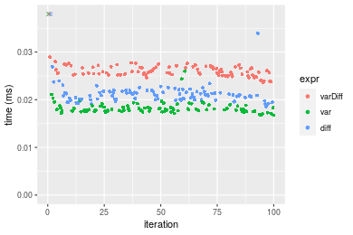
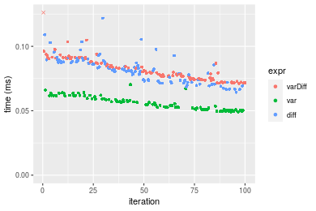

[matrixStats]: Benchmark report

---------------------------------------


# varDiff() benchmarks

This report benchmark the performance of varDiff() against alternative methods.

## Alternative methods

* N/A


## Data type "integer"
### Data
```r
> rvector <- function(n, mode = c("logical", "double", "integer"), range = c(-100, +100), na_prob = 0) {
+     mode <- match.arg(mode)
+     if (mode == "logical") {
+         x <- sample(c(FALSE, TRUE), size = n, replace = TRUE)
+     }     else {
+         x <- runif(n, min = range[1], max = range[2])
+     }
+     storage.mode(x) <- mode
+     if (na_prob > 0) 
+         x[sample(n, size = na_prob * n)] <- NA
+     x
+ }
> rvectors <- function(scale = 10, seed = 1, ...) {
+     set.seed(seed)
+     data <- list()
+     data[[1]] <- rvector(n = scale * 100, ...)
+     data[[2]] <- rvector(n = scale * 1000, ...)
+     data[[3]] <- rvector(n = scale * 10000, ...)
+     data[[4]] <- rvector(n = scale * 1e+05, ...)
+     data[[5]] <- rvector(n = scale * 1e+06, ...)
+     names(data) <- sprintf("n = %d", sapply(data, FUN = length))
+     data
+ }
> data <- rvectors(mode = mode)
> data <- data[1:4]
```

### Results

### n = 1000 vector

#### All elements
```r
> x <- data[["n = 1000"]]
> stats <- microbenchmark(varDiff = varDiff(x), var = var(x), diff = diff(x), unit = "ms")
```

_Table: Benchmarking of varDiff(), var() and diff() on integer+n = 1000 data. The top panel shows times in milliseconds and the bottom panel shows relative times._


|   |expr    |      min|        lq|      mean|    median|        uq|      max|
|:--|:-------|--------:|---------:|---------:|---------:|---------:|--------:|
|2  |var     | 0.016753| 0.0175870| 0.0186376| 0.0179075| 0.0185480| 0.058123|
|3  |diff    | 0.018603| 0.0201105| 0.0213982| 0.0210320| 0.0217125| 0.047461|
|1  |varDiff | 0.023625| 0.0252635| 0.0262095| 0.0257830| 0.0268275| 0.051645|


|   |expr    |      min|       lq|     mean|   median|       uq|       max|
|:--|:-------|--------:|--------:|--------:|--------:|--------:|---------:|
|2  |var     | 1.000000| 1.000000| 1.000000| 1.000000| 1.000000| 1.0000000|
|3  |diff    | 1.110428| 1.143487| 1.148119| 1.174480| 1.170611| 0.8165614|
|1  |varDiff | 1.410195| 1.436487| 1.406267| 1.439788| 1.446382| 0.8885467|

_Figure: Benchmarking of varDiff(), var() and diff() on integer+n = 1000 data.  Outliers are displayed as crosses.  Times are in milliseconds._



### n = 10000 vector

#### All elements
```r
> x <- data[["n = 10000"]]
> stats <- microbenchmark(varDiff = varDiff(x), var = var(x), diff = diff(x), unit = "ms")
```

_Table: Benchmarking of varDiff(), var() and diff() on integer+n = 10000 data. The top panel shows times in milliseconds and the bottom panel shows relative times._


|   |expr    |      min|        lq|      mean|    median|        uq|      max|
|:--|:-------|--------:|---------:|---------:|---------:|---------:|--------:|
|2  |var     | 0.061388| 0.0639330| 0.0706525| 0.0685215| 0.0770780| 0.089831|
|1  |varDiff | 0.082824| 0.0861600| 0.0963770| 0.0911945| 0.1081875| 0.170068|
|3  |diff    | 0.138550| 0.1464605| 0.1602994| 0.1560690| 0.1746845| 0.199919|


|   |expr    |      min|       lq|     mean|   median|       uq|      max|
|:--|:-------|--------:|--------:|--------:|--------:|--------:|--------:|
|2  |var     | 1.000000| 1.000000| 1.000000| 1.000000| 1.000000| 1.000000|
|1  |varDiff | 1.349189| 1.347661| 1.364100| 1.330889| 1.403611| 1.893199|
|3  |diff    | 2.256956| 2.290843| 2.268844| 2.277665| 2.266334| 2.225501|

_Figure: Benchmarking of varDiff(), var() and diff() on integer+n = 10000 data.  Outliers are displayed as crosses.  Times are in milliseconds._


### n = 100000 vector

#### All elements
```r
> x <- data[["n = 100000"]]
> stats <- microbenchmark(varDiff = varDiff(x), var = var(x), diff = diff(x), unit = "ms")
```

_Table: Benchmarking of varDiff(), var() and diff() on integer+n = 100000 data. The top panel shows times in milliseconds and the bottom panel shows relative times._


|   |expr    |      min|        lq|      mean|    median|        uq|       max|
|:--|:-------|--------:|---------:|---------:|---------:|---------:|---------:|
|2  |var     | 0.497015| 0.5623045| 0.6361371| 0.6686685| 0.6892555|  0.753548|
|1  |varDiff | 0.605195| 0.7195690| 1.0547855| 0.9207835| 0.9400125| 14.572368|
|3  |diff    | 1.134161| 1.3473450| 1.7162382| 1.9426400| 1.9838920|  2.128645|


|   |expr    |      min|       lq|     mean|   median|       uq|      max|
|:--|:-------|--------:|--------:|--------:|--------:|--------:|--------:|
|2  |var     | 1.000000| 1.000000| 1.000000| 1.000000| 1.000000|  1.00000|
|1  |varDiff | 1.217659| 1.279678| 1.658110| 1.377040| 1.363808| 19.33834|
|3  |diff    | 2.281945| 2.396113| 2.697906| 2.905236| 2.878312|  2.82483|

_Figure: Benchmarking of varDiff(), var() and diff() on integer+n = 100000 data.  Outliers are displayed as crosses.  Times are in milliseconds._


### n = 1000000 vector

#### All elements
```r
> x <- data[["n = 1000000"]]
> stats <- microbenchmark(varDiff = varDiff(x), var = var(x), diff = diff(x), unit = "ms")
```

_Table: Benchmarking of varDiff(), var() and diff() on integer+n = 1000000 data. The top panel shows times in milliseconds and the bottom panel shows relative times._


|   |expr    |       min|        lq|      mean|    median|        uq|      max|
|:--|:-------|---------:|---------:|---------:|---------:|---------:|--------:|
|2  |var     |  4.735393|  4.919643|  5.862721|  5.147760|  5.771124| 16.01676|
|1  |varDiff |  6.154987|  6.503347|  8.038181|  6.905843|  7.630867| 28.21450|
|3  |diff    | 11.070321| 11.438363| 13.972650| 12.248372| 14.120062| 22.97169|


|   |expr    |      min|       lq|     mean|   median|       uq|      max|
|:--|:-------|--------:|--------:|--------:|--------:|--------:|--------:|
|2  |var     | 1.000000| 1.000000| 1.000000| 1.000000| 1.000000| 1.000000|
|1  |varDiff | 1.299784| 1.321914| 1.371067| 1.341524| 1.322250| 1.761561|
|3  |diff    | 2.337783| 2.325039| 2.383304| 2.379360| 2.446674| 1.434228|

_Figure: Benchmarking of varDiff(), var() and diff() on integer+n = 1000000 data.  Outliers are displayed as crosses.  Times are in milliseconds._


## Data type "double"
### Data
```r
> rvector <- function(n, mode = c("logical", "double", "integer"), range = c(-100, +100), na_prob = 0) {
+     mode <- match.arg(mode)
+     if (mode == "logical") {
+         x <- sample(c(FALSE, TRUE), size = n, replace = TRUE)
+     }     else {
+         x <- runif(n, min = range[1], max = range[2])
+     }
+     storage.mode(x) <- mode
+     if (na_prob > 0) 
+         x[sample(n, size = na_prob * n)] <- NA
+     x
+ }
> rvectors <- function(scale = 10, seed = 1, ...) {
+     set.seed(seed)
+     data <- list()
+     data[[1]] <- rvector(n = scale * 100, ...)
+     data[[2]] <- rvector(n = scale * 1000, ...)
+     data[[3]] <- rvector(n = scale * 10000, ...)
+     data[[4]] <- rvector(n = scale * 1e+05, ...)
+     data[[5]] <- rvector(n = scale * 1e+06, ...)
+     names(data) <- sprintf("n = %d", sapply(data, FUN = length))
+     data
+ }
> data <- rvectors(mode = mode)
> data <- data[1:4]
```

### Results

### n = 1000 vector

#### All elements
```r
> x <- data[["n = 1000"]]
> stats <- microbenchmark(varDiff = varDiff(x), var = var(x), diff = diff(x), unit = "ms")
```

_Table: Benchmarking of varDiff(), var() and diff() on double+n = 1000 data. The top panel shows times in milliseconds and the bottom panel shows relative times._


|   |expr    |      min|       lq|      mean|    median|        uq|      max|
|:--|:-------|--------:|--------:|---------:|---------:|---------:|--------:|
|2  |var     | 0.014719| 0.015238| 0.0161434| 0.0155840| 0.0160875| 0.052450|
|3  |diff    | 0.014855| 0.016034| 0.0173381| 0.0168765| 0.0176355| 0.044721|
|1  |varDiff | 0.021831| 0.022756| 0.0241593| 0.0235570| 0.0246750| 0.045633|


|   |expr    |      min|       lq|     mean|   median|       uq|       max|
|:--|:-------|--------:|--------:|--------:|--------:|--------:|---------:|
|2  |var     | 1.000000| 1.000000| 1.000000| 1.000000| 1.000000| 1.0000000|
|3  |diff    | 1.009240| 1.052238| 1.074007| 1.082938| 1.096224| 0.8526406|
|1  |varDiff | 1.483185| 1.493372| 1.496547| 1.511615| 1.533799| 0.8700286|

_Figure: Benchmarking of varDiff(), var() and diff() on double+n = 1000 data.  Outliers are displayed as crosses.  Times are in milliseconds._


### n = 10000 vector

#### All elements
```r
> x <- data[["n = 10000"]]
> stats <- microbenchmark(varDiff = varDiff(x), var = var(x), diff = diff(x), unit = "ms")
```

_Table: Benchmarking of varDiff(), var() and diff() on double+n = 10000 data. The top panel shows times in milliseconds and the bottom panel shows relative times._


|   |expr    |      min|        lq|      mean|    median|        uq|      max|
|:--|:-------|--------:|---------:|---------:|---------:|---------:|--------:|
|2  |var     | 0.048958| 0.0510895| 0.0560147| 0.0558635| 0.0602100| 0.070229|
|1  |varDiff | 0.071294| 0.0749260| 0.0822382| 0.0793940| 0.0891385| 0.152952|
|3  |diff    | 0.064331| 0.0730915| 0.0819187| 0.0817220| 0.0879530| 0.121808|


|   |expr    |      min|       lq|     mean|   median|       uq|      max|
|:--|:-------|--------:|--------:|--------:|--------:|--------:|--------:|
|2  |var     | 1.000000| 1.000000| 1.000000| 1.000000| 1.000000| 1.000000|
|1  |varDiff | 1.456228| 1.466564| 1.468155| 1.421214| 1.480460| 2.177904|
|3  |diff    | 1.314004| 1.430656| 1.462451| 1.462887| 1.460771| 1.734440|

_Figure: Benchmarking of varDiff(), var() and diff() on double+n = 10000 data.  Outliers are displayed as crosses.  Times are in milliseconds._



### n = 100000 vector

#### All elements
```r
> x <- data[["n = 100000"]]
> stats <- microbenchmark(varDiff = varDiff(x), var = var(x), diff = diff(x), unit = "ms")
```

_Table: Benchmarking of varDiff(), var() and diff() on double+n = 100000 data. The top panel shows times in milliseconds and the bottom panel shows relative times._


|   |expr    |      min|        lq|      mean|    median|        uq|      max|
|:--|:-------|--------:|---------:|---------:|---------:|---------:|--------:|
|2  |var     | 0.317672| 0.3274990| 0.3749251| 0.3546235| 0.4061455| 0.599968|
|1  |varDiff | 0.464284| 0.4944135| 0.6120679| 0.5476330| 0.6013775| 6.729189|
|3  |diff    | 0.497930| 0.5285215| 0.6549510| 0.5822305| 0.6374165| 6.742997|


|   |expr    |      min|       lq|     mean|   median|       uq|      max|
|:--|:-------|--------:|--------:|--------:|--------:|--------:|--------:|
|2  |var     | 1.000000| 1.000000| 1.000000| 1.000000| 1.000000|  1.00000|
|1  |varDiff | 1.461520| 1.509664| 1.632507| 1.544266| 1.480695| 11.21591|
|3  |diff    | 1.567434| 1.613811| 1.746885| 1.641827| 1.569429| 11.23893|

_Figure: Benchmarking of varDiff(), var() and diff() on double+n = 100000 data.  Outliers are displayed as crosses.  Times are in milliseconds._


### n = 1000000 vector

#### All elements
```r
> x <- data[["n = 1000000"]]
> stats <- microbenchmark(varDiff = varDiff(x), var = var(x), diff = diff(x), unit = "ms")
```

_Table: Benchmarking of varDiff(), var() and diff() on double+n = 1000000 data. The top panel shows times in milliseconds and the bottom panel shows relative times._


|   |expr    |      min|       lq|     mean|   median|        uq|      max|
|:--|:-------|--------:|--------:|--------:|--------:|---------:|--------:|
|2  |var     | 3.769033| 4.243178| 4.499334| 4.403592|  4.661610|  6.44096|
|1  |varDiff | 5.387331| 5.987418| 6.567017| 6.208458|  6.476895| 18.30619|
|3  |diff    | 6.910876| 7.340369| 9.452915| 7.604505| 13.585297| 24.05487|


|   |expr    |      min|       lq|     mean|   median|       uq|      max|
|:--|:-------|--------:|--------:|--------:|--------:|--------:|--------:|
|2  |var     | 1.000000| 1.000000| 1.000000| 1.000000| 1.000000| 1.000000|
|1  |varDiff | 1.429367| 1.411069| 1.459553| 1.409863| 1.389412| 2.842152|
|3  |diff    | 1.833594| 1.729922| 2.100959| 1.726887| 2.914293| 3.734671|

_Figure: Benchmarking of varDiff(), var() and diff() on double+n = 1000000 data.  Outliers are displayed as crosses.  Times are in milliseconds._


## Appendix

### Session information
```r
R version 4.1.1 Patched (2021-08-10 r80727)
Platform: x86_64-pc-linux-gnu (64-bit)
Running under: Ubuntu 18.04.5 LTS

Matrix products: default
BLAS:   /home/hb/software/R-devel/R-4-1-branch/lib/R/lib/libRblas.so
LAPACK: /home/hb/software/R-devel/R-4-1-branch/lib/R/lib/libRlapack.so

locale:
 [1] LC_CTYPE=en_US.UTF-8       LC_NUMERIC=C              
 [3] LC_TIME=en_US.UTF-8        LC_COLLATE=en_US.UTF-8    
 [5] LC_MONETARY=en_US.UTF-8    LC_MESSAGES=en_US.UTF-8   
 [7] LC_PAPER=en_US.UTF-8       LC_NAME=C                 
 [9] LC_ADDRESS=C               LC_TELEPHONE=C            
[11] LC_MEASUREMENT=en_US.UTF-8 LC_IDENTIFICATION=C       

attached base packages:
[1] stats     graphics  grDevices utils     datasets  methods   base     

other attached packages:
[1] microbenchmark_1.4-7   matrixStats_0.60.1     ggplot2_3.3.5         
[4] knitr_1.33             R.devices_2.17.0       R.utils_2.10.1        
[7] R.oo_1.24.0            R.methodsS3_1.8.1-9001 history_0.0.1-9000    

loaded via a namespace (and not attached):
 [1] Biobase_2.52.0          httr_1.4.2              splines_4.1.1          
 [4] bit64_4.0.5             network_1.17.1          assertthat_0.2.1       
 [7] highr_0.9               stats4_4.1.1            blob_1.2.2             
[10] GenomeInfoDbData_1.2.6  robustbase_0.93-8       pillar_1.6.2           
[13] RSQLite_2.2.8           lattice_0.20-44         glue_1.4.2             
[16] digest_0.6.27           XVector_0.32.0          colorspace_2.0-2       
[19] Matrix_1.3-4            XML_3.99-0.7            pkgconfig_2.0.3        
[22] zlibbioc_1.38.0         genefilter_1.74.0       purrr_0.3.4            
[25] ergm_4.1.2              xtable_1.8-4            scales_1.1.1           
[28] tibble_3.1.4            annotate_1.70.0         KEGGREST_1.32.0        
[31] farver_2.1.0            generics_0.1.0          IRanges_2.26.0         
[34] ellipsis_0.3.2          cachem_1.0.6            withr_2.4.2            
[37] BiocGenerics_0.38.0     mime_0.11               survival_3.2-13        
[40] magrittr_2.0.1          crayon_1.4.1            statnet.common_4.5.0   
[43] memoise_2.0.0           laeken_0.5.1            fansi_0.5.0            
[46] R.cache_0.15.0          MASS_7.3-54             R.rsp_0.44.0           
[49] progressr_0.8.0         tools_4.1.1             lifecycle_1.0.0        
[52] S4Vectors_0.30.0        trust_0.1-8             munsell_0.5.0          
[55] tabby_0.0.1-9001        AnnotationDbi_1.54.1    Biostrings_2.60.2      
[58] compiler_4.1.1          GenomeInfoDb_1.28.1     rlang_0.4.11           
[61] grid_4.1.1              RCurl_1.98-1.4          cwhmisc_6.6            
[64] rappdirs_0.3.3          startup_0.15.0          labeling_0.4.2         
[67] bitops_1.0-7            base64enc_0.1-3         boot_1.3-28            
[70] gtable_0.3.0            DBI_1.1.1               markdown_1.1           
[73] R6_2.5.1                lpSolveAPI_5.5.2.0-17.7 rle_0.9.2              
[76] dplyr_1.0.7             fastmap_1.1.0           bit_4.0.4              
[79] utf8_1.2.2              parallel_4.1.1          Rcpp_1.0.7             
[82] vctrs_0.3.8             png_0.1-7               DEoptimR_1.0-9         
[85] tidyselect_1.1.1        xfun_0.25               coda_0.19-4            
```
Total processing time was 13.56 secs.


### Reproducibility
To reproduce this report, do:
```r
html <- matrixStats:::benchmark('varDiff')
```

[RSP]: https://cran.r-project.org/package=R.rsp
[matrixStats]: https://cran.r-project.org/package=matrixStats

[StackOverflow:colMins?]: https://stackoverflow.com/questions/13676878 "Stack Overflow: fastest way to get Min from every column in a matrix?"
[StackOverflow:colSds?]: https://stackoverflow.com/questions/17549762 "Stack Overflow: Is there such 'colsd' in R?"
[StackOverflow:rowProds?]: https://stackoverflow.com/questions/20198801/ "Stack Overflow: Row product of matrix and column sum of matrix"

---------------------------------------
Copyright Henrik Bengtsson. Last updated on 2021-08-25 19:31:39 (+0200 UTC). Powered by [RSP].

<script>
 var link = document.createElement('link');
 link.rel = 'icon';
 link.href = ""
 document.getElementsByTagName('head')[0].appendChild(link);
</script>


