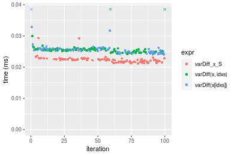
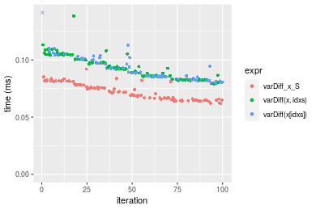
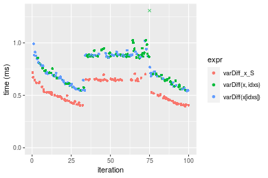
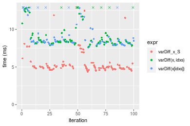
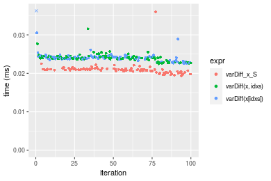
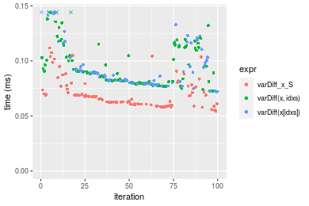
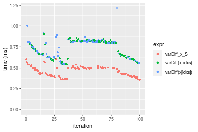
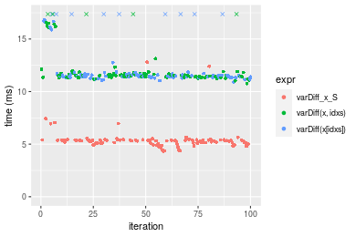

[matrixStats]: Benchmark report

---------------------------------------


# varDiff() benchmarks on subsetted computation

This report benchmark the performance of varDiff() on subsetted computation.


## Data type "integer"
### Data
```r
> rvector <- function(n, mode = c("logical", "double", "integer"), range = c(-100, +100), na_prob = 0) {
+     mode <- match.arg(mode)
+     if (mode == "logical") {
+         x <- sample(c(FALSE, TRUE), size = n, replace = TRUE)
+     }     else {
+         x <- runif(n, min = range[1], max = range[2])
+     }
+     storage.mode(x) <- mode
+     if (na_prob > 0) 
+         x[sample(n, size = na_prob * n)] <- NA
+     x
+ }
> rvectors <- function(scale = 10, seed = 1, ...) {
+     set.seed(seed)
+     data <- list()
+     data[[1]] <- rvector(n = scale * 100, ...)
+     data[[2]] <- rvector(n = scale * 1000, ...)
+     data[[3]] <- rvector(n = scale * 10000, ...)
+     data[[4]] <- rvector(n = scale * 1e+05, ...)
+     data[[5]] <- rvector(n = scale * 1e+06, ...)
+     names(data) <- sprintf("n = %d", sapply(data, FUN = length))
+     data
+ }
> data <- rvectors(mode = mode)
> data <- data[1:4]
```

### Results

### n = 1000 vector

#### All elements
```r
> x <- data[["n = 1000"]]
> idxs <- sample.int(length(x), size = length(x) * 0.7)
> x_S <- x[idxs]
> gc()
           used  (Mb) gc trigger  (Mb)  max used  (Mb)
Ncells  5360195 286.3    8529671 455.6   8529671 455.6
Vcells 11132560  85.0   39910282 304.5 101881463 777.3
> stats <- microbenchmark(varDiff_x_S = varDiff(x_S), `varDiff(x, idxs)` = varDiff(x, idxs = idxs), 
+     `varDiff(x[idxs])` = varDiff(x[idxs]), unit = "ms")
```

_Table: Benchmarking of varDiff_x_S(), varDiff(x, idxs)() and varDiff(x[idxs])() on integer+n = 1000 data. The top panel shows times in milliseconds and the bottom panel shows relative times._


|   |expr             |      min|        lq|      mean|    median|        uq|      max|
|:--|:----------------|--------:|---------:|---------:|---------:|---------:|--------:|
|1  |varDiff_x_S      | 0.021195| 0.0216705| 0.0223514| 0.0222575| 0.0226140| 0.029313|
|2  |varDiff(x, idxs) | 0.024138| 0.0249810| 0.0257170| 0.0254810| 0.0258235| 0.040524|
|3  |varDiff(x[idxs]) | 0.024051| 0.0249505| 0.0282646| 0.0255330| 0.0259245| 0.296136|


|   |expr             |      min|       lq|     mean|   median|       uq|       max|
|:--|:----------------|--------:|--------:|--------:|--------:|--------:|---------:|
|1  |varDiff_x_S      | 1.000000| 1.000000| 1.000000| 1.000000| 1.000000|  1.000000|
|2  |varDiff(x, idxs) | 1.138853| 1.152765| 1.150578| 1.144828| 1.141925|  1.382458|
|3  |varDiff(x[idxs]) | 1.134749| 1.151358| 1.264559| 1.147164| 1.146392| 10.102548|

_Figure: Benchmarking of varDiff_x_S(), varDiff(x, idxs)() and varDiff(x[idxs])() on integer+n = 1000 data.  Outliers are displayed as crosses.  Times are in milliseconds._



### n = 10000 vector

#### All elements
```r
> x <- data[["n = 10000"]]
> idxs <- sample.int(length(x), size = length(x) * 0.7)
> x_S <- x[idxs]
> gc()
           used  (Mb) gc trigger  (Mb)  max used  (Mb)
Ncells  5347859 285.7    8529671 455.6   8529671 455.6
Vcells 10847039  82.8   39910282 304.5 101881463 777.3
> stats <- microbenchmark(varDiff_x_S = varDiff(x_S), `varDiff(x, idxs)` = varDiff(x, idxs = idxs), 
+     `varDiff(x[idxs])` = varDiff(x[idxs]), unit = "ms")
```

_Table: Benchmarking of varDiff_x_S(), varDiff(x, idxs)() and varDiff(x[idxs])() on integer+n = 10000 data. The top panel shows times in milliseconds and the bottom panel shows relative times._


|   |expr             |      min|        lq|      mean|   median|        uq|      max|
|:--|:----------------|--------:|---------:|---------:|--------:|---------:|--------:|
|1  |varDiff_x_S      | 0.061708| 0.0657500| 0.0724005| 0.071702| 0.0783725| 0.092092|
|3  |varDiff(x[idxs]) | 0.079291| 0.0834265| 0.0923500| 0.088973| 0.1004415| 0.172308|
|2  |varDiff(x, idxs) | 0.079106| 0.0830625| 0.0928867| 0.092162| 0.1006460| 0.138589|


|   |expr             |      min|       lq|     mean|   median|       uq|      max|
|:--|:----------------|--------:|--------:|--------:|--------:|--------:|--------:|
|1  |varDiff_x_S      | 1.000000| 1.000000| 1.000000| 1.000000| 1.000000| 1.000000|
|3  |varDiff(x[idxs]) | 1.284939| 1.268844| 1.275544| 1.240872| 1.281591| 1.871042|
|2  |varDiff(x, idxs) | 1.281941| 1.263308| 1.282957| 1.285348| 1.284201| 1.504897|

_Figure: Benchmarking of varDiff_x_S(), varDiff(x, idxs)() and varDiff(x[idxs])() on integer+n = 10000 data.  Outliers are displayed as crosses.  Times are in milliseconds._



### n = 100000 vector

#### All elements
```r
> x <- data[["n = 100000"]]
> idxs <- sample.int(length(x), size = length(x) * 0.7)
> x_S <- x[idxs]
> gc()
           used  (Mb) gc trigger  (Mb)  max used  (Mb)
Ncells  5347931 285.7    8529671 455.6   8529671 455.6
Vcells 10910599  83.3   39910282 304.5 101881463 777.3
> stats <- microbenchmark(varDiff_x_S = varDiff(x_S), `varDiff(x, idxs)` = varDiff(x, idxs = idxs), 
+     `varDiff(x[idxs])` = varDiff(x[idxs]), unit = "ms")
```

_Table: Benchmarking of varDiff_x_S(), varDiff(x, idxs)() and varDiff(x[idxs])() on integer+n = 100000 data. The top panel shows times in milliseconds and the bottom panel shows relative times._


|   |expr             |      min|       lq|      mean|    median|        uq|      max|
|:--|:----------------|--------:|--------:|---------:|---------:|---------:|--------:|
|1  |varDiff_x_S      | 0.396543| 0.450572| 0.5418317| 0.5178700| 0.6463175| 0.717701|
|3  |varDiff(x[idxs]) | 0.541489| 0.624128| 0.7528008| 0.7270815| 0.8794145| 1.018039|
|2  |varDiff(x, idxs) | 0.547256| 0.643773| 0.8377526| 0.8585710| 0.8841555| 6.993578|


|   |expr             |      min|       lq|     mean|   median|       uq|      max|
|:--|:----------------|--------:|--------:|--------:|--------:|--------:|--------:|
|1  |varDiff_x_S      | 1.000000| 1.000000| 1.000000| 1.000000| 1.000000| 1.000000|
|3  |varDiff(x[idxs]) | 1.365524| 1.385190| 1.389363| 1.403985| 1.360654| 1.418472|
|2  |varDiff(x, idxs) | 1.380067| 1.428791| 1.546149| 1.657889| 1.367989| 9.744417|

_Figure: Benchmarking of varDiff_x_S(), varDiff(x, idxs)() and varDiff(x[idxs])() on integer+n = 100000 data.  Outliers are displayed as crosses.  Times are in milliseconds._



### n = 1000000 vector

#### All elements
```r
> x <- data[["n = 1000000"]]
> idxs <- sample.int(length(x), size = length(x) * 0.7)
> x_S <- x[idxs]
> gc()
           used  (Mb) gc trigger  (Mb)  max used  (Mb)
Ncells  5348003 285.7    8529671 455.6   8529671 455.6
Vcells 11540648  88.1   39910282 304.5 101881463 777.3
> stats <- microbenchmark(varDiff_x_S = varDiff(x_S), `varDiff(x, idxs)` = varDiff(x, idxs = idxs), 
+     `varDiff(x[idxs])` = varDiff(x[idxs]), unit = "ms")
```

_Table: Benchmarking of varDiff_x_S(), varDiff(x, idxs)() and varDiff(x[idxs])() on integer+n = 1000000 data. The top panel shows times in milliseconds and the bottom panel shows relative times._


|   |expr             |      min|       lq|     mean|   median|       uq|       max|
|:--|:----------------|--------:|--------:|--------:|--------:|--------:|---------:|
|1  |varDiff_x_S      | 4.379420| 4.783583| 9.364553| 5.003983| 5.314272| 395.28087|
|3  |varDiff(x[idxs]) | 7.603857| 8.113601| 9.238030| 8.345719| 8.881355|  17.70021|
|2  |varDiff(x, idxs) | 7.674196| 8.216176| 9.504877| 8.394405| 9.497711|  16.08516|


|   |expr             |      min|       lq|      mean|   median|       uq|       max|
|:--|:----------------|--------:|--------:|---------:|--------:|--------:|---------:|
|1  |varDiff_x_S      | 1.000000| 1.000000| 1.0000000| 1.000000| 1.000000| 1.0000000|
|3  |varDiff(x[idxs]) | 1.736270| 1.696135| 0.9864891| 1.667815| 1.671227| 0.0447788|
|2  |varDiff(x, idxs) | 1.752332| 1.717577| 1.0149846| 1.677545| 1.787209| 0.0406930|

_Figure: Benchmarking of varDiff_x_S(), varDiff(x, idxs)() and varDiff(x[idxs])() on integer+n = 1000000 data.  Outliers are displayed as crosses.  Times are in milliseconds._




## Data type "double"
### Data
```r
> rvector <- function(n, mode = c("logical", "double", "integer"), range = c(-100, +100), na_prob = 0) {
+     mode <- match.arg(mode)
+     if (mode == "logical") {
+         x <- sample(c(FALSE, TRUE), size = n, replace = TRUE)
+     }     else {
+         x <- runif(n, min = range[1], max = range[2])
+     }
+     storage.mode(x) <- mode
+     if (na_prob > 0) 
+         x[sample(n, size = na_prob * n)] <- NA
+     x
+ }
> rvectors <- function(scale = 10, seed = 1, ...) {
+     set.seed(seed)
+     data <- list()
+     data[[1]] <- rvector(n = scale * 100, ...)
+     data[[2]] <- rvector(n = scale * 1000, ...)
+     data[[3]] <- rvector(n = scale * 10000, ...)
+     data[[4]] <- rvector(n = scale * 1e+05, ...)
+     data[[5]] <- rvector(n = scale * 1e+06, ...)
+     names(data) <- sprintf("n = %d", sapply(data, FUN = length))
+     data
+ }
> data <- rvectors(mode = mode)
> data <- data[1:4]
```

### Results

### n = 1000 vector

#### All elements
```r
> x <- data[["n = 1000"]]
> idxs <- sample.int(length(x), size = length(x) * 0.7)
> x_S <- x[idxs]
> gc()
           used  (Mb) gc trigger  (Mb)  max used  (Mb)
Ncells  5348084 285.7    8529671 455.6   8529671 455.6
Vcells 11397468  87.0   39910282 304.5 101881463 777.3
> stats <- microbenchmark(varDiff_x_S = varDiff(x_S), `varDiff(x, idxs)` = varDiff(x, idxs = idxs), 
+     `varDiff(x[idxs])` = varDiff(x[idxs]), unit = "ms")
```

_Table: Benchmarking of varDiff_x_S(), varDiff(x, idxs)() and varDiff(x[idxs])() on double+n = 1000 data. The top panel shows times in milliseconds and the bottom panel shows relative times._


|   |expr             |      min|       lq|      mean|    median|        uq|      max|
|:--|:----------------|--------:|--------:|---------:|---------:|---------:|--------:|
|1  |varDiff_x_S      | 0.019359| 0.020487| 0.0209542| 0.0208770| 0.0211265| 0.035979|
|2  |varDiff(x, idxs) | 0.022467| 0.023722| 0.0240613| 0.0240090| 0.0243715| 0.031585|
|3  |varDiff(x[idxs]) | 0.022488| 0.023675| 0.0245888| 0.0240485| 0.0243320| 0.080856|


|   |expr             |      min|       lq|     mean|   median|       uq|       max|
|:--|:----------------|--------:|--------:|--------:|--------:|--------:|---------:|
|1  |varDiff_x_S      | 1.000000| 1.000000| 1.000000| 1.000000| 1.000000| 1.0000000|
|2  |varDiff(x, idxs) | 1.160546| 1.157905| 1.148281| 1.150022| 1.153599| 0.8778732|
|3  |varDiff(x[idxs]) | 1.161630| 1.155611| 1.173456| 1.151914| 1.151729| 2.2473109|

_Figure: Benchmarking of varDiff_x_S(), varDiff(x, idxs)() and varDiff(x[idxs])() on double+n = 1000 data.  Outliers are displayed as crosses.  Times are in milliseconds._



### n = 10000 vector

#### All elements
```r
> x <- data[["n = 10000"]]
> idxs <- sample.int(length(x), size = length(x) * 0.7)
> x_S <- x[idxs]
> gc()
           used  (Mb) gc trigger  (Mb)  max used  (Mb)
Ncells  5348147 285.7    8529671 455.6   8529671 455.6
Vcells 11407204  87.1   39910282 304.5 101881463 777.3
> stats <- microbenchmark(varDiff_x_S = varDiff(x_S), `varDiff(x, idxs)` = varDiff(x, idxs = idxs), 
+     `varDiff(x[idxs])` = varDiff(x[idxs]), unit = "ms")
```

_Table: Benchmarking of varDiff_x_S(), varDiff(x, idxs)() and varDiff(x[idxs])() on double+n = 10000 data. The top panel shows times in milliseconds and the bottom panel shows relative times._


|   |expr             |      min|        lq|      mean|    median|        uq|      max|
|:--|:----------------|--------:|---------:|---------:|---------:|---------:|--------:|
|1  |varDiff_x_S      | 0.054517| 0.0606525| 0.0700170| 0.0673795| 0.0740475| 0.111827|
|3  |varDiff(x[idxs]) | 0.071929| 0.0796925| 0.0937592| 0.0858950| 0.0975415| 0.164889|
|2  |varDiff(x, idxs) | 0.072381| 0.0811230| 0.0966786| 0.0895080| 0.1124140| 0.155331|


|   |expr             |      min|       lq|     mean|   median|       uq|      max|
|:--|:----------------|--------:|--------:|--------:|--------:|--------:|--------:|
|1  |varDiff_x_S      | 1.000000| 1.000000| 1.000000| 1.000000| 1.000000| 1.000000|
|3  |varDiff(x[idxs]) | 1.319387| 1.313919| 1.339091| 1.274794| 1.317283| 1.474501|
|2  |varDiff(x, idxs) | 1.327678| 1.337505| 1.380786| 1.328416| 1.518134| 1.389029|

_Figure: Benchmarking of varDiff_x_S(), varDiff(x, idxs)() and varDiff(x[idxs])() on double+n = 10000 data.  Outliers are displayed as crosses.  Times are in milliseconds._



### n = 100000 vector

#### All elements
```r
> x <- data[["n = 100000"]]
> idxs <- sample.int(length(x), size = length(x) * 0.7)
> x_S <- x[idxs]
> gc()
           used  (Mb) gc trigger  (Mb)  max used  (Mb)
Ncells  5348219 285.7    8529671 455.6   8529671 455.6
Vcells 11502057  87.8   39910282 304.5 101881463 777.3
> stats <- microbenchmark(varDiff_x_S = varDiff(x_S), `varDiff(x, idxs)` = varDiff(x, idxs = idxs), 
+     `varDiff(x[idxs])` = varDiff(x[idxs]), unit = "ms")
```

_Table: Benchmarking of varDiff_x_S(), varDiff(x, idxs)() and varDiff(x[idxs])() on double+n = 100000 data. The top panel shows times in milliseconds and the bottom panel shows relative times._


|   |expr             |      min|        lq|      mean|    median|        uq|       max|
|:--|:----------------|--------:|---------:|---------:|---------:|---------:|---------:|
|1  |varDiff_x_S      | 0.358198| 0.4097210| 0.4616626| 0.4741120| 0.5029425|  0.600111|
|2  |varDiff(x, idxs) | 0.537136| 0.6279275| 0.7293970| 0.7947905| 0.8206770|  0.908008|
|3  |varDiff(x[idxs]) | 0.537496| 0.6326595| 0.8638420| 0.7986575| 0.8177885| 13.153771|


|   |expr             |      min|       lq|     mean|   median|       uq|       max|
|:--|:----------------|--------:|--------:|--------:|--------:|--------:|---------:|
|1  |varDiff_x_S      | 1.000000| 1.000000| 1.000000| 1.000000| 1.000000|  1.000000|
|2  |varDiff(x, idxs) | 1.499551| 1.532573| 1.579935| 1.676377| 1.631751|  1.513067|
|3  |varDiff(x[idxs]) | 1.500556| 1.544123| 1.871154| 1.684533| 1.626008| 21.918897|

_Figure: Benchmarking of varDiff_x_S(), varDiff(x, idxs)() and varDiff(x[idxs])() on double+n = 100000 data.  Outliers are displayed as crosses.  Times are in milliseconds._



### n = 1000000 vector

#### All elements
```r
> x <- data[["n = 1000000"]]
> idxs <- sample.int(length(x), size = length(x) * 0.7)
> x_S <- x[idxs]
> gc()
           used  (Mb) gc trigger  (Mb)  max used  (Mb)
Ncells  5348291 285.7    8529671 455.6   8529671 455.6
Vcells 12447467  95.0   39910282 304.5 101881463 777.3
> stats <- microbenchmark(varDiff_x_S = varDiff(x_S), `varDiff(x, idxs)` = varDiff(x, idxs = idxs), 
+     `varDiff(x[idxs])` = varDiff(x[idxs]), unit = "ms")
```

_Table: Benchmarking of varDiff_x_S(), varDiff(x, idxs)() and varDiff(x[idxs])() on double+n = 1000000 data. The top panel shows times in milliseconds and the bottom panel shows relative times._


|   |expr             |       min|        lq|      mean|    median|        uq|      max|
|:--|:----------------|---------:|---------:|---------:|---------:|---------:|--------:|
|1  |varDiff_x_S      |  4.340057|  5.081025|  5.406844|  5.317157|  5.389139| 12.80499|
|3  |varDiff(x[idxs]) | 10.918183| 11.390210| 12.467142| 11.500198| 11.679688| 21.25210|
|2  |varDiff(x, idxs) | 10.756500| 11.382810| 12.213423| 11.511443| 11.715889| 21.98133|


|   |expr             |      min|       lq|     mean|   median|       uq|      max|
|:--|:----------------|--------:|--------:|--------:|--------:|--------:|--------:|
|1  |varDiff_x_S      | 1.000000| 1.000000| 1.000000| 1.000000| 1.000000| 1.000000|
|3  |varDiff(x[idxs]) | 2.515677| 2.241715| 2.305807| 2.162847| 2.167264| 1.659673|
|2  |varDiff(x, idxs) | 2.478424| 2.240258| 2.258882| 2.164962| 2.173982| 1.716621|

_Figure: Benchmarking of varDiff_x_S(), varDiff(x, idxs)() and varDiff(x[idxs])() on double+n = 1000000 data.  Outliers are displayed as crosses.  Times are in milliseconds._




## Appendix

### Session information
```r
R version 4.1.1 Patched (2021-08-10 r80727)
Platform: x86_64-pc-linux-gnu (64-bit)
Running under: Ubuntu 18.04.5 LTS

Matrix products: default
BLAS:   /home/hb/software/R-devel/R-4-1-branch/lib/R/lib/libRblas.so
LAPACK: /home/hb/software/R-devel/R-4-1-branch/lib/R/lib/libRlapack.so

locale:
 [1] LC_CTYPE=en_US.UTF-8       LC_NUMERIC=C              
 [3] LC_TIME=en_US.UTF-8        LC_COLLATE=en_US.UTF-8    
 [5] LC_MONETARY=en_US.UTF-8    LC_MESSAGES=en_US.UTF-8   
 [7] LC_PAPER=en_US.UTF-8       LC_NAME=C                 
 [9] LC_ADDRESS=C               LC_TELEPHONE=C            
[11] LC_MEASUREMENT=en_US.UTF-8 LC_IDENTIFICATION=C       

attached base packages:
[1] stats     graphics  grDevices utils     datasets  methods   base     

other attached packages:
[1] microbenchmark_1.4-7   matrixStats_0.60.1     ggplot2_3.3.5         
[4] knitr_1.33             R.devices_2.17.0       R.utils_2.10.1        
[7] R.oo_1.24.0            R.methodsS3_1.8.1-9001 history_0.0.1-9000    

loaded via a namespace (and not attached):
 [1] Biobase_2.52.0          httr_1.4.2              splines_4.1.1          
 [4] bit64_4.0.5             network_1.17.1          assertthat_0.2.1       
 [7] highr_0.9               stats4_4.1.1            blob_1.2.2             
[10] GenomeInfoDbData_1.2.6  robustbase_0.93-8       pillar_1.6.2           
[13] RSQLite_2.2.8           lattice_0.20-44         glue_1.4.2             
[16] digest_0.6.27           XVector_0.32.0          colorspace_2.0-2       
[19] Matrix_1.3-4            XML_3.99-0.7            pkgconfig_2.0.3        
[22] zlibbioc_1.38.0         genefilter_1.74.0       purrr_0.3.4            
[25] ergm_4.1.2              xtable_1.8-4            scales_1.1.1           
[28] tibble_3.1.4            annotate_1.70.0         KEGGREST_1.32.0        
[31] farver_2.1.0            generics_0.1.0          IRanges_2.26.0         
[34] ellipsis_0.3.2          cachem_1.0.6            withr_2.4.2            
[37] BiocGenerics_0.38.0     mime_0.11               survival_3.2-13        
[40] magrittr_2.0.1          crayon_1.4.1            statnet.common_4.5.0   
[43] memoise_2.0.0           laeken_0.5.1            fansi_0.5.0            
[46] R.cache_0.15.0          MASS_7.3-54             R.rsp_0.44.0           
[49] progressr_0.8.0         tools_4.1.1             lifecycle_1.0.0        
[52] S4Vectors_0.30.0        trust_0.1-8             munsell_0.5.0          
[55] tabby_0.0.1-9001        AnnotationDbi_1.54.1    Biostrings_2.60.2      
[58] compiler_4.1.1          GenomeInfoDb_1.28.1     rlang_0.4.11           
[61] grid_4.1.1              RCurl_1.98-1.4          cwhmisc_6.6            
[64] rappdirs_0.3.3          startup_0.15.0          labeling_0.4.2         
[67] bitops_1.0-7            base64enc_0.1-3         boot_1.3-28            
[70] gtable_0.3.0            DBI_1.1.1               markdown_1.1           
[73] R6_2.5.1                lpSolveAPI_5.5.2.0-17.7 rle_0.9.2              
[76] dplyr_1.0.7             fastmap_1.1.0           bit_4.0.4              
[79] utf8_1.2.2              parallel_4.1.1          Rcpp_1.0.7             
[82] vctrs_0.3.8             png_0.1-7               DEoptimR_1.0-9         
[85] tidyselect_1.1.1        xfun_0.25               coda_0.19-4            
```
Total processing time was 14.58 secs.


### Reproducibility
To reproduce this report, do:
```r
html <- matrixStats:::benchmark('varDiff_subset')
```

[RSP]: https://cran.r-project.org/package=R.rsp
[matrixStats]: https://cran.r-project.org/package=matrixStats

[StackOverflow:colMins?]: https://stackoverflow.com/questions/13676878 "Stack Overflow: fastest way to get Min from every column in a matrix?"
[StackOverflow:colSds?]: https://stackoverflow.com/questions/17549762 "Stack Overflow: Is there such 'colsd' in R?"
[StackOverflow:rowProds?]: https://stackoverflow.com/questions/20198801/ "Stack Overflow: Row product of matrix and column sum of matrix"

---------------------------------------
Copyright Dongcan Jiang. Last updated on 2021-08-25 19:31:24 (+0200 UTC). Powered by [RSP].

<script>
 var link = document.createElement('link');
 link.rel = 'icon';
 link.href = "data:image/png;base64,iVBORw0KGgoAAAANSUhEUgAAACAAAAAgCAMAAABEpIrGAAAA21BMVEUAAAAAAP8AAP8AAP8AAP8AAP8AAP8AAP8AAP8AAP8AAP8AAP8AAP8AAP8AAP8AAP8AAP8AAP8AAP8AAP8AAP8AAP8AAP8AAP8AAP8AAP8AAP8AAP8AAP8AAP8AAP8AAP8AAP8AAP8AAP8AAP8AAP8AAP8AAP8AAP8AAP8AAP8BAf4CAv0DA/wdHeIeHuEfH+AgIN8hId4lJdomJtknJ9g+PsE/P8BAQL9yco10dIt1dYp3d4h4eIeVlWqWlmmXl2iYmGeZmWabm2Tn5xjo6Bfp6Rb39wj4+Af//wA2M9hbAAAASXRSTlMAAQIJCgsMJSYnKD4/QGRlZmhpamtsbautrrCxuru8y8zN5ebn6Pn6+///////////////////////////////////////////LsUNcQAAAS9JREFUOI29k21XgkAQhVcFytdSMqMETU26UVqGmpaiFbL//xc1cAhhwVNf6n5i5z67M2dmYOyfJZUqlVLhkKucG7cgmUZTybDz6g0iDeq51PUr37Ds2cy2/C9NeES5puDjxuUk1xnToZsg8pfA3avHQ3lLIi7iWRrkv/OYtkScxBIMgDee0ALoyxHQBJ68JLCjOtQIMIANF7QG9G9fNnHvisCHBVMKgSJgiz7nE+AoBKrAPA3MgepvgR9TSCasrCKH0eB1wBGBFdCO+nAGjMVGPcQb5bd6mQRegN6+1axOs9nGfYcCtfi4NQosdtH7dB+txFIpXQqN1p9B/asRHToyS0jRgpV7nk4nwcq1BJ+x3Gl/v7S9Wmpp/aGquum7w3ZDyrADFYrl8vHBH+ev9AUASW1dmU4h4wAAAABJRU5ErkJggg=="
 document.getElementsByTagName('head')[0].appendChild(link);
</script>


