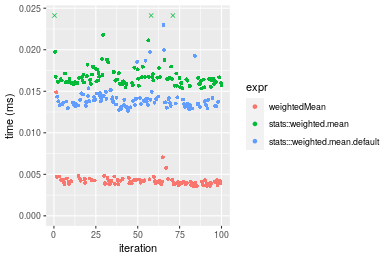
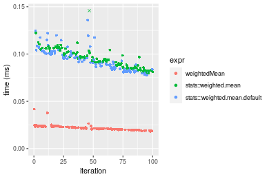
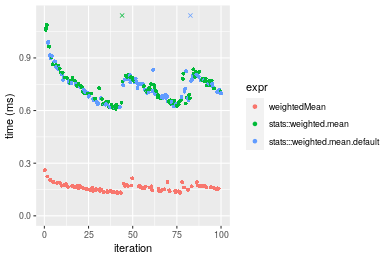
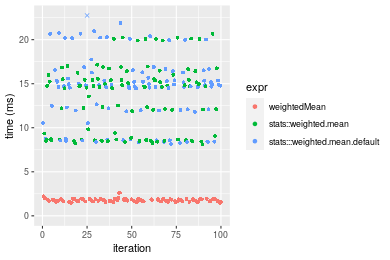
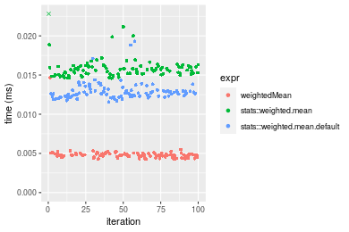
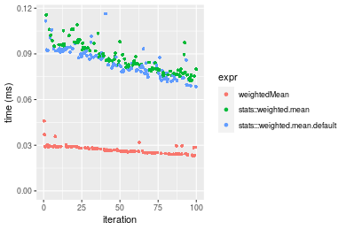
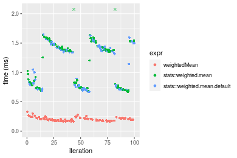
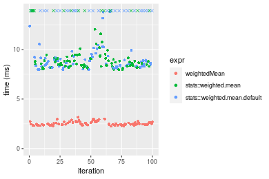

[matrixStats]: Benchmark report

---------------------------------------


# weightedMean() benchmarks

This report benchmark the performance of weightedMean() against alternative methods.

## Alternative methods

* stats::weighted.mean()
* stats:::weighted.mean.default()


## Data type "integer"
### Data
```r
> rvector <- function(n, mode = c("logical", "double", "integer"), range = c(-100, +100), na_prob = 0) {
+     mode <- match.arg(mode)
+     if (mode == "logical") {
+         x <- sample(c(FALSE, TRUE), size = n, replace = TRUE)
+     }     else {
+         x <- runif(n, min = range[1], max = range[2])
+     }
+     storage.mode(x) <- mode
+     if (na_prob > 0) 
+         x[sample(n, size = na_prob * n)] <- NA
+     x
+ }
> rvectors <- function(scale = 10, seed = 1, ...) {
+     set.seed(seed)
+     data <- list()
+     data[[1]] <- rvector(n = scale * 100, ...)
+     data[[2]] <- rvector(n = scale * 1000, ...)
+     data[[3]] <- rvector(n = scale * 10000, ...)
+     data[[4]] <- rvector(n = scale * 1e+05, ...)
+     data[[5]] <- rvector(n = scale * 1e+06, ...)
+     names(data) <- sprintf("n = %d", sapply(data, FUN = length))
+     data
+ }
> data <- rvectors(mode = mode)
> data <- data[1:4]
```

## Results

### n = 1000 vector

```r
> x <- data[["n = 1000"]]
> w <- runif(length(x))
> gc()
           used  (Mb) gc trigger  (Mb)  max used  (Mb)
Ncells  5352119 285.9    8529671 455.6   8529671 455.6
Vcells 14728821 112.4   39910282 304.5 101881463 777.3
> stats <- microbenchmark(weightedMean = weightedMean(x, w = w, na.rm = FALSE), `stats::weighted.mean` = weighted.mean(x, 
+     w = w, na.rm = FALSE), `stats:::weighted.mean.default` = weighted.mean.default(x, w = w, na.rm = FALSE), 
+     unit = "ms")
```

_Table: Benchmarking of weightedMean(), stats::weighted.mean() and stats:::weighted.mean.default() on integer+n = 1000 data. The top panel shows times in milliseconds and the bottom panel shows relative times._


|   |expr                          |      min|        lq|      mean|   median|        uq|      max|
|:--|:-----------------------------|--------:|---------:|---------:|--------:|---------:|--------:|
|1  |weightedMean                  | 0.003554| 0.0038765| 0.0042425| 0.004086| 0.0043210| 0.014865|
|3  |stats:::weighted.mean.default | 0.012649| 0.0133130| 0.0141111| 0.013756| 0.0141995| 0.022972|
|2  |stats::weighted.mean          | 0.015332| 0.0160075| 0.0173936| 0.016446| 0.0170265| 0.057782|


|   |expr                          |      min|       lq|     mean|   median|       uq|      max|
|:--|:-----------------------------|--------:|--------:|--------:|--------:|--------:|--------:|
|1  |weightedMean                  | 1.000000| 1.000000| 1.000000| 1.000000| 1.000000| 1.000000|
|3  |stats:::weighted.mean.default | 3.559088| 3.434283| 3.326126| 3.366618| 3.286161| 1.545375|
|2  |stats::weighted.mean          | 4.314012| 4.129369| 4.099835| 4.024963| 3.940407| 3.887117|

_Figure: Benchmarking of weightedMean(), stats::weighted.mean() and stats:::weighted.mean.default() on integer+n = 1000 data.  Outliers are displayed as crosses.  Times are in milliseconds._



### n = 10000 vector

```r
> x <- data[["n = 10000"]]
> w <- runif(length(x))
> gc()
           used  (Mb) gc trigger  (Mb)  max used  (Mb)
Ncells  5349894 285.8    8529671 455.6   8529671 455.6
Vcells 10852469  82.8   39910282 304.5 101881463 777.3
> stats <- microbenchmark(weightedMean = weightedMean(x, w = w, na.rm = FALSE), `stats::weighted.mean` = weighted.mean(x, 
+     w = w, na.rm = FALSE), `stats:::weighted.mean.default` = weighted.mean.default(x, w = w, na.rm = FALSE), 
+     unit = "ms")
```

_Table: Benchmarking of weightedMean(), stats::weighted.mean() and stats:::weighted.mean.default() on integer+n = 10000 data. The top panel shows times in milliseconds and the bottom panel shows relative times._


|   |expr                          |      min|        lq|      mean|    median|        uq|      max|
|:--|:-----------------------------|--------:|---------:|---------:|---------:|---------:|--------:|
|1  |weightedMean                  | 0.018325| 0.0203285| 0.0219793| 0.0213275| 0.0232075| 0.041788|
|3  |stats:::weighted.mean.default | 0.077805| 0.0840210| 0.0942203| 0.0918735| 0.1006830| 0.135779|
|2  |stats::weighted.mean          | 0.080080| 0.0867120| 0.0953404| 0.0939730| 0.1028940| 0.149423|


|   |expr                          |      min|       lq|     mean|   median|       uq|      max|
|:--|:-----------------------------|--------:|--------:|--------:|--------:|--------:|--------:|
|1  |weightedMean                  | 1.000000| 1.000000| 1.000000| 1.000000| 1.000000| 1.000000|
|3  |stats:::weighted.mean.default | 4.245839| 4.133163| 4.286769| 4.307748| 4.338382| 3.249234|
|2  |stats::weighted.mean          | 4.369986| 4.265538| 4.337731| 4.406189| 4.433653| 3.575739|

_Figure: Benchmarking of weightedMean(), stats::weighted.mean() and stats:::weighted.mean.default() on integer+n = 10000 data.  Outliers are displayed as crosses.  Times are in milliseconds._



### n = 100000 vector

```r
> x <- data[["n = 100000"]]
> w <- runif(length(x))
> gc()
           used  (Mb) gc trigger  (Mb)  max used  (Mb)
Ncells  5349966 285.8    8529671 455.6   8529671 455.6
Vcells 10943029  83.5   39910282 304.5 101881463 777.3
> stats <- microbenchmark(weightedMean = weightedMean(x, w = w, na.rm = FALSE), `stats::weighted.mean` = weighted.mean(x, 
+     w = w, na.rm = FALSE), `stats:::weighted.mean.default` = weighted.mean.default(x, w = w, na.rm = FALSE), 
+     unit = "ms")
```

_Table: Benchmarking of weightedMean(), stats::weighted.mean() and stats:::weighted.mean.default() on integer+n = 100000 data. The top panel shows times in milliseconds and the bottom panel shows relative times._


|   |expr                          |      min|        lq|      mean|    median|        uq|      max|
|:--|:-----------------------------|--------:|---------:|---------:|---------:|---------:|--------:|
|1  |weightedMean                  | 0.131054| 0.1460465| 0.1605186| 0.1601670| 0.1688735| 0.259953|
|3  |stats:::weighted.mean.default | 0.618991| 0.6735105| 0.7964450| 0.7319125| 0.7765990| 6.914641|
|2  |stats::weighted.mean          | 0.609983| 0.6664820| 0.7999479| 0.7393500| 0.7878000| 6.785375|


|   |expr                          |      min|       lq|     mean|   median|       uq|      max|
|:--|:-----------------------------|--------:|--------:|--------:|--------:|--------:|--------:|
|1  |weightedMean                  | 1.000000| 1.000000| 1.000000| 1.000000| 1.000000|  1.00000|
|3  |stats:::weighted.mean.default | 4.723175| 4.611617| 4.961701| 4.569684| 4.598703| 26.59958|
|2  |stats::weighted.mean          | 4.654440| 4.563492| 4.983523| 4.616119| 4.665030| 26.10231|

_Figure: Benchmarking of weightedMean(), stats::weighted.mean() and stats:::weighted.mean.default() on integer+n = 100000 data.  Outliers are displayed as crosses.  Times are in milliseconds._



### n = 1000000 vector

```r
> x <- data[["n = 1000000"]]
> w <- runif(length(x))
> gc()
           used  (Mb) gc trigger  (Mb)  max used  (Mb)
Ncells  5350038 285.8    8529671 455.6   8529671 455.6
Vcells 11843078  90.4   39910282 304.5 101881463 777.3
> stats <- microbenchmark(weightedMean = weightedMean(x, w = w, na.rm = FALSE), `stats::weighted.mean` = weighted.mean(x, 
+     w = w, na.rm = FALSE), `stats:::weighted.mean.default` = weighted.mean.default(x, w = w, na.rm = FALSE), 
+     unit = "ms")
```

_Table: Benchmarking of weightedMean(), stats::weighted.mean() and stats:::weighted.mean.default() on integer+n = 1000000 data. The top panel shows times in milliseconds and the bottom panel shows relative times._


|   |expr                          |      min|        lq|      mean|    median|        uq|        max|
|:--|:-----------------------------|--------:|---------:|---------:|---------:|---------:|----------:|
|1  |weightedMean                  | 1.467324|  1.633701|  1.777074|  1.762264|  1.878858|   2.634377|
|2  |stats::weighted.mean          | 8.134872|  8.667870| 13.391080| 14.656375| 15.778118|  20.657118|
|3  |stats:::weighted.mean.default | 8.155833| 11.982577| 17.988249| 14.795355| 16.281689| 388.108153|


|   |expr                          |      min|       lq|      mean|   median|       uq|        max|
|:--|:-----------------------------|--------:|--------:|---------:|--------:|--------:|----------:|
|1  |weightedMean                  | 1.000000| 1.000000|  1.000000| 1.000000| 1.000000|   1.000000|
|2  |stats::weighted.mean          | 5.544019| 5.305665|  7.535465| 8.316785| 8.397715|   7.841367|
|3  |stats:::weighted.mean.default | 5.558304| 7.334621| 10.122396| 8.395649| 8.665735| 147.324454|

_Figure: Benchmarking of weightedMean(), stats::weighted.mean() and stats:::weighted.mean.default() on integer+n = 1000000 data.  Outliers are displayed as crosses.  Times are in milliseconds._




## Data type "double"
### Data
```r
> rvector <- function(n, mode = c("logical", "double", "integer"), range = c(-100, +100), na_prob = 0) {
+     mode <- match.arg(mode)
+     if (mode == "logical") {
+         x <- sample(c(FALSE, TRUE), size = n, replace = TRUE)
+     }     else {
+         x <- runif(n, min = range[1], max = range[2])
+     }
+     storage.mode(x) <- mode
+     if (na_prob > 0) 
+         x[sample(n, size = na_prob * n)] <- NA
+     x
+ }
> rvectors <- function(scale = 10, seed = 1, ...) {
+     set.seed(seed)
+     data <- list()
+     data[[1]] <- rvector(n = scale * 100, ...)
+     data[[2]] <- rvector(n = scale * 1000, ...)
+     data[[3]] <- rvector(n = scale * 10000, ...)
+     data[[4]] <- rvector(n = scale * 1e+05, ...)
+     data[[5]] <- rvector(n = scale * 1e+06, ...)
+     names(data) <- sprintf("n = %d", sapply(data, FUN = length))
+     data
+ }
> data <- rvectors(mode = mode)
> data <- data[1:4]
```

## Results

### n = 1000 vector

```r
> x <- data[["n = 1000"]]
> w <- runif(length(x))
> gc()
           used  (Mb) gc trigger  (Mb)  max used  (Mb)
Ncells  5350110 285.8    8529671 455.6   8529671 455.6
Vcells 11400115  87.0   39910282 304.5 101881463 777.3
> stats <- microbenchmark(weightedMean = weightedMean(x, w = w, na.rm = FALSE), `stats::weighted.mean` = weighted.mean(x, 
+     w = w, na.rm = FALSE), `stats:::weighted.mean.default` = weighted.mean.default(x, w = w, na.rm = FALSE), 
+     unit = "ms")
```

_Table: Benchmarking of weightedMean(), stats::weighted.mean() and stats:::weighted.mean.default() on double+n = 1000 data. The top panel shows times in milliseconds and the bottom panel shows relative times._


|   |expr                          |      min|        lq|      mean|    median|        uq|      max|
|:--|:-----------------------------|--------:|---------:|---------:|---------:|---------:|--------:|
|1  |weightedMean                  | 0.004253| 0.0046000| 0.0048706| 0.0047805| 0.0049660| 0.014688|
|3  |stats:::weighted.mean.default | 0.011548| 0.0122840| 0.0129203| 0.0126800| 0.0130725| 0.019308|
|2  |stats::weighted.mean          | 0.014597| 0.0151665| 0.0161945| 0.0156825| 0.0161095| 0.054553|


|   |expr                          |      min|       lq|     mean|   median|       uq|      max|
|:--|:-----------------------------|--------:|--------:|--------:|--------:|--------:|--------:|
|1  |weightedMean                  | 1.000000| 1.000000| 1.000000| 1.000000| 1.000000| 1.000000|
|3  |stats:::weighted.mean.default | 2.715260| 2.670435| 2.652700| 2.652442| 2.632400| 1.314542|
|2  |stats::weighted.mean          | 3.432165| 3.297065| 3.324927| 3.280515| 3.243959| 3.714120|

_Figure: Benchmarking of weightedMean(), stats::weighted.mean() and stats:::weighted.mean.default() on double+n = 1000 data.  Outliers are displayed as crosses.  Times are in milliseconds._



### n = 10000 vector

```r
> x <- data[["n = 10000"]]
> w <- runif(length(x))
> gc()
           used  (Mb) gc trigger  (Mb)  max used  (Mb)
Ncells  5350182 285.8    8529671 455.6   8529671 455.6
Vcells 11409162  87.1   39910282 304.5 101881463 777.3
> stats <- microbenchmark(weightedMean = weightedMean(x, w = w, na.rm = FALSE), `stats::weighted.mean` = weighted.mean(x, 
+     w = w, na.rm = FALSE), `stats:::weighted.mean.default` = weighted.mean.default(x, w = w, na.rm = FALSE), 
+     unit = "ms")
```

_Table: Benchmarking of weightedMean(), stats::weighted.mean() and stats:::weighted.mean.default() on double+n = 10000 data. The top panel shows times in milliseconds and the bottom panel shows relative times._


|   |expr                          |      min|        lq|      mean|    median|        uq|      max|
|:--|:-----------------------------|--------:|---------:|---------:|---------:|---------:|--------:|
|1  |weightedMean                  | 0.022961| 0.0251280| 0.0272974| 0.0269420| 0.0290120| 0.045982|
|3  |stats:::weighted.mean.default | 0.068556| 0.0778715| 0.0845626| 0.0836435| 0.0914995| 0.116382|
|2  |stats::weighted.mean          | 0.072660| 0.0790480| 0.0869074| 0.0847945| 0.0947230| 0.115657|


|   |expr                          |      min|       lq|     mean|   median|       uq|      max|
|:--|:-----------------------------|--------:|--------:|--------:|--------:|--------:|--------:|
|1  |weightedMean                  | 1.000000| 1.000000| 1.000000| 1.000000| 1.000000| 1.000000|
|3  |stats:::weighted.mean.default | 2.985759| 3.098993| 3.097827| 3.104576| 3.153850| 2.531034|
|2  |stats::weighted.mean          | 3.164496| 3.145813| 3.183726| 3.147298| 3.264959| 2.515267|

_Figure: Benchmarking of weightedMean(), stats::weighted.mean() and stats:::weighted.mean.default() on double+n = 10000 data.  Outliers are displayed as crosses.  Times are in milliseconds._



### n = 100000 vector

```r
> x <- data[["n = 100000"]]
> w <- runif(length(x))
> gc()
           used  (Mb) gc trigger  (Mb)  max used  (Mb)
Ncells  5350254 285.8    8529671 455.6   8529671 455.6
Vcells 11499582  87.8   39910282 304.5 101881463 777.3
> stats <- microbenchmark(weightedMean = weightedMean(x, w = w, na.rm = FALSE), `stats::weighted.mean` = weighted.mean(x, 
+     w = w, na.rm = FALSE), `stats:::weighted.mean.default` = weighted.mean.default(x, w = w, na.rm = FALSE), 
+     unit = "ms")
```

_Table: Benchmarking of weightedMean(), stats::weighted.mean() and stats:::weighted.mean.default() on double+n = 100000 data. The top panel shows times in milliseconds and the bottom panel shows relative times._


|   |expr                          |      min|        lq|      mean|    median|       uq|       max|
|:--|:-----------------------------|--------:|---------:|---------:|---------:|--------:|---------:|
|1  |weightedMean                  | 0.164742| 0.1798885| 0.2042444| 0.1983825| 0.218504|  0.328262|
|3  |stats:::weighted.mean.default | 0.671135| 0.7336850| 1.1221700| 1.3418750| 1.433450|  1.648322|
|2  |stats::weighted.mean          | 0.671305| 0.7460795| 1.4172483| 1.3650350| 1.457627| 14.172368|


|   |expr                          |      min|       lq|     mean|   median|       uq|       max|
|:--|:-----------------------------|--------:|--------:|--------:|--------:|--------:|---------:|
|1  |weightedMean                  | 1.000000| 1.000000| 1.000000| 1.000000| 1.000000|  1.000000|
|3  |stats:::weighted.mean.default | 4.073855| 4.078554| 5.494252| 6.764080| 6.560294|  5.021361|
|2  |stats::weighted.mean          | 4.074887| 4.147455| 6.938984| 6.880824| 6.670940| 43.173952|

_Figure: Benchmarking of weightedMean(), stats::weighted.mean() and stats:::weighted.mean.default() on double+n = 100000 data.  Outliers are displayed as crosses.  Times are in milliseconds._



### n = 1000000 vector

```r
> x <- data[["n = 1000000"]]
> w <- runif(length(x))
> gc()
           used  (Mb) gc trigger  (Mb)  max used  (Mb)
Ncells  5350326 285.8    8529671 455.6   8529671 455.6
Vcells 12400020  94.7   39910282 304.5 101881463 777.3
> stats <- microbenchmark(weightedMean = weightedMean(x, w = w, na.rm = FALSE), `stats::weighted.mean` = weighted.mean(x, 
+     w = w, na.rm = FALSE), `stats:::weighted.mean.default` = weighted.mean.default(x, w = w, na.rm = FALSE), 
+     unit = "ms")
```

_Table: Benchmarking of weightedMean(), stats::weighted.mean() and stats:::weighted.mean.default() on double+n = 1000000 data. The top panel shows times in milliseconds and the bottom panel shows relative times._


|   |expr                          |      min|       lq|      mean|   median|        uq|       max|
|:--|:-----------------------------|--------:|--------:|---------:|--------:|---------:|---------:|
|1  |weightedMean                  | 2.248108| 2.385636|  2.531837| 2.461687|  2.634478|  3.161734|
|2  |stats::weighted.mean          | 7.958758| 8.346032| 10.276995| 8.802524|  9.724305| 22.125856|
|3  |stats:::weighted.mean.default | 7.975445| 8.356922| 11.019651| 8.969589| 15.185637| 29.311026|


|   |expr                          |      min|       lq|     mean|   median|       uq|      max|
|:--|:-----------------------------|--------:|--------:|--------:|--------:|--------:|--------:|
|1  |weightedMean                  | 1.000000| 1.000000| 1.000000| 1.000000| 1.000000| 1.000000|
|2  |stats::weighted.mean          | 3.540203| 3.498452| 4.059105| 3.575810| 3.691170| 6.998013|
|3  |stats:::weighted.mean.default | 3.547625| 3.503016| 4.352432| 3.643676| 5.764192| 9.270554|

_Figure: Benchmarking of weightedMean(), stats::weighted.mean() and stats:::weighted.mean.default() on double+n = 1000000 data.  Outliers are displayed as crosses.  Times are in milliseconds._




## Appendix

### Session information
```r
R version 4.1.1 Patched (2021-08-10 r80727)
Platform: x86_64-pc-linux-gnu (64-bit)
Running under: Ubuntu 18.04.5 LTS

Matrix products: default
BLAS:   /home/hb/software/R-devel/R-4-1-branch/lib/R/lib/libRblas.so
LAPACK: /home/hb/software/R-devel/R-4-1-branch/lib/R/lib/libRlapack.so

locale:
 [1] LC_CTYPE=en_US.UTF-8       LC_NUMERIC=C              
 [3] LC_TIME=en_US.UTF-8        LC_COLLATE=en_US.UTF-8    
 [5] LC_MONETARY=en_US.UTF-8    LC_MESSAGES=en_US.UTF-8   
 [7] LC_PAPER=en_US.UTF-8       LC_NAME=C                 
 [9] LC_ADDRESS=C               LC_TELEPHONE=C            
[11] LC_MEASUREMENT=en_US.UTF-8 LC_IDENTIFICATION=C       

attached base packages:
[1] stats     graphics  grDevices utils     datasets  methods   base     

other attached packages:
[1] microbenchmark_1.4-7   matrixStats_0.60.1     ggplot2_3.3.5         
[4] knitr_1.33             R.devices_2.17.0       R.utils_2.10.1        
[7] R.oo_1.24.0            R.methodsS3_1.8.1-9001 history_0.0.1-9000    

loaded via a namespace (and not attached):
 [1] Biobase_2.52.0          httr_1.4.2              splines_4.1.1          
 [4] bit64_4.0.5             network_1.17.1          assertthat_0.2.1       
 [7] highr_0.9               stats4_4.1.1            blob_1.2.2             
[10] GenomeInfoDbData_1.2.6  robustbase_0.93-8       pillar_1.6.2           
[13] RSQLite_2.2.8           lattice_0.20-44         glue_1.4.2             
[16] digest_0.6.27           XVector_0.32.0          colorspace_2.0-2       
[19] Matrix_1.3-4            XML_3.99-0.7            pkgconfig_2.0.3        
[22] zlibbioc_1.38.0         genefilter_1.74.0       purrr_0.3.4            
[25] ergm_4.1.2              xtable_1.8-4            scales_1.1.1           
[28] tibble_3.1.4            annotate_1.70.0         KEGGREST_1.32.0        
[31] farver_2.1.0            generics_0.1.0          IRanges_2.26.0         
[34] ellipsis_0.3.2          cachem_1.0.6            withr_2.4.2            
[37] BiocGenerics_0.38.0     mime_0.11               survival_3.2-13        
[40] magrittr_2.0.1          crayon_1.4.1            statnet.common_4.5.0   
[43] memoise_2.0.0           laeken_0.5.1            fansi_0.5.0            
[46] R.cache_0.15.0          MASS_7.3-54             R.rsp_0.44.0           
[49] progressr_0.8.0         tools_4.1.1             lifecycle_1.0.0        
[52] S4Vectors_0.30.0        trust_0.1-8             munsell_0.5.0          
[55] tabby_0.0.1-9001        AnnotationDbi_1.54.1    Biostrings_2.60.2      
[58] compiler_4.1.1          GenomeInfoDb_1.28.1     rlang_0.4.11           
[61] grid_4.1.1              RCurl_1.98-1.4          cwhmisc_6.6            
[64] rappdirs_0.3.3          startup_0.15.0          labeling_0.4.2         
[67] bitops_1.0-7            base64enc_0.1-3         boot_1.3-28            
[70] gtable_0.3.0            DBI_1.1.1               markdown_1.1           
[73] R6_2.5.1                lpSolveAPI_5.5.2.0-17.7 rle_0.9.2              
[76] dplyr_1.0.7             fastmap_1.1.0           bit_4.0.4              
[79] utf8_1.2.2              parallel_4.1.1          Rcpp_1.0.7             
[82] vctrs_0.3.8             png_0.1-7               DEoptimR_1.0-9         
[85] tidyselect_1.1.1        xfun_0.25               coda_0.19-4            
```
Total processing time was 17.49 secs.


### Reproducibility
To reproduce this report, do:
```r
html <- matrixStats:::benchmark('weightedMean')
```

[RSP]: https://cran.r-project.org/package=R.rsp
[matrixStats]: https://cran.r-project.org/package=matrixStats

[StackOverflow:colMins?]: https://stackoverflow.com/questions/13676878 "Stack Overflow: fastest way to get Min from every column in a matrix?"
[StackOverflow:colSds?]: https://stackoverflow.com/questions/17549762 "Stack Overflow: Is there such 'colsd' in R?"
[StackOverflow:rowProds?]: https://stackoverflow.com/questions/20198801/ "Stack Overflow: Row product of matrix and column sum of matrix"

---------------------------------------
Copyright Henrik Bengtsson. Last updated on 2021-08-25 19:32:14 (+0200 UTC). Powered by [RSP].

<script>
 var link = document.createElement('link');
 link.rel = 'icon';
 link.href = "data:image/png;base64,iVBORw0KGgoAAAANSUhEUgAAACAAAAAgCAMAAABEpIrGAAAA21BMVEUAAAAAAP8AAP8AAP8AAP8AAP8AAP8AAP8AAP8AAP8AAP8AAP8AAP8AAP8AAP8AAP8AAP8AAP8AAP8AAP8AAP8AAP8AAP8AAP8AAP8AAP8AAP8AAP8AAP8AAP8AAP8AAP8AAP8AAP8AAP8AAP8AAP8AAP8AAP8AAP8AAP8AAP8BAf4CAv0DA/wdHeIeHuEfH+AgIN8hId4lJdomJtknJ9g+PsE/P8BAQL9yco10dIt1dYp3d4h4eIeVlWqWlmmXl2iYmGeZmWabm2Tn5xjo6Bfp6Rb39wj4+Af//wA2M9hbAAAASXRSTlMAAQIJCgsMJSYnKD4/QGRlZmhpamtsbautrrCxuru8y8zN5ebn6Pn6+///////////////////////////////////////////LsUNcQAAAS9JREFUOI29k21XgkAQhVcFytdSMqMETU26UVqGmpaiFbL//xc1cAhhwVNf6n5i5z67M2dmYOyfJZUqlVLhkKucG7cgmUZTybDz6g0iDeq51PUr37Ds2cy2/C9NeES5puDjxuUk1xnToZsg8pfA3avHQ3lLIi7iWRrkv/OYtkScxBIMgDee0ALoyxHQBJ68JLCjOtQIMIANF7QG9G9fNnHvisCHBVMKgSJgiz7nE+AoBKrAPA3MgepvgR9TSCasrCKH0eB1wBGBFdCO+nAGjMVGPcQb5bd6mQRegN6+1axOs9nGfYcCtfi4NQosdtH7dB+txFIpXQqN1p9B/asRHToyS0jRgpV7nk4nwcq1BJ+x3Gl/v7S9Wmpp/aGquum7w3ZDyrADFYrl8vHBH+ev9AUASW1dmU4h4wAAAABJRU5ErkJggg=="
 document.getElementsByTagName('head')[0].appendChild(link);
</script>


