[matrixStats]: Benchmark report

---------------------------------------


# x_OP_y() benchmarks

This report benchmark the performance of x_OP_y() against alternative methods.

## Alternative methods

* x_OP_y_R()

as below

```r
> x_OP_y_R <- function(x, y, OP, na.rm = FALSE) {
+     if (na.rm) {
+         xnok <- is.na(x)
+         ynok <- is.na(y)
+         anok <- xnok & ynok
+         unit <- switch(OP, `+` = 0, `-` = NA_real_, `*` = 1, `/` = NA_real_, stop("Unknown 'OP' operator: ", 
+             OP))
+         x[xnok] <- unit
+         y[ynok] <- unit
+     }
+     ans <- switch(OP, `+` = x + y, `-` = x - y, `*` = x * y, `/` = x/y, stop("Unknown 'OP' operator: ", 
+         OP))
+     if (na.rm) {
+         ans[anok] <- NA_real_
+     }
+     ans
+ }
```


## Data type "integer"
### Data
```r
> rmatrix <- function(nrow, ncol, mode = c("logical", "double", "integer", "index"), range = c(-100, 
+     +100), na_prob = 0) {
+     mode <- match.arg(mode)
+     n <- nrow * ncol
+     if (mode == "logical") {
+         x <- sample(c(FALSE, TRUE), size = n, replace = TRUE)
+     }     else if (mode == "index") {
+         x <- seq_len(n)
+         mode <- "integer"
+     }     else {
+         x <- runif(n, min = range[1], max = range[2])
+     }
+     storage.mode(x) <- mode
+     if (na_prob > 0) 
+         x[sample(n, size = na_prob * n)] <- NA
+     dim(x) <- c(nrow, ncol)
+     x
+ }
> rmatrices <- function(scale = 10, seed = 1, ...) {
+     set.seed(seed)
+     data <- list()
+     data[[1]] <- rmatrix(nrow = scale * 1, ncol = scale * 1, ...)
+     data[[2]] <- rmatrix(nrow = scale * 10, ncol = scale * 10, ...)
+     data[[3]] <- rmatrix(nrow = scale * 100, ncol = scale * 1, ...)
+     data[[4]] <- t(data[[3]])
+     data[[5]] <- rmatrix(nrow = scale * 10, ncol = scale * 100, ...)
+     data[[6]] <- t(data[[5]])
+     names(data) <- sapply(data, FUN = function(x) paste(dim(x), collapse = "x"))
+     data
+ }
> data <- rmatrices(mode = mode)
```

### Results

### 10x10 vector

#### All elements
```r
> x <- data[["10x10"]]
> y <- x[, 1L]
```

```r
> OP
[1] "+"
> stats <- microbenchmark(x_OP_y = x_OP_y(x, y, OP = OP, na.rm = FALSE), x_OP_y_R = x_OP_y_R(x, y, 
+     OP = OP, na.rm = FALSE), unit = "ms")
> gc()
           used  (Mb) gc trigger  (Mb)  max used  (Mb)
Ncells  5404607 288.7    8529671 455.6   8529671 455.6
Vcells 10799895  82.4   39910282 304.5 101881463 777.3
```

_Table: Benchmarking of x_OP_y() and x_OP_y_R() on integer+10x10+add data. The top panel shows times in milliseconds and the bottom panel shows relative times._


|   |expr     |      min|        lq|      mean|    median|        uq|       max|
|:--|:--------|--------:|---------:|---------:|---------:|---------:|---------:|
|2  |x_OP_y_R | 0.001603| 0.0018255| 0.1140739| 0.0019665| 0.0021525| 11.184827|
|1  |x_OP_y   | 0.004082| 0.0043470| 0.0046784| 0.0044490| 0.0046170|  0.018996|


|   |expr     |      min|       lq|      mean|   median|       uq|       max|
|:--|:--------|--------:|--------:|---------:|--------:|--------:|---------:|
|2  |x_OP_y_R | 1.000000| 1.000000| 1.0000000| 1.000000| 1.000000| 1.0000000|
|1  |x_OP_y   | 2.546475| 2.381265| 0.0410122| 2.262395| 2.144948| 0.0016984|

_Figure: Benchmarking of x_OP_y() and x_OP_y_R() on integer+10x10+add data.  Outliers are displayed as crosses.  Times are in milliseconds._

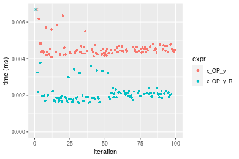

```r
> OP
[1] "-"
> stats <- microbenchmark(x_OP_y = x_OP_y(x, y, OP = OP, na.rm = FALSE), x_OP_y_R = x_OP_y_R(x, y, 
+     OP = OP, na.rm = FALSE), unit = "ms")
> gc()
           used  (Mb) gc trigger  (Mb)  max used  (Mb)
Ncells  5402218 288.6    8529671 455.6   8529671 455.6
Vcells 10491034  80.1   39910282 304.5 101881463 777.3
```

_Table: Benchmarking of x_OP_y() and x_OP_y_R() on integer+10x10+sub data. The top panel shows times in milliseconds and the bottom panel shows relative times._


|   |expr     |      min|        lq|      mean|    median|        uq|      max|
|:--|:--------|--------:|---------:|---------:|---------:|---------:|--------:|
|2  |x_OP_y_R | 0.001762| 0.0020735| 0.0024343| 0.0021740| 0.0023385| 0.015272|
|1  |x_OP_y   | 0.004476| 0.0047290| 0.0051702| 0.0048735| 0.0050755| 0.023710|


|   |expr     |      min|       lq|     mean|  median|       uq|      max|
|:--|:--------|--------:|--------:|--------:|-------:|--------:|--------:|
|2  |x_OP_y_R | 1.000000| 1.000000| 1.000000| 1.00000| 1.000000| 1.000000|
|1  |x_OP_y   | 2.540295| 2.280685| 2.123931| 2.24172| 2.170408| 1.552514|

_Figure: Benchmarking of x_OP_y() and x_OP_y_R() on integer+10x10+sub data.  Outliers are displayed as crosses.  Times are in milliseconds._

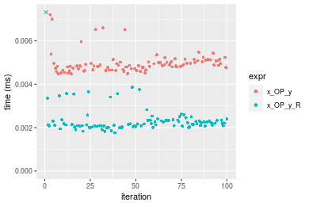

```r
> OP
[1] "*"
> stats <- microbenchmark(x_OP_y = x_OP_y(x, y, OP = OP, na.rm = FALSE), x_OP_y_R = x_OP_y_R(x, y, 
+     OP = OP, na.rm = FALSE), unit = "ms")
> gc()
           used  (Mb) gc trigger  (Mb)  max used  (Mb)
Ncells  5402281 288.6    8529671 455.6   8529671 455.6
Vcells 10491588  80.1   39910282 304.5 101881463 777.3
```

_Table: Benchmarking of x_OP_y() and x_OP_y_R() on integer+10x10+mul data. The top panel shows times in milliseconds and the bottom panel shows relative times._


|   |expr     |      min|        lq|      mean|    median|        uq|      max|
|:--|:--------|--------:|---------:|---------:|---------:|---------:|--------:|
|2  |x_OP_y_R | 0.001959| 0.0022125| 0.0024465| 0.0023060| 0.0024870| 0.010178|
|1  |x_OP_y   | 0.004448| 0.0047065| 0.0052627| 0.0048795| 0.0051225| 0.026669|


|   |expr     |      min|       lq|     mean|   median|      uq|      max|
|:--|:--------|--------:|--------:|--------:|--------:|-------:|--------:|
|2  |x_OP_y_R | 1.000000| 1.000000| 1.000000| 1.000000| 1.00000| 1.000000|
|1  |x_OP_y   | 2.270546| 2.127232| 2.151139| 2.116002| 2.05971| 2.620259|

_Figure: Benchmarking of x_OP_y() and x_OP_y_R() on integer+10x10+mul data.  Outliers are displayed as crosses.  Times are in milliseconds._

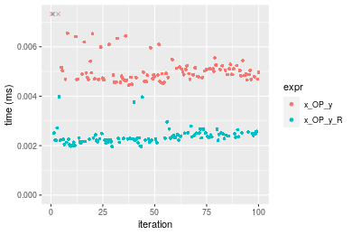

```r
> OP
[1] "/"
> stats <- microbenchmark(x_OP_y = x_OP_y(x, y, OP = OP, na.rm = FALSE), x_OP_y_R = x_OP_y_R(x, y, 
+     OP = OP, na.rm = FALSE), unit = "ms")
> gc()
           used  (Mb) gc trigger  (Mb)  max used  (Mb)
Ncells  5402344 288.6    8529671 455.6   8529671 455.6
Vcells 10491630  80.1   39910282 304.5 101881463 777.3
```

_Table: Benchmarking of x_OP_y() and x_OP_y_R() on integer+10x10+div data. The top panel shows times in milliseconds and the bottom panel shows relative times._


|   |expr     |      min|        lq|      mean|    median|        uq|      max|
|:--|:--------|--------:|---------:|---------:|---------:|---------:|--------:|
|2  |x_OP_y_R | 0.001814| 0.0020675| 0.0023544| 0.0021820| 0.0023335| 0.014515|
|1  |x_OP_y   | 0.004503| 0.0047955| 0.0051758| 0.0049525| 0.0050735| 0.022483|


|   |expr     |      min|       lq|     mean|   median|       uq|      max|
|:--|:--------|--------:|--------:|--------:|--------:|--------:|--------:|
|2  |x_OP_y_R | 1.000000| 1.000000| 1.000000| 1.000000| 1.000000| 1.000000|
|1  |x_OP_y   | 2.482359| 2.319468| 2.198381| 2.269707| 2.174202| 1.548949|

_Figure: Benchmarking of x_OP_y() and x_OP_y_R() on integer+10x10+div data.  Outliers are displayed as crosses.  Times are in milliseconds._

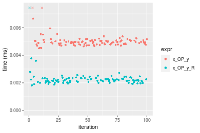


### 100x100 vector

#### All elements
```r
> x <- data[["100x100"]]
> y <- x[, 1L]
```

```r
> OP
[1] "+"
> stats <- microbenchmark(x_OP_y = x_OP_y(x, y, OP = OP, na.rm = FALSE), x_OP_y_R = x_OP_y_R(x, y, 
+     OP = OP, na.rm = FALSE), unit = "ms")
> gc()
           used  (Mb) gc trigger  (Mb)  max used  (Mb)
Ncells  5402407 288.6    8529671 455.6   8529671 455.6
Vcells 10491714  80.1   39910282 304.5 101881463 777.3
```

_Table: Benchmarking of x_OP_y() and x_OP_y_R() on integer+100x100+add data. The top panel shows times in milliseconds and the bottom panel shows relative times._


|   |expr     |      min|        lq|      mean|    median|        uq|      max|
|:--|:--------|--------:|---------:|---------:|---------:|---------:|--------:|
|2  |x_OP_y_R | 0.031469| 0.0326930| 0.0341347| 0.0337845| 0.0351970| 0.042978|
|1  |x_OP_y   | 0.058127| 0.0608795| 0.0644826| 0.0632325| 0.0659555| 0.089735|


|   |expr     |      min|       lq|     mean|   median|       uq|      max|
|:--|:--------|--------:|--------:|--------:|--------:|--------:|--------:|
|2  |x_OP_y_R | 1.000000| 1.000000| 1.000000| 1.000000| 1.000000| 1.000000|
|1  |x_OP_y   | 1.847119| 1.862157| 1.889064| 1.871642| 1.873895| 2.087929|

_Figure: Benchmarking of x_OP_y() and x_OP_y_R() on integer+100x100+add data.  Outliers are displayed as crosses.  Times are in milliseconds._

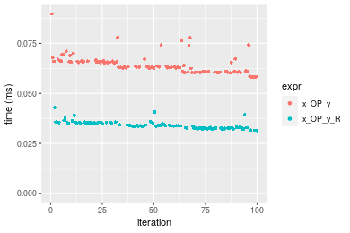

```r
> OP
[1] "-"
> stats <- microbenchmark(x_OP_y = x_OP_y(x, y, OP = OP, na.rm = FALSE), x_OP_y_R = x_OP_y_R(x, y, 
+     OP = OP, na.rm = FALSE), unit = "ms")
> gc()
           used  (Mb) gc trigger  (Mb)  max used  (Mb)
Ncells  5402470 288.6    8529671 455.6   8529671 455.6
Vcells 10491967  80.1   39910282 304.5 101881463 777.3
```

_Table: Benchmarking of x_OP_y() and x_OP_y_R() on integer+100x100+sub data. The top panel shows times in milliseconds and the bottom panel shows relative times._


|   |expr     |      min|        lq|      mean|    median|        uq|      max|
|:--|:--------|--------:|---------:|---------:|---------:|---------:|--------:|
|2  |x_OP_y_R | 0.030145| 0.0314005| 0.0330939| 0.0329155| 0.0341405| 0.049186|
|1  |x_OP_y   | 0.054284| 0.0564870| 0.0596179| 0.0589780| 0.0615700| 0.083293|


|   |expr     |      min|      lq|     mean| median|      uq|      max|
|:--|:--------|--------:|-------:|--------:|------:|-------:|--------:|
|2  |x_OP_y_R | 1.000000| 1.00000| 1.000000| 1.0000| 1.00000| 1.000000|
|1  |x_OP_y   | 1.800763| 1.79892| 1.801477| 1.7918| 1.80343| 1.693429|

_Figure: Benchmarking of x_OP_y() and x_OP_y_R() on integer+100x100+sub data.  Outliers are displayed as crosses.  Times are in milliseconds._

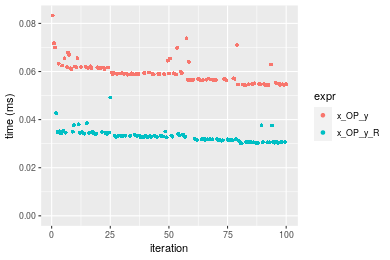

```r
> OP
[1] "*"
> stats <- microbenchmark(x_OP_y = x_OP_y(x, y, OP = OP, na.rm = FALSE), x_OP_y_R = x_OP_y_R(x, y, 
+     OP = OP, na.rm = FALSE), unit = "ms")
> gc()
           used  (Mb) gc trigger  (Mb)  max used  (Mb)
Ncells  5402533 288.6    8529671 455.6   8529671 455.6
Vcells 10492264  80.1   39910282 304.5 101881463 777.3
```

_Table: Benchmarking of x_OP_y() and x_OP_y_R() on integer+100x100+mul data. The top panel shows times in milliseconds and the bottom panel shows relative times._


|   |expr     |      min|        lq|      mean|    median|        uq|      max|
|:--|:--------|--------:|---------:|---------:|---------:|---------:|--------:|
|2  |x_OP_y_R | 0.045483| 0.0487630| 0.0509329| 0.0493590| 0.0528595| 0.069041|
|1  |x_OP_y   | 0.052961| 0.0570025| 0.0592485| 0.0583745| 0.0617815| 0.080283|


|   |expr     |      min|      lq|     mean|   median|       uq|      max|
|:--|:--------|--------:|-------:|--------:|--------:|--------:|--------:|
|2  |x_OP_y_R | 1.000000| 1.00000| 1.000000| 1.000000| 1.000000| 1.000000|
|1  |x_OP_y   | 1.164413| 1.16897| 1.163266| 1.182652| 1.168787| 1.162831|

_Figure: Benchmarking of x_OP_y() and x_OP_y_R() on integer+100x100+mul data.  Outliers are displayed as crosses.  Times are in milliseconds._

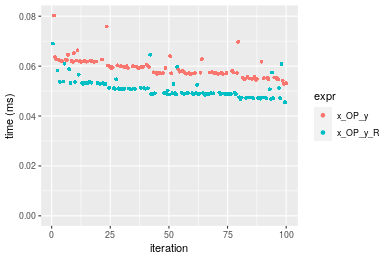

```r
> OP
[1] "/"
> stats <- microbenchmark(x_OP_y = x_OP_y(x, y, OP = OP, na.rm = FALSE), x_OP_y_R = x_OP_y_R(x, y, 
+     OP = OP, na.rm = FALSE), unit = "ms")
> gc()
           used  (Mb) gc trigger  (Mb)  max used  (Mb)
Ncells  5402596 288.6    8529671 455.6   8529671 455.6
Vcells 10492306  80.1   39910282 304.5 101881463 777.3
```

_Table: Benchmarking of x_OP_y() and x_OP_y_R() on integer+100x100+div data. The top panel shows times in milliseconds and the bottom panel shows relative times._


|   |expr     |      min|       lq|      mean|    median|        uq|      max|
|:--|:--------|--------:|--------:|---------:|---------:|---------:|--------:|
|2  |x_OP_y_R | 0.021082| 0.022092| 0.0236331| 0.0231195| 0.0239245| 0.044275|
|1  |x_OP_y   | 0.054500| 0.056597| 0.0591946| 0.0592540| 0.0603160| 0.077289|


|   |expr     |      min|       lq|     mean|   median|       uq|      max|
|:--|:--------|--------:|--------:|--------:|--------:|--------:|--------:|
|2  |x_OP_y_R | 1.000000| 1.000000| 1.000000| 1.000000| 1.000000| 1.000000|
|1  |x_OP_y   | 2.585144| 2.561878| 2.504738| 2.562945| 2.521098| 1.745658|

_Figure: Benchmarking of x_OP_y() and x_OP_y_R() on integer+100x100+div data.  Outliers are displayed as crosses.  Times are in milliseconds._

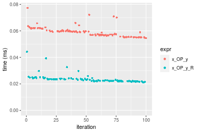


### 1000x10 vector

#### All elements
```r
> x <- data[["1000x10"]]
> y <- x[, 1L]
```

```r
> OP
[1] "+"
> stats <- microbenchmark(x_OP_y = x_OP_y(x, y, OP = OP, na.rm = FALSE), x_OP_y_R = x_OP_y_R(x, y, 
+     OP = OP, na.rm = FALSE), unit = "ms")
> gc()
           used  (Mb) gc trigger  (Mb)  max used  (Mb)
Ncells  5402659 288.6    8529671 455.6   8529671 455.6
Vcells 10493102  80.1   39910282 304.5 101881463 777.3
```

_Table: Benchmarking of x_OP_y() and x_OP_y_R() on integer+1000x10+add data. The top panel shows times in milliseconds and the bottom panel shows relative times._


|   |expr     |      min|       lq|      mean|    median|        uq|      max|
|:--|:--------|--------:|--------:|---------:|---------:|---------:|--------:|
|2  |x_OP_y_R | 0.031729| 0.033068| 0.0352056| 0.0344665| 0.0360445| 0.064046|
|1  |x_OP_y   | 0.056674| 0.059156| 0.0619956| 0.0616530| 0.0641960| 0.081126|


|   |expr     |      min|      lq|     mean|  median|       uq|      max|
|:--|:--------|--------:|-------:|--------:|-------:|--------:|--------:|
|2  |x_OP_y_R | 1.000000| 1.00000| 1.000000| 1.00000| 1.000000| 1.000000|
|1  |x_OP_y   | 1.786189| 1.78892| 1.760961| 1.78878| 1.781021| 1.266683|

_Figure: Benchmarking of x_OP_y() and x_OP_y_R() on integer+1000x10+add data.  Outliers are displayed as crosses.  Times are in milliseconds._

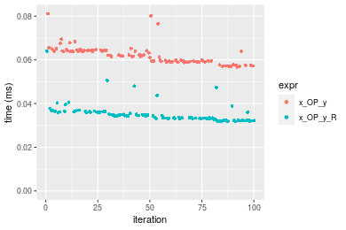

```r
> OP
[1] "-"
> stats <- microbenchmark(x_OP_y = x_OP_y(x, y, OP = OP, na.rm = FALSE), x_OP_y_R = x_OP_y_R(x, y, 
+     OP = OP, na.rm = FALSE), unit = "ms")
> gc()
           used  (Mb) gc trigger  (Mb)  max used  (Mb)
Ncells  5402722 288.6    8529671 455.6   8529671 455.6
Vcells 10493144  80.1   39910282 304.5 101881463 777.3
```

_Table: Benchmarking of x_OP_y() and x_OP_y_R() on integer+1000x10+sub data. The top panel shows times in milliseconds and the bottom panel shows relative times._


|   |expr     |      min|        lq|      mean|    median|       uq|      max|
|:--|:--------|--------:|---------:|---------:|---------:|--------:|--------:|
|2  |x_OP_y_R | 0.035391| 0.0367795| 0.0391165| 0.0384255| 0.040157| 0.066624|
|1  |x_OP_y   | 0.053326| 0.0559190| 0.0589082| 0.0579965| 0.060646| 0.078191|


|   |expr     |      min|       lq|     mean|   median|       uq|      max|
|:--|:--------|--------:|--------:|--------:|--------:|--------:|--------:|
|2  |x_OP_y_R | 1.000000| 1.000000| 1.000000| 1.000000| 1.000000| 1.000000|
|1  |x_OP_y   | 1.506767| 1.520385| 1.505967| 1.509323| 1.510222| 1.173616|

_Figure: Benchmarking of x_OP_y() and x_OP_y_R() on integer+1000x10+sub data.  Outliers are displayed as crosses.  Times are in milliseconds._

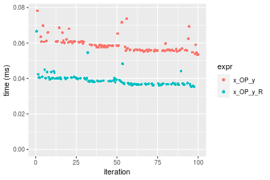

```r
> OP
[1] "*"
> stats <- microbenchmark(x_OP_y = x_OP_y(x, y, OP = OP, na.rm = FALSE), x_OP_y_R = x_OP_y_R(x, y, 
+     OP = OP, na.rm = FALSE), unit = "ms")
> gc()
           used  (Mb) gc trigger  (Mb)  max used  (Mb)
Ncells  5402785 288.6    8529671 455.6   8529671 455.6
Vcells 10493571  80.1   39910282 304.5 101881463 777.3
```

_Table: Benchmarking of x_OP_y() and x_OP_y_R() on integer+1000x10+mul data. The top panel shows times in milliseconds and the bottom panel shows relative times._


|   |expr     |      min|        lq|      mean|   median|        uq|      max|
|:--|:--------|--------:|---------:|---------:|--------:|---------:|--------:|
|2  |x_OP_y_R | 0.045229| 0.0470680| 0.0509546| 0.049234| 0.0528285| 0.079048|
|1  |x_OP_y   | 0.051532| 0.0534885| 0.0568272| 0.055202| 0.0584470| 0.092235|


|   |expr     |      min|       lq|    mean|   median|       uq|      max|
|:--|:--------|--------:|--------:|-------:|--------:|--------:|--------:|
|2  |x_OP_y_R | 1.000000| 1.000000| 1.00000| 1.000000| 1.000000| 1.000000|
|1  |x_OP_y   | 1.139358| 1.136409| 1.11525| 1.121217| 1.106354| 1.166823|

_Figure: Benchmarking of x_OP_y() and x_OP_y_R() on integer+1000x10+mul data.  Outliers are displayed as crosses.  Times are in milliseconds._

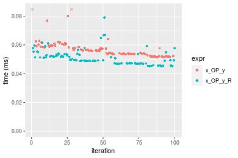

```r
> OP
[1] "/"
> stats <- microbenchmark(x_OP_y = x_OP_y(x, y, OP = OP, na.rm = FALSE), x_OP_y_R = x_OP_y_R(x, y, 
+     OP = OP, na.rm = FALSE), unit = "ms")
> gc()
           used  (Mb) gc trigger  (Mb)  max used  (Mb)
Ncells  5402848 288.6    8529671 455.6   8529671 455.6
Vcells 10493613  80.1   39910282 304.5 101881463 777.3
```

_Table: Benchmarking of x_OP_y() and x_OP_y_R() on integer+1000x10+div data. The top panel shows times in milliseconds and the bottom panel shows relative times._


|   |expr     |      min|        lq|      mean|   median|       uq|      max|
|:--|:--------|--------:|---------:|---------:|--------:|--------:|--------:|
|2  |x_OP_y_R | 0.021889| 0.0224825| 0.0242224| 0.023268| 0.024735| 0.046390|
|1  |x_OP_y   | 0.055214| 0.0561815| 0.0586379| 0.058037| 0.060719| 0.079152|


|   |expr     |      min|       lq|     mean|   median|       uq|     max|
|:--|:--------|--------:|--------:|--------:|--------:|--------:|-------:|
|2  |x_OP_y_R | 1.000000| 1.000000| 1.000000| 1.000000| 1.000000| 1.00000|
|1  |x_OP_y   | 2.522454| 2.498899| 2.420812| 2.494284| 2.454781| 1.70623|

_Figure: Benchmarking of x_OP_y() and x_OP_y_R() on integer+1000x10+div data.  Outliers are displayed as crosses.  Times are in milliseconds._

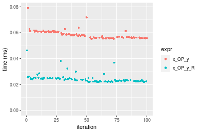


### 10x1000 vector

#### All elements
```r
> x <- data[["10x1000"]]
> y <- x[, 1L]
```

```r
> OP
[1] "+"
> stats <- microbenchmark(x_OP_y = x_OP_y(x, y, OP = OP, na.rm = FALSE), x_OP_y_R = x_OP_y_R(x, y, 
+     OP = OP, na.rm = FALSE), unit = "ms")
> gc()
           used  (Mb) gc trigger  (Mb)  max used  (Mb)
Ncells  5402911 288.6    8529671 455.6   8529671 455.6
Vcells 10493610  80.1   39910282 304.5 101881463 777.3
```

_Table: Benchmarking of x_OP_y() and x_OP_y_R() on integer+10x1000+add data. The top panel shows times in milliseconds and the bottom panel shows relative times._


|   |expr     |      min|       lq|      mean|    median|       uq|      max|
|:--|:--------|--------:|--------:|---------:|---------:|--------:|--------:|
|2  |x_OP_y_R | 0.030982| 0.032348| 0.0336535| 0.0328665| 0.034370| 0.047486|
|1  |x_OP_y   | 0.057955| 0.060729| 0.0634756| 0.0620700| 0.064336| 0.091238|


|   |expr     |      min|       lq|     mean|   median|       uq|      max|
|:--|:--------|--------:|--------:|--------:|--------:|--------:|--------:|
|2  |x_OP_y_R | 1.000000| 1.000000| 1.000000| 1.000000| 1.000000| 1.000000|
|1  |x_OP_y   | 1.870602| 1.877365| 1.886155| 1.888549| 1.871865| 1.921366|

_Figure: Benchmarking of x_OP_y() and x_OP_y_R() on integer+10x1000+add data.  Outliers are displayed as crosses.  Times are in milliseconds._

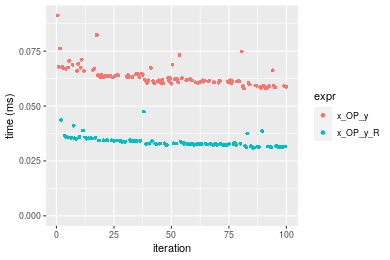

```r
> OP
[1] "-"
> stats <- microbenchmark(x_OP_y = x_OP_y(x, y, OP = OP, na.rm = FALSE), x_OP_y_R = x_OP_y_R(x, y, 
+     OP = OP, na.rm = FALSE), unit = "ms")
> gc()
           used  (Mb) gc trigger  (Mb)  max used  (Mb)
Ncells  5402974 288.6    8529671 455.6   8529671 455.6
Vcells 10493652  80.1   39910282 304.5 101881463 777.3
```

_Table: Benchmarking of x_OP_y() and x_OP_y_R() on integer+10x1000+sub data. The top panel shows times in milliseconds and the bottom panel shows relative times._


|   |expr     |      min|        lq|      mean|    median|       uq|      max|
|:--|:--------|--------:|---------:|---------:|---------:|--------:|--------:|
|2  |x_OP_y_R | 0.030304| 0.0308255| 0.0327464| 0.0320415| 0.033471| 0.049065|
|1  |x_OP_y   | 0.055043| 0.0560135| 0.0598170| 0.0585225| 0.062212| 0.079605|


|   |expr     |      min|       lq|     mean|   median|       uq|     max|
|:--|:--------|--------:|--------:|--------:|--------:|--------:|-------:|
|2  |x_OP_y_R | 1.000000| 1.000000| 1.000000| 1.000000| 1.000000| 1.00000|
|1  |x_OP_y   | 1.816361| 1.817116| 1.826676| 1.826459| 1.858684| 1.62244|

_Figure: Benchmarking of x_OP_y() and x_OP_y_R() on integer+10x1000+sub data.  Outliers are displayed as crosses.  Times are in milliseconds._

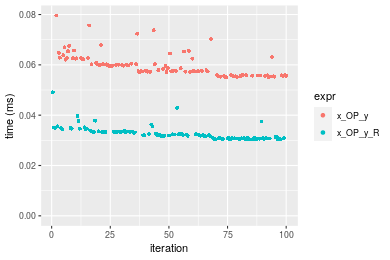

```r
> OP
[1] "*"
> stats <- microbenchmark(x_OP_y = x_OP_y(x, y, OP = OP, na.rm = FALSE), x_OP_y_R = x_OP_y_R(x, y, 
+     OP = OP, na.rm = FALSE), unit = "ms")
> gc()
           used  (Mb) gc trigger  (Mb)  max used  (Mb)
Ncells  5403037 288.6    8529671 455.6   8529671 455.6
Vcells 10493694  80.1   39910282 304.5 101881463 777.3
```

_Table: Benchmarking of x_OP_y() and x_OP_y_R() on integer+10x1000+mul data. The top panel shows times in milliseconds and the bottom panel shows relative times._


|   |expr     |     min|        lq|      mean|    median|        uq|      max|
|:--|:--------|-------:|---------:|---------:|---------:|---------:|--------:|
|2  |x_OP_y_R | 0.04677| 0.0483545| 0.0507220| 0.0496180| 0.0529620| 0.063674|
|1  |x_OP_y   | 0.05630| 0.0573090| 0.0612647| 0.0604095| 0.0638595| 0.088579|


|   |expr     |      min|       lq|     mean|   median|       uq|      max|
|:--|:--------|--------:|--------:|--------:|--------:|--------:|--------:|
|2  |x_OP_y_R | 1.000000| 1.000000| 1.000000| 1.000000| 1.000000| 1.000000|
|1  |x_OP_y   | 1.203763| 1.185184| 1.207853| 1.217492| 1.205761| 1.391133|

_Figure: Benchmarking of x_OP_y() and x_OP_y_R() on integer+10x1000+mul data.  Outliers are displayed as crosses.  Times are in milliseconds._


```r
> OP
[1] "/"
> stats <- microbenchmark(x_OP_y = x_OP_y(x, y, OP = OP, na.rm = FALSE), x_OP_y_R = x_OP_y_R(x, y, 
+     OP = OP, na.rm = FALSE), unit = "ms")
> gc()
           used  (Mb) gc trigger  (Mb)  max used  (Mb)
Ncells  5403100 288.6    8529671 455.6   8529671 455.6
Vcells 10494295  80.1   39910282 304.5 101881463 777.3
```

_Table: Benchmarking of x_OP_y() and x_OP_y_R() on integer+10x1000+div data. The top panel shows times in milliseconds and the bottom panel shows relative times._


|   |expr     |      min|        lq|      mean|    median|       uq|      max|
|:--|:--------|--------:|---------:|---------:|---------:|--------:|--------:|
|2  |x_OP_y_R | 0.021209| 0.0223925| 0.0242928| 0.0233565| 0.024489| 0.039011|
|1  |x_OP_y   | 0.055127| 0.0574600| 0.0603755| 0.0598045| 0.060769| 0.093059|


|   |expr     |      min|       lq|     mean|   median|       uq|      max|
|:--|:--------|--------:|--------:|--------:|--------:|--------:|--------:|
|2  |x_OP_y_R | 1.000000| 1.000000| 1.000000| 1.000000| 1.000000| 1.000000|
|1  |x_OP_y   | 2.599227| 2.566038| 2.485327| 2.560508| 2.481482| 2.385455|

_Figure: Benchmarking of x_OP_y() and x_OP_y_R() on integer+10x1000+div data.  Outliers are displayed as crosses.  Times are in milliseconds._

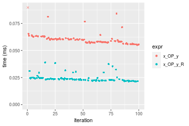


### 100x1000 vector

#### All elements
```r
> x <- data[["100x1000"]]
> y <- x[, 1L]
```

```r
> OP
[1] "+"
> stats <- microbenchmark(x_OP_y = x_OP_y(x, y, OP = OP, na.rm = FALSE), x_OP_y_R = x_OP_y_R(x, y, 
+     OP = OP, na.rm = FALSE), unit = "ms")
> gc()
           used  (Mb) gc trigger  (Mb)  max used  (Mb)
Ncells  5403163 288.6    8529671 455.6   8529671 455.6
Vcells 10494379  80.1   39910282 304.5 101881463 777.3
```

_Table: Benchmarking of x_OP_y() and x_OP_y_R() on integer+100x1000+add data. The top panel shows times in milliseconds and the bottom panel shows relative times._


|   |expr     |      min|        lq|      mean|    median|        uq|      max|
|:--|:--------|--------:|---------:|---------:|---------:|---------:|--------:|
|2  |x_OP_y_R | 0.201069| 0.2018455| 0.2442470| 0.2343965| 0.2809435| 0.353473|
|1  |x_OP_y   | 0.373197| 0.3795980| 0.4456981| 0.4244400| 0.4868685| 0.646700|


|   |expr     |      min|       lq|     mean|   median|       uq|     max|
|:--|:--------|--------:|--------:|--------:|--------:|--------:|-------:|
|2  |x_OP_y_R | 1.000000| 1.000000| 1.000000| 1.000000| 1.000000| 1.00000|
|1  |x_OP_y   | 1.856064| 1.880636| 1.824784| 1.810778| 1.732977| 1.82956|

_Figure: Benchmarking of x_OP_y() and x_OP_y_R() on integer+100x1000+add data.  Outliers are displayed as crosses.  Times are in milliseconds._

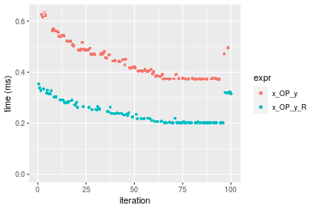

```r
> OP
[1] "-"
> stats <- microbenchmark(x_OP_y = x_OP_y(x, y, OP = OP, na.rm = FALSE), x_OP_y_R = x_OP_y_R(x, y, 
+     OP = OP, na.rm = FALSE), unit = "ms")
> gc()
           used  (Mb) gc trigger  (Mb)  max used  (Mb)
Ncells  5403226 288.6    8529671 455.6   8529671 455.6
Vcells 10494421  80.1   39910282 304.5 101881463 777.3
```

_Table: Benchmarking of x_OP_y() and x_OP_y_R() on integer+100x1000+sub data. The top panel shows times in milliseconds and the bottom panel shows relative times._


|   |expr     |      min|        lq|      mean|    median|        uq|      max|
|:--|:--------|--------:|---------:|---------:|---------:|---------:|--------:|
|2  |x_OP_y_R | 0.194085| 0.1949615| 0.2294495| 0.2123840| 0.2535775| 0.336659|
|1  |x_OP_y   | 0.347655| 0.3492515| 0.4170779| 0.3993875| 0.4535080| 0.585131|


|   |expr     |      min|       lq|     mean|   median|       uq|      max|
|:--|:--------|--------:|--------:|--------:|--------:|--------:|--------:|
|2  |x_OP_y_R | 1.000000| 1.000000| 1.000000| 1.000000| 1.000000| 1.000000|
|1  |x_OP_y   | 1.791251| 1.791387| 1.817733| 1.880497| 1.788439| 1.738053|

_Figure: Benchmarking of x_OP_y() and x_OP_y_R() on integer+100x1000+sub data.  Outliers are displayed as crosses.  Times are in milliseconds._

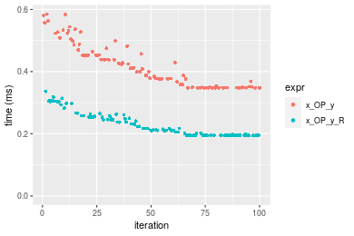

```r
> OP
[1] "*"
> stats <- microbenchmark(x_OP_y = x_OP_y(x, y, OP = OP, na.rm = FALSE), x_OP_y_R = x_OP_y_R(x, y, 
+     OP = OP, na.rm = FALSE), unit = "ms")
> gc()
           used  (Mb) gc trigger  (Mb)  max used  (Mb)
Ncells  5403289 288.6    8529671 455.6   8529671 455.6
Vcells 10495100  80.1   39910282 304.5 101881463 777.3
```

_Table: Benchmarking of x_OP_y() and x_OP_y_R() on integer+100x1000+mul data. The top panel shows times in milliseconds and the bottom panel shows relative times._


|   |expr     |      min|        lq|      mean|   median|       uq|      max|
|:--|:--------|--------:|---------:|---------:|--------:|--------:|--------:|
|2  |x_OP_y_R | 0.310607| 0.3136910| 0.3659744| 0.339103| 0.399359| 0.530073|
|1  |x_OP_y   | 0.351335| 0.3521345| 0.4036749| 0.381364| 0.443125| 0.585934|


|   |expr     |      min|       lq|     mean|   median|       uq|      max|
|:--|:--------|--------:|--------:|--------:|--------:|--------:|--------:|
|2  |x_OP_y_R | 1.000000| 1.000000| 1.000000| 1.000000| 1.000000| 1.000000|
|1  |x_OP_y   | 1.131124| 1.122552| 1.103014| 1.124626| 1.109591| 1.105384|

_Figure: Benchmarking of x_OP_y() and x_OP_y_R() on integer+100x1000+mul data.  Outliers are displayed as crosses.  Times are in milliseconds._

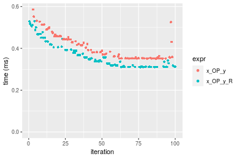

```r
> OP
[1] "/"
> stats <- microbenchmark(x_OP_y = x_OP_y(x, y, OP = OP, na.rm = FALSE), x_OP_y_R = x_OP_y_R(x, y, 
+     OP = OP, na.rm = FALSE), unit = "ms")
> gc()
           used  (Mb) gc trigger  (Mb)  max used  (Mb)
Ncells  5403352 288.6    8529671 455.6   8529671 455.6
Vcells 10495142  80.1   39910282 304.5 101881463 777.3
```

_Table: Benchmarking of x_OP_y() and x_OP_y_R() on integer+100x1000+div data. The top panel shows times in milliseconds and the bottom panel shows relative times._


|   |expr     |      min|       lq|      mean|    median|       uq|      max|
|:--|:--------|--------:|--------:|---------:|---------:|--------:|--------:|
|2  |x_OP_y_R | 0.166981| 0.207848| 0.3177664| 0.3663985| 0.389694| 0.467825|
|1  |x_OP_y   | 0.435427| 0.468897| 0.5527325| 0.5785120| 0.593809| 0.727670|


|   |expr     |      min|       lq|    mean|   median|       uq|      max|
|:--|:--------|--------:|--------:|-------:|--------:|--------:|--------:|
|2  |x_OP_y_R | 1.000000| 1.000000| 1.00000| 1.000000| 1.000000| 1.000000|
|1  |x_OP_y   | 2.607644| 2.255961| 1.73943| 1.578915| 1.523783| 1.555432|

_Figure: Benchmarking of x_OP_y() and x_OP_y_R() on integer+100x1000+div data.  Outliers are displayed as crosses.  Times are in milliseconds._

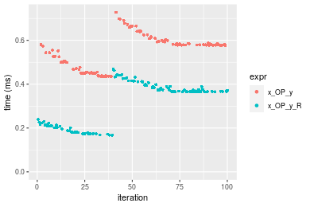


### 1000x100 vector

#### All elements
```r
> x <- data[["1000x100"]]
> y <- x[, 1L]
```

```r
> OP
[1] "+"
> stats <- microbenchmark(x_OP_y = x_OP_y(x, y, OP = OP, na.rm = FALSE), x_OP_y_R = x_OP_y_R(x, y, 
+     OP = OP, na.rm = FALSE), unit = "ms")
> gc()
           used  (Mb) gc trigger  (Mb)  max used  (Mb)
Ncells  5403415 288.6    8529671 455.6   8529671 455.6
Vcells 10495634  80.1   39910282 304.5 101881463 777.3
```

_Table: Benchmarking of x_OP_y() and x_OP_y_R() on integer+1000x100+add data. The top panel shows times in milliseconds and the bottom panel shows relative times._


|   |expr     |      min|       lq|      mean|    median|        uq|      max|
|:--|:--------|--------:|--------:|---------:|---------:|---------:|--------:|
|2  |x_OP_y_R | 0.205045| 0.208476| 0.2521633| 0.2419085| 0.2751795| 0.363857|
|1  |x_OP_y   | 0.364726| 0.366279| 0.4398643| 0.4318195| 0.4816780| 0.633653|


|   |expr     |      min|       lq|     mean|   median|       uq|      max|
|:--|:--------|--------:|--------:|--------:|--------:|--------:|--------:|
|2  |x_OP_y_R | 1.000000| 1.000000| 1.000000| 1.000000| 1.000000| 1.000000|
|1  |x_OP_y   | 1.778761| 1.756936| 1.744363| 1.785053| 1.750414| 1.741489|

_Figure: Benchmarking of x_OP_y() and x_OP_y_R() on integer+1000x100+add data.  Outliers are displayed as crosses.  Times are in milliseconds._

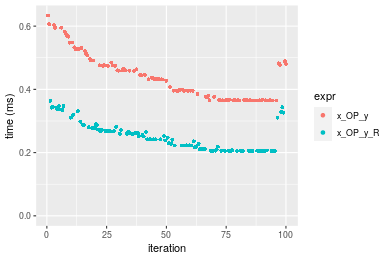

```r
> OP
[1] "-"
> stats <- microbenchmark(x_OP_y = x_OP_y(x, y, OP = OP, na.rm = FALSE), x_OP_y_R = x_OP_y_R(x, y, 
+     OP = OP, na.rm = FALSE), unit = "ms")
> gc()
           used  (Mb) gc trigger  (Mb)  max used  (Mb)
Ncells  5403478 288.6    8529671 455.6   8529671 455.6
Vcells 10495676  80.1   39910282 304.5 101881463 777.3
```

_Table: Benchmarking of x_OP_y() and x_OP_y_R() on integer+1000x100+sub data. The top panel shows times in milliseconds and the bottom panel shows relative times._


|   |expr     |      min|        lq|      mean|    median|        uq|      max|
|:--|:--------|--------:|---------:|---------:|---------:|---------:|--------:|
|2  |x_OP_y_R | 0.229490| 0.2336960| 0.2736903| 0.2676895| 0.2963935| 0.445591|
|1  |x_OP_y   | 0.339242| 0.3407585| 0.4004085| 0.3790170| 0.4421515| 0.600065|


|   |expr     |      min|       lq|     mean|   median|       uq|      max|
|:--|:--------|--------:|--------:|--------:|--------:|--------:|--------:|
|2  |x_OP_y_R | 1.000000| 1.000000| 1.000000| 1.000000| 1.000000| 1.000000|
|1  |x_OP_y   | 1.478243| 1.458127| 1.462998| 1.415883| 1.491772| 1.346672|

_Figure: Benchmarking of x_OP_y() and x_OP_y_R() on integer+1000x100+sub data.  Outliers are displayed as crosses.  Times are in milliseconds._

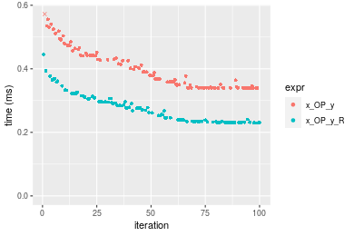

```r
> OP
[1] "*"
> stats <- microbenchmark(x_OP_y = x_OP_y(x, y, OP = OP, na.rm = FALSE), x_OP_y_R = x_OP_y_R(x, y, 
+     OP = OP, na.rm = FALSE), unit = "ms")
> gc()
           used  (Mb) gc trigger  (Mb)  max used  (Mb)
Ncells  5403541 288.6    8529671 455.6   8529671 455.6
Vcells 10496502  80.1   39910282 304.5 101881463 777.3
```

_Table: Benchmarking of x_OP_y() and x_OP_y_R() on integer+1000x100+mul data. The top panel shows times in milliseconds and the bottom panel shows relative times._


|   |expr     |      min|        lq|      mean|   median|       uq|      max|
|:--|:--------|--------:|---------:|---------:|--------:|--------:|--------:|
|2  |x_OP_y_R | 0.310424| 0.3115825| 0.3645297| 0.336936| 0.392807| 0.557051|
|1  |x_OP_y   | 0.343221| 0.3447010| 0.4001292| 0.376380| 0.442234| 0.577459|


|   |expr     |      min|       lq|     mean|   median|      uq|      max|
|:--|:--------|--------:|--------:|--------:|--------:|-------:|--------:|
|2  |x_OP_y_R | 1.000000| 1.000000| 1.000000| 1.000000| 1.00000| 1.000000|
|1  |x_OP_y   | 1.105652| 1.106291| 1.097659| 1.117067| 1.12583| 1.036636|

_Figure: Benchmarking of x_OP_y() and x_OP_y_R() on integer+1000x100+mul data.  Outliers are displayed as crosses.  Times are in milliseconds._

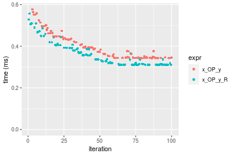

```r
> OP
[1] "/"
> stats <- microbenchmark(x_OP_y = x_OP_y(x, y, OP = OP, na.rm = FALSE), x_OP_y_R = x_OP_y_R(x, y, 
+     OP = OP, na.rm = FALSE), unit = "ms")
> gc()
           used  (Mb) gc trigger  (Mb)  max used  (Mb)
Ncells  5403604 288.6    8529671 455.6   8529671 455.6
Vcells 10496544  80.1   39910282 304.5 101881463 777.3
```

_Table: Benchmarking of x_OP_y() and x_OP_y_R() on integer+1000x100+div data. The top panel shows times in milliseconds and the bottom panel shows relative times._


|   |expr     |      min|        lq|      mean|    median|        uq|      max|
|:--|:--------|--------:|---------:|---------:|---------:|---------:|--------:|
|2  |x_OP_y_R | 0.167526| 0.1936995| 0.3076920| 0.3658255| 0.3750190| 0.452235|
|1  |x_OP_y   | 0.426219| 0.4777825| 0.5498017| 0.5717950| 0.5981815| 0.728082|


|   |expr     |      min|       lq|     mean|   median|      uq|      max|
|:--|:--------|--------:|--------:|--------:|--------:|-------:|--------:|
|2  |x_OP_y_R | 1.000000| 1.000000| 1.000000| 1.000000| 1.00000| 1.000000|
|1  |x_OP_y   | 2.544196| 2.466617| 1.786857| 1.563027| 1.59507| 1.609964|

_Figure: Benchmarking of x_OP_y() and x_OP_y_R() on integer+1000x100+div data.  Outliers are displayed as crosses.  Times are in milliseconds._

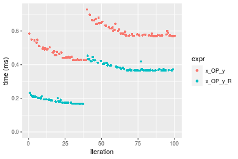


## Data type "double"
### Data
```r
> rmatrix <- function(nrow, ncol, mode = c("logical", "double", "integer", "index"), range = c(-100, 
+     +100), na_prob = 0) {
+     mode <- match.arg(mode)
+     n <- nrow * ncol
+     if (mode == "logical") {
+         x <- sample(c(FALSE, TRUE), size = n, replace = TRUE)
+     }     else if (mode == "index") {
+         x <- seq_len(n)
+         mode <- "integer"
+     }     else {
+         x <- runif(n, min = range[1], max = range[2])
+     }
+     storage.mode(x) <- mode
+     if (na_prob > 0) 
+         x[sample(n, size = na_prob * n)] <- NA
+     dim(x) <- c(nrow, ncol)
+     x
+ }
> rmatrices <- function(scale = 10, seed = 1, ...) {
+     set.seed(seed)
+     data <- list()
+     data[[1]] <- rmatrix(nrow = scale * 1, ncol = scale * 1, ...)
+     data[[2]] <- rmatrix(nrow = scale * 10, ncol = scale * 10, ...)
+     data[[3]] <- rmatrix(nrow = scale * 100, ncol = scale * 1, ...)
+     data[[4]] <- t(data[[3]])
+     data[[5]] <- rmatrix(nrow = scale * 10, ncol = scale * 100, ...)
+     data[[6]] <- t(data[[5]])
+     names(data) <- sapply(data, FUN = function(x) paste(dim(x), collapse = "x"))
+     data
+ }
> data <- rmatrices(mode = mode)
```

### Results

### 10x10 vector

#### All elements
```r
> x <- data[["10x10"]]
> y <- x[, 1L]
```

```r
> OP
[1] "+"
> stats <- microbenchmark(x_OP_y = x_OP_y(x, y, OP = OP, na.rm = FALSE), x_OP_y_R = x_OP_y_R(x, y, 
+     OP = OP, na.rm = FALSE), unit = "ms")
> gc()
           used  (Mb) gc trigger  (Mb)  max used  (Mb)
Ncells  5403667 288.6    8529671 455.6   8529671 455.6
Vcells 10611152  81.0   39910282 304.5 101881463 777.3
```

_Table: Benchmarking of x_OP_y() and x_OP_y_R() on double+10x10+add data. The top panel shows times in milliseconds and the bottom panel shows relative times._


|   |expr     |      min|        lq|      mean|    median|       uq|      max|
|:--|:--------|--------:|---------:|---------:|---------:|--------:|--------:|
|2  |x_OP_y_R | 0.001736| 0.0018625| 0.0021396| 0.0019765| 0.002113| 0.013611|
|1  |x_OP_y   | 0.004265| 0.0045190| 0.0049070| 0.0047005| 0.004845| 0.022099|


|   |expr     |      min|       lq|     mean|   median|       uq|      max|
|:--|:--------|--------:|--------:|--------:|--------:|--------:|--------:|
|2  |x_OP_y_R | 1.000000| 1.000000| 1.000000| 1.000000| 1.000000| 1.000000|
|1  |x_OP_y   | 2.456797| 2.426309| 2.293386| 2.378194| 2.292948| 1.623613|

_Figure: Benchmarking of x_OP_y() and x_OP_y_R() on double+10x10+add data.  Outliers are displayed as crosses.  Times are in milliseconds._

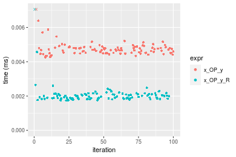

```r
> OP
[1] "-"
> stats <- microbenchmark(x_OP_y = x_OP_y(x, y, OP = OP, na.rm = FALSE), x_OP_y_R = x_OP_y_R(x, y, 
+     OP = OP, na.rm = FALSE), unit = "ms")
> gc()
           used  (Mb) gc trigger  (Mb)  max used  (Mb)
Ncells  5403730 288.6    8529671 455.6   8529671 455.6
Vcells 10612118  81.0   39910282 304.5 101881463 777.3
```

_Table: Benchmarking of x_OP_y() and x_OP_y_R() on double+10x10+sub data. The top panel shows times in milliseconds and the bottom panel shows relative times._


|   |expr     |      min|       lq|      mean|    median|        uq|      max|
|:--|:--------|--------:|--------:|---------:|---------:|---------:|--------:|
|2  |x_OP_y_R | 0.001740| 0.001979| 0.0022198| 0.0020675| 0.0021845| 0.014084|
|1  |x_OP_y   | 0.004255| 0.004651| 0.0049759| 0.0047555| 0.0049015| 0.022229|


|   |expr     |      min|       lq|     mean|   median|       uq|      max|
|:--|:--------|--------:|--------:|--------:|--------:|--------:|--------:|
|2  |x_OP_y_R | 1.000000| 1.000000| 1.000000| 1.000000| 1.000000| 1.000000|
|1  |x_OP_y   | 2.445402| 2.350177| 2.241606| 2.300121| 2.243763| 1.578316|

_Figure: Benchmarking of x_OP_y() and x_OP_y_R() on double+10x10+sub data.  Outliers are displayed as crosses.  Times are in milliseconds._

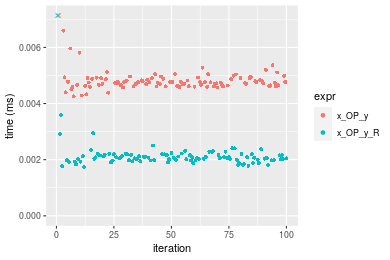

```r
> OP
[1] "*"
> stats <- microbenchmark(x_OP_y = x_OP_y(x, y, OP = OP, na.rm = FALSE), x_OP_y_R = x_OP_y_R(x, y, 
+     OP = OP, na.rm = FALSE), unit = "ms")
> gc()
           used  (Mb) gc trigger  (Mb)  max used  (Mb)
Ncells  5403793 288.6    8529671 455.6   8529671 455.6
Vcells 10612160  81.0   39910282 304.5 101881463 777.3
```

_Table: Benchmarking of x_OP_y() and x_OP_y_R() on double+10x10+mul data. The top panel shows times in milliseconds and the bottom panel shows relative times._


|   |expr     |      min|        lq|      mean|    median|        uq|      max|
|:--|:--------|--------:|---------:|---------:|---------:|---------:|--------:|
|2  |x_OP_y_R | 0.001522| 0.0018145| 0.0020195| 0.0019055| 0.0020160| 0.008407|
|1  |x_OP_y   | 0.004053| 0.0042320| 0.0047225| 0.0043345| 0.0044895| 0.038830|


|   |expr     |      min|       lq|     mean|   median|       uq|     max|
|:--|:--------|--------:|--------:|--------:|--------:|--------:|-------:|
|2  |x_OP_y_R | 1.000000| 1.000000| 1.000000| 1.000000| 1.000000| 1.00000|
|1  |x_OP_y   | 2.662943| 2.332323| 2.338496| 2.274731| 2.226935| 4.61877|

_Figure: Benchmarking of x_OP_y() and x_OP_y_R() on double+10x10+mul data.  Outliers are displayed as crosses.  Times are in milliseconds._

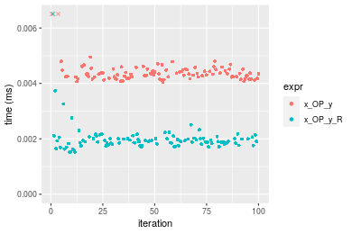

```r
> OP
[1] "/"
> stats <- microbenchmark(x_OP_y = x_OP_y(x, y, OP = OP, na.rm = FALSE), x_OP_y_R = x_OP_y_R(x, y, 
+     OP = OP, na.rm = FALSE), unit = "ms")
> gc()
           used  (Mb) gc trigger  (Mb)  max used  (Mb)
Ncells  5403856 288.6    8529671 455.6   8529671 455.6
Vcells 10612202  81.0   39910282 304.5 101881463 777.3
```

_Table: Benchmarking of x_OP_y() and x_OP_y_R() on double+10x10+div data. The top panel shows times in milliseconds and the bottom panel shows relative times._


|   |expr     |      min|        lq|      mean|   median|        uq|      max|
|:--|:--------|--------:|---------:|---------:|--------:|---------:|--------:|
|2  |x_OP_y_R | 0.001732| 0.0019615| 0.0022150| 0.002111| 0.0021970| 0.012134|
|1  |x_OP_y   | 0.004311| 0.0046495| 0.0049534| 0.004774| 0.0049005| 0.020479|


|   |expr     |     min|      lq|     mean|   median|       uq|      max|
|:--|:--------|-------:|-------:|--------:|--------:|--------:|--------:|
|2  |x_OP_y_R | 1.00000| 1.00000| 1.000000| 1.000000| 1.000000| 1.000000|
|1  |x_OP_y   | 2.48903| 2.37038| 2.236305| 2.261487| 2.230542| 1.687737|

_Figure: Benchmarking of x_OP_y() and x_OP_y_R() on double+10x10+div data.  Outliers are displayed as crosses.  Times are in milliseconds._

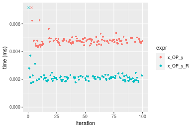


### 100x100 vector

#### All elements
```r
> x <- data[["100x100"]]
> y <- x[, 1L]
```

```r
> OP
[1] "+"
> stats <- microbenchmark(x_OP_y = x_OP_y(x, y, OP = OP, na.rm = FALSE), x_OP_y_R = x_OP_y_R(x, y, 
+     OP = OP, na.rm = FALSE), unit = "ms")
> gc()
           used  (Mb) gc trigger  (Mb)  max used  (Mb)
Ncells  5403919 288.7    8529671 455.6   8529671 455.6
Vcells 10612328  81.0   39910282 304.5 101881463 777.3
```

_Table: Benchmarking of x_OP_y() and x_OP_y_R() on double+100x100+add data. The top panel shows times in milliseconds and the bottom panel shows relative times._


|   |expr     |      min|        lq|     mean|   median|        uq|      max|
|:--|:--------|--------:|---------:|--------:|--------:|---------:|--------:|
|2  |x_OP_y_R | 0.015893| 0.0165795| 0.022736| 0.017249| 0.0292710| 0.064716|
|1  |x_OP_y   | 0.033253| 0.0339055| 0.039120| 0.035321| 0.0401435| 0.108973|


|   |expr     |      min|       lq|     mean|   median|       uq|      max|
|:--|:--------|--------:|--------:|--------:|--------:|--------:|--------:|
|2  |x_OP_y_R | 1.000000| 1.000000| 1.000000| 1.000000| 1.000000| 1.000000|
|1  |x_OP_y   | 2.092305| 2.045025| 1.720624| 2.047713| 1.371443| 1.683865|

_Figure: Benchmarking of x_OP_y() and x_OP_y_R() on double+100x100+add data.  Outliers are displayed as crosses.  Times are in milliseconds._

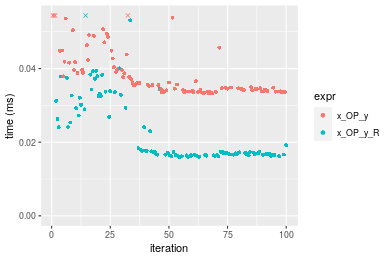

```r
> OP
[1] "-"
> stats <- microbenchmark(x_OP_y = x_OP_y(x, y, OP = OP, na.rm = FALSE), x_OP_y_R = x_OP_y_R(x, y, 
+     OP = OP, na.rm = FALSE), unit = "ms")
> gc()
           used  (Mb) gc trigger  (Mb)  max used  (Mb)
Ncells  5403982 288.7    8529671 455.6   8529671 455.6
Vcells 10612370  81.0   39910282 304.5 101881463 777.3
```

_Table: Benchmarking of x_OP_y() and x_OP_y_R() on double+100x100+sub data. The top panel shows times in milliseconds and the bottom panel shows relative times._


|   |expr     |      min|        lq|      mean|    median|        uq|      max|
|:--|:--------|--------:|---------:|---------:|---------:|---------:|--------:|
|2  |x_OP_y_R | 0.017929| 0.0189055| 0.0198866| 0.0193445| 0.0202875| 0.032878|
|1  |x_OP_y   | 0.037223| 0.0386940| 0.0409129| 0.0393990| 0.0414005| 0.070939|


|   |expr     |      min|       lq|     mean|   median|      uq|      max|
|:--|:--------|--------:|--------:|--------:|--------:|-------:|--------:|
|2  |x_OP_y_R | 1.000000| 1.000000| 1.000000| 1.000000| 1.00000| 1.000000|
|1  |x_OP_y   | 2.076134| 2.046706| 2.057306| 2.036703| 2.04069| 2.157643|

_Figure: Benchmarking of x_OP_y() and x_OP_y_R() on double+100x100+sub data.  Outliers are displayed as crosses.  Times are in milliseconds._

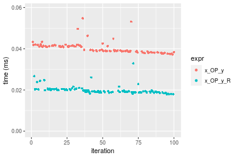

```r
> OP
[1] "*"
> stats <- microbenchmark(x_OP_y = x_OP_y(x, y, OP = OP, na.rm = FALSE), x_OP_y_R = x_OP_y_R(x, y, 
+     OP = OP, na.rm = FALSE), unit = "ms")
> gc()
           used  (Mb) gc trigger  (Mb)  max used  (Mb)
Ncells  5404045 288.7    8529671 455.6   8529671 455.6
Vcells 10612412  81.0   39910282 304.5 101881463 777.3
```

_Table: Benchmarking of x_OP_y() and x_OP_y_R() on double+100x100+mul data. The top panel shows times in milliseconds and the bottom panel shows relative times._


|   |expr     |      min|        lq|      mean|   median|        uq|      max|
|:--|:--------|--------:|---------:|---------:|--------:|---------:|--------:|
|2  |x_OP_y_R | 0.016414| 0.0173770| 0.0184142| 0.017963| 0.0184160| 0.037957|
|1  |x_OP_y   | 0.030636| 0.0326165| 0.0350945| 0.035042| 0.0369455| 0.061260|


|   |expr     |      min|       lq|     mean|   median|       uq|      max|
|:--|:--------|--------:|--------:|--------:|--------:|--------:|--------:|
|2  |x_OP_y_R | 1.000000| 1.000000| 1.000000| 1.000000| 1.000000| 1.000000|
|1  |x_OP_y   | 1.866456| 1.876993| 1.905844| 1.950788| 2.006163| 1.613932|

_Figure: Benchmarking of x_OP_y() and x_OP_y_R() on double+100x100+mul data.  Outliers are displayed as crosses.  Times are in milliseconds._

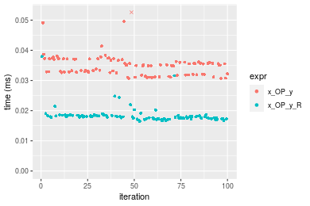

```r
> OP
[1] "/"
> stats <- microbenchmark(x_OP_y = x_OP_y(x, y, OP = OP, na.rm = FALSE), x_OP_y_R = x_OP_y_R(x, y, 
+     OP = OP, na.rm = FALSE), unit = "ms")
> gc()
           used  (Mb) gc trigger  (Mb)  max used  (Mb)
Ncells  5404108 288.7    8529671 455.6   8529671 455.6
Vcells 10613562  81.0   39910282 304.5 101881463 777.3
```

_Table: Benchmarking of x_OP_y() and x_OP_y_R() on double+100x100+div data. The top panel shows times in milliseconds and the bottom panel shows relative times._


|   |expr     |      min|        lq|      mean|    median|       uq|      max|
|:--|:--------|--------:|---------:|---------:|---------:|--------:|--------:|
|2  |x_OP_y_R | 0.017488| 0.0182205| 0.0191984| 0.0185830| 0.019008| 0.037906|
|1  |x_OP_y   | 0.035856| 0.0371475| 0.0386060| 0.0377585| 0.038189| 0.069325|


|   |expr     |     min|       lq|     mean|   median|       uq|      max|
|:--|:--------|-------:|--------:|--------:|--------:|--------:|--------:|
|2  |x_OP_y_R | 1.00000| 1.000000| 1.000000| 1.000000| 1.000000| 1.000000|
|1  |x_OP_y   | 2.05032| 2.038775| 2.010897| 2.031884| 2.009101| 1.828866|

_Figure: Benchmarking of x_OP_y() and x_OP_y_R() on double+100x100+div data.  Outliers are displayed as crosses.  Times are in milliseconds._

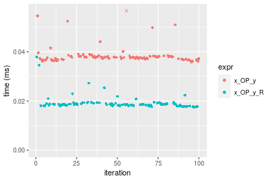


### 1000x10 vector

#### All elements
```r
> x <- data[["1000x10"]]
> y <- x[, 1L]
```

```r
> OP
[1] "+"
> stats <- microbenchmark(x_OP_y = x_OP_y(x, y, OP = OP, na.rm = FALSE), x_OP_y_R = x_OP_y_R(x, y, 
+     OP = OP, na.rm = FALSE), unit = "ms")
> gc()
           used  (Mb) gc trigger  (Mb)  max used  (Mb)
Ncells  5404171 288.7    8529671 455.6   8529671 455.6
Vcells 10614504  81.0   39910282 304.5 101881463 777.3
```

_Table: Benchmarking of x_OP_y() and x_OP_y_R() on double+1000x10+add data. The top panel shows times in milliseconds and the bottom panel shows relative times._


|   |expr     |      min|        lq|      mean|    median|        uq|      max|
|:--|:--------|--------:|---------:|---------:|---------:|---------:|--------:|
|2  |x_OP_y_R | 0.016390| 0.0175035| 0.0184785| 0.0180900| 0.0187235| 0.038247|
|1  |x_OP_y   | 0.033524| 0.0342110| 0.0360122| 0.0350345| 0.0358615| 0.070558|


|   |expr     |      min|       lq|    mean|   median|      uq|      max|
|:--|:--------|--------:|--------:|-------:|--------:|-------:|--------:|
|2  |x_OP_y_R | 1.000000| 1.000000| 1.00000| 1.000000| 1.00000| 1.000000|
|1  |x_OP_y   | 2.045393| 1.954523| 1.94887| 1.936678| 1.91532| 1.844798|

_Figure: Benchmarking of x_OP_y() and x_OP_y_R() on double+1000x10+add data.  Outliers are displayed as crosses.  Times are in milliseconds._


```r
> OP
[1] "-"
> stats <- microbenchmark(x_OP_y = x_OP_y(x, y, OP = OP, na.rm = FALSE), x_OP_y_R = x_OP_y_R(x, y, 
+     OP = OP, na.rm = FALSE), unit = "ms")
> gc()
           used  (Mb) gc trigger  (Mb)  max used  (Mb)
Ncells  5404234 288.7    8529671 455.6   8529671 455.6
Vcells 10614546  81.0   39910282 304.5 101881463 777.3
```

_Table: Benchmarking of x_OP_y() and x_OP_y_R() on double+1000x10+sub data. The top panel shows times in milliseconds and the bottom panel shows relative times._


|   |expr     |      min|        lq|      mean|   median|        uq|      max|
|:--|:--------|--------:|---------:|---------:|--------:|---------:|--------:|
|2  |x_OP_y_R | 0.018027| 0.0192205| 0.0213826| 0.019984| 0.0205655| 0.051183|
|1  |x_OP_y   | 0.036124| 0.0380460| 0.0398782| 0.038543| 0.0402620| 0.061086|


|   |expr     |      min|       lq|     mean|   median|       uq|      max|
|:--|:--------|--------:|--------:|--------:|--------:|--------:|--------:|
|2  |x_OP_y_R | 1.000000| 1.000000| 1.000000| 1.000000| 1.000000| 1.000000|
|1  |x_OP_y   | 2.003883| 1.979449| 1.864982| 1.928693| 1.957745| 1.193482|

_Figure: Benchmarking of x_OP_y() and x_OP_y_R() on double+1000x10+sub data.  Outliers are displayed as crosses.  Times are in milliseconds._

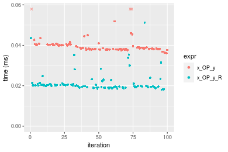

```r
> OP
[1] "*"
> stats <- microbenchmark(x_OP_y = x_OP_y(x, y, OP = OP, na.rm = FALSE), x_OP_y_R = x_OP_y_R(x, y, 
+     OP = OP, na.rm = FALSE), unit = "ms")
> gc()
           used  (Mb) gc trigger  (Mb)  max used  (Mb)
Ncells  5404297 288.7    8529671 455.6   8529671 455.6
Vcells 10614588  81.0   39910282 304.5 101881463 777.3
```

_Table: Benchmarking of x_OP_y() and x_OP_y_R() on double+1000x10+mul data. The top panel shows times in milliseconds and the bottom panel shows relative times._


|   |expr     |      min|        lq|      mean|    median|        uq|      max|
|:--|:--------|--------:|---------:|---------:|---------:|---------:|--------:|
|2  |x_OP_y_R | 0.015948| 0.0167785| 0.0179647| 0.0173725| 0.0180780| 0.048760|
|1  |x_OP_y   | 0.028334| 0.0306305| 0.0332469| 0.0329195| 0.0340515| 0.066041|


|   |expr     |      min|      lq|     mean|  median|       uq|      max|
|:--|:--------|--------:|-------:|--------:|-------:|--------:|--------:|
|2  |x_OP_y_R | 1.000000| 1.00000| 1.000000| 1.00000| 1.000000| 1.000000|
|1  |x_OP_y   | 1.776649| 1.82558| 1.850678| 1.89492| 1.883588| 1.354409|

_Figure: Benchmarking of x_OP_y() and x_OP_y_R() on double+1000x10+mul data.  Outliers are displayed as crosses.  Times are in milliseconds._

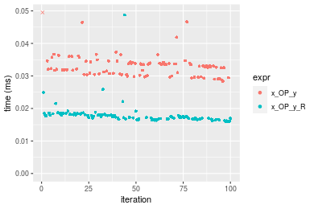

```r
> OP
[1] "/"
> stats <- microbenchmark(x_OP_y = x_OP_y(x, y, OP = OP, na.rm = FALSE), x_OP_y_R = x_OP_y_R(x, y, 
+     OP = OP, na.rm = FALSE), unit = "ms")
> gc()
           used  (Mb) gc trigger  (Mb)  max used  (Mb)
Ncells  5404360 288.7    8529671 455.6   8529671 455.6
Vcells 10614630  81.0   39910282 304.5 101881463 777.3
```

_Table: Benchmarking of x_OP_y() and x_OP_y_R() on double+1000x10+div data. The top panel shows times in milliseconds and the bottom panel shows relative times._


|   |expr     |      min|        lq|      mean|    median|       uq|      max|
|:--|:--------|--------:|---------:|---------:|---------:|--------:|--------:|
|2  |x_OP_y_R | 0.017949| 0.0192365| 0.0211234| 0.0199365| 0.020605| 0.052354|
|1  |x_OP_y   | 0.036491| 0.0383605| 0.0399859| 0.0398610| 0.040336| 0.062228|


|   |expr     |      min|       lq|     mean|   median|       uq|      max|
|:--|:--------|--------:|--------:|--------:|--------:|--------:|--------:|
|2  |x_OP_y_R | 1.000000| 1.000000| 1.000000| 1.000000| 1.000000| 1.000000|
|1  |x_OP_y   | 2.033038| 1.994152| 1.892964| 1.999398| 1.957583| 1.188601|

_Figure: Benchmarking of x_OP_y() and x_OP_y_R() on double+1000x10+div data.  Outliers are displayed as crosses.  Times are in milliseconds._

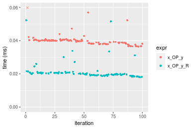


### 10x1000 vector

#### All elements
```r
> x <- data[["10x1000"]]
> y <- x[, 1L]
```

```r
> OP
[1] "+"
> stats <- microbenchmark(x_OP_y = x_OP_y(x, y, OP = OP, na.rm = FALSE), x_OP_y_R = x_OP_y_R(x, y, 
+     OP = OP, na.rm = FALSE), unit = "ms")
> gc()
           used  (Mb) gc trigger  (Mb)  max used  (Mb)
Ncells  5404423 288.7    8529671 455.6   8529671 455.6
Vcells 10613688  81.0   39910282 304.5 101881463 777.3
```

_Table: Benchmarking of x_OP_y() and x_OP_y_R() on double+10x1000+add data. The top panel shows times in milliseconds and the bottom panel shows relative times._


|   |expr     |      min|        lq|      mean|    median|        uq|      max|
|:--|:--------|--------:|---------:|---------:|---------:|---------:|--------:|
|2  |x_OP_y_R | 0.016603| 0.0179705| 0.0186015| 0.0183595| 0.0187405| 0.032677|
|1  |x_OP_y   | 0.036541| 0.0380760| 0.0394199| 0.0385505| 0.0389205| 0.069394|


|   |expr     |      min|       lq|     mean|   median|       uq|      max|
|:--|:--------|--------:|--------:|--------:|--------:|--------:|--------:|
|2  |x_OP_y_R | 1.000000| 1.000000| 1.000000| 1.000000| 1.000000| 1.000000|
|1  |x_OP_y   | 2.200867| 2.118806| 2.119175| 2.099758| 2.076812| 2.123634|

_Figure: Benchmarking of x_OP_y() and x_OP_y_R() on double+10x1000+add data.  Outliers are displayed as crosses.  Times are in milliseconds._

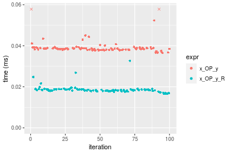

```r
> OP
[1] "-"
> stats <- microbenchmark(x_OP_y = x_OP_y(x, y, OP = OP, na.rm = FALSE), x_OP_y_R = x_OP_y_R(x, y, 
+     OP = OP, na.rm = FALSE), unit = "ms")
> gc()
           used  (Mb) gc trigger  (Mb)  max used  (Mb)
Ncells  5404486 288.7    8529671 455.6   8529671 455.6
Vcells 10615058  81.0   39910282 304.5 101881463 777.3
```

_Table: Benchmarking of x_OP_y() and x_OP_y_R() on double+10x1000+sub data. The top panel shows times in milliseconds and the bottom panel shows relative times._


|   |expr     |      min|        lq|      mean|    median|       uq|      max|
|:--|:--------|--------:|---------:|---------:|---------:|--------:|--------:|
|2  |x_OP_y_R | 0.017968| 0.0189575| 0.0205455| 0.0196865| 0.020471| 0.044544|
|1  |x_OP_y   | 0.038308| 0.0401340| 0.0421595| 0.0408940| 0.042429| 0.068975|


|   |expr     |      min|       lq|  mean|   median|       uq|      max|
|:--|:--------|--------:|--------:|-----:|--------:|--------:|--------:|
|2  |x_OP_y_R | 1.000000| 1.000000| 1.000| 1.000000| 1.000000| 1.000000|
|1  |x_OP_y   | 2.132013| 2.117051| 2.052| 2.077261| 2.072639| 1.548469|

_Figure: Benchmarking of x_OP_y() and x_OP_y_R() on double+10x1000+sub data.  Outliers are displayed as crosses.  Times are in milliseconds._


```r
> OP
[1] "*"
> stats <- microbenchmark(x_OP_y = x_OP_y(x, y, OP = OP, na.rm = FALSE), x_OP_y_R = x_OP_y_R(x, y, 
+     OP = OP, na.rm = FALSE), unit = "ms")
> gc()
           used  (Mb) gc trigger  (Mb)  max used  (Mb)
Ncells  5404549 288.7    8529671 455.6   8529671 455.6
Vcells 10615100  81.0   39910282 304.5 101881463 777.3
```

_Table: Benchmarking of x_OP_y() and x_OP_y_R() on double+10x1000+mul data. The top panel shows times in milliseconds and the bottom panel shows relative times._


|   |expr     |      min|        lq|      mean|    median|       uq|      max|
|:--|:--------|--------:|---------:|---------:|---------:|--------:|--------:|
|2  |x_OP_y_R | 0.015686| 0.0168935| 0.0178450| 0.0174455| 0.018304| 0.026303|
|1  |x_OP_y   | 0.032617| 0.0346235| 0.0372367| 0.0362785| 0.037914| 0.070082|


|   |expr     |     min|       lq|     mean|   median|      uq|      max|
|:--|:--------|-------:|--------:|--------:|--------:|-------:|--------:|
|2  |x_OP_y_R | 1.00000| 1.000000| 1.000000| 1.000000| 1.00000| 1.000000|
|1  |x_OP_y   | 2.07937| 2.049516| 2.086674| 2.079533| 2.07135| 2.664411|

_Figure: Benchmarking of x_OP_y() and x_OP_y_R() on double+10x1000+mul data.  Outliers are displayed as crosses.  Times are in milliseconds._

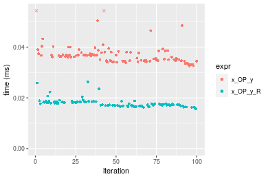

```r
> OP
[1] "/"
> stats <- microbenchmark(x_OP_y = x_OP_y(x, y, OP = OP, na.rm = FALSE), x_OP_y_R = x_OP_y_R(x, y, 
+     OP = OP, na.rm = FALSE), unit = "ms")
> gc()
           used  (Mb) gc trigger  (Mb)  max used  (Mb)
Ncells  5404612 288.7    8529671 455.6   8529671 455.6
Vcells 10615142  81.0   39910282 304.5 101881463 777.3
```

_Table: Benchmarking of x_OP_y() and x_OP_y_R() on double+10x1000+div data. The top panel shows times in milliseconds and the bottom panel shows relative times._


|   |expr     |      min|        lq|      mean|   median|       uq|      max|
|:--|:--------|--------:|---------:|---------:|--------:|--------:|--------:|
|2  |x_OP_y_R | 0.018281| 0.0191055| 0.0198625| 0.019436| 0.020127| 0.028389|
|1  |x_OP_y   | 0.037990| 0.0393660| 0.0412304| 0.040048| 0.041905| 0.077980|


|   |expr     |      min|       lq|     mean|   median|       uq|      max|
|:--|:--------|--------:|--------:|--------:|--------:|--------:|--------:|
|2  |x_OP_y_R | 1.000000| 1.000000| 1.000000| 1.000000| 1.000000| 1.000000|
|1  |x_OP_y   | 2.078114| 2.060454| 2.075796| 2.060506| 2.082029| 2.746839|

_Figure: Benchmarking of x_OP_y() and x_OP_y_R() on double+10x1000+div data.  Outliers are displayed as crosses.  Times are in milliseconds._

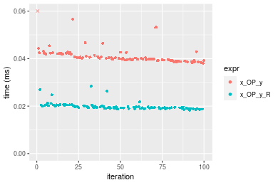


### 100x1000 vector

#### All elements
```r
> x <- data[["100x1000"]]
> y <- x[, 1L]
```

```r
> OP
[1] "+"
> stats <- microbenchmark(x_OP_y = x_OP_y(x, y, OP = OP, na.rm = FALSE), x_OP_y_R = x_OP_y_R(x, y, 
+     OP = OP, na.rm = FALSE), unit = "ms")
> gc()
           used  (Mb) gc trigger  (Mb)  max used  (Mb)
Ncells  5404675 288.7    8529671 455.6   8529671 455.6
Vcells 10615268  81.0   39910282 304.5 101881463 777.3
```

_Table: Benchmarking of x_OP_y() and x_OP_y_R() on double+100x1000+add data. The top panel shows times in milliseconds and the bottom panel shows relative times._


|   |expr     |      min|        lq|      mean|    median|        uq|      max|
|:--|:--------|--------:|---------:|---------:|---------:|---------:|--------:|
|2  |x_OP_y_R | 0.121580| 0.1476155| 0.2878855| 0.3346335| 0.3639565| 0.415505|
|1  |x_OP_y   | 0.251263| 0.2867760| 0.4036696| 0.4477310| 0.4984100| 0.554797|


|   |expr     |      min|       lq|     mean|   median|       uq|      max|
|:--|:--------|--------:|--------:|--------:|--------:|--------:|--------:|
|2  |x_OP_y_R | 1.000000| 1.000000| 1.000000| 1.000000| 1.000000| 1.000000|
|1  |x_OP_y   | 2.066648| 1.942723| 1.402188| 1.337974| 1.369422| 1.335235|

_Figure: Benchmarking of x_OP_y() and x_OP_y_R() on double+100x1000+add data.  Outliers are displayed as crosses.  Times are in milliseconds._

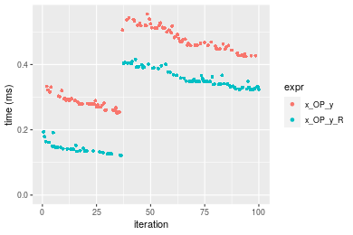

```r
> OP
[1] "-"
> stats <- microbenchmark(x_OP_y = x_OP_y(x, y, OP = OP, na.rm = FALSE), x_OP_y_R = x_OP_y_R(x, y, 
+     OP = OP, na.rm = FALSE), unit = "ms")
> gc()
           used  (Mb) gc trigger  (Mb)  max used  (Mb)
Ncells  5404738 288.7    8529671 455.6   8529671 455.6
Vcells 10615310  81.0   39910282 304.5 101881463 777.3
```

_Table: Benchmarking of x_OP_y() and x_OP_y_R() on double+100x1000+sub data. The top panel shows times in milliseconds and the bottom panel shows relative times._


|   |expr     |      min|        lq|      mean|    median|        uq|      max|
|:--|:--------|--------:|---------:|---------:|---------:|---------:|--------:|
|2  |x_OP_y_R | 0.137563| 0.1713525| 0.2993443| 0.3412560| 0.3820850| 0.442008|
|1  |x_OP_y   | 0.283061| 0.3217805| 0.4296769| 0.4561965| 0.5112585| 0.574839|


|   |expr     |      min|       lq|     mean|   median|       uq|      max|
|:--|:--------|--------:|--------:|--------:|--------:|--------:|--------:|
|2  |x_OP_y_R | 1.000000| 1.000000| 1.000000| 1.000000| 1.000000| 1.000000|
|1  |x_OP_y   | 2.057683| 1.877886| 1.435393| 1.336816| 1.338075| 1.300517|

_Figure: Benchmarking of x_OP_y() and x_OP_y_R() on double+100x1000+sub data.  Outliers are displayed as crosses.  Times are in milliseconds._

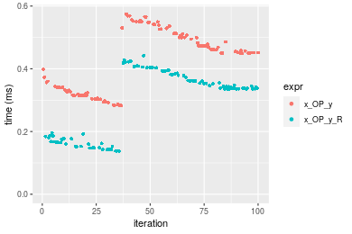

```r
> OP
[1] "*"
> stats <- microbenchmark(x_OP_y = x_OP_y(x, y, OP = OP, na.rm = FALSE), x_OP_y_R = x_OP_y_R(x, y, 
+     OP = OP, na.rm = FALSE), unit = "ms")
> gc()
           used  (Mb) gc trigger  (Mb)  max used  (Mb)
Ncells  5404801 288.7    8529671 455.6   8529671 455.6
Vcells 10615352  81.0   39910282 304.5 101881463 777.3
```

_Table: Benchmarking of x_OP_y() and x_OP_y_R() on double+100x1000+mul data. The top panel shows times in milliseconds and the bottom panel shows relative times._


|   |expr     |      min|        lq|      mean|    median|       uq|      max|
|:--|:--------|--------:|---------:|---------:|---------:|--------:|--------:|
|2  |x_OP_y_R | 0.126562| 0.1467355| 0.2928854| 0.3470035| 0.388368| 0.435101|
|1  |x_OP_y   | 0.225885| 0.2710410| 0.3842160| 0.4197910| 0.465263| 0.530293|


|   |expr     |      min|      lq|    mean|  median|       uq|      max|
|:--|:--------|--------:|-------:|-------:|-------:|--------:|--------:|
|2  |x_OP_y_R | 1.000000| 1.00000| 1.00000| 1.00000| 1.000000| 1.000000|
|1  |x_OP_y   | 1.784777| 1.84714| 1.31183| 1.20976| 1.197995| 1.218781|

_Figure: Benchmarking of x_OP_y() and x_OP_y_R() on double+100x1000+mul data.  Outliers are displayed as crosses.  Times are in milliseconds._

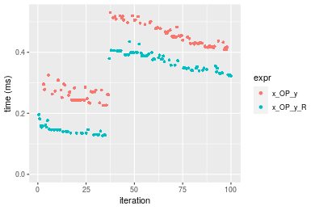

```r
> OP
[1] "/"
> stats <- microbenchmark(x_OP_y = x_OP_y(x, y, OP = OP, na.rm = FALSE), x_OP_y_R = x_OP_y_R(x, y, 
+     OP = OP, na.rm = FALSE), unit = "ms")
> gc()
           used  (Mb) gc trigger  (Mb)  max used  (Mb)
Ncells  5404864 288.7    8529671 455.6   8529671 455.6
Vcells 10615394  81.0   39910282 304.5 101881463 777.3
```

_Table: Benchmarking of x_OP_y() and x_OP_y_R() on double+100x1000+div data. The top panel shows times in milliseconds and the bottom panel shows relative times._


|   |expr     |      min|       lq|      mean|   median|        uq|      max|
|:--|:--------|--------:|--------:|---------:|--------:|---------:|--------:|
|2  |x_OP_y_R | 0.138126| 0.174116| 0.3101232| 0.355235| 0.3943095| 0.524076|
|1  |x_OP_y   | 0.282957| 0.326615| 0.4362543| 0.462468| 0.5260790| 0.774445|


|   |expr     |      min|       lq|     mean|   median|       uq|      max|
|:--|:--------|--------:|--------:|--------:|--------:|--------:|--------:|
|2  |x_OP_y_R | 1.000000| 1.000000| 1.000000| 1.000000| 1.000000| 1.000000|
|1  |x_OP_y   | 2.048543| 1.875847| 1.406713| 1.301865| 1.334178| 1.477734|

_Figure: Benchmarking of x_OP_y() and x_OP_y_R() on double+100x1000+div data.  Outliers are displayed as crosses.  Times are in milliseconds._

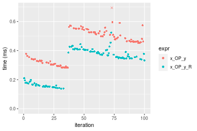


### 1000x100 vector

#### All elements
```r
> x <- data[["1000x100"]]
> y <- x[, 1L]
```

```r
> OP
[1] "+"
> stats <- microbenchmark(x_OP_y = x_OP_y(x, y, OP = OP, na.rm = FALSE), x_OP_y_R = x_OP_y_R(x, y, 
+     OP = OP, na.rm = FALSE), unit = "ms")
> gc()
           used  (Mb) gc trigger  (Mb)  max used  (Mb)
Ncells  5404927 288.7    8529671 455.6   8529671 455.6
Vcells 10616336  81.0   39910282 304.5 101881463 777.3
```

_Table: Benchmarking of x_OP_y() and x_OP_y_R() on double+1000x100+add data. The top panel shows times in milliseconds and the bottom panel shows relative times._


|   |expr     |      min|        lq|      mean|   median|        uq|      max|
|:--|:--------|--------:|---------:|---------:|--------:|---------:|--------:|
|2  |x_OP_y_R | 0.126812| 0.1601815| 0.3121611| 0.393283| 0.4040635| 0.442037|
|1  |x_OP_y   | 0.251481| 0.3101260| 0.4487157| 0.510826| 0.5185300| 0.622470|


|   |expr     |      min|       lq|     mean|   median|       uq|      max|
|:--|:--------|--------:|--------:|--------:|--------:|--------:|--------:|
|2  |x_OP_y_R | 1.000000| 1.000000| 1.000000| 1.000000| 1.000000| 1.000000|
|1  |x_OP_y   | 1.983101| 1.936091| 1.437449| 1.298876| 1.283288| 1.408185|

_Figure: Benchmarking of x_OP_y() and x_OP_y_R() on double+1000x100+add data.  Outliers are displayed as crosses.  Times are in milliseconds._

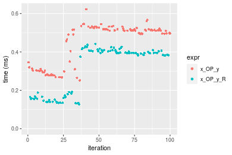

```r
> OP
[1] "-"
> stats <- microbenchmark(x_OP_y = x_OP_y(x, y, OP = OP, na.rm = FALSE), x_OP_y_R = x_OP_y_R(x, y, 
+     OP = OP, na.rm = FALSE), unit = "ms")
> gc()
           used  (Mb) gc trigger  (Mb)  max used  (Mb)
Ncells  5404990 288.7    8529671 455.6   8529671 455.6
Vcells 10617972  81.1   39910282 304.5 101881463 777.3
```

_Table: Benchmarking of x_OP_y() and x_OP_y_R() on double+1000x100+sub data. The top panel shows times in milliseconds and the bottom panel shows relative times._


|   |expr     |      min|        lq|      mean|   median|       uq|     max|
|:--|:--------|--------:|---------:|---------:|--------:|--------:|-------:|
|2  |x_OP_y_R | 0.137703| 0.1617695| 0.3061013| 0.373124| 0.396119| 0.45186|
|1  |x_OP_y   | 0.274140| 0.3288765| 0.4469109| 0.502076| 0.528062| 0.56548|


|   |expr     |      min|       lq|    mean|   median|       uq|     max|
|:--|:--------|--------:|--------:|-------:|--------:|--------:|-------:|
|2  |x_OP_y_R | 1.000000| 1.000000| 1.00000| 1.000000| 1.000000| 1.00000|
|1  |x_OP_y   | 1.990806| 2.032995| 1.46001| 1.345601| 1.333089| 1.25145|

_Figure: Benchmarking of x_OP_y() and x_OP_y_R() on double+1000x100+sub data.  Outliers are displayed as crosses.  Times are in milliseconds._

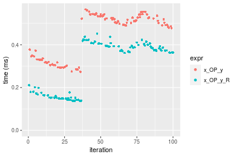

```r
> OP
[1] "*"
> stats <- microbenchmark(x_OP_y = x_OP_y(x, y, OP = OP, na.rm = FALSE), x_OP_y_R = x_OP_y_R(x, y, 
+     OP = OP, na.rm = FALSE), unit = "ms")
> gc()
           used  (Mb) gc trigger  (Mb)  max used  (Mb)
Ncells  5405053 288.7    8529671 455.6   8529671 455.6
Vcells 10618014  81.1   39910282 304.5 101881463 777.3
```

_Table: Benchmarking of x_OP_y() and x_OP_y_R() on double+1000x100+mul data. The top panel shows times in milliseconds and the bottom panel shows relative times._


|   |expr     |      min|        lq|      mean|   median|        uq|      max|
|:--|:--------|--------:|---------:|---------:|--------:|---------:|--------:|
|2  |x_OP_y_R | 0.126749| 0.1527970| 0.2885371| 0.340066| 0.3847800| 0.422040|
|1  |x_OP_y   | 0.223740| 0.2767165| 0.3884440| 0.418240| 0.4707875| 0.566416|


|   |expr     |      min|       lq|     mean|   median|       uq|      max|
|:--|:--------|--------:|--------:|--------:|--------:|--------:|--------:|
|2  |x_OP_y_R | 1.000000| 1.000000| 1.000000| 1.000000| 1.000000| 1.000000|
|1  |x_OP_y   | 1.765221| 1.811007| 1.346253| 1.229879| 1.223524| 1.342091|

_Figure: Benchmarking of x_OP_y() and x_OP_y_R() on double+1000x100+mul data.  Outliers are displayed as crosses.  Times are in milliseconds._

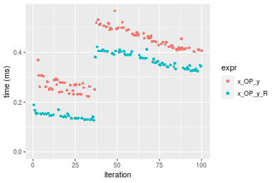

```r
> OP
[1] "/"
> stats <- microbenchmark(x_OP_y = x_OP_y(x, y, OP = OP, na.rm = FALSE), x_OP_y_R = x_OP_y_R(x, y, 
+     OP = OP, na.rm = FALSE), unit = "ms")
> gc()
           used  (Mb) gc trigger  (Mb)  max used  (Mb)
Ncells  5405116 288.7    8529671 455.6   8529671 455.6
Vcells 10618056  81.1   39910282 304.5 101881463 777.3
```

_Table: Benchmarking of x_OP_y() and x_OP_y_R() on double+1000x100+div data. The top panel shows times in milliseconds and the bottom panel shows relative times._


|   |expr     |      min|        lq|      mean|    median|        uq|      max|
|:--|:--------|--------:|---------:|---------:|---------:|---------:|--------:|
|2  |x_OP_y_R | 0.139674| 0.1659740| 0.2949434| 0.3439430| 0.3742185| 0.443997|
|1  |x_OP_y   | 0.275361| 0.3295195| 0.4321805| 0.4527835| 0.5192995| 0.577209|


|   |expr     |      min|       lq|   mean|   median|       uq|      max|
|:--|:--------|--------:|--------:|------:|--------:|--------:|--------:|
|2  |x_OP_y_R | 1.000000| 1.000000| 1.0000| 1.000000| 1.000000| 1.000000|
|1  |x_OP_y   | 1.971455| 1.985368| 1.4653| 1.316449| 1.387691| 1.300029|

_Figure: Benchmarking of x_OP_y() and x_OP_y_R() on double+1000x100+div data.  Outliers are displayed as crosses.  Times are in milliseconds._

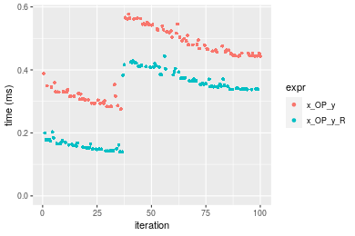


## Appendix

### Session information
```r
R version 4.1.1 Patched (2021-08-10 r80727)
Platform: x86_64-pc-linux-gnu (64-bit)
Running under: Ubuntu 18.04.5 LTS

Matrix products: default
BLAS:   /home/hb/software/R-devel/R-4-1-branch/lib/R/lib/libRblas.so
LAPACK: /home/hb/software/R-devel/R-4-1-branch/lib/R/lib/libRlapack.so

locale:
 [1] LC_CTYPE=en_US.UTF-8       LC_NUMERIC=C              
 [3] LC_TIME=en_US.UTF-8        LC_COLLATE=en_US.UTF-8    
 [5] LC_MONETARY=en_US.UTF-8    LC_MESSAGES=en_US.UTF-8   
 [7] LC_PAPER=en_US.UTF-8       LC_NAME=C                 
 [9] LC_ADDRESS=C               LC_TELEPHONE=C            
[11] LC_MEASUREMENT=en_US.UTF-8 LC_IDENTIFICATION=C       

attached base packages:
[1] stats     graphics  grDevices utils     datasets  methods   base     

other attached packages:
[1] microbenchmark_1.4-7   matrixStats_0.60.1     ggplot2_3.3.5         
[4] knitr_1.33             R.devices_2.17.0       R.utils_2.10.1        
[7] R.oo_1.24.0            R.methodsS3_1.8.1-9001 history_0.0.1-9000    

loaded via a namespace (and not attached):
 [1] Biobase_2.52.0          httr_1.4.2              splines_4.1.1          
 [4] bit64_4.0.5             network_1.17.1          assertthat_0.2.1       
 [7] highr_0.9               stats4_4.1.1            blob_1.2.2             
[10] GenomeInfoDbData_1.2.6  robustbase_0.93-8       pillar_1.6.2           
[13] RSQLite_2.2.8           lattice_0.20-44         limma_3.48.3           
[16] glue_1.4.2              digest_0.6.27           XVector_0.32.0         
[19] colorspace_2.0-2        Matrix_1.3-4            XML_3.99-0.7           
[22] pkgconfig_2.0.3         zlibbioc_1.38.0         genefilter_1.74.0      
[25] purrr_0.3.4             ergm_4.1.2              xtable_1.8-4           
[28] scales_1.1.1            tibble_3.1.4            annotate_1.70.0        
[31] KEGGREST_1.32.0         farver_2.1.0            generics_0.1.0         
[34] IRanges_2.26.0          ellipsis_0.3.2          cachem_1.0.6           
[37] withr_2.4.2             BiocGenerics_0.38.0     mime_0.11              
[40] survival_3.2-13         magrittr_2.0.1          crayon_1.4.1           
[43] statnet.common_4.5.0    memoise_2.0.0           laeken_0.5.1           
[46] fansi_0.5.0             R.cache_0.15.0          MASS_7.3-54            
[49] R.rsp_0.44.0            progressr_0.8.0         tools_4.1.1            
[52] lifecycle_1.0.0         S4Vectors_0.30.0        trust_0.1-8            
[55] munsell_0.5.0           tabby_0.0.1-9001        AnnotationDbi_1.54.1   
[58] Biostrings_2.60.2       compiler_4.1.1          GenomeInfoDb_1.28.1    
[61] rlang_0.4.11            grid_4.1.1              RCurl_1.98-1.4         
[64] cwhmisc_6.6             rappdirs_0.3.3          startup_0.15.0         
[67] labeling_0.4.2          bitops_1.0-7            base64enc_0.1-3        
[70] boot_1.3-28             gtable_0.3.0            DBI_1.1.1              
[73] markdown_1.1            R6_2.5.1                lpSolveAPI_5.5.2.0-17.7
[76] rle_0.9.2               dplyr_1.0.7             fastmap_1.1.0          
[79] bit_4.0.4               utf8_1.2.2              parallel_4.1.1         
[82] Rcpp_1.0.7              vctrs_0.3.8             png_0.1-7              
[85] DEoptimR_1.0-9          tidyselect_1.1.1        xfun_0.25              
[88] coda_0.19-4            
```
Total processing time was 1.14 mins.


### Reproducibility
To reproduce this report, do:
```r
html <- matrixStats:::benchmark('x_OP_y')
```

[RSP]: https://cran.r-project.org/package=R.rsp
[matrixStats]: https://cran.r-project.org/package=matrixStats

[StackOverflow:colMins?]: https://stackoverflow.com/questions/13676878 "Stack Overflow: fastest way to get Min from every column in a matrix?"
[StackOverflow:colSds?]: https://stackoverflow.com/questions/17549762 "Stack Overflow: Is there such 'colsd' in R?"
[StackOverflow:rowProds?]: https://stackoverflow.com/questions/20198801/ "Stack Overflow: Row product of matrix and column sum of matrix"

---------------------------------------
Copyright Henrik Bengtsson. Last updated on 2021-08-25 19:34:26 (+0200 UTC). Powered by [RSP].

<script>
 var link = document.createElement('link');
 link.rel = 'icon';
 link.href = "data:image/png;base64,iVBORw0KGgoAAAANSUhEUgAAACAAAAAgCAMAAABEpIrGAAAA21BMVEUAAAAAAP8AAP8AAP8AAP8AAP8AAP8AAP8AAP8AAP8AAP8AAP8AAP8AAP8AAP8AAP8AAP8AAP8AAP8AAP8AAP8AAP8AAP8AAP8AAP8AAP8AAP8AAP8AAP8AAP8AAP8AAP8AAP8AAP8AAP8AAP8AAP8AAP8AAP8AAP8AAP8AAP8BAf4CAv0DA/wdHeIeHuEfH+AgIN8hId4lJdomJtknJ9g+PsE/P8BAQL9yco10dIt1dYp3d4h4eIeVlWqWlmmXl2iYmGeZmWabm2Tn5xjo6Bfp6Rb39wj4+Af//wA2M9hbAAAASXRSTlMAAQIJCgsMJSYnKD4/QGRlZmhpamtsbautrrCxuru8y8zN5ebn6Pn6+///////////////////////////////////////////LsUNcQAAAS9JREFUOI29k21XgkAQhVcFytdSMqMETU26UVqGmpaiFbL//xc1cAhhwVNf6n5i5z67M2dmYOyfJZUqlVLhkKucG7cgmUZTybDz6g0iDeq51PUr37Ds2cy2/C9NeES5puDjxuUk1xnToZsg8pfA3avHQ3lLIi7iWRrkv/OYtkScxBIMgDee0ALoyxHQBJ68JLCjOtQIMIANF7QG9G9fNnHvisCHBVMKgSJgiz7nE+AoBKrAPA3MgepvgR9TSCasrCKH0eB1wBGBFdCO+nAGjMVGPcQb5bd6mQRegN6+1axOs9nGfYcCtfi4NQosdtH7dB+txFIpXQqN1p9B/asRHToyS0jRgpV7nk4nwcq1BJ+x3Gl/v7S9Wmpp/aGquum7w3ZDyrADFYrl8vHBH+ev9AUASW1dmU4h4wAAAABJRU5ErkJggg=="
 document.getElementsByTagName('head')[0].appendChild(link);
</script>


