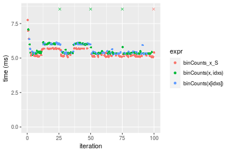

[matrixStats]: Benchmark report

---------------------------------------


# binCounts() benchmarks on subsetted computation

This report benchmark the performance of binCounts() on subsetted computation.


## Data type "integer"

### Non-sorted simulated data
```r
> set.seed(48879)
> nx <- 1e+05
> xmax <- 0.01 * nx
> x <- runif(nx, min = 0, max = xmax)
> storage.mode(x) <- mode
> str(x)
 int [1:100000] 722 285 591 3 349 509 216 91 150 383 ...
> nb <- 10000
> bx <- seq(from = 0, to = xmax, length.out = nb + 1L)
> bx <- c(-1, bx, xmax + 1)
> idxs <- sample.int(length(x), size = length(x) * 0.7)
```

### Results


```r
> x_S <- x[idxs]
> gc()
           used  (Mb) gc trigger  (Mb) max used  (Mb)
Ncells  5141589 274.6    7554717 403.5  7554717 403.5
Vcells 20152197 153.8   49676999 379.1 60508962 461.7
> stats <- microbenchmark(binCounts_x_S = binCounts(x_S, bx = bx), `binCounts(x, idxs)` = binCounts(x, 
+     idxs = idxs, bx = bx), `binCounts(x[idxs])` = binCounts(x[idxs], bx = bx), unit = "ms")
```

_Table: Benchmarking of binCounts_x_S(), binCounts(x, idxs)() and binCounts(x[idxs])() on integer+unsorted data. The top panel shows times in milliseconds and the bottom panel shows relative times._


|   |expr               |      min|       lq|     mean|   median|       uq|      max|
|:--|:------------------|--------:|--------:|--------:|--------:|--------:|--------:|
|1  |binCounts_x_S      | 3.704135| 3.735041| 4.118998| 3.762034| 4.341708| 9.510666|
|3  |binCounts(x[idxs]) | 3.852867| 3.882585| 4.075579| 3.903012| 4.155354| 4.856273|
|2  |binCounts(x, idxs) | 3.838011| 3.880777| 4.082243| 3.904835| 4.222174| 5.216332|


|   |expr               |      min|       lq|      mean|   median|        uq|       max|
|:--|:------------------|--------:|--------:|---------:|--------:|---------:|---------:|
|1  |binCounts_x_S      | 1.000000| 1.000000| 1.0000000| 1.000000| 1.0000000| 1.0000000|
|3  |binCounts(x[idxs]) | 1.040153| 1.039503| 0.9894588| 1.037474| 0.9570783| 0.5106133|
|2  |binCounts(x, idxs) | 1.036142| 1.039018| 0.9910766| 1.037959| 0.9724684| 0.5484718|

_Figure: Benchmarking of binCounts_x_S(), binCounts(x, idxs)() and binCounts(x[idxs])() on integer+unsorted data.  Outliers are displayed as crosses.  Times are in milliseconds._


### Sorted simulated data
```r
> x <- sort(x)
> idxs <- sort(idxs)
```
```r
> x_S <- x[idxs]
> gc()
          used  (Mb) gc trigger  (Mb) max used  (Mb)
Ncells 5139416 274.5    7554717 403.5  7554717 403.5
Vcells 9036120  69.0   39741600 303.3 60508962 461.7
> stats <- microbenchmark(binCounts_x_S = binCounts(x_S, bx = bx), `binCounts(x, idxs)` = binCounts(x, 
+     idxs = idxs, bx = bx), `binCounts(x[idxs])` = binCounts(x[idxs], bx = bx), unit = "ms")
```

_Table: Benchmarking of binCounts_x_S(), binCounts(x, idxs)() and binCounts(x[idxs])() on integer+sorted data. The top panel shows times in milliseconds and the bottom panel shows relative times._


|   |expr               |      min|        lq|      mean|    median|       uq|      max|
|:--|:------------------|--------:|---------:|---------:|---------:|--------:|--------:|
|1  |binCounts_x_S      | 0.426087| 0.4800630| 0.7844868| 0.8614915| 0.891420| 8.986878|
|3  |binCounts(x[idxs]) | 0.564187| 0.6203565| 0.9709222| 1.0752120| 1.110566| 9.220084|
|2  |binCounts(x, idxs) | 0.565998| 0.6444025| 0.9481692| 1.0807700| 1.111106| 5.284483|


|   |expr               |      min|       lq|     mean|   median|       uq|       max|
|:--|:------------------|--------:|--------:|--------:|--------:|--------:|---------:|
|1  |binCounts_x_S      | 1.000000| 1.000000| 1.000000| 1.000000| 1.000000| 1.0000000|
|3  |binCounts(x[idxs]) | 1.324112| 1.292240| 1.237653| 1.248082| 1.245839| 1.0259496|
|2  |binCounts(x, idxs) | 1.328362| 1.342329| 1.208649| 1.254534| 1.246445| 0.5880221|

_Figure: Benchmarking of binCounts_x_S(), binCounts(x, idxs)() and binCounts(x[idxs])() on integer+sorted data.  Outliers are displayed as crosses.  Times are in milliseconds._


## Data type "double"

### Non-sorted simulated data
```r
> set.seed(48879)
> nx <- 1e+05
> xmax <- 0.01 * nx
> x <- runif(nx, min = 0, max = xmax)
> storage.mode(x) <- mode
> str(x)
 num [1:100000] 722.11 285.54 591.33 3.42 349.14 ...
> nb <- 10000
> bx <- seq(from = 0, to = xmax, length.out = nb + 1L)
> bx <- c(-1, bx, xmax + 1)
> idxs <- sample.int(length(x), size = length(x) * 0.7)
```

### Results


```r
> x_S <- x[idxs]
> gc()
          used  (Mb) gc trigger  (Mb) max used  (Mb)
Ncells 5139486 274.5    7554717 403.5  7554717 403.5
Vcells 9121679  69.6   31793280 242.6 60508962 461.7
> stats <- microbenchmark(binCounts_x_S = binCounts(x_S, bx = bx), `binCounts(x, idxs)` = binCounts(x, 
+     idxs = idxs, bx = bx), `binCounts(x[idxs])` = binCounts(x[idxs], bx = bx), unit = "ms")
```

_Table: Benchmarking of binCounts_x_S(), binCounts(x, idxs)() and binCounts(x[idxs])() on double+unsorted data. The top panel shows times in milliseconds and the bottom panel shows relative times._


|   |expr               |      min|       lq|     mean|   median|       uq|       max|
|:--|:------------------|--------:|--------:|--------:|--------:|--------:|---------:|
|1  |binCounts_x_S      | 5.078976| 5.122581| 5.402943| 5.183268| 5.653347|  9.852020|
|3  |binCounts(x[idxs]) | 5.252915| 5.322347| 5.574598| 5.384629| 5.989052|  6.374196|
|2  |binCounts(x, idxs) | 5.241498| 5.337580| 5.770257| 5.392180| 5.986427| 14.843925|


|   |expr               |      min|       lq|     mean|   median|       uq|       max|
|:--|:------------------|--------:|--------:|--------:|--------:|--------:|---------:|
|1  |binCounts_x_S      | 1.000000| 1.000000| 1.000000| 1.000000| 1.000000| 1.0000000|
|3  |binCounts(x[idxs]) | 1.034247| 1.038997| 1.031771| 1.038849| 1.059381| 0.6469938|
|2  |binCounts(x, idxs) | 1.031999| 1.041971| 1.067984| 1.040305| 1.058917| 1.5066885|

_Figure: Benchmarking of binCounts_x_S(), binCounts(x, idxs)() and binCounts(x[idxs])() on double+unsorted data.  Outliers are displayed as crosses.  Times are in milliseconds._




### Sorted simulated data
```r
> x <- sort(x)
> idxs <- sort(idxs)
```
```r
> x_S <- x[idxs]
> gc()
          used  (Mb) gc trigger  (Mb) max used  (Mb)
Ncells 5139560 274.5    7554717 403.5  7554717 403.5
Vcells 9121728  69.6   31793280 242.6 60508962 461.7
> stats <- microbenchmark(binCounts_x_S = binCounts(x_S, bx = bx), `binCounts(x, idxs)` = binCounts(x, 
+     idxs = idxs, bx = bx), `binCounts(x[idxs])` = binCounts(x[idxs], bx = bx), unit = "ms")
```

_Table: Benchmarking of binCounts_x_S(), binCounts(x, idxs)() and binCounts(x[idxs])() on double+sorted data. The top panel shows times in milliseconds and the bottom panel shows relative times._


|   |expr               |      min|       lq|     mean|   median|       uq|      max|
|:--|:------------------|--------:|--------:|--------:|--------:|--------:|--------:|
|1  |binCounts_x_S      | 1.085316| 1.119521| 1.349061| 1.148484| 1.354885| 5.774167|
|3  |binCounts(x[idxs]) | 1.238091| 1.263716| 1.451659| 1.281578| 1.382397| 5.188453|
|2  |binCounts(x, idxs) | 1.242438| 1.273070| 1.498717| 1.289997| 1.505126| 5.226461|


|   |expr               |      min|       lq|     mean|   median|       uq|       max|
|:--|:------------------|--------:|--------:|--------:|--------:|--------:|---------:|
|1  |binCounts_x_S      | 1.000000| 1.000000| 1.000000| 1.000000| 1.000000| 1.0000000|
|3  |binCounts(x[idxs]) | 1.140766| 1.128801| 1.076051| 1.115887| 1.020306| 0.8985630|
|2  |binCounts(x, idxs) | 1.144771| 1.137155| 1.110933| 1.123217| 1.110888| 0.9051455|

_Figure: Benchmarking of binCounts_x_S(), binCounts(x, idxs)() and binCounts(x[idxs])() on double+sorted data.  Outliers are displayed as crosses.  Times are in milliseconds._


## Appendix

### Session information
```r
R version 4.1.1 Patched (2021-08-10 r80727)
Platform: x86_64-pc-linux-gnu (64-bit)
Running under: Ubuntu 18.04.5 LTS

Matrix products: default
BLAS:   /home/hb/software/R-devel/R-4-1-branch/lib/R/lib/libRblas.so
LAPACK: /home/hb/software/R-devel/R-4-1-branch/lib/R/lib/libRlapack.so

locale:
 [1] LC_CTYPE=en_US.UTF-8       LC_NUMERIC=C              
 [3] LC_TIME=en_US.UTF-8        LC_COLLATE=en_US.UTF-8    
 [5] LC_MONETARY=en_US.UTF-8    LC_MESSAGES=en_US.UTF-8   
 [7] LC_PAPER=en_US.UTF-8       LC_NAME=C                 
 [9] LC_ADDRESS=C               LC_TELEPHONE=C            
[11] LC_MEASUREMENT=en_US.UTF-8 LC_IDENTIFICATION=C       

attached base packages:
[1] stats     graphics  grDevices utils     datasets  methods   base     

other attached packages:
[1] microbenchmark_1.4-7   matrixStats_0.60.0     ggplot2_3.3.5         
[4] knitr_1.33             R.devices_2.17.0       R.utils_2.10.1        
[7] R.oo_1.24.0            R.methodsS3_1.8.1-9001

loaded via a namespace (and not attached):
 [1] Biobase_2.52.0          httr_1.4.2              splines_4.1.1          
 [4] bit64_4.0.5             network_1.17.1          assertthat_0.2.1       
 [7] highr_0.9               stats4_4.1.1            blob_1.2.2             
[10] GenomeInfoDbData_1.2.6  robustbase_0.93-8       pillar_1.6.2           
[13] RSQLite_2.2.8           lattice_0.20-44         glue_1.4.2             
[16] digest_0.6.27           XVector_0.32.0          colorspace_2.0-2       
[19] Matrix_1.3-4            XML_3.99-0.7            pkgconfig_2.0.3        
[22] zlibbioc_1.38.0         genefilter_1.74.0       purrr_0.3.4            
[25] ergm_4.1.2              xtable_1.8-4            scales_1.1.1           
[28] tibble_3.1.4            annotate_1.70.0         KEGGREST_1.32.0        
[31] farver_2.1.0            generics_0.1.0          IRanges_2.26.0         
[34] ellipsis_0.3.2          cachem_1.0.6            withr_2.4.2            
[37] BiocGenerics_0.38.0     mime_0.11               survival_3.2-13        
[40] magrittr_2.0.1          crayon_1.4.1            statnet.common_4.5.0   
[43] memoise_2.0.0           laeken_0.5.1            fansi_0.5.0            
[46] R.cache_0.15.0          MASS_7.3-54             R.rsp_0.44.0           
[49] tools_4.1.1             lifecycle_1.0.0         S4Vectors_0.30.0       
[52] trust_0.1-8             munsell_0.5.0           AnnotationDbi_1.54.1   
[55] Biostrings_2.60.2       compiler_4.1.1          GenomeInfoDb_1.28.1    
[58] rlang_0.4.11            grid_4.1.1              RCurl_1.98-1.4         
[61] cwhmisc_6.6             rappdirs_0.3.3          labeling_0.4.2         
[64] bitops_1.0-7            base64enc_0.1-3         boot_1.3-28            
[67] gtable_0.3.0            DBI_1.1.1               markdown_1.1           
[70] R6_2.5.1                lpSolveAPI_5.5.2.0-17.7 rle_0.9.2              
[73] dplyr_1.0.7             fastmap_1.1.0           bit_4.0.4              
[76] utf8_1.2.2              parallel_4.1.1          Rcpp_1.0.7             
[79] vctrs_0.3.8             png_0.1-7               DEoptimR_1.0-9         
[82] tidyselect_1.1.1        xfun_0.25               coda_0.19-4            
```
Total processing time was 6.92 secs.


### Reproducibility
To reproduce this report, do:
```r
html <- matrixStats:::benchmark('binCounts_subset')
```

[RSP]: https://cran.r-project.org/package=R.rsp
[matrixStats]: https://cran.r-project.org/package=matrixStats

[StackOverflow:colMins?]: https://stackoverflow.com/questions/13676878 "Stack Overflow: fastest way to get Min from every column in a matrix?"
[StackOverflow:colSds?]: https://stackoverflow.com/questions/17549762 "Stack Overflow: Is there such 'colsd' in R?"
[StackOverflow:rowProds?]: https://stackoverflow.com/questions/20198801/ "Stack Overflow: Row product of matrix and column sum of matrix"

---------------------------------------
Copyright Dongcan Jiang. Last updated on 2021-08-25 17:33:36 (+0200 UTC). Powered by [RSP].

<script>
 var link = document.createElement('link');
 link.rel = 'icon';
 link.href = "data:image/png;base64,iVBORw0KGgoAAAANSUhEUgAAACAAAAAgCAMAAABEpIrGAAAA21BMVEUAAAAAAP8AAP8AAP8AAP8AAP8AAP8AAP8AAP8AAP8AAP8AAP8AAP8AAP8AAP8AAP8AAP8AAP8AAP8AAP8AAP8AAP8AAP8AAP8AAP8AAP8AAP8AAP8AAP8AAP8AAP8AAP8AAP8AAP8AAP8AAP8AAP8AAP8AAP8AAP8AAP8AAP8BAf4CAv0DA/wdHeIeHuEfH+AgIN8hId4lJdomJtknJ9g+PsE/P8BAQL9yco10dIt1dYp3d4h4eIeVlWqWlmmXl2iYmGeZmWabm2Tn5xjo6Bfp6Rb39wj4+Af//wA2M9hbAAAASXRSTlMAAQIJCgsMJSYnKD4/QGRlZmhpamtsbautrrCxuru8y8zN5ebn6Pn6+///////////////////////////////////////////LsUNcQAAAS9JREFUOI29k21XgkAQhVcFytdSMqMETU26UVqGmpaiFbL//xc1cAhhwVNf6n5i5z67M2dmYOyfJZUqlVLhkKucG7cgmUZTybDz6g0iDeq51PUr37Ds2cy2/C9NeES5puDjxuUk1xnToZsg8pfA3avHQ3lLIi7iWRrkv/OYtkScxBIMgDee0ALoyxHQBJ68JLCjOtQIMIANF7QG9G9fNnHvisCHBVMKgSJgiz7nE+AoBKrAPA3MgepvgR9TSCasrCKH0eB1wBGBFdCO+nAGjMVGPcQb5bd6mQRegN6+1axOs9nGfYcCtfi4NQosdtH7dB+txFIpXQqN1p9B/asRHToyS0jRgpV7nk4nwcq1BJ+x3Gl/v7S9Wmpp/aGquum7w3ZDyrADFYrl8vHBH+ev9AUASW1dmU4h4wAAAABJRU5ErkJggg=="
 document.getElementsByTagName('head')[0].appendChild(link);
</script>


