[matrixStats]: Benchmark report

---------------------------------------


# colAlls() and rowAlls() benchmarks

This report benchmark the performance of colAlls() and rowAlls() against alternative methods.

## Alternative methods

* apply() + all()
* colSums() == n or rowSums() == n


## Data
```r
> rmatrix <- function(nrow, ncol, mode = c("logical", "double", "integer", "index"), range = c(-100, 
+     +100), na_prob = 0) {
+     mode <- match.arg(mode)
+     n <- nrow * ncol
+     if (mode == "logical") {
+         x <- sample(c(FALSE, TRUE), size = n, replace = TRUE)
+     }     else if (mode == "index") {
+         x <- seq_len(n)
+         mode <- "integer"
+     }     else {
+         x <- runif(n, min = range[1], max = range[2])
+     }
+     storage.mode(x) <- mode
+     if (na_prob > 0) 
+         x[sample(n, size = na_prob * n)] <- NA
+     dim(x) <- c(nrow, ncol)
+     x
+ }
> rmatrices <- function(scale = 10, seed = 1, ...) {
+     set.seed(seed)
+     data <- list()
+     data[[1]] <- rmatrix(nrow = scale * 1, ncol = scale * 1, ...)
+     data[[2]] <- rmatrix(nrow = scale * 10, ncol = scale * 10, ...)
+     data[[3]] <- rmatrix(nrow = scale * 100, ncol = scale * 1, ...)
+     data[[4]] <- t(data[[3]])
+     data[[5]] <- rmatrix(nrow = scale * 10, ncol = scale * 100, ...)
+     data[[6]] <- t(data[[5]])
+     names(data) <- sapply(data, FUN = function(x) paste(dim(x), collapse = "x"))
+     data
+ }
> data <- rmatrices(mode = "logical")
```

## Results

### 10x10 matrix


```r
> X <- data[["10x10"]]
> gc()
          used  (Mb) gc trigger  (Mb) max used  (Mb)
Ncells 5150533 275.1    7554717 403.5  7554717 403.5
Vcells 9239688  70.5   31793280 242.6 60508962 461.7
> colStats <- microbenchmark(colAlls = colAlls(X), `apply+all` = apply(X, MARGIN = 2L, FUN = all), 
+     `colSums==n` = (colSums(X) == nrow(X)), unit = "ms")
> X <- t(X)
> gc()
          used  (Mb) gc trigger  (Mb) max used  (Mb)
Ncells 5149472 275.1    7554717 403.5  7554717 403.5
Vcells 9236837  70.5   31793280 242.6 60508962 461.7
> rowStats <- microbenchmark(rowAlls = rowAlls(X), `apply+all` = apply(X, MARGIN = 1L, FUN = all), 
+     `rowSums==n` = (rowSums(X) == ncol(X)), unit = "ms")
```

_Table: Benchmarking of colAlls(), apply+all() and colSums==n() on 10x10 data. The top panel shows times in milliseconds and the bottom panel shows relative times._


|   |expr       |      min|        lq|      mean|    median|        uq|      max|
|:--|:----------|--------:|---------:|---------:|---------:|---------:|--------:|
|1  |colAlls    | 0.002918| 0.0033565| 0.0041968| 0.0040640| 0.0044475| 0.018750|
|3  |colSums==n | 0.006144| 0.0067145| 0.0077428| 0.0074020| 0.0080225| 0.040135|
|2  |apply+all  | 0.031453| 0.0329830| 0.0343677| 0.0335135| 0.0342750| 0.098318|


|   |expr       |       min|       lq|     mean|   median|       uq|      max|
|:--|:----------|---------:|--------:|--------:|--------:|--------:|--------:|
|1  |colAlls    |  1.000000| 1.000000| 1.000000| 1.000000| 1.000000| 1.000000|
|3  |colSums==n |  2.105552| 2.000447| 1.844934| 1.821358| 1.803822| 2.140533|
|2  |apply+all  | 10.778958| 9.826605| 8.189062| 8.246432| 7.706577| 5.243627|

_Table: Benchmarking of rowAlls(), apply+all() and rowSums==n() on 10x10 data (transposed). The top panel shows times in milliseconds and the bottom panel shows relative times._


|   |expr       |      min|        lq|      mean|   median|        uq|      max|
|:--|:----------|--------:|---------:|---------:|--------:|---------:|--------:|
|1  |rowAlls    | 0.003131| 0.0034790| 0.0042836| 0.004219| 0.0045750| 0.020576|
|3  |rowSums==n | 0.006852| 0.0074665| 0.0086175| 0.008125| 0.0087430| 0.047619|
|2  |apply+all  | 0.031011| 0.0329180| 0.0349817| 0.033767| 0.0350575| 0.089383|


|   |expr       |      min|       lq|     mean|   median|       uq|      max|
|:--|:----------|--------:|--------:|--------:|--------:|--------:|--------:|
|1  |rowAlls    | 1.000000| 1.000000| 1.000000| 1.000000| 1.000000| 1.000000|
|3  |rowSums==n | 2.188438| 2.146163| 2.011771| 1.925812| 1.911038| 2.314298|
|2  |apply+all  | 9.904503| 9.461914| 8.166497| 8.003555| 7.662841| 4.344042|

_Figure: Benchmarking of colAlls(), apply+all() and colSums==n() on 10x10 data  as well as rowAlls(), apply+all() and rowSums==n() on the same data transposed.  Outliers are displayed as crosses.  Times are in milliseconds._


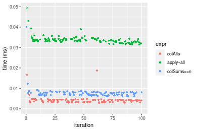

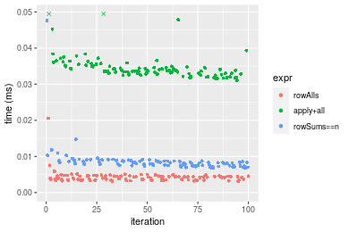
_Table: Benchmarking of colAlls() and rowAlls() on 10x10 data (original and transposed).  The top panel shows times in milliseconds and the bottom panel shows relative times._


|   |expr    |   min|     lq|    mean| median|     uq|    max|
|:--|:-------|-----:|------:|-------:|------:|------:|------:|
|1  |colAlls | 2.918| 3.3565| 4.19678|  4.064| 4.4475| 18.750|
|2  |rowAlls | 3.131| 3.4790| 4.28356|  4.219| 4.5750| 20.576|


|   |expr    |      min|       lq|     mean|  median|       uq|      max|
|:--|:-------|--------:|--------:|--------:|-------:|--------:|--------:|
|1  |colAlls | 1.000000| 1.000000| 1.000000| 1.00000| 1.000000| 1.000000|
|2  |rowAlls | 1.072995| 1.036496| 1.020678| 1.03814| 1.028668| 1.097387|

_Figure: Benchmarking of colAlls() and rowAlls() on 10x10 data (original and transposed).  Outliers are displayed as crosses. Times are in milliseconds._


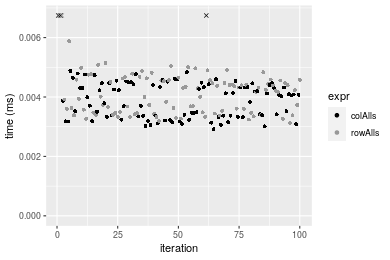

### 100x100 matrix


```r
> X <- data[["100x100"]]
> gc()
          used (Mb) gc trigger  (Mb) max used  (Mb)
Ncells 5148480  275    7554717 403.5  7554717 403.5
Vcells 9043608   69   31793280 242.6 60508962 461.7
> colStats <- microbenchmark(colAlls = colAlls(X), `apply+all` = apply(X, MARGIN = 2L, FUN = all), 
+     `colSums==n` = (colSums(X) == nrow(X)), unit = "ms")
> X <- t(X)
> gc()
          used  (Mb) gc trigger  (Mb) max used  (Mb)
Ncells 5148474 275.0    7554717 403.5  7554717 403.5
Vcells 9048651  69.1   31793280 242.6 60508962 461.7
> rowStats <- microbenchmark(rowAlls = rowAlls(X), `apply+all` = apply(X, MARGIN = 1L, FUN = all), 
+     `rowSums==n` = (rowSums(X) == ncol(X)), unit = "ms")
```

_Table: Benchmarking of colAlls(), apply+all() and colSums==n() on 100x100 data. The top panel shows times in milliseconds and the bottom panel shows relative times._


|   |expr       |      min|        lq|      mean|    median|        uq|      max|
|:--|:----------|--------:|---------:|---------:|---------:|---------:|--------:|
|1  |colAlls    | 0.003003| 0.0037215| 0.0046176| 0.0043775| 0.0049355| 0.021854|
|3  |colSums==n | 0.014897| 0.0162430| 0.0179133| 0.0172200| 0.0186230| 0.043087|
|2  |apply+all  | 0.185221| 0.1932455| 0.2057807| 0.1999520| 0.2128350| 0.289380|


|   |expr       |       min|        lq|      mean|    median|        uq|       max|
|:--|:----------|---------:|---------:|---------:|---------:|---------:|---------:|
|1  |colAlls    |  1.000000|  1.000000|  1.000000|  1.000000|  1.000000|  1.000000|
|3  |colSums==n |  4.960706|  4.364638|  3.879389|  3.933752|  3.773275|  1.971584|
|2  |apply+all  | 61.678655| 51.926777| 44.564807| 45.677213| 43.123290| 13.241512|

_Table: Benchmarking of rowAlls(), apply+all() and rowSums==n() on 100x100 data (transposed). The top panel shows times in milliseconds and the bottom panel shows relative times._


|   |expr       |      min|        lq|      mean|    median|        uq|      max|
|:--|:----------|--------:|---------:|---------:|---------:|---------:|--------:|
|1  |rowAlls    | 0.007909| 0.0088315| 0.0099847| 0.0096090| 0.0104510| 0.024828|
|3  |rowSums==n | 0.045126| 0.0469080| 0.0506294| 0.0485945| 0.0537605| 0.079351|
|2  |apply+all  | 0.187023| 0.1894875| 0.2121799| 0.2010720| 0.2274755| 0.315524|


|   |expr       |       min|        lq|      mean|    median|        uq|       max|
|:--|:----------|---------:|---------:|---------:|---------:|---------:|---------:|
|1  |rowAlls    |  1.000000|  1.000000|  1.000000|  1.000000|  1.000000|  1.000000|
|3  |rowSums==n |  5.705652|  5.311442|  5.070705|  5.057186|  5.144053|  3.196029|
|2  |apply+all  | 23.646858| 21.455868| 21.250526| 20.925383| 21.765908| 12.708394|

_Figure: Benchmarking of colAlls(), apply+all() and colSums==n() on 100x100 data  as well as rowAlls(), apply+all() and rowSums==n() on the same data transposed.  Outliers are displayed as crosses.  Times are in milliseconds._


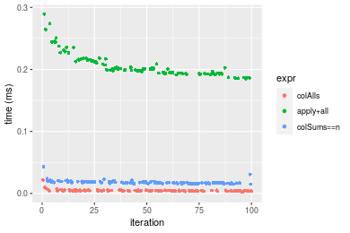

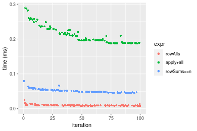
_Table: Benchmarking of colAlls() and rowAlls() on 100x100 data (original and transposed).  The top panel shows times in milliseconds and the bottom panel shows relative times._


|   |expr    |   min|     lq|    mean| median|      uq|    max|
|:--|:-------|-----:|------:|-------:|------:|-------:|------:|
|1  |colAlls | 3.003| 3.7215| 4.61756| 4.3775|  4.9355| 21.854|
|2  |rowAlls | 7.909| 8.8315| 9.98469| 9.6090| 10.4510| 24.828|


|   |expr    |    min|       lq|    mean|   median|       uq|      max|
|:--|:-------|------:|--------:|-------:|--------:|--------:|--------:|
|1  |colAlls | 1.0000| 1.000000| 1.00000| 1.000000| 1.000000| 1.000000|
|2  |rowAlls | 2.6337| 2.373102| 2.16233| 2.195089| 2.117516| 1.136085|

_Figure: Benchmarking of colAlls() and rowAlls() on 100x100 data (original and transposed).  Outliers are displayed as crosses. Times are in milliseconds._


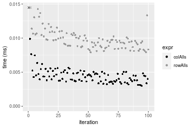

### 1000x10 matrix


```r
> X <- data[["1000x10"]]
> gc()
          used (Mb) gc trigger  (Mb) max used  (Mb)
Ncells 5148690  275    7554717 403.5  7554717 403.5
Vcells 9043957   69   31793280 242.6 60508962 461.7
> colStats <- microbenchmark(colAlls = colAlls(X), `apply+all` = apply(X, MARGIN = 2L, FUN = all), 
+     `colSums==n` = (colSums(X) == nrow(X)), unit = "ms")
> X <- t(X)
> gc()
          used  (Mb) gc trigger  (Mb) max used  (Mb)
Ncells 5148684 275.0    7554717 403.5  7554717 403.5
Vcells 9049000  69.1   31793280 242.6 60508962 461.7
> rowStats <- microbenchmark(rowAlls = rowAlls(X), `apply+all` = apply(X, MARGIN = 1L, FUN = all), 
+     `rowSums==n` = (rowSums(X) == ncol(X)), unit = "ms")
```

_Table: Benchmarking of colAlls(), apply+all() and colSums==n() on 1000x10 data. The top panel shows times in milliseconds and the bottom panel shows relative times._


|   |expr       |      min|        lq|      mean|    median|        uq|      max|
|:--|:----------|--------:|---------:|---------:|---------:|---------:|--------:|
|1  |colAlls    | 0.002817| 0.0034285| 0.0042329| 0.0040995| 0.0046200| 0.016481|
|3  |colSums==n | 0.016044| 0.0181735| 0.0190806| 0.0187910| 0.0199965| 0.036544|
|2  |apply+all  | 0.098271| 0.1040460| 0.1137659| 0.1115025| 0.1206515| 0.187787|


|   |expr       |       min|        lq|      mean|   median|        uq|       max|
|:--|:----------|---------:|---------:|---------:|--------:|---------:|---------:|
|1  |colAlls    |  1.000000|  1.000000|  1.000000|  1.00000|  1.000000|  1.000000|
|3  |colSums==n |  5.695421|  5.300715|  4.507666|  4.58373|  4.328247|  2.217341|
|2  |apply+all  | 34.884984| 30.347382| 26.876461| 27.19905| 26.115043| 11.394151|

_Table: Benchmarking of rowAlls(), apply+all() and rowSums==n() on 1000x10 data (transposed). The top panel shows times in milliseconds and the bottom panel shows relative times._


|   |expr       |      min|        lq|      mean|    median|        uq|      max|
|:--|:----------|--------:|---------:|---------:|---------:|---------:|--------:|
|1  |rowAlls    | 0.007922| 0.0094025| 0.0102764| 0.0099355| 0.0110375| 0.023926|
|2  |apply+all  | 0.093410| 0.1003720| 0.1087573| 0.1023900| 0.1186135| 0.187298|
|3  |rowSums==n | 0.163078| 0.1747950| 0.1826127| 0.1759425| 0.1881325| 0.220207|


|   |expr       |      min|       lq|     mean|   median|       uq|     max|
|:--|:----------|--------:|--------:|--------:|--------:|--------:|-------:|
|1  |rowAlls    |  1.00000|  1.00000|  1.00000|  1.00000|  1.00000| 1.00000|
|2  |apply+all  | 11.79121| 10.67503| 10.58318| 10.30547| 10.74641| 7.82822|
|3  |rowSums==n | 20.58546| 18.59027| 17.77005| 17.70847| 17.04485| 9.20367|

_Figure: Benchmarking of colAlls(), apply+all() and colSums==n() on 1000x10 data  as well as rowAlls(), apply+all() and rowSums==n() on the same data transposed.  Outliers are displayed as crosses.  Times are in milliseconds._


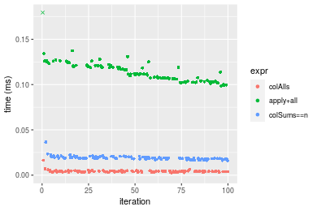

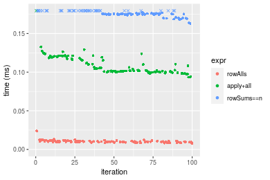
_Table: Benchmarking of colAlls() and rowAlls() on 1000x10 data (original and transposed).  The top panel shows times in milliseconds and the bottom panel shows relative times._


|   |expr    |   min|     lq|     mean| median|      uq|    max|
|:--|:-------|-----:|------:|--------:|------:|-------:|------:|
|1  |colAlls | 2.817| 3.4285|  4.23292| 4.0995|  4.6200| 16.481|
|2  |rowAlls | 7.922| 9.4025| 10.27643| 9.9355| 11.0375| 23.926|


|   |expr    |      min|       lq|    mean|   median|       uq|      max|
|:--|:-------|--------:|--------:|-------:|--------:|--------:|--------:|
|1  |colAlls | 1.000000| 1.000000| 1.00000| 1.000000| 1.000000| 1.000000|
|2  |rowAlls | 2.812212| 2.742453| 2.42774| 2.423588| 2.389069| 1.451732|

_Figure: Benchmarking of colAlls() and rowAlls() on 1000x10 data (original and transposed).  Outliers are displayed as crosses. Times are in milliseconds._


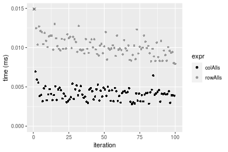

### 10x1000 matrix


```r
> X <- data[["10x1000"]]
> gc()
          used  (Mb) gc trigger  (Mb) max used  (Mb)
Ncells 5148900 275.0    7554717 403.5  7554717 403.5
Vcells 9044691  69.1   31793280 242.6 60508962 461.7
> colStats <- microbenchmark(colAlls = colAlls(X), `apply+all` = apply(X, MARGIN = 2L, FUN = all), 
+     `colSums==n` = (colSums(X) == nrow(X)), unit = "ms")
> X <- t(X)
> gc()
          used  (Mb) gc trigger  (Mb) max used  (Mb)
Ncells 5148894 275.0    7554717 403.5  7554717 403.5
Vcells 9049734  69.1   31793280 242.6 60508962 461.7
> rowStats <- microbenchmark(rowAlls = rowAlls(X), `apply+all` = apply(X, MARGIN = 1L, FUN = all), 
+     `rowSums==n` = (rowSums(X) == ncol(X)), unit = "ms")
```

_Table: Benchmarking of colAlls(), apply+all() and colSums==n() on 10x1000 data. The top panel shows times in milliseconds and the bottom panel shows relative times._


|   |expr       |      min|        lq|      mean|    median|        uq|      max|
|:--|:----------|--------:|---------:|---------:|---------:|---------:|--------:|
|1  |colAlls    | 0.010314| 0.0116700| 0.0136652| 0.0129505| 0.0141205| 0.033960|
|3  |colSums==n | 0.013467| 0.0142745| 0.0164115| 0.0155565| 0.0168685| 0.036367|
|2  |apply+all  | 0.863742| 0.8992895| 0.9806520| 0.9105520| 1.0401035| 1.370018|


|   |expr       |       min|        lq|      mean|    median|        uq|       max|
|:--|:----------|---------:|---------:|---------:|---------:|---------:|---------:|
|1  |colAlls    |  1.000000|  1.000000|  1.000000|  1.000000|  1.000000|  1.000000|
|3  |colSums==n |  1.305701|  1.223179|  1.200972|  1.201228|  1.194611|  1.070877|
|2  |apply+all  | 83.744619| 77.059940| 71.762618| 70.310181| 73.659113| 40.342108|

_Table: Benchmarking of rowAlls(), apply+all() and rowSums==n() on 10x1000 data (transposed). The top panel shows times in milliseconds and the bottom panel shows relative times._


|   |expr       |      min|       lq|      mean|    median|        uq|      max|
|:--|:----------|--------:|--------:|---------:|---------:|---------:|--------:|
|1  |rowAlls    | 0.013420| 0.016358| 0.0192083| 0.0180665| 0.0197855| 0.055622|
|3  |rowSums==n | 0.028342| 0.030043| 0.0328776| 0.0312045| 0.0343005| 0.056918|
|2  |apply+all  | 0.862426| 0.899349| 0.9762671| 0.9195950| 1.0517430| 1.370981|


|   |expr       |       min|        lq|      mean|    median|        uq|      max|
|:--|:----------|---------:|---------:|---------:|---------:|---------:|--------:|
|1  |rowAlls    |  1.000000|  1.000000|  1.000000|  1.000000|  1.000000|  1.00000|
|3  |rowSums==n |  2.111922|  1.836594|  1.711632|  1.727202|  1.733618|  1.02330|
|2  |apply+all  | 64.264233| 54.979154| 50.825141| 50.900562| 53.157262| 24.64818|

_Figure: Benchmarking of colAlls(), apply+all() and colSums==n() on 10x1000 data  as well as rowAlls(), apply+all() and rowSums==n() on the same data transposed.  Outliers are displayed as crosses.  Times are in milliseconds._


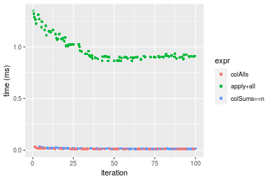

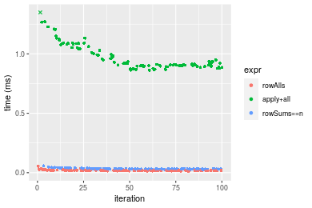
_Table: Benchmarking of colAlls() and rowAlls() on 10x1000 data (original and transposed).  The top panel shows times in milliseconds and the bottom panel shows relative times._


|   |expr    |    min|     lq|     mean|  median|      uq|    max|
|:--|:-------|------:|------:|--------:|-------:|-------:|------:|
|1  |colAlls | 10.314| 11.670| 13.66522| 12.9505| 14.1205| 33.960|
|2  |rowAlls | 13.420| 16.358| 19.20835| 18.0665| 19.7855| 55.622|


|   |expr    |      min|       lq|     mean|   median|      uq|      max|
|:--|:-------|--------:|--------:|--------:|--------:|-------:|--------:|
|1  |colAlls | 1.000000| 1.000000| 1.000000| 1.000000| 1.00000| 1.000000|
|2  |rowAlls | 1.301144| 1.401714| 1.405638| 1.395043| 1.40119| 1.637868|

_Figure: Benchmarking of colAlls() and rowAlls() on 10x1000 data (original and transposed).  Outliers are displayed as crosses. Times are in milliseconds._


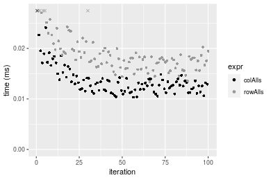

### 100x1000 matrix


```r
> X <- data[["100x1000"]]
> gc()
          used  (Mb) gc trigger  (Mb) max used  (Mb)
Ncells 5149118 275.0    7554717 403.5  7554717 403.5
Vcells 9045223  69.1   31793280 242.6 60508962 461.7
> colStats <- microbenchmark(colAlls = colAlls(X), `apply+all` = apply(X, MARGIN = 2L, FUN = all), 
+     `colSums==n` = (colSums(X) == nrow(X)), unit = "ms")
> X <- t(X)
> gc()
          used  (Mb) gc trigger  (Mb) max used  (Mb)
Ncells 5149100 275.0    7554717 403.5  7554717 403.5
Vcells 9095246  69.4   31793280 242.6 60508962 461.7
> rowStats <- microbenchmark(rowAlls = rowAlls(X), `apply+all` = apply(X, MARGIN = 1L, FUN = all), 
+     `rowSums==n` = (rowSums(X) == ncol(X)), unit = "ms")
```

_Table: Benchmarking of colAlls(), apply+all() and colSums==n() on 100x1000 data. The top panel shows times in milliseconds and the bottom panel shows relative times._


|   |expr       |      min|        lq|      mean|    median|        uq|      max|
|:--|:----------|--------:|---------:|---------:|---------:|---------:|--------:|
|1  |colAlls    | 0.011964| 0.0130605| 0.0158352| 0.0146500| 0.0173355| 0.035828|
|3  |colSums==n | 0.081069| 0.0820550| 0.0886361| 0.0838885| 0.0894805| 0.138382|
|2  |apply+all  | 1.368872| 1.4064470| 1.6080554| 1.4597955| 1.8375235| 2.466868|


|   |expr       |        min|         lq|     mean|    median|         uq|       max|
|:--|:----------|----------:|----------:|--------:|---------:|----------:|---------:|
|1  |colAlls    |   1.000000|   1.000000|   1.0000|  1.000000|   1.000000|  1.000000|
|3  |colSums==n |   6.776078|   6.282684|   5.5974|  5.726178|   5.161691|  3.862398|
|2  |apply+all  | 114.415914| 107.687072| 101.5492| 99.644744| 105.997721| 68.853076|

_Table: Benchmarking of rowAlls(), apply+all() and rowSums==n() on 100x1000 data (transposed). The top panel shows times in milliseconds and the bottom panel shows relative times._


|   |expr       |      min|        lq|      mean|    median|       uq|      max|
|:--|:----------|--------:|---------:|---------:|---------:|--------:|--------:|
|1  |rowAlls    | 0.036898| 0.0388985| 0.0438769| 0.0410200| 0.044618| 0.096445|
|3  |rowSums==n | 0.224336| 0.2256480| 0.2498376| 0.2271085| 0.256642| 0.382797|
|2  |apply+all  | 1.365460| 1.3785360| 1.4710983| 1.4104955| 1.434454| 2.434237|


|   |expr       |       min|        lq|      mean|    median|        uq|      max|
|:--|:----------|---------:|---------:|---------:|---------:|---------:|--------:|
|1  |rowAlls    |  1.000000|  1.000000|  1.000000|  1.000000|  1.000000|  1.00000|
|3  |rowSums==n |  6.079896|  5.800943|  5.694061|  5.536531|  5.751983|  3.96907|
|2  |apply+all  | 37.006342| 35.439310| 33.527870| 34.385556| 32.149659| 25.23964|

_Figure: Benchmarking of colAlls(), apply+all() and colSums==n() on 100x1000 data  as well as rowAlls(), apply+all() and rowSums==n() on the same data transposed.  Outliers are displayed as crosses.  Times are in milliseconds._


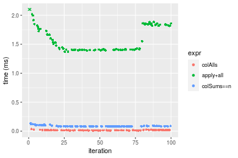

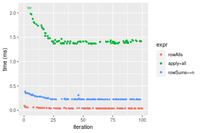
_Table: Benchmarking of colAlls() and rowAlls() on 100x1000 data (original and transposed).  The top panel shows times in milliseconds and the bottom panel shows relative times._


|   |expr    |    min|      lq|     mean| median|      uq|    max|
|:--|:-------|------:|-------:|--------:|------:|-------:|------:|
|1  |colAlls | 11.964| 13.0605| 15.83523|  14.65| 17.3355| 35.828|
|2  |rowAlls | 36.898| 38.8985| 43.87688|  41.02| 44.6180| 96.445|


|   |expr    |      min|       lq|    mean| median|       uq|      max|
|:--|:-------|--------:|--------:|-------:|------:|--------:|--------:|
|1  |colAlls | 1.000000| 1.000000| 1.00000|    1.0| 1.000000| 1.000000|
|2  |rowAlls | 3.084086| 2.978332| 2.77084|    2.8| 2.573794| 2.691889|

_Figure: Benchmarking of colAlls() and rowAlls() on 100x1000 data (original and transposed).  Outliers are displayed as crosses. Times are in milliseconds._


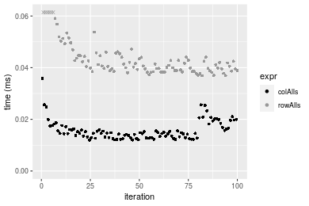

### 1000x100 matrix


```r
> X <- data[["1000x100"]]
> gc()
          used  (Mb) gc trigger  (Mb) max used  (Mb)
Ncells 5149322 275.1    7554717 403.5  7554717 403.5
Vcells 9045871  69.1   31793280 242.6 60508962 461.7
> colStats <- microbenchmark(colAlls = colAlls(X), `apply+all` = apply(X, MARGIN = 2L, FUN = all), 
+     `colSums==n` = (colSums(X) == nrow(X)), unit = "ms")
> X <- t(X)
> gc()
          used  (Mb) gc trigger  (Mb) max used  (Mb)
Ncells 5149304 275.1    7554717 403.5  7554717 403.5
Vcells 9095894  69.4   31793280 242.6 60508962 461.7
> rowStats <- microbenchmark(rowAlls = rowAlls(X), `apply+all` = apply(X, MARGIN = 1L, FUN = all), 
+     `rowSums==n` = (rowSums(X) == ncol(X)), unit = "ms")
```

_Table: Benchmarking of colAlls(), apply+all() and colSums==n() on 1000x100 data. The top panel shows times in milliseconds and the bottom panel shows relative times._


|   |expr       |      min|        lq|      mean|    median|        uq|      max|
|:--|:----------|--------:|---------:|---------:|---------:|---------:|--------:|
|1  |colAlls    | 0.003046| 0.0037545| 0.0049458| 0.0044750| 0.0054060| 0.023367|
|3  |colSums==n | 0.083081| 0.0843195| 0.0968749| 0.0875120| 0.1087330| 0.163231|
|2  |apply+all  | 0.627474| 0.6329915| 0.7170966| 0.6644215| 0.7969595| 1.063117|


|   |expr       |       min|        lq|     mean|    median|        uq|       max|
|:--|:----------|---------:|---------:|--------:|---------:|---------:|---------:|
|1  |colAlls    |   1.00000|   1.00000|   1.0000|   1.00000|   1.00000|  1.000000|
|3  |colSums==n |  27.27544|  22.45825|  19.5873|  19.55575|  20.11339|  6.985535|
|2  |apply+all  | 205.99934| 168.59542| 144.9910| 148.47408| 147.42129| 45.496512|

_Table: Benchmarking of rowAlls(), apply+all() and rowSums==n() on 1000x100 data (transposed). The top panel shows times in milliseconds and the bottom panel shows relative times._


|   |expr       |      min|       lq|      mean|    median|        uq|      max|
|:--|:----------|--------:|--------:|---------:|---------:|---------:|--------:|
|1  |rowAlls    | 0.041174| 0.042177| 0.0474964| 0.0434830| 0.0523475| 0.079514|
|3  |rowSums==n | 0.324240| 0.325178| 0.3620055| 0.3266855| 0.3951480| 0.519060|
|2  |apply+all  | 0.636505| 0.640815| 0.6994189| 0.6455085| 0.7184415| 1.119608|


|   |expr       |       min|        lq|      mean|    median|        uq|       max|
|:--|:----------|---------:|---------:|---------:|---------:|---------:|---------:|
|1  |rowAlls    |  1.000000|  1.000000|  1.000000|  1.000000|  1.000000|  1.000000|
|3  |rowSums==n |  7.874873|  7.709842|  7.621741|  7.512948|  7.548555|  6.527907|
|2  |apply+all  | 15.458906| 15.193470| 14.725715| 14.845077| 13.724466| 14.080640|

_Figure: Benchmarking of colAlls(), apply+all() and colSums==n() on 1000x100 data  as well as rowAlls(), apply+all() and rowSums==n() on the same data transposed.  Outliers are displayed as crosses.  Times are in milliseconds._


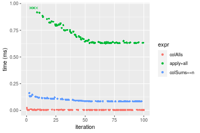

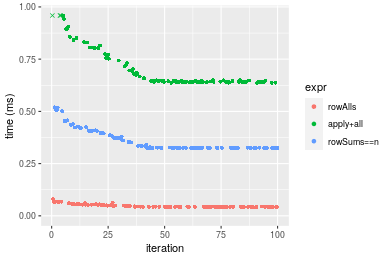
_Table: Benchmarking of colAlls() and rowAlls() on 1000x100 data (original and transposed).  The top panel shows times in milliseconds and the bottom panel shows relative times._


|   |expr    |    min|      lq|     mean| median|      uq|    max|
|:--|:-------|------:|-------:|--------:|------:|-------:|------:|
|1  |colAlls |  3.046|  3.7545|  4.94580|  4.475|  5.4060| 23.367|
|2  |rowAlls | 41.174| 42.1770| 47.49643| 43.483| 52.3475| 79.514|


|   |expr    |     min|       lq|     mean|   median|       uq|      max|
|:--|:-------|-------:|--------:|--------:|--------:|--------:|--------:|
|1  |colAlls |  1.0000|  1.00000| 1.000000| 1.000000| 1.000000| 1.000000|
|2  |rowAlls | 13.5174| 11.23372| 9.603387| 9.716871| 9.683222| 3.402833|

_Figure: Benchmarking of colAlls() and rowAlls() on 1000x100 data (original and transposed).  Outliers are displayed as crosses. Times are in milliseconds._


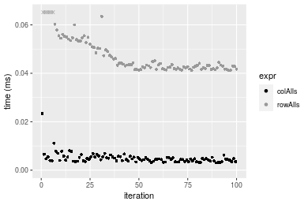


## Appendix

### Session information
```r
R version 4.1.1 Patched (2021-08-10 r80727)
Platform: x86_64-pc-linux-gnu (64-bit)
Running under: Ubuntu 18.04.5 LTS

Matrix products: default
BLAS:   /home/hb/software/R-devel/R-4-1-branch/lib/R/lib/libRblas.so
LAPACK: /home/hb/software/R-devel/R-4-1-branch/lib/R/lib/libRlapack.so

locale:
 [1] LC_CTYPE=en_US.UTF-8       LC_NUMERIC=C              
 [3] LC_TIME=en_US.UTF-8        LC_COLLATE=en_US.UTF-8    
 [5] LC_MONETARY=en_US.UTF-8    LC_MESSAGES=en_US.UTF-8   
 [7] LC_PAPER=en_US.UTF-8       LC_NAME=C                 
 [9] LC_ADDRESS=C               LC_TELEPHONE=C            
[11] LC_MEASUREMENT=en_US.UTF-8 LC_IDENTIFICATION=C       

attached base packages:
[1] stats     graphics  grDevices utils     datasets  methods   base     

other attached packages:
[1] microbenchmark_1.4-7   matrixStats_0.60.0     ggplot2_3.3.5         
[4] knitr_1.33             R.devices_2.17.0       R.utils_2.10.1        
[7] R.oo_1.24.0            R.methodsS3_1.8.1-9001

loaded via a namespace (and not attached):
 [1] Biobase_2.52.0          httr_1.4.2              splines_4.1.1          
 [4] bit64_4.0.5             network_1.17.1          assertthat_0.2.1       
 [7] highr_0.9               stats4_4.1.1            blob_1.2.2             
[10] GenomeInfoDbData_1.2.6  robustbase_0.93-8       pillar_1.6.2           
[13] RSQLite_2.2.8           lattice_0.20-44         glue_1.4.2             
[16] digest_0.6.27           XVector_0.32.0          colorspace_2.0-2       
[19] Matrix_1.3-4            XML_3.99-0.7            pkgconfig_2.0.3        
[22] zlibbioc_1.38.0         genefilter_1.74.0       purrr_0.3.4            
[25] ergm_4.1.2              xtable_1.8-4            scales_1.1.1           
[28] tibble_3.1.4            annotate_1.70.0         KEGGREST_1.32.0        
[31] farver_2.1.0            generics_0.1.0          IRanges_2.26.0         
[34] ellipsis_0.3.2          cachem_1.0.6            withr_2.4.2            
[37] BiocGenerics_0.38.0     mime_0.11               survival_3.2-13        
[40] magrittr_2.0.1          crayon_1.4.1            statnet.common_4.5.0   
[43] memoise_2.0.0           laeken_0.5.1            fansi_0.5.0            
[46] R.cache_0.15.0          MASS_7.3-54             R.rsp_0.44.0           
[49] tools_4.1.1             lifecycle_1.0.0         S4Vectors_0.30.0       
[52] trust_0.1-8             munsell_0.5.0           AnnotationDbi_1.54.1   
[55] Biostrings_2.60.2       compiler_4.1.1          GenomeInfoDb_1.28.1    
[58] rlang_0.4.11            grid_4.1.1              RCurl_1.98-1.4         
[61] cwhmisc_6.6             rappdirs_0.3.3          labeling_0.4.2         
[64] bitops_1.0-7            base64enc_0.1-3         boot_1.3-28            
[67] gtable_0.3.0            DBI_1.1.1               markdown_1.1           
[70] R6_2.5.1                lpSolveAPI_5.5.2.0-17.7 rle_0.9.2              
[73] dplyr_1.0.7             fastmap_1.1.0           bit_4.0.4              
[76] utf8_1.2.2              parallel_4.1.1          Rcpp_1.0.7             
[79] vctrs_0.3.8             png_0.1-7               DEoptimR_1.0-9         
[82] tidyselect_1.1.1        xfun_0.25               coda_0.19-4            
```
Total processing time was 11.34 secs.


### Reproducibility
To reproduce this report, do:
```r
html <- matrixStats:::benchmark('colAlls')
```

[RSP]: https://cran.r-project.org/package=R.rsp
[matrixStats]: https://cran.r-project.org/package=matrixStats

[StackOverflow:colMins?]: https://stackoverflow.com/questions/13676878 "Stack Overflow: fastest way to get Min from every column in a matrix?"
[StackOverflow:colSds?]: https://stackoverflow.com/questions/17549762 "Stack Overflow: Is there such 'colsd' in R?"
[StackOverflow:rowProds?]: https://stackoverflow.com/questions/20198801/ "Stack Overflow: Row product of matrix and column sum of matrix"

---------------------------------------
Copyright Henrik Bengtsson. Last updated on 2021-08-25 17:34:32 (+0200 UTC). Powered by [RSP].

<script>
 var link = document.createElement('link');
 link.rel = 'icon';
 link.href = "data:image/png;base64,iVBORw0KGgoAAAANSUhEUgAAACAAAAAgCAMAAABEpIrGAAAA21BMVEUAAAAAAP8AAP8AAP8AAP8AAP8AAP8AAP8AAP8AAP8AAP8AAP8AAP8AAP8AAP8AAP8AAP8AAP8AAP8AAP8AAP8AAP8AAP8AAP8AAP8AAP8AAP8AAP8AAP8AAP8AAP8AAP8AAP8AAP8AAP8AAP8AAP8AAP8AAP8AAP8AAP8AAP8BAf4CAv0DA/wdHeIeHuEfH+AgIN8hId4lJdomJtknJ9g+PsE/P8BAQL9yco10dIt1dYp3d4h4eIeVlWqWlmmXl2iYmGeZmWabm2Tn5xjo6Bfp6Rb39wj4+Af//wA2M9hbAAAASXRSTlMAAQIJCgsMJSYnKD4/QGRlZmhpamtsbautrrCxuru8y8zN5ebn6Pn6+///////////////////////////////////////////LsUNcQAAAS9JREFUOI29k21XgkAQhVcFytdSMqMETU26UVqGmpaiFbL//xc1cAhhwVNf6n5i5z67M2dmYOyfJZUqlVLhkKucG7cgmUZTybDz6g0iDeq51PUr37Ds2cy2/C9NeES5puDjxuUk1xnToZsg8pfA3avHQ3lLIi7iWRrkv/OYtkScxBIMgDee0ALoyxHQBJ68JLCjOtQIMIANF7QG9G9fNnHvisCHBVMKgSJgiz7nE+AoBKrAPA3MgepvgR9TSCasrCKH0eB1wBGBFdCO+nAGjMVGPcQb5bd6mQRegN6+1axOs9nGfYcCtfi4NQosdtH7dB+txFIpXQqN1p9B/asRHToyS0jRgpV7nk4nwcq1BJ+x3Gl/v7S9Wmpp/aGquum7w3ZDyrADFYrl8vHBH+ev9AUASW1dmU4h4wAAAABJRU5ErkJggg=="
 document.getElementsByTagName('head')[0].appendChild(link);
</script>


