[matrixStats]: Benchmark report

---------------------------------------


# colAnyMissings() and rowAnyMissings() benchmarks

This report benchmark the performance of colAnyMissings() and rowAnyMissings() against alternative methods.

## Alternative methods

* colAnyMissings() and rowAnyMissings()
* apply() + anyMissing()
* colSums() + is.na() and rowSums() + is.na()

where

```r
> colAnyMissings <- function(x, ...) colAnys(x, value = NA)
```

and

```r
> rowAnyMissings <- function(x, ...) rowAnys(x, value = NA)
```


## Data type "integer"

### Data
```r
> rmatrix <- function(nrow, ncol, mode = c("logical", "double", "integer", "index"), range = c(-100, 
+     +100), na_prob = 0) {
+     mode <- match.arg(mode)
+     n <- nrow * ncol
+     if (mode == "logical") {
+         x <- sample(c(FALSE, TRUE), size = n, replace = TRUE)
+     }     else if (mode == "index") {
+         x <- seq_len(n)
+         mode <- "integer"
+     }     else {
+         x <- runif(n, min = range[1], max = range[2])
+     }
+     storage.mode(x) <- mode
+     if (na_prob > 0) 
+         x[sample(n, size = na_prob * n)] <- NA
+     dim(x) <- c(nrow, ncol)
+     x
+ }
> rmatrices <- function(scale = 10, seed = 1, ...) {
+     set.seed(seed)
+     data <- list()
+     data[[1]] <- rmatrix(nrow = scale * 1, ncol = scale * 1, ...)
+     data[[2]] <- rmatrix(nrow = scale * 10, ncol = scale * 10, ...)
+     data[[3]] <- rmatrix(nrow = scale * 100, ncol = scale * 1, ...)
+     data[[4]] <- t(data[[3]])
+     data[[5]] <- rmatrix(nrow = scale * 10, ncol = scale * 100, ...)
+     data[[6]] <- t(data[[5]])
+     names(data) <- sapply(data, FUN = function(x) paste(dim(x), collapse = "x"))
+     data
+ }
> data <- rmatrices(mode = mode)
```

## Results

### 10x10 matrix


```r
> X <- data[["10x10"]]
> gc()
          used  (Mb) gc trigger  (Mb) max used  (Mb)
Ncells 5156291 275.4    7554717 403.5  7554717 403.5
Vcells 9435436  72.0   31793280 242.6 60508962 461.7
> colStats <- microbenchmark(colAnyMissings = colAnyMissings(X), `apply+anyMissing` = apply(X, MARGIN = 2L, 
+     FUN = anyMissing), colSums = is.na(colSums(X, na.rm = FALSE)), unit = "ms")
> X <- t(X)
> gc()
          used  (Mb) gc trigger  (Mb) max used  (Mb)
Ncells 5155214 275.4    7554717 403.5  7554717 403.5
Vcells 9432557  72.0   31793280 242.6 60508962 461.7
> rowStats <- microbenchmark(rowAnyMissings = rowAnyMissings(X), `apply+anyMissing` = apply(X, MARGIN = 1L, 
+     FUN = anyMissing), rowSums = is.na(rowSums(X, na.rm = FALSE)), unit = "ms")
```

_Table: Benchmarking of colAnyMissings(), apply+anyMissing() and colSums() on integer+10x10 data. The top panel shows times in milliseconds and the bottom panel shows relative times._


|   |expr             |      min|        lq|      mean|    median|        uq|      max|
|:--|:----------------|--------:|---------:|---------:|---------:|---------:|--------:|
|1  |colAnyMissings   | 0.003615| 0.0041580| 0.0048375| 0.0048080| 0.0051280| 0.019929|
|3  |colSums          | 0.005252| 0.0059135| 0.0069499| 0.0067125| 0.0073480| 0.030445|
|2  |apply+anyMissing | 0.038548| 0.0402340| 0.0418691| 0.0407140| 0.0416495| 0.095701|


|   |expr             |       min|       lq|     mean|   median|       uq|      max|
|:--|:----------------|---------:|--------:|--------:|--------:|--------:|--------:|
|1  |colAnyMissings   |  1.000000| 1.000000| 1.000000| 1.000000| 1.000000| 1.000000|
|3  |colSums          |  1.452835| 1.422198| 1.436671| 1.396111| 1.432917| 1.527673|
|2  |apply+anyMissing | 10.663347| 9.676287| 8.655099| 8.467970| 8.121977| 4.802097|

_Table: Benchmarking of rowAnyMissings(), apply+anyMissing() and rowSums() on integer+10x10 data (transposed). The top panel shows times in milliseconds and the bottom panel shows relative times._


|   |expr             |      min|        lq|      mean|    median|       uq|      max|
|:--|:----------------|--------:|---------:|---------:|---------:|--------:|--------:|
|1  |rowAnyMissings   | 0.003632| 0.0041575| 0.0048205| 0.0048305| 0.005081| 0.021112|
|3  |rowSums          | 0.006132| 0.0066440| 0.0076920| 0.0072045| 0.007914| 0.027277|
|2  |apply+anyMissing | 0.038294| 0.0394880| 0.0411885| 0.0402470| 0.041175| 0.091878|


|   |expr             |       min|       lq|     mean|   median|       uq|      max|
|:--|:----------------|---------:|--------:|--------:|--------:|--------:|--------:|
|1  |rowAnyMissings   |  1.000000| 1.000000| 1.000000| 1.000000| 1.000000| 1.000000|
|3  |rowSums          |  1.688326| 1.598076| 1.595709| 1.491461| 1.557567| 1.292014|
|2  |apply+anyMissing | 10.543502| 9.498016| 8.544508| 8.331850| 8.103720| 4.351933|

_Figure: Benchmarking of colAnyMissings(), apply+anyMissing() and colSums() on integer+10x10 data  as well as rowAnyMissings(), apply+anyMissing() and rowSums() on the same data transposed.  Outliers are displayed as crosses.  Times are in milliseconds._


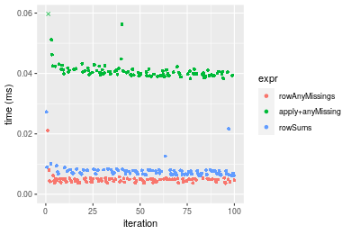
_Table: Benchmarking of colAnyMissings() and rowAnyMissings() on integer+10x10 data (original and transposed).  The top panel shows times in milliseconds and the bottom panel shows relative times._


|   |expr           |   min|     lq|    mean| median|    uq|    max|
|:--|:--------------|-----:|------:|-------:|------:|-----:|------:|
|1  |colAnyMissings | 3.615| 4.1580| 4.83751| 4.8080| 5.128| 19.929|
|2  |rowAnyMissings | 3.632| 4.1575| 4.82046| 4.8305| 5.081| 21.112|


|   |expr           |      min|        lq|      mean|  median|        uq|      max|
|:--|:--------------|--------:|---------:|---------:|-------:|---------:|--------:|
|1  |colAnyMissings | 1.000000| 1.0000000| 1.0000000| 1.00000| 1.0000000| 1.000000|
|2  |rowAnyMissings | 1.004703| 0.9998797| 0.9964755| 1.00468| 0.9908346| 1.059361|

_Figure: Benchmarking of colAnyMissings() and rowAnyMissings() on integer+10x10 data (original and transposed).  Outliers are displayed as crosses. Times are in milliseconds._


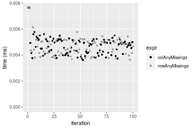

### 100x100 matrix


```r
> X <- data[["100x100"]]
> gc()
          used  (Mb) gc trigger  (Mb) max used  (Mb)
Ncells 5153757 275.3    7554717 403.5  7554717 403.5
Vcells 9049719  69.1   31793280 242.6 60508962 461.7
> colStats <- microbenchmark(colAnyMissings = colAnyMissings(X), `apply+anyMissing` = apply(X, MARGIN = 2L, 
+     FUN = anyMissing), colSums = is.na(colSums(X, na.rm = FALSE)), unit = "ms")
> X <- t(X)
> gc()
          used  (Mb) gc trigger  (Mb) max used  (Mb)
Ncells 5153751 275.3    7554717 403.5  7554717 403.5
Vcells 9054762  69.1   31793280 242.6 60508962 461.7
> rowStats <- microbenchmark(rowAnyMissings = rowAnyMissings(X), `apply+anyMissing` = apply(X, MARGIN = 1L, 
+     FUN = anyMissing), rowSums = is.na(rowSums(X, na.rm = FALSE)), unit = "ms")
```

_Table: Benchmarking of colAnyMissings(), apply+anyMissing() and colSums() on integer+100x100 data. The top panel shows times in milliseconds and the bottom panel shows relative times._


|   |expr             |      min|        lq|      mean|   median|        uq|      max|
|:--|:----------------|--------:|---------:|---------:|--------:|---------:|--------:|
|1  |colAnyMissings   | 0.008002| 0.0088005| 0.0100982| 0.009460| 0.0104405| 0.030367|
|3  |colSums          | 0.015619| 0.0169975| 0.0189802| 0.018222| 0.0201190| 0.043554|
|2  |apply+anyMissing | 0.236542| 0.2490550| 0.2740554| 0.261168| 0.2940650| 0.398477|


|   |expr             |       min|        lq|      mean|    median|        uq|       max|
|:--|:----------------|---------:|---------:|---------:|---------:|---------:|---------:|
|1  |colAnyMissings   |  1.000000|  1.000000|  1.000000|  1.000000|  1.000000|  1.000000|
|3  |colSums          |  1.951887|  1.931424|  1.879569|  1.926216|  1.927015|  1.434254|
|2  |apply+anyMissing | 29.560360| 28.300097| 27.139140| 27.607611| 28.165797| 13.122040|

_Table: Benchmarking of rowAnyMissings(), apply+anyMissing() and rowSums() on integer+100x100 data (transposed). The top panel shows times in milliseconds and the bottom panel shows relative times._


|   |expr             |      min|        lq|      mean|    median|        uq|      max|
|:--|:----------------|--------:|---------:|---------:|---------:|---------:|--------:|
|1  |rowAnyMissings   | 0.011112| 0.0122055| 0.0132170| 0.0129720| 0.0137810| 0.029418|
|3  |rowSums          | 0.041750| 0.0444770| 0.0469167| 0.0461130| 0.0481445| 0.073267|
|2  |apply+anyMissing | 0.229703| 0.2432405| 0.2606880| 0.2552865| 0.2721300| 0.373535|


|   |expr             |       min|        lq|      mean|   median|        uq|      max|
|:--|:----------------|---------:|---------:|---------:|--------:|---------:|--------:|
|1  |rowAnyMissings   |  1.000000|  1.000000|  1.000000|  1.00000|  1.000000|  1.00000|
|3  |rowSums          |  3.757199|  3.644013|  3.549733|  3.55481|  3.493542|  2.49055|
|2  |apply+anyMissing | 20.671616| 19.928762| 19.723730| 19.67981| 19.746753| 12.69750|

_Figure: Benchmarking of colAnyMissings(), apply+anyMissing() and colSums() on integer+100x100 data  as well as rowAnyMissings(), apply+anyMissing() and rowSums() on the same data transposed.  Outliers are displayed as crosses.  Times are in milliseconds._


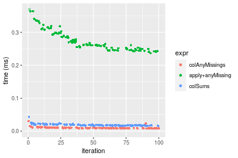

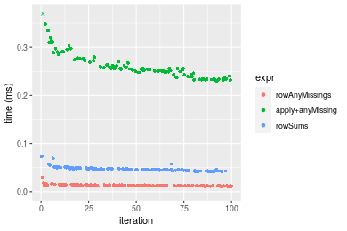
_Table: Benchmarking of colAnyMissings() and rowAnyMissings() on integer+100x100 data (original and transposed).  The top panel shows times in milliseconds and the bottom panel shows relative times._


|   |expr           |    min|      lq|     mean| median|      uq|    max|
|:--|:--------------|------:|-------:|--------:|------:|-------:|------:|
|1  |colAnyMissings |  8.002|  8.8005| 10.09816|  9.460| 10.4405| 30.367|
|2  |rowAnyMissings | 11.112| 12.2055| 13.21697| 12.972| 13.7810| 29.418|


|   |expr           |      min|      lq|     mean|   median|       uq|      max|
|:--|:--------------|--------:|-------:|--------:|--------:|--------:|--------:|
|1  |colAnyMissings | 1.000000| 1.00000| 1.000000| 1.000000| 1.000000| 1.000000|
|2  |rowAnyMissings | 1.388653| 1.38691| 1.308849| 1.371247| 1.319956| 0.968749|

_Figure: Benchmarking of colAnyMissings() and rowAnyMissings() on integer+100x100 data (original and transposed).  Outliers are displayed as crosses. Times are in milliseconds._


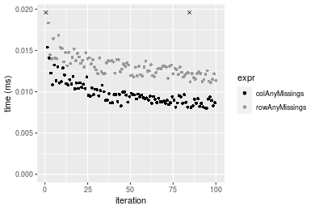

### 1000x10 matrix


```r
> X <- data[["1000x10"]]
> gc()
          used  (Mb) gc trigger  (Mb) max used  (Mb)
Ncells 5153967 275.3    7554717 403.5  7554717 403.5
Vcells 9050323  69.1   31793280 242.6 60508962 461.7
> colStats <- microbenchmark(colAnyMissings = colAnyMissings(X), `apply+anyMissing` = apply(X, MARGIN = 2L, 
+     FUN = anyMissing), colSums = is.na(colSums(X, na.rm = FALSE)), unit = "ms")
> X <- t(X)
> gc()
          used  (Mb) gc trigger  (Mb) max used  (Mb)
Ncells 5153961 275.3    7554717 403.5  7554717 403.5
Vcells 9055366  69.1   31793280 242.6 60508962 461.7
> rowStats <- microbenchmark(rowAnyMissings = rowAnyMissings(X), `apply+anyMissing` = apply(X, MARGIN = 1L, 
+     FUN = anyMissing), rowSums = is.na(rowSums(X, na.rm = FALSE)), unit = "ms")
```

_Table: Benchmarking of colAnyMissings(), apply+anyMissing() and colSums() on integer+1000x10 data. The top panel shows times in milliseconds and the bottom panel shows relative times._


|   |expr             |      min|        lq|      mean|    median|        uq|      max|
|:--|:----------------|--------:|---------:|---------:|---------:|---------:|--------:|
|1  |colAnyMissings   | 0.007399| 0.0083385| 0.0089944| 0.0087155| 0.0095070| 0.021083|
|3  |colSums          | 0.015573| 0.0174945| 0.0185874| 0.0183400| 0.0193545| 0.033440|
|2  |apply+anyMissing | 0.103506| 0.1104160| 0.1209238| 0.1184320| 0.1278035| 0.205749|


|   |expr             |       min|        lq|      mean|    median|        uq|      max|
|:--|:----------------|---------:|---------:|---------:|---------:|---------:|--------:|
|1  |colAnyMissings   |  1.000000|  1.000000|  1.000000|  1.000000|  1.000000| 1.000000|
|3  |colSums          |  2.104744|  2.098039|  2.066562|  2.104297|  2.035816| 1.586112|
|2  |apply+anyMissing | 13.989188| 13.241710| 13.444368| 13.588664| 13.443095| 9.759000|

_Table: Benchmarking of rowAnyMissings(), apply+anyMissing() and rowSums() on integer+1000x10 data (transposed). The top panel shows times in milliseconds and the bottom panel shows relative times._


|   |expr             |      min|        lq|      mean|    median|        uq|      max|
|:--|:----------------|--------:|---------:|---------:|---------:|---------:|--------:|
|1  |rowAnyMissings   | 0.009889| 0.0114035| 0.0125021| 0.0121905| 0.0132765| 0.026488|
|2  |apply+anyMissing | 0.094930| 0.1026915| 0.1133230| 0.1083525| 0.1227895| 0.207329|
|3  |rowSums          | 0.157756| 0.1688610| 0.1794330| 0.1751795| 0.1900485| 0.220384|


|   |expr             |       min|        lq|      mean|    median|        uq|      max|
|:--|:----------------|---------:|---------:|---------:|---------:|---------:|--------:|
|1  |rowAnyMissings   |  1.000000|  1.000000|  1.000000|  1.000000|  1.000000| 1.000000|
|2  |apply+anyMissing |  9.599555|  9.005261|  9.064327|  8.888274|  9.248635| 7.827280|
|3  |rowSums          | 15.952675| 14.807822| 14.352238| 14.370165| 14.314654| 8.320145|

_Figure: Benchmarking of colAnyMissings(), apply+anyMissing() and colSums() on integer+1000x10 data  as well as rowAnyMissings(), apply+anyMissing() and rowSums() on the same data transposed.  Outliers are displayed as crosses.  Times are in milliseconds._


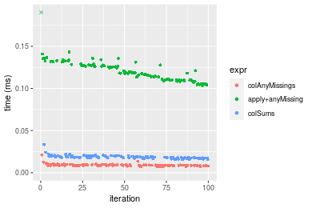

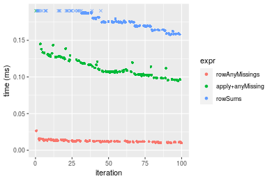
_Table: Benchmarking of colAnyMissings() and rowAnyMissings() on integer+1000x10 data (original and transposed).  The top panel shows times in milliseconds and the bottom panel shows relative times._


|   |expr           |   min|      lq|     mean|  median|      uq|    max|
|:--|:--------------|-----:|-------:|--------:|-------:|-------:|------:|
|1  |colAnyMissings | 7.399|  8.3385|  8.99438|  8.7155|  9.5070| 21.083|
|2  |rowAnyMissings | 9.889| 11.4035| 12.50209| 12.1905| 13.2765| 26.488|


|   |expr           |      min|       lq|     mean|   median|       uq|      max|
|:--|:--------------|--------:|--------:|--------:|--------:|--------:|--------:|
|1  |colAnyMissings | 1.000000| 1.000000| 1.000000| 1.000000| 1.000000| 1.000000|
|2  |rowAnyMissings | 1.336532| 1.367572| 1.389989| 1.398715| 1.396497| 1.256368|

_Figure: Benchmarking of colAnyMissings() and rowAnyMissings() on integer+1000x10 data (original and transposed).  Outliers are displayed as crosses. Times are in milliseconds._


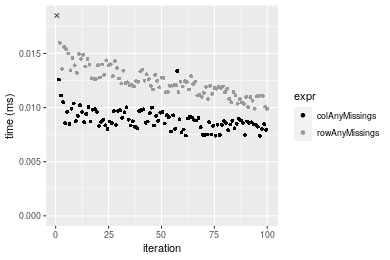

### 10x1000 matrix


```r
> X <- data[["10x1000"]]
> gc()
          used  (Mb) gc trigger  (Mb) max used  (Mb)
Ncells 5154177 275.3    7554717 403.5  7554717 403.5
Vcells 9051125  69.1   31793280 242.6 60508962 461.7
> colStats <- microbenchmark(colAnyMissings = colAnyMissings(X), `apply+anyMissing` = apply(X, MARGIN = 2L, 
+     FUN = anyMissing), colSums = is.na(colSums(X, na.rm = FALSE)), unit = "ms")
> X <- t(X)
> gc()
          used  (Mb) gc trigger  (Mb) max used  (Mb)
Ncells 5154171 275.3    7554717 403.5  7554717 403.5
Vcells 9056168  69.1   31793280 242.6 60508962 461.7
> rowStats <- microbenchmark(rowAnyMissings = rowAnyMissings(X), `apply+anyMissing` = apply(X, MARGIN = 1L, 
+     FUN = anyMissing), rowSums = is.na(rowSums(X, na.rm = FALSE)), unit = "ms")
```

_Table: Benchmarking of colAnyMissings(), apply+anyMissing() and colSums() on integer+10x1000 data. The top panel shows times in milliseconds and the bottom panel shows relative times._


|   |expr             |      min|       lq|      mean|   median|        uq|      max|
|:--|:----------------|--------:|--------:|---------:|--------:|---------:|--------:|
|1  |colAnyMissings   | 0.008262| 0.009199| 0.0104618| 0.009962| 0.0106950| 0.024277|
|3  |colSums          | 0.014345| 0.015662| 0.0171372| 0.016548| 0.0174425| 0.036961|
|2  |apply+anyMissing | 1.232490| 1.284887| 1.3889744| 1.315290| 1.4274000| 2.060460|


|   |expr             |        min|         lq|       mean|     median|         uq|      max|
|:--|:----------------|----------:|----------:|----------:|----------:|----------:|--------:|
|1  |colAnyMissings   |   1.000000|   1.000000|   1.000000|   1.000000|   1.000000|  1.00000|
|3  |colSums          |   1.736262|   1.702576|   1.638074|   1.661112|   1.630902|  1.52247|
|2  |apply+anyMissing | 149.175744| 139.676867| 132.766422| 132.030717| 133.464236| 84.87292|

_Table: Benchmarking of rowAnyMissings(), apply+anyMissing() and rowSums() on integer+10x1000 data (transposed). The top panel shows times in milliseconds and the bottom panel shows relative times._


|   |expr             |      min|        lq|      mean|    median|       uq|      max|
|:--|:----------------|--------:|---------:|---------:|---------:|--------:|--------:|
|1  |rowAnyMissings   | 0.009687| 0.0105315| 0.0120555| 0.0111380| 0.012482| 0.045603|
|3  |rowSums          | 0.027027| 0.0277715| 0.0300686| 0.0287535| 0.029577| 0.052966|
|2  |apply+anyMissing | 1.238779| 1.2991915| 1.3958089| 1.3199015| 1.426502| 2.064023|


|   |expr             |        min|         lq|       mean|     median|         uq|       max|
|:--|:----------------|----------:|----------:|----------:|----------:|----------:|---------:|
|1  |rowAnyMissings   |   1.000000|   1.000000|   1.000000|   1.000000|   1.000000|  1.000000|
|3  |rowSums          |   2.790028|   2.636994|   2.494179|   2.581568|   2.369572|  1.161459|
|2  |apply+anyMissing | 127.880562| 123.362437| 115.781920| 118.504355| 114.284730| 45.260685|

_Figure: Benchmarking of colAnyMissings(), apply+anyMissing() and colSums() on integer+10x1000 data  as well as rowAnyMissings(), apply+anyMissing() and rowSums() on the same data transposed.  Outliers are displayed as crosses.  Times are in milliseconds._


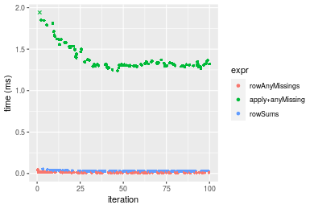
_Table: Benchmarking of colAnyMissings() and rowAnyMissings() on integer+10x1000 data (original and transposed).  The top panel shows times in milliseconds and the bottom panel shows relative times._


|   |expr           |   min|      lq|     mean| median|     uq|    max|
|:--|:--------------|-----:|-------:|--------:|------:|------:|------:|
|1  |colAnyMissings | 8.262|  9.1990| 10.46179|  9.962| 10.695| 24.277|
|2  |rowAnyMissings | 9.687| 10.5315| 12.05550| 11.138| 12.482| 45.603|


|   |expr           |      min|       lq|     mean|   median|       uq|      max|
|:--|:--------------|--------:|--------:|--------:|--------:|--------:|--------:|
|1  |colAnyMissings | 1.000000| 1.000000| 1.000000| 1.000000| 1.000000| 1.000000|
|2  |rowAnyMissings | 1.172476| 1.144853| 1.152336| 1.118049| 1.167087| 1.878445|

_Figure: Benchmarking of colAnyMissings() and rowAnyMissings() on integer+10x1000 data (original and transposed).  Outliers are displayed as crosses. Times are in milliseconds._


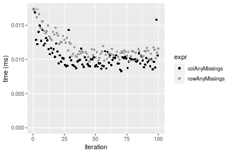

### 100x1000 matrix


```r
> X <- data[["100x1000"]]
> gc()
          used  (Mb) gc trigger  (Mb) max used  (Mb)
Ncells 5154383 275.3    7554717 403.5  7554717 403.5
Vcells 9051701  69.1   31793280 242.6 60508962 461.7
> colStats <- microbenchmark(colAnyMissings = colAnyMissings(X), `apply+anyMissing` = apply(X, MARGIN = 2L, 
+     FUN = anyMissing), colSums = is.na(colSums(X, na.rm = FALSE)), unit = "ms")
> X <- t(X)
> gc()
          used  (Mb) gc trigger  (Mb) max used  (Mb)
Ncells 5154377 275.3    7554717 403.5  7554717 403.5
Vcells 9101744  69.5   31793280 242.6 60508962 461.7
> rowStats <- microbenchmark(rowAnyMissings = rowAnyMissings(X), `apply+anyMissing` = apply(X, MARGIN = 1L, 
+     FUN = anyMissing), rowSums = is.na(rowSums(X, na.rm = FALSE)), unit = "ms")
```

_Table: Benchmarking of colAnyMissings(), apply+anyMissing() and colSums() on integer+100x1000 data. The top panel shows times in milliseconds and the bottom panel shows relative times._


|   |expr             |      min|        lq|      mean|    median|        uq|      max|
|:--|:----------------|--------:|---------:|---------:|---------:|---------:|--------:|
|1  |colAnyMissings   | 0.039498| 0.0401205| 0.0426592| 0.0411765| 0.0424155| 0.069256|
|3  |colSums          | 0.090032| 0.0907245| 0.0964989| 0.0922690| 0.0943335| 0.150111|
|2  |apply+anyMissing | 1.795635| 1.8476155| 1.9651506| 1.8661430| 1.9145965| 3.258308|


|   |expr             |       min|       lq|      mean|    median|        uq|      max|
|:--|:----------------|---------:|--------:|---------:|---------:|---------:|--------:|
|1  |colAnyMissings   |  1.000000|  1.00000|  1.000000|  1.000000|  1.000000|  1.00000|
|3  |colSums          |  2.279407|  2.26130|  2.262091|  2.240817|  2.224034|  2.16748|
|2  |apply+anyMissing | 45.461416| 46.05166| 46.066312| 45.320583| 45.139077| 47.04730|

_Table: Benchmarking of rowAnyMissings(), apply+anyMissing() and rowSums() on integer+100x1000 data (transposed). The top panel shows times in milliseconds and the bottom panel shows relative times._


|   |expr             |      min|        lq|      mean|   median|        uq|      max|
|:--|:----------------|--------:|---------:|---------:|--------:|---------:|--------:|
|1  |rowAnyMissings   | 0.057750| 0.0583450| 0.0630436| 0.059431| 0.0614085| 0.134950|
|3  |rowSums          | 0.222818| 0.2241185| 0.2478437| 0.228401| 0.2532505| 0.388132|
|2  |apply+anyMissing | 1.804193| 1.8520560| 1.9516454| 1.869288| 1.9383130| 3.143230|


|   |expr             |      min|        lq|      mean|    median|       uq|       max|
|:--|:----------------|--------:|---------:|---------:|---------:|--------:|---------:|
|1  |rowAnyMissings   |  1.00000|  1.000000|  1.000000|  1.000000|  1.00000|  1.000000|
|3  |rowSums          |  3.85832|  3.841263|  3.931309|  3.843129|  4.12403|  2.876117|
|2  |apply+anyMissing | 31.24144| 31.743183| 30.957099| 31.453088| 31.56425| 23.291812|

_Figure: Benchmarking of colAnyMissings(), apply+anyMissing() and colSums() on integer+100x1000 data  as well as rowAnyMissings(), apply+anyMissing() and rowSums() on the same data transposed.  Outliers are displayed as crosses.  Times are in milliseconds._


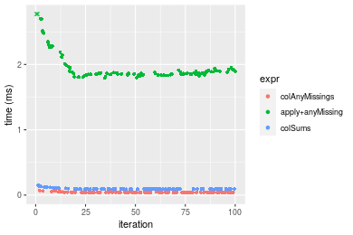

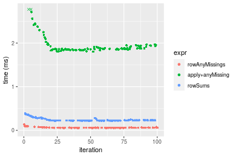
_Table: Benchmarking of colAnyMissings() and rowAnyMissings() on integer+100x1000 data (original and transposed).  The top panel shows times in milliseconds and the bottom panel shows relative times._


|   |expr           |    min|      lq|     mean|  median|      uq|     max|
|:--|:--------------|------:|-------:|--------:|-------:|-------:|-------:|
|1  |colAnyMissings | 39.498| 40.1205| 42.65917| 41.1765| 42.4155|  69.256|
|2  |rowAnyMissings | 57.750| 58.3450| 63.04355| 59.4310| 61.4085| 134.950|


|   |expr           |      min|       lq|     mean|   median|       uq|      max|
|:--|:--------------|--------:|--------:|--------:|--------:|--------:|--------:|
|1  |colAnyMissings | 1.000000| 1.000000| 1.000000| 1.000000| 1.000000| 1.000000|
|2  |rowAnyMissings | 1.462099| 1.454244| 1.477843| 1.443323| 1.447784| 1.948568|

_Figure: Benchmarking of colAnyMissings() and rowAnyMissings() on integer+100x1000 data (original and transposed).  Outliers are displayed as crosses. Times are in milliseconds._


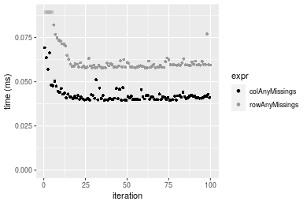

### 1000x100 matrix


```r
> X <- data[["1000x100"]]
> gc()
          used  (Mb) gc trigger  (Mb) max used  (Mb)
Ncells 5154587 275.3    7554717 403.5  7554717 403.5
Vcells 9052364  69.1   31793280 242.6 60508962 461.7
> colStats <- microbenchmark(colAnyMissings = colAnyMissings(X), `apply+anyMissing` = apply(X, MARGIN = 2L, 
+     FUN = anyMissing), colSums = is.na(colSums(X, na.rm = FALSE)), unit = "ms")
> X <- t(X)
> gc()
          used  (Mb) gc trigger  (Mb) max used  (Mb)
Ncells 5154581 275.3    7554717 403.5  7554717 403.5
Vcells 9102407  69.5   31793280 242.6 60508962 461.7
> rowStats <- microbenchmark(rowAnyMissings = rowAnyMissings(X), `apply+anyMissing` = apply(X, MARGIN = 1L, 
+     FUN = anyMissing), rowSums = is.na(rowSums(X, na.rm = FALSE)), unit = "ms")
```

_Table: Benchmarking of colAnyMissings(), apply+anyMissing() and colSums() on integer+1000x100 data. The top panel shows times in milliseconds and the bottom panel shows relative times._


|   |expr             |      min|        lq|      mean|    median|       uq|      max|
|:--|:----------------|--------:|---------:|---------:|---------:|--------:|--------:|
|1  |colAnyMissings   | 0.031582| 0.0326230| 0.0392617| 0.0345275| 0.043929| 0.086067|
|3  |colSums          | 0.083356| 0.0847145| 0.0974667| 0.0885065| 0.108496| 0.162879|
|2  |apply+anyMissing | 0.667053| 0.6749275| 0.7676747| 0.7137360| 0.847981| 1.174545|


|   |expr             |       min|        lq|      mean|    median|        uq|       max|
|:--|:----------------|---------:|---------:|---------:|---------:|---------:|---------:|
|1  |colAnyMissings   |  1.000000|  1.000000|  1.000000|  1.000000|  1.000000|  1.000000|
|3  |colSums          |  2.639352|  2.596772|  2.482488|  2.563363|  2.469803|  1.892467|
|2  |apply+anyMissing | 21.121303| 20.688701| 19.552763| 20.671523| 19.303444| 13.646868|

_Table: Benchmarking of rowAnyMissings(), apply+anyMissing() and rowSums() on integer+1000x100 data (transposed). The top panel shows times in milliseconds and the bottom panel shows relative times._


|   |expr             |      min|       lq|      mean|    median|       uq|      max|
|:--|:----------------|--------:|--------:|---------:|---------:|--------:|--------:|
|1  |rowAnyMissings   | 0.069104| 0.070118| 0.0781734| 0.0705790| 0.086210| 0.123698|
|3  |rowSums          | 0.322607| 0.324018| 0.3618221| 0.3266955| 0.394237| 0.551520|
|2  |apply+anyMissing | 0.673895| 0.679663| 0.7443257| 0.6857625| 0.750674| 1.232373|


|   |expr             |      min|       lq|     mean|   median|       uq|      max|
|:--|:----------------|--------:|--------:|--------:|--------:|--------:|--------:|
|1  |rowAnyMissings   | 1.000000| 1.000000| 1.000000| 1.000000| 1.000000| 1.000000|
|3  |rowSums          | 4.668427| 4.621039| 4.628452| 4.628792| 4.572985| 4.458601|
|2  |apply+anyMissing | 9.751896| 9.693132| 9.521464| 9.716240| 8.707505| 9.962756|

_Figure: Benchmarking of colAnyMissings(), apply+anyMissing() and colSums() on integer+1000x100 data  as well as rowAnyMissings(), apply+anyMissing() and rowSums() on the same data transposed.  Outliers are displayed as crosses.  Times are in milliseconds._


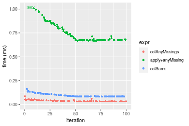


_Table: Benchmarking of colAnyMissings() and rowAnyMissings() on integer+1000x100 data (original and transposed).  The top panel shows times in milliseconds and the bottom panel shows relative times._


|   |expr           |    min|     lq|     mean|  median|     uq|     max|
|:--|:--------------|------:|------:|--------:|-------:|------:|-------:|
|1  |colAnyMissings | 31.582| 32.623| 39.26170| 34.5275| 43.929|  86.067|
|2  |rowAnyMissings | 69.104| 70.118| 78.17345| 70.5790| 86.210| 123.698|


|   |expr           |      min|       lq|     mean|   median|       uq|      max|
|:--|:--------------|--------:|--------:|--------:|--------:|--------:|--------:|
|1  |colAnyMissings | 1.000000| 1.000000| 1.000000| 1.000000| 1.000000| 1.000000|
|2  |rowAnyMissings | 2.188082| 2.149342| 1.991087| 2.044139| 1.962485| 1.437229|

_Figure: Benchmarking of colAnyMissings() and rowAnyMissings() on integer+1000x100 data (original and transposed).  Outliers are displayed as crosses. Times are in milliseconds._


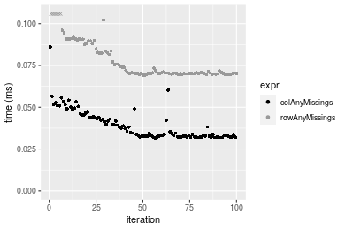


## Data type "double"

### Data
```r
> rmatrix <- function(nrow, ncol, mode = c("logical", "double", "integer", "index"), range = c(-100, 
+     +100), na_prob = 0) {
+     mode <- match.arg(mode)
+     n <- nrow * ncol
+     if (mode == "logical") {
+         x <- sample(c(FALSE, TRUE), size = n, replace = TRUE)
+     }     else if (mode == "index") {
+         x <- seq_len(n)
+         mode <- "integer"
+     }     else {
+         x <- runif(n, min = range[1], max = range[2])
+     }
+     storage.mode(x) <- mode
+     if (na_prob > 0) 
+         x[sample(n, size = na_prob * n)] <- NA
+     dim(x) <- c(nrow, ncol)
+     x
+ }
> rmatrices <- function(scale = 10, seed = 1, ...) {
+     set.seed(seed)
+     data <- list()
+     data[[1]] <- rmatrix(nrow = scale * 1, ncol = scale * 1, ...)
+     data[[2]] <- rmatrix(nrow = scale * 10, ncol = scale * 10, ...)
+     data[[3]] <- rmatrix(nrow = scale * 100, ncol = scale * 1, ...)
+     data[[4]] <- t(data[[3]])
+     data[[5]] <- rmatrix(nrow = scale * 10, ncol = scale * 100, ...)
+     data[[6]] <- t(data[[5]])
+     names(data) <- sapply(data, FUN = function(x) paste(dim(x), collapse = "x"))
+     data
+ }
> data <- rmatrices(mode = mode)
```

## Results

### 10x10 matrix


```r
> X <- data[["10x10"]]
> gc()
          used  (Mb) gc trigger  (Mb) max used  (Mb)
Ncells 5154802 275.3    7554717 403.5  7554717 403.5
Vcells 9168200  70.0   31793280 242.6 60508962 461.7
> colStats <- microbenchmark(colAnyMissings = colAnyMissings(X), `apply+anyMissing` = apply(X, MARGIN = 2L, 
+     FUN = anyMissing), colSums = is.na(colSums(X, na.rm = FALSE)), unit = "ms")
> X <- t(X)
> gc()
          used  (Mb) gc trigger  (Mb) max used  (Mb)
Ncells 5154787 275.3    7554717 403.5  7554717 403.5
Vcells 9168328  70.0   31793280 242.6 60508962 461.7
> rowStats <- microbenchmark(rowAnyMissings = rowAnyMissings(X), `apply+anyMissing` = apply(X, MARGIN = 1L, 
+     FUN = anyMissing), rowSums = is.na(rowSums(X, na.rm = FALSE)), unit = "ms")
```

_Table: Benchmarking of colAnyMissings(), apply+anyMissing() and colSums() on double+10x10 data. The top panel shows times in milliseconds and the bottom panel shows relative times._


|   |expr             |      min|       lq|      mean|    median|        uq|      max|
|:--|:----------------|--------:|--------:|---------:|---------:|---------:|--------:|
|1  |colAnyMissings   | 0.003647| 0.004074| 0.0048926| 0.0048970| 0.0052420| 0.021175|
|3  |colSums          | 0.005200| 0.006067| 0.0070966| 0.0066725| 0.0076185| 0.032603|
|2  |apply+anyMissing | 0.039763| 0.041505| 0.0438202| 0.0424750| 0.0441585| 0.099131|


|   |expr             |       min|       lq|     mean|   median|       uq|      max|
|:--|:----------------|---------:|--------:|--------:|--------:|--------:|--------:|
|1  |colAnyMissings   |  1.000000|  1.00000| 1.000000| 1.000000| 1.000000| 1.000000|
|3  |colSums          |  1.425829|  1.48920| 1.450461| 1.362569| 1.453358| 1.539693|
|2  |apply+anyMissing | 10.902934| 10.18778| 8.956373| 8.673678| 8.423979| 4.681511|

_Table: Benchmarking of rowAnyMissings(), apply+anyMissing() and rowSums() on double+10x10 data (transposed). The top panel shows times in milliseconds and the bottom panel shows relative times._


|   |expr             |      min|        lq|      mean|    median|        uq|      max|
|:--|:----------------|--------:|---------:|---------:|---------:|---------:|--------:|
|1  |rowAnyMissings   | 0.003729| 0.0040030| 0.0049491| 0.0048165| 0.0051000| 0.020318|
|3  |rowSums          | 0.004507| 0.0049905| 0.0058611| 0.0055715| 0.0062750| 0.024685|
|2  |apply+anyMissing | 0.038763| 0.0406330| 0.0420327| 0.0412750| 0.0419045| 0.093849|


|   |expr             |       min|       lq|     mean|   median|       uq|      max|
|:--|:----------------|---------:|--------:|--------:|--------:|--------:|--------:|
|1  |rowAnyMissings   |  1.000000|  1.00000| 1.000000| 1.000000| 1.000000| 1.000000|
|3  |rowSums          |  1.208635|  1.24669| 1.184271| 1.156753| 1.230392| 1.214933|
|2  |apply+anyMissing | 10.395012| 10.15064| 8.492947| 8.569501| 8.216569| 4.619008|

_Figure: Benchmarking of colAnyMissings(), apply+anyMissing() and colSums() on double+10x10 data  as well as rowAnyMissings(), apply+anyMissing() and rowSums() on the same data transposed.  Outliers are displayed as crosses.  Times are in milliseconds._


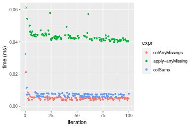

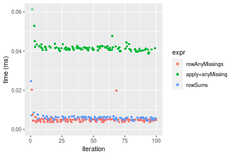
_Table: Benchmarking of colAnyMissings() and rowAnyMissings() on double+10x10 data (original and transposed).  The top panel shows times in milliseconds and the bottom panel shows relative times._


|   |expr           |   min|    lq|    mean| median|    uq|    max|
|:--|:--------------|-----:|-----:|-------:|------:|-----:|------:|
|2  |rowAnyMissings | 3.729| 4.003| 4.94913| 4.8165| 5.100| 20.318|
|1  |colAnyMissings | 3.647| 4.074| 4.89263| 4.8970| 5.242| 21.175|


|   |expr           |       min|       lq|      mean|   median|       uq|      max|
|:--|:--------------|---------:|--------:|---------:|--------:|--------:|--------:|
|2  |rowAnyMissings | 1.0000000| 1.000000| 1.0000000| 1.000000| 1.000000| 1.000000|
|1  |colAnyMissings | 0.9780102| 1.017737| 0.9885839| 1.016713| 1.027843| 1.042179|

_Figure: Benchmarking of colAnyMissings() and rowAnyMissings() on double+10x10 data (original and transposed).  Outliers are displayed as crosses. Times are in milliseconds._


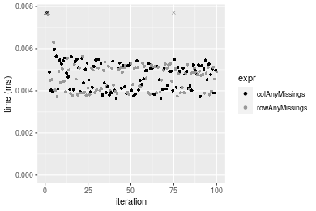

### 100x100 matrix


```r
> X <- data[["100x100"]]
> gc()
          used  (Mb) gc trigger  (Mb) max used  (Mb)
Ncells 5154999 275.4    7554717 403.5  7554717 403.5
Vcells 9169096  70.0   31793280 242.6 60508962 461.7
> colStats <- microbenchmark(colAnyMissings = colAnyMissings(X), `apply+anyMissing` = apply(X, MARGIN = 2L, 
+     FUN = anyMissing), colSums = is.na(colSums(X, na.rm = FALSE)), unit = "ms")
> X <- t(X)
> gc()
          used  (Mb) gc trigger  (Mb) max used  (Mb)
Ncells 5154993 275.4    7554717 403.5  7554717 403.5
Vcells 9179139  70.1   31793280 242.6 60508962 461.7
> rowStats <- microbenchmark(rowAnyMissings = rowAnyMissings(X), `apply+anyMissing` = apply(X, MARGIN = 1L, 
+     FUN = anyMissing), rowSums = is.na(rowSums(X, na.rm = FALSE)), unit = "ms")
```

_Table: Benchmarking of colAnyMissings(), apply+anyMissing() and colSums() on double+100x100 data. The top panel shows times in milliseconds and the bottom panel shows relative times._


|   |expr             |      min|        lq|      mean|    median|        uq|      max|
|:--|:----------------|--------:|---------:|---------:|---------:|---------:|--------:|
|1  |colAnyMissings   | 0.009185| 0.0102035| 0.0117816| 0.0111555| 0.0118930| 0.034239|
|3  |colSums          | 0.012443| 0.0137145| 0.0158540| 0.0148105| 0.0162330| 0.036449|
|2  |apply+anyMissing | 0.230039| 0.2485685| 0.2714802| 0.2591485| 0.2727545| 0.495414|


|   |expr             |       min|        lq|      mean|    median|       uq|       max|
|:--|:----------------|---------:|---------:|---------:|---------:|--------:|---------:|
|1  |colAnyMissings   |  1.000000|  1.000000|  1.000000|  1.000000|  1.00000|  1.000000|
|3  |colSums          |  1.354709|  1.344098|  1.345663|  1.327641|  1.36492|  1.064546|
|2  |apply+anyMissing | 25.045074| 24.361102| 23.042786| 23.230559| 22.93404| 14.469289|

_Table: Benchmarking of rowAnyMissings(), apply+anyMissing() and rowSums() on double+100x100 data (transposed). The top panel shows times in milliseconds and the bottom panel shows relative times._


|   |expr             |      min|        lq|      mean|    median|        uq|      max|
|:--|:----------------|--------:|---------:|---------:|---------:|---------:|--------:|
|1  |rowAnyMissings   | 0.010760| 0.0122005| 0.0133243| 0.0129025| 0.0138865| 0.030687|
|3  |rowSums          | 0.030253| 0.0317795| 0.0344527| 0.0336870| 0.0358305| 0.063288|
|2  |apply+anyMissing | 0.236900| 0.2524300| 0.2741619| 0.2633080| 0.2895435| 0.396734|


|   |expr             |       min|       lq|      mean|    median|       uq|       max|
|:--|:----------------|---------:|--------:|---------:|---------:|--------:|---------:|
|1  |rowAnyMissings   |  1.000000|  1.00000|  1.000000|  1.000000|  1.00000|  1.000000|
|3  |rowSums          |  2.811617|  2.60477|  2.585704|  2.610889|  2.58024|  2.062372|
|2  |apply+anyMissing | 22.016729| 20.69014| 20.576081| 20.407518| 20.85072| 12.928406|

_Figure: Benchmarking of colAnyMissings(), apply+anyMissing() and colSums() on double+100x100 data  as well as rowAnyMissings(), apply+anyMissing() and rowSums() on the same data transposed.  Outliers are displayed as crosses.  Times are in milliseconds._


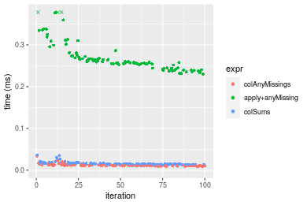

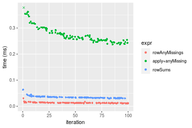
_Table: Benchmarking of colAnyMissings() and rowAnyMissings() on double+100x100 data (original and transposed).  The top panel shows times in milliseconds and the bottom panel shows relative times._


|   |expr           |    min|      lq|     mean|  median|      uq|    max|
|:--|:--------------|------:|-------:|--------:|-------:|-------:|------:|
|1  |colAnyMissings |  9.185| 10.2035| 11.78157| 11.1555| 11.8930| 34.239|
|2  |rowAnyMissings | 10.760| 12.2005| 13.32430| 12.9025| 13.8865| 30.687|


|   |expr           |      min|       lq|     mean|   median|      uq|       max|
|:--|:--------------|--------:|--------:|--------:|--------:|-------:|---------:|
|1  |colAnyMissings | 1.000000| 1.000000| 1.000000| 1.000000| 1.00000| 1.0000000|
|2  |rowAnyMissings | 1.171475| 1.195717| 1.130944| 1.156604| 1.16762| 0.8962587|

_Figure: Benchmarking of colAnyMissings() and rowAnyMissings() on double+100x100 data (original and transposed).  Outliers are displayed as crosses. Times are in milliseconds._


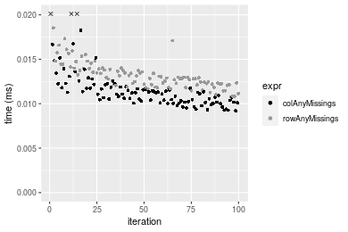

### 1000x10 matrix


```r
> X <- data[["1000x10"]]
> gc()
          used  (Mb) gc trigger  (Mb) max used  (Mb)
Ncells 5155209 275.4    7554717 403.5  7554717 403.5
Vcells 9170144  70.0   31793280 242.6 60508962 461.7
> colStats <- microbenchmark(colAnyMissings = colAnyMissings(X), `apply+anyMissing` = apply(X, MARGIN = 2L, 
+     FUN = anyMissing), colSums = is.na(colSums(X, na.rm = FALSE)), unit = "ms")
> X <- t(X)
> gc()
          used  (Mb) gc trigger  (Mb) max used  (Mb)
Ncells 5155203 275.4    7554717 403.5  7554717 403.5
Vcells 9180187  70.1   31793280 242.6 60508962 461.7
> rowStats <- microbenchmark(rowAnyMissings = rowAnyMissings(X), `apply+anyMissing` = apply(X, MARGIN = 1L, 
+     FUN = anyMissing), rowSums = is.na(rowSums(X, na.rm = FALSE)), unit = "ms")
```

_Table: Benchmarking of colAnyMissings(), apply+anyMissing() and colSums() on double+1000x10 data. The top panel shows times in milliseconds and the bottom panel shows relative times._


|   |expr             |      min|        lq|      mean|    median|        uq|      max|
|:--|:----------------|--------:|---------:|---------:|---------:|---------:|--------:|
|1  |colAnyMissings   | 0.009200| 0.0104615| 0.0113838| 0.0110370| 0.0116095| 0.025943|
|3  |colSums          | 0.015100| 0.0168710| 0.0182155| 0.0177675| 0.0189470| 0.034203|
|2  |apply+anyMissing | 0.110784| 0.1165055| 0.1250568| 0.1237410| 0.1308515| 0.219921|


|   |expr             |       min|        lq|      mean|    median|        uq|      max|
|:--|:----------------|---------:|---------:|---------:|---------:|---------:|--------:|
|1  |colAnyMissings   |  1.000000|  1.000000|  1.000000|  1.000000|  1.000000| 1.000000|
|3  |colSums          |  1.641304|  1.612675|  1.600127|  1.609812|  1.632025| 1.318390|
|2  |apply+anyMissing | 12.041739| 11.136596| 10.985534| 11.211471| 11.271071| 8.477084|

_Table: Benchmarking of rowAnyMissings(), apply+anyMissing() and rowSums() on double+1000x10 data (transposed). The top panel shows times in milliseconds and the bottom panel shows relative times._


|   |expr             |      min|        lq|      mean|    median|        uq|      max|
|:--|:----------------|--------:|---------:|---------:|---------:|---------:|--------:|
|1  |rowAnyMissings   | 0.010846| 0.0122820| 0.0130223| 0.0127645| 0.0136285| 0.027027|
|3  |rowSums          | 0.032800| 0.0341100| 0.0366987| 0.0363310| 0.0380150| 0.053015|
|2  |apply+anyMissing | 0.110631| 0.1155865| 0.1247802| 0.1232000| 0.1302110| 0.221967|


|   |expr             |       min|       lq|     mean|   median|       uq|      max|
|:--|:----------------|---------:|--------:|--------:|--------:|--------:|--------:|
|1  |rowAnyMissings   |  1.000000| 1.000000| 1.000000| 1.000000| 1.000000| 1.000000|
|3  |rowSums          |  3.024156| 2.777235| 2.818142| 2.846253| 2.789375| 1.961557|
|2  |apply+anyMissing | 10.200166| 9.411049| 9.582033| 9.651769| 9.554316| 8.212787|

_Figure: Benchmarking of colAnyMissings(), apply+anyMissing() and colSums() on double+1000x10 data  as well as rowAnyMissings(), apply+anyMissing() and rowSums() on the same data transposed.  Outliers are displayed as crosses.  Times are in milliseconds._


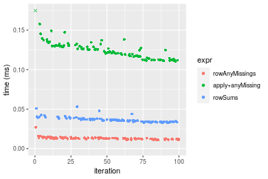
_Table: Benchmarking of colAnyMissings() and rowAnyMissings() on double+1000x10 data (original and transposed).  The top panel shows times in milliseconds and the bottom panel shows relative times._


|   |expr           |    min|      lq|     mean|  median|      uq|    max|
|:--|:--------------|------:|-------:|--------:|-------:|-------:|------:|
|1  |colAnyMissings |  9.200| 10.4615| 11.38377| 11.0370| 11.6095| 25.943|
|2  |rowAnyMissings | 10.846| 12.2820| 13.02231| 12.7645| 13.6285| 27.027|


|   |expr           |      min|       lq|     mean|   median|       uq|      max|
|:--|:--------------|--------:|--------:|--------:|--------:|--------:|--------:|
|1  |colAnyMissings | 1.000000| 1.000000| 1.000000| 1.000000| 1.000000| 1.000000|
|2  |rowAnyMissings | 1.178913| 1.174019| 1.143936| 1.156519| 1.173909| 1.041784|

_Figure: Benchmarking of colAnyMissings() and rowAnyMissings() on double+1000x10 data (original and transposed).  Outliers are displayed as crosses. Times are in milliseconds._


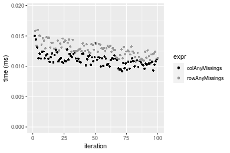

### 10x1000 matrix


```r
> X <- data[["10x1000"]]
> gc()
          used  (Mb) gc trigger  (Mb) max used  (Mb)
Ncells 5155420 275.4    7554717 403.5  7554717 403.5
Vcells 9170293  70.0   31793280 242.6 60508962 461.7
> colStats <- microbenchmark(colAnyMissings = colAnyMissings(X), `apply+anyMissing` = apply(X, MARGIN = 2L, 
+     FUN = anyMissing), colSums = is.na(colSums(X, na.rm = FALSE)), unit = "ms")
> X <- t(X)
> gc()
          used  (Mb) gc trigger  (Mb) max used  (Mb)
Ncells 5155414 275.4    7554717 403.5  7554717 403.5
Vcells 9180336  70.1   31793280 242.6 60508962 461.7
> rowStats <- microbenchmark(rowAnyMissings = rowAnyMissings(X), `apply+anyMissing` = apply(X, MARGIN = 1L, 
+     FUN = anyMissing), rowSums = is.na(rowSums(X, na.rm = FALSE)), unit = "ms")
```

_Table: Benchmarking of colAnyMissings(), apply+anyMissing() and colSums() on double+10x1000 data. The top panel shows times in milliseconds and the bottom panel shows relative times._


|   |expr             |      min|       lq|      mean|   median|       uq|      max|
|:--|:----------------|--------:|--------:|---------:|--------:|--------:|--------:|
|1  |colAnyMissings   | 0.009507| 0.010125| 0.0115779| 0.011040| 0.011979| 0.026422|
|3  |colSums          | 0.011470| 0.012184| 0.0138760| 0.013437| 0.014655| 0.031105|
|2  |apply+anyMissing | 1.239390| 1.300926| 1.4057366| 1.322662| 1.420750| 2.125904|


|   |expr             |        min|         lq|       mean|    median|         uq|       max|
|:--|:----------------|----------:|----------:|----------:|---------:|----------:|---------:|
|1  |colAnyMissings   |   1.000000|   1.000000|   1.000000|   1.00000|   1.000000|  1.000000|
|3  |colSums          |   1.206479|   1.203358|   1.198495|   1.21712|   1.223391|  1.177239|
|2  |apply+anyMissing | 130.366046| 128.486518| 121.415818| 119.80634| 118.603347| 80.459617|

_Table: Benchmarking of rowAnyMissings(), apply+anyMissing() and rowSums() on double+10x1000 data (transposed). The top panel shows times in milliseconds and the bottom panel shows relative times._


|   |expr             |      min|        lq|      mean|    median|        uq|      max|
|:--|:----------------|--------:|---------:|---------:|---------:|---------:|--------:|
|1  |rowAnyMissings   | 0.009770| 0.0107725| 0.0126141| 0.0115780| 0.0131925| 0.044056|
|3  |rowSums          | 0.026007| 0.0271265| 0.0294238| 0.0280535| 0.0298470| 0.050384|
|2  |apply+anyMissing | 1.252759| 1.3228920| 1.4131013| 1.3477620| 1.4363810| 1.986812|


|   |expr             |        min|         lq|       mean|     median|         uq|       max|
|:--|:----------------|----------:|----------:|----------:|----------:|----------:|---------:|
|1  |rowAnyMissings   |   1.000000|   1.000000|   1.000000|   1.000000|   1.000000|  1.000000|
|3  |rowSums          |   2.661924|   2.518125|   2.332614|   2.423001|   2.262422|  1.143635|
|2  |apply+anyMissing | 128.225077| 122.802692| 112.025538| 116.407151| 108.878605| 45.097422|

_Figure: Benchmarking of colAnyMissings(), apply+anyMissing() and colSums() on double+10x1000 data  as well as rowAnyMissings(), apply+anyMissing() and rowSums() on the same data transposed.  Outliers are displayed as crosses.  Times are in milliseconds._


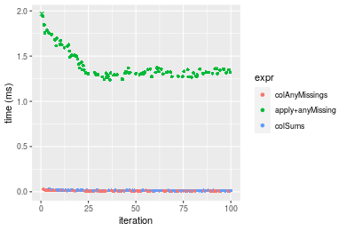


_Table: Benchmarking of colAnyMissings() and rowAnyMissings() on double+10x1000 data (original and transposed).  The top panel shows times in milliseconds and the bottom panel shows relative times._


|   |expr           |   min|      lq|     mean| median|      uq|    max|
|:--|:--------------|-----:|-------:|--------:|------:|-------:|------:|
|1  |colAnyMissings | 9.507| 10.1250| 11.57787| 11.040| 11.9790| 26.422|
|2  |rowAnyMissings | 9.770| 10.7725| 12.61410| 11.578| 13.1925| 44.056|


|   |expr           |      min|       lq|     mean|   median|       uq|      max|
|:--|:--------------|--------:|--------:|--------:|--------:|--------:|--------:|
|1  |colAnyMissings | 1.000000| 1.000000| 1.000000| 1.000000| 1.000000| 1.000000|
|2  |rowAnyMissings | 1.027664| 1.063951| 1.089501| 1.048732| 1.101302| 1.667398|

_Figure: Benchmarking of colAnyMissings() and rowAnyMissings() on double+10x1000 data (original and transposed).  Outliers are displayed as crosses. Times are in milliseconds._


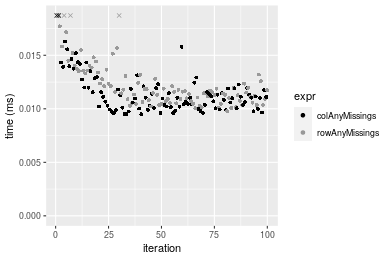

### 100x1000 matrix


```r
> X <- data[["100x1000"]]
> gc()
          used  (Mb) gc trigger  (Mb) max used  (Mb)
Ncells 5155626 275.4    7554717 403.5  7554717 403.5
Vcells 9171519  70.0   31793280 242.6 60508962 461.7
> colStats <- microbenchmark(colAnyMissings = colAnyMissings(X), `apply+anyMissing` = apply(X, MARGIN = 2L, 
+     FUN = anyMissing), colSums = is.na(colSums(X, na.rm = FALSE)), unit = "ms")
> X <- t(X)
> gc()
          used  (Mb) gc trigger  (Mb) max used  (Mb)
Ncells 5155620 275.4    7554717 403.5  7554717 403.5
Vcells 9271562  70.8   31793280 242.6 60508962 461.7
> rowStats <- microbenchmark(rowAnyMissings = rowAnyMissings(X), `apply+anyMissing` = apply(X, MARGIN = 1L, 
+     FUN = anyMissing), rowSums = is.na(rowSums(X, na.rm = FALSE)), unit = "ms")
```

_Table: Benchmarking of colAnyMissings(), apply+anyMissing() and colSums() on double+100x1000 data. The top panel shows times in milliseconds and the bottom panel shows relative times._


|   |expr             |      min|       lq|      mean|   median|       uq|       max|
|:--|:----------------|--------:|--------:|---------:|--------:|--------:|---------:|
|1  |colAnyMissings   | 0.055116| 0.056545| 0.0651076| 0.062071| 0.069606|  0.109054|
|3  |colSums          | 0.066779| 0.067659| 0.0768698| 0.072858| 0.082555|  0.127245|
|2  |apply+anyMissing | 1.825579| 1.891161| 2.3510597| 2.056743| 2.528580| 19.484495|


|   |expr             |       min|        lq|      mean|    median|        uq|        max|
|:--|:----------------|---------:|---------:|---------:|---------:|---------:|----------:|
|1  |colAnyMissings   |  1.000000|  1.000000|  1.000000|  1.000000|  1.000000|   1.000000|
|3  |colSums          |  1.211608|  1.196551|  1.180659|  1.173785|  1.186033|   1.166807|
|2  |apply+anyMissing | 33.122487| 33.445238| 36.110401| 33.135329| 36.327041| 178.668320|

_Table: Benchmarking of rowAnyMissings(), apply+anyMissing() and rowSums() on double+100x1000 data (transposed). The top panel shows times in milliseconds and the bottom panel shows relative times._


|   |expr             |      min|       lq|      mean|   median|        uq|       max|
|:--|:----------------|--------:|--------:|---------:|--------:|---------:|---------:|
|1  |rowAnyMissings   | 0.058535| 0.061530| 0.0683155| 0.063856| 0.0713970|  0.153214|
|3  |rowSums          | 0.212804| 0.218234| 0.2428765| 0.226890| 0.2577035|  0.369575|
|2  |apply+anyMissing | 1.832186| 1.894570| 2.2237381| 1.959449| 2.0593215| 19.637061|


|   |expr             |      min|       lq|      mean|    median|        uq|        max|
|:--|:----------------|--------:|--------:|---------:|---------:|---------:|----------:|
|1  |rowAnyMissings   |  1.00000|  1.00000|  1.000000|  1.000000|  1.000000|   1.000000|
|3  |rowSums          |  3.63550|  3.54679|  3.555219|  3.553151|  3.609444|   2.412149|
|2  |apply+anyMissing | 31.30069| 30.79099| 32.551009| 30.685433| 28.843250| 128.167537|

_Figure: Benchmarking of colAnyMissings(), apply+anyMissing() and colSums() on double+100x1000 data  as well as rowAnyMissings(), apply+anyMissing() and rowSums() on the same data transposed.  Outliers are displayed as crosses.  Times are in milliseconds._


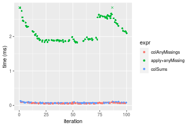

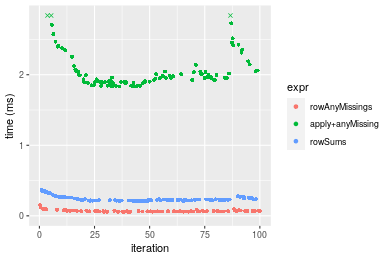
_Table: Benchmarking of colAnyMissings() and rowAnyMissings() on double+100x1000 data (original and transposed).  The top panel shows times in milliseconds and the bottom panel shows relative times._


|   |expr           |    min|     lq|     mean| median|     uq|     max|
|:--|:--------------|------:|------:|--------:|------:|------:|-------:|
|1  |colAnyMissings | 55.116| 56.545| 65.10755| 62.071| 69.606| 109.054|
|2  |rowAnyMissings | 58.535| 61.530| 68.31549| 63.856| 71.397| 153.214|


|   |expr           |      min|      lq|     mean|   median|       uq|      max|
|:--|:--------------|--------:|-------:|--------:|--------:|--------:|--------:|
|1  |colAnyMissings | 1.000000| 1.00000| 1.000000| 1.000000| 1.000000| 1.000000|
|2  |rowAnyMissings | 1.062033| 1.08816| 1.049271| 1.028757| 1.025731| 1.404937|

_Figure: Benchmarking of colAnyMissings() and rowAnyMissings() on double+100x1000 data (original and transposed).  Outliers are displayed as crosses. Times are in milliseconds._


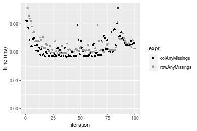

### 1000x100 matrix


```r
> X <- data[["1000x100"]]
> gc()
          used  (Mb) gc trigger  (Mb) max used  (Mb)
Ncells 5155830 275.4    7554717 403.5  7554717 403.5
Vcells 9171654  70.0   31793280 242.6 60508962 461.7
> colStats <- microbenchmark(colAnyMissings = colAnyMissings(X), `apply+anyMissing` = apply(X, MARGIN = 2L, 
+     FUN = anyMissing), colSums = is.na(colSums(X, na.rm = FALSE)), unit = "ms")
> X <- t(X)
> gc()
          used  (Mb) gc trigger  (Mb) max used  (Mb)
Ncells 5155824 275.4    7554717 403.5  7554717 403.5
Vcells 9271697  70.8   31793280 242.6 60508962 461.7
> rowStats <- microbenchmark(rowAnyMissings = rowAnyMissings(X), `apply+anyMissing` = apply(X, MARGIN = 1L, 
+     FUN = anyMissing), rowSums = is.na(rowSums(X, na.rm = FALSE)), unit = "ms")
```

_Table: Benchmarking of colAnyMissings(), apply+anyMissing() and colSums() on double+1000x100 data. The top panel shows times in milliseconds and the bottom panel shows relative times._


|   |expr             |      min|        lq|      mean|    median|        uq|      max|
|:--|:----------------|--------:|---------:|---------:|---------:|---------:|--------:|
|1  |colAnyMissings   | 0.047735| 0.0497735| 0.0593429| 0.0563730| 0.0655250| 0.123898|
|3  |colSums          | 0.080669| 0.0828920| 0.0955167| 0.0916635| 0.1043100| 0.148943|
|2  |apply+anyMissing | 0.692087| 0.7022650| 0.8621351| 0.7531680| 0.8713155| 6.766168|


|   |expr             |       min|        lq|      mean|    median|        uq|       max|
|:--|:----------------|---------:|---------:|---------:|---------:|---------:|---------:|
|1  |colAnyMissings   |  1.000000|  1.000000|  1.000000|  1.000000|  1.000000|  1.000000|
|3  |colSums          |  1.689934|  1.665384|  1.609573|  1.626018|  1.591911|  1.202142|
|2  |apply+anyMissing | 14.498523| 14.109215| 14.528035| 13.360439| 13.297451| 54.610793|

_Table: Benchmarking of rowAnyMissings(), apply+anyMissing() and rowSums() on double+1000x100 data (transposed). The top panel shows times in milliseconds and the bottom panel shows relative times._


|   |expr             |      min|        lq|      mean|    median|        uq|      max|
|:--|:----------------|--------:|---------:|---------:|---------:|---------:|--------:|
|1  |rowAnyMissings   | 0.065697| 0.0668375| 0.0764850| 0.0731295| 0.0836375| 0.124873|
|3  |rowSums          | 0.217334| 0.2187385| 0.2479375| 0.2422035| 0.2664920| 0.352662|
|2  |apply+anyMissing | 0.720923| 0.7292925| 0.8747141| 0.7406110| 0.8844560| 6.663325|


|   |expr             |       min|        lq|      mean|    median|        uq|       max|
|:--|:----------------|---------:|---------:|---------:|---------:|---------:|---------:|
|1  |rowAnyMissings   |  1.000000|  1.000000|  1.000000|  1.000000|  1.000000|  1.000000|
|3  |rowSums          |  3.308127|  3.272691|  3.241647|  3.311981|  3.186274|  2.824165|
|2  |apply+anyMissing | 10.973454| 10.911427| 11.436411| 10.127391| 10.574874| 53.360815|

_Figure: Benchmarking of colAnyMissings(), apply+anyMissing() and colSums() on double+1000x100 data  as well as rowAnyMissings(), apply+anyMissing() and rowSums() on the same data transposed.  Outliers are displayed as crosses.  Times are in milliseconds._


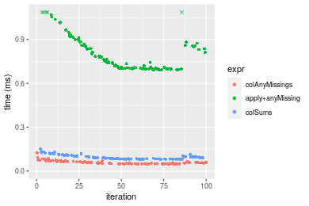


_Table: Benchmarking of colAnyMissings() and rowAnyMissings() on double+1000x100 data (original and transposed).  The top panel shows times in milliseconds and the bottom panel shows relative times._


|   |expr           |    min|      lq|     mean|  median|      uq|     max|
|:--|:--------------|------:|-------:|--------:|-------:|-------:|-------:|
|1  |colAnyMissings | 47.735| 49.7735| 59.34286| 56.3730| 65.5250| 123.898|
|2  |rowAnyMissings | 65.697| 66.8375| 76.48502| 73.1295| 83.6375| 124.873|


|   |expr           |      min|       lq|     mean|   median|       uq|      max|
|:--|:--------------|--------:|--------:|--------:|--------:|--------:|--------:|
|1  |colAnyMissings | 1.000000| 1.000000| 1.000000| 1.000000| 1.000000| 1.000000|
|2  |rowAnyMissings | 1.376286| 1.342833| 1.288866| 1.297243| 1.276421| 1.007869|

_Figure: Benchmarking of colAnyMissings() and rowAnyMissings() on double+1000x100 data (original and transposed).  Outliers are displayed as crosses. Times are in milliseconds._


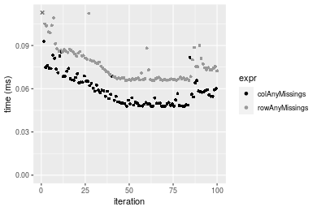


## Appendix

### Session information
```r
R version 4.1.1 Patched (2021-08-10 r80727)
Platform: x86_64-pc-linux-gnu (64-bit)
Running under: Ubuntu 18.04.5 LTS

Matrix products: default
BLAS:   /home/hb/software/R-devel/R-4-1-branch/lib/R/lib/libRblas.so
LAPACK: /home/hb/software/R-devel/R-4-1-branch/lib/R/lib/libRlapack.so

locale:
 [1] LC_CTYPE=en_US.UTF-8       LC_NUMERIC=C              
 [3] LC_TIME=en_US.UTF-8        LC_COLLATE=en_US.UTF-8    
 [5] LC_MONETARY=en_US.UTF-8    LC_MESSAGES=en_US.UTF-8   
 [7] LC_PAPER=en_US.UTF-8       LC_NAME=C                 
 [9] LC_ADDRESS=C               LC_TELEPHONE=C            
[11] LC_MEASUREMENT=en_US.UTF-8 LC_IDENTIFICATION=C       

attached base packages:
[1] stats     graphics  grDevices utils     datasets  methods   base     

other attached packages:
[1] microbenchmark_1.4-7   matrixStats_0.60.0     ggplot2_3.3.5         
[4] knitr_1.33             R.devices_2.17.0       R.utils_2.10.1        
[7] R.oo_1.24.0            R.methodsS3_1.8.1-9001

loaded via a namespace (and not attached):
 [1] Biobase_2.52.0          httr_1.4.2              splines_4.1.1          
 [4] bit64_4.0.5             network_1.17.1          assertthat_0.2.1       
 [7] highr_0.9               stats4_4.1.1            blob_1.2.2             
[10] GenomeInfoDbData_1.2.6  robustbase_0.93-8       pillar_1.6.2           
[13] RSQLite_2.2.8           lattice_0.20-44         glue_1.4.2             
[16] digest_0.6.27           XVector_0.32.0          colorspace_2.0-2       
[19] Matrix_1.3-4            XML_3.99-0.7            pkgconfig_2.0.3        
[22] zlibbioc_1.38.0         genefilter_1.74.0       purrr_0.3.4            
[25] ergm_4.1.2              xtable_1.8-4            scales_1.1.1           
[28] tibble_3.1.4            annotate_1.70.0         KEGGREST_1.32.0        
[31] farver_2.1.0            generics_0.1.0          IRanges_2.26.0         
[34] ellipsis_0.3.2          cachem_1.0.6            withr_2.4.2            
[37] BiocGenerics_0.38.0     mime_0.11               survival_3.2-13        
[40] magrittr_2.0.1          crayon_1.4.1            statnet.common_4.5.0   
[43] memoise_2.0.0           laeken_0.5.1            fansi_0.5.0            
[46] R.cache_0.15.0          MASS_7.3-54             R.rsp_0.44.0           
[49] tools_4.1.1             lifecycle_1.0.0         S4Vectors_0.30.0       
[52] trust_0.1-8             munsell_0.5.0           AnnotationDbi_1.54.1   
[55] Biostrings_2.60.2       compiler_4.1.1          GenomeInfoDb_1.28.1    
[58] rlang_0.4.11            grid_4.1.1              RCurl_1.98-1.4         
[61] cwhmisc_6.6             rappdirs_0.3.3          labeling_0.4.2         
[64] bitops_1.0-7            base64enc_0.1-3         boot_1.3-28            
[67] gtable_0.3.0            DBI_1.1.1               markdown_1.1           
[70] R6_2.5.1                lpSolveAPI_5.5.2.0-17.7 rle_0.9.2              
[73] dplyr_1.0.7             fastmap_1.1.0           bit_4.0.4              
[76] utf8_1.2.2              parallel_4.1.1          Rcpp_1.0.7             
[79] vctrs_0.3.8             png_0.1-7               DEoptimR_1.0-9         
[82] tidyselect_1.1.1        xfun_0.25               coda_0.19-4            
```
Total processing time was 23.26 secs.


### Reproducibility
To reproduce this report, do:
```r
html <- matrixStats:::benchmark('colAnyMissings')
```

[RSP]: https://cran.r-project.org/package=R.rsp
[matrixStats]: https://cran.r-project.org/package=matrixStats

[StackOverflow:colMins?]: https://stackoverflow.com/questions/13676878 "Stack Overflow: fastest way to get Min from every column in a matrix?"
[StackOverflow:colSds?]: https://stackoverflow.com/questions/17549762 "Stack Overflow: Is there such 'colsd' in R?"
[StackOverflow:rowProds?]: https://stackoverflow.com/questions/20198801/ "Stack Overflow: Row product of matrix and column sum of matrix"

---------------------------------------
Copyright Henrik Bengtsson. Last updated on 2021-08-25 17:35:19 (+0200 UTC). Powered by [RSP].

<script>
 var link = document.createElement('link');
 link.rel = 'icon';
 link.href = "data:image/png;base64,iVBORw0KGgoAAAANSUhEUgAAACAAAAAgCAMAAABEpIrGAAAA21BMVEUAAAAAAP8AAP8AAP8AAP8AAP8AAP8AAP8AAP8AAP8AAP8AAP8AAP8AAP8AAP8AAP8AAP8AAP8AAP8AAP8AAP8AAP8AAP8AAP8AAP8AAP8AAP8AAP8AAP8AAP8AAP8AAP8AAP8AAP8AAP8AAP8AAP8AAP8AAP8AAP8AAP8AAP8BAf4CAv0DA/wdHeIeHuEfH+AgIN8hId4lJdomJtknJ9g+PsE/P8BAQL9yco10dIt1dYp3d4h4eIeVlWqWlmmXl2iYmGeZmWabm2Tn5xjo6Bfp6Rb39wj4+Af//wA2M9hbAAAASXRSTlMAAQIJCgsMJSYnKD4/QGRlZmhpamtsbautrrCxuru8y8zN5ebn6Pn6+///////////////////////////////////////////LsUNcQAAAS9JREFUOI29k21XgkAQhVcFytdSMqMETU26UVqGmpaiFbL//xc1cAhhwVNf6n5i5z67M2dmYOyfJZUqlVLhkKucG7cgmUZTybDz6g0iDeq51PUr37Ds2cy2/C9NeES5puDjxuUk1xnToZsg8pfA3avHQ3lLIi7iWRrkv/OYtkScxBIMgDee0ALoyxHQBJ68JLCjOtQIMIANF7QG9G9fNnHvisCHBVMKgSJgiz7nE+AoBKrAPA3MgepvgR9TSCasrCKH0eB1wBGBFdCO+nAGjMVGPcQb5bd6mQRegN6+1axOs9nGfYcCtfi4NQosdtH7dB+txFIpXQqN1p9B/asRHToyS0jRgpV7nk4nwcq1BJ+x3Gl/v7S9Wmpp/aGquum7w3ZDyrADFYrl8vHBH+ev9AUASW1dmU4h4wAAAABJRU5ErkJggg=="
 document.getElementsByTagName('head')[0].appendChild(link);
</script>


