[matrixStats]: Benchmark report

---------------------------------------


# colAnys() and rowAnys() benchmarks

This report benchmark the performance of colAnys() and rowAnys() against alternative methods.

## Alternative methods

* apply() + any()
* colSums() > 0 or rowSums() > 0


## Data
```r
> rmatrix <- function(nrow, ncol, mode = c("logical", "double", "integer", "index"), range = c(-100, 
+     +100), na_prob = 0) {
+     mode <- match.arg(mode)
+     n <- nrow * ncol
+     if (mode == "logical") {
+         x <- sample(c(FALSE, TRUE), size = n, replace = TRUE)
+     }     else if (mode == "index") {
+         x <- seq_len(n)
+         mode <- "integer"
+     }     else {
+         x <- runif(n, min = range[1], max = range[2])
+     }
+     storage.mode(x) <- mode
+     if (na_prob > 0) 
+         x[sample(n, size = na_prob * n)] <- NA
+     dim(x) <- c(nrow, ncol)
+     x
+ }
> rmatrices <- function(scale = 10, seed = 1, ...) {
+     set.seed(seed)
+     data <- list()
+     data[[1]] <- rmatrix(nrow = scale * 1, ncol = scale * 1, ...)
+     data[[2]] <- rmatrix(nrow = scale * 10, ncol = scale * 10, ...)
+     data[[3]] <- rmatrix(nrow = scale * 100, ncol = scale * 1, ...)
+     data[[4]] <- t(data[[3]])
+     data[[5]] <- rmatrix(nrow = scale * 10, ncol = scale * 100, ...)
+     data[[6]] <- t(data[[5]])
+     names(data) <- sapply(data, FUN = function(x) paste(dim(x), collapse = "x"))
+     data
+ }
> data <- rmatrices(mode = "logical")
```

## Results

### 10x10 matrix


```r
> X <- data[["10x10"]]
> gc()
          used  (Mb) gc trigger  (Mb) max used  (Mb)
Ncells 5159980 275.6    7554717 403.5  7554717 403.5
Vcells 9247810  70.6   31793280 242.6 60508962 461.7
> colStats <- microbenchmark(colAnys = colAnys(X), `apply+any` = apply(X, MARGIN = 2L, FUN = any), 
+     `colSums > 0` = (colSums(X) > 0L), unit = "ms")
> X <- t(X)
> gc()
          used  (Mb) gc trigger  (Mb) max used  (Mb)
Ncells 5158917 275.6    7554717 403.5  7554717 403.5
Vcells 9244959  70.6   31793280 242.6 60508962 461.7
> rowStats <- microbenchmark(rowAnys = rowAnys(X), `apply+any` = apply(X, MARGIN = 1L, FUN = any), 
+     `rowSums > 0` = (rowSums(X) > 0L), unit = "ms")
```

_Table: Benchmarking of colAnys(), apply+any() and colSums > 0() on 10x10 data. The top panel shows times in milliseconds and the bottom panel shows relative times._


|   |expr        |      min|        lq|      mean|    median|        uq|      max|
|:--|:-----------|--------:|---------:|---------:|---------:|---------:|--------:|
|1  |colAnys     | 0.003058| 0.0034420| 0.0042868| 0.0042990| 0.0046715| 0.017901|
|3  |colSums > 0 | 0.005550| 0.0061795| 0.0074890| 0.0071075| 0.0075595| 0.034856|
|2  |apply+any   | 0.031404| 0.0329235| 0.0347796| 0.0338805| 0.0347480| 0.087822|


|   |expr        |       min|       lq|     mean|   median|       uq|      max|
|:--|:-----------|---------:|--------:|--------:|--------:|--------:|--------:|
|1  |colAnys     |  1.000000| 1.000000| 1.000000| 1.000000| 1.000000| 1.000000|
|3  |colSums > 0 |  1.814912| 1.795322| 1.746979| 1.653291| 1.618217| 1.947154|
|2  |apply+any   | 10.269457| 9.565224| 8.113114| 7.881019| 7.438296| 4.905983|

_Table: Benchmarking of rowAnys(), apply+any() and rowSums > 0() on 10x10 data (transposed). The top panel shows times in milliseconds and the bottom panel shows relative times._


|   |expr        |      min|        lq|      mean|   median|        uq|      max|
|:--|:-----------|--------:|---------:|---------:|--------:|---------:|--------:|
|1  |rowAnys     | 0.003040| 0.0033795| 0.0043803| 0.004155| 0.0044845| 0.040463|
|3  |rowSums > 0 | 0.006157| 0.0066760| 0.0077531| 0.007154| 0.0077745| 0.041944|
|2  |apply+any   | 0.030829| 0.0316780| 0.0334059| 0.032322| 0.0331420| 0.088427|


|   |expr        |       min|       lq|     mean|   median|       uq|      max|
|:--|:-----------|---------:|--------:|--------:|--------:|--------:|--------:|
|1  |rowAnys     |  1.000000| 1.000000| 1.000000| 1.000000| 1.000000| 1.000000|
|3  |rowSums > 0 |  2.025329| 1.975440| 1.770006| 1.721781| 1.733638| 1.036601|
|2  |apply+any   | 10.141118| 9.373576| 7.626408| 7.779061| 7.390345| 2.185379|

_Figure: Benchmarking of colAnys(), apply+any() and colSums > 0() on 10x10 data  as well as rowAnys(), apply+any() and rowSums > 0() on the same data transposed.  Outliers are displayed as crosses.  Times are in milliseconds._


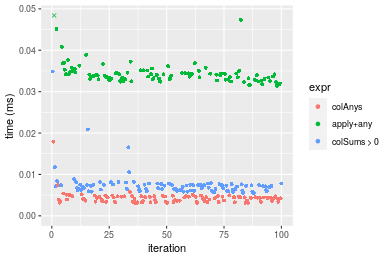


_Table: Benchmarking of colAnys() and rowAnys() on 10x10 data (original and transposed).  The top panel shows times in milliseconds and the bottom panel shows relative times._


|   |expr    |   min|     lq|    mean| median|     uq|    max|
|:--|:-------|-----:|------:|-------:|------:|------:|------:|
|2  |rowAnys | 3.040| 3.3795| 4.38029|  4.155| 4.4845| 40.463|
|1  |colAnys | 3.058| 3.4420| 4.28684|  4.299| 4.6715| 17.901|


|   |expr    |      min|       lq|      mean|   median|       uq|       max|
|:--|:-------|--------:|--------:|---------:|--------:|--------:|---------:|
|2  |rowAnys | 1.000000| 1.000000| 1.0000000| 1.000000| 1.000000| 1.0000000|
|1  |colAnys | 1.005921| 1.018494| 0.9786658| 1.034657| 1.041699| 0.4424042|

_Figure: Benchmarking of colAnys() and rowAnys() on 10x10 data (original and transposed).  Outliers are displayed as crosses. Times are in milliseconds._


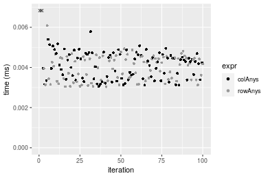

### 100x100 matrix


```r
> X <- data[["100x100"]]
> gc()
          used  (Mb) gc trigger  (Mb) max used  (Mb)
Ncells 5157461 275.5    7554717 403.5  7554717 403.5
Vcells 9051680  69.1   31793280 242.6 60508962 461.7
> colStats <- microbenchmark(colAnys = colAnys(X), `apply+any` = apply(X, MARGIN = 2L, FUN = any), 
+     `colSums > 0` = (colSums(X) > 0L), unit = "ms")
> X <- t(X)
> gc()
          used  (Mb) gc trigger  (Mb) max used  (Mb)
Ncells 5157455 275.5    7554717 403.5  7554717 403.5
Vcells 9056723  69.1   31793280 242.6 60508962 461.7
> rowStats <- microbenchmark(rowAnys = rowAnys(X), `apply+any` = apply(X, MARGIN = 1L, FUN = any), 
+     `rowSums > 0` = (rowSums(X) > 0L), unit = "ms")
```

_Table: Benchmarking of colAnys(), apply+any() and colSums > 0() on 100x100 data. The top panel shows times in milliseconds and the bottom panel shows relative times._


|   |expr        |      min|        lq|      mean|    median|        uq|      max|
|:--|:-----------|--------:|---------:|---------:|---------:|---------:|--------:|
|1  |colAnys     | 0.003237| 0.0040555| 0.0050803| 0.0048485| 0.0053805| 0.022196|
|3  |colSums > 0 | 0.015070| 0.0162405| 0.0181086| 0.0174555| 0.0192530| 0.042576|
|2  |apply+any   | 0.191496| 0.1988625| 0.2186645| 0.2093650| 0.2295630| 0.322632|


|   |expr        |       min|        lq|     mean|    median|        uq|       max|
|:--|:-----------|---------:|---------:|--------:|---------:|---------:|---------:|
|1  |colAnys     |  1.000000|  1.000000|  1.00000|  1.000000|  1.000000|  1.000000|
|3  |colSums > 0 |  4.655545|  4.004562|  3.56448|  3.600186|  3.578292|  1.918184|
|2  |apply+any   | 59.158480| 49.035261| 43.04165| 43.181396| 42.665737| 14.535592|

_Table: Benchmarking of rowAnys(), apply+any() and rowSums > 0() on 100x100 data (transposed). The top panel shows times in milliseconds and the bottom panel shows relative times._


|   |expr        |      min|       lq|      mean|    median|        uq|      max|
|:--|:-----------|--------:|--------:|---------:|---------:|---------:|--------:|
|1  |rowAnys     | 0.009192| 0.010737| 0.0120318| 0.0115975| 0.0125355| 0.027322|
|3  |rowSums > 0 | 0.044908| 0.046618| 0.0501171| 0.0481535| 0.0522440| 0.077263|
|2  |apply+any   | 0.186790| 0.198520| 0.2149207| 0.2054735| 0.2252160| 0.316574|


|   |expr        |       min|        lq|      mean|    median|        uq|       max|
|:--|:-----------|---------:|---------:|---------:|---------:|---------:|---------:|
|1  |rowAnys     |  1.000000|  1.000000|  1.000000|  1.000000|  1.000000|  1.000000|
|3  |rowSums > 0 |  4.885553|  4.341809|  4.165387|  4.152059|  4.167684|  2.827868|
|2  |apply+any   | 20.320931| 18.489336| 17.862740| 17.717051| 17.966256| 11.586780|

_Figure: Benchmarking of colAnys(), apply+any() and colSums > 0() on 100x100 data  as well as rowAnys(), apply+any() and rowSums > 0() on the same data transposed.  Outliers are displayed as crosses.  Times are in milliseconds._


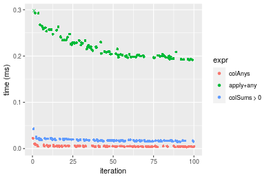

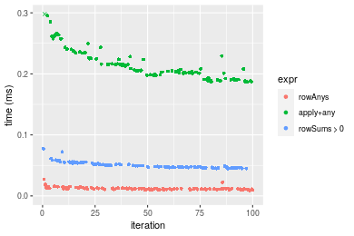
_Table: Benchmarking of colAnys() and rowAnys() on 100x100 data (original and transposed).  The top panel shows times in milliseconds and the bottom panel shows relative times._


|   |expr    |   min|      lq|     mean|  median|      uq|    max|
|:--|:-------|-----:|-------:|--------:|-------:|-------:|------:|
|1  |colAnys | 3.237|  4.0555|  5.08030|  4.8485|  5.3805| 22.196|
|2  |rowAnys | 9.192| 10.7370| 12.03179| 11.5975| 12.5355| 27.322|


|   |expr    |      min|       lq|     mean|   median|       uq|      max|
|:--|:-------|--------:|--------:|--------:|--------:|--------:|--------:|
|1  |colAnys | 1.000000| 1.000000| 1.000000| 1.000000| 1.000000| 1.000000|
|2  |rowAnys | 2.839666| 2.647516| 2.368323| 2.391977| 2.329802| 1.230943|

_Figure: Benchmarking of colAnys() and rowAnys() on 100x100 data (original and transposed).  Outliers are displayed as crosses. Times are in milliseconds._


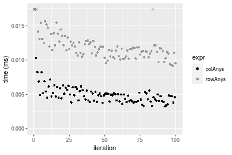

### 1000x10 matrix


```r
> X <- data[["1000x10"]]
> gc()
          used  (Mb) gc trigger  (Mb) max used  (Mb)
Ncells 5157671 275.5    7554717 403.5  7554717 403.5
Vcells 9052029  69.1   31793280 242.6 60508962 461.7
> colStats <- microbenchmark(colAnys = colAnys(X), `apply+any` = apply(X, MARGIN = 2L, FUN = any), 
+     `colSums > 0` = (colSums(X) > 0L), unit = "ms")
> X <- t(X)
> gc()
          used  (Mb) gc trigger  (Mb) max used  (Mb)
Ncells 5157665 275.5    7554717 403.5  7554717 403.5
Vcells 9057072  69.1   31793280 242.6 60508962 461.7
> rowStats <- microbenchmark(rowAnys = rowAnys(X), `apply+any` = apply(X, MARGIN = 1L, FUN = any), 
+     `rowSums > 0` = (rowSums(X) > 0L), unit = "ms")
```

_Table: Benchmarking of colAnys(), apply+any() and colSums > 0() on 1000x10 data. The top panel shows times in milliseconds and the bottom panel shows relative times._


|   |expr        |      min|        lq|      mean|    median|        uq|      max|
|:--|:-----------|--------:|---------:|---------:|---------:|---------:|--------:|
|1  |colAnys     | 0.002619| 0.0031705| 0.0040532| 0.0041335| 0.0043970| 0.018226|
|3  |colSums > 0 | 0.015013| 0.0160620| 0.0172835| 0.0169200| 0.0174545| 0.033316|
|2  |apply+any   | 0.098210| 0.1003080| 0.1068411| 0.1022055| 0.1122155| 0.220833|


|   |expr        |       min|        lq|      mean|    median|        uq|       max|
|:--|:-----------|---------:|---------:|---------:|---------:|---------:|---------:|
|1  |colAnys     |  1.000000|  1.000000|  1.000000|  1.000000|  1.000000|  1.000000|
|3  |colSums > 0 |  5.732341|  5.066078|  4.264152|  4.093383|  3.969638|  1.827938|
|2  |apply+any   | 37.499045| 31.637912| 26.359689| 24.726140| 25.520923| 12.116372|

_Table: Benchmarking of rowAnys(), apply+any() and rowSums > 0() on 1000x10 data (transposed). The top panel shows times in milliseconds and the bottom panel shows relative times._


|   |expr        |      min|        lq|      mean|    median|       uq|      max|
|:--|:-----------|--------:|---------:|---------:|---------:|--------:|--------:|
|1  |rowAnys     | 0.008208| 0.0096370| 0.0105102| 0.0101975| 0.011180| 0.024776|
|2  |apply+any   | 0.091152| 0.0969350| 0.1065932| 0.1018265| 0.116552| 0.185507|
|3  |rowSums > 0 | 0.157948| 0.1684355| 0.1791108| 0.1745640| 0.187134| 0.220356|


|   |expr        |      min|       lq|     mean|    median|       uq|      max|
|:--|:-----------|--------:|--------:|--------:|---------:|--------:|--------:|
|1  |rowAnys     |  1.00000|  1.00000|  1.00000|  1.000000|  1.00000| 1.000000|
|2  |apply+any   | 11.10526| 10.05863| 10.14187|  9.985438| 10.42504| 7.487367|
|3  |rowSums > 0 | 19.24318| 17.47800| 17.04161| 17.118313| 16.73828| 8.893930|

_Figure: Benchmarking of colAnys(), apply+any() and colSums > 0() on 1000x10 data  as well as rowAnys(), apply+any() and rowSums > 0() on the same data transposed.  Outliers are displayed as crosses.  Times are in milliseconds._


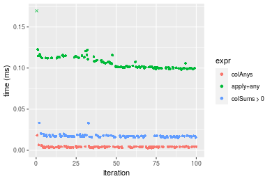

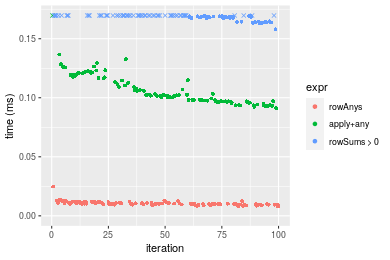
_Table: Benchmarking of colAnys() and rowAnys() on 1000x10 data (original and transposed).  The top panel shows times in milliseconds and the bottom panel shows relative times._


|   |expr    |   min|     lq|     mean|  median|     uq|    max|
|:--|:-------|-----:|------:|--------:|-------:|------:|------:|
|1  |colAnys | 2.619| 3.1705|  4.05320|  4.1335|  4.397| 18.226|
|2  |rowAnys | 8.208| 9.6370| 10.51021| 10.1975| 11.180| 24.776|


|   |expr    |      min|       lq|     mean|   median|       uq|      max|
|:--|:-------|--------:|--------:|--------:|--------:|--------:|--------:|
|1  |colAnys | 1.000000| 1.000000| 1.000000| 1.000000| 1.000000| 1.000000|
|2  |rowAnys | 3.134021| 3.039584| 2.593065| 2.467038| 2.542643| 1.359377|

_Figure: Benchmarking of colAnys() and rowAnys() on 1000x10 data (original and transposed).  Outliers are displayed as crosses. Times are in milliseconds._


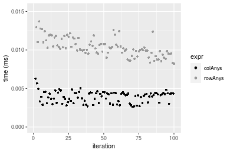

### 10x1000 matrix


```r
> X <- data[["10x1000"]]
> gc()
          used  (Mb) gc trigger  (Mb) max used  (Mb)
Ncells 5157882 275.5    7554717 403.5  7554717 403.5
Vcells 9052778  69.1   31793280 242.6 60508962 461.7
> colStats <- microbenchmark(colAnys = colAnys(X), `apply+any` = apply(X, MARGIN = 2L, FUN = any), 
+     `colSums > 0` = (colSums(X) > 0L), unit = "ms")
> X <- t(X)
> gc()
          used  (Mb) gc trigger  (Mb) max used  (Mb)
Ncells 5157876 275.5    7554717 403.5  7554717 403.5
Vcells 9057821  69.2   31793280 242.6 60508962 461.7
> rowStats <- microbenchmark(rowAnys = rowAnys(X), `apply+any` = apply(X, MARGIN = 1L, FUN = any), 
+     `rowSums > 0` = (rowSums(X) > 0L), unit = "ms")
```

_Table: Benchmarking of colAnys(), apply+any() and colSums > 0() on 10x1000 data. The top panel shows times in milliseconds and the bottom panel shows relative times._


|   |expr        |      min|        lq|      mean|    median|       uq|      max|
|:--|:-----------|--------:|---------:|---------:|---------:|--------:|--------:|
|1  |colAnys     | 0.007498| 0.0090195| 0.0112375| 0.0105265| 0.011611| 0.033898|
|3  |colSums > 0 | 0.013035| 0.0140095| 0.0159717| 0.0153775| 0.016881| 0.035288|
|2  |apply+any   | 0.871232| 0.9018165| 0.9825971| 0.9191195| 1.054284| 1.365062|


|   |expr        |        min|        lq|      mean|    median|       uq|       max|
|:--|:-----------|----------:|---------:|---------:|---------:|--------:|---------:|
|1  |colAnys     |   1.000000|  1.000000|  1.000000|  1.000000|  1.00000|  1.000000|
|3  |colSums > 0 |   1.738464|  1.553246|  1.421288|  1.460837|  1.45388|  1.041005|
|2  |apply+any   | 116.195252| 99.985199| 87.439040| 87.314825| 90.80045| 40.269691|

_Table: Benchmarking of rowAnys(), apply+any() and rowSums > 0() on 10x1000 data (transposed). The top panel shows times in milliseconds and the bottom panel shows relative times._


|   |expr        |      min|        lq|      mean|    median|        uq|      max|
|:--|:-----------|--------:|---------:|---------:|---------:|---------:|--------:|
|1  |rowAnys     | 0.018954| 0.0217545| 0.0246423| 0.0230885| 0.0261180| 0.058377|
|3  |rowSums > 0 | 0.028077| 0.0295060| 0.0323720| 0.0308825| 0.0336495| 0.054462|
|2  |apply+any   | 0.863661| 0.8985550| 0.9748539| 0.9168230| 1.0414250| 1.361637|


|   |expr        |       min|        lq|      mean|    median|        uq|        max|
|:--|:-----------|---------:|---------:|---------:|---------:|---------:|----------:|
|1  |rowAnys     |  1.000000|  1.000000|  1.000000|  1.000000|  1.000000|  1.0000000|
|3  |rowSums > 0 |  1.481323|  1.356317|  1.313673|  1.337571|  1.288364|  0.9329359|
|2  |apply+any   | 45.566160| 41.304328| 39.560120| 39.709076| 39.873842| 23.3248882|

_Figure: Benchmarking of colAnys(), apply+any() and colSums > 0() on 10x1000 data  as well as rowAnys(), apply+any() and rowSums > 0() on the same data transposed.  Outliers are displayed as crosses.  Times are in milliseconds._


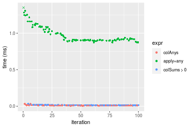

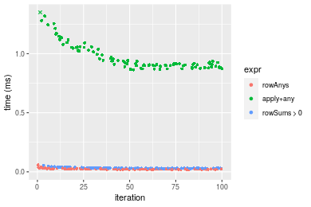
_Table: Benchmarking of colAnys() and rowAnys() on 10x1000 data (original and transposed).  The top panel shows times in milliseconds and the bottom panel shows relative times._


|   |expr    |    min|      lq|     mean|  median|     uq|    max|
|:--|:-------|------:|-------:|--------:|-------:|------:|------:|
|1  |colAnys |  7.498|  9.0195| 11.23751| 10.5265| 11.611| 33.898|
|2  |rowAnys | 18.954| 21.7545| 24.64234| 23.0885| 26.118| 58.377|


|   |expr    |      min|       lq|     mean|   median|       uq|      max|
|:--|:-------|--------:|--------:|--------:|--------:|--------:|--------:|
|1  |colAnys | 1.000000| 1.000000| 1.000000| 1.000000| 1.000000| 1.000000|
|2  |rowAnys | 2.527874| 2.411941| 2.192865| 2.193369| 2.249419| 1.722137|

_Figure: Benchmarking of colAnys() and rowAnys() on 10x1000 data (original and transposed).  Outliers are displayed as crosses. Times are in milliseconds._


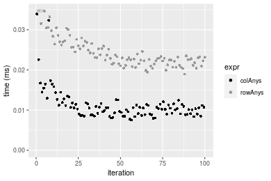

### 100x1000 matrix


```r
> X <- data[["100x1000"]]
> gc()
          used  (Mb) gc trigger  (Mb) max used  (Mb)
Ncells 5158100 275.5    7554717 403.5  7554717 403.5
Vcells 9053303  69.1   31793280 242.6 60508962 461.7
> colStats <- microbenchmark(colAnys = colAnys(X), `apply+any` = apply(X, MARGIN = 2L, FUN = any), 
+     `colSums > 0` = (colSums(X) > 0L), unit = "ms")
> X <- t(X)
> gc()
          used  (Mb) gc trigger  (Mb) max used  (Mb)
Ncells 5158082 275.5    7554717 403.5  7554717 403.5
Vcells 9103326  69.5   31793280 242.6 60508962 461.7
> rowStats <- microbenchmark(rowAnys = rowAnys(X), `apply+any` = apply(X, MARGIN = 1L, FUN = any), 
+     `rowSums > 0` = (rowSums(X) > 0L), unit = "ms")
```

_Table: Benchmarking of colAnys(), apply+any() and colSums > 0() on 100x1000 data. The top panel shows times in milliseconds and the bottom panel shows relative times._


|   |expr        |      min|       lq|      mean|    median|        uq|      max|
|:--|:-----------|--------:|--------:|---------:|---------:|---------:|--------:|
|1  |colAnys     | 0.008466| 0.011105| 0.0155589| 0.0137165| 0.0169565| 0.035114|
|3  |colSums > 0 | 0.081018| 0.085216| 0.0964410| 0.0908895| 0.1029185| 0.169096|
|2  |apply+any   | 1.393051| 1.478668| 1.6044336| 1.5178235| 1.6283960| 2.753649|


|   |expr        |        min|         lq|       mean|    median|       uq|       max|
|:--|:-----------|----------:|----------:|----------:|---------:|--------:|---------:|
|1  |colAnys     |   1.000000|   1.000000|   1.000000|   1.00000|  1.00000|  1.000000|
|3  |colSums > 0 |   9.569809|   7.673661|   6.198464|   6.62629|  6.06956|  4.815629|
|2  |apply+any   | 164.546539| 133.153399| 103.120317| 110.65676| 96.03373| 78.420260|

_Table: Benchmarking of rowAnys(), apply+any() and rowSums > 0() on 100x1000 data (transposed). The top panel shows times in milliseconds and the bottom panel shows relative times._


|   |expr        |      min|        lq|      mean|    median|        uq|      max|
|:--|:-----------|--------:|---------:|---------:|---------:|---------:|--------:|
|1  |rowAnys     | 0.054675| 0.0567145| 0.0618661| 0.0583025| 0.0616425| 0.110160|
|3  |rowSums > 0 | 0.224190| 0.2284560| 0.2483638| 0.2323990| 0.2538480| 0.357539|
|2  |apply+any   | 1.363537| 1.4038910| 1.4964084| 1.4500895| 1.5016950| 2.308847|


|   |expr        |       min|        lq|      mean|   median|        uq|       max|
|:--|:-----------|---------:|---------:|---------:|--------:|---------:|---------:|
|1  |rowAnys     |  1.000000|  1.000000|  1.000000|  1.00000|  1.000000|  1.000000|
|3  |rowSums > 0 |  4.100411|  4.028176|  4.014541|  3.98609|  4.118068|  3.245634|
|2  |apply+any   | 24.938948| 24.753652| 24.187872| 24.87182| 24.361358| 20.959032|

_Figure: Benchmarking of colAnys(), apply+any() and colSums > 0() on 100x1000 data  as well as rowAnys(), apply+any() and rowSums > 0() on the same data transposed.  Outliers are displayed as crosses.  Times are in milliseconds._


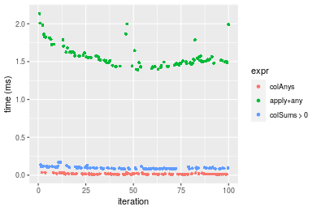

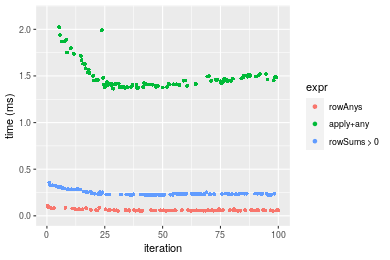
_Table: Benchmarking of colAnys() and rowAnys() on 100x1000 data (original and transposed).  The top panel shows times in milliseconds and the bottom panel shows relative times._


|   |expr    |    min|      lq|     mean|  median|      uq|     max|
|:--|:-------|------:|-------:|--------:|-------:|-------:|-------:|
|1  |colAnys |  8.466| 11.1050| 15.55885| 13.7165| 16.9565|  35.114|
|2  |rowAnys | 54.675| 56.7145| 61.86606| 58.3025| 61.6425| 110.160|


|   |expr    |      min|       lq|     mean|   median|       uq|     max|
|:--|:-------|--------:|--------:|--------:|--------:|--------:|-------:|
|1  |colAnys | 1.000000| 1.000000| 1.000000| 1.000000| 1.000000| 1.00000|
|2  |rowAnys | 6.458186| 5.107114| 3.976262| 4.250538| 3.635332| 3.13721|

_Figure: Benchmarking of colAnys() and rowAnys() on 100x1000 data (original and transposed).  Outliers are displayed as crosses. Times are in milliseconds._


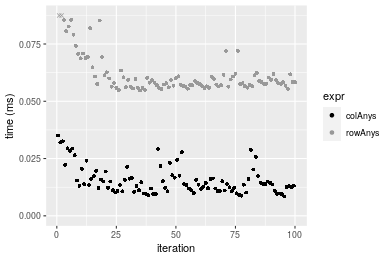

### 1000x100 matrix


```r
> X <- data[["1000x100"]]
> gc()
          used  (Mb) gc trigger  (Mb) max used  (Mb)
Ncells 5158305 275.5    7554717 403.5  7554717 403.5
Vcells 9053976  69.1   31793280 242.6 60508962 461.7
> colStats <- microbenchmark(colAnys = colAnys(X), `apply+any` = apply(X, MARGIN = 2L, FUN = any), 
+     `colSums > 0` = (colSums(X) > 0L), unit = "ms")
> X <- t(X)
> gc()
          used  (Mb) gc trigger  (Mb) max used  (Mb)
Ncells 5158287 275.5    7554717 403.5  7554717 403.5
Vcells 9103999  69.5   31793280 242.6 60508962 461.7
> rowStats <- microbenchmark(rowAnys = rowAnys(X), `apply+any` = apply(X, MARGIN = 1L, FUN = any), 
+     `rowSums > 0` = (rowSums(X) > 0L), unit = "ms")
```

_Table: Benchmarking of colAnys(), apply+any() and colSums > 0() on 1000x100 data. The top panel shows times in milliseconds and the bottom panel shows relative times._


|   |expr        |      min|       lq|      mean|    median|        uq|      max|
|:--|:-----------|--------:|--------:|---------:|---------:|---------:|--------:|
|1  |colAnys     | 0.003058| 0.004048| 0.0052763| 0.0048840| 0.0059525| 0.021846|
|3  |colSums > 0 | 0.082801| 0.083750| 0.0965191| 0.0880225| 0.1081175| 0.158892|
|2  |apply+any   | 0.630548| 0.636118| 0.7215523| 0.6707095| 0.7978395| 1.074633|


|   |expr        |       min|        lq|      mean|    median|        uq|       max|
|:--|:-----------|---------:|---------:|---------:|---------:|---------:|---------:|
|1  |colAnys     |   1.00000|   1.00000|   1.00000|   1.00000|   1.00000|  1.000000|
|3  |colSums > 0 |  27.07685|  20.68923|  18.29288|  18.02262|  18.16338|  7.273277|
|2  |apply+any   | 206.19621| 157.14377| 136.75295| 137.32791| 134.03436| 49.191294|

_Table: Benchmarking of rowAnys(), apply+any() and rowSums > 0() on 1000x100 data (transposed). The top panel shows times in milliseconds and the bottom panel shows relative times._


|   |expr        |      min|        lq|      mean|    median|        uq|      max|
|:--|:-----------|--------:|---------:|---------:|---------:|---------:|--------:|
|1  |rowAnys     | 0.053457| 0.0561645| 0.0625180| 0.0579305| 0.0663905| 0.100265|
|3  |rowSums > 0 | 0.323561| 0.3245835| 0.3610840| 0.3258195| 0.3959045| 0.517883|
|2  |apply+any   | 0.635037| 0.6418895| 0.7005574| 0.6474640| 0.7138180| 1.121840|


|   |expr        |       min|        lq|      mean|    median|       uq|       max|
|:--|:-----------|---------:|---------:|---------:|---------:|--------:|---------:|
|1  |rowAnys     |  1.000000|  1.000000|  1.000000|  1.000000|  1.00000|  1.000000|
|3  |rowSums > 0 |  6.052734|  5.779158|  5.775678|  5.624317|  5.96327|  5.165142|
|2  |apply+any   | 11.879398| 11.428741| 11.205686| 11.176565| 10.75181| 11.188750|

_Figure: Benchmarking of colAnys(), apply+any() and colSums > 0() on 1000x100 data  as well as rowAnys(), apply+any() and rowSums > 0() on the same data transposed.  Outliers are displayed as crosses.  Times are in milliseconds._


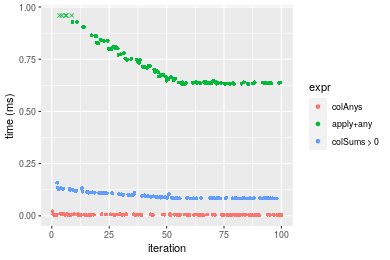

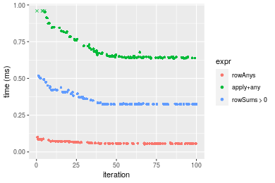
_Table: Benchmarking of colAnys() and rowAnys() on 1000x100 data (original and transposed).  The top panel shows times in milliseconds and the bottom panel shows relative times._


|   |expr    |    min|      lq|     mean|  median|      uq|     max|
|:--|:-------|------:|-------:|--------:|-------:|-------:|-------:|
|1  |colAnys |  3.058|  4.0480|  5.27632|  4.8840|  5.9525|  21.846|
|2  |rowAnys | 53.457| 56.1645| 62.51803| 57.9305| 66.3905| 100.265|


|   |expr    |      min|       lq|     mean|   median|       uq|      max|
|:--|:-------|--------:|--------:|--------:|--------:|--------:|--------:|
|1  |colAnys |  1.00000|  1.00000|  1.00000|  1.00000|  1.00000| 1.000000|
|2  |rowAnys | 17.48103| 13.87463| 11.84879| 11.86128| 11.15338| 4.589627|

_Figure: Benchmarking of colAnys() and rowAnys() on 1000x100 data (original and transposed).  Outliers are displayed as crosses. Times are in milliseconds._


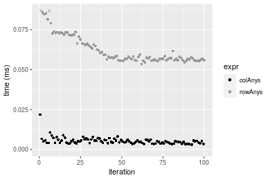


## Appendix

### Session information
```r
R version 4.1.1 Patched (2021-08-10 r80727)
Platform: x86_64-pc-linux-gnu (64-bit)
Running under: Ubuntu 18.04.5 LTS

Matrix products: default
BLAS:   /home/hb/software/R-devel/R-4-1-branch/lib/R/lib/libRblas.so
LAPACK: /home/hb/software/R-devel/R-4-1-branch/lib/R/lib/libRlapack.so

locale:
 [1] LC_CTYPE=en_US.UTF-8       LC_NUMERIC=C              
 [3] LC_TIME=en_US.UTF-8        LC_COLLATE=en_US.UTF-8    
 [5] LC_MONETARY=en_US.UTF-8    LC_MESSAGES=en_US.UTF-8   
 [7] LC_PAPER=en_US.UTF-8       LC_NAME=C                 
 [9] LC_ADDRESS=C               LC_TELEPHONE=C            
[11] LC_MEASUREMENT=en_US.UTF-8 LC_IDENTIFICATION=C       

attached base packages:
[1] stats     graphics  grDevices utils     datasets  methods   base     

other attached packages:
[1] microbenchmark_1.4-7   matrixStats_0.60.0     ggplot2_3.3.5         
[4] knitr_1.33             R.devices_2.17.0       R.utils_2.10.1        
[7] R.oo_1.24.0            R.methodsS3_1.8.1-9001

loaded via a namespace (and not attached):
 [1] Biobase_2.52.0          httr_1.4.2              splines_4.1.1          
 [4] bit64_4.0.5             network_1.17.1          assertthat_0.2.1       
 [7] highr_0.9               stats4_4.1.1            blob_1.2.2             
[10] GenomeInfoDbData_1.2.6  robustbase_0.93-8       pillar_1.6.2           
[13] RSQLite_2.2.8           lattice_0.20-44         glue_1.4.2             
[16] digest_0.6.27           XVector_0.32.0          colorspace_2.0-2       
[19] Matrix_1.3-4            XML_3.99-0.7            pkgconfig_2.0.3        
[22] zlibbioc_1.38.0         genefilter_1.74.0       purrr_0.3.4            
[25] ergm_4.1.2              xtable_1.8-4            scales_1.1.1           
[28] tibble_3.1.4            annotate_1.70.0         KEGGREST_1.32.0        
[31] farver_2.1.0            generics_0.1.0          IRanges_2.26.0         
[34] ellipsis_0.3.2          cachem_1.0.6            withr_2.4.2            
[37] BiocGenerics_0.38.0     mime_0.11               survival_3.2-13        
[40] magrittr_2.0.1          crayon_1.4.1            statnet.common_4.5.0   
[43] memoise_2.0.0           laeken_0.5.1            fansi_0.5.0            
[46] R.cache_0.15.0          MASS_7.3-54             R.rsp_0.44.0           
[49] tools_4.1.1             lifecycle_1.0.0         S4Vectors_0.30.0       
[52] trust_0.1-8             munsell_0.5.0           AnnotationDbi_1.54.1   
[55] Biostrings_2.60.2       compiler_4.1.1          GenomeInfoDb_1.28.1    
[58] rlang_0.4.11            grid_4.1.1              RCurl_1.98-1.4         
[61] cwhmisc_6.6             rappdirs_0.3.3          labeling_0.4.2         
[64] bitops_1.0-7            base64enc_0.1-3         boot_1.3-28            
[67] gtable_0.3.0            DBI_1.1.1               markdown_1.1           
[70] R6_2.5.1                lpSolveAPI_5.5.2.0-17.7 rle_0.9.2              
[73] dplyr_1.0.7             fastmap_1.1.0           bit_4.0.4              
[76] utf8_1.2.2              parallel_4.1.1          Rcpp_1.0.7             
[79] vctrs_0.3.8             png_0.1-7               DEoptimR_1.0-9         
[82] tidyselect_1.1.1        xfun_0.25               coda_0.19-4            
```
Total processing time was 11.67 secs.


### Reproducibility
To reproduce this report, do:
```r
html <- matrixStats:::benchmark('colAnys')
```

[RSP]: https://cran.r-project.org/package=R.rsp
[matrixStats]: https://cran.r-project.org/package=matrixStats

[StackOverflow:colMins?]: https://stackoverflow.com/questions/13676878 "Stack Overflow: fastest way to get Min from every column in a matrix?"
[StackOverflow:colSds?]: https://stackoverflow.com/questions/17549762 "Stack Overflow: Is there such 'colsd' in R?"
[StackOverflow:rowProds?]: https://stackoverflow.com/questions/20198801/ "Stack Overflow: Row product of matrix and column sum of matrix"

---------------------------------------
Copyright Henrik Bengtsson. Last updated on 2021-08-25 17:35:44 (+0200 UTC). Powered by [RSP].

<script>
 var link = document.createElement('link');
 link.rel = 'icon';
 link.href = "data:image/png;base64,iVBORw0KGgoAAAANSUhEUgAAACAAAAAgCAMAAABEpIrGAAAA21BMVEUAAAAAAP8AAP8AAP8AAP8AAP8AAP8AAP8AAP8AAP8AAP8AAP8AAP8AAP8AAP8AAP8AAP8AAP8AAP8AAP8AAP8AAP8AAP8AAP8AAP8AAP8AAP8AAP8AAP8AAP8AAP8AAP8AAP8AAP8AAP8AAP8AAP8AAP8AAP8AAP8AAP8AAP8BAf4CAv0DA/wdHeIeHuEfH+AgIN8hId4lJdomJtknJ9g+PsE/P8BAQL9yco10dIt1dYp3d4h4eIeVlWqWlmmXl2iYmGeZmWabm2Tn5xjo6Bfp6Rb39wj4+Af//wA2M9hbAAAASXRSTlMAAQIJCgsMJSYnKD4/QGRlZmhpamtsbautrrCxuru8y8zN5ebn6Pn6+///////////////////////////////////////////LsUNcQAAAS9JREFUOI29k21XgkAQhVcFytdSMqMETU26UVqGmpaiFbL//xc1cAhhwVNf6n5i5z67M2dmYOyfJZUqlVLhkKucG7cgmUZTybDz6g0iDeq51PUr37Ds2cy2/C9NeES5puDjxuUk1xnToZsg8pfA3avHQ3lLIi7iWRrkv/OYtkScxBIMgDee0ALoyxHQBJ68JLCjOtQIMIANF7QG9G9fNnHvisCHBVMKgSJgiz7nE+AoBKrAPA3MgepvgR9TSCasrCKH0eB1wBGBFdCO+nAGjMVGPcQb5bd6mQRegN6+1axOs9nGfYcCtfi4NQosdtH7dB+txFIpXQqN1p9B/asRHToyS0jRgpV7nk4nwcq1BJ+x3Gl/v7S9Wmpp/aGquum7w3ZDyrADFYrl8vHBH+ev9AUASW1dmU4h4wAAAABJRU5ErkJggg=="
 document.getElementsByTagName('head')[0].appendChild(link);
</script>


