[matrixStats]: Benchmark report

---------------------------------------


# colCounts() and rowCounts() benchmarks on subsetted computation

This report benchmark the performance of colCounts() and rowCounts() on subsetted computation.


## Data type "logical"

### Data
```r
> rmatrix <- function(nrow, ncol, mode = c("logical", "double", "integer", "index"), range = c(-100, 
+     +100), na_prob = 0) {
+     mode <- match.arg(mode)
+     n <- nrow * ncol
+     if (mode == "logical") {
+         x <- sample(c(FALSE, TRUE), size = n, replace = TRUE)
+     }     else if (mode == "index") {
+         x <- seq_len(n)
+         mode <- "integer"
+     }     else {
+         x <- runif(n, min = range[1], max = range[2])
+     }
+     storage.mode(x) <- mode
+     if (na_prob > 0) 
+         x[sample(n, size = na_prob * n)] <- NA
+     dim(x) <- c(nrow, ncol)
+     x
+ }
> rmatrices <- function(scale = 10, seed = 1, ...) {
+     set.seed(seed)
+     data <- list()
+     data[[1]] <- rmatrix(nrow = scale * 1, ncol = scale * 1, ...)
+     data[[2]] <- rmatrix(nrow = scale * 10, ncol = scale * 10, ...)
+     data[[3]] <- rmatrix(nrow = scale * 100, ncol = scale * 1, ...)
+     data[[4]] <- t(data[[3]])
+     data[[5]] <- rmatrix(nrow = scale * 10, ncol = scale * 100, ...)
+     data[[6]] <- t(data[[5]])
+     names(data) <- sapply(data, FUN = function(x) paste(dim(x), collapse = "x"))
+     data
+ }
> data <- rmatrices(mode = mode)
```

### Results

#### 10x10 matrix


```r
> X <- data[["10x10"]]
> rows <- sample.int(nrow(X), size = nrow(X) * 0.7)
> cols <- sample.int(ncol(X), size = ncol(X) * 0.7)
> X_S <- X[rows, cols]
> value <- 42
```


```r
> colStats <- microbenchmark(colCounts_X_S = colCounts(X_S, value = value, na.rm = FALSE), `colCounts(X, rows, cols)` = colCounts(X, 
+     value = value, na.rm = FALSE, rows = rows, cols = cols), `colCounts(X[rows, cols])` = colCounts(X[rows, 
+     cols], value = value, na.rm = FALSE), unit = "ms")
```

```r
> X <- t(X)
> X_S <- t(X_S)
```


```r
> rowStats <- microbenchmark(rowCounts_X_S = rowCounts(X_S, value = value, na.rm = FALSE), `rowCounts(X, cols, rows)` = rowCounts(X, 
+     value = value, na.rm = FALSE, rows = cols, cols = rows), `rowCounts(X[cols, rows])` = rowCounts(X[cols, 
+     rows], value = value, na.rm = FALSE), unit = "ms")
```

_Table: Benchmarking of colCounts_X_S(), colCounts(X, rows, cols)() and colCounts(X[rows, cols])() on logical+10x10 data. The top panel shows times in milliseconds and the bottom panel shows relative times._


|   |expr                     |      min|        lq|      mean|    median|        uq|      max|
|:--|:------------------------|--------:|---------:|---------:|---------:|---------:|--------:|
|1  |colCounts_X_S            | 0.006379| 0.0067050| 0.0094702| 0.0068805| 0.0069805| 0.264302|
|2  |colCounts(X, rows, cols) | 0.006946| 0.0071585| 0.0075823| 0.0073005| 0.0074745| 0.021696|
|3  |colCounts(X[rows, cols]) | 0.007527| 0.0079390| 0.0083953| 0.0081265| 0.0083640| 0.022503|


|   |expr                     |      min|       lq|      mean|   median|       uq|       max|
|:--|:------------------------|--------:|--------:|---------:|--------:|--------:|---------:|
|1  |colCounts_X_S            | 1.000000| 1.000000| 1.0000000| 1.000000| 1.000000| 1.0000000|
|2  |colCounts(X, rows, cols) | 1.088885| 1.067636| 0.8006494| 1.061042| 1.070769| 0.0820879|
|3  |colCounts(X[rows, cols]) | 1.179966| 1.184042| 0.8864992| 1.181091| 1.198195| 0.0851412|

_Table: Benchmarking of rowCounts_X_S(), rowCounts(X, cols, rows)() and rowCounts(X[cols, rows])() on logical+10x10 data (transposed). The top panel shows times in milliseconds and the bottom panel shows relative times._


|   |expr                     |      min|       lq|      mean|    median|       uq|      max|
|:--|:------------------------|--------:|--------:|---------:|---------:|--------:|--------:|
|1  |rowCounts_X_S            | 0.006418| 0.006758| 0.0069292| 0.0068870| 0.007020| 0.010997|
|2  |rowCounts(X, cols, rows) | 0.006918| 0.007171| 0.0103149| 0.0073475| 0.007590| 0.295547|
|3  |rowCounts(X[cols, rows]) | 0.007590| 0.008068| 0.0084534| 0.0081890| 0.008386| 0.024175|


|   |expr                     |      min|       lq|     mean|   median|       uq|       max|
|:--|:------------------------|--------:|--------:|--------:|--------:|--------:|---------:|
|1  |rowCounts_X_S            | 1.000000| 1.000000| 1.000000| 1.000000| 1.000000|  1.000000|
|2  |rowCounts(X, cols, rows) | 1.077906| 1.061113| 1.488626| 1.066865| 1.081197| 26.875239|
|3  |rowCounts(X[cols, rows]) | 1.182611| 1.193844| 1.219978| 1.189052| 1.194587|  2.198327|

_Figure: Benchmarking of colCounts_X_S(), colCounts(X, rows, cols)() and colCounts(X[rows, cols])() on logical+10x10 data  as well as rowCounts_X_S(), rowCounts(X, cols, rows)() and rowCounts(X[cols, rows])() on the same data transposed.  Outliers are displayed as crosses.  Times are in milliseconds._


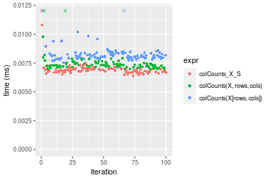

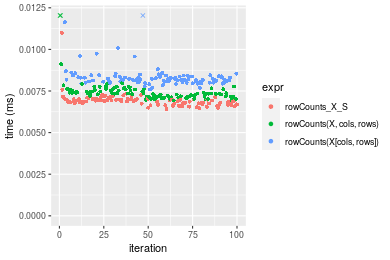
_Table: Benchmarking of colCounts_X_S() and rowCounts_X_S() on logical+10x10 data (original and transposed).  The top panel shows times in milliseconds and the bottom panel shows relative times._


|   |expr          |   min|    lq|    mean| median|     uq|     max|
|:--|:-------------|-----:|-----:|-------:|------:|------:|-------:|
|1  |colCounts_X_S | 6.379| 6.705| 9.47015| 6.8805| 6.9805| 264.302|
|2  |rowCounts_X_S | 6.418| 6.758| 6.92915| 6.8870| 7.0200|  10.997|


|   |expr          |      min|       lq|      mean|   median|       uq|       max|
|:--|:-------------|--------:|--------:|---------:|--------:|--------:|---------:|
|1  |colCounts_X_S | 1.000000| 1.000000| 1.0000000| 1.000000| 1.000000| 1.0000000|
|2  |rowCounts_X_S | 1.006114| 1.007904| 0.7316832| 1.000945| 1.005659| 0.0416077|

_Figure: Benchmarking of colCounts_X_S() and rowCounts_X_S() on logical+10x10 data (original and transposed).  Outliers are displayed as crosses. Times are in milliseconds._


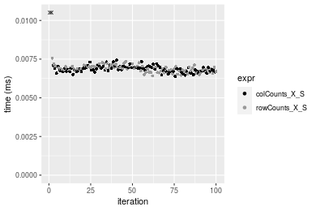

#### 100x100 matrix


```r
> X <- data[["100x100"]]
> rows <- sample.int(nrow(X), size = nrow(X) * 0.7)
> cols <- sample.int(ncol(X), size = ncol(X) * 0.7)
> X_S <- X[rows, cols]
> value <- 42
```


```r
> colStats <- microbenchmark(colCounts_X_S = colCounts(X_S, value = value, na.rm = FALSE), `colCounts(X, rows, cols)` = colCounts(X, 
+     value = value, na.rm = FALSE, rows = rows, cols = cols), `colCounts(X[rows, cols])` = colCounts(X[rows, 
+     cols], value = value, na.rm = FALSE), unit = "ms")
```

```r
> X <- t(X)
> X_S <- t(X_S)
```


```r
> rowStats <- microbenchmark(rowCounts_X_S = rowCounts(X_S, value = value, na.rm = FALSE), `rowCounts(X, cols, rows)` = rowCounts(X, 
+     value = value, na.rm = FALSE, rows = cols, cols = rows), `rowCounts(X[cols, rows])` = rowCounts(X[cols, 
+     rows], value = value, na.rm = FALSE), unit = "ms")
```

_Table: Benchmarking of colCounts_X_S(), colCounts(X, rows, cols)() and colCounts(X[rows, cols])() on logical+100x100 data. The top panel shows times in milliseconds and the bottom panel shows relative times._


|   |expr                     |      min|        lq|      mean|    median|       uq|      max|
|:--|:------------------------|--------:|---------:|---------:|---------:|--------:|--------:|
|1  |colCounts_X_S            | 0.025826| 0.0277340| 0.0292702| 0.0289695| 0.030348| 0.039164|
|3  |colCounts(X[rows, cols]) | 0.039748| 0.0428105| 0.0459384| 0.0448090| 0.047622| 0.096169|
|2  |colCounts(X, rows, cols) | 0.042177| 0.0442870| 0.0463858| 0.0457965| 0.048390| 0.056040|


|   |expr                     |      min|       lq|     mean|   median|       uq|      max|
|:--|:------------------------|--------:|--------:|--------:|--------:|--------:|--------:|
|1  |colCounts_X_S            | 1.000000| 1.000000| 1.000000| 1.000000| 1.000000| 1.000000|
|3  |colCounts(X[rows, cols]) | 1.539069| 1.543611| 1.569460| 1.546765| 1.569197| 2.455546|
|2  |colCounts(X, rows, cols) | 1.633122| 1.596849| 1.584747| 1.580852| 1.594504| 1.430906|

_Table: Benchmarking of rowCounts_X_S(), rowCounts(X, cols, rows)() and rowCounts(X[cols, rows])() on logical+100x100 data (transposed). The top panel shows times in milliseconds and the bottom panel shows relative times._


|   |expr                     |      min|       lq|      mean|    median|        uq|      max|
|:--|:------------------------|--------:|--------:|---------:|---------:|---------:|--------:|
|1  |rowCounts_X_S            | 0.031948| 0.034448| 0.0369557| 0.0366415| 0.0383925| 0.053899|
|2  |rowCounts(X, cols, rows) | 0.041212| 0.046304| 0.0491022| 0.0485965| 0.0510505| 0.096745|
|3  |rowCounts(X[cols, rows]) | 0.046157| 0.049897| 0.0523085| 0.0519335| 0.0539605| 0.069012|


|   |expr                     |      min|       lq|     mean|   median|       uq|      max|
|:--|:------------------------|--------:|--------:|--------:|--------:|--------:|--------:|
|1  |rowCounts_X_S            | 1.000000| 1.000000| 1.000000| 1.000000| 1.000000| 1.000000|
|2  |rowCounts(X, cols, rows) | 1.289971| 1.344171| 1.328676| 1.326269| 1.329700| 1.794931|
|3  |rowCounts(X[cols, rows]) | 1.444754| 1.448473| 1.415437| 1.417341| 1.405496| 1.280395|

_Figure: Benchmarking of colCounts_X_S(), colCounts(X, rows, cols)() and colCounts(X[rows, cols])() on logical+100x100 data  as well as rowCounts_X_S(), rowCounts(X, cols, rows)() and rowCounts(X[cols, rows])() on the same data transposed.  Outliers are displayed as crosses.  Times are in milliseconds._


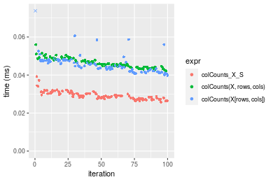

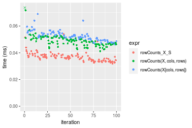
_Table: Benchmarking of colCounts_X_S() and rowCounts_X_S() on logical+100x100 data (original and transposed).  The top panel shows times in milliseconds and the bottom panel shows relative times._


|   |expr          |    min|     lq|     mean|  median|      uq|    max|
|:--|:-------------|------:|------:|--------:|-------:|-------:|------:|
|1  |colCounts_X_S | 25.826| 27.734| 29.27018| 28.9695| 30.3480| 39.164|
|2  |rowCounts_X_S | 31.948| 34.448| 36.95570| 36.6415| 38.3925| 53.899|


|   |expr          |      min|       lq|     mean|  median|       uq|      max|
|:--|:-------------|--------:|--------:|--------:|-------:|--------:|--------:|
|1  |colCounts_X_S | 1.000000| 1.000000| 1.000000| 1.00000| 1.000000| 1.000000|
|2  |rowCounts_X_S | 1.237048| 1.242085| 1.262572| 1.26483| 1.265075| 1.376238|

_Figure: Benchmarking of colCounts_X_S() and rowCounts_X_S() on logical+100x100 data (original and transposed).  Outliers are displayed as crosses. Times are in milliseconds._


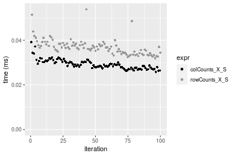

#### 1000x10 matrix


```r
> X <- data[["1000x10"]]
> rows <- sample.int(nrow(X), size = nrow(X) * 0.7)
> cols <- sample.int(ncol(X), size = ncol(X) * 0.7)
> X_S <- X[rows, cols]
> value <- 42
```


```r
> colStats <- microbenchmark(colCounts_X_S = colCounts(X_S, value = value, na.rm = FALSE), `colCounts(X, rows, cols)` = colCounts(X, 
+     value = value, na.rm = FALSE, rows = rows, cols = cols), `colCounts(X[rows, cols])` = colCounts(X[rows, 
+     cols], value = value, na.rm = FALSE), unit = "ms")
```

```r
> X <- t(X)
> X_S <- t(X_S)
```


```r
> rowStats <- microbenchmark(rowCounts_X_S = rowCounts(X_S, value = value, na.rm = FALSE), `rowCounts(X, cols, rows)` = rowCounts(X, 
+     value = value, na.rm = FALSE, rows = cols, cols = rows), `rowCounts(X[cols, rows])` = rowCounts(X[cols, 
+     rows], value = value, na.rm = FALSE), unit = "ms")
```

_Table: Benchmarking of colCounts_X_S(), colCounts(X, rows, cols)() and colCounts(X[rows, cols])() on logical+1000x10 data. The top panel shows times in milliseconds and the bottom panel shows relative times._


|   |expr                     |      min|        lq|      mean|    median|        uq|      max|
|:--|:------------------------|--------:|---------:|---------:|---------:|---------:|--------:|
|1  |colCounts_X_S            | 0.026196| 0.0276095| 0.0288802| 0.0284585| 0.0297480| 0.044330|
|2  |colCounts(X, rows, cols) | 0.040784| 0.0425915| 0.0450877| 0.0443870| 0.0469765| 0.063775|
|3  |colCounts(X[rows, cols]) | 0.040127| 0.0422795| 0.0453013| 0.0445585| 0.0467045| 0.095270|


|   |expr                     |      min|       lq|     mean|   median|       uq|      max|
|:--|:------------------------|--------:|--------:|--------:|--------:|--------:|--------:|
|1  |colCounts_X_S            | 1.000000| 1.000000| 1.000000| 1.000000| 1.000000| 1.000000|
|2  |colCounts(X, rows, cols) | 1.556879| 1.542639| 1.561196| 1.559710| 1.579148| 1.438642|
|3  |colCounts(X[rows, cols]) | 1.531799| 1.531339| 1.568592| 1.565736| 1.570005| 2.149109|

_Table: Benchmarking of rowCounts_X_S(), rowCounts(X, cols, rows)() and rowCounts(X[cols, rows])() on logical+1000x10 data (transposed). The top panel shows times in milliseconds and the bottom panel shows relative times._


|   |expr                     |      min|       lq|      mean|    median|        uq|      max|
|:--|:------------------------|--------:|--------:|---------:|---------:|---------:|--------:|
|1  |rowCounts_X_S            | 0.032979| 0.035257| 0.0379606| 0.0366310| 0.0400110| 0.050277|
|2  |rowCounts(X, cols, rows) | 0.044068| 0.048606| 0.0512654| 0.0507020| 0.0531545| 0.069029|
|3  |rowCounts(X[cols, rows]) | 0.048046| 0.051512| 0.0560324| 0.0549695| 0.0591315| 0.108539|


|   |expr                     |      min|       lq|     mean|   median|       uq|      max|
|:--|:------------------------|--------:|--------:|--------:|--------:|--------:|--------:|
|1  |rowCounts_X_S            | 1.000000| 1.000000| 1.000000| 1.000000| 1.000000| 1.000000|
|2  |rowCounts(X, cols, rows) | 1.336244| 1.378620| 1.350491| 1.384128| 1.328497| 1.372974|
|3  |rowCounts(X[cols, rows]) | 1.456867| 1.461043| 1.476069| 1.500628| 1.477881| 2.158820|

_Figure: Benchmarking of colCounts_X_S(), colCounts(X, rows, cols)() and colCounts(X[rows, cols])() on logical+1000x10 data  as well as rowCounts_X_S(), rowCounts(X, cols, rows)() and rowCounts(X[cols, rows])() on the same data transposed.  Outliers are displayed as crosses.  Times are in milliseconds._


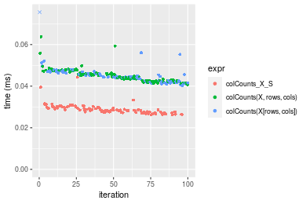

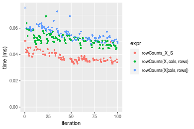
_Table: Benchmarking of colCounts_X_S() and rowCounts_X_S() on logical+1000x10 data (original and transposed).  The top panel shows times in milliseconds and the bottom panel shows relative times._


|   |expr          |    min|      lq|     mean|  median|     uq|    max|
|:--|:-------------|------:|-------:|--------:|-------:|------:|------:|
|1  |colCounts_X_S | 26.196| 27.6095| 28.88021| 28.4585| 29.748| 44.330|
|2  |rowCounts_X_S | 32.979| 35.2570| 37.96058| 36.6310| 40.011| 50.277|


|   |expr          |      min|       lq|     mean|   median|       uq|      max|
|:--|:-------------|--------:|--------:|--------:|--------:|--------:|--------:|
|1  |colCounts_X_S | 1.000000| 1.000000| 1.000000| 1.000000| 1.000000| 1.000000|
|2  |rowCounts_X_S | 1.258933| 1.276988| 1.314415| 1.287173| 1.344998| 1.134153|

_Figure: Benchmarking of colCounts_X_S() and rowCounts_X_S() on logical+1000x10 data (original and transposed).  Outliers are displayed as crosses. Times are in milliseconds._


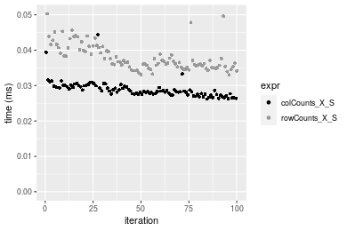

#### 10x1000 matrix


```r
> X <- data[["10x1000"]]
> rows <- sample.int(nrow(X), size = nrow(X) * 0.7)
> cols <- sample.int(ncol(X), size = ncol(X) * 0.7)
> X_S <- X[rows, cols]
> value <- 42
```


```r
> colStats <- microbenchmark(colCounts_X_S = colCounts(X_S, value = value, na.rm = FALSE), `colCounts(X, rows, cols)` = colCounts(X, 
+     value = value, na.rm = FALSE, rows = rows, cols = cols), `colCounts(X[rows, cols])` = colCounts(X[rows, 
+     cols], value = value, na.rm = FALSE), unit = "ms")
```

```r
> X <- t(X)
> X_S <- t(X_S)
```


```r
> rowStats <- microbenchmark(rowCounts_X_S = rowCounts(X_S, value = value, na.rm = FALSE), `rowCounts(X, cols, rows)` = rowCounts(X, 
+     value = value, na.rm = FALSE, rows = cols, cols = rows), `rowCounts(X[cols, rows])` = rowCounts(X[cols, 
+     rows], value = value, na.rm = FALSE), unit = "ms")
```

_Table: Benchmarking of colCounts_X_S(), colCounts(X, rows, cols)() and colCounts(X[rows, cols])() on logical+10x1000 data. The top panel shows times in milliseconds and the bottom panel shows relative times._


|   |expr                     |      min|        lq|      mean|    median|        uq|      max|
|:--|:------------------------|--------:|---------:|---------:|---------:|---------:|--------:|
|1  |colCounts_X_S            | 0.028094| 0.0302790| 0.0322713| 0.0317840| 0.0328965| 0.080039|
|3  |colCounts(X[rows, cols]) | 0.043427| 0.0475395| 0.0501379| 0.0495545| 0.0518470| 0.066078|
|2  |colCounts(X, rows, cols) | 0.048086| 0.0518210| 0.0546343| 0.0539740| 0.0572035| 0.073126|


|   |expr                     |      min|       lq|     mean|   median|       uq|       max|
|:--|:------------------------|--------:|--------:|--------:|--------:|--------:|---------:|
|1  |colCounts_X_S            | 1.000000| 1.000000| 1.000000| 1.000000| 1.000000| 1.0000000|
|3  |colCounts(X[rows, cols]) | 1.545775| 1.570048| 1.553638| 1.559102| 1.576064| 0.8255725|
|2  |colCounts(X, rows, cols) | 1.711611| 1.711450| 1.692969| 1.698150| 1.738893| 0.9136296|

_Table: Benchmarking of rowCounts_X_S(), rowCounts(X, cols, rows)() and rowCounts(X[cols, rows])() on logical+10x1000 data (transposed). The top panel shows times in milliseconds and the bottom panel shows relative times._


|   |expr                     |      min|        lq|      mean|    median|        uq|      max|
|:--|:------------------------|--------:|---------:|---------:|---------:|---------:|--------:|
|1  |rowCounts_X_S            | 0.032644| 0.0353635| 0.0378632| 0.0369610| 0.0393580| 0.051588|
|2  |rowCounts(X, cols, rows) | 0.037875| 0.0462050| 0.0498801| 0.0487910| 0.0531615| 0.092585|
|3  |rowCounts(X[cols, rows]) | 0.046019| 0.0505290| 0.0545037| 0.0538495| 0.0562310| 0.077099|


|   |expr                     |      min|       lq|     mean|   median|       uq|      max|
|:--|:------------------------|--------:|--------:|--------:|--------:|--------:|--------:|
|1  |rowCounts_X_S            | 1.000000| 1.000000| 1.000000| 1.000000| 1.000000| 1.000000|
|2  |rowCounts(X, cols, rows) | 1.160244| 1.306573| 1.317375| 1.320067| 1.350717| 1.794700|
|3  |rowCounts(X[cols, rows]) | 1.409723| 1.428846| 1.439491| 1.456928| 1.428706| 1.494514|

_Figure: Benchmarking of colCounts_X_S(), colCounts(X, rows, cols)() and colCounts(X[rows, cols])() on logical+10x1000 data  as well as rowCounts_X_S(), rowCounts(X, cols, rows)() and rowCounts(X[cols, rows])() on the same data transposed.  Outliers are displayed as crosses.  Times are in milliseconds._


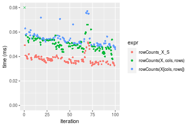
_Table: Benchmarking of colCounts_X_S() and rowCounts_X_S() on logical+10x1000 data (original and transposed).  The top panel shows times in milliseconds and the bottom panel shows relative times._


|   |expr          |    min|      lq|     mean| median|      uq|    max|
|:--|:-------------|------:|-------:|--------:|------:|-------:|------:|
|1  |colCounts_X_S | 28.094| 30.2790| 32.27128| 31.784| 32.8965| 80.039|
|2  |rowCounts_X_S | 32.644| 35.3635| 37.86321| 36.961| 39.3580| 51.588|


|   |expr          |      min|       lq|     mean|   median|       uq|       max|
|:--|:-------------|--------:|--------:|--------:|--------:|--------:|---------:|
|1  |colCounts_X_S | 1.000000| 1.000000| 1.000000| 1.000000| 1.000000| 1.0000000|
|2  |rowCounts_X_S | 1.161956| 1.167922| 1.173279| 1.162881| 1.196419| 0.6445358|

_Figure: Benchmarking of colCounts_X_S() and rowCounts_X_S() on logical+10x1000 data (original and transposed).  Outliers are displayed as crosses. Times are in milliseconds._


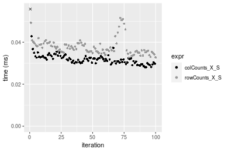

#### 100x1000 matrix


```r
> X <- data[["100x1000"]]
> rows <- sample.int(nrow(X), size = nrow(X) * 0.7)
> cols <- sample.int(ncol(X), size = ncol(X) * 0.7)
> X_S <- X[rows, cols]
> value <- 42
```


```r
> colStats <- microbenchmark(colCounts_X_S = colCounts(X_S, value = value, na.rm = FALSE), `colCounts(X, rows, cols)` = colCounts(X, 
+     value = value, na.rm = FALSE, rows = rows, cols = cols), `colCounts(X[rows, cols])` = colCounts(X[rows, 
+     cols], value = value, na.rm = FALSE), unit = "ms")
```

```r
> X <- t(X)
> X_S <- t(X_S)
```


```r
> rowStats <- microbenchmark(rowCounts_X_S = rowCounts(X_S, value = value, na.rm = FALSE), `rowCounts(X, cols, rows)` = rowCounts(X, 
+     value = value, na.rm = FALSE, rows = cols, cols = rows), `rowCounts(X[cols, rows])` = rowCounts(X[cols, 
+     rows], value = value, na.rm = FALSE), unit = "ms")
```

_Table: Benchmarking of colCounts_X_S(), colCounts(X, rows, cols)() and colCounts(X[rows, cols])() on logical+100x1000 data. The top panel shows times in milliseconds and the bottom panel shows relative times._


|   |expr                     |      min|        lq|      mean|    median|        uq|      max|
|:--|:------------------------|--------:|---------:|---------:|---------:|---------:|--------:|
|1  |colCounts_X_S            | 0.182313| 0.1840325| 0.2093930| 0.1916490| 0.2310190| 0.341716|
|2  |colCounts(X, rows, cols) | 0.258892| 0.2614605| 0.2952428| 0.2745620| 0.3270235| 0.485368|
|3  |colCounts(X[rows, cols]) | 0.274711| 0.2767555| 0.3184044| 0.3125365| 0.3452545| 0.436655|


|   |expr                     |      min|      lq|     mean|   median|       uq|      max|
|:--|:------------------------|--------:|-------:|--------:|--------:|--------:|--------:|
|1  |colCounts_X_S            | 1.000000| 1.00000| 1.000000| 1.000000| 1.000000| 1.000000|
|2  |colCounts(X, rows, cols) | 1.420041| 1.42073| 1.409993| 1.432629| 1.415570| 1.420384|
|3  |colCounts(X[rows, cols]) | 1.506810| 1.50384| 1.520606| 1.630775| 1.494485| 1.277830|

_Table: Benchmarking of rowCounts_X_S(), rowCounts(X, cols, rows)() and rowCounts(X[cols, rows])() on logical+100x1000 data (transposed). The top panel shows times in milliseconds and the bottom panel shows relative times._


|   |expr                     |      min|        lq|      mean|    median|        uq|      max|
|:--|:------------------------|--------:|---------:|---------:|---------:|---------:|--------:|
|1  |rowCounts_X_S            | 0.223645| 0.2256830| 0.2588039| 0.2376530| 0.2838570| 0.383525|
|2  |rowCounts(X, cols, rows) | 0.302489| 0.3045520| 0.3353041| 0.3056365| 0.3528195| 0.511213|
|3  |rowCounts(X[cols, rows]) | 0.315243| 0.3174205| 0.3565362| 0.3201820| 0.3921755| 0.515994|


|   |expr                     |      min|       lq|     mean|   median|       uq|      max|
|:--|:------------------------|--------:|--------:|--------:|--------:|--------:|--------:|
|1  |rowCounts_X_S            | 1.000000| 1.000000| 1.000000| 1.000000| 1.000000| 1.000000|
|2  |rowCounts(X, cols, rows) | 1.352541| 1.349468| 1.295592| 1.286062| 1.242948| 1.332933|
|3  |rowCounts(X[cols, rows]) | 1.409569| 1.406488| 1.377631| 1.347267| 1.381595| 1.345399|

_Figure: Benchmarking of colCounts_X_S(), colCounts(X, rows, cols)() and colCounts(X[rows, cols])() on logical+100x1000 data  as well as rowCounts_X_S(), rowCounts(X, cols, rows)() and rowCounts(X[cols, rows])() on the same data transposed.  Outliers are displayed as crosses.  Times are in milliseconds._


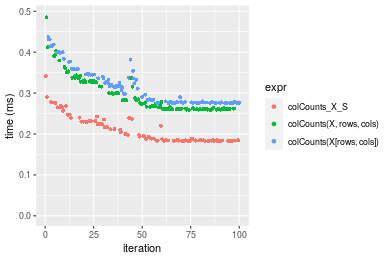

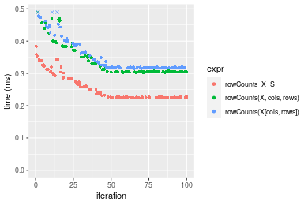
_Table: Benchmarking of colCounts_X_S() and rowCounts_X_S() on logical+100x1000 data (original and transposed).  The top panel shows times in milliseconds and the bottom panel shows relative times._


|   |expr          |     min|       lq|     mean|  median|      uq|     max|
|:--|:-------------|-------:|--------:|--------:|-------:|-------:|-------:|
|1  |colCounts_X_S | 182.313| 184.0325| 209.3930| 191.649| 231.019| 341.716|
|2  |rowCounts_X_S | 223.645| 225.6830| 258.8039| 237.653| 283.857| 383.525|


|   |expr          |      min|       lq|     mean|   median|       uq|     max|
|:--|:-------------|--------:|--------:|--------:|--------:|--------:|-------:|
|1  |colCounts_X_S | 1.000000| 1.000000| 1.000000| 1.000000| 1.000000| 1.00000|
|2  |rowCounts_X_S | 1.226709| 1.226321| 1.235972| 1.240043| 1.228717| 1.12235|

_Figure: Benchmarking of colCounts_X_S() and rowCounts_X_S() on logical+100x1000 data (original and transposed).  Outliers are displayed as crosses. Times are in milliseconds._


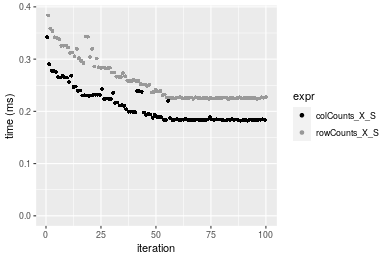

#### 1000x100 matrix


```r
> X <- data[["1000x100"]]
> rows <- sample.int(nrow(X), size = nrow(X) * 0.7)
> cols <- sample.int(ncol(X), size = ncol(X) * 0.7)
> X_S <- X[rows, cols]
> value <- 42
```


```r
> colStats <- microbenchmark(colCounts_X_S = colCounts(X_S, value = value, na.rm = FALSE), `colCounts(X, rows, cols)` = colCounts(X, 
+     value = value, na.rm = FALSE, rows = rows, cols = cols), `colCounts(X[rows, cols])` = colCounts(X[rows, 
+     cols], value = value, na.rm = FALSE), unit = "ms")
```

```r
> X <- t(X)
> X_S <- t(X_S)
```


```r
> rowStats <- microbenchmark(rowCounts_X_S = rowCounts(X_S, value = value, na.rm = FALSE), `rowCounts(X, cols, rows)` = rowCounts(X, 
+     value = value, na.rm = FALSE, rows = cols, cols = rows), `rowCounts(X[cols, rows])` = rowCounts(X[cols, 
+     rows], value = value, na.rm = FALSE), unit = "ms")
```

_Table: Benchmarking of colCounts_X_S(), colCounts(X, rows, cols)() and colCounts(X[rows, cols])() on logical+1000x100 data. The top panel shows times in milliseconds and the bottom panel shows relative times._


|   |expr                     |      min|        lq|      mean|    median|        uq|      max|
|:--|:------------------------|--------:|---------:|---------:|---------:|---------:|--------:|
|1  |colCounts_X_S            | 0.174652| 0.1767380| 0.1966855| 0.1784280| 0.2066750| 0.313552|
|2  |colCounts(X, rows, cols) | 0.247211| 0.2505005| 0.2861510| 0.2677650| 0.3151045| 0.397916|
|3  |colCounts(X[rows, cols]) | 0.266935| 0.2691875| 0.3063251| 0.2851175| 0.3384690| 0.471848|


|   |expr                     |      min|       lq|     mean|   median|       uq|      max|
|:--|:------------------------|--------:|--------:|--------:|--------:|--------:|--------:|
|1  |colCounts_X_S            | 1.000000| 1.000000| 1.000000| 1.000000| 1.000000| 1.000000|
|2  |colCounts(X, rows, cols) | 1.415449| 1.417355| 1.454865| 1.500689| 1.524638| 1.269059|
|3  |colCounts(X[rows, cols]) | 1.528382| 1.523088| 1.557436| 1.597941| 1.637687| 1.504848|

_Table: Benchmarking of rowCounts_X_S(), rowCounts(X, cols, rows)() and rowCounts(X[cols, rows])() on logical+1000x100 data (transposed). The top panel shows times in milliseconds and the bottom panel shows relative times._


|   |expr                     |      min|        lq|      mean|    median|        uq|      max|
|:--|:------------------------|--------:|---------:|---------:|---------:|---------:|--------:|
|1  |rowCounts_X_S            | 0.227613| 0.2299645| 0.2559270| 0.2334035| 0.2772070| 0.378908|
|2  |rowCounts(X, cols, rows) | 0.309731| 0.3115410| 0.3475936| 0.3146800| 0.3691815| 0.566159|
|3  |rowCounts(X[cols, rows]) | 0.320654| 0.3224710| 0.3582443| 0.3248585| 0.4006945| 0.513856|


|   |expr                     |      min|       lq|     mean|   median|      uq|      max|
|:--|:------------------------|--------:|--------:|--------:|--------:|-------:|--------:|
|1  |rowCounts_X_S            | 1.000000| 1.000000| 1.000000| 1.000000| 1.00000| 1.000000|
|2  |rowCounts(X, cols, rows) | 1.360779| 1.354735| 1.358175| 1.348223| 1.33179| 1.494186|
|3  |rowCounts(X[cols, rows]) | 1.408768| 1.402264| 1.399791| 1.391832| 1.44547| 1.356150|

_Figure: Benchmarking of colCounts_X_S(), colCounts(X, rows, cols)() and colCounts(X[rows, cols])() on logical+1000x100 data  as well as rowCounts_X_S(), rowCounts(X, cols, rows)() and rowCounts(X[cols, rows])() on the same data transposed.  Outliers are displayed as crosses.  Times are in milliseconds._


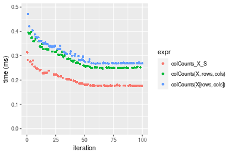

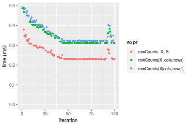
_Table: Benchmarking of colCounts_X_S() and rowCounts_X_S() on logical+1000x100 data (original and transposed).  The top panel shows times in milliseconds and the bottom panel shows relative times._


|   |expr          |     min|       lq|     mean|   median|      uq|     max|
|:--|:-------------|-------:|--------:|--------:|--------:|-------:|-------:|
|1  |colCounts_X_S | 174.652| 176.7380| 196.6855| 178.4280| 206.675| 313.552|
|2  |rowCounts_X_S | 227.613| 229.9645| 255.9270| 233.4035| 277.207| 378.908|


|   |expr          |      min|      lq|     mean|  median|      uq|      max|
|:--|:-------------|--------:|-------:|--------:|-------:|-------:|--------:|
|1  |colCounts_X_S | 1.000000| 1.00000| 1.000000| 1.00000| 1.00000| 1.000000|
|2  |rowCounts_X_S | 1.303237| 1.30116| 1.301199| 1.30811| 1.34127| 1.208438|

_Figure: Benchmarking of colCounts_X_S() and rowCounts_X_S() on logical+1000x100 data (original and transposed).  Outliers are displayed as crosses. Times are in milliseconds._


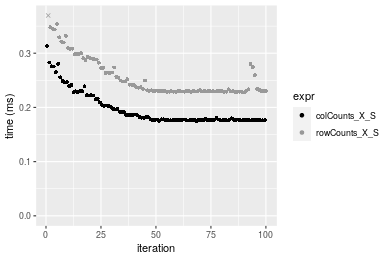


## Data type "integer"

### Data
```r
> rmatrix <- function(nrow, ncol, mode = c("logical", "double", "integer", "index"), range = c(-100, 
+     +100), na_prob = 0) {
+     mode <- match.arg(mode)
+     n <- nrow * ncol
+     if (mode == "logical") {
+         x <- sample(c(FALSE, TRUE), size = n, replace = TRUE)
+     }     else if (mode == "index") {
+         x <- seq_len(n)
+         mode <- "integer"
+     }     else {
+         x <- runif(n, min = range[1], max = range[2])
+     }
+     storage.mode(x) <- mode
+     if (na_prob > 0) 
+         x[sample(n, size = na_prob * n)] <- NA
+     dim(x) <- c(nrow, ncol)
+     x
+ }
> rmatrices <- function(scale = 10, seed = 1, ...) {
+     set.seed(seed)
+     data <- list()
+     data[[1]] <- rmatrix(nrow = scale * 1, ncol = scale * 1, ...)
+     data[[2]] <- rmatrix(nrow = scale * 10, ncol = scale * 10, ...)
+     data[[3]] <- rmatrix(nrow = scale * 100, ncol = scale * 1, ...)
+     data[[4]] <- t(data[[3]])
+     data[[5]] <- rmatrix(nrow = scale * 10, ncol = scale * 100, ...)
+     data[[6]] <- t(data[[5]])
+     names(data) <- sapply(data, FUN = function(x) paste(dim(x), collapse = "x"))
+     data
+ }
> data <- rmatrices(mode = mode)
```

### Results

#### 10x10 matrix


```r
> X <- data[["10x10"]]
> rows <- sample.int(nrow(X), size = nrow(X) * 0.7)
> cols <- sample.int(ncol(X), size = ncol(X) * 0.7)
> X_S <- X[rows, cols]
> value <- 42
```


```r
> colStats <- microbenchmark(colCounts_X_S = colCounts(X_S, value = value, na.rm = FALSE), `colCounts(X, rows, cols)` = colCounts(X, 
+     value = value, na.rm = FALSE, rows = rows, cols = cols), `colCounts(X[rows, cols])` = colCounts(X[rows, 
+     cols], value = value, na.rm = FALSE), unit = "ms")
```

```r
> X <- t(X)
> X_S <- t(X_S)
```


```r
> rowStats <- microbenchmark(rowCounts_X_S = rowCounts(X_S, value = value, na.rm = FALSE), `rowCounts(X, cols, rows)` = rowCounts(X, 
+     value = value, na.rm = FALSE, rows = cols, cols = rows), `rowCounts(X[cols, rows])` = rowCounts(X[cols, 
+     rows], value = value, na.rm = FALSE), unit = "ms")
```

_Table: Benchmarking of colCounts_X_S(), colCounts(X, rows, cols)() and colCounts(X[rows, cols])() on integer+10x10 data. The top panel shows times in milliseconds and the bottom panel shows relative times._


|   |expr                     |      min|       lq|      mean|    median|        uq|      max|
|:--|:------------------------|--------:|--------:|---------:|---------:|---------:|--------:|
|1  |colCounts_X_S            | 0.007466| 0.007702| 0.0084226| 0.0078335| 0.0079870| 0.042873|
|2  |colCounts(X, rows, cols) | 0.007940| 0.008220| 0.0083823| 0.0083385| 0.0084620| 0.010974|
|3  |colCounts(X[rows, cols]) | 0.008842| 0.009103| 0.0094297| 0.0092585| 0.0094845| 0.015070|


|   |expr                     |      min|       lq|     mean|   median|       uq|       max|
|:--|:------------------------|--------:|--------:|--------:|--------:|--------:|---------:|
|1  |colCounts_X_S            | 1.000000| 1.000000| 1.000000| 1.000000| 1.000000| 1.0000000|
|2  |colCounts(X, rows, cols) | 1.063488| 1.067255| 0.995220| 1.064467| 1.059472| 0.2559653|
|3  |colCounts(X[rows, cols]) | 1.184302| 1.181901| 1.119569| 1.181911| 1.187492| 0.3515033|

_Table: Benchmarking of rowCounts_X_S(), rowCounts(X, cols, rows)() and rowCounts(X[cols, rows])() on integer+10x10 data (transposed). The top panel shows times in milliseconds and the bottom panel shows relative times._


|   |expr                     |      min|       lq|      mean|    median|        uq|      max|
|:--|:------------------------|--------:|--------:|---------:|---------:|---------:|--------:|
|1  |rowCounts_X_S            | 0.006463| 0.006709| 0.0068552| 0.0068130| 0.0069225| 0.009716|
|2  |rowCounts(X, cols, rows) | 0.007112| 0.007269| 0.0077742| 0.0073560| 0.0074500| 0.038455|
|3  |rowCounts(X[cols, rows]) | 0.007529| 0.007919| 0.0081777| 0.0080895| 0.0082415| 0.010925|


|   |expr                     |      min|       lq|     mean|   median|       uq|      max|
|:--|:------------------------|--------:|--------:|--------:|--------:|--------:|--------:|
|1  |rowCounts_X_S            | 1.000000| 1.000000| 1.000000| 1.000000| 1.000000| 1.000000|
|2  |rowCounts(X, cols, rows) | 1.100418| 1.083470| 1.134059| 1.079701| 1.076201| 3.957905|
|3  |rowCounts(X[cols, rows]) | 1.164939| 1.180355| 1.192928| 1.187362| 1.190538| 1.124434|

_Figure: Benchmarking of colCounts_X_S(), colCounts(X, rows, cols)() and colCounts(X[rows, cols])() on integer+10x10 data  as well as rowCounts_X_S(), rowCounts(X, cols, rows)() and rowCounts(X[cols, rows])() on the same data transposed.  Outliers are displayed as crosses.  Times are in milliseconds._


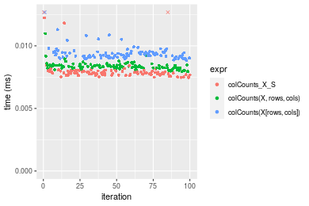

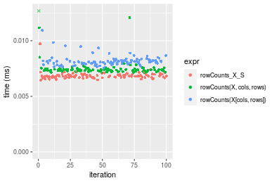
_Table: Benchmarking of colCounts_X_S() and rowCounts_X_S() on integer+10x10 data (original and transposed).  The top panel shows times in milliseconds and the bottom panel shows relative times._


|   |expr          |   min|    lq|    mean| median|     uq|    max|
|:--|:-------------|-----:|-----:|-------:|------:|------:|------:|
|2  |rowCounts_X_S | 6.463| 6.709| 6.85519| 6.8130| 6.9225|  9.716|
|1  |colCounts_X_S | 7.466| 7.702| 8.42260| 7.8335| 7.9870| 42.873|


|   |expr          |      min|      lq|     mean|   median|       uq|      max|
|:--|:-------------|--------:|-------:|--------:|--------:|--------:|--------:|
|2  |rowCounts_X_S | 1.000000| 1.00000| 1.000000| 1.000000| 1.000000| 1.000000|
|1  |colCounts_X_S | 1.155191| 1.14801| 1.228646| 1.149787| 1.153774| 4.412618|

_Figure: Benchmarking of colCounts_X_S() and rowCounts_X_S() on integer+10x10 data (original and transposed).  Outliers are displayed as crosses. Times are in milliseconds._


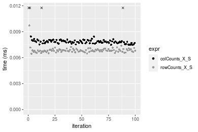

#### 100x100 matrix


```r
> X <- data[["100x100"]]
> rows <- sample.int(nrow(X), size = nrow(X) * 0.7)
> cols <- sample.int(ncol(X), size = ncol(X) * 0.7)
> X_S <- X[rows, cols]
> value <- 42
```


```r
> colStats <- microbenchmark(colCounts_X_S = colCounts(X_S, value = value, na.rm = FALSE), `colCounts(X, rows, cols)` = colCounts(X, 
+     value = value, na.rm = FALSE, rows = rows, cols = cols), `colCounts(X[rows, cols])` = colCounts(X[rows, 
+     cols], value = value, na.rm = FALSE), unit = "ms")
```

```r
> X <- t(X)
> X_S <- t(X_S)
```


```r
> rowStats <- microbenchmark(rowCounts_X_S = rowCounts(X_S, value = value, na.rm = FALSE), `rowCounts(X, cols, rows)` = rowCounts(X, 
+     value = value, na.rm = FALSE, rows = cols, cols = rows), `rowCounts(X[cols, rows])` = rowCounts(X[cols, 
+     rows], value = value, na.rm = FALSE), unit = "ms")
```

_Table: Benchmarking of colCounts_X_S(), colCounts(X, rows, cols)() and colCounts(X[rows, cols])() on integer+100x100 data. The top panel shows times in milliseconds and the bottom panel shows relative times._


|   |expr                     |      min|        lq|      mean|    median|        uq|      max|
|:--|:------------------------|--------:|---------:|---------:|---------:|---------:|--------:|
|1  |colCounts_X_S            | 0.012661| 0.0130800| 0.0138868| 0.0134995| 0.0137825| 0.032512|
|2  |colCounts(X, rows, cols) | 0.018851| 0.0198125| 0.0203811| 0.0203450| 0.0206110| 0.027428|
|3  |colCounts(X[rows, cols]) | 0.023040| 0.0240485| 0.0255121| 0.0249055| 0.0252955| 0.069965|


|   |expr                     |      min|       lq|     mean|   median|       uq|      max|
|:--|:------------------------|--------:|--------:|--------:|--------:|--------:|--------:|
|1  |colCounts_X_S            | 1.000000| 1.000000| 1.000000| 1.000000| 1.000000| 1.000000|
|2  |colCounts(X, rows, cols) | 1.488903| 1.514717| 1.467655| 1.507093| 1.495447| 0.843627|
|3  |colCounts(X[rows, cols]) | 1.819762| 1.838570| 1.837148| 1.844920| 1.835335| 2.151975|

_Table: Benchmarking of rowCounts_X_S(), rowCounts(X, cols, rows)() and rowCounts(X[cols, rows])() on integer+100x100 data (transposed). The top panel shows times in milliseconds and the bottom panel shows relative times._


|   |expr                     |      min|        lq|      mean|    median|        uq|      max|
|:--|:------------------------|--------:|---------:|---------:|---------:|---------:|--------:|
|1  |rowCounts_X_S            | 0.016486| 0.0174160| 0.0178569| 0.0178955| 0.0182410| 0.024824|
|2  |rowCounts(X, cols, rows) | 0.024035| 0.0251655| 0.0262501| 0.0258995| 0.0262725| 0.064513|
|3  |rowCounts(X[cols, rows]) | 0.027108| 0.0285525| 0.0294320| 0.0295795| 0.0300955| 0.044698|


|   |expr                     |      min|       lq|     mean|   median|       uq|      max|
|:--|:------------------------|--------:|--------:|--------:|--------:|--------:|--------:|
|1  |rowCounts_X_S            | 1.000000| 1.000000| 1.000000| 1.000000| 1.000000| 1.000000|
|2  |rowCounts(X, cols, rows) | 1.457904| 1.444964| 1.470020| 1.447263| 1.440299| 2.598816|
|3  |rowCounts(X[cols, rows]) | 1.644304| 1.639441| 1.648208| 1.652902| 1.649882| 1.800596|

_Figure: Benchmarking of colCounts_X_S(), colCounts(X, rows, cols)() and colCounts(X[rows, cols])() on integer+100x100 data  as well as rowCounts_X_S(), rowCounts(X, cols, rows)() and rowCounts(X[cols, rows])() on the same data transposed.  Outliers are displayed as crosses.  Times are in milliseconds._


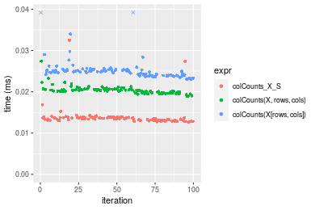

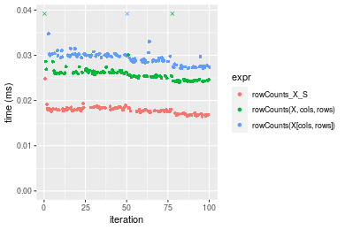
_Table: Benchmarking of colCounts_X_S() and rowCounts_X_S() on integer+100x100 data (original and transposed).  The top panel shows times in milliseconds and the bottom panel shows relative times._


|   |expr          |    min|     lq|     mean|  median|      uq|    max|
|:--|:-------------|------:|------:|--------:|-------:|-------:|------:|
|1  |colCounts_X_S | 12.661| 13.080| 13.88682| 13.4995| 13.7825| 32.512|
|2  |rowCounts_X_S | 16.486| 17.416| 17.85694| 17.8955| 18.2410| 24.824|


|   |expr          |      min|       lq|     mean|   median|      uq|       max|
|:--|:-------------|--------:|--------:|--------:|--------:|-------:|---------:|
|1  |colCounts_X_S | 1.000000| 1.000000| 1.000000| 1.000000| 1.00000| 1.0000000|
|2  |rowCounts_X_S | 1.302109| 1.331498| 1.285891| 1.325642| 1.32349| 0.7635335|

_Figure: Benchmarking of colCounts_X_S() and rowCounts_X_S() on integer+100x100 data (original and transposed).  Outliers are displayed as crosses. Times are in milliseconds._


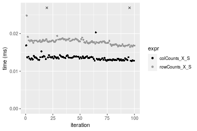

#### 1000x10 matrix


```r
> X <- data[["1000x10"]]
> rows <- sample.int(nrow(X), size = nrow(X) * 0.7)
> cols <- sample.int(ncol(X), size = ncol(X) * 0.7)
> X_S <- X[rows, cols]
> value <- 42
```


```r
> colStats <- microbenchmark(colCounts_X_S = colCounts(X_S, value = value, na.rm = FALSE), `colCounts(X, rows, cols)` = colCounts(X, 
+     value = value, na.rm = FALSE, rows = rows, cols = cols), `colCounts(X[rows, cols])` = colCounts(X[rows, 
+     cols], value = value, na.rm = FALSE), unit = "ms")
```

```r
> X <- t(X)
> X_S <- t(X_S)
```


```r
> rowStats <- microbenchmark(rowCounts_X_S = rowCounts(X_S, value = value, na.rm = FALSE), `rowCounts(X, cols, rows)` = rowCounts(X, 
+     value = value, na.rm = FALSE, rows = cols, cols = rows), `rowCounts(X[cols, rows])` = rowCounts(X[cols, 
+     rows], value = value, na.rm = FALSE), unit = "ms")
```

_Table: Benchmarking of colCounts_X_S(), colCounts(X, rows, cols)() and colCounts(X[rows, cols])() on integer+1000x10 data. The top panel shows times in milliseconds and the bottom panel shows relative times._


|   |expr                     |      min|        lq|      mean|    median|        uq|      max|
|:--|:------------------------|--------:|---------:|---------:|---------:|---------:|--------:|
|1  |colCounts_X_S            | 0.011278| 0.0122155| 0.0126060| 0.0124365| 0.0127340| 0.026134|
|2  |colCounts(X, rows, cols) | 0.017967| 0.0188555| 0.0194898| 0.0192665| 0.0196965| 0.034105|
|3  |colCounts(X[rows, cols]) | 0.022500| 0.0236100| 0.0248664| 0.0243495| 0.0250565| 0.077143|


|   |expr                     |      min|       lq|     mean|   median|       uq|      max|
|:--|:------------------------|--------:|--------:|--------:|--------:|--------:|--------:|
|1  |colCounts_X_S            | 1.000000| 1.000000| 1.000000| 1.000000| 1.000000| 1.000000|
|2  |colCounts(X, rows, cols) | 1.593102| 1.543572| 1.546083| 1.549190| 1.546765| 1.305005|
|3  |colCounts(X[rows, cols]) | 1.995035| 1.932790| 1.972592| 1.957906| 1.967685| 2.951825|

_Table: Benchmarking of rowCounts_X_S(), rowCounts(X, cols, rows)() and rowCounts(X[cols, rows])() on integer+1000x10 data (transposed). The top panel shows times in milliseconds and the bottom panel shows relative times._


|   |expr                     |      min|        lq|      mean|    median|        uq|      max|
|:--|:------------------------|--------:|---------:|---------:|---------:|---------:|--------:|
|1  |rowCounts_X_S            | 0.015160| 0.0161265| 0.0167124| 0.0164910| 0.0172035| 0.022069|
|2  |rowCounts(X, cols, rows) | 0.025137| 0.0265560| 0.0275541| 0.0274985| 0.0279350| 0.041894|
|3  |rowCounts(X[cols, rows]) | 0.028360| 0.0297965| 0.0314943| 0.0306330| 0.0317230| 0.075696|


|   |expr                     |      min|       lq|     mean|   median|       uq|      max|
|:--|:------------------------|--------:|--------:|--------:|--------:|--------:|--------:|
|1  |rowCounts_X_S            | 1.000000| 1.000000| 1.000000| 1.000000| 1.000000| 1.000000|
|2  |rowCounts(X, cols, rows) | 1.658114| 1.646731| 1.648721| 1.667485| 1.623798| 1.898319|
|3  |rowCounts(X[cols, rows]) | 1.870712| 1.847673| 1.884490| 1.857559| 1.843985| 3.429970|

_Figure: Benchmarking of colCounts_X_S(), colCounts(X, rows, cols)() and colCounts(X[rows, cols])() on integer+1000x10 data  as well as rowCounts_X_S(), rowCounts(X, cols, rows)() and rowCounts(X[cols, rows])() on the same data transposed.  Outliers are displayed as crosses.  Times are in milliseconds._


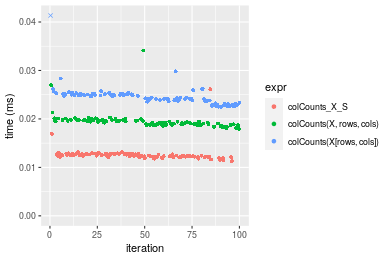

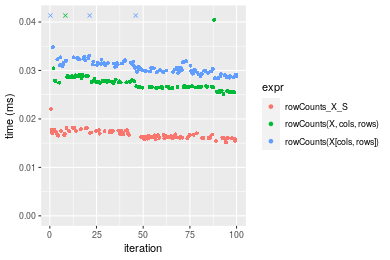
_Table: Benchmarking of colCounts_X_S() and rowCounts_X_S() on integer+1000x10 data (original and transposed).  The top panel shows times in milliseconds and the bottom panel shows relative times._


|   |expr          |    min|      lq|     mean|  median|      uq|    max|
|:--|:-------------|------:|-------:|--------:|-------:|-------:|------:|
|1  |colCounts_X_S | 11.278| 12.2155| 12.60595| 12.4365| 12.7340| 26.134|
|2  |rowCounts_X_S | 15.160| 16.1265| 16.71240| 16.4910| 17.2035| 22.069|


|   |expr          |     min|       lq|     mean|   median|      uq|       max|
|:--|:-------------|-------:|--------:|--------:|--------:|-------:|---------:|
|1  |colCounts_X_S | 1.00000| 1.000000| 1.000000| 1.000000| 1.00000| 1.0000000|
|2  |rowCounts_X_S | 1.34421| 1.320167| 1.325755| 1.326016| 1.35099| 0.8444555|

_Figure: Benchmarking of colCounts_X_S() and rowCounts_X_S() on integer+1000x10 data (original and transposed).  Outliers are displayed as crosses. Times are in milliseconds._


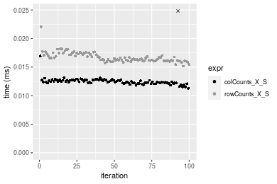

#### 10x1000 matrix


```r
> X <- data[["10x1000"]]
> rows <- sample.int(nrow(X), size = nrow(X) * 0.7)
> cols <- sample.int(ncol(X), size = ncol(X) * 0.7)
> X_S <- X[rows, cols]
> value <- 42
```


```r
> colStats <- microbenchmark(colCounts_X_S = colCounts(X_S, value = value, na.rm = FALSE), `colCounts(X, rows, cols)` = colCounts(X, 
+     value = value, na.rm = FALSE, rows = rows, cols = cols), `colCounts(X[rows, cols])` = colCounts(X[rows, 
+     cols], value = value, na.rm = FALSE), unit = "ms")
```

```r
> X <- t(X)
> X_S <- t(X_S)
```


```r
> rowStats <- microbenchmark(rowCounts_X_S = rowCounts(X_S, value = value, na.rm = FALSE), `rowCounts(X, cols, rows)` = rowCounts(X, 
+     value = value, na.rm = FALSE, rows = cols, cols = rows), `rowCounts(X[cols, rows])` = rowCounts(X[cols, 
+     rows], value = value, na.rm = FALSE), unit = "ms")
```

_Table: Benchmarking of colCounts_X_S(), colCounts(X, rows, cols)() and colCounts(X[rows, cols])() on integer+10x1000 data. The top panel shows times in milliseconds and the bottom panel shows relative times._


|   |expr                     |      min|        lq|      mean|    median|        uq|      max|
|:--|:------------------------|--------:|---------:|---------:|---------:|---------:|--------:|
|1  |colCounts_X_S            | 0.015436| 0.0163315| 0.0173223| 0.0168100| 0.0172775| 0.053800|
|2  |colCounts(X, rows, cols) | 0.023476| 0.0242515| 0.0251100| 0.0248595| 0.0254975| 0.040264|
|3  |colCounts(X[rows, cols]) | 0.028581| 0.0302040| 0.0312191| 0.0309900| 0.0319840| 0.046993|


|   |expr                     |      min|       lq|     mean|   median|       uq|       max|
|:--|:------------------------|--------:|--------:|--------:|--------:|--------:|---------:|
|1  |colCounts_X_S            | 1.000000| 1.000000| 1.000000| 1.000000| 1.000000| 1.0000000|
|2  |colCounts(X, rows, cols) | 1.520860| 1.484952| 1.449577| 1.478852| 1.475763| 0.7484015|
|3  |colCounts(X[rows, cols]) | 1.851581| 1.849432| 1.802251| 1.843546| 1.851194| 0.8734758|

_Table: Benchmarking of rowCounts_X_S(), rowCounts(X, cols, rows)() and rowCounts(X[cols, rows])() on integer+10x1000 data (transposed). The top panel shows times in milliseconds and the bottom panel shows relative times._


|   |expr                     |      min|        lq|      mean|    median|       uq|      max|
|:--|:------------------------|--------:|---------:|---------:|---------:|--------:|--------:|
|1  |rowCounts_X_S            | 0.016422| 0.0174680| 0.0181394| 0.0180090| 0.018663| 0.025631|
|2  |rowCounts(X, cols, rows) | 0.025540| 0.0267775| 0.0281916| 0.0277105| 0.028791| 0.066388|
|3  |rowCounts(X[cols, rows]) | 0.027353| 0.0291415| 0.0309360| 0.0308310| 0.031697| 0.045214|


|   |expr                     |      min|       lq|     mean|   median|       uq|      max|
|:--|:------------------------|--------:|--------:|--------:|--------:|--------:|--------:|
|1  |rowCounts_X_S            | 1.000000| 1.000000| 1.000000| 1.000000| 1.000000| 1.000000|
|2  |rowCounts(X, cols, rows) | 1.555231| 1.532946| 1.554160| 1.538703| 1.542678| 2.590145|
|3  |rowCounts(X[cols, rows]) | 1.665631| 1.668279| 1.705455| 1.711977| 1.698387| 1.764036|

_Figure: Benchmarking of colCounts_X_S(), colCounts(X, rows, cols)() and colCounts(X[rows, cols])() on integer+10x1000 data  as well as rowCounts_X_S(), rowCounts(X, cols, rows)() and rowCounts(X[cols, rows])() on the same data transposed.  Outliers are displayed as crosses.  Times are in milliseconds._


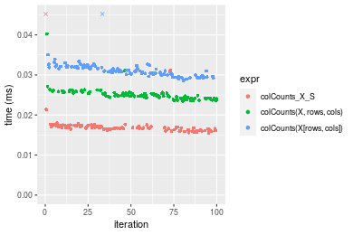

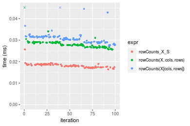
_Table: Benchmarking of colCounts_X_S() and rowCounts_X_S() on integer+10x1000 data (original and transposed).  The top panel shows times in milliseconds and the bottom panel shows relative times._


|   |expr          |    min|      lq|     mean| median|      uq|    max|
|:--|:-------------|------:|-------:|--------:|------:|-------:|------:|
|1  |colCounts_X_S | 15.436| 16.3315| 17.32228| 16.810| 17.2775| 53.800|
|2  |rowCounts_X_S | 16.422| 17.4680| 18.13944| 18.009| 18.6630| 25.631|


|   |expr          |      min|       lq|     mean|   median|       uq|       max|
|:--|:-------------|--------:|--------:|--------:|--------:|--------:|---------:|
|1  |colCounts_X_S | 1.000000| 1.000000| 1.000000| 1.000000| 1.000000| 1.0000000|
|2  |rowCounts_X_S | 1.063877| 1.069589| 1.047174| 1.071327| 1.080191| 0.4764126|

_Figure: Benchmarking of colCounts_X_S() and rowCounts_X_S() on integer+10x1000 data (original and transposed).  Outliers are displayed as crosses. Times are in milliseconds._


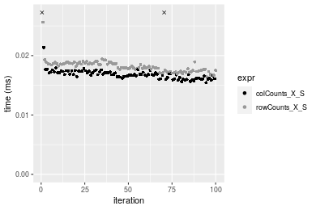

#### 100x1000 matrix


```r
> X <- data[["100x1000"]]
> rows <- sample.int(nrow(X), size = nrow(X) * 0.7)
> cols <- sample.int(ncol(X), size = ncol(X) * 0.7)
> X_S <- X[rows, cols]
> value <- 42
```


```r
> colStats <- microbenchmark(colCounts_X_S = colCounts(X_S, value = value, na.rm = FALSE), `colCounts(X, rows, cols)` = colCounts(X, 
+     value = value, na.rm = FALSE, rows = rows, cols = cols), `colCounts(X[rows, cols])` = colCounts(X[rows, 
+     cols], value = value, na.rm = FALSE), unit = "ms")
```

```r
> X <- t(X)
> X_S <- t(X_S)
```


```r
> rowStats <- microbenchmark(rowCounts_X_S = rowCounts(X_S, value = value, na.rm = FALSE), `rowCounts(X, cols, rows)` = rowCounts(X, 
+     value = value, na.rm = FALSE, rows = cols, cols = rows), `rowCounts(X[cols, rows])` = rowCounts(X[cols, 
+     rows], value = value, na.rm = FALSE), unit = "ms")
```

_Table: Benchmarking of colCounts_X_S(), colCounts(X, rows, cols)() and colCounts(X[rows, cols])() on integer+100x1000 data. The top panel shows times in milliseconds and the bottom panel shows relative times._


|   |expr                     |      min|        lq|      mean|    median|        uq|      max|
|:--|:------------------------|--------:|---------:|---------:|---------:|---------:|--------:|
|1  |colCounts_X_S            | 0.045507| 0.0486665| 0.0549639| 0.0526160| 0.0587020| 0.105918|
|2  |colCounts(X, rows, cols) | 0.098000| 0.1046850| 0.1175442| 0.1106235| 0.1260420| 0.198015|
|3  |colCounts(X[rows, cols]) | 0.126841| 0.1361440| 0.1533836| 0.1479720| 0.1635475| 0.236172|


|   |expr                     |      min|       lq|     mean|   median|       uq|      max|
|:--|:------------------------|--------:|--------:|--------:|--------:|--------:|--------:|
|1  |colCounts_X_S            | 1.000000| 1.000000| 1.000000| 1.000000| 1.000000| 1.000000|
|2  |colCounts(X, rows, cols) | 2.153515| 2.151069| 2.138572| 2.102469| 2.147150| 1.869512|
|3  |colCounts(X[rows, cols]) | 2.787285| 2.797489| 2.790625| 2.812300| 2.786064| 2.229763|

_Table: Benchmarking of rowCounts_X_S(), rowCounts(X, cols, rows)() and rowCounts(X[cols, rows])() on integer+100x1000 data (transposed). The top panel shows times in milliseconds and the bottom panel shows relative times._


|   |expr                     |      min|        lq|      mean|    median|        uq|      max|
|:--|:------------------------|--------:|---------:|---------:|---------:|---------:|--------:|
|1  |rowCounts_X_S            | 0.077277| 0.0883345| 0.1007086| 0.0939610| 0.1068320| 0.164704|
|2  |rowCounts(X, cols, rows) | 0.133828| 0.1459555| 0.1622442| 0.1600575| 0.1777215| 0.257510|
|3  |rowCounts(X[cols, rows]) | 0.145517| 0.1639470| 0.1801810| 0.1749085| 0.1909790| 0.294616|


|   |expr                     |      min|       lq|     mean|   median|       uq|      max|
|:--|:------------------------|--------:|--------:|--------:|--------:|--------:|--------:|
|1  |rowCounts_X_S            | 1.000000| 1.000000| 1.000000| 1.000000| 1.000000| 1.000000|
|2  |rowCounts(X, cols, rows) | 1.731796| 1.652305| 1.611026| 1.703446| 1.663560| 1.563471|
|3  |rowCounts(X[cols, rows]) | 1.883057| 1.855979| 1.789132| 1.861501| 1.787657| 1.788760|

_Figure: Benchmarking of colCounts_X_S(), colCounts(X, rows, cols)() and colCounts(X[rows, cols])() on integer+100x1000 data  as well as rowCounts_X_S(), rowCounts(X, cols, rows)() and rowCounts(X[cols, rows])() on the same data transposed.  Outliers are displayed as crosses.  Times are in milliseconds._


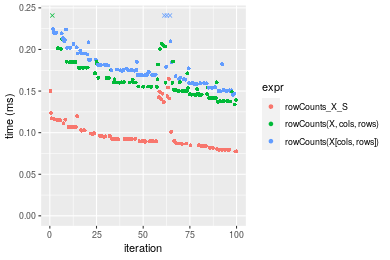
_Table: Benchmarking of colCounts_X_S() and rowCounts_X_S() on integer+100x1000 data (original and transposed).  The top panel shows times in milliseconds and the bottom panel shows relative times._


|   |expr          |    min|      lq|      mean| median|      uq|     max|
|:--|:-------------|------:|-------:|---------:|------:|-------:|-------:|
|1  |colCounts_X_S | 45.507| 48.6665|  54.96388| 52.616|  58.702| 105.918|
|2  |rowCounts_X_S | 77.277| 88.3345| 100.70860| 93.961| 106.832| 164.704|


|   |expr          |      min|       lq|     mean|   median|       uq|      max|
|:--|:-------------|--------:|--------:|--------:|--------:|--------:|--------:|
|1  |colCounts_X_S | 1.000000| 1.000000| 1.000000| 1.000000| 1.000000| 1.000000|
|2  |rowCounts_X_S | 1.698134| 1.815099| 1.832269| 1.785788| 1.819904| 1.555014|

_Figure: Benchmarking of colCounts_X_S() and rowCounts_X_S() on integer+100x1000 data (original and transposed).  Outliers are displayed as crosses. Times are in milliseconds._


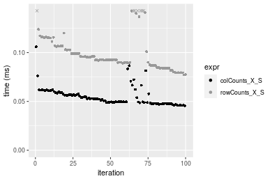

#### 1000x100 matrix


```r
> X <- data[["1000x100"]]
> rows <- sample.int(nrow(X), size = nrow(X) * 0.7)
> cols <- sample.int(ncol(X), size = ncol(X) * 0.7)
> X_S <- X[rows, cols]
> value <- 42
```


```r
> colStats <- microbenchmark(colCounts_X_S = colCounts(X_S, value = value, na.rm = FALSE), `colCounts(X, rows, cols)` = colCounts(X, 
+     value = value, na.rm = FALSE, rows = rows, cols = cols), `colCounts(X[rows, cols])` = colCounts(X[rows, 
+     cols], value = value, na.rm = FALSE), unit = "ms")
```

```r
> X <- t(X)
> X_S <- t(X_S)
```


```r
> rowStats <- microbenchmark(rowCounts_X_S = rowCounts(X_S, value = value, na.rm = FALSE), `rowCounts(X, cols, rows)` = rowCounts(X, 
+     value = value, na.rm = FALSE, rows = cols, cols = rows), `rowCounts(X[cols, rows])` = rowCounts(X[cols, 
+     rows], value = value, na.rm = FALSE), unit = "ms")
```

_Table: Benchmarking of colCounts_X_S(), colCounts(X, rows, cols)() and colCounts(X[rows, cols])() on integer+1000x100 data. The top panel shows times in milliseconds and the bottom panel shows relative times._


|   |expr                     |      min|        lq|      mean|    median|        uq|      max|
|:--|:------------------------|--------:|---------:|---------:|---------:|---------:|--------:|
|1  |colCounts_X_S            | 0.043559| 0.0459785| 0.0495816| 0.0468760| 0.0525660| 0.100357|
|2  |colCounts(X, rows, cols) | 0.087749| 0.0931730| 0.0999669| 0.0965565| 0.1058785| 0.131020|
|3  |colCounts(X[rows, cols]) | 0.121515| 0.1263855| 0.1391930| 0.1343105| 0.1493255| 0.222149|


|   |expr                     |      min|       lq|     mean|   median|       uq|      max|
|:--|:------------------------|--------:|--------:|--------:|--------:|--------:|--------:|
|1  |colCounts_X_S            | 1.000000| 1.000000| 1.000000| 1.000000| 1.000000| 1.000000|
|2  |colCounts(X, rows, cols) | 2.014486| 2.026447| 2.016209| 2.059828| 2.014201| 1.305539|
|3  |colCounts(X[rows, cols]) | 2.789665| 2.748796| 2.807352| 2.865229| 2.840724| 2.213588|

_Table: Benchmarking of rowCounts_X_S(), rowCounts(X, cols, rows)() and rowCounts(X[cols, rows])() on integer+1000x100 data (transposed). The top panel shows times in milliseconds and the bottom panel shows relative times._


|   |expr                     |      min|        lq|      mean|    median|        uq|      max|
|:--|:------------------------|--------:|---------:|---------:|---------:|---------:|--------:|
|1  |rowCounts_X_S            | 0.079001| 0.0866700| 0.0953945| 0.0950315| 0.1017730| 0.124404|
|2  |rowCounts(X, cols, rows) | 0.131284| 0.1475505| 0.1603624| 0.1570365| 0.1677385| 0.279323|
|3  |rowCounts(X[cols, rows]) | 0.150101| 0.1642465| 0.1813776| 0.1793795| 0.1918345| 0.238025|


|   |expr                     |      min|       lq|     mean|   median|       uq|      max|
|:--|:------------------------|--------:|--------:|--------:|--------:|--------:|--------:|
|1  |rowCounts_X_S            | 1.000000| 1.000000| 1.000000| 1.000000| 1.000000| 1.000000|
|2  |rowCounts(X, cols, rows) | 1.661802| 1.702440| 1.681045| 1.652468| 1.648163| 2.245290|
|3  |rowCounts(X[cols, rows]) | 1.899989| 1.895079| 1.901342| 1.887579| 1.884925| 1.913323|

_Figure: Benchmarking of colCounts_X_S(), colCounts(X, rows, cols)() and colCounts(X[rows, cols])() on integer+1000x100 data  as well as rowCounts_X_S(), rowCounts(X, cols, rows)() and rowCounts(X[cols, rows])() on the same data transposed.  Outliers are displayed as crosses.  Times are in milliseconds._


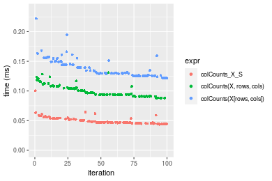

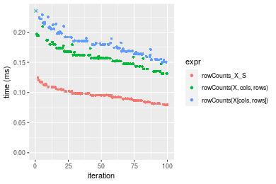
_Table: Benchmarking of colCounts_X_S() and rowCounts_X_S() on integer+1000x100 data (original and transposed).  The top panel shows times in milliseconds and the bottom panel shows relative times._


|   |expr          |    min|      lq|     mean|  median|      uq|     max|
|:--|:-------------|------:|-------:|--------:|-------:|-------:|-------:|
|1  |colCounts_X_S | 43.559| 45.9785| 49.58161| 46.8760|  52.566| 100.357|
|2  |rowCounts_X_S | 79.001| 86.6700| 95.39451| 95.0315| 101.773| 124.404|


|   |expr          |      min|       lq|    mean|   median|       uq|      max|
|:--|:-------------|--------:|--------:|-------:|--------:|--------:|--------:|
|1  |colCounts_X_S | 1.000000| 1.000000| 1.00000| 1.000000| 1.000000| 1.000000|
|2  |rowCounts_X_S | 1.813655| 1.885012| 1.92399| 2.027295| 1.936099| 1.239615|

_Figure: Benchmarking of colCounts_X_S() and rowCounts_X_S() on integer+1000x100 data (original and transposed).  Outliers are displayed as crosses. Times are in milliseconds._


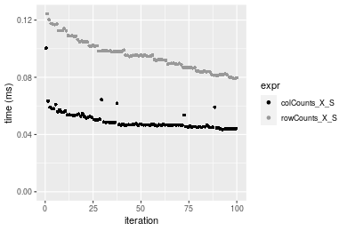


## Data type "double"

### Data
```r
> rmatrix <- function(nrow, ncol, mode = c("logical", "double", "integer", "index"), range = c(-100, 
+     +100), na_prob = 0) {
+     mode <- match.arg(mode)
+     n <- nrow * ncol
+     if (mode == "logical") {
+         x <- sample(c(FALSE, TRUE), size = n, replace = TRUE)
+     }     else if (mode == "index") {
+         x <- seq_len(n)
+         mode <- "integer"
+     }     else {
+         x <- runif(n, min = range[1], max = range[2])
+     }
+     storage.mode(x) <- mode
+     if (na_prob > 0) 
+         x[sample(n, size = na_prob * n)] <- NA
+     dim(x) <- c(nrow, ncol)
+     x
+ }
> rmatrices <- function(scale = 10, seed = 1, ...) {
+     set.seed(seed)
+     data <- list()
+     data[[1]] <- rmatrix(nrow = scale * 1, ncol = scale * 1, ...)
+     data[[2]] <- rmatrix(nrow = scale * 10, ncol = scale * 10, ...)
+     data[[3]] <- rmatrix(nrow = scale * 100, ncol = scale * 1, ...)
+     data[[4]] <- t(data[[3]])
+     data[[5]] <- rmatrix(nrow = scale * 10, ncol = scale * 100, ...)
+     data[[6]] <- t(data[[5]])
+     names(data) <- sapply(data, FUN = function(x) paste(dim(x), collapse = "x"))
+     data
+ }
> data <- rmatrices(mode = mode)
```

### Results

#### 10x10 matrix


```r
> X <- data[["10x10"]]
> rows <- sample.int(nrow(X), size = nrow(X) * 0.7)
> cols <- sample.int(ncol(X), size = ncol(X) * 0.7)
> X_S <- X[rows, cols]
> value <- 42
```


```r
> colStats <- microbenchmark(colCounts_X_S = colCounts(X_S, value = value, na.rm = FALSE), `colCounts(X, rows, cols)` = colCounts(X, 
+     value = value, na.rm = FALSE, rows = rows, cols = cols), `colCounts(X[rows, cols])` = colCounts(X[rows, 
+     cols], value = value, na.rm = FALSE), unit = "ms")
```

```r
> X <- t(X)
> X_S <- t(X_S)
```


```r
> rowStats <- microbenchmark(rowCounts_X_S = rowCounts(X_S, value = value, na.rm = FALSE), `rowCounts(X, cols, rows)` = rowCounts(X, 
+     value = value, na.rm = FALSE, rows = cols, cols = rows), `rowCounts(X[cols, rows])` = rowCounts(X[cols, 
+     rows], value = value, na.rm = FALSE), unit = "ms")
```

_Table: Benchmarking of colCounts_X_S(), colCounts(X, rows, cols)() and colCounts(X[rows, cols])() on double+10x10 data. The top panel shows times in milliseconds and the bottom panel shows relative times._


|   |expr                     |      min|        lq|      mean|   median|        uq|      max|
|:--|:------------------------|--------:|---------:|---------:|--------:|---------:|--------:|
|1  |colCounts_X_S            | 0.007398| 0.0076360| 0.0081628| 0.007785| 0.0078875| 0.040827|
|2  |colCounts(X, rows, cols) | 0.007770| 0.0080705| 0.0082542| 0.008182| 0.0082745| 0.013299|
|3  |colCounts(X[rows, cols]) | 0.008646| 0.0090075| 0.0092529| 0.009143| 0.0093120| 0.015016|


|   |expr                     |      min|       lq|     mean|   median|       uq|       max|
|:--|:------------------------|--------:|--------:|--------:|--------:|--------:|---------:|
|1  |colCounts_X_S            | 1.000000| 1.000000| 1.000000| 1.000000| 1.000000| 1.0000000|
|2  |colCounts(X, rows, cols) | 1.050284| 1.056901| 1.011185| 1.050995| 1.049065| 0.3257403|
|3  |colCounts(X[rows, cols]) | 1.168694| 1.179610| 1.133539| 1.174438| 1.180602| 0.3677958|

_Table: Benchmarking of rowCounts_X_S(), rowCounts(X, cols, rows)() and rowCounts(X[cols, rows])() on double+10x10 data (transposed). The top panel shows times in milliseconds and the bottom panel shows relative times._


|   |expr                     |      min|        lq|      mean|    median|        uq|      max|
|:--|:------------------------|--------:|---------:|---------:|---------:|---------:|--------:|
|1  |rowCounts_X_S            | 0.006335| 0.0065385| 0.0067025| 0.0066400| 0.0067775| 0.009558|
|2  |rowCounts(X, cols, rows) | 0.006791| 0.0070275| 0.0075093| 0.0071125| 0.0072565| 0.038514|
|3  |rowCounts(X[cols, rows]) | 0.007636| 0.0079135| 0.0081603| 0.0080470| 0.0082070| 0.014212|


|   |expr                     |      min|       lq|     mean|   median|       uq|      max|
|:--|:------------------------|--------:|--------:|--------:|--------:|--------:|--------:|
|1  |rowCounts_X_S            | 1.000000| 1.000000| 1.000000| 1.000000| 1.000000| 1.000000|
|2  |rowCounts(X, cols, rows) | 1.071981| 1.074788| 1.120371| 1.071160| 1.070675| 4.029504|
|3  |rowCounts(X[cols, rows]) | 1.205367| 1.210293| 1.217484| 1.211898| 1.210919| 1.486922|

_Figure: Benchmarking of colCounts_X_S(), colCounts(X, rows, cols)() and colCounts(X[rows, cols])() on double+10x10 data  as well as rowCounts_X_S(), rowCounts(X, cols, rows)() and rowCounts(X[cols, rows])() on the same data transposed.  Outliers are displayed as crosses.  Times are in milliseconds._


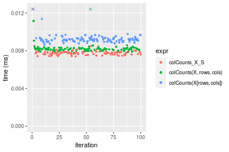

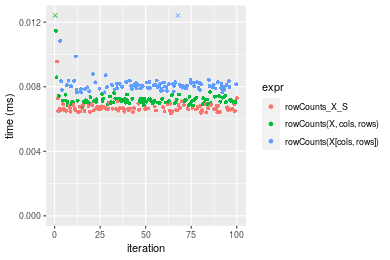
_Table: Benchmarking of colCounts_X_S() and rowCounts_X_S() on double+10x10 data (original and transposed).  The top panel shows times in milliseconds and the bottom panel shows relative times._


|   |expr          |   min|     lq|    mean| median|     uq|    max|
|:--|:-------------|-----:|------:|-------:|------:|------:|------:|
|2  |rowCounts_X_S | 6.335| 6.5385| 6.70255|  6.640| 6.7775|  9.558|
|1  |colCounts_X_S | 7.398| 7.6360| 8.16285|  7.785| 7.8875| 40.827|


|   |expr          |      min|       lq|     mean|  median|       uq|    max|
|:--|:-------------|--------:|--------:|--------:|-------:|--------:|------:|
|2  |rowCounts_X_S | 1.000000| 1.000000| 1.000000| 1.00000| 1.000000| 1.0000|
|1  |colCounts_X_S | 1.167798| 1.167852| 1.217872| 1.17244| 1.163777| 4.2715|

_Figure: Benchmarking of colCounts_X_S() and rowCounts_X_S() on double+10x10 data (original and transposed).  Outliers are displayed as crosses. Times are in milliseconds._


#### 100x100 matrix


```r
> X <- data[["100x100"]]
> rows <- sample.int(nrow(X), size = nrow(X) * 0.7)
> cols <- sample.int(ncol(X), size = ncol(X) * 0.7)
> X_S <- X[rows, cols]
> value <- 42
```


```r
> colStats <- microbenchmark(colCounts_X_S = colCounts(X_S, value = value, na.rm = FALSE), `colCounts(X, rows, cols)` = colCounts(X, 
+     value = value, na.rm = FALSE, rows = rows, cols = cols), `colCounts(X[rows, cols])` = colCounts(X[rows, 
+     cols], value = value, na.rm = FALSE), unit = "ms")
```

```r
> X <- t(X)
> X_S <- t(X_S)
```


```r
> rowStats <- microbenchmark(rowCounts_X_S = rowCounts(X_S, value = value, na.rm = FALSE), `rowCounts(X, cols, rows)` = rowCounts(X, 
+     value = value, na.rm = FALSE, rows = cols, cols = rows), `rowCounts(X[cols, rows])` = rowCounts(X[cols, 
+     rows], value = value, na.rm = FALSE), unit = "ms")
```

_Table: Benchmarking of colCounts_X_S(), colCounts(X, rows, cols)() and colCounts(X[rows, cols])() on double+100x100 data. The top panel shows times in milliseconds and the bottom panel shows relative times._


|   |expr                     |      min|        lq|      mean|   median|        uq|      max|
|:--|:------------------------|--------:|---------:|---------:|--------:|---------:|--------:|
|1  |colCounts_X_S            | 0.014460| 0.0151165| 0.0156190| 0.015542| 0.0160200| 0.019013|
|2  |colCounts(X, rows, cols) | 0.020106| 0.0206645| 0.0216888| 0.021518| 0.0219600| 0.036067|
|3  |colCounts(X[rows, cols]) | 0.029547| 0.0302805| 0.0319905| 0.031338| 0.0321575| 0.077077|


|   |expr                     |      min|       lq|     mean|   median|       uq|      max|
|:--|:------------------------|--------:|--------:|--------:|--------:|--------:|--------:|
|1  |colCounts_X_S            | 1.000000| 1.000000| 1.000000| 1.000000| 1.000000| 1.000000|
|2  |colCounts(X, rows, cols) | 1.390456| 1.367016| 1.388616| 1.384507| 1.370786| 1.896965|
|3  |colCounts(X[rows, cols]) | 2.043361| 2.003142| 2.048177| 2.016343| 2.007335| 4.053910|

_Table: Benchmarking of rowCounts_X_S(), rowCounts(X, cols, rows)() and rowCounts(X[cols, rows])() on double+100x100 data (transposed). The top panel shows times in milliseconds and the bottom panel shows relative times._


|   |expr                     |      min|        lq|      mean|    median|       uq|      max|
|:--|:------------------------|--------:|---------:|---------:|---------:|--------:|--------:|
|1  |rowCounts_X_S            | 0.013996| 0.0148805| 0.0152335| 0.0151990| 0.015531| 0.021980|
|2  |rowCounts(X, cols, rows) | 0.018697| 0.0195795| 0.0204572| 0.0201175| 0.020483| 0.061150|
|3  |rowCounts(X[cols, rows]) | 0.029133| 0.0305695| 0.0315665| 0.0314765| 0.031835| 0.045556|


|   |expr                     |      min|       lq|     mean|   median|       uq|      max|
|:--|:------------------------|--------:|--------:|--------:|--------:|--------:|--------:|
|1  |rowCounts_X_S            | 1.000000| 1.000000| 1.000000| 1.000000| 1.000000| 1.000000|
|2  |rowCounts(X, cols, rows) | 1.335882| 1.315782| 1.342905| 1.323607| 1.318846| 2.782075|
|3  |rowCounts(X[cols, rows]) | 2.081523| 2.054333| 2.072176| 2.070959| 2.049771| 2.072611|

_Figure: Benchmarking of colCounts_X_S(), colCounts(X, rows, cols)() and colCounts(X[rows, cols])() on double+100x100 data  as well as rowCounts_X_S(), rowCounts(X, cols, rows)() and rowCounts(X[cols, rows])() on the same data transposed.  Outliers are displayed as crosses.  Times are in milliseconds._


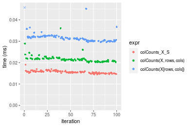

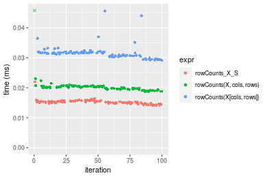
_Table: Benchmarking of colCounts_X_S() and rowCounts_X_S() on double+100x100 data (original and transposed).  The top panel shows times in milliseconds and the bottom panel shows relative times._


|   |expr          |    min|      lq|     mean| median|     uq|    max|
|:--|:-------------|------:|-------:|--------:|------:|------:|------:|
|2  |rowCounts_X_S | 13.996| 14.8805| 15.23351| 15.199| 15.531| 21.980|
|1  |colCounts_X_S | 14.460| 15.1165| 15.61903| 15.542| 16.020| 19.013|


|   |expr          |      min|      lq|     mean|   median|       uq|       max|
|:--|:-------------|--------:|-------:|--------:|--------:|--------:|---------:|
|2  |rowCounts_X_S | 1.000000| 1.00000| 1.000000| 1.000000| 1.000000| 1.0000000|
|1  |colCounts_X_S | 1.033152| 1.01586| 1.025307| 1.022567| 1.031485| 0.8650136|

_Figure: Benchmarking of colCounts_X_S() and rowCounts_X_S() on double+100x100 data (original and transposed).  Outliers are displayed as crosses. Times are in milliseconds._


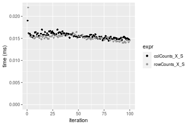

#### 1000x10 matrix


```r
> X <- data[["1000x10"]]
> rows <- sample.int(nrow(X), size = nrow(X) * 0.7)
> cols <- sample.int(ncol(X), size = ncol(X) * 0.7)
> X_S <- X[rows, cols]
> value <- 42
```


```r
> colStats <- microbenchmark(colCounts_X_S = colCounts(X_S, value = value, na.rm = FALSE), `colCounts(X, rows, cols)` = colCounts(X, 
+     value = value, na.rm = FALSE, rows = rows, cols = cols), `colCounts(X[rows, cols])` = colCounts(X[rows, 
+     cols], value = value, na.rm = FALSE), unit = "ms")
```

```r
> X <- t(X)
> X_S <- t(X_S)
```


```r
> rowStats <- microbenchmark(rowCounts_X_S = rowCounts(X_S, value = value, na.rm = FALSE), `rowCounts(X, cols, rows)` = rowCounts(X, 
+     value = value, na.rm = FALSE, rows = cols, cols = rows), `rowCounts(X[cols, rows])` = rowCounts(X[cols, 
+     rows], value = value, na.rm = FALSE), unit = "ms")
```

_Table: Benchmarking of colCounts_X_S(), colCounts(X, rows, cols)() and colCounts(X[rows, cols])() on double+1000x10 data. The top panel shows times in milliseconds and the bottom panel shows relative times._


|   |expr                     |      min|        lq|      mean|    median|        uq|      max|
|:--|:------------------------|--------:|---------:|---------:|---------:|---------:|--------:|
|1  |colCounts_X_S            | 0.014001| 0.0148145| 0.0154463| 0.0152015| 0.0154605| 0.030249|
|2  |colCounts(X, rows, cols) | 0.020527| 0.0211725| 0.0218252| 0.0217310| 0.0222750| 0.029003|
|3  |colCounts(X[rows, cols]) | 0.029669| 0.0301810| 0.0318248| 0.0311150| 0.0323315| 0.078715|


|   |expr                     |      min|       lq|     mean|   median|       uq|       max|
|:--|:------------------------|--------:|--------:|--------:|--------:|--------:|---------:|
|1  |colCounts_X_S            | 1.000000| 1.000000| 1.000000| 1.000000| 1.000000| 1.0000000|
|2  |colCounts(X, rows, cols) | 1.466110| 1.429174| 1.412971| 1.429530| 1.440768| 0.9588086|
|3  |colCounts(X[rows, cols]) | 2.119063| 2.037261| 2.060353| 2.046838| 2.091232| 2.6022348|

_Table: Benchmarking of rowCounts_X_S(), rowCounts(X, cols, rows)() and rowCounts(X[cols, rows])() on double+1000x10 data (transposed). The top panel shows times in milliseconds and the bottom panel shows relative times._


|   |expr                     |      min|        lq|      mean|    median|        uq|      max|
|:--|:------------------------|--------:|---------:|---------:|---------:|---------:|--------:|
|1  |rowCounts_X_S            | 0.014299| 0.0149825| 0.0156544| 0.0153825| 0.0158275| 0.030280|
|2  |rowCounts(X, cols, rows) | 0.020813| 0.0218100| 0.0222944| 0.0222735| 0.0227615| 0.028504|
|3  |rowCounts(X[cols, rows]) | 0.032415| 0.0338930| 0.0350553| 0.0341890| 0.0354720| 0.084972|


|   |expr                     |      min|       lq|     mean|   median|       uq|       max|
|:--|:------------------------|--------:|--------:|--------:|--------:|--------:|---------:|
|1  |rowCounts_X_S            | 1.000000| 1.000000| 1.000000| 1.000000| 1.000000| 1.0000000|
|2  |rowCounts(X, cols, rows) | 1.455556| 1.455698| 1.424161| 1.447977| 1.438098| 0.9413474|
|3  |rowCounts(X[cols, rows]) | 2.266942| 2.262173| 2.239330| 2.222591| 2.241163| 2.8062087|

_Figure: Benchmarking of colCounts_X_S(), colCounts(X, rows, cols)() and colCounts(X[rows, cols])() on double+1000x10 data  as well as rowCounts_X_S(), rowCounts(X, cols, rows)() and rowCounts(X[cols, rows])() on the same data transposed.  Outliers are displayed as crosses.  Times are in milliseconds._


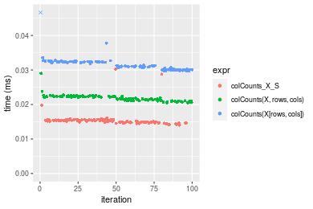

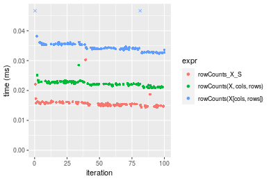
_Table: Benchmarking of colCounts_X_S() and rowCounts_X_S() on double+1000x10 data (original and transposed).  The top panel shows times in milliseconds and the bottom panel shows relative times._


|   |expr          |    min|      lq|     mean|  median|      uq|    max|
|:--|:-------------|------:|-------:|--------:|-------:|-------:|------:|
|1  |colCounts_X_S | 14.001| 14.8145| 15.44630| 15.2015| 15.4605| 30.249|
|2  |rowCounts_X_S | 14.299| 14.9825| 15.65439| 15.3825| 15.8275| 30.280|


|   |expr          |      min|      lq|     mean|   median|       uq|      max|
|:--|:-------------|--------:|-------:|--------:|--------:|--------:|--------:|
|1  |colCounts_X_S | 1.000000| 1.00000| 1.000000| 1.000000| 1.000000| 1.000000|
|2  |rowCounts_X_S | 1.021284| 1.01134| 1.013472| 1.011907| 1.023738| 1.001025|

_Figure: Benchmarking of colCounts_X_S() and rowCounts_X_S() on double+1000x10 data (original and transposed).  Outliers are displayed as crosses. Times are in milliseconds._


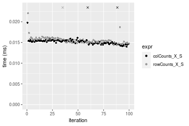

#### 10x1000 matrix


```r
> X <- data[["10x1000"]]
> rows <- sample.int(nrow(X), size = nrow(X) * 0.7)
> cols <- sample.int(ncol(X), size = ncol(X) * 0.7)
> X_S <- X[rows, cols]
> value <- 42
```


```r
> colStats <- microbenchmark(colCounts_X_S = colCounts(X_S, value = value, na.rm = FALSE), `colCounts(X, rows, cols)` = colCounts(X, 
+     value = value, na.rm = FALSE, rows = rows, cols = cols), `colCounts(X[rows, cols])` = colCounts(X[rows, 
+     cols], value = value, na.rm = FALSE), unit = "ms")
```

```r
> X <- t(X)
> X_S <- t(X_S)
```


```r
> rowStats <- microbenchmark(rowCounts_X_S = rowCounts(X_S, value = value, na.rm = FALSE), `rowCounts(X, cols, rows)` = rowCounts(X, 
+     value = value, na.rm = FALSE, rows = cols, cols = rows), `rowCounts(X[cols, rows])` = rowCounts(X[cols, 
+     rows], value = value, na.rm = FALSE), unit = "ms")
```

_Table: Benchmarking of colCounts_X_S(), colCounts(X, rows, cols)() and colCounts(X[rows, cols])() on double+10x1000 data. The top panel shows times in milliseconds and the bottom panel shows relative times._


|   |expr                     |      min|       lq|      mean|    median|        uq|      max|
|:--|:------------------------|--------:|--------:|---------:|---------:|---------:|--------:|
|1  |colCounts_X_S            | 0.016884| 0.018170| 0.0192221| 0.0184360| 0.0186870| 0.070501|
|2  |colCounts(X, rows, cols) | 0.024387| 0.026398| 0.0268619| 0.0267525| 0.0270930| 0.043456|
|3  |colCounts(X[rows, cols]) | 0.035872| 0.038625| 0.0390128| 0.0388600| 0.0391815| 0.052001|


|   |expr                     |      min|       lq|     mean|   median|       uq|       max|
|:--|:------------------------|--------:|--------:|--------:|--------:|--------:|---------:|
|1  |colCounts_X_S            | 1.000000| 1.000000| 1.000000| 1.000000| 1.000000| 1.0000000|
|2  |colCounts(X, rows, cols) | 1.444385| 1.452834| 1.397452| 1.451101| 1.449831| 0.6163884|
|3  |colCounts(X[rows, cols]) | 2.124615| 2.125757| 2.029582| 2.107833| 2.096725| 0.7375924|

_Table: Benchmarking of rowCounts_X_S(), rowCounts(X, cols, rows)() and rowCounts(X[cols, rows])() on double+10x1000 data (transposed). The top panel shows times in milliseconds and the bottom panel shows relative times._


|   |expr                     |      min|        lq|      mean|    median|        uq|      max|
|:--|:------------------------|--------:|---------:|---------:|---------:|---------:|--------:|
|1  |rowCounts_X_S            | 0.015521| 0.0164635| 0.0169850| 0.0166765| 0.0169355| 0.038427|
|2  |rowCounts(X, cols, rows) | 0.021579| 0.0225405| 0.0233976| 0.0228090| 0.0231560| 0.064948|
|3  |rowCounts(X[cols, rows]) | 0.032769| 0.0341160| 0.0355204| 0.0343810| 0.0351455| 0.052731|


|   |expr                     |      min|      lq|     mean|   median|       uq|      max|
|:--|:------------------------|--------:|-------:|--------:|--------:|--------:|--------:|
|1  |rowCounts_X_S            | 1.000000| 1.00000| 1.000000| 1.000000| 1.000000| 1.000000|
|2  |rowCounts(X, cols, rows) | 1.390310| 1.36912| 1.377548| 1.367733| 1.367305| 1.690166|
|3  |rowCounts(X[cols, rows]) | 2.111269| 2.07222| 2.091283| 2.061644| 2.075256| 1.372238|

_Figure: Benchmarking of colCounts_X_S(), colCounts(X, rows, cols)() and colCounts(X[rows, cols])() on double+10x1000 data  as well as rowCounts_X_S(), rowCounts(X, cols, rows)() and rowCounts(X[cols, rows])() on the same data transposed.  Outliers are displayed as crosses.  Times are in milliseconds._


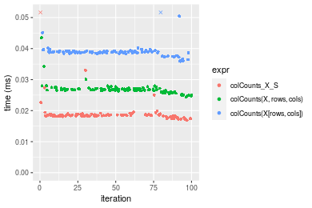

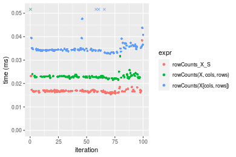
_Table: Benchmarking of colCounts_X_S() and rowCounts_X_S() on double+10x1000 data (original and transposed).  The top panel shows times in milliseconds and the bottom panel shows relative times._


|   |expr          |    min|      lq|     mean|  median|      uq|    max|
|:--|:-------------|------:|-------:|--------:|-------:|-------:|------:|
|2  |rowCounts_X_S | 15.521| 16.4635| 16.98500| 16.6765| 16.9355| 38.427|
|1  |colCounts_X_S | 16.884| 18.1700| 19.22208| 18.4360| 18.6870| 70.501|


|   |expr          |      min|       lq|     mean|   median|       uq|      max|
|:--|:-------------|--------:|--------:|--------:|--------:|--------:|--------:|
|2  |rowCounts_X_S | 1.000000| 1.000000| 1.000000| 1.000000| 1.000000| 1.000000|
|1  |colCounts_X_S | 1.087816| 1.103654| 1.131709| 1.105508| 1.103422| 1.834674|

_Figure: Benchmarking of colCounts_X_S() and rowCounts_X_S() on double+10x1000 data (original and transposed).  Outliers are displayed as crosses. Times are in milliseconds._


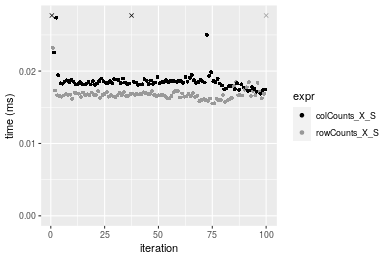

#### 100x1000 matrix


```r
> X <- data[["100x1000"]]
> rows <- sample.int(nrow(X), size = nrow(X) * 0.7)
> cols <- sample.int(ncol(X), size = ncol(X) * 0.7)
> X_S <- X[rows, cols]
> value <- 42
```


```r
> colStats <- microbenchmark(colCounts_X_S = colCounts(X_S, value = value, na.rm = FALSE), `colCounts(X, rows, cols)` = colCounts(X, 
+     value = value, na.rm = FALSE, rows = rows, cols = cols), `colCounts(X[rows, cols])` = colCounts(X[rows, 
+     cols], value = value, na.rm = FALSE), unit = "ms")
```

```r
> X <- t(X)
> X_S <- t(X_S)
```


```r
> rowStats <- microbenchmark(rowCounts_X_S = rowCounts(X_S, value = value, na.rm = FALSE), `rowCounts(X, cols, rows)` = rowCounts(X, 
+     value = value, na.rm = FALSE, rows = cols, cols = rows), `rowCounts(X[cols, rows])` = rowCounts(X[cols, 
+     rows], value = value, na.rm = FALSE), unit = "ms")
```

_Table: Benchmarking of colCounts_X_S(), colCounts(X, rows, cols)() and colCounts(X[rows, cols])() on double+100x1000 data. The top panel shows times in milliseconds and the bottom panel shows relative times._


|   |expr                     |      min|        lq|      mean|    median|        uq|      max|
|:--|:------------------------|--------:|---------:|---------:|---------:|---------:|--------:|
|1  |colCounts_X_S            | 0.062906| 0.0668225| 0.0730874| 0.0690720| 0.0774215| 0.134238|
|2  |colCounts(X, rows, cols) | 0.106274| 0.1137660| 0.1243597| 0.1178090| 0.1323715| 0.250308|
|3  |colCounts(X[rows, cols]) | 0.174124| 0.1870740| 0.2038471| 0.1963455| 0.2191160| 0.258205|


|   |expr                     |      min|       lq|     mean|   median|       uq|      max|
|:--|:------------------------|--------:|--------:|--------:|--------:|--------:|--------:|
|1  |colCounts_X_S            | 1.000000| 1.000000| 1.000000| 1.000000| 1.000000| 1.000000|
|2  |colCounts(X, rows, cols) | 1.689410| 1.702510| 1.701519| 1.705597| 1.709751| 1.864658|
|3  |colCounts(X[rows, cols]) | 2.768003| 2.799566| 2.789086| 2.842621| 2.830170| 1.923487|

_Table: Benchmarking of rowCounts_X_S(), rowCounts(X, cols, rows)() and rowCounts(X[cols, rows])() on double+100x1000 data (transposed). The top panel shows times in milliseconds and the bottom panel shows relative times._


|   |expr                     |      min|        lq|      mean|    median|        uq|      max|
|:--|:------------------------|--------:|---------:|---------:|---------:|---------:|--------:|
|1  |rowCounts_X_S            | 0.064811| 0.0724665| 0.0773812| 0.0751745| 0.0805700| 0.130595|
|2  |rowCounts(X, cols, rows) | 0.095506| 0.1041825| 0.1108832| 0.1084695| 0.1153580| 0.227809|
|3  |rowCounts(X[cols, rows]) | 0.167574| 0.1849990| 0.1975504| 0.1950010| 0.2073035| 0.278717|


|   |expr                     |      min|       lq|     mean|   median|       uq|      max|
|:--|:------------------------|--------:|--------:|--------:|--------:|--------:|--------:|
|1  |rowCounts_X_S            | 1.000000| 1.000000| 1.000000| 1.000000| 1.000000| 1.000000|
|2  |rowCounts(X, cols, rows) | 1.473608| 1.437664| 1.432947| 1.442903| 1.431774| 1.744393|
|3  |rowCounts(X[cols, rows]) | 2.585580| 2.552890| 2.552950| 2.593978| 2.572961| 2.134209|

_Figure: Benchmarking of colCounts_X_S(), colCounts(X, rows, cols)() and colCounts(X[rows, cols])() on double+100x1000 data  as well as rowCounts_X_S(), rowCounts(X, cols, rows)() and rowCounts(X[cols, rows])() on the same data transposed.  Outliers are displayed as crosses.  Times are in milliseconds._


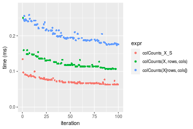

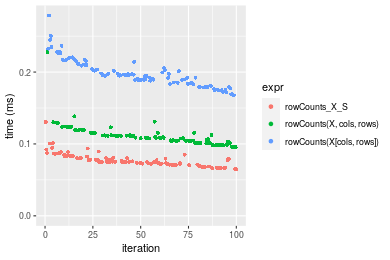
_Table: Benchmarking of colCounts_X_S() and rowCounts_X_S() on double+100x1000 data (original and transposed).  The top panel shows times in milliseconds and the bottom panel shows relative times._


|   |expr          |    min|      lq|     mean|  median|      uq|     max|
|:--|:-------------|------:|-------:|--------:|-------:|-------:|-------:|
|1  |colCounts_X_S | 62.906| 66.8225| 73.08743| 69.0720| 77.4215| 134.238|
|2  |rowCounts_X_S | 64.811| 72.4665| 77.38123| 75.1745| 80.5700| 130.595|


|   |expr          |      min|       lq|     mean|  median|       uq|       max|
|:--|:-------------|--------:|--------:|--------:|-------:|--------:|---------:|
|1  |colCounts_X_S | 1.000000| 1.000000| 1.000000| 1.00000| 1.000000| 1.0000000|
|2  |rowCounts_X_S | 1.030283| 1.084463| 1.058749| 1.08835| 1.040667| 0.9728616|

_Figure: Benchmarking of colCounts_X_S() and rowCounts_X_S() on double+100x1000 data (original and transposed).  Outliers are displayed as crosses. Times are in milliseconds._


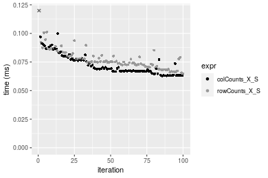

#### 1000x100 matrix


```r
> X <- data[["1000x100"]]
> rows <- sample.int(nrow(X), size = nrow(X) * 0.7)
> cols <- sample.int(ncol(X), size = ncol(X) * 0.7)
> X_S <- X[rows, cols]
> value <- 42
```


```r
> colStats <- microbenchmark(colCounts_X_S = colCounts(X_S, value = value, na.rm = FALSE), `colCounts(X, rows, cols)` = colCounts(X, 
+     value = value, na.rm = FALSE, rows = rows, cols = cols), `colCounts(X[rows, cols])` = colCounts(X[rows, 
+     cols], value = value, na.rm = FALSE), unit = "ms")
```

```r
> X <- t(X)
> X_S <- t(X_S)
```


```r
> rowStats <- microbenchmark(rowCounts_X_S = rowCounts(X_S, value = value, na.rm = FALSE), `rowCounts(X, cols, rows)` = rowCounts(X, 
+     value = value, na.rm = FALSE, rows = cols, cols = rows), `rowCounts(X[cols, rows])` = rowCounts(X[cols, 
+     rows], value = value, na.rm = FALSE), unit = "ms")
```

_Table: Benchmarking of colCounts_X_S(), colCounts(X, rows, cols)() and colCounts(X[rows, cols])() on double+1000x100 data. The top panel shows times in milliseconds and the bottom panel shows relative times._


|   |expr                     |      min|        lq|      mean|    median|        uq|      max|
|:--|:------------------------|--------:|---------:|---------:|---------:|---------:|--------:|
|1  |colCounts_X_S            | 0.062149| 0.0655800| 0.0715227| 0.0683620| 0.0743835| 0.134369|
|2  |colCounts(X, rows, cols) | 0.103568| 0.1106025| 0.1201071| 0.1145345| 0.1275670| 0.169042|
|3  |colCounts(X[rows, cols]) | 0.171923| 0.1827645| 0.2012079| 0.1916665| 0.2186845| 0.343512|


|   |expr                     |      min|       lq|     mean|   median|       uq|      max|
|:--|:------------------------|--------:|--------:|--------:|--------:|--------:|--------:|
|1  |colCounts_X_S            | 1.000000| 1.000000| 1.000000| 1.000000| 1.000000| 1.000000|
|2  |colCounts(X, rows, cols) | 1.666447| 1.686528| 1.679286| 1.675412| 1.714991| 1.258043|
|3  |colCounts(X[rows, cols]) | 2.766304| 2.786894| 2.813202| 2.803699| 2.939960| 2.556482|

_Table: Benchmarking of rowCounts_X_S(), rowCounts(X, cols, rows)() and rowCounts(X[cols, rows])() on double+1000x100 data (transposed). The top panel shows times in milliseconds and the bottom panel shows relative times._


|   |expr                     |      min|        lq|      mean|   median|        uq|      max|
|:--|:------------------------|--------:|---------:|---------:|--------:|---------:|--------:|
|1  |rowCounts_X_S            | 0.064437| 0.0699120| 0.0776216| 0.074275| 0.0822440| 0.139082|
|2  |rowCounts(X, cols, rows) | 0.100954| 0.1108280| 0.1202874| 0.114757| 0.1244115| 0.295856|
|3  |rowCounts(X[cols, rows]) | 0.174617| 0.1868465| 0.2064050| 0.196313| 0.2156940| 0.418876|


|   |expr                     |      min|       lq|     mean|   median|       uq|      max|
|:--|:------------------------|--------:|--------:|--------:|--------:|--------:|--------:|
|1  |rowCounts_X_S            | 1.000000| 1.000000| 1.000000| 1.000000| 1.000000| 1.000000|
|2  |rowCounts(X, cols, rows) | 1.566709| 1.585250| 1.549662| 1.545029| 1.512712| 2.127206|
|3  |rowCounts(X[cols, rows]) | 2.709887| 2.672595| 2.659116| 2.643056| 2.622611| 3.011720|

_Figure: Benchmarking of colCounts_X_S(), colCounts(X, rows, cols)() and colCounts(X[rows, cols])() on double+1000x100 data  as well as rowCounts_X_S(), rowCounts(X, cols, rows)() and rowCounts(X[cols, rows])() on the same data transposed.  Outliers are displayed as crosses.  Times are in milliseconds._


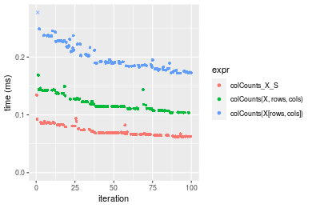

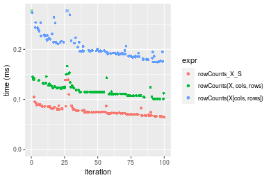
_Table: Benchmarking of colCounts_X_S() and rowCounts_X_S() on double+1000x100 data (original and transposed).  The top panel shows times in milliseconds and the bottom panel shows relative times._


|   |expr          |    min|     lq|     mean| median|      uq|     max|
|:--|:-------------|------:|------:|--------:|------:|-------:|-------:|
|1  |colCounts_X_S | 62.149| 65.580| 71.52272| 68.362| 74.3835| 134.369|
|2  |rowCounts_X_S | 64.437| 69.912| 77.62165| 74.275| 82.2440| 139.082|


|   |expr          |      min|       lq|     mean|   median|       uq|      max|
|:--|:-------------|--------:|--------:|--------:|--------:|--------:|--------:|
|1  |colCounts_X_S | 1.000000| 1.000000| 1.000000| 1.000000| 1.000000| 1.000000|
|2  |rowCounts_X_S | 1.036815| 1.066057| 1.085273| 1.086495| 1.105675| 1.035075|

_Figure: Benchmarking of colCounts_X_S() and rowCounts_X_S() on double+1000x100 data (original and transposed).  Outliers are displayed as crosses. Times are in milliseconds._


## Appendix

### Session information
```r
R version 4.1.1 Patched (2021-08-10 r80727)
Platform: x86_64-pc-linux-gnu (64-bit)
Running under: Ubuntu 18.04.5 LTS

Matrix products: default
BLAS:   /home/hb/software/R-devel/R-4-1-branch/lib/R/lib/libRblas.so
LAPACK: /home/hb/software/R-devel/R-4-1-branch/lib/R/lib/libRlapack.so

locale:
 [1] LC_CTYPE=en_US.UTF-8       LC_NUMERIC=C              
 [3] LC_TIME=en_US.UTF-8        LC_COLLATE=en_US.UTF-8    
 [5] LC_MONETARY=en_US.UTF-8    LC_MESSAGES=en_US.UTF-8   
 [7] LC_PAPER=en_US.UTF-8       LC_NAME=C                 
 [9] LC_ADDRESS=C               LC_TELEPHONE=C            
[11] LC_MEASUREMENT=en_US.UTF-8 LC_IDENTIFICATION=C       

attached base packages:
[1] stats     graphics  grDevices utils     datasets  methods   base     

other attached packages:
[1] microbenchmark_1.4-7   matrixStats_0.60.0     ggplot2_3.3.5         
[4] knitr_1.33             R.devices_2.17.0       R.utils_2.10.1        
[7] R.oo_1.24.0            R.methodsS3_1.8.1-9001

loaded via a namespace (and not attached):
 [1] Biobase_2.52.0          httr_1.4.2              splines_4.1.1          
 [4] bit64_4.0.5             network_1.17.1          assertthat_0.2.1       
 [7] highr_0.9               stats4_4.1.1            blob_1.2.2             
[10] GenomeInfoDbData_1.2.6  robustbase_0.93-8       pillar_1.6.2           
[13] RSQLite_2.2.8           lattice_0.20-44         glue_1.4.2             
[16] digest_0.6.27           XVector_0.32.0          colorspace_2.0-2       
[19] Matrix_1.3-4            XML_3.99-0.7            pkgconfig_2.0.3        
[22] zlibbioc_1.38.0         genefilter_1.74.0       purrr_0.3.4            
[25] ergm_4.1.2              xtable_1.8-4            scales_1.1.1           
[28] tibble_3.1.4            annotate_1.70.0         KEGGREST_1.32.0        
[31] farver_2.1.0            generics_0.1.0          IRanges_2.26.0         
[34] ellipsis_0.3.2          cachem_1.0.6            withr_2.4.2            
[37] BiocGenerics_0.38.0     mime_0.11               survival_3.2-13        
[40] magrittr_2.0.1          crayon_1.4.1            statnet.common_4.5.0   
[43] memoise_2.0.0           laeken_0.5.1            fansi_0.5.0            
[46] R.cache_0.15.0          MASS_7.3-54             R.rsp_0.44.0           
[49] tools_4.1.1             lifecycle_1.0.0         S4Vectors_0.30.0       
[52] trust_0.1-8             munsell_0.5.0           AnnotationDbi_1.54.1   
[55] Biostrings_2.60.2       compiler_4.1.1          GenomeInfoDb_1.28.1    
[58] rlang_0.4.11            grid_4.1.1              RCurl_1.98-1.4         
[61] cwhmisc_6.6             rappdirs_0.3.3          labeling_0.4.2         
[64] bitops_1.0-7            base64enc_0.1-3         boot_1.3-28            
[67] gtable_0.3.0            DBI_1.1.1               markdown_1.1           
[70] R6_2.5.1                lpSolveAPI_5.5.2.0-17.7 rle_0.9.2              
[73] dplyr_1.0.7             fastmap_1.1.0           bit_4.0.4              
[76] utf8_1.2.2              parallel_4.1.1          Rcpp_1.0.7             
[79] vctrs_0.3.8             png_0.1-7               DEoptimR_1.0-9         
[82] tidyselect_1.1.1        xfun_0.25               coda_0.19-4            
```
Total processing time was 32.96 secs.


### Reproducibility
To reproduce this report, do:
```r
html <- matrixStats:::benchmark('colRowCounts_subset')
```

[RSP]: https://cran.r-project.org/package=R.rsp
[matrixStats]: https://cran.r-project.org/package=matrixStats

[StackOverflow:colMins?]: https://stackoverflow.com/questions/13676878 "Stack Overflow: fastest way to get Min from every column in a matrix?"
[StackOverflow:colSds?]: https://stackoverflow.com/questions/17549762 "Stack Overflow: Is there such 'colsd' in R?"
[StackOverflow:rowProds?]: https://stackoverflow.com/questions/20198801/ "Stack Overflow: Row product of matrix and column sum of matrix"

---------------------------------------
Copyright Dongcan Jiang. Last updated on 2021-08-25 17:36:18 (+0200 UTC). Powered by [RSP].

<script>
 var link = document.createElement('link');
 link.rel = 'icon';
 link.href = "data:image/png;base64,iVBORw0KGgoAAAANSUhEUgAAACAAAAAgCAMAAABEpIrGAAAA21BMVEUAAAAAAP8AAP8AAP8AAP8AAP8AAP8AAP8AAP8AAP8AAP8AAP8AAP8AAP8AAP8AAP8AAP8AAP8AAP8AAP8AAP8AAP8AAP8AAP8AAP8AAP8AAP8AAP8AAP8AAP8AAP8AAP8AAP8AAP8AAP8AAP8AAP8AAP8AAP8AAP8AAP8AAP8BAf4CAv0DA/wdHeIeHuEfH+AgIN8hId4lJdomJtknJ9g+PsE/P8BAQL9yco10dIt1dYp3d4h4eIeVlWqWlmmXl2iYmGeZmWabm2Tn5xjo6Bfp6Rb39wj4+Af//wA2M9hbAAAASXRSTlMAAQIJCgsMJSYnKD4/QGRlZmhpamtsbautrrCxuru8y8zN5ebn6Pn6+///////////////////////////////////////////LsUNcQAAAS9JREFUOI29k21XgkAQhVcFytdSMqMETU26UVqGmpaiFbL//xc1cAhhwVNf6n5i5z67M2dmYOyfJZUqlVLhkKucG7cgmUZTybDz6g0iDeq51PUr37Ds2cy2/C9NeES5puDjxuUk1xnToZsg8pfA3avHQ3lLIi7iWRrkv/OYtkScxBIMgDee0ALoyxHQBJ68JLCjOtQIMIANF7QG9G9fNnHvisCHBVMKgSJgiz7nE+AoBKrAPA3MgepvgR9TSCasrCKH0eB1wBGBFdCO+nAGjMVGPcQb5bd6mQRegN6+1axOs9nGfYcCtfi4NQosdtH7dB+txFIpXQqN1p9B/asRHToyS0jRgpV7nk4nwcq1BJ+x3Gl/v7S9Wmpp/aGquum7w3ZDyrADFYrl8vHBH+ev9AUASW1dmU4h4wAAAABJRU5ErkJggg=="
 document.getElementsByTagName('head')[0].appendChild(link);
</script>


