[matrixStats]: Benchmark report

---------------------------------------


# colCummins() and rowCummins() benchmarks on subsetted computation

This report benchmark the performance of colCummins() and rowCummins() on subsetted computation.


## Data type "integer"

### Data
```r
> rmatrix <- function(nrow, ncol, mode = c("logical", "double", "integer", "index"), range = c(-100, 
+     +100), na_prob = 0) {
+     mode <- match.arg(mode)
+     n <- nrow * ncol
+     if (mode == "logical") {
+         x <- sample(c(FALSE, TRUE), size = n, replace = TRUE)
+     }     else if (mode == "index") {
+         x <- seq_len(n)
+         mode <- "integer"
+     }     else {
+         x <- runif(n, min = range[1], max = range[2])
+     }
+     storage.mode(x) <- mode
+     if (na_prob > 0) 
+         x[sample(n, size = na_prob * n)] <- NA
+     dim(x) <- c(nrow, ncol)
+     x
+ }
> rmatrices <- function(scale = 10, seed = 1, ...) {
+     set.seed(seed)
+     data <- list()
+     data[[1]] <- rmatrix(nrow = scale * 1, ncol = scale * 1, ...)
+     data[[2]] <- rmatrix(nrow = scale * 10, ncol = scale * 10, ...)
+     data[[3]] <- rmatrix(nrow = scale * 100, ncol = scale * 1, ...)
+     data[[4]] <- t(data[[3]])
+     data[[5]] <- rmatrix(nrow = scale * 10, ncol = scale * 100, ...)
+     data[[6]] <- t(data[[5]])
+     names(data) <- sapply(data, FUN = function(x) paste(dim(x), collapse = "x"))
+     data
+ }
> data <- rmatrices(mode = mode)
```

### Results

#### 10x10 integer matrix

```r
> X <- data[["10x10"]]
> rows <- sample.int(nrow(X), size = nrow(X) * 0.7)
> cols <- sample.int(ncol(X), size = ncol(X) * 0.7)
> X_S <- X[rows, cols]
> gc()
          used  (Mb) gc trigger  (Mb) max used  (Mb)
Ncells 5169930 276.2    7554717 403.5  7554717 403.5
Vcells 9396749  71.7   31793280 242.6 60508962 461.7
> colStats <- microbenchmark(colCummins_X_S = colCummins(X_S), `colCummins(X, rows, cols)` = colCummins(X, 
+     rows = rows, cols = cols), `colCummins(X[rows, cols])` = colCummins(X[rows, cols]), unit = "ms")
> X <- t(X)
> X_S <- t(X_S)
> gc()
          used  (Mb) gc trigger  (Mb) max used  (Mb)
Ncells 5169214 276.1    7554717 403.5  7554717 403.5
Vcells 9394927  71.7   31793280 242.6 60508962 461.7
> rowStats <- microbenchmark(rowCummins_X_S = rowCummins(X_S), `rowCummins(X, cols, rows)` = rowCummins(X, 
+     rows = cols, cols = rows), `rowCummins(X[cols, rows])` = rowCummins(X[cols, rows]), unit = "ms")
```

_Table: Benchmarking of colCummins_X_S(), colCummins(X, rows, cols)() and colCummins(X[rows, cols])() on integer+10x10 data. The top panel shows times in milliseconds and the bottom panel shows relative times._


|   |expr                      |      min|        lq|      mean|    median|        uq|      max|
|:--|:-------------------------|--------:|---------:|---------:|---------:|---------:|--------:|
|1  |colCummins_X_S            | 0.002245| 0.0024175| 0.0040436| 0.0024815| 0.0026075| 0.154451|
|2  |colCummins(X, rows, cols) | 0.002523| 0.0027960| 0.0029343| 0.0028750| 0.0029865| 0.004864|
|3  |colCummins(X[rows, cols]) | 0.002976| 0.0034810| 0.0036359| 0.0035665| 0.0036510| 0.007857|


|   |expr                      |      min|       lq|      mean|   median|       uq|       max|
|:--|:-------------------------|--------:|--------:|---------:|--------:|--------:|---------:|
|1  |colCummins_X_S            | 1.000000| 1.000000| 1.0000000| 1.000000| 1.000000| 1.0000000|
|2  |colCummins(X, rows, cols) | 1.123831| 1.156567| 0.7256659| 1.158573| 1.145350| 0.0314922|
|3  |colCummins(X[rows, cols]) | 1.325613| 1.439917| 0.8991817| 1.437236| 1.400192| 0.0508705|

_Table: Benchmarking of rowCummins_X_S(), rowCummins(X, cols, rows)() and rowCummins(X[cols, rows])() on integer+10x10 data (transposed). The top panel shows times in milliseconds and the bottom panel shows relative times._


|   |expr                      |      min|        lq|      mean|    median|        uq|      max|
|:--|:-------------------------|--------:|---------:|---------:|---------:|---------:|--------:|
|1  |rowCummins_X_S            | 0.002141| 0.0024435| 0.0025852| 0.0025245| 0.0026705| 0.005235|
|2  |rowCummins(X, cols, rows) | 0.002608| 0.0028340| 0.0043350| 0.0029140| 0.0030185| 0.142029|
|3  |rowCummins(X[cols, rows]) | 0.002997| 0.0035295| 0.0036669| 0.0036315| 0.0037405| 0.005421|


|   |expr                      |      min|       lq|     mean|   median|       uq|      max|
|:--|:-------------------------|--------:|--------:|--------:|--------:|--------:|--------:|
|1  |rowCummins_X_S            | 1.000000| 1.000000| 1.000000| 1.000000| 1.000000|  1.00000|
|2  |rowCummins(X, cols, rows) | 1.218122| 1.159812| 1.676827| 1.154288| 1.130313| 27.13066|
|3  |rowCummins(X[cols, rows]) | 1.399813| 1.444444| 1.418398| 1.438503| 1.400674|  1.03553|

_Figure: Benchmarking of colCummins_X_S(), colCummins(X, rows, cols)() and colCummins(X[rows, cols])() on integer+10x10 data  as well as rowCummins_X_S(), rowCummins(X, cols, rows)() and rowCummins(X[cols, rows])() on the same data transposed.  Outliers are displayed as crosses.  Times are in milliseconds._


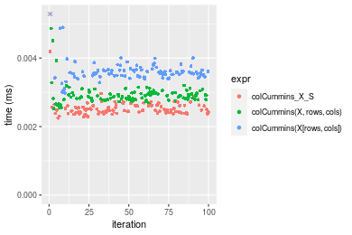

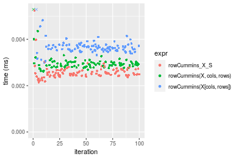
_Table: Benchmarking of colCummins_X_S() and rowCummins_X_S() on integer+10x10 data (original and transposed).  The top panel shows times in milliseconds and the bottom panel shows relative times._


|   |expr           |   min|     lq|    mean| median|     uq|     max|
|:--|:--------------|-----:|------:|-------:|------:|------:|-------:|
|1  |colCummins_X_S | 2.245| 2.4175| 4.04361| 2.4815| 2.6075| 154.451|
|2  |rowCummins_X_S | 2.141| 2.4435| 2.58524| 2.5245| 2.6705|   5.235|


|   |expr           |       min|       lq|      mean|   median|       uq|       max|
|:--|:--------------|---------:|--------:|---------:|--------:|--------:|---------:|
|1  |colCummins_X_S | 1.0000000| 1.000000| 1.0000000| 1.000000| 1.000000| 1.0000000|
|2  |rowCummins_X_S | 0.9536748| 1.010755| 0.6393396| 1.017328| 1.024161| 0.0338942|

_Figure: Benchmarking of colCummins_X_S() and rowCummins_X_S() on integer+10x10 data (original and transposed).  Outliers are displayed as crosses. Times are in milliseconds._


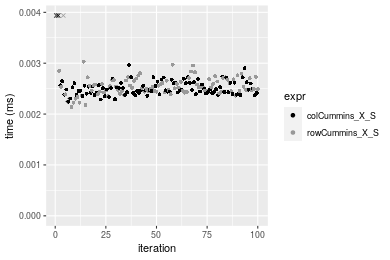

#### 100x100 integer matrix

```r
> X <- data[["100x100"]]
> rows <- sample.int(nrow(X), size = nrow(X) * 0.7)
> cols <- sample.int(ncol(X), size = ncol(X) * 0.7)
> X_S <- X[rows, cols]
> gc()
          used  (Mb) gc trigger  (Mb) max used  (Mb)
Ncells 5167925 276.0    7554717 403.5  7554717 403.5
Vcells 9064280  69.2   31793280 242.6 60508962 461.7
> colStats <- microbenchmark(colCummins_X_S = colCummins(X_S), `colCummins(X, rows, cols)` = colCummins(X, 
+     rows = rows, cols = cols), `colCummins(X[rows, cols])` = colCummins(X[rows, cols]), unit = "ms")
> X <- t(X)
> X_S <- t(X_S)
> gc()
          used  (Mb) gc trigger  (Mb) max used  (Mb)
Ncells 5167919 276.0    7554717 403.5  7554717 403.5
Vcells 9069363  69.2   31793280 242.6 60508962 461.7
> rowStats <- microbenchmark(rowCummins_X_S = rowCummins(X_S), `rowCummins(X, cols, rows)` = rowCummins(X, 
+     rows = cols, cols = rows), `rowCummins(X[cols, rows])` = rowCummins(X[cols, rows]), unit = "ms")
```

_Table: Benchmarking of colCummins_X_S(), colCummins(X, rows, cols)() and colCummins(X[rows, cols])() on integer+100x100 data. The top panel shows times in milliseconds and the bottom panel shows relative times._


|   |expr                      |      min|        lq|      mean|    median|       uq|      max|
|:--|:-------------------------|--------:|---------:|---------:|---------:|--------:|--------:|
|1  |colCummins_X_S            | 0.014551| 0.0148320| 0.0154395| 0.0150310| 0.015175| 0.030870|
|2  |colCummins(X, rows, cols) | 0.019713| 0.0200055| 0.0202792| 0.0201330| 0.020288| 0.025358|
|3  |colCummins(X[rows, cols]) | 0.025384| 0.0259840| 0.0269042| 0.0262445| 0.026592| 0.060024|


|   |expr                      |      min|       lq|     mean|   median|       uq|       max|
|:--|:-------------------------|--------:|--------:|--------:|--------:|--------:|---------:|
|1  |colCummins_X_S            | 1.000000| 1.000000| 1.000000| 1.000000| 1.000000| 1.0000000|
|2  |colCummins(X, rows, cols) | 1.354752| 1.348807| 1.313463| 1.339432| 1.336936| 0.8214448|
|3  |colCummins(X[rows, cols]) | 1.744485| 1.751888| 1.742553| 1.746025| 1.752356| 1.9444121|

_Table: Benchmarking of rowCummins_X_S(), rowCummins(X, cols, rows)() and rowCummins(X[cols, rows])() on integer+100x100 data (transposed). The top panel shows times in milliseconds and the bottom panel shows relative times._


|   |expr                      |      min|        lq|      mean|    median|        uq|      max|
|:--|:-------------------------|--------:|---------:|---------:|---------:|---------:|--------:|
|1  |rowCummins_X_S            | 0.010682| 0.0111615| 0.0117754| 0.0115635| 0.0118515| 0.029455|
|2  |rowCummins(X, cols, rows) | 0.019190| 0.0196635| 0.0209656| 0.0203260| 0.0206680| 0.047943|
|3  |rowCummins(X[cols, rows]) | 0.021452| 0.0219815| 0.0228265| 0.0227555| 0.0230450| 0.035006|


|   |expr                      |      min|       lq|     mean|   median|       uq|      max|
|:--|:-------------------------|--------:|--------:|--------:|--------:|--------:|--------:|
|1  |rowCummins_X_S            | 1.000000| 1.000000| 1.000000| 1.000000| 1.000000| 1.000000|
|2  |rowCummins(X, cols, rows) | 1.796480| 1.761726| 1.780463| 1.757772| 1.743914| 1.627669|
|3  |rowCummins(X[cols, rows]) | 2.008238| 1.969404| 1.938488| 1.967873| 1.944480| 1.188457|

_Figure: Benchmarking of colCummins_X_S(), colCummins(X, rows, cols)() and colCummins(X[rows, cols])() on integer+100x100 data  as well as rowCummins_X_S(), rowCummins(X, cols, rows)() and rowCummins(X[cols, rows])() on the same data transposed.  Outliers are displayed as crosses.  Times are in milliseconds._


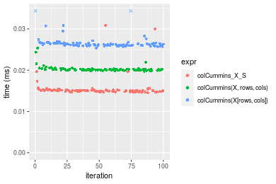

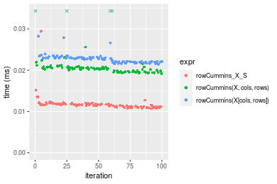
_Table: Benchmarking of colCummins_X_S() and rowCummins_X_S() on integer+100x100 data (original and transposed).  The top panel shows times in milliseconds and the bottom panel shows relative times._


|   |expr           |    min|      lq|     mean|  median|      uq|    max|
|:--|:--------------|------:|-------:|--------:|-------:|-------:|------:|
|2  |rowCummins_X_S | 10.682| 11.1615| 11.77539| 11.5635| 11.8515| 29.455|
|1  |colCummins_X_S | 14.551| 14.8320| 15.43950| 15.0310| 15.1750| 30.870|


|   |expr           |      min|       lq|     mean|   median|       uq|      max|
|:--|:--------------|--------:|--------:|--------:|--------:|--------:|--------:|
|2  |rowCummins_X_S | 1.000000| 1.000000| 1.000000| 1.000000| 1.000000| 1.000000|
|1  |colCummins_X_S | 1.362198| 1.328854| 1.311167| 1.299866| 1.280429| 1.048039|

_Figure: Benchmarking of colCummins_X_S() and rowCummins_X_S() on integer+100x100 data (original and transposed).  Outliers are displayed as crosses. Times are in milliseconds._


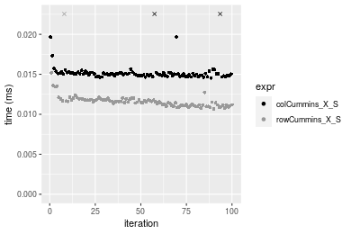

#### 1000x10 integer matrix

```r
> X <- data[["1000x10"]]
> rows <- sample.int(nrow(X), size = nrow(X) * 0.7)
> cols <- sample.int(ncol(X), size = ncol(X) * 0.7)
> X_S <- X[rows, cols]
> gc()
          used  (Mb) gc trigger  (Mb) max used  (Mb)
Ncells 5168125 276.1    7554717 403.5  7554717 403.5
Vcells 9065163  69.2   31793280 242.6 60508962 461.7
> colStats <- microbenchmark(colCummins_X_S = colCummins(X_S), `colCummins(X, rows, cols)` = colCummins(X, 
+     rows = rows, cols = cols), `colCummins(X[rows, cols])` = colCummins(X[rows, cols]), unit = "ms")
> X <- t(X)
> X_S <- t(X_S)
> gc()
          used  (Mb) gc trigger  (Mb) max used  (Mb)
Ncells 5168119 276.1    7554717 403.5  7554717 403.5
Vcells 9070246  69.3   31793280 242.6 60508962 461.7
> rowStats <- microbenchmark(rowCummins_X_S = rowCummins(X_S), `rowCummins(X, cols, rows)` = rowCummins(X, 
+     rows = cols, cols = rows), `rowCummins(X[cols, rows])` = rowCummins(X[cols, rows]), unit = "ms")
```

_Table: Benchmarking of colCummins_X_S(), colCummins(X, rows, cols)() and colCummins(X[rows, cols])() on integer+1000x10 data. The top panel shows times in milliseconds and the bottom panel shows relative times._


|   |expr                      |      min|        lq|      mean|    median|        uq|      max|
|:--|:-------------------------|--------:|---------:|---------:|---------:|---------:|--------:|
|1  |colCummins_X_S            | 0.015369| 0.0157945| 0.0166214| 0.0160185| 0.0164425| 0.020407|
|2  |colCummins(X, rows, cols) | 0.020123| 0.0211830| 0.0233667| 0.0213775| 0.0217550| 0.038248|
|3  |colCummins(X[rows, cols]) | 0.027098| 0.0277920| 0.0305393| 0.0281250| 0.0296600| 0.069282|


|   |expr                      |      min|       lq|     mean|   median|       uq|      max|
|:--|:-------------------------|--------:|--------:|--------:|--------:|--------:|--------:|
|1  |colCummins_X_S            | 1.000000| 1.000000| 1.000000| 1.000000| 1.000000| 1.000000|
|2  |colCummins(X, rows, cols) | 1.309324| 1.341163| 1.405826| 1.334551| 1.323096| 1.874259|
|3  |colCummins(X[rows, cols]) | 1.763160| 1.759600| 1.837353| 1.755782| 1.803862| 3.395011|

_Table: Benchmarking of rowCummins_X_S(), rowCummins(X, cols, rows)() and rowCummins(X[cols, rows])() on integer+1000x10 data (transposed). The top panel shows times in milliseconds and the bottom panel shows relative times._


|   |expr                      |      min|        lq|      mean|    median|        uq|      max|
|:--|:-------------------------|--------:|---------:|---------:|---------:|---------:|--------:|
|1  |rowCummins_X_S            | 0.013536| 0.0141215| 0.0144029| 0.0143365| 0.0145715| 0.018483|
|2  |rowCummins(X, cols, rows) | 0.022226| 0.0232610| 0.0239554| 0.0236175| 0.0239660| 0.039635|
|3  |rowCummins(X[cols, rows]) | 0.026367| 0.0277390| 0.0290708| 0.0281540| 0.0284065| 0.091400|


|   |expr                      |      min|       lq|     mean|   median|       uq|      max|
|:--|:-------------------------|--------:|--------:|--------:|--------:|--------:|--------:|
|1  |rowCummins_X_S            | 1.000000| 1.000000| 1.000000| 1.000000| 1.000000| 1.000000|
|2  |rowCummins(X, cols, rows) | 1.641992| 1.647205| 1.663232| 1.647369| 1.644717| 2.144403|
|3  |rowCummins(X[cols, rows]) | 1.947917| 1.964310| 2.018393| 1.963799| 1.949456| 4.945085|

_Figure: Benchmarking of colCummins_X_S(), colCummins(X, rows, cols)() and colCummins(X[rows, cols])() on integer+1000x10 data  as well as rowCummins_X_S(), rowCummins(X, cols, rows)() and rowCummins(X[cols, rows])() on the same data transposed.  Outliers are displayed as crosses.  Times are in milliseconds._


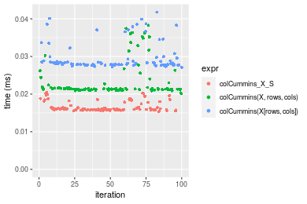

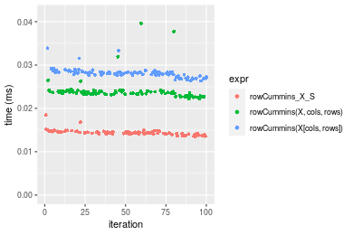
_Table: Benchmarking of colCummins_X_S() and rowCummins_X_S() on integer+1000x10 data (original and transposed).  The top panel shows times in milliseconds and the bottom panel shows relative times._


|   |expr           |    min|      lq|     mean|  median|      uq|    max|
|:--|:--------------|------:|-------:|--------:|-------:|-------:|------:|
|2  |rowCummins_X_S | 13.536| 14.1215| 14.40293| 14.3365| 14.5715| 18.483|
|1  |colCummins_X_S | 15.369| 15.7945| 16.62135| 16.0185| 16.4425| 20.407|


|   |expr           |      min|       lq|     mean|   median|       uq|      max|
|:--|:--------------|--------:|--------:|--------:|--------:|--------:|--------:|
|2  |rowCummins_X_S | 1.000000| 1.000000| 1.000000| 1.000000| 1.000000| 1.000000|
|1  |colCummins_X_S | 1.135417| 1.118472| 1.154026| 1.117323| 1.128401| 1.104096|

_Figure: Benchmarking of colCummins_X_S() and rowCummins_X_S() on integer+1000x10 data (original and transposed).  Outliers are displayed as crosses. Times are in milliseconds._


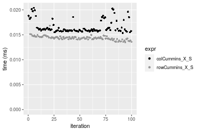

#### 10x1000 integer matrix

```r
> X <- data[["10x1000"]]
> rows <- sample.int(nrow(X), size = nrow(X) * 0.7)
> cols <- sample.int(ncol(X), size = ncol(X) * 0.7)
> X_S <- X[rows, cols]
> gc()
          used  (Mb) gc trigger  (Mb) max used  (Mb)
Ncells 5168330 276.1    7554717 403.5  7554717 403.5
Vcells 9065994  69.2   31793280 242.6 60508962 461.7
> colStats <- microbenchmark(colCummins_X_S = colCummins(X_S), `colCummins(X, rows, cols)` = colCummins(X, 
+     rows = rows, cols = cols), `colCummins(X[rows, cols])` = colCummins(X[rows, cols]), unit = "ms")
> X <- t(X)
> X_S <- t(X_S)
> gc()
          used  (Mb) gc trigger  (Mb) max used  (Mb)
Ncells 5168324 276.1    7554717 403.5  7554717 403.5
Vcells 9071077  69.3   31793280 242.6 60508962 461.7
> rowStats <- microbenchmark(rowCummins_X_S = rowCummins(X_S), `rowCummins(X, cols, rows)` = rowCummins(X, 
+     rows = cols, cols = rows), `rowCummins(X[cols, rows])` = rowCummins(X[cols, rows]), unit = "ms")
```

_Table: Benchmarking of colCummins_X_S(), colCummins(X, rows, cols)() and colCummins(X[rows, cols])() on integer+10x1000 data. The top panel shows times in milliseconds and the bottom panel shows relative times._


|   |expr                      |      min|        lq|      mean|    median|        uq|      max|
|:--|:-------------------------|--------:|---------:|---------:|---------:|---------:|--------:|
|1  |colCummins_X_S            | 0.012171| 0.0126420| 0.0131185| 0.0129515| 0.0132895| 0.028385|
|2  |colCummins(X, rows, cols) | 0.021632| 0.0220585| 0.0229383| 0.0228560| 0.0231805| 0.037744|
|3  |colCummins(X[rows, cols]) | 0.025195| 0.0257620| 0.0268199| 0.0266955| 0.0272145| 0.038380|


|   |expr                      |      min|       lq|     mean|   median|       uq|      max|
|:--|:-------------------------|--------:|--------:|--------:|--------:|--------:|--------:|
|1  |colCummins_X_S            | 1.000000| 1.000000| 1.000000| 1.000000| 1.000000| 1.000000|
|2  |colCummins(X, rows, cols) | 1.777340| 1.744858| 1.748544| 1.764738| 1.744272| 1.329716|
|3  |colCummins(X[rows, cols]) | 2.070085| 2.037810| 2.044433| 2.061190| 2.047820| 1.352123|

_Table: Benchmarking of rowCummins_X_S(), rowCummins(X, cols, rows)() and rowCummins(X[cols, rows])() on integer+10x1000 data (transposed). The top panel shows times in milliseconds and the bottom panel shows relative times._


|   |expr                      |      min|        lq|      mean|    median|        uq|      max|
|:--|:-------------------------|--------:|---------:|---------:|---------:|---------:|--------:|
|1  |rowCummins_X_S            | 0.010335| 0.0109225| 0.0111876| 0.0111355| 0.0113560| 0.014650|
|2  |rowCummins(X, cols, rows) | 0.019043| 0.0195740| 0.0203135| 0.0201940| 0.0203390| 0.043095|
|3  |rowCummins(X[cols, rows]) | 0.021838| 0.0225245| 0.0232645| 0.0230975| 0.0233895| 0.038276|


|   |expr                      |      min|       lq|     mean|   median|       uq|      max|
|:--|:-------------------------|--------:|--------:|--------:|--------:|--------:|--------:|
|1  |rowCummins_X_S            | 1.000000| 1.000000| 1.000000| 1.000000| 1.000000| 1.000000|
|2  |rowCummins(X, cols, rows) | 1.842574| 1.792081| 1.815712| 1.813479| 1.791036| 2.941638|
|3  |rowCummins(X[cols, rows]) | 2.113014| 2.062211| 2.079489| 2.074222| 2.059660| 2.612696|

_Figure: Benchmarking of colCummins_X_S(), colCummins(X, rows, cols)() and colCummins(X[rows, cols])() on integer+10x1000 data  as well as rowCummins_X_S(), rowCummins(X, cols, rows)() and rowCummins(X[cols, rows])() on the same data transposed.  Outliers are displayed as crosses.  Times are in milliseconds._


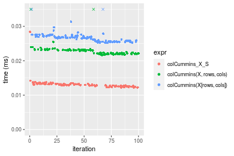

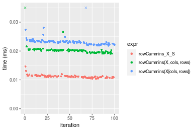
_Table: Benchmarking of colCummins_X_S() and rowCummins_X_S() on integer+10x1000 data (original and transposed).  The top panel shows times in milliseconds and the bottom panel shows relative times._


|   |expr           |    min|      lq|     mean|  median|      uq|    max|
|:--|:--------------|------:|-------:|--------:|-------:|-------:|------:|
|2  |rowCummins_X_S | 10.335| 10.9225| 11.18761| 11.1355| 11.3560| 14.650|
|1  |colCummins_X_S | 12.171| 12.6420| 13.11852| 12.9515| 13.2895| 28.385|


|   |expr           |      min|       lq|     mean|   median|       uq|      max|
|:--|:--------------|--------:|--------:|--------:|--------:|--------:|--------:|
|2  |rowCummins_X_S | 1.000000| 1.000000| 1.000000| 1.000000| 1.000000| 1.000000|
|1  |colCummins_X_S | 1.177649| 1.157427| 1.172594| 1.163082| 1.170262| 1.937543|

_Figure: Benchmarking of colCummins_X_S() and rowCummins_X_S() on integer+10x1000 data (original and transposed).  Outliers are displayed as crosses. Times are in milliseconds._


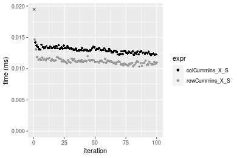

#### 100x1000 integer matrix

```r
> X <- data[["100x1000"]]
> rows <- sample.int(nrow(X), size = nrow(X) * 0.7)
> cols <- sample.int(ncol(X), size = ncol(X) * 0.7)
> X_S <- X[rows, cols]
> gc()
          used  (Mb) gc trigger  (Mb) max used  (Mb)
Ncells 5168540 276.1    7554717 403.5  7554717 403.5
Vcells 9088665  69.4   31793280 242.6 60508962 461.7
> colStats <- microbenchmark(colCummins_X_S = colCummins(X_S), `colCummins(X, rows, cols)` = colCummins(X, 
+     rows = rows, cols = cols), `colCummins(X[rows, cols])` = colCummins(X[rows, cols]), unit = "ms")
> X <- t(X)
> X_S <- t(X_S)
> gc()
          used  (Mb) gc trigger  (Mb) max used  (Mb)
Ncells 5168534 276.1    7554717 403.5  7554717 403.5
Vcells 9138748  69.8   31793280 242.6 60508962 461.7
> rowStats <- microbenchmark(rowCummins_X_S = rowCummins(X_S), `rowCummins(X, cols, rows)` = rowCummins(X, 
+     rows = cols, cols = rows), `rowCummins(X[cols, rows])` = rowCummins(X[cols, rows]), unit = "ms")
```

_Table: Benchmarking of colCummins_X_S(), colCummins(X, rows, cols)() and colCummins(X[rows, cols])() on integer+100x1000 data. The top panel shows times in milliseconds and the bottom panel shows relative times._


|   |expr                      |      min|        lq|      mean|    median|        uq|      max|
|:--|:-------------------------|--------:|---------:|---------:|---------:|---------:|--------:|
|1  |colCummins_X_S            | 0.078050| 0.0940405| 0.1015596| 0.1015325| 0.1083205| 0.137274|
|2  |colCummins(X, rows, cols) | 0.108922| 0.1261400| 0.1572101| 0.1389250| 0.1940475| 0.251067|
|3  |colCummins(X[rows, cols]) | 0.146199| 0.1816045| 0.2036848| 0.1927170| 0.2325295| 0.291788|


|   |expr                      |      min|       lq|     mean|   median|      uq|      max|
|:--|:-------------------------|--------:|--------:|--------:|--------:|-------:|--------:|
|1  |colCummins_X_S            | 1.000000| 1.000000| 1.000000| 1.000000| 1.00000| 1.000000|
|2  |colCummins(X, rows, cols) | 1.395541| 1.341337| 1.547959| 1.368281| 1.79142| 1.828948|
|3  |colCummins(X[rows, cols]) | 1.873145| 1.931131| 2.005569| 1.898082| 2.14668| 2.125588|

_Table: Benchmarking of rowCummins_X_S(), rowCummins(X, cols, rows)() and rowCummins(X[cols, rows])() on integer+100x1000 data (transposed). The top panel shows times in milliseconds and the bottom panel shows relative times._


|   |expr                      |      min|        lq|      mean|    median|        uq|      max|
|:--|:-------------------------|--------:|---------:|---------:|---------:|---------:|--------:|
|1  |rowCummins_X_S            | 0.063434| 0.0680585| 0.0774057| 0.0747840| 0.0848785| 0.148718|
|2  |rowCummins(X, cols, rows) | 0.123822| 0.1317405| 0.1439455| 0.1363105| 0.1516675| 0.294103|
|3  |rowCummins(X[cols, rows]) | 0.138158| 0.1478875| 0.1649033| 0.1569055| 0.1814240| 0.274453|


|   |expr                      |      min|       lq|     mean|   median|       uq|      max|
|:--|:-------------------------|--------:|--------:|--------:|--------:|--------:|--------:|
|1  |rowCummins_X_S            | 1.000000| 1.000000| 1.000000| 1.000000| 1.000000| 1.000000|
|2  |rowCummins(X, cols, rows) | 1.951982| 1.935695| 1.859625| 1.822723| 1.786878| 1.977588|
|3  |rowCummins(X[cols, rows]) | 2.177980| 2.172947| 2.130378| 2.098116| 2.137455| 1.845459|

_Figure: Benchmarking of colCummins_X_S(), colCummins(X, rows, cols)() and colCummins(X[rows, cols])() on integer+100x1000 data  as well as rowCummins_X_S(), rowCummins(X, cols, rows)() and rowCummins(X[cols, rows])() on the same data transposed.  Outliers are displayed as crosses.  Times are in milliseconds._


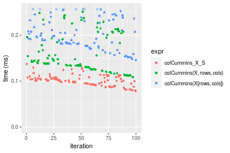

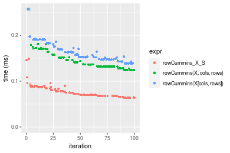
_Table: Benchmarking of colCummins_X_S() and rowCummins_X_S() on integer+100x1000 data (original and transposed).  The top panel shows times in milliseconds and the bottom panel shows relative times._


|   |expr           |    min|      lq|      mean|   median|       uq|     max|
|:--|:--------------|------:|-------:|---------:|--------:|--------:|-------:|
|2  |rowCummins_X_S | 63.434| 68.0585|  77.40568|  74.7840|  84.8785| 148.718|
|1  |colCummins_X_S | 78.050| 94.0405| 101.55965| 101.5325| 108.3205| 137.274|


|   |expr           |      min|      lq|     mean|   median|       uq|      max|
|:--|:--------------|--------:|-------:|--------:|--------:|--------:|--------:|
|2  |rowCummins_X_S | 1.000000| 1.00000| 1.000000| 1.000000| 1.000000| 1.000000|
|1  |colCummins_X_S | 1.230413| 1.38176| 1.312044| 1.357677| 1.276183| 0.923049|

_Figure: Benchmarking of colCummins_X_S() and rowCummins_X_S() on integer+100x1000 data (original and transposed).  Outliers are displayed as crosses. Times are in milliseconds._


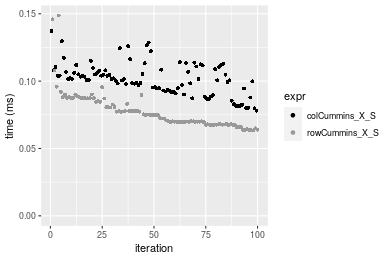

#### 1000x100 integer matrix

```r
> X <- data[["1000x100"]]
> rows <- sample.int(nrow(X), size = nrow(X) * 0.7)
> cols <- sample.int(ncol(X), size = ncol(X) * 0.7)
> X_S <- X[rows, cols]
> gc()
          used  (Mb) gc trigger  (Mb) max used  (Mb)
Ncells 5168753 276.1    7554717 403.5  7554717 403.5
Vcells 9089445  69.4   31793280 242.6 60508962 461.7
> colStats <- microbenchmark(colCummins_X_S = colCummins(X_S), `colCummins(X, rows, cols)` = colCummins(X, 
+     rows = rows, cols = cols), `colCummins(X[rows, cols])` = colCummins(X[rows, cols]), unit = "ms")
> X <- t(X)
> X_S <- t(X_S)
> gc()
          used  (Mb) gc trigger  (Mb) max used  (Mb)
Ncells 5168747 276.1    7554717 403.5  7554717 403.5
Vcells 9139528  69.8   31793280 242.6 60508962 461.7
> rowStats <- microbenchmark(rowCummins_X_S = rowCummins(X_S), `rowCummins(X, cols, rows)` = rowCummins(X, 
+     rows = cols, cols = rows), `rowCummins(X[cols, rows])` = rowCummins(X[cols, rows]), unit = "ms")
```

_Table: Benchmarking of colCummins_X_S(), colCummins(X, rows, cols)() and colCummins(X[rows, cols])() on integer+1000x100 data. The top panel shows times in milliseconds and the bottom panel shows relative times._


|   |expr                      |      min|        lq|      mean|   median|       uq|      max|
|:--|:-------------------------|--------:|---------:|---------:|--------:|--------:|--------:|
|1  |colCummins_X_S            | 0.092079| 0.1010410| 0.1109436| 0.104998| 0.119537| 0.177131|
|2  |colCummins(X, rows, cols) | 0.121449| 0.1327815| 0.1451736| 0.138561| 0.154718| 0.201078|
|3  |colCummins(X[rows, cols]) | 0.167877| 0.1787515| 0.2018887| 0.196960| 0.218873| 0.298559|


|   |expr                      |      min|       lq|     mean|   median|       uq|      max|
|:--|:-------------------------|--------:|--------:|--------:|--------:|--------:|--------:|
|1  |colCummins_X_S            | 1.000000| 1.000000| 1.000000| 1.000000| 1.000000| 1.000000|
|2  |colCummins(X, rows, cols) | 1.318965| 1.314135| 1.308535| 1.319654| 1.294310| 1.135194|
|3  |colCummins(X[rows, cols]) | 1.823184| 1.769099| 1.819741| 1.875845| 1.831006| 1.685526|

_Table: Benchmarking of rowCummins_X_S(), rowCummins(X, cols, rows)() and rowCummins(X[cols, rows])() on integer+1000x100 data (transposed). The top panel shows times in milliseconds and the bottom panel shows relative times._


|   |expr                      |      min|        lq|      mean|    median|        uq|      max|
|:--|:-------------------------|--------:|---------:|---------:|---------:|---------:|--------:|
|1  |rowCummins_X_S            | 0.066883| 0.0716560| 0.0796293| 0.0765720| 0.0893735| 0.110695|
|2  |rowCummins(X, cols, rows) | 0.130059| 0.1390740| 0.1552406| 0.1447590| 0.1669420| 0.276422|
|3  |rowCummins(X[cols, rows]) | 0.149181| 0.1590765| 0.1784349| 0.1702055| 0.1984120| 0.252664|


|   |expr                      |      min|       lq|     mean|   median|       uq|      max|
|:--|:-------------------------|--------:|--------:|--------:|--------:|--------:|--------:|
|1  |rowCummins_X_S            | 1.000000| 1.000000| 1.000000| 1.000000| 1.000000| 1.000000|
|2  |rowCummins(X, cols, rows) | 1.944575| 1.940856| 1.949541| 1.890495| 1.867914| 2.497150|
|3  |rowCummins(X[cols, rows]) | 2.230477| 2.220003| 2.240820| 2.222816| 2.220032| 2.282524|

_Figure: Benchmarking of colCummins_X_S(), colCummins(X, rows, cols)() and colCummins(X[rows, cols])() on integer+1000x100 data  as well as rowCummins_X_S(), rowCummins(X, cols, rows)() and rowCummins(X[cols, rows])() on the same data transposed.  Outliers are displayed as crosses.  Times are in milliseconds._


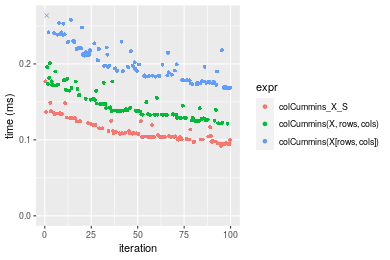

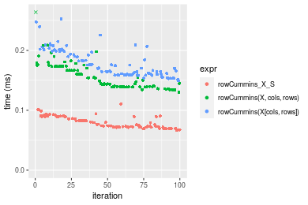
_Table: Benchmarking of colCummins_X_S() and rowCummins_X_S() on integer+1000x100 data (original and transposed).  The top panel shows times in milliseconds and the bottom panel shows relative times._


|   |expr           |    min|      lq|      mean|  median|       uq|     max|
|:--|:--------------|------:|-------:|---------:|-------:|--------:|-------:|
|2  |rowCummins_X_S | 66.883|  71.656|  79.62929|  76.572|  89.3735| 110.695|
|1  |colCummins_X_S | 92.079| 101.041| 110.94363| 104.998| 119.5370| 177.131|


|   |expr           |      min|       lq|     mean|   median|       uq|      max|
|:--|:--------------|--------:|--------:|--------:|--------:|--------:|--------:|
|2  |rowCummins_X_S | 1.000000| 1.000000| 1.000000| 1.000000| 1.000000| 1.000000|
|1  |colCummins_X_S | 1.376718| 1.410084| 1.393252| 1.371232| 1.337499| 1.600172|

_Figure: Benchmarking of colCummins_X_S() and rowCummins_X_S() on integer+1000x100 data (original and transposed).  Outliers are displayed as crosses. Times are in milliseconds._


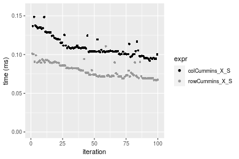


## Data type "double"

### Data
```r
> rmatrix <- function(nrow, ncol, mode = c("logical", "double", "integer", "index"), range = c(-100, 
+     +100), na_prob = 0) {
+     mode <- match.arg(mode)
+     n <- nrow * ncol
+     if (mode == "logical") {
+         x <- sample(c(FALSE, TRUE), size = n, replace = TRUE)
+     }     else if (mode == "index") {
+         x <- seq_len(n)
+         mode <- "integer"
+     }     else {
+         x <- runif(n, min = range[1], max = range[2])
+     }
+     storage.mode(x) <- mode
+     if (na_prob > 0) 
+         x[sample(n, size = na_prob * n)] <- NA
+     dim(x) <- c(nrow, ncol)
+     x
+ }
> rmatrices <- function(scale = 10, seed = 1, ...) {
+     set.seed(seed)
+     data <- list()
+     data[[1]] <- rmatrix(nrow = scale * 1, ncol = scale * 1, ...)
+     data[[2]] <- rmatrix(nrow = scale * 10, ncol = scale * 10, ...)
+     data[[3]] <- rmatrix(nrow = scale * 100, ncol = scale * 1, ...)
+     data[[4]] <- t(data[[3]])
+     data[[5]] <- rmatrix(nrow = scale * 10, ncol = scale * 100, ...)
+     data[[6]] <- t(data[[5]])
+     names(data) <- sapply(data, FUN = function(x) paste(dim(x), collapse = "x"))
+     data
+ }
> data <- rmatrices(mode = mode)
```

### Results

#### 10x10 double matrix

```r
> X <- data[["10x10"]]
> rows <- sample.int(nrow(X), size = nrow(X) * 0.7)
> cols <- sample.int(ncol(X), size = ncol(X) * 0.7)
> X_S <- X[rows, cols]
> gc()
          used  (Mb) gc trigger  (Mb) max used  (Mb)
Ncells 5168970 276.1    7554717 403.5  7554717 403.5
Vcells 9180549  70.1   31793280 242.6 60508962 461.7
> colStats <- microbenchmark(colCummins_X_S = colCummins(X_S), `colCummins(X, rows, cols)` = colCummins(X, 
+     rows = rows, cols = cols), `colCummins(X[rows, cols])` = colCummins(X[rows, cols]), unit = "ms")
> X <- t(X)
> X_S <- t(X_S)
> gc()
          used  (Mb) gc trigger  (Mb) max used  (Mb)
Ncells 5168955 276.1    7554717 403.5  7554717 403.5
Vcells 9180717  70.1   31793280 242.6 60508962 461.7
> rowStats <- microbenchmark(rowCummins_X_S = rowCummins(X_S), `rowCummins(X, cols, rows)` = rowCummins(X, 
+     rows = cols, cols = rows), `rowCummins(X[cols, rows])` = rowCummins(X[cols, rows]), unit = "ms")
```

_Table: Benchmarking of colCummins_X_S(), colCummins(X, rows, cols)() and colCummins(X[rows, cols])() on double+10x10 data. The top panel shows times in milliseconds and the bottom panel shows relative times._


|   |expr                      |      min|        lq|      mean|    median|        uq|      max|
|:--|:-------------------------|--------:|---------:|---------:|---------:|---------:|--------:|
|1  |colCummins_X_S            | 0.002326| 0.0024830| 0.0029155| 0.0025845| 0.0027460| 0.024956|
|2  |colCummins(X, rows, cols) | 0.002514| 0.0028655| 0.0032617| 0.0029905| 0.0032045| 0.023299|
|3  |colCummins(X[rows, cols]) | 0.003495| 0.0036470| 0.0039704| 0.0038230| 0.0040050| 0.009217|


|   |expr                      |      min|       lq|     mean|   median|       uq|       max|
|:--|:-------------------------|--------:|--------:|--------:|--------:|--------:|---------:|
|1  |colCummins_X_S            | 1.000000| 1.000000| 1.000000| 1.000000| 1.000000| 1.0000000|
|2  |colCummins(X, rows, cols) | 1.080825| 1.154047| 1.118746| 1.157090| 1.166970| 0.9336031|
|3  |colCummins(X[rows, cols]) | 1.502579| 1.468788| 1.361813| 1.479203| 1.458485| 0.3693300|

_Table: Benchmarking of rowCummins_X_S(), rowCummins(X, cols, rows)() and rowCummins(X[cols, rows])() on double+10x10 data (transposed). The top panel shows times in milliseconds and the bottom panel shows relative times._


|   |expr                      |      min|        lq|      mean|   median|        uq|      max|
|:--|:-------------------------|--------:|---------:|---------:|--------:|---------:|--------:|
|1  |rowCummins_X_S            | 0.002379| 0.0025160| 0.0026698| 0.002589| 0.0027045| 0.004975|
|2  |rowCummins(X, cols, rows) | 0.002720| 0.0028730| 0.0033547| 0.002933| 0.0030600| 0.041406|
|3  |rowCummins(X[cols, rows]) | 0.003198| 0.0036415| 0.0038034| 0.003749| 0.0038385| 0.008549|


|   |expr                      |      min|       lq|    mean|   median|       uq|      max|
|:--|:-------------------------|--------:|--------:|-------:|--------:|--------:|--------:|
|1  |rowCummins_X_S            | 1.000000| 1.000000| 1.00000| 1.000000| 1.000000| 1.000000|
|2  |rowCummins(X, cols, rows) | 1.143337| 1.141892| 1.25654| 1.132870| 1.131448| 8.322814|
|3  |rowCummins(X[cols, rows]) | 1.344262| 1.447337| 1.42459| 1.448049| 1.419301| 1.718392|

_Figure: Benchmarking of colCummins_X_S(), colCummins(X, rows, cols)() and colCummins(X[rows, cols])() on double+10x10 data  as well as rowCummins_X_S(), rowCummins(X, cols, rows)() and rowCummins(X[cols, rows])() on the same data transposed.  Outliers are displayed as crosses.  Times are in milliseconds._


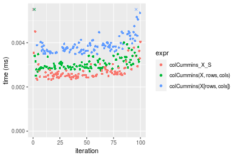

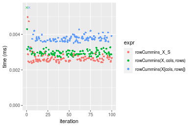
_Table: Benchmarking of colCummins_X_S() and rowCummins_X_S() on double+10x10 data (original and transposed).  The top panel shows times in milliseconds and the bottom panel shows relative times._


|   |expr           |   min|    lq|    mean| median|     uq|    max|
|:--|:--------------|-----:|-----:|-------:|------:|------:|------:|
|1  |colCummins_X_S | 2.326| 2.483| 2.91554| 2.5845| 2.7460| 24.956|
|2  |rowCummins_X_S | 2.379| 2.516| 2.66980| 2.5890| 2.7045|  4.975|


|   |expr           |      min|      lq|      mean|   median|        uq|       max|
|:--|:--------------|--------:|-------:|---------:|--------:|---------:|---------:|
|1  |colCummins_X_S | 1.000000| 1.00000| 1.0000000| 1.000000| 1.0000000| 1.0000000|
|2  |rowCummins_X_S | 1.022786| 1.01329| 0.9157137| 1.001741| 0.9848871| 0.1993509|

_Figure: Benchmarking of colCummins_X_S() and rowCummins_X_S() on double+10x10 data (original and transposed).  Outliers are displayed as crosses. Times are in milliseconds._


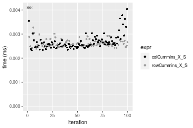

#### 100x100 double matrix

```r
> X <- data[["100x100"]]
> rows <- sample.int(nrow(X), size = nrow(X) * 0.7)
> cols <- sample.int(ncol(X), size = ncol(X) * 0.7)
> X_S <- X[rows, cols]
> gc()
          used  (Mb) gc trigger  (Mb) max used  (Mb)
Ncells 5169167 276.1    7554717 403.5  7554717 403.5
Vcells 9186497  70.1   31793280 242.6 60508962 461.7
> colStats <- microbenchmark(colCummins_X_S = colCummins(X_S), `colCummins(X, rows, cols)` = colCummins(X, 
+     rows = rows, cols = cols), `colCummins(X[rows, cols])` = colCummins(X[rows, cols]), unit = "ms")
> X <- t(X)
> X_S <- t(X_S)
> gc()
          used  (Mb) gc trigger  (Mb) max used  (Mb)
Ncells 5169161 276.1    7554717 403.5  7554717 403.5
Vcells 9196580  70.2   31793280 242.6 60508962 461.7
> rowStats <- microbenchmark(rowCummins_X_S = rowCummins(X_S), `rowCummins(X, cols, rows)` = rowCummins(X, 
+     rows = cols, cols = rows), `rowCummins(X[cols, rows])` = rowCummins(X[cols, rows]), unit = "ms")
```

_Table: Benchmarking of colCummins_X_S(), colCummins(X, rows, cols)() and colCummins(X[rows, cols])() on double+100x100 data. The top panel shows times in milliseconds and the bottom panel shows relative times._


|   |expr                      |      min|        lq|      mean|    median|        uq|      max|
|:--|:-------------------------|--------:|---------:|---------:|---------:|---------:|--------:|
|1  |colCummins_X_S            | 0.017787| 0.0187715| 0.0192741| 0.0194115| 0.0196115| 0.021984|
|2  |colCummins(X, rows, cols) | 0.026593| 0.0277440| 0.0283372| 0.0283660| 0.0286590| 0.033957|
|3  |colCummins(X[rows, cols]) | 0.032537| 0.0353265| 0.0362931| 0.0359620| 0.0361635| 0.061340|


|   |expr                      |      min|       lq|     mean|   median|       uq|      max|
|:--|:-------------------------|--------:|--------:|--------:|--------:|--------:|--------:|
|1  |colCummins_X_S            | 1.000000| 1.000000| 1.000000| 1.000000| 1.000000| 1.000000|
|2  |colCummins(X, rows, cols) | 1.495081| 1.477985| 1.470222| 1.461299| 1.461337| 1.544623|
|3  |colCummins(X[rows, cols]) | 1.829257| 1.881922| 1.882998| 1.852613| 1.843995| 2.790211|

_Table: Benchmarking of rowCummins_X_S(), rowCummins(X, cols, rows)() and rowCummins(X[cols, rows])() on double+100x100 data (transposed). The top panel shows times in milliseconds and the bottom panel shows relative times._


|   |expr                      |      min|        lq|      mean|   median|        uq|      max|
|:--|:-------------------------|--------:|---------:|---------:|--------:|---------:|--------:|
|1  |rowCummins_X_S            | 0.009089| 0.0094465| 0.0098623| 0.009732| 0.0101305| 0.014002|
|2  |rowCummins(X, cols, rows) | 0.017638| 0.0179770| 0.0189746| 0.018582| 0.0189120| 0.045001|
|3  |rowCummins(X[cols, rows]) | 0.024633| 0.0251530| 0.0264077| 0.026094| 0.0265785| 0.058582|


|   |expr                      |      min|       lq|     mean|   median|       uq|      max|
|:--|:-------------------------|--------:|--------:|--------:|--------:|--------:|--------:|
|1  |rowCummins_X_S            | 1.000000| 1.000000| 1.000000| 1.000000| 1.000000| 1.000000|
|2  |rowCummins(X, cols, rows) | 1.940587| 1.903033| 1.923954| 1.909371| 1.866838| 3.213898|
|3  |rowCummins(X[cols, rows]) | 2.710199| 2.662679| 2.677652| 2.681258| 2.623612| 4.183831|

_Figure: Benchmarking of colCummins_X_S(), colCummins(X, rows, cols)() and colCummins(X[rows, cols])() on double+100x100 data  as well as rowCummins_X_S(), rowCummins(X, cols, rows)() and rowCummins(X[cols, rows])() on the same data transposed.  Outliers are displayed as crosses.  Times are in milliseconds._


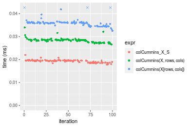

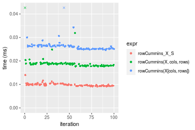
_Table: Benchmarking of colCummins_X_S() and rowCummins_X_S() on double+100x100 data (original and transposed).  The top panel shows times in milliseconds and the bottom panel shows relative times._


|   |expr           |    min|      lq|     mean|  median|      uq|    max|
|:--|:--------------|------:|-------:|--------:|-------:|-------:|------:|
|2  |rowCummins_X_S |  9.089|  9.4465|  9.86227|  9.7320| 10.1305| 14.002|
|1  |colCummins_X_S | 17.787| 18.7715| 19.27411| 19.4115| 19.6115| 21.984|


|   |expr           |      min|       lq|     mean|   median|       uq|      max|
|:--|:--------------|--------:|--------:|--------:|--------:|--------:|--------:|
|2  |rowCummins_X_S | 1.000000| 1.000000| 1.000000| 1.000000| 1.000000| 1.000000|
|1  |colCummins_X_S | 1.956981| 1.987138| 1.954328| 1.994605| 1.935887| 1.570061|

_Figure: Benchmarking of colCummins_X_S() and rowCummins_X_S() on double+100x100 data (original and transposed).  Outliers are displayed as crosses. Times are in milliseconds._


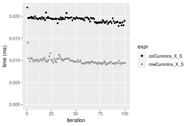

#### 1000x10 double matrix

```r
> X <- data[["1000x10"]]
> rows <- sample.int(nrow(X), size = nrow(X) * 0.7)
> cols <- sample.int(ncol(X), size = ncol(X) * 0.7)
> X_S <- X[rows, cols]
> gc()
          used  (Mb) gc trigger  (Mb) max used  (Mb)
Ncells 5169367 276.1    7554717 403.5  7554717 403.5
Vcells 9187899  70.1   31793280 242.6 60508962 461.7
> colStats <- microbenchmark(colCummins_X_S = colCummins(X_S), `colCummins(X, rows, cols)` = colCummins(X, 
+     rows = rows, cols = cols), `colCummins(X[rows, cols])` = colCummins(X[rows, cols]), unit = "ms")
> X <- t(X)
> X_S <- t(X_S)
> gc()
          used  (Mb) gc trigger  (Mb) max used  (Mb)
Ncells 5169361 276.1    7554717 403.5  7554717 403.5
Vcells 9197982  70.2   31793280 242.6 60508962 461.7
> rowStats <- microbenchmark(rowCummins_X_S = rowCummins(X_S), `rowCummins(X, cols, rows)` = rowCummins(X, 
+     rows = cols, cols = rows), `rowCummins(X[cols, rows])` = rowCummins(X[cols, rows]), unit = "ms")
```

_Table: Benchmarking of colCummins_X_S(), colCummins(X, rows, cols)() and colCummins(X[rows, cols])() on double+1000x10 data. The top panel shows times in milliseconds and the bottom panel shows relative times._


|   |expr                      |      min|        lq|      mean|    median|        uq|      max|
|:--|:-------------------------|--------:|---------:|---------:|---------:|---------:|--------:|
|1  |colCummins_X_S            | 0.019656| 0.0207895| 0.0222255| 0.0214590| 0.0219200| 0.035140|
|2  |colCummins(X, rows, cols) | 0.023503| 0.0250030| 0.0276743| 0.0260895| 0.0268695| 0.046878|
|3  |colCummins(X[rows, cols]) | 0.035089| 0.0362760| 0.0404454| 0.0385930| 0.0402810| 0.081655|


|   |expr                      |      min|       lq|     mean|   median|       uq|      max|
|:--|:-------------------------|--------:|--------:|--------:|--------:|--------:|--------:|
|1  |colCummins_X_S            | 1.000000| 1.000000| 1.000000| 1.000000| 1.000000| 1.000000|
|2  |colCummins(X, rows, cols) | 1.195716| 1.202674| 1.245157| 1.215784| 1.225798| 1.334035|
|3  |colCummins(X[rows, cols]) | 1.785155| 1.744919| 1.819773| 1.798453| 1.837637| 2.323705|

_Table: Benchmarking of rowCummins_X_S(), rowCummins(X, cols, rows)() and rowCummins(X[cols, rows])() on double+1000x10 data (transposed). The top panel shows times in milliseconds and the bottom panel shows relative times._


|   |expr                      |      min|        lq|      mean|    median|       uq|      max|
|:--|:-------------------------|--------:|---------:|---------:|---------:|--------:|--------:|
|1  |rowCummins_X_S            | 0.011018| 0.0117245| 0.0119632| 0.0119115| 0.012110| 0.015482|
|2  |rowCummins(X, cols, rows) | 0.020864| 0.0219970| 0.0223580| 0.0221675| 0.022337| 0.036372|
|3  |rowCummins(X[cols, rows]) | 0.030103| 0.0314890| 0.0321430| 0.0317605| 0.031961| 0.067251|


|   |expr                      |      min|       lq|     mean|   median|       uq|      max|
|:--|:-------------------------|--------:|--------:|--------:|--------:|--------:|--------:|
|1  |rowCummins_X_S            | 1.000000| 1.000000| 1.000000| 1.000000| 1.000000| 1.000000|
|2  |rowCummins(X, cols, rows) | 1.893629| 1.876157| 1.868898| 1.861017| 1.844509| 2.349309|
|3  |rowCummins(X[cols, rows]) | 2.732165| 2.685744| 2.686826| 2.666373| 2.639224| 4.343819|

_Figure: Benchmarking of colCummins_X_S(), colCummins(X, rows, cols)() and colCummins(X[rows, cols])() on double+1000x10 data  as well as rowCummins_X_S(), rowCummins(X, cols, rows)() and rowCummins(X[cols, rows])() on the same data transposed.  Outliers are displayed as crosses.  Times are in milliseconds._


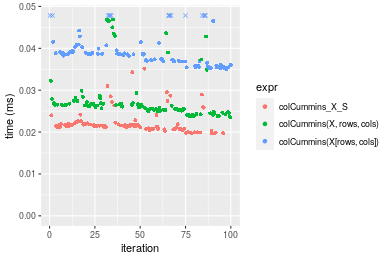

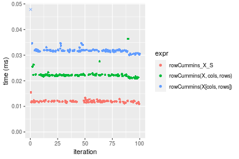
_Table: Benchmarking of colCummins_X_S() and rowCummins_X_S() on double+1000x10 data (original and transposed).  The top panel shows times in milliseconds and the bottom panel shows relative times._


|   |expr           |    min|      lq|     mean|  median|    uq|    max|
|:--|:--------------|------:|-------:|--------:|-------:|-----:|------:|
|2  |rowCummins_X_S | 11.018| 11.7245| 11.96319| 11.9115| 12.11| 15.482|
|1  |colCummins_X_S | 19.656| 20.7895| 22.22553| 21.4590| 21.92| 35.140|


|   |expr           |     min|       lq|     mean|   median|       uq|      max|
|:--|:--------------|-------:|--------:|--------:|--------:|--------:|--------:|
|2  |rowCummins_X_S | 1.00000| 1.000000| 1.000000| 1.000000| 1.000000| 1.000000|
|1  |colCummins_X_S | 1.78399| 1.773167| 1.857826| 1.801536| 1.810074| 2.269733|

_Figure: Benchmarking of colCummins_X_S() and rowCummins_X_S() on double+1000x10 data (original and transposed).  Outliers are displayed as crosses. Times are in milliseconds._


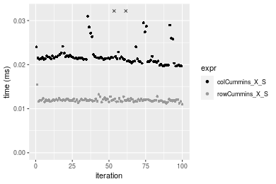

#### 10x1000 double matrix

```r
> X <- data[["10x1000"]]
> rows <- sample.int(nrow(X), size = nrow(X) * 0.7)
> cols <- sample.int(ncol(X), size = ncol(X) * 0.7)
> X_S <- X[rows, cols]
> gc()
          used  (Mb) gc trigger  (Mb) max used  (Mb)
Ncells 5169572 276.1    7554717 403.5  7554717 403.5
Vcells 9188035  70.1   31793280 242.6 60508962 461.7
> colStats <- microbenchmark(colCummins_X_S = colCummins(X_S), `colCummins(X, rows, cols)` = colCummins(X, 
+     rows = rows, cols = cols), `colCummins(X[rows, cols])` = colCummins(X[rows, cols]), unit = "ms")
> X <- t(X)
> X_S <- t(X_S)
> gc()
          used  (Mb) gc trigger  (Mb) max used  (Mb)
Ncells 5169566 276.1    7554717 403.5  7554717 403.5
Vcells 9198118  70.2   31793280 242.6 60508962 461.7
> rowStats <- microbenchmark(rowCummins_X_S = rowCummins(X_S), `rowCummins(X, cols, rows)` = rowCummins(X, 
+     rows = cols, cols = rows), `rowCummins(X[cols, rows])` = rowCummins(X[cols, rows]), unit = "ms")
```

_Table: Benchmarking of colCummins_X_S(), colCummins(X, rows, cols)() and colCummins(X[rows, cols])() on double+10x1000 data. The top panel shows times in milliseconds and the bottom panel shows relative times._


|   |expr                      |      min|        lq|      mean|    median|        uq|      max|
|:--|:-------------------------|--------:|---------:|---------:|---------:|---------:|--------:|
|1  |colCummins_X_S            | 0.011740| 0.0121615| 0.0128652| 0.0123555| 0.0125670| 0.035363|
|3  |colCummins(X[rows, cols]) | 0.031743| 0.0320585| 0.0324767| 0.0322260| 0.0324420| 0.040305|
|2  |colCummins(X, rows, cols) | 0.039156| 0.0414875| 0.0432124| 0.0425395| 0.0439095| 0.086371|


|   |expr                      |      min|       lq|     mean|   median|       uq|      max|
|:--|:-------------------------|--------:|--------:|--------:|--------:|--------:|--------:|
|1  |colCummins_X_S            | 1.000000| 1.000000| 1.000000| 1.000000| 1.000000| 1.000000|
|3  |colCummins(X[rows, cols]) | 2.703833| 2.636065| 2.524380| 2.608231| 2.581523| 1.139751|
|2  |colCummins(X, rows, cols) | 3.335264| 3.411380| 3.358856| 3.442961| 3.494032| 2.442412|

_Table: Benchmarking of rowCummins_X_S(), rowCummins(X, cols, rows)() and rowCummins(X[cols, rows])() on double+10x1000 data (transposed). The top panel shows times in milliseconds and the bottom panel shows relative times._


|   |expr                      |      min|        lq|      mean|    median|        uq|      max|
|:--|:-------------------------|--------:|---------:|---------:|---------:|---------:|--------:|
|1  |rowCummins_X_S            | 0.009375| 0.0098755| 0.0105310| 0.0100995| 0.0104655| 0.042020|
|2  |rowCummins(X, cols, rows) | 0.018842| 0.0191315| 0.0197089| 0.0193025| 0.0195780| 0.046986|
|3  |rowCummins(X[cols, rows]) | 0.026286| 0.0268460| 0.0274960| 0.0271145| 0.0273905| 0.041663|


|   |expr                      |      min|       lq|     mean|   median|       uq|      max|
|:--|:-------------------------|--------:|--------:|--------:|--------:|--------:|--------:|
|1  |rowCummins_X_S            | 1.000000| 1.000000| 1.000000| 1.000000| 1.000000| 1.000000|
|2  |rowCummins(X, cols, rows) | 2.009813| 1.937269| 1.871514| 1.911233| 1.870718| 1.118182|
|3  |rowCummins(X[cols, rows]) | 2.803840| 2.718445| 2.610958| 2.684737| 2.617218| 0.991504|

_Figure: Benchmarking of colCummins_X_S(), colCummins(X, rows, cols)() and colCummins(X[rows, cols])() on double+10x1000 data  as well as rowCummins_X_S(), rowCummins(X, cols, rows)() and rowCummins(X[cols, rows])() on the same data transposed.  Outliers are displayed as crosses.  Times are in milliseconds._


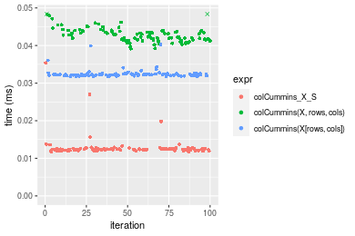

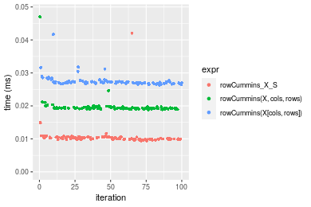
_Table: Benchmarking of colCummins_X_S() and rowCummins_X_S() on double+10x1000 data (original and transposed).  The top panel shows times in milliseconds and the bottom panel shows relative times._


|   |expr           |    min|      lq|     mean|  median|      uq|    max|
|:--|:--------------|------:|-------:|--------:|-------:|-------:|------:|
|2  |rowCummins_X_S |  9.375|  9.8755| 10.53101| 10.0995| 10.4655| 42.020|
|1  |colCummins_X_S | 11.740| 12.1615| 12.86523| 12.3555| 12.5670| 35.363|


|   |expr           |      min|       lq|     mean|   median|       uq|       max|
|:--|:--------------|--------:|--------:|--------:|--------:|--------:|---------:|
|2  |rowCummins_X_S | 1.000000| 1.000000| 1.000000| 1.000000| 1.000000| 1.0000000|
|1  |colCummins_X_S | 1.252267| 1.231482| 1.221652| 1.223377| 1.200803| 0.8415754|

_Figure: Benchmarking of colCummins_X_S() and rowCummins_X_S() on double+10x1000 data (original and transposed).  Outliers are displayed as crosses. Times are in milliseconds._


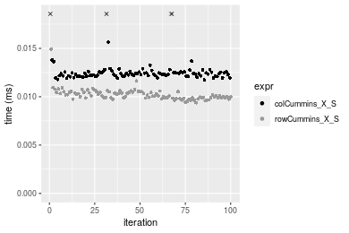

#### 100x1000 double matrix

```r
> X <- data[["100x1000"]]
> rows <- sample.int(nrow(X), size = nrow(X) * 0.7)
> cols <- sample.int(ncol(X), size = ncol(X) * 0.7)
> X_S <- X[rows, cols]
> gc()
          used  (Mb) gc trigger  (Mb) max used  (Mb)
Ncells 5169782 276.1    7554717 403.5  7554717 403.5
Vcells 9233488  70.5   31793280 242.6 60508962 461.7
> colStats <- microbenchmark(colCummins_X_S = colCummins(X_S), `colCummins(X, rows, cols)` = colCummins(X, 
+     rows = rows, cols = cols), `colCummins(X[rows, cols])` = colCummins(X[rows, cols]), unit = "ms")
> X <- t(X)
> X_S <- t(X_S)
> gc()
          used  (Mb) gc trigger  (Mb) max used  (Mb)
Ncells 5169776 276.1    7554717 403.5  7554717 403.5
Vcells 9333571  71.3   31793280 242.6 60508962 461.7
> rowStats <- microbenchmark(rowCummins_X_S = rowCummins(X_S), `rowCummins(X, cols, rows)` = rowCummins(X, 
+     rows = cols, cols = rows), `rowCummins(X[cols, rows])` = rowCummins(X[cols, rows]), unit = "ms")
```

_Table: Benchmarking of colCummins_X_S(), colCummins(X, rows, cols)() and colCummins(X[rows, cols])() on double+100x1000 data. The top panel shows times in milliseconds and the bottom panel shows relative times._


|   |expr                      |      min|        lq|      mean|    median|        uq|      max|
|:--|:-------------------------|--------:|---------:|---------:|---------:|---------:|--------:|
|1  |colCummins_X_S            | 0.109806| 0.1204930| 0.1431060| 0.1311470| 0.1582860| 0.228617|
|2  |colCummins(X, rows, cols) | 0.168535| 0.1888955| 0.2174983| 0.2071915| 0.2385405| 0.369377|
|3  |colCummins(X[rows, cols]) | 0.210663| 0.2354020| 0.2726687| 0.2578750| 0.2961635| 0.441452|


|   |expr                      |      min|       lq|     mean|   median|       uq|      max|
|:--|:-------------------------|--------:|--------:|--------:|--------:|--------:|--------:|
|1  |colCummins_X_S            | 1.000000| 1.000000| 1.000000| 1.000000| 1.000000| 1.000000|
|2  |colCummins(X, rows, cols) | 1.534843| 1.567689| 1.519840| 1.579842| 1.507022| 1.615702|
|3  |colCummins(X[rows, cols]) | 1.918502| 1.953657| 1.905361| 1.966305| 1.871066| 1.930967|

_Table: Benchmarking of rowCummins_X_S(), rowCummins(X, cols, rows)() and rowCummins(X[cols, rows])() on double+100x1000 data (transposed). The top panel shows times in milliseconds and the bottom panel shows relative times._


|   |expr                      |      min|        lq|      mean|    median|        uq|      max|
|:--|:-------------------------|--------:|---------:|---------:|---------:|---------:|--------:|
|1  |rowCummins_X_S            | 0.052667| 0.0567725| 0.0629682| 0.0613385| 0.0670305| 0.101740|
|2  |rowCummins(X, cols, rows) | 0.113617| 0.1213380| 0.1347279| 0.1252555| 0.1457040| 0.264213|
|3  |rowCummins(X[cols, rows]) | 0.168825| 0.1811490| 0.2023078| 0.1917470| 0.2139530| 0.346913|


|   |expr                      |      min|       lq|     mean|   median|       uq|      max|
|:--|:-------------------------|--------:|--------:|--------:|--------:|--------:|--------:|
|1  |rowCummins_X_S            | 1.000000| 1.000000| 1.000000| 1.000000| 1.000000| 1.000000|
|2  |rowCummins(X, cols, rows) | 2.157271| 2.137267| 2.139620| 2.042037| 2.173697| 2.596943|
|3  |rowCummins(X[cols, rows]) | 3.205518| 3.190788| 3.212859| 3.126046| 3.191875| 3.409800|

_Figure: Benchmarking of colCummins_X_S(), colCummins(X, rows, cols)() and colCummins(X[rows, cols])() on double+100x1000 data  as well as rowCummins_X_S(), rowCummins(X, cols, rows)() and rowCummins(X[cols, rows])() on the same data transposed.  Outliers are displayed as crosses.  Times are in milliseconds._


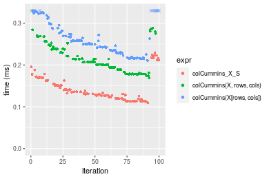

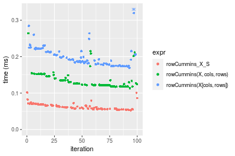
_Table: Benchmarking of colCummins_X_S() and rowCummins_X_S() on double+100x1000 data (original and transposed).  The top panel shows times in milliseconds and the bottom panel shows relative times._


|   |expr           |     min|       lq|      mean|   median|       uq|     max|
|:--|:--------------|-------:|--------:|---------:|--------:|--------:|-------:|
|2  |rowCummins_X_S |  52.667|  56.7725|  62.96815|  61.3385|  67.0305| 101.740|
|1  |colCummins_X_S | 109.806| 120.4930| 143.10604| 131.1470| 158.2860| 228.617|


|   |expr           |      min|       lq|     mean|   median|       uq|      max|
|:--|:--------------|--------:|--------:|--------:|--------:|--------:|--------:|
|2  |rowCummins_X_S | 1.000000| 1.000000| 1.000000| 1.000000| 1.000000| 1.000000|
|1  |colCummins_X_S | 2.084911| 2.122383| 2.272673| 2.138086| 2.361403| 2.247071|

_Figure: Benchmarking of colCummins_X_S() and rowCummins_X_S() on double+100x1000 data (original and transposed).  Outliers are displayed as crosses. Times are in milliseconds._


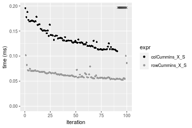

#### 1000x100 double matrix

```r
> X <- data[["1000x100"]]
> rows <- sample.int(nrow(X), size = nrow(X) * 0.7)
> cols <- sample.int(ncol(X), size = ncol(X) * 0.7)
> X_S <- X[rows, cols]
> gc()
          used  (Mb) gc trigger  (Mb) max used  (Mb)
Ncells 5169995 276.2    7554717 403.5  7554717 403.5
Vcells 9233632  70.5   31793280 242.6 60508962 461.7
> colStats <- microbenchmark(colCummins_X_S = colCummins(X_S), `colCummins(X, rows, cols)` = colCummins(X, 
+     rows = rows, cols = cols), `colCummins(X[rows, cols])` = colCummins(X[rows, cols]), unit = "ms")
> X <- t(X)
> X_S <- t(X_S)
> gc()
          used  (Mb) gc trigger  (Mb) max used  (Mb)
Ncells 5169989 276.2    7554717 403.5  7554717 403.5
Vcells 9333715  71.3   31793280 242.6 60508962 461.7
> rowStats <- microbenchmark(rowCummins_X_S = rowCummins(X_S), `rowCummins(X, cols, rows)` = rowCummins(X, 
+     rows = cols, cols = rows), `rowCummins(X[cols, rows])` = rowCummins(X[cols, rows]), unit = "ms")
```

_Table: Benchmarking of colCummins_X_S(), colCummins(X, rows, cols)() and colCummins(X[rows, cols])() on double+1000x100 data. The top panel shows times in milliseconds and the bottom panel shows relative times._


|   |expr                      |      min|        lq|      mean|    median|        uq|      max|
|:--|:-------------------------|--------:|---------:|---------:|---------:|---------:|--------:|
|1  |colCummins_X_S            | 0.156406| 0.1790685| 0.2639617| 0.2192705| 0.3547225| 0.409570|
|2  |colCummins(X, rows, cols) | 0.179490| 0.2952220| 0.3826319| 0.3441610| 0.5076630| 0.684654|
|3  |colCummins(X[rows, cols]) | 0.282646| 0.3861905| 0.5465701| 0.4615800| 0.7420170| 1.099684|


|   |expr                      |     min|       lq|     mean|   median|       uq|      max|
|:--|:-------------------------|-------:|--------:|--------:|--------:|--------:|--------:|
|1  |colCummins_X_S            | 1.00000| 1.000000| 1.000000| 1.000000| 1.000000| 1.000000|
|2  |colCummins(X, rows, cols) | 1.14759| 1.648654| 1.449574| 1.569573| 1.431155| 1.671641|
|3  |colCummins(X[rows, cols]) | 1.80713| 2.156664| 2.070641| 2.105071| 2.091824| 2.684972|

_Table: Benchmarking of rowCummins_X_S(), rowCummins(X, cols, rows)() and rowCummins(X[cols, rows])() on double+1000x100 data (transposed). The top panel shows times in milliseconds and the bottom panel shows relative times._


|   |expr                      |      min|        lq|      mean|    median|        uq|      max|
|:--|:-------------------------|--------:|---------:|---------:|---------:|---------:|--------:|
|1  |rowCummins_X_S            | 0.052879| 0.0554065| 0.0611304| 0.0571495| 0.0628320| 0.102103|
|2  |rowCummins(X, cols, rows) | 0.112134| 0.1189430| 0.1264798| 0.1234195| 0.1316475| 0.277960|
|3  |rowCummins(X[cols, rows]) | 0.168514| 0.1753270| 0.1877459| 0.1799760| 0.1977105| 0.266418|


|   |expr                      |      min|       lq|     mean|   median|       uq|      max|
|:--|:-------------------------|--------:|--------:|--------:|--------:|--------:|--------:|
|1  |rowCummins_X_S            | 1.000000| 1.000000| 1.000000| 1.000000| 1.000000| 1.000000|
|2  |rowCummins(X, cols, rows) | 2.120577| 2.146734| 2.069017| 2.159590| 2.095230| 2.722349|
|3  |rowCummins(X[cols, rows]) | 3.186785| 3.164376| 3.071238| 3.149214| 3.146653| 2.609306|

_Figure: Benchmarking of colCummins_X_S(), colCummins(X, rows, cols)() and colCummins(X[rows, cols])() on double+1000x100 data  as well as rowCummins_X_S(), rowCummins(X, cols, rows)() and rowCummins(X[cols, rows])() on the same data transposed.  Outliers are displayed as crosses.  Times are in milliseconds._


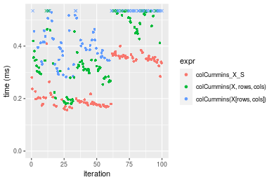

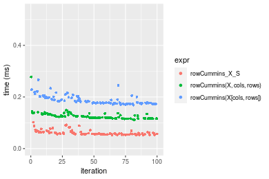
_Table: Benchmarking of colCummins_X_S() and rowCummins_X_S() on double+1000x100 data (original and transposed).  The top panel shows times in milliseconds and the bottom panel shows relative times._


|   |expr           |     min|       lq|      mean|   median|       uq|     max|
|:--|:--------------|-------:|--------:|---------:|--------:|--------:|-------:|
|2  |rowCummins_X_S |  52.879|  55.4065|  61.13037|  57.1495|  62.8320| 102.103|
|1  |colCummins_X_S | 156.406| 179.0685| 263.96174| 219.2705| 354.7225| 409.570|


|   |expr           |      min|       lq|     mean|   median|       uq|      max|
|:--|:--------------|--------:|--------:|--------:|--------:|--------:|--------:|
|2  |rowCummins_X_S | 1.000000| 1.000000| 1.000000| 1.000000| 1.000000| 1.000000|
|1  |colCummins_X_S | 2.957809| 3.231904| 4.318013| 3.836788| 5.645571| 4.011342|

_Figure: Benchmarking of colCummins_X_S() and rowCummins_X_S() on double+1000x100 data (original and transposed).  Outliers are displayed as crosses. Times are in milliseconds._


## Appendix

### Session information
```r
R version 4.1.1 Patched (2021-08-10 r80727)
Platform: x86_64-pc-linux-gnu (64-bit)
Running under: Ubuntu 18.04.5 LTS

Matrix products: default
BLAS:   /home/hb/software/R-devel/R-4-1-branch/lib/R/lib/libRblas.so
LAPACK: /home/hb/software/R-devel/R-4-1-branch/lib/R/lib/libRlapack.so

locale:
 [1] LC_CTYPE=en_US.UTF-8       LC_NUMERIC=C              
 [3] LC_TIME=en_US.UTF-8        LC_COLLATE=en_US.UTF-8    
 [5] LC_MONETARY=en_US.UTF-8    LC_MESSAGES=en_US.UTF-8   
 [7] LC_PAPER=en_US.UTF-8       LC_NAME=C                 
 [9] LC_ADDRESS=C               LC_TELEPHONE=C            
[11] LC_MEASUREMENT=en_US.UTF-8 LC_IDENTIFICATION=C       

attached base packages:
[1] stats     graphics  grDevices utils     datasets  methods   base     

other attached packages:
[1] microbenchmark_1.4-7   matrixStats_0.60.0     ggplot2_3.3.5         
[4] knitr_1.33             R.devices_2.17.0       R.utils_2.10.1        
[7] R.oo_1.24.0            R.methodsS3_1.8.1-9001

loaded via a namespace (and not attached):
 [1] Biobase_2.52.0          httr_1.4.2              splines_4.1.1          
 [4] bit64_4.0.5             network_1.17.1          assertthat_0.2.1       
 [7] highr_0.9               stats4_4.1.1            blob_1.2.2             
[10] GenomeInfoDbData_1.2.6  robustbase_0.93-8       pillar_1.6.2           
[13] RSQLite_2.2.8           lattice_0.20-44         glue_1.4.2             
[16] digest_0.6.27           XVector_0.32.0          colorspace_2.0-2       
[19] Matrix_1.3-4            XML_3.99-0.7            pkgconfig_2.0.3        
[22] zlibbioc_1.38.0         genefilter_1.74.0       purrr_0.3.4            
[25] ergm_4.1.2              xtable_1.8-4            scales_1.1.1           
[28] tibble_3.1.4            annotate_1.70.0         KEGGREST_1.32.0        
[31] farver_2.1.0            generics_0.1.0          IRanges_2.26.0         
[34] ellipsis_0.3.2          cachem_1.0.6            withr_2.4.2            
[37] BiocGenerics_0.38.0     mime_0.11               survival_3.2-13        
[40] magrittr_2.0.1          crayon_1.4.1            statnet.common_4.5.0   
[43] memoise_2.0.0           laeken_0.5.1            fansi_0.5.0            
[46] R.cache_0.15.0          MASS_7.3-54             R.rsp_0.44.0           
[49] tools_4.1.1             lifecycle_1.0.0         S4Vectors_0.30.0       
[52] trust_0.1-8             munsell_0.5.0           AnnotationDbi_1.54.1   
[55] Biostrings_2.60.2       compiler_4.1.1          GenomeInfoDb_1.28.1    
[58] rlang_0.4.11            grid_4.1.1              RCurl_1.98-1.4         
[61] cwhmisc_6.6             rappdirs_0.3.3          labeling_0.4.2         
[64] bitops_1.0-7            base64enc_0.1-3         boot_1.3-28            
[67] gtable_0.3.0            DBI_1.1.1               markdown_1.1           
[70] R6_2.5.1                lpSolveAPI_5.5.2.0-17.7 rle_0.9.2              
[73] dplyr_1.0.7             fastmap_1.1.0           bit_4.0.4              
[76] utf8_1.2.2              parallel_4.1.1          Rcpp_1.0.7             
[79] vctrs_0.3.8             png_0.1-7               DEoptimR_1.0-9         
[82] tidyselect_1.1.1        xfun_0.25               coda_0.19-4            
```
Total processing time was 23.18 secs.


### Reproducibility
To reproduce this report, do:
```r
html <- matrixStats:::benchmark('colRowCummins_subset')
```

[RSP]: https://cran.r-project.org/package=R.rsp
[matrixStats]: https://cran.r-project.org/package=matrixStats

[StackOverflow:colMins?]: https://stackoverflow.com/questions/13676878 "Stack Overflow: fastest way to get Min from every column in a matrix?"
[StackOverflow:colSds?]: https://stackoverflow.com/questions/17549762 "Stack Overflow: Is there such 'colsd' in R?"
[StackOverflow:rowProds?]: https://stackoverflow.com/questions/20198801/ "Stack Overflow: Row product of matrix and column sum of matrix"

---------------------------------------
Copyright Dongcan Jiang. Last updated on 2021-08-25 17:37:22 (+0200 UTC). Powered by [RSP].

<script>
 var link = document.createElement('link');
 link.rel = 'icon';
 link.href = "data:image/png;base64,iVBORw0KGgoAAAANSUhEUgAAACAAAAAgCAMAAABEpIrGAAAA21BMVEUAAAAAAP8AAP8AAP8AAP8AAP8AAP8AAP8AAP8AAP8AAP8AAP8AAP8AAP8AAP8AAP8AAP8AAP8AAP8AAP8AAP8AAP8AAP8AAP8AAP8AAP8AAP8AAP8AAP8AAP8AAP8AAP8AAP8AAP8AAP8AAP8AAP8AAP8AAP8AAP8AAP8AAP8BAf4CAv0DA/wdHeIeHuEfH+AgIN8hId4lJdomJtknJ9g+PsE/P8BAQL9yco10dIt1dYp3d4h4eIeVlWqWlmmXl2iYmGeZmWabm2Tn5xjo6Bfp6Rb39wj4+Af//wA2M9hbAAAASXRSTlMAAQIJCgsMJSYnKD4/QGRlZmhpamtsbautrrCxuru8y8zN5ebn6Pn6+///////////////////////////////////////////LsUNcQAAAS9JREFUOI29k21XgkAQhVcFytdSMqMETU26UVqGmpaiFbL//xc1cAhhwVNf6n5i5z67M2dmYOyfJZUqlVLhkKucG7cgmUZTybDz6g0iDeq51PUr37Ds2cy2/C9NeES5puDjxuUk1xnToZsg8pfA3avHQ3lLIi7iWRrkv/OYtkScxBIMgDee0ALoyxHQBJ68JLCjOtQIMIANF7QG9G9fNnHvisCHBVMKgSJgiz7nE+AoBKrAPA3MgepvgR9TSCasrCKH0eB1wBGBFdCO+nAGjMVGPcQb5bd6mQRegN6+1axOs9nGfYcCtfi4NQosdtH7dB+txFIpXQqN1p9B/asRHToyS0jRgpV7nk4nwcq1BJ+x3Gl/v7S9Wmpp/aGquum7w3ZDyrADFYrl8vHBH+ev9AUASW1dmU4h4wAAAABJRU5ErkJggg=="
 document.getElementsByTagName('head')[0].appendChild(link);
</script>


