[matrixStats]: Benchmark report

---------------------------------------


# colCumprods() and rowCumprods() benchmarks

This report benchmark the performance of colCumprods() and rowCumprods() against alternative methods.

## Alternative methods

* apply() + cumprod()


## Data type "integer"

### Data
```r
> rmatrix <- function(nrow, ncol, mode = c("logical", "double", "integer", "index"), range = c(-100, 
+     +100), na_prob = 0) {
+     mode <- match.arg(mode)
+     n <- nrow * ncol
+     if (mode == "logical") {
+         x <- sample(c(FALSE, TRUE), size = n, replace = TRUE)
+     }     else if (mode == "index") {
+         x <- seq_len(n)
+         mode <- "integer"
+     }     else {
+         x <- runif(n, min = range[1], max = range[2])
+     }
+     storage.mode(x) <- mode
+     if (na_prob > 0) 
+         x[sample(n, size = na_prob * n)] <- NA
+     dim(x) <- c(nrow, ncol)
+     x
+ }
> rmatrices <- function(scale = 10, seed = 1, ...) {
+     set.seed(seed)
+     data <- list()
+     data[[1]] <- rmatrix(nrow = scale * 1, ncol = scale * 1, ...)
+     data[[2]] <- rmatrix(nrow = scale * 10, ncol = scale * 10, ...)
+     data[[3]] <- rmatrix(nrow = scale * 100, ncol = scale * 1, ...)
+     data[[4]] <- t(data[[3]])
+     data[[5]] <- rmatrix(nrow = scale * 10, ncol = scale * 100, ...)
+     data[[6]] <- t(data[[5]])
+     names(data) <- sapply(data, FUN = function(x) paste(dim(x), collapse = "x"))
+     data
+ }
> data <- rmatrices(mode = mode, range = c(-1, 1))
```

### Results

#### 10x10 integer matrix

```r
> X <- data[["10x10"]]
> gc()
          used  (Mb) gc trigger  (Mb) max used  (Mb)
Ncells 5178024 276.6    7554717 403.5  7554717 403.5
Vcells 9452439  72.2   31793280 242.6 60508962 461.7
> colStats <- microbenchmark(colCumprods = colCumprods(X), `apply+cumprod` = apply(X, MARGIN = 2L, 
+     FUN = cumprod), unit = "ms")
> X <- t(X)
> gc()
          used  (Mb) gc trigger  (Mb) max used  (Mb)
Ncells 5176956 276.5    7554717 403.5  7554717 403.5
Vcells 9449426  72.1   31793280 242.6 60508962 461.7
> rowStats <- microbenchmark(rowCumprods = rowCumprods(X), `apply+cumprod` = apply(X, MARGIN = 1L, 
+     FUN = cumprod), unit = "ms")
```

_Table: Benchmarking of colCumprods() and apply+cumprod() on integer+10x10 data. The top panel shows times in milliseconds and the bottom panel shows relative times._


|   |expr          |      min|        lq|      mean|    median|        uq|      max|
|:--|:-------------|--------:|---------:|---------:|---------:|---------:|--------:|
|1  |colCumprods   | 0.002372| 0.0025460| 0.0034677| 0.0035590| 0.0039095| 0.013346|
|2  |apply+cumprod | 0.045177| 0.0462435| 0.0481721| 0.0467145| 0.0473715| 0.131500|


|   |expr          |      min|      lq|     mean|   median|       uq|      max|
|:--|:-------------|--------:|-------:|--------:|--------:|--------:|--------:|
|1  |colCumprods   |  1.00000|  1.0000|  1.00000|  1.00000|  1.00000| 1.000000|
|2  |apply+cumprod | 19.04595| 18.1632| 13.89154| 13.12574| 12.11702| 9.853139|

_Table: Benchmarking of rowCumprods() and apply+cumprod() on integer+10x10 data (transposed). The top panel shows times in milliseconds and the bottom panel shows relative times._


|   |expr          |      min|        lq|      mean|    median|        uq|      max|
|:--|:-------------|--------:|---------:|---------:|---------:|---------:|--------:|
|1  |rowCumprods   | 0.002431| 0.0028240| 0.0037362| 0.0038555| 0.0040230| 0.013634|
|2  |apply+cumprod | 0.045651| 0.0464255| 0.0480907| 0.0468075| 0.0473975| 0.126061|


|   |expr          |      min|       lq|    mean|   median|       uq|      max|
|:--|:-------------|--------:|--------:|-------:|--------:|--------:|--------:|
|1  |rowCumprods   |  1.00000|  1.00000|  1.0000|  1.00000|  1.00000| 1.000000|
|2  |apply+cumprod | 18.77869| 16.43962| 12.8717| 12.14045| 11.78163| 9.246076|

_Figure: Benchmarking of colCumprods() and apply+cumprod() on integer+10x10 data  as well as rowCumprods() and apply+cumprod() on the same data transposed.  Outliers are displayed as crosses.  Times are in milliseconds._


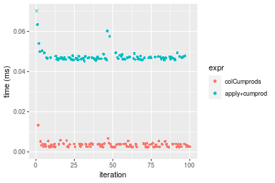

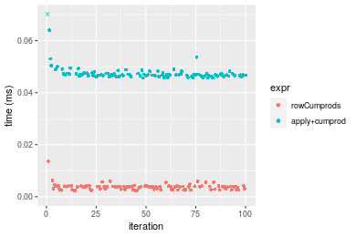
_Table: Benchmarking of colCumprods() and rowCumprods() on integer+10x10 data (original and transposed).  The top panel shows times in milliseconds and the bottom panel shows relative times._


|   |expr        |   min|    lq|    mean| median|     uq|    max|
|:--|:-----------|-----:|-----:|-------:|------:|------:|------:|
|1  |colCumprods | 2.372| 2.546| 3.46773| 3.5590| 3.9095| 13.346|
|2  |rowCumprods | 2.431| 2.824| 3.73616| 3.8555| 4.0230| 13.634|


|   |expr        |      min|       lq|     mean|  median|       uq|     max|
|:--|:-----------|--------:|--------:|--------:|-------:|--------:|-------:|
|1  |colCumprods | 1.000000| 1.000000| 1.000000| 1.00000| 1.000000| 1.00000|
|2  |rowCumprods | 1.024873| 1.109191| 1.077408| 1.08331| 1.029032| 1.02158|

_Figure: Benchmarking of colCumprods() and rowCumprods() on integer+10x10 data (original and transposed).  Outliers are displayed as crosses. Times are in milliseconds._


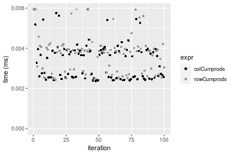

#### 100x100 integer matrix

```r
> X <- data[["100x100"]]
> gc()
          used  (Mb) gc trigger  (Mb) max used  (Mb)
Ncells 5175500 276.5    7554717 403.5  7554717 403.5
Vcells 9066350  69.2   31793280 242.6 60508962 461.7
> colStats <- microbenchmark(colCumprods = colCumprods(X), `apply+cumprod` = apply(X, MARGIN = 2L, 
+     FUN = cumprod), unit = "ms")
> X <- t(X)
> gc()
          used  (Mb) gc trigger  (Mb) max used  (Mb)
Ncells 5175494 276.5    7554717 403.5  7554717 403.5
Vcells 9071393  69.3   31793280 242.6 60508962 461.7
> rowStats <- microbenchmark(rowCumprods = rowCumprods(X), `apply+cumprod` = apply(X, MARGIN = 1L, 
+     FUN = cumprod), unit = "ms")
```

_Table: Benchmarking of colCumprods() and apply+cumprod() on integer+100x100 data. The top panel shows times in milliseconds and the bottom panel shows relative times._


|   |expr          |      min|        lq|      mean|   median|       uq|      max|
|:--|:-------------|--------:|---------:|---------:|--------:|--------:|--------:|
|1  |colCumprods   | 0.025893| 0.0270315| 0.0293369| 0.028194| 0.030885| 0.047076|
|2  |apply+cumprod | 0.254374| 0.2642505| 0.2931011| 0.275177| 0.310580| 0.482404|


|   |expr          |      min|       lq|     mean|   median|       uq|      max|
|:--|:-------------|--------:|--------:|--------:|--------:|--------:|--------:|
|1  |colCumprods   | 1.000000| 1.000000| 1.000000| 1.000000|  1.00000|  1.00000|
|2  |apply+cumprod | 9.824045| 9.775651| 9.990884| 9.760126| 10.05601| 10.24734|

_Table: Benchmarking of rowCumprods() and apply+cumprod() on integer+100x100 data (transposed). The top panel shows times in milliseconds and the bottom panel shows relative times._


|   |expr          |      min|       lq|      mean|    median|        uq|      max|
|:--|:-------------|--------:|--------:|---------:|---------:|---------:|--------:|
|1  |rowCumprods   | 0.032446| 0.035186| 0.0391806| 0.0368565| 0.0421665| 0.067779|
|2  |apply+cumprod | 0.251339| 0.267078| 0.3057960| 0.2910230| 0.3403490| 0.493983|


|   |expr          |      min|       lq|     mean|   median|      uq|      max|
|:--|:-------------|--------:|--------:|--------:|--------:|-------:|--------:|
|1  |rowCumprods   | 1.000000| 1.000000| 1.000000| 1.000000| 1.00000| 1.000000|
|2  |apply+cumprod | 7.746379| 7.590462| 7.804773| 7.896111| 8.07155| 7.288142|

_Figure: Benchmarking of colCumprods() and apply+cumprod() on integer+100x100 data  as well as rowCumprods() and apply+cumprod() on the same data transposed.  Outliers are displayed as crosses.  Times are in milliseconds._


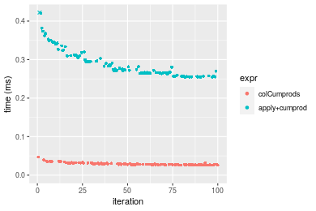

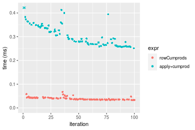
_Table: Benchmarking of colCumprods() and rowCumprods() on integer+100x100 data (original and transposed).  The top panel shows times in milliseconds and the bottom panel shows relative times._


|   |expr        |    min|      lq|     mean|  median|      uq|    max|
|:--|:-----------|------:|-------:|--------:|-------:|-------:|------:|
|1  |colCumprods | 25.893| 27.0315| 29.33686| 28.1940| 30.8850| 47.076|
|2  |rowCumprods | 32.446| 35.1860| 39.18064| 36.8565| 42.1665| 67.779|


|   |expr        |     min|       lq|     mean|   median|       uq|      max|
|:--|:-----------|-------:|--------:|--------:|--------:|--------:|--------:|
|1  |colCumprods | 1.00000| 1.000000| 1.000000| 1.000000| 1.000000| 1.000000|
|2  |rowCumprods | 1.25308| 1.301667| 1.335543| 1.307246| 1.365274| 1.439778|

_Figure: Benchmarking of colCumprods() and rowCumprods() on integer+100x100 data (original and transposed).  Outliers are displayed as crosses. Times are in milliseconds._


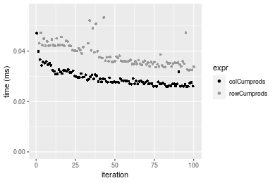

#### 1000x10 integer matrix

```r
> X <- data[["1000x10"]]
> gc()
          used  (Mb) gc trigger  (Mb) max used  (Mb)
Ncells 5175690 276.5    7554717 403.5  7554717 403.5
Vcells 9066690  69.2   31793280 242.6 60508962 461.7
> colStats <- microbenchmark(colCumprods = colCumprods(X), `apply+cumprod` = apply(X, MARGIN = 2L, 
+     FUN = cumprod), unit = "ms")
> X <- t(X)
> gc()
          used  (Mb) gc trigger  (Mb) max used  (Mb)
Ncells 5175684 276.5    7554717 403.5  7554717 403.5
Vcells 9071733  69.3   31793280 242.6 60508962 461.7
> rowStats <- microbenchmark(rowCumprods = rowCumprods(X), `apply+cumprod` = apply(X, MARGIN = 1L, 
+     FUN = cumprod), unit = "ms")
```

_Table: Benchmarking of colCumprods() and apply+cumprod() on integer+1000x10 data. The top panel shows times in milliseconds and the bottom panel shows relative times._


|   |expr          |      min|        lq|      mean|    median|       uq|      max|
|:--|:-------------|--------:|---------:|---------:|---------:|--------:|--------:|
|1  |colCumprods   | 0.026555| 0.0288340| 0.0313220| 0.0312675| 0.033018| 0.051575|
|2  |apply+cumprod | 0.157826| 0.1716085| 0.1937528| 0.1884020| 0.209066| 0.301239|


|   |expr          |      min|       lq|    mean|  median|      uq|      max|
|:--|:-------------|--------:|--------:|-------:|-------:|-------:|--------:|
|1  |colCumprods   | 1.000000| 1.000000| 1.00000| 1.00000| 1.00000| 1.000000|
|2  |apply+cumprod | 5.943363| 5.951602| 6.18583| 6.02549| 6.33188| 5.840795|

_Table: Benchmarking of rowCumprods() and apply+cumprod() on integer+1000x10 data (transposed). The top panel shows times in milliseconds and the bottom panel shows relative times._


|   |expr          |      min|       lq|      mean|    median|        uq|      max|
|:--|:-------------|--------:|--------:|---------:|---------:|---------:|--------:|
|1  |rowCumprods   | 0.033026| 0.034428| 0.0372024| 0.0360015| 0.0392770| 0.056054|
|2  |apply+cumprod | 0.152555| 0.161052| 0.1787728| 0.1735250| 0.1903835| 0.297116|


|   |expr          |      min|       lq|     mean|   median|       uq|      max|
|:--|:-------------|--------:|--------:|--------:|--------:|--------:|--------:|
|1  |rowCumprods   | 1.000000| 1.000000| 1.000000| 1.000000| 1.000000| 1.000000|
|2  |apply+cumprod | 4.619239| 4.677937| 4.805407| 4.819938| 4.847201| 5.300532|

_Figure: Benchmarking of colCumprods() and apply+cumprod() on integer+1000x10 data  as well as rowCumprods() and apply+cumprod() on the same data transposed.  Outliers are displayed as crosses.  Times are in milliseconds._


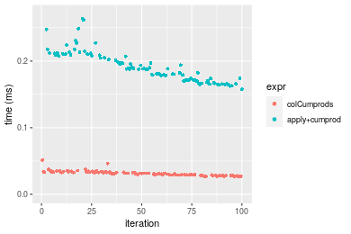

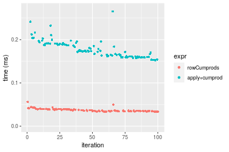
_Table: Benchmarking of colCumprods() and rowCumprods() on integer+1000x10 data (original and transposed).  The top panel shows times in milliseconds and the bottom panel shows relative times._


|   |expr        |    min|     lq|     mean|  median|     uq|    max|
|:--|:-----------|------:|------:|--------:|-------:|------:|------:|
|1  |colCumprods | 26.555| 28.834| 31.32203| 31.2675| 33.018| 51.575|
|2  |rowCumprods | 33.026| 34.428| 37.20243| 36.0015| 39.277| 56.054|


|   |expr        |      min|       lq|    mean|   median|       uq|      max|
|:--|:-----------|--------:|--------:|-------:|--------:|--------:|--------:|
|1  |colCumprods | 1.000000| 1.000000| 1.00000| 1.000000| 1.000000| 1.000000|
|2  |rowCumprods | 1.243683| 1.194007| 1.18774| 1.151403| 1.189563| 1.086844|

_Figure: Benchmarking of colCumprods() and rowCumprods() on integer+1000x10 data (original and transposed).  Outliers are displayed as crosses. Times are in milliseconds._


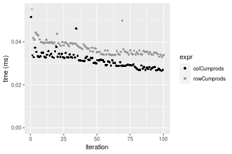

#### 10x1000 integer matrix

```r
> X <- data[["10x1000"]]
> gc()
          used  (Mb) gc trigger  (Mb) max used  (Mb)
Ncells 5175878 276.5    7554717 403.5  7554717 403.5
Vcells 9067374  69.2   31793280 242.6 60508962 461.7
> colStats <- microbenchmark(colCumprods = colCumprods(X), `apply+cumprod` = apply(X, MARGIN = 2L, 
+     FUN = cumprod), unit = "ms")
> X <- t(X)
> gc()
          used  (Mb) gc trigger  (Mb) max used  (Mb)
Ncells 5175872 276.5    7554717 403.5  7554717 403.5
Vcells 9072417  69.3   31793280 242.6 60508962 461.7
> rowStats <- microbenchmark(rowCumprods = rowCumprods(X), `apply+cumprod` = apply(X, MARGIN = 1L, 
+     FUN = cumprod), unit = "ms")
```

_Table: Benchmarking of colCumprods() and apply+cumprod() on integer+10x1000 data. The top panel shows times in milliseconds and the bottom panel shows relative times._


|   |expr          |      min|       lq|      mean|   median|       uq|      max|
|:--|:-------------|--------:|--------:|---------:|--------:|--------:|--------:|
|1  |colCumprods   | 0.021037| 0.022581| 0.0271792| 0.025019| 0.030057| 0.048105|
|2  |apply+cumprod | 0.923671| 0.967107| 1.0991210| 1.057970| 1.191586| 1.532380|


|   |expr          |      min|       lq|     mean|   median|       uq|     max|
|:--|:-------------|--------:|--------:|--------:|--------:|--------:|-------:|
|1  |colCumprods   |  1.00000|  1.00000|  1.00000|  1.00000|  1.00000|  1.0000|
|2  |apply+cumprod | 43.90697| 42.82835| 40.43981| 42.28668| 39.64421| 31.8549|

_Table: Benchmarking of rowCumprods() and apply+cumprod() on integer+10x1000 data (transposed). The top panel shows times in milliseconds and the bottom panel shows relative times._


|   |expr          |      min|        lq|      mean|   median|        uq|      max|
|:--|:-------------|--------:|---------:|---------:|--------:|---------:|--------:|
|1  |rowCumprods   | 0.023854| 0.0251335| 0.0285194| 0.026325| 0.0305315| 0.051174|
|2  |apply+cumprod | 0.968060| 0.9834990| 1.0817697| 0.994157| 1.1774500| 1.540775|


|   |expr          |      min|     lq|   mean|   median|       uq|      max|
|:--|:-------------|--------:|------:|------:|--------:|--------:|--------:|
|1  |rowCumprods   |  1.00000|  1.000|  1.000|  1.00000|  1.00000|  1.00000|
|2  |apply+cumprod | 40.58271| 39.131| 37.931| 37.76475| 38.56509| 30.10855|

_Figure: Benchmarking of colCumprods() and apply+cumprod() on integer+10x1000 data  as well as rowCumprods() and apply+cumprod() on the same data transposed.  Outliers are displayed as crosses.  Times are in milliseconds._


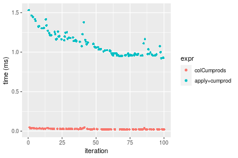

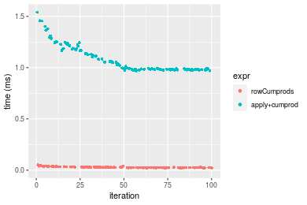
_Table: Benchmarking of colCumprods() and rowCumprods() on integer+10x1000 data (original and transposed).  The top panel shows times in milliseconds and the bottom panel shows relative times._


|   |expr        |    min|      lq|     mean| median|      uq|    max|
|:--|:-----------|------:|-------:|--------:|------:|-------:|------:|
|1  |colCumprods | 21.037| 22.5810| 27.17918| 25.019| 30.0570| 48.105|
|2  |rowCumprods | 23.854| 25.1335| 28.51941| 26.325| 30.5315| 51.174|


|   |expr        |      min|       lq|     mean| median|       uq|      max|
|:--|:-----------|--------:|--------:|--------:|------:|--------:|--------:|
|1  |colCumprods | 1.000000| 1.000000| 1.000000| 1.0000| 1.000000| 1.000000|
|2  |rowCumprods | 1.133907| 1.113037| 1.049311| 1.0522| 1.015787| 1.063798|

_Figure: Benchmarking of colCumprods() and rowCumprods() on integer+10x1000 data (original and transposed).  Outliers are displayed as crosses. Times are in milliseconds._


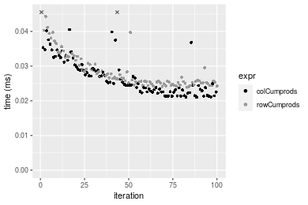

#### 100x1000 integer matrix

```r
> X <- data[["100x1000"]]
> gc()
          used  (Mb) gc trigger  (Mb) max used  (Mb)
Ncells 5176068 276.5    7554717 403.5  7554717 403.5
Vcells 9067876  69.2   31793280 242.6 60508962 461.7
> colStats <- microbenchmark(colCumprods = colCumprods(X), `apply+cumprod` = apply(X, MARGIN = 2L, 
+     FUN = cumprod), unit = "ms")
> X <- t(X)
> gc()
          used  (Mb) gc trigger  (Mb) max used  (Mb)
Ncells 5176056 276.5    7554717 403.5  7554717 403.5
Vcells 9117909  69.6   31793280 242.6 60508962 461.7
> rowStats <- microbenchmark(rowCumprods = rowCumprods(X), `apply+cumprod` = apply(X, MARGIN = 1L, 
+     FUN = cumprod), unit = "ms")
```

_Table: Benchmarking of colCumprods() and apply+cumprod() on integer+100x1000 data. The top panel shows times in milliseconds and the bottom panel shows relative times._


|   |expr          |      min|        lq|      mean|    median|        uq|      max|
|:--|:-------------|--------:|---------:|---------:|---------:|---------:|--------:|
|1  |colCumprods   | 0.189411| 0.1971045| 0.2205661| 0.2121985| 0.2389065|  0.33686|
|2  |apply+cumprod | 1.834509| 1.8671805| 2.4449273| 2.0209890| 2.3176440| 18.11043|


|   |expr          |      min|       lq|     mean|   median|      uq|      max|
|:--|:-------------|--------:|--------:|--------:|--------:|-------:|--------:|
|1  |colCumprods   | 1.000000| 1.000000|  1.00000| 1.000000| 1.00000|  1.00000|
|2  |apply+cumprod | 9.685335| 9.473049| 11.08478| 9.524049| 9.70105| 53.76247|

_Table: Benchmarking of rowCumprods() and apply+cumprod() on integer+100x1000 data (transposed). The top panel shows times in milliseconds and the bottom panel shows relative times._


|   |expr          |      min|        lq|      mean|   median|       uq|       max|
|:--|:-------------|--------:|---------:|---------:|--------:|--------:|---------:|
|1  |rowCumprods   | 0.233216| 0.2477915| 0.2854197| 0.270051| 0.298229|  0.602251|
|2  |apply+cumprod | 1.838343| 1.9619630| 2.6074069| 2.139464| 2.415271| 19.145657|


|   |expr          |      min|       lq|     mean|   median|       uq|      max|
|:--|:-------------|--------:|--------:|--------:|--------:|--------:|--------:|
|1  |rowCumprods   | 1.000000| 1.000000| 1.000000| 1.000000| 1.000000|  1.00000|
|2  |apply+cumprod | 7.882577| 7.917798| 9.135343| 7.922446| 8.098714| 31.79016|

_Figure: Benchmarking of colCumprods() and apply+cumprod() on integer+100x1000 data  as well as rowCumprods() and apply+cumprod() on the same data transposed.  Outliers are displayed as crosses.  Times are in milliseconds._


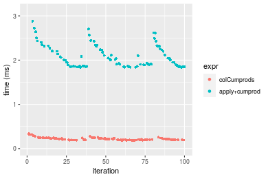

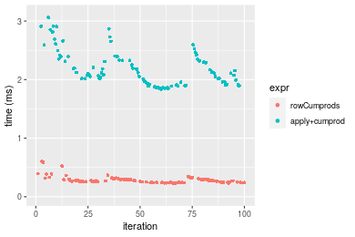
_Table: Benchmarking of colCumprods() and rowCumprods() on integer+100x1000 data (original and transposed).  The top panel shows times in milliseconds and the bottom panel shows relative times._


|   |expr        |     min|       lq|     mean|   median|       uq|     max|
|:--|:-----------|-------:|--------:|--------:|--------:|--------:|-------:|
|1  |colCumprods | 189.411| 197.1045| 220.5661| 212.1985| 238.9065| 336.860|
|2  |rowCumprods | 233.216| 247.7915| 285.4197| 270.0510| 298.2290| 602.251|


|   |expr        |     min|       lq|     mean|   median|       uq|      max|
|:--|:-----------|-------:|--------:|--------:|--------:|--------:|--------:|
|1  |colCumprods | 1.00000| 1.000000| 1.000000| 1.000000| 1.000000| 1.000000|
|2  |rowCumprods | 1.23127| 1.257158| 1.294032| 1.272634| 1.248308| 1.787838|

_Figure: Benchmarking of colCumprods() and rowCumprods() on integer+100x1000 data (original and transposed).  Outliers are displayed as crosses. Times are in milliseconds._


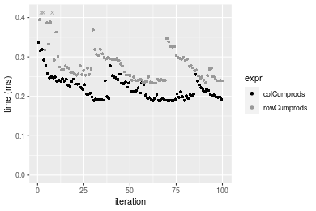

#### 1000x100 integer matrix

```r
> X <- data[["1000x100"]]
> gc()
          used  (Mb) gc trigger  (Mb) max used  (Mb)
Ncells 5176256 276.5    7554717 403.5  7554717 403.5
Vcells 9068454  69.2   31793280 242.6 60508962 461.7
> colStats <- microbenchmark(colCumprods = colCumprods(X), `apply+cumprod` = apply(X, MARGIN = 2L, 
+     FUN = cumprod), unit = "ms")
> X <- t(X)
> gc()
          used  (Mb) gc trigger  (Mb) max used  (Mb)
Ncells 5176250 276.5    7554717 403.5  7554717 403.5
Vcells 9118497  69.6   31793280 242.6 60508962 461.7
> rowStats <- microbenchmark(rowCumprods = rowCumprods(X), `apply+cumprod` = apply(X, MARGIN = 1L, 
+     FUN = cumprod), unit = "ms")
```

_Table: Benchmarking of colCumprods() and apply+cumprod() on integer+1000x100 data. The top panel shows times in milliseconds and the bottom panel shows relative times._


|   |expr          |      min|       lq|      mean|    median|       uq|      max|
|:--|:-------------|--------:|--------:|---------:|---------:|--------:|--------:|
|1  |colCumprods   | 0.183418| 0.202439| 0.2214825| 0.2151115| 0.236207| 0.342695|
|2  |apply+cumprod | 1.033932| 1.122478| 1.3740782| 1.2345975| 1.340109| 7.435716|


|   |expr          |      min|       lq|     mean|   median|       uq|      max|
|:--|:-------------|--------:|--------:|--------:|--------:|--------:|--------:|
|1  |colCumprods   | 1.000000| 1.000000| 1.000000| 1.000000| 1.000000|  1.00000|
|2  |apply+cumprod | 5.637026| 5.544774| 6.204003| 5.739338| 5.673452| 21.69777|

_Table: Benchmarking of rowCumprods() and apply+cumprod() on integer+1000x100 data (transposed). The top panel shows times in milliseconds and the bottom panel shows relative times._


|   |expr          |      min|       lq|      mean|    median|        uq|        max|
|:--|:-------------|--------:|--------:|---------:|---------:|---------:|----------:|
|1  |rowCumprods   | 0.242087| 0.287937| 0.3226864| 0.3078185| 0.3367915|   0.492306|
|2  |apply+cumprod | 1.031691| 1.242941| 4.9544688| 1.3472695| 1.5128780| 349.810214|


|   |expr          |      min|       lq|     mean|   median|       uq|      max|
|:--|:-------------|--------:|--------:|--------:|--------:|--------:|--------:|
|1  |rowCumprods   | 1.000000| 1.000000|  1.00000| 1.000000| 1.000000|   1.0000|
|2  |apply+cumprod | 4.261654| 4.316712| 15.35382| 4.376831| 4.492031| 710.5544|

_Figure: Benchmarking of colCumprods() and apply+cumprod() on integer+1000x100 data  as well as rowCumprods() and apply+cumprod() on the same data transposed.  Outliers are displayed as crosses.  Times are in milliseconds._


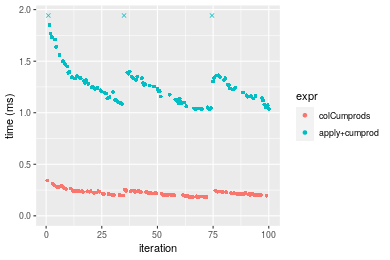

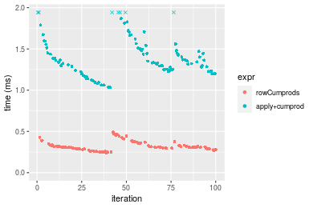
_Table: Benchmarking of colCumprods() and rowCumprods() on integer+1000x100 data (original and transposed).  The top panel shows times in milliseconds and the bottom panel shows relative times._


|   |expr        |     min|      lq|     mean|   median|       uq|     max|
|:--|:-----------|-------:|-------:|--------:|--------:|--------:|-------:|
|1  |colCumprods | 183.418| 202.439| 221.4825| 215.1115| 236.2070| 342.695|
|2  |rowCumprods | 242.087| 287.937| 322.6864| 307.8185| 336.7915| 492.306|


|   |expr        |      min|      lq|     mean|   median|       uq|      max|
|:--|:-----------|--------:|-------:|--------:|--------:|--------:|--------:|
|1  |colCumprods | 1.000000| 1.00000| 1.000000| 1.000000| 1.000000| 1.000000|
|2  |rowCumprods | 1.319865| 1.42234| 1.456938| 1.430972| 1.425832| 1.436572|

_Figure: Benchmarking of colCumprods() and rowCumprods() on integer+1000x100 data (original and transposed).  Outliers are displayed as crosses. Times are in milliseconds._


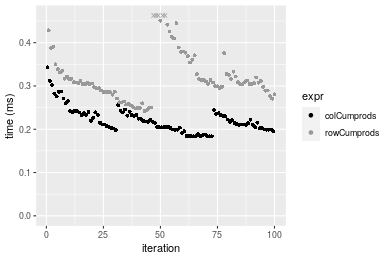


## Data type "double"

### Data
```r
> rmatrix <- function(nrow, ncol, mode = c("logical", "double", "integer", "index"), range = c(-100, 
+     +100), na_prob = 0) {
+     mode <- match.arg(mode)
+     n <- nrow * ncol
+     if (mode == "logical") {
+         x <- sample(c(FALSE, TRUE), size = n, replace = TRUE)
+     }     else if (mode == "index") {
+         x <- seq_len(n)
+         mode <- "integer"
+     }     else {
+         x <- runif(n, min = range[1], max = range[2])
+     }
+     storage.mode(x) <- mode
+     if (na_prob > 0) 
+         x[sample(n, size = na_prob * n)] <- NA
+     dim(x) <- c(nrow, ncol)
+     x
+ }
> rmatrices <- function(scale = 10, seed = 1, ...) {
+     set.seed(seed)
+     data <- list()
+     data[[1]] <- rmatrix(nrow = scale * 1, ncol = scale * 1, ...)
+     data[[2]] <- rmatrix(nrow = scale * 10, ncol = scale * 10, ...)
+     data[[3]] <- rmatrix(nrow = scale * 100, ncol = scale * 1, ...)
+     data[[4]] <- t(data[[3]])
+     data[[5]] <- rmatrix(nrow = scale * 10, ncol = scale * 100, ...)
+     data[[6]] <- t(data[[5]])
+     names(data) <- sapply(data, FUN = function(x) paste(dim(x), collapse = "x"))
+     data
+ }
> data <- rmatrices(mode = mode, range = c(-1, 1))
```

### Results

#### 10x10 double matrix

```r
> X <- data[["10x10"]]
> gc()
          used  (Mb) gc trigger  (Mb) max used  (Mb)
Ncells 5176456 276.5    7554717 403.5  7554717 403.5
Vcells 9184808  70.1   31793280 242.6 60508962 461.7
> colStats <- microbenchmark(colCumprods = colCumprods(X), `apply+cumprod` = apply(X, MARGIN = 2L, 
+     FUN = cumprod), unit = "ms")
> X <- t(X)
> gc()
          used  (Mb) gc trigger  (Mb) max used  (Mb)
Ncells 5176441 276.5    7554717 403.5  7554717 403.5
Vcells 9184936  70.1   31793280 242.6 60508962 461.7
> rowStats <- microbenchmark(rowCumprods = rowCumprods(X), `apply+cumprod` = apply(X, MARGIN = 1L, 
+     FUN = cumprod), unit = "ms")
```

_Table: Benchmarking of colCumprods() and apply+cumprod() on double+10x10 data. The top panel shows times in milliseconds and the bottom panel shows relative times._


|   |expr          |      min|       lq|      mean|   median|        uq|      max|
|:--|:-------------|--------:|--------:|---------:|--------:|---------:|--------:|
|1  |colCumprods   | 0.002254| 0.002590| 0.0033109| 0.002874| 0.0036885| 0.013994|
|2  |apply+cumprod | 0.043162| 0.044066| 0.0476829| 0.045102| 0.0461590| 0.140434|


|   |expr          |      min|      lq|     mean|   median|      uq|     max|
|:--|:-------------|--------:|-------:|--------:|--------:|-------:|-------:|
|1  |colCumprods   |  1.00000|  1.0000|  1.00000|  1.00000|  1.0000|  1.0000|
|2  |apply+cumprod | 19.14907| 17.0139| 14.40167| 15.69311| 12.5143| 10.0353|

_Table: Benchmarking of rowCumprods() and apply+cumprod() on double+10x10 data (transposed). The top panel shows times in milliseconds and the bottom panel shows relative times._


|   |expr          |      min|       lq|      mean|    median|        uq|      max|
|:--|:-------------|--------:|--------:|---------:|---------:|---------:|--------:|
|1  |rowCumprods   | 0.002271| 0.002749| 0.0035532| 0.0036795| 0.0038970| 0.016303|
|2  |apply+cumprod | 0.044810| 0.045791| 0.0476815| 0.0462015| 0.0466195| 0.143873|


|   |expr          |     min|       lq|     mean|   median|       uq|     max|
|:--|:-------------|-------:|--------:|--------:|--------:|--------:|-------:|
|1  |rowCumprods   |  1.0000|  1.00000|  1.00000|  1.00000|  1.00000| 1.00000|
|2  |apply+cumprod | 19.7314| 16.65733| 13.41921| 12.55646| 11.96292| 8.82494|

_Figure: Benchmarking of colCumprods() and apply+cumprod() on double+10x10 data  as well as rowCumprods() and apply+cumprod() on the same data transposed.  Outliers are displayed as crosses.  Times are in milliseconds._


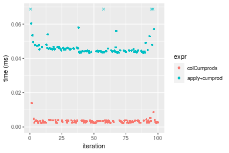

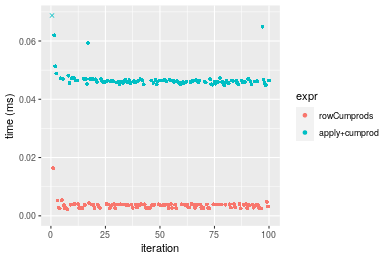
_Table: Benchmarking of colCumprods() and rowCumprods() on double+10x10 data (original and transposed).  The top panel shows times in milliseconds and the bottom panel shows relative times._


|   |expr        |   min|    lq|    mean| median|     uq|    max|
|:--|:-----------|-----:|-----:|-------:|------:|------:|------:|
|1  |colCumprods | 2.254| 2.590| 3.31093| 2.8740| 3.6885| 13.994|
|2  |rowCumprods | 2.271| 2.749| 3.55323| 3.6795| 3.8970| 16.303|


|   |expr        |      min|      lq|     mean|   median|       uq|      max|
|:--|:-----------|--------:|-------:|--------:|--------:|--------:|--------:|
|1  |colCumprods | 1.000000| 1.00000| 1.000000| 1.000000| 1.000000| 1.000000|
|2  |rowCumprods | 1.007542| 1.06139| 1.073182| 1.280271| 1.056527| 1.164999|

_Figure: Benchmarking of colCumprods() and rowCumprods() on double+10x10 data (original and transposed).  Outliers are displayed as crosses. Times are in milliseconds._


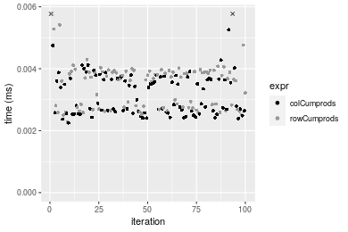

#### 100x100 double matrix

```r
> X <- data[["100x100"]]
> gc()
          used  (Mb) gc trigger  (Mb) max used  (Mb)
Ncells 5176636 276.5    7554717 403.5  7554717 403.5
Vcells 9184920  70.1   31793280 242.6 60508962 461.7
> colStats <- microbenchmark(colCumprods = colCumprods(X), `apply+cumprod` = apply(X, MARGIN = 2L, 
+     FUN = cumprod), unit = "ms")
> X <- t(X)
> gc()
          used  (Mb) gc trigger  (Mb) max used  (Mb)
Ncells 5176630 276.5    7554717 403.5  7554717 403.5
Vcells 9194963  70.2   31793280 242.6 60508962 461.7
> rowStats <- microbenchmark(rowCumprods = rowCumprods(X), `apply+cumprod` = apply(X, MARGIN = 1L, 
+     FUN = cumprod), unit = "ms")
```

_Table: Benchmarking of colCumprods() and apply+cumprod() on double+100x100 data. The top panel shows times in milliseconds and the bottom panel shows relative times._


|   |expr          |      min|        lq|      mean|    median|        uq|      max|
|:--|:-------------|--------:|---------:|---------:|---------:|---------:|--------:|
|1  |colCumprods   | 0.013571| 0.0147175| 0.0160408| 0.0155285| 0.0166885| 0.037705|
|2  |apply+cumprod | 0.234854| 0.2430365| 0.2686147| 0.2542310| 0.2893535| 0.440114|


|   |expr          |      min|       lq|     mean|  median|      uq|      max|
|:--|:-------------|--------:|--------:|--------:|-------:|-------:|--------:|
|1  |colCumprods   |  1.00000|  1.00000|  1.00000|  1.0000|  1.0000|  1.00000|
|2  |apply+cumprod | 17.30558| 16.51344| 16.74576| 16.3719| 17.3385| 11.67256|

_Table: Benchmarking of rowCumprods() and apply+cumprod() on double+100x100 data (transposed). The top panel shows times in milliseconds and the bottom panel shows relative times._


|   |expr          |      min|       lq|      mean|    median|       uq|      max|
|:--|:-------------|--------:|--------:|---------:|---------:|--------:|--------:|
|1  |rowCumprods   | 0.010797| 0.012184| 0.0150912| 0.0130685| 0.015574| 0.029981|
|2  |apply+cumprod | 0.238625| 0.248507| 0.2961374| 0.2773955| 0.311679| 0.500705|


|   |expr          |      min|       lq|     mean|   median|       uq|      max|
|:--|:-------------|--------:|--------:|--------:|--------:|--------:|--------:|
|1  |rowCumprods   |  1.00000|  1.00000|  1.00000|  1.00000|  1.00000|  1.00000|
|2  |apply+cumprod | 22.10105| 20.39618| 19.62323| 21.22627| 20.01278| 16.70074|

_Figure: Benchmarking of colCumprods() and apply+cumprod() on double+100x100 data  as well as rowCumprods() and apply+cumprod() on the same data transposed.  Outliers are displayed as crosses.  Times are in milliseconds._


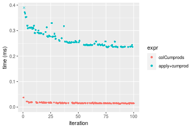

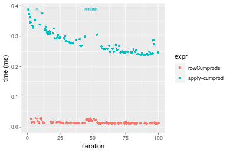
_Table: Benchmarking of colCumprods() and rowCumprods() on double+100x100 data (original and transposed).  The top panel shows times in milliseconds and the bottom panel shows relative times._


|   |expr        |    min|      lq|     mean|  median|      uq|    max|
|:--|:-----------|------:|-------:|--------:|-------:|-------:|------:|
|2  |rowCumprods | 10.797| 12.1840| 15.09117| 13.0685| 15.5740| 29.981|
|1  |colCumprods | 13.571| 14.7175| 16.04076| 15.5285| 16.6885| 37.705|


|   |expr        |      min|       lq|     mean|   median|       uq|     max|
|:--|:-----------|--------:|--------:|--------:|--------:|--------:|-------:|
|2  |rowCumprods | 1.000000| 1.000000| 1.000000| 1.000000| 1.000000| 1.00000|
|1  |colCumprods | 1.256923| 1.207937| 1.062924| 1.188239| 1.071562| 1.25763|

_Figure: Benchmarking of colCumprods() and rowCumprods() on double+100x100 data (original and transposed).  Outliers are displayed as crosses. Times are in milliseconds._


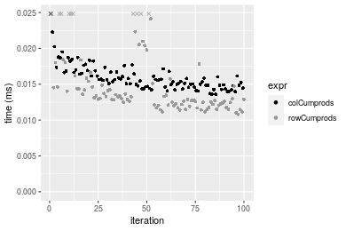

#### 1000x10 double matrix

```r
> X <- data[["1000x10"]]
> gc()
          used  (Mb) gc trigger  (Mb) max used  (Mb)
Ncells 5176826 276.5    7554717 403.5  7554717 403.5
Vcells 9185802  70.1   31793280 242.6 60508962 461.7
> colStats <- microbenchmark(colCumprods = colCumprods(X), `apply+cumprod` = apply(X, MARGIN = 2L, 
+     FUN = cumprod), unit = "ms")
> X <- t(X)
> gc()
          used  (Mb) gc trigger  (Mb) max used  (Mb)
Ncells 5176820 276.5    7554717 403.5  7554717 403.5
Vcells 9195845  70.2   31793280 242.6 60508962 461.7
> rowStats <- microbenchmark(rowCumprods = rowCumprods(X), `apply+cumprod` = apply(X, MARGIN = 1L, 
+     FUN = cumprod), unit = "ms")
```

_Table: Benchmarking of colCumprods() and apply+cumprod() on double+1000x10 data. The top panel shows times in milliseconds and the bottom panel shows relative times._


|   |expr          |      min|        lq|      mean|    median|        uq|      max|
|:--|:-------------|--------:|---------:|---------:|---------:|---------:|--------:|
|1  |colCumprods   | 0.026498| 0.0296915| 0.0334566| 0.0325120| 0.0350240| 0.080223|
|2  |apply+cumprod | 0.403400| 0.4349455| 0.4899405| 0.4804875| 0.5232965| 0.727385|


|   |expr          |      min|       lq|     mean|   median|       uq|      max|
|:--|:-------------|--------:|--------:|--------:|--------:|--------:|--------:|
|1  |colCumprods   |  1.00000|  1.00000|  1.00000|  1.00000|  1.00000| 1.000000|
|2  |apply+cumprod | 15.22379| 14.64882| 14.64407| 14.77877| 14.94108| 9.067038|

_Table: Benchmarking of rowCumprods() and apply+cumprod() on double+1000x10 data (transposed). The top panel shows times in milliseconds and the bottom panel shows relative times._


|   |expr          |      min|       lq|      mean|    median|       uq|      max|
|:--|:-------------|--------:|--------:|---------:|---------:|--------:|--------:|
|1  |rowCumprods   | 0.026815| 0.030436| 0.0337566| 0.0325290| 0.036281| 0.055896|
|2  |apply+cumprod | 0.393967| 0.429862| 0.4897734| 0.4789495| 0.529875| 0.704232|


|   |expr          |      min|       lq|     mean|   median|       uq|      max|
|:--|:-------------|--------:|--------:|--------:|--------:|--------:|--------:|
|1  |rowCumprods   |  1.00000|  1.00000|  1.00000|  1.00000|  1.00000|  1.00000|
|2  |apply+cumprod | 14.69204| 14.12347| 14.50897| 14.72377| 14.60475| 12.59897|

_Figure: Benchmarking of colCumprods() and apply+cumprod() on double+1000x10 data  as well as rowCumprods() and apply+cumprod() on the same data transposed.  Outliers are displayed as crosses.  Times are in milliseconds._


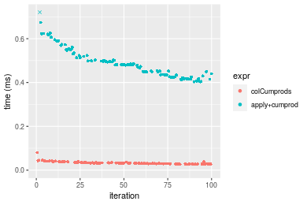

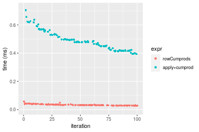
_Table: Benchmarking of colCumprods() and rowCumprods() on double+1000x10 data (original and transposed).  The top panel shows times in milliseconds and the bottom panel shows relative times._


|   |expr        |    min|      lq|     mean| median|     uq|    max|
|:--|:-----------|------:|-------:|--------:|------:|------:|------:|
|1  |colCumprods | 26.498| 29.6915| 33.45659| 32.512| 35.024| 80.223|
|2  |rowCumprods | 26.815| 30.4360| 33.75659| 32.529| 36.281| 55.896|


|   |expr        |      min|       lq|     mean|   median|      uq|       max|
|:--|:-----------|--------:|--------:|--------:|--------:|-------:|---------:|
|1  |colCumprods | 1.000000| 1.000000| 1.000000| 1.000000| 1.00000| 1.0000000|
|2  |rowCumprods | 1.011963| 1.025075| 1.008967| 1.000523| 1.03589| 0.6967578|

_Figure: Benchmarking of colCumprods() and rowCumprods() on double+1000x10 data (original and transposed).  Outliers are displayed as crosses. Times are in milliseconds._


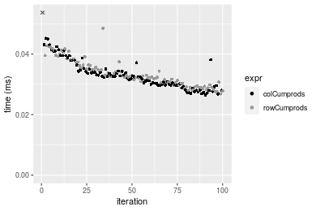

#### 10x1000 double matrix

```r
> X <- data[["10x1000"]]
> gc()
          used  (Mb) gc trigger  (Mb) max used  (Mb)
Ncells 5177014 276.5    7554717 403.5  7554717 403.5
Vcells 9186832  70.1   31793280 242.6 60508962 461.7
> colStats <- microbenchmark(colCumprods = colCumprods(X), `apply+cumprod` = apply(X, MARGIN = 2L, 
+     FUN = cumprod), unit = "ms")
> X <- t(X)
> gc()
          used  (Mb) gc trigger  (Mb) max used  (Mb)
Ncells 5177008 276.5    7554717 403.5  7554717 403.5
Vcells 9196875  70.2   31793280 242.6 60508962 461.7
> rowStats <- microbenchmark(rowCumprods = rowCumprods(X), `apply+cumprod` = apply(X, MARGIN = 1L, 
+     FUN = cumprod), unit = "ms")
```

_Table: Benchmarking of colCumprods() and apply+cumprod() on double+10x1000 data. The top panel shows times in milliseconds and the bottom panel shows relative times._


|   |expr          |      min|        lq|      mean|   median|       uq|      max|
|:--|:-------------|--------:|---------:|---------:|--------:|--------:|--------:|
|1  |colCumprods   | 0.008684| 0.0121465| 0.0135451| 0.013405| 0.014560| 0.032205|
|2  |apply+cumprod | 0.860432| 0.9087650| 1.0485481| 1.034054| 1.145485| 1.458175|


|   |expr          |      min|       lq|     mean|   median|       uq|      max|
|:--|:-------------|--------:|--------:|--------:|--------:|--------:|--------:|
|1  |colCumprods   |  1.00000|  1.00000|  1.00000|  1.00000|  1.00000|  1.00000|
|2  |apply+cumprod | 99.08245| 74.81703| 77.41173| 77.13943| 78.67342| 45.27791|

_Table: Benchmarking of rowCumprods() and apply+cumprod() on double+10x1000 data (transposed). The top panel shows times in milliseconds and the bottom panel shows relative times._


|   |expr          |      min|        lq|      mean|    median|        uq|      max|
|:--|:-------------|--------:|---------:|---------:|---------:|---------:|--------:|
|1  |rowCumprods   | 0.009201| 0.0118765| 0.0131436| 0.0125485| 0.0134815| 0.029998|
|2  |apply+cumprod | 0.900963| 0.9176905| 1.0382635| 0.9594270| 1.0937745| 2.000790|


|   |expr          |      min|       lq|     mean|  median|       uq|      max|
|:--|:-------------|--------:|--------:|--------:|-------:|--------:|--------:|
|1  |rowCumprods   |  1.00000|  1.00000|  1.00000|  1.0000|  1.00000|  1.00000|
|2  |apply+cumprod | 97.92012| 77.26944| 78.99378| 76.4575| 81.13151| 66.69745|

_Figure: Benchmarking of colCumprods() and apply+cumprod() on double+10x1000 data  as well as rowCumprods() and apply+cumprod() on the same data transposed.  Outliers are displayed as crosses.  Times are in milliseconds._


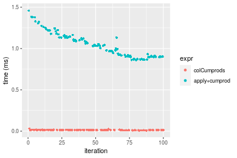

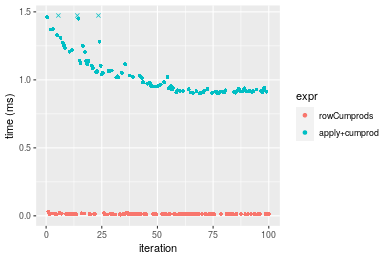
_Table: Benchmarking of colCumprods() and rowCumprods() on double+10x1000 data (original and transposed).  The top panel shows times in milliseconds and the bottom panel shows relative times._


|   |expr        |   min|      lq|     mean|  median|      uq|    max|
|:--|:-----------|-----:|-------:|--------:|-------:|-------:|------:|
|2  |rowCumprods | 9.201| 11.8765| 13.14361| 12.5485| 13.4815| 29.998|
|1  |colCumprods | 8.684| 12.1465| 13.54508| 13.4050| 14.5600| 32.205|


|   |expr        |       min|       lq|     mean|   median|       uq|      max|
|:--|:-----------|---------:|--------:|--------:|--------:|--------:|--------:|
|2  |rowCumprods | 1.0000000| 1.000000| 1.000000| 1.000000| 1.000000| 1.000000|
|1  |colCumprods | 0.9438105| 1.022734| 1.030545| 1.068255| 1.079999| 1.073572|

_Figure: Benchmarking of colCumprods() and rowCumprods() on double+10x1000 data (original and transposed).  Outliers are displayed as crosses. Times are in milliseconds._


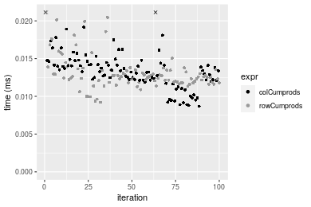

#### 100x1000 double matrix

```r
> X <- data[["100x1000"]]
> gc()
          used  (Mb) gc trigger  (Mb) max used  (Mb)
Ncells 5177204 276.5    7554717 403.5  7554717 403.5
Vcells 9186963  70.1   31793280 242.6 60508962 461.7
> colStats <- microbenchmark(colCumprods = colCumprods(X), `apply+cumprod` = apply(X, MARGIN = 2L, 
+     FUN = cumprod), unit = "ms")
> X <- t(X)
> gc()
          used  (Mb) gc trigger  (Mb) max used  (Mb)
Ncells 5177192 276.5    7554717 403.5  7554717 403.5
Vcells 9286996  70.9   31793280 242.6 60508962 461.7
> rowStats <- microbenchmark(rowCumprods = rowCumprods(X), `apply+cumprod` = apply(X, MARGIN = 1L, 
+     FUN = cumprod), unit = "ms")
```

_Table: Benchmarking of colCumprods() and apply+cumprod() on double+100x1000 data. The top panel shows times in milliseconds and the bottom panel shows relative times._


|   |expr          |      min|       lq|      mean|   median|        uq|      max|
|:--|:-------------|--------:|--------:|---------:|--------:|---------:|--------:|
|1  |colCumprods   | 0.097752| 0.112771| 0.2417146| 0.119342| 0.1314885| 12.02079|
|2  |apply+cumprod | 1.657828| 1.769645| 2.1181516| 1.963027| 2.1174625| 15.02812|


|   |expr          |      min|       lq|     mean|   median|       uq|      max|
|:--|:-------------|--------:|--------:|--------:|--------:|--------:|--------:|
|1  |colCumprods   |  1.00000|  1.00000| 1.000000|  1.00000|  1.00000| 1.000000|
|2  |apply+cumprod | 16.95953| 15.69238| 8.763027| 16.44876| 16.10378| 1.250178|

_Table: Benchmarking of rowCumprods() and apply+cumprod() on double+100x1000 data (transposed). The top panel shows times in milliseconds and the bottom panel shows relative times._


|   |expr          |      min|        lq|      mean|    median|       uq|      max|
|:--|:-------------|--------:|---------:|---------:|---------:|--------:|--------:|
|1  |rowCumprods   | 0.070030| 0.0768055| 0.2173295| 0.0872305| 0.095519| 12.93826|
|2  |apply+cumprod | 1.664397| 1.7278870| 2.1009819| 1.8998410| 2.139187| 14.30946|


|   |expr          |      min|       lq|     mean|   median|       uq|     max|
|:--|:-------------|--------:|--------:|--------:|--------:|--------:|-------:|
|1  |rowCumprods   |  1.00000|  1.00000| 1.000000|  1.00000|  1.00000| 1.00000|
|2  |apply+cumprod | 23.76691| 22.49692| 9.667267| 21.77955| 22.39541| 1.10598|

_Figure: Benchmarking of colCumprods() and apply+cumprod() on double+100x1000 data  as well as rowCumprods() and apply+cumprod() on the same data transposed.  Outliers are displayed as crosses.  Times are in milliseconds._


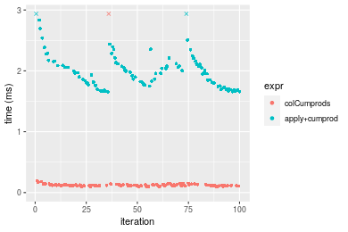

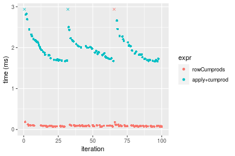
_Table: Benchmarking of colCumprods() and rowCumprods() on double+100x1000 data (original and transposed).  The top panel shows times in milliseconds and the bottom panel shows relative times._


|   |expr        |    min|       lq|     mean|   median|       uq|      max|
|:--|:-----------|------:|--------:|--------:|--------:|--------:|--------:|
|2  |rowCumprods | 70.030|  76.8055| 217.3295|  87.2305|  95.5190| 12938.26|
|1  |colCumprods | 97.752| 112.7710| 241.7146| 119.3420| 131.4885| 12020.79|


|   |expr        |      min|       lq|     mean|   median|       uq|       max|
|:--|:-----------|--------:|--------:|--------:|--------:|--------:|---------:|
|2  |rowCumprods | 1.000000| 1.000000| 1.000000| 1.000000| 1.000000| 1.0000000|
|1  |colCumprods | 1.395859| 1.468267| 1.112203| 1.368122| 1.376569| 0.9290886|

_Figure: Benchmarking of colCumprods() and rowCumprods() on double+100x1000 data (original and transposed).  Outliers are displayed as crosses. Times are in milliseconds._


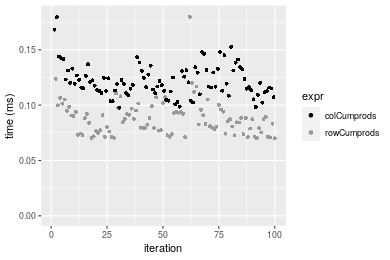

#### 1000x100 double matrix

```r
> X <- data[["1000x100"]]
> gc()
          used  (Mb) gc trigger  (Mb) max used  (Mb)
Ncells 5177390 276.6    7554717 403.5  7554717 403.5
Vcells 9188180  70.2   31793280 242.6 60508962 461.7
> colStats <- microbenchmark(colCumprods = colCumprods(X), `apply+cumprod` = apply(X, MARGIN = 2L, 
+     FUN = cumprod), unit = "ms")
> X <- t(X)
> gc()
          used  (Mb) gc trigger  (Mb) max used  (Mb)
Ncells 5177384 276.6    7554717 403.5  7554717 403.5
Vcells 9288223  70.9   31793280 242.6 60508962 461.7
> rowStats <- microbenchmark(rowCumprods = rowCumprods(X), `apply+cumprod` = apply(X, MARGIN = 1L, 
+     FUN = cumprod), unit = "ms")
```

_Table: Benchmarking of colCumprods() and apply+cumprod() on double+1000x100 data. The top panel shows times in milliseconds and the bottom panel shows relative times._


|   |expr          |      min|        lq|      mean|    median|        uq|      max|
|:--|:-------------|--------:|---------:|---------:|---------:|---------:|--------:|
|1  |colCumprods   | 0.239211| 0.2420125| 0.2563065| 0.2487605| 0.2616535| 0.423280|
|2  |apply+cumprod | 3.546034| 3.5697345| 3.8604746| 3.5943745| 3.7626660| 9.656664|


|   |expr          |      min|       lq|     mean|   median|       uq|      max|
|:--|:-------------|--------:|--------:|--------:|--------:|--------:|--------:|
|1  |colCumprods   |  1.00000|  1.00000|  1.00000|  1.00000|  1.00000|  1.00000|
|2  |apply+cumprod | 14.82388| 14.75021| 15.06195| 14.44914| 14.38034| 22.81389|

_Table: Benchmarking of rowCumprods() and apply+cumprod() on double+1000x100 data (transposed). The top panel shows times in milliseconds and the bottom panel shows relative times._


|   |expr          |      min|       lq|      mean|   median|       uq|      max|
|:--|:-------------|--------:|--------:|---------:|--------:|--------:|--------:|
|1  |rowCumprods   | 0.209255| 0.213030| 0.2268368| 0.216964| 0.226974| 0.322498|
|2  |apply+cumprod | 3.578487| 3.589807| 3.8898114| 3.619201| 3.785734| 9.873523|


|   |expr          |      min|       lq|     mean|   median|       uq|      max|
|:--|:-------------|--------:|--------:|--------:|--------:|--------:|--------:|
|1  |rowCumprods   |  1.00000|  1.00000|  1.00000|  1.00000|  1.00000|  1.00000|
|2  |apply+cumprod | 17.10108| 16.85118| 17.14806| 16.68112| 16.67915| 30.61577|

_Figure: Benchmarking of colCumprods() and apply+cumprod() on double+1000x100 data  as well as rowCumprods() and apply+cumprod() on the same data transposed.  Outliers are displayed as crosses.  Times are in milliseconds._


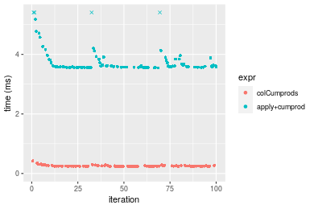

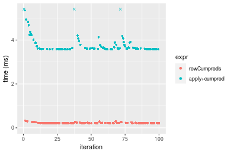
_Table: Benchmarking of colCumprods() and rowCumprods() on double+1000x100 data (original and transposed).  The top panel shows times in milliseconds and the bottom panel shows relative times._


|   |expr        |     min|       lq|     mean|   median|       uq|     max|
|:--|:-----------|-------:|--------:|--------:|--------:|--------:|-------:|
|2  |rowCumprods | 209.255| 213.0300| 226.8368| 216.9640| 226.9740| 322.498|
|1  |colCumprods | 239.211| 242.0125| 256.3065| 248.7605| 261.6535| 423.280|


|   |expr        |      min|       lq|     mean|   median|       uq|      max|
|:--|:-----------|--------:|--------:|--------:|--------:|--------:|--------:|
|2  |rowCumprods | 1.000000| 1.000000| 1.000000| 1.000000| 1.000000| 1.000000|
|1  |colCumprods | 1.143155| 1.136049| 1.129916| 1.146552| 1.152791| 1.312504|

_Figure: Benchmarking of colCumprods() and rowCumprods() on double+1000x100 data (original and transposed).  Outliers are displayed as crosses. Times are in milliseconds._


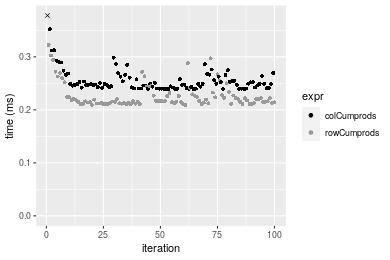


## Appendix

### Session information
```r
R version 4.1.1 Patched (2021-08-10 r80727)
Platform: x86_64-pc-linux-gnu (64-bit)
Running under: Ubuntu 18.04.5 LTS

Matrix products: default
BLAS:   /home/hb/software/R-devel/R-4-1-branch/lib/R/lib/libRblas.so
LAPACK: /home/hb/software/R-devel/R-4-1-branch/lib/R/lib/libRlapack.so

locale:
 [1] LC_CTYPE=en_US.UTF-8       LC_NUMERIC=C              
 [3] LC_TIME=en_US.UTF-8        LC_COLLATE=en_US.UTF-8    
 [5] LC_MONETARY=en_US.UTF-8    LC_MESSAGES=en_US.UTF-8   
 [7] LC_PAPER=en_US.UTF-8       LC_NAME=C                 
 [9] LC_ADDRESS=C               LC_TELEPHONE=C            
[11] LC_MEASUREMENT=en_US.UTF-8 LC_IDENTIFICATION=C       

attached base packages:
[1] stats     graphics  grDevices utils     datasets  methods   base     

other attached packages:
[1] microbenchmark_1.4-7   matrixStats_0.60.0     ggplot2_3.3.5         
[4] knitr_1.33             R.devices_2.17.0       R.utils_2.10.1        
[7] R.oo_1.24.0            R.methodsS3_1.8.1-9001

loaded via a namespace (and not attached):
 [1] Biobase_2.52.0          httr_1.4.2              splines_4.1.1          
 [4] bit64_4.0.5             network_1.17.1          assertthat_0.2.1       
 [7] highr_0.9               stats4_4.1.1            blob_1.2.2             
[10] GenomeInfoDbData_1.2.6  robustbase_0.93-8       pillar_1.6.2           
[13] RSQLite_2.2.8           lattice_0.20-44         glue_1.4.2             
[16] digest_0.6.27           XVector_0.32.0          colorspace_2.0-2       
[19] Matrix_1.3-4            XML_3.99-0.7            pkgconfig_2.0.3        
[22] zlibbioc_1.38.0         genefilter_1.74.0       purrr_0.3.4            
[25] ergm_4.1.2              xtable_1.8-4            scales_1.1.1           
[28] tibble_3.1.4            annotate_1.70.0         KEGGREST_1.32.0        
[31] farver_2.1.0            generics_0.1.0          IRanges_2.26.0         
[34] ellipsis_0.3.2          cachem_1.0.6            withr_2.4.2            
[37] BiocGenerics_0.38.0     mime_0.11               survival_3.2-13        
[40] magrittr_2.0.1          crayon_1.4.1            statnet.common_4.5.0   
[43] memoise_2.0.0           laeken_0.5.1            fansi_0.5.0            
[46] R.cache_0.15.0          MASS_7.3-54             R.rsp_0.44.0           
[49] tools_4.1.1             lifecycle_1.0.0         S4Vectors_0.30.0       
[52] trust_0.1-8             munsell_0.5.0           AnnotationDbi_1.54.1   
[55] Biostrings_2.60.2       compiler_4.1.1          GenomeInfoDb_1.28.1    
[58] rlang_0.4.11            grid_4.1.1              RCurl_1.98-1.4         
[61] cwhmisc_6.6             rappdirs_0.3.3          labeling_0.4.2         
[64] bitops_1.0-7            base64enc_0.1-3         boot_1.3-28            
[67] gtable_0.3.0            DBI_1.1.1               markdown_1.1           
[70] R6_2.5.1                lpSolveAPI_5.5.2.0-17.7 rle_0.9.2              
[73] dplyr_1.0.7             fastmap_1.1.0           bit_4.0.4              
[76] utf8_1.2.2              parallel_4.1.1          Rcpp_1.0.7             
[79] vctrs_0.3.8             png_0.1-7               DEoptimR_1.0-9         
[82] tidyselect_1.1.1        xfun_0.25               coda_0.19-4            
```
Total processing time was 25.41 secs.


### Reproducibility
To reproduce this report, do:
```r
html <- matrixStats:::benchmark('colCumprods')
```

[RSP]: https://cran.r-project.org/package=R.rsp
[matrixStats]: https://cran.r-project.org/package=matrixStats

[StackOverflow:colMins?]: https://stackoverflow.com/questions/13676878 "Stack Overflow: fastest way to get Min from every column in a matrix?"
[StackOverflow:colSds?]: https://stackoverflow.com/questions/17549762 "Stack Overflow: Is there such 'colsd' in R?"
[StackOverflow:rowProds?]: https://stackoverflow.com/questions/20198801/ "Stack Overflow: Row product of matrix and column sum of matrix"

---------------------------------------
Copyright Henrik Bengtsson. Last updated on 2021-08-25 17:38:38 (+0200 UTC). Powered by [RSP].

<script>
 var link = document.createElement('link');
 link.rel = 'icon';
 link.href = "data:image/png;base64,iVBORw0KGgoAAAANSUhEUgAAACAAAAAgCAMAAABEpIrGAAAA21BMVEUAAAAAAP8AAP8AAP8AAP8AAP8AAP8AAP8AAP8AAP8AAP8AAP8AAP8AAP8AAP8AAP8AAP8AAP8AAP8AAP8AAP8AAP8AAP8AAP8AAP8AAP8AAP8AAP8AAP8AAP8AAP8AAP8AAP8AAP8AAP8AAP8AAP8AAP8AAP8AAP8AAP8AAP8BAf4CAv0DA/wdHeIeHuEfH+AgIN8hId4lJdomJtknJ9g+PsE/P8BAQL9yco10dIt1dYp3d4h4eIeVlWqWlmmXl2iYmGeZmWabm2Tn5xjo6Bfp6Rb39wj4+Af//wA2M9hbAAAASXRSTlMAAQIJCgsMJSYnKD4/QGRlZmhpamtsbautrrCxuru8y8zN5ebn6Pn6+///////////////////////////////////////////LsUNcQAAAS9JREFUOI29k21XgkAQhVcFytdSMqMETU26UVqGmpaiFbL//xc1cAhhwVNf6n5i5z67M2dmYOyfJZUqlVLhkKucG7cgmUZTybDz6g0iDeq51PUr37Ds2cy2/C9NeES5puDjxuUk1xnToZsg8pfA3avHQ3lLIi7iWRrkv/OYtkScxBIMgDee0ALoyxHQBJ68JLCjOtQIMIANF7QG9G9fNnHvisCHBVMKgSJgiz7nE+AoBKrAPA3MgepvgR9TSCasrCKH0eB1wBGBFdCO+nAGjMVGPcQb5bd6mQRegN6+1axOs9nGfYcCtfi4NQosdtH7dB+txFIpXQqN1p9B/asRHToyS0jRgpV7nk4nwcq1BJ+x3Gl/v7S9Wmpp/aGquum7w3ZDyrADFYrl8vHBH+ev9AUASW1dmU4h4wAAAABJRU5ErkJggg=="
 document.getElementsByTagName('head')[0].appendChild(link);
</script>


