[matrixStats]: Benchmark report

---------------------------------------


# colCumprods() and rowCumprods() benchmarks  on subsetted computation

This report benchmark the performance of colCumprods() and rowCumprods() on subsetted computation.


## Data type "integer"

### Data
```r
> rmatrix <- function(nrow, ncol, mode = c("logical", "double", "integer", "index"), range = c(-100, 
+     +100), na_prob = 0) {
+     mode <- match.arg(mode)
+     n <- nrow * ncol
+     if (mode == "logical") {
+         x <- sample(c(FALSE, TRUE), size = n, replace = TRUE)
+     }     else if (mode == "index") {
+         x <- seq_len(n)
+         mode <- "integer"
+     }     else {
+         x <- runif(n, min = range[1], max = range[2])
+     }
+     storage.mode(x) <- mode
+     if (na_prob > 0) 
+         x[sample(n, size = na_prob * n)] <- NA
+     dim(x) <- c(nrow, ncol)
+     x
+ }
> rmatrices <- function(scale = 10, seed = 1, ...) {
+     set.seed(seed)
+     data <- list()
+     data[[1]] <- rmatrix(nrow = scale * 1, ncol = scale * 1, ...)
+     data[[2]] <- rmatrix(nrow = scale * 10, ncol = scale * 10, ...)
+     data[[3]] <- rmatrix(nrow = scale * 100, ncol = scale * 1, ...)
+     data[[4]] <- t(data[[3]])
+     data[[5]] <- rmatrix(nrow = scale * 10, ncol = scale * 100, ...)
+     data[[6]] <- t(data[[5]])
+     names(data) <- sapply(data, FUN = function(x) paste(dim(x), collapse = "x"))
+     data
+ }
> data <- rmatrices(mode = mode, range = c(-1, 1))
```

### Results

#### 10x10 integer matrix

```r
> X <- data[["10x10"]]
> rows <- sample.int(nrow(X), size = nrow(X) * 0.7)
> cols <- sample.int(ncol(X), size = ncol(X) * 0.7)
> X_S <- X[rows, cols]
> gc()
          used  (Mb) gc trigger  (Mb) max used  (Mb)
Ncells 5175167 276.4    7554717 403.5  7554717 403.5
Vcells 9400602  71.8   31793280 242.6 60508962 461.7
> colStats <- microbenchmark(colCumprods_X_S = colCumprods(X_S), `colCumprods(X, rows, cols)` = colCumprods(X, 
+     rows = rows, cols = cols), `colCumprods(X[rows, cols])` = colCumprods(X[rows, cols]), unit = "ms")
> X <- t(X)
> X_S <- t(X_S)
> gc()
          used  (Mb) gc trigger  (Mb) max used  (Mb)
Ncells 5174451 276.4    7554717 403.5  7554717 403.5
Vcells 9398780  71.8   31793280 242.6 60508962 461.7
> rowStats <- microbenchmark(rowCumprods_X_S = rowCumprods(X_S), `rowCumprods(X, cols, rows)` = rowCumprods(X, 
+     rows = cols, cols = rows), `rowCumprods(X[cols, rows])` = rowCumprods(X[cols, rows]), unit = "ms")
```

_Table: Benchmarking of colCumprods_X_S(), colCumprods(X, rows, cols)() and colCumprods(X[rows, cols])() on integer+10x10 data. The top panel shows times in milliseconds and the bottom panel shows relative times._


|   |expr                       |      min|        lq|      mean|    median|        uq|      max|
|:--|:--------------------------|--------:|---------:|---------:|---------:|---------:|--------:|
|1  |colCumprods_X_S            | 0.002279| 0.0024665| 0.0041382| 0.0025345| 0.0026120| 0.145913|
|2  |colCumprods(X, rows, cols) | 0.002553| 0.0028445| 0.0031375| 0.0029320| 0.0030295| 0.019898|
|3  |colCumprods(X[rows, cols]) | 0.003073| 0.0035040| 0.0036710| 0.0036065| 0.0037170| 0.007831|


|   |expr                       |      min|       lq|      mean|   median|       uq|       max|
|:--|:--------------------------|--------:|--------:|---------:|--------:|--------:|---------:|
|1  |colCumprods_X_S            | 1.000000| 1.000000| 1.0000000| 1.000000| 1.000000| 1.0000000|
|2  |colCumprods(X, rows, cols) | 1.120228| 1.153254| 0.7581714| 1.156836| 1.159839| 0.1363689|
|3  |colCumprods(X[rows, cols]) | 1.348398| 1.420637| 0.8870916| 1.422963| 1.423048| 0.0536690|

_Table: Benchmarking of rowCumprods_X_S(), rowCumprods(X, cols, rows)() and rowCumprods(X[cols, rows])() on integer+10x10 data (transposed). The top panel shows times in milliseconds and the bottom panel shows relative times._


|   |expr                       |      min|        lq|      mean|    median|        uq|      max|
|:--|:--------------------------|--------:|---------:|---------:|---------:|---------:|--------:|
|1  |rowCumprods_X_S            | 0.002075| 0.0023815| 0.0025013| 0.0024475| 0.0025385| 0.004566|
|2  |rowCumprods(X, cols, rows) | 0.002441| 0.0027005| 0.0041812| 0.0027705| 0.0028495| 0.140201|
|3  |rowCumprods(X[cols, rows]) | 0.002881| 0.0033885| 0.0035232| 0.0034630| 0.0036275| 0.005593|


|   |expr                       |      min|       lq|     mean|   median|       uq|       max|
|:--|:--------------------------|--------:|--------:|--------:|--------:|--------:|---------:|
|1  |rowCumprods_X_S            | 1.000000| 1.000000| 1.000000| 1.000000| 1.000000|  1.000000|
|2  |rowCumprods(X, cols, rows) | 1.176386| 1.133949| 1.671619| 1.131971| 1.122513| 30.705431|
|3  |rowCumprods(X[cols, rows]) | 1.388434| 1.422843| 1.408548| 1.414913| 1.428994|  1.224923|

_Figure: Benchmarking of colCumprods_X_S(), colCumprods(X, rows, cols)() and colCumprods(X[rows, cols])() on integer+10x10 data  as well as rowCumprods_X_S(), rowCumprods(X, cols, rows)() and rowCumprods(X[cols, rows])() on the same data transposed.  Outliers are displayed as crosses.  Times are in milliseconds._


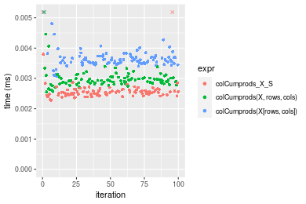

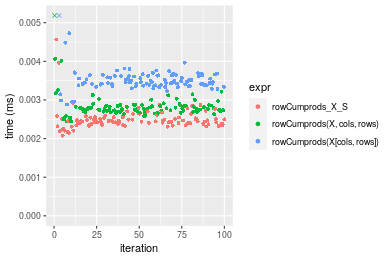
_Table: Benchmarking of colCumprods_X_S() and rowCumprods_X_S() on integer+10x10 data (original and transposed).  The top panel shows times in milliseconds and the bottom panel shows relative times._


|   |expr            |   min|     lq|    mean| median|     uq|     max|
|:--|:---------------|-----:|------:|-------:|------:|------:|-------:|
|2  |rowCumprods_X_S | 2.075| 2.3815| 2.50127| 2.4475| 2.5385|   4.566|
|1  |colCumprods_X_S | 2.279| 2.4665| 4.13822| 2.5345| 2.6120| 145.913|


|   |expr            |      min|       lq|     mean|   median|       uq|      max|
|:--|:---------------|--------:|--------:|--------:|--------:|--------:|--------:|
|2  |rowCumprods_X_S | 1.000000| 1.000000| 1.000000| 1.000000| 1.000000|  1.00000|
|1  |colCumprods_X_S | 1.098313| 1.035692| 1.654448| 1.035546| 1.028954| 31.95642|

_Figure: Benchmarking of colCumprods_X_S() and rowCumprods_X_S() on integer+10x10 data (original and transposed).  Outliers are displayed as crosses. Times are in milliseconds._


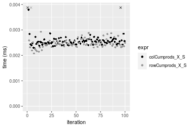

#### 100x100 integer matrix

```r
> X <- data[["100x100"]]
> rows <- sample.int(nrow(X), size = nrow(X) * 0.7)
> cols <- sample.int(ncol(X), size = ncol(X) * 0.7)
> X_S <- X[rows, cols]
> gc()
          used  (Mb) gc trigger  (Mb) max used  (Mb)
Ncells 5173144 276.3    7554717 403.5  7554717 403.5
Vcells 9068415  69.2   31793280 242.6 60508962 461.7
> colStats <- microbenchmark(colCumprods_X_S = colCumprods(X_S), `colCumprods(X, rows, cols)` = colCumprods(X, 
+     rows = rows, cols = cols), `colCumprods(X[rows, cols])` = colCumprods(X[rows, cols]), unit = "ms")
> X <- t(X)
> X_S <- t(X_S)
> gc()
          used  (Mb) gc trigger  (Mb) max used  (Mb)
Ncells 5173138 276.3    7554717 403.5  7554717 403.5
Vcells 9073498  69.3   31793280 242.6 60508962 461.7
> rowStats <- microbenchmark(rowCumprods_X_S = rowCumprods(X_S), `rowCumprods(X, cols, rows)` = rowCumprods(X, 
+     rows = cols, cols = rows), `rowCumprods(X[cols, rows])` = rowCumprods(X[cols, rows]), unit = "ms")
```

_Table: Benchmarking of colCumprods_X_S(), colCumprods(X, rows, cols)() and colCumprods(X[rows, cols])() on integer+100x100 data. The top panel shows times in milliseconds and the bottom panel shows relative times._


|   |expr                       |      min|        lq|      mean|    median|        uq|      max|
|:--|:--------------------------|--------:|---------:|---------:|---------:|---------:|--------:|
|1  |colCumprods_X_S            | 0.016131| 0.0168715| 0.0174837| 0.0172830| 0.0175105| 0.031475|
|2  |colCumprods(X, rows, cols) | 0.022939| 0.0235235| 0.0240827| 0.0240795| 0.0243560| 0.035015|
|3  |colCumprods(X[rows, cols]) | 0.026830| 0.0278815| 0.0295709| 0.0285235| 0.0289655| 0.093388|


|   |expr                       |      min|       lq|     mean|   median|       uq|      max|
|:--|:--------------------------|--------:|--------:|--------:|--------:|--------:|--------:|
|1  |colCumprods_X_S            | 1.000000| 1.000000| 1.000000| 1.000000| 1.000000| 1.000000|
|2  |colCumprods(X, rows, cols) | 1.422044| 1.394274| 1.377437| 1.393248| 1.390937| 1.112470|
|3  |colCumprods(X[rows, cols]) | 1.663257| 1.652580| 1.691340| 1.650379| 1.654179| 2.967053|

_Table: Benchmarking of rowCumprods_X_S(), rowCumprods(X, cols, rows)() and rowCumprods(X[cols, rows])() on integer+100x100 data (transposed). The top panel shows times in milliseconds and the bottom panel shows relative times._


|   |expr                       |      min|        lq|      mean|    median|        uq|      max|
|:--|:--------------------------|--------:|---------:|---------:|---------:|---------:|--------:|
|1  |rowCumprods_X_S            | 0.021156| 0.0215115| 0.0217258| 0.0216515| 0.0218565| 0.025700|
|2  |rowCumprods(X, cols, rows) | 0.022434| 0.0226165| 0.0231164| 0.0227720| 0.0230180| 0.046942|
|3  |rowCumprods(X[cols, rows]) | 0.032310| 0.0325630| 0.0330427| 0.0328135| 0.0331135| 0.038185|


|   |expr                       |      min|       lq|     mean|   median|       uq|      max|
|:--|:--------------------------|--------:|--------:|--------:|--------:|--------:|--------:|
|1  |rowCumprods_X_S            | 1.000000| 1.000000| 1.000000| 1.000000| 1.000000| 1.000000|
|2  |rowCumprods(X, cols, rows) | 1.060408| 1.051368| 1.064005| 1.051752| 1.053142| 1.826537|
|3  |rowCumprods(X[cols, rows]) | 1.527226| 1.513748| 1.520897| 1.515530| 1.515041| 1.485798|

_Figure: Benchmarking of colCumprods_X_S(), colCumprods(X, rows, cols)() and colCumprods(X[rows, cols])() on integer+100x100 data  as well as rowCumprods_X_S(), rowCumprods(X, cols, rows)() and rowCumprods(X[cols, rows])() on the same data transposed.  Outliers are displayed as crosses.  Times are in milliseconds._


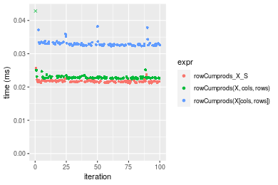
_Table: Benchmarking of colCumprods_X_S() and rowCumprods_X_S() on integer+100x100 data (original and transposed).  The top panel shows times in milliseconds and the bottom panel shows relative times._


|   |expr            |    min|      lq|     mean|  median|      uq|    max|
|:--|:---------------|------:|-------:|--------:|-------:|-------:|------:|
|1  |colCumprods_X_S | 16.131| 16.8715| 17.48373| 17.2830| 17.5105| 31.475|
|2  |rowCumprods_X_S | 21.156| 21.5115| 21.72580| 21.6515| 21.8565| 25.700|


|   |expr            |      min|      lq|    mean|   median|       uq|      max|
|:--|:---------------|--------:|-------:|-------:|--------:|--------:|--------:|
|1  |colCumprods_X_S | 1.000000| 1.00000| 1.00000| 1.000000| 1.000000| 1.000000|
|2  |rowCumprods_X_S | 1.311512| 1.27502| 1.24263| 1.252763| 1.248194| 0.816521|

_Figure: Benchmarking of colCumprods_X_S() and rowCumprods_X_S() on integer+100x100 data (original and transposed).  Outliers are displayed as crosses. Times are in milliseconds._


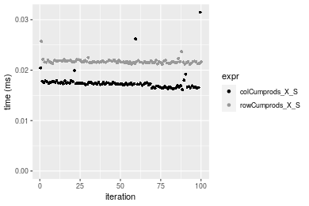

#### 1000x10 integer matrix

```r
> X <- data[["1000x10"]]
> rows <- sample.int(nrow(X), size = nrow(X) * 0.7)
> cols <- sample.int(ncol(X), size = ncol(X) * 0.7)
> X_S <- X[rows, cols]
> gc()
          used  (Mb) gc trigger  (Mb) max used  (Mb)
Ncells 5173344 276.3    7554717 403.5  7554717 403.5
Vcells 9069301  69.2   31793280 242.6 60508962 461.7
> colStats <- microbenchmark(colCumprods_X_S = colCumprods(X_S), `colCumprods(X, rows, cols)` = colCumprods(X, 
+     rows = rows, cols = cols), `colCumprods(X[rows, cols])` = colCumprods(X[rows, cols]), unit = "ms")
> X <- t(X)
> X_S <- t(X_S)
> gc()
          used  (Mb) gc trigger  (Mb) max used  (Mb)
Ncells 5173338 276.3    7554717 403.5  7554717 403.5
Vcells 9074384  69.3   31793280 242.6 60508962 461.7
> rowStats <- microbenchmark(rowCumprods_X_S = rowCumprods(X_S), `rowCumprods(X, cols, rows)` = rowCumprods(X, 
+     rows = cols, cols = rows), `rowCumprods(X[cols, rows])` = rowCumprods(X[cols, rows]), unit = "ms")
```

_Table: Benchmarking of colCumprods_X_S(), colCumprods(X, rows, cols)() and colCumprods(X[rows, cols])() on integer+1000x10 data. The top panel shows times in milliseconds and the bottom panel shows relative times._


|   |expr                       |      min|        lq|      mean|   median|        uq|      max|
|:--|:--------------------------|--------:|---------:|---------:|--------:|---------:|--------:|
|1  |colCumprods_X_S            | 0.016503| 0.0171980| 0.0174870| 0.017331| 0.0175435| 0.023125|
|2  |colCumprods(X, rows, cols) | 0.023921| 0.0250855| 0.0253754| 0.025219| 0.0255150| 0.030963|
|3  |colCumprods(X[rows, cols]) | 0.027649| 0.0289430| 0.0296823| 0.029136| 0.0295235| 0.058945|


|   |expr                       |      min|       lq|     mean|   median|       uq|      max|
|:--|:--------------------------|--------:|--------:|--------:|--------:|--------:|--------:|
|1  |colCumprods_X_S            | 1.000000| 1.000000| 1.000000| 1.000000| 1.000000| 1.000000|
|2  |colCumprods(X, rows, cols) | 1.449494| 1.458629| 1.451100| 1.455138| 1.454385| 1.338941|
|3  |colCumprods(X[rows, cols]) | 1.675392| 1.682928| 1.697393| 1.681149| 1.682874| 2.548973|

_Table: Benchmarking of rowCumprods_X_S(), rowCumprods(X, cols, rows)() and rowCumprods(X[cols, rows])() on integer+1000x10 data (transposed). The top panel shows times in milliseconds and the bottom panel shows relative times._


|   |expr                       |      min|        lq|      mean|    median|        uq|      max|
|:--|:--------------------------|--------:|---------:|---------:|---------:|---------:|--------:|
|1  |rowCumprods_X_S            | 0.021856| 0.0227740| 0.0244293| 0.0231350| 0.0236110| 0.078662|
|2  |rowCumprods(X, cols, rows) | 0.026106| 0.0274515| 0.0296599| 0.0280185| 0.0284595| 0.050124|
|3  |rowCumprods(X[cols, rows]) | 0.034895| 0.0362990| 0.0401554| 0.0370395| 0.0378785| 0.066064|


|   |expr                       |      min|       lq|     mean|   median|       uq|       max|
|:--|:--------------------------|--------:|--------:|--------:|--------:|--------:|---------:|
|1  |rowCumprods_X_S            | 1.000000| 1.000000| 1.000000| 1.000000| 1.000000| 1.0000000|
|2  |rowCumprods(X, cols, rows) | 1.194455| 1.205388| 1.214112| 1.211087| 1.205349| 0.6372073|
|3  |rowCumprods(X[cols, rows]) | 1.596587| 1.593879| 1.643743| 1.601016| 1.604273| 0.8398464|

_Figure: Benchmarking of colCumprods_X_S(), colCumprods(X, rows, cols)() and colCumprods(X[rows, cols])() on integer+1000x10 data  as well as rowCumprods_X_S(), rowCumprods(X, cols, rows)() and rowCumprods(X[cols, rows])() on the same data transposed.  Outliers are displayed as crosses.  Times are in milliseconds._


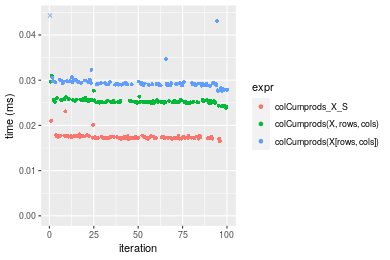

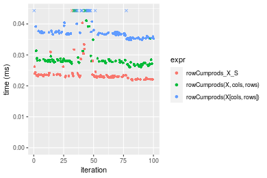
_Table: Benchmarking of colCumprods_X_S() and rowCumprods_X_S() on integer+1000x10 data (original and transposed).  The top panel shows times in milliseconds and the bottom panel shows relative times._


|   |expr            |    min|     lq|     mean| median|      uq|    max|
|:--|:---------------|------:|------:|--------:|------:|-------:|------:|
|1  |colCumprods_X_S | 16.503| 17.198| 17.48700| 17.331| 17.5435| 23.125|
|2  |rowCumprods_X_S | 21.856| 22.774| 24.42926| 23.135| 23.6110| 78.662|


|   |expr            |      min|       lq|     mean|   median|       uq|    max|
|:--|:---------------|--------:|--------:|--------:|--------:|--------:|------:|
|1  |colCumprods_X_S | 1.000000| 1.000000| 1.000000| 1.000000| 1.000000| 1.0000|
|2  |rowCumprods_X_S | 1.324365| 1.324224| 1.396996| 1.334891| 1.345855| 3.4016|

_Figure: Benchmarking of colCumprods_X_S() and rowCumprods_X_S() on integer+1000x10 data (original and transposed).  Outliers are displayed as crosses. Times are in milliseconds._


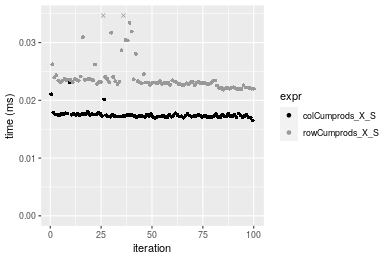

#### 10x1000 integer matrix

```r
> X <- data[["10x1000"]]
> rows <- sample.int(nrow(X), size = nrow(X) * 0.7)
> cols <- sample.int(ncol(X), size = ncol(X) * 0.7)
> X_S <- X[rows, cols]
> gc()
          used  (Mb) gc trigger  (Mb) max used  (Mb)
Ncells 5173549 276.3    7554717 403.5  7554717 403.5
Vcells 9070154  69.2   31793280 242.6 60508962 461.7
> colStats <- microbenchmark(colCumprods_X_S = colCumprods(X_S), `colCumprods(X, rows, cols)` = colCumprods(X, 
+     rows = rows, cols = cols), `colCumprods(X[rows, cols])` = colCumprods(X[rows, cols]), unit = "ms")
> X <- t(X)
> X_S <- t(X_S)
> gc()
          used  (Mb) gc trigger  (Mb) max used  (Mb)
Ncells 5173543 276.3    7554717 403.5  7554717 403.5
Vcells 9075237  69.3   31793280 242.6 60508962 461.7
> rowStats <- microbenchmark(rowCumprods_X_S = rowCumprods(X_S), `rowCumprods(X, cols, rows)` = rowCumprods(X, 
+     rows = cols, cols = rows), `rowCumprods(X[cols, rows])` = rowCumprods(X[cols, rows]), unit = "ms")
```

_Table: Benchmarking of colCumprods_X_S(), colCumprods(X, rows, cols)() and colCumprods(X[rows, cols])() on integer+10x1000 data. The top panel shows times in milliseconds and the bottom panel shows relative times._


|   |expr                       |      min|        lq|      mean|    median|        uq|      max|
|:--|:--------------------------|--------:|---------:|---------:|---------:|---------:|--------:|
|1  |colCumprods_X_S            | 0.018320| 0.0186195| 0.0208070| 0.0189510| 0.0199345| 0.107169|
|2  |colCumprods(X, rows, cols) | 0.026441| 0.0266980| 0.0280780| 0.0268810| 0.0273185| 0.069154|
|3  |colCumprods(X[rows, cols]) | 0.031911| 0.0322115| 0.0341228| 0.0324715| 0.0345945| 0.061288|


|   |expr                       |      min|       lq|     mean|   median|       uq|       max|
|:--|:--------------------------|--------:|--------:|--------:|--------:|--------:|---------:|
|1  |colCumprods_X_S            | 1.000000| 1.000000| 1.000000| 1.000000| 1.000000| 1.0000000|
|2  |colCumprods(X, rows, cols) | 1.443286| 1.433873| 1.349450| 1.418448| 1.370413| 0.6452799|
|3  |colCumprods(X[rows, cols]) | 1.741867| 1.729987| 1.639969| 1.713445| 1.735408| 0.5718818|

_Table: Benchmarking of rowCumprods_X_S(), rowCumprods(X, cols, rows)() and rowCumprods(X[cols, rows])() on integer+10x1000 data (transposed). The top panel shows times in milliseconds and the bottom panel shows relative times._


|   |expr                       |      min|        lq|      mean|    median|        uq|      max|
|:--|:--------------------------|--------:|---------:|---------:|---------:|---------:|--------:|
|1  |rowCumprods_X_S            | 0.019374| 0.0201845| 0.0206361| 0.0204110| 0.0205785| 0.033537|
|2  |rowCumprods(X, cols, rows) | 0.021572| 0.0227945| 0.0232438| 0.0229705| 0.0231850| 0.046179|
|3  |rowCumprods(X[cols, rows]) | 0.030810| 0.0321290| 0.0326617| 0.0323420| 0.0326355| 0.045945|


|   |expr                       |      min|       lq|     mean|   median|       uq|      max|
|:--|:--------------------------|--------:|--------:|--------:|--------:|--------:|--------:|
|1  |rowCumprods_X_S            | 1.000000| 1.000000| 1.000000| 1.000000| 1.000000| 1.000000|
|2  |rowCumprods(X, cols, rows) | 1.113451| 1.129307| 1.126367| 1.125398| 1.126661| 1.376957|
|3  |rowCumprods(X[cols, rows]) | 1.590276| 1.591766| 1.582745| 1.584538| 1.585903| 1.369979|

_Figure: Benchmarking of colCumprods_X_S(), colCumprods(X, rows, cols)() and colCumprods(X[rows, cols])() on integer+10x1000 data  as well as rowCumprods_X_S(), rowCumprods(X, cols, rows)() and rowCumprods(X[cols, rows])() on the same data transposed.  Outliers are displayed as crosses.  Times are in milliseconds._


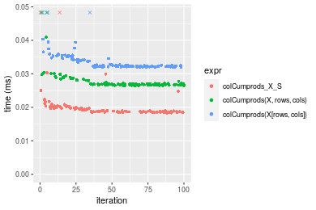

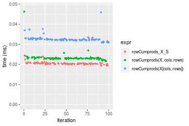
_Table: Benchmarking of colCumprods_X_S() and rowCumprods_X_S() on integer+10x1000 data (original and transposed).  The top panel shows times in milliseconds and the bottom panel shows relative times._


|   |expr            |    min|      lq|     mean| median|      uq|     max|
|:--|:---------------|------:|-------:|--------:|------:|-------:|-------:|
|1  |colCumprods_X_S | 18.320| 18.6195| 20.80696| 18.951| 19.9345| 107.169|
|2  |rowCumprods_X_S | 19.374| 20.1845| 20.63612| 20.411| 20.5785|  33.537|


|   |expr            |      min|       lq|      mean|   median|       uq|       max|
|:--|:---------------|--------:|--------:|---------:|--------:|--------:|---------:|
|1  |colCumprods_X_S | 1.000000| 1.000000| 1.0000000| 1.000000| 1.000000| 1.0000000|
|2  |rowCumprods_X_S | 1.057533| 1.084052| 0.9917893| 1.077041| 1.032306| 0.3129356|

_Figure: Benchmarking of colCumprods_X_S() and rowCumprods_X_S() on integer+10x1000 data (original and transposed).  Outliers are displayed as crosses. Times are in milliseconds._


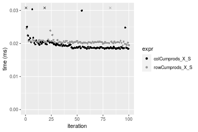

#### 100x1000 integer matrix

```r
> X <- data[["100x1000"]]
> rows <- sample.int(nrow(X), size = nrow(X) * 0.7)
> cols <- sample.int(ncol(X), size = ncol(X) * 0.7)
> X_S <- X[rows, cols]
> gc()
          used  (Mb) gc trigger  (Mb) max used  (Mb)
Ncells 5173759 276.4    7554717 403.5  7554717 403.5
Vcells 9092829  69.4   31793280 242.6 60508962 461.7
> colStats <- microbenchmark(colCumprods_X_S = colCumprods(X_S), `colCumprods(X, rows, cols)` = colCumprods(X, 
+     rows = rows, cols = cols), `colCumprods(X[rows, cols])` = colCumprods(X[rows, cols]), unit = "ms")
> X <- t(X)
> X_S <- t(X_S)
> gc()
          used  (Mb) gc trigger  (Mb) max used  (Mb)
Ncells 5173753 276.4    7554717 403.5  7554717 403.5
Vcells 9142912  69.8   31793280 242.6 60508962 461.7
> rowStats <- microbenchmark(rowCumprods_X_S = rowCumprods(X_S), `rowCumprods(X, cols, rows)` = rowCumprods(X, 
+     rows = cols, cols = rows), `rowCumprods(X[cols, rows])` = rowCumprods(X[cols, rows]), unit = "ms")
```

_Table: Benchmarking of colCumprods_X_S(), colCumprods(X, rows, cols)() and colCumprods(X[rows, cols])() on integer+100x1000 data. The top panel shows times in milliseconds and the bottom panel shows relative times._


|   |expr                       |      min|        lq|      mean|    median|        uq|      max|
|:--|:--------------------------|--------:|---------:|---------:|---------:|---------:|--------:|
|1  |colCumprods_X_S            | 0.096708| 0.1084280| 0.1205886| 0.1174495| 0.1324870| 0.171206|
|2  |colCumprods(X, rows, cols) | 0.143335| 0.1565195| 0.1749661| 0.1689490| 0.1915605| 0.277547|
|3  |colCumprods(X[rows, cols]) | 0.166840| 0.1872320| 0.2088830| 0.2057235| 0.2279630| 0.266592|


|   |expr                       |      min|       lq|     mean|   median|       uq|      max|
|:--|:--------------------------|--------:|--------:|--------:|--------:|--------:|--------:|
|1  |colCumprods_X_S            | 1.000000| 1.000000| 1.000000| 1.000000| 1.000000| 1.000000|
|2  |colCumprods(X, rows, cols) | 1.482142| 1.443534| 1.450934| 1.438482| 1.445882| 1.621129|
|3  |colCumprods(X[rows, cols]) | 1.725193| 1.726786| 1.732194| 1.751591| 1.720644| 1.557142|

_Table: Benchmarking of rowCumprods_X_S(), rowCumprods(X, cols, rows)() and rowCumprods(X[cols, rows])() on integer+100x1000 data (transposed). The top panel shows times in milliseconds and the bottom panel shows relative times._


|   |expr                       |      min|       lq|      mean|   median|        uq|      max|
|:--|:--------------------------|--------:|--------:|---------:|--------:|---------:|--------:|
|1  |rowCumprods_X_S            | 0.129135| 0.145701| 0.1581443| 0.151198| 0.1734030| 0.211433|
|2  |rowCumprods(X, cols, rows) | 0.133721| 0.146819| 0.1593663| 0.156201| 0.1684570| 0.257965|
|3  |rowCumprods(X[cols, rows]) | 0.200031| 0.219841| 0.2405873| 0.233601| 0.2591465| 0.307947|


|   |expr                       |      min|       lq|     mean|   median|        uq|      max|
|:--|:--------------------------|--------:|--------:|--------:|--------:|---------:|--------:|
|1  |rowCumprods_X_S            | 1.000000| 1.000000| 1.000000| 1.000000| 1.0000000| 1.000000|
|2  |rowCumprods(X, cols, rows) | 1.035513| 1.007673| 1.007727| 1.033089| 0.9714768| 1.220079|
|3  |rowCumprods(X[cols, rows]) | 1.549007| 1.508850| 1.521315| 1.545001| 1.4944753| 1.456476|

_Figure: Benchmarking of colCumprods_X_S(), colCumprods(X, rows, cols)() and colCumprods(X[rows, cols])() on integer+100x1000 data  as well as rowCumprods_X_S(), rowCumprods(X, cols, rows)() and rowCumprods(X[cols, rows])() on the same data transposed.  Outliers are displayed as crosses.  Times are in milliseconds._


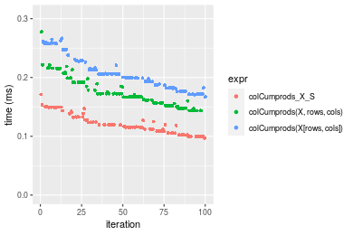

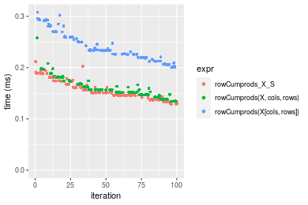
_Table: Benchmarking of colCumprods_X_S() and rowCumprods_X_S() on integer+100x1000 data (original and transposed).  The top panel shows times in milliseconds and the bottom panel shows relative times._


|   |expr            |     min|      lq|     mean|   median|      uq|     max|
|:--|:---------------|-------:|-------:|--------:|--------:|-------:|-------:|
|1  |colCumprods_X_S |  96.708| 108.428| 120.5886| 117.4495| 132.487| 171.206|
|2  |rowCumprods_X_S | 129.135| 145.701| 158.1443| 151.1980| 173.403| 211.433|


|   |expr            |      min|       lq|     mean|   median|      uq|      max|
|:--|:---------------|--------:|--------:|--------:|--------:|-------:|--------:|
|1  |colCumprods_X_S | 1.000000| 1.000000| 1.000000| 1.000000| 1.00000| 1.000000|
|2  |rowCumprods_X_S | 1.335308| 1.343758| 1.311436| 1.287345| 1.30883| 1.234963|

_Figure: Benchmarking of colCumprods_X_S() and rowCumprods_X_S() on integer+100x1000 data (original and transposed).  Outliers are displayed as crosses. Times are in milliseconds._


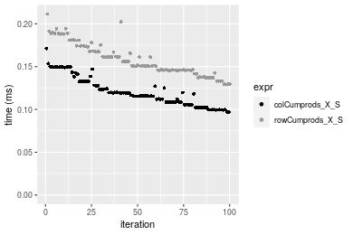

#### 1000x100 integer matrix

```r
> X <- data[["1000x100"]]
> rows <- sample.int(nrow(X), size = nrow(X) * 0.7)
> cols <- sample.int(ncol(X), size = ncol(X) * 0.7)
> X_S <- X[rows, cols]
> gc()
          used  (Mb) gc trigger  (Mb) max used  (Mb)
Ncells 5173972 276.4    7554717 403.5  7554717 403.5
Vcells 9093618  69.4   31793280 242.6 60508962 461.7
> colStats <- microbenchmark(colCumprods_X_S = colCumprods(X_S), `colCumprods(X, rows, cols)` = colCumprods(X, 
+     rows = rows, cols = cols), `colCumprods(X[rows, cols])` = colCumprods(X[rows, cols]), unit = "ms")
> X <- t(X)
> X_S <- t(X_S)
> gc()
          used  (Mb) gc trigger  (Mb) max used  (Mb)
Ncells 5173966 276.4    7554717 403.5  7554717 403.5
Vcells 9143701  69.8   31793280 242.6 60508962 461.7
> rowStats <- microbenchmark(rowCumprods_X_S = rowCumprods(X_S), `rowCumprods(X, cols, rows)` = rowCumprods(X, 
+     rows = cols, cols = rows), `rowCumprods(X[cols, rows])` = rowCumprods(X[cols, rows]), unit = "ms")
```

_Table: Benchmarking of colCumprods_X_S(), colCumprods(X, rows, cols)() and colCumprods(X[rows, cols])() on integer+1000x100 data. The top panel shows times in milliseconds and the bottom panel shows relative times._


|   |expr                       |      min|        lq|      mean|   median|        uq|      max|
|:--|:--------------------------|--------:|---------:|---------:|--------:|---------:|--------:|
|1  |colCumprods_X_S            | 0.096323| 0.1080620| 0.1187973| 0.115239| 0.1271965| 0.168558|
|2  |colCumprods(X, rows, cols) | 0.138580| 0.1568855| 0.1754715| 0.171174| 0.1846175| 0.237071|
|3  |colCumprods(X[rows, cols]) | 0.163522| 0.1836735| 0.2063309| 0.201498| 0.2290820| 0.309929|


|   |expr                       |      min|       lq|     mean|   median|       uq|      max|
|:--|:--------------------------|--------:|--------:|--------:|--------:|--------:|--------:|
|1  |colCumprods_X_S            | 1.000000| 1.000000| 1.000000| 1.000000| 1.000000| 1.000000|
|2  |colCumprods(X, rows, cols) | 1.438701| 1.451810| 1.477067| 1.485383| 1.451435| 1.406465|
|3  |colCumprods(X[rows, cols]) | 1.697642| 1.699705| 1.736832| 1.748523| 1.801009| 1.838708|

_Table: Benchmarking of rowCumprods_X_S(), rowCumprods(X, cols, rows)() and rowCumprods(X[cols, rows])() on integer+1000x100 data (transposed). The top panel shows times in milliseconds and the bottom panel shows relative times._


|   |expr                       |      min|        lq|      mean|    median|        uq|      max|
|:--|:--------------------------|--------:|---------:|---------:|---------:|---------:|--------:|
|1  |rowCumprods_X_S            | 0.116613| 0.1267550| 0.1474553| 0.1469335| 0.1598190| 0.200323|
|2  |rowCumprods(X, cols, rows) | 0.123727| 0.1419400| 0.1588332| 0.1560090| 0.1724580| 0.279191|
|3  |rowCumprods(X[cols, rows]) | 0.184207| 0.2033325| 0.2333592| 0.2284780| 0.2615385| 0.311366|


|   |expr                       |      min|       lq|     mean|   median|       uq|      max|
|:--|:--------------------------|--------:|--------:|--------:|--------:|--------:|--------:|
|1  |rowCumprods_X_S            | 1.000000| 1.000000| 1.000000| 1.000000| 1.000000| 1.000000|
|2  |rowCumprods(X, cols, rows) | 1.061005| 1.119798| 1.077162| 1.061766| 1.079083| 1.393704|
|3  |rowCumprods(X[cols, rows]) | 1.579644| 1.604138| 1.582576| 1.554976| 1.636467| 1.554320|

_Figure: Benchmarking of colCumprods_X_S(), colCumprods(X, rows, cols)() and colCumprods(X[rows, cols])() on integer+1000x100 data  as well as rowCumprods_X_S(), rowCumprods(X, cols, rows)() and rowCumprods(X[cols, rows])() on the same data transposed.  Outliers are displayed as crosses.  Times are in milliseconds._


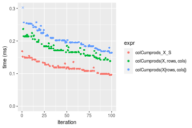

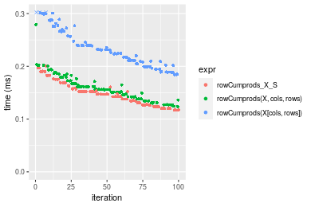
_Table: Benchmarking of colCumprods_X_S() and rowCumprods_X_S() on integer+1000x100 data (original and transposed).  The top panel shows times in milliseconds and the bottom panel shows relative times._


|   |expr            |     min|      lq|     mean|   median|       uq|     max|
|:--|:---------------|-------:|-------:|--------:|--------:|--------:|-------:|
|1  |colCumprods_X_S |  96.323| 108.062| 118.7973| 115.2390| 127.1965| 168.558|
|2  |rowCumprods_X_S | 116.613| 126.755| 147.4553| 146.9335| 159.8190| 200.323|


|   |expr            |      min|       lq|     mean|   median|       uq|      max|
|:--|:---------------|--------:|--------:|--------:|--------:|--------:|--------:|
|1  |colCumprods_X_S | 1.000000| 1.000000| 1.000000| 1.000000| 1.000000| 1.000000|
|2  |rowCumprods_X_S | 1.210645| 1.172984| 1.241235| 1.275033| 1.256473| 1.188451|

_Figure: Benchmarking of colCumprods_X_S() and rowCumprods_X_S() on integer+1000x100 data (original and transposed).  Outliers are displayed as crosses. Times are in milliseconds._


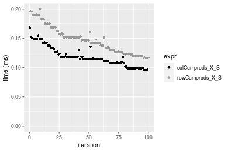


## Data type "double"

### Data
```r
> rmatrix <- function(nrow, ncol, mode = c("logical", "double", "integer", "index"), range = c(-100, 
+     +100), na_prob = 0) {
+     mode <- match.arg(mode)
+     n <- nrow * ncol
+     if (mode == "logical") {
+         x <- sample(c(FALSE, TRUE), size = n, replace = TRUE)
+     }     else if (mode == "index") {
+         x <- seq_len(n)
+         mode <- "integer"
+     }     else {
+         x <- runif(n, min = range[1], max = range[2])
+     }
+     storage.mode(x) <- mode
+     if (na_prob > 0) 
+         x[sample(n, size = na_prob * n)] <- NA
+     dim(x) <- c(nrow, ncol)
+     x
+ }
> rmatrices <- function(scale = 10, seed = 1, ...) {
+     set.seed(seed)
+     data <- list()
+     data[[1]] <- rmatrix(nrow = scale * 1, ncol = scale * 1, ...)
+     data[[2]] <- rmatrix(nrow = scale * 10, ncol = scale * 10, ...)
+     data[[3]] <- rmatrix(nrow = scale * 100, ncol = scale * 1, ...)
+     data[[4]] <- t(data[[3]])
+     data[[5]] <- rmatrix(nrow = scale * 10, ncol = scale * 100, ...)
+     data[[6]] <- t(data[[5]])
+     names(data) <- sapply(data, FUN = function(x) paste(dim(x), collapse = "x"))
+     data
+ }
> data <- rmatrices(mode = mode, range = c(-1, 1))
```

### Results

#### 10x10 double matrix

```r
> X <- data[["10x10"]]
> rows <- sample.int(nrow(X), size = nrow(X) * 0.7)
> cols <- sample.int(ncol(X), size = ncol(X) * 0.7)
> X_S <- X[rows, cols]
> gc()
          used  (Mb) gc trigger  (Mb) max used  (Mb)
Ncells 5174189 276.4    7554717 403.5  7554717 403.5
Vcells 9184731  70.1   31793280 242.6 60508962 461.7
> colStats <- microbenchmark(colCumprods_X_S = colCumprods(X_S), `colCumprods(X, rows, cols)` = colCumprods(X, 
+     rows = rows, cols = cols), `colCumprods(X[rows, cols])` = colCumprods(X[rows, cols]), unit = "ms")
> X <- t(X)
> X_S <- t(X_S)
> gc()
          used  (Mb) gc trigger  (Mb) max used  (Mb)
Ncells 5174174 276.4    7554717 403.5  7554717 403.5
Vcells 9184899  70.1   31793280 242.6 60508962 461.7
> rowStats <- microbenchmark(rowCumprods_X_S = rowCumprods(X_S), `rowCumprods(X, cols, rows)` = rowCumprods(X, 
+     rows = cols, cols = rows), `rowCumprods(X[cols, rows])` = rowCumprods(X[cols, rows]), unit = "ms")
```

_Table: Benchmarking of colCumprods_X_S(), colCumprods(X, rows, cols)() and colCumprods(X[rows, cols])() on double+10x10 data. The top panel shows times in milliseconds and the bottom panel shows relative times._


|   |expr                       |      min|        lq|      mean|    median|        uq|      max|
|:--|:--------------------------|--------:|---------:|---------:|---------:|---------:|--------:|
|1  |colCumprods_X_S            | 0.002230| 0.0023760| 0.0027044| 0.0024600| 0.0025685| 0.021653|
|2  |colCumprods(X, rows, cols) | 0.002547| 0.0027465| 0.0029207| 0.0028180| 0.0029555| 0.005603|
|3  |colCumprods(X[rows, cols]) | 0.003249| 0.0034860| 0.0037604| 0.0035955| 0.0037200| 0.012347|


|   |expr                       |      min|       lq|     mean|   median|       uq|       max|
|:--|:--------------------------|--------:|--------:|--------:|--------:|--------:|---------:|
|1  |colCumprods_X_S            | 1.000000| 1.000000| 1.000000| 1.000000| 1.000000| 1.0000000|
|2  |colCumprods(X, rows, cols) | 1.142152| 1.155934| 1.079982| 1.145528| 1.150672| 0.2587632|
|3  |colCumprods(X[rows, cols]) | 1.456951| 1.467172| 1.390501| 1.461585| 1.448316| 0.5702212|

_Table: Benchmarking of rowCumprods_X_S(), rowCumprods(X, cols, rows)() and rowCumprods(X[cols, rows])() on double+10x10 data (transposed). The top panel shows times in milliseconds and the bottom panel shows relative times._


|   |expr                       |      min|        lq|      mean|    median|        uq|      max|
|:--|:--------------------------|--------:|---------:|---------:|---------:|---------:|--------:|
|1  |rowCumprods_X_S            | 0.002290| 0.0024575| 0.0025931| 0.0025475| 0.0026485| 0.004766|
|2  |rowCumprods(X, cols, rows) | 0.002551| 0.0028010| 0.0030908| 0.0028725| 0.0029875| 0.020398|
|3  |rowCumprods(X[cols, rows]) | 0.003089| 0.0035680| 0.0037105| 0.0036735| 0.0037670| 0.006132|


|   |expr                       |      min|       lq|     mean|   median|       uq|      max|
|:--|:--------------------------|--------:|--------:|--------:|--------:|--------:|--------:|
|1  |rowCumprods_X_S            | 1.000000| 1.000000| 1.000000| 1.000000| 1.000000| 1.000000|
|2  |rowCumprods(X, cols, rows) | 1.113974| 1.139776| 1.191917| 1.127576| 1.127997| 4.279899|
|3  |rowCumprods(X[cols, rows]) | 1.348908| 1.451882| 1.430885| 1.442002| 1.422314| 1.286614|

_Figure: Benchmarking of colCumprods_X_S(), colCumprods(X, rows, cols)() and colCumprods(X[rows, cols])() on double+10x10 data  as well as rowCumprods_X_S(), rowCumprods(X, cols, rows)() and rowCumprods(X[cols, rows])() on the same data transposed.  Outliers are displayed as crosses.  Times are in milliseconds._


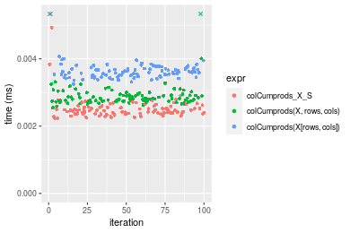


_Table: Benchmarking of colCumprods_X_S() and rowCumprods_X_S() on double+10x10 data (original and transposed).  The top panel shows times in milliseconds and the bottom panel shows relative times._


|   |expr            |  min|     lq|    mean| median|     uq|    max|
|:--|:---------------|----:|------:|-------:|------:|------:|------:|
|1  |colCumprods_X_S | 2.23| 2.3760| 2.70437| 2.4600| 2.5685| 21.653|
|2  |rowCumprods_X_S | 2.29| 2.4575| 2.59315| 2.5475| 2.6485|  4.766|


|   |expr            |      min|       lq|     mean|   median|       uq|       max|
|:--|:---------------|--------:|--------:|--------:|--------:|--------:|---------:|
|1  |colCumprods_X_S | 1.000000| 1.000000| 1.000000| 1.000000| 1.000000| 1.0000000|
|2  |rowCumprods_X_S | 1.026906| 1.034301| 0.958874| 1.035569| 1.031147| 0.2201081|

_Figure: Benchmarking of colCumprods_X_S() and rowCumprods_X_S() on double+10x10 data (original and transposed).  Outliers are displayed as crosses. Times are in milliseconds._


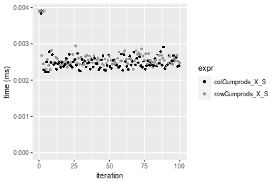

#### 100x100 double matrix

```r
> X <- data[["100x100"]]
> rows <- sample.int(nrow(X), size = nrow(X) * 0.7)
> cols <- sample.int(ncol(X), size = ncol(X) * 0.7)
> X_S <- X[rows, cols]
> gc()
          used  (Mb) gc trigger  (Mb) max used  (Mb)
Ncells 5174386 276.4    7554717 403.5  7554717 403.5
Vcells 9190692  70.2   31793280 242.6 60508962 461.7
> colStats <- microbenchmark(colCumprods_X_S = colCumprods(X_S), `colCumprods(X, rows, cols)` = colCumprods(X, 
+     rows = rows, cols = cols), `colCumprods(X[rows, cols])` = colCumprods(X[rows, cols]), unit = "ms")
> X <- t(X)
> X_S <- t(X_S)
> gc()
          used  (Mb) gc trigger  (Mb) max used  (Mb)
Ncells 5174380 276.4    7554717 403.5  7554717 403.5
Vcells 9200775  70.2   31793280 242.6 60508962 461.7
> rowStats <- microbenchmark(rowCumprods_X_S = rowCumprods(X_S), `rowCumprods(X, cols, rows)` = rowCumprods(X, 
+     rows = cols, cols = rows), `rowCumprods(X[cols, rows])` = rowCumprods(X[cols, rows]), unit = "ms")
```

_Table: Benchmarking of colCumprods_X_S(), colCumprods(X, rows, cols)() and colCumprods(X[rows, cols])() on double+100x100 data. The top panel shows times in milliseconds and the bottom panel shows relative times._


|   |expr                       |      min|        lq|      mean|    median|        uq|      max|
|:--|:--------------------------|--------:|---------:|---------:|---------:|---------:|--------:|
|1  |colCumprods_X_S            | 0.008135| 0.0085375| 0.0089332| 0.0089185| 0.0091900| 0.012139|
|2  |colCumprods(X, rows, cols) | 0.012823| 0.0134685| 0.0141413| 0.0138795| 0.0141290| 0.045443|
|3  |colCumprods(X[rows, cols]) | 0.023181| 0.0236860| 0.0248912| 0.0246265| 0.0248145| 0.050016|


|   |expr                       |      min|       lq|     mean|   median|       uq|      max|
|:--|:--------------------------|--------:|--------:|--------:|--------:|--------:|--------:|
|1  |colCumprods_X_S            | 1.000000| 1.000000| 1.000000| 1.000000| 1.000000| 1.000000|
|2  |colCumprods(X, rows, cols) | 1.576275| 1.577570| 1.583008| 1.556259| 1.537432| 3.743554|
|3  |colCumprods(X[rows, cols]) | 2.849539| 2.774348| 2.786383| 2.761283| 2.700163| 4.120273|

_Table: Benchmarking of rowCumprods_X_S(), rowCumprods(X, cols, rows)() and rowCumprods(X[cols, rows])() on double+100x100 data (transposed). The top panel shows times in milliseconds and the bottom panel shows relative times._


|   |expr                       |      min|        lq|      mean|   median|        uq|      max|
|:--|:--------------------------|--------:|---------:|---------:|--------:|---------:|--------:|
|1  |rowCumprods_X_S            | 0.006452| 0.0072550| 0.0081054| 0.008073| 0.0084585| 0.016226|
|2  |rowCumprods(X, cols, rows) | 0.012957| 0.0134745| 0.0140959| 0.013870| 0.0141910| 0.038853|
|3  |rowCumprods(X[cols, rows]) | 0.021755| 0.0222905| 0.0235574| 0.023610| 0.0240195| 0.038464|


|   |expr                       |      min|       lq|     mean|   median|       uq|      max|
|:--|:--------------------------|--------:|--------:|--------:|--------:|--------:|--------:|
|1  |rowCumprods_X_S            | 1.000000| 1.000000| 1.000000| 1.000000| 1.000000| 1.000000|
|2  |rowCumprods(X, cols, rows) | 2.008214| 1.857271| 1.739065| 1.718073| 1.677721| 2.394490|
|3  |rowCumprods(X[cols, rows]) | 3.371823| 3.072433| 2.906374| 2.924563| 2.839688| 2.370516|

_Figure: Benchmarking of colCumprods_X_S(), colCumprods(X, rows, cols)() and colCumprods(X[rows, cols])() on double+100x100 data  as well as rowCumprods_X_S(), rowCumprods(X, cols, rows)() and rowCumprods(X[cols, rows])() on the same data transposed.  Outliers are displayed as crosses.  Times are in milliseconds._


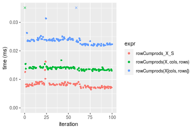
_Table: Benchmarking of colCumprods_X_S() and rowCumprods_X_S() on double+100x100 data (original and transposed).  The top panel shows times in milliseconds and the bottom panel shows relative times._


|   |expr            |   min|     lq|    mean| median|     uq|    max|
|:--|:---------------|-----:|------:|-------:|------:|------:|------:|
|2  |rowCumprods_X_S | 6.452| 7.2550| 8.10544| 8.0730| 8.4585| 16.226|
|1  |colCumprods_X_S | 8.135| 8.5375| 8.93317| 8.9185| 9.1900| 12.139|


|   |expr            |      min|       lq|    mean|   median|       uq|       max|
|:--|:---------------|--------:|--------:|-------:|--------:|--------:|---------:|
|2  |rowCumprods_X_S | 1.000000| 1.000000| 1.00000| 1.000000| 1.000000| 1.0000000|
|1  |colCumprods_X_S | 1.260849| 1.176775| 1.10212| 1.104732| 1.086481| 0.7481203|

_Figure: Benchmarking of colCumprods_X_S() and rowCumprods_X_S() on double+100x100 data (original and transposed).  Outliers are displayed as crosses. Times are in milliseconds._


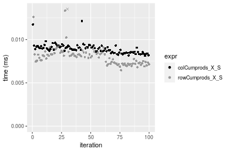

#### 1000x10 double matrix

```r
> X <- data[["1000x10"]]
> rows <- sample.int(nrow(X), size = nrow(X) * 0.7)
> cols <- sample.int(ncol(X), size = ncol(X) * 0.7)
> X_S <- X[rows, cols]
> gc()
          used  (Mb) gc trigger  (Mb) max used  (Mb)
Ncells 5174586 276.4    7554717 403.5  7554717 403.5
Vcells 9192107  70.2   31793280 242.6 60508962 461.7
> colStats <- microbenchmark(colCumprods_X_S = colCumprods(X_S), `colCumprods(X, rows, cols)` = colCumprods(X, 
+     rows = rows, cols = cols), `colCumprods(X[rows, cols])` = colCumprods(X[rows, cols]), unit = "ms")
> X <- t(X)
> X_S <- t(X_S)
> gc()
          used  (Mb) gc trigger  (Mb) max used  (Mb)
Ncells 5174580 276.4    7554717 403.5  7554717 403.5
Vcells 9202190  70.3   31793280 242.6 60508962 461.7
> rowStats <- microbenchmark(rowCumprods_X_S = rowCumprods(X_S), `rowCumprods(X, cols, rows)` = rowCumprods(X, 
+     rows = cols, cols = rows), `rowCumprods(X[cols, rows])` = rowCumprods(X[cols, rows]), unit = "ms")
```

_Table: Benchmarking of colCumprods_X_S(), colCumprods(X, rows, cols)() and colCumprods(X[rows, cols])() on double+1000x10 data. The top panel shows times in milliseconds and the bottom panel shows relative times._


|   |expr                       |      min|       lq|      mean|   median|        uq|      max|
|:--|:--------------------------|--------:|--------:|---------:|--------:|---------:|--------:|
|1  |colCumprods_X_S            | 0.011520| 0.012023| 0.0123192| 0.012199| 0.0124955| 0.017091|
|2  |colCumprods(X, rows, cols) | 0.015160| 0.015823| 0.0165790| 0.016211| 0.0165165| 0.031558|
|3  |colCumprods(X[rows, cols]) | 0.027036| 0.027422| 0.0289257| 0.028473| 0.0290125| 0.065636|


|   |expr                       |      min|       lq|     mean|   median|       uq|      max|
|:--|:--------------------------|--------:|--------:|--------:|--------:|--------:|--------:|
|1  |colCumprods_X_S            | 1.000000| 1.000000| 1.000000| 1.000000| 1.000000| 1.000000|
|2  |colCumprods(X, rows, cols) | 1.315972| 1.316061| 1.345778| 1.328879| 1.321796| 1.846469|
|3  |colCumprods(X[rows, cols]) | 2.346875| 2.280795| 2.348007| 2.334044| 2.321836| 3.840384|

_Table: Benchmarking of rowCumprods_X_S(), rowCumprods(X, cols, rows)() and rowCumprods(X[cols, rows])() on double+1000x10 data (transposed). The top panel shows times in milliseconds and the bottom panel shows relative times._


|   |expr                       |      min|        lq|      mean|    median|        uq|      max|
|:--|:--------------------------|--------:|---------:|---------:|---------:|---------:|--------:|
|1  |rowCumprods_X_S            | 0.010086| 0.0112955| 0.0118856| 0.0116790| 0.0120690| 0.026906|
|2  |rowCumprods(X, cols, rows) | 0.017373| 0.0184210| 0.0188351| 0.0189050| 0.0192280| 0.021259|
|3  |rowCumprods(X[cols, rows]) | 0.027924| 0.0299060| 0.0310543| 0.0305685| 0.0310565| 0.059099|


|   |expr                       |      min|       lq|     mean|   median|       uq|       max|
|:--|:--------------------------|--------:|--------:|--------:|--------:|--------:|---------:|
|1  |rowCumprods_X_S            | 1.000000| 1.000000| 1.000000| 1.000000| 1.000000| 1.0000000|
|2  |rowCumprods(X, cols, rows) | 1.722487| 1.630826| 1.584695| 1.618717| 1.593173| 0.7901212|
|3  |rowCumprods(X[cols, rows]) | 2.768590| 2.647603| 2.612757| 2.617390| 2.573246| 2.1964989|

_Figure: Benchmarking of colCumprods_X_S(), colCumprods(X, rows, cols)() and colCumprods(X[rows, cols])() on double+1000x10 data  as well as rowCumprods_X_S(), rowCumprods(X, cols, rows)() and rowCumprods(X[cols, rows])() on the same data transposed.  Outliers are displayed as crosses.  Times are in milliseconds._


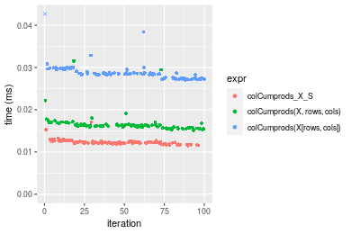

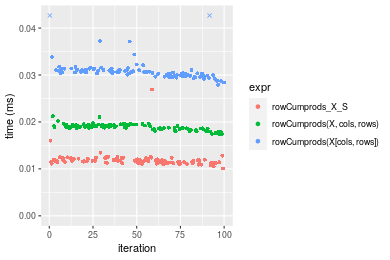
_Table: Benchmarking of colCumprods_X_S() and rowCumprods_X_S() on double+1000x10 data (original and transposed).  The top panel shows times in milliseconds and the bottom panel shows relative times._


|   |expr            |    min|      lq|     mean| median|      uq|    max|
|:--|:---------------|------:|-------:|--------:|------:|-------:|------:|
|2  |rowCumprods_X_S | 10.086| 11.2955| 11.88564| 11.679| 12.0690| 26.906|
|1  |colCumprods_X_S | 11.520| 12.0230| 12.31925| 12.199| 12.4955| 17.091|


|   |expr            |      min|       lq|     mean|   median|       uq|       max|
|:--|:---------------|--------:|--------:|--------:|--------:|--------:|---------:|
|2  |rowCumprods_X_S | 1.000000| 1.000000| 1.000000| 1.000000| 1.000000| 1.0000000|
|1  |colCumprods_X_S | 1.142177| 1.064406| 1.036482| 1.044524| 1.035338| 0.6352115|

_Figure: Benchmarking of colCumprods_X_S() and rowCumprods_X_S() on double+1000x10 data (original and transposed).  Outliers are displayed as crosses. Times are in milliseconds._


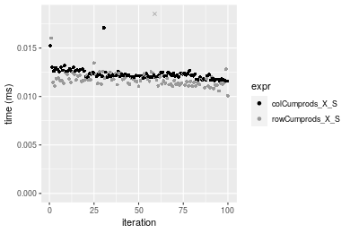

#### 10x1000 double matrix

```r
> X <- data[["10x1000"]]
> rows <- sample.int(nrow(X), size = nrow(X) * 0.7)
> cols <- sample.int(ncol(X), size = ncol(X) * 0.7)
> X_S <- X[rows, cols]
> gc()
          used  (Mb) gc trigger  (Mb) max used  (Mb)
Ncells 5174791 276.4    7554717 403.5  7554717 403.5
Vcells 9192243  70.2   31793280 242.6 60508962 461.7
> colStats <- microbenchmark(colCumprods_X_S = colCumprods(X_S), `colCumprods(X, rows, cols)` = colCumprods(X, 
+     rows = rows, cols = cols), `colCumprods(X[rows, cols])` = colCumprods(X[rows, cols]), unit = "ms")
> X <- t(X)
> X_S <- t(X_S)
> gc()
          used  (Mb) gc trigger  (Mb) max used  (Mb)
Ncells 5174785 276.4    7554717 403.5  7554717 403.5
Vcells 9202326  70.3   31793280 242.6 60508962 461.7
> rowStats <- microbenchmark(rowCumprods_X_S = rowCumprods(X_S), `rowCumprods(X, cols, rows)` = rowCumprods(X, 
+     rows = cols, cols = rows), `rowCumprods(X[cols, rows])` = rowCumprods(X[cols, rows]), unit = "ms")
```

_Table: Benchmarking of colCumprods_X_S(), colCumprods(X, rows, cols)() and colCumprods(X[rows, cols])() on double+10x1000 data. The top panel shows times in milliseconds and the bottom panel shows relative times._


|   |expr                       |      min|        lq|      mean|    median|        uq|      max|
|:--|:--------------------------|--------:|---------:|---------:|---------:|---------:|--------:|
|1  |colCumprods_X_S            | 0.007921| 0.0085070| 0.0090124| 0.0087900| 0.0090890| 0.027067|
|2  |colCumprods(X, rows, cols) | 0.015322| 0.0164210| 0.0168772| 0.0167575| 0.0170845| 0.035195|
|3  |colCumprods(X[rows, cols]) | 0.027071| 0.0284475| 0.0289010| 0.0286760| 0.0289000| 0.044006|


|   |expr                       |      min|       lq|     mean|   median|       uq|      max|
|:--|:--------------------------|--------:|--------:|--------:|--------:|--------:|--------:|
|1  |colCumprods_X_S            | 1.000000| 1.000000| 1.000000| 1.000000| 1.000000| 1.000000|
|2  |colCumprods(X, rows, cols) | 1.934352| 1.930293| 1.872658| 1.906428| 1.879690| 1.300292|
|3  |colCumprods(X[rows, cols]) | 3.417624| 3.344011| 3.206791| 3.262344| 3.179668| 1.625817|

_Table: Benchmarking of rowCumprods_X_S(), rowCumprods(X, cols, rows)() and rowCumprods(X[cols, rows])() on double+10x1000 data (transposed). The top panel shows times in milliseconds and the bottom panel shows relative times._


|   |expr                       |      min|        lq|      mean|    median|        uq|      max|
|:--|:--------------------------|--------:|---------:|---------:|---------:|---------:|--------:|
|1  |rowCumprods_X_S            | 0.006359| 0.0068870| 0.0074998| 0.0071970| 0.0079240| 0.013536|
|2  |rowCumprods(X, cols, rows) | 0.013207| 0.0136620| 0.0141955| 0.0138050| 0.0139380| 0.039693|
|3  |rowCumprods(X[cols, rows]) | 0.021382| 0.0218765| 0.0228478| 0.0225575| 0.0229935| 0.054483|


|   |expr                       |      min|       lq|     mean|   median|       uq|      max|
|:--|:--------------------------|--------:|--------:|--------:|--------:|--------:|--------:|
|1  |rowCumprods_X_S            | 1.000000| 1.000000| 1.000000| 1.000000| 1.000000| 1.000000|
|2  |rowCumprods(X, cols, rows) | 2.076899| 1.983737| 1.892785| 1.918160| 1.758960| 2.932402|
|3  |rowCumprods(X[cols, rows]) | 3.362478| 3.176492| 3.046461| 3.134292| 2.901754| 4.025044|

_Figure: Benchmarking of colCumprods_X_S(), colCumprods(X, rows, cols)() and colCumprods(X[rows, cols])() on double+10x1000 data  as well as rowCumprods_X_S(), rowCumprods(X, cols, rows)() and rowCumprods(X[cols, rows])() on the same data transposed.  Outliers are displayed as crosses.  Times are in milliseconds._


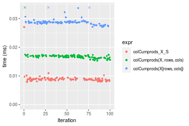

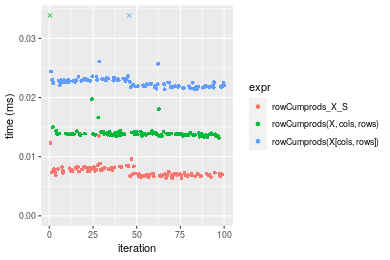
_Table: Benchmarking of colCumprods_X_S() and rowCumprods_X_S() on double+10x1000 data (original and transposed).  The top panel shows times in milliseconds and the bottom panel shows relative times._


|   |expr            |   min|    lq|    mean| median|    uq|    max|
|:--|:---------------|-----:|-----:|-------:|------:|-----:|------:|
|2  |rowCumprods_X_S | 6.359| 6.887| 7.49978|  7.197| 7.924| 13.536|
|1  |colCumprods_X_S | 7.921| 8.507| 9.01242|  8.790| 9.089| 27.067|


|   |expr            |      min|       lq|     mean|   median|       uq|      max|
|:--|:---------------|--------:|--------:|--------:|--------:|--------:|--------:|
|2  |rowCumprods_X_S | 1.000000| 1.000000| 1.000000| 1.000000| 1.000000| 1.000000|
|1  |colCumprods_X_S | 1.245636| 1.235226| 1.201691| 1.221342| 1.147022| 1.999631|

_Figure: Benchmarking of colCumprods_X_S() and rowCumprods_X_S() on double+10x1000 data (original and transposed).  Outliers are displayed as crosses. Times are in milliseconds._


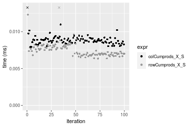

#### 100x1000 double matrix

```r
> X <- data[["100x1000"]]
> rows <- sample.int(nrow(X), size = nrow(X) * 0.7)
> cols <- sample.int(ncol(X), size = ncol(X) * 0.7)
> X_S <- X[rows, cols]
> gc()
          used  (Mb) gc trigger  (Mb) max used  (Mb)
Ncells 5175001 276.4    7554717 403.5  7554717 403.5
Vcells 9237710  70.5   31793280 242.6 60508962 461.7
> colStats <- microbenchmark(colCumprods_X_S = colCumprods(X_S), `colCumprods(X, rows, cols)` = colCumprods(X, 
+     rows = rows, cols = cols), `colCumprods(X[rows, cols])` = colCumprods(X[rows, cols]), unit = "ms")
> X <- t(X)
> X_S <- t(X_S)
> gc()
          used  (Mb) gc trigger  (Mb) max used  (Mb)
Ncells 5174995 276.4    7554717 403.5  7554717 403.5
Vcells 9337793  71.3   31793280 242.6 60508962 461.7
> rowStats <- microbenchmark(rowCumprods_X_S = rowCumprods(X_S), `rowCumprods(X, cols, rows)` = rowCumprods(X, 
+     rows = cols, cols = rows), `rowCumprods(X[cols, rows])` = rowCumprods(X[cols, rows]), unit = "ms")
```

_Table: Benchmarking of colCumprods_X_S(), colCumprods(X, rows, cols)() and colCumprods(X[rows, cols])() on double+100x1000 data. The top panel shows times in milliseconds and the bottom panel shows relative times._


|   |expr                       |      min|        lq|      mean|    median|        uq|      max|
|:--|:--------------------------|--------:|---------:|---------:|---------:|---------:|--------:|
|1  |colCumprods_X_S            | 0.049750| 0.0515340| 0.0566747| 0.0537740| 0.0591040| 0.099834|
|2  |colCumprods(X, rows, cols) | 0.088908| 0.0926170| 0.1024668| 0.0956395| 0.1084060| 0.218308|
|3  |colCumprods(X[rows, cols]) | 0.167818| 0.1749045| 0.1914197| 0.1865680| 0.1993435| 0.233839|


|   |expr                       |      min|       lq|     mean|   median|       uq|      max|
|:--|:--------------------------|--------:|--------:|--------:|--------:|--------:|--------:|
|1  |colCumprods_X_S            | 1.000000| 1.000000| 1.000000| 1.000000| 1.000000| 1.000000|
|2  |colCumprods(X, rows, cols) | 1.787095| 1.797202| 1.807982| 1.778545| 1.834157| 2.186710|
|3  |colCumprods(X[rows, cols]) | 3.373226| 3.393963| 3.377519| 3.469483| 3.372758| 2.342278|

_Table: Benchmarking of rowCumprods_X_S(), rowCumprods(X, cols, rows)() and rowCumprods(X[cols, rows])() on double+100x1000 data (transposed). The top panel shows times in milliseconds and the bottom panel shows relative times._


|   |expr                       |      min|        lq|      mean|    median|        uq|      max|
|:--|:--------------------------|--------:|---------:|---------:|---------:|---------:|--------:|
|1  |rowCumprods_X_S            | 0.040055| 0.0420895| 0.0455634| 0.0440675| 0.0472515| 0.086605|
|2  |rowCumprods(X, cols, rows) | 0.088221| 0.0889875| 0.0980324| 0.0917585| 0.1050765| 0.208143|
|3  |rowCumprods(X[cols, rows]) | 0.161288| 0.1674965| 0.1804802| 0.1737190| 0.1902125| 0.268273|


|   |expr                       |      min|       lq|     mean|   median|       uq|      max|
|:--|:--------------------------|--------:|--------:|--------:|--------:|--------:|--------:|
|1  |rowCumprods_X_S            | 1.000000| 1.000000| 1.000000| 1.000000| 1.000000| 1.000000|
|2  |rowCumprods(X, cols, rows) | 2.202497| 2.114245| 2.151560| 2.082226| 2.223771| 2.403360|
|3  |rowCumprods(X[cols, rows]) | 4.026663| 3.979532| 3.961078| 3.942112| 4.025534| 3.097662|

_Figure: Benchmarking of colCumprods_X_S(), colCumprods(X, rows, cols)() and colCumprods(X[rows, cols])() on double+100x1000 data  as well as rowCumprods_X_S(), rowCumprods(X, cols, rows)() and rowCumprods(X[cols, rows])() on the same data transposed.  Outliers are displayed as crosses.  Times are in milliseconds._


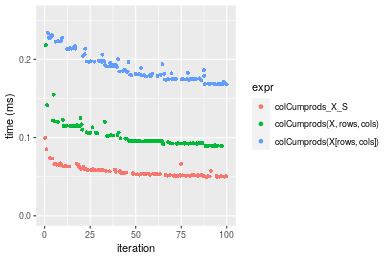

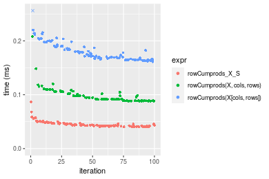
_Table: Benchmarking of colCumprods_X_S() and rowCumprods_X_S() on double+100x1000 data (original and transposed).  The top panel shows times in milliseconds and the bottom panel shows relative times._


|   |expr            |    min|      lq|     mean|  median|      uq|    max|
|:--|:---------------|------:|-------:|--------:|-------:|-------:|------:|
|2  |rowCumprods_X_S | 40.055| 42.0895| 45.56341| 44.0675| 47.2515| 86.605|
|1  |colCumprods_X_S | 49.750| 51.5340| 56.67466| 53.7740| 59.1040| 99.834|


|   |expr            |      min|       lq|     mean|   median|       uq|      max|
|:--|:---------------|--------:|--------:|--------:|--------:|--------:|--------:|
|2  |rowCumprods_X_S | 1.000000| 1.000000| 1.000000| 1.000000| 1.000000| 1.000000|
|1  |colCumprods_X_S | 1.242042| 1.224391| 1.243863| 1.220264| 1.250839| 1.152751|

_Figure: Benchmarking of colCumprods_X_S() and rowCumprods_X_S() on double+100x1000 data (original and transposed).  Outliers are displayed as crosses. Times are in milliseconds._


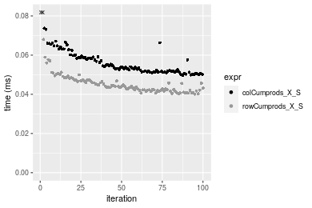

#### 1000x100 double matrix

```r
> X <- data[["1000x100"]]
> rows <- sample.int(nrow(X), size = nrow(X) * 0.7)
> cols <- sample.int(ncol(X), size = ncol(X) * 0.7)
> X_S <- X[rows, cols]
> gc()
          used  (Mb) gc trigger  (Mb) max used  (Mb)
Ncells 5175214 276.4    7554717 403.5  7554717 403.5
Vcells 9237854  70.5   31793280 242.6 60508962 461.7
> colStats <- microbenchmark(colCumprods_X_S = colCumprods(X_S), `colCumprods(X, rows, cols)` = colCumprods(X, 
+     rows = rows, cols = cols), `colCumprods(X[rows, cols])` = colCumprods(X[rows, cols]), unit = "ms")
> X <- t(X)
> X_S <- t(X_S)
> gc()
          used  (Mb) gc trigger  (Mb) max used  (Mb)
Ncells 5175208 276.4    7554717 403.5  7554717 403.5
Vcells 9337937  71.3   31793280 242.6 60508962 461.7
> rowStats <- microbenchmark(rowCumprods_X_S = rowCumprods(X_S), `rowCumprods(X, cols, rows)` = rowCumprods(X, 
+     rows = cols, cols = rows), `rowCumprods(X[cols, rows])` = rowCumprods(X[cols, rows]), unit = "ms")
```

_Table: Benchmarking of colCumprods_X_S(), colCumprods(X, rows, cols)() and colCumprods(X[rows, cols])() on double+1000x100 data. The top panel shows times in milliseconds and the bottom panel shows relative times._


|   |expr                       |      min|        lq|      mean|    median|       uq|      max|
|:--|:--------------------------|--------:|---------:|---------:|---------:|--------:|--------:|
|1  |colCumprods_X_S            | 0.074989| 0.0793225| 0.0855038| 0.0820915| 0.087791| 0.136627|
|2  |colCumprods(X, rows, cols) | 0.095038| 0.1014080| 0.1086547| 0.1048695| 0.111228| 0.198301|
|3  |colCumprods(X[rows, cols]) | 0.186539| 0.1982765| 0.2135418| 0.2052965| 0.224419| 0.392720|


|   |expr                       |      min|       lq|     mean|   median|       uq|      max|
|:--|:--------------------------|--------:|--------:|--------:|--------:|--------:|--------:|
|1  |colCumprods_X_S            | 1.000000| 1.000000| 1.000000| 1.000000| 1.000000| 1.000000|
|2  |colCumprods(X, rows, cols) | 1.267359| 1.278427| 1.270758| 1.277471| 1.266964| 1.451404|
|3  |colCumprods(X[rows, cols]) | 2.487551| 2.499625| 2.497453| 2.500825| 2.556287| 2.874395|

_Table: Benchmarking of rowCumprods_X_S(), rowCumprods(X, cols, rows)() and rowCumprods(X[cols, rows])() on double+1000x100 data (transposed). The top panel shows times in milliseconds and the bottom panel shows relative times._


|   |expr                       |      min|        lq|      mean|    median|        uq|      max|
|:--|:--------------------------|--------:|---------:|---------:|---------:|---------:|--------:|
|1  |rowCumprods_X_S            | 0.054154| 0.0563245| 0.0626709| 0.0594945| 0.0671605| 0.114555|
|2  |rowCumprods(X, cols, rows) | 0.103422| 0.1106470| 0.1229720| 0.1188035| 0.1335445| 0.254319|
|3  |rowCumprods(X[cols, rows]) | 0.177426| 0.1845000| 0.2012699| 0.1929745| 0.2202730| 0.256607|


|   |expr                       |      min|       lq|     mean|   median|       uq|      max|
|:--|:--------------------------|--------:|--------:|--------:|--------:|--------:|--------:|
|1  |rowCumprods_X_S            | 1.000000| 1.000000| 1.000000| 1.000000| 1.000000| 1.000000|
|2  |rowCumprods(X, cols, rows) | 1.909776| 1.964456| 1.962185| 1.996882| 1.988438| 2.220060|
|3  |rowCumprods(X[cols, rows]) | 3.276323| 3.275662| 3.211536| 3.243569| 3.279800| 2.240033|

_Figure: Benchmarking of colCumprods_X_S(), colCumprods(X, rows, cols)() and colCumprods(X[rows, cols])() on double+1000x100 data  as well as rowCumprods_X_S(), rowCumprods(X, cols, rows)() and rowCumprods(X[cols, rows])() on the same data transposed.  Outliers are displayed as crosses.  Times are in milliseconds._


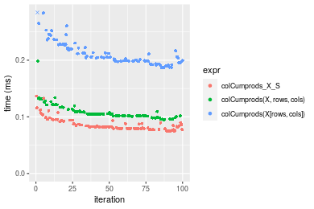


_Table: Benchmarking of colCumprods_X_S() and rowCumprods_X_S() on double+1000x100 data (original and transposed).  The top panel shows times in milliseconds and the bottom panel shows relative times._


|   |expr            |    min|      lq|     mean|  median|      uq|     max|
|:--|:---------------|------:|-------:|--------:|-------:|-------:|-------:|
|2  |rowCumprods_X_S | 54.154| 56.3245| 62.67092| 59.4945| 67.1605| 114.555|
|1  |colCumprods_X_S | 74.989| 79.3225| 85.50384| 82.0915| 87.7910| 136.627|


|   |expr            |      min|       lq|    mean|   median|       uq|      max|
|:--|:---------------|--------:|--------:|-------:|--------:|--------:|--------:|
|2  |rowCumprods_X_S | 1.000000| 1.000000| 1.00000| 1.000000| 1.000000| 1.000000|
|1  |colCumprods_X_S | 1.384736| 1.408313| 1.36433| 1.379817| 1.307182| 1.192676|

_Figure: Benchmarking of colCumprods_X_S() and rowCumprods_X_S() on double+1000x100 data (original and transposed).  Outliers are displayed as crosses. Times are in milliseconds._


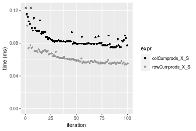


## Appendix

### Session information
```r
R version 4.1.1 Patched (2021-08-10 r80727)
Platform: x86_64-pc-linux-gnu (64-bit)
Running under: Ubuntu 18.04.5 LTS

Matrix products: default
BLAS:   /home/hb/software/R-devel/R-4-1-branch/lib/R/lib/libRblas.so
LAPACK: /home/hb/software/R-devel/R-4-1-branch/lib/R/lib/libRlapack.so

locale:
 [1] LC_CTYPE=en_US.UTF-8       LC_NUMERIC=C              
 [3] LC_TIME=en_US.UTF-8        LC_COLLATE=en_US.UTF-8    
 [5] LC_MONETARY=en_US.UTF-8    LC_MESSAGES=en_US.UTF-8   
 [7] LC_PAPER=en_US.UTF-8       LC_NAME=C                 
 [9] LC_ADDRESS=C               LC_TELEPHONE=C            
[11] LC_MEASUREMENT=en_US.UTF-8 LC_IDENTIFICATION=C       

attached base packages:
[1] stats     graphics  grDevices utils     datasets  methods   base     

other attached packages:
[1] microbenchmark_1.4-7   matrixStats_0.60.0     ggplot2_3.3.5         
[4] knitr_1.33             R.devices_2.17.0       R.utils_2.10.1        
[7] R.oo_1.24.0            R.methodsS3_1.8.1-9001

loaded via a namespace (and not attached):
 [1] Biobase_2.52.0          httr_1.4.2              splines_4.1.1          
 [4] bit64_4.0.5             network_1.17.1          assertthat_0.2.1       
 [7] highr_0.9               stats4_4.1.1            blob_1.2.2             
[10] GenomeInfoDbData_1.2.6  robustbase_0.93-8       pillar_1.6.2           
[13] RSQLite_2.2.8           lattice_0.20-44         glue_1.4.2             
[16] digest_0.6.27           XVector_0.32.0          colorspace_2.0-2       
[19] Matrix_1.3-4            XML_3.99-0.7            pkgconfig_2.0.3        
[22] zlibbioc_1.38.0         genefilter_1.74.0       purrr_0.3.4            
[25] ergm_4.1.2              xtable_1.8-4            scales_1.1.1           
[28] tibble_3.1.4            annotate_1.70.0         KEGGREST_1.32.0        
[31] farver_2.1.0            generics_0.1.0          IRanges_2.26.0         
[34] ellipsis_0.3.2          cachem_1.0.6            withr_2.4.2            
[37] BiocGenerics_0.38.0     mime_0.11               survival_3.2-13        
[40] magrittr_2.0.1          crayon_1.4.1            statnet.common_4.5.0   
[43] memoise_2.0.0           laeken_0.5.1            fansi_0.5.0            
[46] R.cache_0.15.0          MASS_7.3-54             R.rsp_0.44.0           
[49] tools_4.1.1             lifecycle_1.0.0         S4Vectors_0.30.0       
[52] trust_0.1-8             munsell_0.5.0           AnnotationDbi_1.54.1   
[55] Biostrings_2.60.2       compiler_4.1.1          GenomeInfoDb_1.28.1    
[58] rlang_0.4.11            grid_4.1.1              RCurl_1.98-1.4         
[61] cwhmisc_6.6             rappdirs_0.3.3          labeling_0.4.2         
[64] bitops_1.0-7            base64enc_0.1-3         boot_1.3-28            
[67] gtable_0.3.0            DBI_1.1.1               markdown_1.1           
[70] R6_2.5.1                lpSolveAPI_5.5.2.0-17.7 rle_0.9.2              
[73] dplyr_1.0.7             fastmap_1.1.0           bit_4.0.4              
[76] utf8_1.2.2              parallel_4.1.1          Rcpp_1.0.7             
[79] vctrs_0.3.8             png_0.1-7               DEoptimR_1.0-9         
[82] tidyselect_1.1.1        xfun_0.25               coda_0.19-4            
```
Total processing time was 22.95 secs.


### Reproducibility
To reproduce this report, do:
```r
html <- matrixStats:::benchmark('colRowCumprods_subset')
```

[RSP]: https://cran.r-project.org/package=R.rsp
[matrixStats]: https://cran.r-project.org/package=matrixStats

[StackOverflow:colMins?]: https://stackoverflow.com/questions/13676878 "Stack Overflow: fastest way to get Min from every column in a matrix?"
[StackOverflow:colSds?]: https://stackoverflow.com/questions/17549762 "Stack Overflow: Is there such 'colsd' in R?"
[StackOverflow:rowProds?]: https://stackoverflow.com/questions/20198801/ "Stack Overflow: Row product of matrix and column sum of matrix"

---------------------------------------
Copyright Dongcan Jiang. Last updated on 2021-08-25 17:38:11 (+0200 UTC). Powered by [RSP].

<script>
 var link = document.createElement('link');
 link.rel = 'icon';
 link.href = "data:image/png;base64,iVBORw0KGgoAAAANSUhEUgAAACAAAAAgCAMAAABEpIrGAAAA21BMVEUAAAAAAP8AAP8AAP8AAP8AAP8AAP8AAP8AAP8AAP8AAP8AAP8AAP8AAP8AAP8AAP8AAP8AAP8AAP8AAP8AAP8AAP8AAP8AAP8AAP8AAP8AAP8AAP8AAP8AAP8AAP8AAP8AAP8AAP8AAP8AAP8AAP8AAP8AAP8AAP8AAP8AAP8BAf4CAv0DA/wdHeIeHuEfH+AgIN8hId4lJdomJtknJ9g+PsE/P8BAQL9yco10dIt1dYp3d4h4eIeVlWqWlmmXl2iYmGeZmWabm2Tn5xjo6Bfp6Rb39wj4+Af//wA2M9hbAAAASXRSTlMAAQIJCgsMJSYnKD4/QGRlZmhpamtsbautrrCxuru8y8zN5ebn6Pn6+///////////////////////////////////////////LsUNcQAAAS9JREFUOI29k21XgkAQhVcFytdSMqMETU26UVqGmpaiFbL//xc1cAhhwVNf6n5i5z67M2dmYOyfJZUqlVLhkKucG7cgmUZTybDz6g0iDeq51PUr37Ds2cy2/C9NeES5puDjxuUk1xnToZsg8pfA3avHQ3lLIi7iWRrkv/OYtkScxBIMgDee0ALoyxHQBJ68JLCjOtQIMIANF7QG9G9fNnHvisCHBVMKgSJgiz7nE+AoBKrAPA3MgepvgR9TSCasrCKH0eB1wBGBFdCO+nAGjMVGPcQb5bd6mQRegN6+1axOs9nGfYcCtfi4NQosdtH7dB+txFIpXQqN1p9B/asRHToyS0jRgpV7nk4nwcq1BJ+x3Gl/v7S9Wmpp/aGquum7w3ZDyrADFYrl8vHBH+ev9AUASW1dmU4h4wAAAABJRU5ErkJggg=="
 document.getElementsByTagName('head')[0].appendChild(link);
</script>


